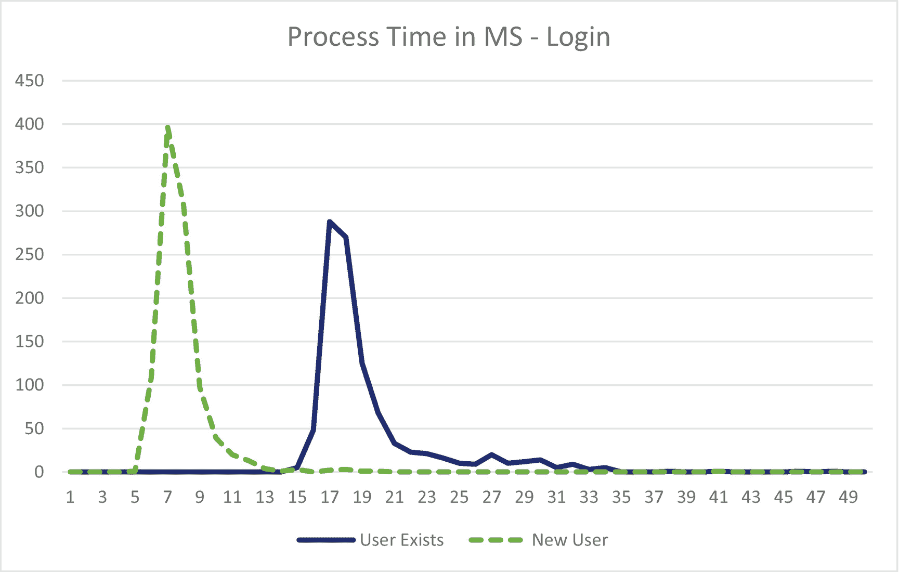

# 二、一般安全概念

既然我们已经讨论了 ASP.NET Core，那么就有必要花时间来讨论一些安全相关的主题，这些主题包含在大多数安全课程中，但不幸的是，在大多数软件开发培训材料中却被忽略了。我将强调这些概念最适用于软件开发人员的领域，而不会深入探究对网站仍然重要的其他安全领域，如网络或物理(即，任何人都可以访问我的服务器吗？)安全。不幸的是，这一章不会有太多的内容——除了我们将在本书后面更深入探讨的安全概念之外，这些概念没有必然的联系。

请不要跳过这一章。它是高层次的，起初可能看起来不直接适用于开发软件，但是我们将为本书后面涉及的概念打下基础。

## 什么是安全？(中情局三联)

乍一看，问题“什么是安全？”似乎有一个显而易见的答案:阻止犯罪分子闯入你的软件系统窃取或破坏数据。但是，根据大多数定义，阻止犯罪分子通过向您的服务器发送大量请求来破坏您的网站，也属于安全范畴。阻止流氓员工窃取或删除数据也属于大多数人对安全的定义。如果出于好意的员工不小心泄露、损坏或删除了数据，该如何阻止他们呢？

大多数专业人士接受的安全定义是，安全的工作是保护您系统的机密性、完整性和可用性，也称为“中央情报局三元组”， <sup>[1](#Fn1)</sup> ，无论犯罪意图如何。(有一个运动把它重新命名为“AIC 三合会”，以避免与中央情报局混淆，但它的意思是一样的。)让我们更详细地检查一下这些组件。

### 机密

当大多数软件开发人员谈论“安全性”时，他们最关心的往往是保护机密性。我们希望保持私人谈话的私密性，这一点对所有参与者来说都是显而易见的。作为一名 web 开发人员，您应该已经熟悉了以下保护机密性的示例:

*   在系统中设置角色，以确保低权限用户看不到像管理员这样的高权限用户可以看到的敏感信息。

*   设置证书以使用 HTTPS 可以防止黑客坐在用户电脑和服务器之间偷听对话。

*   加密数据，如护照号或信用卡号，以防止黑客在侵入您的系统时窃取您的数据。

如果这是一本面向安全专业人员而不是软件开发人员的书，我也会涵盖诸如保护您的服务器免遭数据窃取或如何保护入侵者不看到写在白板上的敏感信息等主题，但这些都超出了大多数软件开发人员的范围。

### 完整

防止黑客改变你的数据也是一个非常重要的，但是经常被忽视的安全方面。为了了解保护完整性的重要性，让我们在一个假设的电子商务网站中演示一个非常真实的问题，在这个网站中，完整性不受保护:

1.  一名黑客访问了一个电子商务网站，并在他们的购物车中添加了一件商品。

2.  黑客继续通过结帐过程到达确认订单的页面。

3.  为了保护用户免受价格波动的影响，开发人员将商品添加到购物车时的价格存储在一个隐藏字段中。

4.  黑客注意到隐藏字段中存储的价格，于是修改价格并提交订单。

5.  黑客现在可以以任何价格订购他们想要的任何产品(可能包括负价格，这意味着卖方将付钱给黑客“购买”产品)。

大多数电子商务网站已经解决了这个特殊的问题，但根据我的经验，大多数网站在保护数据完整性方面可以做得更好。除了在电子商务应用中保护价格之外，大多数网站还可以在以下几个方面提高其完整性保护:

*   如果用户在电子商务网站或求职申请中提交类似订单的信息，我们如何确定没有人篡改过这些数据？

*   如果用户登录系统输入要在页面上显示的文本，就像您使用内容管理系统(CMS)一样，我们如何确保没有人篡改这些信息，从而防止网站损坏？

*   如果我们通过 API 将数据从一台服务器发送到另一台服务器，我们如何确保从服务器 A 发送的数据安全到达服务器 B？

幸运的是，数据完整性比乍看上去想象的更容易检查。你会在本书后面看到。

### 有效

大多数开发人员可能会同意，保护您的网站免受拒绝服务(DoS)攻击(当攻击者向 web 服务器发送足够多的请求，使其无法响应“真正的”请求)和分布式拒绝服务攻击(当攻击者从许多不同的来源发送请求，以阻止网络阻止一个 IP 来停止攻击)属于“安全”范畴。但是，进行适当的备份并测试其有效性在很大程度上是安全部门的责任，因为如果出现问题，它会直接影响网站的可用性。

在本书中，我通常会更关注保密性和完整性，而不是可用性，因为大多数针对网站可用性的攻击的防御措施都超出了普通软件开发人员的职责范围。然而，有一件事值得注意。正如您稍后将看到的，帮助保护数据的机密性或完整性可能会损害可用性，因为保护机密性和完整性会导致额外的处理，使网站更容易受到针对可用性的某些类型的攻击。对于一些开发人员来说，以提高可用性的高效处理的名义跳过保护是很有诱惑力的。在许多情况下，这是错误的方法。一个特性导致与可用性相关的严重漏洞是很罕见的(尽管并非闻所未闻，您将在后面看到)，因此通常最好关注机密性和完整性，并在出现可用性问题时修复它们。

换句话说，在大多数情况下，专注于机密性和完整性比以获得几毫秒性能的名义跳过保护更好。

### “黑客”的定义

当我们定义“安全”的含义时，现在让我们花点时间明确说明本书将如何使用“黑客”这个词，以及明确说明我们所说的黑客造成“损害”的含义当你听说黑客破坏你的网站时，很容易想象黑客闯入你的系统，让你的网站出售令人讨厌的产品。但是，我们应该打电话给那些因为你的网站存在逻辑缺陷而意外获取了他们不需要的信息的人吗？还是应该称被盗信用卡为“损害”？

出于本书的考虑，让我们将“黑客”定义为任何试图破坏网站数据的机密性、完整性或可用性的人，无论是否怀有恶意。我们还将使用“违规”一词来描述任何危及您网站的机密性、完整性或可用性的事件。最后，我们将使用“损害”作为任何负面影响的简写，即使这只是对您声誉的损害，因为没有发生具体的金钱损失。

## 对一次攻击的剖析

除非你学过安全，否则你可能不知道网络攻击是什么样子。很容易想象一个电脑黑客对一个电脑系统施展他们的魔法，但是大多数黑客在侵入系统时都采用类似的过程。根据来源的不同，这些步骤的名称会有所不同，但实际内容是相似的。了解这一过程将有助于您建立防御机制，因为正如我们在关于分层安全的章节中所讨论的，您的目标不仅仅是防止黑客进入您的系统，还要帮助防止他们一旦进入就能够造成损害。

### 侦察

如果你想构建成功的软件，你可能不会从写代码开始。你将研究你的目标受众，他们的需求，可能会创建一个预算和项目计划等。攻击是相似的，尽管公认通常规模较小。成功的攻击者通常不会从攻击您的系统开始。相反，他们会尽可能多地进行调查，不仅调查你的系统，还调查你公司的员工、你的位置，可能还会调查你过去是否曾遭受过网络攻击。

这种研究的大部分可以合法地从公开来源获得。例如，LinkedIn 是一个非常好的攻击信息来源。通过查看公司的员工，您通常可以获得高管的姓名，通过查看员工的技能了解公司使用的技术堆栈，甚至了解员工的流动情况，这可以让潜在攻击者了解可能想要帮助攻击的不满员工的数量。电子邮件地址通常也可以通过 LinkedIn 获得，即使是那些没有公开的。足够多的人公开发布他们的电子邮件，可以推断出模式，即，如果一个组织中的几个人具有“名字首字母+姓氏@companydomain.com”的电子邮件模式，那么您可以合理地确定许多其他人也是如此。

在这个阶段，黑客可能还会使用可免费下载的工具对公司网络和网站进行一般性扫描。这些扫描旨在寻找潜在的易受攻击的操作系统、网站、暴露的软件、网络、开放的端口等。尚不清楚这种行为是否违法，但在大多数扫描不会被评论、更不会被起诉的地方，这种行为已经足够普遍。

### 穿透

研究对于知道应该尝试什么样的攻击很重要，但是研究本身不会让黑客进入你的系统。在某些时候，黑客需要尝试进入。黑客通常会首先尝试侵入最有用的系统。如果有人试图进行鱼叉式网络钓鱼攻击，那么攻击首席财务官(CFO)可能比攻击营销实习生更有帮助。或者，如果目标是一台计算机，那么攻击一台装有数据库的计算机比攻击一台发送促销电子邮件的服务器更有可能。然而，这并不意味着黑客会忽视营销实习生——也有可能首席财务官比营销实习生接受了更多的安全培训，因此实习生更有可能让黑客进入。

系统渗透可以通过多种方式发生，从攻击服务器上易受攻击的软件，到发现网站中的漏洞。然而，最常报道的两种成功的攻击媒介要么是网络钓鱼攻击，要么是流氓雇员。作为一名 web 开发人员，您有责任确保攻击者无法使用您正在构建的网站作为进入您系统的网关。您还可以采取一些重要的步骤来帮助限制攻击者通过网络钓鱼攻击造成的损害。我们将在本书的后面讨论所有这些内容。现在，让我们从更高的层面来关注这个过程。

### 发展

一旦攻击者进入您的网络，他们就需要扩展他们的权限。如果一个低级别的员工碰巧点击了一个链接，使得攻击者能够访问他们的桌面，那么偷窥狂可能会对他们的桌面拍照感兴趣，但对黑客来说却不是特别有利可图。如果你能找到信息卖给股票事务员，黑进首席财务官的电脑可能会更有利可图，但即使这样也相当可疑。相反，黑客很可能试图通过多种方式提升他们的权限。其中许多方法超出了本书的范围，因为它们涉及到植入病毒或利用操作系统级别的漏洞。稍后我们将讨论在 web 环境中帮助防止这种特权提升的方法。

### 隐藏证据

最后，任何优秀的黑客都会试图掩盖自己的踪迹。显而易见的原因是他们不想被抓。虽然这肯定是一个因素，但黑客进入系统的时间越长，他们可以从中收集到的信息就越多。任何优秀的黑客都会不遗余力地向你隐藏他们的存在，包括但肯定不限于伪装他们的 IP，删除日志中的信息，或者使用之前被黑客攻击的计算机来攻击他人。

## 当场抓获袭击者

抓捕攻击者是一个很大的课题——大到足以让一些人将整个职业生涯都投入其中。显然，我们不可能在一本书中涵盖整个职业生涯的学习价值，尤其是一本关于不同主题的书。但是值得谈一谈，因为不仅大多数 web 开发人员在他们的 web 开发过程中没有考虑到这一点，而且这也是 ASP.NET Core 框架本身的一个弱点。

### 发现可能的犯罪活动

无论你是否直接意识到这一点，你几乎肯定已经采取措施阻止犯罪分子直接攻击网站。当显示在网页上时，对任何用户输入进行编码(ASP.NET Core 会自动进行)会使浏览器运行用户提供的 JavaScript 变得更加困难。使用参数化查询(或者像 Entity Framework 这样的使用参数化查询的数据访问技术)有助于防止用户对数据库执行任意命令。但是，大多数网站，尤其是 ASP.NET 网站普遍存在的一个不足是，首先要检测到这些活动。

检测这种活动需要您知道用户在系统中的行为。例如，您可能熟悉根据 URL 中的信息(查询字符串或 URL 本身)显示用户详细信息的想法。您通常不希望用户通过更改 URL 来获取系统中所有其他用户的信息，但是如果您没有跟踪针对该 URL 的未授权或错误请求的数量，就无法阻止黑客获取您数据库中的整个用户列表，并且如果您意识到信息已被窃取，也没有办法找出是谁窃取了信息。

Note

大多数人的本能，包括我在开始学习安全之前的本能，是一旦发现任何可疑活动，就立即阻止它，以免造成更大的损害。如果你想弄清楚黑客的目的是什么，或者阻止他们尝试另一次攻击，这不一定是最好的行动方案。如果你有足够的资源，有时候最好的办法就是在攻击发生的时候*收集尽可能多的信息。只有在您很好地了解攻击者试图做什么、他们如何试图做以及损害的范围之后，您才能停止攻击以防止更大的损害。这种方法可能看起来违反直觉，但是它给了你一个很好的机会从攻击你的系统的人那里学习。*

符合 PCI 或 HIPAA 越来越依赖于拥有一个足以检测此类可疑活动的日志记录系统。不幸的是，尽管 ASP.NET Core 改进了日志系统，但是在你的网站中没有好的或者简单的方法来实现。我们将在本书后面更详细地讨论这一点。

#### 检测和隐私问题

值得注意的是，一些政府，如欧盟和加利福尼亚州，正在打击滥用用户隐私的行为。谷歌、脸书、亚马逊和其他公司对公民进行的间谍活动导致这些组织通过法律，要求公司限制跟踪并告知用户跟踪已经完成。在撰写本文时，还不清楚为安全取证记录信息与不为用户隐私记录信息之间的正确平衡在哪里，但这是安全社区正在关注的事情。如果有疑问，最好去问律师。

### 蜜罐

蜜罐是一个看起来像真的假资源的术语，但它的唯一目的是找到攻击者。例如，一个 IT 部门可能会创建一个实际上不能发送电子邮件的 SMTP 服务器，但是它会记录所有使用该服务的尝试。蜜罐在网络世界中相对常见，但奇怪的是在计算机编程中并不流行。这是不幸的，因为设置一个假的登录页面，比如“/wp-login.php ”,让懒惰的攻击者认为你在运行一个 WordPress 站点，并尽可能多地获取攻击者的信息，并不会花费太多精力。这样，人们就可以比监控任何其他流量更密切地监控该资源的任何使用情况，甚至有可能在它造成任何实际危害之前阻止它。

#### 诱惑与诱捕

在继续之前，我需要做一个非常重要的区分，这就是*引诱*和*诱捕*的区别。*诱惑*是一个术语，用于使资源可用，并查看谁利用了资源，例如前面提到的登录示例。*诱捕*是故意告诉潜在的黑客存在一个漏洞，以欺骗人们试图利用它。换句话说，当你试图抓住罪犯进行他们在有或没有你的资源的情况下都会进行的活动时，诱惑就发生了。当你鼓励某人犯罪时，诱捕就发生了，而他们可能没有你也可能没有这样做。

这种区别很重要，因为引诱是合法的。诱捕不是。当创造蜜罐时，你必须确保你没有越界进入陷阱。如果你这样做，你肯定会使对你犯下的任何罪行无法起诉，你自己也可能受到刑事起诉。如果你对这两者之间的任何灰色地带有任何疑问，请咨询律师。

## 你什么时候足够安全？

当被问及你是否有足够的安全感时，大多数人会回答“你永远不会有太多的安全感。”这是完全错误的。安全性在实施和维护方面都很昂贵。最重要的是，您可能会花费一万亿美元来保护您的系统，但在您无法控制的系统中仍然容易受到零日攻击。这不是假设的情况。在一个广为人知的例子中，2018 年 1 月向全世界公布了两个与 CPU 相关的安全漏洞——Spectre 和 Meltdown。 <sup>[2](#Fn2)</sup> 这两者都与 CPU 和操作系统如何预处理某些任务以提高性能有关，但没有锁定对这些预处理数据的权限。除非你开发了操作系统，否则你很难阻止这个漏洞被利用来对付你。您唯一的选择是等待您的操作系统供应商推出补丁，并等待开发出能够抵御这些攻击的新硬件。与此同时，所有计算机(以及未打补丁的计算机)都容易受到攻击。再多的钱也无法将你从这些漏洞中拯救出来，所以你不可能完全安全。

如果你不能让你的软件 100%安全，目标是什么？我们应该学会管理我们的风险。

对我们来说不幸的是，风险管理是另一个我们不能在本书中深入探讨的领域，因为它本身可能是一整书架书的主题。不过，我们可以在这方面提出几个要点。首先，了解我们所保护的系统的价值非常重要。它是您企业的关键任务系统吗？或者它是否存储了您的任何客户的个人信息？您是否需要确保它符合 PCI 或 HIPAA 等外部框架或法规？如果是这样的话，你可能想更加努力地确保你的系统是安全的。如果没有，那么几乎可以肯定的是，您可以花费更少的时间和金钱来保护系统。

第二，了解系统如何相互作用是很重要的。例如，您可能决定不保护相对不重要的系统。但是，如果它出现在您的网络上为黑客提供了提升权限和访问系统的机会(例如，如果不重要的系统与更重要的系统共享一个数据库，或者如果从一个系统窃取的密码可以在另一个系统上使用)，那么您应该更加注意低级系统的安全性。

第三，知道应该为保护系统做多少工作是一个商业决策，而不是技术决策。你不会花 100 美元去保护一张 20 美元的钞票，因为这样你的 20 美元钞票就值负 80 美元——你最好把这 20 美元送人。但是多少才算多呢？你会花 1 美元去保护它吗？$5?$10?当然，没有正确的答案——这取决于个体企业以及保护这些资金的重要性。确保您的管理层了解并接受在您保护您的系统之后仍然存在的风险，这是拥有成熟安全性的关键。

最后，尝试制定一个计划，以确保在攻击发生时知道该做什么。你会尝试检测黑客，还是只是阻止他们？你会告诉顾客什么？你如何从日志中获取信息？提前了解这些事情会使攻击发生期间和之后变得更容易。

通常，考虑安全性成熟度最容易的起点是弄清楚您需要保护什么。

### 查找敏感信息

当决定你的网站要保护什么时，肯定有比其他信息更重要的信息要保护。例如，知道某个用户登录你的网站的次数肯定没有保护他们给你的信用卡号码重要。你应该把时间集中在什么事情上？

在确定要保护的信息的优先级时，您应该将重点放在保护最敏感的信息上，这些信息一旦公开就会造成最大的损失。为了帮助您开始，这里有一些医疗保健和金融领域常用的类别，了解这些类别对您很有用:

*   **PAI** ，或**个人账户信息**:这是一个金融术语，指金融账户的特定信息，如银行账号或信用卡号。

*   **PHI** 或**个人健康信息**:这是医疗保健领域的一个术语，指特定于某人健康或治疗的信息，如诊断或药物治疗。

*   **PII** ，或**个人身份信息**:这是一个所有行业都使用的术语，指特定于用户的信息，如姓名、生日或邮政编码。

如果您的数据属于这些类别之一，那么您应该采取额外的措施来保护它。但是，不要让这些成为限制。例如，如果您的系统将信息作为商业机密存储到您的公司，那么它就不属于这些类别，但绝对应该受到保护。

知道你应该保护什么是重要的，但是知道什么时候保护 T2 也同样重要。如果您正在安全地存储数据，但是当数据被发送到另一个系统时，很容易被网络上的任何人看到，则数据是不安全的。有两个术语有助于确保您的数据始终安全:

*   **传输中的数据**:数据从一点移动到另一点。在本书的大多数情况下，这将指的是从一个服务器移动到另一个服务器的数据，例如将信息从用户的浏览器发送到您的网站或将数据库备份到备份位置，但它通常适用于从一个地方移动到另一个地方的任何数据。

*   **静态数据**:数据被存储在一个地方，比如数据库中的数据或者数据库备份本身在它们的存储位置。

为了保护您的数据，有必要保护传输中的数据和静态数据，并且每一种都需要不同的技术来实现，我们将在本书的后面进行探讨。

### 用户体验和安全性

在谈论安全性有多远时，如果我不谈论安全性对用户体验的影响，那将是我的失职。不过，首先，我应该定义一下这个术语的含义。用户体验，或 UX，是使用户界面尽可能直观和简单的术语。UX 和用户界面(UI)设计之间的界限是模糊的，但我通常认为 UI 是为了让网站变得漂亮，而 UX 是为了让网站易于使用。

不难发现，安全和 UX 经常有相互竞争的目标。正如我们将在本书中看到的，我们为使网站更加安全而采取的许多安全措施使得网站更难使用。我想再说一遍，我们的目标是**而不是**让网站尽可能安全。世界上没有一家公司有足够的资金进行必要的测试来实现这一点，也没有人想赶走那些不想为了完成工作而经历不合理的束缚的用户。相反，我们需要在安全和 UX 之间找到平衡。就像成本一样，我们的平衡会根据我们想要完成的目标而变化。比起登录一个允许用户玩游戏的网站，我们应该更乐意让我们的用户千方百计地登录他们的退休账户。在这里，背景就是一切。

## 第三方组件

现在建的网站大多都包含第三方库。许多网站使用第三方 JavaScript 框架，如 jQuery、Angular、React 或 Vue。许多网站使用第三方服务器组件进行特定处理和/或特定功能。但是这些组件安全吗？一度，传统观点认为开源组件有很多人在看，所以不太可能有严重的缺陷。然后，2015 年发现的非常常见的 OpenSSL 库中的严重漏洞 Heartbleed 几乎摧毁了这一论点。

虽然大多数第三方组件确实相对安全，但如果您的网站被黑客攻击，最终将由您(网站开发者)负责，无论攻击是否因为第三方库而成功。因此，您有责任确保这些库可以安全使用，无论是现在安装库时还是以后更新库时。

有几个已知易受攻击组件的在线库，您可以定期检查，以确保您的软件不存在已知的漏洞:

*   常见漏洞和暴露: [`https://cve.mitre.org/`](https://cve.mitre.org/)

*   国家漏洞数据库: [`https://nvd.nist.gov/`](https://nvd.nist.gov/)

*   漏洞利用数据库: [`https://www.exploit-db.com/`](http://www.exploit-db.com/)

在本书的后面，我们将向您介绍一些工具，这些工具将帮助您更轻松地管理这些数据库，而无需定期手动检查每个数据库。

需要注意的是**并非所有的漏洞都在这些列表**中。这些列表取决于安全研究人员报告的漏洞。如果供应商发现了自己的漏洞，他们可能会决定修复这个问题，并低调地推出修复程序。始终使用这些库的最新版本，然后确保这些库在更新可用时得到更新，这将大大有助于最小化由于易受攻击的组件而存在的任何威胁。

### 零日攻击

存在但尚未被发现的漏洞称为*零日* *漏洞*。利用这些漏洞的攻击被称为*零日攻击*。虽然这些类型的漏洞得到了安全研究人员相当多的时间和关注，但您可能不需要太担心这些。大多数攻击都利用众所周知的漏洞。对于大多数网站来说，保持库的更新足以抵御针对第三方库的攻击。

## 威胁建模

虽然这不是本书的核心，但还是值得花点时间深入了解一下*威胁建模*。在很高的层面上，“威胁建模”实际上只是“想想黑客如何攻击我的网站”的一种花哨说法然而，正式的威胁建模是一门独立的学科，有自己的工具和技术，其中大部分超出了本书的范围。然而，由于您需要进行某种程度的威胁建模，以确保您编写的代码是安全的，所以让我们稍微讨论一下 STRIDE 框架。STRIDE 是您在威胁建模练习中应该注意的六类威胁的缩写。

### 电子欺骗

*欺骗*指某人在你的系统中以另一个人的身份出现。两个常见的例子是黑客窃取用户的会话令牌以代表受害者，或者黑客使用另一台计算机对网站发起攻击以隐藏攻击的真正来源。

### 篡改

黑客是否以某种方式更改了我的数据？我在 CIA triad 的“完整性”一节中所说的适用于此，我们将在本书的后面讨论检查篡改的方法。

### 拒绝

除了检查数据本身是否被篡改，了解*源*是否被篡改也是有用的。换句话说，如果我收到你的一封邮件，如果我们能证明邮件的内容是你想要的，是你而不是别人发送的，这对我们双方都有好处。

验证消息来源和完整性的能力被称为*不可否认性*。不可否认性在开发领域没有得到应有的关注，但是我将在本书的后面谈到它，因为这些检查是您应该考虑添加到 API 调用中的。

### 信息披露

黑客通常无法直接获得他们需要的信息，所以他们需要创造性地从他们攻击的系统中提取信息。很多时候，信息可以通过间接的方法收集。举一个例子，假设你创建了一个网站，允许潜在客户搜索有重罪的人的逮捕记录，并收费出售任何公开数据。为了吸引顾客购买服务，你允许任何人搜索名字。如果找到记录，提示用户付费获取信息。

然而，如果我是一个用户，我只需要知道我正在搜索的任何个人是否有任何重罪，那么我不需要为你的服务支付一分钱。我要做的就是搜索我要找的名字。如果您的服务显示“未找到记录”或类似的信息，我知道我的个人在您的系统中没有犯罪记录。如果我被提示付款，那么我知道他们会这样做。

在一个典型网站的登录过程中，可以找到一个更常见的信息泄露的例子(或者，渗透测试人员经常称之为*信息泄露*)。为了帮助用户记住他们的用户名和密码，如果因为用户名在系统中不存在而无法登录，一些网站会告诉你“用户名无效”，如果用户名存在但密码不正确，则会告诉你“密码无效”。当然，在这种情况下，黑客可以尝试各种用户名，并通过查看错误消息获得有效用户名的列表。

不幸的是，虽然默认的 ASP.NET 登录页面没有犯这个特殊的错误——该网站被编程为如果没有找到用户名或密码无效，就会显示一个通用的错误信息——但他们犯了一个几乎同样糟糕的错误。如果您想从使用默认登录页面的 ASP.NET 网站获取用户名，您可以尝试提交用户名和密码，并检查页面返回所需的时间。ASP.NET 团队决定，如果找不到用户名，就停止处理，但这允许黑客利用页面处理时间来找到有效的用户名。证据如下:我向一个默认的登录页面发送了 2000 个请求，其中一半有有效的用户名，另一半没有，处理有效用户名和无效用户名的时间存在明显的差异。



图 2-1

在 ASP.NET 处理登录的时间

如图 [2-1](#Fig1) 所示，系统中不存在的用户登录的处理时间通常持续 5 到 11 毫秒，系统中存在的用户登录的处理时间至少持续 15 毫秒。您应该能够看到，黑客应该能够仅凭这些信息就发现哪些用户名是有效的。(如果用户使用他们的电子邮件地址作为用户名，情况会更糟，因为这意味着用户的电子邮件地址会暴露给黑客。)这里有几个教训可以吸取:

1.  如果。NET 团队可以发布带有信息泄漏的功能，那么您可能也会这样做。不要忽视这一点。

2.  如前所述，有时中情局三人组的不同方面之间有所取舍。在这种情况下，通过最大化可用性(通过减少处理)，我们损害了机密性。

3.  与普遍的想法相反，编写最有效的代码并不总是你能做的最好的事情。在这种情况下，保护客户用户名比减少几毫秒的额外处理时间更重要。

我们将在第 [7](07.html) 章更详细地讨论这个例子，以及如何修复它。

关于信息泄露还有最后一点值得一提。我读过的绝大多数关于安全性的书籍和博客(坦白地说，包括本文)都没有给予这个主题应有的关注，主要是因为它太依赖于特定的业务功能。前面给出的登录示例在大多数网站上都很常见，但是编写(或创建一个测试，我们将在后面讨论)重罪搜索泄漏示例很难以通用的方式完成。在本书中，我会偶尔提到信息泄露，但是没有提到并不表明它的重要性。信息泄露是一个**关键的**漏洞，在保护您的网站时，您需要注意这一点。

### 拒绝服务

我在本章早些时候提到过这一点，但拒绝服务(DoS)攻击是一种攻击者淹没网站(或其他软件)，使其对其他请求无响应的攻击。最常见的 DoS 攻击发生在攻击者一秒钟内向一个网站发送数千个请求的时候。如果特定页面需要大量处理，您的网站就容易受到 DoS 攻击，例如，当一个特别难以处理的正则表达式在短时间内被连续调用大量次数时，就会受到 ReDoS(正则表达式拒绝服务)攻击。

另一个 DoS 漏洞的例子发生在几年前的 WordPress。一个可公开访问的页面将接受一组 JavaScript 组件名，并将组件源合并到一个文件中。然而，一名研究人员发现，如果有人向该页面发出一个包含所有被请求组件的请求，只需要相对少量的请求就可以使网站变慢，直至无法使用。

Tip

尽管在这里受到了关注，但拒绝服务漏洞相对较少。如果您已经在代码编写中使用了最佳实践，那么您可能已经阻止了大部分由代码引起的 DoS 漏洞进入您的网站。

只是提醒一下，分布式拒绝服务攻击，或称 DDoS，有一些微妙的不同。DDoS 攻击的工作原理与 DoS 攻击相似，都试图通过每秒发送数千个请求来淹没您的服务器。然而，使用 DDoS，您可能会收到来自成百上千个来源的请求，而不是从一个服务器获得大量请求，这使得很难阻止任何一个来源来阻止攻击。

### 特权提升

特权提升、分层安全性和最小特权原则都是一个概念的不同组成部分:为了最大限度地减少黑客对系统的破坏，您应该确保系统某个部分的漏洞不会危及整个系统。以下是每个术语的非正式定义:

*   **分层安全**:您系统的组件具有不同的访问级别。访问更重要的系统需要更高级别的访问权限。

*   **最小权限原则**:用户应该只获得最小数量的权限来完成工作。

*   **特权提升**:在你的系统中，黑客会试图提高他们的权限级别，以造成更大的破坏。

一个例子:在许多公司，尤其是较小的环境中，web 开发人员可以访问黑客想要访问的许多系统。如果黑客通过网络钓鱼攻击成功地侵入了 web 开发人员的工作帐户，该黑客就可以拥有大量系统的高级访问权限。相反，如果公司使用*分层安全*，开发人员的常规帐户将无法访问这些系统，而是需要使用单独的帐户来访问系统中更敏感的部分。在 web 开发人员只需要访问服务器来读取日志的情况下，新帐户将遵循最小特权的*原则，并且只能够读取特定服务器上的日志。如果黑客要侵入用户的账户，他们需要尝试*特权提升*，才能访问服务器上的特定文件。*

这里需要注意的是，从公司的角度来看，除了外部的不良因素，还有更多需要担心的。统计数据有所不同，但很大一部分违规行为(可能高达三分之一，而且这个数字可能还在上升) <sup>[3](#Fn3)</sup> 至少是由一名不满的员工帮助的，所以这些概念也适用于为公司内部使用而编写的应用。

## 定义安全术语

在本章的最后一节，让我们回顾一些在本书后面会变得重要的安全概念。

### 暴力攻击

一些攻击发生在黑客研究了您的网站，寻找特定的漏洞之后。另一些则是攻击者尝试了许多不同的方法，并希望某些方法能够奏效。这种方法被称为*暴力攻击*。一种暴力攻击试图通过输入尽可能多的常用用户名/密码组合来猜测有效的用户名和密码。本章前面给出了暴力攻击的另一个例子；攻击者试图通过每秒发送数千个请求来关闭您的网站将被视为暴力攻击。

不幸的是，ASP.NET 在保护您免受暴力攻击方面做得很少，因此我们将在本书的后面探索防止这些攻击的方法。

### 攻击面

在安全领域，“攻击面”是指黑客能够到达的所有可能受到攻击的区域。这个术语的定义相当宽泛。对于网站而言，根据具体情况，这些都可能被视为攻击面的一部分:

*   网络服务器本身

*   web 服务器上的 HTTP 处理，因为打开此功能会使服务器受到基于 HTTP 的攻击

*   功能，因为易受攻击的组件可能允许攻击者提升他们的权限来攻击另一个组件

*   同一个服务器上的其他网站，因为这些网站可能会受到威胁，从而使黑客能够访问您的网站

*   为使网站正常运行，浏览器可能需要访问的其他 API

您的目标之一应该是尽可能合理地减少攻击面，以减少攻击者可以在您的系统中立足的地方，并减少您需要保持安全的地方的数量。

Caution

通过合并端点来减少攻击面并不一定会提高您的整体安全质量。例如，将您的一些敏感数据分离到它自己的 API 中会增加您的攻击面，但会减少攻击者提升其权限时可能造成的损害。在设计系统时，许多因素都会影响到安全性。

### 默默无闻的安全感

在许多技术团队中，将敏感数据或系统隐藏在难以发现的地方是相当常见的，因为黑客无法攻击他们无法发现的东西。这种方法在安全界被默默无闻地称为*安全* *。不幸的是，对于我们这些 web 开发人员来说，这不是很有效。以下是几个原因:*

*   有人可能只是偶然发现了您的“隐藏”系统，无意中造成了漏洞。

*   很容易相信黑客找不到奇怪的系统，但是有很多可以免费下载的工具可以扫描端口、URL 等。对于黑客来说不费吹灰之力。

*   即使敏感数据真的很难找到，您的公司仍然容易受到流氓员工煽动的攻击(或者至少是得到流氓员工通知的攻击)。

长话短说，如果你想保护什么东西，就积极采取措施保护它。

### 中间人(MITM)攻击

中间人(MITM)攻击顾名思义就是——如果两台计算机正在通信，第三方可以拦截消息，或者修改消息，或者只是监听以窃取数据。许多读者会惊讶地发现，MITM 攻击可以使用各种各样的技术来完成:

*   在用户和 web 服务器之间使用代理服务器，监听所有 web 流量

*   欺骗发送计算机，使其认为攻击者的计算机是给定消息的预期接收者

*   监听数据传输时电线泄漏的电脉冲

*   当 CPU 工作时，监听来自 CPU 本身的电子发射

阻止许多 MITM 攻击的责任落在网络和管理员的肩上，因为他们通常负责阻止最后两点中概述的访问类型。但是，作为一名开发人员，考虑 MITM 攻击是至关重要的，这样你既可以保护机密性(有人能窃取我的私人数据吗？)和完整性(有人更改过我的私人数据吗？)传输中的数据。

#### 重放攻击

值得强调的一种特殊类型的中间人攻击是*重放攻击*。在重放攻击中，攻击者监听流量，然后在对黑客更有利的不同时间重放该流量。一个例子是重放登录序列:如果攻击者能够找到并重放登录序列——不管黑客是否知道登录序列的细节，包括实际使用的密码——那么攻击者就能够使用该用户的凭据登录网站。

### 失效开放与失效关闭

软件开发人员在创建网站时需要回答的一个问题是:我的网站将如何处理错误？这有很多方面，我们将在书中涵盖其中的许多方面，但我们在这里要解决的一个重要问题是:我们是要*失效开放*，即通常允许用户继续他们的业务，还是*失效关闭*，即阻止用户执行任何操作？

举一个(有点做作的)例子，假设您在用户设置密码时使用第三方 API 来检查密码强度。如果此服务关闭，您可以失败打开并允许用户将其密码设置为他们提交的任何内容。虽然不太理想，但用户可以继续更改他们的密码。另一方面，如果您选择失败关闭，您将完全阻止用户更改他们的密码，并要求他们以后这样做。虽然这也不太理想，但允许用户将他们的密码更改为容易被猜到的密码会让你和网站管理员都面临数据被盗甚至更糟的风险。

在这种特殊情况下，不清楚失效开放还是失效关闭是正确的做法。然而，在很多情况下，打开失败显然是错误的。下面是一个实现很差的 try/catch 块的例子，它允许任何用户访问管理员主页。

```cs
public class AdminController : Controller
{
  private UserManager<IdentityUser> _userManager;

  public AdminController(UserManager<IdentityUser> manager)
  {
    _userManager = manager;
  }

  public IActionResult Index()
  {
    try
    {
      var user = _userManager.GetUserAsync(User).Result;

      //This will throw an ArgumentNullException
      //if the user is null
      if (!_userManager.IsInRoleAsync(user, "Admin").Result)
        return Redirect("/identity/account/login");
    }
    catch
    {
      //If an exception is thrown, the user still has access
      ViewBag.ErrorMessage = "An unknown error occurred.";
    }

    return View();
  }
}

Listing 2-1Hypothetical admin controller with a bad try/catch block

```

在清单 [2-1](#PC1) 中，程序员手工检查角色中的用户，如果他们不属于“管理员”角色，打算将他们重定向到登录页面。(正如你们中的许多人已经知道的那样，有更简单的方法可以做到这一点，但是我们将在稍后讨论。)但是如果出现错误，这段代码只是让用户转到页面。但是在这种情况下，如果用户没有登录，就会抛出一个`ArgumentNullException`，然后代码愉快地呈现视图，因为异常被吞掉了。这不是预期的行为，但是由于代码在默认情况下无法打开，我们无意中打开了一个任何人都可以访问管理页面的方法，从而造成了一个安全漏洞。

Caution

我不会说你永远不想失败开放，但是错误的失败开放会导致各种各样的问题，而且并不是所有的问题都与安全性有关。几年前，我开发了一个复杂的 web 应用，它错误地打开失败。最初的开发团队将 try/catch 块放在几乎所有东西的周围，并忽略了大多数错误(甚至比前面的例子做得更少)。系统中有几个错误，加上缺乏有意义的错误消息，这意味着用户永远不知道哪些操作实际上成功了，而哪些没有成功，所以他们觉得他们必须不断地复查以确保他们的操作通过。不用说，他们讨厌这个系统，一家与之竞争的咨询公司因此失去了一个知名客户。

### 职责分离

职责分离最简单的解释是，想象一个小企业对一天结束时从收银机中流出的现金进行会计处理。你可能不希望在一天结束时，由同一个人来计算所有收据的总数。为什么呢？对一个人来说，偷几张收据和钱是很容易的。把钱的计算和收据的计算分开使得从公司偷窃变得更加困难。

在软件开发中，当谈到对生产系统和生产数据的访问时，这一点最为明显。我敢肯定，你们中的大多数人在调试生产问题时都遇到过挑战，因为你们不得不通过其他人从生产服务器上获取所需的信息。但是，如果没有这种保护，软件开发人员可以相当容易地窃取数据，将数据写入生产服务器中的某个位置，定期窃取数据，然后删除证据。还有其他类似的例子，如果你稍微想一想，我相信你能想出一些。

我们将在第 [11 章](11.html)中进一步讨论职责分离。

### 起毛

你会在多种情况下从多人那里听到一个术语叫做*模糊化*。我们不会在本书中过多地讨论模糊化，但是值得花一点时间来讨论它是什么，以防它在关于安全性的对话中出现。

一般来说，模糊化是改变输入来寻找安全漏洞的术语。例如，如果您的系统在某个特定字段中需要一个位数的整数，那么发送两位数的整数、负整数、浮点数、字母、符号和/或超过 40 亿的整数都会被认为是模糊的。模糊化，特别是有针对性的模糊化(即，根据上下文改变输入，而不是随机发送任何与原始内容不匹配的内容)，可以是发现 web 应用中某些类型的错误的一种很好的方法。有了这个定义，你可以模糊网站中接受用户输入的任何内容，包括 URL、表单域、文件上传等。

我在这里提到模糊化的原因是，安全社区中的一部分人使用“模糊化”一词来表示微妙的不同。对于这些人来说，模糊化是通过改变输入来测试二进制文件，寻找应用崩溃的术语。这些类型的模糊器，如 AFL <sup>[4](#Fn4)</sup> 或 ClusterFuzz， <sup>[5](#Fn5)</sup> 通常不能很好地对付网站，因此不是典型的 web 开发人员会经常使用的工具。但是如果你参加安全会议并与其他开发人员交谈，请注意不是每个人都以同样的方式使用术语“模糊化”。

### 网络钓鱼和鱼叉式网络钓鱼

您可能已经熟悉术语“网络钓鱼”，这是黑客试图通过伪装成合法服务来欺骗用户泄露信息的术语。属于这一类别的一种常见攻击是攻击者发送电子邮件，称您最近从 Amazon 订购的商品由于信用卡问题无法发货，您需要重新输入该信息。电子邮件中的链接不是指向 Amazon.com，而是指向黑客的网站，只有*看起来*像 Amazon.com。当用户输入用户名、密码和信用卡信息时，攻击者会窃取这些信息。鱼叉式网络钓鱼与此类似，只是鱼叉式网络钓鱼攻击的目标是特定用户。这里的一个例子是，如果攻击者在 LinkedIn 上看到你是贵公司的一名程序员，并且你与软件开发经理 Bill 有联系，攻击者可以尝试编写一封电子邮件，专门用来欺骗你，让你认为 Bill 发送了一封电子邮件，要求你做一些事情，比如向你正在构建的系统提供新的凭据。

乍一看，防止网络钓鱼和鱼叉式网络钓鱼似乎超出了典型 web 开发人员的能力范围。但是，正如我们将在后面讨论的，很有可能网络钓鱼者正在执行攻击，以获得对您作为开发人员正在构建的系统的访问权限，因此您需要考虑如何阻止对您的系统的网络钓鱼攻击。

Caution

多年来，攻击者似乎会攻击更大的公司，因为攻击他们会获得更多利益。然而，随着大公司在安全方面做得越来越好，攻击者似乎越来越多地瞄准小公司。在我最近听说的一个更令人担忧的例子中，一家只有 8 名员工的公司成为了鱼叉式网络钓鱼攻击的目标。一名罪犯使用公司总裁的名字创建了一个 Gmail 帐户，然后向所有办公室工作人员发送邮件，要求为特定员工购买礼品卡，作为对他们辛勤工作的奖励。问题是礼品卡号码应该通过电子邮件发送，这样当每个人都不在现场时就可以分发出去。幸运的是，在这种情况下，与总裁的快速确认直接挫败了这一企图，但如果一家有 8 名办公室工作人员的公司是目标，那么你的公司可能也是。

## 摘要

本章主要向您提供了基本的安全信息，我们将在稍后讨论这些概念如何应用于 ASP.NET Core 时以此为基础。CIA triad 帮助定义了什么是安全，这样您就不会忽视自己的职责(例如保护数据完整性)，然后我们讨论了针对您的系统的攻击的典型结构，并讨论了您可以做什么和不可以做什么来捕捉试图进入您系统的攻击者。我们还讨论了你不能创建一个完全安全的网站的事实，然后定义了一些我们将在本书后面使用的术语。

<aside aria-label="Footnotes" class="FootnoteSection" epub:type="footnotes">Footnotes [1](#Fn1_source)

[T2`https://resources.infosecinstitute.com/cia-triad/`](https://resources.infosecinstitute.com/cia-triad/)

  [2](#Fn2_source)

[T2`https://meltdownattack.com/`](https://meltdownattack.com/)

  [3](#Fn3_source)

[T2`www.ekransystem.com/en/blog/insider-threat-statistics-facts-and-figures`](http://www.ekransystem.com/en/blog/insider-threat-statistics-facts-and-figures)

  [4](#Fn4_source)

[T2`https://github.com/google/AFL`](https://github.com/google/AFL)

  [5](#Fn5_source)

[T2`https://github.com/google/clusterfuzz`](https://github.com/google/clusterfuzz)

 </aside>