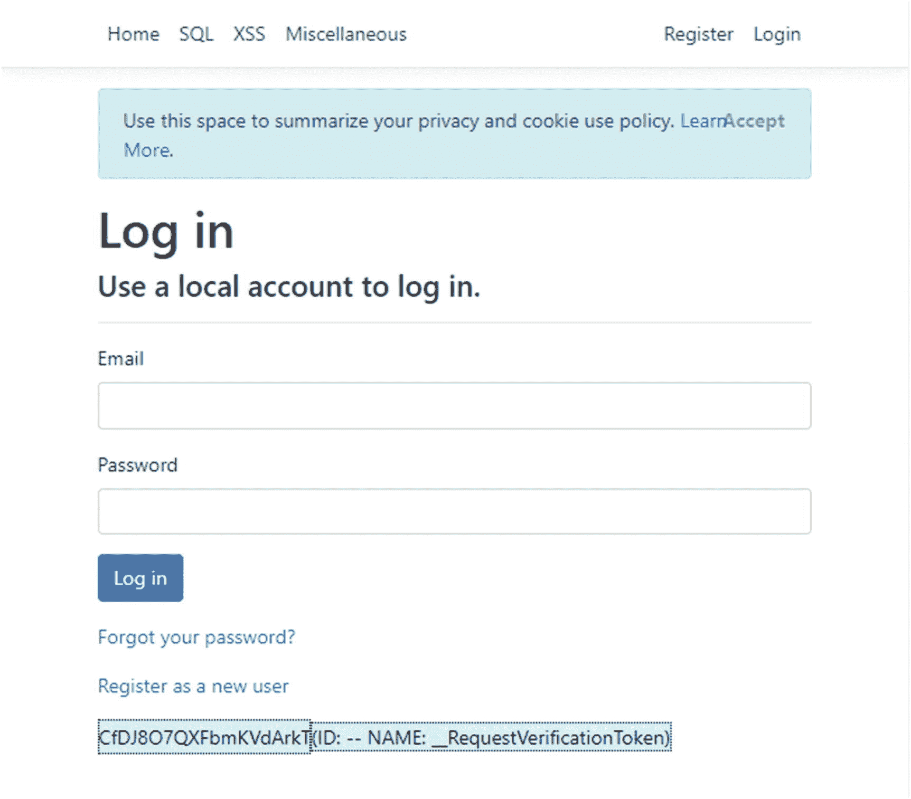

# 四、Web 安全概念

现在，一些重要的通用安全概念已经过时了，是时候谈谈 web 安全了。如果你已经在用某个版本的 ASP.NET 创建网站，那么本章介绍的许多概念对你来说会很熟悉。然而，在进入下一章之前，完整地阅读本章是很重要的，因为为了理解 web 安全性，您需要比典型的 web 开发人员更深入地理解 web 是如何工作的。

## 建立联系

谈到 web 安全，我不妨从所有 web 会话必须开始的地方开始——建立连接。很容易认为这是理所当然的，因为浏览器和 web 服务器为我们做了大部分繁重的工作，但是理解连接是如何工作的对于后面的几个主题将是重要的。

### HTTPS、SSL 和 TLS

为了谈论创建连接，我首先需要声明，在这个时代，你真的需要为你的网站使用 HTTPS，而不是 HTTP。两者之间的主要区别在于，HTTPS 表示您和 web 服务器之间的流量被加密，而 HTTP 表示您的流量以明文形式发送。我希望你已经知道为什么 HTTPS 需要被用于敏感通信，但这里有一些让 HTTPS 在任何地方都是强制性的论点:

*   如果在某些地方有 HTTP，而在其他地方没有，您可能会忘记在一些重要的地方添加 HTTPS。

*   通过 HTTPS 请求添加的 cookie 中存储的任何敏感信息都将通过任何 HTTP 调用发送，从而使它们容易受到中间人攻击。

*   谷歌(可能还有其他搜索引擎)已经开始使用 HTTPS 作为搜索排名的一个因素。换句话说，如果你没有设置 HTTPS，你的网站将在其搜索结果中显示在较低的位置。 <sup>[1](#Fn1)</sup>

*   Chrome <sup>[2](#Fn2)</sup> 和 Firefox 已经开始显示以 HTTP 呈现的网站不安全。

证书相对便宜，HTTPS 也很容易设置，所以真的没有理由再使用未加密的 HTTP。

Note

在其他书籍中，您可能会看到缩写“SSL”，它代表安全套接字层，代表相同的概念。我将在本书中避免这样做，因为它有点含糊不清。当网景公司在 1995 年首次实现 HTTPS 时，他们有一个叫 SSL 的协议来加密流量。1999 年，传输层安全性(TLS)被开发为 SSL 的更安全版本。但是“SSL”这个术语一直沿用至今，甚至在提到“TLS”时也是如此。因此，当谈到加密的 web 流量时，我将使用“HTTPS”，用“SSL”来表示被 TLS 取代的过时技术，当谈到 HTTPS 并试图区分 TLS 和 SSL 时，我将使用“TLS”。

### 连接过程

如果你打算认真研究安全性，你需要知道计算机之间是如何连接的。由于本书的目标读者是 web 开发人员，所以我不会深入讨论所有特定于套接字和硬件的连接，因为您并不需要真正了解它们。如果你有兴趣了解更多，我建议你用你最喜欢的搜索引擎搜索一下 *OSI 模型*。

然而，我们确实需要从软件的角度来讨论连接过程。假设您使用的是 HTTPS 连接，以下是首次建立会话时发生的过程:

1.  **您的浏览器向服务器**发送“客户端你好”消息。该请求中包括您的计算机支持的加密算法和一个*随机数*(一个只使用一次的数字)，用于帮助防止重放攻击。

2.  服务器以“服务器你好”作为响应。此消息中有
    *   服务器选择用于连接的加密算法

    *   会话 ID

    *   服务器的数字证书

    *   来自服务器的随机数

3.  **客户端验证服务器的证书。**此过程中的步骤包括检查证书颁发机构是否是客户端证书库中的可信颁发机构之一，以及对照*证书撤销列表* (CRL)检查证书。

4.  **客户端向服务器发送加密密钥**。这个密钥是用服务器的公钥加密的。因为唯一能够解密这个密钥的是服务器的私钥，所以我们可以合理地确定这个密钥是安全的，不会被窃听者窃取或修改。

5.  **服务器解密加密密钥**。现在，客户端和服务器已经就对称加密算法和密钥达成一致，以便在所有未来的通信中使用。

现在，两台机器之间建立了一个安全的连接，同时还建立了一个密钥来确保将来的任何通信都将被加密。虽然这不影响您的编程，但请注意，服务器使用对称加密进行通信——您的证书和不对称加密仅用于建立连接。

## 请求的剖析

一旦有了连接，从客户机到服务器的请求通常分为两类:有主体的和没有主体的。通常没有主体的最常见的请求形式是 GET 请求，当您在浏览器中键入 URL 或单击链接时会发生这种请求，尽管 HEAD、TRACE 和 OPTIONS 也属于这一类。下面是 GET 请求，类似于您第一次访问默认的 ASP.NET Core 网站时浏览器发送的请求。

```cs
GET https://localhost:44358/ HTTP/1.1
Host: localhost:44358
Connection: keep-alive
Upgrade-Insecure-Requests: 1
User-Agent: Mozilla/5.0 (Windows NT 10.0; Win64; x64)↲
  AppleWebKit/537.36 (KHTML, like Gecko)↲
  Chrome/73.0.3683.103 Safari/537.36
Accept: text/html,application/xhtml+xml,application/xml; ↲
  q=0.9,image/webp,image/apng,*/*; ↲
  q=0.8,application/signed-exchange;v=b3
Accept-Encoding: gzip, deflate, br
Accept-Language: en-US,en;q=0.9,fr;q=0.8
Cookie: .AspNet.Consent=yes

Listing 4-1Simple GET request

```

作为一名 web 程序员，清单 [4-1](#PC1) 中的大部分信息超出了您的控制范围，所以我不会详细讨论这些内容。需要注意的最重要的一点是，浏览器向服务器发送的信息比仅仅从特定的 URL 请求数据要多得多。这里有几个名称/值对以*头*的形式出现。现在，请注意这些头文件是存在的，不过我将突出显示两个。

*用户代理*发送大量关于客户端的信息，从操作系统(这里是 Windows NT 10.0)到浏览器(Chrome，版本 73)。如果你想知道像谷歌分析这样的服务是如何知道你的用户正在使用什么浏览器的，看看`User-Agent`。但是，作为一名 web 开发人员，这里没有任何信息可以依赖。虽然浏览器通常在这里向你发送可靠的信息，但实际上人们可以发送他们想发送的任何信息。

在最后一行，您可以看到一个 Cookie 被传递到服务器。cookie 是一个值得他们自己讨论的话题，所以现在，我将把“cookie”定义为一种在请求之间在客户端存储信息并继续前进的方法。

在我更多地讨论 GET 请求之前，我将讨论具有主体的请求。帖子是最常见的例子，通常发生在您单击表单上的 Submit 按钮时，但是像 PUT 和 DELETE 这样的操作也属于这一类。让我们通过显示在我们的测试网站上提交登录表单时传递到服务器的内容来看看原始帖子是什么样子的，使用“test mail @ Scott Norberg . com”作为电子邮件，使用“this_is_not_my_real_password”作为密码。

```cs
POST https://localhost:44358/Identity/Account/Login HTTP/1.1
Host: localhost:44358
Connection: keep-alive
Content-Length: 312
Cache-Control: max-age=0
Origin: https://localhost:44358
Upgrade-Insecure-Requests: 1
Content-Type: application/x-www-form-urlencoded
User-Agent: Mozilla/5.0 (Windows NT 10.0; Win64; x64) ↲
  AppleWebKit/537.36 (KHTML, like Gecko) ↲
  Chrome/73.0.3683.103 Safari/537.36
Accept: text/html,application/xhtml+xml,application/xml; ↲
  q=0.9,image/webp,image/apng,*/*; ↲
  q=0.8,application/signed-exchange;v=b3
Referer: https://localhost:44358/Identity/Account/Login
Accept-Encoding: gzip, deflate, br
Accept-Language: en-US,en;q=0.9,fr;q=0.8
Cookie: .AspNet.Consent=yes; .AspNetCore.Antiforgery.PFN4bk7PxiE=↲
CfDJ8DJ4p286v39BktskkLOxqMuky9JYmCgWyqLJU5NorOYkVDhNyQsjJQrq↲
GjlcSypNyW3tkp_y-fQHDFEiAlsuQ4OTi7k9TEfnJdbArZ5QN_↲
R3xGYDNN4OqPw0Z33t7cBvR-zrjPvoRpkQa_U6Vsr2xeY

Input.Email=testemail%40scottnorberg.com&↲
Input.Password=this_is_not_my_real_password&↲
Input.RememberMe=true&↲
__RequestVerificationToken=CfDJ8DJ4p286v39BktskkLOxqMv5EqdLh↲
  NGxIf80E9PV_2gwoJdBgmVRs2rmk_b4uXmHHPWdgRdQ9BeIUdQfmilDxu-↲
  E9fD0dTkEavW1P1dnFBGVHQ4W5xutOoGf4nN9kdkGOjLG_ihKZjWOhSHQMX↲
  mmxu0&Input.RememberMe=false

Listing 4-2Simple POST request

```

与清单 [4-1](#PC1) 中的 GET 请求一样，清单 [4-2](#PC2) 中 POST 的第一行指定了方法和位置。cookie 也在这里，尽管我们将在讨论防止 CSRF 攻击时讨论`Antiforgery` cookie。这里要看的最重要的是请求*主体*，它以“Input。Email= "并以"输入结束。RememberMe=false”。因为传递给服务器的数据在消息的正文中，所以它被加密了，所以大多数监听我们通信的尝试都无法看到(再次假设您使用的是 HTTPS)。

您可能想知道:为什么数据以“名称=值”的格式发送，而不是开发人员更习惯看到的格式，如 XML 或 JSON？简而言之，虽然可以用许多不同的格式发送数据，包括 XML 和 JSON，但浏览器倾向于用表单编码的格式发送数据，这种格式是“名称=值”对。您当然可以发送其他格式的数据，但是如果您这样做的话，您需要在`Content-Type`头中指定。在这种情况下，浏览器决定以 URL 编码的表单格式发送表单数据，这恰好是作为“name=value”发送的编码数据。

您可能已经知道也可以在 URL 中传递信息。这通常是通过一个*查询字符串*来完成的，该字符串是 URL 中问号后面的部分，并且具有 name=value 格式的数据。让我们看另一个登录请求，这次是用查询字符串中的数据发出 GET 请求。

```cs
GET https://localhost:44358/Identity/Account/Login?↲
  Input.Email=testemail@scottnorberg.com&Input.Password=↲
  this_is_not_my_real_password&Input.RememberMe=true HTTP/1.1
Host: localhost:44358
Connection: keep-alive
Upgrade-Insecure-Requests: 1
User-Agent: Mozilla/5.0 (Windows NT 10.0; Win64; x64)↲
  AppleWebKit/537.36 (KHTML, like Gecko)↲
  Chrome/73.0.3683.103 Safari/537.36
Accept: text/html,application/xhtml+xml,application/xml;↲
  q=0.9,image/webp,image/apng,*/*;q=0.8,application/signed-↲
  exchange;v=b3
Accept-Encoding: gzip, deflate, br
Accept-Language: en-US,en;q=0.9,fr;q=0.8
Cookie: .AspNet.Consent=yes;
  .AspNetCore.Antiforgery.PFN4bk7PxiE=↲
  CfDJ8DJ4p286v39BktskkLOxqMuky9JYmCgWyqLJU5NorOYkVDhNyQsjJQ↲
  rqGjlcSypNyW3tkp_y-fQHDFEiAlsuQ4OTi7k9TEfnJdbArZ5QN_↲
  R3xGYDNN4OqPw0Z33t7cBvR-zrjPvoRpkQa_U6Vsr2xeY

Listing 4-3GET with data in query string

```

清单 [4-3](#PC3) 中的问题是，试图进行中间人攻击的黑客更容易看到查询字符串中的数据，而不是请求正文中的数据。

关于我们目前看到的请求，有三件非常重要的事情需要记住:

1.  浏览器，而不是我们的代码或我们的服务器，是决定这些头内容的主要负责人。

2.  对于大多数用途，我们有责任确保以最安全的方式建立这些请求。虽然浏览器最终要对这些内容负责，但在很多情况下，浏览器只是做了我们作为 web 程序员要求他们做的事情。

3.  任何人想出于恶意更改这些头，都可以轻而易举地做到。充分信任这些信息以创建一个功能性网站，但不要过度信任它以至于我们容易受到攻击，这是一条困难但必要的路线。

我们将在本书的后面回到请求是如何工作的，但是现在，让我们继续讨论响应是什么样子的。

## 对反应的剖析

让我们来看看在第一个 GET 请求之后从服务器得到的响应。

```cs
HTTP/1.1 200 OK
Content-Type: text/html; charset=utf-8
Server: Kestrel
X-SourceFiles: =?UTF-8?B?QzpcVXNlcnNcc25vcmJlcmdcRG9jdW1lbnR↲
  zXFZpc3VhbCBTdHVkaW8gMjAxN1xQcm9qZWN0c1xBc3BOZXRDb3JlU2Vjd↲
  XJpdHlcRGVtby5NVkMuQ29yZQ==?=
X-Powered-By: ASP.NET
Date: Sun, 14 Apr 2019 01:58:32 GMT
Content-Length: 6720

<!DOCTYPE html>
<html>
<!-- HTML Content Removed For Brevity -->
</html>

Listing 4-4Basic HTTP response

```

您应该注意到，在清单 [4-4](#PC4) 中，浏览器用来为用户创建页面的 HTML 内容是在消息体中返回的。这里第二重要的是第一行:`HTTP/1.1 200 OK`。“200 OK”是一个*响应代码*，它告诉浏览器如何处理请求，并且(大部分)是所有 web 语言的标准。既然您应该已经熟悉了 HTML，那么让我们花点时间深入研究一下响应代码。

### 响应代码

有许多不同的响应代码，一些比另一些更有用。让我们回顾一下你作为一个 web 开发人员经常使用的方法，不管是直接的还是间接的。

#### 1XX–信息

这些代码用于告诉客户端一切正常，但需要进一步处理。

##### 100 继续

告诉客户端继续此请求。

##### 101 交换协议

客户端请求切换协议，服务器同意了。如果您将 web sockets 与 SignalR 一起使用，您应该知道 SignalR 会将 101 发送回浏览器以开始使用 web sockets，web sockets 的地址通常以 ws://或 wss://开头，而不是以 http://或 https://开头，以便进行通信。

#### 2XX–成功

正如“Success”标题所预期的那样，这些代码意味着请求按预期得到了处理。有几个成功的代码，但只有一个我们真的需要知道。

##### 200 好的

可能是最常见的响应，当您想要返回 HTTP 内容时使用。

#### 3XX–重定向

3XX 状态代码表示资源已经移动。不幸的是，正如我们稍后将看到的，这些状态在 HTTP/1.1 规范中的含义与它们在 ASP.NET 是如何实现的是两回事。

##### 301 永久移动

如果页面或网站已经移动，您可以使用 301 响应来告诉客户端资源已经永久移动。

##### 找到 302 个

告诉客户端位置已经找到，只是在不同的位置。用户登录后，ASP.NET 返回 302，需要重定向到不同的页面。

```cs
HTTP/1.1 302 Found
Cache-Control: no-cache
Pragma: no-cache
Expires: Thu, 01 Jan 1970 00:00:00 GMT
Location: /identity/account/manage/index
Server: Kestrel
Set-Cookie: .AspNetCore.Identity.Application=<<REMOVED>>;↲
  path=/; secure; samesite=lax; httponly
Set-Cookie: .AspNetCore.Mvc.CookieTempDataProvider=;↲
  expires=Thu, 01 Jan 1970 00:00:00 GMT; path=/; samesite=lax
X-SourceFiles: <<REMOVED>>
X-Powered-By: ASP.NET
Date: Sun, 14 Apr 2019 17:19:05 GMT
Content-Length: 0

Listing 4-5Example of a 302 Found used as a redirect

```

在清单 [4-5](#PC5) 的例子中，框架要求浏览器导航到*/身份/账户/管理/索引*。

HTTP/1.1 规范规定，应该使用另一个代码，而不是 302，来进行这样的重定向。但是 ASP.NET 从一开始就一直这么做，现在也没有理由指望它会改变。

##### 303 见其他

根据规范，这是应该在 302 示例中使用的状态代码，因为它是应该在处理帖子时使用的状态代码，并且浏览器应该导航到新页面。

##### 307 临时重定向

这是在代码中声明重定向到不是 POST 处理的直接结果的新页面时应该使用的状态代码。ASP.NET Core 使用 302 代替。

#### 4XX–客户端错误

这些错误代码表明客户端发送的*请求*有问题。

##### 400 个错误请求

请求本身有错误。常见的问题是数据格式错误、请求太大或内容长度与实际长度不匹配。

##### 401 未经授权

理论上，这意味着用户没有足够的权限访问所请求的资源。然而，实际上，ASP.NET(包括核心)倾向于发送 302 而不是 401 将用户送回登录页面。这里有一个例子。当您试图访问需要认证的页面时，NET 会这样做。

```cs
HTTP/1.1 302 Found
Location: https://localhost:44358/Identity/Account/Login?↲
  ReturnUrl=%2Fidentity%2Faccount%2Fmanage%2Findex
Server: Kestrel
X-SourceFiles: <<REMOVED>>
X-Powered-By: ASP.NET
Date: Sun, 14 Apr 2019 17:13:51 GMT
Content-Length: 0

Listing 4-6What ASP.NET does instead of sending a 401 when you need to log in

```

与清单 [4-5](#PC5) 中的 302 代码示例一样，清单 [4-6](#PC6) 显示了我尝试访问*/身份/账户/管理/索引*后的结果，但是没有显示 401 说我未经授权，而是显示 302 将我重定向到登录页面，除了查询字符串参数“ReturnUrl”告诉登录页面在成功认证后该去哪里。

您可能想解决这个问题，但是请注意，默认情况下，如果 IIS 看到 401，它会提示您输入用户名和密码，希望您使用 Windows 认证登录。但是这可能不是您想要的，因为您可能想要网站而不是 IIS 来处理认证。当然，您可以配置 IIS，但是除非您有很多时间或者正在构建一个框架供其他人使用，否则在大多数情况下保留这个功能就可以了。

##### 403 禁止

这是为了在由于系统级权限问题(如禁止读访问或需要 HTTPS)而拒绝请求时使用。

##### 404 未找到

找不到页面。至少这是一个在 ASP.NET 可以正常工作的状态，尽管一些第三方库会返回一个 302 并重定向到一个错误页面。这是一个 404 违约的例子。NET 站点。

```cs
HTTP/1.1 404 Not Found
Cache-Control: no-cache
Pragma: no-cache
Expires: Thu, 01 Jan 1970 00:00:00 GMT
Server: Kestrel
Set-Cookie: .AspNetCore.Identity.Application=<<REMOVED>>;↲
  path=/; secure; samesite=lax; httponly
X-SourceFiles: <<REMOVED>>
X-Powered-By: ASP.NET
Date: Sun, 14 Apr 2019 18:20:23 GMT
Content-Length: 0

Listing 4-7404 Not Found response

```

如果浏览器看到类似清单 [4-7](#PC7) 的内容，它通常会向用户显示通用的“未找到页面”页面。

#### 5XX–服务器错误

这些错误代码表明在处理来自服务器端的*响应*时出现了问题。实际上，4XX 错误代码实际上可能表明服务器出现了问题，而 5XX 错误代码可能是由错误的请求导致的，因此不应该太认真地看待 4XX 错误和 5XX 错误之间的区别。

##### 500 内部服务器错误

服务器上出现错误。如果您使用 ASP.NET Core 中的默认实现，这就是发生错误时的情况。

```cs
HTTP/1.1 500 Internal Server Error
Content-Type: text/html; charset=utf-8
Server: Kestrel
X-SourceFiles: <<REMOVED>>
X-Powered-By: ASP.NET
Date: Sun, 14 Apr 2019 18:33:08 GMT
Content-Length: 24101

<!DOCTYPE html>
<html lang="en" xmlns:="http://www.w3.org/1999/xhtml">
  <!-- HTML code omitted for brevity -->
</html>

Listing 4-8500 Internal Server Error response

```

清单 [4-8](#PC8) 在大多数方面看起来像一个普通的 200 响应，具有相同的标题和 HTML 内容，除了通过返回 500 而不是 200，浏览器知道发生了错误。我将在本书的后面介绍错误处理。

##### 502 坏网关

这个代码的教科书定义是服务器从上游服务器收到一个错误的响应。我见过这种情况最常发生在。NET Core 尚未在托管服务器上完全安装或配置。

##### 503 服务不可用

这应该意味着服务器关闭是因为它过载或者其他一些临时的情况。以我的经验来看，这个错误只在. NET 站点(核心或其他)出现严重错误并且重启 IIS 是最好的选择时才会出现。

### 头球

既然我已经讨论了状态代码，我将稍微深入一下从 ASP.NET Core 返回(和不返回)的其他标头。首先，让我们看看默认包含的头。

#### 默认 ASP.NET 标题

要查看包含哪些标题，让我们再次查看登录 ASP.NET 网站的默认版本后看到的 302。

```cs
HTTP/1.1 302 Found
Cache-Control: no-cache
Pragma: no-cache
Expires: Thu, 01 Jan 1970 00:00:00 GMT
Location: /identity/account/manage/index
Server: Kestrel
Set-Cookie: .AspNetCore.Identity.Application=<<REMOVED>>;↲
  path=/; secure; samesite=lax; httponly
Set-Cookie: .AspNetCore.Mvc.CookieTempDataProvider=;↲
  expires=Thu, 01 Jan 1970 00:00:00 GMT; path=/; samesite=lax
X-SourceFiles: <<REMOVED>>
X-Powered-By: ASP.NET
Date: Sun, 14 Apr 2019 17:19:05 GMT
Content-Length: 0

Listing 4-9302 Found response to show headers

```

让我们看看清单 [4-9](#PC9) 中最重要的标题:

##### 缓存控制、编译指示和过期

使用“无缓存”作为缓存控制和 Pragma 的值以及过去的 Expires 值，ASP.NET 标头试图告诉浏览器每次都获取新鲜的内容。

##### 计算机网络服务器

该标题指定服务器使用 Kestrel(即 ASP.NET Core)作为 web 服务器。浏览器不需要这些信息，但是对于微软来说，了解其产品的采用率是很有用的。这也是一个信息泄露问题，因为这也是有用的信息，黑客知道他们可以专注于他们认为最有效的攻击。NET 核心。

##### 字段

我将在本章的后面谈到饼干。目前，这是服务器告诉你的浏览器存储什么数据，它的名字是什么，什么时候到期，等等。

##### x 供电的

就像服务器值一样，这只是用来提供微软(和其他公司)的使用统计，同时给黑客更多的信息来攻击你的网站。

##### x-source files-x 来源档案

仅当您将浏览器指向本地主机中托管的. NET 核心站点时，才会使用此标头。 <sup>[4](#Fn4)</sup> 我们可以放心地忽略它。

作为关心安全性的开发人员，我们需要了解更多的头文件。有些比其他的更容易添加。

#### 在 ASP.NET 轻松配置安全标头

以下是不会自动包含在请求中的标头，但可以在 ASP.NET 中轻松配置。

##### 严格的运输安全

这告诉浏览器永远不要使用普通 HTTP 加载内容。相反，它应该总是使用 HTTPS。该收割台有两个选项:

*   **max-age** :指定使用 HTTPS 的请求有效的秒数。最常用的值是 31536000，即一年中的秒数。

*   **includeSubDomains** :可选参数，告诉浏览器头是否适用于子域。

Caution

为了确保浏览器总是使用 HTTPS 而不是 HTTP，您需要首先将任何 HTTP 请求重定向到 HTTPS 版本，然后包含这个头。这是事实，原因有二。首先，浏览器通常会忽略 HTTP 请求的这个头。把这个标题想象成告诉浏览器“继续使用 HTTPS”，而不是“使用 HTTPS”第二，大多数计算机在通过 API 连接时(即不涉及浏览器时)会很乐意忽略这个头。请使用这个标题，只是不要依赖它到处设置 HTTPS。

##### 缓存控制

浏览器将存储您网站页面的副本，以帮助加快用户访问这些页面的后续时间，但有时这并不是所希望的，例如当数据将发生变化或当敏感信息显示在页面上时。这个头有几个有效值。 <sup>[5](#Fn5)</sup> 下面是一些比较重要的:

*   **public** :响应可以存储在任何缓存中，比如浏览器或者代理服务器。

*   **private** :响应只能存储在浏览器的缓存中。

*   **no-cache** :尽管有这个名字，但这并不意味着响应不能被缓存。相反，这意味着缓存的响应必须在使用前进行验证。

*   **不存储**:响应不应该存储在缓存中。

从安全的角度来看，要知道在中间缓存中存储经过认证的页面(即使用前面的“public”选项)是*不*安全的，并且存储带有敏感数据的页面不是一个好主意，因此应该谨慎地使用“no-store”。不幸的是，在代码中有一个 bug，在 ASP.NET 将它设置为“禁止存储”比它应该的要难。我会在第 10 章[告诉你如何解决这个问题。](10.html)

有一个相关的标题叫做“pragma ”,它控制旧浏览器上的缓存。如果不想缓存信息，将 pragma 设置为“no-cache”可以提供一些保护。

Tip

注意其他地方，浏览器试图通过存储用户可能不应该存储的信息来帮助用户。在一个与标题无关的例子中，浏览器将存储在文本字段中输入的值。这些通常是安全的，但是您不希望浏览器存储敏感信息，如社会保险号或信用卡号。在这种特殊情况下，您需要将“autocomplete='false '”添加到包含敏感数据的输入属性中，以防止这种数据存储。但是浏览器一直在寻找让用户生活更轻松的方法，不幸的是，有时也不太安全。

#### 默认情况下，安全标头不在 ASP.NET

以下是一些应该添加到您的网站上的标题，以使其更加安全。我将在本书的后面向您展示如何做到这一点。现在，让我们来定义它们是什么。

##### x-内容-类型-选项

将此项设置为“nosniff”会告诉浏览器不要通过查看内容来猜测内容的 MIME 类型，如 CSS 或 JavaScript。这个标题有点过时，因为它只防止新浏览器防止的攻击，而没有开发人员的任何干预，但大多数安全专业人员会希望您在您的网站上有这个设置。

##### x-框架-选项

如果设置正确，该头指示您的浏览器不要从另一个位置将内容加载到 iframe 中。我们将在下一章详细讨论这种被称为*点击劫持*的攻击，但同时，X-Frame-Options 可以取三个值之一:

*   **deny** :阻止内容在 iframe 中呈现

*   **sameorigin** :如果域匹配，只允许内容在 iframe 中呈现

*   **allow-from** :允许 web 开发人员在特定的域中使用 iframe 来呈现内容

在我工作过的网站中， *sameorigin* 选项是最常见的，但是我强烈建议你使用 *deny* 来代替。Iframes 通常会引起比它们解决的问题更多的问题，所以如果你有其他选择的话，你应该避免使用它们。

##### X-XSS 保护

我将在下一章更详细地介绍跨站脚本，或 XSS，但现在我将告诉你它是一个术语，用于将任意的 JavaScript 注入到网页中。在表面上，将报头设置为值“1”；mode=block”应该有助于防止一些 XSS 攻击。然而，实际上，这个头并不那么有用，原因有二:

1.  浏览器对这个标题的支持并不是很好。 <sup>[6](#Fn6)</sup>

2.  设置 Content-Security-Policy 标头会使该标头完全过时。

什么是内容安全策略头？很高兴你问了。

##### 内容-安全-策略

这个头允许您指定允许加载哪些资源，呈现什么类型的内容，等等。CSP 头非常复杂，很难弄清楚，但我至少可以给你一个概述来帮助你开始。首先，下面是一个示例 CSP 报头的样子。

```cs
default-src 'self' www.google.com www.gstatic.com; ↲
  script-src 'self' 'unsafe-inline' 'unsafe-eval' ↲
  www.google.com www.gstatic.com; ↲
  style-src 'self' 'unsafe-inline' frame-src: 'none'

Listing 4-10Sample CSP header

```

这是怎么回事？让我们来分解一下:

*   **default-src** :这是告诉浏览器接受来自与主机网站相同的域的内容，以及域 [`www.google.com`](http://www.google.com) 和 [`www.gstatic.com`](http://www.gstatic.com) 。如果您使用 Google 的 CAPTCHA 机制来帮助将垃圾邮件提交限制到一个公开可用的形式，后两个是必要的。

*   **script-src** :这不仅告诉浏览器可以从主机站点 [`www.google.com`](http://www.google.com) 和 [`www.gstatic.com`](http://www.gstatic.com) 加载脚本，还告诉浏览器可以运行内联脚本并允许调用 JavaScript 的`eval()`。(对于某些 JavaScript 框架来说，后两者可能是必需的。)

*   style-src :这告诉浏览器本地样式表是可以的，但也允许内联样式。

*   **frame-src** :这是告诉浏览器拒绝在任何 iframe 中加载这个资源。

因此，您可能会认为，您可以对是否允许内联脚本、什么域允许什么内容等进行粒度控制。如需完整的选项列表，请访问 [`https://content-security-policy.com/`](https://content-security-policy.com/) 。 [`www.cspisawesome.com/`](http://www.cspisawesome.com/) 也是一个很棒的网站，它有 GUI 来引导你为你的网站创建 CSP 标题。

Caution

CSP 头很难正确。如果您使用一个或多个第三方库，这一点尤其正确；使用严格的内容安全策略(CSP)时，第三方脚本往往会崩溃。由于内联 CSS、内联脚本等原因，当追溯性地将 CSP 头应用于遗留站点时，您也可能会遇到问题。尽可能避免制定过于宽松的政策来弥补草率的编程。限制性 CSP 报头有助于防止大多数 XSS 攻击的最坏影响。

## 交叉请求数据存储

默认情况下，Web 是无状态的，这意味着对服务器的每个请求都被视为一个全新的请求/响应周期。以前所有的请求都被遗忘了。当然，作为 web 开发人员，我们需要在请求之间存储一些信息，因为至少我们不希望在用户每次尝试做任何事情时都强迫他们提供用户名和密码。这里是我们在 ASP.NET Core 可用的存储机制的简要概述。

### 饼干

您还可以通过一个 *cookie* 在用户的浏览器上存储信息(最常见的是认证令牌，这样服务器就知道是哪个用户在发出请求)，这只是一种特定类型的头。我们在清单 [4-5](#PC5) 的章节中已经看到了一个。又来了，这次包括了 cookie 内容。

```cs
HTTP/1.1 302 Found
Cache-Control: no-cache
Pragma: no-cache
Transfer-Encoding: chunked
Expires: Thu, 01 Jan 1970 00:00:00 GMT
Location: /
Server: Microsoft-IIS/10.0
X-Frame-Options: DENY
X-Content-Type-Options: nosniff
Content-Security-Policy: <<REMOVED FOR BREVITY>>
X-Permitted-Cross-Domain-Policies: none
X-XSS-Protection: 1; mode=block
Set-Cookie: .AspNetCore.Identity.Application=CfDJ8MSVvI0KxT5E↲
  qwKh39urJXXOViI6obRZxQskvy6AR2caaFOOex6UzkqrUp-dI3duxF_Aq25↲
  4tciMa2p0P343NRkeVmrxkfwUSersQwnVFZo-IBXLQVRK400RwQr4lX9uFz↲
  bFn4r_5yVtCEQpCbfLuySQr22wVZPbZq7BDQeuKV1Er3T0flGJ6Eoq3ws6R↲
  I4TBJl1tsmYREfSW0odn-ZFlQPzyeKxHcTwaiZO9CwW6StObdnEos7-yLHT↲
  jZfSt2rUEpGpkQ7iLZNuTCHN-XMh6Qyjr6z_H8ONtpmSuUxSngSdZNaPORI↲
  TkiozJzLxDKKLQRy0gityYrxfJrdszEQS7lFPsqbHlo6Mc4TZknZWRL-nBn↲
  CQkfLM-24Cdsh5ITnI8cUAQDyzZWLO6dwZG_J9VFwzxW0UiqeKyJPjTNrF7↲
  xgP_r-6BxcLrj4485veOIpUYHMs3CjfadGOHh31S053YSmALo2V_g2sG-ke↲
  rfHlWv0HJquOIqDZvPgaLXhwU-DhO8qzZKDjnstD1IMlaOiVgrcq0TUjlcK↲
  3iZghkEFhnXYBN0LZ8jZ_77QgcnzBhgH_RJOI3eUk8iHO4-gNivL18YLGxJ↲
  IsVSh5ZCXTIA6G-efQ; path=/; samesite=lax; httponly
Date: Sat, 23 Nov 2019 02:19:45 GMT

Listing 4-11302 response showing setting a cookie

```

清单 [4-11](#PC11) 中显示的请求设置了一个 cookie:*. aspnetcore . identity . application*。这存储在浏览器中，但是通过每个后续请求中的头发送回服务器。为了证明这一点，下面是一个后续请求的示例。

```cs
GET / HTTP/1.1
Host: localhost
Connection: keep-alive
Upgrade-Insecure-Requests: 1
User-Agent: Mozilla/5.0 (Windows NT 10.0; Win64; x64) AppleWebKit/537.36 (KHTML, like Gecko) Chrome/78.0.3904.108 Safari/537.36
Accept: text/html,application/xhtml+xml,application/xml;↲
  q=0.9,image/webp,image/apng,*/*;q=0.8,↲
  application/signed-exchange;v=b3↲
Referer: http://localhost:44358/
Accept-Encoding: gzip, deflate
Accept-Language: en-US,en;q=0.9
Cookie: .AspNetCore.Antiforgery.0B7lGVc8WVk=CfDJ8MSVvI0KxT5Eq↲
  wKh39urJXUCRwNWJxSTYvPOdTr8nnzk-5OTDJmr9QG90nJHv4e8AJdyOxun↲
  WLzRXjpX90ZTvqqm-J_Jk3-c0av_R7S62UMNlT7vwD5zlYlwRW1pLVheEbb↲
  JAN7WeiFkfoFz1GRa0u4; .AspNetCore.Identity.Application=CfDJ8MSVvI0KxT5EqwKh39urJXXO↲
  ViI6obRZxQskvy6AR2caaFOOex6UzkqrUp-dI3duxF_Aq254tciMa2p0P34↲
  3NRkeVmrxkfwUSersQwnVFZo-IBXLQVRK400RwQr4lX9uFzbFn4r_5yVtCE↲
  QpCbfLuySQr22wVZPbZq7BDQeuKV1Er3T0flGJ6Eoq3ws6RI4TBJl1tsmYR↲
  EfSW0odn-ZFlQPzyeKxHcTwaiZO9CwW6StObdnEos7-yLHTjZfSt2rUEpGp↲
  kQ7iLZNuTCHN-XMh6Qyjr6z_H8ONtpmSuUxSngSdZNaPORITkiozJzLxDKK↲
  LQRy0gityYrxfJrdszEQS7lFPsqbHlo6Mc4TZknZWRL-nBnCQkfLM-24Cds↲
  h5ITnI8cUAQDyzZWLO6dwZG_J9VFwzxW0UiqeKyJPjTNrF7xgP_r-6BxcLr↲
  j4485veOIpUYHMs3CjfadGOHh31S053YSmALo2V_g2sG-kerfHlWv0HJquO↲
  IqDZvPgaLXhwU-DhO8qzZKDjnstD1IMlaOiVgrcq0TUjlcK3iZghkEFhnXY↲
  BN0LZ8jZ_77QgcnzBhgH_RJOI3eUk8iHO4-gNivL18YLGxJIsVSh5ZCXTIA↲
  6G-efQ

Listing 4-12Request that shows a cookie value that was set earlier

```

您会注意到清单 [4-12](#PC12) 中的*. aspnetcore . identity . application*cookie 在服务器设置 cookie 的第一次响应和浏览器对服务器的请求之间是相同的(除了换行问题)。

Cookies 和客户端请求中发送的所有其他信息一样，可以在任何时候以任何理由被查看或篡改。因此，您不应该将安全信息存储在 cookie 中，如果您绝对必须存储不应该被更改的内容，您应该考虑添加一种称为数字签名的东西来检测篡改，即使这样，也要知道任何人都可以看到 cookie 中的信息。

#### Cookie 范围

在我们进入下一种类型的会话数据存储之前，有必要回顾一下 cookie 配置。从原 set 头可以看到三个设置: *path* 、 *samesite* 和 *httponly* 。让我们花点时间来讨论这些术语的含义，因为。默认情况下，NET 不使用最安全的选项创建 cookies。

##### 小路

这是可以使用 cookie 的路径。例如，如果您有一个路径为“/admin”的 cookie，则该 cookie 在站点的其他文件夹中不可用。

##### 同一地点

这个设置的两个更重要的选择是“严格”和“宽松”。以下是对每一项含义的总结:

*   如果您将该设置设为“严格”，那么只有当请求来自同一个站点时，浏览器才会将 cookie 添加到请求中。

*   如果“lax ”,那么 cookies 将总是被发送到服务器，不管请求来自哪里。然而，Cookies 仍然只发送到产生它们的域。

如果没有明确设置，Cookies 通常默认为“lax”。

##### httponly

这个标志告诉浏览器不要让这个 cookie 对页面上运行的 JavaScript 可用。这有助于防止 cookie 被页面上运行的恶意 JavaScript 窃取。

我们将在中讨论如何更改这些设置。NET Core。

### 会话存储

像它的前身一样，ASP.NET Core 允许你在*会话存储*中存储信息，这基本上是一个在某处留出内存空间并将其绑定到用户会话的术语。ASP.NET Core 的默认会话存储位置在应用运行的同一进程中，但它也支持 Redis 或 SQL Server 作为分布式缓存存储位置。 <sup>[7](#Fn7)</sup>

从表面上看，会话存储似乎是一个解决难题的好办法。在浏览器上存储信息而不冒被篡改的风险没有任何好的选择，所以在服务器上存储信息似乎是一个很好的解决方案。然而，对于任何考虑实现会话存储的人，我必须给出两个非常大的警告:

1.  使用分布式内存缓存(默认存储位置)存储会话信息很容易设置，但可能会导致网站出现问题。如果您不小心使用您的存储和/或您有很多用户，额外的会话存储可能会导致服务器上的内存需求无法处理，从而导致不稳定。

2.  在 ASP.NET Core 中，会话被绑定到*浏览器*会话，而不是*用户*会话。要了解为什么这是一个问题，想象一下这个场景:用户 A 登录到您的应用，然后您在会话中存储关于用户 A 的信息。用户 A 注销，但保持浏览器打开。用户 B 访问计算机并使用他们自己的凭据登录。因为会话绑定到浏览器会话，所以用户 B 现在可以访问用户 A 的会话。为用户 A 存储的任何敏感信息现在对用户 b 是可用的

特别是考虑到每个浏览器的会话问题，我很难推荐将会话用于任何重要的目的。太容易出差错，暴露出你不想要的信息。

### 隐藏字段

就像有“文本”或“文件”类型的输入字段允许用户分别输入文本或上传文件一样，有“隐藏”类型的输入允许开发人员存储信息，然后将信息发送回服务器，而用户不会注意到。您应该只是为了方便才考虑这些字段，因为这些字段除了在用户界面中隐藏它们之外，不提供任何安全保护。对任何有一点 web 开发知识的人来说，找到并改变这些值都是非常容易的。这里有三种方法可以做到这一点:

1.  使用浏览器插件来查看和编辑字段值。图 [4-1](#Fig1) 包含了一个插件的截图——这个插件叫做“编辑隐藏字段”<sup>[8](#Fn8)</sup>——正在运行。



图 4-1

使用“编辑隐藏字段”Chrome 插件查看默认登录页面上的隐藏字段

1.  监听浏览器和服务器之间的流量，并根据需要进行编辑。这是我们之前展示的登录帖子，这次只是突出显示了隐藏的字段。

```cs
POST https://localhost:44358/Identity/Account/Login HTTP/1.1
<<HEADERS REMOVED FOR BREVITY>>

Input.Email=testemail%40scottnorberg.com&Input.Password=this_is_not_my_real_password&Input.RememberMe=true&__RequestVerificationToken=CfDJ8DJ4p286v39BktskkLOxqMv5EqdLhNGxIf80E9PV_2gwoJdBgmVRs2rmk_b4uXmHHPWdgRdQ9BeIUdQfmilDxu-E9fD0dTkEavW1P1dnFBGVHQ4W5xutOoGf4nN9kdkGOjLG_ihKZjWOhSHQMXmmxu0&Input.RememberMe=false

Listing 4-13POST with hidden field data highlighted

```

你可以用几个工具编辑并重新发送清单 [4-13](#PC13) 中的信息。我最喜欢的是 Burp Suite，我将在本章后面展示，可以从 [`https://portswigger.net/burp`](https://portswigger.net/burp) 下载。

1.  在浏览器中打开开发工具，找到该字段，并手动更改它。

虽然隐藏字段有一些用途，但是如果有其他选择，通常应该避免使用它们。

### HTML 5 存储

HTML5 新增了两种在用户浏览器上存储信息的方法，都可以通过 JavaScript 访问:

*   **window.localStorage** :浏览器无限期存储数据。

*   **window.sessionStorage** :数据由浏览器保存，直到标签页关闭。

这些存储信息的新方法使用起来非常方便。问题是，即使我们假设浏览器是 100%安全的(很可能不是):如果你犯了任何一个允许攻击者在你的页面上执行 JavaScript 的错误(参见下一章中的“跨站点脚本”)，那么所有的数据都会受到损害。所以，不要在这里存储*任何非公开信息。*

### 交叉请求数据存储摘要

不幸的是，如您所见，安全地存储交叉请求信息很困难。每种存储方法都有安全问题，有些还有可扩展性问题。我们将在本书的后面解决一些问题，但是现在只要记住大多数的解决方案都有你需要小心避免的问题。

## 不安全的直接对象引用

您可能需要在 URL 中引用一个对象 ID，最常见的是通过查询字符串(例如， [`https://my-site.com/orders?orderId=44`](https://my-site.com/orders%253ForderId%253D44) )或 URL 本身(例如， [`https://my-site.com/orders/detail/44`](https://my-site.com/orders/detail/44) )。在某些情况下，用户可以访问任何可以被引用的对象，这使得相对容易地更改对象变得无关紧要。但是，在其他时候，您希望锁定用户可能看到的内容。本段中的例子很可能是后一种情况——很难想象在一个系统中，允许用户通过更改订单 ID 来查看系统中的所有订单是一种理想的行为。

您需要防止用户更改 URL 来访问他们通常无权访问的对象，但是如果您忘记实施预防措施，您就引入了不安全的直接对象引用(IDOR)。这种类型的漏洞需要您的注意，因为它在开发过程中很容易忘记，在测试过程中也很容易遗漏，但却被许多安全专业人员忽略了，因为如果没有被测试网站背后的业务规则的具体知识，很难发现它。

## 打嗝套房

为了测试本书中的一些安全概念，我们需要能够创建自己的请求并提交给服务器，而没有浏览器的阻碍。有几个工具可以做到这一点，但我最喜欢的是所谓的*打嗝套件*。尽管它的名字很奇怪，但它是许多网络渗透测试人员的首选工具。Burp 的供应商 Portswigger 出售三种版本的 Burp 套件:

*   社区(Community):一个免费版本，允许你对单个网页进行各种各样的攻击

*   专业版:一款经济实惠的产品(每年 399 美元)，包括社区版的所有功能和自动扫描功能

*   企业版:一款更贵的产品，跟踪自动扫描

社区版对于这本书的绝大多数作品来说已经足够好了，所以建议大家在这里下载: [`https://portswigger.net/burp/communitydownload`](https://portswigger.net/burp/communitydownload) 。如果您运行的是 Windows，您只需下载并运行安装程序，安装程序会完成剩下的工作(包括将它需要的 Java 版本复制到程序文件夹中)。

为了让您了解它是如何工作的，我将向您展示如何在典型的登录过程中拦截和编辑流量。首先，启动应用，在第一个屏幕上，如图 [4-2](#Fig2) 所示，点击*下一步*(因为你看到的只是社区版中没有的配置选项)。


图 4-2

Burp Suite 项目设置屏幕

在下一个屏幕上，如图 [4-3](#Fig3) 所示，点击*开始打嗝*。


图 4-3

打嗝套件配置屏幕

一旦打嗝开始，你应该会看到如图 [4-4](#Fig4) 所示的屏幕。


图 4-4

打嗝套件主屏幕

您应该在右上方看到一些示例结果，但是现在可以忽略它们。Burp 现在作为代理侦听端口 8080，但是您需要配置您的计算机使用端口 8080 作为代理。如何做到这一点的说明会因操作系统而异，但下面是如何在 Windows 10 上做到这一点:


图 4-5

打嗝的代理设置

1.  打开 Internet Explorer(不，您实际上不必使用浏览器)。

2.  点按右上角的“设置”齿轮。

3.  单击 Internet 选项。

4.  点击*连接*选项卡。

5.  点击*局域网设置。*

6.  选中*为您的局域网使用代理服务器(这些设置不适用于拨号或 VPN 连接)*。

7.  点击*高级*按钮。

8.  记下当前的设置——当你完成测试后，你需要将它们放回原处。

9.  在 HTTP 和 Secure 下，使用代理地址“localhost”和端口“8080”，如图 [4-5](#Fig5) 中的截图。

1.  在接下来的三个屏幕上点击 *OK* 退出 IE 设置。

    **提示**当你作为代理运行 Burp 时，Burp 会拦截所有请求，除非你告诉它，否则它会问你是否要转发请求。如果你开着浏览器做一些与测试无关的事情(比如听流媒体音乐)，这可能*非常*麻烦。我建议关闭所有浏览器，只在 Burp 代理打开时进行测试。

要使用 Burp 中继器截取、更改和重新提交数据，请按照下列步骤操作:


图 4-6

Burp Suite 代理中的登录帖子

1.  在 Burp 中打开*代理*标签。

2.  打开你的网站。
    1.  您需要点击*转发*以便将请求转发到应用上。

3.  尝试登录您的应用，但使用错误的密码。

4.  在 Burp 中，转到下方选项卡集中的 *HTTP 历史*选项卡。

5.  在请求列表中，找到代表您的登录的帖子，类似于图 [4-6](#Fig6) 所示。

1.  右键单击行项目，然后单击*发送到中继器。*

2.  在请求区，更改密码字段(此处，*输入。密码*)到你的真实密码。

3.  点击*发送。*

如果你做的一切都正确，你的屏幕现在应该看起来如图 [4-7](#Fig7) 所示。


图 4-7

打嗝组曲中继器

您应该能够在响应中看到一些指示登录成功的信息。在这种情况下，有两个新的 cookie:*AUTH _ USER*和 *AUTH_PASSWORD* ，因此您可以合理地确定发送了正确的登录。

当然，我不需要仅仅修改密码——我可以修改其他值，包括在浏览器中很难修改的内容，比如 cookies 和其他标题。正因为如此，我将在整本书中测试各种概念时使用 Burp。

Tip

不要忘记把你的代理设置改回原来的样子！否则你将无法访问互联网，因为所有的请求都被发送到一个不起作用的代理。

## 尾张十

我将在本章中讨论的最后一个主题是 OWASP 十大列表。 <sup>[9](#Fn9)</sup> OWASP，开放 Web 应用安全项目，是一个致力于推广应用安全工具和概念的非营利性组织。除了创建几个免费和开源的安全工具(包括非常受欢迎的 Zed 攻击代理(ZAP)<sup>[10](#Fn10)</sup>——一个扫描网站安全漏洞的工具)，OWASP 还发布了旨在帮助开发人员和渗透测试人员提高其 web 和移动应用安全性的文档。也许他们最著名的文档是他们的十个最关键的 Web 应用安全风险。该列表每隔几年更新一次，尽管令人不安的是，从一个列表到另一个列表都保持相对静态，这表明我们作为软件开发社区正在做一项可怕的工作，修复我们知道存在的问题。

在我开始讨论这个列表之前，我想说这个列表在应用开发安全社区中被过分强调了。部分问题在于清单上的几个项目是不可行的。例如，#4，XML 外部实体，是一个有特定修补程序的特定漏洞，但其他几个漏洞似乎是一般类别漏洞的总称。尽管这份清单有缺陷，但它可能是一个开始讨论的好点。此外，如果你正在进入网络安全领域，你应该知道他们，所以这里是 2017 年的名单。

### a1:2017–注射

这一类别涵盖了攻击者在您对数据库、操作系统等的请求中插入命令的大多数方式。我们将在下一章开始时讨论其中最常见的 SQL 注入。

### a2:2017–认证失败

这一类别涵盖了非常广泛的认证问题，包括易受攻击的密码、会话令牌等。

ASP.NET Core 的默认实现不像用其他框架构建的其他 web 应用那样容易受到攻击，但是与第三方身份提供者的糟糕实现的集成肯定属于这一类。

### a3:2017–敏感数据暴露

大多数非平凡的网站跟踪敏感信息，如个人身份信息。不幸的是，许多网站不安全地存储这些信息，并且/或者使恶意用户很容易获取这些信息，实际上公开了个人信息。

与此列表中的大多数其他漏洞不同，ASP.NET Core 框架没有提供多少帮助您找到并修复属于此类别的问题。据我所知，框架中没有任何内置的方法可以让开发人员轻松地将某些数据标记为敏感数据，更不用说审核用户可以查看的数据了。最重要的是，因为“敏感数据”通常是特定于应用的，我们将在最后一章讨论的安全扫描器也不能找到这些。

### a4:2017–XML 外部实体(XXE)

简而言之，XXE 攻击允许黑客利用不安全的 DTD(文档类型定义)处理来调用外部端点。下面是一个 XML 的例子，如果处理不安全，就会导致 XXE 攻击。

```cs
<!DOCTYPE foo [ <!ENTITY xxe SYSTEM "http://malicious-site.com"> ]>
<root>
  <somevalue>&xxe;</somevalue>
</root>

Listing 4-14XML document showing an XXE attack

```

在清单 [4-14](#PC14) 的 DOCTYPE 中，文档声明了一个名为“xxe”的实体，该实体的内容设置为“ [`http://malicious-site.com`](http://malicious-site.com) ”。(这也可以是服务器上的文件，如 web.config、appsettings.json、系统文件或网站本身可以访问的服务器上的任何其他文件。)通过将“somevalue”的值设置为“&xxe；”来将该站点的内容包含在文档中。

根据外部实体加载后对 XML 文档所做的处理，XXE 攻击可能造成的危害会有很大不同。如果将 XML 值写入网页，攻击者就可以利用 XXE 攻击将系统文件的内容写入网页。如果内容被写入数据存储，那么攻击者可以尝试注入攻击并执行他们自己的代码。

为了阻止此漏洞对您的系统造成危害。NET 团队已经默认关闭了 DTD 解析。要打开它，你必须做类似清单 [4-15](#PC15) 中所示的代码。

```cs
var xmlDoc = new XmlDocument();
xmlDoc.XmlResolver = new XmlUrlResolver();
xmlDoc.LoadXml(xml);

Listing 4-15Code showing the XML Resolver for an XmlDocument being set

```

如果您绝对需要 DTD 解析，您应该强烈考虑编写自己的`XmlResolver`，它只做*您需要它做的*。否则，将其关闭以防止 XXE 攻击。

### a5:2017–破坏访问控制

这是 OWASP 的范畴，用于确保正确设置您的授权，包括预期用户是否可以访问特定资源，以及预期用户是否可以更改其他人对资源的访问。

ASP.NET 在为开发人员创建健壮的访问控制的简单方法方面有好有坏。他们基于角色的模型确保只有担任特定角色的人才能访问特定的端点，这种模型相当健壮。然而，还有其他一些场景是缺乏的。稍后我将对此进行深入探讨。

### a6:2017–安全错误配置

这似乎是 OWASP 对传统上不能通过编写代码来解决的安全问题的概括。他们给出的例子如下:

*   不完整或临时配置

*   开放式云存储

*   错误配置的 HTTP 报头(或者可能是 ASP.NET Core–缺少关于 HTTP 报头的配置)

*   详细的错误消息

*   及时修补和升级系统

我将在本书的后面部分介绍这些概念。

### a7:2017–跨站点脚本(XSS)

跨站脚本(也被称为 *XSS* )是一个漏洞，它允许黑客将他们编写的 JavaScript 插入到您的网页中。(从技术上来说，这可以称为 JavaScript 注入，可以很容易地归入第一项，但出于某种原因，OWASP 决定将它作为一个单独的类别。)

在过去的几年里，ASP.NET 在这方面做了很多改进，所以作为. NET 开发者，你必须尝试引入 XSS 漏洞。

### A8:2017–不安全的反序列化

不安全的反序列化是指将输入文本(如 JSON)转化为. NET 内使用的对象时的逻辑缺陷，你可以从 2017 年的一个黑帽演示中看到这个幻灯片组中的一些例子: [`www.blackhat.com/docs/us-17/thursday/us-17-Munoz-Friday-The-13th-Json-Attacks.pdf`](http://www.blackhat.com/docs/us-17/thursday/us-17-Munoz-Friday-The-13th-Json-Attacks.pdf) 。

在本书的后面，我不会详细介绍这一点，但是，我会在这里给你一些一般性的建议:

*   如果可能的话，使用最常用的库(比如用于 JSON 格式化的 Newtonsoft)。

*   让您的库保持最新版本。

*   尽可能避免反序列化不受信任的输入。

*   尽可能在反序列化之前验证所有数据的格式。

### a9:2017–使用具有已知漏洞的组件

标题应该是不言自明的——正如我在本书前面提到的，您应该确保您已经安装的任何第三方组件(包括 JavaScript 框架)都是最新的，因为这些库中确实会出现漏洞。我最近在 cve.mitre.org 大学的漏洞库 CVE 图书馆搜索与 jQuery 相关的漏洞，仅从 2007 年以来就发现了 43 个。当你创建一个新的默认网站时，你得到的 jQuery 和 Bootstrap 版本并不一定是最新最好的版本。在本书的后面部分，我将向您展示一些工具来帮助您管理这个问题，但同时，您要知道这是一个您应该注意的问题。

### A10: 2017 年–记录和监测不足

*日志记录和监控不足*是 2017 版 OWASP 十大榜单上的新项目。OWASP 团队所说的“日志记录和监控不足”是指大多数网站在两个方面存在不足:

1.  网站要么根本不记录事件，要么不以易于分析的方式记录事件。

2.  网站日志(如果有)不受监控，因此如果发生可疑活动，会发现、调查并在适当时阻止事件。

这对网站安全非常重要，因为为了抓住坏人，你必须能够看到他们。如果你的记录和监控不够充分，你就没有把自己放在一个可以做到这一点的位置上。根据我之前链接的 OWASP 文档，检测违规的时间超过 200 天(通常由第三方检测)。攻击者可以在你的系统中生存 200 天，一直窃取你的数据。

ASP.NET Core 宣称对以前版本的 ASP.NET 的日志框架进行了改进，因此很容易认为核心中的日志将帮助您解决这里概述的日志和监控问题。然而，不幸的是，登录内核显然是为了帮助调试代码，而不是保护代码，为了安全起见，需要做大量的工作来更新系统。我将在第 [9](09.html) 章更详细地介绍这一点。

## 摘要

在这一章中，我讨论了与 web 安全相关的几个主题。首先，我详细讨论了如何在您的服务器和用户的浏览器之间建立连接，并详细描述了在这些连接中发送的其他信息，这些信息一般开发人员可能不一定会看到。其次，我谈到了 web 本质上是一种无状态协议，所以我们需要识别用户和保存信息的方法。最后，我查看了 OWASP 十大清单，并简要介绍了这些清单如何适用于 ASP.NET Core。

接下来，在我开始深入研究 ASP.NET 之前的最后一章，我将深入研究黑客为进入像你们这样的网站所做的许多攻击。我的目标不是让你知道足够多的知识来成为一名黑客，但我坚信知道如何攻击网站可以帮助你建立更好的防御。

<aside aria-label="Footnotes" class="FootnoteSection" epub:type="footnotes">Footnotes [1](#Fn1_source)

[T2`https://webmasters.googleblog.com/2014/08/https-as-ranking-signal.html`](https://webmasters.googleblog.com/2014/08/https-as-ranking-signal.html)

  [2](#Fn2_source)

[T2`www.cnet.com/news/say-good-bye-to-that-green-secure-lock-on-google-chrome/`](http://www.cnet.com/news/say-good-bye-to-that-green-secure-lock-on-google-chrome/)

  [3](#Fn3_source)

[T2`https://tools.ietf.org/html/rfc2616`](https://tools.ietf.org/html/rfc2616)

  [4](#Fn4_source)

[T2`https://stackoverflow.com/questions/4851684/what-does-the-x-sourcefiles-header-do`](https://stackoverflow.com/questions/4851684/what-does-the-x-sourcefiles-header-do)

  [5](#Fn5_source)

[T2`https://developer.mozilla.org/en-US/docs/Web/HTTP/Headers/Cache-Control`](https://developer.mozilla.org/en-US/docs/Web/HTTP/Headers/Cache-Control)

  [6](#Fn6_source)

[T2`https://developer.mozilla.org/en-US/docs/Web/HTTP/Headers/X-XSS-Protection`](https://developer.mozilla.org/en-US/docs/Web/HTTP/Headers/X-XSS-Protection)

  [7](#Fn7_source)

[T2`https://docs.microsoft.com/en-us/aspnet/core/fundamentals/app-state?view=aspnetcore-3.1#session`](https://docs.microsoft.com/en-us/aspnet/core/fundamentals/app-state%253Fview%253Daspnetcore-3.1%2523session)

  [8](#Fn8_source)

[T2`https://chrome.google.com/webstore/detail/edit-hidden-fields/jkgiedeofneodbglnndcejlabknincfp?hl=en`](https://chrome.google.com/webstore/detail/edit-hidden-fields/jkgiedeofneodbglnndcejlabknincfp%253Fhl%253Den)

  [9](#Fn9_source)

[T2`www.owasp.oimg/72/OWASP_Top_10-2017_%28en%29.pdf.pdf`](http://www.owasp.oimg/72/OWASP_Top_10-2017_%2528en%2529.pdf.pdf)

  [10](#Fn10_source)

[T2`www.owasp.org/index.php/OWASP_Zed_Attack_Proxy_Project`](http://www.owasp.org/index.php/OWASP_Zed_Attack_Proxy_Project)

 </aside>