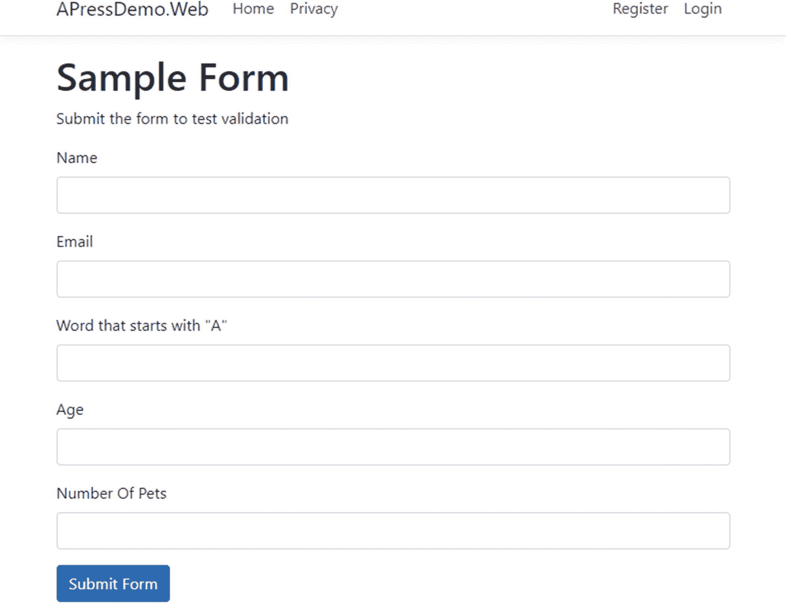
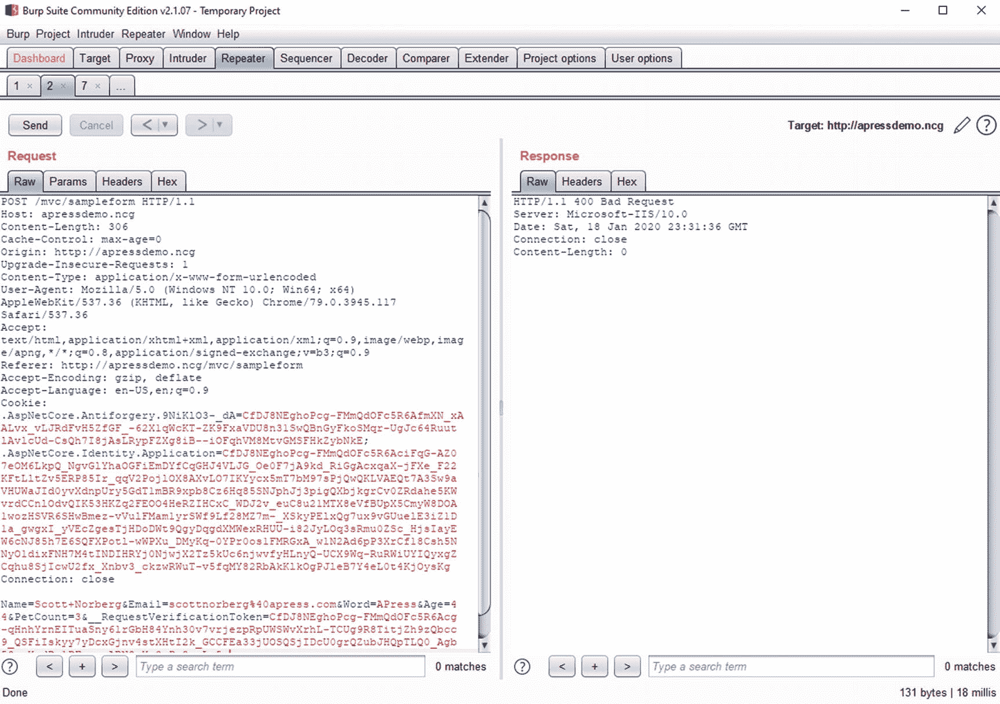
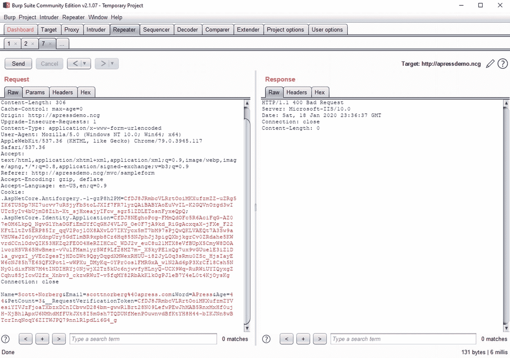
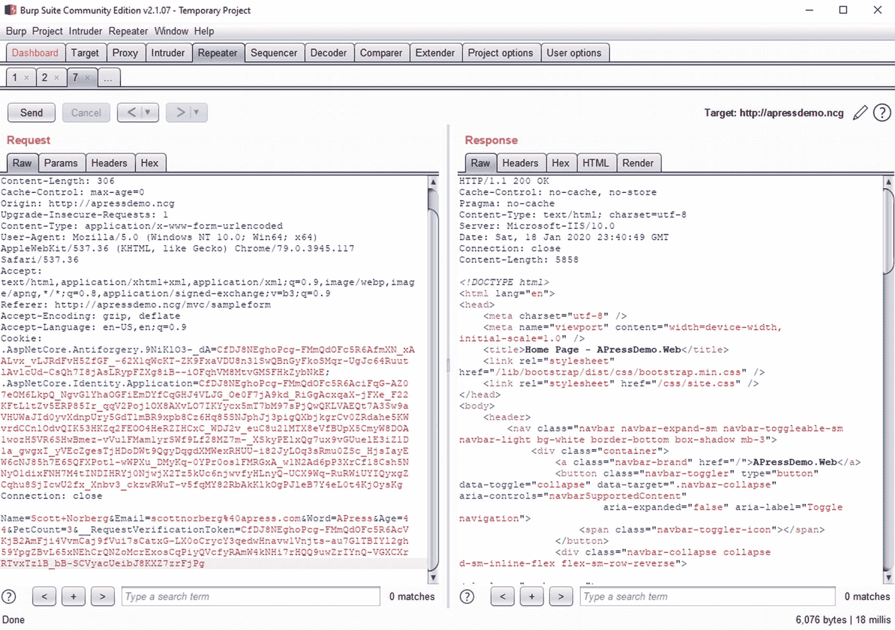
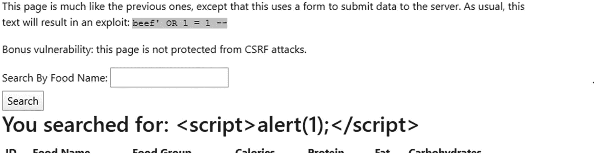

# 六、处理用户输入

至此，我已经介绍了很多关于应用开发安全性的内容。我可以继续讲述更多关于保护网站安全的内容——毕竟，还有一系列针对网站网络、操作系统甚至硬件的攻击，我还没有讲述。但是这些通常不属于大多数软件开发人员的职责范围，因此也不在本书的讨论范围之内。但是我已经非常全面地介绍了应用开发安全性，所以是时候转到防止攻击了。

对我们来说幸运的是，微软一直在努力使每个版本的 ASP.NET 编程更加安全。当按设计使用时，实体框架有助于防止 SQL 注入攻击。内容呈现受到保护，不会受到大多数 XSS 攻击。默认情况下会添加 CSRF 令牌(尽管不一定需要验证)。然而，对我们来说不幸的是，当在足够的和更好的安全性之间进行选择时，ASP.NET 团队总是选择足够的解决方案。此外，如果默认功能不符合我们的需求，如何保持网站的安全还不是很明显。

为了学习如何成功地保护你的网站，我将首先深入研究如何保护自己免受恶意输入。到目前为止，您应该非常熟悉针对您的网站的最常见的攻击，但是您可能想知道如何最好地保护自己免受这些攻击。

## 验证属性

当保护自己免受攻击时，您需要做的第一件事是确保进入系统的信息是您所期望的。通过对传入数据实施规则，您可以防止相当多的攻击。这是怎么做到的？网芯？通过数据绑定模型上的*属性*。为了说明这些验证属性是如何工作的，我将为图 [6-1](#Fig1) 中的表单创建一个后端。



图 6-1

包含五个字段的示例表单

该表单有五个字段:

*   **名称**:必填字段，但没有具体格式。

*   **Email** :必输项，必须为 Email 格式。

*   **以“A”开头的单词**:这是一个必须以字母“A”开头的单词。(我们就当这在这个语境下有意义吧。)

*   **年龄**:年龄必须是 18 到 120 之间的整数。

*   **宠物数量**:必须是小于 65536 的整数。

我们如何验证每一个都有我们期望的数据？再来看后端。第一，Razor 版。

```cs
public class SampleFormModel : PageModel
{
  [BindProperty]
  public SampleModel Model { get; set; }

  public class SampleModel
  {
    [StringLength(100)]
    [Required]
    [Display(Name = "Name")]
    public string Name { get; set; }

    [StringLength(100)]
    [Required]
    [EmailAddress]
    [Display(Name = "Email")]
    public string Email { get; set; }

    [StringLength(20)]
    [Required]
    [RegularExpression("^(a|A)(.*)")]
    [Display(Name = "Word that starts with \"A\"")]
    public string Word { get; set; }

    [Display(Name = "Age")]
    [IsValidAge]
    public int Age { get; set; }

    [Display(Name = "Number Of Pets")]
    public ushort PetCount { get; set; }
  }

  public void OnGet()
  {
    ViewData["Message"] = "Submit the form to test";
  }

  public void OnPost()
  {
    if (ModelState.IsValid)
      ViewData["Message"] = "Data is valid!";
    else
      ViewData["Message"] = "Please correct these errors " + ↲
                            "and try again:";
    }
  }
}

Listing 6-1Razor Page with model validation

```

我希望清单 [6-1](#PC1) 的大部分内容对您来说看起来很熟悉，因为它与微软文档一致。如果没有，我会强调重要的部分:

*   属性告诉框架你需要一个值。

*   `EmailAddress`属性告诉框架你期望一个电子邮件格式的值。还有其他可用的格式，我一会儿会讲到。

*   每当您想要验证一个字段是否具有特定的格式时，`RegularExpression`属性就可以派上用场，但是没有一个现成的选项可以做到这一点。

*   属性限制了可以包含的文本数量，有助于防止各种攻击。

注意`Age`和`PetCount`也有不同的数据类型，分别是`int`和`ushort`。只要有可能，您应该使用数据类型来定义您的属性——这不仅有利于可读性，而且有助于限制攻击者可以用来提交错误数据的字段数量。因为`Age`和`PetCount`是数字，攻击者实际上只能提交对其他三个属性的攻击。

像 EmailAddress 一样，ASP.NET 也有几种特定的格式验证器。下面是一个列表，文档摘自 microsoft.com: <sup>[1](#Fn1)</sup>

*   **【信用卡】**:验证该物业具有信用卡格式

*   **【比较】**:验证模型中的两个属性是否匹配

*   **【email address】**:验证属性为电子邮件格式

*   **【电话】**:验证属性为电话号码格式

*   **【范围】**:验证属性值是否在指定的范围内

*   **【正则表达式】**:验证属性值是否与指定的正则表达式匹配

*   **【必选】**:验证字段不为空

*   **【string length】**:验证字符串属性值没有超过指定的长度限制

*   **【Url】**:验证属性是否具有 Url 格式

但是 is validation 呢？我包括这个是因为我想展示一个定制验证器的例子。在这种情况下，让 18 岁以下的人进入可能会导致法律问题，120 似乎是一个合理的上限，有助于防止自动系统输入明显不好的值，所以让我们编写一个验证器来确保人们的年龄适合使用该表单。

```cs
public class IsValidAge : ↲
  System.ComponentModel.DataAnnotations.ValidationAttribute
{
  protected override ValidationResult IsValid(object value,
    ValidationContext validationContext)
  {
    int age;

    if (value == null || ↲
        !int.TryParse(value.ToString(), out age))
      return new ValidationResult("Age must be a number");

    if (age < 18 || age > 120)
      return new ValidationResult(
        "You must be at least 18 years old " +
           "and younger than 120 years old");

    return ValidationResult.Success;
  }
}

Listing 6-2Source code for custom model validator

```

清单 [6-2](#PC2) 里是怎么回事？这是一个继承自`System.ComponentModel.DataAnnotations.ValidationAttribute`的类。要创建一个有效的属性，您需要做的就是覆盖`IsValid`方法，然后一旦您能够确定检查是成功还是失败，就返回一个`ValidationResult`(如果检查失败，则返回一个描述性的错误消息)。

Tip

当您需要做的只是正则表达式匹配时，您可能还想使用自定义验证器，但是您想返回一个比“字段[名称]必须匹配正则表达式[正则表达式]”更好的错误消息

如果您擅长对所有数据元素使用限制性的数据类型，那么您将在防止许多攻击方面走得很远。黑客不仅需要找到导致他们攻击成功的输入，他们还需要绕过你已有的任何验证。这当然不是万灵药，但这是一个良好的开端。

Caution

创建正则表达式验证时一定要小心。您可以很容易地创建过于严格的过滤。例如，您可能认为您只能接受英文字母表中的字母作为名字，但您可能会遇到像 arko(像 NBA 球员 arko abarkapa)、Karl-Anthony(像 NBA 球员 Karl-Anthony Towns)或 D'Brickashaw(像 NFL 球员 D'Brickashaw Ferguson)这样的名字。你选择接受什么将在很大程度上取决于你的网站的目的和受众。

在我们继续之前，请注意`OnPost`方法中的`if (ModelState.IsValid)`检查。框架会自动检查验证，但是您必须手动验证这些检查的结果。如果您不这样做，您可能有绝对完美的验证设置，垃圾数据将进入，因为验证失败的检查从未发生。

Caution

不，仅仅用 JavaScript 验证数据的正确性是不够的。还记得我在第 [4](04.html) 章中如何更改密码并使用 Burp Suite 重新提交表单吗？绕过了所有的 JavaScript 检查。在 JavaScript 中确保输入正确没有真正的安全价值；它只是通过比完整的发布过程更快地提供反馈来改善你的网站的用户体验。

为了完整起见，这里有相同的 MVC 代码。

```cs
public class MvcController : Controller
{
  [HttpGet]
  public IActionResult SampleForm()
  {
    ViewData["Message"] = "Submit the form to test";
    return View();
  }

  [HttpPost]
  public IActionResult SampleForm(SampleModel model)
  {
    if (ModelState.IsValid)
      ViewData["Message"] = "Data is valid!";
    else
      ViewData["Message"] = "Please correct these errors " +
                            "and try again:";

    return View();
  }
}

Listing 6-3Controller method for our sample form

```

清单 [6-3](#PC3) 中没有太多内容，因为所有的验证逻辑都存储在`SampleModel`类中，这是 POST 方法中的一个参数。因此，在清单 [6-4](#PC4) 中有一个为 MVC 构建的类。

```cs
public class SampleModel
{
  [StringLength(100)]
  [Required]
  [Display(Name = "Name")]
  public string Name { get; set; }

  [StringLength(100)]
  [Required]
  [EmailAddress]
  [Display(Name = "Email")]
  public string Email { get; set; }

  [StringLength(20)]
  [Required]
  [RegularExpression("^(a|A)(.*)")]
  [Display(Name = "Word that starts with \"A\"")]
  public string Word { get; set; }

  [Display(Name = "Age")]
  [IsValidAge]
  public int Age { get; set; }

  [Display(Name = "Number Of Pets")]
  public ushort PetCount { get; set; }
}

Listing 6-4Model for our sample MVC form

```

这是同一个班；除了这一次，它不是`Controller`或`PageModel`中的嵌套类。否则，Razor 页面和 MVC 版本之间的功能是完全相同的。

### 验证文件上传

上传文件呢？如果我们允许用户上传他们自己的文件，我们需要注意文件本身的安全。您可以做些什么来检查文件是否可以安全使用？

*   确保扩展名与上传的目的相匹配。例如，如果你想要图像文件，只允许上传 jpg、gif 和 png 文件。

*   限制文件的大小。

*   对文件进行病毒扫描。

*   检查文件内容以获得准确的文件签名。

前三个应该相当简单。前两个可以通过查看服务器中的文件对象来检查，定期运行病毒扫描应该是您可以定期做的事情。但是第四项可能需要解释一下。许多不同的文件类型都有一个所谓的*文件签名*，或者文件中的一系列字节(通常在开头),这对该类型的所有文件都是通用的。例如，如果您打开一个 gif 图像，您应该会看到文件以“GIF87a”或“GIF89a”开头。 <sup>[2](#Fn2)</sup> 如果你要寻找常见图像格式的签名，那么一个验证器会是什么样子？清单 [6-5](#PC5) 给出了一个例子。

```cs
public class ImageFile : ValidationAttribute
{
  protected override ValidationResult IsValid(object value,
    ValidationContext validationContext)
  {
    if (!(value is IFormFile))
      return new ValidationResult("This attribute can only " +
        "be used on an IFormFile");

    byte[] fileBytes;

    var asFile = (IFormFile)value;

    using (var stream = asFile.OpenReadStream())
    {
      fileBytes = new byte[stream.Length];

      for (int i = 0; i < stream.Length; i++)
      {
        fileBytes[i] = (byte)stream.ReadByte();
      }
    }

    var ext = System.IO.Path.GetExtension(asFile.FileName);

    switch (ext)
    {
      case ".jpg":
      case ".jpeg":
      //If the first three bytes don't match the expected,
      //fail the check
        if (fileBytes[0] != 255 ||
            fileBytes[1] != 216 ||
            fileBytes[2] != 255)
          return new ValidationResult("Image appears not " +
            "to be in jpg format. Please try another.");
      //If the fourth byte doesn't match one of the four
      //expected values, fail the check
        else if (fileBytes[3] != 219 &&
                 fileBytes[3] != 224 &&
                 fileBytes[3] != 238 &&
                 fileBytes[3] != 225)
          return new ValidationResult("Image appears not " +
            "to be in jpg format. Please try another.");
        else
          //All expected bytes match
          return ValidationResult.Success;

      case ".gif":
        //If bytes 1-4 and byte 6 aren't as expected,
        //fail the check
        if (fileBytes[0] != 71 ||
            fileBytes[1] != 73 ||
            fileBytes[2] != 70 ||
            fileBytes[3] != 56 ||
            fileBytes[5] != 97)
          return new ValidationResult("Image appears not " +
            "to be in gif format. Please try another.");

        //If the fifth byte doesn't match one of the
        //expected values, fail the check
        else if (fileBytes[4] != 55 && fileBytes[4] != 57)
          return new ValidationResult("Image appears not " +
            "to be in gif format. Please try another.");
        else
          return ValidationResult.Success;
      case ".png":
        if (fileBytes[0] != 137 ||
            fileBytes[1] != 80 ||
            fileBytes[2] != 78 ||
            fileBytes[3] != 71 ||
            fileBytes[4] != 13 ||
            fileBytes[5] != 10 ||
            fileBytes[6] != 26 ||
            fileBytes[7] != 10)
          return new ValidationResult("Image appears not " +
            "to be in png format. Please try another.");
        else
          return ValidationResult.Success;
      default:
        return new ValidationResult($"Extension {ext} " +
          "is not supported. Please use gif, png, or jpg.");
    }

    //We shouldn't reach this line – add logging for the error
    throw new InvalidOperationException("Last line " +
      "reached in validating the ImageFile");
  }
}

Listing 6-5Validator for image file signatures

```

当然，您可以更改此方法以允许其他文件格式，运行防病毒检查程序，检查文件大小等。但这是一个开始的地方。

Note

如果我没有在每个 case 块中包含`else`并在最后一行中返回`ValidationResult.Success`，代码会更易读，但是这样做的话，我会导致*打开*失败。我建议养成让*关闭*失败的习惯，这样如果发生意外，这个方法就会失败。你可以很容易地重构这段代码，这样你就有了看起来像“`if (IsValidJpg(asFile)) return ValidationResult.Success;`”的代码，并且在继续失败关闭的同时使代码更可读。

除了检查文件内容，您还应该确保执行以下操作:

*   不要在您的文件系统中使用原始文件名，这既是为了防止各种操作系统攻击，也是为了使黑客在侵入您的服务器时更难找到该文档。

*   不要使用原来的扩展名，以防脚本碰巧通过。相反，使用操作系统无法识别的扩展名，如“.网络上传”。

*   将文件存储在服务器上，而不是 web 服务器本身。Blob 存储，无论是在云中还是在数据库中，都可能是最安全的。否则，将文件保存在单独的服务器上。

*   考虑将您的文件服务器放在与您的主要 web 资产完全不同的域中。例如，Twitter 将其图片放在“twimg.com”域中。这不仅有助于在图像服务器受损时保护您，而且有助于在同时上传和/或请求许多图像时提高可伸缩性。

最后，为了保护自己免受 GIFARs 之类文件的攻击，可以通过编程将文件转换成类似的东西，比如将图像转换成位图或缩小 1%。

### 用户输入和检索文件

如果您决定将文件存储在文件系统中，并允许用户检索这些文件，那么您需要非常小心地从服务器获取这些文件。你们中的许多人都见过(或者甚至自己编写过)一个链接到文件名的应用，然后使用类似这样的东西从文件系统中获取文件。

```cs
public class GetController : Controller
{
  IHostingEnvironment _hostEnv;

  public GetController(IHostingEnvironment hostEnv)
  {
    _hostEnv = hostEnv;
  }

  public IActionResult File(string fileName)
  {
    var path = _hostEnv.ContentRootPath + "\\path\\" +
      fileName;

    using (var stream = new FileStream(path, FileMode.Open))
    {
      return new FileStreamResult(stream, "application/pdf");
    }
  }
}

Listing 6-6Code to retrieve files from the file system

```

但是如果用户提交一个名为“”的“文件”,清单 [6-6](#PC6) 中的代码会发生什么呢..\..\web.config "？在这种情况下，用户将获得您的配置文件。或者他们可以用同样的方法获取您的 app.config 文件。或者，如果有足够的耐心，他们可能会窃取您的一些敏感的操作系统文件。

你如何防止这种情况发生？有两种方法。更安全的方法是给用户一个 ID，而不是一个文件名，并通过查找 ID 来获得文件名。如果，不管什么原因，那是绝对不可能的，你可以使用`Path.GetInvalidFileNameChars()`方法，如清单 [6-7](#PC7) 所示。

```cs
public class GetController : Controller
{
  IHostingEnvironment _hostEnv;

  public GetController(IHostingEnvironment hostEnv)
  {
    _hostEnv = hostEnv;
  }

  public IActionResult File(string fileName)
  {
    foreach (char invalid in Path.GetInvalidFileNameChars())
    {
      if (fileName.Contains(invalid))
      {
        throw new InvalidOperationException(
          $"Cannot use file names with {invalid}");
      }
    }

    var path = _hostEnv.ContentRootPath + "\\path\\" +
      fileName;

    using (var stream = new FileStream(path, FileMode.Open))
    {
      return new FileStreamResult(stream, "application/pdf");
    }
  }
}

Listing 6-7Using Path.GetInvalidFileNameChars()

```

如果你只是在读取一个文件的内容，同样的概念也适用。大多数黑客会乐于在你的屏幕上看到敏感的配置或操作系统文件的内容，而不是得到一份拷贝。

## CSRF 保护

接受用户输入时，您需要担心的另一件事是，犯罪分子是否在恶意代表他人提交信息。关于正确的认证和授权，有许多事情需要做，我将在后面介绍，但是为了与本章的主题保持一致，您确实需要担心 CSRF 攻击。对我们来说幸运的是，ASP.NET 有相对容易实施的 CSRF 保护。首先，让我们保护上一节中的示例免受 CSRF 攻击，在清单 [6-8](#PC8) 中用粗体添加了保护代码。

```cs
public class MvcController : Controller
{
  [HttpGet]
  public IActionResult SampleForm()
  {
    ViewData["Message"] = "Submit the form to test";
    return View();
  }

  [ValidateAntiForgeryToken]
  [HttpPost]
  public IActionResult SampleForm(SampleModel model)
  {
    if (ModelState.IsValid)
      ViewData["Message"] = "Data is valid!";
    else
      ViewData["Message"] = "Please correct these errors " +
                            "and try again:";

    return View();
  }
}

Listing 6-8CSRF protection in MVC

```

就这样。您所需要做的就是将[ValidateAntiForgeryToken]属性添加到方法中，如果令牌丢失，ASP.NET 将抛出一个`400 Bad Request`。你也可以让你的网站检查每篇帖子上的 CSRF 令牌，如清单 [6-9](#PC9) 所示。

```cs
public class Startup
{
  //Constructors and properties
  public void ConfigureServices(IServiceCollection services)
  {
    //Redacted
    services.AddControllersWithViews(o => o.Filters.Add(
      new AutoValidateAntiforgeryTokenAttribute()));
    services.AddRazorPages();
  }

  // public void Configure…
}

Listing 6-9Startup.cs change to check for CSRF tokens everywhere

```

我们甚至不需要为 Razor 页做那么多——CSRF 检查是自动完成的。

Note

CSRF 有助于防止攻击者代表用户提交请求。换句话说，CSRF 有助于防止攻击者利用用户的认证 cookies，并以受害者的身份执行操作。那么*未认证的*页面呢？在未经验证的页面中使用 CSRF 检查有什么需要保护的吗？答案是肯定的，因为验证 CSRF 令牌可以防止有人在没有进行某种检查的情况下向您的公共访问表单(如“联系我”表单)发送垃圾邮件。但是任何黑客都可以简单地进行 GET，获取令牌和头，填充数据，然后发布它们的内容。但是由于令牌不应该损害用户的体验，所以让令牌检查所有页面实际上没有任何害处。

我希望您现在想知道:ASP。NET 的 CSRF 保护工作，它到底保护什么？毕竟，我谈到了双重提交 Cookie 模式并不是那么有用。所以，我们再深入挖掘一下。首先，让我们看看清单 [6-10](#PC10) 中为屏幕截图中的表单生成的 HTML。

```cs
<!DOCTYPE html>
<html lang="en">
<head>
  <<redacted>>
</head>
<body>
  <!-- Navigation and header removed -->
  <form method="post">
    <!-- Input fields removed for brevity -->
    <div class="form-group">
      <button type="submit" class="btn btn-primary">
        Submit Form
      </button>
    </div>
    <input name="__RequestVerificationToken" type="hidden"
      value="CfDJ8CJsmjHzXfJEiWvqrphZO5ymuIt1HTe4mgggK248YdxA↲
        nTDRzO3_neEvDvfbmTVBADDzBGjNnWbESzFyx3TX4wWdZwC-8fmpd↲
        7q-5S_837pmHid3sYaZdAkXUxcvKLaIDHepCKvZz-vU4nnjNJ27lE↲
        o" />
  </form>
  <!-- More irrelevant content removed -->
</body>
</html>

Listing 6-10HTML generated for our test form (MVC)

```

框架将为您提供的最后一个输入是`__RequestVerificationToken`。这是 ASP.NET 用来验证帖子的令牌。由于 Web 是无状态的，ASP.NET 如何验证这是一个有效的令牌呢？清单 [6-11](#PC11) 包含了一个经过认证的用户的整个帖子。

```cs
POST http://apressdemo.ncg/mvc/sampleform HTTP/1.1
Host: apressdemo.ncg
Proxy-Connection: keep-alive
Content-Length: 306
Cache-Control: max-age=0
Origin: http://apressdemo.ncg
Upgrade-Insecure-Requests: 1
Content-Type: application/x-www-form-urlencoded
User-Agent: Mozilla/5.0 (Windows NT 10.0; Win64; x64) ↲
  AppleWebKit/537.36 (KHTML, like Gecko) Chrome/79.0.3945.117↲
  Safari/537.36
Accept: text/html,application/xhtml+xml,application/xml;↲
  q=0.9,image/webp,image/apng,*/*;q=0.8,application/signed-↲
  exchange;v=b3;q=0.9
Referer: http://apressdemo.ncg/mvc/sampleform
Accept-Encoding: gzip, deflate
Accept-Language: en-US,en;q=0.9
Cookie: .AspNetCore.Antiforgery.9NiKlO3-_dA=CfDJ8NEghoPcg-FMm↲
  QdOFc5R6AfmXN_xAALvx_vLJRdFvH5ZfGF_-62X1qWcKT-ZK9FxaVDU8n31↲
  SwQBnGyFkoSMqr-UgJc64RuutlAvlcUd-CsQh7I8jAsLRypFZXg8iB—iOFq↲
  hVM8MtvGMSFHkZybNkE; .AspNetCore.Identity.Application=↲
  <<removed for brevity>>

Name=Scott+Norberg&Email=scottnorberg%40apress.com&Word=APress&Age=39&PetCount=0&__RequestVerificationToken=<<removed>>

Listing 6-11Raw request data for form POST

```

所以看起来 ASP.NET 使用了类似于双重提交 Cookie 模式的东西，但它并不完全相同。为了证明这一点，下面是与 cookie 相比较的请求令牌的前十个字符。

表 6-1

CSRF 代币大战饼干

<colgroup><col class="tcol1 align-left"> <col class="tcol2 align-left"></colgroup> 
| 

类型

 | 

值的开始

 |
| --- | --- |
| 代币 | CfDJ8CJsmj... |
| 饼干 | CfDJ8NEgho... |

每一个都以“CfDJ8”开头，但是有所不同，所以您知道 ASP.NET 没有使用双重提交 Cookie 模式。我将深入研究源代码，向您展示发生了什么，但首先，我想带您了解一些针对此功能的攻击，原因有两个。第一，不用看代码就能看出令牌保护在实弹射击的情况下做了什么(和没做什么)。第二，它给了你更多攻击是如何发生的例子。

第一次攻击:让我们看看是否可以使用不同用户的 CSRF 令牌。换句话说，来自图 [6-2](#Fig2) 中的屏幕截图的结果包括来自一个用户的认证令牌，但是包括来自另一个用户的 CSRF 令牌。



图 6-2

利用从另一个用户处窃取的令牌进行 CSRF 攻击

好的，你可以从右边的响应中看到，我得到了一个`400 Bad Request`，表示令牌无效。这意味着我将无法注册这项服务，拿走我的 CSRF 代币，然后用它们来攻击其他人。太好了。现在，让我们看看我是否可以使用不同站点的令牌，但使用相同的用户名。



图 6-3

CSRF 用从另一个网站窃取令牌进行攻击

图 [6-3](#Fig3) 中的文本可能有点小，但是我希望你能在这个截图中看到令牌是不同的。不过，我保持了认证令牌不变，所以很可能令牌本身有一些地方是站点不喜欢的。

现在，我们可以从一个页面到下一个页面重用令牌吗？我不会展示这个页面的截图，但我可以确认，是的，令牌可以从一个页面重用到下一个页面。

为了确保我没有弄错，我又试了一次原来的代币。



图 6-4

用原始 CSRF 代币邮寄

在图 [6-4](#Fig4) 中可以看到好消息和坏消息。好消息是，我在测试中没有搞砸任何事情——是令牌，而不是其他错误，导致了前面的截图失败。坏消息呢？没有什么能阻止我再次使用同一个令牌。虽然我没有这方面的截图，但我昨天的测试证明，24 小时前的令牌仍然有效。简而言之，ASP.NET 的 CSRF 保护比双重提交 Cookie 模式好得多，但如果令牌被盗，黑客就可以永远在该用户的每个页面上使用这些令牌。

在我们着手解决这个问题之前，让我们深入研究一下源代码，以验证这些令牌确实是特定于用户的。(你不需要理解这段代码的每一行，只要大致了解它在做什么就可以了。)

```cs
using System;
using System.Collections.Generic;
using System.Security.Claims;
using System.Security.Principal;
using Microsoft.AspNetCore.Http;

namespace Microsoft.AspNetCore.Antiforgery
{
  internal class DefaultAntiforgeryTokenGenerator :
    IAntiforgeryTokenGenerator
  {
    private readonly IClaimUidExtractor _claimUidExtractor;
    private readonly IAntiforgeryAdditionalDataProvider ↲
      _additionalDataProvider;

    public DefaultAntiforgeryTokenGenerator(
      IClaimUidExtractor claimUidExtractor,
      IAntiforgeryAdditionalDataProvider ↲
        additionalDataProvider)
    {
      _claimUidExtractor = claimUidExtractor;
      _additionalDataProvider = additionalDataProvider;
    }

    /// <inheritdoc />
    public AntiforgeryToken GenerateCookieToken()
    {
      return new AntiforgeryToken()
      {
        // SecurityToken will be populated automatically.
        IsCookieToken = true
      };
    }

    /// <inheritdoc />
    public AntiforgeryToken GenerateRequestToken(
      HttpContext httpContext,
      AntiforgeryToken cookieToken)
    {
      //Skip null reference checks for brevity

      var requestToken = new AntiforgeryToken()
      {
        SecurityToken = cookieToken.SecurityToken,
        IsCookieToken = false
      };

      var isIdentityAuthenticated = false;

      // populate Username and ClaimUid
      var authenticatedIdentity = ↲
        GetAuthenticatedIdentity(httpContext.User);
      if (authenticatedIdentity != null)
      {
        isIdentityAuthenticated = true;
        requestToken.ClaimUid = GetClaimUidBlob(↲
          _claimUidExtractor.ExtractClaimUid(↲
            httpContext.User));

        if (requestToken.ClaimUid == null)
        {
          requestToken.Username = authenticatedIdentity.Name;
        }
      }

      // populate AdditionalData
      if (_additionalDataProvider != null)
      {
        requestToken.AdditionalData = _additionalDataProvider↲
          .GetAdditionalData(httpContext);
      }

      //Code to throw exception for bad user ID removed

      return requestToken;
    }

    /// <inheritdoc />
    public bool IsCookieTokenValid(↲
      AntiforgeryToken cookieToken)
    {
      return cookieToken != null && cookieToken.IsCookieToken;
    }

    /// <inheritdoc />
    public bool TryValidateTokenSet(
      HttpContext httpContext,
      AntiforgeryToken cookieToken,
      AntiforgeryToken requestToken,
      out string message)
    {
      //Null and format checks removed

      // Is the incoming token meant for the current user?
      var currentUsername = string.Empty;
      BinaryBlob currentClaimUid = null;

      var authenticatedIdentity = ↲
        GetAuthenticatedIdentity(httpContext.User);
      if (authenticatedIdentity != null)
      {
        currentClaimUid = GetClaimUidBlob(_claimUidExtractor.↲
          ExtractClaimUid(httpContext.User));
        if (currentClaimUid == null)
        {
          currentUsername = authenticatedIdentity.Name ↲
                              ?? string.Empty;
        }
      }

      //Scheme (http vs. https) check removed

      if (!comparer.Equals(requestToken.Username, ↲
        currentUsername))
      {
        message = Resources.FormatAntiforgeryToken_↲
          UsernameMismatch(requestToken.Username,
            currentUsername);
        return false;
      }

      if (!object.Equals(requestToken.ClaimUid, ↲
        currentClaimUid))
      {
        message = Resources.AntiforgeryToken_ClaimUidMismatch;
        return false;
      }

      // Is the AdditionalData valid?
      if (_additionalDataProvider != null && ↲
          !_additionalDataProvider.ValidateAdditionalData( ↲
            httpContext, requestToken.AdditionalData))
      {
        message = Resources.AntiforgeryToken_↲
          AdditionalDataCheckFailed;
        return false;
      }

      message = null;
      return true;
    }

    private static BinaryBlob GetClaimUidBlob(string ↲
      base64ClaimUid)
    {
      //Code removed for brevity
    }
  }
}

Listing 6-12Source code for the DefaultAntiforgeryTokenGenerator3

```

清单 [6-12](#PC12) 包含大量代码，你不需要理解每一行。但是这段代码中有两点。第一，ASP.NET 确实在可能的情况下将用户 ID 合并到他们的 CSRF 令牌中，这应该是防止大多数 CSRF 攻击的非常有效的方式。为了成功地实现对 ASP.NET 站点的 CSRF 攻击，攻击者需要有有效的令牌，而不是猜测或制造。第二，这段代码支持通过`IAntiforgeryAdditionalDataProvider`向令牌添加额外的数据。我将探讨如何利用这一点来最小化令牌被盗所造成的伤害。

### 使用 IAntiforgeryAdditionalDataProvider 扩展反 CSRF 检查

只要我破解了 ASP.NET 的核心代码，让我们看看清单 [6-13](#PC13) 中`IAntiforgeryAdditionalDataProvider`接口的源代码。 <sup>[4](#Fn4)</sup>

```cs
using Microsoft.AspNetCore.Http;

namespace Microsoft.AspNetCore.Antiforgery
{
  public interface IAntiforgeryAdditionalDataProvider
  {
    string GetAdditionalData(HttpContext context);

    bool ValidateAdditionalData(HttpContext context, ↲
      string additionalData);
  }
}

Listing 6-13Source for IAntiforgeryAdditionalDataProvider

```

如果您仔细查看一下`DefaultAntiforgeryTokenGenerator`的源代码，您会发现它不支持多个附加数据。查看接口本身似乎可以确认它定义了两个方法:`GetAdditionalData`和`ValidateAdditionalData`，每个方法都将“附加数据”视为单个字符串。这是一个小小的限制，但是我们可以解决。首先，我会尽量防止被盗代币永远有效。一个简单的方法是在令牌上设置一个截止日期，如清单 [6-14](#PC14) 所示。

```cs
using Microsoft.AspNetCore.Antiforgery;
using Microsoft.AspNetCore.Http;
using System;

namespace Advanced.Security.V3.AntiCSRF
{
  public class CSRFExpirationCheck :↲
    IAntiforgeryAdditionalDataProvider
  {
    private const int EXPIRATION_MINUTES = 10;

    public string GetAdditionalData(HttpContext context)
    {
      return DateTime.Now.AddMinutes(EXPIRATION_MINUTES) ↲
        .ToString();
    }

    public bool ValidateAdditionalData(HttpContext context,
      string additionalData)
    {
      if (string.IsNullOrEmpty(additionalData))
        return false;

      DateTime toCheck;

      if (!DateTime.TryParse(additionalData, out toCheck))
        return false;

      return toCheck >= DateTime.Now;
    }
  }
}

Listing 6-14Sample implementation of IAntiforgeryAdditionalDataProvider

```

最后，您需要让框架知道这个服务是可用的。幸运的是，这很容易做到。只需将这行代码添加到您的`Startup`类中。

```cs
public class Startup
{
  //Constructors and properties
  public void ConfigureServices(IServiceCollection services)
  {
    //Other services
    services.AddSingleton<IAntiforgeryAdditionalDataProvider,↲
      CSRFExpirationCheck>();
  }
}

Listing 6-15Adding our additional CSRF check to the framework’s services

```

使用清单 [6-15](#PC15) 中的代码行，我将`CSRFExpirationCheck`类添加到服务列表中，并告诉框架它正在实现`IAntiforgeryAdditionalDataProvider`接口。现在，每当框架(具体来说，`DefaultAntiforgeryTokenGenerator`类)请求实现这个接口的类时，将返回自定义的`CSRFExpirationCheck`类。

数据提供者的代码应该相当简单。`GetAdditionalData`返回今天的日期加上几分钟(在这个例子中我用了 10 分钟，5 到 60 分钟之间的任何时间都可能适合您的需要)。如果该日期晚于表单的实际提交日期，则返回 true。有了这段代码，您就可以避免恶意用户滥用大多数形式的令牌。

但是，这段代码并不阻止多次使用令牌，也不阻止在多个页面上使用令牌。您还可以做些什么来帮助提高安全性？

*   在令牌中包含页面 URL，然后根据 context.Request.Path 进行验证

*   包括当前页面和到期日期，用|(管道)将两者分开。

*   包括现时并将该现时存储在数据库中。一旦使用了 nonce，拒绝将来包含它的请求。

*   使用 nonce，但是在你的 nonce 存储中，包括一个截止日期和 web 路径。验证每个请求中的所有三项。

在大多数情况下，包含截止日期就足够了。它比 ASP 提供了更多的保护。NET 的 CSRF 令牌检查会自动完成，而不需要您创建自己的 nonce 存储。如果你决定走 nonce 路线，你也可以包括一个截止日期和当前的 web 路径。

Tip

如果您决定创建和存储随机数，请注意,`IAntiforgeryTokenGenerator`是一个`Singleton`服务，因此您不能使用`Scoped`实体框架服务。当然，您仍然可以使用数据库存储；除了 EF 服务之外，您只需要找到另一种从数据库获取数据的方法。无论是创建数据库上下文的新实例，还是使用 ADO.NET，都应该可以正常工作。

### CSRF 和阿贾克斯

如果你想通过 AJAX 发送一个帖子呢？如果用 JavaScript 创建 POST 数据，表单中的 CSRF 令牌不会被发送回来。您可以将令牌作为表单数据包含在您的帖子中，但这有点尴尬。你能做什么？

原来框架在两个地方寻找这个令牌:表单中的“__ `RequestVerificationToken`”内，或者头中的“`RequestVerificationToken`”内。(注意头值缺少双下划线。)将这个值添加到 AJAX 帖子的标题应该很简单。您的具体代码将取决于您使用的 JavaScript 框架，但是清单 [6-16](#PC16) 展示了一个使用 jQuery 的例子。

```cs
$.ajax({
  type: "POST",
  beforeSend: function (request) {
    request.setRequestHeader("RequestVerificationToken",
      $("[name='__RequestVerificationToken']").val());
  },
  url: some_url,
  success: function (response) {
    //Do something with the response data here
  }
});

Listing 6-16Adding a CSRF token to a jQuery POST

```

坦率地说，我觉得这种解决方案既尴尬又烦人，但它几乎不费吹灰之力就完成了工作。

### 当 CSRF 代币不够的时候

对于额外的敏感操作，如密码更改请求或大额事务，您可能需要做的不仅仅是使用 CSRF 令牌来保护您的邮件。在这些情况下，要求用户再次提交密码有助于防止更多的 CSRF 攻击。这个动作会让你的用户很恼火，你不会想在每个页面的每个表单上都这样做，但是大多数人会理解(甚至欣赏)围绕最敏感动作的额外安全性。

Caution

如果您认为敏感操作需要密码，而 CSRF 令牌可以获取任意数据，那么我可以将用户的密码包含在 CSRF 令牌中，而不会损害可用性，我不会感到惊讶。我的建议是:不要这样做。您不仅没有提供任何额外的保护来抵御 CSRF 攻击，还可能将用户的密码暴露给黑客。

## 防止垃圾邮件

如果您使用 CSRF 令牌并打开 CSRF 检查您可公开访问的表单，您将大大有助于防止广告商(以及可能会引起 DoS 攻击的恶意行为者)向您发送垃圾邮件和不需要的表单提交。(如果你收到了任何带有“联系我”功能的网站的通知，你应该很清楚我在说什么。)正如我前面提到的，可以通过执行一个请求并确保返回任何头和令牌来解决这个问题。所以，如果你想阻止更多的垃圾邮件，就需要一些更强大的东西。

一种方法是通过验证码，或者完全自动化的公共图灵测试来区分计算机和人类。如果你在网上，你可能见过它们——它们是你需要写下图像中的波浪文字、做一道简单的数学题，或者最烦人的，点击所有的汽车、灯、标志等的支票。在一个 4x4 的图像网格中。令人惊讶的是，这些验证码大部分是免费的。其中最常见的是由谷歌提供的 reCAPTCHA，它是完全免费的，不到一个小时就可以安装完毕。<sup>6[6](#Fn6)T7】</sup>

非常老的网站免费提供服务，因为他们想将书籍数字化。他们给了你两个词，一个用来证明你是人类，另一个用来帮助你阅读要数字化的书中的文本。 <sup>[7](#Fn7) 最新和最受欢迎的是由谷歌提供的。鉴于这是谷歌，我猜他们正在使用 reCAPTCHA 来获得更多的网站使用数据，这对你的用户来说是一个隐私风险。同样，reCAPTCHA 非常受欢迎，但如果隐私是一个问题，那么也许谷歌产品不应该是你的首选。</sup>

我最近遇到的一个想法是在页面上有一两个输入元素，它们要么在屏幕外，要么以某种方式不可见(最好不要让输入元素本身不可见，这样机器人很容易找到)。如果这些隐藏的输入被填充，那么您可以合理地确定提交来自某种类型的机器人。

长话短说，虽然，没有简单的，好的，可靠的方法来真正减少垃圾邮件而不严重影响您的用户。关于如何最好地保护你自己的网页，没有“正确”的答案——我的建议是尝试不同的选择，看看什么最适合你。

## 批量分配

我们需要讨论的另一个漏洞叫做*批量赋值*。批量分配基本上是允许攻击者利用隐藏属性来更新数据库的术语。我怀疑这是否清楚，所以让我们深入一个例子。假设你有一个博客网站，非常成功，有成千上万的博客作者。博客可以进入他们的门户网站，写博客，保存未完成的博客，然后在准备好的时候请求发布。然后，管理员可以进入并发布博客(代码未显示)。博客类看起来像清单 [6-17](#PC17) 。

```cs
public class Blog
{
  public int BlogId { get; set; }
  public string BlogTitle { get; set; }
  public string BlogContent { get; set; }
  public DateTime LastUpdated { get; set; }
  public string CreatedBy { get; set; }
  public bool IsPublished { get; set; }
}

Listing 6-17Hypothetical blog class

```

在清单 [6-18](#PC18) 的例子中，供用户编辑未发布的博客的页面可能如下所示。

```cs
@model Blog

@{
    ViewData["Title"] = "Edit Unpublished Blog";
}

<h1>Edit Blog</h1>

<div class="row">
  <div class="col-md-4">
    <form method="post">
      <div asp-validation-summary="ModelOnly"
           class="text-danger"></div>
      <input type="hidden" asp-for="BlogId" />
      <div class="form-group">
        <label asp-for="BlogTitle"
               class="control-label"></label>
        <input asp-for="BlogTitle" class="form-control" />
        <span asp-validation-for="BlogTitle"
              class="text-danger"></span>
      </div>
      <div class="form-group">
        <label asp-for="BlogContent"
               class="control-label"></label>
        <textarea asp-for="BlogContent"
                  class="form-control" />
        <span asp-validation-for="BlogContent"
              class="text-danger"></span>
      </div>
      <div class="form-group">
        <input type="submit"
               value="Save"
               class="btn btn-primary" />
      </div>
    </form>
  </div>
</div>

Listing 6-18Hypothetical page to edit unpublished blogs

```

请注意，这个页面不包括`LastUpdated`、`CreatedBy`或`IsPublished`标签，因为它们不应该从这个表单更新。然而，为了节省编写代码的时间，不安全的开发人员会重用`Blog`类作为保存到数据库的模型和实体框架对象。下面是控制器类可能的样子(为了简洁起见，去掉了必要的检查)。

```cs
[HttpGet]
public IActionResult EditUnpublishedBlog(int? id)
{
  //Check to make sure “id” is an integer

  var blog = _context.Blog.FirstOrDefaultAsync(
                m => m.BlogId == id).Result;

  //Check to make sure that the blog exists and that the user
  //has the rights to edit it

  //Everything checks out, render the page
  return View(blog);
}

[ValidateAntiForgeryToken]
[HttpPost]
public IActionResult EditUnpublishedBlog(Blog model)
{
  //Check ModelState.IsValid

  var dbBlog = _context.Blog.FirstOrDefaultAsync(
                m => m.BlogId == model.BlogId).Result;

  //Check to make sure user has the rights to edit this blog

  //Keep the original information on who created this entry
  model.CreatedBy = dbBlog.CreatedBy;
  model.LastUpdated = DateTime.Now;
  //Skip model.IsPublished – the default is false
  //and users cannot edit published blogs anyway

  _context.Attach(model).State = EntityState.Modified;

  var result = _context.SaveChangesAsync().Result;

  return RedirectToAction("Index");
}

Listing 6-19Hypothetical controller method to update an unpublished blog

```

除了遗漏的检查，清单 [6-19](#PC19) 看起来完全是合理的代码，不是吗？但是在这种情况下，ASP.NET 框架不知道你不想更新`IsPublished`属性。攻击者可以打开 Burp 并在请求的末尾加上“& IsPublished=true”来发布博客，这样做可以完全绕过管理员的审批过程。这种攻击被称为*大规模任务*。

为了防止这种攻击的发生，您需要确保您的模型对象只包含您想要在特定页面上更新的属性。是的，这可能意味着您将有重复的代码，因为一个页面上需要的属性可能与另一个页面上的属性不完全相同，所以您必须为每个页面创建相似(但独立)的对象。但是，做任何其他事情都有可能让攻击者发现并利用您的数据绑定代码无意中暴露的属性。

为了向您展示这是如何工作的，下面是清单 [6-20](#PC20) 中代码的改进版本。

```cs
[HttpGet]
public IActionResult EditUnpublishedBlog(int? id)
{
  //Check to make sure “id” is an integer

  var blog = _context.Blog.FirstOrDefaultAsync(
                m => m.BlogId == id &&
                m.IsPublished == false).Result;

  //Check to make sure that the blog exists and that the user
  //has the rights to edit it

  var model = new BlogModel();

  model.BlogId = blog.BlogId;
  model.BlogTitle = blog.BlogTitle;
  model.BlogContent = blog.BlogContent;

  //Everything checks out, render the page
  return View(model);
}

[ValidateAntiForgeryToken]
[HttpPost]
public IActionResult EditUnpublishedBlog(Blog model)
{
  //Check ModelState.IsValid

  var dbBlog = _context.Blog.FirstOrDefaultAsync(
                m => m.BlogId == model.BlogId).Result;

  //Check to make sure user has the rights to edit this blog

  dbBlog.BlogTitle = model.BlogTitle;
  dbBlog.BlogContent = model.BlogContent;
  dbBlog.LastUpdated = DateTime.Now;

  var result = _context.SaveChangesAsync().Result;

  return RedirectToAction("Index");
}

Listing 6-20Controller method with security fixes

```

我们已经*明确地*设置了我们期望被改变的每个变量，而不是让任何数据绑定逻辑为我们做这件事。

Caution

几年前，当我对 MVC 还有点陌生的时候，我读到微软的建议，说你不应该使用 EF 类作为你的 MVC 模型，但是除了“安全问题”之外，他们并没有真正解释为什么。因此，我接受了他们的建议，但是为了避免编写匹配相同属性名的代码，我编写了一个相当漂亮的方法，它可以匹配来自我的模型的属性，并自动更新我的 EF 对象。如果受保护的属性/列根本不出现在模型对象中，这只会更加安全，因为模型对象也会随着需求的变化或重构而变化。明确你想更新什么。这需要更多的工作，而且是单调乏味的工作，但这是正确的做法。

同样，你应该*永远不要*使用你的实体框架对象作为你的模型中的对象。为什么呢？批量赋值太容易执行了。即使您确实知道该页面上的所有属性都是可编辑的，您也永远不知道需求何时改变，何时添加了字段。你会记得回去修复所有潜在的批量赋值漏洞吗？可能不会。因此，保持模型和实体框架类的分离。

Tip

这也适用于通过 AJAX 调用返回给浏览器的数据。您已经看到使用像 Burp Suite 这样的工具监听流量是多么简单。用户可以看到您返回到浏览器的任何和所有数据，不管它是否显示在 UI 中。试着养成习惯，在每种情况下只使用你绝对需要的数据。

但是等等，还有呢！在这种情况下，您实际上不必使用 Burp 来利用此漏洞！由于 ASP.NET 中的值隐藏漏洞，您可以将该值放在查询字符串中，它也可以工作！只需将“&IsPublished=true”附加到 URL 的末尾(假设您有一个查询字符串，如果没有，请使用“？IsPublished = true ”, ASP.NET 对象绑定代码会很乐意为您更新该属性。

这至少不是一件好事，这也是为什么值隐藏如此危险的另一个例子。谢天谢地，查询字符串问题有了一个解决方案。如果你还记得第 [1](01.html) 章，ASP.NET 定义了几个可以放在方法参数上的属性，以定义它们的来源。提醒你一下，他们又来了:

*   **FromBody** :请求体

*   **FromForm** :请求体，但表单已编码

*   **FromHeader** :请求头

*   **FromQuery** :请求查询字符串

*   **FromRoute** :请求路线数据

*   **FromServices** :请求服务作为动作参数

令人困惑的是(至少对我来说)，`FromBody`和`FromForm`被定义为独立的属性，只是格式不同。在这个特殊的例子中，因为我们使用表单的 name=value 格式发送数据，所以使用`FromForm`是正确的。清单 [6-21](#PC21) 包含了具有该属性的代码。

```cs
[ValidateAntiForgeryToken]
[HttpPost]
public IActionResult EditUnpublishedBlog([FromForm]Blog model)
{
  //Implementation not changed
}

Listing 6-21POST method fixed to only accept form data

```

老实说，我发现这些属性对代码来说很烦人，读起来也很烦人，但是请养成习惯，将它们放在所有控制器方法的所有参数中。因此，您的代码将更加安全。

### 大量赋值和脚手架代码

在进入下一个主题之前，我想指出最后一点，那就是你不能相信微软会默认给你安全的选项。你在 CSRF 检查中看到了这一点，你将在本书的后面看到更多的例子，但是在这里，让我们讨论一些脚手架代码如何容易受到大规模赋值漏洞的攻击。为了帮助您的开发，Visual Studio 允许您从实体框架对象自动创建 CRUD(创建、检索、更新和删除)页面。以下是如何:

1.  右键单击页面文件夹。

2.  将鼠标悬停在*添加上。*

3.  点击*新建脚手架物品…*

4.  点击 *Razor 页面使用实体框架。*

5.  点击*添加。*

6.  通过添加页面名称、选择您的类、选择您的数据上下文类以及您想要执行的操作来填写表单(我将在下面进行更新)。

7.  点击*添加。*

一旦你完成了，你会得到类似这样的东西(仅后端)。

```cs
public class EditBlogModel : PageModel
{
  private readonly Namespace.ApplicationDbContext _context;

  public EditBlogModel(Namespace.ApplicationDbContext context)
  {
    _context = context;
  }

  [BindProperty]
  public Blog Blog { get; set; }

  public async Task<IActionResult> OnGetAsync(int? id)
  {
    if (id == null)
    {
      return NotFound();
    }

    Blog = await _context.Blog.FirstOrDefaultAsync(↲
                   m => m.BlogId == id);

    if (Blog == null)
    {
      return NotFound();
    }
    return Page();
  }

  // To protect from overposting attacks, please enable the↲
     specific properties you want to bind to, for
  // more details see https://aka.ms/RazorPagesCRUD.
  public async Task<IActionResult> OnPostAsync()
  {
    if (!ModelState.IsValid)
    {
      return Page();
    }

    _context.Attach(Blog).State = EntityState.Modified;

    try
    {
      await _context.SaveChangesAsync();
    }
    catch (DbUpdateConcurrencyException)
    {
      if (!BlogExists(Blog.BlogId))
      {
        return NotFound();
      }
      else
      {
        throw;
      }
    }

    return RedirectToPage("./Index");
  }

  private bool BlogExists(int id)
  {
    return _context.Blog.Any(e => e.BlogId == id);
  }
}

Listing 6-22Generated Update code for Entity Framework class

```

你应该注意到在清单 [6-22](#PC22) 中，EF 类是作为一个模型类使用的，这正好是我说你应该做的对面的*。值得称赞的是，他们在评论( [`https://aka.ms/RazorPagesCRUD`](https://aka.ms/RazorPagesCRUD) )中包含了一个链接，讨论了大规模赋值(只有他们称之为*过度赋值*)以及如何防止它。但是他们可能已经创建了一个模板，该模板创建了一个单独的模型对象，然后手动更新模型和 EF 类之间的属性。然后他们可以添加一个注释，说明为什么他们没有在模型中直接使用 EF 类，包括这个链接。我真不明白他们为什么没有。这个故事的寓意是，仅仅因为微软这么做了，并不意味着你也应该这么做。*

这就是验证输入的方法。在下一节中，我将讨论如何在页面上显示用户输入时保证其安全。

## 预防 XSS

多年来，安全显示用户生成的内容变得越来越容易。当我第一次使用 ASP.NET 时，`<asp:Label>`控件会很高兴地写出你给它的任何文本，不管那是你想要的文本还是你不想要的 XSS 脚本。解决这个问题并不难，但除非你知道你需要这样做，否则你很容易受到 XSS(和其他注射)攻击。随着时间的推移，该框架在防止 XSS 攻击方面变得越来越好，而不需要您自己明确地这样做。仍然有需要改进的地方，尤其是如果您使用任何类型的 JavaScript 框架。

### XSS 编码

正如我前面提到的，与旧版本的框架相比，ASP.NET Core 中内置了更多的 XSS 预防功能。清单 [6-23](#PC23) 展示了一个典型的 ASP.NET 页面的例子，我们将看到它不容易受到 XSS 的攻击。

```cs
@{
  ViewData["Title"] = "All String In Form";
}
@model AccountUserViewModel

<h1>@ViewData["Title"]</h1>
<partial name="_Menu" />
<div class="attack-page-content">
  <!-- Instructions removed for brevity -->
  @using (Html.BeginForm())
  {
    <div>
      <label for="foodName">Search By Food Name:</label>
      <input type="text" id="foodName" name="foodName" />
    </div>
    <button type="submit">Search</button>
  }
  <h2>You searched for: @Model.SearchText</h2>
  <!-- Table to show results removed -->
</div>

Listing 6-23Page from the Vulnerability Buffet showing user input placed on the page

```

清单 [6-24](#PC24) 显示了当我搜索“<脚本> alert(1)时呈现的 HTML</剧本>。

```cs
<!DOCTYPE html>
<html>
<head>
  <!-- <head> information removed for brevity -->
</head>
<body>
  <!-- <header> information removed for brevity -->
  <div class="container">
    <main role="main" class="pb-3">
      <h1>All String In Form</h1>
      <!-- <ul> menu removed for brevity -->
      <div class="attack-page-content">
        <!-- Instructions removed for brevity -->
        <form action="/sql/AllStringInForm" method="post">
          <div>
            <label for="foodName">Search By Food Name:</label>
            <input type="text" id="foodName" name="foodName"/>
          </div>
          <button type="submit">Search</button>
        </form>
        <h2>You searched for:
          &lt;script&gt;alert(1);&lt;/script&gt;</h2>
        <!-- Table removed -->
      </div>
    </main>
  </div>
  <!-- Footer and other info removed -->
</body>
</html>

Listing 6-24Search result after an XSS attempt

```

因为输入是编码的，所以结果看起来如图 [6-5](#Fig5) 所示。



图 6-5

页面上显示的脚本

太棒了！我根本不需要做任何事情来编码内容；ASP.NET 为我做了一切。

Note

你应该在进来的时候编码还是出去的时候编码？我所尊敬的安全专家认为两者都是(或者两者都是)，但是 ASP.NET 和 JavaScript 框架都明显倾向于让任何潜在的 XSS 进入系统，并防止它在输出时被编码。只要您知道这一点，并且小心地呈现任何用户输入，这是完全没问题的。

不过，在 ASP.NET 引入 XSS 漏洞是有可能的。首先，清单 [6-25](#PC25) 展示了显而易见的方法。

```cs
@{
  ViewData["Title"] = "All String In Form";
}
@model AccountUserViewModel

<h1>@ViewData["Title"]</h1>
<partial name="_Menu" />
<div class="attack-page-content">
  <!-- Instructions removed for brevity -->
  @using (Html.BeginForm())
  {
    <div>
      <label for="foodName">Search By Food Name:</label>
      <input type="text" id="foodName" name="foodName" />
    </div>
    <button type="submit">Search</button>
  }
  <h2>You searched for: @Html.Raw(Model.SearchText)</h2>
  <!-- Table to show results removed -->
</div>

Listing 6-25Page from the Vulnerability Buffet that is vulnerable to XSS attacks

```

不会对内容进行编码，你可以想象，使用它会使你容易受到 XSS 攻击。只有当你完全信任你的 HTML 时，你才应该使用它，也就是说，内容只能来自完全信任的来源。

然而，你可能没有想到的 XSS 漏洞的一个来源是`HtmlHelper`。清单 [6-26](#PC26) 给出了一个使用`HtmlHelper`为特定需求添加一致的 HTML 的例子。

```cs
public static class HtmlHelperExtensionMethods
{
  public static IHtmlContent Bold(this IHtmlHelper htmlHelper,
    string content)
  {
    return new HtmlString($"<span ↲
      class='bold'>{content}</span>");
  }
}

Listing 6-26Example of an HtmlHelper

```

这可以添加到类似清单 [6-27](#PC27) 的页面中。

```cs
@{
  ViewData["Title"] = "All String In Form";
}
@model AccountUserViewModel

<h1>@ViewData["Title"]</h1>
<partial name="_Menu" />
<div class="attack-page-content">
  <!-- Instructions removed for brevity -->
  <!-- Form removed for brevity -->
  <h2>You searched for: @Html.Bold(Model.SearchText)</h2>
  <!-- Table to show results removed -->
</div>

Listing 6-27Page from the Vulnerability Buffet that is vulnerable to XSS attacks

```

因为你正在编写你自己的`HtmlHelper`扩展，ASP.NET 将**而不是**自己编码内容。要解决这个问题，您必须做一些类似于清单 [6-28](#PC28) 的事情。

```cs
public static class HtmlHelperExtensionMethods
{
  public static IHtmlContent Bold(this IHtmlHelper htmlHelper,
    string content)
  {
    var encoded = System.Net.WebUtility.HtmlEncode(content);
    return new HtmlString($"<span ↲
      class='bold'>{encoded}</span>");
  }
}

Listing 6-28Safer example of an HtmlHelper

```

不用选择编码哪些字符，可以使用`System.Net.WebUtility.HtmlEncode`方法对大部分需要的字符进行编码。(`System.Web.HttpUtility.HtmlEncode`也管用。)

Tip

除了对内容进行编码，如果你还记得第 4 章的话，你还可以放入一些头来帮助阻止 XSS。不管其他人怎么想，这些标题中的大多数除了阻止一些最明显的反映 XSS 之外没有做太多。配置了这些标题后，您的站点会更安全，但是它们还远远不是一个完整的解决方案。记住对任何绕过默认编码方法的输出进行编码。

### XSS 和 JavaScript 框架

像 ASP.NET 一样，现代 JavaScript 框架在防止 XSS 方面做得更好，作为一名开发人员，你不需要做任何特别的事情。然而，这些方法并不是万无一失的，所以这里有几个技巧可以帮助您防止 JavaScript 框架出现 XSS:

1.  知道你的框架在插入编码文本和 HTML 之间是否有明显的区别。例如，jQuery 同时具有 text()和 html()方法。尽可能使用文本版本。

2.  注意您喜欢的框架中的任何特殊字符，并确保在页面上呈现这些字符时对它们进行编码。例如，清单 [6-29](#PC29) 展示了如何对括号进行编码以用于 AngularJS。

1.  w96 当您设置 CSP 头时，为了让您的 JavaScript 框架正常工作，请抵制创建过于宽松的配置的诱惑。在升级和/或保护传统应用时，这可能是不可避免的，但在创建新应用时，安全性，包括与安全 CSP 策略的兼容性，应该是您选择哪个框架的重要因素。

2.  如有疑问，请测试！不需要任何特殊工具就可以输入脚本。我已经向您展示了如何在需要时使用 Burp 在浏览器之外更改请求。稍后，我将向您展示如何进行更全面的测试。但是请测试您的系统是否存在这些漏洞！

```cs
public static class HtmlHelperExtensionMethods
{
  public static IHtmlContent AngularJSSafe(
    this IHtmlHelper htmlHelper, string content)
  {
    var encoded = System.Net.WebUtility.HtmlEncode(content);
    var safe = encoded.Replace("{", "{")
                      .Replace("}", "}");

    return new HtmlString(safe);
  }
}

Listing 6-29HtmlHelper that encodes text for AngularJS

```

### CSP 头和避免内联代码

既然我谈到了 CSP 报头，就有必要花一点时间来谈谈您需要做些什么来充分利用您的 CSP 保护。正如您已经开始看到的，攻击者想要做的大部分事情是在您的页面上插入他们自己的内容。与更改或添加新的 JavaScript 或 CSS 文件相比，将内容插入属性(例如内联 JavaScript 或 CSS)或插入全新的元素(例如新的`<script>`标签)要容易得多。

Web 标准制定者知道这一点，所以他们包含了通过 CSP 头告诉浏览器忽略所有内联脚本和/或忽略所有内联 CSS 的能力。清单 [6-30](#PC30) 有一个示例 CSP 头，它允许内联脚本，但是指定所有的 CSS 都应该来自一个文件。

```cs
Content-Security-Policy: default-src 'self'; script-src 'unsafe-inline'; style-src 'self'

Listing 6-30Sample CSP header

```

由于 CSP 标题很难创建，我强烈推荐去 [`https://cspisawesome.com`](https://cspisawesome.com) 并使用他们的 GUI 来创建你的标题。

如果您出于某种原因需要内联脚本，您可以选择安全地包含内联脚本，那就是在您的

为了使清单 [6-31](#PC31) 中的变化有所不同，您需要像清单 [6-32](#PC32) 那样将 nonce 添加到脚本标签中。

```cs
<script nonce="5253811ecff2">
  //Script content here
</script>

Listing 6-32Script tag with nonce

```

你的第一选择应该是将所有的 CSS 和 JavaScript 保存在单独的文件中。但是如果你因为任何原因无法做到这一点，你还有其他选择。

为了实现页面特定的定制 CSP 头，您可以实现类似于清单 [6-33](#PC33) 中所看到的东西。

```cs
using System;
using Microsoft.AspNetCore.Mvc.RazorPages;

namespace APressDemo.Web
{
  public class CSPNonceTestModel : PageModel
  {
    private readonly string _nonce;

    public CSPNonceTestModel()
    {
      _nonce = Guid.NewGuid().ToString().Replace("-", "");
    }

    public void OnGet()
    {
      if (Response.Headers.ContainsKey(
          "Content-Security-Policy"))
        Response.Headers.Remove("Content-Security-Policy");

      Response.Headers.Add("Content-Security-Policy",
        $"Content-Security-Policy: default-src 'self'; " +
         "script-src 'nonce-{_nonce}'; style-src 'self'");

      ViewData["Nonce"] = _nonce;
    }
  }
}

Listing 6-33Adding a CSP header with nonce: backend

```

Tip

此示例在标头中从头开始构建内容安全策略。虽然这可以工作，但是如果您有几个需要自定义 CSP 标题的页面，并且您经常更改，那么维护起来将是一场噩梦。相反，考虑一个集中的 CSP 构建器，它会在每个页面上进行修改，而不是从头开始构建。

这里，我们在构造函数中创建了一个新的 nonce，删除了任何内容安全策略头(如果有的话),然后将这个 nonce 添加到 ViewData 中，这样前端就可以看到并使用它。前端可以在清单 [6-34](#PC34) 中看到。

```cs
@page
@model APressDemo.Web.CSPNonceTestModel
@{
  ViewData["Title"] = "CSP Nonce Test";
}

<h1>CSP Nonce Test</h1>

<p>You should see one alert for this page</p>

<script nonce="@ViewData["Nonce"]">
    alert("Nonce alert called");
</script>

<script>
    alert("Script with no nonce called");
</script>

Listing 6-34Using the nonce on the front end

```

如果您尝试这样做，您会发现只有第一个警报，即脚本块中的警报，会在现代浏览器中被调用。

### 广告、追踪器和 XSS

对于那些使用第三方脚本来显示广告、添加追踪器等的人，有一点需要注意。:公司可以在这些广告中植入恶意脚本。这很常见，以至于它有一个术语:*广告不当*。 <sup>[9](#Fn9)</sup> 很多高流量、知名的网站都因此受到打击。AOL 在几年前受到了攻击，但是这种攻击仍然很常见。除了确保您的 CSP 标题设置正确的原因之外，请注意这是您在显示广告或使用第三方跟踪器时需要考虑的风险。注册这类服务很容易，但在选择供应商时，你需要考虑广告不当的风险。

## 检测数据篡改

本章最后一个主题是检查数据篡改。如果你还记得第 3 章的内容，哈希是检查文本是否被修改的好方法。这样做相当简单——您只需要在每次数据改变时创建一个新的散列，并在每次读取数据时检查该散列。这里有一些代码可以帮助您理解如何做到这一点。首先，让我们重用本章前面的 blog 类，但是这一次，让我们在清单 [6-35](#PC35) 中添加一列来存储完整性散列。

```cs
public class Blog
{
  public int BlogId { get; set; }
  public string BlogTitle { get; set; }
  public string BlogContent { get; set; }
  public string ContentHash { get; set; }
  public DateTime LastUpdated { get; set; }
  public string CreatedBy { get; set; }
  public bool IsPublished { get; set; }
}

Listing 6-35Hypothetical blog class

```

现在，清单 [6-36](#PC36) 中的类本身。

```cs
public class BlogController : Controller
{
  //For a reminder on how hashing works
  //please refer to chapter 3
  private IHasher _hasher;
  private ApplicationDbContext _context;

  public BlogController(IHasher hasher,
    ApplicationDbContext context)
  {
    _hasher = hasher;
    _context = context;
  }

  public IActionResult GetBlog(int blogId)
  {
    var blog = _context.Blog.FirstOrDefault(
                 b => b.BlogId == blogId);
    if (blog == null)
      //We’ll talk about error handling later.
      //For now, let’s just throw an exception
      throw new NullReferenceException("Blog cannot be null");

    var contentHash = _hasher.CreateHash(blog.BlogContent,
      HashAlgorithm.SHA2_512);
    if (blog.ContentHash != contentHash)
      throw new NotSupportedException("Hash does not match");

    //Reminder, we don’t want to use EF classes as models
    //Only move the properties that we need for the page
    var model = new BlogDisplayModel(blog);

    return View(blog);
  }

  public IActionResult UpdateBlog(BlogUpdateModel blog)
  {
    var dbBlog = _context.Blog.FirstOrDefault
                   (b => b.BlogId = blog.BlogId);

    //Null checks and permissions removed

    dbBlog.BlogTitle = blog.BlogTitle;
    //Other updates
    dbBlog.ContentHash = _hasher.CreateHash(blog.BlogContent,
      HashAlgorithm.SHA2_512);
    _context.SaveChanges();

    return Redirect("Somewhere");
  }
}

Listing 6-36Pseudo-class for using hashes to detect data tampering

```

这段代码没有多少内容。当显示博客时，仔细检查以确保内容的散列与存储的散列相匹配。这样，您可以将黑客在您不知情的情况下对您的内容进行更新的可能性降至最低。当您更新时，请确保哈希得到更新，这样您就不会将您所做的更改标记为未经授权的更改。

## 摘要

这是一个内容广泛的章节，涵盖了检查和处理用户输入的许多方面。本章的大部分时间都花在了通过检查数据类型和格式、检查文件内容以及检索文件来验证用户输入上。我谈到了 CSRF 保护以及如何扩展原生 ASP.NET 实现。我还介绍了批量分配(微软称之为过度分配)。本章最后讨论了如何在数据出来时进行验证，包括防止 XSS 和检测数据篡改。

在下一章，我们将深入探讨如何成功认证用户，并有效授权他们在您的网站内操作。正如本章中的 CSRF 检查一样，我不仅会讲述微软希望你如何使用它们的类，还会讲述如何扩展它们以获得更好的安全性。

<aside aria-label="Footnotes" class="FootnoteSection" epub:type="footnotes">Footnotes [1](#Fn1_source)

[T2`https://docs.microsoft.com/en-us/aspnet/core/mvc/models/validation?view=aspnetcore-3.1`](https://docs.microsoft.com/en-us/aspnet/core/mvc/models/validation%253Fview%253Daspnetcore%252D3.1)

  [2](#Fn2_source)

[T2`www.garykessler.net/library/file_sigs.html`](http://www.garykessler.net/library/file_sigs.html)

  [3](#Fn3_source)

[T2`https://github.com/dotnet/aspnetcore/blob/master/src/Antiforgery/src/Internal/DefaultAntiforgeryTokenGenerator.cs`](https://github.com/dotnet/aspnetcore/blob/master/src/Antiforgery/src/Internal/DefaultAntiforgeryTokenGenerator.cs)

  [4](#Fn4_source)

[T2`https://github.com/dotnet/aspnetcore/blob/master/src/Antiforgery/src/IAntiforgeryAdditionalDataProvider.cs`](https://github.com/dotnet/aspnetcore/blob/master/src/Antiforgery/src/IAntiforgeryAdditionalDataProvider.cs)

  [5](#Fn5_source)

[T2`www.cylab.cmu.edu/partners/success-stories/recaptcha.html`](http://www.cylab.cmu.edu/partners/success-stories/recaptcha.html)

  [6](#Fn6_source)

[T2`https://developers.google.com/recaptcha`](https://developers.google.com/recaptcha)

  [7](#Fn7_source)

[T2`https://techcrunch.com/2007/09/16/recaptcha-using-captchas-to-digitize-books/`](https://techcrunch.com/2007/09/16/recaptcha-using-captchas-to-digitize-books/)

  [8](#Fn8_source)

[T2`https://medium.com/securing/what-is-going-on-with-oauth-2-0-and-why-you-should-not-use-it-for-authentication-5f47597b2611`](https://medium.com/securing/what-is-going-on-with-oauth-2-0-and-why-you-should-not-use-it-for-authentication-5f47597b2611)

  [9](#Fn9_source)

[T2`https://arstechnica.com/information-technology/2018/01/malvertising-factory-with-28-fake-agencies-delivered-1-billion-ads-in-2017/`](https://arstechnica.com/information-technology/2018/01/malvertising-factory-with-28-fake-agencies-delivered-1-billion-ads-in-2017/)

  [10](#Fn10_source)

[T2`https://money.cnn.com/2015/01/08/technology/security/malvertising-huffington-post/`](https://money.cnn.com/2015/01/08/technology/security/malvertising-huffington-post/)

 </aside>