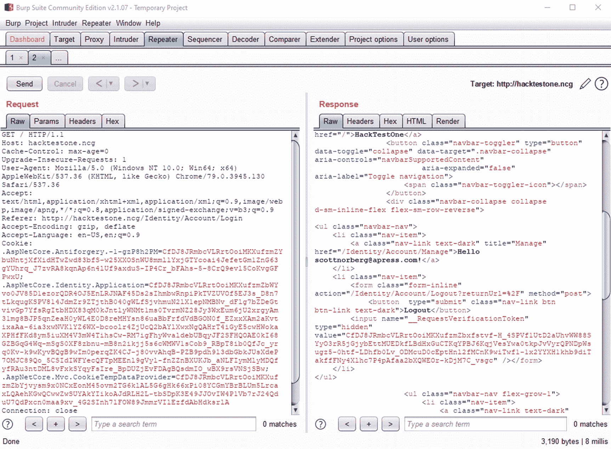

# 七、认证和授权

是时候说说*认证*和*授权*了。在深入探讨之前，我先花点时间来定义这两个术语:

*   **认证**:验证你就是你所说的那个人

*   **授权**:验证你能做你说你能做的

因为没有适当的认证很难进行授权，所以我将从认证开始。确保用户是他们所说的那个人对于任何安全的网站来说都是非常重要的。但是，不幸的是，我们用来验证用户的最常用的方法，要求用户名和密码，并不那么安全。因此，在深入研究 ASP.NET 及其认证机制之前，我将后退一步，从总体上看一下网站的认证。

## 密码问题

多年来，安全专家一直预测“今年是密码消亡的一年”。但是，尽管我们在寻找更安全的认证机制方面取得了进展，要求用户名和密码仍然是一种常见的认证形式。为什么呢？从开发和用户的角度来看，这很容易理解。但它并不那么安全。我们来深究一下原因。

### 密码太多容易被猜到

不幸的是，凭据总是从网站上被盗。一个名为 haveibeenpwned.com 的网站允许你查看你的密码是否包含在任何已知的黑客攻击中，并声称拥有 93 亿套凭证。虽然这本身会引起一些问题(我一会儿就会谈到)，但这确实意味着我们对人们使用的密码类型了如指掌。而我们所知道的并不能激发信心。统计数据各不相同，但最近的研究表明，几乎 10%的用户使用十个最常见的密码之一。 <sup>[1](#Fn1)</sup> 因此，如果你是一名黑客，你可以通过猜测已知用户名的常用密码进入大多数网站。

如果你想知道如何获得用户名，LinkedIn 通常会有所帮助。LinkedIn 有一个关于谁在一家公司工作，他们的电子邮件地址是什么(或者他们同事的电子邮件地址是什么，这有助于确定该公司的用户名模式)，他们使用什么类型的软件等信息的宝库。黑客可以从 LinkedIn 上找出很多关于谁使用了什么软件的信息。至于其他的，你通常可以通过其他方式找到信息。


图 7-1

在 ASP.NET 处理登录的时间

如果你还记得，在第 2 章中，我概述了 ASP.NET 的一个问题，黑客可以通过查看处理一次登录所花费的时间来计算出用户名。黑客可以很容易地利用你在图 [7-1](#Fig1) 中看到的时间差来区分好用户名和坏用户名。

### 用户名/密码表单很容易被绕过

如果您有一个 SQL 注入漏洞，使用用户名和密码的登录表单很容易被绕过。大多数书籍在讨论 SQL 注入攻击时，通常使用登录页面作为示例文本。原因是如果您的登录代码有一个 SQL 注入漏洞，您可以很容易地登录，如清单 [7-1](#PC1) 所示。

```cs
var query = "SELECT * FROM Users WHERE UserName = '" + username + "' AND HashedPassword = '" + hashedPassword + "'"

Listing 7-1Using SQL injection to log in

```

成功攻击后会变成这样:

```cs
SELECT * FROM Users WHERE UserName = 'admin' ↲
  -- AND HashedPassword = '<<some hash>>'

```

我将在下一章更详细地描述 SQL 注入袭击事件。但与此同时，只要您知道一个有效的用户名，以任何用户的身份登录都非常容易。

### 凭据重用

有一种攻击我还没有涉及到，叫做*凭证填充*。凭据填充是一个术语，指从一个站点窃取凭据集，并试图在另一个站点使用它们。我想大多数从事技术工作的人都知道，我们不应该在不同的网站之间重复使用密码，但是有这么多的网站需要密码，难怪许多人仍然重复使用用户名和密码，以便我们能够记住如何登录。

不幸的是，这不是假设的攻击。迪士尼+流媒体视频推出数小时后，安全研究人员宣布该服务遭到黑客攻击。事实证明，最有可能的原因是凭据填充攻击。 <sup>[2](#Fn2)</sup> 如果能发生在迪士尼身上，也能发生在你身上。

## 后退—如何进行认证

好吧，密码不好。我们该怎么做？首先，让我们继续后退一步，从总体上讨论一下认证。密码并不是验证人们身份的唯一方式。你可能已经收到了进入网站的密码，或者你可能使用你的指纹进入你的手机，或者你可能已经看过有人使用眼睛或手印扫描进入某扇门的电影。这些方法分为三类:

*   一些你知道的事情，比如你的密码或者你母亲的姓

*   **你拥有的东西**:比如你的手机(接收短信)或者你的 u 盘里的硬件

*   你的身份:比如你的指纹或虹膜扫描

有些方法比其他方法更安全，但一般来说，*最*安全的方法是使用不同类别的多种方法，也称为*多因素认证*，或 *MFA* 。一种越来越普遍的方法是，你输入你的用户名和密码，这将是你*知道的*类别中的内容，然后你输入一个你通过文本接收的代码，这满足了你*拥有的*的内容。

为什么不从一个类别做两件事，比如你知道的两件事或者你拥有的两件事？毕竟，实现两件你知道的事情，比如问密码，然后问你童年宠物的名字，会比你知道的事情和你在一个网站里有的事情容易得多。混合类别有两个强有力的理由。

首先，网站总是被黑客攻击。根据至少一项研究，每天有 3 万个网站遭到黑客攻击。 <sup>[3](#Fn3)</sup> 我们知道密码被盗。但是挑战性问题呢？你回答过多少次关于你的第一只宠物、你母亲的娘家姓或你的第一辆车的问题？你确定那些没有被黑过吗？请记住，这些信息中的一些，比如你母亲的娘家姓，很容易通过 spokeo.com 或 intelius.com 等网站在网上被发现。

Note

或者更糟，你确定你没有免费提供这些答案吗？几年前，我感觉每天都会在《脸书邮报》上看到我的一个或多个朋友，或者从一些网站转发一些愚蠢的承诺，比如给你一个童话名字或者找到你的灵兽。要找到这些信息，你所要做的就是给网站一些信息。例如，你的仙女名可能来源于你的出生月份和出生日期。或者你的灵兽可以通过你中间名字的首字母和你母亲婚前名字的首字母找到。这在当时似乎是无害的，但安全专家现在认为，至少其中一些是黑客试图收集常见挑战问题的答案。

第二，你永远不知道什么时候某样东西会变得没有安全感。几年前，美国联邦政府机构国家标准与技术研究所(NIST)向寻求实施安全的公司提供指导和标准，建议公司使用 SMS 作为第二个因素不再是提供多因素认证的安全方法。(尽管他们后来软化了立场。如果发现认证链中有不安全的地方，拥有多种方法可以给你一点时间来升级你的系统。

Caution

如果通过 SMS 进行的多因素认证不再被认为是安全的，您是否应该停止使用它？看情况。有很多使用你的手机的授权码，所以实现起来相对容易。此外，它相当常见，因此您可能不会像购买专门为 MFA 构建的设备那样，通过 SMS 实现多因子。简而言之，如果你可以使用其他设备，我会这样做，否则使用你的手机进行 MFA 仍然比单独使用用户名和密码好得多。

### 停止凭据填充

MFA 优于单因素认证，因为如果认证的一个因素受到损害(例如密码被盗)，第二个因素将有助于防止黑客进入。还有什么其他方法可以检测和阻止凭据填充？

*   **位置检测**:一些网站会识别你是否从一个新的 IP 地址登录，如果是的话，会要求你提交额外的验证码。

*   检查被盗密码列表:haveibeenpwned.com 有一个 API，可以让你检查被盗的密码。 <sup>[6](#Fn6)</sup> 如果密码被盗，你可以在黑客在你的网站上尝试这些凭证之前，提示用户修改密码。

*   **多次登录尝试**:如果攻击者试图从一个源 IP 在您的站点上使用多个用户名/密码组合，您可以在几次尝试失败后阻止他们的 IP。

所以，无论你的网站是否建在 ASP.NET，你都不应该只使用用户名和密码。既然我们知道了这一点，我们可以深入了解一下 ASP.NET。让我们从检查默认用户名和密码功能开始。

## ASP.NET 的默认认证

ASP 有很多可移动的部分。NET 的认证功能。我将假设您在 ASP.NET 至少有一些认证的经验，所以我现在将跳过设置和配置步骤，直接从将用户名和密码存储在数据库中的默认功能开始。您现在已经知道，从安全的角度来看，这个实现还有一些不足之处，但是了解它是如何工作的将允许我们在现有知识的基础上实现更安全的东西。因此，我将从剖析认证功能开始，再看一看用户登录时会发生什么。

### 默认认证提供程序

要弄清楚用户登录时会发生什么，没有比用户提交用户名和密码时调用的登录页面上的实际代码更好的起点了。

```cs
[AllowAnonymous]
public class LoginModel : PageModel
{
  private readonly SignInManager<IdentityUser> _signInManager;

  public LoginModel(
    SignInManager<IdentityUser> signInManager)
  {
    _signInManager = signInManager;
  }

  public async Task<IActionResult> OnPostAsync(
    string returnUrl = null)
  {
    returnUrl = returnUrl ?? Url.Content("~/");

    if (ModelState.IsValid)
    {
      var result = await _signInManager.PasswordSignInAsync(
        Input.Email, Input.Password, Input.RememberMe,
          lockoutOnFailure: false);
      if (result.Succeeded)
      {
        _logger.LogInformation("User logged in.");
        return LocalRedirect(returnUrl);
      }
      if (result.RequiresTwoFactor)
      {
        return RedirectToPage("./LoginWith2fa", new {
          ReturnUrl = returnUrl,
          RememberMe = Input.RememberMe });
      }
      if (result.IsLockedOut)
      {
        _logger.LogWarning("User account locked out.");
        return RedirectToPage("./Lockout");
      }
      else
      {
        ModelState.AddModelError(string.Empty,
          "Invalid login attempt.");
        return Page();
      }
    }

    // If we got this far, something failed, redisplay form
    return Page();
  }
}

Listing 7-2Heavily redacted code-behind for login.cshtml

```

从安全角度来看，清单 [7-2](#PC3) 中有许多令人担忧的事情:

*   默认功能使用电子邮件作为用户名，这意味着如果用户名被泄露，PII 也是如此。

*   如果密码旧/过期，则没有可用的操作。

*   如果用户从未知位置登录，则没有可用的操作。

*   无法抵御凭据填充攻击。

*   没有简单的方法通知用户他们的密码是否存在于 haveibeenpwned.com 上。

我们再深入一步，看看到底是怎么回事。第一个要点看起来很容易解决，但其余的就不容易了。CSRF 令牌的实现非常灵活；让我们看看是否可以扩展`SignInManager`来做一些这样的检查。

```cs
public virtual async Task<SignInResult>
  PasswordSignInAsync(string userName,
                      string password,
                      bool isPersistent,
                      bool lockoutOnFailure)
{
  var user = await UserManager.FindByNameAsync(userName);
  if (user == null)
  {
    return SignInResult.Failed;
  }

  return await PasswordSignInAsync(user, password,
    isPersistent, lockoutOnFailure);
}

public virtual async Task<SignInResult>
  PasswordSignInAsync(TUser user,
                      string password,
                      bool isPersistent,
                      bool lockoutOnFailure)
{
  if (user == null)
  {
    throw new ArgumentNullException(nameof(user));
  }

  var attempt = await CheckPasswordSignInAsync(
                      user, password, lockoutOnFailure);

  return attempt.Succeeded
           ? await SignInOrTwoFactorAsync(user, isPersistent)
           : attempt;
}

public virtual async Task<SignInResult>
  CheckPasswordSignInAsync(TUser user,
                           string password,
                           bool lockoutOnFailure)
{
  if (user == null)
  {
    throw new ArgumentNullException(nameof(user));
  }

  //Required checks for email validation, phone validation,
  //etc. removed for brevity

  if (await UserManager.CheckPasswordAsync(user, password))
  {
    //Code to remove lockout removed

    return SignInResult.Success;
  }

  if (UserManager.SupportsUserLockout && lockoutOnFailure)
  {
    await UserManager.AccessFailedAsync(user);
    if (await UserManager.IsLockedOutAsync(user))
    {
      //Method logs a warning, returns SignInResult.LockedOut
      return await LockedOut(user);
    }
  }
  return SignInResult.Failed;
}

Listing 7-3Relevant source code for SignInManager7

```

坏消息是，我的投诉很少在清单 [7-3](#PC4) 中得到解决。至少看起来我们不需要用邮箱作为用户名；这只是微软创建的默认设置。

至于其余的检查，它们可能驻留在`UserManager.CheckPasswordAsync,`中，尽管这将违反单一责任原则。(单一责任原则认为一个类或方法应该有且只有一个责任。ASP.NET 本身的来源遵循单一责任原则到了近乎荒谬的程度，所以这是不可能的。)不过，在得出任何确切的结论之前，我们仍需要检验这种方法。

在我们开始之前，我想指出这里存在的代码的一点。看看第一种方法。看看如果没有找到具有指定用户名的用户，该方法如何立即返回`SignInResult.Failed`？虽然不区分找不到用户和密码不匹配有助于防止信息泄露，但立即返回结果而不是继续处理正是我能够创建仅通过查看处理时间来区分有效和无效用户名的图形的原因。如果您看看下面调用的两个方法，如果用户为空，它们都会抛出一个异常。这意味着，如果您想要修复基于登录处理时间的信息泄漏，您将需要更改几行代码。

Note

我想强调这一点:很可能您被告知，限制您需要做的处理量以将服务器处理保持在最低水平总是正确的。*从安全角度来看，这并不总是最好的做法*。一个坚定的黑客会想尽一切办法进入你的网站。检查各种活动的处理时间，包括但不限于登录，是*一个意志不坚定的黑客绝对会尝试的事情。*

好了，让我们深入到清单 [7-4](#PC5) 中`UserManager`的`CheckPasswordAsync`方法中。

```cs
public virtual async Task<bool> CheckPasswordAsync(
  TUser user, string password)
{
  ThrowIfDisposed();
  var passwordStore = GetPasswordStore();
  if (user == null)
  {
    return false;
  }

  var result = await VerifyPasswordAsync(↲
                     passwordStore, user, password);
  if (result == ↲
      PasswordVerificationResult.SuccessRehashNeeded)
  {
    await UpdatePasswordHash(passwordStore, user, ↲
      password, validatePassword: false);
    await UpdateUserAsync(user);
  }

  //Code to log warning if password doesn’t match removed
  return success;
}

Listing 7-4Relevant source code for UserManager8

```

好了，让我们回到我最初的投诉列表，看看哪些问题得到了解决:

*   用户名作为电子邮件似乎不是必需的，这很好。

*   不存在密码到期检查。

*   不存在查看用户是否从未知位置登录的检查。

*   无法抵御凭据填充攻击。

*   没有简单的方法通知用户他们的密码是否存在于 haveibeenpwned.com 上。

在我谈论如何解决这些问题之前，还有一个问题您需要了解。最佳实践表明，会话令牌应该在一段时间后过期。这意味着不同的应用会有所不同——你可以要求你的用户在超时期限后登录，或者你可以在每次页面刷新时刷新超时期限——但会话应该在一段时间后过期。并且会话令牌应该在用户注销后*绝对*失效。ASP.NET 的默认会话令牌没有。为了探究原因，我需要谈一谈*声明*。

#### ASP.NET 基于索赔的证券

当用户登录 ASP.NET 时，ASP.NET 不是创建一个会话令牌并将其映射到用户，而是创建一个加密令牌来存储多个*声明*。声明可以包括任意数量的项目，例如用户标识符、角色、用户信息等。默认情况下，ASP.NET 在会话令牌中包括四种不同的声明:

*   **索赔类型。NameIdentifier** :这是登录用户的用户 ID。

*   **索赔类型。名称**:这是登录用户的用户名。

*   **AspNet。Identity.SecurityStamp** :这是一个生成并存储在数据库中的值，当用户更改其凭证时，该值也会随之更改。当标记更改时，用户的会话将失效。

*   **amr** :这代表认证方法参考，它存储了一个说明用户如何登录的代码。 <sup>[9](#Fn9)</sup>

当框架需要知道是否有人登录时，它可以检查声明列表。如果`ClaimTypes.NameIdentifier`在用户声明列表中，框架可以使用特定用户的信息创建用户上下文。

我将在这一章的后面更多地讨论声明，但是现在，让我们回到为什么这些声明对于安全的会话跟踪是不充分的。

#### ASP.NET 中的会话令牌是如何被破坏的

如果从安全的角度来看添加到登录用户的声明，`amr`并没有做太多事情，`Name`也没有在`NameIdentifier`上添加太多东西。`SecurityStamp`当然提供了一些保护，但是如前所述，它只在凭证改变时才改变。这里没有关于会话过期的内容。为了证明现有的会话过期是不充分的，让我们在令牌应该失效后重用它。

Reusing Session Tokens

为了测试会话令牌的重用，首先打开 Burp Suite，并按照我们在第 [4](04.html) 章中所做的那样配置代理来监听请求。登录，然后转到主页。将该请求(登录后)发送到打嗝中继器，如图 [7-2](#Fig2) 所示。


图 7-2

用户登录后主页的打嗝重复器

接下来，单击*发送*将请求发送到浏览器。你应该得到一个类似图 [7-3](#Fig3) 的结果，它显示了一个带有你的用户名的响应，表明你已经正确登录。



图 7-3

显示用户仍然登录的主页的打嗝重复器

在浏览器中注销您的会话。这个*应该*使会话令牌无效。但事实并非如此，你可以通过向浏览器重新发送同样的请求并得到一个表明你已经登录的响应来证明这一点，如图 [7-4](#Fig4) 所示。


图 7-4

注销后，会话令牌仍然有效

作为额外的实验，今天保存代币，几天后尝试使用它们登录。

#### 默认认证提供程序的更多问题

你可能猜到了，还有更多问题我还没有讨论。不过，我不会通过挖掘源代码来证明每一个问题，我只提供一个问题列表:

*   默认锁定仅持续 5 分钟，并且在多次锁定后不会改变行为。

*   用户名不区分大小写。

*   PII 喜欢用明文存储电子邮件和电话号码。

*   密码哈希算法太弱。

*   未检测到单个用户的多个并发用户会话。

因此，默认的认证提供者显然有问题。让我们深入探讨如何开始解决这些问题。

### 设置更安全的东西

不幸的是，对我们来说，解决所有这些问题不是一件简单或容易的事情。有太多的问题分散在太多的组件上。但是让他们走并不是一个好主意，所以唯一能做的就是单独解决这些问题。让我们从最简单的开始:密码哈希。

#### 修复密码哈希

修复密码散列是使我们的网站更加安全的一个简单步骤，我们已经在第 [3](03.html) 章中用实现了`IPasswordHasher`接口的`Hasher`类完成了这项艰巨的工作。在那一章中，我只是简单地给了你一个新的类，并没有真正解释为什么它更好，所以我现在要纠正它。提醒一下，清单 [7-5](#PC6) 显示了我建议你加入的新散列方法。

```cs
private string HashPBKDF2(string plainText, string salt,
  bool saveSaltInResult)
{
  var saltAsBytes = Encoding.ASCII.GetBytes(salt);

  string hashed = ByteArrayToString(KeyDerivation.Pbkdf2(
                  password: plainText,
                  salt: saltAsBytes,
                  //.NET 3.1 uses HMACSHA256
                  prf: KeyDerivationPrf.HMACSHA512,
                  //.NET 3.1 uses 10,000 iterations
                  iterationCount: 100000,
                  //.NET 3.1 uses 32 bytes
                  numBytesRequested: 64));

  if (saveSaltInResult)
    return string.Format("[{0}]{1}{2}",
      (int)HashAlgorithm.PBKDF2_SHA512, salt, hashed);
  else
    return string.Format("[{0}]{1}",
      (int)HashAlgorithm.PBKDF2_SHA512, hashed);
}

Listing 7-5New and improved PBKDF2 hashing for passwords

```

首先要指出两个改进，因为它们相对简单:这将散列从 SHA-256 升级到 SHA-512，并且返回 64 字节而不是仅仅 32 字节(后者是因为 SHA-512 是 64 字节散列)。另一个变化，将迭代次数从 10，000 更改为 100，000，值得强调。如果你还记得第 3 章的话，PBKDF2 用于帮助减缓散列的创建，这使得彩虹表更难创建。但是 10，000 次迭代是一个相对较小的数字。我在这里使用了 100，000 次迭代，但是您可以根据您的硬件、用户数量和安全性需求来调整这个数字。别忘了用你新的更好的服务替换默认的`IPasswordHasher`服务！

#### 保护用户名

如前所述，在默认的 ASP.NET 认证功能中，用户名没有得到很好的保护。让我们从解决更简单的问题开始——以加密而非明文的格式存储 PII(在这里是电子邮件地址)。要解决这个问题，我们需要实现我们自己的`IUserStore`。首先，让我们看一下您需要在这个接口中实现什么。

```cs
public interface IUserStore<TUser> :
  IDisposable where TUser : class
{
  Task<string> GetUserIdAsync(TUser user,
    CancellationToken cancellationToken);
  Task<string> GetUserNameAsync(TUser user,
    CancellationToken cancellationToken);
  Task SetUserNameAsync(TUser user, string userName,
    CancellationToken cancellationToken);
  Task<string> GetNormalizedUserNameAsync(TUser user,
    CancellationToken cancellationToken);
  Task SetNormalizedUserNameAsync(TUser user,
    string normalizedName,
    CancellationToken cancellationToken);
  Task<IdentityResult> CreateAsync(TUser user,
    CancellationToken cancellationToken);
  Task<IdentityResult> UpdateAsync(TUser user,
    CancellationToken cancellationToken);
  Task<IdentityResult> DeleteAsync(TUser user,
    CancellationToken cancellationToken);
  Task<TUser> FindByIdAsync(string userId,
    CancellationToken cancellationToken);
  Task<TUser> FindByNameAsync(string normalizedUserName,
    CancellationToken cancellationToken);
}

Listing 7-6Properties and methods in the IUserStore interface

```

清单 [7-6](#PC7) 中有一些相对简单的方法。像`GetUserIdAsync`和`GetUserNameAsync`这样的方法不需要特殊处理，像`DeleteAsync`和`FindByIdAsync`这样的方法应该很容易实现。但是如果我们要加密用户名，像`FindByNameAsync`这样的方法需要改变。期望应用解密数据库中的所有值来通过用户名搜索用户是不实际的，因此将散列的用户名存储在表中是有意义的。我们不应该在同一个表中存储用户名的散列版本和加密版本，所以我们需要在其他地方存储加密版本。

快速提示:您的定制`UserStore`对象将需要实现`IUserStore`之外的其他接口。在某些情况下，如果缺少接口，那么将会抛出一个异常，这个问题很容易找到并修复。但是，在其他情况下，框架源代码会查看用户存储，看它是否实现了特定的接口，如果没有，就跳过该功能。例如，如果您的`IUserStore`没有实现`IUserLockoutStore`，失败的密码尝试将不再被跟踪，您也不会得到通知。相反，锁定功能根本不起作用。这不仅调试起来很麻烦，因为很难找到问题的原因，而且从安全角度来看也很危险，因为必要的和预期的保护可能会被忽略。为了帮助缓解这个问题，下面是您需要在自定义`UserStore`对象中实现的最少接口:

*   IUserPasswordStore

*   IUserEmailStore

*   IUserPhoneNumberStore

*   IUserLockoutStore

还有一些其他的，其中一些我将在本书后面介绍。现在，要知道这是一个问题，如果在你实现一个新的`UserStore`时，某个东西突然停止工作，首先检查一下你是否在你的`UserStore`对象上缺少了一个接口实现。

回到商店本身，这是一个非常有限的新的改进的`IUserStore`的例子，展示了如何正确处理用户名和电子邮件。在这个例子中，我将省略加密值存储的细节，但是将它们存储在不同的数据库中，甚至可能存储在不同的服务器中，有助于防止攻击者获得这些值。您应该能够使用这些示例，并将其扩展到该接口中的其他方法，但是如果您想要完整的源代码，您可以随时查看本书的 GitHub 帐户中的源代码，位于此处: [`https://github.com/Apress/adv-asp.net-core-3-security`](https://github.com/Apress/adv-asp.net-core-3-security) 。

```cs
public class CustomUserStore : IUserStore<IdentityUser>
{
  private readonly IHasher _hasher;
  private readonly ApplicationDbContext _dbContext;
  private readonly ICryptoStoreSimulator _cryptoStore;

  public CustomUserStore(IHasher hasher,
                         ApplicationDbContext dbContext,
                         ICryptoStoreSimulator cryptoStore)
  {
    _hasher = hasher;
    _dbContext = dbContext;
    _cryptoStore = cryptoStore;
  }

  public Task<IdentityResult> CreateAsync(IdentityUser user,
    CancellationToken cancellationToken)
  {
    var userName = user.UserName;
    var email = user.Email;
    var normalizedUserName = user.NormalizedUserName;
    var normalizedEmail = user.NormalizedEmail;

    //Set values to hashed values for saving
    //If you use ADO.NET directly,
    //you won't have to use this work-around
    user.UserName = _hasher.CreateHash(user.UserName,
      _cryptoStore.GetUserNameSalt(),
      BaseCryptographyItem.HashAlgorithm.SHA512, false);
    user.Email = _hasher.CreateHash(user.Email,
      _cryptoStore.GetEmailSalt(),
      BaseCryptographyItem.HashAlgorithm.SHA512, false);
    user.NormalizedUserName = _hasher.CreateHash(
      user.NormalizedUserName,
      _cryptoStore.GetNormalizedUserNameSalt(),
      BaseCryptographyItem.HashAlgorithm.SHA512, false);
    user.NormalizedEmail = _hasher.CreateHash(
      user.NormalizedEmail,
      _cryptoStore.GetNormalizedEmailSalt(),
      BaseCryptographyItem.HashAlgorithm.SHA512, false);

    _dbContext.Users.Add(user);
    _dbContext.SaveChanges();

    _cryptoStore.SaveUserEmail(user.Id, email);
    _cryptoStore.SaveUserName(user.Id, userName);
    _cryptoStore.SaveNormalizedUserEmail(user.Id,
      normalizedEmail);
    _cryptoStore.SaveNormalizedUserName(user.Id,
      normalizedUserName);

    //Set these back to the original for
    //processing in the website
    user.UserName = userName;
    user.Email = email;
    user.NormalizedUserName = normalizedUserName;
    user.NormalizedEmail = normalizedEmail;

    return Task.FromResult(IdentityResult.Success);
  }

  public Task<IdentityUser> FindByNameAsync(
    string normalizedUserName,
    CancellationToken cancellationToken)
  {
    var hashedUserName = _hasher.CreateHash(
      normalizedUserName,
      _cryptoStore.GetNormalizedUserNameSalt(),
      BaseCryptographyItem.HashAlgorithm.SHA512, false);
    var user = _dbContext.Users.SingleOrDefault(
      u => u.NormalizedUserName == hashedUserName);

    if (user != null)
    {
      user.UserName = _cryptoStore.GetUserName(user.Id);
      user.Email = _cryptoStore.GetUserEmail(user.Id);
      user.NormalizedUserName =
        _cryptoStore.GetNormalizedUserName(user.Id);
      user.NormalizedEmail =
        _cryptoStore.GetNormalizedUserEmail(user.Id);
    }

    return Task.FromResult(user);
  }

  public Task<string> GetNormalizedUserNameAsync(
    IdentityUser user, CancellationToken cancellationToken)
  {
    return Task.FromResult(user.NormalizedUserName);
  }
}

Listing 7-7Properties and methods in the IUserStore interface

```

Caution

这个例子没有考虑新的加密值可能被保存而新的散列值没有被保存的可能性。根据您接受风险的能力，您可以让它保持原样，只要求用户重新保存任何不同步的信息，否则您可以放入 try/catch 逻辑，以便在出现问题时将所有内容保存到以前的状态。

清单 [7-7](#PC8) 中的三个方法很好地代表了这个接口中所有方法的实现。让我们更详细地检查一下:

*   **CreateAsync** :这个方法向您展示了应该如何在表中保存散列信息，而在其他地方保存加密信息。要做到这一点，您不仅需要在保存之前将散列数据存储在对象中，还需要在返回之前将值设置回来。当然，您可以重构加密的信息保存，使其更加优雅和可维护。

*   **FindByNameAsync** :如果你以散列格式存储信息，你将需要散列数据来做比较。这个方法告诉你如何去做。

*   **getnormalizeusername async**:`IUserStore`接口中的许多方法除了从用户对象中检索特定属性之外做得很少。虽然这一开始看起来没有必要，但这是一种允许程序员在框架中使用他们想要的任何类型的用户对象的方法。

Reminder

如果你最终实现了你自己的`IUserStore`，框架将期望实现`IUserStore`接口的对象也将实现`IUserPasswordStore`和`IUserEmailStore`，以及其他。

您应该注意到，搜索寻找的是用户名的*规范化*版本，而不是未更改的版本。这意味着用户名比较仍然不区分大小写，从安全角度来看这是有问题的。但是对它的修复是在`UserManager`对象中，所以当我们在`UserManager`中修复其他问题时，我们将修复这个问题。

最后，不要忘记用新的改进的实现替换默认的`IUserStore`实现。

##### 防止信息泄露

在本章的开始，您看到了一个图表，其中显示了合法用户名和非法用户名的登录尝试的执行时间。虽然这看起来像是一种难以实现的攻击，但它确实是一种从数据库中提取用户信息的低风险、高回报的方式。(提醒:如果你使用电子邮件地址作为用户名，提取用户名也会提取 PII。)所以，我们当然应该解决这个问题。不幸的是，这个修复并不容易。我们需要确保用户存在和不存在时的代码执行路径尽可能相似，并且这个流程的代码存在于`SignInManager`和`UserManager`中。覆盖所需的方法有时会很尴尬，但不管怎样，让我们开始吧。让我们从一个定制的`SignInManager`类开始。

```cs
public class CustomSignInManager : SignInManager<IdentityUser>
{
  public CustomSignInManager(
    UserManager<IdentityUser> userManager,
    IHttpContextAccessor contextAccessor,
    IUserClaimsPrincipalFactory<IdentityUser> claimsFactory,
    IOptions<IdentityOptions> optionsAccessor,
    ILogger<SignInManager<IdentityUser>> logger,
    IAuthenticationSchemeProvider schemes,
    IUserConfirmation<IdentityUser> confirmation) :
  base(userManager, contextAccessor, claimsFactory,
    optionsAccessor, logger, schemes, confirmation)
  { }
}

Listing 7-8Class declaration and constructor for a custom SignInManager

```

清单 [7-8](#PC9) 包含一个非常标准的类声明。不过，有几件事值得强调:

*   基本 SignInManager 对象需要一个用于用户类的通用占位符。你也可以使你的类通用化，但是因为你知道用户类是什么，你也可以直接硬编码这个类，跳过泛型。

*   因为您正在扩展 base SignInManager，所以需要用所有预期的参数调用基本构造函数。这些变化相对频繁，所以升级到新版本的框架需要额外的工作。

现在您已经有了一个类，让我们看看框架用来登录的前几个方法，除了这一次被修改以适应没有有效用户的代码执行。为了使事情变得简单，您可以从源代码中复制现有的方法，并根据需要进行修改。

```cs
public override async Task<SignInResult> PasswordSignInAsync(
  string userName, string password,
  bool isPersistent, bool lockoutOnFailure)
{
  var user = await UserManager.FindByNameAsync(userName);

  //if (user == null)
  //{
  //  return SignInResult.Failed;
  //}

  return await PasswordSignInAsync(user, password,
    isPersistent, lockoutOnFailure);
}

public override async Task<SignInResult> PasswordSignInAsync(
  IdentityUser user, string password,
  bool isPersistent, bool lockoutOnFailure)
{
  //if (user == null)
  //{
  //  throw new ArgumentNullException(nameof(user));
  //}

  var attempt = await CheckPasswordSignInAsync(
    user, password, lockoutOnFailure);
  return attempt.Succeeded ?
    await SignInOrTwoFactorAsync(user, isPersistent) :
    attempt;
}

Listing 7-9Overridden methods in the SignInManager to log in

```

正如您在清单 [7-9](#PC10) 中看到的，登录机制使用用户名和密码调用`PasswordSignInAsync`的版本，这里唯一需要的更改是删除立即返回`SignInResult.Failed`的空检查。但是这个方法用一个用户而不是用户名来调用`PasswordSignInAsync`，这也需要修改以跳过空检查。

类似的变化需要在`CheckPasswordSignInAsync`中进行，代码可以在本书的 GitHub 库中找到。该方法调用`UserManager.CheckPasswordAsync`，它也需要被修改以支持我们的新方法。首先，让我们深入清单 [7-10](#PC11) 中的类声明和构造函数。

```cs
public class CustomUserManager : UserManager<IdentityUser>
{
  public CustomUserManager(
    IUserStore<IdentityUser> store,
    IOptions<IdentityOptions> optionsAccessor,
    IPasswordHasher<IdentityUser> passwordHasher,
    IEnumerable<IUserValidator<IdentityUser>> userValidators,
    IEnumerable<IPasswordValidator<IdentityUser>>
      passwordValidators,
    ILookupNormalizer keyNormalizer,
    IdentityErrorDescriber errors,
    IServiceProvider services,
    ILogger<UserManager<IdentityUser>> logger) :
  base(store, optionsAccessor, passwordHasher,
    userValidators, passwordValidators, keyNormalizer,
    errors, services, logger)
  { }

  //Implementation later
}

Listing 7-10Class declaration and constructor for a custom UserManager

```

像`SignInManager`一样，我们可以创建一个硬编码用户对象的类。此外，像`SignInManager`一样，我们必须创建一个构造函数，将所有必要的服务传递给原始基类。这里没有什么新东西，所以让我们直接进入我们需要在清单 [7-11](#PC12) 中覆盖的方法。

```cs
public override async Task<bool> CheckPasswordAsync(
  IdentityUser user, string password)
{
  ThrowIfDisposed();
  var passwordStore = GetPasswordStore();

  var result = await VerifyPasswordAsync(passwordStore,
    user, password);
  if (result == ↲
    PasswordVerificationResult.SuccessRehashNeeded)
  {
    //Remove the IPasswordStore parameter so we can call
    //the protected, not private, method
    await UpdatePasswordHash(user, password,
      validatePassword: false);
    await UpdateUserAsync(user);
  }

  var success = result != PasswordVerificationResult.Failed;
  if (!success)
  {
    var userId = user != null ?
                 GetUserIdAsync(user).Result :
                 "(null)";
    Logger.LogWarning(0, "Invalid password for user ↲
      {userId}.", userId);
  }
  return success;
}

protected override async Task<PasswordVerificationResult>
  VerifyPasswordAsync(IUserPasswordStore<IdentityUser> store,
    IdentityUser user, string password)
{
  //Start original code
  //var hash = await store.GetPasswordHashAsync(
  //  user, CancellationToken);
  //if (hash == null)
  //{
  //  return PasswordVerificationResult.Failed;
  //}
  //End original code

  //Start new code
  string hash;

  if (user != null)
    hash = await store.GetPasswordHashAsync(
      user, CancellationToken);
  else
    hash = "not a real hash";
  //End new code

  if (hash == null)
  {
    return PasswordVerificationResult.Failed;
  }
  return PasswordHasher.VerifyHashedPassword(
    user, existingHash, password);
}

Listing 7-11UserManager updates to prevent username information leakage

```

`CheckPasswordAsync`中唯一值得指出的代码是，当记录无效密码事件时，这需要容纳一个空用户，但除此之外，这里的一切都应该很简单。要讲的代码在`VerifyPasswordAsync`里。你不能直接调用`store.GetPasswordHashAsync`，因为如果用户为空，你会得到一个`NullReferenceException`。因此，如果用户为空，您需要添加一个空检查，并为您现有的散列密码(在任何情况下都不能与散列密码匹配)传入一个值。这允许系统在每次凭证检查时进行哈希运算，从而大大减少了合法用户名和丢失用户名的登录过程中所需的处理量的差异。

Note

本例中的`store`是实现`IUserPasswordStore`的类。因为我们已经实现了我们自己的商店，而不是在`UserManager`中添加一个假密码，如果用户为空，您也可以更新`GetPasswordHashAsync`方法来返回一个假密码。但是，这并不安全，可能会导致许多错误。我坚持在`UserManager`中加上支票。

黑客检查系统中是否存在特定用户名的一种更容易但更容易检测的方法是注册用户名。如果注册不成功，攻击者就知道不存在使用该用户名的人。修复这个问题需要一些日志记录，所以让我们回到日志记录的章节(第 [9](09.html) 章)。

##### 使用户名区分大小写

既然我们在`UserManager`中，让我们花点时间来解决登录过程中用户名不区分大小写的问题。首先，我们需要更新`FindByNameAsync`方法。下面是原始代码。

```cs
public virtual async Task<TUser> FindByNameAsync(
  string userName)
{
  ThrowIfDisposed();
  if (userName == null)
  {
    throw new ArgumentNullException(nameof(userName));
  }
  userName = NormalizeName(userName);

  var user = await Store.FindByNameAsync(
    userName, CancellationToken);

  // Need to potentially check all keys
  if (user == null && Options.Stores.ProtectPersonalData)
  {
    //Code if user is null, which we can leave as-is
  }
  return user;
}

Listing 7-12The original UserManager FindByNameAsync method

```

您可以在清单 [7-12](#PC13) 中很容易地看到用户名被规范化了，但是仅仅移除规范化将会完全破坏代码，因为`Store`期望一个规范化的用户名。更改`Store`中的`FindByNameAsync`方法，使其与非规范化用户名进行比较，可能会破坏其他东西。但是既然您已经创建了自己的`CustomUserStore`对象，那么您可以创建一个新方法。我不会在商店中展示这个新方法，因为它只是通过散列用户名进行搜索，但这里是`UserManager`的新代码。

```cs
IdentityUser user;

if (Store is CustomUserStore)
{
  user = await ((CustomUserStore)Store).↲
    FindByNameCaseSensitiveAsync(userName, CancellationToken);
}
else
{
  userName = NormalizeName(userName);
  user = await Store.FindByNameAsync(userName,
    CancellationToken);
}

Listing 7-13New code for finding a user in UserManager

```

清单 [7-13](#PC14) 中的代码有点笨拙，因为您不能按原样使用服务，而是将`Store`转换为`CustomUserStore`。你也可以创建另一个接口，让`CustomUserStore`用这个方法实现它，这将更好地匹配 ASP.NET 团队建立的模式。不管怎样，调用`Store`中的新方法来搜索用户名，而不是规范化的用户名。

Note

如果您还记得前面关于“失效开放”与“失效关闭”的讨论，您可能会注意到这段代码无法打开，这意味着如果系统配置错误，您的网站将默认在登录过程中使用规范化的名称。如果`Store`不能被转换为`CustomUserStore`，那么在这里失败关闭并抛出一个异常是完全合理的。

#### 防止凭据填充

您可以做一些事情来防止凭据填充，但大多数事情都需要比 ASP.NET Core 提供的现成的更健壮的日志记录框架。在讨论了如何创建一个体面的安全日志框架之后，我将深入研究凭证填充的细节。在那之前，我至少可以谈谈如何检查现有凭证是否通过 haveibeenpwned.com 被盗。

该网站有两个 API:一个用于检查用户名(仅电子邮件)是否被破坏，另一个用于检查密码是否被破坏。理想情况下，您可以在每次登录时测试两者，如果发现匹配，就提示用户更改他们的凭证，但服务不允许这样做，以防止人们滥用服务。由于我们没有我认为的理想解决方案，我们仍然可以在密码更改尝试期间检查数据库中是否存在密码。

该 API 允许您发送阿沙-1 哈希的前五个字符；然后，您可以获得所有匹配的散列，以及该散列在数据库中出现的次数。例如，要在数据库中查找单词“password ”,您需要

1.  使用阿沙-1 哈希对单词“password”进行哈希运算，结果为“5 baa 61 e 4c 9 b 93 F3 f 0682250 b 6 cf 8331 b 7 ee 68 FD 8”。

2.  获取散列的前五个字符(5baa6)，并通过 GET 请求将它们传递给服务，如下所示: [`https://api.pwnedpasswords.com/range/5baa6`](https://api.pwnedpasswords.com/range/5baa6) 。

完成此操作后，您将获得一组结果，每行包含哈希的剩余 35 个字符，以及发现违规的次数。例如，单词“password”的哈希如下所示:“1e 4c 9 b 93 F3 f 0682250 b 6 cf 8331 b 7 ee 68 FD 8:3730471”。是的，这意味着这个密码在这个数据库中已经被发现超过三百万次。

您可能会决定在通知用户之前设置一个阈值。例如，您可能决定仅在找到密码至少十次时才通知用户，但是您的具体实现将根据应用的具体需求而有所不同。

添加这段代码最容易的地方是在`UserManager`的`ChangePasswordAsync`方法中。

#### 密码历史和过期

我不清楚强制密码过期和保留密码历史以防止密码重复使用是否会提高或降低您的系统的安全性。一方面，防止用户保留密码太久并防止他们重复使用密码有助于防止凭据填充攻击得逞。另一方面，过多的密码会导致密码更改疲劳，导致用户使用不安全的方法，如电子表格或便利贴来存储他们的密码。我将给出一个关于如何添加这个功能的高层次解释，但是要知道我已经介绍的内容可能足以保护你的应用的大多数用途。

在理想情况下，您应该在`SignInManager`和`UserManager`的各种方法中构建密码历史和到期检查。密码到期检查将在`SignInManager`的`CheckPasswordSignInAsync`方法中进行，检查和维护密码历史将在`UserManager`的`UpdatePasswordHash`方法中进行。然而，每一个都有自己的问题。

要了解原因，我们需要开始进一步挖掘，并更仔细地查看`CheckPasswordSignInAsync`。这个方法以及链上更高的方法都返回一个`SignInResult`，`SignInResult`可以有五种状态之一:

*   成功

*   不成功的

*   锁定

*   不允许

*   需要两个因素

这些都不适合“密码过期”的状态虽然您可以创建一个扩展方法，让它看起来像我们添加了一个额外的状态，但是我们无法添加存储状态所必需的*数据*，这使得扩展方法不切实际。因为你正在覆盖一个基类，实现你自己的有这些方法的`SignInResult`类是不实际的。那么，最不坏的解决方案似乎是在`UserManager`中添加一个单独的方法用于密码历史检查，然后在用户登录后单独调用该方法。这很尴尬，但是因为不太可能经常添加或更改登录页面，所以可以解决这个问题。

另一个问题是您需要在`UserManager`中更新的`UpdatePasswordHash`方法是一个`private`方法。是的，您可以用`new`关键字覆盖这个方法，实质上是在您的定制实现中替换这个方法。这里的问题是，如果你这样做，你的新方法只有在你的`CustomUserManager`内部被调用时才会被调用。但是如果只有基类的方法调用它，你的新方法就不会被调用。这是一个冒险的改变。您可以通过将密码历史的添加内容向上推进到`AddPasswordAsync`和`ChangePasswordAsync`方法中来解决这个问题，但是现在您做了两次更改，仍然没有修复`UpdatePasswordHash`。

这一切值得吗？可能不会。这是大量的工作，但实际上并没有提供太多的价值。此外，从默认的`SignInManager`和`UserManager`中覆盖这些方法会使升级到新版本的框架更加困难。

你可以通过鼓励用户使用密码短语而不是密码单词来获得更好的安全性，而不是跟踪密码历史。记住密码通常更容易，而且较长的密码通常比较短的密码更难破解，即使密码有特殊字符也是如此。要改变这一点，您可以将清单 [7-14](#PC15) 中的代码添加到 Startup.cs 文件中的 ConfigureServices 方法中。

```cs
services.Configure<IdentityOptions>(options => {
  options.Password.RequireDigit = false;
  options.Password.RequireLowercase = true;
  options.Password.RequiredLength = 15;
  options.Password.RequireNonAlphanumeric = false;
  options.Password.RequireUppercase = true;
});

Listing 7-14Configuring password options to work with passphrases

```

有几点需要注意:

*   这里最重要的是*长度*，不一定是*强度*。这个代码强迫用户使用至少 15 位的密码，鼓励他们使用句子，而不是单词。

*   这需要大写和小写字符来帮助用户使用完整的(并且希望是容易记住的)句子。

*   因为我们需要容易记忆的密码，所以不太需要数字或非字母数字字符。

Tip

为了进一步鼓励使用密码短语而不是密码，您可以覆盖`IPasswordValidator`服务并包含一个空格检查。

#### 修复会话令牌过期

我在本章前面概述了只有当用户密码改变时会话令牌才真正失效。您可以设置会话过期时间，但这只是设置 cookie 本身的过期时间，这没有多大帮助。您应该有办法在 cookie 上添加截止日期。

对我们来说幸运的是，ASP.NET 框架包括一个名为`CookieAuthenticationEvents`的类，当它被实现时，作为一名开发人员，您可以将自己的逻辑添加到以下事件中:

*   有效委托人

*   正在登录

*   签到

*   注销

*   重定向输出

*   重定向登录

*   RedirectToReturnUrl

*   RedirectToAccessDenied

前四个事件通常是最有用的。特别是，为了解决会话令牌过期问题，您可以在`SigningIn`事件中添加您自己的会话 ID 作为用户声明，在数据库中存储带有过期日期的会话 ID，然后在`ValidatePrincipal`事件中验证该会话 ID 和过期日期。清单 [7-15](#PC16) 展示了它可能的样子。

```cs
public class SessionTokenCookieEvents :
  CookieAuthenticationEvents
{
  private const string _claimsKey = "UniqueSessionId";

  public override Task SigningIn(
    CookieSigningInContext context)
  {
    var userIdClaim = context.Principal.Claims.↲
      SingleOrDefault(c => c.Type ==
        ClaimTypes.NameIdentifier);

    if (userIdClaim == null)
      throw new NullReferenceException("User ID Claim ↲
        cannot be null");

    var dbContext = (ApplicationDbContext)context.↲
      HttpContext.RequestServices.GetService(↲
        typeof(ApplicationDbContext));

    var newSessionId = Guid.NewGuid();

    var newSessionObj = new UserSession();

    newSessionObj.UserSessionId = newSessionId;
    newSessionObj.UserId = userIdClaim.Value;
    newSessionObj.ExpiresOn = DateTime.Now.AddMinutes(240);

    dbContext.UserSession.Add(newSessionObj);
    dbContext.SaveChanges();

    var claims = new List<Claim>();
    claims.Add(new Claim(_claimsKey,
      newSessionId.ToString()));
    var appIdentity = new ClaimsIdentity(claims);
    context.Principal.AddIdentity(appIdentity);

    return base.SigningIn(context);
  }

  public override Task SigningOut(
    CookieSigningOutContext context)
  {
    if (context == null)
      throw new ArgumentNullException("context cannot be↲
        null");

    var userIdClaim = context.HttpContext.User.Claims.↲
      SingleOrDefault(c => c.Type == ↲
        ClaimTypes.NameIdentifier);
    var sessionClaim = context.HttpContext.User.Claims.↲
      SingleOrDefault(c => c.Type == _claimsKey);

    Guid sessionId;

    if (!Guid.TryParse(sessionClaim.Value, out sessionId))
    {
      //TODO: Log this
    }

    var dbContext = (ApplicationDbContext)context.↲
      HttpContext.RequestServices.GetService(↲
        typeof(ApplicationDbContext));

    var sessionObject = dbContext.UserSession.↲
      SingleOrDefault(s => s.UserId == userIdClaim.Value && ↲
        s.UserSessionId == sessionId);

    if (sessionObject != null)
    {
      dbContext.UserSession.Remove(sessionObject);
      dbContext.SaveChanges();
    }

    return base.SigningOut(context);
  }

  public override Task ValidatePrincipal(
    CookieValidatePrincipalContext context)
  {
    if (context == null)
      throw new ArgumentNullException("context cannot be ↲
        null");

    var userIdClaim = context.Principal.Claims.↲
      SingleOrDefault(c => c.Type == ↲
        ClaimTypes.NameIdentifier);

    if (userIdClaim == null)
    {
      context.RejectPrincipal();
      return Task.CompletedTask;
    }

    var sessionClaim = context.Principal.Claims.↲
      SingleOrDefault(c => c.Type == _claimsKey);

    if (sessionClaim == null)
    {
      context.RejectPrincipal();
      return Task.CompletedTask;
    }

    Guid sessionId;

    if (!Guid.TryParse(sessionClaim.Value, out sessionId))
    {
      context.RejectPrincipal();
      return Task.CompletedTask;
    }

    var dbContext = (ApplicationDbContext)context.↲
      HttpContext.RequestServices.GetService(↲
        typeof(ApplicationDbContext));

    var sessionObject = dbContext.UserSession.↲
      SingleOrDefault(s => s.UserId == userIdClaim.Value && ↲
        s.UserSessionId == sessionId);

    if (sessionObject == null ||
      sessionObject.ExpiresOn < DateTime.Now)
    {
      context.RejectPrincipal();
      return Task.CompletedTask;
    }

    return base.ValidatePrincipal(context);
  }
}

Listing 7-15Custom CookieAuthenticationEvents object

```

为了进一步改进此示例，请考虑进行以下更改:

*   注销将用户从*所有*会话中注销(即删除用户的所有会话令牌)，而不仅仅是当前会话。

*   更改会话到期时间，使其更短(例如，20 分钟而不是 240 分钟)，但使其滑动到最长 4 小时。

*   允许用户锁定他们的帐户，以便在给定时间每个用户只允许一个会话。任何新的登录都会使以前的会话 ID 无效。

*   将会话 ID 绑定到特定的 IP 地址。如果令牌在请求中来自不同于令牌值的 IP 地址，则拒绝该请求。

不幸的是，我找不到任何直接的方法将这个类添加到我们的认证机制中。在 ASP.NET 2 . x 和 3.1 之间，增加这个功能的方法被抽象掉了。幸运的是，添加这个类的方法只是抽象了一层，所以如果您复制从`Startup`类调用的`AddDefaultIdentity`方法并添加您的 events 类，您就可以添加您的自定义令牌。清单 [7-16](#PC17) 中的自定义代码以粗体显示。

```cs
public static IdentityBuilder AddDefaultIdentity<TUser>(
  IServiceCollection services,
  Action<IdentityOptions> configureOptions)
    where TUser : class
{
  services.AddAuthentication(o =>
  {
    o.DefaultScheme = IdentityConstants.ApplicationScheme;
    o.DefaultSignInScheme = IdentityConstants.ExternalScheme;
  })
    .AddIdentityCookies(o => {
      o.ApplicationCookie.Configure(o => {
        o.Events = new SessionTokenCookieEvents(); });
    });

  return services.AddIdentityCore<TUser>(o =>
  {
    o.Stores.MaxLengthForKeys = 128;
    configureOptions?.Invoke(o);
  })
    .AddDefaultUI()
    .AddDefaultTokenProviders();
}

Listing 7-16AddDefaultIdentity with custom CookieAuthenticationEvents

```

这里最重要的代码在`AddIdentityCookies`中。您可以在`ApplicationCookie.Configure`方法中添加`SessionTokenCookieEvents`引用，如下所示。

既然您已经对认证的工作原理以及如何解决一些问题有了一个坚实的基础，那么让我们回到 ASP.NET 团队想要的方式来扩展它。

### 实施多因素认证

如果你在你最喜欢的搜索引擎上查找“asp.NET Core 多因子认证”，你应该会得到几个关于如何用 SMS 或验证器应用实现多因子的写得很好的博客。这里没必要多此一举。相反，我将谈一谈在网站中实现多因素认证的不同实用方法的优缺点:

*   **发送一封带有一次性使用代码**的电子邮件:这是在您的应用中实现多因素认证的最简单、最便宜的方法。但是因为这个代码是通过电子邮件发送的，所以它并没有真正实施多重因素(密码和通过电子邮件发送的代码本质上都是你知道的东西)；这是这里列出的选项中最不安全的方法。

*   发送一条带有一次性使用代码的短信:这比发送电子邮件更安全，因为它强制要求你必须有一部手机(即你有的东西)。到目前为止，用户已经熟悉了需要从他们的手机输入一个代码来登录，所以虽然用户体验不是很好，但这不会让你的用户感到震惊。因为欺骗电话网络非常容易，所以对于拥有极其敏感数据的站点，应该避免使用这种解决方案。

*   **使用第三方验证器应用向您的手机发送代码**:假设验证器应用本身没有安全问题，此选项比简单地发送短信更安全。这个选项的主要缺点是，使用您系统的用户现在被迫在他们的手机上安装和使用第三方应用。

*   使用第三方密码生成器，比如 Yubikey :你也可以购买个人用来生成一次性密码的硬件，你的网站可以通过云服务来验证。虽然这是最难实现的选项，但却是这些选项中最安全的。

至于推荐哪一个，我会记住你不应该花 100 美元去保护一张 20 美元的钞票。您的需求可能会因您的预算、特定网站和风险承受能力而异。

Caution

强调前面提到的一点:为什么不在这里加入挑战性的问题，比如“你母亲的娘家姓是什么”?原因有二。第一，添加一个问题，寻找你知道的东西作为第二层认证，这不是认证的第二个*因素*，因此不能提供太多的安全性。第二，许多这些问题的答案是众所周知的。许多其他人的答案已经被泄露了，通过参加许多“有趣”的脸书测验中的一个，告诉你你的精神动物是什么，或者基于你对诸如“你的第一只宠物叫什么名字？”等问题的回答。

### 使用外部提供商

所有这些变化都需要大量的工作来实现，其中许多变化会使您更难升级应用。一种替代方法是使用第三方认证提供商，它可以为您提供这种安全性。ASP.NET 团队已经建立了几个提供者，它们应该会使集成变得相对容易。为了举例，下面是如何使用 Twitter 作为您的提供者。

Using Twitter For Authentication

大多数第三方认证提供程序都有 NuGet 包。Twitter 也不例外，它有 Microsoft . aspnetcore . authentic ation . Twitter，在你的项目中安装这个包。接下来，进入 [`https://developer.twitter.com/apps`](https://developer.twitter.com/apps) ，注册一个账户，创建一个应用。您将被问及一些关于您尝试创建的应用的问题。这些问题大多围绕着你将提取什么数据，但由于你(可能)只是将应用用于认证目的，这些问题应该很简单。

一旦你得到了你的应用，输入你的网址，你的回拨网址应该是[你的站点]/登录-twitter，尽管这是可配置的。接下来，转到*密钥和令牌*选项卡，复制您的 API 密钥和 API 秘密密钥。这些应该进入`Startup`配置。我将在示例中对它们进行硬编码，但是在您的站点中，它们应该保持安全并远离源代码:

```cs
public void ConfigureServices(IServiceCollection services)
{
  //Services removed for brevity
  services.AddRazorPages().AddRazorPagesOptions(options =>
  {
    options.Conventions.AuthorizeFolder("/");
  });

  services.AddAuthentication().AddTwitter(o =>
  {
    o.ConsumerKey = "<<YOUR API KEY>>";
    o.ConsumerSecret = "<<YOUR API SECRET KEY>>";
    o.RetrieveUserDetails = true;
  });

  //Custom services here
}

```

最后，您需要在您的`UserStore`上实现`IUserLoginStore`。大多数的`IUserLoginStore`方法应该已经实现了，但是你只需要为这个接口实现少量的方法。还有一个提醒，在实现`FindByLoginAsync`时，一定要在你的用户对象中包含解密后的值！

Caution

仅仅将认证外包给第三方提供商并不一定会让你的应用更安全。例如，对您的应用实施某种形式的多因素认证是相当简单的，如果您将这一工作外包出去，您可能就没有这种级别的控制了。如果你走这条路，仔细选择你的供应商。

### 实施访问认证

我已经花了很多时间讨论如何对用户进行认证，但我还没有谈到强制要求访问您的应用必须进行认证。如果您已经使用 ASP.NET 创建了应用，您可能已经熟悉了通过添加`Authorize`属性来强制授权访问类的方法。让我们首先看看清单 [7-17](#PC19) 中的 MVC 控制器是如何做到这一点的。

```cs
//This attribute forces all methods to require authorization
[Authorize]
public class SomeController : Controller
{
  //This is only required if the attribute
  //on the class level is not present
  [Authorize]
  public IActionResult Index()
  {
    return View();
  }
}

Listing 7-17Authorize attribute on a class and method

```

同样的概念也适用于 Razor 页面，如清单 [7-18](#PC20) 所示。

```cs
[Authorize]
public class LoginModel : PageModel
{
  //Class content here
}

Listing 7-18AllowAnonymous attribute on a class

```

这一切都很好，但有一个问题。这种方法是失败开放的，也就是说，如果您忘记了一个需要认证的类的属性，您就将该端点对任何能够找到它的人开放。此外，由于像这样的问题在大多数 QA 团队的优先级列表中并不靠前，所以您不太可能在测试期间发现这个问题。更好的方法是失败关闭。我们可以这样做，告诉服务在任何地方都需要认证，然后手动将`AllowAnonymous`属性添加到允许公开访问的任何类中。您可能知道如何添加属性，但是清单 [7-19](#PC21) 包含了您需要对您的`Startup`类进行的修改，以要求在任何地方都进行认证。

```cs
public void ConfigureServices(IServiceCollection services)
{
  //Services removed for brevity
  services.AddRazorPages().AddRazorPagesOptions(
    options =>
    {
      options.Conventions.AuthorizeFolder("/");
    });
}

public void Configure(IApplicationBuilder app,
  IWebHostEnvironment env)
{
  //Configurations removed for brevity
  app.UseEndpoints(endpoints =>
  {
    endpoints.MapControllerRoute(
      name: "default",
      pattern: "{controller=Home}/{action=Index}/{id?}")
        .RequireAuthorization();
    endpoints.MapRazorPages();
  });
}

Listing 7-19Changes to Startup to require authentication everywhere

```

如果您需要更大的灵活性，您也可以使用这些方法来要求使用策略进行认证(将在本章后面介绍)。

Caution

MapRazorPages()也有一个 RequireAuthorization()方法，但是如果不添加特定的策略，我无法让它正常工作。当测试没有被很好记录的方法时要彻底——不是所有的方法都像你期望的那样工作。

### 使用会话进行认证

在继续讨论授权之前，最后一点需要注意的是——我之前已经提到过这一点，但值得在此重申——我读过一些培训材料，其中建议您可以使用会话状态来跟踪用户。请不要这样做。在。NET 核心，会话状态被绑定到一个*浏览器*会话，而不是一个*用户*会话，这意味着如果一个用户使用同一个浏览器，你几乎不能保护另一个用户的数据。Microsoft 自己的文档建议不要在此存储敏感信息:

> *不要在会话状态下存储敏感数据。用户可能不会关闭浏览器并清除会话 cookie。一些浏览器跨浏览器窗口维护有效的会话 cookies。会话可能不仅限于单个用户，下一个用户可能会继续使用相同的会话 cookie 浏览应用。* <sup>[10](#Fn10)</sup>

使用会话存储认证(或任何其他敏感)数据的方法很少，所以最好的方法是除了微不足道的原因之外都避免使用它。

## 后退–授权用户

我已经非常全面地介绍了认证，部分原因是它是一个重要的主题，但部分原因是 ASP.NET 框架本身在这一领域还有许多不足之处。幸运的是，在讨论授权时，我不需要涉及太多内容；该框架的实现非常简单，几乎没有什么严重的问题。然而，在回到 ASP.NET 之前，我确实需要了解一些关于授权的一般概念。

### 访问控制的类型

如果你深入研究安全性，你会研究不同类型的访问控制。但是，作为一名 web 开发人员，这些方法中的大多数可能看起来很熟悉，即使您不知道它们有特定的名称。

*   **基于角色的访问控制****【RBAC】**:这种访问控制规定用户应该被分配给角色，然后角色应该被给予对资源的访问权。例如，系统中的一些用户可能是“管理员”，他们是唯一能够从系统中删除用户的人。在这个列表中的所有访问控制中，这是唯一一个自带. NET 的访问控制。

*   **基于角色的分级访问控制**:这类似于纯粹的基于角色的访问，但是您可以想象角色的分级，例如副总裁、总监、经理、员工，其中 X 级别及以上的每个人都可以访问特定的资源。

*   **强制访问控制** **(MAC)** :通过为所有对象和用户添加标签来指定访问权限，例如将某个项目标记为“绝密”，然后只让拥有“绝密”权限的用户访问该信息。这种访问控制与军事系统相关联。

*   **自主访问控制** **(DAC)** :用户选择授予谁访问权限。如果您已经创建了一个共享目录来与同事共享对文档的访问，并且您已经选择了哪些员工可以读取该文件夹，则您已经使用了自由访问控制。您可能很熟悉的一个例子是让特定的同事访问您创建的文件共享。

*   **基于规则的访问控制** **(RuBAC)** :这可能正是你所想的那样——超级用户或管理员决定谁可以访问什么信息，以及在什么情况下可以这样做。例如，部门主管可能会说 Pat 可以访问“Announcements”文件夹中的任何文档，但 Taylor 必须等到该文件夹中的文档保存一周后才能阅读它。

*   **基于属性的访问控制****【ABAC】**:这类似于基于规则的访问控制，但 ABAC 也允许对用户应用“属性”，并基于这些属性设置权限。例如，公司可能使用“经理”和“个人贡献者”这样的标签来描述员工，经理可能可以阅读上述公告文件夹中的文档，而个人贡献者必须等待一周。

当我们在. NET 中实现它们时，我们将回头讨论其中的一些。目前，最重要的是基于角色的访问控制，这是中授权的主要部分。NET 并不是控制应用访问的唯一方式。根据您的网站，基于角色的访问可能不是最佳选择。但是让我们从那里开始，以后再定制它。

## ASP.NET 中基于角色的授权

在 ASP.NET 中使用和实施角色，即向特定用户分配角色，并确保特定终端仅可由特定角色访问，相对容易。假设您已经设置了默认的存储，理论上您应该能够通过将这一行代码添加到您的`Startup`类中来添加必要的基于角色的服务，如清单 [7-20](#PC22) 所示。

```cs
public void ConfigureServices(IServiceCollection services)
{
  services.AddDbContext<ApplicationDbContext>(
    options => options.UseSqlServer(
      Configuration.GetConnectionString("DefaultConnection"))
  );
  AddDefaultIdentity<IdentityUser>(services, options =>
    options.SignIn.RequireConfirmedAccount = true)
      .AddRoles<IdentityRole>()
      .AddEntityFrameworkStores<ApplicationDbContext>();
  //More services
}

Listing 7-20Turning on roles in Startup.cs

```

然后，为了通过角色强制访问，您可以使用我们之前使用的`Authorize`属性，并简单地指定使用哪个角色。在清单 [7-21](#PC23) 的例子中，我们声明只有“管理员”或“经理”角色的用户才能访问雇员控制器的视图方法。

```cs
public class EmployeesController : Controller
{
  [Authorize(Roles = "Administrator,Manager")]
  public IActionResult View()
  {
    return View();
  }
}

Listing 7-21Authorize attribute filtering by roles

```

然后，为了以编程方式管理角色，您可以使用`RoleManager`。`RoleManager`只是另一个服务，提供用于管理角色的方法。以下是几个比较重要的例子:

*   CreateAsync

*   FindByNameAsync

*   GetClaimsAsync

*   RemoveClaimAsync

不幸的是，没有很好地记录用于存储哪些用户被存储在哪个角色中的服务`IUserRoleStore`，期望在与`IUserStore`相同的类上实现。如果您忘记(或者不知道您必须)在您的`CustomUserStore`对象上实现`IUserRoleStore`，角色功能就无法工作。

实现这些方法应该相当简单，但是如果您有问题，可以查看本书的 GitHub 帐户中的代码。

## 使用基于声明的授权

如果您需要实现类似于自主访问控制或强制访问控制的授权，那么您可以使用基于声明的授权。ASP.NET 在`Startup`类中有一个相当容易理解的定制策略的方法。清单 [7-22](#PC24) 向您展示了如何创建一个名为“RequireAuthorship”的策略，该策略规定用户必须拥有一个名为“IsAuthor”的声明。

```cs
public void ConfigureServices(IServiceCollection services)
{
  services.AddAuthorization(o => {
    o.AddPolicy("RequireAuthorship", policy =>
      policy.RequireClaim("IsAuthor"));
  });
}

Listing 7-22New policy requiring that the user have a claim called “IsAuthor”

```

为了使用这个策略，您只需要添加 Authorize 属性并将策略指定给需要它的类或方法，如清单 [7-23](#PC25) 所示。

```cs
[Authorize(Policy = "RequireAuthorship")]
public IActionResult SomeAuthorOnlyPage()
{
  return View();
}

Listing 7-23Enforcing our custom policy

```

Note

为了让这个例子工作，您的`UserStore`实现也需要实现`IUserClaimStore`。

您还可以指定一个声明有一个特定的值，就像清单 [7-24](#PC26) 中的这个例子一样，我们强制一个类型为“BookTitle”的声明有一个“高级 ASP.NET 安全性”的值(您也可以在这里传递多个值)。

```cs
public void ConfigureServices(IServiceCollection services)
{
  services.AddAuthorization(o => {
    o.AddPolicy("RequireASPNETSecurity", policy =>
      policy.RequireClaim("BookTitle",
        "Advanced ASP.NET Security"));
  });
}

Listing 7-24New policy that specifies both claim type and value

```

最后，您还可以将用户声明与角色混合，如清单 [7-25](#PC27) 所示。

```cs
public void ConfigureServices(IServiceCollection services)
{
  services.AddAuthorization(o => {
    o.AddPolicy("ManagerAuthors", policy =>
      policy.RequireRole("Manager").
        policy.RequireClaim("IsAuthor")
  });
}

Listing 7-25New policy that uses both claims and roles

```

正如您可能猜到的那样，该策略要求用户既是*经理*角色，又拥有声明*是作者*的权限。

## 实现其他类型的授权

如果您有上述之外的授权需求，您可以创建自己的定制策略。为了说明这是如何工作的，让我们假设我们需要一个基于角色的分层授权系统，您有三个角色，按重要性排列如下:

1.  管理人

2.  经理

3.  个人

为了举例，让我们实现层次规则，即必须是经理或以上级别的人才能访问某些页面。为了实现这个策略，您需要创建两个类:一个实现`IAuthorizationRequirement`接口，另一个继承自`AuthorizationHandler`。首先，清单 [7-26](#PC28) 显示了实现`IAuthorizationRequirement`的类。

```cs
public class MinimumAccessLevelRequirement :
  IAuthorizationRequirement
{
  private int _minimumValue;
  private List<Role> _allowedRoles;

  public MinimumAccessLevelRequirement(string role)
  {
    _allowedRoles = new List<Role>();

    _allowedRoles.Add(new Role()
      { Text = "Administrator", SortValue = 10 });
    _allowedRoles.Add(new Role()
      { Text = "Manager", SortValue = 5 });
    _allowedRoles.Add(new Role()
      { Text = "Individual", SortValue = 2 });

    //TODO: Add better error handling here
    _minimumValue = _allowedRoles.Single(
      r => r.Text == role).SortValue;
  }

  public bool RoleIsMatch(string role)
  {
    var value = _allowedRoles.Single(
      r => r.Text == role).SortValue;
    return value >= _minimumValue;
  }

  private struct Role
  {
    public int SortValue;
    public string Text;
  }
}

Listing 7-26A sample IAuthorizationRequirement class

```

这个接口不做任何事情，所以你可以自由地使用这个类做任何你想做的事情。为了便于演示，我创建了一个硬编码角色列表和一个排序值。`RoleIsMatch`方法查看它得到的角色的值是否等于或大于在构造函数中给定的角色的值。接下来，清单 [7-27](#PC29) 包含了`AuthorizationHandler`的实现。

```cs
public class MinimumAccessLevelHandler :
  AuthorizationHandler<MinimumAccessLevelRequirement>
{
  protected override Task HandleRequirementAsync(
    AuthorizationHandlerContext context,
    MinimumAccessLevelRequirement requirement)
  {
    var userRoles = context.User.Claims.Where(
      c => c.Type == ClaimTypes.Role).Select(c => c.Value);

    foreach (var role in userRoles)
    {
      if (requirement.RoleIsMatch(role))
      {
        context.Succeed(requirement);
        break;
      }
    }

    return Task.CompletedTask;
  }
}

Listing 7-27Custom policy handler

```

这个类执行实际的验证。这段代码首先从用户的声明集合中提取所有角色，然后将每个角色与在`MinimumAccessLevelRequirement`类中建立的可接受级别进行比较。如果代码找到一个可接受的角色，它会立即调用`context.Succeed`并退出`for`循环。

您现在需要用这些类创建一个新策略。同样，清单 [7-28](#PC30) 中的代码被添加到`Startup`类中。

```cs
public class Startup
{
  //Constructors and properties removed for brevity

  public void ConfigureServices(IServiceCollection services)
  {
    //Services removed for brevity
    services.AddAuthorization(o => {
      o.AddPolicy("MinimumAccessLevelManager",
        policy => policy.Requirements.Add(
          new MinimumAccessLevelRequirement("Manager")));
    });

    //More services removed for brevity
    services.AddSingleton
      <IAuthorizationHandler, MinimumAccessLevelHandler>();
  }
}

Listing 7-28Startup changes to create a new, custom policy

```

这里，创建了一个名为“MinimumAccessLevelManager”的新策略，并将“Manager”作为开始角色传入。您可以根据需要为其他角色创建新策略。您还需要将处理程序本身添加为服务，就像清单 [7-28](#PC30) 中最后一行所做的那样。

要使用这个新策略，您需要做的就是使用`Authorize`属性并指定策略名称，就像您在本章前面的策略示例中所做的那样。

在我继续之前，最后注意一点:我在本章前面谈到了将密码过期的用户重定向到一个更改密码的页面。但是我没有修改代码，所以用户不能简单地将自己重定向到一个新的页面。只允许拥有最新密码的用户肯定会受到授权的保护。创建并实施自定义策略，拒绝密码过期的用户，这无疑是防止用户利用这一逻辑漏洞的一种选择。

## 摘要

在这一章中，我深入研究了 ASP。NET 的默认认证框架，部分是为了向您展示从安全角度来看它是多么缺乏，部分是为了向您展示如何修复它，但也向您展示一个好的认证功能是什么样子的。我讨论了如何使用第三方提供商来解决这些问题，从而结束了认证。

接下来，我深入研究了授权在 ASP.NET 是如何工作的，这次没有深入研究，因为该框架在这方面做得更好。除了展示屡试不爽的基于角色的认证方法之外，我还讨论了如何实现其他可能更适合您需求的方法。

在下一章，我将介绍如何访问您的数据库。这将包括，在其他事情中，关于如何基于您的定制授权规则帮助限制您的实体框架查询的建议。

<aside aria-label="Footnotes" class="FootnoteSection" epub:type="footnotes">Footnotes [1](#Fn1_source)

[T2`www.teamsid.com/splashdatas-top-100-worst-passwords-of-2018/`](http://www.teamsid.com/splashdatas-top-100-worst-passwords-of-2018/)

  [2](#Fn2_source)

[T2`www.cpomagazine.com/cyber-security/new-disney-plus-streaming-service-hit-by-credential-stuffing-cyber-attack/`](http://www.cpomagazine.com/cyber-security/new-disney-plus-streaming-service-hit-by-credential-stuffing-cyber-attack/)

  [3](#Fn3_source)

[T2`www.forbes.com/sites/jameslyne/2013/09/06/30000-web-sites-hacked-a-day-how-do-you-host-yours/`](http://www.forbes.com/sites/jameslyne/2013/09/06/30000-web-sites-hacked-a-day-how-do-you-host-yours/)

  [4](#Fn4_source)

[T2`https://techcrunch.com/2016/07/25/nist-declares-the-age-of-sms-based-2-factor-authentication-over/`](https://techcrunch.com/2016/07/25/nist-declares-the-age-of-sms-based-2-factor-authentication-over/)

  [5](#Fn5_source)

[T2`www.onespan.com/blog/sms-authentication`](http://www.onespan.com/blog/sms-authentication)

  [6](#Fn6_source)

[T2`https://haveibeenpwned.com/API/v2`](https://haveibeenpwned.com/API/v2)

  [7](#Fn7_source)

[T2`https://github.com/aspnet/AspNetCore/blob/release/3.1/src/Identity/Core/src/SignInManager.cs`](https://github.com/aspnet/AspNetCore/blob/release/3.1/src/Identity/Core/src/SignInManager.cs)

  [8](#Fn8_source)

[T2`https://github.com/dotnet/aspnetcore/blob/release/3.1/src/Identity/Extensions.Core/src/UserManager.cs`](https://github.com/dotnet/aspnetcore/blob/release/3.1/src/Identity/Extensions.Core/src/UserManager.cs)

  [9](#Fn9_source)

[T2`https://tools.ietf.org/html/draft-ietf-oauth-amr-values-00`](https://tools.ietf.org/html/draft-ietf-oauth-amr-values-00)

  [10](#Fn10_source)

[T2`https://docs.microsoft.com/en-us/aspnet/core/fundamentals/app-state?view=aspnetcore-3.1`](https://docs.microsoft.com/en-us/aspnet/core/fundamentals/app-state%253Fview%253Daspnetcore%252D3.1)

 </aside>