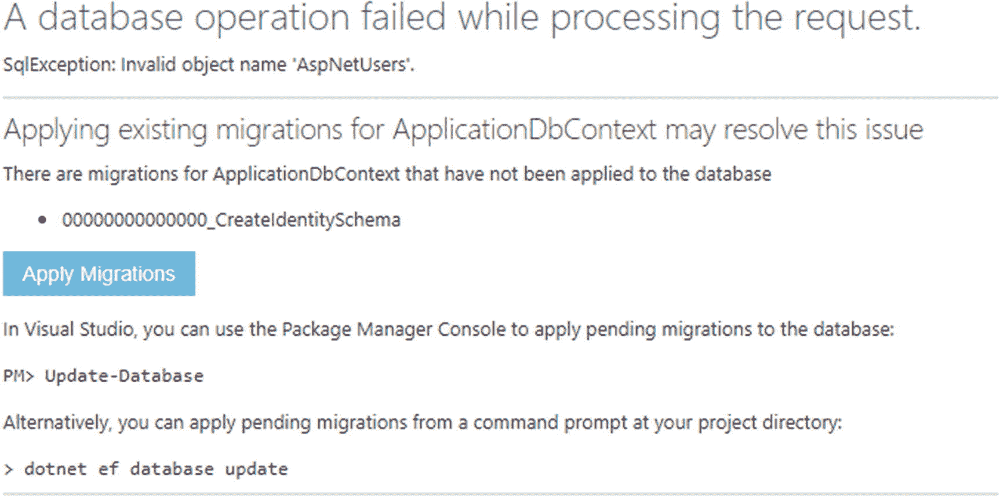
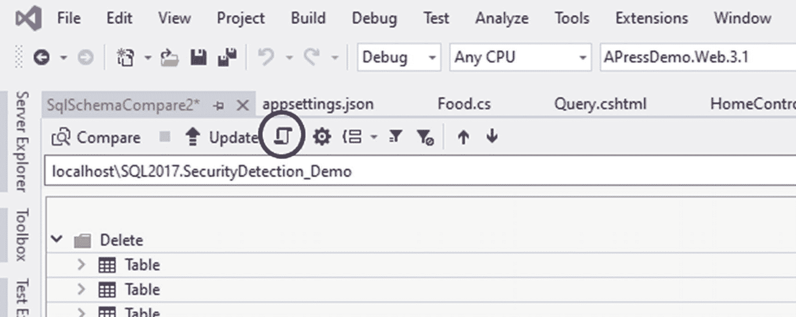
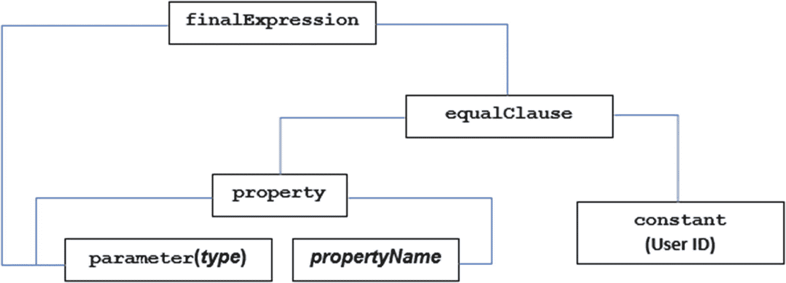

# 八、数据访问和存储

在这一章中，我将讲述如何安全地存储数据，主要集中在数据库的读写上。这一章的大约一半应该是不必要的——防止 SQL 注入攻击的有效技术已经为人所知并可用了几十年，但不知何故 SQL 注入漏洞仍然会在现实世界的网站中出现。这很可能是因为很少有开发人员了解什么是 SQL 注入以及它是如何发生的——这可以解释为什么有大量的博客文章展示数据访问，而事实上，这些数据访问很容易受到攻击。因此，如果我不仔细检查这些基本信息，那就是我的失职。

本章的其余部分将讨论其他与数据相关的内容，例如编写自定义查询以使 Entity Framework 中与安全相关的过滤更容易，将数据库设计得更安全，以及查询非 SQL 数据存储。

## 实体框架之前

为了围绕数据库访问建立良好的安全实践基础，让我们花点时间深入研究一下微软在。净:ADO.NET。即使您熟悉实体框架，也有必要简要了解一下 ADO.NET，原因有二:

*   如果您有一个实体框架不支持的数据库存储，您很可能会直接使用 ADO.NET 来进行数据访问。

*   理解 ADO.NET 将帮助您在实体框架中创建更安全的查询。

我不会详细解释它是如何工作的，只要让你知道为什么它是. NET 中大多数数据访问技术的基础就够了。

Caution

不要试图找到你自己的关于 ADO.NET 的文章！就像密码学一样，在这个主题上有很多非常糟糕的文章。当我在本书中寻找一些内容时，我发现了许多文章，其中有容易受到 SQL 注入攻击的例子，有使用完全不适当权限的连接用户的例子，或者两者兼而有之。不幸的是，网上有很多代码都存在可怕而明显的安全问题，而且显然关于如何在核心中使用 ADO.NET 的例子也太多了。

### ADO.NET

与其解释它是如何工作的，不如让我们直接看一个例子。如果你回到漏洞攻击，这里是代码*应该*已经被用于目前易受 SQL 注入攻击的页面。

```cs
private List<FoodDisplayView> GetFoodsByName(string foodName)
{
  var model = new AccountUserViewModel();
  model.SearchText = foodName;

  using (var connection = new SqlConnection(_config.
    GetConnectionString("DefaultConnection")))
  {
    var command = connection.CreateCommand();
    command.CommandText = "SELECT * FROM FoodDisplayView ↲
      WHERE FoodName LIKE '%' + @FoodName + '%'";
    command.Parameters.AddWithValue("@FoodName", foodName);

    connection.Open();

    var foods = new List<FoodDisplayView>();

    using (var reader = command.ExecuteReader())
    {
      while (reader.Read())
      {
        var newFood = new FoodDisplayView();

        newFood.FoodID = reader.GetInt32(0);
        newFood.FoodGroupID = reader.GetInt32(1);
        //Additional columns/properties ommitted for brevity

        foods.Add(newFood);
      }
    }

    model.Foods = foods;

    connection.Close();
  }

  return model;
}

Listing 8-1Basic ADO.NET query

adapted from the Vulnerability Buffet

```

我将回顾清单 [8-1](#PC1) 中的一些亮点:

*   我显式创建了一个`SqlConnection`对象，并传入了一个连接字符串。(核心中 ADO.NET 和实体框架的连接字符串基本相同。)注意，您必须显式打开连接。您还必须使用 using 语句，或者在`try` / `catch` / `finally`组的`finally`子句中显式关闭连接，否则您可能会让连接保持打开状态，不能用于以后对数据库的调用。

*   查询的实际文本进入了`SqlCommand`的`CommandText`属性。注意，我没有直接将文本值(`foodName`变量)传递给查询。相反，我指定了一个名为`@FoodName`的参数。

*   通过`command.Parameters.AddWithValue`方法将`foodName`参数的值赋予`SqlCommand`。因为数据是作为参数而不是在查询文本中传递的，所以解释器不会从参数内容中推断出任何命令。换句话说，**正是参数的使用阻止了 SQL 注入攻击成功**。

*   最后，为了完整起见，我将指出数据是通过`command.ExecuteReader()`方法加载到您的对象中的，该方法返回一个`DataReader`对象。对`DataReader`的完整解释，或者使用它的替代方法，超出了本书的范围，但是你应该能够从这个例子中收集到一些基本知识。

应该就这么简单。如果您使用参数，您几乎肯定不会受到 SQL 注入攻击。如果您将查询文本连接起来，那么几乎可以肯定。

#### 存储过程和 SQL 注入

在我继续介绍这项技术如何支撑任何安全的数据访问框架之前，我觉得我需要花一点时间来消除这个神话——由一些开发人员甚至我遇到的一些安全“专家”推动——使用存储过程可以自动保护您免受 SQL 注入攻击。要了解人们为什么相信这个神话，让我们深入一个基本的存储过程。

```cs
CREATE PROCEDURE [dbo].[User_SelectByID]
  @UserID NVARCHAR(450)
AS
BEGIN
  SET NOCOUNT ON;

  DECLARE @LastLoginDate DATETIME

  SELECT *
  FROM AspNetUsers
  WHERE UserID = @UserID
END
GO

Listing 8-2Sample stored procedure

```

清单 [8-2](#PC2) 中粗体显示的代码说明了这个神话存在的原因。人们的想法是，如果存储过程需要通过参数传递数据，那么它们必须是安全的。这是废话，有两个非常重要的原因。首先，您仍然可以不安全地调用存储过程。清单 [8-3](#PC3) 展示了如何操作。

```cs
public IdentityUser FindByIdAsync(string userId)
{
  var user = new IdentityUser();

  using (var connection = new SqlConnection(_config.
    GetConnectionString("DefaultConnection")))
  {
    var command = connection.CreateCommand();
    command.CommandText = "exec User_SelectByID '" + userId +
      "'";

    connection.Open();

    //Code to load user object removed

    connection.Close();
  }

  return user;
}

Listing 8-3Example of an insecure call to a stored procedure

```

在这个例子中，我们的查询就像我们直接编写查询一样容易受到 SQL 注入攻击。为了确保安全，我们*必须*做一些更像列表 [8-4](#PC4) 的事情。

```cs
public IdentityUser FindByIdAsync(string userId)
{
  var user = new IdentityUser();

  using (var connection = new SqlConnection(_config.
    GetConnectionString("DefaultConnection")))
  {
    var command = connection.CreateCommand();
    command.CommandText = "exec User_SelectByID @UserId";
    command.Parameters.AddWithValue("@UserId", userId);

    connection.Open();

    //Code to load user object removed

    connection.Close();
  }

  return user;
}

Listing 8-4Example of a secure call to a stored procedure

```

现在，查询本身不容易受到 SQL 注入的攻击。但是存储过程本身很容易受到一个叫做`sp_executesql`的函数的攻击。虽然从表面上看，这个函数让您能够动态创建 SQL 语句，但它也可能会暴露 SQL 注入漏洞，就像这个(有点做作的)示例中一样。

```cs
CREATE PROCEDURE [dbo].[User_SelectById]
  @UserId NVARCHAR(450)
AS
BEGIN
  SET NOCOUNT ON;

  DECLARE @sql NVARCHAR(MAX)

  SET @sql = 'SELECT * FROM AspNetUsers WHERE Id = ''' +
               @UserID + ''''

  execute sp_executesql @sql
END
GO

Listing 8-5Stored procedure vulnerable to SQL injection

```

Note

如果您绝对需要动态构建 sql，sp_executesql 确实能够利用参数。我发现微软的文档对此并不清楚，但是 StackOverflow 有一个非常清楚的例子。 <sup>[1](#Fn1)</sup>

如果清单 [8-5](#PC5) 中查询的`UserId`是用户提供的，比如来自一个查询字符串，这将容易受到 SQL 注入攻击。如果您在查询中使用一个参数来获取用户提供的信息，然后不安全地将其添加到查询中，就像任何经典的二阶 SQL 注入攻击一样，这也是有问题的。

简而言之，所有用户提供的数据都必须放入参数中。每次都是。

### 第三方 ORM

在 Entity Framework 之前，有大量的对象关系映射器(ORM ),过去(现在仍然)可以帮助将数据库表转换成 C# 中的对象。虽然实体框架现在可能是。NET，其他几个，包括 NHibernate，仍然被广泛使用。我不打算深究这些细节，但是我知道大多数 ORM 确实在大多数情况下使用参数，但是在它们的高级查询功能中仍然存在漏洞。一个很好的经验法则是，如果你通过文本构建查询，你几乎肯定在某个地方容易受到 SQL 注入攻击。

Caution

如果您知道 ORM 在大多数情况下都使用参数，那就更是如此。几年前，我在做一个项目，这个项目有一个自己开发的代码生成器，利用了一个通用的(当时的)ORM。我查看了源代码，ORM 确实尽可能使用了参数化查询。高级查询没有，因此我们有漏洞。

## 深入研究实体框架

我假设你们大多数人在这一点上至少对实体框架有一点了解。如果没有，您可能需要花几分钟时间在其他地方熟悉它。我的目标不是教你如何使用框架，而是如何安全地使用它。

让我们从演示实体框架对普通查询使用参数化查询开始。如果您对数据库有足够的权限(如果您针对本地测试实例运行，就应该有足够的权限)，则可以通过运行 SQL Server Profiler 来观察对数据库的所有查询。要启动探查器，您需要

1.  打开 SQL Server Management Studio。

2.  单击工具。

3.  选择 SQL Server 事件探查器。

4.  假设连接信息是正确的，单击连接。

5.  单击运行。

然后，您可以登录您的应用，查看实际发送到数据库的内容。

为了演示实体框架查询如何变成利用参数的数据库调用，这里是上一章清单 [7-7](https://doi.org/10.1007/978-1-4842-6014-2_7List#7) 中的`FindByNameAsync`方法的结果。

```cs
exec sp_executesql N'SELECT TOP(2) [a].[Id],↲ [a].[AccessFailedCount], [a].[ConcurrencyStamp], [a].[Email],↲ [a].[EmailConfirmed], [a].[LockoutEnabled], [a].[LockoutEnd],↲ [a].[NormalizedEmail], [a].[NormalizedUserName],↲ [a].[PasswordHash], [a].[PhoneNumber],↲ [a].[PhoneNumberConfirmed], [a].[SecurityStamp],↲ [a].[TwoFactorEnabled], [a].[UserName]↲
FROM [AspNetUsers] AS [a]
WHERE [a].[UserName] =↲ @__hashedUserName_0',N'@__hashedUserName_0↲ nvarchar(256)',@__hashedUserName_0=N'[1]5FD5CDE3198C1159BF549↲
75E42D433410F46F838D815FAD3ED64D634852149D3AF1ACA6456E170455C↲
164F1762824B1C3639C7150F1B49E5B687FCBA6A59B8D2'

Listing 8-6Database query from FindByNameAsync

```

清单 [8-6](#PC6) 中的查询有一个名为`@__hashedUserName_0`的参数，并且有用户名的数据类型和哈希值。

### 运行即席查询

既然您已经知道用 LINQ 构建的查询是安全执行的，那么让我们来看看使用起来可能不安全的即席查询。清单 [8-7](#PC7) 显示了一个例子。

```cs
public IdentityUser FindByIdAsync(string userId)
{
  var user = _dbContext.Users.FromSqlRaw($"SELECT * FROM↲
    AspNetUsers WHERE Id = '{userId}').Single();

  return user;
}

Listing 8-7Unsafe query being run with Entity Framework

```

如果你不太了解 SQL 注入，这看起来是一个很棒的功能——`FromSqlRaw`允许你在 LINQ 查询不起作用的时候创建自己的定制查询。但是现在你知道了 SQL 注入是如何工作的，你应该能够明白为什么这是有问题的。事实上，如果 userId 是用户控制的，这个函数确实容易受到攻击。

ASP.NET 团队试图通过创造一种叫做`FromSqlInterpolated`的方法来解决这个问题。下面是该方法在实际查询中的样子。

```cs
public IdentityUser FindByIdAsync(string userId)
{
  var user = _dbContext.Users.FromSqlInterpolated(
    $"SELECT * FROM AspNetUsers WHERE Id = '{userId}')
      .Single();

  return user;
}

Listing 8-8Safer query being run with Entity Framework

```

清单 [8-8](#PC8) 中没有变化，只是我使用了`FromSqlInterpolated`而不是`FromSqlRaw`，但是实体框架很好地理解了格式化字符串，可以正确地将数据转换成参数。最重要的是，ASP.NET 团队有先见之明，阻止了常规字符串被传递到这个方法中——这使得无意中引入 SQL 注入漏洞变得更加困难。很棒的解决方案，对吧？我不喜欢这样有两个原因:

*   看到“FromSqlInterpolated”并不能让任何新开发人员，或者不熟悉 SQL 注入的开发人员，清楚地知道在幕后做了什么来保证它的安全。因此，我不期望这种方法会在任何重要的项目中得到一致的使用。FromSqlRaw 很容易溜进来，要么是出于无知，要么是出于隐晦的需要。

*   您应该希望安全专业人员半定期地审核您的代码。我见过的大多数网络安全专家都不是 ASP.NET Core 的专家。例如，他们知道一些关于 ASP.NET 如何不同于一些 Java 框架工作的一般信息，但是他们不太了解框架与核心，更不了解核心中的最新特性。这个代码会把他们搞糊涂。

您可以在自定义实体框架查询中更明确地包含参数，向其他开发人员和潜在的安全审计人员发出信号，告诉他们您知道自己在做什么。清单 [8-9](#PC9) 展示了代码的样子。

```cs
public IdentityUser FindByIdAsync(string userId)
{
  var user = _dbContext.Users.FromSqlRaw(
    "SELECT * FROM AspNetUsers WHERE Id = {0}", userId)
      .Single();

  return user;
}

Listing 8-9Safest query being run with Entity Framework

```

Caution

说实话，这仍然不清楚发生了什么或为什么。开发人员很容易看到这一点，并认为首先格式化字符串并将整个字符串传递给`FromSqlRaw`是更好的解决方案。为了安全起见，如果您需要自定义查询，最好使用 ADO.NET。

注意，我使用的是不太安全的 FromSqlRaw 方法，但是我将`userId`作为一个单独的参数传入。虽然这段代码并不十分清楚，因为它并没有明确地给参数命名，但是大多数读者会看到查询与数据是分开的，从而减少了以后产生误解的可能性。

Tip

请注意，占位符{0}没有引号。无论有无引号，都会添加引号，因此请确保将其从查询中排除。

### 最小特权原则和部署变更

实体框架还有另一个相当严重的安全相关问题。如果你还记得第 [2](02.html) 章，有一个叫做最小特权的*原则的概念，它规定用户应该只拥有最小数量的权限来完成他们的工作。这个原则也适用于系统帐户。运行您的网站的系统帐户应该只能读取必要的文件，执行特定的代码，并可能写入有限数量的文件夹。用于连接数据库的帐户应该遵循相同的原则:如果连接只需要读写数据库中的某些表，那么这就是它应该获得的所有权限。做任何其他事情都会大大增加对受损帐户的攻击所能造成的损害。*

代码优先的实体框架似乎鼓励相反的事情。为了理解我的意思，请看图 [8-1](#Fig1) ，它显示了如果您的数据库与您的实体框架模型不匹配，您可能已经看到的屏幕。



图 8-1

ASP.NET 网站提示用户更新数据库

提示用户更新数据库对于任何合格的安全专家来说都是一个可怕的前景，这在很大程度上是因为很少有合法的场景允许数据库连接用户有权更新数据库。就我而言，这不是一个特性，而是一个错误，而且是一个非常顽固的错误。屏幕截图中的命令行建议看起来并没有更好，因为它期望连接字符串中的用户拥有比工作所需更多的权限。

如果说这个功能有什么好的一面，那就是默认的框架代码默认不允许在生产中使用它。要打开这个功能，您可以在您的启动类中添加一行代码，如清单 [8-10](#PC10) 所示，它不包含在产品中。

```cs
if (env.IsDevelopment())
{
  app.UseDeveloperExceptionPage();
  app.UseDatabaseErrorPage();
}
else
{
  app.UseExceptionHandler("/Home/Error");
  app.UseHsts();
}

Listing 8-10Code for database update page

```

不幸的是，因为这是一行代码，所以很容易将它投入生产，而这种功能不属于*。*

可以做什么来更新数据库呢？您可以只为部署代码创建一个新的配置，将配置文件与有权限更新数据库的数据库用户的凭证一起存储，然后运行清单 [8-11](#PC11) 中的命令。

```cs
dotnet ef database update --configuration DEPLOY

Listing 8-11Command line for pushing up database changes

```

如果您使用 SQL Server 作为数据库，另一个选择是使用 Visual Studio 中的数据库架构比较工具。要找到它，你可以去工具➤ SQL Server ➤新模式比较…在您生成比较之后，您可以通过点击看起来有点像卷轴的图标来导出脚本，如图 [8-2](#Fig2) 所示。



图 8-2

模式比较工具中“生成脚本”按钮的位置

不管你使用哪种方法，不要让你的网站更新数据库。如果您错过了保护任何地方的任何查询，这些权限会大大增加有经验的黑客所能造成的损害。

### 简化过滤

既然我已经讨论了实体框架的问题，让我们继续讨论如何使它更容易使用和维护。首先，让我们尝试解决大多数网站面临的一个问题:限制能够知道的用户访问数据。像我在上一章中所做的那样，使用基于角色或基于策略的属性是一个很好的开始，但是在像在电子商务应用中查看以前的订单这样的情况下，它没有多大帮助。用户应该能够看到“查看订单”页面，因此您可以在中通过属性授权用户这样做。但是，除此之外，您还需要将可用的订单过滤为用户可以看到的订单，这对于属性来说并不容易实现。大多数时候，作为开发人员，我们不得不一遍又一遍地创建相同的过滤器来保护我们的数据，但这很烦人，而且容易出错。为了理解我的意思，这里有一个来自假设的电子商务应用的查询，允许用户看到他们自己的订单细节，但没有其他的。

```cs
public OrderDetail FindDetailById(int orderDetailId)
{
  var loggedInUserId = GetUserIdFromClaims();

  return _dbContext.OrderDetail.Single(detail =>
    detail.OrderDetailId == orderDetailId &&
    detail.Order.OrderedBy == loggedInUserId);
}

Listing 8-12Safest query being run with Entity Framework

```

清单 [8-12](#PC12) 中用粗体显示的代码是为了防止用户从系统中提取任何用户的订单详细信息，但是很难记住在任何需要的地方都包含这些信息，很难准确记住在任何地方都需要什么，如果发生变化也很难更新。我们能做什么？

#### 使用硬编码子查询过滤

基于特定上下文限制查询的一个选项是预先创建运行初始过滤器的查询，然后立即运行特定于上下文的过滤器。这个大概不太清楚，这里举个例子。

```cs
public OrderDetail FindDetailById(int orderDetailId)
{
  var detail = _dbContext.OrderDetail.Where(detail =>
    detail.Order.OrderedBy == loggedInUserId)
    .Single(detail => detail.OrderDetailId == orderDetailId);

  return detail;
}

Listing 8-13Example of chained queries

```

在清单 [8-13](#PC13) 的例子中，有两个查询:一个按照用户过滤`OrderDetail`的`Where`子句和一个按照传入的`orderDetailId`过滤`OrderDetail`集合的`Single`子句。Entity Framework 的一个特性是，表达式是在需要时计算的，而不是在声明时计算代码行。如果您不知道发生了什么，这可能会令人困惑并且难以调试，但这确实意味着您可以编写多个查询，并且只进行一次数据库调用。在我们的例子中，`Where`和`Single`子句被合并到一个 SQL 查询中，提高了性能。

虽然这一切都很好，但并不太好——您仍然在对所有过滤器进行硬编码。但是因为您已经将可重用部分(`Where`子句)与特定于上下文的部分(`Single`子句)分开，所以现在您可以将可重用部分移动到它自己的类中。这种方法的实际实现可能会根据您的需求而有所不同，但是我将概述一种我非常喜欢的方法。它有两个部分——一个包含几个预过滤集合的对象，以及一个返回该对象的数据库上下文对象的方法。首先，我将向您展示清单 [8-14](#PC14) 中的最终查询。

```cs
_dbContext.FilterByUser(User).OrderDetail.Single([query]);

Listing 8-14Pre-filtered Single() query

```

您可以看到`FilterByUser`方法，这很容易理解，后面是一个预过滤的集合，开发人员可以对其进行进一步的查询。为了了解它是如何工作的，让我们深入下一个层次，清单 [8-15](#PC15) 中的`FilterByUser`方法。

```cs
public partial class ApplicationDbContext
{
  public UserFilter FilterByUser(System.Security.Claims.↲
    ClaimsPrincipal user)
  {
    return new UserFilter(this, user);
  }
}

Listing 8-15Database context method to return a user filter object

```

这个方法除了允许您调用返回一个`UserFilter`对象的`yourContextObject.FilterByUser(User)`之外没有做很多事情，这本身并不有趣，所以让我们深入研究一下`UserFilter`。

```cs
public class UserFilter
{
  ApplicationDbContext _context;
  ClaimsPrincipal _principal;

  public UserFilter(DynamicContext dbContext,
    ClaimsPrincipal principal)
  {
    _context = dbContext;
    _principal = principal;
  }

  public IQueryable<OrderDetail> OrderDetail
  {
    get
    {
      var userID = GetUserID();
      return _context.OrderDetail
        .Where(detail => detail.Order.OrderedBy == userID);
    }
  }

  private string GetUserID()
  {
    return _principal.Claims.Single(c => c.Type ==
      ClaimTypes.NameIdentifier).Value;
  }
}

Listing 8-16Object that returns collections that are filtered by user

```

清单 [8-16](#PC16) 中的`UserFilter`类包含实际的属性，以及我之前说过我们需要分离的`Where`子句的过滤器。我这里只有`OrderDetail`对象作为例子，但是你可以想象在你的系统中为任何和所有的集合创建属性。

#### 使用表达式过滤

预编码的过滤器非常棒，因为它们易于编码和理解，使得任何人只要接触到您的代码就能够添加任何方法和修复任何问题。问题是您需要为数据库上下文中的每个集合创建一个新的属性，如果您的数据库中有大量的表，这可能会很麻烦。

另一种方法是在运行时使用 Expression 对象构建 LINQ 表达式。理解示例代码需要一点解释，所以我首先想向您展示结果代码是如何被调用的。

```cs
public class SomeClass
{
  private HttpContext _context;

  //Constructors ommitted for brevity

  public GetOrder(int orderId)
  {
    return _dbContext.Order.SingleInUserContext(o =>
      o.OrderId == orderId);
  }
}

Listing 8-17Sample query using a filter using Expressions built at runtime

```

清单 [8-17](#PC17) 中的想法是`SingleInUserContext`方法根据用户 ID 自动过滤订单，所以如果一个请求以某种方式针对一个用户无权访问的订单，编写前端代码的开发人员不需要记住也根据用户过滤。

在这个例子中，代码如何知道如何按用户过滤`Order`？您确实需要告诉您的代码哪个属性保存了用户 ID，因此您可以使用属性来完成这项工作。属性类如下所示。

```cs
public class UserFilterableAttribute : Attribute
{
  public string PropertyName { get; private set; }

  public UserFilterableAttribute(string propertyName)
  {
    PropertyName = propertyName;
  }
}

Listing 8-18Attribute to tell our Expression builder which property to use

```

清单 [8-18](#PC18) 中除了将属性名存储在一个名为`PropertyName`的属性中之外，没有什么可看的。清单 [8-19](#PC19) 展示了这个属性的作用。

```cs
[UserFilterable("UserId")]
public partial class Order
{
  //Class contents removed for brevity

  //Field that stores the User ID
  public string UserId { get; set; }
}

Listing 8-19UserFilterableAttribute in action

```

既然基础知识已经讲完了，让我们开始学习更有趣的东西吧。清单 [8-20](#PC20) 展示了`SingleInUserContext`方法的样子。

```cs
public static TSource SingleInUserContext<TSource>(
  this IQueryable<TSource> source,
  HttpContext context,
  Expression<Func<TSource, bool>> predicate)
    where TSource : class
{
  try
  {
    Expression<Func<TSource, bool>> userPredicate =
      GetUserFilterExpression<TSource>(context);

    try
    {
      return source.Where(userPredicate).Single(predicate);
    }
    catch
    {
      var preUserCount = source.Count(predicate);
      var postUserCount =
        source.Where(userPredicate).Count(predicate);

      if (preUserCount == 1 && postUserCount == 0)
        throw new InvalidOperationException(
          "Item not in user context");
      else
        throw;
    }
  }
  catch (Exception ex)
  {
    //Add logging later
    throw;
  }
}

Listing 8-20SingleInUserContext internals

```

大部分工作都是在`GetUserFilterExpression`方法中完成的，我一会儿就会谈到这个方法。但是让我们花点时间来看看这里有什么。以下是一些需要强调的内容:

*   这个方法将一个`Expression`作为参数。这就是 LINQ 查询的幕后工作。在这里请求允许我们进一步过滤我们的`Single`查询，而不仅仅是通过用户过滤，就像我们在清单 [8-14](#PC14) 的例子中所做的那样。

*   `GetUserFilterExpression`返回一个按用户过滤的`Expression`，但是因为保持“`predicate`”`Expression`的完整性更容易，我们可以在对`Single`的调用中为用户表达式和定制查询使用一个`Where`过滤器。

*   这里有一个额外的 try/catch，当`Single`抛出一个错误时，它试图确定这个错误是由用户过滤器还是自定义查询引起的。如果运行时查询返回一个，但用户过滤的查询没有返回任何信息，则可能正在进行一些恶作剧，例如用户试图利用 IDOR 漏洞，因此将这些信息发送到应用。

*   您必须用最后一个查询显式地调用`Single`——我找不到绕过它的方法。这样做的主要结果是，您需要为您创建的每个用户可过滤方法创建单独的方法。换句话说，如果您想拥有单独的`First`和`Single`方法，您需要为每个方法创建单独的用户可过滤方法。

现在，让我们深入了解清单 [8-21](#PC21) 中的大部分处理发生在哪里。

```cs
private static Expression<Func<TSource, bool>>
  GetUserFilterExpression<TSource>(HttpContext context)
    where TSource : class
{
  Expression<Func<TSource, bool>> finalExpression = null;

  var attrs = typeof(TSource).GetCustomAttributes(true).
    Where(a => a.GetType() ==
      typeof(UserFilterableAttribute));
  if (attrs.Count() == 0)
  {
    throw new MissingMemberException($"{typeof(TSource).Name}↲
      must have a UserFilterableAttribute in order to use one↲
      of the UserContext search methods");
  }

  var userClaim = context.User.Claims.SingleOrDefault(c =>
    c.Type == ClaimTypes.NameIdentifier);
  if (userClaim == null)
    throw new NullReferenceException("There is no user logged↲
      in to provide context");

  var attrInfo = (UserFilterableAttribute)attrs.Single();
  var parameter = Expression.Parameter(typeof(TSource));

  Expression property = Expression.Property(
    parameter, attrInfo.PropertyName);

  var userProperty = typeof(TSource).GetProperty(
    attrInfo.PropertyName);

  object castUserID = GetCastUserID(userClaim, userProperty);

  var constant = Expression.Constant(castUserID);
  var equalClause = Expression.Equal(property, constant);
  finalExpression = Expression.Lambda<Func<TSource, bool>>(
    equalClause, parameter);

  return finalExpression;
}

Listing 8-21GetUserFilterExpression internals

```

这里有很多代码，但是方法的前半部分只是用来查找用作过滤器的属性和用户 ID。这里没什么可看的。当您在方法进行到一半时开始使用表达式时，代码中有趣的部分就开始了。final 子句的每个单独组件都是一个表达式，包括

*   **参数**:包含我们比较的对象属性的类型。在这种情况下，因为`Order`对象上的`UserId`属性是一个字符串，所以这是一个字符串。

*   **属性**:这是我们比较的对象的属性。在本例中，这是`Order`对象的`UserId`属性。

*   **常数**:这是被比较的实际值。在这种情况下，它存储用户 ID 的实际值。

*   **equalClause** :存储比较是否相等的属性和常量。

*   这是传递给 LINQ 的最后一个 lambda 子句。

图 [8-3](#Fig3) 显示了所有这些组件是如何装配在一起的。



图 8-3

运行时构建的用户 ID 比较中表达式之间的关系

因为它是用`Expressions`和反射构建的，所以你应该能够很容易地将它扩展到其他类。

Note

此示例仅显示了如何筛选将用户 ID 作为属性的对象。如果我们能够基于父集合自动过滤对象，比如通过`Order`对象上的`UserId`过滤`OrderDetails`，那将会更加有用。通过用`Expression.Call`添加子查询，这是很有可能的，但是它很快变得复杂。

### 使用 ValueConverter 轻松转换数据

实体框架的另一个问题是，你并不总是希望在数据库中存储数据的格式与你在应用中使用的格式相同。例如，改进的`IdentityUser`对象使用明文 PII(电子邮件地址、电话号码等。)中，但以哈希和加密格式存储数据。如果没有某种方法来拦截和更改与数据库之间的通信，那么确保这些值被正确存储将会非常繁琐，而且容易出错。进入`ValueConverter`。`ValueConverter`做刚才描述的事情——拦截对数据库的调用，以某种自定义格式存储数据，然后当从数据库中提取数据时，它以代码而不是数据库想要的方式格式化数据。

为了了解这是如何工作的，让我们创建一个属性的示例，当将该属性添加到实体框架对象的属性中时，会导致该属性也存储一个完整性散列来帮助证明内容没有被更改。首先，让我们看看清单 [8-22](#PC22) 中的属性。

```cs
public class AddIntegrityHashAttribute : Attribute
{
  //Ask for the salt name to get from the key store

  //You could also use the class & property names to generate
  //a key name OR store the salt per row
  public string _hashSaltKeyName { get; private set; }

  //Should we throw an exception if the hash is missing
  //entirely? Necessary check if upgrading an existing app
  public bool _exceptionIfNull { get; private set; }

  public AddIntegrityHashAttribute(
    string hashSaltKeyName,
    bool throwExceptionIfNull)
  {
    _hashSaltKeyName = hashSaltKeyName;
    _exceptionIfNull = throwExceptionIfNull;
  }
}

Listing 8-22Attribute to flag a property as needing an integrity hash

```

该属性存储哈希 salt 密钥名称和一个布尔值，该值指示在缺少完整性哈希时是否应引发异常。对于散列 salt，您也可以从类名和属性名派生出键，或者逐行存储 salt，但是为了简单起见，我在这里只使用硬编码的键名。你还需要知道如果完整性散列丢失是否抛出异常——如果你在一个新的应用上使用它，你可以合理地确定散列在任何合法的场景中都存在。对于现有的应用，您可能只想在项目更新时添加哈希，如果哈希只是丢失，就不要标记。

下一步是创建一个类，它将实体框架对象看到的数据与存储在数据库中的数据进行实际的转换。这就是`ValueConverter`的用武之地。这是将要做这项工作的班级。

```cs
public class IntegrityHashConverter<TVal> :
  ValueConverter<TVal, string>
{
  public IntegrityHashConverter(IHasher hasher,
    String hashSaltName,
    Boolean throwExceptionIfNull,
    ConverterMappingHints mappingHints = null)
      : base(v =>
          //Method to convert into database storage
          Hash(v, hasher, hashSaltName),
          //Method to convert from database storage
          Verify(hasher, hashSaltName, throwExceptionIfNull),
            mappingHints)
  {
  }

  private static string Hash(TVal value, IHasher hasher,
    String hashSaltName)
  {
    if (value == null)
      return null;

    var salt = GetSalt(hashSaltName);

    var hashed = hasher.Hash(value.ToString(), salt,
      Hasher.HashAlgorithm.SHA512, false);
    return value + "|" + hashed;
  }

  private static Expression<Func<string, TVal>> Verify(
    IHasher hasher,
    String hashSaltName,
    Boolean throwExceptionIfMissing)
  {
    return v => VerifyHash(v, hasher, hashSaltName,
      throwExceptionIfMissing);
  }

  private static TVal VerifyHash(string value, IHasher hasher,
    String hashSaltName, Boolean throwExceptionIfMissing)
  {
    if (String.IsNullOrEmpty(value))
      return (TVal)Convert.ChangeType(value, typeof(TVal));

    var currentIndex = value.LastIndexOf("|[");
    if (currentIndex < 0)
    {
      if (throwExceptionIfMissing)
        throw new HashNotFoundException(
          $"Could not verify hash in value: {value}");
      else
        return (TVal)Convert.ChangeType(value, typeof(TVal));
    }

    var existingHash = value.Substring(currentIndex + 1);
    var oldText = value.Substring(0, currentIndex);

    var salt = GetSalt(hashSaltName);

    var oldHashed = hasher.Hash(oldText, salt,
      Hasher.HashAlgorithm.SHA512, false);

    if (oldHashed != existingHash)
      throw new HashDoesNotMatchException(
        "Verification hash did not match");

    return (TVal)Convert.ChangeType(oldText, typeof(TVal));
  }

  //You shouldn’t really put this here
  //Placing this here for convenience
  private string GetSalt(string name)
  {
    //Implementation removed
  }
}

Listing 8-23Example ValueConverter that adds and checks the integrity hash

```

清单 [8-23](#PC23) 中最有趣的部分是，基类采用方法在数据库存储格式之间进行转换，而不是像 C# 中的大多数对象一样试图创建应该被覆盖的方法。如果您不习惯这种方法，一开始会有点难以理解，但它确实允许更大的灵活性。

接下来，您需要告诉数据库上下文对象您的`ValueConverter`存在。您可以对每个属性进行硬编码，但是因为这是使用属性，所以数据库上下文会自动选取新的属性，所以让我们使用反射来代替。

```cs
public partial class ApplicationDbContext : IdentityDbContext
{
  private IHasher _hasher;

  public ApplicationDbContext(DbContextOptions options,
    IHasher hasher) : base(options)
  {
    _hasher = hasher;
  }

  //Other constructor and properties removed

  protected override void OnModelCreating(
    ModelBuilder modelBuilder)
  {
    //This is needed to add the built-in identity objects
    base.OnModelCreating(modelBuilder);

    //Add your custom objects here

    foreach (var entityType in
      modelBuilder.Model.GetEntityTypes())
    {
      foreach (var property in entityType.GetProperties())
      {
        SetUpIntegrityHash(property);
      }
    }
  }

  private void SetUpIntegrityHash(IMutableProperty property)
  {
    if (property.PropertyInfo == null)
      return;

    var attributes = property.PropertyInfo.
      GetCustomAttributes(typeof(AddIntegrityHashAttribute),
        false);

    if (attributes.Count() > 1)
      throw new InvalidOperationException("You cannot have↲
        more than one IntegrityHash attribute defined on a↲
        single property");

    if (attributes.Count() == 1)
    {
      var attr = (AddIntegrityHashAttribute)attributes
        .Single();

      var salt = attr.hashSaltKeyName;

      var genericBase = typeof(IntegrityHashConverter<>);
      var combinedType = genericBase.MakeGenericType(
        property.FieldInfo.FieldType);
      var converter = (ValueConverter)Activator.
        CreateInstance(combinedType, _hasher, salt,
          attr.ExceptionIfNull, null);
      property.SetValueConverter(converter);
    }
  }
}

Listing 8-24Example ValueConverter that adds and checks the integrity hash

```

注意清单[中的代码 8-24](#PC24) 在`OnModelCreating`中，因为虽然那里没有太多的代码，但是那里有什么是至关重要的。您需要调用`base.OnModelCreating`来添加默认的身份对象(`IdentityUser`、`IdentityRole`等)。)添加到您的模型中，并且您需要添加自己的对象。完成后，您可以通过遍历所有属性和对象来查找属性的所有实例。

实际的赋值发生在`SetUpIntegrityHash`方法的后半部分。使用`genericBase`、`combinedType`和`converter`变量，您正在创建一个`IntegrityHashConverter`类的实例。一旦创建了实例，实际设置转换器就像调用`property.SetValueConverter()`一样简单。

Note

`ValueConverter`的一个限制是它期望实体框架对象和数据库列之间的一对一映射，所以除非您想从您的数据访问代码中调用一个单独的数据访问服务，否则您需要将所有内容存储在一个列中，因此在前面的示例中，完整性散列位于“真实”值的末尾。

当然，您也可以使用`ValueConverter`进行其他数据转换。在看到这个例子之前，您可能会想到用它来以加密格式存储数据。但是现在您已经看到了这个例子，并且知道您应该在本地散列数据并将加密的值存储在其他地方，所以`ValueConverter`显然不适合加密。是的，有变通办法。如果您将数据库上下文注册为服务，您可以像我们在本书中创建的任何其他服务一样，在构造函数中获取 ASP.NET 服务，这为您提供了更多的灵活性，例如调用可以获取和存储加密值的服务。但是这种配合很尴尬，而且尴尬的配合通常很难打造，维护起来也很昂贵。

### 其他关系数据库

几十年来，只要有兼容的驱动程序，微软就用 ADO.NET 支持不同的数据库。对实体框架的支持没有那么好——在很长一段时间里，SQL Server 是认真的开发人员唯一可用的选择。

现在，大多数最常见的数据库都有驱动程序，包括 Oracle、MySql、DB2、PostgreSQL 等等。这些供应商中的大多数也有可用于实体框架的驱动程序，所以如果您想支持实体框架，就不必再使用 SQL Server 了。

如果您使用 SQL Server 之外的数据库，您仍然可以使用本书中的大部分或全部安全建议——尽可能使用参数化查询仍然是我能给出的最好建议。但是，在使用其他数据库时，还有两件事情需要考虑:

*   如果您确实需要创建即席查询，请注意数据库之间在哪些字符必须转义以确保安全方面存在细微的差异。例如，MySql 使用“`”字符来标记字符串，而不是像 SQL Server 那样使用撇号。同样，参数化查询是您最好的防御手段。

*   有大量的第三方数据库驱动程序在四处浮动。小心你信任的人。并不是所有的组织都同样重视安全性，所以你很可能得到一个不安全的驱动程序。尽可能使用由 Microsoft 或数据库创建者创建的驱动程序。

## 安全数据库设计

对数据库安全的全面论述，甚至对 SQL Server 安全性的全面论述，可以写满一本书。在这里，我没有足够的空间向您介绍您需要了解的所有内容，但是我将重点介绍一些可以帮助保护您的数据库的快捷方法。

### 使用多个连接

针对不同的需求，使用不同的连接和不同的权限。例如，如果你运行一个电子商务应用，你可以想象你会有购物者、经销商和管理员都访问你的网站。每种类型的用户都应该有自己的连接上下文，其中购物者连接不能访问分销商表，分销商连接不能访问用户管理表，等等。虽然设置多个连接来访问数据库的不同区域看起来很痛苦(确实如此)，但这是一种帮助限制被入侵帐户所造成的损害的好方法。

### 使用模式

一些数据库，如 SQL Server 和 PostgreSQL，允许您将数据库对象组织成命名的*模式*。如果您的数据库有这个特性，您应该利用它。虽然这可以帮助您按功能分离表，但也可以通过授予对模式而不是单个对象的访问权限来帮助您管理不同用户的不同权限。按照前面的示例，您可以为订单创建一个只有管理员和购物者可以访问的模式，为经销商创建一个购物者可以读取且经销商可以读/写的模式，以及一个管理员可以控制但经销商和购物者只能有限访问的设置模式。

### 不要用数据存储秘密

不要将秘密(如 API 密码或加密密钥)与其他数据一起存储。如果没有其他选择，请将它们存储在具有锁定权限的单独模式中。更好的解决方案是将这些值完全存储在一个单独的数据库中。更好的解决方案是将这些值完全存储在独立服务器上的数据库中。但是把它们和你的数据存储在一起只是自找麻烦。

### 避免使用内置的数据库加密

是的，让您的数据库处理所有的加密和解密听起来像是一种不需要进行太多开发工作就能加密数据的简单方法。问题是你的数据库不应该能够加密和解密它自己的秘密数据——这使得黑客很容易获得必要的密钥来解密数据。对数据的其余部分保密意味着应该对数据库保持解密数据的能力。

### 测试数据库备份

如果您负责数据库的管理，请务必测试您的数据库备份。是的，我知道你听过这个建议。是的，我知道你可能不会这么做。但是您应该知道—您永远不知道您的备份或恢复过程何时出现问题，如果不测试它们，您也不会发现。

Note

我几乎是吃了苦头才学到这一课的。我负责一个存在间歇性可用性问题的应用，为了在本地测试该问题，我们获取了生产数据库的备份副本，并尝试将其安装在我们的一台服务器上进行测试。我们做不到——备份被不可挽回地破坏了。长话短说，备份数据库的过程不仅导致网站瘫痪，还破坏了备份。幸运的是，我们在出于任何紧急目的需要备份之前发现(并修复)了这个问题。你觉得幸运吗？如果没有，请测试您的备份。

## 非 SQL 数据源

我将在本章中简要介绍的最后一件事是不是关系数据库的数据源，比如 XML、JSON 或 NoSQL 数据库。虽然完整地处理这些问题本身就需要一本书，但是这里遵循的一般规则与关系数据库是一样的:

*   尽可能使用将数据与查询分开的参数。

*   如果不可行，只允许应用使用有限的预定义字符，但你知道在查询中使用这些字符是安全的。

*   当这不可能时，确保对查询解析器可能解释为命令的所有字符进行转义。(当您遗漏了一些东西时，您的数据可能会遭到破坏。)

我可以给出的另一个技巧是，如果您必须接受用户输入的查询，请为您的真实数据使用 GUIDs 或其他占位符。例如，如果您知道需要通过整数 ID 查询数据库，那么创建每个整数 ID 到 GUID 的映射，然后将 GUID 发送给用户。例如，让我们创建一个假设的 id 到 GUIDs 的表。

表 8-1

将整数 id 映射到 GUIDs

<colgroup><col class="tcol1 align-left"> <col class="tcol2 align-left"></colgroup> 
| 

实际 ID

 | 

显示 ID

 |
| --- | --- |
| Ninety-nine | 4094 CAE 2-66 B4-40ca-92 ed-c 243 a1 af 9 和 04 |
| One hundred and twenty-nine | 7ca 80158-a469-416 a-a9 F5-688 a 69707 ca5 |
| Two hundred and fifty-eight | S7-1200 可编程控制器 |
| Three hundred and eleven | 6 ACD d9-8 和 93-4 及 60-8432-46051 d25 至 360 |
| Three hundred and eighty-six | 83763 c 0 f-6 和 40-4c7e-b937-ac3dd62f6172 |

现在，让我们看看如何使用表 [8-1](#Tab1) 中的映射来保护您的应用。为了简洁起见，我将跳过错误处理和任何其他数据。

```cs
public class SomeController : BaseController
{
  public IActionResult GetData(Guid id)
  {
    int actualId = _dbContext.Mapping.Single(map =>
      map.PublicID == id);

    var unsafeQuery = $"SELECT * FROM Source ↲
      WHERE DbId = {acutalId}";

    var myObject = _dataSource.Execute(unsafeQuery);

    return View(myObject);
  }
}

Listing 8-25Example code that uses a GUID mapping for safety

```

这段代码缺乏细节，但我希望您能理解。当我们不安全地构建查询时，除了有人恶意修改我们的数据之外，几乎没有可能出现无效或不安全的查询，因为唯一“不安全”的代码来自可信的来源。

## 摘要

我在本章开始时讨论了如何使用参数化查询来防止 SQL 注入攻击，然后介绍了实现这一点的不同方法。然后，我讨论了 Entity Framework 中一些鲜为人知的特性，这些特性可以使您的特定于上下文的内容更容易编写。最后，我简要概述了数据库安全性和安全查询非 SQL 数据存储。

在下一章，我将讨论如何在你的网站中正确设置日志和错误处理。正确的错误处理相对容易。为了安全而进行适当的日志记录要少得多。我将深入探讨原因，以及如何修复它。

<aside aria-label="Footnotes" class="FootnoteSection" epub:type="footnotes">Footnotes [1](#Fn1_source)

[T2`https://stackoverflow.com/questions/28481189/exec-sp-executesql-with-multiple-parameters`](https://stackoverflow.com/questions/28481189/exec-sp-executesql-with-multiple-parameters)

 </aside>