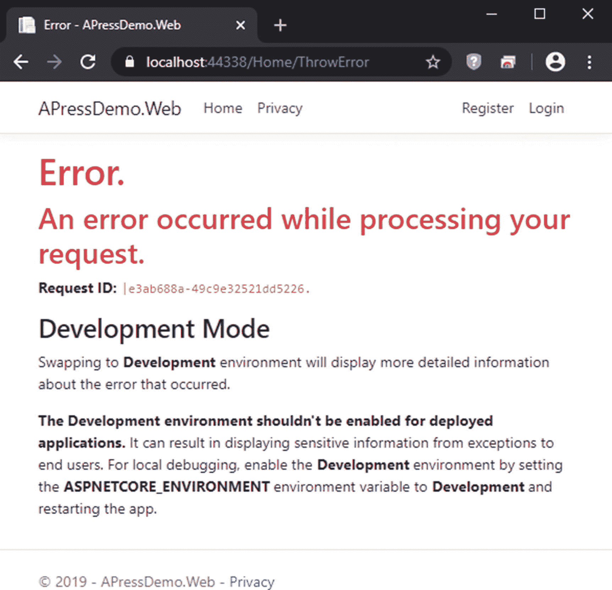

# 九、日志记录和错误处理

有可能，甚至有可能，你会想跳过这一章。毕竟，日志本身并不能保护数据、防止入侵或大多数开发人员想到“安全”时想到的任何东西但是从另一个角度想一想——实际上，你们当中有多少人会知道黑客是否通过你的登录页面中的 SQL 注入漏洞窃取了凭证，就像本书前面描述的那样？

作为证据，道德安全人员可以使用的密码缓存(像在 [`https://haveibeenpwned.com`](https://haveibeenpwned.com) 的那个)有*十亿*的密码。如果你跟踪 haveibeenpwned.com 的所有者特洛伊·亨特，你会注意到他发现的许多密码缓存来自于所有者不知道他们已经被黑客攻击的网站。当然，在黑暗网络上，不道德的黑客可以从更多被黑的网站获得更多的密码。几乎可以肯定的是，你的多个网站的用户名和密码都可以买到。

检测到一个漏洞所需时间的数字各不相同，但有些估计高达数百天。 <sup>[1](#Fn1)</sup> 在许多情况下，安全漏洞直到第三方审计员查看日志时才被发现。有多少小公司的网站没有被审计？有多少网站根本没有多少日志记录？

黑客希望避免被发现，他们指望大多数网站不会注意到有人试图闯入。好的日志记录可以帮助解决这个问题。ASP.NET Core 有一个改进的日志机制，但不幸的是，它并没有真正解决我们的问题。要了解原因，让我们深入研究一下。

## ASP.NET 岩心新记录

有了新版本的 ASP.NET，我们不仅获得了新的特定于日志的服务，而且框架本身已经实现了相当多的日志功能。当我们考虑安全性时，有一个基本问题:改进的日志记录是在考虑调试而不是安全性的情况下构建的。要了解这是为什么，您首先需要了解当前的日志服务是如何工作的。当您想要记录信息时，您可以使用`ILogger`界面。你可以在清单 [9-1](#PC1) 中看到。

```cs
public interface ILogger
{
  void Log<TState>(LogLevel logLevel, EventId eventId,
    TState state, Exception exception,
    Func<TState, Exception, string> formatter);
  bool IsEnabled(LogLevel logLevel);
  IDisposable BeginScope<TState>(TState state);
}

Listing 9-1The ILogger interface

```

如果您要实现这个接口，您需要实现`Log`方法来写入您的数据存储，通常是一个平面文件或数据库。让我们在这里跳过这个方法的实现，因为您应该已经能够这样做了。同时，让我们假设日志记录器能够安全地保存您的数据，并通过查看默认登录页面的代码来看看如何使用这个示例。

```cs
internal class LoginModel<TUser> : LoginModel where TUser : class
{
  private readonly SignInManager<TUser> _signInManager;
  private readonly ILogger<LoginModel> _logger;

  public LoginModel(SignInManager<TUser> signInManager,
    ILogger<LoginModel> logger)
  {
    _signInManager = signInManager;
    _logger = logger;
  }

  public override async Task OnGetAsync(
    string returnUrl = null)
  {
    //Not important for us right now
  }

  public override async Task<IActionResult> OnPostAsync(
    string returnUrl = null)
  {
    returnUrl = returnUrl ?? Url.Content("~/");

    if (ModelState.IsValid)
    {
      var result = await _signInManager.PasswordSignInAsync(
        Input.Email, Input.Password, Input.RememberMe,
        lockoutOnFailure: false);
      if (result.Succeeded)
      {
        _logger.LogInformation("User logged in.");
        return LocalRedirect(returnUrl);
      }
      if (result.RequiresTwoFactor)
      {
        return RedirectToPage("./LoginWith2fa",
          new { ReturnUrl = returnUrl,
                RememberMe = Input.RememberMe });
      }
      if (result.IsLockedOut)
      {
        _logger.LogWarning("User account locked out.");
        return RedirectToPage("./Lockout");
      }
      else
      {
        ModelState.AddModelError(string.Empty,
          "Invalid login attempt.");
        return Page();
      }
    }

    // If we got this far, something failed, redisplay form
    return Page();
  }
}

Listing 9-2Logging calls from the default login page

```

您可以在清单 [9-2](#PC2) 中看到通过依赖注入框架在构造函数中传递的`ILogger`实例。您还可以看到使用记录器的两个地方。第一种情况是，如果系统能够验证用户的密码，则调用`LogInformation()`并显示一条消息“用户已登录”接下来，如果系统发现用户被锁定，`LogWarning()`会被调用并显示一条消息，“用户帐户被锁定”

这里有两点需要指出。首先，ASP.NET 团队提供了几个扩展方法，使得使用日志功能变得更加容易。虽然您只需要*实现*的`Log()`方法，但是您可以调用几个更容易理解的方法。第二点是，日志记录机制不只是将记录的所有内容写入文件(或控制台、数据库或您的数据存储)，它还可以区分仅提供信息的内容和值得关注的内容。在这种情况下，我们可以记录一个警告或信息，但是在`LogLevel`枚举中还有其他一些可用的信息。您可以直接使用此枚举，也可以通过扩展方法使用它们。以下是它们，从最不重要到最重要的排序:<sup>T5 2T7】</sup>

*   **Trace (0)** :通常用于记录只在调试时需要的项目。示例:在方法处理过程中记录变量值。默认情况下，此级别是关闭的。

*   **Debug (1)** :通常用于记录调试需要的项目，但不如 Trace 详细。示例:记录带有参数值的方法调用。

*   **信息(2)** :用于跟踪杂项信息。示例:跟踪请求需要多长时间。

*   **警告(3)** :通常用于可能会也可能不会在其他地方造成问题的意外事件。示例:正在查找配置值，但默认值可用。

*   **错误(4)** :通常用于系统中不会导致 app 崩溃的问题。示例:URL 查询字符串中缺少必要的值，因此向用户显示错误消息。

*   **Critical (5)** :用于不可恢复的错误。示例:包含用户登录信息的数据库不可访问。

这些日志级别背后的思想是，您可以根据错误的严重性对其进行分类，并且只查看您在特定时间和地点所关心的严重性。例如，对于普通的调试，您可能只关心“信息”和更高级的项目。如果您正在调试一个特别困难的问题，您可能还想看看“调试”和“跟踪”项。在生产中，如果您只记录系统管理员需要查看的项目，您可能只记录“关键”消息，或者可能包括“错误”消息。如果您有一个更强大的监控系统，您还可以在生产日志中包含“警告”消息。

更改您的最低日志级别相当简单，假设您正确地实现了您的`ILogger`接口，您只需要更改 appsettings.config 文件中的一个设置，如清单 [9-3](#PC3) 所示。

```cs
{
  "Logging": {
    "LogLevel": {
      "Default": "Warning"
    }
  }
}

Listing 9-3Logging section of appsettings.config

```

如前所述，实现日志记录非常简单，只需创建一个实现`ILogger`接口的类，然后将其作为服务添加到 Startup.cs 中。

### ASP.NET 岩芯测井的不足之处

如前所述，如果您是一名开发人员，并且想知道您的代码是否正常运行，那么日志记录机制是经过深思熟虑并构建得很好的。然而，它并不擅长捕捉潜在的黑客。要了解原因，让我们看看用于 CSRF 令牌匹配的日志记录助手方法。我们需要查看的来自 ASP.NET 框架的代码会大量使用`LoggerMessage.Define()`，所以让我们先看看清单 [9-4](#PC4) 中的代码。

```cs
public static Action<ILogger, Exception> Define(
  LogLevel logLevel, EventId eventId, string formatString)
{
  var formatter = CreateLogValuesFormatter(formatString,
    expectedNamedParameterCount: 0);

  return (logger, exception) =>
  {
    if (logger.IsEnabled(logLevel))
    {
      logger.Log(logLevel, eventId, new LogValues(formatter),
        exception, LogValues.Callback);
    }
  };
}

Listing 9-4Source for LoggerMessage.Define()

```

这只是一个关于`logger.Log()`的包装，但是这里最重要的是第二个参数 integer 是一个事件 ID。现在清单 [9-5](#PC5) 包含了定义 ASP.NET 框架将记录的与 CSRF 令牌匹配相关的消息的代码。

```cs
static AntiforgeryLoggerExtensions()
{
  _validationFailed = LoggerMessage.Define<string>(
    LogLevel.Warning,
    1,
    "Antiforgery validation failed with message ↲
      '{Message}'.");
  _validated = LoggerMessage.Define(
    LogLevel.Debug,
    2,
    "Antiforgery successfully validated a request.");
  _missingCookieToken = LoggerMessage.Define<string>(
    LogLevel.Warning,
    3,
    "The required antiforgery cookie '{CookieName}' is not ↲
      present.");
  _missingRequestToken = LoggerMessage.Define<string, string>(
    LogLevel.Warning,
    4,
    "The required antiforgery request token was not provided ↲
      in either form field '{FormFieldName}' "
      + "or header '{HeaderName}'.");
  _newCookieToken = LoggerMessage.Define(
    LogLevel.Debug,
    5,
    "A new antiforgery cookie token was created.");
  _reusedCookieToken = LoggerMessage.Define(
    LogLevel.Debug,
    6,
    "An antiforgery cookie token was reused.");
  _tokenDeserializeException = LoggerMessage.Define(
    LogLevel.Error,
    7,
    "An exception was thrown while deserializing the token.");
  _responseCacheHeadersOverridenToNoCache =
    LoggerMessage.Define(
      LogLevel.Warning,
      8,
      "The 'Cache-Control' and 'Pragma' headers have been↲
        overridden and set to 'no-cache, no-store' and " +
        "'no-cache' respectively to prevent caching of this↲
        response. Any response that uses antiforgery " +
        "should not be cached.");
  _failedToDeserialzeTokens = LoggerMessage.Define(
    LogLevel.Debug,
    9,
    "Failed to deserialize antiforgery tokens.");
}

Listing 9-5Source for AntiforgeryLoggerExtensions()

```

乍一看，这段代码似乎很合理。毕竟，令牌被篡改的迹象，比如缺失的 cookie、缺失的令牌和重用的令牌，都会被记录下来。但是从安全的角度来看还是有问题的。不用深入研究代码就可以看出，最明显的是事件 id 从 1 开始。很难以编程方式区分来自具有相同编号模式的不同模块的事件 id，例如来自模型绑定的消息。虽然有可能我只是碰巧发现了唯一的事件 ID 为 1 的类，但这种可能性不大。为了验证这一点，让我们深入研究另一个日志记录扩展类中的一些方法。

```cs
static MvcCoreLoggerExtensions()
{
  _actionExecuting = LoggerMessage.Define<string, string>(
    LogLevel.Information,
    1,
    "Route matched with {RouteData}. Executing action↲
      {ActionName}");

  _actionExecuted = LoggerMessage.Define<string, double>(
    LogLevel.Information,
    2,
    "Executed action {ActionName} in↲
      {ElapsedMilliseconds}ms");

  _pageExecuting = LoggerMessage.Define<string, string>(
    LogLevel.Information,
    3,
    "Route matched with {RouteData}. Executing page↲
      {PageName}");

  _pageExecuted = LoggerMessage.Define<string, double>(
    LogLevel.Information,
    4,
    "Executed page {PageName} in {ElapsedMilliseconds}ms");

  _challengeResultExecuting = LoggerMessage.Define<string[]>(
    LogLevel.Information,
    1,
    "Executing ChallengeResult with authentication schemes↲
      ({Schemes}).");

  _contentResultExecuting = LoggerMessage.Define<string>(
    LogLevel.Information,
    1,
    "Executing ContentResult with HTTP Response ContentType↲
      of {ContentType}");

  //Additional messages truncated
}

Listing 9-6Model binding logger extension methods

```

您会注意到在清单 [9-6](#PC6) 中事件 ID 被重用，但是令人困惑的是事件 ID“1”仅在这个类中被重用了几次。出于安全检测的目的，我们不能使用这些来可靠地区分事件类型。

另一个问题是日志级别不适合安全性。例如，如果令牌丢失，代码将被记录为“警告”级别。在 CSRF 攻击期间，丢失令牌肯定会发生，因此记录这样的请求非常重要。然而，这比覆盖缓存头要严重得多，后者也被设置为“警告”。为了证明这一点，下面是调用覆盖缓存头警告的代码。

```cs
protected virtual void SetDoNotCacheHeaders(
  HttpContext httpContext)
{
  LogCacheHeaderOverrideWarning(httpContext.Response);

  httpContext.Response.Headers[HeaderNames.CacheControl] =↲
    "no-cache, no-store";
  httpContext.Response.Headers[HeaderNames.Pragma] =↲
    "no-cache";
}

private void LogCacheHeaderOverrideWarning(HttpResponse response)
{
  var logWarning = false;
  CacheControlHeaderValue cacheControlHeaderValue;
  if (CacheControlHeaderValue.TryParse(↲
    response.Headers[HeaderNames.CacheControl].ToString(),↲
    out cacheControlHeaderValue))
  {
    if (!cacheControlHeaderValue.NoCache)
    {
      logWarning = true;
    }
  }

  var pragmaHeader = response.Headers[HeaderNames.Pragma];
  if (!logWarning
    && !string.IsNullOrEmpty(pragmaHeader)
    && string.Compare(pragmaHeader, "no-cache", ↲
      ignoreCase: true) != 0)
  {
    logWarning = true;
  }

  if (logWarning)
  {
    _logger.ResponseCacheHeadersOverridenToNoCache();
  }
}

Listing 9-7CSRF Cache header warning

```

您可以在清单 [9-7](#PC7) 中看到，ASP.NET Core 适当地更改了标头，因此反 CSRF 令牌不会被缓存，但会警告开发人员更改标头。虽然告诉开发人员他们的头正在被更改是合适的，但是分析日志的安全人员将会看到可能是真正安全问题的迹象的项目(即，丢失的令牌)与生产系统中仅仅是噪声的项目(即，头更改为更安全的值)几乎无法区分。

不幸的是，这并非孤例。该框架充满了从开发人员的角度，而不是从安全角度进行日志记录的例子。作为另一个例子，下面是匹配查询字符串值的代码。

```cs
public Task BindModelAsync(ModelBindingContext bindingContext)
{
  if (bindingContext == null)
  {
    throw new ArgumentNullException(nameof(bindingContext));
  }

  var valueProviderResult =
    bindingContext.ValueProvider.GetValue(
      bindingContext.ModelName);
  if (valueProviderResult == ValueProviderResult.None)
  {
    _logger.FoundNoValueInRequest(bindingContext);

    // no entry
    _logger.DoneAttemptingToBindModel(bindingContext);
    return Task.CompletedTask;
  }

  _logger.AttemptingToBindModel(bindingContext);

  bindingContext.ModelState.SetModelValue(↲
    bindingContext.ModelName, valueProviderResult);

  try
  {
    var value = valueProviderResult.FirstValue;

    object model;
    if (bindingContext.ModelType == typeof(string))
    {
      if (bindingContext.ModelMetadata.↲
        ConvertEmptyStringToNull &&
          string.IsNullOrWhiteSpace(value))
      {
        model = null;
      }
      else
      {
        model = value;
      }
    }
    else if (string.IsNullOrWhiteSpace(value))
    {
      model = null;
    }
    else
    {
      model = _typeConverter.ConvertFrom(
        context: null,
        culture: valueProviderResult.Culture,
        value: value);
    }

    CheckModel(bindingContext, valueProviderResult, model);

    _logger.DoneAttemptingToBindModel(bindingContext);
    return Task.CompletedTask;
  }
  catch (Exception exception)
  {
    var isFormatException = exception is FormatException;
    if (!isFormatException && ↲
      exception.InnerException != null)
    {
      exception = ExceptionDispatchInfo.Capture(
        exception.InnerException).SourceException;
    }

    bindingContext.ModelState.TryAddModelError(
      bindingContext.ModelName,
      exception,
      bindingContext.ModelMetadata);

    return Task.CompletedTask;
  }
}

Listing 9-8Matching a query string request item to a model variable

```

在清单 [9-8](#PC8) 中，框架试图将请求值转换成变量类型。如果失败，将捕获异常并添加一个模型错误。数据类型不匹配可能是一个错误，这使得简单地添加一个模型错误变得合适，但也可能是有人发送恶意数据试图破坏系统。

#### 日志记录和合规性

似乎这还不够，为了符合一些标准，如 HIPAA 或 PCI，您还需要记录信息，如谁在何时访问了什么信息。这种类型的日志记录背后的想法是能够证明您的用户只是在访问他们完成工作所需的数据。例如，如果一名员工希望从您的系统中提取数据并在黑市上出售，他们可以每天提取一小部分数据以避免引起注意。使用典型的日志记录，攻击者确实会避开注意。但是，如果每次员工访问敏感数据时都进行记录，您就可以检测并阻止该活动的发生，或者至少在事后确定是谁访问了该数据。

同样，为这种类型的日志记录选择日志级别几乎是不可能的。您可能只记录关键(也可能是错误)级别的日志，但是某些人将访问数据作为其工作的一部分肯定既不是关键也不是错误。如果您将此作为信息记录，它不会显示在您的日志中，除非您记录其他信息级别的项目，这将使您的日志受到大部分无用信息的污染。

## 建立更好的系统

好了，现在应该很明显，当前的系统不起作用了。但是什么会呢？遗憾的是，软件行业似乎没有很好的解决方案。一个可能的开端是由 OWASP 维护的 ESAPI(企业安全 API)接口的日志记录部分。 <sup>[3](#Fn3)</sup> 除了典型的调试级别，该界面还定义了六个级别的安全事件:

*   **EVENT_FAILURE** :失败的非安全事件。

*   **EVENT_SUCCESS** :成功的非安全事件。

*   **EVENT_UNSPECIFIED** :既不成功也不失败的非安全事件。

*   **SECURITY_AUDIT** :出于审计目的而保留的安全事件，比如跟踪哪些用户访问了哪些数据。

*   **SECURITY_FAILURE** :已经失败的安全事件，比如丢失 CSRF 令牌。

*   **SECURITY_SUCCESS** :已经成功的安全事件，比如用户登录成功。

这是一种进步——我们现在可以轻松区分失败和成功的事件，例如失败和成功的登录，以及实际事件和单纯的审核，例如登录尝试和记录用户查询。但是，我们仍然不能区分某种程度上的严重故障(如丢失 CSRF 令牌)和正常的安全故障(如登录失败)。解析日志并不容易。添加调试信息不会有太大帮助，因为正如我们所看到的，调试级别不一定与安全级别相匹配。相反，我会使用以下安全级别:

*   **SECURITY_CRITICAL** :确定或几乎确定是攻击迹象的安全事件。

*   **SECURITY_ERROR** :不明原因的系统错误。

*   **SECURITY_WARNING** :可能表示攻击的问题，或者可能是一个简单的错误，例如格式错误的查询字符串参数。

*   **SECURITY_INFO** :正常情况下预期发生的事件，但如果重复发生，可能会导致问题，例如登录失败。

*   **SECURITY_AUDIT** :纯粹用于审计目的的事件。

*   **SECURITY_SUCCESS** :成功的安全事件，就像一次成功的登录。这很重要，因为我们需要知道黑客可能是从哪里进入的。

*   **SECURITY_NA** :安全日志可以忽略的事件，比如调试的跟踪日志。

通过添加一个参数，可以将这些级别添加到现有的日志框架中。在生产中，所有级别(除了`SECURITY_NA`之外)都将被保存，无论调试事件是否。通过这种方式，可以轻松解析安全事件以进行分析和报告。

### 为什么我们要记录潜在的安全事件？

在我继续深入之前，我怀疑有些怀疑者不知道为什么我们要记录可疑的安全事件。毕竟，难道我们不应该保持较小的日志空间，只记录那些明显存在安全问题的条目吗？这有两个问题:

*   如前所述，任何优秀的黑客都想避免被发现。为此，他们会尽可能伪装自己的攻击。记录所有可疑的事情，然后寻找模式，这确实是检测某些行为的唯一方法。

*   用户会对你的系统做各种看起来可疑但本质上无害的事情。作为众多例子中的一个，我们大多数人都在各种网站上更改过查询字符串，试图绕过限制。大多数黑客的职业生涯始于试图对网站进行 SQL 注入或 XSS 攻击，但并不打算造成伤害。我们关心的通常是不良行为的模式，而不是任何一个事件。

### 更好的登录操作

如果我们从头开始构建一个更好的日志记录框架，它会是什么样子。首先，我们需要存储以下信息:

*   **安全等级**:Security _ CRITICAL、SECURITY_ERROR 等的数值等值。

*   **事件 ID** :可以帮助我们按事件类型报告相同或相似事件的唯一编号。

*   用户 ID 中的 **Logged-** **:如果存在，我们应该知道哪个用户执行了该操作。**

*   **请求 IP 地址**:传入请求的 IP 地址。

*   **请求端口**:请求来自的计算机端口。

*   **创建日期**:事件发生的日期。

*   **用户代理**:浏览器发送的用户代理。

*   **请求路径**:传入请求试图访问的路径。

*   **请求查询**:传入请求的查询字符串。

*   **附加信息**:存储任何附加信息的字段，如关于事件的附加信息或错误的堆栈跟踪。

接下来，我们需要创建一个网站可以消费的服务。理想情况下，从开发的角度来看，我们应该有一个服务来代替当前的日志框架，但是从实现的角度来看，我们应该与它协同工作，这样我们就可以继续利用 ASP.NET Core 源代码中存在的日志。我对这种服务的理想调用应该类似于清单 [9-9](#PC9) 。

```cs
_logger.Log(LogLevel.Information,
            SecurityEvent.Authentication.LOGIN_SUCCESSFUL,
            "User logged in");

Listing 9-9Ideal call to a security logger

```

我来分解一下:

*   `LogLevel.Information`允许我们继续使用现有的调试日志进行开发，而不必强迫开发人员进行两次单独的调用。

*   通过在`SecurityEvent.Authentication`中嵌套`LOGIN_SUCCESSFUL`对象，我们可以存储关于事件的信息(比如级别和事件 ID)，这样就不需要开发人员知道这些细节，也不需要让选项出现在 intellisense 中。

*   最后一个 string 参数在这里对于安全记录器并不是特别有用，因为您马上就会看到，信息已经存储在事件本身中了。但是为了调试日志，我们将把它包含在这里。

让我们深入研究代码是如何构建的，以允许我们调用清单 [9-10](#PC10) 中的`SecurityEvent.Authentication` `.LOGIN_SUCCESSFUL`。

```cs
public class SecurityEvent
{
  public class Authentication
  {
    public static SecurityEventType LOGIN_SUCCESSFUL↲
      { get; } = new SecurityEventType(1200,↲
        SecurityEventType.SecurityLevel.SECURITY_SUCCESS);
    public static SecurityEventType LOGOUT_SUCCESSFUL↲
      { get; } = new SecurityEventType(1201,↲
        SecurityEventType.SecurityLevel.SECURITY_SUCCESS);
    public static SecurityEventType PASSWORD_MISMATCH↲
      { get; } = new SecurityEventType(1202,↲
        SecurityEventType.SecurityLevel.SECURITY_INFO);
    public static SecurityEventType USER_LOCKED_OUT↲
      { get; } = new SecurityEventType(1203,↲
        SecurityEventType.SecurityLevel.SECURITY_WARNING);
    public static SecurityEventType USER_NOT_FOUND↲
      { get; } = new SecurityEventType(1204,↲
        SecurityEventType.SecurityLevel.SECURITY_WARNING);
    public static SecurityEventType ↲
      LOGIN_SUCCESS_2FA_REQUIRED↲
      { get; } = new SecurityEventType(1210,↲
        SecurityEventType.SecurityLevel.SECURITY_INFO);

    //More authentication event types here
  }

  //Other classes with other event types here
}

Listing 9-10SecurityEvent hierarchy

```

为了便于在 intellisense 中查找对象，我在`SecurityEvent`类中嵌套了一个`Authentication`类，使得任何与认证相关的对象都易于查找。然后每个单独的事件都是一个`static`对象，这也是为了让智能感知更容易找到它们。每个对象，一个新的`SecurityEventType`对象(我们将在清单 [9-11](#PC11) 中探索)的实现，包含一个事件 ID，该 ID 对于单个事件应该是唯一的，以及一个安全级别，该级别指示该事件有多严重。

`SecurityEventType`对象非常简单，但是为了完整起见，我将它包含在这里。

```cs
public class SecurityEventType
{
  public enum SecurityLevel
  {
    SECURITY_NA = 1,
    SECURITY_SUCCESS = 2,
    SECURITY_AUDIT = 3,
    SECURITY_INFO = 4,
    SECURITY_WARNING = 5,
    SECURITY_ERROR = 6,
    SECURITY_CRITICAL = 7
  }

  public int EventId { get; private set; }
  public SecurityLevel EventLevel { get; private set; }

  public SecurityEventType(int eventId,
    SecurityLevel eventLevel)
  {
    EventId = eventId;
    EventLevel = eventLevel;
  }
}

Listing 9-11The SecurityEventType object

```

这非常简单，界面本身也是如此。所以，让我们深入到实现本身。

```cs
public class SecurityLogger : ISecurityLogger
{
  private readonly ApplicationDbContext _dbContext;
  private readonly ILogger _debugLogger;
  private readonly HttpContext _httpContext;
  private readonly UserManager<IdentityUser> _userManager;

  //Constructor if you don’t have debug logger
  public SecurityLogger(ApplicationDbContext dbContext,
    IHttpContextAccessor httpAccessor,
    UserManager<IdentityUser> userManager)
      : this(dbContext, null, httpAccessor, userManager)
  {
  }

  public SecurityLogger(ApplicationDbContext dbContext,
    ILogger debugLogger, IHttpContextAccessor httpAccessor,
    UserManager<IdentityUser> userManager)
  {
    _dbContext = dbContext;
    _debugLogger = debugLogger;
    _httpContext = httpAccessor.HttpContext;
    _userManager = userManager;
  }

  public void LogEvent(LogLevel debugLevel,
    SecurityEventType securityEvent, string message)
  {
    var newEvent = new SecurityEventLog();

    newEvent.SecurityLevel = (int)securityEvent.EventLevel;
    newEvent.EventId = securityEvent.EventId;

    if (_httpContext.User != null)
    {
      newEvent.LoggedInUserId = _httpContext.User.Claims.↲
        SingleOrDefault(c => c.Type ==
          ClaimTypes.NameIdentifier)?.Value;
    }

    newEvent.RequestIpaddress = _httpContext.Connection.↲
      RemoteIpAddress.ToString();
    newEvent.RequestPort = _httpContext.Connection.RemotePort;
    newEvent.RequestPath = _httpContext.Request.Path;
    newEvent.RequestQuery = _httpContext.Request.QueryString.↲
      ToString();

    string userAgent = !_httpContext.Request.Headers.
      ContainsKey("User-Agent") ? "" :
        _httpContext.Request.Headers["User-Agent"]
          .ToString();

    if (userAgent.Length > 1000)
      userAgent = userAgent.Substring(0, 1000);

    newEvent.UserAgent = userAgent;
    newEvent.CreatedDateTime = DateTime.UtcNow;
    newEvent.AdditionalInfo = message;

    _dbContext.SecurityEventLog.Add(newEvent);
    _dbContext.SaveChanges();

    //Code that calls the debug framework
    //if the _debugLogger is not null
    //should go here
  }
}

Listing 9-12The SecurityLogger implementation

```

作为一个已经是 ASP.NET 开发者的人，清单 [9-12](#PC12) 中的大部分代码你应该已经很熟悉了。您可以更改代码，使其异步运行，以使其运行得更快，但除此之外，只需扫描代码，这样您就知道从哪里获得各种信息。

准备就绪后，您现在可以调用日志记录器，如清单 [9-9](#PC9) 所示，并在一行代码中自动包含记录该事件所需的任何和所有信息。

#### 框架事件的安全日志记录

我在本章中给出的第一个关于不充分日志记录的例子都来自于框架本身。您应该问的下一个问题是:如何开始将框架内的事件记录到您自己的安全日志中？

不幸的是，答案是“不多”。您可以实现自己版本的`ILogger`,它监听来自框架本身的事件，然后根据传入的内容记录安全事件，但是做好这一点将是一项艰巨的任务。您已经看到了这些日志是多么的不一致，所以要整理出所有的东西需要几个月的时间。更糟糕的是，这段代码会破坏每次升级。在 ASP.NET 开发团队齐心协力之前，您可能无法记录这些问题。

#### PII 和伐木业

在记录日志时，你需要注意的一件事是 PII 或其他敏感信息*永远不会*存储在你的日志中。这将是一件可怕的事情，如果你不厌其烦地加密你的 PII 并把它存储在其他地方，却发现信息被泄露了，因为这些信息出现在日志中并被窃取了。

Note

最大的科技公司也会犯这种错误。2018 年，Twitter 宣布发现密码以明文形式存储在他们的日志中，每个人都应该立即更新密码。 <sup>[4](#Fn4)</sup> Twitter 发现并修复了自己的错误。你愿意吗？

## 在主动防御中使用日志记录

出于取证目的记录信息对于弄清楚发生违规时发生了什么当然很重要。如果您有适当的监控，实时日志还可以帮助您实时检测攻击。但是，如果在日志记录的帮助下，您可以实时检测并阻止攻击者，那会怎么样呢？最简单的方法是通过 Web 应用防火墙，但是因为它更像是一个托管工具，而不是开发工具，所以我在这里就不深入讨论了。然而，我们也可以使用新的日志框架来实现这个目的。为了演示这是如何工作的，我将使用这个框架来帮助防止凭据填充攻击。

### 通过日志记录阻止凭据填充

为了阻止凭据填充攻击，您需要检测并阻止导致异常高数量登录失败的源 IP。首先，让我们记录来自客户`SignInManager`的失败登录。

```cs
public class CustomSignInManager : SignInManager<IdentityUser>
{
  ISecurityLogger _securityLogger;
  IHasher _hasher;

  public CustomSignInManager(
    //Other services removed for brevity
    ISecurityLogger securityLogger,
    IHasher hasher) : //call to base constructor removed
    {
      _securityLogger = securityLogger;
      _hasher = hasher;
    }

    public override async Task<SignInResult>
      PasswordSignInAsync(string userName, string password,
        bool isPersistent, bool lockoutOnFailure)
    {
      var user = await UserManager.FindByNameAsync(userName);

      if (user == null)
    {
      var hashedUserName = _hasher.CreateHash(
        userName, BaseCryptographyItem.HashAlgorithm.SHA512);
      _securityLogger.LogEvent(LogLevel.Debug,
        SecurityEvent.Authentication.USER_NOT_FOUND,
        $"Login failed because username not found: ↲
          {hashedUserName}");

      //Remaining code removed for brevity
    }
  }

  public override async Task<SignInResult>
    CheckPasswordSignInAsync(IdentityUser user,
      string password, bool lockoutOnFailure)
  {
    //Checks removed for brevity
    if (await UserManager.CheckPasswordAsync(user, password))
    {
      //Code removed for brevity
    }
    else if (user != null)
    {
      _securityLogger.LogEvent(LogLevel.Debug,
        SecurityEvent.Authentication.PASSWORD_MISMATCH,
          "Login failed because password didn't match");
    }

    //Remaining code removed
  }
}

Listing 9-13SignInManager with extra logging

```

让我们仔细看看清单 [9-13](#PC13) 中的代码。在`PasswordSignInAsync`中，我们散列用户名并将其包含在消息中。这可能看起来很奇怪，但我们需要用户名的原因是我们知道我们的潜在攻击者正在尝试的*不同的*用户名的数量，我们散列用户名的原因是我们不想以明文存储 PII(即使您更改了默认设置，许多用户仍将使用他们的电子邮件地址作为他们的用户名)。

`CheckPasswordSignInAsync`有一个检查，即如果用户不为空，我们只记录`PASSWORD_MISMATCH`事件。这可能看起来很奇怪，但是回想一下，我们修改了代码，所以空用户*可以*到达这一点，这样我们就可以减少登录过程中的信息泄漏量。为了避免为同一个失败的登录记录一个`USER_NOT_FOUND`事件和一个`PASSWORD_MISMATCH`事件，我们需要在这里检查一个空用户，因为空用户也会有一个`PASSWORD_MISMATCH`。不幸的是，代码有点笨拙，但是要重写它使它更有意义，需要进行重大的重构，这将使升级到。NET 框架(其中想必会有升级版的`SignInManager`)更难。

最后，我们需要使用这些信息来防止发送了太多失败请求的用户再次尝试登录。我们可以通过向登录页面本身添加一个复选标记来做到这一点。这里有一种方法可以做到这一点。

```cs
[AllowAnonymous]
public class LoginModel : PageModel
{
  private readonly UserManager<IdentityUser> _userManager;
  private readonly SignInManager<IdentityUser> _signInManager;
  private readonly ISecurityLogger _logger;
  private readonly ApplicationDbContext _dbContext;

  public LoginModel(SignInManager<IdentityUser> signInManager,
    ISecurityLogger logger,
    UserManager<IdentityUser> userManager,
    ApplicationDbContext dbContext)
  {
    _userManager = userManager;
    _signInManager = signInManager;
    _logger = logger;
    _dbContext = dbContext;
  }

  //Properties and classes removed

  //OnGetAsync not changed so it is removed here

  public async Task<IActionResult> OnPostAsync(
    string returnUrl = null)
  {
    if (!CanAccessPage())
      return RedirectToPage("./Lockout");

    //Remainder of the code remains untouched
  }

  private bool CanAccessPage()
  {
    var sourceIp = HttpContext.Connection.RemoteIpAddress.↲
      ToString();

    var failedUsername = _dbContext.SecurityEventLog.Where(↲
      l =>
        l.CreatedDateTime > DateTime.UtcNow.AddDays(-1) &&
        l.RequestIpaddress == sourceIp &&
        l.EventId == SecurityEvent.Authentication.↲
          USER_NOT_FOUND.EventId)
      .Select(l => l.AdditionalInfo)
      .Distinct()
      .Count();

    var failedPassword = _dbContext.SecurityEventLog.Count(↲
      l =>
        l.CreatedDateTime > DateTime.UtcNow.AddDays(-1) &&
        l.RequestIpaddress == sourceIp &&
        l.EventId == SecurityEvent.Authentication.
          PASSWORD_MISMATCH.EventId);

    if (failedUsername >= 5 || failedPassword >= 20)
      return false;
    else
      return true;
  }
}

Listing 9-14Login code-behind that uses logging info to block suspicious users

```

清单 [9-14](#PC14) 中最有趣的代码出现在`CanAccessPage`方法中，它有两个检查:

*   检查过去 24 小时内来自特定 IP 地址的失败登录尝试的不同用户名的数量。如果五个或更多，则返回 false(将用户发送到锁定页面)。

*   检查来自特定 IP 地址的用户尝试登录并且其密码不匹配的次数。如果大于等于 20，则返回 false(将用户发送到锁定页面)。

当然，这里可以做一些改进，比如使这些计数可配置，或者将检查放在服务中，但是我相信您已经明白了。我们应该能够使用我们的日志信息来保持我们的应用实时安全。

Caution

如果你正在建立一个以商业用户为目标的网站，你将需要提高这些限制，可能是很大的提高。许多企业将其员工的计算机隐藏在 NAT 网关之后，导致来自该网络的所有流量都来自同一个 IP。有了这样一个网关，把一个用户拒之门外，就等于把所有人都拒之门外。

当然，既然你已经开始以这种方式使用日志，你应该找到很多地方使用它来保护你的网站。一个例子是使用这种方法来帮助阻止恶意用户创建帐户，试图通过注册页面找到真实的帐户。我不会在这里深入讨论如何做到这一点，但是如果您要停止凭据填充，这是另一个需要更改的地方。

### 蜜罐

在第 [2](02.html) 章中，我谈到了使用蜜罐，即旨在引诱攻击者试图攻击一个完全安全的位置的虚假资源，来检测恶意活动，而不会将自己置于危险之中。现在您已经有了一些日志记录，是时候将这个想法付诸实践了。

一个简单直接的放置蜜罐的地方是在一个伪造的登录页面，这个页面在一个容易猜测的位置，但是没有直接链接(所以黑客会发现它，但是用户不会)。“wp-login.php”将是一个很好的位置，还有“/Identity/Account/Login”(假设你移动了你真正的登录页面)。这个页面看起来像一个真实的登录页面，但是不是在提交表单时试图让用户登录，而是应该记录一个安全事件，声明有人试图使用假的登录页面。然后，如果出现太多这种情况，阻止用户尝试访问任何页面。

我不会向您展示如何做到这一点，因为这种方法与您已经看到的页面创建和安全日志记录没有本质上的不同。但是，值得展示如何创建一个属性，防止用户在尝试过多登录蜜罐页面时访问页面。

```cs
public class BlockIfLockedOut : Attribute,
  IAuthorizationFilter
{
  public void OnAuthorization(
    AuthorizationFilterContext context)
  {
    var _dbContext = (ApplicationDbContext)context.↲
      HttpContext.RequestServices.GetService(typeof(↲
        ApplicationDbContext));

    var isLockedOut = //code to check for lockouts removed

    if (isLockedOut)
    {
      context.Result = new RedirectResult(↲
        lockoutOptions.LockedOutPage);
    }
  }
}

Listing 9-15Attribute that can be used to block users with too many security events

```

为了简洁起见，清单 [9-15](#PC15) 中删除了大部分有用的代码，但是它应该是简单明了的，并且像往常一样，在本书的 GitHub 帐户中的 [`https://github.com/Apress/adv-asp.net-core-3-security`](https://github.com/Apress/adv-asp.net-core-3-security) 中提供了一个工作示例。但这里有你现在需要知道的亮点:

*   您的属性需要继承自`IAuthorizationFilter`和`Attribute`。

*   你没有一个构造函数来获取服务，但是你可以从`HttpContext.RequestServices.GetService`中获取所有你需要的服务。

*   如果您检测到一个问题，您返回一个`RedirectResult`到某个页面，给用户一个一般的错误消息。

然后要使用这个属性，你需要做的就是将这个属性添加到一个类或方法中，就像我们在书中其他地方使用的`[Authorize]`属性一样。

## 适当的错误处理

尽管我们很想避免这些错误，但意想不到的错误还是会不时地出现在我们的网站上。正确处理这些错误是 web 安全的一个重要方面，但也是经常被忽视的方面。在这里，简单地使用一个示例 ASP.NET 网站给你的默认设置是不够的。对我们来说幸运的是，有了我们已经做出的改变，解决问题就相对容易了。首先，让我们看看清单 [9-16](#PC16) 中的`Startup`类中的错误配置部分。

```cs
public void Configure(IApplicationBuilder app,
  IWebHostEnvironment env)
{
  if (env.IsDevelopment())
  {
    app.UseDeveloperExceptionPage();
    app.UseDatabaseErrorPage();
  }
  else
  {
    app.UseExceptionHandler("/Home/Error");
    app.UseHsts();
  }
}

Listing 9-16Error configuration in Startup.cs

```

与错误处理无关，所以我们现在忽略它。我们已经介绍了`app.UseDatabaseErrorPage()`，所以让我们把注意力集中在剩下的两个:

*   `app.UseDeveloperExceptionPage()`告诉框架将任何错误发送到一个页面，向用户显示异常的细节。这在开发环境中通常是很有帮助的事情，但是除了开发机器之外，不能在其他任何机器上打开它。为什么呢？信息泄露。我们在第 [5 章](05.html)中提到的基于错误的 SQL 注入攻击，只是成百上千个可能帮助攻击者闯入你网站的消息中的一个。

*   `app.UseExceptionHandler` `("[page name]")`将用户重定向到开发人员选择的页面，虽然您在这里看不到，但这个页面显示的是一般的错误页面，而不是开发人员异常页面所显示的详细堆栈跟踪。您还可以看到，它被适当地设置为在除开发之外的任何环境中调用。

为了证明一般错误页面实际上并不显示详细的错误消息，下面是一个错误的屏幕截图。在这个特殊的例子中，我在 Home 控制器中创建了一个名为“ThrowError”的页面，它返回一个不存在的视图。截图如图 [9-1](#Fig1) 。



图 9-1

一般 ASP.NET 错误页面

虽然这里的消息不是非常用户友好，但它提供了错误页面的基本功能——它告诉用户发生了一个错误，但它没有公开错误是什么的细节。(它确实暴露了这是一个 ASP.NET Core 网站的事实，从技术上来说，这是大多数安全专业人士会要求你修复的信息泄漏，但我现在忽略这一点。)一会儿我会让这个页面更加用户友好。现在，请注意这里有一个请求 ID，这将有助于我们在日志中跟踪错误。为了了解请求 ID 的来源，让我们看看清单 [9-17](#PC17) 中默认错误页面的来源。

```cs
[ResponseCache(Duration = 0, Location = ↲
  ResponseCacheLocation.None, NoStore = true)]
public IActionResult Error()
{
  return View(new ErrorViewModel { RequestId = ↲
    Activity.Current?.Id ?? HttpContext.TraceIdentifier });
}

Listing 9-17Source for the default Error page

```

这有点令人不安——请求 ID 可能来自两个地方。我们希望请求 ID 显示在日志中，事实上，没有一个单一的方法来确定它，这对于它显示在日志中不是一个好兆头。让我们在日志中查找清单 [9-18](#PC18) 中请求 ID 的条目。

```cs
Level: Error, State: The view 'ThrowError' was not found. Searched locations: /Views/Home/ThrowError.cshtml, /Views/Shared/ThrowError.cshtml, /Pages/Shared/ThrowError.cshtml, Event: ViewNotFound,

Listing 9-18Log entry for error thrown when View is missing

```

果然，这里没有请求 ID。好了，让我们解决这个问题，使用新的日志机制将异常保存到日志文件中。您应该在`SecurityLogger`类和`ISecurityLogger`接口中创建另一个方法，该方法接收异常并将堆栈跟踪保存到我们的日志表中。我不会在这里展示那个方法，但是我会在清单 [9-19](#PC19) 中展示这个新的错误类。

```cs
[AllowAnonymous]
[ResponseCache(Duration = 0, Location =
  ResponseCacheLocation.None, NoStore = true)]
public IActionResult Error()
{
  var context = HttpContext.Features.
    Get<IExceptionHandlerFeature>();

  var requestId = Activity.Current?.Id ??
    HttpContext.TraceIdentifier;

  _securityLogger.LogEvent(LogLevel.Error,
    SecurityEvent.General.EXCEPTION,
    $"An error occurred, request ID: {requestId}",
    context.Error);

  return View(new ErrorViewModel { RequestId = requestId });
}

Listing 9-19Error class with improved logging

```

您需要`IExceptionHandlerFeature`实例来获取关于异常的信息，但是它不是一个服务，所以您需要从`HttpContext`对象中获取`Feature`。您还应该将请求 ID 放在消息中，以便可以轻松地搜索它。(当然，您也可以在日志表中使用单独的列。)现在，我们能够记录异常细节和请求 ID，这是在发生错误时跟踪错误原因所必需的信息。

Caution

如果您按照我的建议将堆栈跟踪保存到数据库中，要知道表的大小会很快变得相当大。有一个适当的计划来处理这种情况。

如果您想要更改错误页面文本(您应该这样做)，视图位于视图下的共享文件夹中。

### 捕捉错误

在我们进入下一章之前，有必要重申一下我在第 2 章提到的观点。你的目标应该是，如果某个东西失败了，它就会失败关闭，并且以一种对用户显而易见的方式关闭。还记得我在书的前面讲过的那个没有人信任的应用的故事吗，因为没有人确定它是否真的有效？你不希望那发生在你身上。如果失败了，记录下来并让用户知道。

当然，还要主动检查日志。没有最终用户喜欢看到他们的系统失败，但是根据我的经验，如果你在他们向你报告错误的时候已经知道了错误(如果你正在开发一个解决方案就更好了)，他们会对产品的质量更加满意。

## 摘要

在这一章中，我主要讨论了日志记录，既讨论了当前的解决方案如何不足以保证安全性，也提出了一个更好的解决方案。除了更好的日志记录，我还向您展示了如何使用新的和改进的日志记录来创建一些主动防御。我最后提醒你，千万不要在没有告诉用户的情况下吞下错误。虽然没有人喜欢看到错误消息，但不信任系统更糟糕。

在下一章，我将向你展示如何安全地设置你的主机环境。即使您有一个系统管理团队为您设置这些环境，您也应该知道什么是最佳实践，因为许多设置位于代码中，而不是服务器设置中。

<aside aria-label="Footnotes" class="FootnoteSection" epub:type="footnotes">Footnotes [1](#Fn1_source)

[T2`www.itgovernanceusa.com/blog/how-long-does-it-take-to-detect-a-cyber-attack`](http://www.itgovernanceusa.com/blog/how-long-does-it-take-to-detect-a-cyber-attack)

  [2](#Fn2_source)

[T2`https://docs.microsoft.com/en-us/aspnet/core/fundamentals/logging/?view=aspnetcore-3.1`](https://docs.microsoft.com/en-us/aspnet/core/fundamentals/logging/%253Fview%253Daspnetcore%252D3.1)

  [3](#Fn3_source)

[T2`https://owasp.org/www-project-enterprise-security-api/`](https://owasp.org/www-project-enterprise-security-api/)

  [4](#Fn4_source)

[T2`www.zdnet.com/article/twitter-says-bug-exposed-passwords-in-plaintext/`](http://www.zdnet.com/article/twitter-says-bug-exposed-passwords-in-plaintext/)

 </aside>