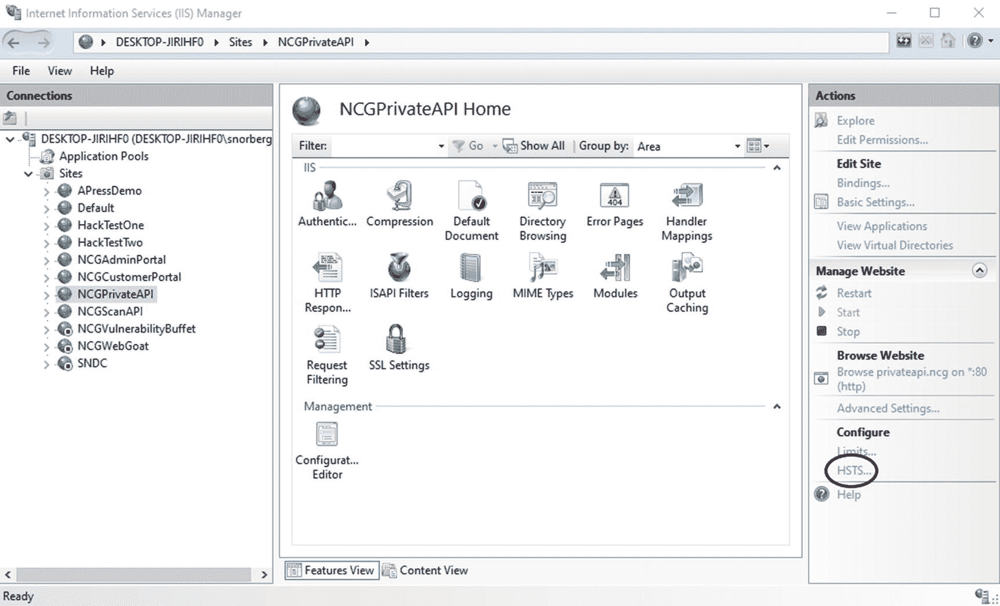
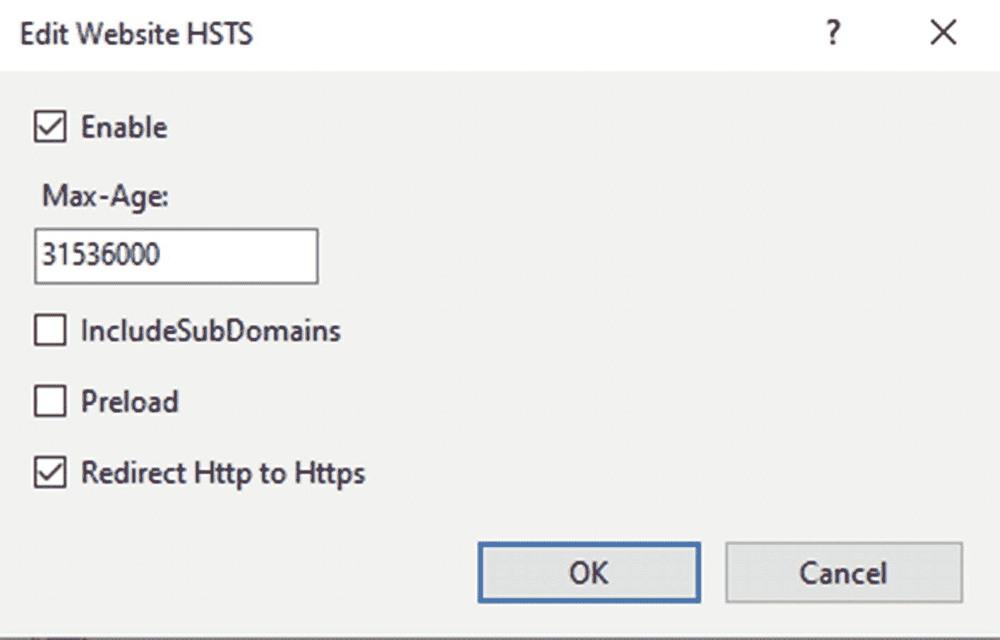
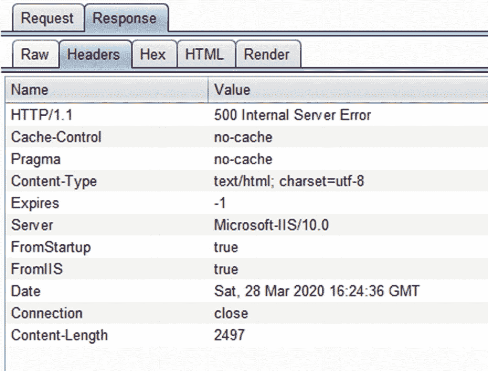

# 十、设置和配置

像本书中涉及的许多主题一样，ASP.NET Core 网站的正确设置和配置本身就是一整本书。因为这本书的目标读者是开发人员而不是系统管理员，所以我不打算深入探究建立和运行网站的所有细节。然而，还是有必要对建立网站时要考虑的一些最重要的因素做一个高层次的概述，一部分是因为与 ASP.NET 的其他版本相比，这些配置更多地存在于代码中，另一部分是因为我知道许多开发人员出于各种原因对他们自己的主机负责。

本章的大部分解释将从服务器级的观察开始。换句话说，为了举例，我假设您可以访问服务器本身，无论您可以访问硬件还是云中可用的基础架构。这有几个原因:

*   我希望你的许多项目将是从以前版本的 ASP.NET 升级，并将重用现有的基础设施。

*   即使在纯绿地(新)项目中，也有合理的理由购买硬件或使用基于云的服务器，而不是使用基于云的服务。

*   “云只是别人的电脑”这句谚语有很多道理。了解什么是好的安全，当它是你的服务器时，只会帮助你保护基于云的服务。

因为这是一个很大的主题，所以我将主要侧重于给你一个高层次的概述，目的是如果你想更深入地研究一个主题，你可以自己阅读更多。与应用开发安全相比，服务器和网络安全主题涉及的内容要丰富和巧妙得多。

## 设置您的环境

首先，虽然 ASP.NET 的核心网站可以在没有网络服务器的情况下运行，但这并不意味着 T2 应该这样做。你应该计划在某种网络服务器后面运行你的网站，以达到各种不同的目的。你可以使用微软支持的插件 <sup>[1](#Fn1)</sup> 在当今使用的三大网络服务器中的任何一个上运行你的网站: <sup>[2](#Fn2)</sup>

*   街头流氓

*   Nginx

*   Internet 信息服务(IIS)

其他服务器也有可用的插件，但是这里要小心:Apache、Nginx 和 IIS 都有几十年的安全加固经验，并且有良好支持的插件。在这里，我不建议冒险远离真实可靠的东西。

### Web 服务器安全性

无论您使用哪种 web 服务器，都有一些您应该遵循的一般安全准则:

*   **不允许您的网站将文件写入网站内的任何文件夹:**您很容易犯错误，让黑客访问您 web 文件夹中的其他文件。如果您必须保存文件，请在尽可能远离网站的位置保存，例如不同的驱动器或完全不同的服务器。

*   不允许用户使用他们自己的文件名保存文件:如果你这样做，你可能会遇到名称冲突。但更重要的是，您打开了允许用户将文件存储在其他目录中的大门。用唯一标识符作为文件名保存文件，然后在其他地方存储从标识符到文件名的映射。

*   **关闭目录浏览:**攻击者会利用这些信息查找配置文件、备份等。如果您需要用户浏览您的文件，请保留一个文件列表，并以编程方式向用户显示该列表，以防止有人滥用目录浏览功能。

*   **不要将 web 文件存储在 web 服务器的默认位置:**例如，如果您使用的是 IIS，请将文件存储在 C:\webfiles 中，而不是 C:\inetpub\wwwroot。这将使攻击者(稍微)更难找到你的文件，以防他们能够访问你的服务器。

*   关闭你的网络服务器上所有不需要的服务:任何服务都可以作为你的服务器的入口，从而成为你网站的后门。如果可以的话，把这些关掉。这尤其包括 PowerShell。考虑到 PowerShell 提供的强大功能和病毒扫描程序在区分恶意脚本和可接受脚本方面的困难，PowerShell 是您的服务器中一个特别危险的功能。

### 保持服务器分离

无论您的网站是托管在基于云的服务中，托管在云中的基础设施中，还是托管在本地，尽可能将网站与相关服务(如邮件或数据库服务器)分开是非常重要的。理想情况下，每台服务器都有自己的防火墙，并且只允许来自允许位置的特定于该服务的流量。为了说明其工作原理，假设您的网站有三个主要组件:web 前端、邮件服务器和数据库服务器。以下是在每台服务器上设置权限的方法(无论您是否在云中都是如此):

*   您的 web 服务器将允许 web 端口(通常为 80 和 443)上所有 IP 地址(公共网站)的入站连接。它将*仅*允许来自已知的、允许的地址(如您的和您的系统管理员的地址)的入站管理员连接(用于远程桌面或 SSH)。出站连接只允许用于软件更新检查、对邮件服务器的调用、对日志存储的写入以及对数据库的调用。

*   您的邮件服务器将*仅*允许从您的 web 服务器到邮件端点的入站连接，并且仅允许出站连接来检查系统更新和发送邮件。

*   您的数据库服务器将只允许从您的 web 服务器到其数据库的入站连接，并且只允许出站连接来检查系统更新并将备份发送到您的存储位置。

公开暴露你的邮件服务器基本上就是让黑客使用你的服务器发送垃圾邮件。让你的数据库服务器暴露在公众面前就是让黑客读取你数据库中的数据。让这些服务器完全向您的 web 服务器开放，而不是为所需的特定服务开放端口，如果您的网站服务器遭到破坏，您将面临更严重的破坏。分层安全性很重要。

如果您需要访问邮件和/或数据库服务器，该怎么办？您可以暂时在防火墙上打开一个洞，允许最少数量的用户访问服务器，做您需要做的事情，然后再次关闭防火墙上的洞。这最大限度地降低了攻击者在您的防火墙后的服务器中获得立足之地的风险。

#### 服务器分离和微服务

如果您正在利用服务和 API 进行后端处理，比如将相关的逻辑分组到单独的服务中，那么您应该注意不要在同一个 API 中混合使用打算公开调用的 API(比如从浏览器调用 AJAX ),这些 API 只能从服务器调用。将它们分开，这样您就可以适当地隐藏 API，这些 API 只能被防火墙后面的内部组件访问，以使它们远离潜在的黑客。

#### 关于职责分离的一个注记

假设您的团队足够大，移除不需要的访问也适用于开发人员对生产服务器的访问。大多数开发人员都有过尝试调试只发生在不可访问的机器上的问题的悲惨经历。如果我们可以直接访问生产机器，那么调试这些问题会更容易。但是，另一方面，如果开发人员可以访问生产机器，那么开发人员可以相对容易地将敏感信息转移到服务器硬盘上未被检测到的文件中，然后窃取该文件，并消除其存在的证据。或者对数据库中的数据做类似的事情。尽管有时会令人恼火，但作为开发人员，我们不应该直接接触生产机器。

### 存储秘密

将服务器和服务与系统的其他部分隔离开来的想法，在谈到存储秘密时更是如此，比如认证第三方应用的密码或加密的 PII 数据。几年前，由于几起事件， <sup>[3](#Fn3)</sup> ，亚马逊要求开发者查看他们的公共存储库，寻找暴露的 AWS 凭证，这个问题至今仍未解决。恰恰相反——现在有几个工具可以让开发者和黑客在源代码控制中寻找暴露的秘密。 <sup>[4](#Fn4)</sup> 所以，源码控制不是储存秘密的地方，但又是什么呢？以下是几个选项，大致按合意程度排序:

*   将您的秘密存储在专用的密钥存储中，例如 Azure 的密钥库或亚马逊的密钥管理服务。这是最安全的选择，但是如果您有大量的密钥，这些服务可能会很贵。

*   将您的秘密存储在服务器的环境变量中。这种方法比将机密存储在配置文件中要好，因为机密存储在远离您的网站本身的地方，但是它们存储在同一台服务器上。

*   将您的秘密存储在您自己构建的独立防火墙后面的独立环境中。假设您正确构建了服务，这是一个安全的选择。但是当您考虑到构建和维护这样一个系统的努力时，您可能会更好地购买基于云的密钥存储服务中的存储。

*   将您的秘密存储在服务器上的 appsettings.production.json 中。这是不安全的，因为机密存储在您的网站上，您需要访问服务器来更改文件，但这种方法对于小型或无关紧要的网站来说已经足够了。记住，如果你选择这个选项，你的秘密必须*永不*被签入源代码控制。

Caution

您可能想知道在配置文件中加密您的秘密并将其签入源代码控制是否可行。我不推荐。除了您仍然需要一种方法来存储加密密钥本身这一事实之外，您不应该公开任何您不绝对需要的东西。

## SSL/TLS

我在第 4 章提到过，你真的需要在任何地方都使用 HTTPS。我所说的“无处不在”是指出于各种目的来自每台服务器的每一个连接。你永远不知道谁可能在偷听，出于什么目的。即使您忽略了通过 HTTP 发送的信息更容易被修改的想法(想象一下黑客改变图像来显示恶意消息)，即使通过 HTTP 发送的部分数据也可能泄漏比您预期的更多的信息。证书便宜且相对容易安装，因此没有理由不在任何地方使用 HTTPS。如果你真的买不起证书，让我们加密(letsencrypt.org)提供免费证书。对于基于 Linux 的系统，对这些免费证书的支持更好，但是在 Windows 和 IIS 中安装这些证书的说明确实存在。

一旦你设置了 HTTPS，你将需要设置你的网站来重定向所有的 HTTP 流量到 HTTPS。要在 ASP.NET Core 中打开它，你只需要确保在你的`Startup`类的`Configure`方法中调用`app.UseHttpsRedirection()`。如果您想要一个配置选项来实现这一点，那么您可以在 IIS 中通过多种方式来实现，我稍后将介绍最简单的方式。

### 仅允许 TLS 1.2 和 TLS 1.3

无论您是否设置了在服务器上明确接受的协议，您都可以告诉服务器您的服务器将接受哪些版本的 HTTPS (SSL 1.0、1.1、1.2 或 TLS 1.0、1.1、1.2、1.3)。除非你有特别的需要允许旧的协议，否则我强烈推荐只接受 TLS 1.2 或 1.3 连接*。所有旧版本都存在各种问题。TLS 1.2 也有问题， <sup>[5](#Fn5)</sup> 但是 TLS 1.3 的采用可能还不够普遍，不足以证明只接受 TLS 1.3 是正确的。*

 *### 建立 HSTS

我们在第 4 章中简要介绍了 HTTP 严格传输安全(HSTS)。在那里，我们讨论了标头如何指示使用 HTTPS 连接的浏览器继续使用 HTTPS，直到达到最大年龄限制。幸运的是，ASP.NET 团队通过允许你在你的`Startup`类的`Configure`方法中添加`app.UseHsts()`，使得为 ASP.NET 网站配置 HSTS 变得很容易。如果您愿意，也可以在 IIS 中轻松配置 HSTS。在图 [10-1](#Fig1) 的截图中可以看到右下角圈出来的链接。



图 10-1

IIS 中的 HSTS 链接

点击这个链接会弹出一个非常简单明了的对话框，如图 [10-2](#Fig2) 所示。



图 10-2

IIS 中的 HSTS 选项

您会注意到，除了 Max-Age(这里设置为一年中的秒数)之外，还有一个选项可以将所有 HTTP 流量重定向到 HTTPS。

Note

值得强调的是，为了让 HSTS 有所作为，您确实需要正确设置 HTTPS 重定向。浏览器会忽略来自 HTTP 站点的任何 HSTS 指令，所以一定要设置重定向和 HSTS，以获得使用两者的全部好处。

## 设置标题

有多种方法可以在 ASP.NET Core 中添加标题。最常见的方法是将它们添加到您的`Startup`类中。下面是如何添加一些更重要的安全相关的头。

```cs
public void Configure(IApplicationBuilder app,
  IHostingEnvironment env)
{
  //Code removed for brevity

  //Included here for order
  app.UseAuthentication();
  app.UseAuthorization();

  app.Use(async (context, next) => {
    context.Response.Headers.Add("X-Frame-Options", "DENY");
    context.Response.Headers.Add("X-Content-Type-Options",
      "nosniff");
    context.Response.Headers.Add(
      "X-Permitted-Cross-Domain-Policies", "none");
    context.Response.Headers.Add("X-XSS-Protection",
      "1; mode=block");

    await next();
  });

  app.UseMvc(
    //Content removed for brevity
  );
}

Listing 10-1Adding headers in Startup

```

我没有在清单 [10-1](#PC1) 中包含 CSP 头，因为它非常特定于您的应用，但是您已经明白了。否则，如果您需要复习这些标题的作用，请返回参考第 [4](04.html) 章。

Caution

将这些标题添加到您的应用可以帮助防止点击劫持攻击，如果您还记得第 [5 章](05.html)的话，这是一种黑客在 iframe 中加载您的网站并在您的网站上加载他们的内容的攻击，欺骗用户在您的网站上执行他们不想要的操作。一些安全人员会建议在您的页面中添加 JavaScript 来阻止页面运行，如果(top！== self)，即页面是否在 iframe 内运行。HTML5 在 iframe 上引入了`sandbox`属性，可以配置该属性来阻止 JavaScript 在框架内运行，杀死任何破坏框架的脚本。因此，添加标题。不要依赖 JavaScript 来解决你的点击劫持漏洞。

如果您在 IIS 下运行您的网站，您也可以在 web.config 文件中添加这些头。

```cs
<configuration>
  <location path="." inheritInChildApplications="false">
    <!-- Content removed for brevity -->
  </location>
  <system.webServer>
    <httpProtocol>
      <customHeaders>
        <add name="SomeName" value="SomeValue" />
      </customHeaders>
    </httpProtocol>
  </system.webServer>
</configuration>

Listing 10-2Adding headers via web.config

```

如果您添加如清单 [10-2](#PC2) 所示的标题，您可以通过进入 IIS，点击您的网站，并双击 HTTP 响应标题图标来查看和编辑它们。只需知道一些部署方法会覆盖您的 web.config 文件，所以在这里存储太多信息之前，请测试您的部署方法。

Caution

在添加标题时不要太有创意。有一种称为*响应分裂*的攻击，当报头允许换行符时发生。如果攻击者可以添加换行符，他们就可以欺骗浏览器，使其认为攻击者的内容，而不是您的内容，将被呈现在屏幕上。为了避免这种情况，坚持使用 ASP.NET 和/或你的网络服务器提供的选项。

### 设置特定于页面的页眉

有时候你需要特定于页面的标题。事实上，您已经在默认错误页面上看到了这种情况。

```cs
[ResponseCache(Duration = 0, Location =
  ResponseCacheLocation.None, NoStore = true)]
public IActionResult Error()
{
  //Content removed for brevity
}

Listing 10-3Caching directives on the error page

```

清单 [10-3](#PC3) 中的代码应该指示浏览器不要缓存错误页面，这样任何特定于错误的内容，比如请求 ID，都会显示出来。为了证明添加了这些错误，图 [10-3](#Fig3) 显示了 Burp Suite 捕获的错误页面上的标题。



图 10-3

没有在 Burp 套件中看到的缓存头

不幸的是，这里有一个问题。*无缓存*的缓存控制值指示浏览器在使用缓存版本之前必须验证响应。为了指示浏览器完全避免存储信息，您需要一个缓存控制值 *no-store* 。属性中的`NoStore = true`代码应该可以做到这一点，但是正如您在打嗝截图中看到的，它没有做到。让我们通过在清单 [10-4](#PC4) 中制作我们自己的特定于页面的标题来解决这个问题。

```cs
public class CacheControlNoStoreAttribute :
  ResultFilterAttribute
{
  private const string _headerKey = "Cache-Control";
  public override void OnResultExecuting(
    ResultExecutingContext context)
  {
    if (context.HttpContext.Response.Headers.
      ContainsKey(_headerKey))

    context.HttpContext.Response.Headers.Remove(_headerKey);

    context.HttpContext.Response.Headers.Add(_headerKey,
      "no-store");

    base.OnResultExecuting(context);
  }
}

Listing 10-4An attribute that overrides the Cache-Control header for a single page

```

这样做的代码应该相当简单:它首先查看头部是否已经存在，如果存在，就删除它。然后代码添加新的头。

Tip

如果你还记得，在第 4 章中，我说过你应该在显示敏感信息的页面上使用这些缓存指令来防止浏览器在用户的机器上存储这些信息。现在你知道如何在你的 ASP.NET 网站中添加这些标题了。

还有些时候你会想要创建你自己的页面标题。当您有一个只在一两个页面上使用的第三方库，需要使用宽松的页眉时，您很可能希望对 CSP 页眉这样做。虽然为了简单起见，用宽松的规则创建一个标题可能很诱人，但是在这种情况下，应该有单独的标题。幸运的是，这种创建特定于页面的标题的方法足够灵活，可以满足大多数需求。

## 第三方组件

第三方组件，如 JavaScript 库或 NuGet 包，可以大大提高网站的质量，同时降低制作成本。然而，它们也可能成为漏洞的来源。通常，这些组件是由不了解安全的人构建的，他们从来没有经历过任何类似于安全审查的事情。即使是由声誉良好的开发团队维护的流行组件也不时会有漏洞。您可以做些什么来最大限度地降低因第三方漏洞而造成的损害风险？

*   尽可能从信誉良好的来源选择部件。虽然知名公司也不能幸免于安全问题，但你可以合理地肯定，知名公司会在某种程度上检查安全问题，而你不能对其他组件说同样的话。

*   尽量减少授予组件的权限数量。当使用服务器端组件时，尽可能在它们自己的进程中运行它们，并且/或者将它们包装在从您的网站调用的 web 服务中。当使用 JavaScript 组件时，确保您使用的 CSP 策略只允许组件完成工作所需的权限。

*   尽量减少您使用的组件数量。即使您很注意选择有信誉的组件并限制它们的权限，攻击者也只需要一个组件中的一个问题就可以在您的系统中获得立足之地。您可以通过使用更少的组件和避免使用比您打算使用的功能多得多的库来降低这种风险。

### 监控漏洞

由国家标准和技术研究所(NIST)维护的国家漏洞数据库 <sup>[6](#Fn6)</sup> 是一个列出常见软件组件漏洞的数据库。正如本书前面提到的，当研究人员发现漏洞时，他们通常会先告诉负责的公司，然后在漏洞修复后向 NVD 报告。有了这个数据库，您可以检查您使用的组件是否有已知的问题。

在下一章中，我将向您展示如何在 NVD(和其他漏洞数据库)中检查您使用的组件中的漏洞，而不必手动搜索库。

### 完整性散列

黑客将恶意脚本添加到由内容交付网络和本地托管的第三方组件中，这种情况很少见，但还是会发生。你可以通过*子资源完整性*特性在你的脚本或 CSS 标签中包含一个完整性散列来保护你自己。这是如何工作的？既然你已经阅读了哈希一章，你已经知道哈希可以帮助你确保文件的内容没有改变，这没有什么不同。您所需要做的就是给标签添加一个`integrity`属性，然后使用一个算法值和 base64 编码的散列值，用连字符隔开。

jQuery 的内容交付网络中托管的 jQuery 3 . 5 . 1 版本的链接如下所示。

```cs
<script
  src="https://code.jquery.com/jquery-3.5.1.min.js"
  integrity="sha256-↲
9/aliU8dGd2tb6OSsuzixeV4y/faTqgFtohetphbbj0="
  crossorigin="anonymous"></script>

Listing 10-5Script tag for an externally hosted jQuery library

```

您可以在清单 [10-5](#PC5) 中看到使用了 SHA-256 散列。您可以很容易地使用更强的散列来散列文件内容，但是这样做并没有太大的好处。

Caution

为本地创建的文件创建散列也是一个好主意。如果黑客或恶意员工可以向可信文件添加恶意脚本，那么您的用户可能会受到比最好的 XSS 攻击更有效的攻击。但是，每次重新散列文件会变得很乏味，所以您可能会尝试自动创建散列。我强烈建议*反对*这样做。使用文件的已知可信版本生成哈希，以帮助最小化以后发生意外更改的风险。

## 保护您的测试环境

不幸的是，对于开发和产品团队来说，花费大量的时间和精力来保护他们的生产系统，然后让他们的测试系统完全不受保护是很常见的。在最好的情况下，这可以让攻击者自由地在你的应用中寻找安全漏洞而不被发现，所以当他们在你的生产网站上时，他们可以只针对已知的问题。如果为了更真实的测试，您的测试系统中有生产数据，这个问题可能会更严重。

虽然像保护生产环境一样彻底地保护您的测试环境可能有些过头了，但是在您的测试系统中仍然有一些您应该遵循的指导原则:

*   永远不要在您的测试环境中使用生产数据。如果黑客进去偷东西，让他们偷与“约翰·多伊”或“兔八哥”相关的信息。

*   将您的测试系统隐藏在防火墙后面，这样只有需要访问您系统的用户才能找到该站点，更不用说登录了。永远不要指望 URL 很难被猜到来保护你的站点不被黑客发现。

*   在测试环境中使用与生产环境中一样复杂的密码。您不希望黑客猜出您的测试环境密码，抓取您站点的管理页面，然后使用该信息攻击您的生产环境。

Note

很多年前，我在谷歌上搜索，看看我们的测试网站是否被谷歌的爬虫抓取。事实上，我找到了一个。显然，我们不仅在我们的一个生产站点上留下了一个测试站点的链接，我们还让测试站点对公众开放。请确保定期测试，以确保您的测试网站是安全的。

## Web 应用防火墙

最后，您应该考虑使用 Web 应用防火墙，或 WAF。WAFs 位于您的用户和您的网站之间，侦听所有传入的流量，并阻止看起来恶意的流量。虽然这是好，也是可取的，但是如果您使用 WAF，有几件事情需要注意:

*   如果配置不当，WAFs 可能会阻止良好的流量，而正确的配置可能很难做好。在打开它之前，请观察您的流量，以确保您没有无意中阻塞良好的流量。

*   在撰写本文时，WAF 产品没有获得 WebSocket (SignalR)流量。

*   像任何安全产品一样，WAF 不是灵丹妙药。大多数攻击工具都有办法检测和解决大多数 waf。不要指望你 WAF 能保护你的网站；你仍然需要实践良好的安全卫生。

尽管存在这些问题，但在设置和配置您的网站时，Web 应用防火墙是非常值得考虑的。

Caution

我需要强调一点，WAF 不能解决你所有的安全问题。想象一下，一个 WAF 就像为你家安装一个安全系统:就像你的安全系统只有在你的窗户没有锁或者你的贵重物品在你的前院时才会做这么多一样，一个 WAF 只有在你有容易被利用的 SQL 注入漏洞或者明显不安全的直接对象引用时才能做这么多。

## 摘要

在这一章中，我谈到了如何安全地设置你的 web 服务器。我还谈到了使您的服务器尽可能地相互隔离以及与公众隔离的重要性，如何使用 HTTPS 来保护您的站点，如何添加与安全相关的标题，以及为什么保护您的测试站点与保护生产站点一样重要。

在最后一章中，我将讨论如何将安全性添加到您的软件开发生命周期中，这样您就不会在项目结束时手忙脚乱地尝试实施安全修复——或者更糟，在违规发生后手忙脚乱地寻找和修复安全问题。

<aside aria-label="Footnotes" class="FootnoteSection" epub:type="footnotes">Footnotes [1](#Fn1_source)

[T2`https://docs.microsoft.com/en-us/aspnet/core/fundamentals/servers/?view=aspnetcore-3.1`](https://docs.microsoft.com/en-us/aspnet/core/fundamentals/servers/%253Fview%253Daspnetcore-3.1)

  [2](#Fn2_source)

[T2`https://w3techs.com/technologies/overview/web_server`](https://w3techs.com/technologies/overview/web_server)

  [3](#Fn3_source)

[T2`www.techspot.com/news/56127-10000-aws-secret-access-keys-carelessly-left-in-code-uploaded-to-github.html`](http://www.techspot.com/news/56127-10000-aws-secret-access-keys-carelessly-left-in-code-uploaded-to-github.html)

  [4](#Fn4_source)

[T2`https://geekflare.com/github-credentials-scanner/`](https://geekflare.com/github-credentials-scanner/)

  [5](#Fn5_source)

[T2`https://calcomsoftware.com/leaving-tls1-2-using-tls1-3/`](https://calcomsoftware.com/leaving-tls1-2-using-tls1-3/)

  [6](#Fn6_source)

[T2`https://nvd.nist.gov/`](https://nvd.nist.gov/)

 </aside>*