# 一、ASP.NET Core 简介

本章向您介绍 ASP.NET Core 的基础知识。它讨论了 ASP.NET Core 中可用的主要开发选项，即 MVC、Razor Pages 和 Web API。由于您将在后面的章节中广泛使用 ASP.NET Core 项目，因此学习如何使用 Visual Studio IDE 创建 ASP.NET Core web 应用是值得的。为此，本章将帮助您

*   了解 ASP.NET Core 区的主要发展选项。

*   创建一个 ASP.NET Core MVC 应用。

*   创建一个 ASP.NET Core Razor 页面应用。

*   创建 ASP.NET Core Web API 应用。

*   安装罗斯文示例数据库。

## ASP.NET Core 概述

ASP.NET Core 是一个用于构建现代网络应用和服务的框架。这是……NET 核心，是一个跨平台的开源框架。这意味着您可以针对所有流行的操作系统(如 Windows、Linux 和 macOS)开发和部署您的 web 应用。

ASP.NET Core 是一个重新设计和重写的框架，用于构建现代 web 应用。虽然我们不会在这里讨论该框架的每一个特性，但是它的一些重要技术特性如下所示:

*   跨平台框架。您可以在 Windows、Linux 和 macOS 上开发和运行 web 应用。

*   有大量社区参与的开源软件。

*   内置依赖注入(DI)框架。

*   ASP.NET Core 包括一个名为 Kestrel 的内置网络服务器。您可以单独使用 Kestrel，或者在 IIS、Nginx 或 Apache 下托管您的 web 应用。

*   多种 UI 开发选项，包括 MVC、Razor Pages 和 Blazor。(当然，你也可以使用客户端 JavaScript 框架来开发前端。)

*   MVC web 应用和 Web APIs 的统一编程模型。

*   适合现代云优化应用的高性能模块化请求管道。

图 [1-1](#Fig1) 显示了 ASP.NET 岩心的层次。

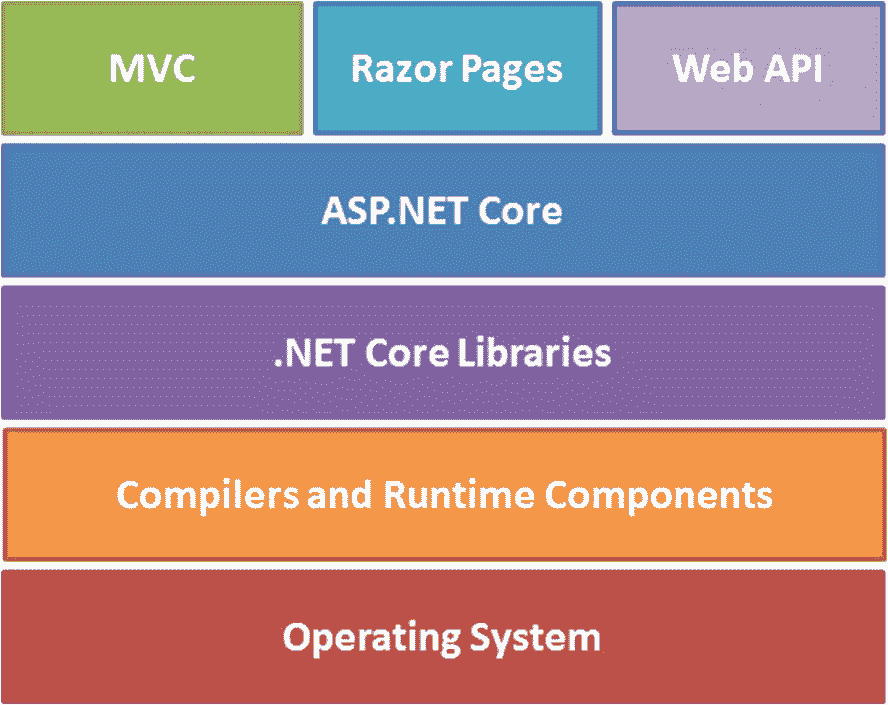

图 1-1

一层层的。网络核心和 ASP.NET Core

从图 [1-1](#Fig1) 可以看出，最底层是操作系统。因为。NET Core 是一个跨平台的框架，可以是 Windows、Linux 或 macOS。不管底层操作系统是什么，您的 web 应用代码都将是相同的。

发展和运行。NET 核心应用，您必须有语言编译器和其他必要的运行时组件。它们是在安装时安装的。机器上的 NET Core。

下一层主要由。NET 核心库和框架级服务。这些库提供了一些特性，包括数据类型和文件 IO。ASP.NET Core 利用。NET 核心库，因此位于这一层之上。

ASP.NET Core 提供了三个主要的开发选项，即 ASP.NET Core MVC、ASP.NET Core Razor Pages 和 ASP.NET Core Web APIs。这些选项构成了图表的顶层。

ASP.NET Core 是建立考虑模块化。大多数 ASP.NET Core 应用(MVC/Razor Pages/Web API)都利用了 NuGet 包中的功能。

从前面的讨论中，您知道有三种主要的开发选项——MVC、Razor Pages 和 Web APIs。在深入代码级细节之前，让我们简单地讨论一下它们。

### 注意

您还可以使用 Blazor 构建使用 C#、HTML 和 CSS 的交互式富客户端 UI。然而，Blazor 是 ASP.NET Core 系列中相对较新的成员，因此不在本章讨论。在第 8 章你会学到更多关于 Blazor 的知识。

### ASP.NET Core MVC

ASP.NET Core MVC 允许您使用模型-视图-控制器(MVC)模式构建 web 应用。尽管对 MVC 模式的详细讨论超出了本书的范围，但是下面将简要讨论适用于 ASP.NET Core 的 MVC。

使用 ASP.NET Core MVC 构建的 web 应用的职责分为三个部分:模型、视图和控制器。模型代表应用的数据，可以是从原始类型到复杂对象的任何东西。视图包含应用的用户界面(UI ),通常显示模型持有的数据。视图还接受用户输入和命令。控制器在模型和视图之间进行协调。它的工作是准备视图所需的模型，并根据视图捕获的用户输入和命令进行操作。它还通过决定将哪个模型和视图发送给用户来决定程序流。因此，一个控制器可能需要处理许多模型和许多视图。最终用户从不直接处理模型和视图；相反，它调用控制器。

图 [1-2](#Fig2) 显示了模型、视图和控制器的关系。

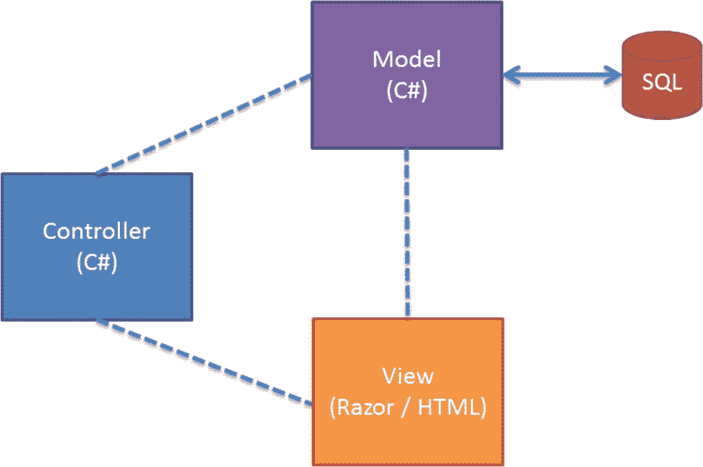

图 1-2

MVC 模式应用于 ASP.NET Core MVC

就 ASP.NET Core MVC 而言，模型通常采用 C# 对象的形式，并且通常保存来自一些数据存储(如 SQL Server)的数据。视图在物理上以. cshtml 文件的形式存在，主要包含标记和 Razor 代码。控制器是一个 C# 类，通常包含一个或多个称为操作的方法。前面讨论的控制器的工作是通过它的动作来完成的。最终用户调用控制器来完成一些工作。

当你的程序流程很复杂并且涉及多个模型和视图时，ASP.NET Core MVC 是一个很好的开发选择。它也是基于 Ajax 的场景和单页面应用(spa)的首选开发选项。

### ASP.NET Core Blazor 页

ASP.NET Core Razor Pages 允许您构建使用模型-视图-视图模型(MVVM)模式的 web 应用。模型-视图-视图模型模式将应用的功能分成三个部分:模型、视图和视图模型。MVC 和 MVVM 的显著区别是没有单独的控制器类。

在 MVVM，模型和视图具有与 MVC 模式相同的职责。ViewModel 与视图密切相关，负责特定于视图的事情，如数据绑定、UI 事件处理和 UI 通知。它封装了特定于视图的数据和行为。它还在必要时更新底层数据模型。

图 [1-3](#Fig3) 显示了适用于 Razor 页面的 MVVM。

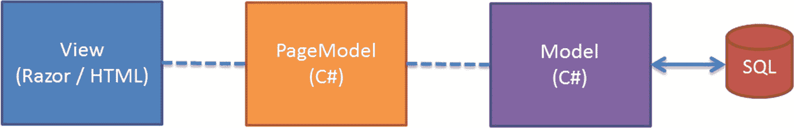

图 1-3

应用于 ASP.NET Core Blazor 页的 MVVM 模式

就 ASP.NET Core Razor Pages 而言，视图驻留在一个. cshtml 文件中，就像 MVC 应用一样。对于每个视图，都有一个 PageModel(MVVM 的 ViewModel 类，它包含可绑定的属性和表单处理动作，称为处理程序。PageModel 类还处理数据模型以更新或获取应用数据。

Razor Pages 是具有简单程序流的以页面为中心的场景的首选开发选项。缺少控制器类也使得他们的代码组织更简单。

### ASP.NET Core Web API

ASP.NET Core Web APIs 使用与 MVC 应用相同的基于控制器的编程模型。然而，他们没有任何看法。Web APIs 使用 REST(表述性状态转移)准则来公开某些功能。通常，Web API 由一个包含五个动作的控制器组成。这些操作处理 HTTP 动词，即 GET、POST、PUT 和 DELETE。Web API 操作包含在使用特定 HTTP 动词调用 Web API 时要执行的处理。

一旦 Web API 准备就绪，它就被托管在服务器上，以便客户端应用可以使用它。客户端可以是任何类型的应用，例如 JavaScript 应用、服务器端 web 应用，甚至是桌面应用。

图 [1-4](#Fig4) 显示了一个 Web API 的布局。

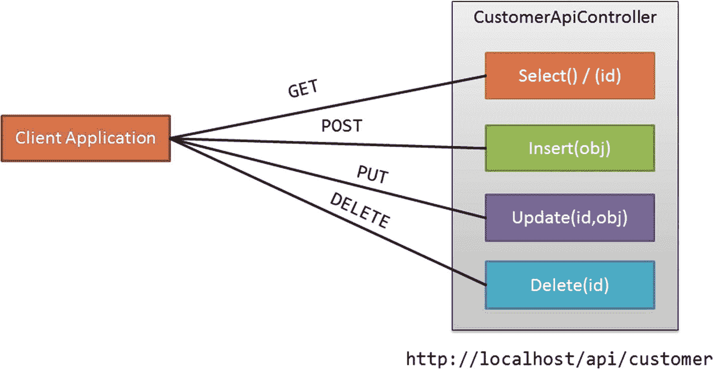

图 1-4

Web API 实现 REST 指南

如图 [1-4](#Fig4) 所示，Web API 是一个名为 CustomerApiController 的控制器，包含五个动作——Select()、SelectByID()、Insert()、Update()和 Delete()。动作名称可以是任何名称，但是它们被映射到一个 HTTP 动词。例如，Select()操作被映射来处理 GET 动词，Insert()操作被映射来处理 POST 动词，等等。

还要注意这些动作的参数。Select()有两种变体，一种不接受参数，另一种接受资源的 ID 作为参数。前者旨在检索多个资源的信息，而后者旨在检索与指定 ID 匹配的特定资源的信息。Insert()操作接受一个对象，该对象指示要在服务器上创建的新资源。Update()动作接受要更新的资源的 ID 和包含该资源的修改值的对象。Delete()动作接受要删除的资源的 ID。

Web API 可以在一个众所周知的 URL(本例中为`http://localhost/api/customer`)上获得。然后，客户端应用向 Web API 发出 HTTP 请求，试图调用所需的功能。

Web APIs 在任何需要通过服务公开功能的地方都很常见。这包括基于 Ajax 的场景、单页面应用(SPA)以及服务层。

现在您已经知道了 ASP.NET Core 中的主要开发选项，让我们使用它们中的每一个来构建一个简单的“Hello World”应用。

### 注意

如果你已经熟悉了 Visual Studio IDE 和 ASP.NET Core 项目，你可以跳到第 2 章。如果您是 ASP.NET Core 开发的新手，或者最近才开始使用它，您可能希望通过下面的章节来了解整个项目结构和代码组织。

## 创建 ASP.NET Core MVC 项目

在本节中，您将使用 ASP.NET Core MVC 创建一个“Hello World”项目。您开发的应用将输出一条消息——Hello World！–在浏览器中，还允许您指定自定义消息。图 [1-5](#Fig5) 显示了应用的主页面。

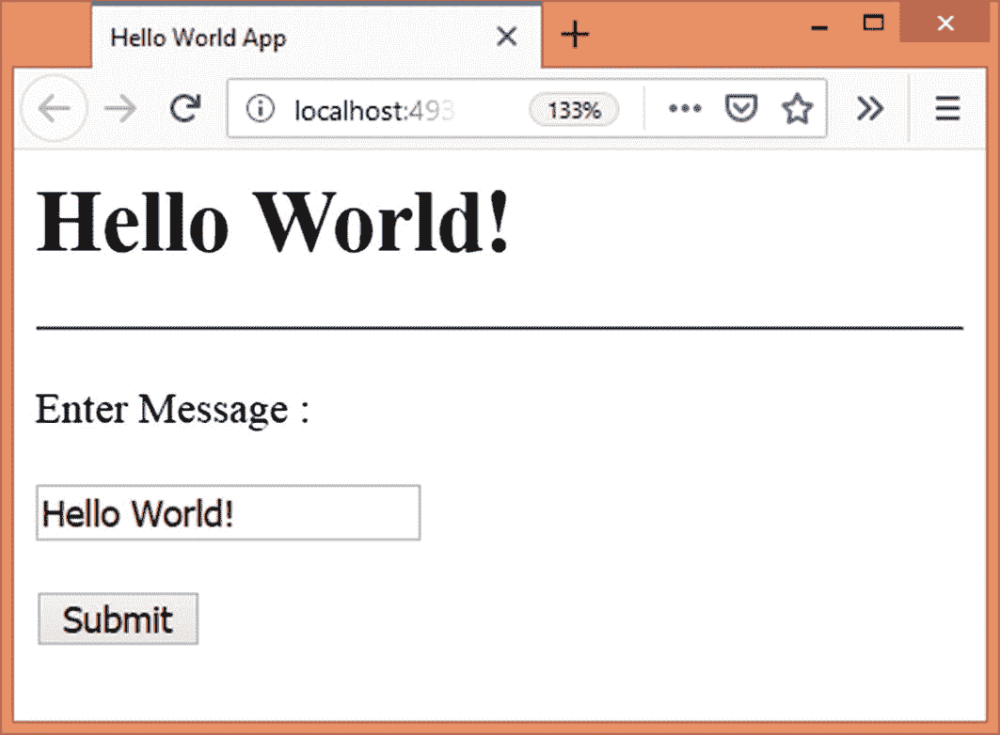

图 1-5

“Hello World”应用的主页

如您所见，该页面显示了一个 Hello World！消息，还允许您在文本框中输入不同的消息。点击“提交”按钮，Hello World！将被您指定的新消息替换。这在图 [1-6](#Fig6) 中显示，其中消息被更改为 Hello Universe！。

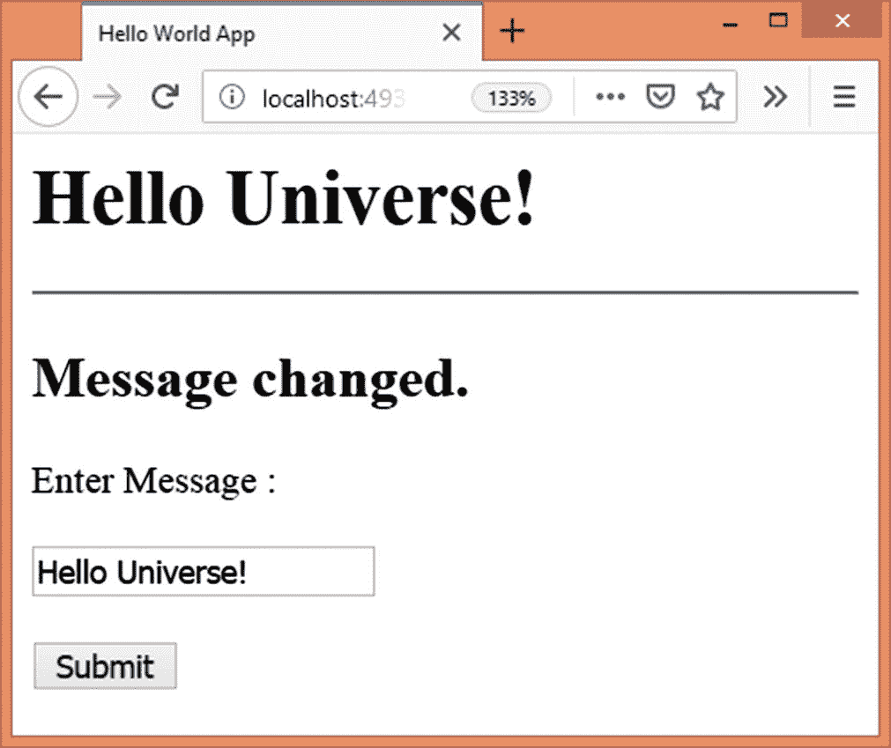

图 1-6

消息更改为“你好，宇宙！”

要开始开发这个应用，请打开 Visual Studio 并从开始窗口中单击创建新项目选项(图 [1-7](#Fig7) )。

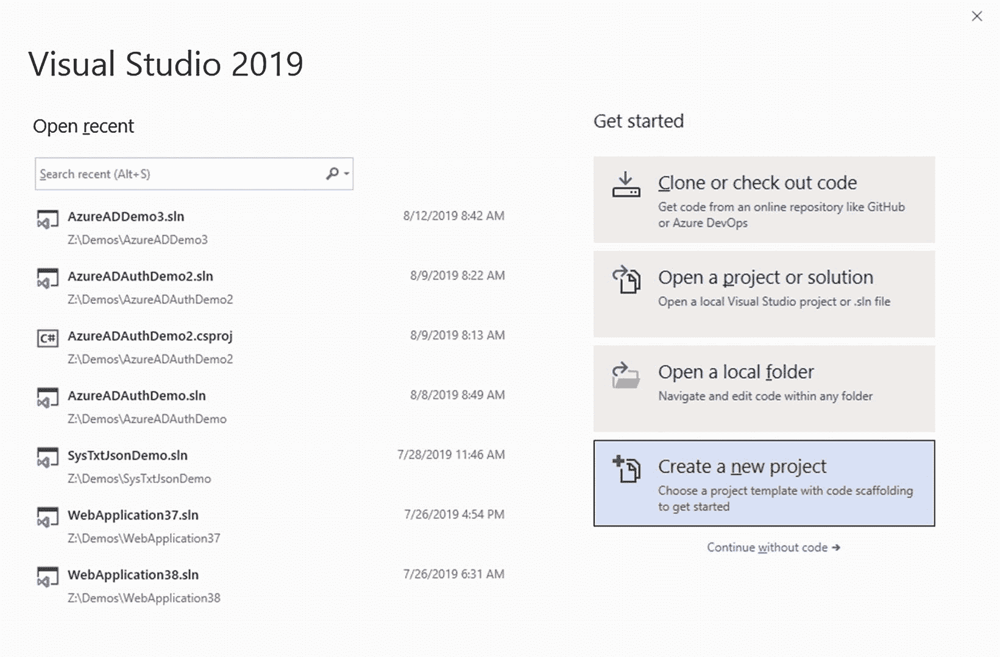

图 1-7

创建新项目

这样做将打开另一个对话框，您可以在其中为新项目选择项目模板。该对话框如图 [1-8](#Fig8) 所示。

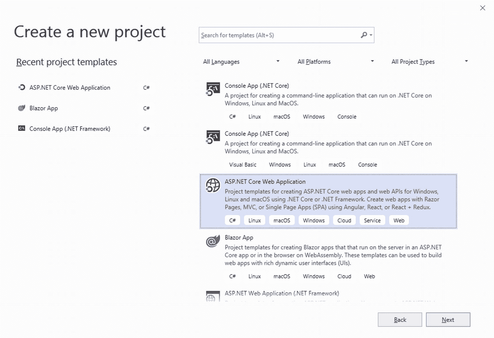

图 1-8

选择项目模板

在此对话框中选择 ASP.NET Core Web 应用，然后单击下一步按钮。您将被要求输入项目名称及其位置(图 [1-9](#Fig9) )。

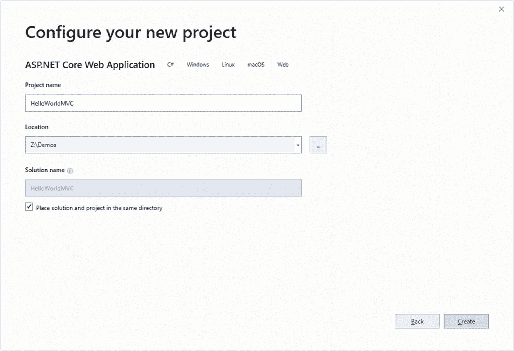

图 1-9

指定项目名称和位置

指定这些详细信息，然后单击“创建”按钮。作为最后一步，您需要选择一个 ASP.NET Core 项目模板(图 [1-10](#Fig10) )。

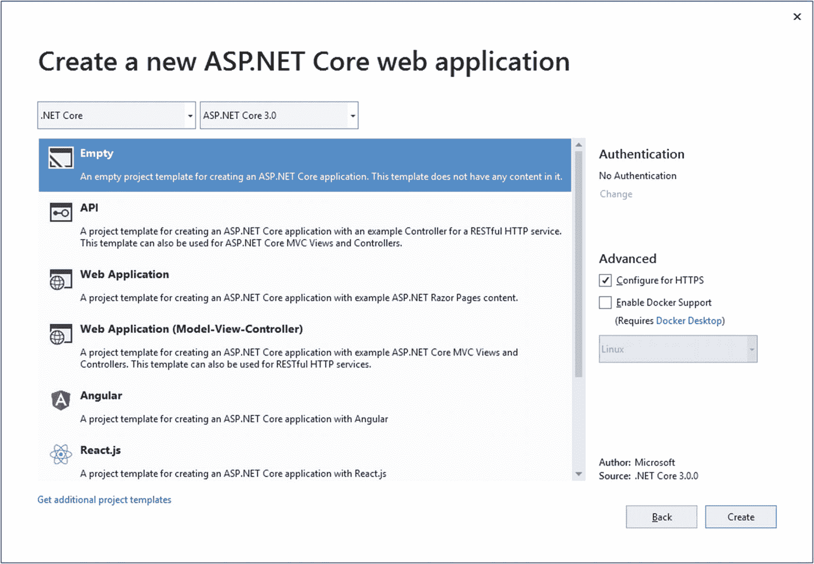

图 1-10

选择 ASP.NET Core 项目模板

这里你会有很多项目模板比如空的，API，Web 应用，Web 应用(模型-视图-控制器)。您也可以选择。NET 框架类型-。网芯还是。从顶部的下拉列表中选择 ASP.NET Core 版本。默认情况下，。NET Core 和 ASP.NET Core 3.0 将在这些下拉列表中选择。保持选择不变。从列表中选择空项目模板。

默认情况下，高级部分下的配置 HTTPS 复选框处于选中状态。如果选中此复选框，项目将被配置为使用 HTTPS 自签名证书。由于证书是自签名的，当您运行此类应用时，您的浏览器可能会向您显示安全警告。并且您需要配置您的浏览器来信任这个证书(只需按照浏览器的指示)。如果取消选中此复选框，项目将使用 HTTP。您在本书中创建的项目可以使用任何方案(HTTP 或 HTTPS)，但是在大多数真实情况下，出于安全原因，您更喜欢 HTTPS。现在，单击“创建”来创建项目。

### 注意

虽然我们可以为我们的项目选择“Web 应用(模型-视图-控制器)”模板，但是我们没有选择，而是选择了“空”项目模板。这个选择将让您有机会学习如何自己添加应用中的所有部分，而不是依赖于项目模板添加的部分。

一旦创建了空项目，通过右键单击项目，然后选择“添加➤新文件夹”快捷菜单选项，在项目根目录下添加三个文件夹——模型、视图和控制器。另外，在“视图”文件夹下添加一个名为 Home 的子文件夹。

然后右键单击“模型”文件夹，并从快捷菜单中选择“添加➤类”。这将打开如图 [1-11](#Fig11) 所示的对话框。

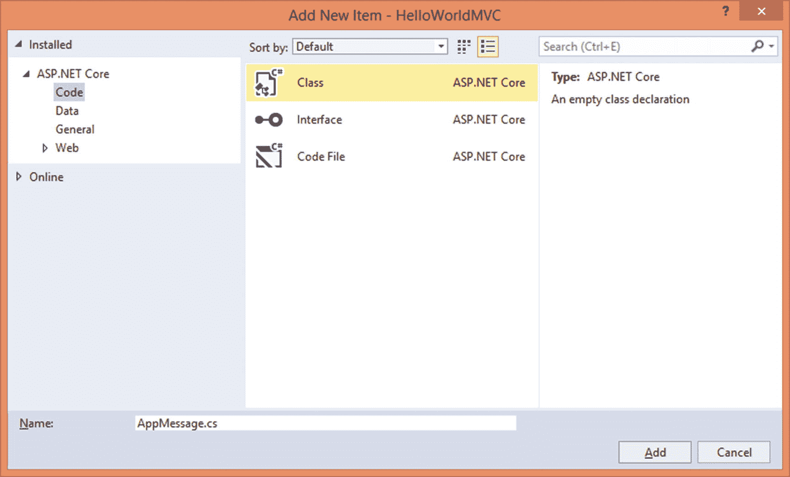

图 1-11

向模型文件夹添加新类

将该类命名为`AppMessage`，并单击“添加”按钮。一旦添加了这个类，就将清单 [1-1](#PC1) 中所示的代码写入其中。

```cs
public class AppMessage
{
    public string Message { get; set; }
}

Listing 1-1AppMessage class

```

`AppMessage`类只有一个名为`Message`的公共属性，表示要在浏览器中显示的消息。

接下来，右键单击控制器文件夹，并从快捷菜单中选择添加➤“新项目”。这将打开添加新项目对话框，如图 [1-12](#Fig12) 所示。

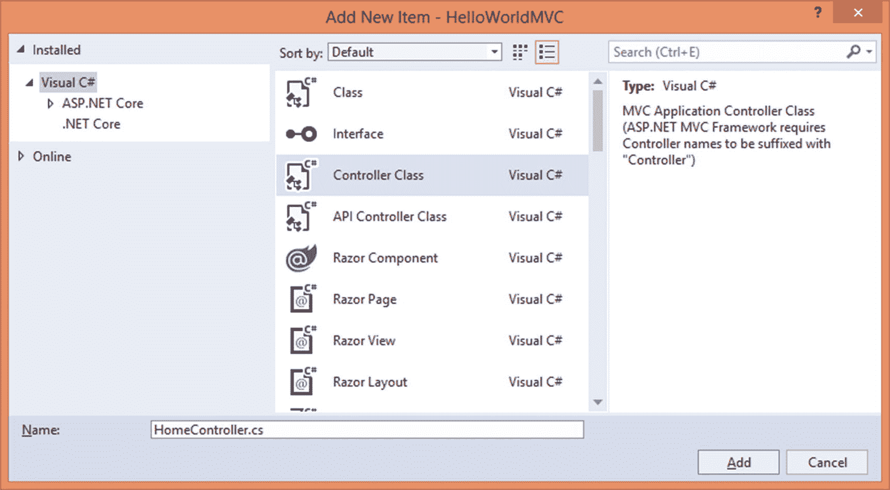

图 1-12

向项目中添加新控制器

从列表中选择“控制器类”,将控制器命名为`HomeController,`,然后单击添加按钮。一旦添加了`HomeController`，从其中删除默认的 Index()动作，并添加两个新动作，如清单 [1-2](#PC2) 所示。

```cs
public IActionResult Index()
{
    AppMessage obj = new AppMessage() {
        Message = "Hello World!"
    };
    return View(obj);
}

[HttpPost]
public IActionResult Index(AppMessage obj)
{
    ViewBag.Message = "Message changed.";
    return View(obj);
}

Listing 1-2HomeController contains two actions

```

当对应用发出第一个请求时，调用第一个`Index()`动作。在里面，您创建了一个新的对象`AppMessage`，并将其`Message`属性设置为 Hello World！。使用`View()`方法将该对象传递给视图。`View()`方法存在于`HomeController`控制器的基类中。

### 注意

您将观察到 HomeController 类继承自 Controller 类。控制器基类驻留在 Microsoft。Mvc 命名空间。在使用 ASP.NET Core MVC 项目时，您将需要在许多地方使用这个名称空间。还需要使用 HelloWorldMVC。模型命名空间，以便能够使用 AppMessage 类。

当 HTML 表单发送到服务器时，调用第二个`Index()`动作。这个 HTML 表单是视图文件的一部分，您将在本节的后面创建它。这个`Index()`动作接收用户输入的消息，该消息被包装在`AppMessage`的对象中。文本框值到`AppMessage`的`Message`属性的映射是由框架通过一个叫做模型绑定的过程来完成的。在内部，像以前一样将对象传递给`View()`方法。此外，您还在`ViewBag`对象上设置了`Message`属性。`ViewBag`是 ASP.NET Core 提供的内置对象，用于将数据从控制器传递到视图。该`Message`值将在视图上输出。

注意，第二个`Index()`动作是用`[HttpPost]`属性修饰的。`[HttpPost]`属性表明底层动作将只为 POST 请求调用。

### 注意

在前面的代码中，您创建了 Index()操作的两个重载。但是，请记住，这种重载如预期的那样工作，因为它们处理不同类型的请求。例如，第一个索引()处理动作的初始请求，而第二个索引()处理表单提交 POST 请求。如果您注释掉添加到第二个 Index()的[HttpPost]属性，您将得到 AmbiguousMatchException，表明框架不能决定使用哪个操作。您可以使用[ActionName]属性来解决这个问题。您将在本书后面的章节中使用[ActionName]。

到目前为止，您已经完成了应用所需的模型和控制器。让我们添加最后一部分——视图——它包含了应用的用户界面。

要添加视图，请右键单击视图➤主文件夹，然后选择添加新项目菜单选项。这一次选择 Razor 视图，指定名称为 Index.cshtml(图 [1-13](#Fig13) )。

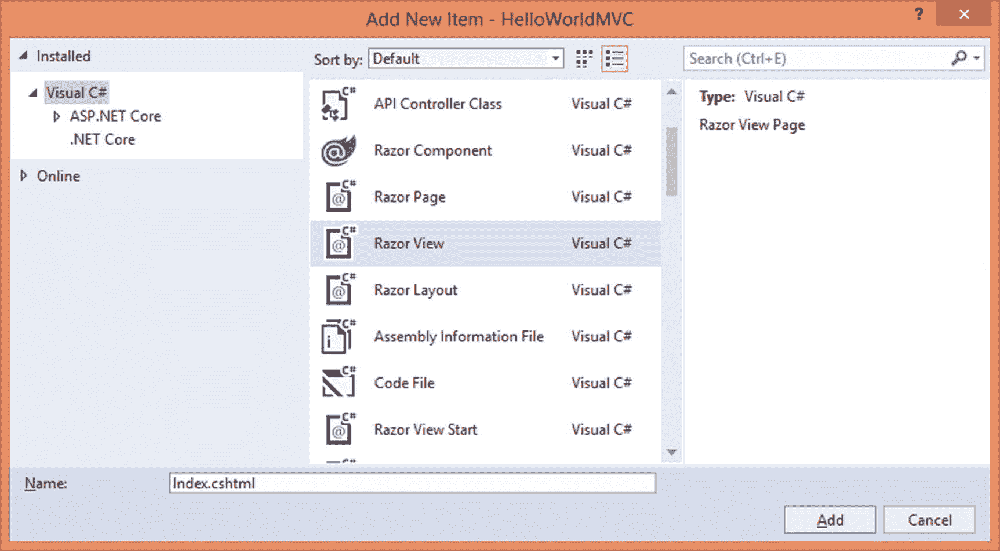

图 1-13

向项目中添加索引视图

请注意，动作的名称与视图的名称相匹配。这样，`View()`方法假设模型将被提供给索引视图。

索引视图将使用所谓的标签助手来呈现用户界面。默认情况下，标签助手对视图不可用。要添加对标签助手的支持，再次打开添加新项目对话框并选择 Razor 视图导入(图 [1-14](#Fig14) )。

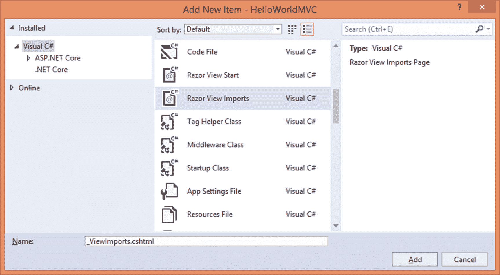

图 1-14

添加视图导入文件

添加视图导入文件(_ViewImports.cshtml)后，将以下代码行写入其中:

```cs
@addTagHelper *,Microsoft.AspNetCore.Mvc.TagHelpers

```

使用`@addTagHelper`指令将标签助手从后面的程序集中添加到项目中。在这种情况下，内置标签助手驻留在`Microsoft.AspNetCore.Mvc.TagHelpers`汇编中。`∗`表示将添加指定程序集中的所有标记助手。

### 注意

在接下来的章节中，你将会更详细地了解标签助手。现在，请记住它们允许您呈现 ASP.NET Core web 应用的用户界面元素。

接下来，打开 Index.cshtml 文件，将清单 [1-3](#PC4) 中所示的标记和代码写入其中。

```cs
@model HelloWorldMVC.Models.AppMessage

<html>
    <head>
        <title>Hello World App</title>
    </head>
    <body>
        <h1>@Model.Message</h1>
        <hr />
        <h2>@ViewBag.Message</h2>
        <form asp-controller="Home" asp-action="Index" method="post">
            <label asp-for="Message">Enter Message :</label>
            <br /><br />
            <input type="text" asp-for="Message" />
            <br /><br />
            <button type="submit">Submit</button>
        </form>
    </body>
</html>

Listing 1-3Markup and code from Index view

```

视图标记以`@model`指令开始，该指令指定了提供给该视图的模型类的类型。请记住，您正在为`View()`方法提供一个`AppMessage`类的对象。因此，`@model`指定`AppMessage`作为视图的模型类型。

通过`View()`方法传递的实际模型对象可以使用`Model`属性在视图文件中访问。在这个例子中，您使用`@` razor 表达式语法在响应上输出模型的`Message`属性。类似地，代码还在响应上呈现 ViewBag 的`Message`属性。

表单标签助手(

<form>标签)呈现一个包含三个字段的 HTML 表单——一个标签、一个文本框和一个按钮。注意，表单标签助手看起来非常类似于标准的 HTML</form>

<form>标签。但是它有一些特殊的属性比如`asp-controller`、`asp-action`。`asp-controller`和`asp-action`属性决定在提交表单时使用哪个控制器和动作来处理表单。在这种情况下，表单将被提交给`HomeController`的`Index()`动作。属性将表单配置为使用 POST 方法提交其内容。</form>

`Label`和`Input`标签助手使用`asp-for`属性将底层表单字段绑定到模型的`Message`属性。这样，文本框显示了`Message`属性的值。用户可以编辑文本框值并点击提交按钮。

这就完成了索引视图。在运行应用之前，您需要配置应用的启动。为此，打开 Startup.cs 文件并转到它的`ConfigureServices()`方法。修改`ConfigureServices()`如清单 [1-4](#PC5) 所示。

```cs
public void ConfigureServices(IServiceCollection services)
{
    services.AddControllersWithViews();
}

Listing 1-4ConfigureServices() method

```

清单 [1-4](#PC5) 所示的代码调用了`IServiceCollection`的`services.AddControllersWithViews()`扩展方法。这样做向 ASP.NET Core 的依赖注入框架注册了几个与 MVC 应用相关的内置类型。

现在修改 Startup.cs 中的`Configure()`方法，如清单 [1-5](#PC6) 所示。

```cs
public void Configure(IApplicationBuilder app, IWebHostEnvironment env)
{
    if (env.IsDevelopment())
    {
        app.UseDeveloperExceptionPage();
    }

    app.UseRouting();

    app.UseEndpoints(endpoints =>
    {
      endpoints.MapControllerRoute(
       name: "default",
       pattern: "{controller=Home}/{action=Index}/{id?}");
    });
}

Listing 1-5Configure() method

```

`Configure()`方法用于配置应用的 HTTP 管道。它将所需的中间件添加到 HTTP 管道中。在此示例中，代码检查应用是在开发环境中运行还是在生产环境中运行。这是使用`IWebHostEnvironment`的`IsDevelopment()`方法完成的。相应地，调用`UseDeveloperExceptionPage()`将开发者异常页面中间件添加到管道中。每当发生错误时，这个中间件负责在浏览器中显示实际的异常细节。

最后，代码为应用增加了路由功能。`UseRouting()`调用将端点路由中间件添加到 HTTP 管道中。`UseEndpoints()`调用连接应用中的端点中间件。在`UseEndpoints()`中提到的模式处理表单`https://localhost:1234/<controller_name>/<action_name>`的请求 URL。例如，可以使用这个 URL: `https://localhost:1234/Home/Index`来调用`Index()`。`UseEndpoints()`方法还将`HomeController`配置为默认控制器，将`Index()`动作配置为路线的默认动作。

这就完成了应用。此时，您的解决方案浏览器应该类似于图 [1-15](#Fig15) 。

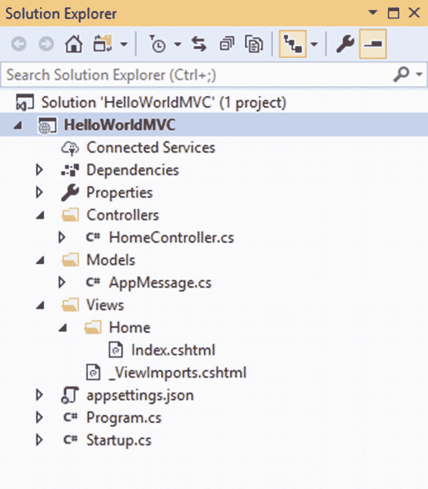

图 1-15

包含各种文件的解决方案资源管理器视图

确认是否已将各种文件添加到解决方案资源管理器中所示的正确文件夹中，并按 F5 运行应用。

### 注意

在使用 ASP.NET Core MVC 项目时，您可以将模型和控制器存储在任何文件夹中，尽管许多开发人员将它们分别存储在模型和控制器文件夹中(就像您在前面的例子中所做的那样)。例如，您可以将模型存储在名为 AppModels 的文件夹中。视图文件的推荐位置是“视图”文件夹(或其子文件夹)，因为默认情况下，框架会在该文件夹中搜索视图。

如果一切顺利，Visual Studio 将启动 IIS Express，您将看到浏览器中加载了应用的索引视图。默认情况下，应用将显示 Hello World！消息。在文本框中输入一些不同的消息，然后单击提交按钮。标题现在应该反映新输入的消息。

## 创建 ASP.NET Core Blazor 页项目

在本节中，您将使用 ASP.NET Core Razor 页面创建相同的“Hello World”应用。要开始开发这个应用，请使用空项目模板创建一个新的 ASP.NET Core 项目。这个任务与之前的任务完全相同，只是这次的项目名称是 HelloWorldRazorPages。

一旦创建了新项目，向其中添加两个文件夹，即 Models 和 Pages。Models 文件夹的用途是存储模型类，而 Pages 文件夹用于存储 Razor 页面和相关的页面模型。

然后像前面的例子一样将`AppMessage`类添加到 Models 文件夹中。另外，将视图导入文件(_ViewImports.cshtml)放置到 Pages 文件夹中。现在右键单击“页面”文件夹，并从快捷菜单中选择“添加新项目”。这一次，在 Pages 文件夹中添加一个名为 Index.cshtml 的新 Razor 页面(图 [1-16](#Fig16) )。

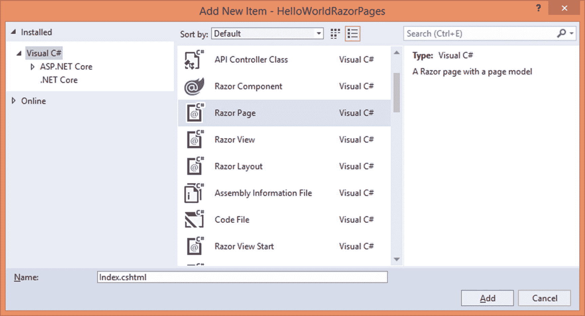

图 1-16

添加新的 Razor 页面

当您添加一个 Index Razor 页面时，实际上添加了两个文件——Index . cshtml 和 Index . cshtm . cs。Index . cshtml 文件包含 Razor 代码和构成用户界面的标记，而 Index.cshtml.cs 文件表示页面模型类。

首先，您的解决方案浏览器应该类似于图 [1-17](#Fig17) 。

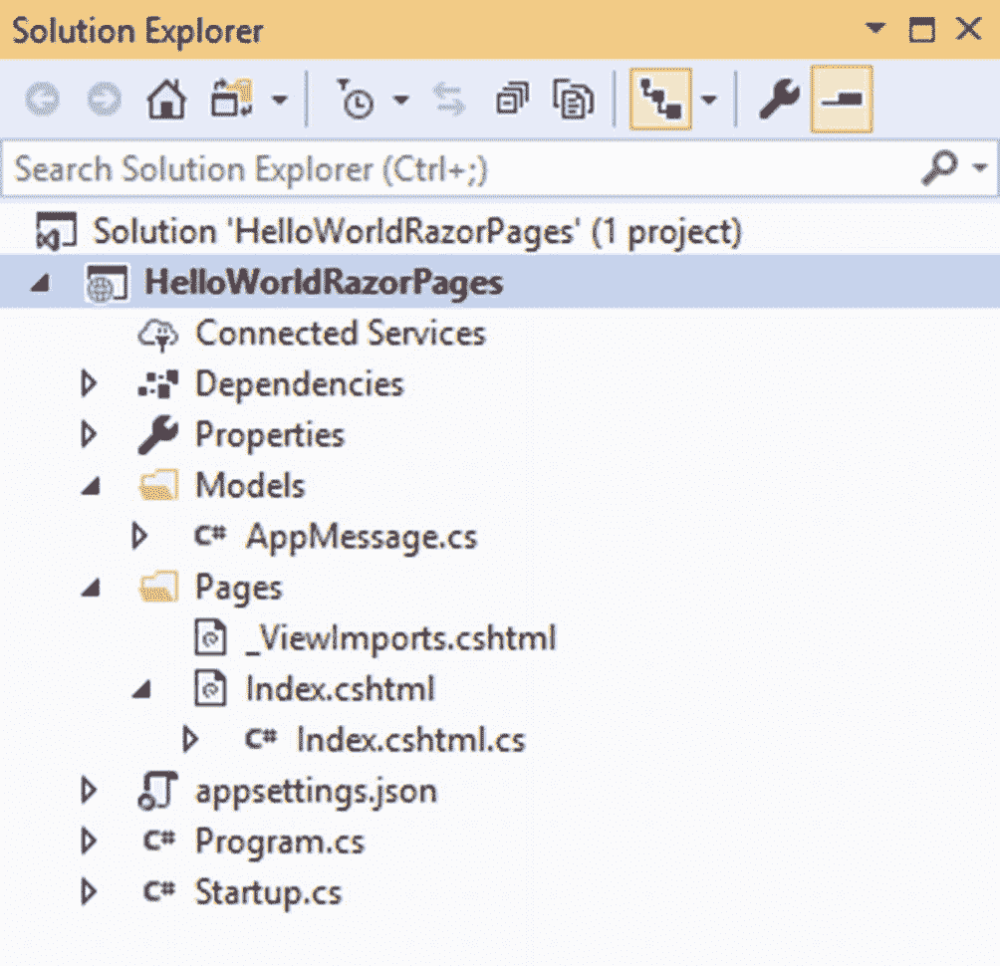

图 1-17

解决方案资源管理器中的 HelloWorldRazorPages 项目

现在打开 Index.cshtml.cs 文件。这个文件包含一个名为`IndexModel`的页面模型类。修改`IndexModel`类，如清单 [1-6](#PC7) 所示。

```cs
public class IndexModel : PageModel
{
    [BindProperty]
    public AppMessage Heading { get; set; }

    public string SubHeading { get; set; }

    public void OnGet()
    {
        this.Heading = new AppMessage();
        this.Heading.Message = "Hello World!";
    }

    public void OnPost()
    {
        this.SubHeading = "Message changed.";
    }
}

Listing 1-6Index page model class

```

`IndexModel`类继承了位于`Microsoft.AspNetCore.Mvc.RazorPages`名称空间中的`PageModel`类。`IndexModel`类由两个公共属性和两个公共方法组成。

`Heading`公共属性的类型是`AppMessage`，并且用`[BindProperty]`属性来修饰。`[BindProperty]`属性表明该属性将参与模型绑定。

字符串属性用于在文本框值改变时向用户显示一条消息。

`OnGet()`方法被称为页面处理程序，处理对页面的 GET 请求。与`OnGet()`类似，您可以使用`OnPost()`、`OnPut()`和`OnDelete()`页面处理程序来处理 POST、PUT 和 DELETE 动词。

`OnGet()`页面处理程序将`Heading`属性初始化为一个新的`AppMessage`实例，并将其`Message`属性设置为 Hello World！。当用户点击提交按钮并将表单发送到服务器时，就会调用`OnPost()`页面处理程序。在内部，代码将`SubHeading`属性设置为一条消息。`Heading`和`SubHeading`值显示在 Index.cshtml 文件中。Index.cshtml 的标记和代码如清单 [1-7](#PC8) 所示。

```cs
@page

@model HelloWorldRazorPages.Pages.IndexModel

<html>
    <head>
        <title>Hello World App</title>
    </head>
    <body>
        <h1>@Model.Heading.Message</h1>
        <hr />
        <h2>@Model.SubHeading</h2>
        <form method="post">
            <label asp-for="Heading.Message">Enter Message :</label>
            <br /><br />
            <input type="text" asp-for="Heading.Message" />
            <br /><br />
            <button type="submit">Submit</button>
        </form>
    </body>
</html>

Listing 1-7Displaying Heading and SubHeading

```

注意 Index.cshtml 以`@page`指令开始。指令标记了。cshtml 文件作为 Razor 页面。`@model`指令指向页面模型类的类型(本例中为`IndexModel`)。

页面标题显示 AppMessage 的`Message`属性。注意如何使用`Model`属性访问页面模型类中的`Heading`对象。这样，可以使用`Model`对象访问页面模型类的所有公共属性。`SubHeading`也以类似的方式渲染。

表单标记有一个设置为 post 的方法属性，表示表单在提交过程中将使用 POST 方法。在窗体内部，有一个标签、一个文本框和一个按钮，如前面的示例所示。

这就完成了 Index Razor 页面。在运行应用之前，需要使用 Startup.cs 文件配置启动。所以打开 Startup.cs 文件，修改清单 [1-8](#PC9) 中所示的`ConfigureServices()`和`Configure()`方法。

```cs
public void ConfigureServices(IServiceCollection services)
{
    services.AddRazorPages();
}

public void Configure(IApplicationBuilder app, IWebHostEnvironment env)
{
    if (env.IsDevelopment())
    {
        app.UseDeveloperExceptionPage();
    }

    app.UseRouting();

    app.UseEndpoints(endpoints =>
    {
      endpoints.MapRazorPages();
    });
}

Listing 1-8Configuring application startup

```

清单 [1-9](#PC10) 中的代码对您来说应该很熟悉。这一次，我们使用`AddRazorPages()`向依赖注入框架注册 Razor 页面相关的服务。Razor Pages 使用的路由机制与 MVC 应用略有不同。使用`@page`指令在单独的页面中定义路由和 URL 处理。默认情况下，Razor 页面的 URL 遵循这种模式:`https://localhost:1234/<razor_page_name>`。例如，要访问索引页面，URL 将是`https://localhost:1234/Index`。这个配置是在`UseEndpoints()`调用中使用`MapRazorPages()`方法完成的。

现在，按 F5 运行应用，并通过指定新消息来测试功能。

### 注意

当您运行 MVC 和 Razor Pages 应用时，浏览器的地址栏可能只显示这个 URL—`https://localhost:1234`(端口号因您而异)。这是因为/Home/Index 是 MVC 应用的默认值，而/Index 是 Razor Pages 应用的默认值。您可以手动输入完整的 URL，以确认它们确实分别由适当的操作和页面处理程序处理。

## 创建 ASP.NET Core Web API 项目

现在您已经对 ASP.NET Core MVC 和 Razor Pages 应用有了一些了解，让我们创建一个调用时返回消息的 Web API。

要开始创建 Web API，请基于空项目模板创建一个名为 HelloWorldWebApi 的新项目。Web API 使用以控制器为中心的方法来构建 RESTful 服务。

创建项目后，向其中添加模型和控制器文件夹。另外，将`AppMessage`类添加到 Models 文件夹中。因为 Web API 是关于服务的，所以项目中不会有任何用户界面元素。

然后打开“添加新项目”对话框，将新的 API 控制器类添加到控制器文件夹中(图 [1-18](#Fig18) )。

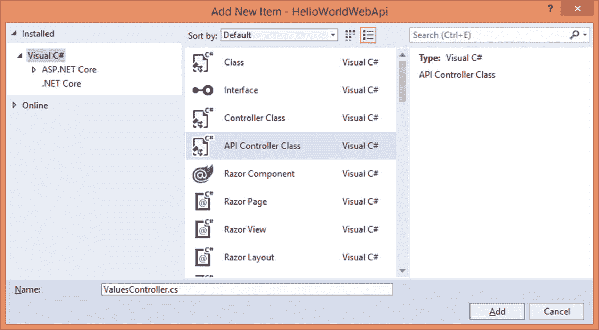

图 1-18

添加新的 API 控制器类

默认的 API 控制器名称是`ValuesController`；保持不变。您会发现`ValuesController`是用`[Route]`属性装饰的。这就是在 Web API 应用中配置路由的方式。`[Route("api/[controller]")]`属性表示该 API 将在`https://localhost:1234/api/Values`可用(端口号将根据您的设置而变化)。

现在从`ValuesController`中移除所有动作，除了第一个`Get()`动作。在本例中，您将只处理 GET 请求，因此不需要其他操作。修改`Get()`动作，如清单 [1-9](#PC10) 所示。

```cs
[HttpGet]
public List<AppMessage> Get()
{
    List<AppMessage> messages = new List<AppMessage>();
    messages.Add(new AppMessage() { Message = "Hello World!" });
    messages.Add(new AppMessage() { Message = "Hello Galaxy!" });
    messages.Add(new AppMessage() { Message = "Hello Universe!" });
    return messages;
}

Listing 1-9Returning messages from the Get() action

```

`Get()`动作用`[HttpGet]`属性修饰，表明它将处理对 API 的 GET 请求。注意，`Get()`动作返回了`AppMessage`对象的列表。在内部，代码创建了一个新的`AppMessage`的`List`，并向其中添加了三个`AppMessage`对象。这些对象的`Message`属性被设置为 Hello World！，你好银河！，还有你好宇宙！，分别为。最后，`AppMessage`对象的`List`从`Get()`动作返回。

虽然 API 已经准备好了，但是您还需要像对 MVC 和 Razor Pages 项目那样配置启动。因此修改启动类的`ConfigureServices()`和`Configure()`方法，如清单 [1-10](#PC11) 所示。

```cs
public void ConfigureServices(IServiceCollection services)
{
    services.AddControllers();
}

public void Configure(IApplicationBuilder app, IWebHostEnvironment env)
{
    if (env.IsDevelopment())
    {
        app.UseDeveloperExceptionPage();
    }

    app.UseRouting();

    app.UseEndpoints(endpoints =>
    {
      endpoints.MapControllers();
    });
}

Listing 1-10Configuring Web API startup

```

注意，`ConfigureServices()`中的代码调用了`AddControllers()`方法，向依赖注入框架注册特定于 API 的服务。`Configure()`方法现在使用`UseEndpoints()`中的`MapControllers()`方法来为 API 设置路由。

这就完成了 Web API。按 F5 运行应用。当浏览器窗口打开时，转到浏览器的地址栏，手动输入 API URL—`https://localhost:1234/api/Values`(根据您的设置更改端口号)。这将导致一个 GET 请求被发送到 API，并且`Get()`动作将被调用，返回如图 [1-19](#Fig19) 所示的消息。

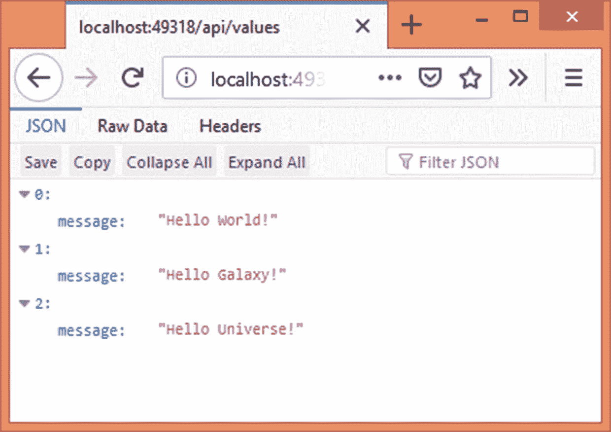

图 1-19

消息以 JavaScript 对象表示法(JSON)格式返回

如果观察响应的原始数据，它将是 JSON 格式的。在使用 Web APIs 时，序列化和反序列化 JSON 格式的数据是很常见的。ASP.NET Core 有自己的类来完成这项任务。此外，ASP.NET Core 支持一个流行的 JSON 处理库——Json.NET。由于 Json.NET 是一个相当受欢迎的库，你可能需要用它来代替 ASP.NET Core 的默认 JSON 处理机制。幸运的是，在您的 ASP.NET Core 应用中有一个切换到 Json.NET 的简单方法(尽管在这个例子中您不需要)。你需要添加一个 NuGet 包`Microsoft.AspNetCore.Mvc.NewtonsoftJson.`你可以通过右击依赖文件夹并选择管理 NuGet 包快捷菜单选项来完成(图 [1-20](#Fig20) )。

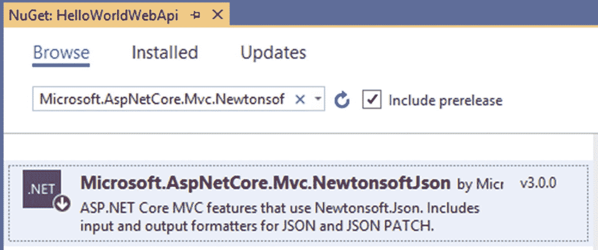

图 1-20

添加`Microsoft.AspNetCore.Mvc.NewtonsoftJson NuGet package`

一旦您添加了这个 NuGet 包，您需要像这样修改来自`ConfigureServices()`的代码:

```cs
public void ConfigureServices(IServiceCollection services)
{
    services.AddControllers()
            .AddNewtonsoftJson();
}

```

`AddNewtonsoftJson()`方法增加了对 JSON 相关特性的支持，并使用 Json.NET 实现其功能。

## 安装罗斯文数据库

在本书讨论的许多示例中，您使用了 Northwind 示例数据库。因此您需要将它安装在您的 SQL Server 实例中。您可以从位于 [`https://github.com/Microsoft/sql-server-samples/tree/master/samples/databases/northwind-pubs`](https://github.com/Microsoft/sql-server-samples/tree/master/samples/databases/northwind-pubs) 的 GitHub 库下载 Northwind 数据库脚本。具体来说，instnwnd.sql 文件包含创建 Northwind 数据库所需的脚本。图 [1-21](#Fig21) 显示了 GitHub 库中的这个文件。

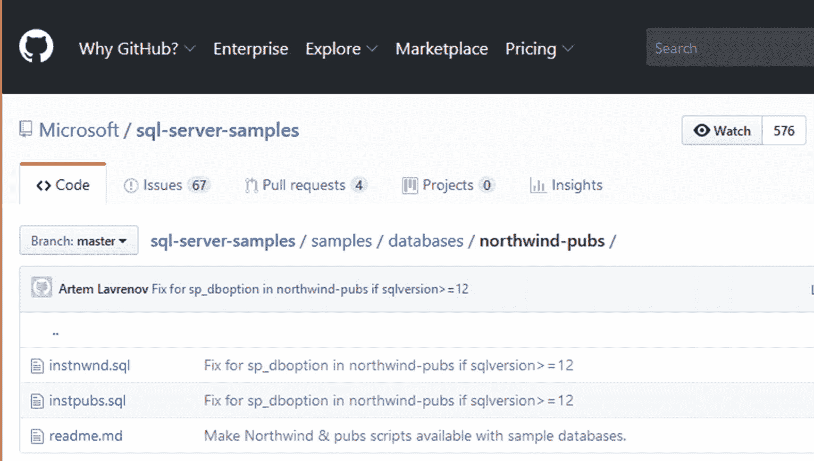

图 1-21

下载罗斯文示例数据库的脚本

一旦有了数据库脚本，就可以使用 SQL Server Management Studio 运行它。图 [1-22](#Fig22) 显示了成功运行脚本后创建的 Northwind 数据库。

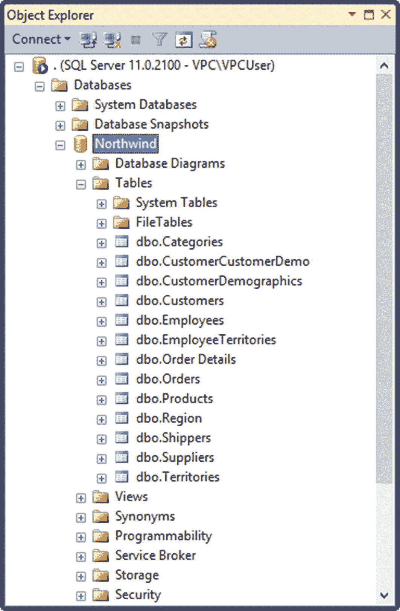

图 1-22

安装罗斯文示例数据库

我们主要需要访问 Northwind 数据库的 Employees 表。在下一章中，您将观察 Northwind 数据库的雇员表。

## 摘要

本章向您介绍了 ASP.NET Core。您学习了 MVC 和 MVVM 模式的基础。您还了解了 ASP.NET Core 提供的主要开发选项，即 MVC、Razor Pages 和 Web API。通过使用 Visual Studio 创建一个简单的“Hello World”应用，您已经熟悉了这三种风格。您使用了空项目模板和各种代码文件来构建示例应用。您还了解了应用的启动类、`ConfigureServices()`方法和`Configure()`方法。最后，您安装了 Northwind 示例数据库，以便在后续章节中使用。