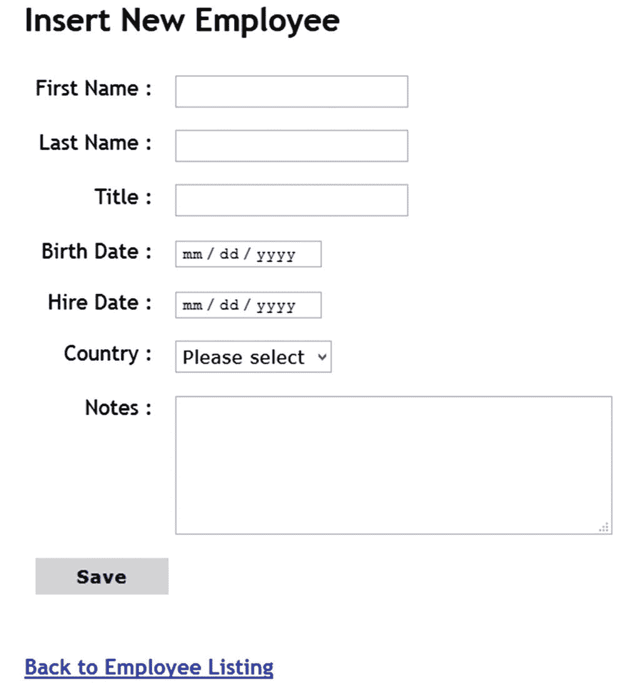

# 二、示例应用

在本章中，将向您介绍 Employee Manager 应用，特别是它的功能和用户界面。现在，许多项目使用 GitHub 库进行协作和版本控制。因此，学习如何将您的源代码托管在一个私有的 GitHub 存储库中是值得的。本章的学习目标包括以下内容:

*   熟悉员工管理器应用的用户界面。

*   了解雇员管理器应用如何工作。

*   了解 Employees 表的数据库结构(列名、数据类型、示例数据等细节)。

*   探索用于构建示例应用的各种技术选项。

*   创建一个私有的 GitHub 存储库，并在 Visual Studio IDE 中使用它。

## 员工经理的特征

当您构建和使用 Employee Manager 应用时，对它的工作原理有一定的了解是非常重要的。当您使用各种技术特性和选项来构建应用时，此讨论将帮助您设想应用的功能。

使用 ASP.NET Core 等框架的现代 web 应用开发涉及到许多技术选项。出于学习目的，我们的重点将包括以下经常需要的功能:

*   HTML 表单处理:现代 web 应用不仅仅是显示页面信息。他们接受最终用户的输入。他们还执行数据验证和业务处理。因此，HTML 表单处理是这类应用中的常见需求。

*   **CRUD 操作:**现代 web 应用使用 SQL Server 等数据存储来保存应用数据。在数据库上执行 CRUD 操作是这类应用中的常见任务。您通过 HTML 表单接受用户输入，然后根据应用的要求执行 CRUD 操作。您将使用 SQL Server 和一些 NoSQL 数据库作为应用的数据存储。

*   **用户认证:**使用某种用户认证方案来保护 web 应用是另一个经常需要的特性。用户认证和授权有助于您限制对 web 应用的访问，还允许您控制用户可以对您的系统做什么。为此，基于用户名和密码的认证是一种广泛使用的方法。

*   **JavaScript 库和框架:**现代 web 应用大量使用客户端脚本。现在有许多可用的 JavaScript 库和框架，您可以与 ASP.NET Core 集成来完成您的任务。我们将使用 jQuery 和 Angular 来理解如何使用 Ajax 技术执行 CRUD 操作。

*   **部署:**一旦构建了 ASP.NET Core web 应用，您将需要在服务器上部署它。ASP.NET Core 的两个常见部署目标是 IIS 和 Azure 应用服务。

开发一个简单但功能齐全的应用，如 Employee Manager，会向您介绍许多不同的技术和技术选项。

员工管理器是一个使用 ASP.NET Core 构建的 web 应用。其主要功能和技术方面总结如下:

*   CRUD(创建、读取、更新和删除)操作可以在 Northwind 数据库的 Employees 表上实现。这些 CRUD 操作是员工管理器的中心主题。其他特性是围绕这个 CRUD 功能构建的。

*   添加新员工、修改现有员工和删除现有员工的选项。

*   数据输入页面包括数据验证和基本的错误处理逻辑。

*   包括用户认证。提供了用户注册、登录和注销等功能，以确保只有经过认证的用户才能使用该应用。

*   服务器端和客户端技术可以用来构建相同的应用。这将允许您根据一组特定的技术特性和选项来学习 CRUD 操作。

*   虽然应用使用基本的 CSS 样式，但 CSS 框架、动画和图形等用户界面技术却被淡化了。

*   涵盖基本的异常处理和错误检查。请注意，它并没有涵盖所有可能的意外行为。这样，您可以保持代码库简单易懂。

现在您已经了解了雇员管理器的功能，让我们看看包含应用数据的雇员表。

## 了解雇员表

在第 [1](01.html) 章中，您在 SQL Server 中安装了 Northwind 数据库，并浏览了一下表列表。在这一节中，我们将更详细地研究 Employees 表——应用中使用的主表。

您可以使用 SQL Server Management Studio 或 Visual Studio 来处理 Northwind 数据库。在下面的场景中，我将使用 Visual Studio 查看 Employees 表数据以及模式。所以我们走吧。

打开 Visual Studio，单击工具➤连接到数据库菜单选项。如果您第一次连接到任何数据库，Visual Studio 会要求您选择一个数据源(图 [2-1](#Fig1) )。

图 2-1

选择数据源

从列表中选择 Microsoft SQL Server，保持其他设置不变，然后单击继续按钮。现在需要您指定数据库连接的详细信息，如数据库服务器名称或 IP、数据库名称和安全模式。如图 [2-2](#Fig2) 所示。

图 2-2

指定数据库连接详细信息

根据您的安装指定服务器名称。我指定了“.”指示 SQL Server 本地安装在同一台计算机上，并且使用 SQL Server 的默认实例。安全模式设置为“Windows 认证”您可以从选择下拉菜单中选择 Northwind 数据库，或者在组合框中输入数据库名称。通过单击底部的“测试连接”按钮，您可以快速确认您的连接详细信息是否准确。如果所有细节都正确，将会告诉您测试连接成功(图 [2-3](#Fig3) )。

图 2-3

连接细节是正确的

最后，单击 OK 按钮打开服务器资源管理器窗口，并添加到 Northwind 数据库的连接(图 [2-4](#Fig4) )。

图 2-4

为 Northwind 数据库添加了数据连接

现在您可以查看 Northwind 数据库的各种表。展开“表”文件夹以显示表列表，然后从列表中找到“雇员”表。右键单击 Employees 表并从快捷菜单中选择显示表数据(图 [2-5](#Fig5) )。

图 2-5

查看表格数据

这将在编辑器模式下打开 Employees 表，您可以在其中查看和修改雇员的详细信息。图 [2-6](#Fig6) 显示了在编辑器中打开的雇员表。

图 2-6

编辑器中打开的雇员表

现在您已经了解了 Employees 表的示例数据，让我们来看看这个模式，以了解更多关于列及其数据类型的信息。

再次右键单击 Employees 表，但这次从快捷菜单中选择“打开表定义”。这将在编辑器模式下打开表格定义，如图 [2-7](#Fig7) 所示。

图 2-7

在编辑器中打开的雇员表定义

表定义编辑器允许您查看表模式，如果需要，您还可以修改表结构。尽管 Employees 表包含许多列，但您不会将它们都用作 Employee Manager 的一部分。您使用其中的八个，即雇员 ID、名字、姓氏、头衔、出生日期、雇佣日期、国家和注释。这些列、它们的数据类型及其用途讨论如下:

*   **EmployeeID:** 它是一个标识列，充当表的主键。例如，第一条雇员记录的 EmployeeID 为 1。

*   **名字:**代表雇员的名字。它的数据类型是 nvarchar，长度最多可达 10 个字符。例如，第一条雇员记录的名字是 Nancy。

*   **姓氏:**代表员工的姓氏。它的数据类型是 nvarchar，长度最多可达 20 个字符。例如，第一条雇员记录的姓氏值为 Davolio。

*   **头衔:**代表对员工的称呼。它的数据类型是 nvarchar，长度最多可达 30 个字符。例如，第一条雇员记录的头衔是销售代表。

*   **出生日期:**代表员工的出生日期。它的数据类型是 datetime，尽管 Employee Manager 应用不使用时间部分。例如，第一条雇员记录的出生日期是 1948 年 12 月 8 日上午 12:00:00。

*   **HireDate:** 表示员工被组织雇用的日期。它的数据类型是 datetime，尽管 Employee Manager 应用不使用时间部分。例如，第一条雇员记录的雇佣日期为 1992 年 5 月 1 日 12:00:00 AM。

*   **国家:**代表员工所在的国家。其数据类型为 nvarchar，长度为 15 个字符。例如，第一条雇员记录的国家设置为美国。

*   **备注:**表示员工的附加信息，如教育背景。它的数据类型是 ntext，可以包含如下的自由格式文本:Education 包括 1970 年科罗拉多州立大学的心理学学士学位。她还完成了《电话推销的艺术》南希是国际演讲会的成员。

现在您已经知道了 Employees 表模式，让我们添加一个 Employee Manager 工作所需的支持表。

### 添加国家/地区表

Employees 表包含一个存储雇员所在国家的 Country 列。因此，在数据输入页面上，您需要从最终用户那里接受一个国家。与其在文本框中接受用户输入，不如显示一个可供选择的国家列表。这需要另一个包含国家列表的表 Countries。Northwind 的默认安装不包含这样的表，因此您需要添加一个。

要添加 Countries 表，请右键单击“表”文件夹，然后从快捷菜单中选择“添加新表”。这将打开一个表设计器，允许您定义 Countries 表。图 2-8 显示了 Visual Studio 中国家表的定义。

图 2-8

国家表结构

Countries 表只包含两列:CountryID 和 Name。CountryID 是一个整数标识列，而 Name 是一个长度为 80 个字符的 varchar 列。

确保在国家/地区表中添加一些国家/地区，以便在员工管理器中使用。

## 登录到员工经理

Employee Manager 应用要求用户先登录，然后才能对 Employees 表执行 CRUD 操作。因此，当您启动应用时，您会看到一个如图 [2-9](#Fig9) 所示的登录页面(为了清楚起见，已经删除了页眉和页脚)。

图 2-9

登录页面

登录页面包含用于输入用户名和密码的输入控件。还有一个“记住我”复选框，它决定用户的登录状态是否被记住，即使在浏览器关闭后也是如此。底部有一个链接，带您到用户注册页面(将在下一节讨论)。

“登录”按钮触发登录操作。如果在登录过程中出现任何错误，如凭证无效或不完整，则向用户显示错误消息(图[2-10](#Fig10))；否则，用户将被带到员工列表页面。

图 2-10

因用户输入不完整而显示的错误消息

## 创建新的用户帐户

您可以通过导航到注册页面来创建新的用户帐户。要转到用户注册页面，您需要单击登录页面底部的创建新用户帐户链接。图 [2-11](#Fig11) 显示了注册页面的外观。

图 2-11

用户注册页面

用户注册页面由一系列输入控件组成，这些控件接受用户的用户名、密码、确认密码、电子邮件、全名和出生日期。您可以输入这些详细信息，然后单击“创建”按钮来创建用户帐户。成功创建帐户后，您将被自动带到登录页面。如果创建帐户时出现任何错误，这些错误将显示在注册页面上，您可以根据需要进行更正(图 [2-12](#Fig12) )。

图 2-12

显示无效或不完整用户详细信息的错误

注册页面底部还有一个转到登录页面链接，如果您想跳过创建新帐户并决定使用现有帐户登录，该链接会将您带到登录页面。

## 列出所有员工

成功登录后，用户将看到 employees 表中所有雇员的列表，如图 [2-13](#Fig13) 所示。

图 2-13

显示员工列表

雇员列表显示雇员的雇员 ID、名字、姓氏和职务。注意，在雇员列表的正上方有一个插入按钮。单击 Insert 按钮会将用户带到另一个页面，在那里可以添加新员工。

列表中的每个雇员行也有更新和删除按钮。单击“更新”按钮会将您带到另一个页面，在那里可以修改该员工的详细信息。单击 Delete 按钮会将您带到一个确认页面，其中显示了该员工的详细信息，并要求用户确认是否从数据库中删除该员工。

## 插入新员工

为了向 Employees 表中添加新员工，您需要单击位于员工列表页面顶部的 Insert 按钮。这将带您进入插入新员工页面，如图 [2-14](#Fig14) 所示。

图 2-14

添加新员工

“插入新员工”页面显示一个空白的数据输入页面，可以在其中输入员工的详细信息，如名字、姓氏、职务、出生日期、雇佣日期、国家和注释。EmployeeID 是一个自动生成的值(标识列)，因此不接受来自用户的值。

可以从浏览器内置的日期选择器中选择出生日期和雇佣日期值。大多数现代浏览器都允许您使用内置的日期选择器来选择日期/日期时间类型的输入。这简化了最终用户的日期输入。

国家下拉列表显示可供选择的国家列表。该数据来自您在本章前面添加到 Northwind 数据库中的 Countries 表。

Notes textbox 是一个多行 textbox (HTML `<textarea>`元素),允许自由格式的员工信息文本输入，如教育背景和技能。指定注释是可选的。

“插入新员工”页面也验证数据，以便只有可接受的值才能进入数据库。如果一个或多个表单控件包含无效数据，将显示如图 [2-15](#Fig15) 所示的错误信息。

图 1-16

成功的插入操作

图 2-15

向用户显示验证错误

单击 Save 按钮后，新员工将被添加到数据库中，并显示一条成功消息，如图 2-16 所示。

在“插入新员工”页面中，可以插入多条员工记录。在插入新员工页面的底部，有一个返回到员工列表的链接。单击此链接会将您带到员工列表页面。

## 更新现有员工

为了更新现有员工的详细信息，您需要在员工列表页面中单击该员工行的更新按钮。这将带您进入更新现有员工页面，如图 [2-17](#Fig17) 所示。

图 2-17

编辑现有员工详细信息

“更新现有员工”页面显示数据库中员工的现有详细信息。这样，你可以只编辑那些需要修改的部分。不能修改作为表主键的 EmployeeID。完成后，单击 Save 按钮将更改保存回数据库。

如果有任何验证错误，它们将显示在包含错误值的控件旁边(图 [2-18](#Fig18) )。

图 2-18

修改员工详细信息时出现验证错误

如果没有验证错误并且更新操作成功，则相应地向用户显示一条消息(图 [2-19](#Fig19) )。

图 2-19

更新操作成功

“更新现有员工”页面底部有一个链接:返回员工列表。单击此链接会将您带到员工列表页面。

## 删除现有员工

为了删除现有员工，您需要在员工列表页面上单击该记录的删除按钮。这样做会将您带到一个确认页面，在该页面上，用户会收到关于删除员工数据的警告(图 [2-20](#Fig20) )。

图 2-20

删除员工记录前寻求确认

“删除现有员工”页面显示数据库中现有员工的详细信息以及一条警告消息。您可以查看员工详细信息，并通过单击“删除”按钮确认删除。一旦从数据库中删除了雇员记录，控制权将自动转移到雇员列表页面，并向您显示一条成功消息(图 [2-21](#Fig21) )。

图 2-21

员工删除成功

在确认页面上，如果您决定不删除员工记录，可以单击页面底部的返回员工列表链接。这将取消删除操作，并将您带到员工列表页面。

## 注销员工经理

登录到 Employee Manager 后，所有页面都会在页面页脚显示登录用户的用户名和注销按钮。图 [2-22](#Fig22) 显示了该页脚的外观。

图 2-22

显示用户名和注销按钮的页脚

单击“注销”按钮后，用户将从系统中注销，控制权将转移到登录页面。

## 用于培养员工经理的技术选项

既然您已经知道了 Employee Manager 是如何工作的，那么是时候讨论应用的技术方面了。在这一章的前面，我们提到了我们的重点是这些领域:HTML 表单处理、CRUD 操作、用户认证、合并 JavaScript 库/框架以及部署。ASP.NET Core 提供了不止一个选项来处理它们。在本节中，您将了解这些选项以及如何利用它们。

### 呈现 HTML 表单

ASP.NET Core 提供了三个主要的开发选项:MVC、Razor Pages 和 Web API。在这三者中，MVC 和 Razor 页面允许你构建基于 web 的用户界面。无论使用 MVC 还是 Razor 页面，都可以使用以下任何一种方法来呈现 HTML 表单:

*   您可以使用标准的 HTML

    <form>元素和其他相关元素，如<input>和<select>。</select></form>

*   您可以使用 HTML 助手来呈现 HTML 元素，包括表单和表单字段。这种方法允许您以编程的方式生成表单，而不是直接使用标准的 HTML 标记。例如，TextBoxFor() HTML Helper 允许您为表单呈现一个输入框。

*   您可以使用标记助手来呈现 HTML 元素，包括表单和表单字段。标签助手是对标准 HTML 标签的增强，为现有元素增加了功能。例如，可以使用 asp-for 属性将输入标记助手绑定到模型的属性。

前面讨论的方法允许您呈现 HTML 表单。您可能还想处理用户输入的表单。根据应用的类型(MVC 或 Razor 页面)，表单提交分别由动作或页面处理程序处理。

### 执行 CRUD 操作

为了执行数据库 CRUD 操作。NET Core 有两个主要选项:

*   实体框架核心(EF 核心)

*   SQL Server 的数据提供程序

EF Core 是一个对象关系映射器(O/RM ),它还提供了许多附加服务，比如变更跟踪。在使用 EF Core 时，您会创建实体类(POCOs)和 DbContext。实体类被映射到数据库表。数据通过一个或多个 DbSet 对象公开。要执行 CRUD 操作，可以对 DbSet 和 DbContext 的实体和方法使用 LINQ。EF Core 依靠 EF Core 提供者与底层数据库进行通信。

虽然 EF Core 是在。NET Core，也可以直接使用 SQL Server 的数据提供程序。如果你曾经编过程序。NET Framework 之前，这种方法应该很熟悉。SQL Server 的数据提供程序包括可用于执行 CRUD 操作的连接、命令和数据读取器类。SQL Server 还有一个新的数据提供程序——Microsoft . data . sqlclient。Data.SqlClient 命名空间类似于系统中的类。Data.SqlClient 命名空间，所以它们的用法非常相似。

上述选项非常适合关系数据库。如今，像 MongoDB 和 Cosmos DB 这样的 NoSQL 数据库也越来越受欢迎。这些数据库通常带有自己的驱动程序或提供程序，您可以使用它们在各自的数据存储上执行 CRUD 操作。

需要注意的是，使用 EF 内核完成任务的方式可能会有一些变化。例如，EF 内核既可以同步使用，也可以异步使用。您还可以使用存储过程或原始 SQL 查询来执行 CRUD 操作，而不是使用 LINQ 查询。

### 使用 JavaScript 库和框架

现代 web 应用的功能严重依赖客户端 JavaScript 代码。客户机和服务器之间的 Ajax 通信在这样的应用中起着至关重要的作用。例如，您可能希望使用客户端库(如 jQuery)或客户端框架(如 Angular)来调用在 ASP.NET Core 中开发的 Web API。

现在有大量的 JavaScript 库和框架可用。在本书中，您使用了其中的两种:jQuery 和 Angular。它们简要讨论如下:

*   jQuery 是一个流行的 JavaScript 库，已经统治客户端开发很多年了。数以千计的网站正在使用 jQuery 执行各种任务，从简单的悬停效果到文档对象模型(DOM)操作，再到验证和 Ajax。难怪 ASP.NET Core 客户端验证使用 jQuery 来运行。jQuery 是一个以 DOM 为中心的库，也提供了 Ajax 特性。jQuery 有大量的第三方插件，可以加速和简化 jQuery 的客户端开发。

*   **Angular** 是一个流行的 JavaScript 框架，允许您构建丰富的客户端应用和 spa(单页应用)。它提供了许多内置特性，比如基于组件的模块化架构、使用 HttpClient 的 Ajax 化、测试、动画和路由。考虑到 Angular 的流行，Visual Studio 提供了一个创建 Angular 项目的项目模板。在这本书里，你不会用到那个模板；您更愿意使用 Angular CLI(命令行界面)构建一个 Angular 应用，然后将其与 ASP.NET Core 项目集成。通过这种方式，您可以使用最新版本的 Angular，还可以学习使用 Angular CLI(命令行界面)。

### 注意

使用 jQuery 和 Angular 主要是为了执行 CRUD 操作。这本书不会教你使用这些技术的基本知识。要了解更多信息，请分别访问 [`https://jquery.com`](https://jquery.com) 和 [`https://angular.io`](https://angular.io) 。

### 用户认证

许多 web 应用禁止匿名用户访问和使用应用资源。在这种情况下，通过用户认证来保护应用变得至关重要。ASP.NET Core 为用户认证提供了三个主要选项:

*   ASP.NET Core Identity 是一个为你的 web 应用提供认证和授权服务的框架。它支持许多功能，如本地帐户、外部登录和双因素认证。对于本地用户帐户，ASP.NET Core Identity 使用一组存储用户详细信息(如用户名、密码和角色)的表。

*   如果您想为您的 web 应用开发一个定制的认证系统，您可能想跳过使用 ASP.NET Core Identity 认证(这是一个完整的全功能框架)。在这种情况下，您可以使用**定制 cookie 认证**方案。在这里，您有机会定义一个自定义的数据存储和数据存储模式来保存用户详细信息。

*   基于 Cookie 的认证非常适合传统的基于 web 的应用，例如使用 ASP.NET Core MVC 和 Razor Pages 开发的应用。但是，不建议对现代 web 应用(如单页应用)使用 cookies。在这种情况下，首选的方法是使用基于 JWT (JSON Web Token)的认证。JWT 是一种标准，它定义了一种以 JSON 对象的形式在双方之间安全传输数据的方法。该数据是可信的，因为它是数字签名的。

### 部署

一旦您构建了一个应用，您会希望将它托管在某个生产 web 服务器下。ASP.NET Core 是一个跨平台的框架；您可以在各种流行的选项下托管 ASP.NET Core web 应用，如 IIS、Nginx 和 Apache。此外，您可能希望将您的应用托管在云环境中，如 Azure。您将学习在以下两个选项下部署 Employee Manager:

*   Internet 信息服务(IIS)

*   蔚蓝应用服务

从前面的讨论中可以看出，ASP.NET Core 提供了许多选项来完成任务。您可以通过构建多个版本的 Employee Manager 应用来了解这些选项，如下所述。

### ASP.NET Core MVC

在这个版本的员工管理器中，您使用 ASP.NET Core MVC。用户界面是使用标记助手构建的。使用数据注释(验证属性)来执行模型验证。使用实体框架核心执行数据库 CRUD 操作。EF 核心模型是通过创建 POCOs 并将其映射到表模式来手动构建的。映射是使用数据注释(模式属性)完成的。使用 ASP.NET Core Identity 认证提供用户验证和授权。

### ASP.NET Core Blazor 页

在这个版本的员工管理器中，您使用 ASP.NET Core Blazor 页。用户界面是使用标记助手构建的。模型验证也使用数据注释(验证属性)来执行。使用实体框架核心执行数据库 CRUD 操作。EF 核心模型是使用逆向工程技术构建的。使用数据注释完成与表模式的映射。使用 ASP.NET Core Identity 认证提供用户验证和授权。该示例还说明了使用 async 核心标识的异步操作(async/await)。

### ASP.NET Core Web API

在此版本的员工管理器中，您可以使用 ASP.NET Core Web API。该应用由两部分组成——Web API 和客户端。Web API 使用存储库执行 CRUD 操作。存储库使用原始 SQL 查询和存储过程来完成工作。

客户端应用是使用 ASP.NET Core MVC 开发的，并使用 HTML 助手来构建用户界面。表单验证是使用数据注释(验证属性)执行的。使用 ASP.NET Core Identity 在客户端应用中实现用户认证和授权。客户端应用使用 HttpClient 来调用 Web API。客户端还演示了如何在 MVC 控制器中编写异步动作(async/await)。

### 框架

jQuery 是一个功能丰富的 JavaScript 库，提供了用于 DOM 操作、事件处理、Ajax 等的 API。这个版本的员工管理器使用 jQuery 和 HTML5 来构建前端。数据输入表单是使用 HTML5 标记设计的。使用 jQuery 验证插件执行数据验证。客户机和服务器之间的通信是通过 jQuery Ajax 实现的。CRUD 操作被包装在异步 Web API 中。使用 EF 内核的异步方法执行数据访问。使用 JWT 认证来实现用户认证和授权。

### 有角的

Angular 是一个 JavaScript 框架，允许您构建包括 SPAs(单页应用)在内的富客户端应用。这个版本的员工管理器使用 Angular 构建前端。数据输入表单是使用角度反应表单设计的。表单验证使用 Angular 的内置验证技术来执行。客户机和服务器之间的通信通过 Angular 的 HttpClient 来实现。CRUD 操作封装在异步 Web API 中。使用 EF 内核异步方法执行数据访问。使用 JWT 认证来实现用户认证和授权。

### Blazor

这个版本的员工管理器是使用 ASP.NET Core Blazor 构建的。它使用 Blazor 的服务器端托管模型。该应用的用户界面是使用 Razor 组件构建的。CRUD 操作封装在一个存储库中。这个存储库被注入 Razor 组件，并从各种事件处理程序中调用。用户认证和授权是使用 ASP.NET Core Identity 和 Blazor 组件实现的。该版本还说明了如何在 ASP.NET Core 应用中使用基于策略的授权。

### 蓝色数据库

Azure SQL Database 为您的应用提供基于云的数据存储。这个版本的员工管理器使用 ASP.NET Core MVC 来构建用户界面。应用数据保存在 Azure SQL 数据库中。CRUD 操作是使用微软的。数据提供程序。数据验证是使用数据注释(验证属性)连接起来的。该应用使用 ASP.NET Core Identity 来实现用户认证和授权。

### 蓝色宇宙 DB

Azure Cosmos DB 是一个基于云的托管 NoSQL 数据库。这个版本的员工管理器使用 ASP.NET Core MVC 来构建用户界面。Azure Cosmos DB 被用作数据存储。CRUD 操作是使用 Microsoft 执行的。核心类和 Cosmos DB 的 EF 核心提供者。数据验证是使用数据注释(验证属性)连接起来的。该应用使用自定义 cookie 认证，而不使用 ASP.NET Core Identity 进行用户认证。

### MongoDB

MongoDB 是一个基于文档的 NoSQL 数据库，用于现代应用和云环境。这个版本的员工管理器使用 ASP.NET Core MVC 来构建用户界面。本地 MongoDB 安装被用作数据存储。CRUD 操作使用 MongoDB 驱动程序来执行。NET 核心。数据验证是使用数据注释(验证属性)连接起来的。它使用自定义 cookie 认证，而不使用 ASP.NET Core Identity 进行用户认证。

## 在私有 GitHub 存储库中托管代码

在本书中，您将开发许多由几个代码文件组成的 Visual Studio 项目。我鼓励您为每个版本的 Employee Manager 创建一个私有的 GitHub 存储库，并将您的代码存放在该存储库中。虽然在构建 Employee Manager 时，您可能没有使用 team environment，但是它将给您一个熟悉 GitHub 源代码控制模型的机会。

### 注意

在 GitHub 中托管您的代码是可选的。您将在本书中构建的各种版本的员工管理器都不依赖于 Git 或 GitHub。如果你不想在 GitHub 中存储你的代码，你可以跳过这一节，继续下一章。

GitHub 是一个流行的源代码托管平台。它允许团队协作工作，并为他们的代码实现版本控制。如果你曾经使用过开源软件，很有可能它是托管在 GitHub 上的。虽然我在这里不会详细介绍 GitHub 和使用 GitHub，但是了解如何在 Visual Studio IDE 中创建一个私有的 GitHub 存储库以及如何将项目的源代码放入其中是很有意义的。

要在 GitHub 存储库中托管您的 Visual Studio 项目，您需要遵循以下步骤:

*   在 Visual Studio 中创建新的 ASP.NET Core 项目。

*   根据您的需求构建应用。

*   创建一个新的私有 GitHub 库。

*   将您的项目文件托管到刚刚创建的存储库中。

*   继续您的项目工作，并不断地将变更推送到存储库中。

让我们通过创建一个名为 HelloWorldMVC 的私有 GitHub 存储库来实现这些步骤，该存储库包含您在第 [1](01.html) 章中创建的 HelloWorldMVC 项目。

首先，访问 GitHub 的网站( [`https://GitHub.com`](https://github.com) )，如果没有的话创建一个新账号。请准备好帐户凭证，因为您很快就会用到它们。

接下来，打开 Visual Studio 并打开扩展菜单。从扩展菜单中选择扩展和更新，打开如图 [2-23](#Fig23) 所示的对话框。

图 2-23

扩展和更新对话框

搜索 GitHub，显示 GitHub Extension for Visual Studio。这个扩展允许你在 Visual Studio IDE 中使用 GitHub 库。按照屏幕上的说明安装该扩展。

然后创建一个名为 GitHubExample 的新文件夹，并将整个 HelloWorldMVC 项目文件夹复制到其中。现在使用 Visual Studio 从 GitHubExample 文件夹中打开 HelloWorldMVC 项目。此时，您的解决方案资源管理器应该类似于图 [2-24](#Fig24) 。

图 2-24

HelloWorldMVC 在 Visual Studio 中打开

目前，HelloWorldMVC 项目不受任何源代码控制。您首先需要将其添加到源代码控制中。为此，选择文件➤添加到源代码控制菜单选项(图 [2-25](#Fig25) )。

图 2-25

将项目添加到源代码管理中

这将为项目创建一个本地 Git 存储库。您现在可以将它发布到 GitHub。

### 注意

我不会详细介绍 Git 和 GitHub，但是出于学习的目的，可以把 Git 看作一个版本控制系统，把 GitHub 看作一个使用 Git 管理的存储库的托管平台。

接下来，通过从“视图”菜单中选择“团队资源管理器”菜单选项来打开团队资源管理器。然后单击工具栏中的“主页”图标。此时，您的团队资源管理器应该如图 [2-26](#Fig26) 所示。

图 2-26

团队资源管理器窗口

单击同步选项，以便团队资源管理器更改其视图，如图 [2-27](#Fig27) 所示。

图 2-27

团队资源管理器中的发布到 GitHub 选项

如您所见，有一个 Publish to GitHub 部分，允许您将代码发布到 GitHub 存储库。点按“发布到 GitHub”按钮(如果您尚未登录 GitHub，您需要这样做)。图 [2-28](#Fig28) 显示了点击发布到 GitHub 按钮后团队资源管理器的样子。

图 2-28

创建新的 GitHub 资源库

在这里，您可以指定新 GitHub 存储库的详细信息，比如存储库名称、描述以及存储库是否是私有存储库。保持存储库名称与项目名称相同–HelloWorldMVC。指定描述是可选的。选中“专用存储库”复选框，表明您要创建新的专用存储库。其他人无法访问私有存储库。

最后，单击发布按钮。这将创建指定的 GitHub 存储库并在那里发布您的项目文件。同步完成后，登录 GitHub 网站，确认已经为您创建了 HelloWorldMVC 私有存储库。图 [2-29](#Fig29) 显示了 HelloWorldMVC 存储库在 GitHub 网站上的样子。

图 2-29

GitHub 网站上的 HelloWorldMVC 私有存储库

尝试导航到不同的文件夹和文件，以确认您的所有源代码现在都在 GitHub 存储库中。

现在，使用“添加新项”对话框向项目添加一个名为 Readme.txt 的新文本文件。在其中输入一些文本并保存文件。此外，打开 Index.cshtml 文件，将页面标题更改为 My Hello World 应用。

现在我们的代码有了一个在发布到 GitHub 时并不存在的附加文件，并且在 Index.cshtml 文件中也有一个修改。现在您希望将这些更改传播到 GitHub 存储库中。

单击团队资源管理器的主页图标，然后单击更改选项。您需要首先将更改提交到本地存储库，然后您可以将它们同步到 GitHub 存储库。

在“更改”屏幕上，指定一条提交消息——这条消息应该指出为什么要进行更改——并单击“全部提交”按钮(图 [2-30](#Fig30) )。

图 2-30

指定提交消息并提交更改

请注意，已更改的文件也列在“更改”部分下。将更改提交到本地存储库后，再次转到主屏幕并单击 Sync 选项。

你的团队资源管理器现在看起来如图 [2-31](#Fig31) 所示。

图 2-31

与 GitHub 存储库同步变更

注意 Outgoing Commits 部分下面的按钮。单击按钮将更改发布到 GitHub 存储库。成功推送变更后，您可以通过 GitHub 存储库确认新的变更是否已经传播。

### 注意

本书中开发的所有示例的完整源代码可以在本书的 GitHub 资源库中找到。请访问 Apress 网站上这本书的页面以了解更多信息。

## 摘要

在本章中，我们向您介绍了 Employee Manager 应用，这是一个贯穿全书的项目。您了解了 ASP.NET Core 技术下的各种技术选项。还向您介绍了在后续章节中开发的应用的各种版本。最后，您学会了将一个 Visual Studio 项目放入一个私有的 GitHub 存储库中。

在下一章，你将学习如何使用 ASP.NET Core MVC 来构建雇员管理器。