# 三、ASP.NET Core MVC

在本章中，您将使用 ASP.NET Core MVC 开发员工管理器。应用的用户界面是使用标记助手构建的。使用实体框架核心执行数据库 CRUD 操作。EF 核心模型是通过创建 POCOs 并将其映射到表模式来手动构建的。为了执行映射和模型验证，使用了数据注释属性。使用 ASP.NET Core Identity 提供用户验证和授权。具体来说，这一章教你

*   使用模型-视图-控制器模式构建 ASP.NET Core web 应用

*   利用标签助手来呈现 HTML 表单和表单字段

*   使用实体框架核心执行 CRUD 操作

*   使用数据注释属性执行数据验证

*   使用 ASP.NET Core Identity 实施用户注册和登录

我们走吧。

## 创建 ASP.NET Core Web 应用

首先，基于空的项目模板创建一个新的 ASP.NET Core web 应用。将应用命名为 EmployeeManager。Mvc 以表明它是应用的 MVC 版本。这还会为添加到项目中的类设置默认命名空间。

### 注意

您在第 [1](01.html) 章中学习了如何创建一个新的 ASP.NET Core 项目。为避免重复，不再解释这些步骤。阅读第 [1](01.html) 章，以防在基于空项目模板创建新的 ASP.NET Core web 应用时需要任何帮助。

图 [3-1](#Fig1) 显示了 EmployeeManager。完成后，Mvc 项目将加载到解决方案资源管理器中。

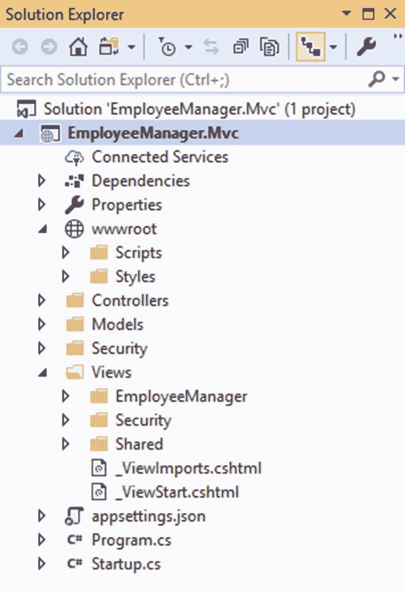

图 3-1

EmployeeManager。解决方案资源管理器中加载的 Mvc

此时，您可能不理解解决方案资源管理器中显示的所有部分，这没关系。只需要看一下整个项目的结构和组织。在接下来的小节中，您将逐步构建这个应用。

## 创建实体框架核心模型

员工管理器使用实体框架核心执行数据库 CRUD 操作。要使用 EF Core，您需要建立一个 EF Core 模型。在本节中，您将做到这一点。

EF 核心模型是一组实体类和一个定制的`DbContext`类。实体类代表应用的业务对象。例如，订单处理系统可能具有订单实体，该实体表示适用于应用域的订单。同样，联系人管理软件可能具有代表该应用联系人的联系人实体。

`DbContext`类表示与底层数据库的会话。它提供了各种功能，例如连接管理、更改跟踪、映射、数据库操作支持等等。`DbContext`容纳一个或多个`DbSet`物体。一个`DbSet`是实体的集合。例如，NorthwindDbContext 可能包含一个用于公开雇员实体的`DbSet`。图 [3-2](#Fig2) 显示了一个 EF 核心模型样本。

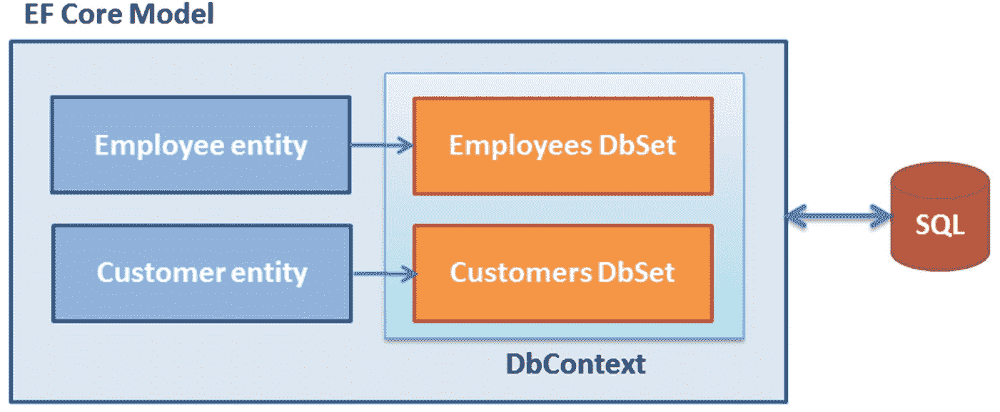

图 3-2

实体类、数据库集和数据库上下文

该图显示了一个 EF 核心模型，由两个实体类(Employee 和 Customer)、两个`DbSet`对象(Employee 和 Customers)和一个容纳它们的`DbContext`类组成。

现在您已经对 EF 核心模型有了一些了解，让我们创建雇员管理器应用所需的模型。从“依赖项”文件夹的快捷菜单中打开“管理 NuGet 包”页面，并将这些包添加到项目中:

*   微软。EntityFrameworkCore.SqlServer

*   microsoft.entityframeworkcore

*   微软。实体框架工作核心关系

NuGet 包是实体框架核心的 SQL Server 数据库提供者。实际上，当您安装`Microsoft.EntityFrameworkCore.SqlServer` NuGet 包时，其他两个依赖包会自动为您安装。这些 NuGet 包包含执行数据库操作所需的类。

现在在项目中添加一个名为 Models 的文件夹。然后使用“添加新项”对话框，向 Models 文件夹添加三个类，即 Employee、Country 和 AppDbContext。

然后打开 Employee 实体类，在顶部使用这些名称空间:

```cs
using System.ComponentModel.DataAnnotations;
using System.ComponentModel.DataAnnotations.Schema;

```

`System.ComponentModel.DataAnnotations`名称空间包括一组允许您验证数据的属性。`System.ComponentModel.DataAnnotations.Schema`包含某些属性，允许您将实体类映射到数据库表。

现在将清单 [3-1](#PC2) 中所示的代码添加到 Employee 类中。

```cs
[Table("Employees")]
public class Employee
{
    [Column("EmployeeID")]
    [Key]
    [DatabaseGenerated(DatabaseGeneratedOption.Identity)]
    [Required(ErrorMessage = "Employee ID is required")]
    [Display(Name = "Employee ID")]
    public int EmployeeID { get; set; }

    [Column("FirstName")]
    [Display(Name = "First Name")]
    [Required(ErrorMessage = "First Name is required")]
    [StringLength(10,ErrorMessage ="First Name must be less than 10 characters")]
    public string FirstName { get; set; }

    [Column("LastName")]
    [Display(Name = "Last Name")]
    [Required(ErrorMessage ="Last Name is required")]
    [StringLength(20,ErrorMessage ="Last Name must be less than 20 characters")]
    public string LastName { get; set; }

    [Column("Title")]
    [Display(Name = "Title")]
    [Required(ErrorMessage ="Title is required")]
    [StringLength(30,ErrorMessage ="Title must be less than 30 characters")]
    public string Title { get; set; }

    [Column("BirthDate")]
    [Display(Name = "Birth Date")]
    [Required(ErrorMessage ="Birth Date is required")]
    public DateTime BirthDate { get; set; }

    [Column("HireDate")]
    [Display(Name = "Hire Date")]
    [Required(ErrorMessage ="Hire Date is required")]
    public DateTime HireDate { get; set; }

    [Column("Country")]
    [Display(Name = "Country")]
    [Required(ErrorMessage ="Country is required")]
    [StringLength(15,ErrorMessage ="Country must be less than 15 characters")]
    public string Country { get; set; }

    [Column("Notes")]
    [Display(Name = "Notes")]
    [StringLength(500,ErrorMessage ="Notes must be less than 500 characters")]
    public string Notes { get; set; }

}

Listing 3-1Employee entity class

```

在继续之前，让我们分析一下代码。雇员类包含八个公共属性，即`EmployeeID`、`FirstName`、`LastName`、`Title`、`BirthDate`、`HireDate`、`Country`和`Notes`。您需要将 Employee 实体类映射到 Northwind 数据库的底层 Employees 表。有三种方法可以执行这种映射:

*   您可以遵循某些约定，框架会自动为您进行映射。

*   您可以使用某些数据注释来显式指定映射。

*   您可以使用 Fluent API 显式指定映射。

如果观察`Employee`类，您会发现它的名称与表名(Employees)匹配，并且它的属性名映射到 Employees 表的列名。如果您遵循这些约定，框架会自动为您进行映射。所以严格来说，Employee 类不需要显式映射。然而，为了学习数据注释，Employee 使用了第二种方法——使用数据注释明确指定映射。在随后的章节中，您将对 Fluent API 有所了解。对于本例，您使用数据注释进行映射和数据验证。

### 注意

雇员经理应用使用现有的数据库和表来工作。如果您愿意，EF Core 还可以根据您创建的实体类为您创建一个数据库和表。在这种情况下，由数据注释指定的元数据也用于创建表。在本书中，我们不需要这种方法，因为我们已经安装了 Northwind 数据库。

Employee 类是用`[Table]`属性修饰的。属性用于将一个类映射到一个表。在这种情况下，Employee 类映射到 Employees 表。

`EmployeeID`属性表示雇员的数字 ID。装饰有`[Column]`、`[Key]`、`[DatabaseGenerated]`、`[Required]`、`[Display]`属性。`[Column]`属性用于将底层属性映射到表的列。在这种情况下，`EmployeeID`属性被映射到 Employees 表的 EmployeeID 列。如果观察 Employees 表的模式，您会发现 EmployeeID 是一个标识列，并且是该表的一个主键。`[DatabaseGenerated]`属性表示属性值由数据库引擎生成。`DatabaseGeneratedOption.Identity`的枚举值表示当一个实体被添加到数据库中时，该值将由数据库生成。`[Key]`属性用于标记主键。`[Required]`属性表明`EmployeeID`属性必须被赋值。`[Required]`属性的`ErrorMessage`属性指定在 EmployeeID 没有被赋值的情况下，在用户界面上显示的错误消息。属性指定了用户界面使用的底层属性的名称。显示一些友好的名称而不是实际的属性名是很有用的。例如，您可能有一个名为 CustomerID 的属性，但希望将其作为客户代码显示在网页上。

`FirstName`属性用`[Column]`、`[Required]`、`[StringLength]`和`[Display]`属性修饰。`[StringLength]`属性验证特定字符串长度的底层属性。在这种情况下，您将`[StringLength]`的最大长度参数设置为 10，表示名字可以是最多十个字符的字符串。

`LastName`属性用`[Column]`、`[Required]`、`[StringLength]`和`[Display]`属性修饰。这次，`[StringLength]`将最大长度设置为 20。

`Title`属性用`[Column]`、`[Required]`、`[StringLength]`和`[Display]`属性修饰。这次，`[StringLength]`将最大长度设置为 30。

`BirthDate`和`HireDate`属性保存一个`DateTime`值，并用`[Column]`、`[Required]`和`[Display]`属性修饰。

`Country`属性用`[Column]`、`[Required]`、`[StringLength]`和`[Display]`属性修饰。这次，`[StringLength]`将最大长度设置为 15。

`Notes`属性由`[Column]`、`[StringLength]`和`[Display]`属性修饰。这一次，`[StringLength]`将最大长度设置为 500。Employees 表中的 Notes 列允许空值，因此没有提到`[Required]`属性。尽管 Notes 的类型是 ntext，`[StringLength]`将最大长度设置为 500，以防止用户输入大量的文本数据。

这就完成了`Employee`实体类。现在，打开`Country`类并在其中编写清单 [3-2](#PC3) 所示的代码。

```cs
public class Country
{
    public int CountryID { get; set; }
    public string Name { get; set; }
}

Listing 3-2Country entity class

```

为了创建`Country`实体类，代码依赖于内置的约定，而不是使用数据注释进行映射。这样，`Country`类会自动映射到数据库中的 Countries 表。此外，`CountryID`和`Name`属性将被映射到 Countries 表的相应列。

`Country`类主要用于让用户在雇员数据输入页面上选择一个国家。该应用不允许用户添加或编辑国家。因此，代码不使用验证属性，比如`[Required]`和`[StringLength]`。

现在您已经完成了`Employee`和`Country`实体类，让我们完成`AppDbContext`类。清单 [3-3](#PC4) 显示了`AppDbContext`的代码。

```cs
public class AppDbContext:DbContext
{

    public AppDbContext(DbContextOptions<AppDbContext> options) : base(options)
    {
    }

    public DbSet<Employee> Employees { get; set; }

    public DbSet<Country> Countries { get; set; }
}

Listing 3-3AppDbContext houses DbSet objects

```

`AppDbContext`类继承自位于`Microsoft.EntityFrameworkCore`名称空间中的`DbContext`类。所以使用类文件顶部名称空间:

```cs
using Microsoft.EntityFrameworkCore;

```

然后添加两个类型为`DbSet<TEntity>`的公共属性——雇员和国家。这些属性分别保存雇员和国家类型的实体。

`AppDbContext`类也有一个带有指定签名的公共构造函数。尽管我们没有在其中添加任何代码，但是这个构造函数是必需的，这样依赖注入(DI)框架就可以在需要时注入`AppDbContext`实例(在后面的章节中会有更多的介绍)。

这就完成了本例所需的 EF 核心模型。

## 创建 EmployeeManager 控制器

员工管理器应用的 CRUD 功能出现在控制器类–`EmployeeManagerController`中。要添加这个类，在项目根目录下创建控制器文件夹，并使用添加新项目对话框添加一个名为`EmployeeManagerController`的控制器类(图 [3-3](#Fig3) )。

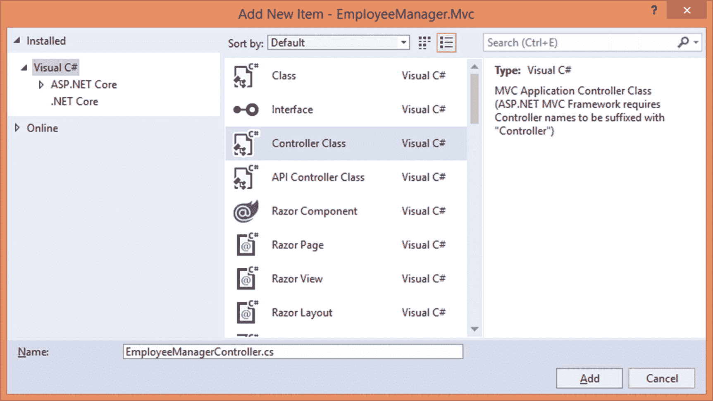

图 3-3

将 EmployeeManagerController 类添加到 Controllers 文件夹中

`EmployeeManagerController`类继承自`Controller`类。`Controller`基类在`Microsoft.AspNetCore.Mvc`名称空间中可用。

因为`EmployeeManagerController`需要在 Employees 表上执行 CRUD 操作，所以它需要前面创建的`AppDbContext`的一个实例。虽然你可以像其他 C# 对象一样实例化`AppDbContext`,但是有一个更好的方法来完成这个任务。借助 ASP.NET 内核的依赖注入(DI)特性，可以将`AppDbContext`的对象注入到`EmployeeManagerController`的构造函数中。要注入这样一个实例，您需要编写一个公共构造函数，如清单 [3-4](#PC6) 所示。

```cs
public class EmployeeManagerController : Controller
{
    private AppDbContext db = null;

    public EmployeeManagerController(AppDbContext db)
    {
        this.db = db;
    }
}

Listing 3-4Injecting AppDbContext into EmployeeManagerController

```

代码声明了一个名为 db 的类型为`AppDbContext`的成员变量。该变量用于存储注入的`AppDbContext`对象，以便在控制器类中使用。公共构造函数通过 db 参数接收注入的`AppDbContext`。在内部，注入的实例存储在本地引用中。

### 注意

您需要使用 EmployeeManager。Mvc.Models 名称空间，以便访问 AppDbContext。在当前命名空间范围之外使用类型的所有地方，都需要使用命名空间的相同步骤。为了避免重复相同的指令，也为了简洁起见，下面几节没有明确要求您使用名称空间。

接下来，您需要一个私有的 helper 方法，它向插入和更新页面的国家下拉列表提供一个国家列表。清单 [3-5](#PC7) 中显示了这种方法。

```cs
private void FillCountries()
{
    List<SelectListItem> countries =
    (from c in db.Countries
     orderby c.Name ascending
  select new SelectListItem()
  { Text = c.Name,
    Value = c.Name }).ToList();
    ViewBag.Countries = countries;
}

Listing 3-5FillCountries() helper method

```

`FillCountries()`助手方法声明了一个`SelectListItem`对象的列表。来自`Microsoft.AspNetCore.Mvc.Rendering`名称空间的`SelectListItem`表示下拉列表中的一项(HTML 的<select>元素)。因为您想要显示一个可供选择的国家列表，所以已经创建了一个列表。</select>

LINQ 到实体查询从 Countries 数据库中选择所有实体，并将它们投影到新的`SelectListItem`对象中。注意`SelectListItem`的`Text`和`Value`属性是如何分配给`Country`实体的`Name`属性的。LINQ 对实体的查询返回`IQueryable<T>`。`ToList()`方法将这个`IQueryable`转换成一个`SelectListItem`对象列表。

国家列表将被传递给视图，以便它可以被填充到<select>元素中。为了方便数据传输，代码使用了一个 ViewBag 对象。ViewBag 是一个动态类型，允许您使用 object.property 语法动态设置或获取值。这里，代码将国家存储在 ViewBag 的 Countries 属性中。</select>

## 添加 _ViewImports 文件

在下面的部分中，您将使用 ASP.NET Core 标签帮助程序来呈现用户界面元素，如表单、表单域和超链接。为了使用标记助手，您需要在项目中启用它们。

在项目根文件夹下添加视图文件夹。然后将 a _ViewImports.cshtml 添加到 Views 文件夹中。您可以通过打开添加新项目对话框并从列表中选择 Razor View Imports 来实现这一点(图 [3-4](#Fig4) )。

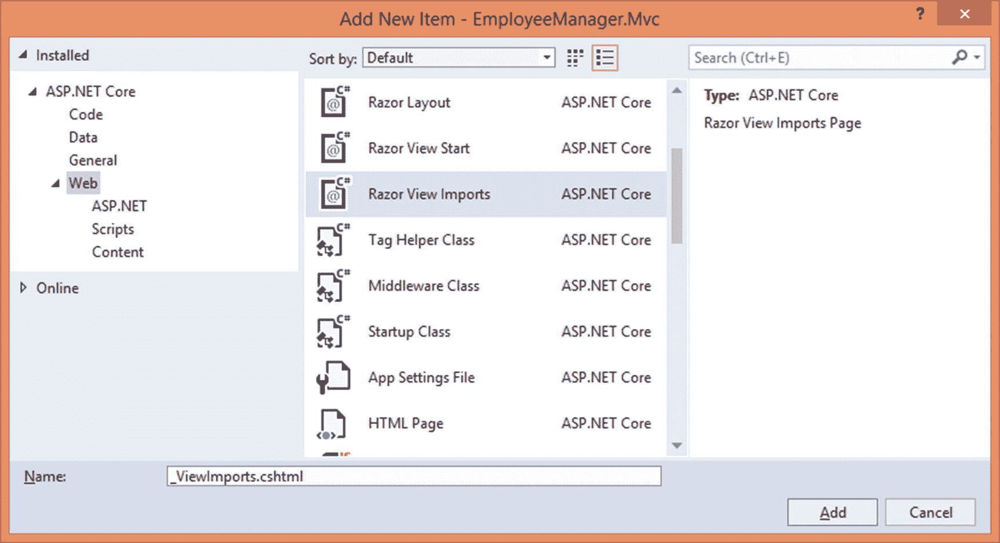

图 3-4

添加 _ViewImports.cshtml 文件

_ViewImports 文件是一个特殊的文件，因为它包含命名空间导入和启用标记助手的指令。然后，这些设置将应用于所有视图文件。然后将其写入 _ViewImports.cshtml 文件:

```cs
@using EmployeeManager.Mvc
@using EmployeeManager.Mvc.Models
@addTagHelper *, Microsoft.AspNetCore.Mvc.TagHelpers

```

代码使用了`@using`指令来使用一些名称空间，比如`EmployeeManager.Mvc`和`EmployeeManager.Mvc.Models`。在这里，`@using`指令与 C# 中的 using 指令的作用相同。一旦在这里导入名称空间，就可以在任何视图文件中使用这些名称空间中的类。

注意为视图启用标记助手的`@addTagHelper`指令。`@addTagHelper`的第一个参数是*,表示来自随后的程序集中的所有可用标记助手都将被添加到项目中。第二个参数是包含标记助手的程序集的名称:在本例中为`Microsoft.AspNetCore.Mvc.TagHelpers`。

### 注意

您还可以将@using 和@addTagHelper 指令放在单独的视图文件中。但是在这种情况下，它们被应用于所考虑的视图。如果您想在多个视图中使用名称空间和标记帮助器，_ViewImports.cshtml 是一个更好的地方。

## 显示员工列表

一旦用户成功登录，您需要显示员工列表。用户可以修改现有员工、添加新员工或删除现有员工。尽管您在第 [2](02.html) 章中了解了员工列表页面，但为了清晰起见，图 [3-5](#Fig5) 在此再次显示了该页面。

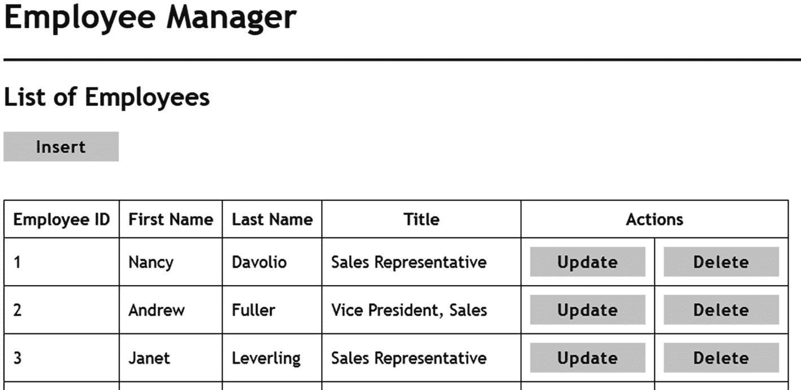

图 3-5

显示员工列表

为了显示雇员列表，您需要一个名为`List()`的动作和一个名为 List.cshtml 的视图。要添加`List()`动作，请打开`EmployeeManagerController`类并编写清单 [3-6](#PC9) 中所示的代码。

```cs
public IActionResult List()
{
    List<Employee> model = (from e in db.Employees
                            orderby e.EmployeeID
                            select e).ToList();
    return View(model);
}

Listing 3-6List() action

```

`List()`动作返回`IActionResult`。该代码使用 LINQ 到实体查询来检索雇员对象列表。然后使用`View()`方法将列表传递给列表视图。`View()`方法是由`Controller`基类提供的，它接受要发送给视图的模型对象。如果未指定视图名称，则假定视图名称与操作名称相同。`View()`方法返回一个`ViewResult`对象(`ViewResult`实现`IActionResult`)，表示要在浏览器中呈现的视图。

现在，让我们添加使用这个雇员数据的列表视图，并将其呈现在一个表中。在项目根目录下添加 Views 文件夹，并在 Views 文件夹下添加`EmployeeManager`文件夹。Views 文件夹用于存储 MVC 视图文件。与特定控制器相关的所有视图被分组到一个文件夹中，该文件夹的名称与控制器的名称相同，但没有控制器后缀。例如，为了存储`EmployeeManagerController`的视图，您在 views 文件夹下创建一个 EmployeeManager 子文件夹。

然后右击 EmployeeManager 文件夹并打开“添加新项”对话框。添加一个名为 List.cshtml 的 Razor 视图文件(图 [3-6](#Fig6) )。

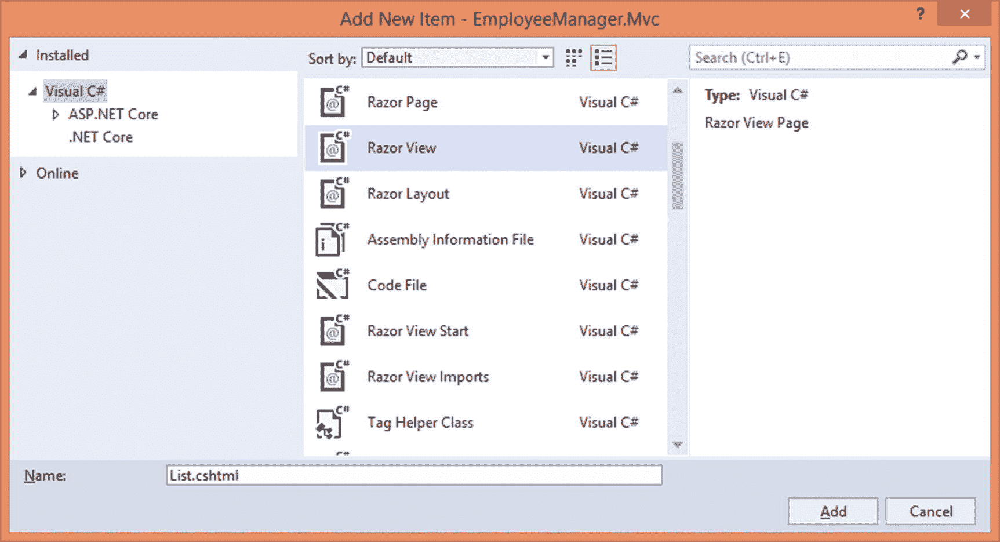

图 3-6

添加列表视图

一旦添加了列表视图，就将清单 [3-7](#PC10) 中所示的代码和标记写入其中。

```cs
@model List<Employee>

<h2>List of Employees</h2>

<h2 class="message">@TempData["Message"]</h2>

<a asp-controller="EmployeeManager"
   asp-action="Insert"
   class="linkbutton">Insert</a>

<br /><br />

<table border="1">
    <tr>
        <th>Employee ID</th>
        <th>First Name</th>
        <th>Last Name</th>
        <th>Title</th>
        <th colspan="2">Actions</th>
    </tr>
    @foreach(var item in Model)
    {
        <tr>
            <td>@item.EmployeeID</td>
            <td>@item.FirstName</td>
            <td>@item.LastName</td>
            <td>@item.Title</td>
            <td>
                <a asp-controller="EmployeeManager"
                   asp-action="Update"
                   asp-route-id="@item.EmployeeID"
                   class="linkbutton">Update</a>
            </td>
            <td>
                <a asp-controller="EmployeeManager"
                   asp-action="Delete"
                   asp-route-id="@item.EmployeeID"
                   class="linkbutton">Delete</a>
            </td>
        </tr>
    }
</table>

Listing 3-7List view renders a list of employees

```

让我们更详细地分析列表视图。List.cshtml 以`@model`指令开始。`@model`指令指定了视图使用的模型类型。列表视图需要一个 employee 对象列表来呈现 Employee 表。因此，`@model`指令指定`List<Employee>`为型号类型。还记得`List()`动作将一个雇员对象列表传递给了`View()`方法。带有指定模型类型的`@model`指令的视图被称为强类型视图。

在视图标题下面，代码在响应流中输出`TempData["Message"]`。这是使用 Razor 的@语法完成的。`TempData`是一个字典对象，存储数据直到被读取。您需要在这里使用`TempData`来显示员工删除消息。删除员工页面将`TempData`的`Message`键设置为成功消息，并将用户重定向到列表页面。然后，列表视图向用户显示该消息。当我们在后面的章节中讨论删除员工页面时，`TempData`的用法将会很清楚。

然后，标记会显示插入链接。这是使用锚点标签辅助对象完成的。标签助手允许服务器端代码在 Razor 文件中呈现 HTML 元素。有许多内置的标记助手，如表单、选择和输入标记助手。随着您开发这个应用，将会向您介绍更多的标记助手。现在，您使用锚标记帮助器来显示一个指向“插入新员工”页面的超链接。请注意，锚标记辅助对象的`asp-controller`属性被设置为 EmployeeManager 控制器，而`asp-action`属性被设置为插入动作。您将在后面的小节中创建插入操作。

然后一个在页面上显示所有员工的列表。尽管 Employee 对象有许多属性，但该表只显示了其中的四个属性—`EmployeeID`、`FirstName`、`LastName`和`Title`。为了呈现雇员列表，使用了`foreach`循环。请注意视图的`Model`属性的使用，它表示传递给视图的模型对象(在本例中为`List<Employee>`)。每次迭代都会添加一个由前面提到的四个属性值组成的表行。

请注意，每一行还有更新和删除链接。它们将用户带到相应的页面。这些链接是使用锚标记辅助对象呈现的。更新链接上的`asp-controller`、`asp-action`和`asp-route-id`属性分别设置为 EmployeeManager、Update 和 EmployeeID。对于 EmployeeID 为 1 的情况，结果链接将指向/EmployeeManager/Update/1。这意味着点击这个链接将把用户带到`EmployeeManager`控制器的`Update()`动作，并且`EmployeeID`也被传递到`Update()`动作。需要`id` route 参数，以便`Update()`动作可以知道哪个雇员将被编辑。

### 注意

更新和删除链接中使用的 id 参数是 ASP.NET Core MVC 路由配置的一部分。在本章稍后配置应用的启动时，您将了解到路由配置。

在同一行中，删除链接指向`EmployeeManager`的`Delete()`动作，并将`EmployeeID`作为路由参数传递。

列表视图利用了某些 CSS 类，如 linkbutton 和 message。这些 CSS 类来自应用的样式表-site . CSS。site . CSS 的内容在这里不讨论。您可以从该书的源代码中获取样式表。

## 插入新员工

单击“员工列表”页面上的“插入”链接可将您带到另一个页面，在此您可以插入新员工。该页面如图 [3-7](#Fig7) 所示。

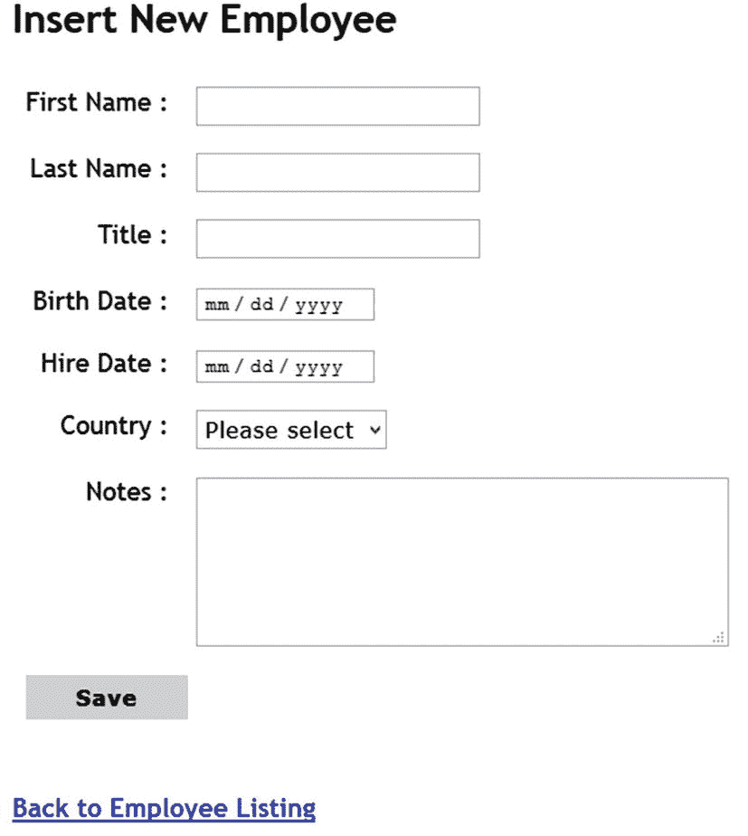

图 3-7

插入新员工

该页面有接受`FirstName`、`LastName`、`Title`、`BirthDate`、`HireDate`、`Country`和`Notes`的表单字段。`EmployeeID`最终用户不接受身份值。单击 Save 按钮将员工详细信息插入到数据库中。返回员工列表链接将您带到员工列表页面。

要构建插入页面，您需要两个操作和一个视图。所以打开`EmployeeManagerController`类并添加两个动作，如清单 [3-8](#PC11) 所示。

```cs
public IActionResult Insert()
{
    FillCountries();
    return View();
}

[HttpPost]
public IActionResult Insert(Employee model)
{
    FillCountries();
    if (ModelState.IsValid)
    {
        db.Employees.Add(model);
        db.SaveChanges();
        ViewBag.Message = "Employee inserted successfully";
    }
    return View(model);
}

Listing 3-8Insert() actions insert a new employee

```

当您单击员工列表页面上的 Insert 链接时，会调用第一个`Insert()`动作。在内部，代码调用`FillCountries()` helper 方法将国家列表存储到`ViewBag`中。然后，它会在浏览器中显示插入视图。稍后将讨论插入视图。

当您单击 Save 按钮提交表单时，将调用第二个`Insert()`。表单使用 POST 方法提交，因此用`[HttpPost]`属性修饰`Insert()`。添加`[HttpPost]`确保底层动作只为 POST 请求调用。注意这个版本的`Insert()`接受类型为`Employee`的参数。提交表单后，ASP.NET Core 会自动将表单字段值填充到一个`Employee`对象中。这被称为模型绑定。在填充值时，ASP.NET Core 将表单字段名称与属性名称进行匹配。例如，Employee 对象的 FirstName 属性将被赋予在名为 FirstName 的文本框中输入的值。

在内部，`Insert()`动作调用`FillCountries()`助手方法。在向数据库中插入新雇员之前，代码会检查 employee 对象是否包含有效值。回想一下，在创建 Employee 实体类时，您使用了诸如`[Required]`和`[StringLength]`之类的数据注释来指定验证标准。为了检查 Employee 是否包含有效值，代码使用了 ModelState 的`IsValid`属性。如果所有验证都成功，`IsValid`属性返回 true 否则，它返回 false。

在前一种情况下，代码将`Employee`对象添加到 Employees DbSet。这是使用员工`DbSet`的`Add()`方法完成的。`Add()`方法将新雇员添加到`DbSet`中，并将其标记为新添加的实体。为了将值保存到数据库中，调用了`AppDbContext`的`SaveChanges()`方法。成功消息存储在`ViewBag`中，以显示给用户。浏览器中会再次呈现插入视图，以便您可以根据需要插入另一个员工。

这就完成了两个`Insert()`动作。现在让我们进入插入视图。通过右键单击视图➤ EmployeeManager 文件夹打开添加新项目对话框，并添加另一个名为 Insert.cshtml 的 Razor 视图。然后在其中编写清单 [3-9](#PC12) 中所示的标记。

```cs
@model Employee

<h2>Insert New Employee</h2>
<h3 class="message">@ViewBag.Message</h3>

<form asp-controller="EmployeeManager" asp-action="Insert" method="post">
    <table border="0">
    </table>
</form>

Listing 3-9Skeleton markup of Insert.cshtml

```

这里，`@model`指令将视图的模型类型设置为`Employee`。在标题下方，输出存储在`ViewBag`中的成功信息。最初调用第一个`Insert()`时，`Message`属性将为空，因此不会显示任何消息。后续的插入操作将向用户显示成功消息。

然后，标记使用一个表单标签助手来呈现一个 HTML

<form>元素。表单标记帮助器的`asp-controller`属性指定控制器的名称(employee manager),`asp-action`属性指定提交时处理表单的动作(Insert)的名称。method 属性指定表单提交的方法，在本例中是 POST。</form>

在内部，放置了一个表格来容纳各种表单字段(将在下面讨论)。现在，将清单 [3-10](#PC13) 中所示的标记添加到<表>元素中。

```cs
<tr>
    <td class="right">
        <label asp-for="FirstName"></label> :
    </td>
    <td>
        <input type="text" asp-for="FirstName" />
        <span asp-validation-for="FirstName" class="message"></span>
    </td>
</tr>
<tr>
    <td class="right">
        <label asp-for="LastName"></label> :
    </td>
    <td>
        <input type="text" asp-for="LastName" />
        <span asp-validation-for="LastName" class="message"></span>
    </td>
</tr>
<tr>
    <td class="right">
        <label asp-for="Title"></label> :
    </td>
    <td>
        <input type="text" asp-for="Title" />
        <span asp-validation-for="Title" class="message"></span>
    </td>
</tr>

Listing 3-10Input Tag Helpers for FirstName, LastName, and Title

```

请注意用粗体字母标记的代码。标签标记帮助器显示名字文本框的标签。`asp-for`属性被设置为`FirstName`,表示正在为名字文本框呈现<label>。回想一下，</label>名字属性是用`[Display]`属性修饰的，标签标记帮助器将自动使用该属性作为标签。如果模型属性没有[Display]，标签将使用实际的属性名称。

输入标签助手将<input>元素绑定到一个模型属性。这是使用`asp-for`属性完成的。因此，当您添加一个属性设置为`FirstName, i`的<input>元素时，t 将生成一个输入元素，其名称为 FirstName，值与属性值相同。

跟在 input 元素后面的元素表示一个验证消息标签助手，用于显示该属性的验证错误消息。`asp-validation-for`属性指定要显示其验证错误消息的属性名(在本例中为 FirstName)。验证错误消息是从创建模型类时使用的数据注释中挑选出来的。

接下来的标记为`LastName`和`Title`属性设置了标记助手。

接下来，添加清单 [3-11](#PC14) 中所示的标记，显示`BirthDate`和`HireDate`字段。

```cs
<tr>
    <td class="right">
        <label asp-for="BirthDate"></label> :
    </td>
    <td>
        <input type="date" asp-for="BirthDate" />
        <span asp-validation-for="BirthDate" class="message"></span>
    </td>
</tr>
<tr>
    <td class="right">
        <label asp-for="HireDate"></label> :
    </td>
    <td>
        <input type="date" asp-for="HireDate" />
        <span asp-validation-for="HireDate" class="message"></span>
    </td>
</tr>

Listing 3-11Displaying BirthDate and HireDate form fields

```

这个标记与前面讨论的非常相似。但是，请注意，输入字段的 type 属性设置为 date。Firefox 和 Chrome 等现代浏览器可以显示日期选择器来输入日期。

现在，在插入视图中添加清单 [3-12](#PC15) 所示的标记。

```cs
<tr>
    <td class="right">
        <label asp-for="Country"></label> :
    </td>
    <td>
        <select asp-for="Country" asp-items="@ViewBag.Countries">
        <option value="">Please select</option>
        </select>
        <span asp-validation-for="Country" class="message"></span>
    </td>
</tr>
<tr>
    <td class="right">
        <label asp-for="Notes"></label> :
    </td>
    <td>
        <textarea asp-for="Notes" rows="5" cols="40"></textarea>
        <span asp-validation-for="Notes" class="message"></span>
    </td>
</tr>

Listing 3-12Displaying the Country dropdown list and Notes text area

```

您应该对这个标记很熟悉，因为它与前一个标记非常相似。然而，还是有一些不同之处。首先，为了显示可供选择的国家列表，标记使用了 Select 标记助手。<select>元素的 asp-for 属性被设置为</select> `Country`属性，指示控件值被绑定到`Employee`模型对象的`Country`属性。`asp-items`属性被设置为 ViewBag 的`Countries`属性。回想一下,`FillCountries()`方法将一列`SelectListItem`对象存储到 Countries ViewBag 属性中。将其设置为`asp-items`将在 `ViewBag`中为每个国家生成<option>元素。注意，<select>也有一个空的<option>元素，在下拉列表中显示“请选择”项。来自 ViewBag 的国家被附加到这个</option> <option>元素上。</option>T19】</select></option>

其次，使用 Textarea 标签助手输入`Notes`。因为注释可以是自由格式的文本，所以标记呈现一个具有 5 行 40 列的<textarea>元素。</textarea>

最后，在插入视图中添加清单 [3-13](#PC16) 所示的标记。

```cs
       <tr>
            <td colspan="2">
                <button type="submit">Save</button>
            </td>
        </tr>
    </table>
</form>

<br /><br />

<a asp-controller="EmployeeManager" asp-action="List">Back to Employee Listing</a>

Listing 3-13Displaying the Save button and Back to Employee Listing link

```

这个标记使用一个<button>元素显示保存按钮。单击保存按钮提交表单。在页面底部，Anchor Tag Helper 用于呈现一个超链接，将用户带回到雇员列表页面。锚标记辅助对象的`asp-controller`和`asp-action`属性分别被设置为`EmployeeManager`和`List`。点击链接将控制`List()`动作。</button>

## 更新现有员工

在员工列表页面上，每个员工行都有更新和删除链接。单击“更新”链接将带您进入“更新员工”页面，该页面显示该员工的现有详细信息以供编辑(图 [3-8](#Fig8) )。

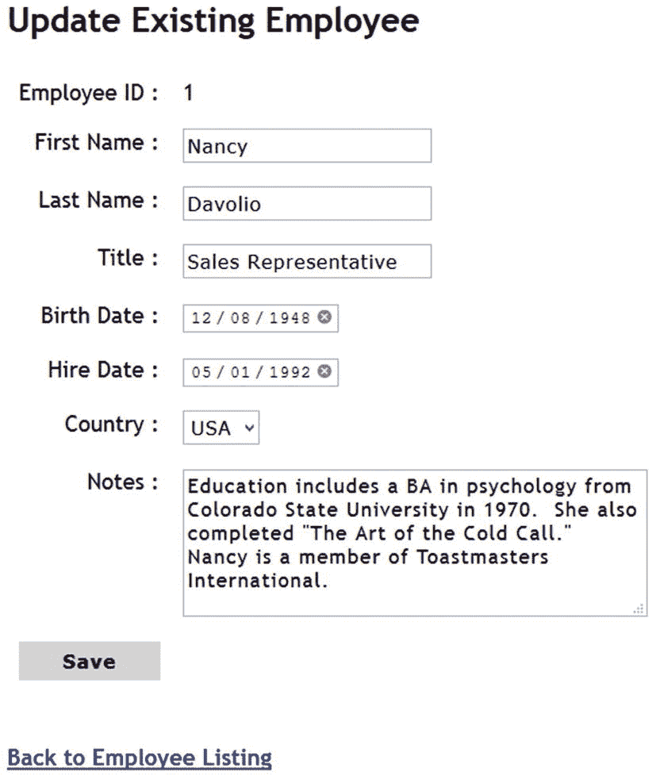

图 3-8

更新现有员工

“更新现有员工”页面看起来与“插入新员工”页面相似，不同之处在于现在用被修改员工的详细信息填充了各种控制值。作为主键的`EmployeeID`不能修改。

为了完成这个页面，您需要两个动作和一个视图。所以打开`EmployeeManagerController`并添加第一个动作，如清单 [3-14](#PC17) 所示。

```cs
public IActionResult Update(int id)
{
    FillCountries();
    Employee model = db.Employees.Find(id);
    return View(model);
}

Listing 3-14First Update() action

```

当用户单击雇员列表页面上的更新链接时，第一个`Update()`动作被调用。它有一个参数——id——指示被修改的雇员的`EmployeeID`。记住`EmployeeID`是通过更新链接的 id 路由参数提供的。

在内部，调用了`FillCountries()` helper 方法，以便在`ViewBag`中提供国家列表。然后代码找到`Employee`实体，其`EmployeeID`被传递给`Update()`动作。这是使用员工`DbSet`的`Find()`方法完成的。`Find()`方法接受一个主键值并返回一个与该主键值匹配的实体。`Find()`如果未找到匹配项，则返回 null。返回的`Employee`对象通过`View()`方法传递给更新视图。

然后添加第二个`Update()`动作，如清单 [3-15](#PC18) 所示。

```cs
[HttpPost]
public IActionResult Update(Employee model)
{
    FillCountries();
    if(ModelState.IsValid)
    {
        db.Employees.Update(model);
        db.SaveChanges();
        ViewBag.Message = "Employee updated successfully";
    }
    return View(model);
}

Listing 3-15Second Update() action

```

当用户点击 Save 按钮时，调用第二个`Update()`。因为这个版本的`Update()`通过 POST 方法处理表单提交，所以它用`[HttpPost]`属性来修饰。`Update()`方法通过`Employee`对象参数接收修改后的值。

在内部，代码像以前一样调用`FillCountries()`。然后，它继续检查 ModelState 的`IsValid`属性。要更新一个雇员，将使用雇员`DbSet`的`Update()`方法，并将修改后的`Employee`对象传递给它。这样，Employee 对象就被标记为已修改。然后在`AppDbContext`上调用`SaveChanges()`以将改变传播到数据库。成功消息存储在`ViewBag`中，更新视图显示在浏览器中。

现在，将 Update.cshtml 添加到视图➤ EmployeeManager 文件夹中。将清单 [3-16](#PC19) 中所示的标记添加到更新视图中。

```cs
@model Employee

<h2>Update Existing Employee</h2>
<h3 class="message">@ViewBag.Message</h3>
<form asp-controller="EmployeeManager"
      asp-action="Update"
      method="post">
    <table border="0">
        <tr>
            <td class="right">
                <label asp-for="EmployeeID"></label> :
            </td>
            <td>
                <input type="hidden" asp-for="EmployeeID" />
                <span>@Model.EmployeeID</span>
            </td>
        </tr>

Listing 3-16Form Tag Helper in the Update view

```

`@model`指令将更新视图的模型设置为 Employee。请注意用粗体字母标记的代码。表单标签助手使用 POST 方法将表单提交给`EmployeeManagerController`的`Update()`动作。还要注意的是，`EmployeeID`存储在一个隐藏的表单字段中，也显示在一个< span >元素中。将`EmployeeID`存储在隐藏的表单字段中可以确保它在模型绑定期间被填充到`Employee`对象中。

页面标记的其余部分与插入视图相同，因此不再讨论。您可以从插入视图中复制粘贴它，也可以从书的源代码中抓取。

## 删除现有员工

从数据库中删除现有员工的过程分为两步。首先，当您在 employee listing 页面中单击某个员工记录的 Delete 链接时，会显示一个确认页面，警告用户该员工已被删除。一旦用户确认删除，该员工将从数据库中删除。图 [3-9](#Fig9) 显示了为员工显示的确认页面。

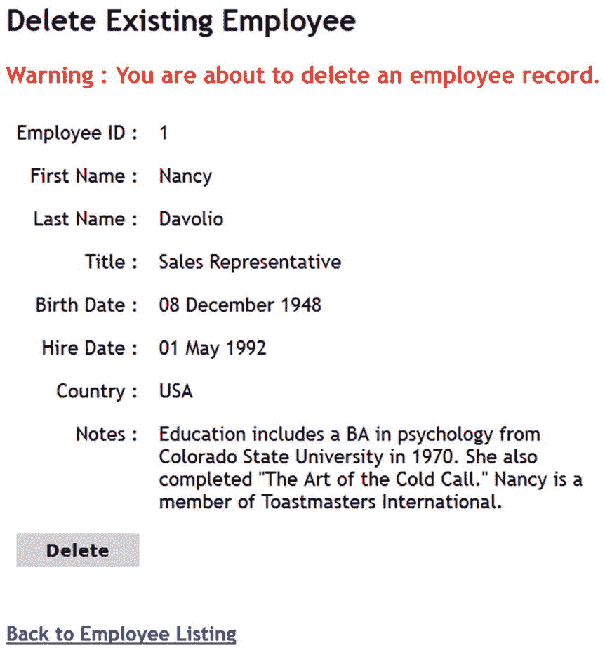

图 3-9

确认员工删除

为了实现这部分功能，您需要两个动作和一个视图。清单 [3-17](#PC20) 显示了其中一个动作。

```cs
[ActionName("Delete")]
public IActionResult ConfirmDelete(int id)
{
    Employee model = db.Employees.Find(id);
    return View(model);
}

Listing 3-17Action for confirming the delete operation

```

`ConfirmDelete()`动作接受一个要删除的雇员对象的`EmployeeID`。回想一下，员工列表页面中的删除链接提供了这个`id`作为路由参数。`ConfirmDelete()`是用`[ActionName]`属性装饰的。通常，向外部世界公开的操作名称与操作方法名称相同。但是，有时您可能希望用不同的名称公开一个操作方法。在这种情况下，代码将`ConfirmDelete()`方法公开为`Delete`。这允许我们将 URL /EmployeeManager/Delete 映射到`ConfirmDelete()`动作。

在内部，代码找到一个与提供的`EmployeeID`匹配的`Employee`，并将其传递给删除视图。

第二个动作如清单 [3-18](#PC21) 所示。

```cs
[HttpPost]
public IActionResult Delete(int employeeID)
{
    Employee model = db.Employees.Find(employeeID);
    db.Employees.Remove(model);
    db.SaveChanges();
    TempData["Message"] = "Employee deleted successfully";
    return RedirectToAction("List");
}

Listing 3-18Delete() action deletes an employee

```

`Delete()`动作接受一个参数—`employeeID`。注意，`ConfirmDelete()`参数被命名为 id，因为它是作为路由参数提供的。另一方面，`Delete()`通过模型绑定接收来自确认页面的`EmployeeID`。因此，它被命名为`employeeID`，与被模型绑定的属性名相同。`Delete()`动作用`[HttpPost]`修饰，因为我们只希望通过 POST 请求调用它。

在内部，代码根据动作中传递的`EmployeeID`找到要删除的雇员。然后它调用`DbSet`的`Remove()`方法来删除雇员。`Remove()`方法标记要删除的实体。为了从数据库中删除雇员，在 DbContext 上调用了`SaveChanges()`方法。

删除员工后，我们希望重定向到员工列表页面。`ViewBag`对象具有当前请求的范围。这意味着您存储在`ViewBag`中的任何内容都只在当前请求期间可用。在这种情况下，将用户带到员工列表页面是另一个请求，因此先前请求的`ViewBag`值将不可用。作为替代，代码使用了`TempData`对象。`TempData`是一个字典，你可以在里面存储键值对。存储在`TempData`中的数据保持可用，直到被另一个请求读取。这里，代码在`TempData`中存储了一条成功消息。该成功消息在列表视图中输出(阅读员工列表页面的讨论)。

为了将用户重定向到雇员列表页面，使用了`RedirectToAction()`方法。`RedirectToAction()`方法接受动作的名称，并将控制重定向到该动作。

### 注意

EF Core 有一个 ChangeTracker，它跟踪由 DbContext 管理的实体的状态。调用 Add()、Update()和 Remove()方法会将实体的状态分别设置为已添加、已修改和已删除。

现在，在视图➤ EmployeeManager 文件夹中添加 Delete.cshtml。在其中编写清单 [3-19](#PC22) 所示的标记。

```cs
@model Employee

<h2>Delete Existing Employee</h2>
<h3 class="message">
    Warning : You are about to delete an employee record.
</h3>
<form asp-controller="EmployeeManager" asp-action="Delete" method="post">
    <input type="hidden" asp-for="EmployeeID" />
    <table border="0">
        <tr>
            <td class="right">
                <label asp-for="EmployeeID"></label> :
            </td>
            <td>
                @Model.EmployeeID
            </td>
        </tr>
        <tr>
            <td class="right">
                <label asp-for="FirstName"></label> :
            </td>
            <td>
                @Model.FirstName
            </td>
        </tr>
        ...
        <tr>
            <td colspan="2">
                <button type="submit">Delete</button>
            </td>
        </tr>
    </table>
</form>
<br /><br />

<a asp-controller="EmployeeManager" asp-action="List">Back to Employee Listing</a>

Listing 3-19Delete view displays a warning message along with employee details

```

删除视图在顶部显示一条警告消息。警告消息下面是一个

<form>，它发送到 EmployeeManagerController 的 Delete()操作。注意，EmployeeID 存储在一个隐藏的表单字段中。这是必需的，因为当您通过单击 Delete 按钮提交表单时，Delete()操作(前面讨论过)应该知道删除该记录的 EmployeeID。</form>

表单中的表显示了现有雇员的详细信息(为了减少混乱，只显示了 EmployeeID 和 FirstName 属性)。您可以查看这些详细信息，然后单击表格底部的删除按钮。

## 添加 Razor 布局和视图开始

在此阶段，您已经完成了与 CRUD 操作相关的功能。在您可以运行应用之前，让我们再添加一些东西。首先，为您的视图添加一个 Blazor 布局。布局用于为应用的各个页面提供一致的页面布局。大多数网站在徽标、页眉、页脚和导航结构(如菜单)方面都提供了一致的站点布局。由于这些片段出现在不止一页上，它们最好保存在一个地方。布局就是这样一个地方。如果你熟悉 ASP.NET 母版页，你会发现类似的布局。

其次，您将把这个布局附加到应用的各个视图中。您可以使用视图开始文件来完成此操作。

在“视图”下添加名为“共享”的子文件夹。共享文件夹用于存储要在多个控制器或视图之间共享的项目。例如，多个控制器可能需要一个视图文件。您可以将同一视图的两个副本放在共享文件夹中，而不是放在两个控制器特定的文件夹中。由于布局通常附加有多个视图，因此它存储在共享文件夹中。

然后右键单击共享文件夹并打开“添加新项目”对话框。将名为 _Layout.cshtml 的布局添加到视图文件夹中(图 [3-10](#Fig10) )。

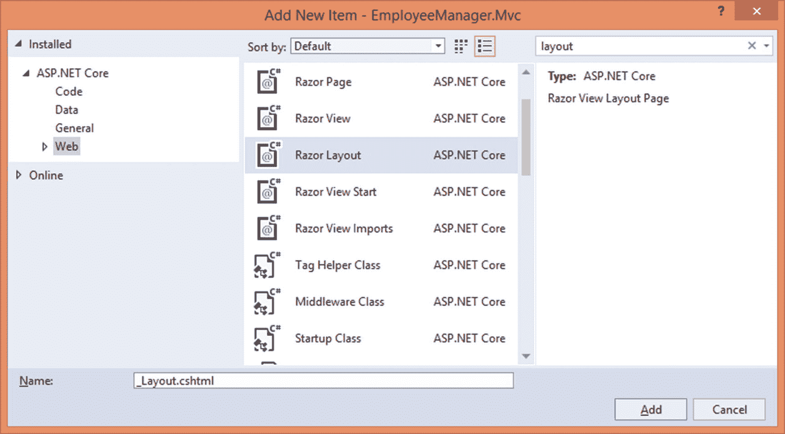

图 3-10

将 Razor 布局添加到共享文件夹

接下来，在 _Layout 文件中编写清单 [3-20](#PC23) 所示的标记。

```cs
<!DOCTYPE html>
<html>
<head>
    <meta name="viewport" content="width=device-width" />
    <title>Employee Manager</title>
    <link href="~/Styles/site.css" rel="stylesheet" />
</head>
<body>
    <h1>Employee Manager</h1>
    <hr />
    <div>
        @RenderBody()
    </div>
    <hr />
</body>
</html>

Listing 3-20Markup from _Layout.cshtml

```

如您所见，布局包含 HTML 元素，如、、<title>、<link/>和</title>。这些元素定义了页面的框架。

注意`@RenderBody()`方法的使用。视图的内容将在发出`@RenderBody()`调用的地方输出。这样，布局的内容和视图的内容就组合在一起，形成了最终的页面。

要将 _Layout.cshtml 附加到应用的所有视图中，请在 views 文件夹中添加一个 Razor 视图开始文件(图 [3-11](#Fig11) )。

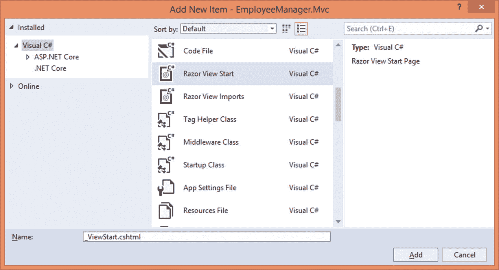

图 3-11

添加 Razor 视图开始文件

视图开始文件名为 _ViewStart.cshtml，包含以下代码:

```cs
@{
    Layout = "_Layout";
}

```

这是一个 Razor 代码块，将视图的`Layout`属性设置为要附加的布局页面的名称(没有文件扩展名)。

## 启用客户端验证

位于 Models 文件夹中的`Employee`类由数据注释属性修饰，例如`[Required]`和`[StringLength]`，它们能够在服务器端和客户端执行验证。但是，客户端验证依赖于 jQuery 验证。因此，您需要向所有视图添加特定的 jQuery 文件。这些文件如下:

*   jquery . js-jquery . js-jquery . js-jquery . js-jquery . js-jquery . js-jquery . js-jquery

*   jquery.validate.js

*   jquery . validate . obtructive . js

第一个文件是核心 jQuery 库文件。第二个文件是 jQuery 验证插件，第三个文件是 jQuery 验证的一个附件，用于实现不引人注目的验证。你可以从这本书的源代码下载中抓取这些文件。

有了这些文件后，在项目根文件夹下创建 wwwroot/Scripts 文件夹，并将它们放入其中。您的解决方案资源管理器应该类似于图 [3-12](#Fig12) 。

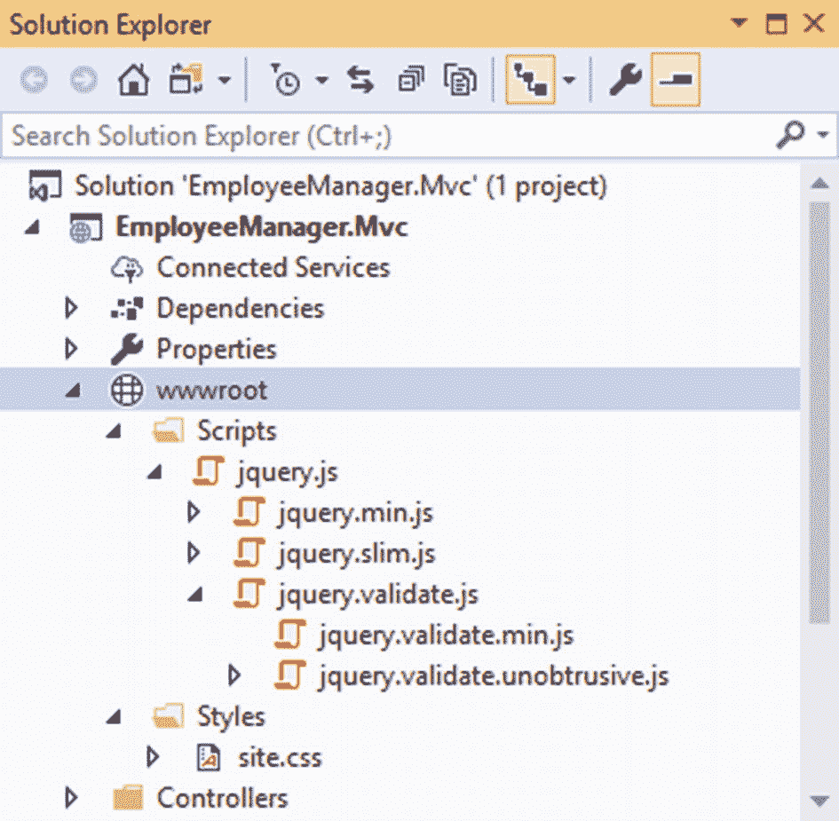

图 3-12

添加到 wwwroot 文件夹中的 jQuery 文件

打开 _Layout.cshtml 文件并为这些文件添加

注意使用~来表示 web 应用的根。在 ASP.NET Core 中，所有的静态文件，比如图像、脚本和样式表都放在 wwwroot 文件夹中；wwwroot 被认为是 web 应用的根。

还要注意，标记还使用了一个名为 site.css 的 CSS 样式表。您可以从本书的源代码中下载这个文件。

### 注意

您可以分别访问 [`https://jquery.com`](https://jquery.com) 、 [`https://jqueryvalidation.org`](https://jqueryvalidation.org) 、 [`https://github.com/aspnet/jquery-validation-unobtrusive`](https://github.com/aspnet/jquery-validation-unobtrusive) 下载这些 jQuery 文件的最新版本。

## 将数据库连接字符串存储在 appsettings.json 中

雇员管理器应用使用您之前安装的 Northwind 数据库中的数据。尽管您已经创建了一个 EF 核心数据模型和数据输入页面，但是数据库连接信息并没有在任何地方提到。现在是时候这么做了。

数据库连接字符串是应用配置的一部分，ASP.NET Core 有一个特殊的文件来存储它:appsettings . json。appsettings . JSON 文件以 JSON 格式存储应用配置。通常，配置存储为键值对。若要添加 appsettings.json 文件，请在解决方案资源管理器中右击该项目，并打开“添加新项”对话框。然后定位 App 设置文件入口(图 [3-13](#Fig13) )。

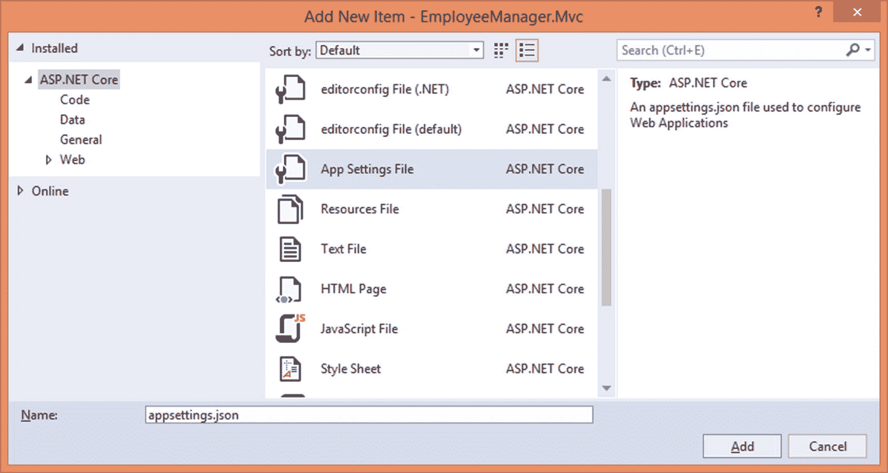

图 3-13

添加 appsettings.json 文件

添加 appsettings.json 后，将清单 [3-22](#PC26) 中所示的 json 片段写入其中。

```cs
{
  "ConnectionStrings": {
    "AppDb": "data source=.;
              initial catalog=Northwind;
              integrated security=true"
  }
}

Listing 3-22Storing the database connection string in appsettings.json

```

`ConnectionStrings`部分用于存储数据库连接字符串。一个应用可以包含多个数据库，所有的连接字符串都可以放在`ConnectionStrings`部分下。在这种情况下，名为`AppDb`的键存储 Northwind 数据库的连接字符串。

数据源指定 SQL Server 安装的名称或 IP 地址。这里点(。)表示本地主机。初始目录指定了要连接的数据库的名称，在本例中是 Northwind。集成安全性表示 Windows 集成安全性将用于数据库级认证。

确保根据您的设置更改此连接字符串。将连接字符串存储在配置文件中可以在以后更改它，而不需要对源代码进行任何更改。

## 配置应用启动

在运行 ASP.NET Core 应用之前，您需要指定应用的启动。应用的启动包括三个主要任务:

*   读取并加载应用的配置，以便可以从应用的其他部分访问它。

*   注册应用所需的服务。服务是注册到依赖注入(DI)框架的可重用组件，然后可以在应用的其他部分使用。

*   定义应用的请求处理管道。

默认情况下，前面提到的启动信息存储在 startup 类中。启动类通常位于项目根目录中。我们来看看员工经理的启动课是什么样子的。清单 [3-23](#PC27) 展示了 Startup.cs 文件的框架。

```cs
public class Startup
{

    public Startup(IConfiguration config)
    {
    }

    public void ConfigureServices(IServiceCollection services)
    {
    }

    public void Configure(IApplicationBuilder app,
                          IWebHostEnvironment env)
    {
    }
}

Listing 3-23Skeleton of Startup.cs

```

启动代码由三部分组成——启动类构造函数、`ConfigureServices()`方法和`Configure()`方法。

启动类构造函数从 appsettings.json 文件中接收一个实现代表应用配置的`IConfiguration`的对象。

`ConfigureServices()`方法用于向 DI 框架注册服务。它接收一个对象`IServiceCollection`，并允许您添加应用所需的服务。

`Configure()`方法用于定义应用的请求管道。请求管道由一系列以某种方式处理请求的中间件组成。`Configure()`方法有两个参数——`IApplicationBuilder`和`IWebHostEnvironment`。前者允许您构建请求管道，后者允许读取主机环境细节。

第一次运行应用时，这三个——构造器、`ConfigureServices()`和`Configure()`—以相同的顺序执行。对于后续请求，启动信息已经可以从上一次运行中获得。当然，如果应用由于某种原因重新启动，这三个方法将被再次执行。

现在您已经了解了应用启动的基础，让我们用 Employee Manager 所需的核心来填充这个框架。

打开 Startup.cs，编写清单 [3-24](#PC28) 所示的代码。

```cs
private IConfiguration config = null;

public Startup(IConfiguration config)
{
    this.config = config;
}

Listing 3-24Reading application’s configuration

```

代码声明了一个类型为`IConfiguration`的私有变量。启动类构造函数以 config 对象的形式从 appsettings.json 接收配置。config 对象存储在刚刚声明的变量中，供以后使用。

现在完成清单 [3-25](#PC29) 中所示的`ConfigureServices()`。

```cs
public void ConfigureServices(IServiceCollection services)
{
    services.AddControllersWithViews();

    services.AddDbContext<AppDbContext>(
             options => options.UseSqlServer
             (this.config.GetConnectionString("AppDb")));
}

Listing 3-25Registering MVC in ConfigureServices()

```

代码调用`AddControllersWithViews()`方法向 DI 容器注册特定于 MVC 的服务。

您之前创建了`AppDbContext`类，并在`EmployeeManagerController`中使用了它。那一次，有人提到`AppDbContext`将被注入控制器。在这里，您向 ASP.NET Core 的 DI 容器注册了`AppDbContext`。`AddDbContext<T>()`方法向 DI 容器注册指定的定制 DbContext 类型(在本例中为`AppDbContext`)。注册`AppDbContext,`时，代码指定数据库连接字符串。这是使用`UseSqlServer()`方法完成的。注意如何使用`IConfiguration`的`GetConnectionString()`方法检索数据库连接字符串。配置中连接字符串的键是 AppDb，`GetConnectionString()`返回它的值。这样，`AppDbContext`就知道了底层数据库。

接下来，完成清单 [3-26](#PC30) 中所示的`Configure()`方法。

```cs
public void Configure(IApplicationBuilder app,
                      IWebHostEnvironment env)
{
   if (env.IsDevelopment())
   {
      app.UseDeveloperExceptionPage();
   }

   app.UseStaticFiles();

   app.UseRouting();

   app.UseEndpoints(endpoints => {
endpoints.MapControllerRoute(
 name: "default",
 pattern: "{controller=EmployeeManager}/{action=List}/{id?}");
 });}
}

Listing 3-26Configuring request pipeline

```

`Configure()`方法检查`IWebHostEnvironment`的`IsDevelopment()`方法。如果 ASPNETCORE_ENVIRONMENT 环境变量设置为 Development，则此方法返回 true。发展过程中，就是发展。您可以从项目的属性页中更改其值。

如果`IsDevelopment()`返回 true，代码使用`UseDeveloperExceptionPage()`方法连接开发者异常页面中间件。当任何错误发生时，这个中间件显示详细的错误消息。

然后代码使用`UseStaticFiles()`方法连接静态文件中间件。调用此方法可以确保静态文件(如图像、JavaScript 文件和 CSS 样式表文件)可以被浏览器访问。

然后代码调用`UseRouting()`方法来连接端点路由中间件。这个中间件支持应用的端点路由。

最后，代码使用`UseEndpoints()`方法连接端点中间件。`UseEndpoints()`方法为应用配置路由端点。路由将传入的请求映射到某个控制器和动作。`MapControllerRoute()`方法为我们的应用定义了默认映射。

`MapControllerRoute()`有两个参数——name 参数表示考虑中的路由定义的唯一名称，pattern 参数指定 URL 模式。在这种情况下，模式由{ and }中的三个参数组成:控制器、动作和 id。控制器和动作参数表示控制器和动作的名称将代替 URL 中的参数出现。它们分别有默认值`EmployeeManager`和`List,`。这表示如果在 URL 中没有指定控制器或动作，则假定为`EmployeeManager`和`List`。`id`参数是可选的，如？并且在更新和删除操作期间使用。

回想一下您是如何在员工列表页面上指定插入、更新和删除链接的 URL 的。插入 URL 遵循以下模式:/controller/action，因为 id 参数不是必需的。另一方面，更新和删除 URL 遵循以下模式:/controller/action/id，因为需要 id 参数来执行相应的操作。如您所见，这些 URL 背后的配置是在`MapControllerRoute()`中指定的。

在这个阶段，您的应用可以执行 CRUD 操作。如果运行该应用，将显示员工列表页面；并且您可以测试插入、更新和删除功能。建议您在继续下一部分之前这样做。

## 添加 ASP.NET Core Identity 支持

尽管 Employee Manager 应用能够列出、插入、更新和删除员工，但是该应用没有任何安全性。在下面的小节中，您将把 ASP.NET Core Identity 连接到应用中，以执行用户认证和授权。

ASP.NET Core Identity 是一个成员框架，为您的应用提供认证和授权服务。您可以执行各种任务，例如创建新的用户帐户以及登录和注销应用。用户数据通常存储在 SQL Server 数据库中。ASP.NET Core Identity 还支持外部登录提供商，如脸书，Twitter 和微软帐户。就雇员管理器应用而言，您将用户数据存储在 SQL Server 数据库中。

为 ASP.NET Core Identity 添加支持的第一步是为`Microsoft.AspNetCore.Identity.EntityFrameworkCore`添加 NuGet 包。现在，继续以下部分，为员工经理构建启用 ASP.NET Core Identity 所需的各种组件。

### 添加 appidentityuser、appidentityrole 和 appointment db text 类

为了实现认证和授权，系统需要处理用户和角色。因此，雇员管理器应用需要有分别代表应用的用户和角色的类。这些类允许您捕获用户和角色的详细信息。

在项目根目录下添加一个名为 Security 的文件夹，然后在其中添加三个类:`AppIdentityUser`、`AppIdentityRole`和`AppIdentityDbContext`。`AppIdentityUser`类表示应用的用户，`AppIdentityRole`类表示用户角色。`AppIdentityDbContext`类表示一个定制的 DbContext，用于与底层用户和角色数据存储进行通信。清单 [3-27](#PC31) 中显示了`AppIdentityUser`类。

```cs
public class AppIdentityUser : IdentityUser
{
    public string FullName { get; set; }
    public DateTime BirthDate { get; set; }
}

Listing 3-27AppIdentityUser class represents the application user

```

`AppIdentityUser`类继承了位于`Microsoft.AspNetCore.Identity`名称空间中的`IdentityUser`类。它提供了`UserName`、`Email`等属性。除了这些基本属性之外，您可能想要捕获关于用户的更多细节，比如用户的名字、姓氏、地址以及任何类似的细节。这些细节可以通过向自定义用户类添加属性来获取。在这种情况下，`AppIdentityUser`增加了两个属性:`FullName`和`BirthDate`。

`AppIdentityRole`类代表一个应用角色，如清单 [3-28](#PC32) 所示。

```cs
public class AppIdentityRole : IdentityRole
{
    public string Description { get; set; }
}

Listing 3-28AppIdentityRole represents an application role

```

`AppIdentityRole`类继承了位于`Microsoft.AspNetCore.Identity`名称空间中的`IdentityRole`类。像`Name`这样的属性在`IdentityRole`基类中是可用的。如果希望捕获有关角色的任何附加信息，可以在派生类中添加属性。在这种情况下，添加 Description 属性来捕获角色的描述。

现在打开`AppIdentityDbContext`类，并在其中编写清单 [3-29](#PC33) 所示的代码。

```cs
public class AppIdentityDbContext : IdentityDbContext<AppIdentityUser,AppIdentityRole,string>
{
    public AppIdentityDbContext
        (DbContextOptions<AppIdentityDbContext> options)
        : base(options)
    {

    }
}

Listing 3-29AppIdentityDbContext for dealing with the data store

```

`AppIdentityDbContext`与您之前创建的`AppDbContext`类非常相似。用户和角色的详细信息需要存储在某个数据存储中，或者从某个数据存储中检索，比如 SQL Server 数据库。`AppIdentityDbContext`类与底层用户和角色数据存储进行通信。在本例中，您将用户和角色的详细信息存储在 Northwind 数据库本身中。但是，如果您愿意，可以将这些详细信息存储在单独的数据库中。

注意，`AppIdentityDbContext`类继承了位于`Microsoft.AspNetCore.Identity.EntityFrameworkCore`名称空间中的`IdentityDbContext<TUser,TRole,TKey>`类。TUser 参数指示应用用户的类型(在本例中为`AppIdentityUser`)。TRole 参数指示应用角色的类型(本例中为`AppIdentityRole`)，TKey 参数指示用户和角色的主键类型(本例中为`string`)。

`AppIdentityDbContext`类的构造函数是为 DI 支持而设计的。

### 将 ASP.NET Core Identity 配置添加到启动中

既然您已经创建了`AppIdentityUser`、`AppIdentityRole`和`AppIdentityDbContext`类，那么是时候在应用的启动中添加一些细节了。

打开启动类并将清单 [3-30](#PC34) 中所示的行添加到`ConfigureServices()`中。

```cs
public void ConfigureServices(IServiceCollection services)
{
    services.AddControllersWithViews();
    ...
    ...
services.AddDbContext<AppIdentityDbContext>(options =>
        options.UseSqlServer(this.config.GetConnectionString("AppDb")));

services.AddIdentity<AppIdentityUser, AppIdentityRole>()
            .AddEntityFrameworkStores<AppIdentityDbContext>();

    services.ConfigureApplicationCookie(opt =>
    {
        opt.LoginPath = "/Security/SignIn";
        opt.AccessDeniedPath = "/Security/AccessDenied";
    });
}

Listing 3-30Adding ASP.NET Core Identity in ConfigureServices()

```

请注意用粗体字母标记的代码。`AddDbContext()`方法向 DI 容器注册`AppIdentityDbContext`。在本例中，您使用 Northwind 数据库作为身份数据存储，因此其配置中的连接字符串被传递给`UseSqlServer()`。

`AddIdentity()`方法用于向 DI 容器注册 ASP.NET Core Identity 相关的服务。TUser 和 TRole 参数分别接受用户和角色类型。代码还调用了`AddEntityFrameworkStores()`方法，该方法添加了身份数据存储的 EF 核心实现。

默认情况下，ASP.NET Core Identity 会向经过认证的用户发布一个 cookie。这个 cookie 就像一张票，用于决定是否允许用户访问应用。您可以使用`ConfigureApplicationCookie()`方法配置这个 cookie 的各种设置。在这个例子中，代码将`LoginPath`属性设置为/Security/SignIn。`LoginPath`属性通知框架关于应用的登录页面。如果未经认证的用户试图访问该应用，该用户将被自动重定向到该页面。您将在下面的部分中创建`SecurityController`和`SignIn()`动作。

`AccessDeniedPath`属性设置一个错误页面，在无法授予用户访问权限的情况下显示该页面。例如，用户可能使用有效凭据登录，但可能不属于经理角色。

现在，转到`Configure()`方法并添加认证和授权中间件，如清单 [3-31](#PC35) 所示。

```cs
public void Configure(IApplicationBuilder app, IWebHostEnvironment env)
{
    if (env.IsDevelopment())
    {
        app.UseDeveloperExceptionPage();
    }

    app.UseStaticFiles();
    app.UseRouting();

    app.UseAuthentication();
    app.UseAuthorization();

    app.UseEndpoints(endpoints=> {
        endpoints.MapControllerRoute(
        name: "default",
        pattern: "{controller=EmployeeManager}/{action=List}/{id?}");
            });
}

Listing 3-31Adding authentication middleware

```

`UseAuthentication()`方法将认证中间件添加到请求管道中。由于 Employee Manager 使用基于角色的安全性(您将在后面的章节中看到)，您还需要调用`UseAuthorization()`方法**。**通过这种方式，现在可以使用 ASP.NET Core Identity 对请求进行认证和授权。

### 添加数据库表以存储用户和角色的详细信息

员工管理器应用需要将用户和角色的详细信息存储在某个持久数据存储中。为此，可以使用 Northwind 数据库。为了将这些详细信息存储到数据库中，您需要创建 ASP.NET Core Identity 识别能够理解的特定表。幸运的是，有一个命令行工具可以帮助您完成这项任务。要使用这个命令行工具，您需要首先安装它。为此，请打开 Visual Studio 开发人员命令提示符并发出以下命令:

```cs
> dotnet tool install --global dotnet-ef

```

该命令在机器上安装`dotnet-ef`工具。

然后使用管理 NuGet 包对话框为`Microsoft.EntityFrameworkCore.Design`添加一个 NuGet 包。成功安装工具并添加 NuGet 包后，导航到 Employee Manager 项目根文件夹。然后发出以下命令:

```cs
> dotnet ef migrations
         add IdentityMigration
         --context AppIdentityDbContext

```

前面的命令生成一个名为`IdentityMigration`的 EF 核心迁移，并使用`AppIdentityDbContext`。

### 注意

EF 核心迁移提供了一种保持数据模型和数据库模式同步的方法。执行迁移时会保留现有数据。

执行此命令后，您会注意到项目根文件夹下的 Migrations 文件夹。该文件夹包含 EF 核心迁移使用的某些文件(图 [3-14](#Fig14) )。

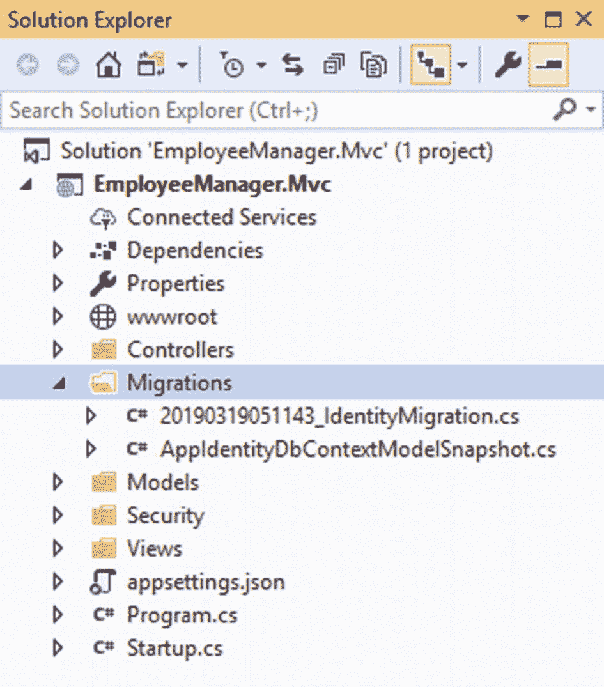

图 3-14

包含 EF 核心迁移相关文件的迁移文件夹

你不需要篡改这些文件。EF 核心迁移使用它们。接下来，在开发人员命令提示符下发出以下命令:

```cs
> dotnet ef database update --context AppIdentityDbContext

```

该命令通过添加特定于 ASP.NET Core Identity 的表来更新底层数据库。调用该命令后，如果看到 Northwind 数据库，您会发现数据库中添加了一些新表。图 [3-15](#Fig15) 显示了这些表格。

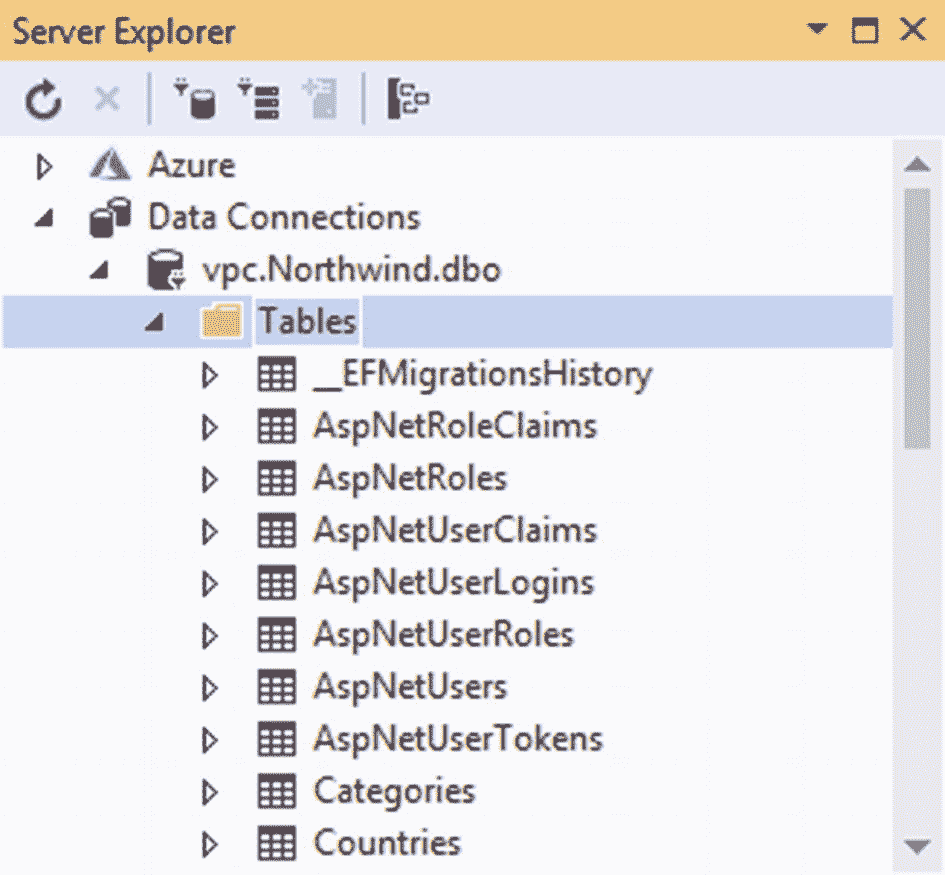

图 3-15

ASP.NET Core 标识相关表

请注意以“AspNet”开头的表，如 AspNetUsers 和 AspNetRoles。ASP.NET Core Identity 认证使用这些表来存储用户和角色信息。

### 将 SecurityController 添加到控制器文件夹中

现在，您已经将 ASP.NET Core Identity 连接并配置到员工管理器中，您可以继续创建注册页面和登录页面。但是，在这之前，您需要添加一个控制器-`SecurityController`,它包含必要的动作。

右键单击 Controllers 文件夹，使用 Add New Item 对话框添加一个名为`SecurityController`的新控制器类。清单 [3-32](#PC39) 显示了`SecurityController`的骨架。

```cs
public class SecurityController : Controller
{

    private readonly UserManager<AppIdentityUser> userManager;
    private readonly RoleManager<AppIdentityRole> roleManager;
    private readonly SignInManager<AppIdentityUser> signinManager;

    public SecurityController(UserManager<AppIdentityUser> userManager, RoleManager<AppIdentityRole> roleManager,
    SignInManager<AppIdentityUser> signinManager)
    {
        this.userManager = userManager;
        this.roleManager = roleManager;
        this.signinManager = signinManager;
    }

    public IActionResult Register()
    {
    }

    [HttpPost]
    public IActionResult Register(Register obj)
    {
    }

    public IActionResult SignIn()
    {
    }

    [HttpPost]
    public IActionResult SignIn(SignIn obj)
    {
    }

    [HttpPost]
    public IActionResult SignOut()
    {
    }
}

Listing 3-32Skeleton of SecurityController

```

`SecurityController`包含五个动作和一个构造函数。该类分别声明了三个类型为`UserManager<TUser>`、`RoleManager<TRole>`和`SignInManager<TUser>,`的成员变量。`UserManager`类允许您执行以用户为中心的操作，比如创建用户帐户和修改用户详细信息。`RoleManager`类允许您管理应用角色，并允许您在系统中创建或删除角色。`SignInManager`类允许您验证用户并发布前面讨论过的认证 cookie。

`UserManager`、`RoleManager`和`SignInManager`对象被注入到`SecurityController`的构造函数中，并被本地存储到之前声明的变量中。

用户注册由两个`Register()`动作处理，而用户认证和登录由两个`SignIn()`动作处理。`SignOut()`动作将用户从系统中注销。

以下章节将讨论`Register()`、`SignIn()`和`SignOut()`动作。

### 创建用户注册页面

“用户注册”页面允许您创建用户帐户。然后，您可以使用创建的帐户登录系统(图 [3-16](#Fig16) )。

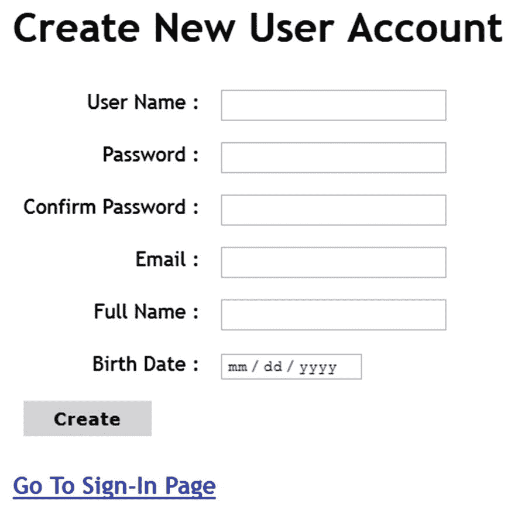

图 3-16

用户注册页面

要创建用户注册页面，您需要一个名为 Register 的视图模型类、两个`Register()`动作和 Register 视图。

右键单击 Models 文件夹，并使用 Add New Item 对话框向该文件夹添加一个名为 Register 的新类。清单 [3-33](#PC40) 显示了寄存器类。

```cs
public class Register
{
    [Required]
    [Display(Name = "User Name")]
    public string UserName { get; set; }

    [Required]
    [Display(Name = "Password")]
    public string Password { get; set; }

    [Required]
    [Compare("Password")]
    [Display(Name = "Confirm Password")]
    public string ConfirmPassword { get; set; }

    [Required]
    [Display(Name = "Email")]
    [EmailAddress]
    public string Email { get; set; }

    [Required]
    [Display(Name = "Full Name")]
    public string FullName { get; set; }

    [Required]
    [Display(Name = "Birth Date")]
    public DateTime BirthDate { get; set; }
}

Listing 3-33Register class

```

`Register`类包含六个属性，即`UserName`、`Password`、`ConfirmPassword`、`Email`、`FullName`和`BirthDate`。这些属性也用数据注释来修饰。注意添加到`ConfirmPassword`属性中的`[Compare]`属性。`[Compare]`属性指定了一个与底层属性(ConfirmPassword)进行比较的属性(Password)。如果它们不匹配，就会生成验证错误。还要注意添加在 Email 属性之上的`[EmailAddress]`属性，以确保只有有效的电子邮件地址可以分配给它。

现在，转到`SecurityController`并添加两个`Register()`动作，如清单 [3-34](#PC41) 所示。

```cs
public IActionResult Register()
{
    return View();
}

[HttpPost]
public IActionResult Register(Register obj)
{
    if (ModelState.IsValid)
    {

        if (!roleManager.RoleExistsAsync("Manager").Result)
        {
           AppIdentityRole role = new AppIdentityRole();
           role.Name = "Manager";
           role.Description = "Can perform CRUD operations.";
           IdentityResult roleResult =
           roleManager.CreateAsync(role).Result;
        }

        AppIdentityUser user = new AppIdentityUser();
        user.UserName = obj.UserName;
        user.Email = obj.Email;
        user.FullName = obj.FullName;
        user.BirthDate = obj.BirthDate;

        IdentityResult result = userManager.CreateAsync
        (user, obj.Password).Result;

        if (result.Succeeded)
        {
            userManager.AddToRoleAsync(user, "Manager").Wait();
            return RedirectToAction("SignIn", "Security");
        }
        else
        {
            ModelState.AddModelError("", "Invalid user details!");
        }
    }
    return View(obj);
}

Listing 3-34Register() action creates a new user account

```

当您从登录页面(稍后讨论)单击创建新用户帐户链接时，将调用第一个`Register()`。它只是显示一个空白的用户注册页面，准备接受新用户的详细信息。

当您通过输入用户详细信息并单击 Create 按钮提交用户注册页面时，将调用第二个`Register()`。`Register()`动作通过模型绑定接收一个注册对象。

在内部，代码使用`ModelState`的`IsValid`属性检查模型是否包含有效数据。如果模型包含有效值，代码将继续创建新的用户帐户。

在继续创建新的用户帐户之前，代码需要创建一个名为 Manager 的系统角色。因此，`RoleManager`类使用`RoleExistsAsync()`方法检查系统中是否存在经理角色。`UserManager`、`RoleManager`和`SignInManager`类是为异步操作设计的。所以`RoleExistsAsync()`是异步调用。访问`Result`属性等待异步调用完成，并允许您检查它的布尔返回值。

当您第一次运行应用时，系统中不会出现经理角色，因此`RoleExistsAsync()`将返回 false。然后，代码继续创建一个新的`AppIdentityRole`对象，并将其`Name`属性设置为 Manager。还为`Description`属性分配了一个关于该角色的简短描述。然后调用`RoleManager`的`CreateAsync()`方法在系统中创建角色。

### 注意

在这里，您可以在用户注册时创建经理角色。您也可以在应用初始化时创建它。在更现实的情况下，您将拥有单独的用户管理和角色管理页面，允许您创建角色、删除角色以及向用户分配角色。

为了创建一个新的用户帐户，代码创建了一个新的对象`AppIdentityUser`。`AppIdentityUser`代表持有`UserName`、`Email`、`FullName`、`BirthDate`等各种详细信息的系统用户。

要创建一个新的用户帐户，需要调用`UserManager`的`CreateAsync()`方法。`CreateAsync()`接受两个参数。第一个参数是代表新系统用户的`AppIdentityUser`对象，第二个参数是密码。`CreateAsync()`方法是一个异步调用。然而，因为`Register()`动作不是异步的，所以代码调用`Result`属性来等待操作的结果。

完成后，`CreateAsync()`返回一个 IdentityResult 对象，一个表示标识操作结果的对象。如果用户账号创建成功，`IdentityResult`的`Succeeded`属性返回 true 否则，它返回 false。

如果帐户创建成功，代码会将新创建的用户添加到经理角色中。这是使用`UserManager`的`AddToRoleAsync()`方法完成的。`AddToRoleAsync()`接受`AppIdentityUser`对象和一个角色名(在本例中是经理)。属于经理角色的用户可以在 Employees 表上执行 CRUD 操作。`Wait()`方法等待异步操作完成。

然后，用户被重定向到登录页面，在这里他可以用新创建的帐户登录到系统。

如果由于某些原因，用户帐户创建失败，那么使用`AddModelError()`方法向`ModelState`对象添加一个错误。此错误将显示在注册页面上。

现在`Register()`动作已经完成，您可以继续添加注册视图。为此，在 Views 文件夹下添加一个名为 Security 的子文件夹，并向其中添加一个名为 Register.cshtml 的新 Razor 视图。然后将清单 [3-35](#PC42) 中所示的标记写入 Register.cshtml 文件。

```cs
@model Register

<h1>Create New User Account</h1>
<form asp-controller="Security" asp-action="Register" method="post">
    <table>
    </table>
    <div asp-validation-summary="All" class="message"></div>
    <h3>
       <a asp-controller="Security" asp-action="SignIn">
         Go To Sign-In Page
       </a>
    </h3>
</form>

Listing 3-35Markup of Register.cshtml

```

Register 类充当 Register 视图的模型，由`@model`指令指定。

表单标签助手将`asp-controller`和`asp-action`属性分别设置为`Security`和`Register,`。方法属性设置为 post。这表明表单将被提交到安全控制器的`Register()`动作。

位于

<form>内的包含所有表单字段(稍后讨论)。请注意表格下方的元素形式的验证摘要标记帮助器。验证摘要标记帮助程序显示表单中出现的错误消息列表。`asp-validation-summary`属性被设置为`All`,表示将显示所有验证错误。

</form>

### 注意

验证消息标签帮助器为所考虑的字段显示错误消息。另一方面，Validation Summary Tag Helper 显示该表单中出现的错误消息的集合列表。

位于页面底部的 Anchor Tag Helper 呈现了一个到登录页面的链接。

清单 [3-36](#PC43) 显示了进入<表>元素内部的各种表单字段。

```cs
<tr>
    <td class="right"><label asp-for="UserName"></label> :</td>
    <td class="left"><input type="text" asp-for="UserName" /></td>
</tr>
<tr>
    <td class="right"><label asp-for="Password"></label> :</td>
    <td class="left"><input type="password" asp-for="Password" /></td>
</tr>
<tr>
    <td class="right"><label asp-for="ConfirmPassword"></label> :</td>
    <td class="left"><input type="password" asp-for="ConfirmPassword" /></td>
</tr>
<tr>
    <td class="right"><label asp-for="Email"></label> :</td>
    <td class="left"><input type="text" asp-for="Email" /></td>
</tr>
<tr>
    <td class="right"><label asp-for="FullName"></label> :</td>
    <td><input type="text" asp-for="FullName" /></td>
</tr>
<tr>
    <td class="right"><label asp-for="BirthDate"></label> :</td>
    <td class="left"><input type="date" asp-for="BirthDate" /></td>
</tr>
<tr>
    <td colspan="2">
        <button type="submit">Create</button>
    </td>
</tr>

Listing 3-36Registration form fields

```

该标记负责为用户名、电子邮件、密码、确认密码、全名和生日等字段呈现各种输入文本框。请注意，密码和确认密码字段的类型设置为密码。我们不会深入这个标记的细节，因为它非常简单明了。

### 创建登录页面

登录页面允许用户登录系统，如图 [3-17](#Fig17) 所示。

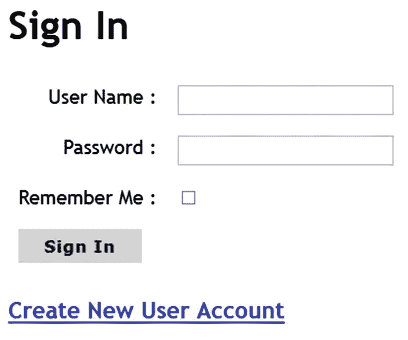

图 3-17

登录页面

登录页面由两个输入文本框组成，用于输入用户名和密码。“记住我”复选框用于指示即使在关闭浏览器后是否仍应保留登录状态。

要创建登录页面，您需要一个`SignIn`模型、两个`SignIn()`动作和一个登录视图。首先将`SignIn`模型类添加到模型文件夹中(清单 [3-37](#PC44) )。

```cs
public class SignIn
{
    [Required]
    [Display(Name = "User Name")]
    public string UserName { get; set; }

    [Required]
    [Display(Name = "Password")]
    public string Password { get; set; }

    [Required]
    [Display(Name = "Remember Me")]
    public bool RememberMe { get; set; }
}

Listing 3-37SignIn model class

```

`SignIn`模型类包含三个属性，即`UserName`、`Password`和`RememberMe`。这些属性不言自明，因此不再详细讨论。

然后打开`SecurityController`并将清单 [3-38](#PC45) 中所示的代码写入其中。

```cs
public IActionResult SignIn()
{
    return View();
}

[HttpPost]
public IActionResult SignIn(SignIn obj)
{
    if (ModelState.IsValid)
    {
        var result = signinManager.PasswordSignInAsync
        (obj.UserName, obj.Password,
            obj.RememberMe, false).Result;

        if (result.Succeeded)
        {
            return RedirectToAction("List", "EmployeeManager");
        }
        else
        {
            ModelState.AddModelError("", " Invalid user details!");
        }
    }
    return View(obj);
}

Listing 3-38SignIn() actions

```

当用户导航到登录页面时，调用第一个`SignIn()`动作。通常，当用户启动应用时，会被导航到登录页面。`SignIn()`动作只是在浏览器中呈现登录视图。

当用户单击登录页面上的登录按钮时，调用第二个`SignIn()`。这个动作接收用户以一个`SignIn`对象的形式输入的登录凭证。

在内部，代码检查模型对象是否包含有效值。这是使用`ModelState`的`IsValid`属性完成的。如果模型包含有效值，代码会通过调用`PasswordSignInAsync()`异步方法尝试让用户登录系统。`PasswordSignInAsync()`接受四个参数。前三个参数代表`UserName`、`Password`和`RememberMe`值。第四个参数指示如果登录尝试失败是否锁定帐户。我们不想锁定帐户，因此传递了 false。注意`RememberMe`是一个布尔值。传递 true 表示即使在关闭浏览器后也应该保留认证 cookie，而传递 false 表示一旦关闭浏览器就应该销毁认证 cookie。

`PasswordSignInAsync()`的返回值是一个`SignInResult`对象。`SignInResult`的`Succeeded`属性表示登录操作是否成功。如果登录成功，代码将控制重定向到`EmployeeManagerController`的`List()`动作；否则，一条错误消息被添加到`ModelState`中，以便向用户显示。

现在，将 SignIn.cshtml 视图文件添加到视图➤安全文件夹中，并编写清单 [3-39](#PC46) 中所示的标记。

```cs
@model SignIn

<h1>Sign In</h1>
<form asp-controller="Security" asp-action="SignIn" method="post">
    <table>
        <tr>
          <td class="right"><label asp-for="UserName"></label> :</td>
          <td class="left"><input type="text" asp-for="UserName" /></td>
        </tr>
        <tr>
           <td class="right"><label asp-for="Password"></label> :</td>
           <td class="left"><input type="password"
                             asp-for="Password" /></td>
        </tr>
        <tr>
           <td class="right"><label asp-for="RememberMe"></label> :</td>
           <td class="left"><input type="checkbox"
                             asp-for="RememberMe" /></td>
        </tr>
        <tr>
            <td colspan="2">
                <button type="submit">Sign In</button>
            </td>
        </tr>
    </table>
    <div asp-validation-summary="All" class="message"></div>

    <h3><a asp-controller="Security" asp-action="Register">Create New User Account</a></h3>
</form>

Listing 3-39Markup of the SignIn.cshtml view file

```

`@model`指令将视图的模型类型设置为`SignIn`。表单标签助手将签到表单提交给`SecurityController`的`SignIn()`动作。

用户名、密码和 RememberMe 的输入表单字段包含在元素中。在底部，放置了一个验证摘要标记助手来显示所有的错误消息。位于页面底部的锚标记帮助器将用户导航到用户注册页面。

### 注意

SecurityController 还包含 AccessDenied()操作，该操作在无法向用户授予访问权限的情况下返回 AccessDenied 视图。AccessDenied 操作和 AccessDenied 视图非常简单，因此这里不做讨论。你可以从这本书的源代码中得到它们。

### 添加注销按钮

现在，用户注册和登录功能已经就绪，让我们完成注销功能。用户只有在登录系统后才能退出系统。为了启动注销操作，所有页面(列表、插入、更新和删除)都在底部显示一个注销按钮(图 [3-18](#Fig18) )。


图 3-18

页面底部显示的注销按钮

由于注销按钮在多个页面中是通用的，所以最好将其添加到站点的布局中。所以从共享文件夹打开 _Layout.cshtml。在布局底部添加清单 [3-40](#PC47) 中所示的代码和标记。

```cs
<body>
    <h1>
        Employee Manager
    </h1>
    <hr />
    <div>
        @RenderBody()
    </div>
    <br />
    <hr />
    @if (User.Identity.IsAuthenticated)
    {
        <h2>You are signed in as @User.Identity.Name</h2>
        <form asp-controller="Security" asp-action="SignOut" method="post">
            <button type="submit">Sign Out</button>
        </form>
    }
</body>

Listing 3-40Adding the Sign Out button

```

请注意用粗体字母标记的代码。Razor if 语句检查当前请求是否来自经过认证的用户。这是使用`IsAuthenticated`属性完成的。只有当用户是经过认证的用户时，才会显示`UserName`和注销按钮(IsAuthenticated 返回 true)。

Razor 视图的`User`属性代表当前应用用户。`User.Identity.Name`属性返回当前登录系统的用户的`UserName`。登出按钮将表单提交给`SecurityController`的`SignOut()`动作。`SignOut()`动作如清单 [3-41](#PC48) 所示。

```cs
[HttpPost]
public IActionResult SignOut()
{
    signinManager.SignOutAsync().Wait();
    return RedirectToAction("SignIn", "Security");
}

Listing 3-41SignOut() action

```

`SignOut()`动作调用了`SignInManager`类的`SignOutAsync()`方法。`SignOutAsync()`方法通过删除认证 cookie 将当前用户从应用中注销。控制被重定向到`SecurityController`的`SignIn()`动作，以便再次向用户显示登录页面。

### 验证和授权用户

在前面的小节中，您构建了实现用户认证和授权所需的基础设施。但是，您还没有应用基础设施。在本节中，您可以这样做。

在 ASP.NET Core MVC 中，认证是在动作级完成的。这是因为动作是从浏览器中调用的(阅读关于路由的讨论)。这意味着您可以决定某个操作是否需要防止匿名用户的攻击。默认情况下，动作不受保护，甚至未经验证的用户也可以调用它们。为了保护一个动作，您用`[Authorize]`属性来修饰它。属性能够对用户进行认证和授权。

### 注意

认证是决定用户是否是他所声称的那个人的过程。授权是决定经过认证的用户可以对系统进行哪些操作的过程。授权通常使用所谓的基于角色的安全性来实现。从前面的讨论中可以明显看出，授权是在认证之后进行的。

在 Employee Manager 应用中，您希望保护参与 CRUD 操作的所有操作。这些包括`EmployeeManagerController`的所有动作。所以打开`EmployeeManagerController`，用`[Authorize]`属性装饰所有的动作。清单 [3-42](#PC49) 以`List()`动作为例。

```cs
[Authorize(Roles = "Manager")]
public IActionResult List()
{
    List<Employee> model = (from e in db.Employees
                            orderby e.EmployeeID
                            select e).ToList();
    return View(model);
}

Listing 3-42List() action decorated with the [Authorize] attribute

```

注意代码是如何使用来自`Microsoft.AspNetCore.Authorization`名称空间的`[Authorize]`属性的。它有双重目的。首先，在`List()`上添加`[Authorize]`确保了这个动作。其次，`[Authorize]`属性的`Roles`属性被设置为 Manager。这意味着只有属于经理角色的经过认证的用户才能调用此操作。`Roles`属性接受一个逗号分隔的角色字符串，这些角色被授权访问该操作。在本例中，只涉及到经理角色，但是您可以通过用逗号分隔来轻松地指定多个角色。

在前面的讨论中，您在`EmployeeManagerController`的所有动作上添加了`[Authorize]`。但是，有一条捷径。你也可以在控制器类的顶部添加`[Authorize]`。这样做可以保护控制器的所有操作。清单 [3-43](#PC50) 展示了如何做到这一点。

```cs
[Authorize(Roles = "Manager")]
public class EmployeeManagerController : Controller
{
  ...
}

Listing 3-43Adding [Authorize] on EmployeeManagerController

```

还有一个属性`– [AllowAnonymous]`——允许匿名访问底层动作。例如，考虑一个名为`Help()`的假设动作，它在浏览器中显示一个帮助页面，并且不需要安全性。如果控制器增加了`[Authorize]`属性，`Help()`也会被保护。在这种情况下，您可以像这样在`Help()`动作上添加`[AllowAnonymous]`:

```cs
[AllowAnonymous]
public IActionResult Help()
{
  ...
}

```

### 保护应用免受跨站点请求伪造

在前面几节中，您保护了雇员管理器应用免受未经授权的访问。尽管应用按预期运行，但在本节中，您将保护它免受跨站点请求伪造(CSRF 或 XSRF)攻击。

### 注意

当恶意 web 应用触发浏览器与信任该浏览器的另一个 web 应用之间的交互时，就会发生跨站点请求伪造攻击。欲了解更多关于 CSRF 袭击的信息，请访问 [`https://docs.microsoft.com/en-us/aspnet/core/security/anti-request-forgery`](https://docs.microsoft.com/en-us/aspnet/core/security/anti-request-forgery) 。

考虑雇员经理应用。假设您通过提供有效的用户名和密码登录到应用。认证过程中发布的认证 cookie 会随着每个请求在客户端浏览器和服务器之间传递。换句话说，员工经理现在信任浏览器。在 CSRF 攻击期间，应用和浏览器之间建立的信任被利用。例如，在同一个浏览器中运行的一些恶意 web 应用可能会在您没有注意和同意的情况下向员工经理发送 CRUD 请求(可能是通过复杂的表单提交、自动化脚本或任何此类技术)。此类请求将由员工经理执行，因为它们包含有效的认证 cookie。幸运的是，ASP.NET Core 提供了一种简单的方法来保护您的 web 应用免受 CSRF 攻击。如果你运行这个应用(你可能需要注释掉来自`EmployeeManagerController`的`[Authorize]`属性，因为你还没有创建用户),并且观察浏览器的 HTML 源代码来插入、更新或删除页面，你会发现一个隐藏的表单域自动为你生成(图 [3-19](#Fig19) )。

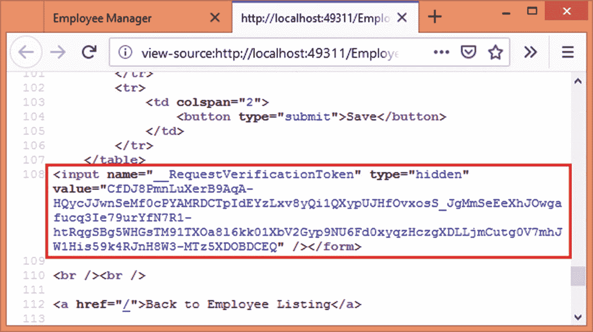

图 3-19

由表单标记帮助程序生成的防伪标记

当表单提交方法是 POST 时，表单标记帮助程序会自动生成这个隐藏的表单字段。这个隐藏的表单域称为防伪标记。为了防止 CSRF 攻击，您应该在代码中检查所有对操作的 POST 请求是否包含这个由服务器发出的令牌。为了实施这个条件，您使用了`[ValidateAntiForgeryToken]`属性。清单 [3-44](#PC52) 显示了用`[ValidateAntiForgeryToken]`修饰的`Register()`和`SignIn()`岗位动作。

```cs
[HttpPost]
[ValidateAntiForgeryToken]
public IActionResult Register(Register obj)
{
  ...
}

[HttpPost]
[ValidateAntiForgeryToken]
public IActionResult SignIn(SignIn obj)
{
  ...
}

Listing 3-44Adding the [ValidateAntiForgeryToken] attribute

```

继续将`[ValidateAntiForgeryToken]`属性添加到`EmployeeManagerController`和`SecurityController`的所有 POST 操作之上。

## 运行应用

员工经理应用现在已经完成。您可以运行应用，并检查用户帐户创建、登录、注销和 CRUD 操作是否可以按预期执行。为了方便起见，下面给出了涉及的一系列步骤:

*   运行应用，并确保进入登录页面。

*   单击登录页面上的创建新用户帐户链接，并导航到用户注册页面。

*   通过输入各种表单字段(如用户名和密码)创建一个新的用户帐户。

*   成功创建帐户后，您将进入登录页面。

*   使用您刚刚创建的用户帐户登录。

*   如果登录成功，您将被带到员工列表页面。

*   通过添加、修改和删除新员工，探索插入、更新和删除操作。

*   单击页面底部的“退出”按钮，退出系统。

*   在 SQL Server Management Studio 中打开 Northwind 数据库的 Employees 表，并确认您的数据存在于物理数据库中。

*   打开 AspNetUsers 和 AspNetRoles 表，查看您在应用的示例运行期间创建的用户和角色。

## 摘要

在本章中，您使用 ASP.NET Core MVC 创建了雇员经理应用。您学习了创建一个实体框架核心模型。你被介绍到了`DbContext`和`DbSet`班。然后添加了`EmployeeManagerController`和几个从数据库中插入、更新和删除雇员的动作。您使用 Razor 视图和标记助手来呈现应用的用户界面。

一旦 HTML 处理和 CRUD 功能准备就绪，您就可以继续使用 ASP.NET Core Identity 来保护应用。ASP.NET Core Identity 可用于实现用户认证和授权。您学习了`UserManager`、`RoleManager`和`SignInManager`类，还学习了`[Authorize]`属性。

在下一章中，您将使用 ASP.NET Core Razor 页面构建雇员管理器应用。