# 四、ASP.NET Core Blazor 页面

在这个版本的员工管理器中，您使用 ASP.NET Core Blazor 页。用户界面是使用标记助手构建的。使用数据注释来执行模型验证。使用实体框架核心执行数据库 CRUD 操作。EF 核心模型是使用逆向工程技术构建的。使用数据注释和 Fluent API 说明了与表模式的映射。使用 ASP.NET Core Identity 认证提供用户认证和安全性。具体来说，您将学会

*   使用 Razor 页面和标签助手来构建 web 用户界面

*   使用逆向工程从现有数据库构建 EF 核心模型

*   使用 ASP.NET Core Identity 异步操作实现认证

*   使用异常处理中间件来捕获未处理的错误

## 创建 ASP.NET Core Web 应用

首先，基于空的项目模板创建一个新的 ASP.NET Core web 应用。将应用命名为 EmployeeManager。RazorPages 来指示它是应用的 Razor Pages 版本。这还会为添加到项目中的类设置默认命名空间。

### 注意

您在第 [1](01.html) 章中学习了如何创建一个新的 ASP.NET Core 项目。为了避免重复，我不打算再次解释这些步骤。阅读第 [1](01.html) 章，以防在基于空项目模板创建新的 ASP.NET Core web 应用时需要任何帮助。

因为您使用 EF 核心和 ASP.NET Core Identity，所以像在上一章中那样为这些组件添加 NuGet 包。

图 [4-1](#Fig1) 显示了 EmployeeManager。RazorPages 项目在完成后加载到解决方案资源管理器中。

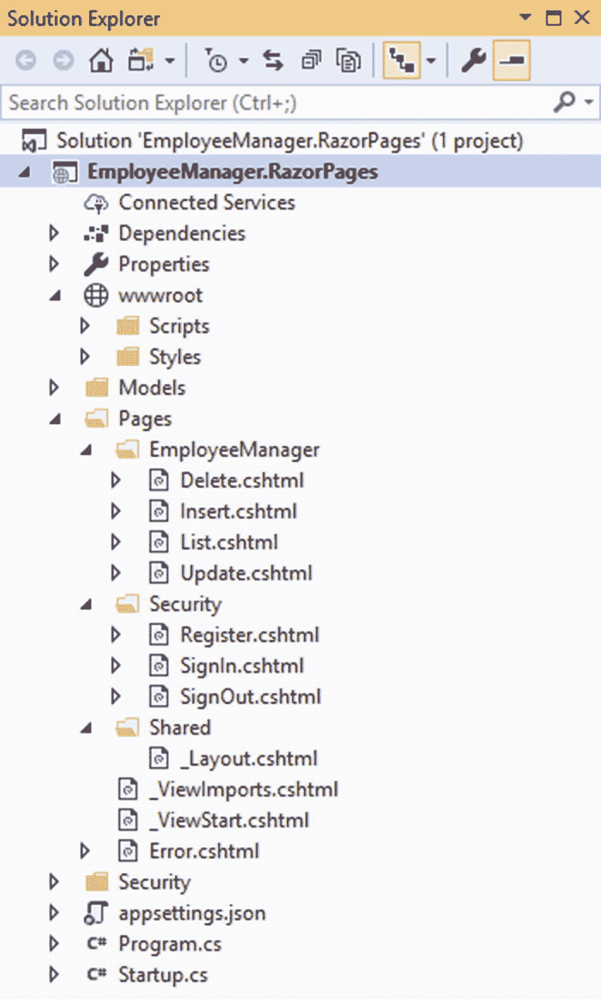

图 4-1

EmployeeManager。在解决方案资源管理器中加载的 RazorPages

此时，您可能不理解解决方案资源管理器中显示的所有部分，这没关系。只需要看一下整个项目的结构和组织。在接下来的小节中，您将逐步构建这个应用。

## 对实体框架核心模型进行逆向工程

在前一章中，您通过为实体类(`Employee`和`Country`)以及`DbContext`类(`AppDbContext`)手工创建 POCOs 来创建 EF 核心模型。如果您正在为一个现有的数据库构建一个 EF 核心模型(类似于我们的例子)，您可以使用逆向工程方法来自动创建 EF 核心模型。在这种方法中，EF 核心命令行工具读取数据库模式，并自动为您生成实体类和`DbContext`。当然，您可以修改生成的类，根据您的应用需求对它们进行微调。

### 注意

为了使用 EF 核心命令行工具，您需要安装 dotnet-ef 工具并添加 Microsoft。EntityFrameworkCore.Design 获取项目中的包。你可以阅读前一章了解相关细节。

在本节中，您将使用逆向工程方法创建 EF 核心模型。让我们看看如何做到这一点。

打开 Visual Studio 开发人员命令提示符，并导航到项目根文件夹。然后在命令提示符下发出以下命令:

```cs
> dotnet ef dbcontext scaffold
  "Server=.;Database=Northwind;Integrated Security=true;"
  Microsoft.EntityFrameworkCore.SqlServer
  -o Models
  -c AppDbContext
  -t Employees
  -t Countries

```

这里，您使用 EF Core scaffold 命令来生成 DbContext 类和实体类。该命令采用数据库连接字符串和数据提供者名称。连接字符串指向 Northwind 数据库。确保根据您的开发设置更改连接字符串。因为您使用的是 SQL Server，所以提供者被指定为`Microsoft.EntityFrameworkCore.SqlServer`。

`-o`选项用于指定放置所有类文件的输出文件夹。在本例中，您将输出存储在项目根目录下的 Models 文件夹中。如果文件夹不存在，该命令会为您创建一个。`-c`选项指定了生成的`DbContext`类的名称。在这种情况下，`DbContext`类被命名为`AppDbContext`。`-t`选项用于指定其实体类将被逆向工程的表名。在本例中，我们要求该工具对雇员和国家表进行逆向工程。如果不指定`-t`开关，那么将为数据库中的所有表生成实体类。图 [4-2](#Fig2) 显示了运行命令后生成的类。

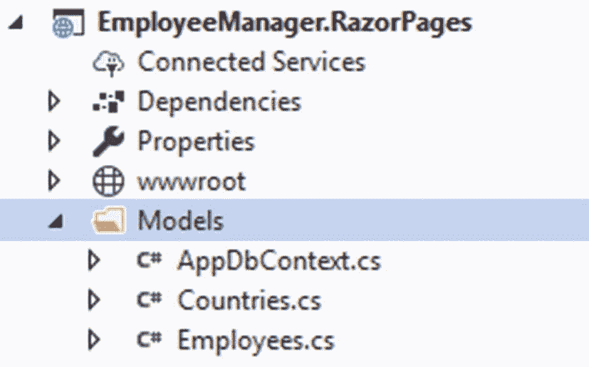

图 4-2

使用逆向工程生成 EF 核心模型

让我们快速检查一下这些类文件的内容。打开 Countries 类，您应该会发现它类似于清单 [4-1](#PC2) 。

```cs
public partial class Countries
{
    public int CountryId { get; set; }
    public string Name { get; set; }
}

Listing 4-1Countries entity class

```

注意，类名是`Countries`，与数据库表的名称相同。`Countries`类被标记为分部类。另外，请注意,`CountryId`和 Name 属性是基于 Countries 表的列名生成的。

现在打开`Employees`类来揭示它的内容。清单 [4-2](#PC3) 显示了雇员类的一部分。

```cs
public partial class Employees
{
    public Employees()
    {
        InverseReportsToNavigation = new HashSet<Employees>();
    }
    public int EmployeeId { get; set; }
    public string LastName { get; set; }
    public string FirstName { get; set; }
    public string Title { get; set; }
    public string TitleOfCourtesy { get; set; }
    public DateTime? BirthDate { get; set; }
    public DateTime? HireDate { get; set; }
    ...
    ...
}

Listing 4-2Employees entity class

```

`Employees`类被标记为分部类，根据 Employees 表的列包含几个属性。注意，`BirthDate`和`HireDate`列允许空值，因此它们的类型是 DateTime？。

`Countries`和`Employees`类不使用数据注释将它们映射到底层的表和列。这是因为该工具默认使用 Fluent API 来执行所需的映射。

### 注意

实体框架核心 Fluent API 是一种用于配置实体类的技术。Fluent API 或 Fluent 接口使用方法链来执行一系列操作以获得结果。

要查看如何使用 Fluent API 来执行映射，请打开`AppDbContext`类并找到被覆盖的`OnModelCreating()`方法。在这里，您会发现一系列方法调用一个接一个地链接在一起，它们配置了`Countries`和`Employees`实体类。清单 [4-3](#PC4) 展示了`OnModelCreating()`方法的一部分。

```cs
protected override void OnModelCreating(ModelBuilder modelBuilder)
{
    ...
    modelBuilder.Entity<Countries>(entity =>
    {
        entity.HasKey(e => e.CountryId)
            .HasName("PK__country__3213E83F562F253C");

        entity.Property(e => e.CountryId).HasColumnName("CountryID");

        entity.Property(e => e.Name)
            .IsRequired()
            .HasMaxLength(80)
            .IsUnicode(false);
    });
    ...
    ...
}

Listing 4-3OnModelCreating() contains Fluent API calls

```

我们不会在本书中深入讨论 Fluent API 代码的细节。知道这是配置实体类的一种方式就足够了。

您刚刚使用逆向工程生成了使用 Fluent API 进行映射和配置的 EF 核心模型。如果想用数据标注代替 Fluent API 怎么办？幸运的是，您可以指定在搭建期间使用数据注释，如下所示:

```cs
 > dotnet ef dbcontext scaffold
  "Server=.;Database=Northwind;Integrated Security=true;"
  Microsoft.EntityFrameworkCore.SqlServer
  -o Models
  -c AppDbContext
  -t Employees
  -t Countries
  --data-annotations

```

这一次，您在命令中添加了`--data-annotations`。这指示该工具使用数据注释而不是 Fluent API 来配置实体类。

运行前面的命令，再次在 Models 文件夹中生成类。我们来观察一下这次生成的代码。清单 [4-4](#PC6) 显示了工具生成的国家类。

```cs
public partial class Countries
{
    [Column("CountryID")]
    public int CountryId { get; set; }

    [Required]
    [StringLength(80)]
    public string Name { get; set; }
}

Listing 4-4Countries class uses data annotations

```

如您所见，`Countries`类现在使用数据注释，如`[Column]`、`[Required]`和`[StringLength]`。

现在打开`Employees`实体类来显示它的内容(清单 [4-5](#PC7) 中显示了它的一部分)。

```cs
public partial class Employees
{
    public Employees()
    {
        InverseReportsToNavigation = new HashSet<Employees>();
    }
    [Key]
    [Column("EmployeeID")]
    public int EmployeeId { get; set; }
    [Required]
    [StringLength(20)]
    public string LastName { get; set; }
    [Required]
    [StringLength(10)]
    public string FirstName { get; set; }
    ...
    ...
}

Listing 4-5Employees class using data annotations

```

为了保持 Razor Pages 版本与 MVC 版本紧密匹配，您将继续使用数据注释而不是 Fluent API。

### 注意

[Required]和[StringLength]之类的数据注释参与 UI 级验证。如果您使用 Fluent API，您需要使用一些替代技术来处理 UI 级别的验证，例如 Fluent 验证——第三方验证库。NET，它使用 Fluent 接口来构建验证规则。你可以在 [`https://fluentvalidation.net`](https://fluentvalidation.net) 了解更多关于流畅验证的信息。

但是，您需要修改生成的`Countries`和`Employees`类。因此，继续对生成的类执行以下更改:

*   将 Countries 类(和文件名)更改为 Country，并确保它包含所有数据注释和验证错误消息。

*   将 Employees 类(和文件名)更改为 Employee，并且只保留其中的这些属性:EmployeeID、FirstName、LastName、Title、BirthDate、HireDate、Country 和 Notes。此外，确保它有所有的数据注释和验证错误消息。

*   打开 AppDbContext 类，并将数据库集定义更改为使用 Country 和 Employee 类。

*   从 AppDbContext 类中移除 OnConfiguring()和 OnModelCreating()方法。

一旦你完成了这些改变，你的 EF 核心模型将会看起来和以前的版本一样(参见上一章的雇员管理器的 ASP.NET Core MVC 版本)。如您所见，逆向工程技术帮助您快速生成 EF 核心模型。尽管您经常需要对结果模型进行微调，但是如果模型包含许多实体类，这可以节省您大量的时间。

这就完成了本例所需的 EF 核心模型。

## 创建页面和 EmployeeManager 文件夹

ASP.NET Core Razor Pages 提供了一个以页面为中心的编程模型。一页(。cshtml)及其页面模型(。cs)存储在 Pages 文件夹下。您可以在不同的子文件夹中进一步组织您的 Razor 页面。默认情况下，文件夹结构还控制访问页面的 URL。例如，位于 Pages 文件夹下的名为 Page1.cshtml 的 Razor 页面可以在/Page1 访问，而位于 Pages ➤ MyFolder 文件夹下的名为 Page2 的页面可以在/MyFolder/Page2 访问。

在项目根文件夹下创建一个名为 Pages 的文件夹。还要在 Pages 文件夹下添加 EmployeeManager 子文件夹。CRUD 操作中涉及的所有文件都存储在 EmployeeManager 子文件夹下。在这个阶段，您的解决方案浏览器应该类似于图 [4-3](#Fig3) 。

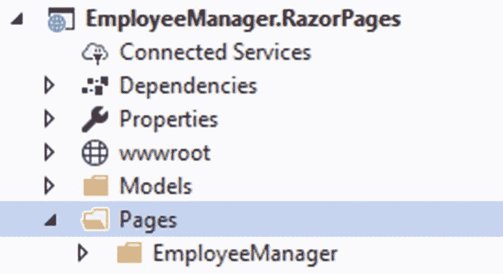

图 4-3

添加页面和 EmployeeManager 文件夹

## 添加 _ViewImports 文件

在下面的部分中，您将使用 ASP.NET Core 标签帮助程序来呈现用户界面元素，如表单、表单域和超链接。为了使用标记助手，您需要在项目中启用它们。这是使用 _ViewImports.cshtml 文件完成的。因此，将 _ViewImports.cshtml 文件添加到 Pages 文件夹中。然后将其写入 _ViewImports.cshtml 文件:

```cs
@using EmployeeManager.RazorPages
@using EmployeeManager.RazorPages.Pages
@using EmployeeManager.RazorPages.Models

@addTagHelper *, Microsoft.AspNetCore.Mvc.TagHelpers

```

前面的代码对您来说应该很熟悉，因为您在 MVC 版本的 Employee Manager 中使用过它。这里，名称空间是不同的，并且您将继续添加一些名称空间。

## 显示员工列表

要显示雇员列表(图 [4-4](#Fig4) )，您需要在 EmployeeManager 文件夹下有一个名为 List.cshtml 的 Razor 页面。

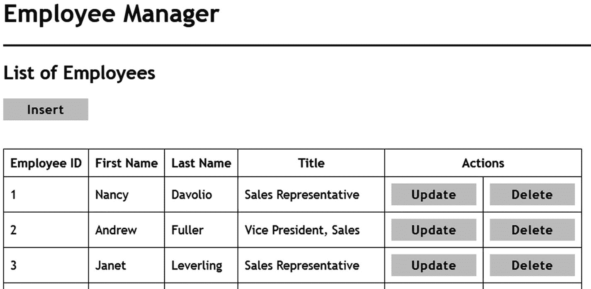

图 4-4

List.cshtml 显示雇员列表

若要添加此页，请右键单击 EmployeeManager 文件夹并打开“添加新项”对话框。然后从列表中选择 Razor Page，并将页面命名为 List.cshtml(图 [4-5](#Fig5) )。

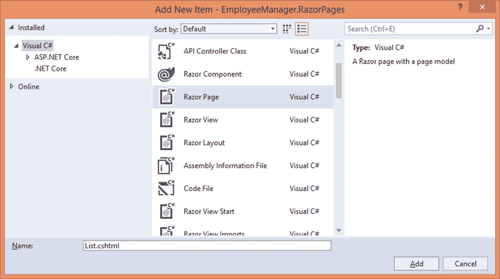

图 4-5

添加 Razor 页面

添加完成后，您会发现与 Razor 页面相关联的两个文件:List.cshtml 和 List.cshtml.cs(图 [4-6](#Fig6) )。

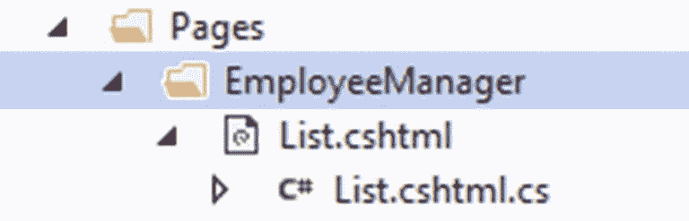

图 4-6

Razor 页面和页面模型文件

List.cshtml 是一个 Razor 文件，包含 UI 标记和代码。List.cshtml.cs 是页面模型类文件，通常包含属性和页面处理程序方法。

在 IDE 中打开 List.cshtml.cs，编写清单 [4-6](#PC9) 所示的代码。

```cs
public class ListModel : PageModel
{
    private readonly AppDbContext db = null;

    public List<Employee> Employees { get; set; }

    public ListModel(AppDbContext db)
    {
        this.db = db;
    }

    public void OnGet()
    {
        this.Employees = (from e in db.Employees orderby e.EmployeeID select e).ToList();
    }
}

Listing 4-6Page model class contains the OnGet() page handler

```

List.cshtml.cs 文件包含一个名为`ListModel`的类，它继承自`PageModel`类(`Microsoft.AspNetCore.Mvc.RazorPages`名称空间)。`ListModel`类包含一个`AppDbContext`类型的成员变量。`AppDbContext`是通过构造函数注入的，存储在这个成员变量中。

属性用来保存数据库中所有实体的列表。在呈现雇员列表时，可以从 List.cshtml 页面访问`Employees`页面模型属性。

从`OnGet()`方法中分配`Employees`属性。`OnGet()`被称为页面处理程序，处理页面的 GET 请求。如果您想要处理 POST 请求，那么您应该创建`OnPost()`页面处理程序方法(您将在插入、更新和删除页面中执行该操作)。

在`OnGet()`中，代码选择所有的雇员实体并将它们存储到一个列表中。

现在，打开 List.cshtml 文件，将清单 [4-7](#PC10) 中的代码写入其中。

```cs
@page

@model ListModel

<h2>List of Employees</h2>

<h3>@TempData["Message"]</h3>

<a asp-page="Insert" class="linkbutton">Insert</a>

<br /><br />

<table border="1">
    <tr>
        <th>Employee ID</th>
        <th>First Name</th>
        <th>Last Name</th>
        <th>Title</th>
        <th colspan="2">Actions</th>
    </tr>
    @foreach (var item in Model.Employees)
    {
        <tr>
            <td>@item.EmployeeID</td>
            <td>@item.FirstName</td>
            <td>@item.LastName</td>
            <td>@item.Title</td>
            <td>
                <a asp-page="Update"
                   asp-route-id="@item.EmployeeID"
                   class="linkbutton">Update</a>
            </td>
            <td>
                <a asp-page="Delete"
                   asp-route-id="@item.EmployeeID" class="linkbutton">Delete</a>
            </td>
        </tr>
    }
</table>

Listing 4-7List.cshtml renders a list of employees

```

List.cshtml 以`@page`指令开始。`@page`指令将文件标记为 Razor 页面，应该是文件的第一行。在`@page`指令之后是`@model`指令，它指定了这个 Razor 页面的页面模型类(`ListModel`)。

页面标题下方，输出`TempData["Message"]`。`TempData["Message"]`是在删除操作过程中设置的，当您创建 Delete Razor 页面时将被清除。

锚标记帮助器呈现一个指向插入新员工 Razor 页面的超链接。锚点标签辅助对象的`asp-page`属性指向要导航到的 Razor 页面。

员工数据呈现在中。for 循环遍历雇员列表。注意如何使用 Razor 页面的`Model`属性访问`Employees`页面模型属性。然后，代码输出`EmployeeID`、`FirstName`、`LastName`和`Title`属性来生成各种表格行。

在每一行的末尾，有两个超链接:更新和删除。它们使用锚标记辅助对象进行渲染。`asp-page`和`asp-route-id`属性分别指向目标 Razor 页面(更新现有员工和删除现有员工页面)和`EmployeeID,`。

这就完成了 List Razor 页面。

## 插入新员工

单击员工列表页面上的插入链接，您将进入另一个页面，您可以在其中插入新员工(图 [4-7](#PC10) )。

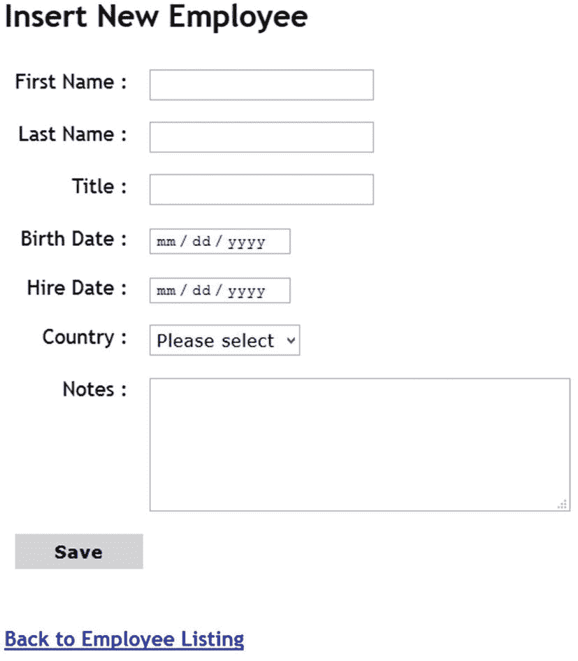

图 3-7

插入新员工

要创建此页面，请将 Insert.cshtml Razor 页面添加到 Pages ➤ EmployeeManager 文件夹。然后打开它的页面模型类文件——insert . cshtml . cs——并编写清单 [4-8](#PC11) 中的代码。

```cs
public class InsertModel : PageModel
{
    private readonly AppDbContext db = null;
       public string Message { get; set; }

    [BindProperty]
    public Employee Employee { get; set; }
    public List<SelectListItem> Countries { get; set; }

    public InsertModel(AppDbContext db)
    {
        this.db = db;
    }

    public void FillCountries()
    {
        List<SelectListItem> countries = (from c in db.Countries
                                                 select new SelectListItem()
                                                 { Text = c.Name,
                                                   Value = c.Name }).ToList();
        this.Countries = countries;
    }
    ...
    ...
  }

Listing 4-8Member variables and properties of InsertModel

```

代码声明了一个类型为`AppDbContext`的变量`db`。`AppDbContext`通过构造函数注入并存储在这个变量中。`Message`字符串属性表示在插入新员工时向用户显示的成功或错误消息。

请注意`Employee`属性。它是用`[BindProperty]`属性修饰的。`[BindProperty]`属性表明所考虑的属性将从模型绑定中获取其值。插入新员工时，填写各种表单字段，然后单击保存按钮提交值。此时，由于`[BindProperty]`属性的存在，表单字段值被映射到`Employee`的属性。

`Countries`属性保存一个`List<SelectListItem>`,用于在国家下拉列表中显示。`Country`属性是从一个助手方法—`FillCountries()`中分配的。

`FillCountries()`方法查询 Countries 表并检索所有国家。国家填充在一个`SelectListItem`对象列表中，这样它们就可以显示在选择标签帮助器中。

现在，将`OnGet()`和`OnPost()`页面处理程序添加到页面模型类中，如清单 [4-9](#PC12) 所示。

```cs
public void OnGet()
{
    FillCountries();
}

public void OnPost()
{
    FillCountries();

    if (ModelState.IsValid)
    {
        try
        {
            db.Employees.Add(Employee);
            db.SaveChanges();
            Message = "Employee inserted successfully!";
        }
        catch(DbUpdateException ex1)
        {
            Message = ex1.Message;
            if(ex1.InnerException!=null)
            {
                Message += " : " + ex1.InnerException.Message;
            }
        }
        catch(Exception ex2)
        {
            Message = ex2.Message;
        }
    }
}

Listing 4-9OnGet() and OnPost() page handlers

```

当最初通过单击插入链接请求页面时，会调用`OnGet()`页面处理程序。它只是调用`FillCountries()` helper 方法来准备一个国家列表。

为 POST 请求调用`OnPost()`页面处理程序。在这个例子中，当您点击保存按钮时，<表单>被提交。在里面，你再叫`FillCountries()`。代码检查`ModelState`对象的`IsValid`属性，以检查所有的模型验证是否成功。如果模型验证成功，代码将尝试插入一个新雇员。

这是通过调用`AppDbContext`的`Add()`方法并提供`Employee`对象来完成的。回想一下，返回该对象的`Employee`属性是通过模型绑定填充的。`Add()`将新的`Employee`添加到 Employees 数据库集中。`SaveChanges()`方法将更改保存到数据库中。成功消息被设置到 message 属性中，并呈现在页面上。

整个数据访问代码被包装在一个`try-catch`块中。如果数据库操作由于某种原因失败，那么 EF Core 会引发`DbUpdateException`异常。`InnerException`属性给出了更具体的错误信息。然后一条错误消息被存储在`Message`属性中并显示给用户。这里，代码向最终用户显示实际的错误消息。在更现实的情况下，您可能希望向用户显示友好的消息，并将实际的错误记录到日志文件中。

现在您已经知道了页面模型是由什么组成的，让我们看看 UI 标记和代码是什么样子的。清单 [4-10](#PC13) 展示了 Insert.cshtml 文件的框架。

```cs
@page
@model InsertModel

<h2>Insert New Employee</h2>

<h3 class="message">@Model.Message</h3>

<form method="post">
    <table border="0">
      ...
      ...
    </table>
</form>

<a asp-page="List">Back to Employee Listing</a>

Listing 4-10Skeleton of Insert.cshtml

```

Insert.cshtml 以`@page`指令开始。在`@page`指令之后是`@model`指令，它将页面模型设置为`InsertModel`。页面模型的`Message`变量中的成功或错误信息通过`Model`对象输出。

请注意表单标记帮助器。它只是将方法属性设置为 POST。这是因为默认情况下表单被提交到同一个 Razor 页面。在这种情况下，单击 Save 按钮，表单将被提交到 Insert Razor 页面；因为表单的方法是 POST，所以将使用`OnPost()`页面处理程序来处理它。

这

element wraps all the form fields. This markup is quite similar to the MVC version of the application. Listing [4-11](#PC14) shows a part of the form for your understanding.

```cs
<tr>
    <td class="right">
        <label asp-for="Employee.FirstName"></label> :
    </td>
    <td>
        <input type="text" asp-for="Employee.FirstName" />
        <span asp-validation-for="Employee.FirstName" class="message"></span>
    </td>
</tr>
...
...
<tr>
    <td class="right">
        <label asp-for="Employee.Country"></label> :
    </td>
    <td>
        <select asp-for="Employee.Country" asp-items="@Model.Countries">
           <option value="">Please select</option>
        </select>
        <span asp-validation-for="Employee.Country" class="message"></span>
    </td>
</tr>

Listing 4-11Form fields rendered using Tag Helpers

```

各种标记帮助器的用法，如输入标记帮助器和验证消息标记帮助器，您应该很熟悉。但是，请注意，`asp-for`属性被设置为`Employee`页面模型属性的相应属性。例如，名文本框的`asp-for`属性被设置为`Employee.Firstname`。在同一行中，国家下拉列表的`asp-items`属性被设置为`Model`对象的`Countries`属性。

为了简洁起见，这里没有给出 Insert.cshtml 的完整标记。您可以从代码下载中获取 Insert.cshtml 文件，并完成表单字段的其余部分。

在页面底部，有一个返回到员工列表的链接。该链接是使用锚标记辅助工具生成的。

## 更新现有员工

在员工列表页面上，每个员工行都有更新和删除链接。单击“更新”链接将带您进入“更新员工”页面，该页面显示该员工的现有详细信息以供编辑(图 [4-8](#Fig8) )。

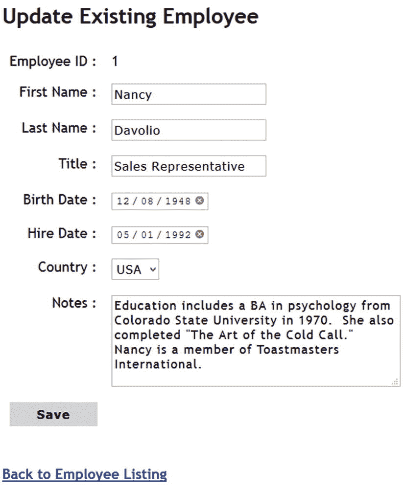

图 4-8

更新现有员工

“更新现有员工”页面看起来与“插入新员工”页面相似，不同之处在于现在用被修改员工的详细信息填充了各种控制值。作为主键的`EmployeeID`不能修改。

为了完成这个页面，您需要一个名为 Update.cshtml 的 Razor 页面，所以将 Update.cshtml 添加到➤ EmployeeManager 文件夹中。然后打开`UpdateModel`类(Update.cshtml.cs)并编写清单 [4-12](#PC15) 所示的代码。

```cs
public class UpdateModel : PageModel
{
    private readonly AppDbContext db = null;

    [BindProperty]
    public Employee Employee { get; set; }

    public List<SelectListItem> Countries { get; set; }

    public string Message { get; set; }

    public bool DataFound { get; set; } = true;

    public UpdateModel(AppDbContext db)
    {
        this.db = db;
    }
    ...
    ...
}

Listing 4-12UpdateModel members

```

这段代码与 InsertModel 类非常相似，只是声明了一个布尔属性`DataFound`。如果在数据库中找不到请求的`EmployeeID`，则该属性被赋予一个 false 值。因此，向用户显示错误消息。

虽然清单中没有显示，`FillCountries()`方法用国家列表填充了`Countries`属性。你可以从`InsertModel`类中复制`FillCountries()`助手方法。

当通过单击员工的更新链接访问更新页面时，会调用`OnGet()`处理程序。清单 [4-13](#PC16) 展示了这个页面处理程序。

```cs
public void OnGet(int id)
{
    FillCountries();

    Employee = db.Employees.Find(id);

    if (Employee == null)
    {
        this.DataFound = false;
        this.Message = "EmployeeID Not Found.";
    }
    else
    {
        this.DataFound = true;
        this.Message = "";
    }
}

Listing 4-13OnGet() page handler inside UpdateModel

```

`OnGet()`处理程序有一个 id 参数。是路线经过的`EmployeeID`。在内部，代码调用`FillCountries()`用国家列表填充 Countries 属性。然后使用 Employees DbSet 的`Find()`方法来查找指定的雇员。如果找不到雇员，那么`Find()`方法返回 null，并且`DataFound`属性被设置为 false。在`Message`页面模型变量中也设置了一条错误消息。

如果找到一个雇员，`DataFound`属性被设置为真，并且`Message`被清除。

当用户点击 Save 按钮时，`OnPost()`页面处理程序被调用。这个页面处理程序如清单 [4-14](#PC17) 所示。

```cs
public void OnPost()
{
    FillCountries();

    if (ModelState.IsValid)
    {
        try
        {
            db.Employees.Update(Employee);
            db.SaveChanges();
            Message = "Employee updated successfully!";
        }
        catch (DbUpdateException ex1)
        {
            Message = ex1.Message;
            if (ex1.InnerException != null)
            {
                Message += " : " + ex1.InnerException.Message;
            }
        }
        catch (Exception ex2)
        {
            Message = ex2.Message;
        }
    }
}

Listing 4-14OnPost() page handler of UpdateModel

```

`OnPost()`处理程序更新 Employees 数据库集中的一个雇员，并将更改保存到数据库中。这是使用`Update()`和`SaveChanges()`方法完成的。为了进行错误处理，更新操作被包装在一个`try-catch`块中。

这就完成了`UpdateModel`类。现在打开 Update.cshtml 文件，编写清单 [4-15](#PC18) 中所示的框架代码。

```cs
@page "{id:int}"
@model UpdateModel

<h2>Update Existing Employee</h2>

<h3 class="message">@Model.Message</h3>

@if (Model.DataFound)
{
<form method="post">
    <table border="0">
      ...
      ...
    </table>
</form>
}

Listing 4-15Skeleton of Update.cshtml

```

请注意用粗体字母标记的代码。这一次，`@page`指令包含一个名为`id`的路由参数。该参数出现在双引号中，并包含在{和}中。`id`路由参数也有一个路由约束，指定`id`必须是一个整数值。

if 块检查`DataFound`属性。只有当`DataFound`为真时，才呈现表单和表单字段。

表单的内容与 Insert.cshtml 非常相似，因此这里不再详细讨论。您可以从该书的代码下载中获取完整的 Update.cshtml。

## 删除现有员工

当用户在雇员列表页面中单击雇员记录的删除链接时，会显示一个确认页面，警告用户雇员被删除。一旦用户确认删除，该员工将从数据库中删除。图 [4-9](#Fig9) 显示了为员工显示的删除确认页面。

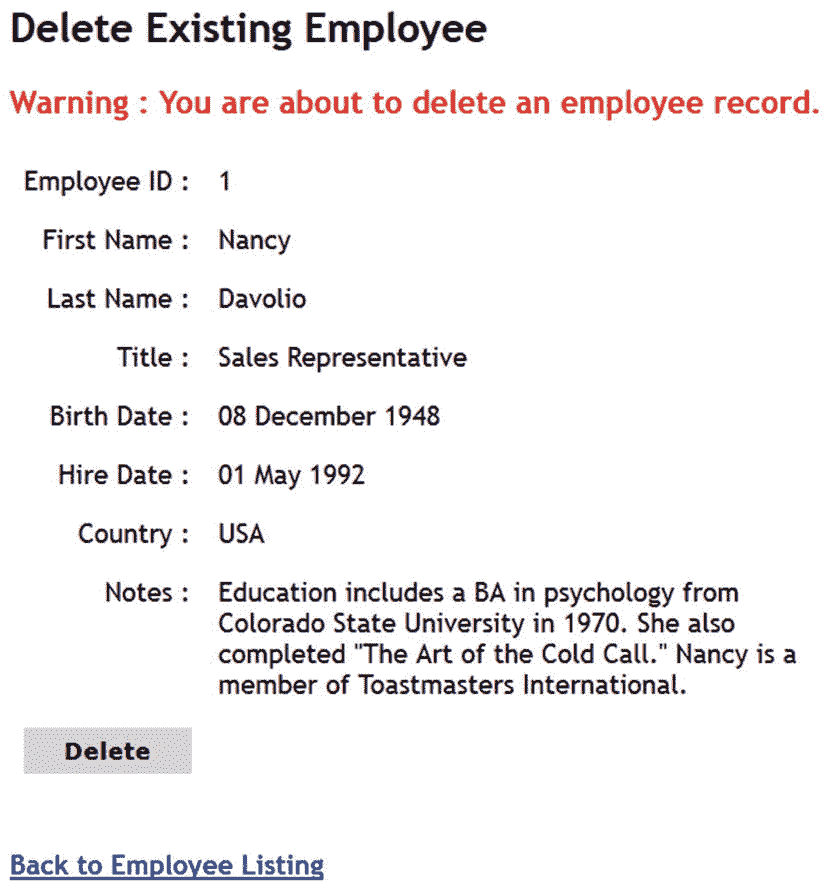

图 4-9

确认员工删除

为了实现删除功能，您需要一个名为 Delete.cshtml 的 Razor 页面，因此将其添加到 Pages ➤ EmployeeManager 文件夹中。`DeleteModel`类在很多方面类似于更新页面。`OnGet()`处理程序与`UpdateModel`类的处理程序相同。您可以从前面的代码中复制成员和`OnGet()`处理程序。

`OnPost()`处理程序从数据库中删除一个雇员，如清单 [4-16](#PC19) 所示。

```cs
public IActionResult OnPost()
{
    Employee emp = db.Employees.Find(Employee.EmployeeID);
    try
    {
        db.Employees.Remove(emp);
        db.SaveChanges();
        TempData["Message"] = "Employee deleted successfully!";
        return RedirectToPage("/EmployeeManager/List");
    }
    catch (DbUpdateException ex1)
    {
        Message = ex1.Message;
        if (ex1.InnerException != null)
        {
            Message += " : " + ex1.InnerException.Message;
        }
    }
    catch (Exception ex2)
    {
        Message = ex2.Message;
    }
    return Page();
}

Listing 4-16OnPost() page handler of DeleteModel

```

在`OnPost()`中，代码试图从 DbSet 中找到一个雇员，并使用`Remove()`方法将其删除。对`SaveChanges()`的调用从数据库中删除了雇员。一旦删除了一个雇员，代码会在`TempData`中存储一条成功消息，并使用`RedirectToPage()`方法重定向到列表页面。注意`OnPost()`的返回类型是`IActionResult`，因为`RedirectToPage()`返回的是`RedirectToPageResult`对象。同样，在最后一个 catch 块之后，代码调用返回一个`PageResult`对象的`Page()`。这将在浏览器中呈现当前页面。

现在`DeleteModel`类已经完成，在 IDE 中打开 Delete.cshtml 页面，编写清单 [4-17](#PC20) 中所示的框架代码。

```cs
@page "{id}"
@model DeleteModel

<h2>Delete Existing Employee</h2>

<h3 class="message">
    Warning : You are about to delete an employee record!
</h3>

@if (Model.DataFound)
{
<form method="post">
  <input type="hidden" asp-for="Employee.EmployeeID" />
  <table border="0">
    <tr>
        <td class="right">
            <label asp-for="Employee.EmployeeID"></label> :
        </td>
        <td>
            @Model.Employee.EmployeeID
        </td>
    </tr>
  ...
  ...
</form>
}

Listing 4-17Skeleton of Delete.cshtml

```

删除页面也在`@page`指令中定义了`id`路由参数。这

<form>is rendered only if the</form>

`DataFound` property is true. Since the delete page doesn’t have any data entry controls, the `EmployeeID` is outputted in a hidden form field. This way, the model binding will populate the `EmployeeID` property of the Employee page property when you click the Delete button. The that displays the existing employee details is generated based on the

`Model.Employee` properties and is not discussed here for the sake of brevity. You can grab the complete code of Delete.cshtml from the book’s code download.

## 添加 Razor 布局和视图开始

员工管理器的 Razor Pages 版本也需要一个布局和 _ViewStart.cshtml，就像应用的 MVC 版本一样。两者的标记和代码都非常类似于 MVC 版本，因此这里只讨论不同之处。

继续将共享文件夹添加到 Pages 文件夹下。然后在共享文件夹中添加 _Layout.cshtml。另外，将 _ViewStart.cshtml 文件放在 Pages 文件夹下。图 [4-10](#Fig10) 显示了解决方案资源管理器中的这些文件。

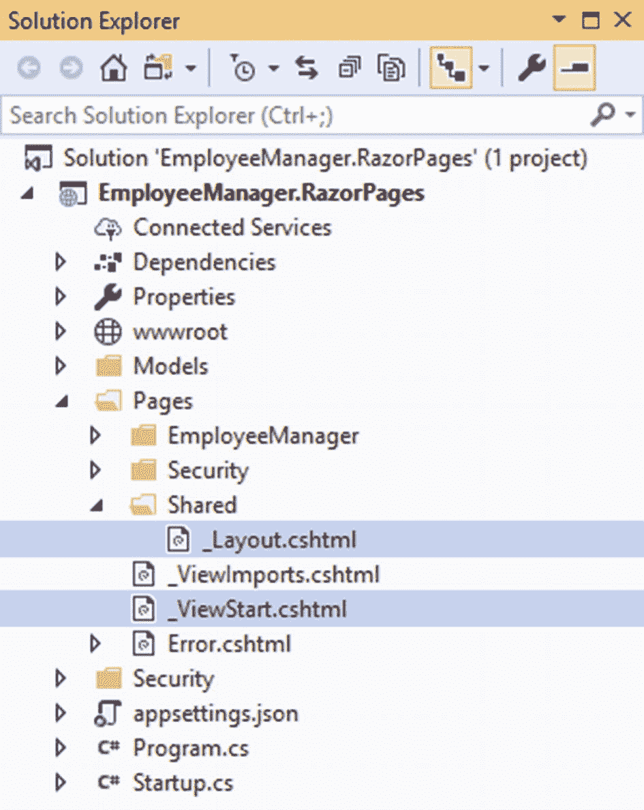

图 4-10

_Layout.cshtml 和 _ViewStart.cshtml

清单 [4-18](#PC21) 展示了登出按钮是如何呈现的。

```cs
@if (User.Identity.IsAuthenticated)
{
    <h2>You are signed in as @User.Identity.Name</h2>
    <form asp-page="/Security/SignOut" method="post">
        <button type="submit">Sign Out</button>
    </form>
}

Listing 4-18Rendering the Sign Out button

```

如您所见，表单标签助手被配置为使用`asp-page`属性将表单发布到注销页面。注销页面只是处理 POST 操作，并重定向到登录页面。本章稍后将讨论注销页面。

## 客户端验证、样式表和 appsettings.json

为 Razor 页面启用客户端验证的过程与 MVC 版本的 Employee Manager 完全相同。因此，只需将 Scripts 文件夹放在 wwwroot 下，其中包含所需的 jQuery 文件，并确保使用 _Layout.cshtml 中的

Site.css 包含各种页面使用的 css 类和样式。appsettings.json 存储数据库连接字符串。只需从应用的 MVC 版本中复制 Site.css 和 appsettings.json，并将它们分别放在 wwwroot/Styles 和项目根文件夹下。

## 配置应用启动和错误处理

您为 ASP.NET Core Razor Pages 应用配置应用启动的方式与该应用的 MVC 版本非常相似。所以这里不讨论所有的配置步骤。您可以从本书的代码下载中获得完整的 Startup.cs。

### 注意

在本节中，您将学习一些异常处理技术。尽管这些技术是针对 Razor 页面讨论的，但是它们也适用于 MVC 应用。我鼓励你在完成本章讨论的 Razor Pages 版本后，在应用的 MVC 版本中实现它们。

如果您查看 Startup 类的`ConfigureServices()`方法，您会注意到清单 [4-19](#PC22) 中所示的代码。

```cs
public void ConfigureServices(IServiceCollection services)
{
    services.AddRazorPages()
                          .AddRazorPagesOptions(options =>
                          {
                               options.Conventions
                                   .AddPageRoute("/EmployeeManager/List", "");
                          });
    ...
    ...
}

Listing 4-19Setting the default page of the application

```

AddRazorPages()方法向 DI 框架注册与 Razor 页面相关的服务。

回想一下，我们已经在 Pages/EmployeeManager 文件夹下存储了与 CRUD 相关的页面。Razor 页面将 Pages 文件夹下的 Index.cshtml 视为应用的默认页面。您希望对此进行更改，并将/EmployeeManager/List page 设置为默认页面。这是使用`AddRazorPagesOptions()`方法完成的。Conventions 对象的`AddPageRoute()`方法接受一个页面名及其路由。空字符串表示应用的默认页面。

现在，转到`Configure()`方法。在那里你会发现两个电话:

```cs
app.UseStatusCodePagesWithReExecute("/Error","?code={0}");
app.UseExceptionHandler("/Error");

```

这些调用将异常处理中间件组件添加到请求管道中。`UseStatusCodePagesWithReExecute()`方法添加了中间件的状态代码页。这个中间件用于处理与 HTTP 相关的错误，比如没有找到页面(状态代码 404)。`UseStatusCodePagesWithReExecute()`方法的第一个参数是要显示的错误页面(本例中为/Error)，第二个参数用于通过查询字符串将状态代码传递给页面。在本例中，状态代码将通过名为 code 的查询字符串变量传递给错误页面。`{0}`将被实际的状态码(如 404)代替。

接下来，代码还使用`UseExceptionHandler()`方法添加了异常处理程序中间件。在这种情况下，异常处理器中间件捕获任何未处理的异常，并将控制权交给指定的页面(/Error)。

要创建这些异常处理中间件组件使用的错误页面，请在 Pages 文件夹中添加一个名为 Error.cshtml 的新 Razor 页面。清单 [4-20](#PC24) 显示了这个页面的`ErrorModel`类。

```cs
public class ErrorModel : PageModel
{
    public string Code { get; set; }

    public void OnGet([FromQuery]int code)
    {
        if (code > 0)
        {
            this.Code = "Status Code : " + code;
        }
    }
}

Listing 4-20ErrorModel page model class

```

`ErrorModel`类定义了 Code 属性来存储 HTTP 状态代码。`OnGet()`处理程序在 code 参数中接收一个整数 HTTP 状态代码。注意`[FromQuery]`属性，它指示模型绑定从查询字符串中获取值。

`if`块简单地检查在查询字符串中是否接收到任何状态代码，并相应地将其存储在`Code`页面模型属性中。Error.cshtml 如清单 [4-21](#PC25) 所示。

```cs
@page
@model ErrorModel

<h2  class="message">
    Unexpected error while processing this request.
</h2>

<h3>@Model.Code</h3>

Listing 4-21Error.cshtml displays the error

```

Error.cshtml 只是向用户显示一条错误消息，并使用`Model.Code`属性输出 HTTP 状态代码(如果有的话)。

与 MVC 应用一样，路由相关的配置是使用`UseRouting()`和`UseEndPoints()`方法完成的。但是，端点是这样定义的:

```cs
app.UseEndpoints(endpoints=> {
    endpoints.MapRazorPages();
});

```

`MapRazorPages()`方法为 Razor 页面添加端点。

在这个阶段，您的应用能够执行 CRUD 操作。在向应用添加用户认证之前，您可以运行应用并测试 CRUD 功能。

## 添加 ASP.NET Core Identity 支持

在前一章中，您为雇员管理器应用的 MVC 版本添加了 ASP.NET Core Identity 支持。在本章中，您将为 Razor Pages 版本执行此操作。尽管添加 ASP.NET Core Identity 支持的过程非常相似，但还是有一些差异，如下所示:

*   用户注册、登录和退出现在由 Razor 页面处理。

*   ASP.NET Core Identity 以异步方式使用，Razor 页面异步调用各种方法。

    **注意**许多现代 web 应用更喜欢异步编程模型，而不是同步编程模型。异步编程模型提供的好处的详细讨论超出了本书的范围。可以说，在涉及数据库访问、web 服务调用和其他 I/O 操作的许多情况下，异步编程可以提供性能和可伸缩性优势。

为了简洁起见，以下部分仅讨论实现中的差异。本章的源代码下载包含完整的代码。你也可以参考 MVC 版本的 Employee Manager 来温习一下常见的实现细节。

### 添加 appidentityuser、appidentityrole 和 appointment db text 类

员工管理器的 Razor Pages 版本也需要`AppIdentityUser`、`AppIdentityRole`和`AppIdentityDbContext`类才能工作。这些类与 MVC 版本相同。你可以从本章的源代码或者 MVC 版本中获取它们。

这些类位于项目根目录下的安全文件夹中(图 [4-11](#Fig11) )。如果您从应用的 MVC 版本中复制它们，请确保按照 Razor Pages 项目名称空间更改它们的名称空间。

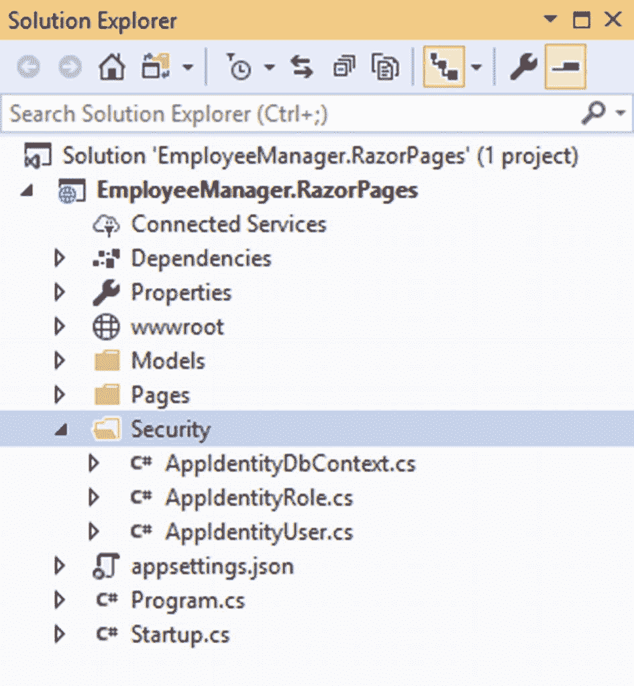

图 4-11

appidentitydbcontext、appidentityuser 和 appidentityrole classes

### 添加 ASP.NET Core Identity 配置和数据库表

在员工管理器的 MVC 版本中，您在启动类中添加了某些特定于 ASP.NET Core Identity 的配置。在`ConfigureServices(),`中，你使用了`AddIdentity()`、`AddEntityFrameworkStores()`和`ConfigureApplicationCookie()`等方法。在`Configure(),`中，您使用`UseAuthentication()`和`UseAuthorization()`方法添加了认证和授权中间件。这些方法调用在 Razor Pages 版本中也完全相同，这里不再讨论。

除了前面的启动配置之外，您还需要配置 Northwind 数据库来存储用户和角色。在开发雇员管理器的 MVC 版本时，您已经这样做了。如果您已经清理了数据库，请确保执行与前面相同的命令来创建必要的数据库表。

### 将 Security 子文件夹添加到 Pages 文件夹

对于员工管理器的 Razor Pages 版本，用户注册、登录和退出由各自的 Razor Pages 负责。这些 Razor 页面存储在 Pages 文件夹的子文件夹下。因此，在 Pages 文件夹下创建一个名为 Security 的子文件夹。图 [4-12](#Fig12) 显示了完成以下部分后包含所需 Razor 页面的安全文件夹。

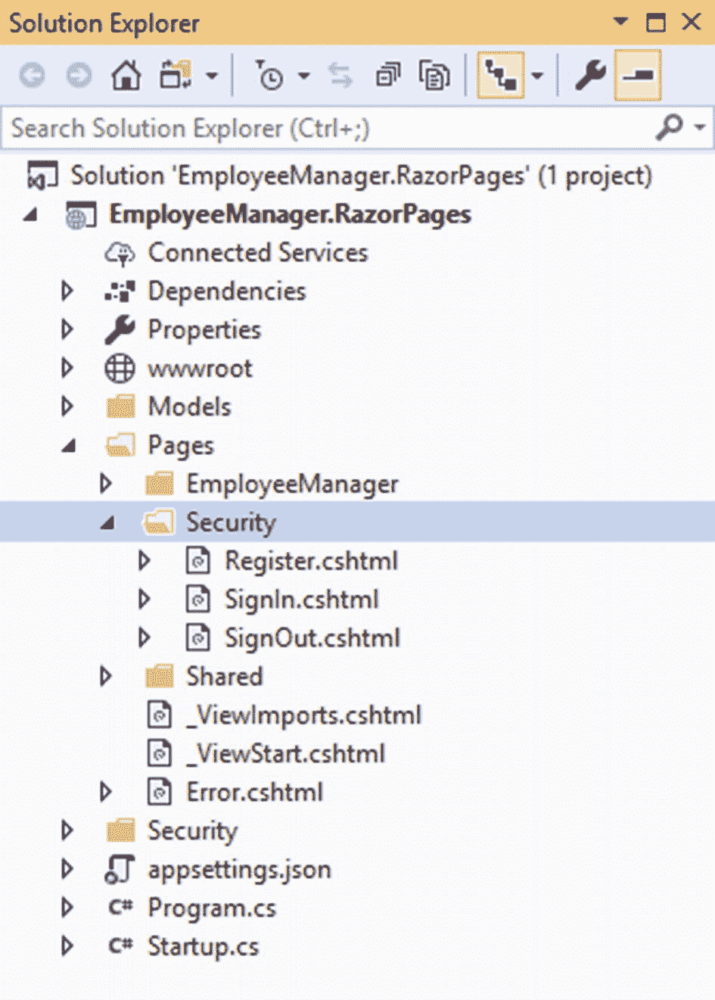

图 4-12

安全子文件夹包含与安全相关的 Razor 页面

如您所见，Security 文件夹包含三个 Razor 页面，即 Register.cshtml、SignIn.cshtml 和 SignOut.cshtml。

### 创建用户注册页面

“用户注册”页面允许您创建用户帐户。然后，您可以使用创建的账户登录系统(图 [4-13](#Fig13) )。

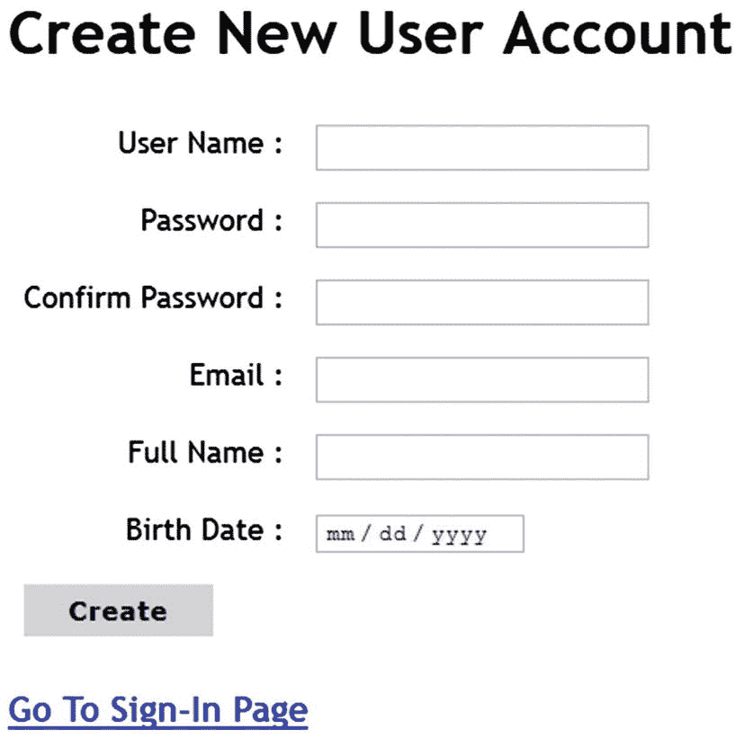

图 4-13

用户注册页面

要创建用户注册页面，您需要 Models 文件夹中的`Register`类和 Pages ➤安全文件夹下名为 Register 的 Razor 页面。

您可以从本书的源代码或应用的 MVC 版本中获取`Register`类，并将其放在 Models 文件夹下。然后在 Pages ➤安全文件夹中添加一个名为 Register.cshtml 的新 Razor 页面。

然后在 IDE 中打开 Register.cshtml.cs 页面模型类，编写清单 [4-22](#PC27) 所示的代码。

```cs
public class RegisterModel : PageModel
{
    [BindProperty]
    public Register RegisterData { get; set; }

    private readonly UserManager<AppIdentityUser> userManager;
    private readonly RoleManager<AppIdentityRole> roleManager;

    public RegisterModel(UserManager<AppIdentityUser> userManager,
                RoleManager<AppIdentityRole> roleManager)
    {
        this.userManager = userManager;
        this.roleManager = roleManager;
    }
}

Listing 4-22Injecting UserManager and RoleManager

```

代码从声明`RegisterData`属性开始。`RegisterData`属性属于`Register`类型，并标有`[BindProperty]`属性。由于`[BindProperty]`属性，`RegisterData`参与模型绑定，表单数据将被映射到其属性。

然后代码声明两个类型为`UserManager<TUser>`和`RoleManager<TRole>`的变量。`UserManager<TUser>`和`RoleManager<TRole>`对象被注入到页面模型的构造函数中，并存储在这些变量中。`userManager`和`roleManager`用于 POST 页面处理程序。

当用户单击表单上的 Create 按钮时，POST 页面处理程序被调用，如清单 [4-23](#PC28) 所示。

```cs
public async Task<IActionResult> OnPostAsync()
{
    if (ModelState.IsValid)
    {
        if (!await roleManager.RoleExistsAsync("Manager"))
        {
            AppIdentityRole role = new AppIdentityRole();
            role.Name = "Manager";
            role.Description = "Can perform CRUD operations.";
            IdentityResult roleResult = await roleManager.
            CreateAsync(role);
        }

        AppIdentityUser user = new AppIdentityUser();
        user.UserName = RegisterData.UserName;
        user.Email = RegisterData.Email;
        user.FullName = RegisterData.FullName;
        user.BirthDate = RegisterData.BirthDate;

        IdentityResult result = await userManager.CreateAsync
        (user, RegisterData.Password);

        if (result.Succeeded)
        {
            await userManager.AddToRoleAsync(user, "Manager");
            return RedirectToPage("/Security/SignIn");
        }
        else
        {
            ModelState.AddModelError("", "Invalid user details!");
        }
    }
    return Page();
}

Listing 4-23OnPostAsync() page handler of the register page

```

请仔细观察代码。虽然它看起来与您在应用的 MVC 版本中使用的类似，但还是有一些不同。

首先，POST 处理程序名为`OnPostAsync()`，并标有 C# 的`async`关键字。这表明它是一个异步方法，并且使用 C# 的 async-await 模式。

### 注意

对异步编程和 C# 的 async/await 关键字的讨论超出了本书的范围。如果你对这些概念不熟悉，可以考虑阅读 [`https://docs.microsoft.com/en-us/dotnet/csharp/programming-guide/concepts/async/`](https://docs.microsoft.com/en-us/dotnet/csharp/programming-guide/concepts/async/) 。

`OnPostAsync()`方法返回一个`Task<TResult>`对象。`Task`类表示异步操作，其中`TResult`是异步操作的结果类型。这里，任务包装了一个`IActionResult`对象。

如果您观察用粗体字母标记的代码，您会发现所有这些语句都使用了`await`操作符。`await`关键字后面是要执行的异步操作，例如本例中的`RoleExistsAsync()`、`CreateAsync()`和`AddToRoleAsync()`。

创建角色和用户的代码对您来说应该很熟悉，因为它类似于 MVC 版本。总的来说，代码做了以下事情:

*   RoleExistsAsync()检查数据库中是否已经存在经理角色。如果它不存在，那么使用 CreateAsync()方法创建角色。

*   UserManager 的 CreateAsync()方法创建一个新用户。

*   UserManager 的 AddToRoleAsync()方法将新创建的用户添加到 Manager 角色中。

Register.cshtml 使用各种标记助手在浏览器中呈现用户注册页面。由于这种标记非常简单，并且类似于您在开发早期 Razor 页面时使用的标记，所以这里没有讨论。您可以从本书的代码下载中获得 Register.cshtml 的完整代码。

### 创建登录页面

登录 Razor 页面允许用户登录系统，如图 [4-14](#Fig14) 所示。

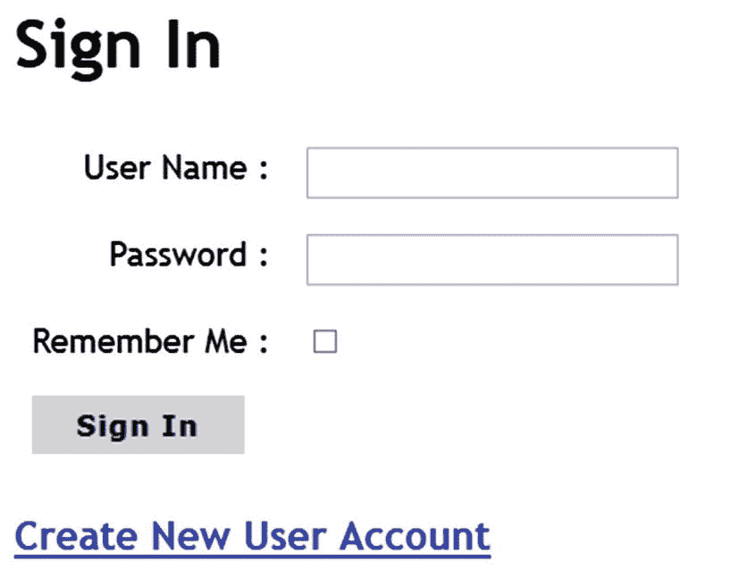

图 4-14

登录 Razor 页面

要创建登录页面，您需要`SignIn`类和登录 Razor 页面。`SignIn`类与 MVC 版本相同。你可以从这本书的源代码或者 MVC 版本中获取它，并把它放在 Models 文件夹下。

然后在 Pages ➤安全文件夹中添加一个名为 SignIn.cshtml 的新 Razor 页面。现在，在 IDE 中打开`SignInModel`类，并将清单 [4-24](#PC29) 中所示的代码写入其中。

```cs
public class SignInModel : PageModel
{
    [BindProperty]
    public SignIn SignInData { get; set; }

    private readonly SignInManager<AppIdentityUser> signinManager;

    public SignInModel(SignInManager<AppIdentityUser> signinManager)
    {
        this.signinManager = signinManager;
    }
}

Listing 4-24Injecting UserManager, RoleManager, and SignInManager

```

代码从创建`SignInData`公共属性开始。这个属性的类型是`SignIn`，并且用`[BindProperty]`属性来修饰。

然后声明一个`SignInManager<TUser>`变量。当一个`SignInManager`对象被注入到构造函数中时，这个变量得到它的值。

`OnPostAsync()`页面处理程序使用异步代码让用户登录系统，如清单 [4-25](#PC30) 所示。

```cs
public async Task<IActionResult> OnPostAsync()
{
    if (ModelState.IsValid)
    {
        var result = await signinManager.PasswordSignInAsync
        (SignInData.UserName, SignInData.Password,
            SignInData.RememberMe, false);

        if (result.Succeeded)
        {
            return RedirectToPage("/EmployeeManager/List");
        }
        else
        {
            ModelState.AddModelError("", "Invalid login!");
        }
    }

    return Page();
}

Listing 4-25Signing the user in to the system

```

请注意用粗体字母标记的代码。`OnPostAsync()`方法标有`async`关键字。为了让用户登录到应用，使用了`SignInManager`的`PasswordSignInAsync()`方法。如果登录操作成功，控件将被重定向到员工列表页面。否则，一个错误消息被添加到`ModelState`对象中并显示给用户。

SignIn.cshtml 页面标记使用标记帮助器来呈现用户界面，为了简洁起见，这里不再讨论。你可以从书的源代码中抓取 SignIn.cshtml。

### 将用户从应用注销

回想一下，您在之前开发的 _Layout.cshtml 中添加了标记来呈现登出按钮(图 [4-15](#Fig15) )。那一次，有人提到注销功能被包装在注销 Razor 页面中。现在是创建注销 Razor 页面的时候了。


图 4-15

页面底部显示的注销按钮

向 Pages ➤安全文件夹添加一个新的 Razor 页面，并将其命名为 SignOut.cshtml。然后在 IDE 中打开 SignOut.cshtml.cs 文件中的页面模型类，并在其中编写清单 [4-26](#PC31) 中所示的代码。

```cs
public class SignOutModel : PageModel
{
    private readonly SignInManager<AppIdentityUser> signinManager;

    public SignOutModel(SignInManager<AppIdentityUser> signinManager)
    {
        this.signinManager = signinManager;
    }

    public async Task<IActionResult> OnPostAsync()
    {
        await signinManager.SignOutAsync();
        return RedirectToPage("/Security/SignIn");
    }
}

Listing 4-26Signing the user out of the application

```

代码类似于`SignInModel`类，因为`SignInManager<TUser>`的对象被注入到构造函数中。然而，这次`OnPostAsync()`方法调用了`SignInManager`的`SignOutAsync()`方法。一旦用户退出应用，浏览器通过调用`RedirectToPage()`方法被重定向到登录页面。SignOut.cshtml 不包含任何标记，因为它仅用于将用户从系统中注销。

### 验证和授权用户

在开发雇员管理器的 MVC 版本时，您用`[Authorize]`属性修饰了动作或控制器。对于 Razor 页面，您可以在页面模型类上使用`[Authorize]`属性。清单 [4-27](#PC32) 展示了使用该属性的`ListModel`类。

```cs
[Authorize(Roles = "Manager")]
public class ListModel : PageModel
{
  ...
  ...
}

Listing 4-27[Authorize] added to the ListModel class

```

这里的`ListModel`类用`[Authorize]`属性修饰，它的`Roles`属性被设置为 Manager。这样，只有经过认证的管理员用户才能访问 List.cshtml Razor 页面。您还需要用`[Authorize]`属性来修饰`InsertModel`、`UpdateModel`和`DeleteModel`页面模型类。

`[Authorize]`属性也被添加到`SignOutModel`类中，因为只有登录的用户才能退出系统(清单 [4-28](#PC33) )。

```cs
[Authorize]
public class SignOutModel : PageModel
{
  ...
  ...
}

Listing 4-28SignOutModel decorated with [Authorize]

```

在雇员管理器的 ASP.NET Core MVC 版本中，您使用了`[ValidateAntiForgeryToken]`和表单标签助手来防止跨站点请求伪造(CSRF/XSRF)攻击。Razor 页面会自动免受这些攻击，并且您不需要显式地编写任何代码来完成这项任务。

## 运行应用

员工管理器应用的 Razor Pages 版本现在已经完成。您可以运行应用，并检查用户帐户创建、登录、注销和 CRUD 操作是否可以按预期执行。

## 摘要

在本章中，您使用 ASP.NET Core Razor 页面创建了员工经理应用。您使用逆向工程技术自动生成了 EF 核心模型。Razor Pages 允许使用以页面为中心的方法来构建 web 应用。每个 Razor 页面都由包含在. cshtml 文件中的页面 UI 和包装在页面模型. cshtml.cs 文件中的页面处理逻辑组成。您还了解了如何使用 async 和 await 关键字在 Razor 页面中使用 async 核心身份异步方法。

在下一章中，您将开发一个 Web API 来执行 CRUD 操作。Web API 随后由客户端应用调用。