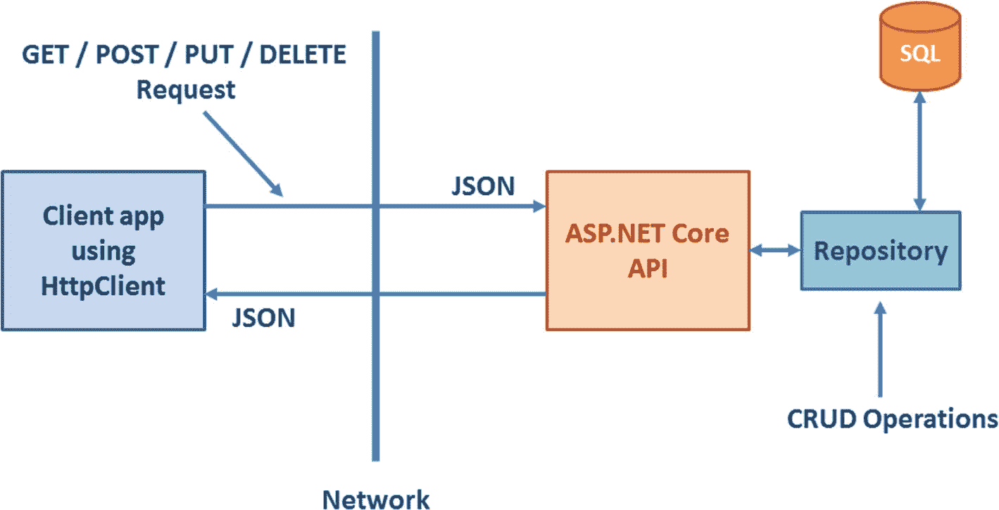

# 五、ASP.NET Core Web API

到目前为止，在本书中，您已经使用 ASP.NET Core MVC 和 ASP.NET Core Razor 页面开发了员工管理器应用。至此，您已经熟悉了 ASP.NET Core 和英孚核心的整体开发流程。继续这一旅程，本章将展示员工管理器如何使用 ASP.NET Core Web API 来执行 CRUD 操作。它还演示了如何使用。NET Core 的 HttpClient 类来调用 API。具体来说，您将学会

*   理解什么是 RESTful 服务

*   创建 ASP.NET Core Web API

*   使用 EF Core 执行原始 T-SQL 查询和存储过程

*   将 CRUD 操作封装在存储库中

*   使用。NET Core 的 HttpClient 来调用 Web API

## 应用架构

到目前为止开发的应用只涉及一个包含应用所需的所有内容的项目。员工管理器的 Web API 版本包括两个项目——API 项目和客户端应用。图 [5-1](#Fig1) 显示了你将在本章中开发的内容的简化架构视图。



图 5-1

员工管理器的架构

让我们更详细地讨论这个架构，并理解其中提到的各个部分。

### ASP.NET Core 和休息服务

现代 web 应用通常依赖 RESTful 服务来公开它们的功能。因此，简单讨论一下什么是休息是值得的。

REST 代表代表性状态转移。休息不是标准；这是构建服务的一种方式。与使用简单对象访问协议(SOAP)和 web 服务描述语言(WSDL)等复杂机制的 ASMX web 服务不同，RESTful 服务利用了 HTTP 的简单性和强大功能。以下是 RESTful 服务的一些基本特征:

*   REST 服务使用 HTTP 协议。

*   REST 服务发出 HTTP 请求(使用有意义的 HTTP 动词，如 GET、POST、PUT 和 DELETE)来获取和提交数据。

*   REST 服务本质上是无状态的。

*   REST 将服务公开为可通过 URL 访问和发现的资源。

*   REST 服务通常以 JSON 或 XML 格式传输数据。

ASP.NET Core Web API 是开发 RESTful 服务的. NET 核心方式，遵循 ASP.NET Core MVC 的基于控制器的编程模型。为了从客户端应用调用这样的 API，开发人员通常使用 HttpClient 组件或 Ajax 技术(如果是 JavaScript 客户端)。

诸如 GET、POST、PUT 和 DELETE 之类的 HTTP 动词表示要对资源执行的操作。如果 API 对数据库执行创建、读取、更新和删除(CRUD)操作，您可以使用 POST 来表示插入操作，使用 GET 来表示选择操作，使用 PUT 来表示更新操作，使用 delete 来表示删除操作。然而，仅仅使用特定的动词不会强制只允许特定类型的操作。根据应用的需求，您可以在 API 中实现这些动词。

### 注意

当谈到使用 ASP.NET Core 构建 RESTful 服务时，您可能会遇到不同的术语——ASP.NET Core Web API、ASP.NET Core REST API、ASP.NET Core API 或 ASP.NET Core REST 服务。它们的意思都一样。

### 理解 JSON 格式

客户端和 API 经常需要交换数据。这种数据传输的两种常见格式是 JSON 和 XML，尽管大多数现代 web 应用更喜欢 JSON 而不是 XML。

JSON 代表 JavaScript 对象符号，是一种轻量级的基于文本的数据交换格式。通过使用 JSON 格式，您可以表示需要在客户机和 API 之间传输的数据。JSON 支持字符串、数字、布尔值、对象和数组。(如果要表示任何其他数据类型，必须用支持的格式表示。)

JSON 格式的对象通常由一个或多个名称-值对组成。对象以{开始，以}结束。名称-值对位于两者之间。属性名及其值(如果是字符串类型)用双引号("…")括起来。属性及其值由冒号(:)分隔。多个名称-值对由逗号(，)分隔。以下代码显示了一个以 JSON 格式表示的对象:

```cs
var employee={
              "EmployeeID":1,
              "FirstName":"Nancy",
              "LastName":"Davolio",
              "IsContract":false;
             };

```

如果要创建 employee 对象的数组，可以编写以下代码:

```cs
var employeeArray =[
                    {
                     "EmployeeID":1,
                     "FirstName":"Nancy",
                     "LastName":"Davolio",
                     "IsContract":false;
                    },
                    {
                     "EmployeeID":2,
                     "FirstName":"Andrew",
                     "LastName":"Fuller",
                     "IsContract":true;
                    }
                   ];

```

这段代码创建了一个数组，其元素是两个 employee 对象。就像 JavaScript 数组一样，JSON 数组也以[开头，以]结尾。构成数组元素的多个 JSON 对象由逗号(，)分隔。

在使用 ASP.NET Core Web APIs 时，您可能需要在客户端和服务器端代码中处理 JSON 格式。例如，您可能从一些 Web API 接收 JSON 格式的数据，并希望在您的客户机代码中处理这些 JSON 数据。或者，您可能希望将 JSON 格式的数据发送给 API，以便可以在服务器上处理这些数据。

### 存储处的作用

到目前为止，在本书中，您已经从控制器类或 Razor 页面处理程序中执行了 CRUD 操作。在更现实的情况下，您可能希望将执行 CRUD 操作的代码隔离到一个单独的类中。您可能希望控制器或页面处理程序使用这个类来完成工作。

在这种情况下，存储库模式就派上了用场。存储库模式是数据访问层和系统其余部分之间的中介。此外，它通过提供对底层数据的类似集合的访问来做到这一点。

一旦存储库被实现，Web API 代码将不会直接调用 EF 核心代码。相反，它将调用存储库来完成工作。存储库通过提供添加、修改、删除和获取域对象的方法来提供一个集合接口。

知道实体框架核心已经实现了存储库模式是很有趣的。例如，您可以添加、修改、删除和访问与集合非常相似的 DbSet 中的实体。在这个例子中，您使用 EF Core 的功能来执行原始 T-SQL 查询和存储过程，以执行 CRUD 操作。你把它们打包到一个仓库里。然后，Web API 调用存储库来执行必要的操作。这种布置如图 [5-2](#Fig2) 所示。


图 5-2

ASP.NET Core API 使用存储库来执行 CRUD 操作

### 注意

在接下来的部分中，您将开发两个 ASP.NET Core 项目 API 和它的客户端。为了简洁起见，我不再解释创建和配置 ASP.NET Core 项目的基础知识。你可以阅读前面的章节来了解这些基础知识。您也可以从本书的代码下载中获得本章的完整源代码。

## 创建 EmployeeManager。Api 项目

既然您已经了解了应用的整体架构，那么让我们通过创建 API 项目来开始开发过程。为此，基于空项目模板创建一个新的 ASP.NET Core 项目。将项目命名为 EmployeeManager.Api。图 [5-3](#Fig3) 显示了项目完成后在解决方案资源管理器中的样子。


图 5-3

EmployeeManager。竣工后的 Api 项目

如您所见，该项目有三个文件夹——模型、控制器和存储库。这些文件夹存储了您将在接下来的部分中添加的各个类。为了执行 CRUD 操作，这个项目依赖于 EF Core。因此，你需要设置它来使用 EF 核心。这些细节与您之前开发的 MVC 和 Razor Pages 应用相同，因此不再讨论。有关在 ASP.NET Core 项目中建立 EF 核心的信息，您可以阅读前面的章节。您也可以从该书的代码下载中获得这个例子的完整代码。

## 创建 EF 核心模型和存储库

虽然 EmployeeManager。为了执行 CRUD 操作，Api 项目将使用存储库，您仍然需要创建 EF 核心模型。创建 EF 核心模型的过程与以前版本的 Employee Manager 相同。你可以自己创建`AppDbContext`、`Employee`和`Country`类，或者从本书的代码下载中获得。请确保将它们放在 Models 文件夹中。

一旦有了这些类，就可以继续创建存储库了。在这个例子中，您将学习使用 EF Core 执行原始 SQL 查询以及存储过程。因此，您创建了两组存储库——一组使用 SQL 语句，另一组使用存储过程。

### 创建 EmployeeSqlRepository 和 CountrySqlRepository

在本节中，您将创建第一组存储库，它由两个类和两个定义存储库结构的接口组成。因此，如果您还没有添加存储库文件夹，请从添加存储库文件夹开始。然后在 Repositories 文件夹中添加一个名为`IEmployeeRepository`的新接口。清单 [5-1](#PC3) 显示了带有其成员的`IEmployeeRepository`接口。

```cs
public interface IEmployeeRepository
{
    List<Employee> SelectAll();
    Employee SelectByID(int id);
    void Insert(Employee emp);
    void Update(Employee emp);
    void Delete(int id);
}

Listing 5-1IEmployeeRepository interface

```

`IEmployeeRepository`界面由五种方法组成，分别是`SelectAll()`、`SelectByID()`、`Insert()`、`Update()`和`Delete()`。这些方法规定了`EmployeeSqlRepository`库的结构，您将在本节的后面看到。

现在将另一个名为`ICountryRepository`的接口添加到 Repositories 文件夹中，并在其中编写清单 [5-2](#PC4) 中所示的代码。

```cs
public interface ICountryRepository
{
    List<Country> SelectAll();
}

Listing 5-2ICountryRepository interface

```

`ICountryRepository`接口只包含一个方法—`SelectAll()`。因为您对在 Countries 表上执行插入、更新和删除操作不感兴趣，所以这些方法在这里是不必要的。

既然已经准备好了`IEmployeeRepository`和`ICountryRepository`接口，让我们分别在`EmployeeSqlRepository`和`CountrySqlRepository`类中实现它们。

向名为`EmployeeSqlRepository`的存储库文件夹添加一个新类，并在其中实现`IEmployeeRepository`接口(清单 [5-3](#PC5) )。

```cs
public class EmployeeSqlRepository : IEmployeeRepository
{
    private readonly AppDbContext db = null;

    public EmployeeSqlRepository(AppDbContext db)
    {
        this.db = db;
    }

    public List<Employee> SelectAll()
    {
      ...
    }

    public Employee SelectByID(int id)
    {
      ...
    }

    public void Insert(Employee emp)
    {
      ...
    }

  public void Update(Employee emp)
  {
      ...
  }

  public void Delete(int id)
  {
      ...
  }
}

Listing 5-3EmployeeSqlRepository implements IEmployeeRepository

```

如您所见，`EmployeeSqlRepository`声明了一个类型为`AppDbContext`的变量。`AppDbContext`被注入构造函数并存储在这个变量中。然后其他方法使用`db`变量来执行相应的查询。

现在您已经准备好了`EmployeeSqlRepository`的框架，让我们一个接一个地添加各种方法的实现。清单 [5-4](#PC6) 展示了`SelectAll()`方法的实现。

```cs
public List<Employee> SelectAll()
{
    List<Employee> data = db.Employees. FromSqlRaw("SELECT EmployeeID, FirstName, LastName, Title, BirthDate, HireDate, Country, Notes FROM Employees ORDER BY EmployeeID ASC").ToList();
    return data;
}

Listing 5-4Implementing SelectAll()

```

`SelectAll()`方法旨在从数据库中返回所有雇员。因此，它的返回类型是`List<Employee>`。在内部，代码执行 SELECT 语句，从 Employees 表中获取 EmployeeID、FirstName、LastName、Title、BirthDate、HireDate、Country 和 Notes 列。为了执行这个 SQL 语句，使用了`DbSet`类的`FromSqlRaw()`方法。`FromSqlRaw()`方法接受一个 SQL 查询，并将其转换成 LINQ 查询。`FromSqlRaw()`方法返回`IQueryable<T>`。为了以`List<Employee>`的形式获取数据，代码使用了`ToList()`方法。然后将`List<Employee>`返回给调用者。注意，SELECT 语句必须返回与底层实体属性匹配的列(在本例中为`Employee`类)。

清单 [5-5](#PC7) 展示了`SelectByID()`方法的样子。

```cs
public Employee SelectByID(int id)
{
    Employee emp = db.Employees. FromSqlRaw("SELECT EmployeeID, FirstName, LastName, Title, BirthDate, HireDate, Country, Notes FROM Employees WHERE EmployeeID={0}", id).SingleOrDefault();
    return emp;
}

Listing 5-5Implementing the SelectByID() method

```

`SelectByID()`方法旨在返回一个特定的`Employee`，因此接受一个`EmployeeID`作为参数。在内部，代码执行一个 SQL 语句来获取那个特定的`EmployeeID`。注意表示查询参数的`{0}`的使用。`FromSqlRaw()`的第二个参数指定了该查询参数的值。该值被转换为 DbParameter 对象。您也可以自己提供一个`DbParameter`或`SqlParameter`(您可以在本章后面使用存储过程时这样做)。

### 注意

在构建 SQL 语句时，总是建议使用参数，而不是使用字符串连接。通过串联字符串构建的 SQL 语句容易受到 SQL 注入攻击，因此应该避免。

由于查询将返回单个雇员(如果没有找到匹配，则返回 null)，代码使用`SingleOrDefault()`方法来检索那个`Employee`。检索到的雇员被返回给调用者。

`Insert()`、`Update()`和`Delete()`方法的相似之处在于它们都执行动作查询——插入、更新和删除。为了简洁起见，清单 [5-6](#PC8) 中只显示了`Update()`方法。你可以从本书的源代码中获得其他方法。

```cs
public void Update(Employee emp)
{
    int count = db.Database.ExecuteSqlRaw("UPDATE Employees SET FirstName={0}, LastName={1}, Title={2}, BirthDate={3}, HireDate={4}, Country={5}, Notes={6} WHERE EmployeeID={7}", emp.FirstName, emp.LastName, emp.Title, emp.BirthDate, emp.HireDate, emp.Country, emp.Notes, emp.EmployeeID);
}

Listing 5-6Implementing the Update() method

```

`Update()`方法更新一个特定的雇员，因此接受一个雇员对象作为参数。在内部，使用`ExecuteSqlRaw()`方法形成并执行更新动作查询。注意，`ExecuteSqlRaw()`是在`DbContext`的`Database`属性上被调用的。属性为底层的`DbContext`提供了对数据库相关信息和操作的访问。

`ExecuteSqlRaw()`指定了一个参数化的查询。请注意参数是如何指定的:{0}…{7}。这些查询参数的值是从`Employee`对象中选取的，并以相同的顺序在`ExecuteSqlRaw()`调用中指定。`ExecuteSqlRaw()`执行动作查询并返回受其影响的记录数。该值存储在`count`变量中。虽然我们的实现没有使用`count`，但是如果您愿意，您可以使用它进行进一步的处理。

为了减少混乱，代码没有添加任何异常处理代码。但是在更现实的情况下，您应该在这些方法中添加异常处理(关于异常处理的更多细节，请参见前面的章节)。

要完成`EmployeeSqlRepository`，以同样的方式添加`Insert()`和`Delete()`方法(或者从书的源代码中抓取)。

接下来，在 Repositories 文件夹中添加一个名为`CountrySqlRepository`的新类，并在其中实现`ICountryRepository`接口。清单 [5-7](#PC9) 显示了实施`SelectAll()`方法后的`CountrySqlRepository`。

```cs
public class CountrySqlRepository : ICountryRepository
{
    private readonly AppDbContext db = null;

    public CountrySqlRepository(AppDbContext db)
    {
        this.db = db;
    }

    public List<Country> SelectAll()
    {
        List<Country> data = db.Countries. FromSqlRaw("SELECT
                             CountryID, Name FROM Countries
                             ORDER BY Name ASC").ToList();
        return data;
    }
}

Listing 5-7CountrySqlRepository implements ICountryRepository

```

您应该对`CountrySqlRepository`实现很熟悉，因为它对国家`DbSet`使用相同的`FromSqlRaw()`方法从国家表中检索所有国家的列表。

### 创建 EmployeeStProcRepository 和 CountryStProcRepository

在上一节中，您创建了两个使用原始 SQL 语句执行 CRUD 操作的存储库。在许多实际应用中，您可能希望使用存储过程而不是 SQL 查询。因此，看看如何使用 EF Core 执行存储过程是值得的。为此，本节将向您展示如何使用存储过程创建另一组存储库。

为了使用这组存储库，首先需要在 Northwind 数据库中创建某些存储过程。创建这些存储过程的完整脚本可以在该书的源代码下载中找到。这里，我们讨论几个存储过程，以便您对它们有所了解。看看清单 [5-8](#PC10) ，它显示了`Employees_SelectAll`存储过程。

```cs
CREATE PROCEDURE [dbo].[Employees_SelectAll]
AS
SELECT EmployeeID, FirstName, LastName, Title, BirthDate, HireDate, Country, Notes FROM Employees ORDER BY EmployeeID ASC
RETURN 0

Listing 5-8Stored procedure for selecting all employees

```

`Employees_SelectAll`存储过程返回 Employees 表中的所有雇员记录。清单 [5-9](#PC11) 显示了`Employees_Update`存储过程。

```cs
CREATE PROCEDURE [dbo].[Employees_Update]
    @EmployeeID INT,
    @FirstName NVARCHAR(10),
    @LastName NVARCHAR(20),
    @Title NVARCHAR(30),
    @BirthDate DATETIME,
    @HireDate DATETIME,
    @Country NVARCHAR(15),
    @Notes NTEXT
AS
    UPDATE Employees SET
    FirstName=@FirstName,
    LastName=@LastName,
    Title=@Title,
    BirthDate=@BirthDate,
    HireDate=@HireDate,
    Country=@Country,
    Notes=@Notes
    WHERE EmployeeID = @EmployeeID;
RETURN 0

Listing 5-9Employees_Update stored procedure

```

`Employees_Update`存储过程旨在更新 Employees 表中的雇员记录。它有几个参数用于传递特定 EmployeeID 的修改后的名字、姓氏、头衔、生日、雇佣日期、国家和注释的值。在内部，它调用更新操作查询并执行必要的更新操作。

在继续之前，完成所有存储过程:`Employees_SelectAll`、`Employees_SelectByID`、`Employees_Insert`、`Employees_Update`、`Employees_Delete`和`Countries_SelectAll`。

接下来，将`EmployeeStProcRepository`类添加到 Repositories 文件夹中，并在其中实现`IEmployeeRepository`接口。`EmployeeStProcRepository`类使用您刚刚创建的存储过程来执行 CRUD 操作。它使用与以前相同的`FromSqlRaw()`和`ExecuteSqlRaw()`方法，但有一些不同。清单 [5-10](#PC12) 显示了`SelectAll()`和`SelectByID()`方法的实现。

```cs
public List<Employee> SelectAll()
{
    List<Employee> data = db.Employees. FromSqlRaw("EXEC Employees_SelectAll").ToList();
    return data;
}

public Employee SelectByID(int id)
{
    SqlParameter p = new SqlParameter("@EmployeeID", id);
    Employee emp = db.Employees. FromSqlRaw("EXEC Employees_SelectByID @EmployeeID", p).ToList().SingleOrDefault();
    return emp;
}

Listing 5-10Implementing SelectAll() and SelectByID() methods

```

您应该对这段代码很熟悉。请注意用粗体字母标记的代码。来自`SelectAll()`方法的`FromSqlRaw()`调用使用`EXEC`命令执行`Employees_SelectAll`存储过程。

来自`SelectByID()`方法的`EXEC`调用后跟要执行的存储过程的名称，以及存储过程接受的参数列表。在这种情况下，`Employees_SelectByID`只接受一个参数——`@EmployeeID`。`@EmployeeID`参数由包装了参数名和值的`SqlParameter`对象(`Microsoft.Data.SqlClient`名称空间)表示。`SqlParameter`作为第二个参数传递给`FromSqlRaw()`。

清单 [5-11](#PC13) 展示了`EmployeeStProcRepository`的`Update()`方法。

```cs
public void Update(Employee emp)
{
    SqlParameter[] p = new SqlParameter[8];
    p[0] = new SqlParameter("@EmployeeID", emp.EmployeeID);
    p[1] = new SqlParameter("@FirstName", emp.FirstName);
    p[2] = new SqlParameter("@LastName", emp.LastName);
    p[3] = new SqlParameter("@Title", emp.Title);
    p[4] = new SqlParameter("@BirthDate", emp.BirthDate);
    p[5] = new SqlParameter("@HireDate", emp.HireDate);
    p[6] = new SqlParameter("@Country", emp.Country);
    p[7] = new SqlParameter("@Notes", emp.Notes ?? SqlString.Null);

    int count = db.Database.ExecuteSqlRaw("EXEC Employees_Update @EmployeeID,@FirstName,@LastName,@Title,@BirthDate,@HireDate,@Country,@Notes", p);
}

Listing 5-11Implementing the Update() method

```

这一次，`EXEC`命令将`Employees_Update`指定为存储过程名，后跟八个参数。这些参数被包装在一个`SqlParameter`对象数组中。在`ExecuteSqlRaw()`方法的第二个参数中传递了`SqlParameter`数组。

### 注意

您会发现开发人员以不同的方式实现存储库模式。例如，您可能有支持批处理操作的存储库，并有一个单独的方法，如 Save()，它负责将数据保存到数据库中。您还将观察到工作单元模式经常与存储库模式携手并进。这里，您使用一种简单的方法来创建存储库。

为了简洁起见，我们不会讨论`EmployeeStProcRepository`和`CountryStProcRepository`的所有方法。你可以自己完成这些方法，或者从书中的源代码中获取。

### 向 DI 容器注册存储库

在前面的章节中，您将`AppDbContext`注入到控制器或页面模型类中。控制器动作和页面处理器方法然后使用`AppDbContext`来执行 CRUD 操作。在本例中，CRUD 操作由您刚刚创建的存储库执行。因此，您需要将存储库注入控制器/页面模型。为了在控制器/页面模型中注入存储库，您需要将它们注册到 ASP.NET Core 的依赖注入(DI)容器中。

所以打开启动类，转到`ConfigureServices()`方法。在那里，添加清单 [5-12](#PC14) 中所示的代码。

```cs
public void ConfigureServices(IServiceCollection services)
{
  ...
  ...
    services.AddScoped<IEmployeeRepository, EmployeeSqlRepository>();
    services.AddScoped<ICountryRepository, CountrySqlRepository>();
}

Listing 5-12Registering the repositories with the DI container

```

### 注意

您还需要为 API、EF 核心和路由设置 ConfigureServices()和 Configure()方法。这些细节将在第 [1](01.html) 章和第 [3](03.html) 章中讨论。你可以阅读那些章节或者查看本章的代码下载。

请注意用粗体字母标记的代码。它调用`AddScoped<TService, TImplementation>()`方法来注册`EmployeeSqlRepository`和`CountrySqlRepository`。`AddScoped()`方法创建一个指定类型的实例，并将其生命周期设置为当前请求。这意味着在请求过程中任何时候请求`EmployeeSqlRepository`，DI 容器都会提供相同的对象实例。注意`IEmployeeRepository`作为`TService`传递，而`EmployeeSqlRepository`作为`TImplementation`传递。以类似的方式注册`CountrySqlRepository`。

### 注意

在 DI 术语中，向 DI 容器注册的类型称为服务。就像 AddScoped()方法一样，有 AddTransient()和 AddSingleton()方法可用于控制向 DI 容器注册的服务的生存期。你可以在 [`https://docs.microsoft.com/en-us/aspnet/core/fundamentals/dependency-injection`](https://docs.microsoft.com/en-us/aspnet/core/fundamentals/dependency-injection) 的 ASP.NET Core 官方文档中了解更多。

要在 DI 容器中注册`EmployeeStProcRepository`和`CountryStProcRepository`，您应该编写以下代码:

```cs
services.AddScoped<IEmployeeRepository, EmployeeStProcRepository>();
services.AddScoped<ICountryRepository, CountryStProcRepository>();

```

## 创建员工 Web API 和国家 Web API

现在您已经完成了存储库，让我们继续创建应用所需的 Web APIs。我们需要两个 Web APIs 一个对雇员执行 CRUD 操作，另一个从数据库返回国家。

首先将名为`EmployeesController`的新 API 控制器类添加到控制器文件夹中(图 [5-4](#Fig4) )。


图 5-4

将 EmployeesController 添加到项目中

新添加的`EmployeesController`类继承自`Controller`类。您需要通过添加清单 [5-13](#PC16) 中所示的框架代码来修改该类。

```cs
[Route("api/[controller]")]
public class EmployeesController : Controller
{
    private readonly IEmployeeRepository employeeRepository = null;

    public EmployeesController(IEmployeeRepository employeeRepository)
    {
        this.employeeRepository = employeeRepository;
    }

    [HttpGet]
    public List<Employee> Get()
    {
    }

    [HttpGet("{id}")]
    public Employee Get(int id)
    {
    }
    [HttpPost]
    public void Post(Employee emp)
    {
    }

    [HttpPut("{id}")]
    public void Put(int id, Employee emp)
    {
    }

    [HttpDelete("{id}")]
    public void Delete(int id)
    {
    }
}

Listing 5-13Skeleton of EmployeesController

```

`EmployeesController`是用`[Route]`属性修饰的。在 ASP.NET Core Web APIs 的情况下，路由是使用`[Route]`属性定义的(也称为属性路由)。`[Route]`属性指定了用于访问底层 Web API 的 URL 模板。在这种情况下，模板是`api/[controller]`。添加的`api` URL 段表示您正在访问一个 API。这是一个可选的段，但是将它添加到 URL 中会使您的 API URL 更具可读性。

属性 routing 支持所谓的令牌替换。在构建路由时，URL 模板中指定的`[controller]`被替换为实际的控制器名称(在本例中为`Employees`)。就像`[controller],`一样，如果你想替换 URL 模板中的动作名，你也可以使用`[action]`。这里使用的 URL 模板公开了位于`https://localhost:12345/api/Employees`的 API(端口号将根据您的设置而变化)。

`EmployeesController`声明了一个类型为`IEmployeeRepository` ( `employeeRepository`)的变量。该变量在类的构造函数中赋值，框架将在该类中注入`IEmployeeRepository` ( `EmployeeSqlRepository`或`EmployeeStProcRepository`)的实现。如此注入的储存库由五个动作使用，即`Get()`、`Get(id)`、`Post()`、`Put()`和`Delete()`，以执行 CRUD 操作。

现在你已经知道了`EmployeesController`的骨架，下面我们来一步一步的添加这五个动作。

首先添加`Get()`和`Get(id)`动作，如清单 [5-14](#PC17) 所示。

```cs
[HttpGet]
public List<Employee> Get()
{
    return employeeRepository.SelectAll();
}

[HttpGet("{id}")]
public Employee Get(int id)
{
    return employeeRepository.SelectByID(id);
}

Listing 5-14Get() and Get(id) actions of EmployeesController

```

`Get()`和`Get(id)`动作分别用于返回所有雇员和一个特定的雇员。`Get()`动作返回一个`List<Employee>`，并用`[HttpGet]`属性修饰。回想一下，前面提到 HTTP 动词，比如 GET、POST、PUT 和 DELETE 控制框架调用哪个 API 动作。在`Get()`动作之上添加`[HttpGet]`意味着 GET 请求将由`Get()`动作处理。在内部，代码调用存储库的`SelectAll()`方法来获取所有雇员。

`Get(id)`动作也用`[HttpGet]`属性修饰，但是它也采用由`{id}`指示的 id 路由参数。`Get()`动作有一个整数 id 参数，代表一个`EmployeeID`。在内部，代码调用存储库的`SelectByID()`方法来返回与指定的`EmployeeID`匹配的特定雇员。

清单 [5-15](#PC18) 显示了`EmployeesController`的`Post()`动作。

```cs
[HttpPost]
public void Post([FromBody]Employee emp)
{
    if (ModelState.IsValid)
    {
        employeeRepository.Insert(emp);
    }
}

Listing 5-15Post() action inserts a new employee

```

`Post()`动作旨在向数据库中插入一名新员工。它用`[HttpPost]`属性来修饰，以将其映射到 POST 请求。`Post()`动作将一个雇员对象作为参数。该对象表示要添加到数据库中的新雇员。注意，`emp`参数有一个`[FromBody]`属性，表明参数的值将从请求体中选取。

在内部，代码使用`ModelState.IsValid`属性检查`Employee`对象(模型)是否包含有效值。如果模型包含有效值，那么调用存储库的`Insert()`方法，向数据库中插入一个新雇员。

### 注意

[ApiController]属性可以通过自动执行模型验证和参数绑定来简化 API 操作。请阅读官方文档以了解关于[ApiController]属性及其用法的更多信息。

清单 [5-16](#PC19) 显示了`EmployeesController`的`Put()`动作。

```cs
[HttpPut("{id}")]
public void Put(int id, [FromBody]Employee emp)
{
    if (ModelState.IsValid)
    {
        employeeRepository.Update(emp);
    }
}

Listing 5-16Put() action updates an employee

```

`Put()`动作缩进以更新数据库中的雇员记录。它用`[HttpPut]`属性修饰，表明它被映射到 PUT 动词。由于更新操作需要修改`EmployeeID`，所以`{id}`参数被添加到路线中。`Put()`动作有两个参数:一个要更新的`EmployeeID`和一个包含修改值的`Employee`对象。`id`值来自 route 参数，而`Employee`对象来自请求体，如`[FromBody]`属性所示。

在内部，如果模型验证成功，代码调用存储库的`Update()`方法。注意，在这个例子中，`Employee`对象本身包含了`EmployeeID`属性，因此在处理过程中没有使用`id`参数。然而，作为`Put()`签名的一部分，如果您想使用它进行某些处理，它是可用的。

清单 [5-17](#PC20) 显示了`EmployeesController`的`Delete()`动作。

```cs
[HttpDelete("{id}")]
public void Delete(int id)
{
    employeeRepository.Delete(id);
}

Listing 5-17Delete() action deletes an employee

```

`Delete()`动作旨在从数据库中删除一名雇员。它由属性`[HttpDelete]`修饰，表明它被映射到删除动词。它接收来自路由的 id 参数，该参数指示要删除的`EmployeeID`。在内部，代码调用存储库的`Delete()`方法来删除雇员。

### 注意

在前面的示例中，您使用了 Get()、Post()、Put()和 Delete()等操作名称。这样做主要是为了可读性。但是，您可以根据自己的选择命名这些操作。只要使用诸如[HttpGet]、[HttpPost]、[HttpPut]和[HttpDelete]之类的属性将它们映射到正确的 HTTP 动词，API 就会按照预期的方式运行。例如，您可能有一个名为 SelectAll()的操作，它标记有[HttpGet]属性。

您刚刚完成了`EmployeesController`课程。以类似的方式，也完成`CountriesController`类。`CountriesController`使用`CountrySqlRepository`或`CountryStProcRepository`，并且只有一个动作:`Get()`——将所有国家返回给调用者。为了简洁起见，这里不讨论`CountriesController`类。你也可以从书中的源代码中获得。为了方便您快速查阅，清单 [5-18](#PC21) 显示了完整的`CountriesController`类。

```cs
[Route("api/[controller]")]
public class CountriesController : ControllerBase
{
    private readonly ICountryRepository countryRepository = null;

    public CountriesController(ICountryRepository countryRepository)
    {
        this.countryRepository = countryRepository;
    }

    [HttpGet]
    public List<Country> Get()
    {
        return countryRepository.SelectAll();
    }
}

Listing 5-18Get() action of CountriesController

```

### 运行员工 Web API

既然 Employee Manager 需要的 Web APIs 已经准备好了，让我们检查一下它们是否按预期工作。因为您还没有创建客户端应用，所以不是所有的操作都可以使用浏览器进行测试。然而，您可以很容易地检查`Get()`和`Get(id)`动作，如下所述。

通过按 F5 键从 Visual Studio IDE 中运行`EmployeeManager.Api`项目。当浏览器窗口打开时，在浏览器的地址栏中输入`https://localhost:12345/api/Employees`(根据您的设置更改端口号)。这将向`EmployeesController`发起一个 GET 请求。记住 GET 请求被映射到`Get()`动作。因此，将调用`Get()`动作，并向浏览器返回一列`Employee`对象。图 [5-5](#Fig5) 显示了 Web API 的运行示例。


图 5-5

雇员 API 返回 JSON

注意 API 是如何以 JSON 格式返回数据的。您可以通过在 URL 中添加一个`EmployeeID`来调用`Get(id)`。例如，指定 URL 为`https://localhost:12345/api/Employees/1`将只返回一个`EmployeeID`为 1 的雇员(图 [5-6](#Fig6) )。


图 5-6

Get(id)返回单个雇员

### 注意

虽然您可能无法使用上文中讨论的技术来测试 Post()、Put()和 Delete()操作，但是您可以使用 Postman 之类的工具来测试 API 中的所有 HTTP 动词。考虑访问 [`www.getpostman.com`](http://www.getpostman.com) 了解更多关于邮差工具的细节。

## 为 Web API 创建客户端

在前面的小节中，您创建了 ASP.NET Core Web API，它对 Employees 表执行 CRUD 操作。在接下来的小节中，您将构建一个使用 Web API 的客户端应用。

Web API 的客户端可以是任何类型的应用，例如另一个 Web 应用、桌面应用、另一个服务或 JavaScript 客户端。只要客户端具有网络连接并能够访问 Web API，它就可以通过发出适当的 GET、POST、PUT 和 DELETE 请求来调用 API。

因为您的重点是 ASP.NET Core，所以您开发了一个 ASP.NET Core MVC 应用作为 Web API 的客户端。就项目组织而言，客户端应用看起来就像您过去开发的 ASP.NET Core MVC 应用。然而，它求助于 Web API 来执行 CRUD 操作，而不是使用 EF 核心代码本身。因此，首先向同一个解决方案添加一个名为`EmployeeManager.ApiClient`的新 ASP.NET Core web 应用。将客户端应用添加到同一个解决方案中可以简化调试和测试。图 [5-7](#Fig7) 显示了客户端应用完成时的解决方案浏览器。


图 5-7

EmployeeManager。解决方案资源管理器中的 ApiClient 项目

因为客户机应用是 ASP.NET Core MVC 应用，所以整个开发过程和项目组织应该是您所熟悉的。为了简洁起见，我不打算重复基本步骤。使用 API 的必要步骤将在下面的章节中讨论。您可以从本书的源代码下载中获得客户端应用的完整源代码。

### 创建视图模型

在开发 API 项目时，您创建了应用所需的 EF 核心模型。CRUD 操作封装在存储库中。因此，客户端应用不会有任何 EF 核心模型或数据库访问代码。然而，由于 Web API 项目根据`Employee`和`Country`类来处理数据，所以客户端需要这些视图模型类。比如`EmployeesController`的`Get()`动作返回一个`List<Employee>`。因此，为了接收这些数据，客户端应用也需要一个匹配的数据结构。这需要在客户机的模型文件夹中添加`Employee`和`Country`视图模型类。这些类与您之前创建的`Employee`和`Country`实体类非常相似。但是他们不会使用数据库模式相关的数据注释，比如`[Table]`和`[Column]`。清单 [5-19](#PC22) 显示了`Employee`视图模型类的一部分，只是为了给你一个概念。

```cs
public class Employee
{
    [Required(ErrorMessage ="Employee ID is required")]
    [Display(Name = "Employee ID")]
    public int EmployeeID { get; set; }

    [Display(Name = "First Name")]
    [Required(ErrorMessage = "First Name is required")]
    [StringLength(10,ErrorMessage ="First Name must be less than 10 characters")]
    public string FirstName { get; set; }

    [Display(Name = "Last Name")]
    [Required(ErrorMessage ="Last Name is required")]
    [StringLength(20,ErrorMessage ="Last Name must be less than 20 characters")]
    public string LastName { get; set; }
    ...
    ...
}

Listing 5-19Employee view model class

```

如您所见，`Employee`类属性只有那些验证和 UI 显示所必需的数据注释。

在同一行中，添加如下所示的`Country`类:

```cs
public class Country
{
    public int CountryID { get; set; }
    public string Name { get; set; }
}

```

### 添加 EmployeeManagerController

现在视图模型已经准备好了，在 Controllers 文件夹中添加一个名为`EmployeeManagerController`的新控制器类。就像 ASP.NET Core MVC 版本的雇员管理器一样，`EmployeeManagerController`也有七个动作(一个用于列表，两个用于插入，两个用于更新，两个用于删除)和一个帮助器方法(在视图包中填充国家)。然而，这次的不同之处如下:

*   这些操作使用 HttpClient 类来调用 Web API。

*   这些操作使用异步等待模式。

*   因为 Web API 以 JSON 格式返回数据，所以客户端代码使用系统中的类。JSON 名称空间来处理 Json 数据。

### 注意

您也可以使用第三方 JSON 库，比如 Json.NET(Newtonsoft。Json NuGet 包)来处理 Web API 返回的 Json 数据。

您已经在前面的章节中使用了 async-await 模式，所以清单 [5-20](#PC24) 中显示的`EmployeeManagerController`的框架应该对您来说很熟悉。

```cs
public class EmployeeManagerController : Controller
{
    public EmployeeManagerController(HttpClient client, IConfiguration config)
    {
    }

    public async Task<bool> FillCountriesAsync()
    {
    }

    public async Task<IActionResult> ListAsync()
    {
    }

    public async Task<IActionResult> InsertAsync()
    {
    }

    [HttpPost]
    [ValidateAntiForgeryToken]
    public async Task<IActionResult> InsertAsync(Employee model)
    {
    }

    public async Task<IActionResult> UpdateAsync(int id)
    {
    }

    [HttpPost]
    [ValidateAntiForgeryToken]
    public async Task<IActionResult> UpdateAsync(Employee model)
    {
    }

    [ActionName("Delete")]
    public async Task<IActionResult> ConfirmDeleteAsync(int id)
    {
    }

    [HttpPost]
    [ValidateAntiForgeryToken]
    public async Task<IActionResult> DeleteAsync(int employeeID)
    {
    }
}

Listing 5-20Skeleton of EmployeeManagerController

```

现在你对`EmployeeManagerController`有了一些了解，让我们一步一步地完成它。

### 设置 HttpClient

`EmployeeManagerController`使用`HttpClient`类来调用 Web API。`HttpClient`类驻留在`System.Net.Http`名称空间中，并且按照设计是异步的。在启动类的`ConfigureServices()`中创建和配置了一个`HttpClient`对象。然后用 DI 容器注册一个`HttpClient`实例，这样它就可以被注入到控制器中。清单 [5-21](#PC25) 展示了这是如何完成的。

```cs
HttpClient client = new HttpClient();
string baseUrl = config.GetValue<string>("AppSettings:BaseUrl");
client.BaseAddress = new Uri(baseUrl);
var contentType = new MediaTypeWithQualityHeaderValue("application/json");
client.DefaultRequestHeaders.Accept.Add(contentType);
services.AddSingleton<HttpClient>(client);

Listing 5-21Creating and configuring HttpClient

```

代码从创建一个对象`HttpClient`开始。还声明了一个字符串变量(`baseAddress`)来保存 API URL。为了避免代码中 API URLs 的硬编码，客户端应用将它们存储在`appsettings.json`文件中:

```cs
 "AppSettings": {
  "BaseUrl": "https://localhost:12345",
  "EmployeesApiUrl": "/api/employees",
  "CountriesApiUrl": "/api/countries"
}

```

注意使用了`GetValue<T>()`方法来读取配置信息。`GetValue<T>()`方法指定您希望检索其值的键以及该值的数据类型(在本例中为 string)。请注意键是如何指定的。例如，`AppSettings:BaseUrl`表示要从`AppSettings`部分检索`BaseUrl`键。`BaseUrl`的一个例子是`https://localhost:12345`。`HttpClient`类的`BaseAddress`属性是一个表示 API 基址的`Uri`。

Web API 可以以 JSON 格式或 XML 格式返回数据(您也可以自定义格式)。为了表明客户机需要 JSON 格式的数据，代码设置了`HttpClient`的 Accept HTTP 头。这是使用`HttpClient`的`DefaultRequestHeaders.Accept.Add()`方法完成的。`Add()`方法接受一个指定返回数据内容类型的`MediaTypeWithQualityHeaderValue`对象。注意`MediaTypeWithQualityHeaderValue`位于`System.Net.Http.Headers`名称空间中。

一旦配置了`HttpClient`对象，就使用`AddSingleton<T>()`方法向 DI 系统注册它。`AddSingleton()`方法表明只有一个`HttpClient`实例将服务于对象的所有请求。还要注意，我们将之前配置的`HttpClient`实例提供给了`AddSingleton()`方法，这样这个配置的实例就可以作为单例使用了。

### 注意

还可以使用 IHttpClientFactory 来创建 HttpClient 的实例。关于使用 IHttpClientFactory 的讨论超出了本书的范围。你可以阅读 [`https://docs.microsoft.com/en-us/aspnet/core/fundamentals/http-requests`](https://docs.microsoft.com/en-us/aspnet/core/fundamentals/http-requests) 了解更多详情。

现在可以将`HttpClient`注入到`EmployeeManagerController`类中。清单 [5-22](#PC27) 展示了如何做到这一点。

```cs
private readonly HttpClient client = null;
private string employeesApiUrl = "";
private string countriesApiUrl = "";

public EmployeeManagerController(HttpClient client, IConfiguration config)
{
    this.client = client;
    employeesApiUrl = config.GetValue<string>("AppSettings:EmployeesApiUrl");
    countriesApiUrl = config.GetValue<string>("AppSettings:CountriesApiUrl");
}

Listing 5-22Creating and configuring HttpClient

```

一个`HttpClient`和`IConfiguration`的对象被注入到构造函数中。`IConfiguration`对象提供了对配置信息的访问。注入到构造函数中的`HttpClient`对象被存储到一个局部变量中，以便在动作中使用。

构造器从配置的`AppSettings`部分获取两个键，即`EmployeesApiUrl`和`CountriesApiUrl`。`EmployeesApiUrl`和`CountriesApiUrl`的例子分别是/api/Employees 和/api/Countries。

#### 强类型配置

在前面的小节中，您将 IConfiguration 对象注入到`EmployeeManagerController`中，然后使用`GetValue()`方法检索`EmployeesApiUrl`和`CountriesApiUrl`值。尽管在这个简单的例子中这种方式很好，但是还有一种更好的方式来访问配置信息。您可以将所需的配置信息填充到对象中，然后以强类型方式访问它。让我们快速看看如何做到这一点。

假设您有一个名为`WebApiConfig`的类，如下所示:

```cs
public class WebApiConfig
{
    public string BaseUrl { get; set; }
    public string EmployeesApiUrl { get; set; }
    public string CountriesApiUrl { get; set; }
}

```

如您所见，`WebApiConfig`类有三个属性，即`BaseUrl`、`EmployeesApiUrl`和`CountriesApiUrl`。这些属性与存储在 appsettings.json 的 AppSettings 部分下的相应配置键具有相同的名称。

您可以将 AppSettings 中的值加载到`ConfigureServices()`方法中的`WebApiConfig`对象中，如下所示:

```cs
services.Configure<WebApiConfig>
(config.GetSection("AppSettings"));

```

`Configure<T>()`方法接受一个配置节(在本例中为 AppSettings ),并注册一个填充了所需值的对象`WebApiConfig`。您可以像这样在`EmployeeManagerController`中访问这些配置信息:

```cs
public EmployeeManagerController(HttpClient client, IOptions<WebApiConfig> options)
{
   WebApiConfig config = options.Value;
}

```

如您所见，构造函数现在接受了`IOptions<T>`参数。实际的`WebApiConfig`对象可以使用`Value`属性来访问。一旦被检索，您可以在任何需要的地方使用它的`EmployeesApiUrl`和`CountriesApiUrl`属性。

### 显示员工列表

为了显示员工列表(图 [5-8](#Fig8) ，您需要创建`ListAsync()`动作和列表视图。


图 5-8

显示员工列表

### 注意

由于 EmployeeManagerController 的操作被标记为异步方法，因此操作名称以 async 为后缀。例如，控制器不具有 List()动作，而是具有 ListAsync()动作。

`ListAsync()`动作负责从 API 获取所有雇员，如清单 [5-23](#PC31) 所示。

```cs
public async Task<IActionResult> ListAsync()
{
    HttpResponseMessage response = await client.GetAsync(employeesApiUrl);
    string stringData =await response.Content.
ReadAsStringAsync();
    var options = new JsonSerializerOptions
    {
        PropertyNameCaseInsensitive = true
    };

    List<Employee> data = JsonSerializer.Deserialize <List<Employee>>(stringData, options);
    return View(data);
}

Listing 5-23ListAsync() action makes a GET request to the API

```

`ListAsync()`动作用`async`关键字标记，并返回一个`Task<IActionResult>`。在内部，代码通过发送 GET 请求来调用 API 的`Get()`动作。这是使用`HttpClient`的`GetAsync()`方法完成的。`GetAsync()`方法接受 Employees API 所在的 URL 部分(例如/api/Employees ),并返回包装在`HttpResponseMessage`对象中的响应。

`ReadAsStringAsync()`方法从`HttpResponseMessage`对象读取实际的 JSON 内容。

要在列表视图上呈现这个 JSON 内容，需要将其转换成一个`List<Employee>`。这是使用`JsonSerializer`类的`Deserialize()`方法(`System.Text.Json`名称空间)完成的。`Deserialize<T>()`方法接受 JSON 字符串形式的内容，并将其转换成由`T`(在本例中为`List<Employee>`)指定的类型。您还可以在`Deserialize()`方法的第二个参数中指定解析 JSON 数据时要使用的设置。在这种情况下，`JsonSerializerOptions`对象将`PropertyNameCaseInsensitive`属性设置为 true，表示解析操作应该不区分大小写。

然后为了呈现雇员列表，将`List<Employee>`传递给列表视图。

在到目前为止创建的项目中，您使用了标记助手来呈现用户界面。这一次，您使用 HTML 助手来完成这项工作。HTML 帮助器在目的上类似于标记帮助器，但是它们使用面向代码的语法，而不是标记帮助器使用的面向标记的语法。ASP.NET Core 包含了`HtmlHelper`类，它公开了呈现 HTML 元素的各种方法。Razor 文件有一个`Html`属性，它是`HtmlHelper`类的一个实例。使用`Html`属性，可以调用`HtmlHelper`的各种方法，根据需要渲染用户界面。

清单 [5-24](#PC32) 显示了 List.cshtml 的内容，说明了如何使用 html 助手。

```cs
@model List<Employee>

<h2>List of Employees</h2>

<h3 class="message">@TempData["Message"]</h3>

@Html.ActionLink("Insert","Insert","EmployeeManager",null,new { @class= "linkbutton" })

<br /><br />

<table border="1">
    <tr>
        <th>Employee ID</th>
        <th>First Name</th>
        <th>Last Name</th>
        <th>Title</th>
        <th colspan="2">Actions</th>
    </tr>
    @foreach(var item in Model)
    {
        <tr>
            <td>@item.EmployeeID</td>
            <td>@item.FirstName</td>
            <td>@item.LastName</td>
            <td>@item.Title</td>
            <td>
                @Html.ActionLink("Update", "Update", "EmployeeManager", new { id=item.EmployeeID },new { @class="linkbutton"})
            </td>
            <td>
                @Html.ActionLink("Delete", "Delete", "EmployeeManager", new { id = item.EmployeeID }, new { @class = "linkbutton" })
            </td>
        </tr>
    }
</table>

Listing 5-24Content of List.cshtml

```

这段代码对您来说应该很熟悉，因为您在开发 MVC 版本的 Employee Manager 时使用了类似的代码。请注意用粗体字母标记的代码。它使用`ActionLink` HTML 助手来生成插入、更新和删除链接。`ActionLink()`的第一个参数是链接的文本，而第二个和第三个参数分别表示动作名和控制器名。

### 注意

尽管异步操作的后缀是 Async，但是在 ActionLink( ) HTML Helper(以及一般的任何 URL)中使用这些操作名称时，Async 后缀会被省略。框架会自动将它们路由到正确的操作。

您还可以使用第四个和第五个参数指定`id` route 参数和一个应用于链接的 CSS 类。这些参数是匿名类型的对象，分别指定 route `id`值和 CSS 类名。

### 插入新员工

要插入新员工，需要添加 insertAsync()动作和 Insert 视图(图 [5-9](#Fig9) )。


图 5-9

插入新员工

处理 GET 和 POST 请求的`InsertAsync()`动作如清单 [5-25](#PC33) 所示。

```cs
public async Task<IActionResult> InsertAsync()
{
    await FillCountriesAsync();
    return View();
}

[HttpPost]
[ValidateAntiForgeryToken]
public async Task<IActionResult> InsertAsync(Employee model)
{
    await FillCountriesAsync();
    if (ModelState.IsValid)
    {
        string stringData = JsonSerializer.Serialize(model);
        var contentData = new StringContent(stringData, System.Text.Encoding.UTF8, "application/json");
        HttpResponseMessage response = await client.PostAsync
        (employeesApiUrl, contentData);
    if (response.IsSuccessStatusCode)
      {
        ViewBag.Message = "Employee inserted successfully!";
      }
      else
      {
        ViewBag.Message = "Error while calling Web API!";
      }
    }
    return View(model);
}

Listing 5-25InsertAsync() actions add a new employee

```

当您从员工列表页面单击插入链接时，将调用第一个`InsertAsync()`。在内部，它调用`FillCountriesAsync()`将所有国家放在`ViewBag`中，以便在下拉列表中显示它们。本章稍后将讨论`FillCountriesAsync()`助手方法。由于`InsertAsync(),`，一个空的插入视图显示在浏览器中。

第二个`InsertAsync()`通过模型绑定接收`Employee`对象。在里面，它像以前一样叫`FillCountries()`。然后使用`ModelState.IsValid`属性检查模型的有效性。如果模型包含有效数据，代码通过调用 API 插入一个新雇员。要插入一个雇员，首先需要用 JSON 格式表示`Employee`对象。这是使用`JsonSerializer`类的`Serialize()`方法完成的。`Serialize()`方法接受一个对象并返回代表该对象的 JSON 格式的字符串。这样获得的 JSON 字符串被包装到一个`StringContent`对象中。

为了启动插入操作，调用了`HttpClient`的`PostAsync()`方法。`PostAsync()`方法向提供的 URL(在本例中为/api/Employees)发出 POST 请求，并携带一个`StringContent`对象，该对象包含要随 POST 请求一起发送的 JSON 数据。`PostAsync()`调用调用雇员 API 的`Post()`动作。

`PostAsync()`返回`HttpResponseMessage`对象。代码检查它的`IsSuccessStatusCode`属性以确定 API 调用是否成功。如果响应的 HTTP 状态代码在 200–299 的范围内，则`IsSuccessStatusCode`属性返回 true 否则，它返回 false。相应地，成功或错误被存储在`ViewBag`中，以便在插入视图中显示。

`InsertAsync()`动作将插入视图(Insert.cshtml)返回给浏览器。使用 HTML 助手呈现插入视图。插入视图的框架如清单 [5-26](#PC34) 所示。

```cs
@model Employee

<h2>Insert New Employee</h2>

<h3 class="message">@ViewBag.Message</h3>

@using (Html.BeginForm("Insert", "EmployeeManager", FormMethod.Post))
{
  ...
  ...
}

Listing 5-26Skeleton of the Insert view

```

请注意用粗体字母标记的代码。它使用`BeginForm()` HTML 助手来呈现`<form>`元素。`BeginForm()`的第一个参数是提交时处理表单的动作的名称(在本例中是`InsertAsync()` POST 动作)。第二个参数表示包含前面指定的动作的控制器的名称(在本例中为`EmployeeManager`)。第三个参数指示提交表单的 HTTP 方法(在本例中是 POST)。表单内容包含在`@using`语句中。这确保了`</form>`标签也在块之后输出。

标签、文本框、下拉列表和按钮等表单字段位于`@using`块中。这些元素是使用各种 HTML 助手呈现的。清单 [5-27](#PC35) 显示了该表格的一部分，供您理解。

```cs
<tr>
    <td class="right">
        @Html.LabelFor(m => m.FirstName) :
    </td>
    <td>
        @Html.TextBoxFor(m => m.FirstName)
        @Html.ValidationMessageFor(m => m.FirstName, null, new { @class = "message" })
    </td>
</tr>
...
<tr>
    <td class="right">
        @Html.LabelFor(m => m.BirthDate) :
    </td>
    <td>
        @Html.TextBoxFor(m => m.BirthDate, null, new { type = "date" })
        @Html.ValidationMessageFor(m => m.BirthDate, null, new { @class = "message" })
    </td>
</tr>
...
<tr>
    <td class="right">
        @Html.LabelFor(m => m.Country) :
    </td>
    <td>
        @Html.DropDownListFor(m => m.Country, ViewBag.Countries as List<SelectListItem>,"Please select")
        @Html.ValidationMessageFor(m => m.Country, null, new { @class = "message" })
    </td>
</tr>
<tr>
    <td class="right">
        @Html.LabelFor(m => m.Notes) :
    </td>
    <td>
        @Html.TextAreaFor(m => m.Notes, 5, 40, null)
        @Html.ValidationMessageFor(m => m.Notes, null, new { @class = "message" })
    </td>
</tr>
<tr>
    <td colspan="2">
        <button type="submit">Save</button>
    </td>
</tr>

Listing 5-27Form fields are rendered using HTML Helpers

```

请注意用粗体字母标记的代码。代码使用强类型的 HTML 助手，如`LabelFor`、`TextBoxFor`、`ValidationMessageFor`、`DropDownListFor`和`TextAreaFor`来呈现表单字段。

`LabelFor()` HTML 助手接受 lambda 表达式形式的模型属性，并呈现一个`<label>`元素。类似地，`TextBoxFor()` HTML 助手为指定的模型属性(在本例中是名字)呈现一个文本框`(<input type="text" />`。

注意`BirthDate`日期选择器是如何显示的。元素的类型属性是通过一个匿名对象设置的，表明类型是 T2 而不是文本。

HTML 助手`(<select>`和`<option>` HTML 元素)显示国家列表。从`ViewBag.Countries`属性中选择国家。回想一下，`FillCountries()`助手方法将一个`List<SelectListItem>`存储到`ViewBag` **中。**这里的`List`被绑定到下拉列表。第三个参数表示要添加到下拉列表中的默认空`<option>`元素(在这种情况下请选择)。

`TextAreaFor()` HTML 助手呈现一个具有 5 行 40 列的`<textarea>`元素来输入注释。

为了显示字段级验证错误，在每个数据输入控件后放置了`ValidationMessageFor()` HTML 助手。它接受要显示错误信息的模型属性(如果有的话)。

最后，Save 按钮将表单提交给指定的动作(本例中为`InsertAsync()` POST 动作)。

为了简洁起见，这里不讨论表单的所有表单字段。您可以从本书的代码下载中获得完整的 Insert.cshtml。

### 注意

使用 jQuery 的客户端验证也可以与 HTML 助手一起使用。该过程与标记帮助器的过程基本相同，因此这里不再讨论。如果您需要刷新这些步骤，请阅读前面的章节。您可以从本书的代码下载中获得完整的代码文件集。

### 更新现有员工

当您从员工列表页面中单击员工的更新链接时，您将进入更新现有员工页面(图 [5-10](#Fig10) )。


图 5-10

更新视图显示员工详细信息以供编辑

为了更新一个现有的雇员，您需要两个`UpdateAsync()`操作和更新视图。清单 [5-28](#PC36) 中显示了处理 GET 请求的`UpdateAsync()`动作。

```cs
public async Task<IActionResult> UpdateAsync(int id)
{
    await FillCountriesAsync();

    HttpResponseMessage response = await client.GetAsync($"{employeesApiUrl}/{id}");
    string stringData = await response.Content.ReadAsStringAsync();
    var options = new JsonSerializerOptions
    {
      PropertyNameCaseInsensitive = true
    };
    Employee model = JsonSerializer.Deserialize<Employee>(stringData, options);
    return View(model);
}

Listing 5-28Fetching an existing employee to be updated

```

`UpdateAsync()`动作有一个`id`参数，代表要修改的员工的`EmployeeID`。这个`EmployeeID`作为一个路由参数从员工列表页面接收。

在内部，代码调用`FillCountriesAsync()` helper 方法将国家列表存储到`ViewBag`中。然后，代码使用`HttpClient`的`GetAsync()`方法向 Employees API 发出 GET 请求。这一次，`EmployeeID`也作为 URL 的一部分被传递。这将请求映射到 Employees API 的`Get(id)`动作。

使用`ReadAsStringAsync()`将 API 返回的`Employee`从`HttpResponseMessage`对象中解包。JSON 格式的数据需要转换成一个`Employee`对象。这是使用`JsonSerializer`的`Deserialize<T>()`方法完成的。如此获得的`Employee`对象被提供给更新视图作为其模型。

单击 Save 按钮，表单被提交给`UpdateAsync()`动作(POST 请求)。该`UpdateAsync()`动作如清单 [5-29](#PC37) 所示。

```cs
[HttpPost]
[ValidateAntiForgeryToken]
public async Task<IActionResult> UpdateAsync(Employee model)
{
    await FillCountriesAsync();

    if (ModelState.IsValid)
    {
        string stringData = JsonSerializer.Serialize(model);
        var contentData = new StringContent(stringData,
    System.Text.Encoding.UTF8, "application/json");
        HttpResponseMessage response = await client.PutAsync
    ($"{employeesApiUrl}/{model.EmployeeID}", contentData);
        if (response.IsSuccessStatusCode)
        {
           ViewBag.Message = "Employee updated successfully!";
        }
        else
     {
        ViewBag.Message = "Error while calling Web API!";
     }
    }
    return View(model);
}

Listing 5-29UpdateAsync() action calls PutAsync() of HttpClient

```

`UpdateAsync()`动作与前面讨论的`InsertAsync()` POST 动作非常相似。然而，这次它使用`HttpClient`的`PutAsync()`方法向 API 发出一个 PUT 请求。`PutAsync()`方法接受 API URL 和包装修改后的`Employee`对象的`StringContent`对象。注意，该 URL 还包含被修改的`Employee`的`EmployeeID`。根据`HttpResponseMessage,`的`IsSuccessStatusCode`属性，通过`ViewBag.Message`属性在更新视图上显示成功或错误消息。

更新视图(Update.cshtml)使用 html 助手呈现其用户界面，与上一节讨论的插入视图非常相似。清单 [5-30](#PC38) 显示了更新视图的框架。

```cs
@model Employee

<h2>Update Existing Employee</h2>

<h3 class="message">@ViewBag.Message</h3>

@using (Html.BeginForm("Update", "EmployeeManager", FormMethod.Post))
{
  ...
}

Listing 5-30Skeleton of the Update view

```

HTML 助手呈现一个元素。这一次表单被配置为将其内容提交给`EmployeeManager`的`UpdateAsync()`动作。`<form>`包含几乎与插入视图相同的一组表单字段。唯一的区别是`EmployeeID`不显示用于编辑。它通过一个隐藏字段提供给模型绑定，其值显示在一个`<span>`元素中。清单 [5-31](#PC39) 显示了这是如何完成的。

```cs
<tr>
    <td class="right">
        @Html.LabelFor(m => m.EmployeeID) :
    </td>
    <td>
        @Html.HiddenFor(m=>m.EmployeeID)
        <span>@Model.EmployeeID</span>
    </td>
</tr>

Listing 5-31EmployeeID is stored in a hidden form field

```

如您所见，`HiddenFor()` HTML 助手将`EmployeeID`存储在一个隐藏的表单字段中。

### 删除现有员工

当您点击员工的删除链接时，会显示一个确认页面(图 [5-11](#Fig11) )，用户可以删除该员工。


图 5-11

删除员工前寻求确认

要添加此功能，您需要两个操作和删除视图(Delete.cshtml)。显示确认页面的删除动作与前面讨论的`UpdateAsync(id)`动作相同，这里不再讨论。为了您的快速参考，它的代码显示在清单 [5-32](#PC40) 中。

```cs
[ActionName("Delete")]
public async Task<IActionResult> ConfirmDeleteAsync(int id)
{
    HttpResponseMessage response = await client.GetAsync($"{employeesApiUrl}/{id}");
    string stringData = await response.Content.ReadAsStringAsync();
    var options = new JsonSerializerOptions
    {
        PropertyNameCaseInsensitive = true
    };
    Employee model = JsonSerializer.Deserialize<Employee>(stringData, options);
    return View(model);
}

Listing 5-32Delete action that displays the confirmation page

```

注意`[ActionName]`属性的使用，它将`ConfirmDeleteAsync()`方法公开为`Delete`动作。

点击删除按钮后，表单被提交给`DeleteAsync()`动作。`DeleteAsync()`动作如清单 [5-33](#PC41) 所示。

```cs
[HttpPost]
[ValidateAntiForgeryToken]
public async Task<IActionResult> DeleteAsync(int employeeID)
{
    HttpResponseMessage response = await client.DeleteAsync($"{employeesApiUrl}/{employeeID}");
    if (response.IsSuccessStatusCode)
    {
      TempData["Message"] = "Employee deleted successfully!";
    }
    else
    {
      TempData["Message"] = "Error while calling Web API!";
    }
    return RedirectToAction("List");
}

Listing 5-33DeleteAsync() action deletes an employee

```

`DeleteAsync()`动作接收一个`EmployeeID`作为它的参数。在内部，代码调用了`HttpClient`的`DeleteAsync()`方法。这将向 API 发起一个删除请求，并执行它的`Delete()`动作。注意，`DeleteAsync()`方法附加了要删除的`Employee`的`EmployeeID`作为 URL 的一部分。

根据`IsSuccessStatusCode` `,`的值，成功或错误消息被存储在`TempData`字典中，控制被重定向到`EmployeeManagerController`的`ListAsync()`动作。

寻求用户确认的 Delete.cshtml 视图的框架如清单 [5-34](#PC42) 所示。

```cs
@model Employee

<h2>Delete Existing Employee</h2>

<h3 class="message">
    Warning : You are about to delete an employee record.
</h3>

@using (Html.BeginForm("Delete", "EmployeeManager", FormMethod.Post))
{
    @Html.HiddenFor(m=>m.EmployeeID)
         ...
         ...
}

Listing 5-34Skeleton of Delete.cshtml

```

请注意用粗体字母标记的代码。`BeginForm()` HTML 助手呈现包含雇员详细信息的`<form>`元素。表单被发布到`EmployeeManager`的`DeleteAsync()`动作。

除了显示被删除员工的详细信息之外，`EmployeeID`还使用`HiddenFor()` HTML 助手存储在一个隐藏的表单字段中。这样，模型绑定将`EmployeeID`绑定到`DeleteAsync()`动作的`employeeID`参数。

### fillcountrieasync()Helper 方法

在`InsertAsync()`和`UpdateAsync()`动作中，您使用了`FillCountriesAsync()`方法，将一个国家列表放入`ViewBag`中。`FillCountriesAsync()`方法调用国家 API。清单 [5-35](#PC43) 展示了这种方法。

```cs
public async Task<bool> FillCountriesAsync()
{
    HttpResponseMessage response = await client.GetAsync(countriesApiUrl);
    string stringData = await response.Content.ReadAsStringAsync();
    var options = new JsonSerializerOptions
    {
        PropertyNameCaseInsensitive = true
    };
    List<Country> listCountries = JsonSerializer.Deserialize<List<Country>>(stringData,options);
    List<SelectListItem> countries = (from c in listCountries select new SelectListItem() { Text = c.Name, Value = c.Name }).ToList();
    ViewBag.Countries = countries;
    return true;
}

Listing 5-35FillCountries

invokes Countries API

```

`FillCountriesAsync()`方法是一个异步方法，向国家 API 发出 GET 请求。这是使用`HttpClient`的`GetAsync()`方法完成的。您应该对这些代码很熟悉，因为您在调用 Employees API 时使用了类似的代码。不同之处在于，数据是使用`Country`视图模型接收的。将国家转换成`List<SelectListItem>,`后，数据被存储到`ViewBag`的`Countries`属性中。回想一下，插入和更新视图将国家下拉列表与`ViewBag.Countries`属性绑定在一起。

### 整合 ASP.NET Core Identity

在前面的章节中，您已经完成了`EmployeeManagerController`。您已经构建了在 Employees 表上执行 CRUD 操作的所有内容。您还可以将 ASP.NET Core Identity 集成到员工管理器客户端应用中，以便用户需要提供用户名和密码才能登录系统。

集成 ASP.NET Core Identity 的过程与针对应用的 ASP.NET Core MVC 和 ASP.NET Core Razor Pages 版本讨论的过程相同。为了简洁起见，我让您自己来完成这个集成。您还可以从本书的源代码下载中获得客户端项目，以研究如何进行集成。

### 注意

在此示例中，认证和授权是在客户端应用(EmployeeManagerController)中实施的。在接下来的章节中，您还将学习如何将安全性应用到 API 本身。

## 运行应用

现在，雇员管理器 API 和客户机应用已经准备好了，您可以运行项目来检查是否一切都按预期运行。因为客户端应用使用 API，所以您需要首先运行 API 项目，然后运行客户端项目。幸运的是，Visual Studio 允许您使用解决方案属性页对话框对此进行配置。图 [5-12](#Fig12) 显示了该对话框。


图 5-12

配置多个启动项目

该对话框的“启动项目”部分允许您配置解决方案的启动。这里，您需要选择 Multiple startup projects 选项，然后使用右边的箭头按照所需的顺序排列项目。

有了这个配置，如果您按 F5，首先将启动 API 项目，然后是客户端项目。然后，您可以使用客户端项目测试 CRUD 操作。

## 摘要

在本章中，您学习了如何构建 ASP.NET Core Web APIs。您构建了两个 API，即雇员和国家。为了在 Employees API 中对 Employees 表执行 CRUD 操作，您创建了存储库。在这个过程中，您学习了如何使用 EF Core 执行原始 SQL 查询和存储过程。使用`AddScoped()`方法向 DI 框架注册存储库。然后，您继续在 ASP.NET Core MVC 中构建客户端应用。客户端应用使用`HttpClient`类来调用 API。`HttpClient`类在设计上是异步的，因此您也在`EmployeeManagerController`中创建了异步动作。使用`AddSingleton()`方法向 DI 框架注册了`HttpClient`。API 和客户端以 JSON 格式传输数据。您使用了来自`System.Text.Json`名称空间的类，比如`JsonSerializer`和`JsonSerializerOptions`来序列化和反序列化 JSON 格式的数据。

在这个版本的 Employee Manager 中，客户端是一个独立的 web 应用。在下一章中，您将创建一个 jQuery 客户机，它调用 Web APIs 来完成工作。您还将学习使用 JWT 认证来保护 API。