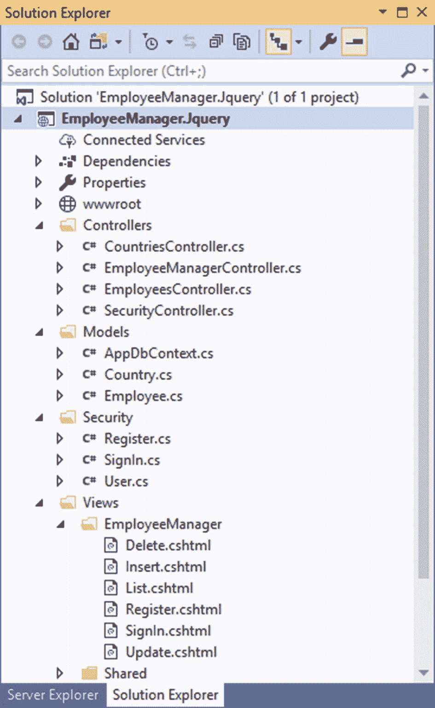
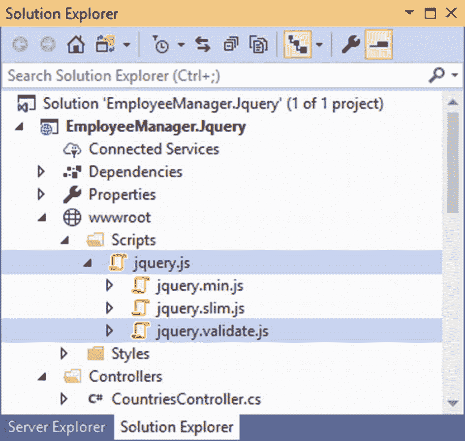
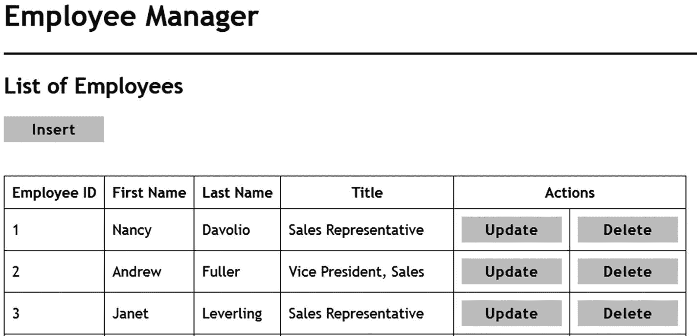
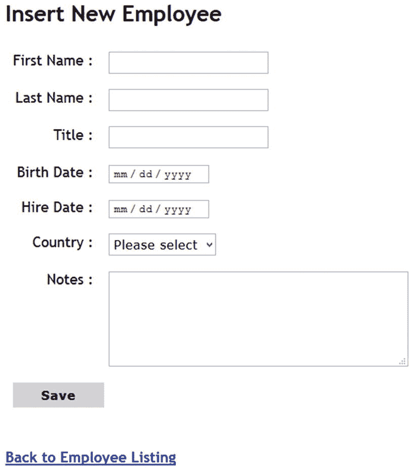
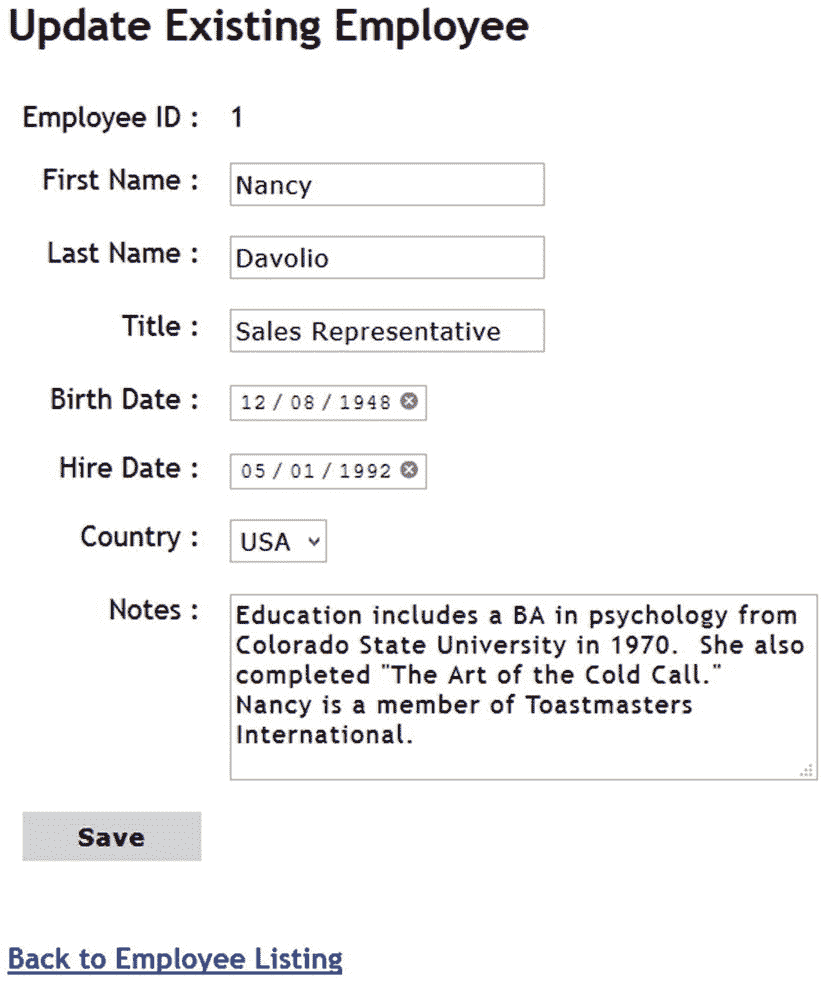
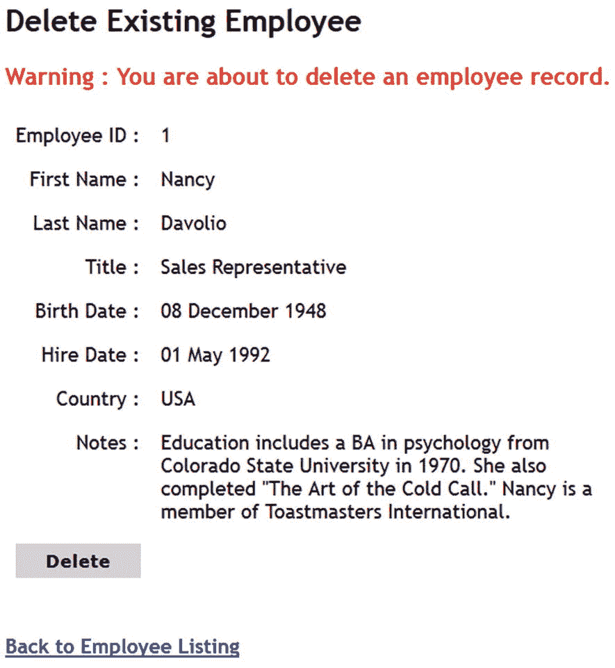
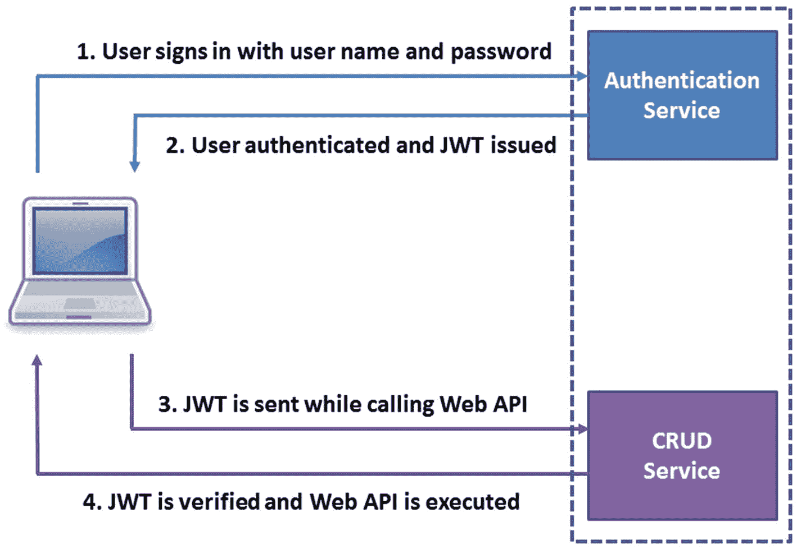
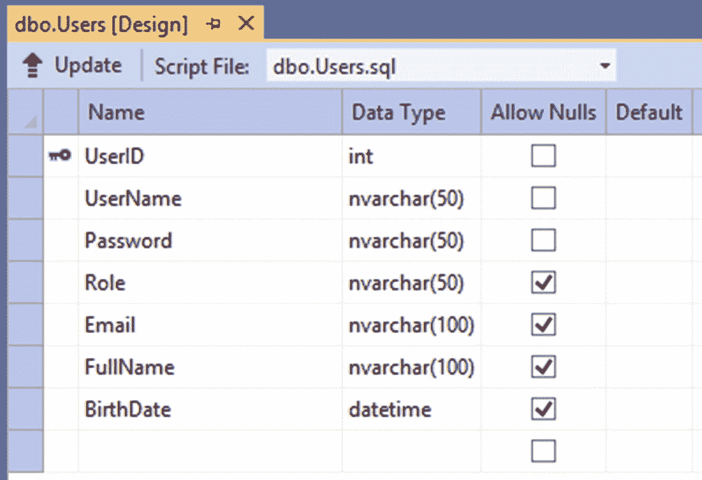

# 六、框架

在前一章中，您创建了 Web APIs 并使用 HttpClient 来使用它们。另一种调用 Web APIs 的流行方式是使用 jQuery Ajax 调用它们。jQuery 是一个功能丰富的 JavaScript 库，用于执行以 HTML 为中心的操作，如 DOM 操作、事件处理、动画和 Ajax。成千上万的网站正在使用 jQuery，学习如何使用这个流行的客户端库执行 CRUD 操作是值得的。为此，本章教你

*   构建异步 Web APIs

*   使用 jQuery 库的 Ajax 功能调用 Web APIs

*   使用实体框架核心的异步方法

*   使用基于 JSON Web 令牌(JWT)的认证方案执行用户认证

我们开始吧。

### 注意

本章假设您对 jQuery 库有基本的了解。尽管在遇到示例应用使用的 jQuery Ajax 特性时会对它们进行讨论，但本章并不教授您 jQuery 的基础知识。你可以考虑在 [`https://jquery.com`](https://jquery.com) 阅读 jQuery 官方文档来熟悉这个库。

## Ajax 概述

在我们真正研究本章中讨论的例子的任何代码之前，有必要了解什么是 Ajax，以及如何通过将它与 ASP.NET Core 集成来使您的 web 应用受益。

最初，Ajax 是异步 JavaScript 和 XML 的缩写。然而，现代 web 应用更喜欢 JSON 而不是 XML 作为数据传输的格式。简而言之，Ajax 是浏览器客户端和服务器之间的一种通信方式，它利用了 HTML、XML、JSON 和 JavaScript 等现有技术。

让我们简单了解一下 JavaScript 环境中的异步通信是什么。考虑一个数据输入页面，它允许您输入某些数据，然后将这些数据提交给服务器。服务器处理数据，并将处理结果发送回浏览器。

如果没有 Ajax，这种通信采用以下形式:

*   用户向数据输入页面发出初始请求。

*   服务器将请求的页面发送到浏览器。

*   用户填写数据输入表单，然后通过提交表单将数据发送到服务器。

*   表单提交后，用户就不能再使用表单了，因为浏览器正在等待服务器发送响应。

*   服务器处理数据并将一些响应发送回浏览器。

*   一旦在浏览器中呈现了响应，用户就可以再次与页面进行交互。

前面提到的操作是同步操作，因为数据输入(客户端活动)和数据处理(服务器端活动)是相继发生的。

现在假设相同的页面是使用 Ajax 构建的。这种情况下的操作顺序如下:

*   用户向数据输入页面发出初始请求。

*   服务器将请求的页面发送到浏览器。

*   用户填写数据输入表单，然后通过提交表单将数据发送到服务器。

*   这次表单是使用 Ajax 提交的。Ajax 是一种异步操作，可以通过 JavaScript 代码在后台执行。

*   即使浏览器正在等待服务器的响应，用户与页面的交互也不会中断。

*   服务器处理数据并将一些响应发送回浏览器。

*   浏览器可以通知用户该响应，以便可以采取进一步的动作(如果有的话)。

因此，在 Ajax 通信中，用户与页面的交互和服务器处理可以并行进行。需要注意的是，在 Ajax 通信过程中，需要选择 XML 或 JSON 等数据格式。使用 JavaScript 和浏览器提供的 XMLHttpRequest 对象触发前面文本中概述的 Ajax 通信。

jQuery 库将其 Ajax 功能包装到一组方法中，最重要的是$。ajax()。其他方法取决于$。ajax()方法来完成他们的工作。所以你用$。本章构建的示例应用中的 ajax()。

### 注意

本章中开发的示例使用了$。jQuery 的 ajax()方法来完成它的任务。要了解更多关于其他 Ajax 方法的信息，可以考虑阅读 [`https://api.jquery.com/category/ajax`](https://api.jquery.com/category/ajax) 。

## 创建 ASP.NET Core Web 应用

您在本章中开发的示例是一个 EmployeeManager。Jquery 项目。这个项目包括所需的 Web APIs，以及使用这些 API 的 jQuery 客户机。雇员经理。Jquery 应用在三个地方使用异步:

*   Web API 操作现在本质上是异步的。

*   执行 CRUD 操作的实体框架核心代码利用异步方法(只要适用)。

*   jQuery 客户端代码使用$。ajax()是异步通信。

在前面的示例中，您一直使用 ASP.NET Core Identity 来实现用户认证。在本例中，您将学习使用基于 JSON Web 令牌(JWT)的认证系统。关于 JWT 认证的更多细节将在本章后面的章节中介绍。

您可以创建和配置 EmployeeManager。Jquery 项目就像您在前面章节中创建的 MVC 和 Web API 项目一样。图 [6-1](#Fig1) 显示了 EmployeeManager。Jquery 项目在完成后加载到解决方案资源管理器中。



图 6-1

EmployeeManager。解决方案资源管理器中加载的 Jquery

整个项目组织与前面的例子非常相似，但是有一些不同。例如，控制器文件夹包含 API 控制器和 MVC 控制器。在接下来的小节中，您将开发几个部分，使这个应用主要关注 Ajax 通信。您可以从本书的代码下载中获得该应用的完整代码。为了简洁起见，这里不再讨论你已经知道的步骤(比如 EF 核心模型创建)。

### 注意

在下一节开发的 Web APIs 中，数据访问代码被直接添加到操作中。这样做是为了简洁和简单。一旦完成了这个应用，就可以将数据访问代码移动到存储库中。

## 员工 Web API 和国家 Web API

EmployeesController 和 CountriesController 表示执行 CRUD 操作的 Web API 类。EmployeesController 的 GetAsync()和 GetAsync(id)动作如清单 [6-1](#PC1) 所示。

```cs
[HttpGet]
public async Task<IActionResult> GetAsync()
{
    List<Employee> data = await db.Employees.ToListAsync();
    return Ok(data);
}

[HttpGet("{id}")]
public async Task<IActionResult> GetAsync(int id)
{
    Employee emp = await db.Employees.FindAsync(id);
    return Ok(emp);
}

Listing 6-1GetAsync() and GetAsync(id) actions of EmployeesController

```

使用`async`关键字将`GetAsync()`动作标记为异步动作，并返回一个`Task<IActionResult>`。在内部，代码使用 IQueryable 的`ToListAsync()`方法检索所有雇员。正如您可能已经猜到的，`ToListAsync()`是一个异步方法。请注意，`ToListAsync()`行标有`await`关键字。使用`Ok()`方法将`List<Employee>`返回给调用者。`Ok()`方法将`OkObjectResult`对象返回给调用者，并将 HTTP 状态代码设置为 200 (Ok)。在这种情况下，`List<Employee>`也被返回给调用者。

`GetAsync(id)`动作类似于刚刚讨论的`GetAsync()`动作。然而，它返回一个`Task<Employee>`，因为只有一个`Employee`将被返回。在内部，它使用`FindAsync()`异步方法找到一个具有匹配`EmployeeID`的`Employee`。在包装在`Ok()`方法中之后，`Employee`对象被返回给调用者。

### 注意

API 操作可以通过三种方式向调用者返回数据。它可以返回具体类型，如字符串或雇员。或者它可以将数据包装在 IActionResult 的实现中。或者它可以将 ActionResult <t>返回给调用者。在前一章中，您使用了第一种技术。在本章中，您将使用第二种技术向 jQuery 客户端返回数据。</t>

清单 [6-2](#PC2) 显示了`EmployeesController`的`PostAsync()`动作，它向 Employees 表中插入一个新雇员。

```cs
[HttpPost]
public async Task<IActionResult> PostAsync([FromBody]Employee emp)
{
    if (ModelState.IsValid)
    {
        await db.Employees.AddAsync(emp);
        await db.SaveChangesAsync();
        return CreatedAtAction("Get", new { id = emp.EmployeeID }, emp);
    }
    else
    {
        return BadRequest();
    }
}

Listing 6-2PostAsync() action inserts a new employee

```

`PostAsync()`动作是一个异步方法，返回包装在`Task`中的`IActionResult`对象。`PostAsync()`动作接受一个`Employee`对象作为其参数，该参数指示要添加到数据库中的新雇员。

请注意用粗体字母标记的代码。第一行使用`AddAsync()`方法将雇员添加到 DbSet 中。然后代码调用`SaveChangesAsync()`方法将更改保存到数据库中。注意，`AddAsync()`和`SaveChangesAsync()`是异步方法，因此各自的调用使用了`await`关键字。

`PostAsync()`动作向调用者返回成功状态代码或错误状态代码。通过使用`CreatedAtAction()`方法返回`CreatedAtActionResult`对象来指示动作的成功完成。`CreatedAtAction()`方法将 HTTP 状态代码设置为 201(已创建),还设置了 Location HTTP 头，指示新创建的资源的 URI。它接受三个参数:用于生成位置 URL 的动作的名称、生成 URL 时使用的路由数据以及新创建的资源。一个示例位置 URL 是/api/Employees/1234，其中 1234 是新创建的雇员的 EmployeeID。

使用`BadRequest()`方法将错误状态返回给调用者。`BadRequest()`方法将`BadRequestObjectResult`返回给调用者，并将 HTTP 状态代码设置为 400(错误请求),表示由于某些客户端错误，服务器无法处理请求。

清单 [6-3](#PC3) 显示了更新现有雇员的 Web API 的`PutAsync()`动作。

```cs
[HttpPut("{id}")]
public async Task<IActionResult> PutAsync(int id, [FromBody]Employee emp)
{
    if (ModelState.IsValid)
    {
        db.Employees.Update(emp);
        await db.SaveChangesAsync();
        return NoContent();
    }
    else
    {
        return BadRequest();
    }
}

Listing 6-3PutAsync() action updates an employee

```

这段代码对您来说应该很熟悉，因为它与`PostAsync()`动作非常相似。这次代码使用 Employees DbSet 的`Update()`方法来更新一个雇员。然后，`SaveChangesAsync()`方法将更改保存到数据库中。

通过使用`NoContent()`方法返回一个`NoContentResult`对象来指示动作的成功完成。`NoContent()`方法将 HTTP 状态码设置为 204(无内容)。像以前一样，通过调用`BadRequest()`方法返回一个错误状态。

清单 [6-4](#PC4) 显示了`EmployeesController`删除员工的`DeleteAsync()`动作。

```cs
[HttpDelete("{id}")]
public async Task<IActionResult> DeleteAsync(int id)
{
    Employee emp = await db.Employees.FindAsync(id);
    db.Employees.Remove(emp);
    await db.SaveChangesAsync();
    return NoContent();
}

Listing 6-4DeleteAsync() action deletes an employee

```

请注意用粗体字母标记的代码。`DeleteAsync()`动作首先使用 Employees DbSet 的`FindAsync()`方法找到一个要删除的雇员。然后，它使用`Remove()`方法从 DbSet 中删除该雇员。然后，`SaveChangesAsync()`方法从数据库中删除雇员。如前所述，通过调用`NoContent()`方法，成功状态代码 204 被返回给调用者。

这就完成了`EmployeesController`。在同一行上，您可以创建`CountriesController`。`CountriesController`只包含`GetAsync()`动作，如清单 [6-5](#PC5) 所示。

```cs
[HttpGet]
public async Task<IActionResult> GetAsync()
{
    List<Country> countries=await db.Countries.ToListAsync();
    return Ok(countries);
}

Listing 6-5Returning countries through CountriesController

```

`GetAsync()`动作非常简单，使用`ToListAsync()`来实现所有的`Country`实体。然后，通过用`Ok()`方法包装这些国家，将它们返回给调用者。

## 员工经理控制器

EmployeeManagerController 非常简单明了。由于实际的 CRUD 调用是从 jQuery 代码中发起的，因此 EmployeeManagerController 没有多少代码。它包含简单地将视图返回给客户端的操作。清单 [6-6](#PC6) 显示了这些动作，供您快速参考。

```cs
public IActionResult List()
{
    return View();
}

public IActionResult Insert()
{
    return View();
}

public IActionResult Update(int id)
{
    ViewBag.EmployeeID = id;
    return View();
}

public IActionResult Delete(int id)
{
    ViewBag.EmployeeID = id;
    return View();
}

Listing 6-6EmployeeManagerController contains actions that render views in the browser

```

如您所见，`List()`、`Insert()`、`Update()`和`Delete()`动作呈现了各自的视图。`Update()`和`Delete()`动作有一个存储在`ViewBag`中的 id 参数，这样就可以在各自的视图上访问`EmployeeID`。这个`EmployeeID`在 Ajax 更新和删除操作期间是必需的。

确保将这些操作返回的视图(List.cshtml、Insert.cshtml、Update.cshtml 和 Delete.cshtml)添加到 Views/EmployeeManager 文件夹中。

## 将 jQuery 库添加到项目中

在以前版本的 Employee Manager 应用中，您在 wwwroot\Scripts 文件夹中包含了一组 jQuery 文件。这些文件是客户端验证各种数据输入表单所必需的。您在 _Layout.cshtml 文件中添加了对这些文件的

```cs
<script src="~/Scripts/jquery.js"></script>
<script src="~/Scripts/jquery.validate.js"></script>

```

在本例中，您还需要将这些文件包含在 wwwroot\Scripts 文件夹中。尤其是核心的 jquery 库(jquery.js)和 jQuery 验证插件(jquery.validate.js)在本章的例子中对我们很重要。图 [6-2](#Fig2) 显示了放置在脚本文件夹中的这些文件。



图 6-2

jQuery 库和 jQuery 验证插件文件放在 wwwroot\Scripts 文件夹中

自从 EmployeeManager。Jquery 使用 jQuery Ajax 来调用 Web API，表单的呈现和处理方式将会发生变化:

*   数据输入表单不再使用标签助手或 HTML 助手。他们使用普通的 HTML 标记。

*   从服务器发送表单时，表单没有预加载数据。相反，数据是从客户端脚本加载的。

*   因为表单没有使用标签助手/HTML 助手，所以数据注释验证不用于执行验证。您需要使用 jQuery 验证插件来设置验证规则。

*   通过捕获保存/删除按钮的 click 事件，以编程方式启动插入、更新和删除操作。

## 显示员工列表

List.cshtml 视图(图 [6-3](#Fig3) )使用 jQuery Ajax 呈现一个雇员列表。jQuery 代码调用 Employees API 的 GetAsync()操作，动态生成雇员列表。



图 6-3

显示员工列表

为了完成这个功能，打开 List.cshtml 文件并添加 html 标记，如清单 [6-7](#PC8) 所示。

```cs
<h2>List of Employees</h2>

<h3 class="message"></h3>

<a asp-controller="EmployeeManager"
   asp-action="Insert"
   class="linkbutton">Insert</a>

<br /><br />

<table id="employeeList" border="1">
    <tr>
        <th>Employee ID</th>
        <th>First Name</th>
        <th>Last Name</th>
        <th>Title</th>
        <th colspan="2">Actions</th>
    </tr>
</table>

Listing 6-7Markup of List.cshtml

```

这种标记非常简单，您应该很熟悉。在页面的顶部，有一个使用锚标记帮助器呈现的插入链接。更重要的是后面的 HTML 表。的 id 为 employeeList。在向表中添加各种行时，jQuery 代码会使用这个 id。因为行是动态添加的，所以甚至更新和删除链接也是通过代码呈现的。

现在，在 List.cshtml 的顶部(页面标题的正上方)，添加一个如清单 [6-8](#PC9) 所示的脚本块。

```cs
<script>
    $(document).ready(function () {

    });
</script>

Listing 6-8jQuery ready() method

```

在这段代码中，`$`指的是 jQuery 对象。括号中的内容称为 jQuery 选择器。这里，是`document`选择器。有各种类型的选择器，您将在后面的章节中使用其中的一些。jQuery 选择器返回零个或多个 DOM 元素。这里，代码选择页面的文档对象，并对其调用`ready()`方法。

`ready()`方法接受一个匿名函数，当页面的 HTML 文档对象模型(DOM)在浏览器中可访问时，该函数将被调用。您希望仅在 List.cshtml 加载到浏览器中之后调用 Employees API，以便可以访问`employeeList`表。`ready()`方法帮助你轻松做到这一点。

实际调用 Employees API 的 jQuery 代码位于传递给`ready()`方法的匿名函数内部，如清单 [6-9](#PC10) 所示。

```cs
var options = {};
options.url = "/api/employees";
options.type = "GET";
options.dataType = "json";
options.beforeSend = function (request) {
  ...
};
options.success = function (data) {
  ...
};
options.error = function (xhr) {
  ...
}
$.ajax(options);

Listing 6-9Making Ajax call to the GetAsync() action of Employees API

```

代码创建了一个名为`options`的新 JavaScript 对象。然后在这个`options`对象上设置一系列属性。这些属性配置了对 Employees API 的 Ajax 调用，概括如下(请记住，jQuery 是一个 JavaScript 库，是区分大小写的):

*   url 属性指示 API 端点 URL。向这个目标 URL 发出一个 Ajax 请求。

*   type 属性指示用于调用 API 的 HTTP 谓词。在这种情况下，使用 GET 动词，因为您想要调用 API 的 GetAsync()操作。

*   dataType 属性表示从 API 返回的数据类型。在这种情况下，它是 JSON。其他可能性包括 XML、HTML 和 string。

*   beforeSend 属性是一个回调函数，在启动 Ajax 调用之前被调用。

*   success 属性是一个回调函数，在 API 调用成功完成时调用。

*   error 属性是一个回调函数，在 API 调用失败时调用。

最后，代码调用 jQuery 的`$.ajax()`方法来启动 Ajax 调用。包含配置设置的选项对象作为参数传递给`$.ajax()`调用。

现在，让我们讨论代码中提到的三个回调函数——`beforeSend`、`success`和`error`。`beforeSend`回调非常简单，如清单 [6-10](#PC11) 所示。

```cs
options.beforeSend = function (xhr) {
    $("h3.message").html("Wait...");
};

Listing 6-10beforeSend callback function

```

这里，回调函数接受一个类型为`jqXHR`的对象。`jqXHR`基本上是`XMLHttpRequest`对象的超集。尽管此时代码没有使用`xhr`参数，但是您仍然可以将它添加到签名中，因为您在实现 JWT 认证时会用到它。

在内部，回调函数使用 jQuery 的 CSS 选择器并获取应用了`message` CSS 类的`<h3>`元素。然后使用`html()`方法将`<h3>`元素的 HTML 内容设置为进度消息。通过这种方式，可以通知用户 Ajax 正在后台运行。你也可以使用精美的图片或动画来代替文本信息。

Ajax 调用成功完成时调用的成功函数如清单 [6-11](#PC12) 所示。

```cs
options.success = function (data) {
    data.forEach(function (element) {
        var row = "<tr>";
        row += "<td>";
        row += element.employeeID;
        row += "</td>";
        row += "<td>";
        row += element.firstName;
        row += "</td>";
        row += "<td>";
        row += element.lastName;
        row += "</td>";
        row += "<td>";
        row += element.title;
        row += "</td>";
        row += "<td>";
        row += "<a href='/EmployeeManager/Update/" + element.employeeID + "' class="linkbutton">Update</a>";
        row += "</td>";
        row += "<td>";
        row += "<a href='/EmployeeManager/Delete/" + element.employeeID + "' class="linkbutton">Delete</a>";
        row += "</td>";
        row += "</tr>";
        $("#employeeList").append(row);
    });
    $("h3.message").html("");

    if (sessionStorage.hasOwnProperty("message")) {
$("h3.message").html(sessionStorage.getItem("message"));
        sessionStorage.removeItem("message");
    }
};

Listing 6-11Success callback function adds rows to the table

```

success 函数接收从 API 返回的值作为它的参数。回想一下，Employees API 的`GetAsync()`动作返回了一个`Employee`对象的列表。因此，success 函数接收一组`Employee`对象作为它的参数。

在内部，代码使用它的`forEach()`方法遍历数组。每次迭代形成一个表行`(<tr>`元素)。每行包含输出雇员的`employeeID`、`firstName`、`lastName`和`title`的列。注意，诸如`EmployeeID`、`FirstName`和`LastName`之类的服务器端属性名称会自动转换成它们的大小写相等的名称。这样做是因为在 JavaScript 世界中，驼峰式大小写非常普遍和流行。

请注意，表格行还包含更新和删除链接。这些链接分别指向`EmployeeManagerController`和`,`的`Update()`和`Delete()`动作。还要注意，`employeeID`是通过一个路由参数传递给这些动作的。

一旦创建了行的 HTML 标记，就使用`append()`方法将该行添加到`employeeList`表中。为了获得`employeeList`表，使用了 jQuery 的 id 选择器(# 后跟一个 HTML 元素的 ID)。一旦添加了表行，就通过将其值设置为空字符串来清除进度消息。

接下来，在删除操作期间，删除页面将成功消息设置到客户端的`sessionStorage`对象中。`sessionStorage`对象是一种客户端存储机制，允许您存储任意的键值对。只要当前会话存在，`sessionStorage`对象就存在。如果您关闭浏览器选项卡或浏览器窗口，那么来自`sessionStorage`的所有数据都将被丢弃。代码检查`sessionStorage`对象是否包含一个名为`message`的键。这是使用`hasOwnProperty()`方法完成的。如果消息属性存在，`hasOwnProperty()`方法返回 true。然后使用`getItem()`方法检索`message`，并将其分配给`<h3>`元素。然后使用`remove()`方法将`message`键从`sessionStorage`中取出。

错误回调函数是在调用 Employees API 时出现错误的情况下调用的，如清单 [6-12](#PC13) 所示。

```cs
options.error = function (xhr) {
    $("h3.message").html("Error while calling the API");
}

Listing 6-12Error callback is executed in case the API call fails

```

错误回调接收一个`jqXHR`，就像`beforeSend`回调一样。在内部，`<h3>`元素中会显示一条错误消息，这样用户就可以得到错误通知。

## 插入新员工

单击员工列表页面上的插入链接，您将进入另一个页面，您可以在其中插入新员工(图 [6-4](#Fig4) )。



图 6-4

插入新员工

Insert.cshtml 使用普通 html 标记来呈现数据输入表单。这个标记如清单 [6-13](#PC14) 所示。注意，为了清楚起见，清单中省略了与插入操作不直接相关的标记。

```cs
<h2>Insert New Employee</h2>

<h3 class="message"></h3>

<form id="insertForm">
    <table border="0">
       ...
       <label for="firstName">First Name :</label>
       ...
       <input type="text" id="firstName" name="firstName"/>
       ...
       <label for="lastName">Last Name :</label>
       ...
    <input type="text" id="lastName" name="lastName" />
    ...
    <label for="title">Title :</label>
    ...
    <input type="text" id="title" name="title"/>
    ...
    <label for="birthDate">Birth Date :</label>
    ...
    <input type="date" id="birthDate" name="birthDate"/>
    ...
    <label for="hireDate">Hire Date :</label>
    ...
    <input type="date" id="hireDate" name="hireDate"/>
    ...
    <label for="country">Country :</label>
    ...
    <select id="country" name="country">
      <option value="">Please select</option>
    </select>
    ...
    <label for="notes">Notes :</label>
    ...
    <textarea id="notes" name="name" rows="5" cols="40">
    </textarea>
     ...
     <button id="save" type="button">Save</button>
     ...
    </table>
</form>

Listing 6-13Markup of Insert.cshtml

```

<form>元素的 id 是`insertForm`。未设置表单的 action 和 method 属性，因为表单不是通过传统的 HTML 方式提交的；相反，Ajax 调用用于将数据发送到服务器。</form>

里面有一系列用于输入各种数据的表单字段。注意，这些元素的 id 和 name 属性分别被设置为`firstName`、`lastName`、`title`、`birthDate`、`hireDate`、`country`和`notes,`。`id`属性主要由 jQuery 代码使用，而`name`属性在使用 jQuery 验证插件连接验证规则时使用。

表单验证是在 jQuery 的`ready()`回调中配置的。这段代码涉及到设置验证规则、验证消息等任务。这里为了简单起见，只做了必不可少的配置。您可以访问 jQuery 验证插件的官方网站( [`https://jqueryvalidation.org`](https://jqueryvalidation.org) )了解更多详细信息。配置验证的 jQuery 代码如清单 [6-14](#PC15) 所示。

```cs
$("#insertForm").validate({
    rules: {
        firstName: {
            required: true,
            maxlength: 10
        },
        lastName: {
            required: true,
            maxlength: 20
        },
        title: {
            required: true,
            maxlength: 30
        },
        birthDate: "required",
        hireDate: "required",
        country:"required",
        notes: {
            maxlength: 500
        }
    },
    messages: {
        firstName: "Invalid First Name",
        lastName: "Invalid Last Name",
        title: "Invalid Title",
        birthDate: "Invalid Birth Date",
        hireDate: "Invalid Hire Date",
        country:"Invalid Country",
        notes: "Invalid Notes"
    },
    errorClass: "message"
});

Listing 6-14Configuring form validation rules

```

这段代码初始化 insertForm 上的 jQuery 验证插件。使用 jQuery 的 ID 选择器(#insertForm)选择 insertForm，然后调用 validate()方法传递配置细节。配置细节通过 JavaScript 对象文字传递，总结如下:

*   这里使用了三个主要的配置属性——规则、消息和错误类。

*   rules 属性包含一组表单域和应用于它们的验证规则。例如，名字输入字段的验证规则包括 required 和 maxlength。required 属性设置为 true，表示该字段是必需的。maxlength 属性设置为 10，表示该字段最多可以输入十个字符。在相同的行上，配置其他表单字段的验证规则。

*   messages 属性包括一组为表单域显示的验证错误消息。例如，如果任何验证规则失败，名字输入字段将显示无效的名字。

*   errorClass 属性表示应用于表单域和错误消息的 CSS 类，以防它们包含无效数据。

除了指定验证规则，您还可以用 HTML5 属性的形式指定它们。例如，名字的验证规则也可以这样指定:

```cs
<input type="text"
id="firstName"
name="firstName"
maxlength="10" required/>

```

因此，根据您的需求和偏好的编码风格，您可以选择一种指定验证规则的方式。

一旦 Insert.cshtml 加载到浏览器中，您需要向 Countries API 发起一个 Ajax 请求，以获取所有国家的列表。然后将该列表填入国家下拉列表。清单 [6-15](#PC17) 展示了这是如何完成的(在初始化 jQuery 验证插件后立即放置这段代码)。

```cs
var options = {};
options.url = "/api/countries";
options.type = "GET";
options.dataType = "json";

options.beforeSend = function (request) {
    $("h3.message").html("Wait...");
};

options.success = function (countries) {
  for (var i = 0; i < countries.length; i++) {
      $("#country").append("<option>" + countries[i].name
      + "</option>");
  }
  $("h3.message").html("");
};

options.error = function (xhr) {
    $("h3.message").html("Error while calling the API!");
};

$.ajax(options);

Listing 6-15Filling the Country dropdown list

```

这段代码对您来说应该很熟悉，因为您在 List.cshtml 中使用了类似的代码。相应地设置选项对象的`url`和`type`属性。

看看成功回调函数。它接收一个`countries`数组作为它的参数，因为 Countries API 返回一个`Country`对象的列表。在里面，一个`for`循环遍历国家数组，一个接一个地将国家添加到国家下拉列表中。jQuery 的`append()`方法接受一个 HTML 标记，并将其附加到选定的元素上。一个`<select>`元素包含`<option>`子元素，因此各种`<option>`元素被追加到国家下拉列表中。

Ajax 调用是通过调用 jQuery 的`$.ajax()`方法并向其传递 options 对象来启动的。

当用户填写各种表单字段并单击`Save`按钮时，您需要调用 Employees API 的`PostAsync()`动作并将新雇员保存到数据库中。这将调用`Save`按钮的 handing click 事件(列表 [6-16](#PC18) )。

```cs
$("#save").click(function () {
    if ($("#insertForm").valid()) {
        var options = {};
        options.url = "/api/employees";
        options.type = "POST";

        var obj = {};
        obj.firstName = $("#firstName").val();
        obj.lastName = $("#lastName").val();
        obj.title = $("#title").val();
        obj.birthDate = $("#birthDate").val();
        obj.hireDate = $("#hireDate").val();
        obj.country = $("#country").val();
        obj.notes = $("#notes").val();

        options.data = JSON.stringify(obj);
        options.contentType = "application/json";

        options.beforeSend = function (request) {
            $("h3.message").html("Wait...");
        };
        options.success = function () {
                         $("h3.message").html("Employee inserted successfully!");
                  };
        options.error = function (xhr) {
            $("h3.message").html("Error while calling
                                  the  API!");
        };
        $.ajax(options);
    }
});

Listing 6-16Invoking the PostAsync() action of Employees API

```

该代码使用 jQuery 的`click()`方法来指定一个回调函数，当用户单击 Save 按钮时，该函数将被执行。只有当所有表单字段都包含有效值时，才会发出 Ajax 请求。这是使用 jQuery 验证插件的`valid()`方法来检查的。如果表单有效(`valid()`返回 true)，则创建 options 对象并设置其各种属性。

因为您想要调用 Employees API 的`PostAsync()`动作，所以类型被设置为 POST。

在发出发布请求时，您还需要发送新员工的详细信息。这些细节填充在一个名为`obj`的 JavaScript 对象中。注意如何使用`val()`方法从表单字段中检索值。请记住，obj 的属性名必须与 Employee 的属性名相匹配。

然后使用`JSON.stringify()`方法将`obj` JavaScript 对象转换成它的 JSON 等价物。所有现代浏览器都提供了`JSON.stringify()`方法。它接受一个 JavaScript 对象，并转换成它的 JSON 等价物。生成的 JSON 字符串被分配给 options 对象的 data 属性。

`contentType`属性用于指示伴随请求的数据的内容类型。因为员工数据是以 JSON 格式发送的，所以`contentType`被设置为 application/json。

`beforeSend`回调函数向用户显示一条进度消息，表明 Ajax 调用正在进行。

如果 Web API 调用成功，则调用`success`回调函数，并向用户显示成功消息。

在 API 调用失败的情况下调用`error`回调，并向用户显示错误消息。

最后，使用 jQuery 的`$.ajax()`方法启动 Ajax 调用。

## 更新现有员工

在员工列表页面上，每个员工行都有更新和删除链接。单击“更新”链接将带您进入“更新员工”页面，该页面显示该员工的现有详细信息以供编辑(图 [6-5](#Fig5) )。



图 6-5

更新现有员工

“更新现有员工”页面看起来与“插入新员工”页面相似，不同之处在于现在用被修改员工的详细信息填充了各种控制值。作为主键的`EmployeeID`不能修改。

Update.cshtml 包含一个`<form>`，它与前面的部分非常相似。然而，这一次，它也将被修改的`EmployeeID`嵌入到一个隐藏的表单字段中。如清单 [6-17](#PC19) 所示。

```cs
<form id="updateForm">
   ...
   <label for="firstName">Employee ID :</label>
   ...
   <span>@ViewBag.EmployeeID</span>
   <input type="hidden" id="employeeID" name="employeeID"
          value="@ViewBag.EmployeeID" />
   ...
</form>

Listing 6-17Update.cshtml embeds EmployeeID as a hidden form field

```

如您所见，`updateForm`在一个`<span>`元素中显示了`EmployeeID`,并在一个隐藏的表单字段中存储了它的值。回想一下`EmployeeManagerController`的`Update()`动作将`EmployeeID`存储到`ViewBag`中。同样的`ViewBag`属性在这里被检索并分配给隐藏的表单字段。

`updateForm`的其他表单域与前面的表单非常相似，因此这里不再讨论。连接表单验证和填写国家下拉列表的过程与之前完全相同，因此这里不再讨论。

一旦填充了国家下拉列表，您需要向 Employees API 发出一个 Ajax 请求来调用`GetAsync(id)`动作。这是必要的，因为您需要将现有的员工详细信息填充到各种表单字段中，以便用户可以根据需要修改它们。这个 Ajax 调用如清单 [6-18](#PC20) 所示。

```cs
var options = {};
options.url = "/api/employees/" + $("#employeeID").val();
options.type = "GET";
options.dataType = "json";
options.beforeSend = function (request) {
    $("h3.message").html("Wait...");
};
options.success = function (data) {
 $("#firstName").val(data.firstName);
 $("#lastName").val(data.lastName);
 $("#title").val(data.title);
 $("#birthDate").val(data.birthDate.substring(0, 10));
 $("#hireDate").val(data.hireDate.substring(0, 10));
 $("#country").val(data.country);
 $("#notes").val(data.notes);
 $("h3.message").html("");
};
options.error = function () {
    $("h3.message").html("Error while calling the API!");
};
$.ajax(options);

Listing 6-18Filling form fields with existing employee details

```

请注意以粗体显示的代码。这一次，options 对象的`url`属性还包括要检索其详细信息的`EmployeeID`。从隐藏的表单字段中检索出`EmployeeID`。

`success`函数接收 Employee 对象，该对象的详细信息是从服务器获取的。然后，代码用从 API 接收的详细信息填充各种表单字段，如`firstName`、`lastName`、`title`、`hireDate`、`country`和`notes`。注意使用了`val()`方法来设置表单字段值。还要注意`birthDate`和`hireDate`值是如何分配的。默认情况下，Web API 以 ISO 日期格式返回日期:yyyy-MM-ddThh:mm:ss。由于这些字段是日期字段，因此在将值赋给输入字段之前，需要对时间部分进行修整。这是使用 JavaScript `substring()`方法完成的(您也可以使用一些其他的 JavaScript 技术来获得 yyyy-MM-dd 格式的日期值)。一旦分配了表单字段值，就会删除进度消息。

像以前一样，使用`$.ajax()`方法启动 Ajax 调用。

当用户对员工详细信息进行更改并单击 Save 按钮时，您需要调用 Employees API 的`PutAsync()`操作，以便将更改保存到数据库中。这需要处理保存按钮的点击事件，如清单 [6-19](#PC21) 所示。

```cs
$("#save").click(function () {
    if ($("#updateForm").valid()) {
        var options = {};
        options.url = "/api/employees/" + $("#employeeID").val();
        options.type = "PUT";

        var obj = {};
        obj.employeeID = parseInt($("#employeeID").val());
        obj.firstName = $("#firstName").val();
        obj.lastName = $("#lastName").val();
        obj.title = $("#title").val();
        obj.birthDate = $("#birthDate").val();
        obj.hireDate = $("#hireDate").val();
        obj.country = $("#country").val();
        obj.notes = $("#notes").val();

        options.data = JSON.stringify(obj);
        options.contentType = "application/json";

     options.beforeSend = function (request) {
         $("h3.message").html("Wait...");
     };
     options.success = function () {
         $("h3.message").html("Employee updated
                               successfully!");
     };
     options.error = function (xhr) {
         $("h3.message").html("Error while calling
                               the API!");
     };
     $.ajax(options);
    }
});

Listing 6-19Invoking the PutAsync() action of Employees API

```

这段代码与插入新雇员的代码非常相似。请注意用粗体字母标记的代码。这次`url`属性也包括了`EmployeeID`。这个`EmployeeID`被提供给`PutAsync()` API 动作的`id`参数。此外，由于这是一个更新操作，因此会放置 type 属性中指定的 HTTP 谓词。还要注意使用了`parseInt()` JavaScript 方法将字符串 EmployeeID 从隐藏的输入字段转换为整数。

最后，`$.ajax()`接受带有配置设置的选项对象，并启动 Ajax 调用。

## 删除现有员工

当您单击 List.cshtml 中某个员工记录的删除链接时，会显示一个确认页面，警告用户该员工已被删除。一旦用户确认删除，该员工将从数据库中删除(图 [6-6](#Fig6) )。



图 6-6

确认员工删除

当 Delete.cshtml 呈现在浏览器中时，您需要进行一个 Ajax 调用并检索特定`EmployeeID`的员工详细信息。为了显示这些细节，可以使用清单 [6-20](#PC22) 中所示的元素。为了清楚起见，这里只显示了整个标记的一部分。

```cs
<h2>Delete Existing Employee</h2>
<h3 class="message">
    Warning : You are about to delete an employee record.
</h3>
<form id="deleteForm">
    <table border="0">
        <tr>
            <td class="right">Employee ID :</td>
            <td>
                <span>@ViewBag.EmployeeID</span>
                <input type="hidden"
                       id="employeeID"
                       name="employeeID"
                       value="@ViewBag.EmployeeID" />
            </td>
        </tr>
        <tr>
            <td class="right">First Name :</td>
            <td><span id="firstName"></span></td>
        </tr>
        <tr>
            <td class="right">Last Name :</td>
            <td><span id="lastName"></span></td>
        </tr>
        ...
        ...
        <tr>
            <td colspan="2">
                <button id="delete" type="button">
                  Delete
                </button>
            </td>
        </tr>
    </table>
</form>

Listing 6-20Displaying employee details in <span> elements

```

回想一下 EmployeeManagerController 的`Delete()`动作将`EmployeeID`存储在`ViewBag`中。这个`EmployeeID`存储在一个隐藏的输入字段中，以便 jQuery Ajax 代码知道哪个雇员将被删除。显示雇员详细信息的`<span>`元素具有 id 属性—`firstName`、`lastName`、`title`、`birthDate`、`hireDate`、`country`和`notes`。这些`<span>`元素被分配了来自 jQuery 代码的相应值，稍后会讨论。还有一个`Delete`按钮可用于启动删除操作。

像以前一样，加载雇员详细信息的 jQuery 代码放在`ready()`方法内部。清单 [6-21](#PC23) 展示了这是如何做到的。

```cs
var options = {};
options.url = "/api/employees/" + $("#employeeID").val();
options.type = "GET";
options.dataType = "json";
options.beforeSend = function (request) {
    $("h3.message").html("Wait...");
};
options.success = function (data) {
    $("#firstName").html(data.firstName);
    $("#lastName").html(data.lastName);
    $("#title").html(data.title);
    $("#birthDate").html(data.birthDate.substring(0, 10));
    $("#hireDate").html(data.hireDate.substring(0, 10));
    $("#country").html(data.country);
    $("#notes").html(data.notes);
    $("h3.message").html("");
};
options.error = function (xhr) {
    $("h3.message").html("Error while calling the API!");
};
$.ajax(options);

Listing 6-21jQuery code loads employee details from the Employees API

```

该代码向 Employees API 发出 GET 请求，并在 URL 中传递`EmployeeID`。这样，Employees API 的`GetAsync(id)`动作被调用并返回一个特定的雇员。这个雇员对象是在成功回调函数中接收的。在成功回调中，代码使用`html()`方法为各种`<span>`元素赋值。

`beforeSend`回调和错误回调非常简单，与前面的调用相同。

最后，`$.ajax()`方法接受带有各种配置设置的 options 对象，并启动 Ajax 调用。

当用户单击 Delete 按钮时，会向服务器发出另一个 Ajax 调用来删除雇员。这需要处理 jQuery 代码中 Delete 按钮的 click 事件。清单 [6-22](#PC24) 显示了这是如何完成的。

```cs
$("#delete").click(function () {
    var options = {};
    options.url = "/api/employees/" + $("#employeeID").val();
    options.type = "DELETE";
    options.contentType = "application/json";
    options.beforeSend = function (request) {
        $("h3.message").html("Wait...");
    };
    options.success = function () {
        sessionStorage.setItem("message", "Employee deleted
                                           successfully!");
        window.location.href = "/EmployeeManager/List";
    };
    options.error = function (xhr) {
        $("h3.message").html("Error while calling the API!");
    };
    $.ajax(options);
});

Listing 6-22Deleting an employee by invoking the DeleteAsync() action

```

click 回调函数首先配置选项对象。注意，options 对象的 type 属性被设置为`DELETE`，以便调用 Employees API 的`DeleteAsync()`动作。还要注意，存储在隐藏输入字段中的`EmployeeID`被附加到在`url`属性中指定的 URL。

一旦成功删除员工，就会调用`success`回调。在内部，一个成功消息存储在`sessionStorage`对象的`message`键中。然后，用户被重定向到员工列表页面。回忆 List.cshtml 向用户显示存储在`sessionStorage`中的成功消息。最后，使用`$.ajax()`方法启动 Ajax 调用。

在这个阶段，您的应用已经准备好执行 CRUD 操作。您可以运行应用并检查所有 jQuery Ajax 调用是否都按预期工作。在接下来的小节中，您将把基于 JSON Web 令牌(JWT)的认证方案集成到员工管理器应用中。

## 基于 JSON Web 令牌(JWT)的认证概述

在前面的章节中，您使用了 ASP.NET Core Identity 来验证和授权用户。您知道 ASP.NET Core Identity 认证对其功能使用基于 cookie 的身份认证。尽管基于 cookie 的认证对于许多应用来说都非常有效，但是有些情况下开发人员更喜欢使用替代方案。请考虑以下几点:

*   作为请求-响应周期的一部分，Cookies 在浏览器和服务器之间自动传输。这种自动 cookie 传输会将 web 应用暴露给 CSRF/XSRF 攻击。

*   浏览器自动发送 cookies 只适用于属于同一来源的请求。这意味着跨域调用不能有效地使用 cookie 认证。

*   Cookies 主要用于基于浏览器的客户端。移动应用等非浏览器客户端可能无法处理 cookies。

考虑到这一点，越来越多的现代 web 应用，尤其是单页面应用(SPAs)和 Web APIs，更倾向于替代传统的 cookie 认证。一种流行的替代方法是 JSON Web Token 或 JWT。

### 什么是 JWT？

JWT 是在客户端和服务器之间传递用户数据的开放标准。JWT 更加安全，也可以用于非浏览器客户端。JWT 由三部分组成，即报头、有效载荷和签名:

```cs
header.payload.signature

```

头部分包含用于生成签名的算法等信息，是一个 JSON 对象。

有效载荷部分由存储在 JWT 内部的数据或声明组成。例如，用户 ID 和角色可以作为 JWT 中有效负载的一部分。

基于报头和有效载荷，使用诸如 HS256 (HMAC 与 SHA-256)之类的算法生成加密散列。生成该散列时使用了密钥。然后将得到的散列数据作为 JWT 的签名部分进行附加。

### 注意

在这里，只有一个简化版本的 JWT 介绍只是为了让你对整个 JWT 生成过程有一个简要的了解。对所有相关编码和散列技术的讨论超出了本书的范围。

与浏览器自动传递给服务器的 cookies 不同，JWT 需要显式传递给服务器。因此，简化的操作流程如下:

*   客户端将用户名和密码等安全凭证发送到服务器进行验证。

*   服务器验证用户名和密码。

*   如果发现正确，服务器生成一个 JWT 并发送给客户端。

*   客户端接收令牌并将其存储在某个地方。

*   当从服务器请求任何资源时，客户端会在授权头中添加之前发布的 JWT。

*   服务器读取授权头以检索 JWT。

*   如果令牌有效，服务器将执行客户端请求的操作。

该操作流程如图 [6-7](#Fig7) 所示。



图 6-7

简单地说，JWT 认证流程

如图所示，有三个不同的部分——客户端、认证服务和 CRUD 服务。用户通过向认证服务发送用户名和密码来登录系统。这里，假设认证服务和 CRUD 服务是同一个应用的一部分。然而，认证服务也可以是第三方服务。认证服务首先通过验证提供的用户名和密码来认证用户。如果详细信息有效，它将创建一个 JWT 并将其颁发给该用户。

用户现在可以调用 CRUD 服务(或任何其他特定于应用的服务)。在这样做的同时，用户通过授权头发送 JWT。CRUD 服务验证传入的 JWT。如果 JWT 有效，它将继续调用所请求的操作。操作的响应被发送回用户。

就员工管理器而言，JWT 是由 SecurityController 创建的——一个负责用户注册和登录的 Web API。SecurityController 将在后面的章节中讨论。

## 添加对 JWT 认证的支持

现在您已经熟悉了基于 JWT 的认证，让我们将 JWT 认证支持添加到本章前面开发的 Employee Manager 中。在接下来的小节中，您将逐步添加这种支持，第一步是为用户信息定义一个数据存储。

### 存储用户详细信息

ASP.NET Core Identity 将用户名、密码和电子邮件等用户和角色详细信息存储在特定的 SQL Server 表中；你已经熟悉了前几章例子中的那些表格。既然您希望使用不同的认证方案(在本例中是 JWT)，那么您还需要决定这些细节的数据存储。在本例中，您将为此目的在 Northwind 数据库中创建一个新表。常见的做法是创建三个表，即用户、角色和用户角色，以存储用户详细信息、角色详细信息和用户到角色的映射。然而，为了简单起见，您只创建了一个名为 Users with schema 的表，如图 [6-8](#Fig8) 所示。



图 6-8

添加到 Northwind 数据库中的用户表

如您所见，Users 表由这些列组成——UserID、UserName、Password、Email、FullName、BirthDate 和 Role。列名是不言自明的。角色列包含分配给用户的角色名称。在本例中，用户仅被分配了一个角色——经理。所以这个简单的安排适用于员工经理。注意，所有这些细节都以纯文本的形式存储。在更现实的场景中，您应该考虑一些加密策略来存储这些细节。

一旦将 Users 表添加到 Northwind 数据库中，就可以创建映射到该表的 User 实体类。用户类如清单 [6-23](#PC26) 所示。

```cs
public class User
{
    [DatabaseGenerated(DatabaseGeneratedOption.Identity)]
    [Required]
    [Display(Name ="User ID")]
    public int UserID { get; set; }

    [Required]
    [StringLength(20)]
    [Display(Name = "User Name")]
    public string UserName { get; set; }

    [Required]
    [StringLength(20)]
    [Display(Name = "Password")]
    public string Password { get; set; }

    [Required]
    [Display(Name = "Email")]
    [EmailAddress]
    public string Email { get; set; }

    [Required]
    [Display(Name = "Full Name")]
    public string FullName { get; set; }

    [Required]
    [Display(Name = "Birth Date")]
    public DateTime BirthDate { get; set; }

    [Required]
    [StringLength(50)]
    [Display(Name = "Role")]
    public string Role { get; set; }
}

Listing 6-23User class maps to the Users table

```

用户类包含几个属性，如`UserID`、`UserName`、`Password`、`Email`、`FullName`、`BirthDate`和`Role`。这些属性映射到您刚刚创建的 Users 表的列。

确保将`Users` DbSet 添加到`AppDbContext`中，以便可以通过 EF Core 访问用户数据:

```cs
public class AppDbContext:DbContext
{
    ...
    public DbSet<User> Users { get; set; }
}

```

### 启用和配置 JWT 认证

现在您已经创建了用户表和用户实体类，您已经准备好为您的 web 应用启用 JWT 认证了。您可以在`Startup`类的`ConfigureServices()`方法中这样做。然而，在您进入`ConfigureServices()`之前，您需要添加这个 NuGet 包—`Microsoft.AspNetCore.Authentication.JwtBearer`。这个包代表了一个支持 JWT 认证特性的 ASP.NET Core 中间件。

现在，将清单 [6-24](#PC28) 中所示的配置信息添加到 appsettings.json 中。

```cs
"Jwt": {
  "Key": "c65decd0-c396-4083-a71e-f8ad42cf7f7d",
  "Issuer": "Employee Manager Security API",
  "Audience": "Employee Manager Client App"
}

Listing 6-24Adding JWT configuration to appsettings.json

```

这里添加了一个名为`Jwt`的配置部分，它包含三个键——`Key`、`Issuer`和`Audience`。`Key`是用于签署 JWT 的秘密密钥。在这种情况下，GUID 仅用作示例。`Issuer`键表示代表 JWT 发行者的字符串值。发行人是发行 JWT 的一方。在此示例中，SecurityController Web API 是发行者。`Audience`是指 JWT 的预期接收人。在这个例子中，jQuery 客户机是接收者。

JWT 包含发行者和受众的详细信息，可以在验证它时使用。颁发给一个应用的 JWT 不应与另一个应用一起使用。这是使用发行者和受众值来确保的。在更真实的情况下，您应该将这些键设置为更有意义的值，例如 URIs，表示各自的参与方。

这些细节(密钥、发布者和受众)用在代码中两个不同的地方。首先，它们在创建新 JWT 时使用。这发生在 SecurityController 中(稍后讨论)。其次，在配置 JWT 认证时会使用这些详细信息，以便可以根据这些详细信息验证调用员工 Web API 和国家 Web API 时提供的 JWT。这发生在应用启动时(稍后讨论)。这些值存储在 appsettings.json 中，以避免在源代码中对它们进行硬编码。

然后打开启动类并使用这些名称空间:

```cs
using Microsoft.AspNetCore.Authentication.JwtBearer;
using Microsoft.IdentityModel.Tokens;

```

接下来，转到`ConfigureServices()`方法，并在方法末尾添加清单 [6-25](#PC30) 中所示的配置。

```cs
public void ConfigureServices(IServiceCollection services)
{
   ...
   ...
   services.AddAuthentication
(JwtBearerDefaults.AuthenticationScheme)
            .AddJwtBearer(options =>
            {
                options.TokenValidationParameters =
                new TokenValidationParameters
                {
                    ClockSkew = TimeSpan.Zero,
                    ValidateIssuer = true,
                    ValidateAudience = true,
                    ValidateLifetime = true,
                    ValidateIssuerSigningKey = true,
                    ValidIssuer = config["Jwt:Issuer"],
                    ValidAudience = config["Jwt:Audience"],
                    IssuerSigningKey = new SymmetricSecurityKey(Encoding.UTF8.GetBytes(config["Jwt:Key"]))
                };
            });

}

Listing 6-25Configuring JWT authentication in the ConfigureServices() method

```

代码使用`AddAuthentication()`方法将认证方案指定为`JwtBearerDefaults.AuthenticationScheme`。

然后，`AddJwtBearer()`方法配置在验证 jwt 时使用的各种参数。将`ValidateIssuer`、`ValidateAudience`、`ValidateLifetime`和`ValidateIssuerSigningKey`属性设置为 true，表示应该根据指定的值验证 JWT 的颁发者、受众、生存期和签名密钥。这些信息的值是通过属性—`ValidIssuer`、`ValidAudience`和`IssuerSigningKey`属性提供的。JWT 的生命周期是在生成时指定的。`ValidIssuer`、`ValidAudience`和`IssuerSigningKey`的值是从 appsettings.json 中选取的(阅读前面的讨论)。

请注意，`IssuerSigningKey`被分配了一个`SymmetricSecurityKey`对象。通过传递存储在 appsettings.json 中的密钥的字节数组来构造`SymmetricSecurityKey`对象

一旦`ConfigureServices()`完成，转到`Configure()`，像平常一样调用`UseAuthentication()`和`UseAuthorization()`方法(列出 [6-26](#PC31) )。

```cs
public void Configure(IApplicationBuilder app, IWebHostEnvironment env)
{
    ...
    app.UseStaticFiles();
    app.UseRouting();
         app.UseAuthentication();
         app.UseAuthorization();
    ...
}

Listing 6-26Enabling

authentication and authorization

```

这些方法在 HTTP 管道中连接认证和授权中间件。

### 创建新的用户帐户

创建新的用户帐户和让用户登录到应用是在 SecurityController 中完成的。安全控制器的`Register()`动作实现了这一点，如清单 [6-27](#PC32) 所示。

```cs
[HttpPost]
[Route("[action]")]
public IActionResult Register([FromBody]Register userDetails)
{
    var usr = from u in db.Users
                where u.UserName == userDetails.UserName
                select u;

    if (usr.Count() <= 0)
    {
        var user = new User();
        user.UserName = userDetails.UserName;
        user.Password = userDetails.Password;
        user.Email = userDetails.Email;
        user.FullName = userDetails.FullName;
        user.BirthDate = userDetails.BirthDate;
        user.Role = "Manager";
        db.Users.Add(user);
        db.SaveChanges();
        return Ok("User created successfully.");
    }
    else
    {
        return BadRequest("UserName already exists.");
    }
}

Listing 6-27Register() action of SecurityController creates a new user account

```

通常被调用的 API 动作是由 HTTP 动词决定的。安全 API 由两个公共动作组成—`Register()`和`SignIn()`。这两个操作都是使用 POST 请求调用的。因此，为了区分这两个请求，需要通过路由来识别它们。这就是添加到`Register()`动作中的`[Route]`属性的作用。添加带有`[action]`标记的`[Route]`属性意味着将使用这个 URL –/ API/Security/Register 调用底层动作。

`Register()`动作通过 Register model 类接收新用户帐户的详细信息。`Register`模型类与前面章节中使用的相同，因此这里不再讨论。

在内部，`Register()`动作检查具有相同`UserName`的用户是否已经存在。如果`UserName`不存在，代码继续创建一个新的`User`对象，并将其添加到`Users`数据库集中。然后调用`SaveChanges()`将用户详细信息保存到用户数据库表中。注意，`User`对象的`Role`属性被设置为 Manager。一旦用户被添加到数据库中，就会向调用者发送一条成功消息。

### 注意

这里，您在用户注册时为用户分配了经理角色。在更现实的情况下，您将拥有单独的用户管理和角色管理页面，允许您创建角色、删除角色以及向用户分配角色。

如果数据库中已经存在`UserName`，将向调用者发送一条错误消息。

使用 jQuery Ajax 从 Register.cshtml 调用`Register()`动作。为了简洁起见，这里不讨论 Register.cshtml 的 HTML 标记和 jQuery 验证插件配置。你可以从这本书的源代码中找到这些片段。清单 [6-28](#PC33) 中显示了调用`Register()`动作的 jQuery Ajax 调用。

```cs
$("#create").click(function () {

    if ($("#registerForm").valid()) {
        var options = {};
        options.url = "/api/security/register";
        options.type = "POST";

        var obj = {};
        obj.userName = $("#userName").val();
        obj.password = $("#password").val();
        obj.confirmPassword = $("#confirmPassword").val();
        obj.email = $("#email").val();
        obj.fullName = $("#fullName").val();
        obj.birthDate = $("#birthDate").val();

        options.data = JSON.stringify(obj);
        options.contentType = "application/json";
        options.dataType = "text";

        options.success = function (msg) {
            $("h3.message").html(msg);
            $("#userName").val("");
            $("#password").val("");
            $("#confirmPassword").val("");
            $("#email").val("");
            $("#fullName").val("");
            $("#birthDate").val("");
        };
        options.error = function () {
            $("h3.message").html("Error while calling API!");
        };
        $.ajax(options);
    }
});

Listing 6-28Invoking the Register() action using jQuery Ajax

```

这段代码对您来说应该很熟悉，因为您在编写 CRUD 操作时使用了类似的代码。代码像以前一样创建 options 对象。这次，`options`对象的`url`属性被设置为`/api/security/register`，因为您想要调用`Register()`动作。`type`属性被设置为`POST`。用户帐户的详细信息，比如用户名、密码、电子邮件、全名和生日，是从各种表单字段中挑选出来的，然后包装在一个 JavaScript 对象中。该对象的 JSON 等价物被设置为`options`对象的`data`属性。这些数据和 Ajax 请求一起被发送给安全 API。

`success`回调收到来自安全 API 的成功消息。该消息显示在`<h3>`元素中，并且各种表单字段被清空。

最后，代码使用`$.ajax()`方法启动一个 Ajax 调用。

### 登录到应用

为了登录到应用，用户在登录页面上指定用户名和密码。登录页面向安全 API 的 SignIn()动作发出一个 Ajax 请求。`SignIn()`动作如清单 [6-29](#PC34) 所示。

```cs
[HttpPost]
[Route("[action]")]
public IActionResult SignIn([FromBody]SignIn loginDetails)
{
    var query = from u in db.Users
                where u.UserName == loginDetails.UserName
                && u.Password == loginDetails.Password
                select u;

    if (query.Count() > 0)
    {
        var tokenString = GenerateJWT(loginDetails.UserName);
        return Ok(new { token = tokenString });
    }
    else
    {
        return Unauthorized();
    }
}

Listing 6-29SignIn() action issues a JWT

```

与`Register()`动作一样，`SignIn()`动作也用`[Route]`属性来修饰。它接受一个包含一个`UserName`和`Password`的`SignIn`对象作为参数。除了没有`RememberMe`属性之外，`SignIn`类与前面的例子非常相似(因为在这个例子中没有使用 cookies)。为了简洁起见，这里不再讨论`SignIn`类。

在`SignIn()`动作中，代码检查用户表中是否存在`UserName`和`Password`的组合。如果存在，则`query.Count()`大于 0；它表示用户的登录凭据有效。如果用户凭证有效，代码将使用`GenerateJWT()`助手方法生成一个新的 JWT。简单讨论一下`GenerateJWT()`方法。

使用`Ok()`方法将由`GenerateJWT()`方法生成的 JWT 打包到一个`OkObjectResult`中。`OkObjectResult`向调用者返回 HTTP 状态代码 200 以及指定的内容(本例中为 JWT)。在这种情况下，内容是一个匿名对象，令牌属性设置为生成的 JWT。

如果用户验证失败，那么使用`Unauthorized()`方法将`UnauthorizedResult`对象返回给调用者。`UnauthorizedResult`对象向浏览器返回 HTTP 状态代码 401，表明用户无权访问资源。

`SignIn()`动作使用的`GenerateJWT()`帮助器方法如清单 [6-30](#PC35) 所示。

```cs
private string GenerateJWT(string userName)
{
    var usr = (from u in db.Users
                where u.UserName == userName
                select u).SingleOrDefault();

    var claims = new List<Claim>();
    claims.Add(new Claim(ClaimTypes.Name,usr.UserName));
    claims.Add(new Claim(ClaimTypes.Role, usr.Role));

    var securityKey = new SymmetricSecurityKey(
                   Encoding.UTF8.GetBytes(config["Jwt:Key"]));
    var credentials = new SigningCredentials(
                      securityKey,
                      SecurityAlgorithms.HmacSha256);

    var token = new JwtSecurityToken(
        issuer: config["Jwt:Issuer"],
        audience: config["Jwt:Audience"],
        expires: DateTime.Now.AddHours(12),
        signingCredentials: credentials,
        claims: claims);

    var tokenHandler = new JwtSecurityTokenHandler();
    var stringToken = tokenHandler.WriteToken(token);
    return stringToken;
}

Listing 6-30GenerateJWT() method creates a new JWT

```

`GenerateJWT()`方法接受一个用户名作为其参数。在内部，它获取一个包含该用户详细信息的`User`对象。然后它创建了一个由`Claim`对象组成的`List`(确保使用了`System.Security.Claims`名称空间)。声明是关于用户的陈述。例如，用户的姓名、电子邮件或角色可以被视为该用户提出的声明。这里，两个`Claim`对象被添加到列表中——一个保存`UserName`,另一个保存分配给用户的`Role`。注意，添加的声明类型是使用`ClaimTypes`类指定的。

然后根据配置文件中指定的安全性`Key`创建一个`SymmetricSecurityKey`对象(`Microsoft.IdentityModel.Tokens`名称空间)。`SymmetricSecurityKey`类表示使用对称算法生成的用于加密目的的密钥。回想一下，您之前在启动类的`ConfigureServices()`方法中使用了这个类。

接下来，通过传递先前创建的安全密钥和要使用的安全算法来创建一个`SigningCredentials`对象(`Microsoft.IdentityModel.Tokens`名称空间)。在这种情况下，使用 HmacSha256 算法。基于这些细节，`SigningCredentials`对象可以生成用于签署 JWT 的数字签名。

然后创建一个新的`JwtSecurityToken`对象。`JwtSecurityToken`类表示一个 JWT，在其构造函数中提供了几条信息。

`issuer`参数表示该 JWT 的发行者，其值从配置文件中选取。`audience`参数指示该 JWT 的预期接收者或受众，其值从配置文件中选取。`expires`参数指示一个`DateTime`，在该时刻，正在创建的 JWT 被视为过期。在这种情况下，过期时间设置为 12 小时，但是您可以根据自己的需要更改该值。`signingCredentials`参数表示一个`SigningCredentials`对象，用于对正在创建的 JWT 进行数字签名。`claims`参数表示属于该 JWT 的索赔列表。

然后创建一个`JwtSecurityTokenHandler`类的对象。`JwtSecurityTokenHandler`类用于创建和验证 jwt。`JwtSecurityTokenHandler`的`WriteToken()`方法接受之前创建的`JwtSecurityToken`对象，并创建一个表示 JWT 的字符串。最后，字符串令牌被返回给调用者(本例中是`SignIn()`动作)。

现在您已经知道了如何从安全 API 创建和发布 JWT，让我们讨论一下调用安全 API 的`SignIn()`动作的 jQuery Ajax 代码。为了简洁起见，这里不讨论 HTML 标记和验证规则的配置。清单 [6-31](#PC36) 显示了包含必要 jQuery Ajax 代码的登录按钮的 click 事件处理程序。

```cs
$("#signin").click(function () {
    if ($("#signinForm").valid()) {
        var options = {};
        options.url = "/api/security/signin";
        options.type = "POST";

        var obj = {};
        obj.userName = $("#userName").val();
        obj.password = $("#password").val();

        options.data = JSON.stringify(obj);
        options.contentType = "application/json";
        options.dataType = "json";

                 options.success = function (obj) {
                      sessionStorage.setItem("token", obj.token);
                      sessionStorage.setItem("userName", $("#userName").val());
                      window.location.href = "/EmployeeManager/List";
                  };
        options.error = function () {
            $("h3.message").html("Unable to Sign-in");
        };
        $.ajax(options);
    }
});

Listing 6-31Invoking the SignIn() action and storing JWT on the client side

```

这段代码对您来说应该很熟悉，因为您在本章前面多次使用过类似的代码。注意，options 对象的`url`属性指向`SignIn()`动作。用户输入的用户名和密码被封装在`obj` JavaScript 对象中，并随`POST`请求一起发送。

请注意用粗体字母标记的代码。它显示了在 API 调用成功时执行的`success`回调。`success`回调接收一个包含由`SignIn()`动作发出的 JWT 的对象。JWT 保存在浏览器的`sessionStorage`对象中，键名为`token`。用户的登录名也存储在 sessionStorage 的`username`键中。这样，服务器发出的 JWT 就存储在客户机上。您可以在调用 Employees API(稍后讨论)时使用这个持久化的 JWT。

一旦 JWT 和用户名存储在`sessionStorage`中，用户就被重定向到/EmployeeManager/List，以便可以呈现雇员列表页面。这是使用`window.location.href`属性完成的。

### 注意

这里，您使用 sessionStorage 对象来持久保存服务器发出的 JWT。当您关闭浏览器窗口或选项卡时，会话存储将被清空。下次访问应用时，您将需要获得另一个令牌。如果您愿意，还可以将令牌存储在 localStorage 对象中，该对象会在浏览器会话中被记住。

如果在登录操作过程中出现错误，调用`error`回调，向用户显示错误消息。

### 注销应用

注销应用要求您删除存储在 sessionStorage 对象中的 JWT。jQuery 代码驻留在布局文件(Layout.cshtml)中。请看清单 [6-32](#PC37) ，它显示了 _Layout.cshtml 的一个片段

```cs
<h2 id="userName"></h2>
<form id="signoutForm">
    <button id="signout" type="button">Sign Out</button>
</form>

Listing 6-32Displaying user name and the Sign Out button

```

标记显示了一个 id 为`userName`的`<h2>`元素和一个 id 为`signoutForm`的`<form>`元素。`signoutForm`包含`signout`按钮。`userName`元素用于显示当前登录到应用的用户名，而点击`signout`按钮将删除存储在`sessionStorage`中的 JWT。

清单 [6-33](#PC38) 展示了 jQuery 代码如何使用这些元素。

```cs
$(document).ready(function () {
    if (sessionStorage.hasOwnProperty("userName")) {
        $("#userName").html("You are signed in as " + sessionStorage.getItem("userName"));
    }
    else {
        $("#signoutForm").hide();
    }

    $("#signout").click(function () {
        sessionStorage.removeItem("token");
        sessionStorage.removeItem("userName");
        window.location.href = "/EmployeeManager/SignIn";
    });
});

Listing 6-33jQuery code for showing user name and signing the user out of the application

```

当浏览器中显示任何页面时，就会执行来自`ready()`方法的代码。代码检查`sessionStorage`对象是否包含`userName`键。如果它包含`userName`键，则表明某个用户当前正在登录该应用。所以代码在`<h2>`元素中显示了用户名。如果`userName`键不存在，则表明当前没有用户登录到应用，因此`signoutForm`保持隐藏。

`signout`按钮的 click 事件处理程序从`sessionStorage`对象中移除`token`和`userName`键。通过将`window.location.href`属性设置为/EmployeeManager/SignIn，用户被重定向到登录页面。

### 在所有页面上强制认证

现在，登录和注销操作已经完成，您可以继续保护执行 CRUD 操作的 Employees API 和页面。

打开 Employees API 并用[Authorize]属性修饰控制器类:

```cs
[Route("api/[controller]")]
[Authorize(Roles = "Manager")]
public class EmployeesController : ControllerBase
{
   ...
}

```

如您所见，`[Authorize]`属性的用法与前面的例子相同，尽管这次您使用的是 JWT 认证。唯一的区别是`EmployeesController`是一个 API 控制器类。当您添加`[Authorize]`属性时，Employees API 将只允许授权用户调用它的操作。

因为 Employees API 现在需要 JWT 认证，所以您应该在进行 Ajax 调用时发送存储在`sessionStorage`中的 JWT。清单 [6-34](#PC40) 展示了 List.cshtml 的一部分，说明了如何做到这一点。

```cs
$(document).ready(function () {

    if (!sessionStorage.hasOwnProperty("token")) {
           window.location.href = "/EmployeeManager/SignIn";
         }
    ...
    options.beforeSend = function (xhr) {
        xhr.setRequestHeader("Authorization",
                 "Bearer " + sessionStorage.getItem("token"));
        $("h3.message").html("Wait...");
    };
...

Listing 6-34Sending JWT from client to the server

```

请注意以粗体显示的代码。当一个页面加载到浏览器中时，代码检查 JWT 是否存储在`sessionStorage`中。这是通过检查`sessionStorage`中令牌密钥的存在来完成的。如果不存在 JWT，那么用户将被重定向到登录页面。

在发出 Ajax 请求之前，`beforeSend`回调设置了`Authorization` HTTP 头。这是使用`jqXHR`对象的`setRequestHeader()`方法完成的。`Authorization`头包含向服务器认证用户的凭证。这里，您希望向服务器发送一个 JWT 不记名令牌。因此,`Authorization`头的值是一个字符串–`Bearer`,后跟来自`sessionStorage`的实际 JWT。

如果请求不包含 JWT，或者令牌已经过期或者令牌无效，那么 Employees API 将返回 HTTP 状态代码 401(未授权)。您需要在清单 [6-35](#PC41) 所示的`error`回调中检查这段代码。

```cs
options.error = function (xhr) {
         if (xhr.status == 401) {
            window.location.href = "/EmployeeManager/SignIn";
         }
    $("h3.message").html("Error while calling the API");
}

Listing 6-35Employees API returns 401 – Unauthorized status code if JWT is invalid

```

`jqXHR`对象的`status`属性表示从服务器返回的 HTTP 状态码。如果是 401(未授权)，那么用户将被重定向到登录页面。

确保在参与 CRUD 操作的所有页面中添加前面文本中讨论的代码。

这就完成了使用 jQuery Ajax 的员工管理器应用。验证用户注册、登录和注销操作是否与 CRUD 操作一起按预期运行。

## 摘要

在本章中，您使用 ASP.NET Core MVC、Web API 和 jQuery Ajax 创建了员工管理器应用。您了解了如何使用 jQuery 的`$.ajax()`方法调用 Web API。您使用 jQuery Ajax 编写了 CRUD 操作，然后实现了基于 JWT 的认证。

当涉及到保护 API 和 spa 时，JWT 认证是一种流行的认证方案。您学习了如何使用配置和生成 JWT。NET 核心类。您还学习了使用客户端脚本存储和发送服务器发出的 JWT。

尽管本章讨论的例子大量使用了 jQuery Ajax，但它不是单页面应用(SPA)。在下一章中，您将使用 ASP.NET Core 和 Angular 将员工管理器开发为 SPA。