# 七、Angular

在本章中，您将开发一个作为 Angular SPA(单页应用)的雇员经理应用。Angular 是一个 JavaScript 框架，允许您构建富客户端应用，并提供许多功能，如组件、指令、数据绑定、表单处理、服务和依赖注入。Angular 应用是使用 TypeScript 编写的，TypeScript 是 JavaScript 的超集。TypeScript 是一种类型化语言，提供了许多面向对象的功能，如类、接口和数据类型。TypeScript 代码被编译(通常称为 Transpilation)成普通的 JavaScript，这样它可以被任何浏览器使用。

您在本章中开发的员工管理器使用 ASP.NET Core Web APIs 公开其 CRUD 功能。用户认证也是使用 Web API 和 JWT 完成的。Angular 前端使用 Angular 的 HttpClient 来利用这些 Web APIs。具体来说，这一章教你

*   使用 Angular 构建 SPA

*   使用 Angular 的 HttpClient 类利用 ASP.NET Core Web APIs

*   使用 Angular 命令行界面(CLI)创建 Angular 应用、组件和服务

*   使用 Angular 的反应式表单(也称为模型驱动表单)验证和处理表单

*   将 ASP.NET Core 的 JWT 认证方案与 Angular 应用集成

我们开始吧。

### 注意

本章假设您对 Angular 和 TypeScript 有基本的了解。虽然示例应用使用的 Angular 特性会在遇到时讨论，但本章并不试图教您 Angular 的基础知识。你可以考虑在 [`https://angular.io`](https://angular.io) 阅读 Angular 官方文档，在 [`www.typescriptlang.org`](http://www.typescriptlang.org) 阅读 TypeScript 官方文档了解更多详情。本章还假设您已经在开发机器上安装了 Node.js 和 Angular CLI。阅读 Angular 官方网站了解更多详情。

## 项目结构概述

为了便于开发，您在本章中构建的 Employee Manager 应用分为两个应用。第一个应用是 ASP.NET Core API 应用，它托管员工管理器使用的 Web APIs。这意味着雇员 API、国家 API 和安全 API 是该应用的一部分。这些 Web APIs 与您在上一章中构建的相同，因此这里不再讨论。

第二个应用是一个 Angular 应用，它表示 Web APIs 的前端。它包含 Angular 应用的各个部分，比如类、组件和服务。

在开发过程中，ASP.NET Core 应用和 Angular 应用作为两个独立的项目存在。因此，它们之间的通信是跨域通信。因为默认情况下浏览器禁止跨域调用，所以您需要在 ASP.NET Core 应用中启用 CORS(跨源资源共享)。

### 注意

如果参与通信的双方的来源不同，则称通信是跨域的。一个源由一个方案、一个主机和一个端口组成。要接受来自不同来源的请求，应该将 web 服务器配置为具有 Access-Control-Allow-Origin HTTP 头。你可以在 [`https://docs.microsoft.com/en-us/aspnet/core/security/cors`](https://docs.microsoft.com/en-us/aspnet/core/security/cors) 了解更多关于 CORS 的信息。

一旦开发结束，生成的 Angular 应用成为 ASP.NET Core 应用的一部分，因此不需要启用 CORS。图 [7-1](#Fig1) 显示了包含 Web APIs 的 ASP.NET Core 项目的总体布局。

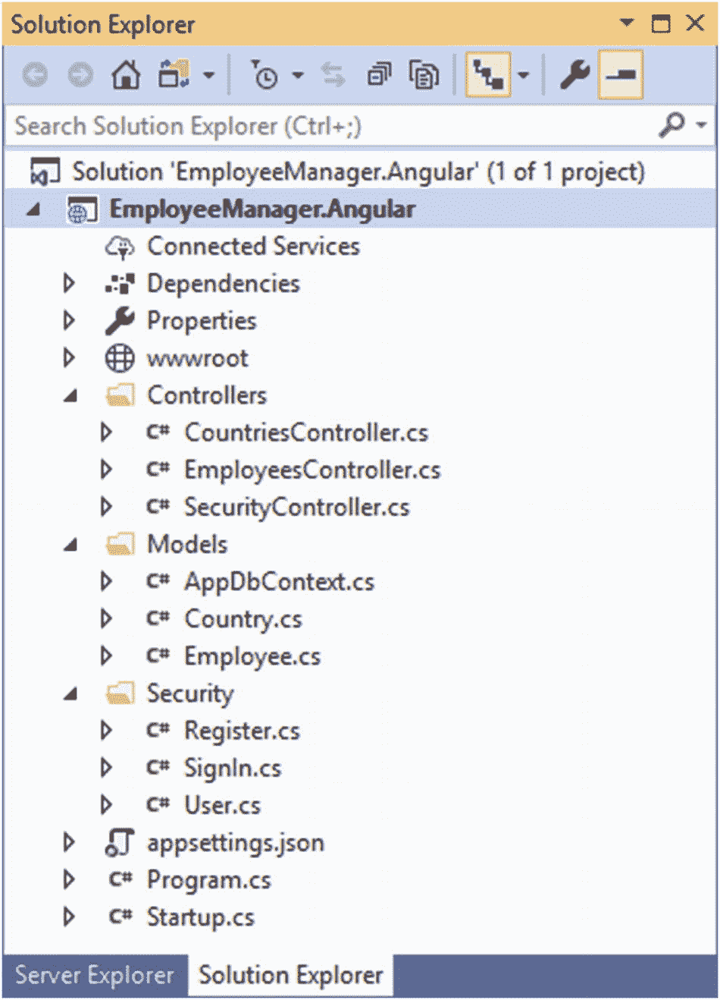

图 7-1

包含 Web APIs 的 ASP.NET Core 项目

如您所见，EmployeeManager 的大部分内容。Angular 项目与 EmployeeManager 相同。您在上一章开发的 Jquery 项目。这里没有 Views 文件夹，因为应用的用户界面是由 Angular 提供的。还要注意，EF 核心模型和相关的类与 EmployeeManager 是相同的。Jquery 项目。您可以获得完整的 EmployeeManager。Angular 从本章的源代码下载。

图 [7-2](#Fig2) 显示了代表员工管理器前端的 Angular SPA。

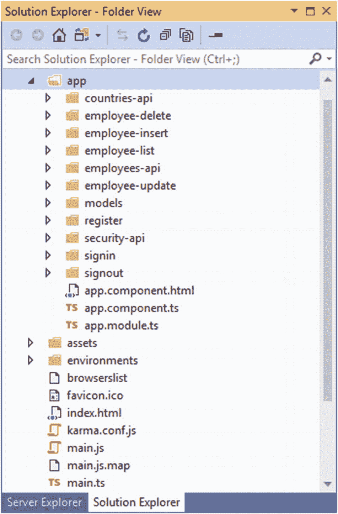

图 7-2

Angular 应用提供了员工管理器的前端

### 注意

简而言之，单页面应用或 SPA 通过重写当前页面而不是从 web 服务器获取不同的页面来动态生成其用户界面。这种应用还可以提供附加功能，例如客户端路由。因此，应用看起来像是在页面之间“导航”,但实际上它只是在同一页面上呈现 UI 的不同部分。

从图中可以看到，Angular 代码文件组织在 app 文件夹下的几个子文件夹中(项目根文件夹名为 EmployeeManagerAngularApp，但您可以随意命名)。在适当的时候，你会知道构成前端的各种部件。现在，只要试着让自己熟悉整个项目结构。您还可以从该书的源代码中获得这个 Angular 应用的完整源代码。

一旦 Angular 应用完成，它就会被编译成普通的 JavaScript 代码。然后将生成的 JavaScript 代码放在 EmployeeManager 的 wwwroot 文件夹中。Angular 项目。如图 [7-3](#Fig3) 所示。

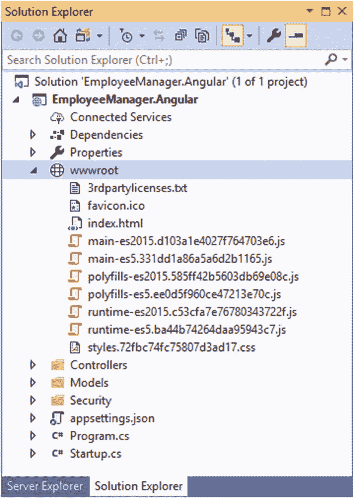

图 7-3

与 ASP.NET Core 应用集成的 Angular 应用

因此，一旦开发完成，您就可以将 Employee Manager 作为单个 ASP.NET Core 应用来运行和部署。wwwroot 文件夹中的 Index.html 是 Angular SPA 的启动页面。

### 注意

Visual Studio 还提供了一个用于创建 Angular 应用的项目模板。然而，你不会在这本书里用到它。独立于 ASP.NET Core 应用处理 Angular 应用，可以让您清楚地了解 Angular 应用是如何工作的，以及如何将它集成到 ASP.NET Core 应用中。一旦了解了这些细节，您就可以轻松地使用 Visual Studio Angular 项目模板来构建 Angular 应用。

## 创建 ASP.NET Core Web API 应用

为了完成本章的示例，您首先需要创建一个名为 EmployeeManager.Angular 的 ASP.NET Core Web API 应用。您在上一章开发的 Jquery 应用。因此，您可以在创建 EmployeeManager 时利用该代码库。Angular 项目。

雇员经理。Angular 应用服务于三个 Web APIs，即 EmployeesController、CountriesController 和 SecurityController。此外，它还包含 EF 核心模型类(AppDbContext、Employee 和 Country 类)和用户验证功能所需的视图模型(user、Register 和 SignIn 类)。因为这些类与前面的例子相同，所以这里不再讨论。但是，请注意

*   雇员经理。Angular 项目没有 Views 文件夹，因为 UI 是使用 Angular 应用呈现的

*   出于同样的原因，Controllers 文件夹中没有 EmployeeManagerController 类

*   可以将 wwwroot 文件夹设置为空，因为该项目中不需要 jQuery 文件和样式表文件

*   由于 Web API 可用于独立的 Angular 应用，因此必须在 Web API 项目中启用 CORS

如果您愿意，可以简单地获取 EmployeeManager。Angular 项目从本章的代码下载并运行它，如下所述。

### 在 Web API 项目中启用 CORS

在 EmployeeManager 中启用 CORS。Angular 应用，转到启动类，将这一行添加到`ConfigureServices()`方法中:

```cs
public void ConfigureServices(IServiceCollection services)
{
    services.AddCors();
    ...
}

```

`AddCors()`方法将 CORS 服务添加到`IServiceCollection`中。此外，转到`Configure()`方法并添加清单 [7-1](#PC2) 中所示的代码。

```cs
public void Configure(IApplicationBuilder app, IWebHostEnvironment env)
{
    ...
    app.UseCors(builder => builder
            .AllowAnyOrigin()
            .AllowAnyMethod()
            .AllowAnyHeader());
    ...
}

Listing 7-1Configuring CORS midleware

```

`UseCors()`方法将 CORS 中间件连接到 HTTP 管道。它还通过指定三个设置来配置 CORS 策略:

*   AllowAnyOrigin()表示允许来自任何来源的外部请求访问该应用的资源。

*   AllowAnyMethod()表示任何 HTTP 方法(GET、POST 等。)可以用来提出请求。

*   AllowAnyHeader()表示允许任何 HTTP 头。

### 注意

在这里，您授予了 Web API 对任何外部请求的访问权。然而，在更现实的情况下，您应该确保只允许特定的来源和特定的 HTTP 方法访问 Web API。对 CORS 和 CORS 政策的详细讨论超出了本书的范围。你可以在 [`https://docs.microsoft.com/en-us/aspnet/core/security/cors`](https://docs.microsoft.com/en-us/aspnet/core/security/cors) 了解更多关于 CORS 的信息。

前面文本中讨论的代码应该只在开发过程中使用。一旦将 Angular 应用与 ASP.NET Core 应用集成在一起，就应该删除这段代码。

### 运行 Web API 应用

一旦 Web APIs 在 EmployeeManager 中准备就绪。Angular 应用，它们需要在后面的章节中开发的 Angular 应用中可用。通常，您从 Visual Studio 中运行 web 应用，以便可以调试和测试它。这里，您将使用另一种方法来运行应用，因为 Web APIs 已经准备好了。

找到 Visual Studio 程序组，然后单击“开发人员命令提示符”条目。这将打开一个控制台窗口。将工作文件夹更改为 EmployeeManager。Angular 项目根文件夹，并发出以下命令:

```cs
> dotnet run

```

在这里，你正在使用。NET 核心命令行界面(CLI)来运行应用。一旦您发出这个命令，您的控制台窗口应该类似于图 [7-4](#Fig4) 。

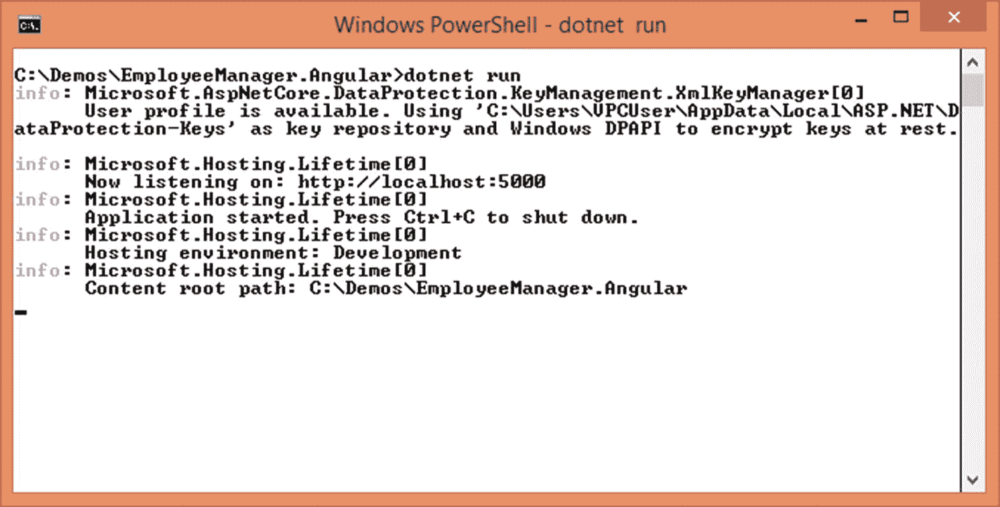

图 7-4

使用运行 Web API 项目。网络核心 CLI

注意，Web API 应用现在在`http://localhost:5000`可用(这个 URL 可能会根据您的项目设置而有所不同)。如果您希望检查 Web APIs 是否可用，只需注释掉添加给它们的`[Authorize]`属性，然后运行前面提到的项目。然后，您可以尝试使用浏览器访问它们。图 [7-5](#Fig5) 显示了访问员工 API 的浏览器。

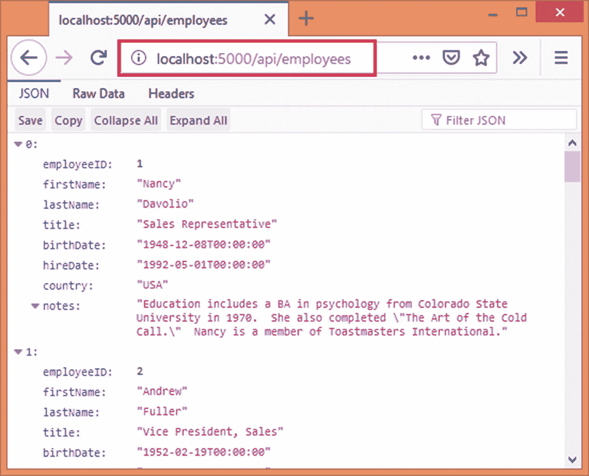

图 7-5

使用浏览器访问员工 Web API

如您所见，Employees API 的`Get()`动作被调用，雇员列表被返回给浏览器。在继续之前，确保取消对`[Authorize]`属性的注释，然后再次运行应用。您可以在开始开发 Angular 应用时让该应用在后台运行，也可以在 Angular 应用需要时运行它。您可以通过按 Ctrl + C 来终止 Web API 应用

## 创建 Angular 应用

现在那个雇员经理。Angular 项目准备就绪，您可以继续创建 Angular 应用。为此，请从 Node.js 程序组中打开 Node.js 命令提示符。转到要放置新创建的 Angular 应用的文件夹。要创建 Angular 应用，请在命令提示符下发出以下 Angular CLI 命令:

```cs
> ng new EmployeeManagerAngularApp

```

发出该命令后，系统会询问您是否要添加 Angular 路由。输入 Y，因为您希望实现到应用的客户端路由，然后按 Enter 键。然后会询问您希望使用哪种样式表格式。从列表中选择 CSS(默认),然后按 enter 键。项目创建开始，并在 EmployeeManagerAngularApp 文件夹中创建一个新的 Angular 应用。

一旦您得到关于项目创建的通知，进入 EmployeeManagerAngularApp 文件夹并在命令提示符下发出以下命令:

```cs
> ng serve --open

```

该命令构建 Angular 应用，并在`http://localhost:4200`开始监听。- open 开关打开默认浏览器并启动刚才提到的 URL。要终止 Angular 应用，可按 Ctrl + C。图 [7-6](#Fig6) 显示了新创建的 Angular 应用在浏览器中的外观。

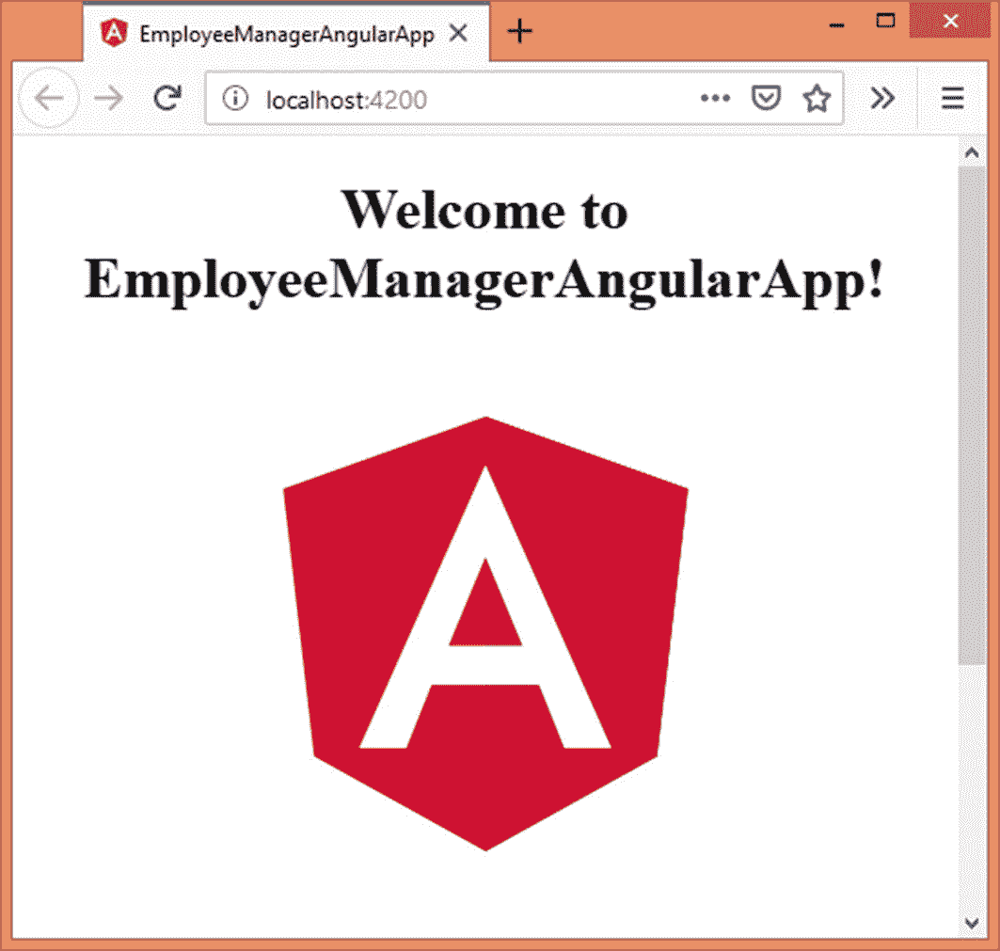

图 7-6

在浏览器中启动新创建的 Angular 应用

在开始 Angular 应用开发之前，值得注意的是，ASP.NET Core Web API 应用在`http://localhost:5000`可用，Angular 应用在`http://localhost:4200`可用。因此，它们之间的通信将是跨域的通信，并且需要在 Web API 应用中启用 CORS(参见前面关于启用 CORS 的部分)。

### Angular 应用架构

现在您已经创建了一个 Angular 应用，简要了解一下 Angular 应用的整体架构是有价值的。在这里，我们不讨论 Angular 应用的每一个部分，而是将重点放在 EmployeeManagerAngularApp 应用中将要使用的部分。

Angular 应用由一个或多个模块组成。模块将相关的功能包装在一起。至少，一个应用有一个根模块。您还可以拥有称为特性模块的附加模块(它们是可选的)。NgModules 可以从其他 NgModules 导入功能。他们还可以将自己的功能导出到其他 NgModules。根模块负责加载应用(通常称为引导)。如果您查看在应用创建期间创建的代码文件，app.module.ts 包含名为`AppModule`的根模块。

Angular 应用包含一个或多个组件。组件处理用户界面的一部分。组件由一个视图以及相关的数据和逻辑组成。视图是一个 HTML 文件，通常包含 HTML 标记和数据绑定代码。视图所需的数据可以被捆绑到模型类中。至少，Angular 应用需要有一个组件。app.component.ts 文件包含一个名为`AppComponent`的默认组件。

Angular 应用可以包含许多视图(由应用的不同组件提供)。您可以使用 Angular 的路由服务在这些视图中“导航”。路由器可以定义客户端路由和相关联的导航特征。

在典型的 Angular 应用中，您可能还希望将可重用的代码片段隔离到一个或多个服务中。这样，应用的代码库就可以模块化、可重用和可维护。服务通过 Angular 的依赖注入系统注入到组件中。

在代码级别，前面提到的构建块——模块、组件和服务——作为类型脚本类存在。这些类用所谓的 decoratorss 来修饰，decorator 提供关于所考虑的类的元数据信息。例如，NgModule 类用`@NgModule()`装饰器装饰，组件类用`@Component()`装饰器装饰，服务类用`@Injectable()`装饰器装饰。

### 在 Visual Studio 中编辑 Angular 项目文件

可以使用您选择的任何文本编辑器编辑 Angular 项目文件。但是，在这里您使用 Visual Studio 来实现这一点。处理 Angular 项目的一些其他流行应用包括 Visual Studio Code、WebStorm、Atom 和 Sublime Text。

要打开刚刚在 Visual Studio 中创建的 Angular 项目，请单击文件➤打开➤文件夹菜单选项。然后在“选择文件夹”对话框中选择 EmployeeManagerAngularApp 文件夹，并单击“选择文件夹”按钮。这将在 Visual Studio 中打开选定的文件夹，您的解决方案资源管理器看起来如图 [7-7](#Fig7) 所示。

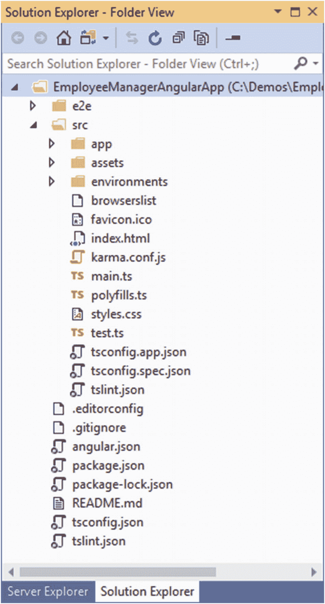

图 7-7

在 Visual Studio 中打开的 EmployeeManagerAngularApp 文件夹

在解决方案资源管理器中显示的所有文件夹和文件中，employeemanagangularapp➤src➤应用文件夹下的文件对您来说更重要，因为它们代表了您的应用的代码。Angular 在内部使用许多其他文件，您不需要以任何方式更改它们。

在 Angular 应用的开发过程中，您可以使用 Angular CLI 添加应用所需的各个部分，然后使用 Visual Studio IDE 编辑它们。一旦按照您的要求编辑了文件，您就可以使用 Angular CLI 构建和运行应用。

在接下来的小节中，您将添加各种片段，例如构成您的 Angular 应用的类、组件和服务。

## 添加员工、国家和用户类别

使用 Web APIs 的 Angular 应用处理雇员、国家和用户。因此，您需要三个 TypeScript 类，即 Employee、Country 和 User，它们代表各自的实体。

将这些类添加到 Models 文件夹中，并使用 Angular CLI 创建它们。转到 Node.js 命令提示符，依次发出以下命令:

```cs
> ng generate class models/Employee
> ng generate class models/Country
> ng generate class models/User

```

`ng generate`命令用于生成 Angular 应用的各个部分，如类、组件和服务。指定 class 选项表示您想要创建一个类。class 选项后面是类的路径和名称。在本例中，Employee 类是在 Models 文件夹中创建的。如果模型文件夹不存在，将为您创建一个。

发出这个命令会为每个类创建两个文件–*。ts 文件和*.spec.ts 文件。那个。ts 文件是主要的 TypeScript 类文件，而. spec.ts 文件包含代码的单元测试。本书中不会用到. spec.ts 文件，甚至可以删除它们以减少文件夹的混乱。

接下来，在 Visual Studio 中打开`Employee`类(Employee.ts)并修改它，如清单 [7-2](#PC7) 所示。

```cs
export class Employee {
  employeeID: number;
  firstName: string;
  lastName: string;
  title: string;
  birthDate: Date;
  hireDate: Date;
  country: string;
  notes: string;
}

Listing 7-2Employee TypeScript class

```

`export`关键字表示可以从应用的其他部分访问所考虑的类。后面跟有类名的`class`关键字表示您希望创建的类(在本例中是`Employee`)。

`Employee`类由`employeeID`、`firstName`、`lastName`、`title`、`birthDate`、`hireDate`、`country`、`notes`等几个成员组成。注意，这些成员名对应于服务器端的`Employee`类属性名。这是因为您需要通过这些属性在 Angular 应用和 ASP.NET Core 应用之间传输数据。另请注意，这些成员具有数字、字符串和日期等数据类型。

### 注意

在 TypeScript 类中，默认情况下成员是公共的。如果需要，可以显式使用公共或私有访问修饰符。

在同一行中，您可以创建`Country`和`User`类。这些类如清单 [7-3](#PC8) 所示。

```cs
export class Country {
  countryID: number;
  name: string;
}

export class User {
  userName: string;
  password: string;
  email: string;
  fullName: string;
  birthDate: Date;
}

Listing 7-3Country and User TypeScript classes

```

## 添加服务以调用员工 Web API

要调用 Web APIs，可以使用 Angular 的 HttpClient 类。与其在几个地方编写与 HttpClient 相关的代码，不如将它隔离在一个地方。然后，您可以在应用中的任何地方重用该代码。

您可以通过创建 Angular 服务来实现这一点。一旦创建，Angular 服务可以注入到应用的其他部分。服务公开某些可重用的功能，并且不包含任何用户界面元素。

在本节中，您将创建 EmployeesApi 服务，该服务帮助您调用 Employees Web API 的各种操作。要创建此服务，请转到 Node.js 命令提示符并发出以下命令:

```cs
> ng generate service employees-api/EmployeesApi

```

前面的命令在 employees-api 文件夹下创建服务 EmployeesApiService(服务后缀会自动添加到您指定的名称中)。该服务实际存在于 employees-api.service.ts 文件中。如果您打开这个文件，您将会看到清单 [7-4](#PC10) 中所示的代码。

```cs
import { Injectable } from '@angular/core';

@Injectable({
  providedIn: 'root'
})
export class EmployeesApiService {
  constructor() { }
}

Listing 7-4Newly created EmployeesApiService class

```

顶部的`import`声明表示您希望使用`@angular/core`包中的`Injectable`符号。`EmployeesApiService`级由`@Injectable()`装饰师装饰。使用`@Injectable()`装饰器意味着底层类可以被 Angular 的依赖注入系统注入。

`@Injectable()`装饰器接受一个元数据对象。在这种情况下，元数据对象的`providedIn`属性被设置为`root`，表示您希望在应用的根级别提供所考虑的服务。这意味着 Angular 将创建所考虑的服务的一个共享实例，并将它注入到请求服务的组件中。

EmployeesApiService 类也有一个空的构造函数。构造函数可用于初始化服务，类似于 C# 构造函数。

现在让我们修改 EmployeesApiService，以便它使用 Angular 的 HttpClient 类调用 Employees Web API。

去山顶。ts 文件并添加这两条导入语句:

```cs
import { HttpClient, HttpHeaders } from '@angular/common/http';
import { Employee } from '../models/employee';

```

第一个 import 语句表明您想要使用指定 Angular 包中的 HttpClient 类和 HttpHeaders 类。第二条 import 语句表明您希望使用位于指定。ts 文件(您在前面的小节中创建了这个类)。

然后转到 EmployeesApiService 类，声明几个成员，并定义如清单 [7-5](#PC12) 所示的构造函数。

```cs
baseUrl: string = 'http://localhost:5000/api/employees';
client: HttpClient;

constructor(client: HttpClient) {
  this.client = client;
}

Listing 7-5HttpClient injected into the constructor

```

代码首先声明保存雇员 Web API 所在 URL 的成员`baseUrl`。回想一下,`dotnet run`命令使 Web API 在指定 URL 和端口可用。

然后声明一个类型为`HttpClient`的成员，它拥有一个`HttpClient`类的实例。`HttpClient`类被注入到构造函数中，如图所示。`HttpClient`类允许您向 web 资源(如 Web API)发出 HTTP 请求。您会发现这种构造函数注入机制与 ASP.NET Core 的构造函数注入非常相似。

接下来，添加一个名为`selectAll()`的方法，用于调用 Employees Web API 的`Get()`动作(清单 [7-6](#PC13) )。

```cs
selectAll() {
  return this.client.get(this.baseUrl, {
    headers: new HttpHeaders({
      "Authorization": "Bearer " + sessionStorage.getItem('token')
    })
  });
}

Listing 7-6selectAll() method invokes the Get() action of Employees Web API

```

`selectAll()`方法调用`HttpClient`类的`get()`方法。`get()`方法向指定的资源发出 GET 请求。在这种情况下，资源是 Employees Web API。由于 Employees Web API 受到 JWT 认证的保护，所以当用户登录到系统时，代码还会传递在`sessionStorage`对象中发布和存储的 JWT。JWT 作为授权头的一部分传递给服务器。授权头封装在`HttpHeaders`对象中，并传入`get()`方法的 headers 参数。

`HttpClient`的`get()`方法返回所谓的`Observable`。可观察对象使用发布者-订阅者模式向其订阅者发送一个或多个值。因此，可观察对象发布值，对接收值感兴趣的订阅者订阅它。在这里，雇员的列表被发布给订阅者。应该注意的是，只有当一个可观察对象至少有一个订户时，它才会执行。在本例中，显示雇员列表的 Angular 组件充当可观察对象的订阅者。

### 注意

对可观测量的详细讨论超出了本书的范围。你可以在 [`https://angular.io/guide/observables`](https://angular.io/guide/observables) 了解更多关于可观测量的信息。

`selectByID()`方法类似于`selectAll()`方法，如清单 [7-7](#PC14) 所示。

```cs
selectByID(id: number) {
  return this.client.get(this.baseUrl + "/" + id, {
    headers: new HttpHeaders({
      "Authorization": "Bearer " + sessionStorage.getItem('token')
    })
  });
}

Listing 7-7selectByID() invokes the Get(id) action of Employees Web API

```

`selectByID()`方法接受一个数字`id`参数，该参数指示要检索其数据的 EmployeeID。在内部，代码像以前一样调用`HttpClient`的`get()`方法。但是这一次,`id`被附加在 URL 中，因此 Employees Web API 的`Get(id)`动作被调用。

要向 Employees Web API 发出 POST 请求，您需要添加 insert()方法，如清单 [7-8](#PC15) 所示。

```cs
insert(emp: Employee) {
  return this.client.post(this.baseUrl, emp, {
    headers: new HttpHeaders({
      "Authorization": "Bearer " + sessionStorage.getItem('token'),
      "Content-Type": "application/json"
    })

  });
}

Listing 7-8insert() method makes a POST request to Employees Web API

```

`insert()`方法接受类型为`Employee`的参数，该参数表示要添加到数据库中的新雇员。在内部，代码调用`HttpClient`的`post()`方法向`Employees` Web API 发出 POST 请求。除了 URL 和`HttpHeaders`之外，`emp`对象也被作为第二个参数传递。

注意，`HttpHeaders`对象除了包含`Authorization`头之外，还包含`Content-Type`头。这种方式表明 JSON 数据是和请求一起传递的。

就像`selectAll()`和`selectByID()`方法一样，`post()`方法也向调用者返回一个`Observable`。

要向 Web API 发送一个 PUT 请求，您需要编写清单 [7-9](#PC16) 中所示的`update()`方法。

```cs
update(emp: Employee) {
  return this.client.put(this.baseUrl + '/' + emp.employeeID, emp, {
    headers: new HttpHeaders({
      "Authorization": "Bearer " + sessionStorage.getItem('token'),
      "Content-Type": "application/json"
    })

  });
}

Listing 7-9update() method makes a PUT request to the Employees Web API

```

`update()`方法与`insert()`方法非常相似，因为它接受一个与 PUT 请求一起发送的`Employee`对象，并向调用者返回一个`Observable`。然而，它调用了`HttpClient`的`put()`方法(这样就调用了 Web API 的 Put()动作)并将`employeeID`附加到 URL 上。

和前面的例子一样，您使用`HttpHeaders`对象传递授权和内容类型头。

最后，`delete()`方法向 Web API 发送一个删除请求，以便调用它的`Delete()`动作(清单 [7-10](#PC17) )。

```cs
delete(id: number) {
  return this.client.delete(this.baseUrl + "/" + id, {
    headers: new HttpHeaders({
      "Authorization": "Bearer " + sessionStorage.getItem('token')
    })

  });
}

Listing 7-10delete() method makes a DELETE request to Employees Web API

```

`delete()`方法接受一个数字 EmployeeID 并返回一个`Observable`。在内部，代码通过将 id 参数附加到 URL 来调用`HttpClient`的`delete()`方法。和以前一样，授权 HTTP 头被赋值。

这就完成了`EmployeeApiService`服务。在同样的行中，您可以在 countries-api 文件夹中创建`CountriesApiService`。`CountriesApiService`类将只有一个方法——`selectAll()`。因为这个类非常简单，所以这里不讨论它。你可以从本章的代码下载中获得完整的`CountriesApiService`类。为了便于您快速参考，清单 [7-11](#PC18) 中显示了`selectAll()`方法。

```cs
selectAll() {
  return this._http.get(this.baseUrl, {
    headers: new HttpHeaders({
      "Authorization": "Bearer " + sessionStorage.getItem('token')
    })
  });
}

Listing 7-11selectAll() method of the CountriesApiService class

```

如您所见，`selectAll()`方法调用了`HttpClient`的`get()`方法并返回一个`Observable`。

## 添加服务以调用安全性 Web API

现在`EmployeesApiService`和`CountriesApiService`已经准备好了，让我们继续创建一个调用安全 Web API 的 Angular 服务。转到 Angular CLI 并发出以下命令:

```cs
> ng generate service security-api/SecurityApi

```

这将在 security-api 文件夹下创建一个名为`SecurityApiService`的新服务类。在该类的顶部，添加这两条导入语句:

```cs
import { HttpClient, HttpHeaders } from '@angular/common/http';
import { User } from '../models/user';

```

这里，您像以前一样导入`HttpClient`和`HttpHeaders`类。此外，您还可以导入前面创建的用户模型类。

`SecurityApiService`包含一个注入`HttpClient`的构造函数和两个方法——一个用于注册用户，另一个用于让用户登录系统。完整的`SecurityApiService`类如清单 [7-12](#PC21) 所示。

```cs
@Injectable()
export class SecurityApiService {
  baseUrl: string = 'http://localhost:5000/api/security';
  client: HttpClient;

  constructor(client: HttpClient) {
    this.client = client;
  }

  signIn(usr: User) {
    return this.client.post<any>(this.baseUrl + "/signin", usr);
  }

  register(usr: User) {
    return this.client.post(this.baseUrl + "/register", usr,
                            { responseType: 'text'});
  }
}

Listing 7-12SecurityApiService class

```

这段代码对您来说应该很熟悉，因为它类似于早期的服务。`baseURL`和客户端成员分别存储安全 Web API 和`HttpClient`对象的 URL。`HttpClient`是在构造函数中注入的。

`signIn()`方法接受用户类型的参数并返回一个`Observable`。在内部，它使用`HttpClient`的`post()`方法向安全 Web API 的`SignIn()`动作发出 POST 请求。请注意，`post<T>()`方法指定了类型为`any`的响应主体(`any`类型表示在开发时不知道确切的数据类型)。这是因为`SignIn()`动作返回带有`token`属性的 JSON 对象(如果用户凭证有效)或 HTTP 状态代码 401(未授权)。还要注意，包含用户名和密码的`User`对象被传递给了`post()`方法的第二个参数。

`register()`方法接受一个`User`对象并返回一个`Observable`。在内部，代码向安全 Web API 的`Register()`动作发出 POST 请求。这一次除了 URL 和`User`对象，你还通过`responseType`成为`text`。这是因为`Register()`动作返回一个字符串成功或错误消息。

这就完成了应用所需的所有 Angular 服务。这些服务由一组 Angular 组件消费。在以下几节中，您将创建这些组件。

## 显示员工列表

要显示雇员列表(图 [7-8](#Fig8) ，您需要创建一个名为 EmployeeListComponent 的 Angular 组件。

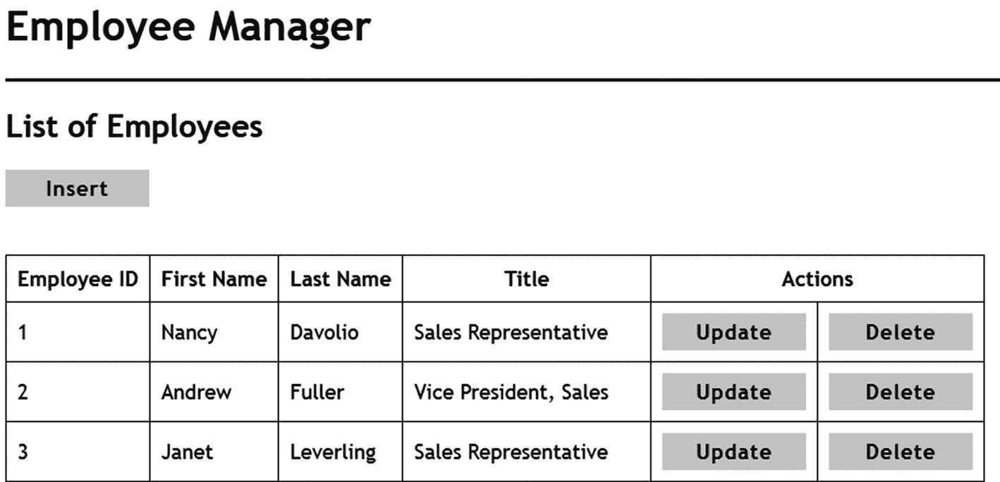

图 7-8

显示员工列表

要创建此组件的框架，请打开 Angular CLI 并进入项目文件夹。然后发出以下命令:

```cs
> ng generate component EmployeeList

```

前面的命令创建了一个名为`EmployeeListComponent`的新组件类(组件后缀是自动添加的)，并将组件文件放在 employee-list 文件夹中(名为的文件夹是从组件名派生出来的，它是自动创建的)。如果您查看雇员列表文件夹，您会发现四个文件:

*   员工列表.组件. ts

*   employee-list.component.html

*   雇员列表.组件. css

*   员工列表.组件.规格

第一个文件包含一个包含组件数据和逻辑的类。第二个文件表示组件的视图，包含 UI 标记。第三个文件是可选的，可以包含视图使用的 CSS 样式。第四个文件也是可选的，包含组件的单元测试。在本例中，您不需要。组件的 css 和. spec.ts 文件，您可以删除它们以减少混乱。

如果您打开 employee-list.component.ts 文件，您将看到如清单 [7-13](#PC23) 所示的代码。

```cs
import { Component, OnInit } from '@angular/core';

@Component({
  selector: 'app-employee-list',
  templateUrl: './employee-list.component.html',
  styleUrls: ['./employee-list.component.css']
})
export class EmployeeListComponent implements OnInit {
  constructor() { }
  ngOnInit() {
  }
}

Listing 7-13Skeleton of EmployeeListComponent

```

代码从指定的包中导入`Component`符号和`OnInit`接口。然后代码声明了一个名为`EmployeeListComponent`的类。班级用`@Component()`装饰师装饰。`@Component()`装饰器表明底层类是一个组件。`@Component()`装饰器还指定了以下元数据信息:

*   **选择器**:组件以标记标签的形式存在于视图中。选择器属性指示该标记的名称。在这种情况下，EmployeeListComponent 由

*   <app-employee-list>T1。</app-employee-list>

*   **templateUrl** :这是组件视图文件的路径。

*   **styleUrls** :一个或多个指向组件使用的 CSS 文件的路径。因为 CSS 文件是可选的，所以可以删除该属性。

注意，`EmployeeListComponent`类实现了`OnInit`接口。实现`OnInit`接口意味着这个类必须包含`ngOnInit()`方法。Angular 提供了几个生命周期挂钩，当某些生命周期事件发生时，这些挂钩为开发人员提供了执行一些代码的机会。生命周期挂钩之一是`ngOnInit()`。当组件初始化时，`ngOnInit()`方法会自动执行一次。

### 注意

乍一看，ngOnInit 生命周期挂钩与构造函数很相似。然而，它们是不同的。构造函数在类被实例化时被调用，通常用于成员初始化和依赖注入。另一方面，ngOnInit 生命周期钩子在框架初始化组件时执行。有关 Angular 生命周期挂钩的更多信息，请阅读 [`https://angular.io/guide/lifecycle-hooks`](https://angular.io/guide/lifecycle-hooks) 。

现在您已经知道了组件的基本框架，让我们根据应用需求修改 EmployeeListComponent。

转到组件类文件的顶部，将这些导入语句添加到现有语句的下面:

```cs
import { Router } from '@angular/router';
import { EmployeesApiService } from '../employees-api/employees-api.service';
import { Employee } from '../models/employee';

```

第一个 import 语句导入路由器类。该类为组件提供路由和导航功能。然后代码导入 EmployeesApiService 服务，因为组件需要从 Employees Web API 获取数据。最后，Employee 类也被导入。

接下来，转到 EmployeeListComponent 类并添加成员和构造函数，如清单 [7-14](#PC25) 所示。

```cs
employees: Array<Employee> = [];
message: string;
employeesApi: EmployeesApiService;
router: Router;

constructor(employeesApi: EmployeesApiService, router: Router) {
  this.employeesApi = employeesApi;
  this.router = router;
}

Listing 7-14Members and constructor of EmployeeListComponent

```

`employees`成员旨在保存从 Web API 返回的一组`Employee`对象。所以，它的类型是`Array<Employee>`。`message`字符串变量保存显示给最终用户的消息(可能是成功消息，也可能是错误消息)。`employeeApi`变量的类型是`EmployeesApiService`，它保存了对注入的`EmployeesApiService`服务实例的引用。`router`变量是注入到构造函数中的`Router`对象。

构造器通过依赖注入接收`EmployeesApiService`对象和`Router`对象。在内部，对注入对象的引用存储在各自的类成员中。

要显示员工列表，您需要从 Web API 获取员工数据。这是在清单 [7-15](#PC26) 所示的`ngOnInit()`方法中完成的。

```cs
ngOnInit() {
  if (!sessionStorage.hasOwnProperty("token")) {
    this.router.navigate(['/signin']);
  }

  this.employeesApi.selectAll().subscribe(
    data => this.employees = data as Array<Employee>,
    error => {
      if (error.status === 401) {
        this.router.navigate(['/signin']);
      }
      this.message = error.message
    }
  );

  if (sessionStorage.hasOwnProperty("message")) {
    this.message = sessionStorage.getItem("message");
    sessionStorage.removeItem("message");
  }
}

Listing 7-15ngOnInit() fetches employee data

```

在调用 Employees Web API 之前，代码检查用户是否已经登录到系统。这是通过检查`sessionStorage`对象中的 JWT 来完成的。如果 JWT 不存在，控制被带到可在/signin 访问的登录页面(稍后讨论)(例如，`http://localhost:1234/signin`)。这个客户端 URL 是由后面小节中讨论的路由配置定义的。为了导航到这个 URL，代码使用了`Router`对象的`navigate()`方法。`navigate()`方法接受一个指定目标 URL 的链接参数数组(在本例中为/signin)。

接下来，代码调用`EmployeesApiService`的`selectAll()`方法。回想一下`selectAll()`返回一个`Observable`。因此，代码使用`subscribe()`方法订阅它。`subscribe()`方法有两个参数。第一个参数是一个处理函数，它接收由`Observable`返回的值。这个函数是使用 Arrow 函数语法编写的。arrow 函数的`data`参数保存 Web API 返回的雇员。在对`data`到`Array<Employee>`进行类型转换后，这些雇员被存储在`employees`成员中。

第二个箭头函数接收一个`error`对象，以防在执行调用时出现任何错误。错误处理程序检查 HTTP 状态代码，如果是 401(未授权)，那么用户将被导航到登录页面。如果存在除 401 以外的任何错误，错误消息将存储在`message`成员中。该消息显示在视图上。

### 注意

观察对象可以发送三种类型的通知:`next`、`error`和`complete`。相应地，您可以提供三个回调函数来处理这些通知。当收到一个值时，调用一个`next`处理程序(零次或多次)。如果在执行可观察对象时出现任何错误，就会调用一个`error`处理程序回调函数。当 observable 的执行完成时，调用一个`complete`处理程序。在本例中，您使用 next 处理程序和 error 处理程序来处理各自的通知。关于可观测量的更多细节，可以考虑阅读 [`https://angular.io/guide/observables`](https://angular.io/guide/observables) 。

删除雇员页面(稍后讨论)在`sessionStorage`对象中设置一条消息。如果用户在删除一个雇员后进入雇员列表页面，该消息将存储在`message`成员中，而`sessionStorage`条目将被删除。

员工列表页面有三个按钮——插入、更新和删除，将用户带到相应的页面。这些按钮的点击事件处理程序也可以在`EmployeeListComponent`中找到，如清单 [7-16](#PC27) 所示。

```cs
insert_click() {
  this.router.navigate(['/employees/insert']);
}

update_click(id) {
  this.router.navigate(['/employees/update', id]);
}

delete_click(id) {
  this.router.navigate(['/employees/delete', id]);
}

Listing 7-16Click event handlers of Insert, Update, and Delete buttons

```

`insert_click()`方法代表插入按钮的 click 事件处理程序。它调用`Router`对象的`navigate()`方法将用户带到插入新员工页面。

`update_click()`方法代表更新按钮的 click 事件处理程序。这个事件处理程序接收`employeeID`作为它的`id`参数。在内部，它调用`Router`对象的`navigate()`方法，将用户导航到更新现有员工页面。注意，传递给`navigate()`方法的数组现在有了保存`id`的第二个元素。这将把`id`追加到第一个参数中指定的 URL。

`delete_click()`方法表示删除按钮的 click 事件处理程序。这个事件处理程序与`update_click()`非常相似，但是引导用户删除现有的员工页面。

这就完成了 EmployeeListComponent 的类。现在让我们来完成它的视图。因此，在 Visual Studio 中打开 employee-list.component.html，并在其中编写清单 [7-17](#PC28) 所示的标记。

```cs
<h2>List of Employees</h2>
<button (click)="insert_click()" title="Insert">Insert</button>
<h3 class="message">{{message}}</h3>
<br />
<table border="1" cellpadding="10">
  <thead>
    <tr>
      <th>Employee ID</th>
      <th>First Name</th>
      <th>Last Name</th>
      <th>Title</th>
      <th colspan="2">Action</th>
    </tr>
  </thead>
  <tbody>
    <tr *ngFor="let emp of employees">
      <td>{{emp.employeeID}}</td>
      <td>{{emp.firstName}}</td>
      <td>{{emp.lastName}}</td>
      <td>{{emp.title}}</td>
      <td>
        <button (click)="update_click(emp.employeeID)">Update</button>
      </td>
      <td>
        <button (click)="delete_click(emp.employeeID)">Delete</button>
      </td>
    </tr>
  </tbody>
</table>
<hr />
<app-signout></app-signout>

Listing 7-17Markup of EmployeeListComponent’s view file

```

在标题下面，使用`<button>`标签放置插入按钮。注意 Angular 的事件绑定语法——`(click)`——其中`click`事件被放在括号中，它的事件处理函数(`insert_click()`)也被指定。

在 Insert 按钮下面，`<h3>`元素用于向用户显示通知和消息。组件类包含`message`成员，该成员保存要显示给用户的消息。为了在页面上输出消息，使用了 Angular 的插值语法-`{{expression}}`。

然后，一个表呈现一个雇员列表。该表由静态标题和动态生成的行组成。为了动态生成表格行，标记使用 Angular 的`*ngFor`语法。`ngFor`结构指令类似于 C# 中使用的 foreach 循环，它遍历提供的数据并呈现每个数据项的内部内容。在这种情况下，组件类(`Array<Employee>`)的`employees`成员就是要迭代的数据。单个数据项的值通过`emp`局部变量访问。表格行中的前四个`<td>`元素使用插值语法和`emp`变量来显示`employeeID`、`firstName`、`lastName`和`title`值。

### 注意

ngFor 和 Angular 的其他结构指令的详细讨论超出了本书的范围。你可以在位于 [`https://angular.io/guide/structural-directives`](https://angular.io/guide/structural-directives) 的 Angular 官方文档中读到更多关于它们的信息。

每个表行还呈现一个更新和一个删除按钮。一个`employeeID`被传递给更新和删除按钮的点击事件处理程序(`update_click(id)`和`delete_click(id)`函数)。

在视图的底部，使用选择器-`<app-signout>`放置`SignOutComponent`。`SignOutComponent`管理注销功能，将在本章稍后讨论。

这就完成了`EmployeeListComponent`。

## 插入新员工

单击员工列表页面上的插入链接，您将进入另一个页面，您可以在其中插入新员工(图 [7-9](#Fig9) )。

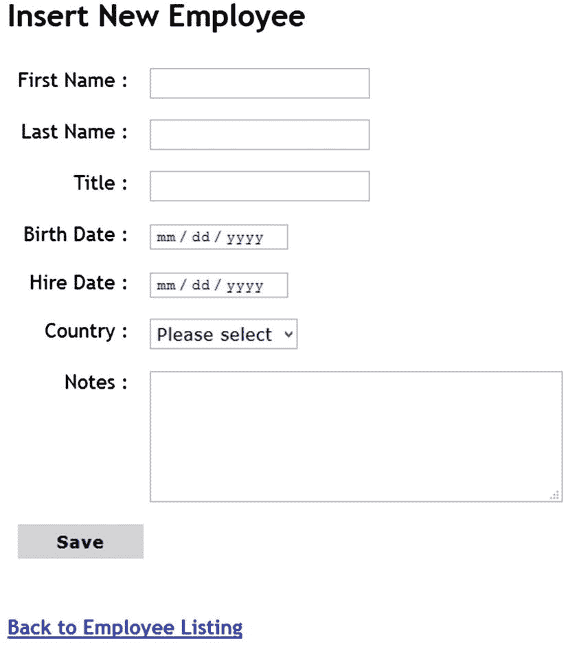

图 7-9

插入新员工

“插入新员工”页面由一个名为 EmployeeInsertComponent 的组件表示。因此，通过发出以下命令将该组件添加到项目中:

```cs
> ng generate component EmployeeInsert

```

添加组件后，在 Visual Studio 中打开 employee-insert.component.ts 文件，并添加清单 [7-18](#PC30) 中所示的导入语句。

```cs
import { Component, OnInit } from '@angular/core';
import { FormBuilder, FormGroup, Validators } from '@angular/forms';
import { Router } from '@angular/router';
import { Country } from '../models/country';
import { EmployeesApiService } from '../employees-api/employees-api.service';
import { CountriesApiService } from '../countries-api/countries-api.service';

Listing 7-18Importing required classes

```

第二个`import`语句导入三个类，即`FormBuilder`、`FormGroup`和`Validators`。`FormBuilder`类用于基于开发人员定义的配置构建一个 Angular 表单。`FormGroup`类表示一组表单控件，并跟踪它们的值和验证。`Validators`类提供了对 Angular 内置验证器的访问，这些验证器可以用来验证表单控件。

### 注意

有两种方法可以在 Angular 中创建表单-模板驱动表单和反应式表单(也称为模型驱动表单)。前者适用于简单的表单，而后者适用于复杂且可伸缩的表单。在本书中，你使用反应式。欲知详情，请访问 [`https://angular.io/guide/forms-overview`](https://angular.io/guide/forms-overview) 。

下一个 import 语句导入了`Router`类。这应该看起来很熟悉，因为您也在 EmployeeListComponent 中导入了它。

接下来的三个导入语句导入`Country`模型类、`EmployeesApiService`和`CountriesApiService`服务。你已经知道他们的目的了。

接下来，转到 EmployeeInsertComponent 类并声明一组成员，如清单 [7-19](#PC31) 所示。

```cs
formBuilder: FormBuilder;
insertForm: FormGroup;
router: Router;
employeesApi: EmployeesApiService;
countriesApi: CountriesApiService;
countries: Array<Country>;
message: string;

Listing 7-19Members of the EmployeeInsertComponent class

```

类成员声明非常简单。这些对象中的许多被注入到构造函数中(稍后讨论)并存储在各自的成员变量中。注意，声明了一个`Country`对象数组，这样 Country 下拉列表就可以用一个国家列表来填充。

清单 [7-20](#PC32) 显示了注入所需对象和构造所需数据输入表单的构造器。

```cs
constructor(formBuilder: FormBuilder,
  router: Router,
  employeeApi: EmployeesApiService,
  countriesApi:CountriesApiService) {

  this.formBuilder = formBuilder;
  this.router = router;
  this.employeesApi = employeeApi;
  this.countriesApi = countriesApi;

  this.insertForm = this.formBuilder.group({
    firstName: [", [Validators.required, Validators.maxLength(10)]],
    lastName: [", [Validators.required, Validators.maxLength(20)]],
    title: [", [Validators.required, Validators.maxLength(30)]],
    birthDate: [", [Validators.required]],
    hireDate: [", [Validators.required]],
    country: [", [Validators.required, Validators.maxLength(15)]],
    notes: [", [Validators.maxLength(500)]]
  });
}

Listing 7-20Constructor defines an insert new employee form

```

构造函数注入组件所需的对象。它们包括`FormBuilder, Route`、`EmployeesApiService,`和`CountriesApiService`实例。

在内部，注入的对象和服务存储在前面声明的类成员中。接下来，您需要根据您的需求构建一个由表单控件组成的表单。表单控件由`FormControl`类表示。一个或多个`FormControl`对象构成一个`FormGroup`。为了创建插入新雇员所需的`FormGroup`，使用了`FormBuilder`类的`group()`方法。

`group()`方法接受一个包含表单控件配置的对象，并返回一个`FormGroup`实例。表单控件配置以键值格式指定，其中 key 表示表单控件的名称，value 表示其配置。为了理解表单控件配置是如何指定的，请看下面的片段:

```cs
firstName: [", [Validators.required,
                 Validators.maxLength(10)]]

```

这里定义了名字的表单控件。因此，关键是`firstName`。该值是一个数组——数组的第一个元素是控件的默认值，第二个元素是另一个包含要附加到控件的验证器的数组。在这种情况下，两个验证器被附加到`firstName`控件上。`required`验证器指出必须在这个控件中输入一些值。`maxLength`验证器表示最多可以在控件中输入十个字符(虽然在前面的代码中没有使用，但是如果一个控件只有一个验证器，那么可以在第二个元素中只指定该验证器，而不是将其指定为数组)。

### 注意

Validators 类还提供了许多其他验证器，比如 minLength、min、max、email 和 pattern。正如您可能已经猜到的，这些验证器中的许多都提供了 HTML5 验证属性所提供的验证功能。

其他控件，即`lastName`、`title`、`birthDate`、`hireDate`、`country`和`notes,`配置在类似的线路上。

由`group()`方法返回的`FormGroup`被分配给`insertForm`成员。

当显示这个组件时，您需要从 Countries Web API 获取一个国家列表。这在 ngOnInit()方法中完成，如清单 [7-21](#PC34) 所示。

```cs
ngOnInit() {
  if (!sessionStorage.hasOwnProperty("token")) {
    this.router.navigate(["/signin"]);
  }
  this.countriesApi.selectAll()
  .subscribe(data => this.countries = data as Array<Country>
  , error => this.message = error.message);
}

Listing 7-21Countries Web API is called from ngOnInit()

```

请注意以粗体显示的代码。它订阅了`CountriesApiService`对象的`selectAll()`方法，并检索了一组`Country`对象。第一个处理函数将检索到的国家存储到`countries`成员中。第二个处理函数在`message`成员中存储一条错误消息。

当用户在各种表单控件中输入数据并单击“保存”按钮时，组件类中的 save_click()事件处理程序方法将被执行。该方法如清单 [7-22](#PC35) 所示。

```cs
save_click() {
  if (this.insertForm.invalid) {
    this.message = "One or more values are invalid.";
    return;
  }
  this.employeesApi.insert(this.insertForm.value)
    .subscribe(() => this.message = "Employee inserted
      successfully!", error => {
      if (error.status === 401) {
        this.router.navigate(["/signin"]);
      }
      this.message = error.message
    });
}

Listing 7-22save_click() invokes the insert() method EmployeesApiService

```

代码从观察`insertForm` FormGroup 的`invalid`属性开始。如果来自`FormGroup`的一个或多个控件包含无效值，则`invalid`属性返回`true`。如果所有表单控件都包含有效值，则返回`false`(就像`invalid`属性一样，如果所有控件都包含有效值，则还有一个返回`true`的`valid`属性；否则返回`false`。如果表单包含一个或多个无效值，将通过消息成员向用户显示一条错误消息。如果所有表单控件都包含有效值，代码将继续向数据库中插入一名新雇员。

为了插入一个新雇员，代码调用了`EmployeesApiService`类的`insert()`方法。回想一下，`insert()`方法需要一个包含雇员详细信息的雇员对象。该对象是通过`FormGroup`的`value`属性获得的。属性返回一个包含所有表单控件值的对象。例如，由 value 属性返回的示例对象如下所示:

```cs
{
  birthDate: "1948-12-08",
  country: "USA",
  employeeID: 1,
  firstName: "Nancy",
  hireDate: "1992-05-01",
  lastName: "Davolio",
  notes: "Education includes...",
  title: "Sales Representative"
}

```

正如您所看到的，属性名是从控件名中选取的，属性值保存各自的控件值。

为了在调用 Employees Web API 时处理成功或错误，代码订阅了由`insert()`方法返回的`Observable`。当 Web API 调用成功时，调用第一个处理函数。在里面，一条成功消息被分配给`message`成员。如果出现错误，将执行第二个处理程序。如果 HTTP 状态代码指示请求未经授权(401–未经授权)，则用户会被导航到登录页面。否则，错误消息被分配给`message`成员。

“插入新员工”页面底部有一个链接，将用户带回到“员工列表”页面。该链接的点击事件处理程序如清单 [7-23](#PC37) 所示。

```cs
cancel_click() {
  this.router.navigate(["/employees/list"]);
}

Listing 7-23Taking the user back to the employee listing page

```

当用户单击链接时，`Router`类的`navigate()`方法将用户导航到雇员列表页面。

这就完成了组件类。现在让我们进入组件视图。清单 [7-24](#PC38) 显示了 employee-update.component.html 文件的一部分(为了减少混乱，多余的标记被省略了)。

```cs
<h2>Insert New Employee</h2>
<h3 class="message">{{message}}</h3>
<form [formGroup]="insertForm" (ngSubmit)="save_click()" novalidate>
...
<td class="right">First Name :</td>
<td><input type="text" formControlName="firstName"></td>
...
<td class="right">Last Name :</td>
<td><input type="text" formControlName="lastName"></td>
...
<td class="right">Title :</td>
<td><input type="text" formControlName="title"></td>
...
<td class="right">Birth Date :</td>
<td><input type="date" formControlName="birthDate"></td>
...
<td class="right">Hire Date :</td>
<td><input type="date" formControlName="hireDate"></td>
...
<td class="right">Country :</td>
<td>
  <select formControlName="country">
    <option value="">Please select</option>
    <option *ngFor="let c of countries" [value]="c.name">
      {{c.name}}
    </option>
  </select>
</td>
...
<td class="right">Notes :</td>
<td>
<textarea rows="3" cols="50" formControlName="notes">
</textarea>
</td>
</tr>
...
<button type="submit">Save</button>
...
</form>
...
<a href="#" (click)="cancel_click()">Back to Employee Listing</a>
...
<app-signout></app-signout>

Listing 7-24EmployeeInsertComponent’s view file

```

在顶部，页面标题的正下方，代码使用插值语法显示消息成员。下面是需要绑定到类文件(`insertForm`)中定义的`FormGroup`的`<form>`元素。为此，使用 Angular 的`formGroup`指令。指令是添加到 HTML 元素的特殊属性，它将特定行为附加到元素上。注意绑定语法:`formGroup`指令放在方括号内，要绑定的成员(`insertForm`)被指定为其值。

`FormGroup`捕获`<form>`元素的提交事件并引发`ngSubmit`事件。因此，`ngSubmit`被放在括号内，事件处理函数`save_click()`也被指定。

您已经在定义表单组时配置了验证规则。因此，`novalidate` HTML 属性被添加到表单中，以抑制浏览器的本地验证。

在表单元素内部，有一系列的`<input>`元素用于接受用户的输入。这些元素使用 Angular 的`formControlName`指令将输入元素与来自`FormGroup`的表单控件关联起来。例如，将`formControlName`设置为`firstName`会将该输入元素关联到来自`insertForm`表单组的`firstName`表单控件。

注意国家下拉列表是如何被所有国家的列表填充的。除了第一个`<option>`元素(请选择)，它通过迭代`countries`成员(数组<country>)动态添加更多的`<option>`元素。这是使用前面讨论的</country> `ngFor`结构指令完成的。每个新的选项元素都从`Country`对象的`Name`属性中获取其`value`。使用插值语法在`<option>`和`</option>`中也呈现了`Name`属性。

可以使用保存提交按钮提交表单。在 Save 按钮下面，有一个链接将用户带回到员工列表页面。使用事件绑定语法附加链接(`cancel_click()`)的`click`事件处理程序。

在视图的底部，放置了`SignOutComponent`(稍后讨论)，允许用户退出系统。

### 注意

在这个表单中，您没有显示任何字段级验证。这样做只是为了减少混乱。在本章稍后创建登录表单时，您将学习使用字段级验证消息。一旦了解了如何实现这一点，就可以修改 EmployeeInsertComponent 来显示字段级验证错误消息。

这就完成了 EmployeeInsertComponent 的视图。保存到目前为止所做的工作，并继续下一个组件。

## 更新现有员工

点击员工列表页面上的更新按钮，您将进入更新现有员工页面，在该页面上显示员工的现有详细信息以供编辑(图 [7-10](#Fig10) )。

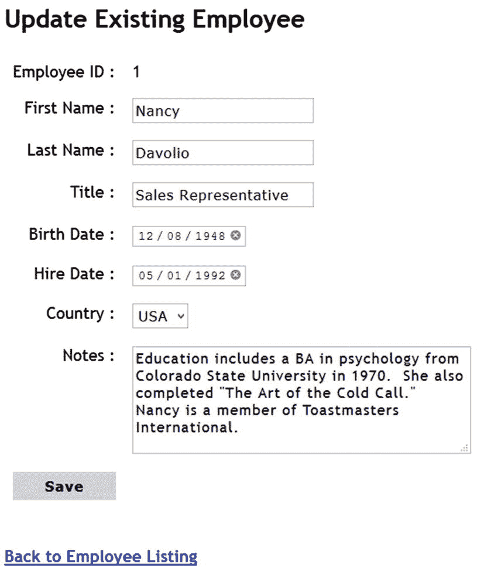

图 7-10

更新现有员工

“更新现有员工”页面看起来与“插入新员工”页面相似，只是各种控件现在都填充了被修改员工的详细信息。作为主键的`EmployeeID`不能修改。以下内容仅讨论您需要了解的差异。您可以从本书的代码下载中获得该组件的完整源代码。

要开发更新现有页面，您需要使用 Angular CLI 添加`EmployeeUpdateComponent`。记住，更新链接包含要修改的`EmployeeID`。您需要抓取这个`EmployeeID`并获取该员工的详细信息。要获得当前路由 URL 中传递的`EmployeeID`，可以使用 Angular 的`ActivatedRoute`接口。因此，通过修改 import 语句来导入它，如下所示:

```cs
import { Router, ActivatedRoute } from '@angular/router';

```

`ActivatedRoute`的一个对象被注入到构造函数中，并存储在成员变量中。这显示在清单 [7-25](#PC40) 中。

```cs
formBuilder: FormBuilder;
route: ActivatedRoute;
id: number;
router: Router;
employeesApi: EmployeesApiService;
countriesApi: CountriesApiService;
updateForm: FormGroup;
message: string;
countries: Array<Country>;

constructor(formBuilder: FormBuilder,
  router: Router,
  route: ActivatedRoute,
  employeesApi: EmployeesApiService,
  countriesApi: CountriesApiService) {

  this.formBuilder = formBuilder;
  this.route = route;
  this.router = router;
  this.employeesApi = employeesApi;
  this.countriesApi = countriesApi;

  if (this.route.snapshot.params["id"]) {
      this.id = this.route.snapshot.params["id"];
    }
  ...
}

Listing 7-25Injecting the ActivatedRoute object

```

请注意用粗体字母标记的代码。该类中声明了两个额外的成员—`route`和`id`。它们分别代表 URL 中传递的`ActivatedRoute`对象和`id`。

为了检索 URL 中传递的`id`，使用了`ActivatedRoute`对象的`snapshot`属性(快照属性属于`ActivatedRouteSnapshot`类型)。然后从`params`集合中检索出`id`值。检索到的`id`存储在一个成员变量中。

构造函数的其余部分定义了`updateForm` FormGroup，类似于您在上一节中定义`insertForm`的方式。为了简洁起见，该配置不再重复。

`ngOnInit()`方法通过调用`EmployeesApiService`对象的`selectByID()`方法来检索给定雇员的详细信息。这显示在清单 [7-26](#PC41) 中。

```cs
...
this.employeesApi.selectByID(this.id)
  .subscribe((data:any) => {
    data.birthDate = data.birthDate.substring(0, 10);
    data.hireDate = data.hireDate.substring(0, 10);
    this.updateForm.setValue(data);
  }, error => {
    if (error.status === 401) {
      this.router.navigate(["/signin"]);
    }
    this.message = error.message
  });
...

Listing 7-26Fetching details of an employee using selectByID()

```

该代码通过向 EmployeesApiService 的 selectByID()方法传递`id`成员来调用该方法。`subscribe()`方法提供了一个值处理器和错误处理器函数。注意，`data`参数被标记为`any`类型，因为您需要在值处理函数内部进行操作。Web API 返回的 BirthDate 和 HireDate 值采用 ISO 日期格式，并且包含时区信息。但是，在浏览器的日期输入字段中显示这些日期时，您需要修剪时区部分。这是在值处理函数内部使用 JavaScript 的`substring()`方法完成的。为了显示从 Web API 获取的员工详细信息，代码使用了`FormGroup`的`setValue()`方法。方法接受一个对象并用相应的值填充表单控件。错误处理函数像以前一样工作。

Save 按钮的 click 事件处理程序与您在插入员工时使用的非常相似，只是它调用了`EmployeesApiService`的`update()`方法。因此，这里不再讨论。

`EmployeeUpdateComponent`的视图与您在上一节中开发的视图非常相似。唯一的区别是更新视图还显示 EmployeeID。这显示在清单 [7-27](#PC42) 中。

```cs
<form [formGroup]="updateForm" (ngSubmit)="save_click()" novalidate>
  <table border="0" cellpadding="10">
    <tr>
      <td class="right">Employee ID :</td>
      <td>
        <span>{{id}}</span>
        <input type="hidden" formControlName="employeeID">
      </td>
    </tr>
...
...

Listing 7-27Update view displays EmployeeID

```

`formGroup`指令将`updateForm`表单组成员与表单元素相关联。使用`<span>`元素和插值语法以只读方式显示`EmployeeID`。虽然用户不能编辑`EmployeeID`，但是它必须在组件类和视图之间传递，因为它在更新操作中被使用。因此，`EmployeeID`也被保存在一个隐藏的表单字段中。这样`setValue()`会将当前的`EmployeeID`分配给这个隐藏的表单域。并且调用`updateForm`的`value`属性会将它和其他表单控件值一起返回。

## 删除现有员工

单击员工列表页面上的删除按钮后，您将导航到删除现有员工页面(图 [7-11](#Fig11) )。

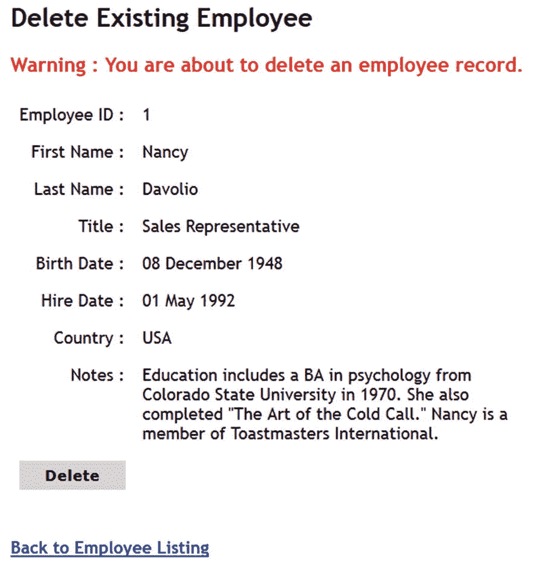

图 7-11

正在向用户寻求删除确认

这个页面由`EmployeeDeleteComponent`表示，类似于前面讨论的更新表单，它根据路径中传递的 id 获取特定的雇员。员工详细信息以只读方式显示。点击删除按钮调用`EmployeesApiService`的`delete()`方法。为了简洁起见，下面只讨论对`selectByID()`和`delete()`方法的调用。您可以从本章的代码下载中获得该组件的完整代码(包括视图文件)。

`EmployeesApiService`的`selectAll()`方法获取一个雇员对象，其 id 在路由中指定。如清单 [7-28](#PC43) 所示。

```cs
this.employeesApi.selectByID(this.id)
  .subscribe(data => {
    this.employee = data as Employee;
    this.deleteForm.controls['employeeID']
    .setValue(this.employee.employeeID);
  }
    , error => {
      if (error.status === 401) {
        this.router.navigate(["/signin"]);
      }
      this.message = error.message
    });

Listing 7-28selectAll() retrieves an employee object

```

注意传递给`subscribe()`方法的值处理函数。数据对象存储在组件类的 employees 成员中。您可以使用“雇员”成员在视图上显示雇员的详细信息。

因为雇员的详细信息以只读方式显示，所以表单上没有数据输入控件。您唯一需要的表单控件是一个存储 EmploeeID 的隐藏表单字段。因此，代码使用`deleteForm`表单组的`controls`集合直接设置`employeeID`隐藏表单字段。表单控件的`setValue()`方法接受分配给控件的值。

删除按钮的 click 事件处理程序调用`EmployeesApiService`的`delete()`方法，如清单 [7-29](#PC44) 所示。

```cs
this.employeesApi.delete(
  this.deleteForm.controls["employeeID"].value)
  .subscribe(() => {
              sessionStorage.setItem("message", "Employee
              deleted successfully!");
              this.router.navigate(['/employees/list']);
  }, error => {
    if (error.status === 401) {
      this.router.navigate(["/signin"]);
    }
    this.message = error.message
  });

Listing 7-29Calling the delete() method to delete an employee

```

`delete()`方法接受一个要删除的 EmployeeID。使用`controls`集合从隐藏的表单字段中检索这个 EmployeeID。集合中表单控件的`value`属性返回其值。

值处理函数将成功消息存储到`sessionStorage`对象中。回想一下，这条`sessionStorage`消息显示在员工列表页面上。然后，用户被导航到员工列表页面。

## 登录组件

最初运行应用时，您会被带到由`SignInComponent`表示的登录页面(该组件呈现的 UI 类似于前一章中讨论的 jQuery 示例的登录页面)。该组件调用安全 Web API 来获取 JWT。令牌然后被存储在`sessionStorage`对象中。建议您从本书的代码下载中获取组件类文件(signin.component.ts)和视图文件(signin.component.ts)。虽然这里没有讨论`SignInComponent`的完整代码，但有几点值得注意:

*   如何显示字段级验证错误

*   如何调用安全 API 并获得 JWT

`SignInComponent`类在构造函数中配置`signinForm`，如清单 [7-30](#PC45) 所示。

```cs
this.signinForm = this.formBuilder.group({
  userName: [", [Validators.required, Validators.maxLength(20)]],
  password: [", [Validators.required, Validators.maxLength(20)]]
});

Listing 7-30Configuration of signinForm

```

如您所见，`signinForm`由两个表单控件组成——一个用于接受用户名，一个用于接受密码。两个表单控件都附带了`required`和`maxLength`验证器。您希望在视图中显示字段级验证错误消息，以便知道哪个表单控件无效。要在视图上显示验证错误，可以使用 Angular 的`ngIf`结构指令，如清单 [7-31](#PC46) 所示。

```cs
<div *ngIf="signinForm.controls.userName.dirty && signinForm.controls.userName.invalid">
  <div *ngIf="signinForm.controls.userName.errors.required" [ngClass]="'message'">
    User Name is required
  </div>
  <div *ngIf="signinForm.controls.userName.errors.maxlength" [ngClass]="'message'">
    User Name must be smaller than 20 characters
  </div>
</div>

Listing 7-31Displaying field-level validation error messages

```

这段代码展示了如何为用户名输入字段显示验证错误消息。应用于外部`<div>`元素的`ngIf`结构指令类似于 C# 的 if 语句，它检查一个或多个布尔表达式。这里，代码检查两个布尔表达式。首先检查`userName`表单控件是否被编辑过。这是通过从`signinForm`表单组的`controls`集合中访问`userName`表单控件，然后检查其`dirty`属性来完成的。如果控件值已被编辑，`dirty`属性返回`true`；否则返回`false`。

其次，检查`userName`表单控件的`invalid`属性。如果控件包含无效值，`invalid`属性返回`true`；否则它返回`false`。

只有当两个条件都为真时，才会显示错误消息。您可以进一步检查验证错误的种类，并相应地显示错误消息。表单控件有两个附加的验证器——`required`和`maxLength`。要检查它们的有效性状态，可以使用`userName`表单控件的`errors`集合。例如，如果`errors.required`不为空，则表示表单控件为空。类似地，如果`errors.maxlength`不为空，则表明控件包含的值超过了最大允许长度。相应地，显示带有错误消息的各个`<div>`元素。

注意使用了`ngClass`指令，该指令将`message` CSS 类应用于`<div>`元素，以突出错误消息。

该标记显示了`userName`表单控件的错误消息。您也可以使用相同的技术来显示`password`表单控件的错误消息。

现在您已经知道如何显示字段级验证错误消息，让我们继续进行调用安全 Web API 的代码(清单 [7-32](#PC47) )。

```cs
signin_click() {
  if (this.signinForm.invalid) {
    this.message = "One or more values are invalid.";
    return;
  }
  this.securityApi.signIn(this.signinForm.value)
  .subscribe(token => {
    sessionStorage.setItem('token', token.token);
    sessionStorage.setItem('userName', this.signinForm.controls['userName'].value);
    this.router.navigate(["/employees/list"])
  }, error => this.message = "Unable to Sign-in");
}

Listing 7-32Sign-in form calls Security Web API

```

请注意用粗体字母标记的代码。它通过传递`signinForm`值(一个具有用户名和密码属性的对象)来调用`SecurityApiService`的`signIn()`方法。如果用户验证成功，值处理器函数将接收由安全 Web API 发布的 JWT。这个令牌保存在`sessionStorage`对象中，以便在执行 CRUD 操作时可以传递给服务器。

代码还在`sessionStorage`中设置了`userName`条目，以便当前用户的登录名可以显示在应用的其他页面上。使用`value`属性从`userName`表单控件中检索当前用户的登录名。

成功登录系统后，用户将被导航到员工列表页面。如果在调用安全 Web API 时出现任何错误，错误处理程序会在`message`成员中设置一条错误消息。

## 注销组件

注销组件显示当前登录用户的用户名，还显示一个注销按钮，以便用户可以注销应用。该组件由`SignOutComponent`类及其相关视图表示。您可以从本章的代码下载中获得该组件的完整代码。这里只讨论类的`ngOnInit()`方法和注销按钮的点击事件处理程序(清单 [7-33](#PC48) )。

```cs
ngOnInit() {
  this.userName = sessionStorage.getItem('userName');
}

signout_click() {
  sessionStorage.removeItem('token');
  sessionStorage.removeItem('userName');
  this.router.navigate(["/signin"]);
}

Listing 7-33SignOutComponent signs a user out of the application

```

如您所见，`ngOnInit()`方法只是检索存储在`sessionStorage`对象中的`userName`键，并将其存储在`userName`成员中。这个`userName`显示在视图上。

单击 Sign Out 按钮会引发`signout_click()`事件处理程序。在内部，代码从`sessionStorage`中移除了`token`键。这样，Web API 调用将不再有 JWT，用户认证将失败。该代码还从`sessionStorage`中移除了`userName`键，并将用户导航到登录页面。

这就完成了注销组件。显示用户注册页面的 register 组件与您在本章前面开发的组件非常相似，因此这里不再讨论。您可以从本章的代码下载中获得 RegisterComponent 的完整代码。

## 了解 app.module.ts

到目前为止，在本章中，您已经创建了应用所需的各种组件和服务。现在是时候来看看驻留在 app.module.ts 文件中的应用的根模块了。

如果您打开 app.module.ts 文件，您将在顶部找到一系列导入语句，后面是模块类 AppModule。这些导入语句可以分为三组。第一组由导入应用运行所需的外部模块的 import 语句组成。清单 [7-34](#PC49) 显示了这些导入语句。

```cs
import { NgModule } from '@angular/core';
import { BrowserModule } from '@angular/platform-browser';
import { ReactiveFormsModule } from '@angular/forms';
import { HttpClientModule } from '@angular/common/http';
import { RouterModule } from '@angular/router';
import { AppRoutingModule } from './app-routing.module';

Listing 7-34Importing modules required by the application

```

这些导入语句导入依赖于 Employee Manager 应用的 Angular 模块。尤其值得注意的是`ReactiveFormsModule`、`HttpClientModule`和`RouterModule`，因为它们分别是反应式表单、HttpClient 和路由特性的基础。

`AppRoutingModule`模块是一个定制模块，包含应用的路由配置，将在下一节讨论。

第二组导入语句由开发期间添加的服务组成，如清单 [7-35](#PC50) 所示。

```cs
import { EmployeesApiService } from './employees-api/employees-api.service';
import { CountriesApiService } from './countries-api/countries-api.service';
import { SecurityApiService } from './security-api/security-api.service';

Listing 7-35Importing services

```

第三组导入语句导入应用的组件(清单 [7-36](#PC51) )。

```cs
import { AppComponent } from './app.component';
import { EmployeeListComponent } from './employee-list/employee-list.component';
import { EmployeeInsertComponent } from './employee-insert/employee-insert.component';
import { EmployeeUpdateComponent } from './employee-update/employee-update.component';
import { EmployeeDeleteComponent } from './employee-delete/employee-delete.component';
import { SignInComponent } from './signin/signin.component';
import { RegisterComponent } from './register/register.component';
import { SignOutComponent } from './signout/signout.component';

Listing 7-36Importing components

```

除了`AppComponent`所有其他组件都是在开发过程中添加的。`AppComponent`组件是默认的根组件，将在后面的章节中讨论。

在这些导入语句下面，是用`@NgModule()`装饰器装饰的`AppModule`类。包含模块元数据的对象被提供给`@NgModule()`装饰器。清单 [7-37](#PC52) 显示了`@NgModule()`装饰器。

```cs
@NgModule({
    declarations: [
        AppComponent,
        EmployeeListComponent,
        EmployeeInsertComponent,
        EmployeeUpdateComponent,
        EmployeeDeleteComponent,
        SignInComponent,
        RegisterComponent,
        SignOutComponent
    ],
    imports: [
        BrowserModule,
        ReactiveFormsModule,
        HttpClientModule,
        RouterModule,
        AppRoutingModule
    ],
    providers: [
      EmployeesApiService,
      CountriesApiService,
      SecurityApiService
    ],
    bootstrap: [AppComponent]
})
export class AppModule { }

Listing 7-37Specifying module’s metadata

```

该对象由四个数组属性组成——声明、导入、提供程序和引导。尽管对这些属性的详细讨论超出了本书的范围，但可以说

*   **声明**部分列出了属于该应用的所有组件

*   **imports** 部分列出了此应用的所有外部依赖项

*   **providers** 部分列出了该应用的所有服务

*   **bootstrap** 部分指定了应用的根组件

### 注意

如果您的服务包含在元数据中指定了{ providedIn: 'root' }的@ injective()decorator，那么您不需要在 providers 部分再次列出它们。这里列出它们只是为了清楚地理解。

## 选择途径

在开发 Angular 应用的各种组件时，您在几个地方使用了像`/employees/list`和`/signin`这样的路线。现在是时候研究路由配置了。

除了 app.module.ts 文件之外，您还可以找到 app-routing.module.ts 文件。该文件包含一个用于设置应用路由的模块。清单 [7-38](#PC53) 显示了这个模块的初始内容。

```cs
import { NgModule } from '@angular/core';
import { Routes, RouterModule } from '@angular/router';

const routes: Routes = [];

@NgModule({
  imports: [RouterModule.forRoot(routes)],
  exports: [RouterModule]
})
export class AppRoutingModule { }

Listing 7-38Content of app-routing.module.ts

```

请注意以粗体显示的代码。代码声明了一个空的`routes`数组。routes 数组被提供给`RouterModule`的`forRoute()`方法。Angular 的`RouterModule`为您的应用处理路由和导航。`forRoot()`方法准备模块使用指定的路线。

为了定义应用的路由，您需要修改 routes 数组以包含所需的路由配置(您还需要添加 import 语句来导入路由配置中提到的组件)。清单 [7-39](#PC54) 显示了正在开发的应用所需的路由配置。

```cs
const routes: Routes = [
  { path: "", redirectTo: "employees/list", pathMatch: 'full' },
  { path: "register", component: RegisterComponent },
  { path: "signin", component: SignInComponent },
  { path: "employees/list", component: EmployeeListComponent },
  { path: "employees/insert", component: EmployeeInsertComponent },
  { path: "employees/update/:id", component: EmployeeUpdateComponent },
  { path: "employees/delete/:id", component: EmployeeDeleteComponent },
  { path: '**', component: EmployeeListComponent }
];

Listing 7-39Routing configuration for an application

```

如您所见，路由器数组包含定义各种路由的对象。此配置中使用的路由对象的各种属性如下所示:

*   **path** :表示通常映射到组件的 URL 的路径。如果没有指定路径，可以重定向到 redirect to 属性中指定的另一个路径。如果通配符(**)的路径值表示路径与任何其他已定义的路径都不匹配。请注意如何使用:id 语法为更新和删除路由指定 id route 参数。

*   **redirectTo** :指定匹配路径时重定向的 URL。

*   **路径匹配**:表示路径匹配策略；值为 full 表示在匹配过程中将使用整个路径。

*   **组件**:表示被实例化处理路径的组件。例如，如果导航到/employees/list URL，将调用 EmployeeListComponent。

### 注意

Angular 路由功能的详细讨论超出了本书的范围。考虑阅读 [`https://angular.io/guide/router`](https://angular.io/guide/router) 了解更多详情。

这就完成了应用所需的客户端路由配置。应用仍然不会按照这种配置显示组件。您需要指定加载这些路线的占位符。这是使用 Angular 的 RouterOutlet 指令完成的。要使用 RouterOutlet 指令，打开根组件视图文件——app.component.html——并编写清单 [7-40](#PC55) 中所示的标记。

```cs
<h1>Employee Manager</h1>
<hr />
<router-outlet></router-outlet>

Listing 7-40Placing the RouterOutlet directive in the root component’s view

```

如您所见，`<router-outlet>`指令标记了路由配置被展开以显示应用的各种“页面”的地方。

应该注意，Angular 路由是一种客户端机制。虽然它允许我们以“逐页”的方式访问应用，但是客户端路由有它自己的问题。如果用户在地址栏手动输入客户端 URL 会怎样？如果用户标记了一个客户端 URL，并试图在将来的某个时候访问它，该怎么办？在这种情况下，您将从 ASP.NET Core 应用获得 404(未找到)错误，因为服务器不知道这些 URL。您需要在 ASP.NET Core 应用中处理这种情况。处理这种情况的一种可能的方法被添加到本章的源代码中。为了简洁起见，这里不讨论它，但是您可以通过下载源代码来查看它。

### 注意

您在本章开发的组件中使用了各种 CSS 类和样式。它们存在于 src 文件夹下的 styles.css 文件中。因此，只需将 Employee Manager 的任何早期版本(比如 MVC 版本)中的完整 CSS 样式(site.css)复制到这个文件中。

## 运行 Angular 应用

既然您已经完成了代表 Employee Manager 前端的 Angular 应用，那么是时候运行该应用并检查一切是否如预期那样工作了。

要运行该应用，首先需要运行 ASP.NET Core Web API 项目，该项目包含员工 Web API、国家 Web API 和安全 Web API。所以打开 Visual Studio 命令提示符，导航到 EmployeeManager。Angular 项目文件夹，并发布此。NET CLI 命令:

```cs
> dotnet run

```

这将在`http://localhost:5000`运行应用。现在，打开 Node.js 命令提示符并导航到 Angular 项目根文件夹。然后发出以下 Angular CLI 命令:

```cs
> ng serve --open

```

该命令在`http://localhost:4200`开始并用于 Angular 应用。`--open`开关表示将打开一个浏览器窗口，并在其中启动应用。

如果一切顺利，您将看到一个登录页面。使用有效凭证登录(您可以使用在测试 jQuery 应用时创建的用户帐户，因为 Angular 应用也使用相同的 Users 表)或创建一个新帐户。成功登录后，您可以尝试执行 CRUD 操作。另外，检查浏览器地址栏是否按照路由配置显示 URL。

### 整合 Angular 应用和 ASP.NET Core 应用

在上一节中，您将 ASP.NET Core 应用和 Angular 应用作为两个独立的应用运行。这在开发和测试阶段是正常的。然而，一旦开发结束，您可能希望将 Angular 应用与 ASP.NET Core 应用集成在一起。

为此，首先转到您在该应用中创建的所有 Angular 服务，并将`baseUrl`成员更改为:

```cs
baseUrl: string = '/api/employees';

```

如您所见，`baseUrl`不再包含主机和端口信息，因为 Angular 应用将与 ASP.NET Core 应用合并。您需要在`EmployeesApiService`、`CountriesApiService`和`SecurityApiService`类中进行这种更改。

然后使用以下 Angular CLI 命令构建 Angular 应用:

```cs
> ng build --prod = true

```

该命令编译 Angular 应用。`--prod`开关设置为 true，表示应用将使用生产配置进行编译。默认情况下，编译的输出存储在项目根目录下的 dist 文件夹中。图 [7-12](#Fig12) 显示编译的输出。

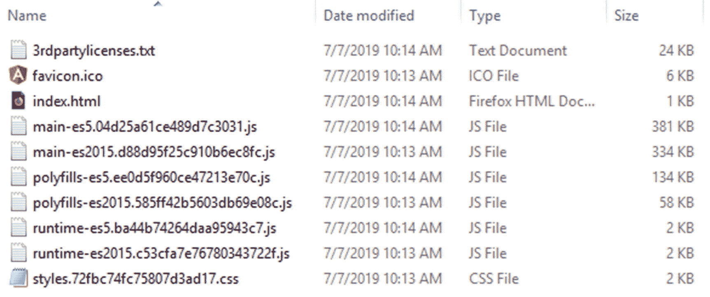

图 7-12

编译的输出存储在 dist 文件夹下

请注意作为 Angular SPA 应用起始页的 index.html 文件。

接下来，复制所有这些文件，并将它们直接放在 ASP.NET Core 应用的 wwwroot 文件夹下。打开`Startup`类并改变`Configure()`方法，如清单 [7-41](#PC60) 所示。

```cs
...
app.UseDefaultFiles();
app.UseStaticFiles();
...

Listing 7-41Enabling the default page for the ASP.NET Core application

```

当您将 Angular 应用与 ASP.NET Core 应用集成时，如果您将 Angular 应用的 index.html 文件设置为您的 ASP.NET Core 应用的默认页面，那就太好了。要做到这一点，您需要使用`UseDefaultFiles()`中间件。一旦你这样做，ASP.NET Core 将寻找标准的默认网页，如 default.htm，default.html，index.htm 和 index.html 内的 wwwroot 文件夹。在这种情况下，您有 index.html，因此它将被用作应用的默认文档。

现在，您可以像以前一样运行 ASP.NET Core 应用并使用 Angular SPA。

## 摘要

在本章中，您使用 ASP.NET Core 和 Angular 创建了雇员管理器应用。ASP.NET Core Web API 提供了核心应用功能，Angular SPA 提供了使用这些 Web API 的前端。

您学习了使用 Angular CLI 并创建了 Angular 组件和服务。为了实现 CRUD 功能，您创建了`EmployeeListComponent`、`EmployeeInsertComponent`、`EmployeeUpdateComponent`和`EmployeeDeleteComponent`。通过 JWT 认证方案提供用户认证。在实现应用的认证特性时，使用了`SignInComponent`、`SignOutComponent`和`RegisterComponent`。

您已经熟悉了整个 Angular 应用架构，并且实现了路由和导航。最后，您集成了 Angular 应用和 ASP.NET Core 应用。