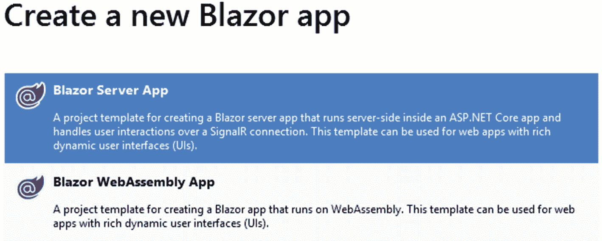

# 八、Blazor

在前面的章节中，您学习了使用 jQuery 和 Angular 来构建 ASP.NET Core 应用的 JavaScript 前端。因此，您的应用是服务器端 C# 代码和客户端 JavaScript 代码的混合体。如果你能在服务器端和客户端都使用 C# 不是很好吗？这就是 Blazor 允许你完成的。Blazor 是一个用 ASP.NET Core 构建丰富的交互式客户端 web 用户界面的框架。使用 Blazor，您可以使用 C#、HTML 和 CSS 创建 UI 组件。本章教你如何做到这一点。具体来说，您将

*   了解 Blazor 托管模型

*   了解什么是剃须刀组件

*   创建执行数据验证和数据绑定的 Blazor UI

*   使用生命周期方法、依赖注入和路由

*   在 Blazor 服务器端应用中集成 ASP.NET Core Identity

我们走吧。

## Blazor 托管模型

在开始开发 Blazor 应用之前，您需要决定应用将在哪里执行。这就是 Blazor 主机模型出现的原因。

到目前为止，您已经知道 Blazor 是一个用于构建富客户端用户界面的框架。在开始 Blazor 开发之前，您需要决定应用要使用的托管模型。Blazor 应用的代码可以在浏览器内部或服务器上执行。根据应用代码运行的位置，Blazor 提供了两种托管模型:客户端(Blazor WebAssembly)和服务器端(Blazor Server)。

在开始应用开发之前，通常会选择托管模型。那是因为两种托管模式有一定的区别。对于这些宿主模型，甚至 Visual Studio 项目模板也是不同的。以下部分将更详细地描述这些托管模型。

### 客户端(Blazor WebAssembly)

在这种模式下，Blazor 应用及其依赖项由浏览器下载到客户端，应用在浏览器的边界内运行。客户端托管模型使用 WebAssembly 进行工作。

WebAssembly(通常缩写为 Wasm)是一种紧凑的二进制格式，为 web 应用提供了良好的性能(几乎就像本机执行)。WebAssembly 的设计方式使得任何编程语言都可以编译成 WebAssembly 格式。目前，所有主流浏览器都支持 WebAssembly，所以您的应用并不局限于特定的浏览器。

### 注意

WebAssembly 的详细讨论超出了本书的范围。如果想了解更多，可以考虑参观[`https://webassembly.org`](https://webassembly.org)[`https://developer.mozilla.org/en-US/docs/WebAssembly`](https://developer.mozilla.org/en-US/docs/WebAssembly)。

一旦应用被下载到客户端，它就被浏览器执行。UI 的呈现和用户交互(如单击按钮)由浏览器处理，就像任何其他 web 应用一样。

在评估您是否愿意进行客户端托管时，请考虑以下几点:

*   由于应用是在客户端下载的，因此该模型有效地利用了客户端资源，从而提供了良好的整体性能。

*   应用在浏览器的边界内运行。所以浏览器的所有限制都适用于应用。

*   对于较大的应用，下载时间可能会更长，导致初始加载时间更长。

*   此宿主模型依赖于支持 WebAssembly 的浏览器。

### 服务器端(Blazor 服务器)

在服务器端托管模型中，Blazor 应用在 ASP.NET Core 应用内的 web 服务器上执行。对 DOM 和事件处理的更改是使用 SignalR 连接执行的。

SignalR 是一个为 ASP.NET Core 应用添加实时功能的库。使用 SignalR，服务器可以将通知推送到客户端。SignalR 利用 WebSocket 和 HTML5 等现代浏览器功能进行通信。如果不支持 WebSockets，SignalR 还可以使用其他技术来完成工作。

### 注意

对 SignalR 的详细讨论超出了本书的范围。如果你想了解更多，可以考虑访问 [`https://dotnet.microsoft.com/apps/aspnet/real-time`](https://dotnet.microsoft.com/apps/aspnet/real-time) 。

在评估您是否愿意进行服务器端托管时，请考虑以下几点:

*   由于浏览器不下载应用及其依赖项，初始加载时间会更快。

*   由于应用运行在 ASP.NET Core 服务器上，你可以像 ASP.NET Core MVC 或 ASP.NET Core Razor Pages 应用一样使用 ASP.NET Core 的许多功能(如 ASP.NET Core Identity)。

*   因为应用是在服务器上运行的，所以每个用户交互都需要一个小的服务器通信。

*   如果您打算为您的应用支持非常庞大的用户群，那么服务器端托管模型可能会很有挑战性。

如前所述，应该在开始开发之前决定要使用的托管模型。Visual Studio 提供了涵盖这些宿主模型的独特项目模板。首先，你需要在创建新项目对话框中选择 Blazor App(图 [8-1](#Fig1) )。


图 8-1

创建新的 Blazor 应用

选择该项目类型并指定项目名称后，需要选择一个项目模板，如图 [8-2](#Fig2) 所示。



图 8-2

Visual Studio Blazor 项目模板

每个 Blazor 项目模板的用途如下:

*   **Blazor 服务器应用:**这个项目模板使用应用的服务器端托管模型。Visual Studio 项目是用一组默认文件创建的。

*   **Blazor WebAssembly App:** 本项目模板采用客户端托管模式。客户端代码可以调用服务器端 Web APIs 来执行服务器端处理。

### 注意

在撰写本文时，Blazor WebAssembly 处于预览阶段。您可以使用安装最新的 Blazor WebAssembly 模板。NET Core CLI。阅读 [`https://docs.microsoft.com/en-us/aspnet/core/blazor/hosting-models`](https://docs.microsoft.com/en-us/aspnet/core/blazor/hosting-models) 了解更多详情。

本章的剩余部分使用 Blazor 服务器端托管模型来构建一个版本的 Employee Manager，它使用 Razor 页面(用于用户注册和登录)、Razor 组件(用于 CRUD 页面)、实体框架核心(用于数据访问)和 ASP.NET Core Identity(用于用户认证)。

Razor 组件是 Blazor 应用的构建块。下一节给你更多关于剃须刀组件的细节。

## 剃须刀组件概述

Blazor 应用由 Razor 组件组成。razor 组件以. Razor 文件的形式存在，包含 C# 代码和 HTML 标记。编译时，这两部分组合在一起形成一个组件类。

C# 代码通常由变量、属性、方法和事件处理程序等成员组成。您还可以使用 C# 构造(如 for 循环或 if 语句)来动态生成 HTML 输出。前一种类型的 C# 代码存在于`@code`块中，而后一种类型的 C# 代码与 HTML 标记混合在一起。

### 注意

您可能会发现 Razor 组件与 Razor 视图非常相似(。cshtml)在很多方面。事实上，您还可以将 Razor 组件集成到 Razor 页面和 Razor 视图中。但是，在这本书里，你会坚持。Blazor 锉是为了清楚的理解和统一。

当 Razor 组件最初在浏览器中呈现时，它会生成它的 HTML 响应。如果任何事件导致 HTML 响应发生变化(比如，由于 click 事件处理程序而添加了一个 HTML 元素)，那么 Razor 组件会重新生成新的 HTML 响应。然后，Blazor 引擎通过比较两个 DOM(文档对象模型)树来确定旧的 HTML 响应和新生成的 HTML 响应之间的差异。比较过程中发现的任何修改都会反映在浏览器中。

一旦创建，Blazor 组件可以以两种方式使用:

*   它可以作为标记元素放在另一个组件中。例如，名为 HelloWorld 的组件可以使用标记:放置在另一个组件中。

*   可以使用@page 指令将 Razor 组件标记为一个页面，并与一个路由相关联。在这种情况下，可以使用组件的路由来调用组件。例如，标记为页面的 HelloWorld 组件可以在/HelloWorld 访问。

非页面 Razor 组件可以驻留在项目文件夹中的任何位置，而作为页面的 Razor 组件放置在项目根目录下的页面文件夹中(这与 Razor 页面放置在页面文件夹中的方式类似)。

### 注意

因为一个 Razor 组件可以包含在另一个 Razor 组件中，所以您也可以创建一个具有父子关系的 Razor 组件树。

Razor 组件也支持数据绑定和事件绑定。例如，您可以将 Razor 组件的 Message 属性与 textbox 进行数据绑定。当组件最初呈现时，它将 Message 属性的值显示到 textbox 中。对 textbox 值的任何更改都会反映在 Message 属性中。您还可以通过提供事件处理函数来处理客户端事件。例如，您可以绑定 onclick(在 HTML 中，大多数事件由标记中相应的属性表示。例如，click 事件由标记中的 onclick 属性表示。)按钮的事件到事件处理程序方法–on button click()。

### 组件生命周期方法

剃须刀组件在其生命周期中会经历一系列事件。这些生命周期事件由某些方法标记，组件作者可以在创建组件时覆盖这些方法。这些生命周期方法总结如下:

*   **OnInitialized:** 这个方法可以用来执行一些初始化任务。例如，您可以将组件成员设置为一些默认值。

*   **OnParametersSet:** 一个组件可以有参数。参数由属性表示，可以从外部环境(比如组件的父级)进行设置。当参数属性被赋值时，OnParametersSet()重写的方法将被执行。

*   **OnAfterRender:** 组件渲染后调用该方法。呈现的内容在这个阶段是可访问的。如果初始化逻辑涉及呈现的内容，可以使用此方法。

前面提到的所有方法都有它们的异步对应物。例如，`OnInitializedAsync()`可以用来异步处理初始化任务。

## 员工经理项目结构

在接下来的小节中，您将构建利用 Blazor 的服务器端托管模型的 Employee Manager。由于该应用使用服务器端托管模型，您也可以使用 ASP.NET Core 服务器端功能，如 ASP.NET Core Identity。

事实上，本章中构建的雇员经理应用使用了您在前面章节中开发的 ASP.NET Core Identity 和相关的 Razor 页面。为了执行数据访问操作，应用使用实体框架核心。数据访问通过存储库进行。这些存储库与您在本书前面使用 Web API 项目时开发的存储库非常相似。您还需要执行 CRUD 操作的页面。这些页面使用 Razor 组件构建，并使用存储库来列出、插入、更新和删除数据库中的员工详细信息。

本章中开发的雇员管理器应用作为 Employee Manager 存在。Blazor.ServerSide 项目，如图 [8-3](#Fig3) 所示。


图 8-3

Blazor 版本的员工管理器

您可能会发现项目组织非常类似于 Razor Pages 应用。看看 Pages 文件夹，它包含了你在本章中开发的所有 Razor 组件。请注意 Blazor 组件以。Blazor 锉。Security 文件夹包含一组 Razor 页面(Register.cshtml、SignIn.cshtml 和 SignOut.cshtml ),用于用户注册和登录到应用。这些 Razor 页面本质上与您在开发员工管理器的 Razor 页面版本时构建的页面相同。

Models 文件夹包含 EF 核心模型类，如 Employee 和 Country。Repositories 文件夹包含诸如 EmployeeRepository 和 CountryRepository 之类的存储库类。安全文件夹包含与身份相关的类，如 AppIdentityUser 和 AppIdentityUser。

现在您已经熟悉了项目组织，让我们通过添加一个 EF 核心模型和存储库来开始开发这个项目。确保您已经创建了 EmployeeManager。Blazor.ServerSide 项目基于前面讨论的 Blazor 服务器应用项目模板。您还可以删除项目模板中包含的默认 Razor 组件和类，以减少混乱。

## 实体框架核心模型和存储库

要执行 CRUD 操作，可以使用实体框架核心。所以项目中需要有一个自定义的 DbContext 和实体类(Employee 和 Country)。

将 Models 文件夹添加到项目根文件夹下，并将来自任何先前项目(比如 MVC 版本的 Employee Manager)的 AppDbContext.cs、Employee.cs 和 Country.cs 文件放在那里。将这些文件添加到项目中后，确保将它们的名称空间更改为 employee manager . blazor . server side . models，您已经熟悉了数据访问所需的 EF 核心模型，因此这里不再讨论。

### 注意

您可以从本书的源代码下载中获得本章中正在开发的雇员管理器应用的完整代码。

与其直接使用 Razor 组件中的`AppDbContext`类，不如创建存储库来封装 CRUD 操作。要创建存储库，添加存储库文件夹，并向其中添加两个名为`IEmployeeRepository`和`ICountryRepository`的接口。这些接口对您来说应该很熟悉，因为您是在学习 Web APIs 时创建的。为了便于您快速参考，它们显示在清单 [8-1](#PC1) 中。

```cs
public interface IEmployeeRepository
{
    List<Employee> SelectAll();
    Employee SelectByID(int id);
    void Insert(Employee emp);
    void Update(Employee emp);
    void Delete(int id);
}

public interface ICountryRepository
{
    List<Country> SelectAll();
}

Listing 8-1IEmployeeRepository and ICountryRepository interfaces

```

接下来，向名为`EmployeeRepository`的存储库文件夹添加一个新类，并在其中实现`IEmployeeRepository`接口。清单 [8-2](#PC2) 显示了完整的`EmployeeRepository`类。

```cs
public class EmployeeRepository : IEmployeeRepository
{
    private AppDbContext db = null;

    public EmployeeRepository(AppDbContext db)
    {
        this.db = db;
    }

    public List<Employee> SelectAll()
    {
        return db.Employees.ToList();
    }

    public Employee SelectByID(int id)
    {
        return db.Employees.Find(id);
    }

    public void Insert(Employee emp)
    {
        db.Employees.Add(emp);
        db.SaveChanges();
    }

    public void Update(Employee emp)
    {
        db.Employees.Update(emp);
        db.SaveChanges();
    }

    public void Delete(int id)
    {
        Employee emp = db.Employees.Find(id);
        db.Employees.Remove(emp);
        db.SaveChanges();
    }
}

Listing 8-2EmployeeRepository encapsulates CRUD operations on the Employees table

```

这段代码对你来说应该很熟悉，因为你已经使用过 EF 核心方法，比如`Add()`、`Update()`、`Remove()`和`SaveChanges()`。`EmployeeRepository`类在构造函数中注入`AppDbContext`，并存储在类成员中。执行 CRUD 操作时，所有其他方法都会使用`db`成员变量。`CountryRepository`实现`ICountryRepository`，如清单 [8-3](#PC3) 所示。

```cs
public class CountryRepository : ICountryRepository
{
    private readonly AppDbContext db = null;

    public CountryRepository(AppDbContext db)
    {
        this.db = db;
    }

    public List<Country> SelectAll()
    {
        return db.Countries.ToList();
    }
}

Listing 8-3CountryRepository returns all the countries from the Countries table

```

您需要向 DI 框架注册`AppDbContext`、`EmployeeRepository`和`CountryRepository`类。这是因为您想要将存储库注入到您在后面部分开发的 Razor 组件中。为此，打开`Startup`类并向`ConfigureServices()`方法添加代码，如清单 [8-4](#PC4) 所示。

```cs
public void ConfigureServices(IServiceCollection services)
{
    services.AddRazorPages();
    services.AddServerSideBlazor();

    services.AddDbContext<AppDbContext>(options => options.UseSqlServer(this.Configuration.GetConnectionString("AppDb")));
    services.AddScoped<IEmployeeRepository,
EmployeeRepository>();
    services.AddScoped<ICountryRepository, CountryRepository>();

}

Listing 8-4Registering AppDbContext and repositories with the DI container

```

请注意以粗体显示的代码。第一行为 DI 寄存器`AppDbContext`。该代码从 appsettings.json 文件中选取数据库连接字符串(如果您还没有这样做，则需要将连接字符串添加到 appsettings.json 文件中)。

第二行和第三行使用`AddScoped()`方法向 DI 注册`EmployeeRepository`和`CountryRepository`。回想一下前面的章节，使用`AddScoped()`方法添加的服务是为每个请求创建一次的。

### 注意

您使用 Blazor Server App 项目模板创建了这个应用。您将观察到 ConfigureServices()调用 AddRazorPages()和 AddServerSideBlazor()方法来注册 Blazor 服务器端应用所需的服务。类似地，Configure()方法中的 UseEndpoints()调用使用 MapBlazorHub()和 MapFallbackToPage()方法来设置 Blazor 的路由。

## 显示员工列表

要显示雇员列表(图 [8-4](#Fig4) ，您需要创建一个名为 List.razor 的 Razor 组件。


图 8-4

显示员工列表

要添加 List.razor，右键单击 Pages 文件夹，选择添加➤新项目，打开添加新项目对话框，如图 [8-5](#Fig5) 所示。


图 8-5

添加新的剃须刀组件

从列表中选择 Razor 组件条目，将名称指定为 list，然后单击 Add 按钮。

添加 List.razor 后，在 Visual Studio 编辑器中打开它，并将清单 [8-5](#PC5) 中所示的代码添加到 razor 组件的顶部。

```cs
@page "/"
@page "/Employees/List"
@using Microsoft.AspNetCore.WebUtilities
@inject NavigationManager UriHelper
@inject IEmployeeRepository EmpRepository

Listing 8-5Defining route and injecting services

```

代码由一系列指令组成。您希望将 List.razor 组件用作“页面”,而不是将其放在其他组件中。因此,`@page`指令用于将这个组件关联到路由模板。注意，代码使用了两个`@page`指令，每个指令指定一个路由模板。第一个`@page`指令使这个组件成为应用的默认页面，所以它的路由模板是“/”第二个`@page`指令使组件可以在/Employees/List 访问。Blazor 路由与 ASP.NET Core 的端点路由相集成。

`@using`指令指定了您想要使用的名称空间(在本例中为`Microsoft.AspNetCore.WebUtilities`)。您也可以在 _Imports.razor 文件中指定这个名称空间，在这种情况下，所有组件都可以使用它，而不需要使用`@using`指令。这个名称空间中的`QueryHelpers`类将在后面的代码中使用。

然后用`@inject`指令注入一个`Microsoft.AspNetCore.Components.NavigationManager`类的对象。`@inject`指令指定了两件事:一个要注入的类型，后跟一个属性名以接收注入的类型(这个属性是由编译器自动创建的)。您可以在 C# 代码中使用该属性名来访问注入的对象。

注入到组件中的`NavigationManager`对象可用于处理 URL 和编程导航。您可以使用该对象来读取查询字符串值(如果有),这将在本节稍后讨论。

在同一行中，代码注入了可以使用`EmpRepository`属性访问的`IEmployeeRepository`对象。

接下来，在刚刚讨论的指令下面添加一个`@code`块，并将清单 [8-6](#PC6) 中所示的代码写入其中。

```cs
@code {
    List<Employee> Employees { get; set; }
    string Message { get; set; }

    protected override void OnInitialized()
    {
        Employees = EmpRepository.SelectAll();
        var uri = new Uri(UriHelper.Uri);
        if (QueryHelpers.ParseQuery(uri.Query).Count > 0)
        {
            Message = QueryHelpers.ParseQuery(uri.Query)
                  .First().Value;
        }
    }
}

Listing 8-6@code block fetches a list of employees

```

`@code`块声明了两个属性，即 Employees 和 Message。前一个属性用于存储由`EmpRepository,`返回的雇员列表，而后一个属性用于存储要显示给用户的消息(如果有的话)。

然后是在组件初始化时调用的`OnInitialized()`生命周期方法。在`OnInitialized()`方法内部，代码调用`EmpRepository`对象的`SelectAll()`方法来检索雇员对象的`List`。`SelectAll()`的返回值被赋给`Employees`属性。

下一段代码检查 URL 是否包含消息。您需要这样做，因为删除组件(将在本章后面讨论)通过查询字符串向员工列表页面传递消息。如果该消息存在于查询字符串中，您需要向用户显示它。

首先，基于当前 URL 创建一个`Uri`对象。当前 URL 是使用`UriHelper`对象的`Uri`属性获得的。返回的 URL 被传递给`Uri`类的构造函数。

下一个 if 语句检查查询字符串是否包含任何参数。这是在`QueryHelpers`类及其`ParseQuery()`方法的帮助下完成的。`ParseQuery()`方法解析查询字符串以获得它的键值对。`Count`属性返回键值对的数量。在内部，代码选择第一个查询字符串值(在本例中，只有一个键-值对)并将其赋给`Message`属性。向用户显示该消息。

### 注意

在本例中，您使用了一个查询字符串参数将消息从“删除员工”页面传递到“员工列表”页面。但是，您也可以使用路由参数来代替查询字符串。路由参数将在后面的章节中讨论。在更真实的情况下，您还应该对传递的查询字符串参数进行一些错误检查和验证。

这就完成了`@code`块。在`@code`块下面，编写 HTML 标记和混合的 C# 代码，在一个表中显示雇员列表(清单 [8-7](#PC7) )。

```cs
<h2>List of Employees</h2>
<h3 class="message">@Message</h3>
<a href='/employees/insert' class="linkbutton">Insert</a>

<br /><br />
<table border="1" cellpadding="10">
    <tr>
        <th>Employee ID</th>
        <th>First Name</th>
        <th>Last Name</th>
        <th>Title</th>
        <th colspan="2">Actions</th>
    </tr>
    @foreach (var item in Employees)
    {
        <tr>
            <td>@item.EmployeeID</td>
            <td>@item.FirstName</td>
            <td>@item.LastName</td>
            <td>@item.Title</td>
            <td>
            <a href='/employees/update/@item.EmployeeID'
               class="linkbutton">Update</a>
            </td>
            <td>
            <a href='/employees/delete/@item.EmployeeID'
               class="linkbutton">Delete</a>
            </td>
        </tr>
    }
</table>

Listing 8-7Displaying a list of employees in the HTML table

```

在页面标题下方，`Message`属性值显示在页面上。锚元素指向可在/employees/insert 访问的 Insert.razor 组件(将在本章后面讨论)。

### 注意

在本例中，您使用了 anchor 元素，因为导航非常简单明了。Blazor 还提供了<navlink>组件，可以用来呈现 Razor 组件的超链接。它有一些额外的特性，比如如果 href 属性匹配当前的 URL，就自动为链接设置活动的 CSS 类。</navlink>

然后呈现一个`<table>`用于显示雇员列表。注意使用了`@foreach`循环来生成表格行。生成的每一行都显示该员工的`EmployeeID`、`FirstName`、`LastName`、`Title`。每一行还有更新和删除链接。更新链接指向位于/employees/update 的 Update.razor，删除链接指向位于/employees/delete 的 Delete.razor。`EmployeeID`也是通过这些路线。

这就完成了 List.razor 组件。

## 插入新员工

单击雇员列表组件上的 Insert 链接会将您带到另一个组件，在那里您可以插入一个新雇员(图 [8-6](#Fig6) )。


图 8-6

插入新员工

要开发这个组件，需要在 Pages 文件夹中添加一个名为 Insert.razor 的新 Razor 组件。

然后在 Insert.razor 的顶部添加清单 [8-8](#PC8) 中所示的指令。

```cs
@page "/Employees/Insert"
@inject IEmployeeRepository EmpRepository
@inject ICountryRepository CtryRepository

Listing 8-8Defining routing and injecting repositories

for Insert.razor

```

这里，`@page`指令指定路由模板为/Employees/Insert。`@inject`语句注入了两个存储库，它们可以分别作为`EmpRepository`和`CtryRepository`属性被访问。

接下来，向组件添加一个@code 块，并编写清单 [8-9](#PC9) 中所示的代码。

```cs
@code {
    Employee EmployeeModel { get; set; }
    List<Country> Countries { get; set; }
    string Message { get; set; }

    protected override void OnInitialized()
    {
        EmployeeModel = new Employee();
        Countries = CtryRepository.SelectAll();
    }

    private void OnSaveClick()
    {
        EmpRepository.Insert(EmployeeModel);
        Message = "Employee inserted successfully!";
    }
}

Listing 8-9@code block with properties and event handlers

```

`@code`块定义了三个属性，即`EmployeeModel`、`Countries`和`Message`。`EmployeeModel`属性属于`Employee`类型，用于数据输入表单的数据绑定(稍后讨论)。`Countries`属性包含一个`Country`对象的`List`，用于填充国家下拉列表。`Message`字符串属性用于向用户显示成功或错误消息。

然后，`@code`块继续覆盖`OnInitialized()`生命周期方法。在内部，代码给`EmployeeModel`属性分配了一个新的`Employee`对象。代码还调用了`CtryRepository`的`SelectAll()`方法，该方法从 countries 表中获取所有国家的列表。

接下来，`@code`块包含一个名为`OnSaveClick()`的事件处理方法。这个事件处理器方法处理数据输入表单的`OnValidSubmit`事件(稍后讨论)。在内部，代码通过传递与表单绑定的`Employee`对象数据来调用`EmpRepository`的`Insert()`方法(由`EmployeeModel`属性表示)。通过将成功消息分配给`Message`属性，向用户显示成功消息。

这就完成了`@code`块。现在继续添加清单 [8-10](#PC10) 中所示的标记。

```cs
<h2>Insert New Employee</h2>
<h3 class="message">@Message</h3>
<EditForm Model="EmployeeModel" OnValidSubmit="OnSaveClick">
  <DataAnnotationsValidator></DataAnnotationsValidator>
  <ValidationSummary></ValidationSummary>
</EditForm>
<br /><br />
<a href="/employees/list">Back to Employee Listing</a>

Listing 8-10Creating the data entry form using the <EditForm> component

```

请注意以粗体显示的标记。它显示了用于定义数据输入表单的 Blazor 的`<EditForm>`组件。元素的属性指定了一个用于表单数据绑定的模型对象。注意`EmployeeModel`属性是如何用于这个目的的。`OnValidSubmit`属性表示当表单包含有效条目并由用户提交时引发的事件。先前在`@code`块中创建的`OnSaveClick()`方法被指定为`OnValidSubmit`事件的事件处理程序。

在`<EditForm>`元素内部，有两个组件，分别是`<DataAnnotationsValidator>`和`<ValidationSummary>`元素。`<DataAnnotationsValidator>`组件为这个表单启用基于数据注释的验证。`Employee`模型类使用数据注释，比如`[Required]`和`[StringLength]`。使用`<DataAnnotationsValidator>`意味着表单可以根据那些数据注释进行验证。`<ValidationSummary>`组件从表单中呈现验证错误列表(如果有的话)。

表单的其他部分对您来说应该很熟悉，因为您在列表中使用过它们。

接下来，在`<DataAnnotationsValidator>`和`<ValidationSummary>`组件之间添加清单 [8-11](#PC11) 中所示的标记。为了清楚起见，只显示了名字字段；其他字段稍后讨论。

```cs
<table border="0" cellpadding="10">
    <tr>
        <td class="right">
            <label for="FirstName">First Name :</label>
        </td>
        <td>
            <InputText id="FirstName"
            @bind-Value="EmployeeModel.FirstName" />
            <ValidationMessage
            For="(() => EmployeeModel.FirstName)" />
        </td>
    </tr>
  ...
  ...

Listing 8-11Defining form fields and validations

```

请注意以粗体显示的代码。它显示了用于呈现文本框的`<InputText>`组件(类型为`text`的 HTML `<input>`字段)。`<InputText>`将与`Employee`对象的`FirstName`属性进行数据绑定。这是通过将组件的`@bind-Value`属性设置为`Employee`对象的`FirstName`属性来实现的。

为了显示字段级验证错误(如果有的话)，使用了`<ValidationMessage>`组件。`<ValidationMessage>`元素的`For`属性指定了一个表示相关模型属性的 lambda 表达式(在本例中为`FirstName`)。

就像`<InputText>`组件一样，还有几个包括`<InputDate>`、`<InputSelect>`、`<InputTextArea>`。这些组件分别呈现类型为`date`、`<select>`元素和`<textarea>,`的`<input>`字段。在此示例中，分别使用`<InputDate>`组件显示 BirthDate 和 HireDate 模型属性，使用`<InputSelect>`组件显示 Country 属性，使用`<InputTextArea>`组件显示 Notes 属性。

显示出生日期和雇佣日期属性的标记如清单 [8-12](#PC12) 所示。

```cs
<InputDate id="BirthDate"
@bind-Value="EmployeeModel.BirthDate" />
<ValidationMessage For="(() => EmployeeModel.BirthDate)" />

<InputDate id="HireDate"
@bind-Value="EmployeeModel.HireDate" />
<ValidationMessage For="(() => EmployeeModel.HireDate)" />

Listing 8-12Displaying BirthDate and HireDate using the <InputDate> component

```

这个标记与前一个非常相似，只是它使用了`<InputDate>`组件。使用`@bind-Value`属性数据分别绑定`BirthDate`和`HireDate`属性。`<ValidationMessage>`元素显示`BirthDate`和`HireDate`属性的验证消息。

### 注意

<inputtext>、<inputdate>、<inputselect>、<inputtextarea>等组件统称为输入组件。当更改字段值和提交表单时，将验证输入组件(如果验证逻辑与它们相关联)。您还可以使用普通的 HTML <input>元素来呈现数据输入字段。</inputtextarea></inputselect></inputdate></inputtext>

要显示 Country 属性，可以使用`<InputSelect>`组件。您还需要添加一些代码，因为将根据国家列表添加`<option>`元素。清单 [8-13](#PC13) 显示了这是如何完成的。

```cs
<InputSelect id="Country"
@bind-Value="EmployeeModel.Country">
   <option value="">Please select</option>
   foreach (var c in Countries)
   {
      <option value="@c.Name">@c.Name</option>
   }
</InputSelect>
<ValidationMessage For="(() => EmployeeModel.Country)" />

Listing 8-13Displaying Country using the <InputSelect> component

```

`<InputSelect>`元素是使用`@bind-Value`属性与`Country`属性绑定的数据。一个空的`<option>`元素——请选择——被添加到生成的`<select>`元素中。此外，`foreach`循环遍历`Countries`列表，并为每个可用的国家添加`<option>`元素。如前所述，使用`<ValidationMessage>`组件显示验证信息。

要显示 Notes 属性，添加清单 [8-14](#PC14) 中所示的标记。

```cs
<InputTextArea id="notes"
@bind-Value="EmployeeModel.Notes"
rows="5"
cols="40" />
<ValidationMessage For="(() => EmployeeModel.Notes)" />

Listing 8-14Displaying Notes using the <InputTextArea> component

```

注意，除了`@bind-Value`属性之外，`<InputTextArea>`元素还指定了`rows`和`cols`属性来指定结果`<textarea>`的行和列。

最后，在数据输入表单的底部还有一个提交按钮，用于提交表单。您可以从本章的代码下载中获得 Insert.razor 的完整上下文。

### 注意

您可能会注意到，在插入雇员时，insert 组件最初会显示 DateTime。出生日期和雇佣日期输入组件中的最小值。如果您想将这些字段显示为空，只需将 Employee 类的 BirthDate 和 HireDate 属性设置为可空即可。例如，BirthDate 属性可以更改为 public DateTime？生日{ get 设置；}，并且 HireDate 可以改成公共 DateTime？HireDate { get 设置；}.

## 更新现有员工

单击员工列表页面上的更新按钮，将带您进入更新现有员工 Razor 组件，在此组件中显示员工的现有详细信息以供编辑(图 [8-7](#Fig7) )。


图 8-7

更新现有员工

要创建这个页面，添加一个名为 Update.razor 的新 Razor 组件，并放置清单 [8-15](#PC15) 中所示的`@page`和`@inject`语句。

```cs
@page "/Employees/Update/{EmployeeID:int}"
@inject IEmployeeRepository EmpRepository
@inject ICountryRepository CtryRepository

Listing 8-15Defining page route for the update component

```

请注意以粗体显示的代码。它为更新组件定义了一个路由模板。更新组件需要接受一个要更新其详细信息的`EmployeeID`。所以路由模板还包含一个名为`EmployeeID`的路由参数。EmployeeID 是一个整数值，因此参数约束指定其数据类型为`int`。`@inject`语句与前面创建的插入组件相同，将 EmployeeRepository 和 CountryRepository 对象注入到组件中。

接下来，添加一个@code 块，并在其中添加清单 [8-16](#PC16) 中所示的代码。

```cs
@code {
    [Parameter]
    public int EmployeeID { get; set; }
    Employee EmployeeModel { get; set; }
    List<Country> Countries { get; set; }
    string Message { get; set; }

    protected override void OnInitialized()
    {
        Countries = CtryRepository.SelectAll();
        EmployeeModel = EmpRepository.SelectByID(EmployeeID);
    }

    private void OnSaveClick()
    {
        EmpRepository.Update(EmployeeModel);
                 Message = "Employee updated successfully!";
    }
}

Listing 8-16EmployeeID is marked with the [Parameter] attribute

```

请注意以粗体显示的代码。首先是 public `EmployeeID` integer 属性。`EmployeeID` route 参数的值将被分配给该属性。标记在它上面的`[Parameter]`属性完成了这项工作。

除了获取所有国家的列表之外，`OnInitialized()`生命周期方法还从数据库中获取一个现有的雇员。这是通过调用`EmpRepository`的`SelectByID()`方法并将`EmployeeID`传递给它来完成的。返回的`Employee`对象充当`<EditForm>`组件的模型，并存储在`EmployeeModel`属性中。

`OnSaveClick()`方法充当`<EditForm>`元素的`OnValidSubmit`事件处理程序。在内部，它调用`EmpRepository`的`Update()`方法，并将修改后的`Employee`对象(由`EmployeeModel`属性表示)传递给它。

在@code 块下面，您需要编写呈现更新表单的标记。这个标记非常类似于插入组件标记，并且使用了<editform>组件和其他输入组件，比如<inputtext>。唯一的区别是它还显示了表中被修改的 EmployeeID(清单 [8-17](#PC17) )。</inputtext></editform>

```cs
<h2>Update Existing Employee</h2>
<h3 class="message">@Message</h3>
<EditForm Model="EmployeeModel" OnValidSubmit="OnSaveClick">
    <DataAnnotationsValidator></DataAnnotationsValidator>
    <table border="0" cellpadding="10">
        <tr>
            <td class="right">
                <label>Employee ID :</label>
            </td>
            <td>
                @EmployeeModel.EmployeeID
            </td>
        </tr>
        ...
        ...
    </table>
    <ValidationSummary></ValidationSummary>
</EditForm>
<br /><br />
<a href="/employees/list">Back to Employee Listing</a>

Listing 8-17<EditForm> component that renders the update form

```

如你所见，被修改的`EmployeeID`被输出到页面上。其他标记与 insert 组件相同，您可以从本章代码下载中提供的 Update.razor 文件中获取它。

## 删除现有员工

单击员工列表页面上的删除按钮后，您将导航到删除现有员工 Razor 组件(图 [8-8](#Fig8) )。


图 8-8

向用户寻求删除确认

要创建删除组件，添加一个名为 Delete.razor 的新 Razor 组件，并如清单 [8-18](#PC18) 所示进行设置。

```cs
@page "/Employees/Delete/{EmployeeID:int}"
@inject IEmployeeRepository EmpRepository
@inject NavigationManager UriHelper

Listing 8-18Defining routing and injecting EmployeeRepository

```

这段代码对您来说应该很熟悉，因为它与更新组件非常相似。就像更新组件一样，路由模板包含 EmployeeID 参数。还要注意，除了注入`EmpRepository`，它还注入了`NavigationManager`对象。一旦删除了雇员记录，就需要这个对象以编程方式导航到雇员列表页面。

在`@page`和`@inject`指令下面，您需要编写如清单 [8-19](#PC19) 所示的`@code`块。

```cs
@code {
    [Parameter]
    public int EmployeeID { get; set; }
    Employee EmployeeModel { get; set; }
    string Message { get; set; }

    protected override void OnInitialized()
    {
        EmployeeModel = EmpRepository.SelectByID(EmployeeID);
    }

    private void OnDeleteClick()
    {
        EmpRepository.Delete(EmployeeID);
        Message = "Employee deleted successfully!";
        UriHelper.NavigateTo
        ($"/employees/list?Message={Message}");
    }
}

Listing 8-19Deleting an employee record and navigating to the employee listing page

```

`@code`块声明了`EmployeeID`公共属性，并用`[Parameter]`属性对其进行标记。这条路线中经过的`EmployeeID`被分配给`EmployeeID`房产。

属性在生命周期方法中被赋值。这是通过传递一个`EmployeeID`值来调用`EmpRepository`的`SelectByID()`方法来完成的。

单击 Delete 按钮后，调用`OnDeleteClick()`事件处理程序方法。在内部，代码通过传递一个`EmployeeID`来调用`EmpRepository`的`Delete()`方法。成功消息被分配给`Message`属性。

成功删除员工记录后，您需要将用户带回员工列表页面。此外，您还希望在员工列表页面上显示一条成功消息，指示删除操作的结果。为了实现这一点，代码使用了`UriHelper`对象。`UriHelper`的`NavigateTo()`方法接受一个 URL 来导航，并将用户重定向到该 URL。这里，代码还传递一个名为 Message 的查询字符串参数，该参数保存了`Message`属性的值。回想一下，您已经在 List.razor 中编写了代码来读取这个查询字符串参数并呈现在屏幕上。

在@code 块下面，您需要将显示 EmployeeModel 中雇员详细信息的标记写入 HTML 表中。您还需要寻求用户的删除确认。您也可以在这里使用<editform>组件。然而，由于这个页面上没有可编辑的控件，您可以使用清单 [8-20](#PC20) 中所示的变体。</editform>

```cs
<h2>Delete Existing Employee</h2>
<h3 class="message">
    Warning : You are about to delete an employee record.
</h3>
<form>
    <table border="0">
        <tr>
            <td class="right">
                <label>EmployeeID :</label>
            </td>
            <td>
                @EmployeeModel.EmployeeID
            </td>
        </tr>
        ...
        ...
        <tr>
            <td colspan="2">
                <button type="button"
                        @onclick="OnDeleteClick">
                  Delete
                </button>
            </td>
        </tr>
    </table>
</form>
<br /><br />
<a href="/employees/list">Back to Employee Listing</a>

Listing 8-20Displaying employee details and seeking delete confirmation

```

请注意以粗体显示的代码。这里，您使用了`<form>`元素，而不是`<EditForm>`组件。在内部，呈现了一个显示员工详细信息的表。为了清楚起见，只显示了表格的第一行和最后一行(您可以从本章的代码下载中获得完整的标记)。第一行显示`EmployeeID`，最后一行包含一个`<button>`元素。按钮的`type`是`button`而不是`submit`。此外，`@onclick`事件属性被赋值为`OnDeleteClick`(您在`@code`块中编写的事件处理程序方法的名称)。这样点击删除按钮将调用`OnDeleteClick()`事件处理方法。

### 注意

onclick 事件处理程序方法可以接受 MouseEventArgs 类型的参数。此事件参数对象提供有关事件的附加信息，如 Ctrl、Shift 和 Alt 键的状态、鼠标指针的屏幕坐标、按下的鼠标按钮等。在前面文本中显示的代码中，您不需要任何这样的信息，因此没有使用该参数。

这就完成了执行 CRUD 操作所需的所有四个 Razor 组件(List.razor、Insert.razor、Update.razor 和 Delete.razor)。在运行应用并确认其工作之前，您需要将 CSS 样式表和布局应用到应用中。这将在下一节中解释。

## 将 CSS 和布局应用于 Razor 组件

在上一章的示例中，您知道雇员经理的样式信息位于/wwwroot/Styles 文件夹下的 Site.css 文件中。首先，将 Site.css 文件放在 Blazor 项目的/wwwroot/styles 文件夹中。

然后从 Pages 文件夹中找到 _Host.cshtml 文件，并修改它，如清单 [8-21](#PC21) 所示。

```cs
@page "/"
@namespace EmployeeManager.Blazor.ServerSide.Pages
@addTagHelper *, Microsoft.AspNetCore.Mvc.TagHelpers
<!DOCTYPE html>
<html lang="en">
<head>
    ...
    <title>Employee Manager</title>
    <base href="~/" />
    <link href="~/Styles/site.css" rel="stylesheet" />
</head>
...
</html>

Listing 8-21Applying the CSS style sheet

```

_Host.cshtml 文件包含顶级 html 元素，如`<html>`、`<head>`和`<body>`。请注意以粗体显示的标记。它将应用的标题设置为 Employee Manager，并添加了指向/wwwroot/Styles 文件夹中的 Site.css 的`<link>`元素。确保移除其他将引导 CSS 框架应用到应用的`<link>`元素。

在显示错误消息时，`<ValidationMessage>`和`<ValidationSummary>`组件使用一个名为`validation-message`的 CSS 类。因此，将它添加到您的 Site.css 文件中:

```cs
.validation-message {
    color: red;
    font-weight: bold;
}

```

接下来，从共享文件夹中找到 MainLayout.razor 文件并修改它，如清单 [8-22](#PC23) 所示。

```cs
@inherits LayoutComponentBase

<h1>Employee Manager</h1>
<hr />
<div>
    @Body
</div>
<br />
<hr />

Listing 8-22MainLayout.razor contains layout applied to the components

```

标记非常简单。Blazor 布局继承自`LayoutComponentBase`类。这里，布局设置了应用的主要标题。要在布局文件中的特定位置呈现各种 Razor 组件的输出，可以使用`@Body`语法。

将 ASP.NET Core Identity 与应用集成后，您将再次访问 MainLayout。

### 注意

您可能想知道 MainLayout.razor 到底在哪里应用于 razor 组件。这是在项目根文件夹下的 App.razor 文件中完成的。所有组件都基于此设置应用于 MainLayout。

## 整合 ASP.NET Core Identity

在前面的小节中，您使用 Blazor 服务器端托管模型开发了 Employee Manager。尽管应用能够执行 CRUD 操作，但它缺乏用户认证。就用户认证而言，Blazor 服务器端应用可以利用 ASP.NET Core Identity，就像 ASP.NET Core MVC 和 ASP.NET Core Razor Pages 应用一样。

在将 ASP.NET Core Identity 支持集成到员工管理器 Blazor 应用中时，您需要添加与本书前面使用员工管理器的 Razor 页面版本时相同的身份 DbContext、模型、Razor 页面和启动配置。您也可以使用 MVC 版本，但是 Razor Pages 版本更适合这里，因为 Blazor 语法与 Razor Pages 语法非常匹配。因为所有需要的部分都已经准备好了，只需按照下面的说明将它们复制到这个项目中。然后在几个地方对它们进行微调，如后面几节所述。

为了在这个项目中整合 ASP.NET Core 标识，您需要执行以下步骤。

### 添加 IdentityDbContext 和关联的类

在 Employee Manager Blazor 应用的根文件夹下添加一个名为 Security 的新文件夹。然后将这些文件从员工管理器的 Razor Pages 版本复制到它:

*   AppIdentityDbContext.cs

*   appidentityuser . cs

*   appidentityrole . cs

添加这些文件后，请确保将它们的命名空间更改为 employee manager . blazor . server side . security。另外两个文件分别代表自定义用户和角色。

### 注意

您还需要 ASP.NET Core Identity 所使用的数据库表。如果您使用了本书中讨论的早期版本的 Employee Manager，那么在 Northwind 数据库中已经有了这些表。否则，您需要安装 dotnet-ef 工具和 ef 核心迁移来创建所需的表。更多详情请参考第 [3](03.html) 章。

### 添加注册和登录视图模型

项目根文件夹已经有了包含实体类(如雇员和国家)的模型文件夹。将 Razor Pages 版本的 Register.cs 和 SignIn.cs 文件添加到该文件夹中。

添加文件后，将其名称空间更改为 employee manager . blazor . server side . models。

### 添加注册、登录和注销 Razor 页面

在 Pages 文件夹下，创建一个名为 Security 的子文件夹。然后从 Razor Pages 版本复制这些文件:

*   Register.cshtml 和 Register.cshtml.cs

*   SignIn.cshtml 和 SignIn.cshtml.cs

*   SignOut.cshtml 和 SignOut.cshtml.cs

那个。cshtml 文件包含 Razor Pages 标记，而. cshtml.cs 文件包含 PageModel 类。和前面一样，将页面模型类的名称空间更改为 employee manager . blazor . server side . pages . security。

添加这些文件后，打开 SignIn.cshtml.cs 并转到 OnPostAsync()页面处理程序方法。如果登录操作成功，用户应该被重定向到默认的 Razor 组件(List.razor)。因此，如清单 [8-23](#PC24) 所示更改该行。

```cs
public async Task<IActionResult> OnPostAsync()
{
    if (ModelState.IsValid)
    {
        var result = await signinManager.PasswordSignInAsync
        (SignInData.UserName, SignInData.Password,
            SignInData.RememberMe, false);

        if (result.Succeeded)
        {
            return Redirect("/Employees/List");
        }
        else
        {
            ModelState.AddModelError("", "Invalid user details");
        }
    }
    return Page();
}

Listing 8-23User is redirected to List.razor upon successful sign-in

```

回忆一下 List.razor 与/Employees/List 路由模板相关联。

现在打开 SignOut.cshtml.cs，将`OnPostAsync()`页面处理方法重命名为`OnGetAsync()`。您需要这样做，因为在这种情况下，注销按钮位于 MainLayout.razor 内部(razor 页面的外部)。点击退出按钮应该会调用`SignInManager`的`SignOutAsync()`方法。修改后的页面处理程序如清单 [8-24](#PC25) 所示。

```cs
public async Task<IActionResult> OnGetAsync()
{
    await signinManager.SignOutAsync();
    return RedirectToPage("/Security/SignIn");
}

Listing 8-24OnGetAsync() page handler of the SignOut page

```

如您所见，`OnGetAsync()`通过调用`SignInManager`的`SignOutAsync()`方法删除了认证 cookie，并将用户重定向到登录页面。

### Add _Layout、_ViewStart 和 _ViewImports 文件

在本章的前面，您使用了 MainLayout.razor 和 _Imports.razor 文件。它们被应用于 Blazor 部件。注册、登录和注销 Razor 页面也需要它们的布局页面、查看起始页和查看导入页面。所以从 Razor Pages 版本中复制这些文件，并将它们放在 Pages ➤安全文件夹中:

*   _Layout.cshtml

*   _ViewStart.cshtml

*   _ViewImports.cshtml

然后打开 _ViewImports.cshtml，并将其修改为清单 [8-25](#PC26) 中所示的安全名称空间。

```cs
@using EmployeeManager.Blazor.ServerSide.Pages.Security
@addTagHelper *, Microsoft.AspNetCore.Mvc.TagHelpers

Listing 8-25Add the Security namespace to _ViewImports.cshtml

```

如您所见，using 语句现在指定了`EmployeeManager.Blazor.ServerSide.Pages.Security`名称空间。由于这个语句，您可以简单地在`@model`指令中指定页面模型类名，而不是指定完全限定的类名。还有一个`@addTagHelper`声明，因为 Razor 页面使用标签助手来呈现它们的用户界面。

### 注册并配置 ASP.NET Core Identity

为了使用 ASP.NET Core Identity，您需要在启动类的`ConfigureServices()`方法中注册它。这显示在清单 [8-26](#PC27) 中。

```cs
public void ConfigureServices(IServiceCollection services)
{
    services.AddRazorPages();
    services.AddServerSideBlazor();
    services.AddDbContext<AppDbContext>(options => options.UseSqlServer(this.Configuration.GetConnectionString("AppDb")));

    services.AddDbContext<AppIdentityDbContext>(options =>
options.UseSqlServer(this.Configuration.GetConnectionString
("AppDb")));
    services.AddIdentity<AppIdentityUser, AppIdentityRole>()
            .AddEntityFrameworkStores<AppIdentityDbContext>();
    services.AddScoped<IEmployeeRepository,EmployeeRepository>();
services.AddScoped<ICountryRepository, CountryRepository>();
}

Listing 8-26Registering ASP.NET Core Identity services

```

请注意以粗体显示的代码。首先，它使用`AddDbContext()`方法向 DI 容器注册`AppIdentityDbContext`。其次，它使用`AddIdentity()`方法注册 ASP.NET Core Identity 服务。这也将应用的安全方案设置为 ASP.NET Core Identity。这段代码对您来说应该很熟悉，因为您在早期版本的 Employee Manager 中也使用过它。

接下来，进入`Configure()`方法并修改它，如清单 [8-27](#PC28) 所示。

```cs
public void Configure(IApplicationBuilder app, IWebHostEnvironment env)
{
    ...
    app.UseStaticFiles();
    app.UseRouting();

         app.UseAuthentication();
         app.UseAuthorization();

    app.UseEndpoints(endpoints =>
    {
        endpoints.MapBlazorHub();
        endpoints.MapFallbackToPage("/_Host");
    });
}

Listing 8-27Add authentication and authorization middleware

```

`UseAuthentication()`方法将认证中间件添加到请求管道中。同样，`UseAuthorization()`方法增加了授权中间件。现在，您可以决定应用的哪些部分需要认证和授权。

### 固定 CRUD Blazor 组件

就正在开发的雇员管理器应用而言，您需要保护所有参与 CRUD 操作的 Razor 组件。这包括 List.razor、Insert.razor、Update.razor 和 Delete.razor。

要在这些 Razor 组件中启用用户认证，您可以使用`@attribute`指令。`@attribute`指令后跟一个属性，该属性被添加到生成的组件类中。清单 8-28 展示了如何将`@attribute`添加到 List.razor 组件中。

```cs
@page "/"
@page "/Employees/List"
@using Microsoft.AspNetCore.WebUtilities
@inject NavigationManager UriHelper
@inject IEmployeeRepository EmpRepository
@attribute [Authorize(Roles = "Manager")]

Listing 8-28@attribute directive adds an attribute to a component

```

请注意粗体显示的行。它有`@attribute`指令，后跟`[Authorize]`属性。`[Authorize]`属性为经理指定了`Roles`属性。您会发现`[Authorize]`属性的语法与前面的例子相同。回想一下，在 MVC 应用中`[Authorize]`应用于动作或控制器，而在 Razor Pages 应用中，它应用于页面模型类。在 Blazor 中，使用`@attribute`指令来应用它。

使用`@attribute`指令将`[Authorize]`属性添加到其他 Razor 组件中。在这个阶段，如果你运行应用，默认组件(回想一下 List.razor 与"/"路由模板相关联)显示一条错误消息，如图 [8-9](#Fig9) 所示。


图 8-9

访问 List.razor 组件时出错

如您所见，如果用户未通过认证或用户未被授权访问组件，浏览器中会显示一条错误消息(未授权)。这是默认的错误消息，您可以按照下面的描述对其进行定制。

要消除该错误，请导航到/security/signin 并使用有效的用户帐户登录。成功登录系统后，您将再次被带到 List.razor，这一次将按预期显示员工列表。

### 显示用户名和注销按钮

一旦用户成功登录到该应用，其用户名将显示在所有 Razor 组件的底部，并带有注销按钮。这是在 MainLayout.razor 文件中完成的。清单 [8-29](#PC30) 显示了这是如何完成的。

```cs
@inherits LayoutComponentBase

<h1>Employee Manager</h1>
<hr />
<div>
    @Body
</div>
<br />
<hr />

<AuthorizeView>
    <Authorized>
        <h2>You are signed in as @context.User.Identity.Name</h2>
        <a href='/security/signout'
           class="linkbutton">Sign Out</a>
    </Authorized>
</AuthorizeView>

Listing 8-29Displaying the user name and Sign Out button

```

注意位于 MainLayout.razor 文件末尾的`<AuthorizeView>`组件。`<AuthorizeView>`组件能够根据用户是否被授权来显示用户界面。在这种情况下，`<Authorized>`部分包含一个用户界面标记，只有当用户被授权访问一个组件时才会显示。

`<Authorized>`部分中的标记使用`context`变量显示用户的登录名。`context`变量是`AuthenticationState`类的一个对象。您可以使用`context`对象来访问用户信息。

然后，该标记呈现一个充当注销按钮的超链接。该链接指向您在前面部分添加到 Security 文件夹中的 SignOut Razor 页面。

### 配置初始登录提示

从前面的讨论中，您知道当您在没有登录系统的情况下访问 Razor 组件时，您会看到一条“未授权”的错误消息。您可以通过向登录页面添加更友好的消息和链接来自定义此行为。

为此，从项目根文件夹中打开 App.razor 文件。这个文件代表 Blazor 的路由器组件。App.razor 文件允许您在找不到与路由相关联的组件或用户授权失败时呈现自定义用户界面。修改 App.razor，如清单 [8-30](#PC31) 所示。

```cs
<Router AppAssembly="@typeof(Program).Assembly">
    <Found Context="routeData">
        <AuthorizeRouteView RouteData="@routeData" DefaultLayout="@typeof(MainLayout)">
            <NotAuthorized>
                <h2>You are not authorized to view this page.</h2>
                <h3>To sign in click <a href="/security/signin">here</a>.</h3>
            </NotAuthorized>
        </AuthorizeRouteView>
    </Found>
    <NotFound>
        <CascadingAuthenticationState>
            <LayoutView Layout="@typeof(MainLayout)">
                <p>Sorry, there's nothing at this address.</p>
            </LayoutView>
        </CascadingAuthenticationState>
    </NotFound>
</Router>

Listing 8-30Render custom user interface if authorization fails

```

App.razor 文件包含了`<Router>`组件。在内部，有两个由`<Found>`和`<NotFound>`参数定义的部分。

如果一条路线不与任何组件相关联，您希望在浏览器中呈现的用户界面由`<NotFound>`参数控制。如果用户没有被授权访问组件，那么`<AuthorizeRouteView>`组件及其`<NotAuthorized>`参数控制显示的用户界面。`<NotAuthorized>`部分的内容通知用户授权状态，并提供登录页面的链接。还要注意`DefaultLayout`和`Layout`值使用指定的布局来呈现组件。

完成这些更改后，如果运行应用，将会显示如图 [8-10](#Fig10) 所示的用户界面。


图 8-10

如果用户未经授权，将显示自定义用户界面

现在，您可以单击登录链接进入登录页面，并使用有效凭据登录以访问员工列表。

这就完成了应用。运行它，使用有效的用户凭证登录，并确认 CRUD 操作的工作。

### 使用基于策略的授权

到目前为止，在本书中，您使用了基于角色的授权来确保只有属于经理角色的用户才能访问 CRUD 页面。在许多情况下，基于角色的授权非常有效。然而，有时您的授权需求会更复杂一些。

假设您在系统中定义了三个角色，比如经理、操作员和管理员。随着应用的发展，您可能会发现很难将所有授权规则都放入这三个预定义的角色中。例如，您可能希望根据用户的角色和一些附加条件对一些页面进行授权。在这种情况下，您不能简单地根据用户的角色来授权用户。这就是 ASP.NET Core 的基于策略的授权可以使用的地方。

基于策略的授权使用策略来授权用户。策略是一个或多个需求的捆绑包。需求是实现`IAuthorizationRequirement`接口的对象。有趣的是，ASP.NET Core 的基于角色的授权和基于声明的授权在内部使用一个需求和一个预定义的策略。

授权策略在`ConfigureServices()`中定义。清单 [8-31](#PC32) 显示了一个被定义的名为`MustBeManager`的策略。

```cs
public void ConfigureServices(IServiceCollection services)
{
    ...
    services.AddIdentity<AppIdentityUser, AppIdentityRole>()
            .AddEntityFrameworkStores<AppIdentityDbContext>();

    services.AddAuthorization(config =>
    {
      config.AddPolicy("MustBeManager",
           policy =>
           {
             policy.RequireRole("Manager");
           }
      );
 });
 ...
}

Listing 8-31Defining a custom policy

```

请注意以粗体显示的代码。`AddAuthorization()`方法使用`AddPolicy()`方法定义了一个新策略。`AddPolicy()`方法有两个参数:一个策略的名称和一组需求。就员工经理而言，要求是用户必须属于经理角色。为了指定这个需求，代码使用了`RequireRole()`方法。您可以使用`RequireClaim()`方法将声明指定为需求，或者您也可以使用`Requirements`集合来添加定制的`IAuthorizationRequirement`对象。

现在您已经准备好了`MustBeManager`政策。下一步是在授权用户时指定这个策略。这是在各种组件中添加的`[Authorize]`属性中完成的。清单 8-32 显示了 List.razor 组件中修改后的`[Authorize]`属性。

```cs
@page "/"
@page "/Employees/List"
@using Microsoft.AspNetCore.WebUtilities
@inject NavigationManager UriHelper
@inject IEmployeeRepository EmpRepository
@attribute [Authorize(Policy = "MustBeManager")]

Listing 8-32Applying a policy to a Razor Component

```

如您所见，`[Authorize]`属性现在使用其`Policy`属性来指定授权策略(在本例中为`MustBeManager`)。只有满足指定策略设置的要求，用户才能访问 List.razor。

### 注意

您可以使用相同的技术在 MVC 和 Razor Pages 应用中使用基于策略的授权。对基于策略的授权的详细讨论超出了本书的范围。你可以在 [`https://docs.microsoft.com/en-us/aspnet/core/security/authorization/policies`](https://docs.microsoft.com/en-us/aspnet/core/security/authorization/policies) 了解更多。

## 摘要

Blazor 是 ASP.NET Core 家族中相对较新的成员，它允许你开发在浏览器中运行的富客户端应用。更重要的是，您可以使用 C#、HTML 和 CSS 进行整个开发(服务器端和客户端)。

Blazor 提供了两种托管模式:客户端和服务器端。客户端托管模型使用 WebAssembly，而服务器端托管模型使用 SignalR 工作。本章使用 Blazor 的服务器端托管来构建雇员管理器。向您介绍了许多 Blazor 特性，比如生命周期方法、创建定制 Razor 组件、使用内置组件、路由和依赖注入。开发 CRUD 组件之后，您还将 ASP.NET Core Identity 支持与应用集成在一起。

到目前为止，在本书中，您使用 SQL Server 的本地安装来满足您的数据存储需求。现代应用经常求助于基于云的数据存储。此外，NoSQL 数据库也变得越来越普遍。为此，下一章将向您展示如何处理三种不同的数据存储:Azure SQL 数据库、Cosmos DB 和 MongoDB。