# 九、Azure SQL 数据库、Azure Cosmos DB 和 MongoDB

到目前为止，在本书中，您已经使用了一个包含 Northwind 数据库的 SQL Server 本地实例。在本章中，您将使用 Azure SQL 数据库将 Northwind 数据库迁移到云中。然后，Employee Manager 应用使用这个数据库来执行 CRUD 操作。尽管关系数据库通常用于存储应用数据，但非关系数据库和 NoSQL 数据库正变得越来越普遍。本章涵盖了两个这样的数据存储:Cosmos DB 和 MongoDB。具体来说，这一章教你

*   使用 Azure 门户创建 Azure SQL 数据库，并使用 SQL Server Management Studio 与之连接

*   使用 Microsoft 对 Azure SQL 数据库执行 CRUD 操作。Data.SqlClient 数据提供程序

*   理解什么是 NoSQL 数据库，以及 Cosmos DB 和 MongoDB 在图中的位置

*   使用 Microsoft Azure Cosmos DB 客户端库和 Cosmos DB 的 EF 核心提供程序在 Cosmos DB 上执行 CRUD 操作

*   使用 MongoDB 在 MongoDB 上执行 CRUD 操作。网络驱动程序

*   使用自定义 cookie 认证，而不使用 ASP.NET Core Identity

让我们从 Azure SQL 数据库开始本章的旅程。

## 正在创建 Azure SQL 数据库

传统上，您在开发中使用本地安装的 SQL Server，或者使用已知网络中的某个位置。Azure 将 SQL Server 数据库带到了云端。Azure SQL Database 是一个关系数据库管理的服务，提供了与本地 SQL Server 相同的功能。使用 Azure SQL 数据库的一个好处是，你不需要仅仅因为要把数据转移到云中就改变你的应用代码。这是相同的数据库引擎，但数据由 Azure 数据中心托管和管理。

由于这些 SQL 数据库是由 Azure 托管和管理的，所以您需要有一个 Azure 帐户来创建和使用它们。因此，我鼓励您在继续下面几节讨论的示例之前，先获得一个 Azure 帐户。

这里，我将假设您有一个 Azure 帐户，并且能够登录您的帐户来创建 SQL 数据库。图 [9-1](#Fig1) 显示了成功登录后显示的 Azure 门户的初始页面。

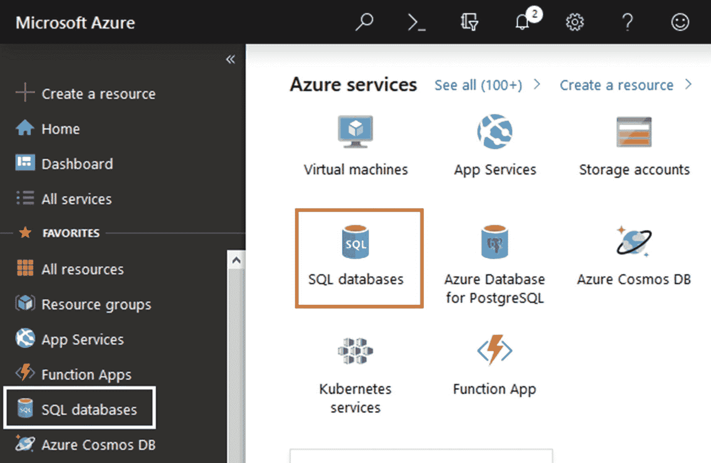

图 9-1

Azure 门户中的 SQL 数据库选项

如您所见，在主页的顶部和左侧都有一个 SQL 数据库选项。点击 SQL databases 选项会将您带到如图 [9-2](#Fig2) 所示的另一个页面。

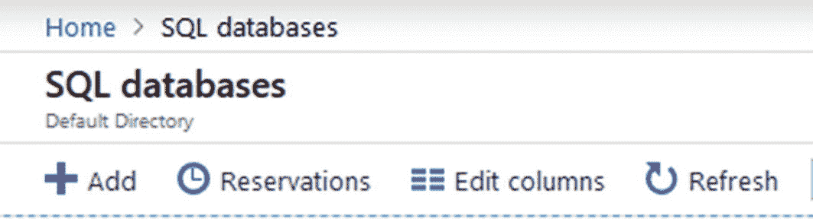

图 9-2

创建新的 SQL 数据库

在此屏幕上，单击顶部的添加按钮。这样做将打开另一个屏幕，您需要在其中填写一个表单，其中包含创建新 SQL 数据库的各种设置(图 [9-3](#Fig3) )。

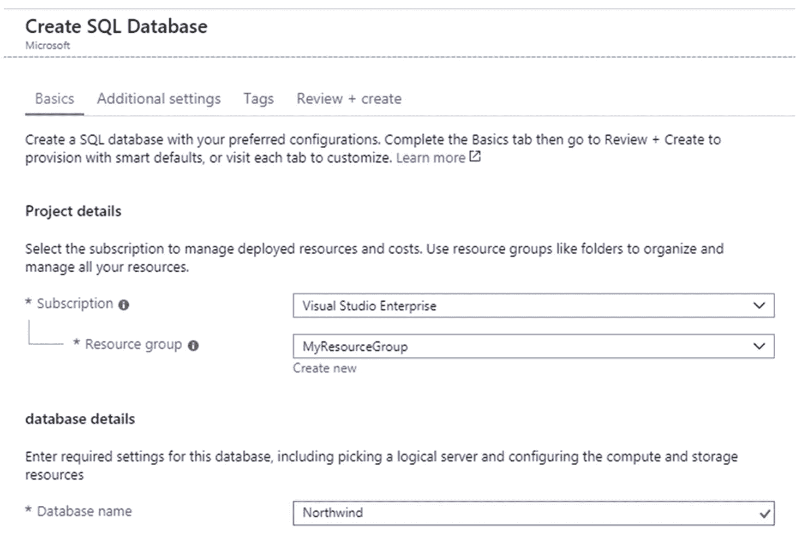

图 9-3

为新的 SQL 数据库指定设置

根据您的 Azure 帐户设置，您至少需要指定以下设置:

*   签署

*   资源组

*   数据库名称(本例中为 Northwind)

*   计算机网络服务器

请确保根据您的 Azure 帐户设置指定这些详细信息。指定这些详细信息后，单击页面底部的 Review + create 按钮，完成新数据库的创建过程。成功创建数据库后，您将看到一个成功通知。

现在，您可以在 SQL databases 部分的主页上看到新创建的数据库。您可以通过点击概览选项来查看基本的数据库设置(图 [9-4](#Fig4) )。

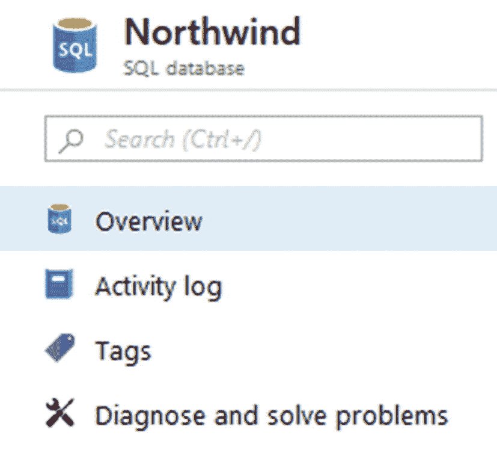

图 9-4

数据库概览页面

这一页你不需要讲太多细节。对您来说重要的是右边的连接字符串部分。单击显示数据库连接字符串链接会将您带到可以看到 ADO.NET 连接字符串的另一个页面。将此连接字符串保存在方便的位置，因为您将在连接数据库时使用它。

在您完成本节之前的最后一步，您需要配置服务器防火墙以允许您的客户端 IP 地址。为此，请转到 Northwind 数据库概述页面，并单击顶部的设置服务器防火墙选项(图 [9-5](#Fig5) )。

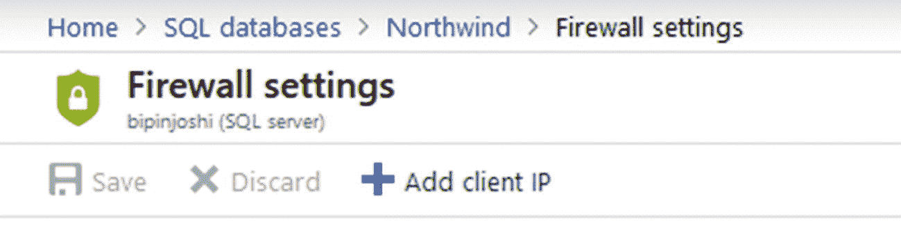

图 9-5

设置服务器防火墙

单击添加客户端 IP 按钮，并将客户端的 IP 添加到允许的 IP 地址列表中。

现在可以从 SQL Server Management Studio 访问您的数据库了。

### 使用 SQL Server Management Studio 连接到 Azure SQL 数据库

现在，让我们连接您刚刚在 Azure 中创建的 Northwind 数据库。打开 SQL Server Management Studio，并根据之前获得的连接字符串指定连接详细信息，如服务器、用户名和密码。图 [9-6](#Fig6) 显示连接成功后空的 Northwind 数据库。

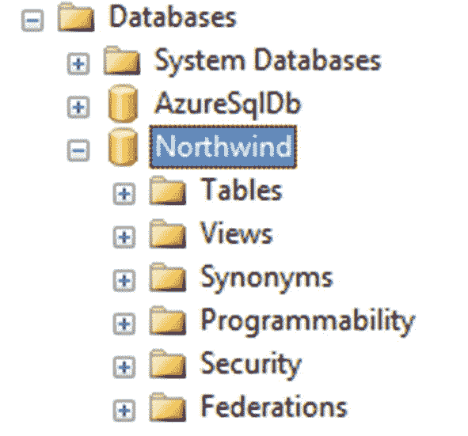

图 9-6

SQL Server Management Studio 中的 Northwind 数据库

现在可以在 Northwind 数据库中创建 Employees 和 Countries 表(可以使用 CREATE TABLE 语句来完成)。您还可以在雇员和国家表中添加一些示例数据。

### 注意

您还可以从 Northwind 数据库的 T-SQL 脚本(您可以在第 [1](01.html) 章从 GitHub 获得该脚本)中获得帮助，将示例数据添加到 Employees 表中。

图 9-7 显示了在 Azure 托管的 Northwind 数据库上执行的一个查询，该查询返回雇员记录。

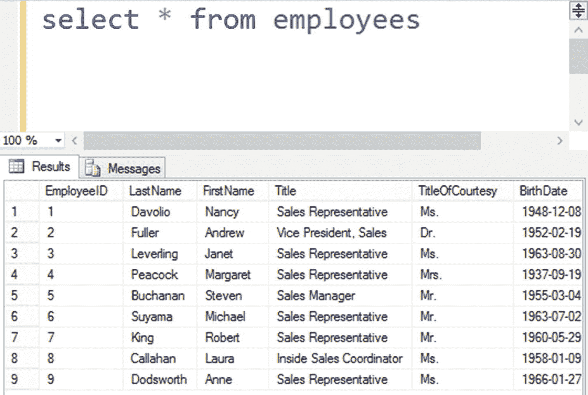

图 9-7

从 Azure SQL 数据库获取员工记录

## 使用 Azure SQL 数据库的员工经理

在接下来的部分中，您将构建雇员管理器应用(Employee Manager。AzureSql)，它在 Azure 中托管的 Northwind 数据库上执行 CRUD 操作。该应用将遵循与您之前开发的 MVC 版本相同的过程。但是，也有一些不同之处:

*   该应用使用 Northwind Azure SQL 数据库，而不是 Northwind 的本地安装。

*   该应用使用 Microsoft。Data.SqlClient 对象模型来执行 CRUD 操作，而不是使用 EF 核心。

*   数据访问代码包装在存储库中，EmployeeManagerController 调用存储库来完成工作。

*   ASP.NET Core Identity 表在 Azure SQL 数据库中创建。

既然您现在已经熟悉了这个应用，我将只关注 CRUD 操作。您可以从该书的源代码下载中获得该示例的完整代码。

### 注意

这个例子使用微软。Data.SqlClient 类来执行 CRUD 操作。尽管实体框架核心是在 ASP.NET Core 中访问数据的首选方式，但有时您可能希望对整体数据访问逻辑有更多的控制。例如，您可能希望将 ADO.NET 代码快速迁移到较新的框架中，或者您可能希望直接使用查询和存储过程，而不是通过对象关系映射器。

### 员工和国家模型类

为了使用这个例子，您需要像以前一样的`Employee`和`Country`模型类。然而，因为在这个例子中没有使用 EF Core，所以这些模型类不是实体类。它们是具有验证属性的 POCOs。回想一下，在为 ASP.NET Core Web API 构建客户端应用时，您开发了这样的模型类。您可以获取相同的类并将它们放在 Models 文件夹中，或者您可以再次创建它们。如果您愿意，也可以从本书的代码下载中获得它们。因为这些类对您来说已经很熟悉了，所以这里不再讨论它们。

### 创建员工信息库和国家信息库

CRUD 操作被包装在两个储存库中，即`EmployeeRepository`和`CountryRepository`。这些存储库基于你在第 [5 章](05.html)中创建的相同接口(`IEmployeeRepository`和`ICountryRepository`)，并且位于存储库文件夹中。所以我不打算在这里详细讨论接口。为了便于您快速参考，这些接口如清单 [9-1](#PC1) 所示。

```cs
public interface IEmployeeRepository
{
    List<Employee> SelectAll();
    Employee SelectByID(int id);
    void Insert(Employee emp);
    void Update(Employee emp);
    void Delete(int id);
}

public interface ICountryRepository
{
    List<Country> SelectAll();
}

Listing 9-1IEmployeeRepository and ICountryRepository interfaces

```

现在在 Repositories 文件夹中添加`EmployeeRepository`类。清单 [9-2](#PC2) 展示了这个类的框架。

```cs
public class EmployeeRepository : IEmployeeRepository
{
    private string connectionString;

    public EmployeeRepository(IConfiguration config)
    {
        this.connectionString = config.GetConnectionString("AppDb");
    }
...
...
}

Listing 9-2Skeleton of the EmployeeRepository class

```

如您所见，`EmployeeRepository`构造函数接受了一个`IConfiguration`对象。这是必需的，因为在执行 CRUD 操作时需要数据库连接字符串。连接字符串存储在成员变量中供以后使用。

#### SelectAll()方法

`EmployeeRepository`的`SelectAll()`方法将所有的`Employee`对象返回给调用者，如清单 [9-3](#PC3) 所示。

```cs
public List<Employee> SelectAll()
{
    using (SqlConnection cnn = new SqlConnection(connectionString))
    {
        SqlCommand cmd = new SqlCommand();
        cmd.Connection = cnn;
        cmd.CommandType = CommandType.Text;
        cmd.CommandText = "SELECT EmployeeID, FirstName, LastName, Title, BirthDate, HireDate, Country, Notes FROM Employees ORDER BY EmployeeID ASC";

        cnn.Open();
        SqlDataReader reader = cmd.ExecuteReader();
        List<Employee> employees = new List<Employee>();
        while (reader.Read())
        {
            Employee item = new Employee();
            item.EmployeeID = reader.GetInt32(0);
            item.FirstName = reader.GetString(1);
            item.LastName = reader.GetString(2);
            item.Title = reader.GetString(3);
            item.BirthDate = reader.GetDateTime(4);
            item.HireDate = reader.GetDateTime(5);
            item.Country = reader.GetString(6);
            if (!reader.IsDBNull(7))
            {
               item.Notes = reader.GetString(7);
            }
            employees.Add(item);
        }
        reader.Close();
        cnn.Close();
        return employees;
    }
}

Listing 9-3SelectAll() returns all the employees

```

代码从创建一个新的`SqlConnection`对象开始。`SqlConnection`类代表一个数据库连接，在`Microsoft.Data.SqlClient`名称空间中可用。要从这个名称空间访问类，您需要为您的项目安装 NuGet 包—`Microsoft.Data.SqlClient`(如果您安装了`Microsoft.EntityFrameworkCore.SqlServer`，那么这个程序集也会被安装)。注意，整个代码都放在 using 块中，这样一旦方法完成，就会释放`SqlConnection`对象。

在 using 块中，代码创建了一个新的`SqlCommand`对象。`SqlCommand`对象表示您想要执行的数据库命令。然后配置了`SqlCommand`的三个属性。执行数据库命令需要打开数据库连接。`Connection`属性指向在执行数据库命令时要使用的`SqlConnection`对象。

`CommandType`属性用于指定要执行的数据库命令的类型，如 SQL 语句(文本)或存储过程(stored procedure)。

`CommandText`属性指定要执行的数据库命令。在这种情况下，代码执行 SELECT 语句，从 Employees 表中提取所需的数据。

为了执行 SELECT 语句，使用`SqlConnection`的`Open()`方法建立数据库连接。使用`SqlCommand`对象的`ExecuteReader()`方法执行查询。`ExecuteReader()`方法执行查询并以`SqlDataReader`对象的形式返回数据。

`SqlDataReader`对象是只读和只进游标，代码使用`Read()`方法遍历它。`Read()`方法将当前记录指针前进到下一个记录，并允许您读取该记录。`Read()`如果已到达记录的末尾，则返回 false。

在 while 循环中，代码使用诸如`GetInt32()`、`GetString()`和`GetDateTime()`等方法读取各种列值。这些方法接受从中读取值的列号(根据 SELECT 查询)。使用哪种可用的 GetXXXXXXX()方法取决于列的数据类型。例如，`EmployeeID`是一个整数值，因此代码使用了`GetInt32()`方法。在相同的行上，`HireDate`是一个`DateTime`值，因此使用了`GetDateTime()`。从这些方法获得的列值被填充到一个`Employee`对象中，而`Employee`对象被添加到一个列表中。`IsDBNull()`方法接受列索引，如果指定的列包含数据库空值，则返回 true。

最后，使用`Close()`方法关闭数据读取器和数据库连接，并将雇员对象列表返回给调用者。

#### SelectByID()方法

`SelectByID()`方法类似于`SelectAll()`,但是只向调用者返回一个特定的`Employee`。清单 9-4 展示了这种方法。

```cs
public Employee SelectByID(int id)
{
    using (SqlConnection cnn = new SqlConnection(connectionString))
    {
        SqlCommand cmd = new SqlCommand();
        cmd.Connection = cnn;
        cmd.CommandType = CommandType.Text;
        cmd.CommandText = "SELECT EmployeeID, FirstName, LastName, Title, BirthDate, HireDate, Country, Notes FROM Employees WHERE EmployeeID=@EmployeeID";

        SqlParameter p = new SqlParameter("@EmployeeID", id);
        cmd.Parameters.Add(p);

        cnn.Open();
        SqlDataReader reader = cmd.ExecuteReader();
        List<Employee> employees = new List<Employee>();
        while (reader.Read())
        {
            Employee item = new Employee();
            item.EmployeeID = reader.GetInt32(0);
            item.FirstName = reader.GetString(1);
            item.LastName = reader.GetString(2);
            item.Title = reader.GetString(3);
            item.BirthDate = reader.GetDateTime(4);
            item.HireDate = reader.GetDateTime(5);
            item.Country = reader.GetString(6);
            if (!reader.IsDBNull(7))
            {
               item.Notes = reader.GetString(7);
            }
            employees.Add(item);
        }
        reader.Close();
        cnn.Close();
        return employees.SingleOrDefault();
    }
}

Listing 9-4SelectByID() method returns a specific employee

```

`SelectByID()`方法接受一个`EmployeeID`作为它的参数。这一次，SELECT 查询包含一个 WHERE 子句，只获取其`EmployeeID`与提供的值匹配的雇员。注意，`EmployeeID`由`@EmployeeID`参数表示。

参数`@EmployeeID`的值被包装在`SqlParameter`的对象中，然后添加到`SqlCommand`对象的`Parameters`集合中。

#### Insert()方法

`Insert()`方法向雇员表中插入一个新雇员，如清单 [9-5](#PC5) 所示。

```cs
public void Insert(Employee emp)
{
    using (SqlConnection cnn = new SqlConnection(connectionString))
    {
        SqlCommand cmd = new SqlCommand();
        cmd.Connection = cnn;
        cmd.CommandType = CommandType.Text;
        cmd.CommandText = "INSERT INTO Employees(FirstName, LastName, Title, BirthDate, HireDate, Country, Notes)  VALUES(@FirstName, @LastName, @Title, @BirthDate, @HireDate, @Country, @Notes)";

        SqlParameter[] p = new SqlParameter[7];
        p[0] = new SqlParameter("@FirstName", emp.FirstName);
        p[1] = new SqlParameter("@LastName", emp.LastName);
        p[2] = new SqlParameter("@Title", emp.Title);
        p[3] = new SqlParameter("@BirthDate", emp.BirthDate);
        p[4] = new SqlParameter("@HireDate", emp.HireDate);
        p[5] = new SqlParameter("@Country", emp.Country);
        p[6] = new SqlParameter("@Notes", emp.Notes ?? SqlString.Null);

        cmd.Parameters.AddRange(p);

    cnn.Open();
    int i = cmd.ExecuteNonQuery();
    cnn.Close();
  }
}

Listing 9-5Insert() method inserts a new employee

```

`Insert()`方法接受一个表示要添加到数据库中的新雇员的`Employee`对象。这次，`CommandText`指定了一个包含几个参数的插入查询，比如`@FirstName`和`@Notes`。为了提供这些参数值，声明了一个数组`SqlParameter`(七个数组元素)，所有参数值都包装在`SqlParameter`对象中。

使用`AddRange()`方法将`SqlParameter`数组添加到`SqlCommand`的`Parameters`集合中。

为了执行 INSERT 语句，代码使用了`SqlCommand`对象的`ExecuteNonQuery()`方法。`ExecuteNonQuery()`方法执行一个动作查询，并返回受查询影响的记录数。在这种情况下，由于插入了一条记录，它将返回 1(如果成功)。虽然这里没有使用`i`的值，但是如果需要的话，您可以使用它进行进一步的处理。

#### Update()方法

`Update()`方法与前面讨论的`Insert()`方法非常相似。但是它执行一个更新语句，如清单 [9-6](#PC6) 所示。

```cs
public void Update(Employee emp)
{
    using (SqlConnection cnn = new SqlConnection(connectionString))
    {
        SqlCommand cmd = new SqlCommand();
        cmd.Connection = cnn;
        cmd.CommandType = CommandType.Text;
        cmd.CommandText = "UPDATE Employees SET FirstName=@FirstName, LastName=@LastName, Title=@Title, BirthDate=@BirthDate, HireDate=@HireDate, Country=@Country, Notes=@Notes WHERE EmployeeID=@EmployeeID";

        SqlParameter[] p = new SqlParameter[8];
        p[0] = new SqlParameter("@FirstName", emp.FirstName);
        p[1] = new SqlParameter("@LastName", emp.LastName);
        p[2] = new SqlParameter("@Title", emp.Title);
        p[3] = new SqlParameter("@BirthDate", emp.BirthDate);
        p[4] = new SqlParameter("@HireDate", emp.HireDate);
        p[5] = new SqlParameter("@Country", emp.Country);
        p[6] = new SqlParameter("@Notes", emp.Notes ?? SqlString.Null);
        p[7] = new SqlParameter("@EmployeeID", emp.EmployeeID);

        cmd.Parameters.AddRange(p);

        cnn.Open();
        int i = cmd.ExecuteNonQuery();
        cnn.Close();
    }
}

Listing 9-6Update() method updates an employee

```

`Update()`方法接受数据库中需要更新的现有`Employee`。在内部，使用`ExecuteNonQuery()`方法形成并执行更新语句。

#### Delete()方法

`Delete()`方法从数据库中删除一个现有的雇员，如清单 [9-7](#PC7) 所示。

```cs
public void Delete(int id)
{
    using (SqlConnection cnn = new SqlConnection(connectionString))
    {
        SqlCommand cmd = new SqlCommand();
        cmd.Connection = cnn;
        cmd.CommandType = CommandType.Text;
        cmd.CommandText = "DELETE FROM Employees WHERE EmployeeID=@EmployeeID";

        SqlParameter p = new SqlParameter("@EmployeeID", id);
        cmd.Parameters.Add(p);

        cnn.Open();
        int i = cmd.ExecuteNonQuery();
        cnn.Close();
    }
}

Listing 9-7Delete() method deletes an employee

```

`Delete()`方法接受现有的`EmployeeID`并从 Employees 表中删除该记录。这一次，它使用`ExecuteNonQuery()`方法执行删除语句。

### 注意

CountryRepository 包含一个方法——SelectAll()—该方法将所有国家返回给调用者，您应该对此很熟悉。为了简洁起见，这里不讨论 CountryRepository。你可以从这本书的代码下载中找到它。

一旦存储库准备好了，您需要在`ConfigureServices()`方法中向 DI 容器注册它们。清单 [9-8](#PC8) 展示了这是如何做到的。

```cs
public void ConfigureServices(IServiceCollection services)
{
    ...
    services.AddScoped<IEmployeeRepository, EmployeeRepository>();
    services.AddScoped<ICountryRepository, CountryRepository>();
    ...
}

Listing 9-8Registering repositories using AddScoped()

```

您应该对这段代码很熟悉，因为您之前使用过`AddScoped()`方法。

## EmployeeManagerController 类

现在`EmployeeRepository`和`CountryRepository`已经准备好了，你可以在`EmployeeManagerController`中使用它们了。因此，在 Controllers 文件夹中添加`EmployeeManagerController`，并将两个存储库注入到它的构造函数中(清单 [9-9](#PC9) )。

```cs
public class EmployeeManagerController : Controller
{
    private IEmployeeRepository employeeRepository;
    private ICountryRepository countryRepository;

    public EmployeeManagerController(IEmployeeRepository empRepository, ICountryRepository ctryRepository)
    {
        this.employeeRepository = empRepository;
        this.countryRepository = ctryRepository;
    }
    ...
}

Listing 9-9Injecting repositories into the EmployeeManagerController

```

如您所见，`EmployeeRepository`和`CountryRepository`实例被注入到构造函数中。`employeeRepository`和`countryRepository`成员被`EmployeeManagerController`的其他动作用来完成他们的工作。作为一个例子，下面讨论`EmployeeManagerController`的`Update()`动作。

处理初始 GET 请求的`Update()`动作如清单 [9-10](#PC10) 所示。

```cs
public IActionResult Update(int id)
{
    FillCountries();
    Employee model = employeeRepository.SelectByID(id);
    return View(model);
}

Listing 9-10Update() action that handles a GET request

```

`Update()`动作通过向其传递一个`EmployeeID`来调用`EmployeeRepository`的`SelectByID()`方法。返回的`Employee`对象被传递给更新视图。

单击“更新现有员工”页面的“保存”按钮后，表单将被提交给`Update()`的发布版本。这显示在清单 [9-11](#PC11) 中。

```cs
[HttpPost]
public IActionResult Update(Employee model)
{
    FillCountries();

    if(ModelState.IsValid)
    {
        employeeRepository.Update(model);
        ViewBag.Message = "Employee updated successfully";
    }
    return View(model);
}

Listing 9-11Saving the modifications using Update()

```

`Update()`通过向其传递一个`Employee`对象来调用`EmployeeRepository`的`Update()`方法。然后向用户显示成功消息。

您可以完成`EmployeeManagerController`的其他动作，也可以自己添加视图或从书的源代码中获取视图。

### 注意

添加对 ASP.NET Core Identity 的支持的过程与之前完全相同，因此这里不再讨论。但是，请记住，这次 Northwind 数据库托管在 Azure 中。所以像 AspNetUsers 和 AspNetRoles 这样的表也是在 Azure SQL 数据库中创建的。该书的源代码包含完整的雇员管理器应用。

### 数据库连接字符串

在本章的前面，您创建了一个新的 Azure SQL 数据库。那一次，我让您从 Azure 门户获取 done 数据库连接字符串(如果您之前没有这样做，现在就获取)。现在是使用连接字符串的时候了。打开 appsettings.json 文件，用连接字符串替换`AppDb`键。以下示例连接字符串显示了上述修改后`AppDb`的外观:

```cs
"ConnectionStrings": {
  "AppDb": "Server=your_server_address_here;
            Initial Catalog=Northwind;
            Persist Security Info=False;
            User ID=your_user_id_here;
            Password=your_password_here;
            MultipleActiveResultSets=False;
            Encrypt=True;
            TrustServerCertificate=False;
            Connection Timeout=30;"
}

```

只需用您的值替换用户 ID、密码和其他详细信息的占位符；您已经准备好运行雇员管理器应用了。

## NoSQL 数据库概述

到目前为止，在本书中，您使用了 Microsoft SQL Server 数据库来存储数据。SQL server 是一个关系数据库管理系统(RDBMS)。任何 RDBMS(如 SQL Server)都将数据存储在表中。表格有行，行有列。在向表中存储任何数据之前，需要预先决定表的结构(通常称为模式)。如果表模式中有任何更改，都会影响存储在该表中的所有行。

为了查询存储在 RDBMS 中的数据并对其进行操作，通常使用结构化查询语言或 SQL。在 RDBMS 上执行 CRUD 操作时，SELECT、INSERT、UPDATE 和 DELETE 等 SQL 语句非常常用。

在现代计算中，新一代数据库越来越普遍和流行。他们被称为 NoSQL 数据库。NoSQL 数据库不将数据存储在严格的基于模式的表、行和列中。相反，它们以非关系方式存储数据，比如文档和键值对。由于存储模式的这种转变，NoSQL 数据库不再使用 SQL 来查询和操作数据。他们通常使用面向对象的 API 来访问数据存储。

虽然对 NoSQL 数据库的详细讨论超出了本书的范围，但是以下特性还是值得注意的:

*   NoSQL 数据库以不同的方式存储数据。一些常见的方法包括文档存储、键值对和图形存储。

*   将数据存储为文档的 NoSQL 数据库通常被称为文档数据库。文档数据库的一些例子有 MongoDB、CouchDB、RavenDB 和 Cosmos DB。

*   文档数据库通常以 JSON 格式存储文档。

*   NoSQL 数据库使用动态模式。这意味着您不需要预先定义存储模式。结构不同的数据可以存储在一起。例如，可以将两个不同结构的 JSON 文档存储在一起。

*   为了执行 CRUD(和其他数据访问)操作，NoSQL 数据库提供了一个特定于数据库的面向对象的 API。例如，MongoDB 和 Cosmos DB 都提供了自己的数据访问 API。

*   NoSQL 数据库很容易横向扩展。例如，要增加数据库的容量，只需添加更多的服务器。然后，数据库数据可以跨更多的服务器。

现在您对什么是 NoSQL 数据库有了一些了解，让我们快速地了解一下您将在本章中使用的文档数据库:Cosmos DB 和 MongoDB。

### 宇宙数据库(Cosmos DB)

Cosmos DB 是一个基于 Azure 的数据库服务。这意味着您的 Cosmos DB 数据库托管在 Azure 中，您可以获得云环境对您的数据库的所有好处。Cosmos DB 的一个有趣特性是它可以使用一个后端支持多个数据模型。例如，Cosmos DB 可以用于存储文档、键值对和图形模型。

Cosmos DB 通常被归类为 NoSQL 数据库，因为您不需要定义任何模式来存储数据。但是，它附带了一种类似于 SQL 的面向 JSON 的查询语言。此外，Cosmos DB 为各种流行的 NoSQL API 提供了本机支持，包括 MongoDB、Cassandra 和 Gremlin。

有两种方法可以访问驻留在 Cosmos DB 数据库中的数据。可以使用通过客户端库公开的 Cosmos DB SQL API—`Microsoft.Azure.DocumentDB.Core`。这个客户端库作为一个 NuGet 包提供，并使 ASP.NET Core 应用能够通过 SQL API(也称为 DocumentDB)连接到 Azure Cosmos DB。

微软还为 Cosmos DB 开发了一个实体框架核心提供者，并通过`Microsoft.EntityFrameworkCore.Cosmos` NuGet 包提供。如果使用这个提供者，开发过程就变得和 EF Core 很像了。这意味着您创建一个定制的`DbContext`和映射到您的 JSON 文档的实体类。可以使用`Add()`、`Remove()`、`SaveChanges()`等方法进行 CRUD 操作。

### 注意

在 Cosmos DB 之前，微软提供 DocumentDB 作为 NoSQL 文档数据库。Cosmos DB 发布后，DocumentDB 成为了 Cosmos DB 的一部分。DocumentDB 在描述数据时使用集合和文档等术语。另一方面，Cosmos DB 出于同样的目的使用了术语容器和项目。在使用各自的数据访问技术时，我将使用相同的术语。

### MongoDB

MongoDB 是一个流行的 NoSQL 数据库引擎，它将数据存储为文档。文档以类似 JSON 的格式存储。MongoDB 被设计成一个分布式数据库，目标是高可用性和水平伸缩性。您可以下载并在您的机器上安装 MongoDB 服务器，以便使用本章中讨论的示例。MongoDB 为。NET，它允许您执行数据访问和操作。该驱动程序以 NuGet 包的形式提供–`MongoDB.Driver`。

### 注意

关于 Cosmos DB 和 MongoDB 的详细讨论超出了本书的范围。你可以分别在 [`https://docs.microsoft.com/en-us/azure/cosmos-db`](https://docs.microsoft.com/en-us/azure/cosmos-db) 和 [`www.mongodb.com`](http://www.mongodb.com) 阅读他们的官方文档。本章的剩余部分假设您可以访问 Azure Cosmos DB，并且已经在您的计算机上安装了 MongoDB。

## 创建 Cosmos DB 帐户

在本节中，您将创建一个新的 Cosmos DB 帐户，该帐户可用于创建 Employee Manager 应用所需的 Northwind 数据库。

为了创建一个 Cosmos DB 帐户，您需要像以前一样登录 Azure 门户。然而，这一次，您选择了 Azure Cosmos DB 选项，如图 [9-8](#Fig8) 所示。

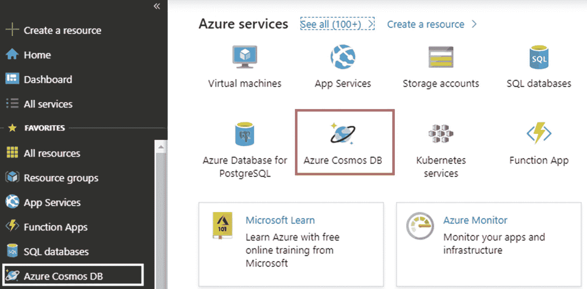

图 9-8

创建和管理 Cosmos DB 帐户的选项

然后点击添加按钮创建一个新的 Azure Cosmos DB 帐户。账户创建屏幕如图 [9-9](#Fig9) 所示。

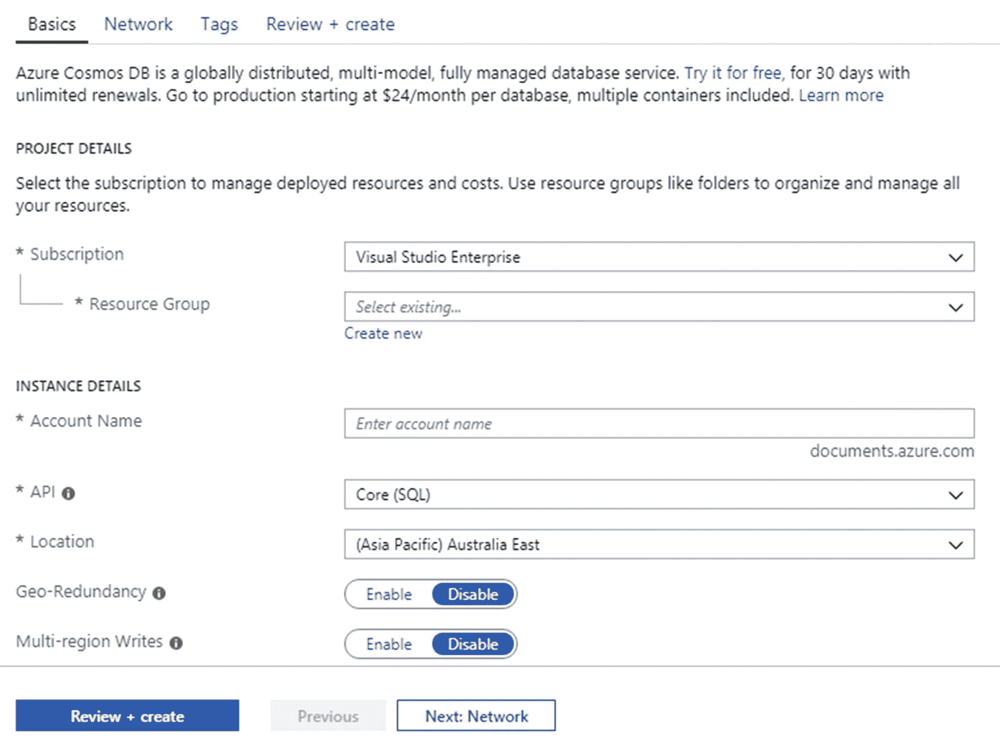

图 9-9

创建新的 Cosmos DB 帐户

在此屏幕上，选择(或创建)一个资源组，并输入您选择的帐户名。您可以将其他设置保留为默认值。单击“查看+创建”按钮，完成帐户创建过程。

一旦 Cosmos DB 帐户准备就绪，导航到该帐户并单击 Keys 选项以显示如图 [9-10](#Fig10) 所示的密钥和连接字符串。

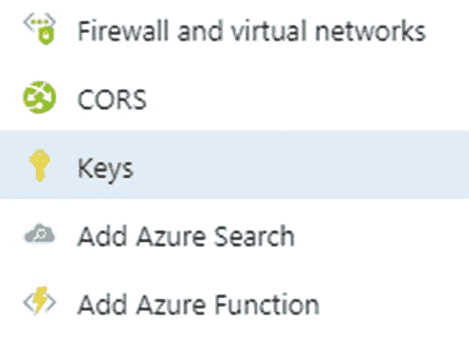

图 9-10

获取 Cosmos DB 帐户密钥和连接字符串

将您的键和连接字符串放在手边，因为在开发员工管理器应用时会用到它们。

## 使用 Cosmos DB 的员工经理

在接下来的小节中，您将使用 Cosmos DB 开发 Employee Manager。尽管总体开发流程保持不变，但还是有一些不同之处:

*   雇员数据现在驻留在名为 Northwind 的 Cosmos DB 数据库中。

*   该应用使用没有 ASP.NET Core Identity 的自定义 cookie 认证。用户名、密码和角色等用户详细信息也存储在 Cosmos DB 数据库中。

*   Cosmos DB 数据库包含集合和文档。为了便于类比，您可以将文档视为记录，将集合视为一组文档。数据库、集合和文档是在 Employee Manager 应用中以编程方式创建的。

*   Cosmos DB 将数据存储在 JSON 文档中。每个文档都有一个唯一的字符串 ID。因此，Employee 文档将有一个名为 DocumentID 的额外属性(除了 EmployeeID 整数属性之外),它存储一个字符串 GUID。

*   由于前面的更改，插入和更新页面将在可编辑的文本框中显示 EmployeeID。您本来可以完全避免 EmployeeID，因为 DocumentID 充当主键的角色，但是为了与 Employee Manager 的其他版本保持一致，您仍然可以将它作为 JSON 文档的一部分。

*   该应用使用 Microsoft。执行 CRUD 选项等的 Azure.DocumentDB.Core 客户端库。

既然您已经意识到了员工管理器开发过程中的差异，那么让我们开始创建一个名为 Employee Manager 的新的 ASP.NET Core web 应用。基于空项目模板的 CosmosDB。由于到目前为止，您已经非常熟悉整体开发，因此在接下来的部分中只讨论前面文本中概述的差异。

### Cosmos DB 连接详细信息

员工经理需要 Cosmos DB 帐户连接详细信息来执行 CRUD 操作。所以将它们存储在 appsettings.json 文件中。清单 [9-12](#PC13) 显示了 appsettings.json 中一个名为`CosmosDBSettings`的配置部分

```cs
"CosmosDBSettings": {
  "Uri": "your_uri_here",
  "PrimaryKey": "your_primary_key_here",
  "DatabaseName": "Northwind",
  "EmployeeCollectionName": "Employees",
  "CountryCollectionName": "Countries",
  "UserCollectionName": "Users"
}

Listing 9-12Cosmos DB account connection details

```

`Uri`键指定了 Cosmos DB 帐户端点 URI。你可以从 Azure 门户获得这个 URI(阅读前面的讨论)。`PrimaryKey`键指定从 Azure 门户获取的主键。

`DatabaseName`键指定雇员管理器应用使用的数据库的名称。请注意，还没有在 Cosmos DB 帐户中创建 Northwind 数据库。您可以在后面的章节中以编程方式实现。为了避免数据库名称的硬编码，您将它保存在配置文件中。为了便于测试，万一你想给它一个不同的名字，你可以在这里修改它。

Cosmos DB 在集合中存储数据。集合存储 JSON 文档。这里，您使用`EmployeeCollectionName`、`CountryCollectionName`和`UserCollectionName`键指定三个集合名称。请注意，由于这个示例使用自定义 cookie 认证，而不是 ASP.NET Core 认证，因此您需要在某个地方存储用户详细信息。该示例更喜欢将它们存储在`Users`集合中。为了简单起见，用户名、密码和角色等用户细节被存储为普通的 JSON 文档。然而，在更现实的情况下，您应该考虑使用强加密技术来保护用户数据。您甚至可能更喜欢将用户详细信息存储在其他数据存储中。数据加密和安全技术超出了本书的范围。

### 微软。核心客户端库

正如本章前面提到的，Cosmos DB 是一个多模型数据库。它允许您使用多个 API 存储和检索数据。Cosmos DB 的数据访问模型之一是 SQL 的一种方言，称为 SQL API。`Microsoft.Azure.DocumentDB.Core`客户端库是围绕 SQL API 构建的，这就是我们在本例中要使用的。`Microsoft.Azure.DocumentDB.Core`库允许您的应用将数据作为 C# 对象(比如雇员或国家)来处理，它处理所有必要的后台处理，包括将数据序列化为 JSON 格式和将数据反序列化为 JSON 格式。

`Microsoft.Azure.DocumentDB.Core`客户端库以 NuGet 包的形式提供，您需要将它添加到您的项目中。

### 员工和国家模型类

`Employee`模型类是一个 POCO，其形式如清单 [9-13](#PC14) 所示。

```cs
public class Employee
{
    [JsonProperty(PropertyName = "id")]
    public Guid DocumentID { get; set; }

    [Required]
    [Display(Name ="Employee ID")]
    [JsonProperty(PropertyName ="employeeID")]
    public int EmployeeID { get; set; }

    [Required]
    [StringLength(10)]
    [Display(Name = "First Name")]
    [JsonProperty(PropertyName = "firstName")]
    public string FirstName { get; set; }

    [Required]
    [StringLength(20)]
    [Display(Name = "Last Name")]
    [JsonProperty(PropertyName = "lastName")]
    public string LastName { get; set; }

    [Required]
    [StringLength(30)]
    [Display(Name = "Title")]
    [JsonProperty(PropertyName = "title")]
    public string Title { get; set; }

    [Required]
    [Display(Name = "Birth Date")]
    [JsonProperty(PropertyName = "birthDate")]
    public DateTime BirthDate { get; set; }

    [Required]
    [Display(Name = "Hire Date")]
    [JsonProperty(PropertyName = "hireDate")]
    public DateTime HireDate { get; set; }

    [Required]
    [StringLength(15)]
    [Display(Name = "Country")]
    [JsonProperty(PropertyName = "country")]
    public string Country { get; set; }

    [StringLength(500)]
    [Display(Name = "Notes")]
    [JsonProperty(PropertyName = "notes")]
    public string Notes { get; set; }
}

Listing 9-13Employee class is serialized as JSON document

```

如您所见，`Employee`类拥有所有的属性，如`EmployeeID`、`FirstName`、`LastName`、`BirthDate`、`HireDate`、`Country`和`Notes`。此外，它还有一个`DocumentID`属性，以`Guid`的形式表示 JSON 文档的惟一标识符。

请注意用粗体字母标记的代码。`Employee`属性由`[JsonProperty]`属性修饰。`[JsonProperty]`属性来自于`Newtonsoft.Json`名称空间，表示底层属性将在 JSON 序列化过程中被包含。`[JsonProperty]`的`PropertyName`属性指定了底层属性的 JSON 属性名。例如，`EmployeeID`属性将被表示为`employeeID`。注意，`DocumentID`属性的`PropertyName`是`id`，因为它将作为 JSON 文档的惟一标识符。

类似地创建了`Country`类，如清单 [9-14](#PC15) 所示。

```cs
public class Country
{
    [JsonProperty(PropertyName = "id")]
    public Guid  DocumentID { get; set; }

    [JsonProperty(PropertyName = "countryID")]
    public int CountryID { get; set; }

    [JsonProperty(PropertyName = "name")]
    public string Name { get; set; }
}

Listing 9-14Country class with [JsonProperty] attributes

```

### 创建 EmployeeManagerController

既然`Employee`和`Country`模型类已经准备好了，让我们继续创建`EmployeeManagerController`。和以前一样，`EmployeeManagerController`将有执行 CRUD 操作的动作。

### 注意

在下面的示例中，您在控制器本身中编写数据访问代码。这样做是为了简单起见，并保持专注于数据访问逻辑。然而，一旦您熟悉了 NoSQL 数据库，您就应该考虑将数据访问代码转移到存储库中。

`EmployeeManagerController`类声明了代码其他部分需要的一组变量。这些变量如清单 [9-15](#PC16) 所示。

```cs
public class EmployeeManagerController : Controller
{

    private DocumentClient client;
    private Uri employeeCollectionUri;
    private Uri countryCollectionUri;
    private string databaseName;
    private string employeeCollectionName;
    private string countryCollectionName;
    ...
}

Listing 9-15Variables that store Cosmos DB account details

```

`DocumentClient`类来自于`Microsoft.Azure.Documents.Client`名称空间，代表一个可以用来连接 Cosmos DB 帐户和执行数据访问操作的客户机。

`employeeCollectionUrl`和`countryCollectionUri`对象属于`Uri`类型，保存着`Employees`和`Countries`集合的地址(记住，Cosmos DB 集合由 JSON 文档组成)。

`databaseName`、`employeeCollectionName`和`countryCollectionName`变量拥有各自的名称；它们的值来自 appsettings.json 文件(我们之前存储了这些值)。

`EmployeeManagerController`的构造器执行一项重要的任务——它创建数据库和集合(如果它们还不存在的话),如清单 [9-16](#PC17) 所示。

```cs
public EmployeeManagerController(IConfiguration config)
{
    var uri = new Uri(config.GetValue<string>("CosmosDBSettings:Server"));
    var primaryKey = config.GetValue<string>("CosmosDBSettings:PrimaryKey");
    databaseName = config.GetValue<string>("CosmosDBSettings:DatabaseName");
    employeeCollectionName = config.GetValue<string>("CosmosDBSettings:EmployeeCollectionName");
    countryCollectionName = config.GetValue<string>("CosmosDBSettings:CountryCollectionName");

    client = new DocumentClient(uri,primaryKey);

    this.client.CreateDatabaseIfNotExistsAsync(new Database { Id = databaseName }).Wait();

    this.client.CreateDocumentCollectionIfNotExistsAsync(UriFactory.CreateDatabaseUri(databaseName), new DocumentCollection { Id = employeeCollectionName }).Wait();

    this.client.CreateDocumentCollectionIfNotExistsAsync(UriFactory.CreateDatabaseUri(databaseName), new DocumentCollection { Id = countryCollectionName }).Wait();

    this.employeeCollectionUri = UriFactory
        .CreateDocumentCollectionUri(
            databaseName, employeeCollectionName);

    this.countryCollectionUri = UriFactory
        .CreateDocumentCollectionUri(
            databaseName, countryCollectionName);

}

Listing 9-16Creating the Cosmos DB database and collections

```

代码首先检索 Cosmos DB 帐户的详细信息，比如存储在 appsettings.json 中的`Uri`和主键。`databaseName`、`employeeCollectionName`和`countryCollectionName`的值也从配置文件中检索。(为了简单起见，注入控制器的 IConfiguration 用于访问配置信息。你也可以使用第 [5](05.html) 章中讨论的强类型配置。)

然后，代码通过传递 Cosmos DB 端点 URI 和主键来创建一个对象`DocumentClient`。

然后代码调用`DocumentClient`的`CreateDatabaseIfNotExistsAsync()`方法。顾名思义，如果还没有 Cosmos DB 数据库，它会创建一个。这个方法接受一个指定数据库`Id`(数据库的名称)的`Database`对象。`Database`类来自于`Microsoft.Azure.Documents`名称空间。在此示例中，首次运行应用时将创建 Northwind 数据库。

然后代码继续创建`Employees`和`Countries`集合。这是使用`CreateDocumentCollectionIfNotExistsAsync()`方法完成的。这个方法的第一个参数是一个数据库`Uri,`，第二个参数是一个`DocumentCollection`对象。`DocumentCollection`对象指定文档集合的名称(分别是雇员和国家)。指定的集合在提供了`Uri`的数据库中创建。

在执行 CRUD 操作时，您经常需要 Employees 集合和 Countries 集合的 Uri。因此，这些 Uri 对象是使用`CreateDocumentCollectionUri()`方法创建的。`CreateDocumentCollectionUri()`接受一个数据库名和一个集合名，并返回该集合的 Uri。

#### 显示员工列表

`List()`动作从 Northwind 数据库获取雇员，如清单 [9-17](#PC18) 所示。

```cs
public IActionResult List()
{
    var model = client.CreateDocumentQuery<Employee>
                (employeeCollectionUri)
                .OrderBy(e=>e.EmployeeID).ToList();
    return View(model);
}

Listing 9-17Fetching Employee documents from the database

```

为了从数据库中检索雇员，代码使用了`DocumentClient`对象的`CreateDocumentQuery<T>()`方法。该调用指定 JSON 数据将使用`Employee`类型进行映射，并接受集合 URI。`CreateDocumentQuery()`方法返回`IOrderedQueryable`。代码根据雇员的`EmployeeID`对他们进行排序，并使用`ToList()`方法将数据具体化到`List<Employee>`中。然后将`List<Employee>`传递给列表视图。

在表格中显示雇员的列表视图与 MVC 版本的 Employee Manager 非常相似，除了更新和删除链接使用`DocumentID`来唯一地标识雇员。这些链接如清单 [9-18](#PC19) 所示。

```cs
...
<td>
    <a asp-controller="EmployeeManager"
        asp-action="Update"
        asp-route-id="@item.DocumentID" class="linkbutton">Update</a>
</td>
<td>
    <a asp-controller="EmployeeManager"
        asp-action="Delete"
        asp-route-id="@item.DocumentID" class="linkbutton">Delete</a>
</td>
...

Listing 9-18Using DocumentID for rendering the Update and Delete links

```

如您所见，`asp-route-id`属性使用了`DocumentID`而不是`EmployeeID`。列表视图的其余部分与您已经知道的非常相似，因此在此不再讨论。您可以从本书的代码下载中获得 List.cshtml 的完整代码。

#### 插入新员工

呈现空白插入新员工页面的`Insert()`动作如清单 [9-19](#PC20) 所示。

```cs
public IActionResult Insert()
{
    FillCountries();
    return View();
}

Listing 9-19Insert() renders an Insert New Employee view

```

`Insert()`动作调用`FillCountries()`来填充国家下拉列表，这将在后面的章节中讨论。当您单击 Insert New Employee 页面的 Save 按钮时，清单 [9-20](#PC21) 中所示的`Insert()`动作被调用。

```cs
public async Task<IActionResult> Insert(Employee emp)
{
  FillCountries();
  if (ModelState.IsValid)
  {
    Employee obj = client.CreateDocumentQuery<Employee>(employeeCollectionUri).Where(e => e.EmployeeID == emp.EmployeeID).AsEnumerable().SingleOrDefault();

    if (obj == null)
    {
        emp.DocumentID = Guid.NewGuid();
        await client.CreateDocumentAsync(employeeCollectionUri, emp);
        ViewBag.Message = "Employee inserted successfully!";
    }
    else
    {
        ViewBag.Message = "EmployeeID already exists!";
    }
   }
   return View(emp);
}

Listing 9-20Insert() adds a JSON document to Cosmos DB

```

请注意用粗体字母标记的代码。因为现在从用户那里接受了`EmployeeID`,所以代码确保数据库中还没有`EmployeeID`。这是通过在数据库中查询特定的`EmployeeID`来完成的。`CreateDocumentQuery()`方法对您来说应该很熟悉，因为您之前使用过它。where 条件根据特定的`EmployeeID` **过滤数据。**

如果查询没有找到匹配的`Employee`对象，代码将在数据库中插入一个新的雇员文档。这是使用`DocumentClient`类的`CreateDocumentAsync()`方法完成的。因为您想向 Employees 集合添加一个新文档，`employeeCollectionUri`将与一个要插入的`Employee`对象一起被传递给`CreateDocumentAsync()`方法。注意，`Employee`对象的`DocumentID`属性在被传递给`CreateDocumentAsync()`方法之前被设置为一个新的 GUID。

代码的其余部分非常简单，因此这里不做讨论。显示 Insert New Employee 屏幕的 Insert 视图与 MVC 版本的 Employee Manager 非常相似。唯一的区别是现在从最终用户那里接受了`EmployeeID`。为了简洁起见，这里不讨论插入视图。您可以从本章的代码下载中获得 Insert.cshtml 的完整代码。

#### 更新现有员工

当您从“员工列表”页面中单击“更新”链接时，将显示“更新现有员工”页面，其中包含在各种数据输入字段中预填的员工详细信息。清单 [9-21](#PC22) 中显示了这样做的`Update()`动作。

```cs
public IActionResult Update(string id)
{
    FillCountries();

    Guid docId = new Guid(id);

    Employee emp = client.CreateDocumentQuery<Employee>(employeeCollectionUri).Where(e => e.DocumentID == id).AsEnumerable().SingleOrDefault();

    return View(emp);
}

Listing 9-21Update() action fetches an existing employee to be updated

```

`Update()`动作接收一个`DocumentID`作为它的参数。请注意用粗体字母标记的代码。该代码将`id`转换为`Guid`，因为`DocumentID`是一个 GUID。然后，代码使用`DocumentClient`的`CreateDocumentQuery()`方法只获取其`DocumentID`与指定的`docId`匹配的`Employee`文档。然后将`Employee`对象传递给更新视图。

当您单击 Update Existing Employee 页面的 Save 按钮时，会调用`Update()`动作(POST ),如清单 [9-22](#PC23) 所示。

```cs
public async Task<IActionResult> Update(Employee emp)
{
    FillCountries();
    if (ModelState.IsValid)
    {
    await client.ReplaceDocumentAsync(UriFactory.CreateDocumentUri(databaseName, employeeCollectionName, emp.DocumentID.ToString()), emp);

    ViewBag.Message = "Employee updated successfully!";
   }
   return View(emp);
}

Listing 9-22Update() saves the changes to the database

```

代码使用`DocumentClient`的`ReplaceDocumentAsync()`方法用新的雇员文档替换现有的雇员文档。已有的员工文档由`DocumentID`标识。`ReplaceDocumentAsync()`的第一个参数形成了特定文档的 Uri。`ReplaceDocumentAsync()`的第二个参数通过修改后的`Employee`文件。

Update 视图与您之前开发的视图非常相似，因此这里不再讨论。您也可以从本章的代码下载中获得它。

#### 删除现有员工

当您在“员工列表”页面上单击员工的删除链接时，会显示一个确认页面。负责显示确认页面的动作如清单 [9-23](#PC24) 所示。

```cs
[ActionName("Delete")]
public IActionResult ConfirmDelete(string id)
{
    Guid docId = new Guid(id);
    Employee emp = client.CreateDocumentQuery<Employee>(employeeCollectionUri).Where(e => e.DocumentID == docId).AsEnumerable().SingleOrDefault();
    return View(emp);
}

Listing 9-23Displaying a delete confirmation page

```

该代码与第一个`Update()`动作相同，因此不再讨论。

点击确认页面上的删除按钮，清单 [9-24](#PC25) 中显示的`Delete()`动作被调用。

```cs
public async Task<IActionResult> Delete(string documentID)
{
await client.DeleteDocumentAsync(UriFactory.CreateDocumentUri(databaseName, employeeCollectionName, documentID));
    TempData["Message"] = "Employee deleted successfully!";
    return RedirectToAction("List");
}

Listing 9-24Deleting an Employee document

```

`Delete()`动作接受要删除的`Employee`文档的`DocumentID`。在内部，代码调用`DocumentClient`对象的`DeleteDocumentAsync()`方法来删除指定的文档。`DeleteDocumentAsync()`方法接受一个指向要删除的员工文档的`Uri`。`Uri`是在`databaseName`、`employeeCollectionName`和`documentID`的基础上形成的。

为了简洁起见，这里不讨论删除视图。它与您之前开发的非常相似，您可以从本章的代码下载中获得它。

#### FillCountries()辅助方法

前面文本中讨论的`Insert()`和`Update()`动作使用了一个助手方法——`FillCountries()`。`FillCountries()`方法创建一个国家列表，显示在国家下拉列表中。`FillCountries()`方法如清单 [9-25](#PC26) 所示。

```cs
public void FillCountries()
{
    if (client.CreateDocumentQuery<Country>(countryCollectionUri).Count() == 0)
    {
        Country usa = new Country() { DocumentID = Guid.NewGuid(), CountryID = 1, Name = "USA" };
                Country uk = new Country() { DocumentID = Guid.NewGuid(), CountryID = 2, Name = "UK" };

        client.CreateDocumentAsync(countryCollectionUri, usa).Wait();
        client.CreateDocumentAsync(countryCollectionUri, uk).Wait();
    }

    var ctry = client.CreateDocumentQuery<Country>(countryCollectionUri).ToList();

    List<SelectListItem> countries = (from c in ctry select new SelectListItem() { Text = c.Name, Value = c.Name }).ToList();

    ViewBag.Countries = countries;
}

Listing 9-25FillCountries() creates a list of countries

```

该代码首先检查 Countries 集合是否包含任何文档。这是通过对由`CreateDocumentQuery()`方法返回的`IOrderedQueryable`使用`Count()`方法来完成的。

最初，countries 集合中没有任何国家，因此`Count()`将返回 0。如果是这样，代码使用`CreateDocumentAsync()`方法将几个`Country`文档添加到国家集合中。

接下来，代码使用`CreateDocumentQuery()`方法从数据库中获取所有的`Country`文档，并形成一个`List<SelectListItem>`。该列表随后被存储在`ViewBag.Countries`属性中。

在这个阶段，您的应用可以执行 CRUD 操作。我鼓励你停下来测试一下目前为止添加的所有功能。一旦您确认 CRUD 操作按预期运行，您就可以将认证和授权连接到应用，如以下部分所述。

Azure 门户还允许您使用数据浏览器(可从 Cosmos DB 数据库管理页面访问)查看和操作 Cosmos DB 数据库。图 [9-11](#Fig11) 显示了带有一个样本员工文档的数据浏览器。

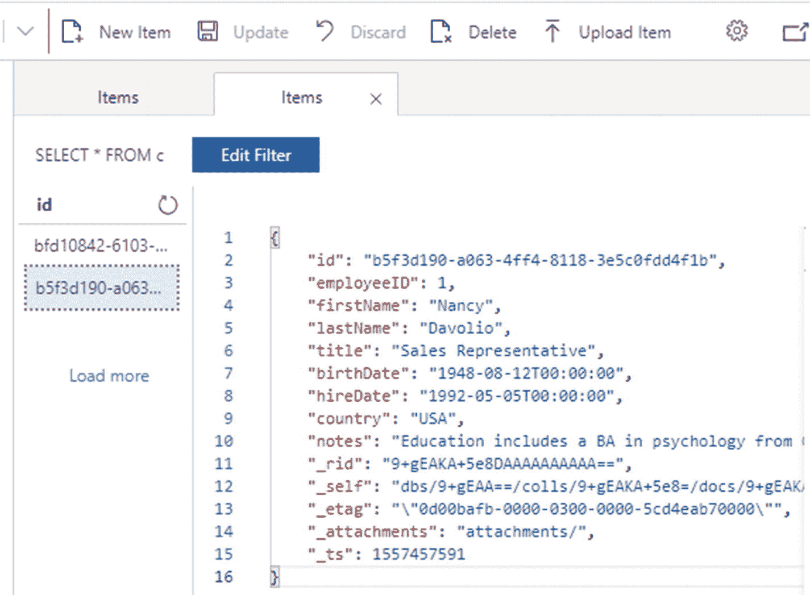

图 9-11

显示新添加员工的数据浏览器

注意，除了 Employee 类中可用的文档属性之外，Cosmos DB 还自动添加了一些属性，如 _rid 和 _self，以供使用。还要注意，JSON 属性名是按照在`[JsonProperty]`属性中指定的名称命名的。

## 添加对认证和授权的支持

在雇员管理器的 MVC 版本中，您使用 ASP.NET Core Identity 来实现认证和授权。当时，用户名、密码和角色等用户详细信息存储在 SQL Server 数据库中。在这个例子中，您使用 Cosmos DB 来存储这些细节。您不使用 ASP.NET Core Identity(默认情况下需要 SQL Server 数据库中的某些表)，而是使用自定义 cookie 认证。

自定义 cookie 认证和授权遵循与 ASP.NET Core Identity 相同的总体流程。但是，您需要为用户和角色管理设计自己的机制。

要启用定制 cookie 认证，您需要在`ConfigureServices()`中添加清单 [9-26](#PC27) 中提到的配置。

```cs
public void ConfigureServices(IServiceCollection services)
{
    ...
    ...
    services.AddAuthentication
(CookieAuthenticationDefaults.AuthenticationScheme)
.AddCookie(o =>
{
    o.LoginPath = "/Security/SignIn";
    o.AccessDeniedPath = "/Security/AccessDenied";
});
}

Listing 9-26Enabling custom cookie authentication

```

注意，代码使用了`AddAuthentication()`方法来注册与定制 cookie 认证相关的服务。`CookieAuthenticationDefaults` ( `Microsoft.AspNetCore.Authentication.Cookies`名称空间)的`AuthenticationScheme`属性传递认证方案的默认名称(Cookies)。`AddCookie()`配置发布的认证 cookie。

`Configure()`方法看起来与前面的例子相同，因此这里不再讨论。

### 存储用户详细信息

使用 ASP.NET Core Identity 时，用户、角色和用户-角色映射等详细信息存储在 SQL Server 表中。因为这个例子没有使用 ASP.NET Core Identity，而是使用了 Cosmos DB 数据库存储用户详细信息，所以您需要决定如何存储这些详细信息。

您可以使用三个 Cosmos DB 集合(如 Users、Roles 和 UserRoles)来保存各自的细节。然而，为了简单起见，这个例子只使用了一个集合——Users——来存储用户的详细信息，如`UserName`、`Password`、`Email`、`FullName`、`BirthDate`和`Role`。尽管 Employee Manager 使用基于角色的安全性，但并不涉及太多角色。所以这个简单的文档结构就满足了这个目的。然而，在更现实的情况下，您会考虑更复杂、更精细的安排。

为了表示保存在`Users`集合中的 JSON 文档，您需要一个具有前面提到的所有属性的类。清单 [9-27](#PC28) 显示了包装了所有这些细节的`AppUser`类。

```cs
public class AppUser
{
    [JsonProperty(PropertyName = "id")]
    public Guid DocumentID { get; set; }

    [JsonProperty(PropertyName = "userName")]
    public string UserName { get; set; }

    [JsonProperty(PropertyName = "password")]
    public string Password { get; set; }

    [JsonProperty(PropertyName = "email")]
    public string Email { get; set; }

    [JsonProperty(PropertyName = "fullName")]
    public string FullName { get; set; }

    [JsonProperty(PropertyName = "birthDate")]
    public DateTime BirthDate { get; set; }

    [JsonProperty(PropertyName = "role")]
    public string Role { get; set; }
}

Listing 9-27AppUser class stores user details

```

`AppUser`类包含几个属性，即`DocumentID`、`UserName`、`Password`、`Email`、`FullName`、`BirthDate`和`Role`。这些属性是用`[JsonProperty]`属性修饰的。

一旦`AppUser`类准备就绪，您就可以继续添加负责用户注册、登录和注销操作的`SecurityController`。

### 创建安全控制器

`SecurityController`包括创建新用户帐户、通过发布认证 cookie 登录用户以及通过删除认证 cookie 注销用户的操作。以下部分讨论负责这些操作的`SecurityController`的`Register()`、`SignIn()`和`SignOut()`动作。你可以从本章的代码下载中获得`SecurityController`的完整代码。

#### 创建新的用户帐户

为了创建新的用户帐户，您需要向 Cosmos DB 数据库的 Users 集合中添加一个 JSON 文档。这是通过清单 [9-28](#PC29) 中所示的`Register()`动作来完成的。

```cs
[HttpPost]
public async Task<IActionResult> Register(Register model)
{
    if (ModelState.IsValid)
    {
        AppUser usr = client.CreateDocumentQuery<AppUser>(userCollectionUri).Where(u => u.UserName == model.UserName).AsEnumerable().SingleOrDefault();

        if (usr != null)
        {
            ModelState.AddModelError("", "UserName already exists!");
        }
        else
        {
            AppUser user = new AppUser();
            user.DocumentID = Guid.NewGuid();
            user.UserName = model.UserName;
            user.Password = model.Password;
            user.Email = model.Email;
            user.FullName = model.FullName;
            user.BirthDate = model.BirthDate;
            user.Role = "Manager";

            await client.CreateDocumentAsync(userCollectionUri, user);
            ViewData["message"] = "User created successfully!";
        }
    }
    return View();
}

Listing 9-28Creating a new user account

```

代码首先检查具有特定`UserName`的用户是否已经存在于 Users 集合中。这是使用`DocumentClient` **的`CreateDocumentQuery()`方法完成的。**

如果`UserName`不存在，代码继续创建一个新的`AppUser`对象并设置其属性。回想一下，`AppUser`代表一个您想要存储在 Users 集合中的 JSON 文档。

一旦`AppUser`对象准备好了，代码就使用`CreateDocumentAsync()`方法添加到用户集合中。注意，用户集合的`Uri`和`AppUser`对象一起被传递给了`CreateDocumentAsync()`方法。

#### 让用户登录应用

为了让用户登录到 Employee Manager，您需要验证用户凭证并发布一个认证 cookie。因为在这个例子中你没有使用 ASP.NET Core Identity，你求助于 ASP.NET Core 的`HttpContext.SignInAsync()`方法和所谓的`ClaimsPrincipal`。清单 [9-29](#PC30) 显示了这是如何完成的。

```cs
[HttpPost]
public async Task<IActionResult> SignIn(SignIn model)
{
    AppUser usr = client.CreateDocumentQuery<AppUser>(userCollectionUri).Where(u => u.UserName == model.UserName && u.Password==model.Password).AsEnumerable().SingleOrDefault();

    bool isUserValid = (usr == null ? false : true);

    if (ModelState.IsValid && isUserValid)
    {
        var claims = new List<Claim>();
        claims.Add(new Claim(ClaimTypes.Name, usr.UserName));
        claims.Add(new Claim(ClaimTypes.Role, usr.Role));
        var identity = new ClaimsIdentity(claims, CookieAuthenticationDefaults.AuthenticationScheme);
        var principal = new ClaimsPrincipal(identity);
        var props = new AuthenticationProperties();
        props.IsPersistent = model.RememberMe;

        await HttpContext.SignInAsync(CookieAuthenticationDefaults.
                                      AuthenticationScheme, principal, props);

        return RedirectToAction("List", "EmployeeManager");
    }
    else
    {
        ModelState.AddModelError("","Invalid UserName or Password!");
    }

    return View();
}

Listing 9-29Signing a user in by issuing the authentication cookie

```

代码首先检查用户提供的`UserName`和`Password`是否有效。这是通过使用特定的`UserName`和`Password`组合的`CreateDocumentQuery()`方法查询用户集合来完成的。

如果用户凭据有效，代码将继续进行登录操作。为了让用户登录到应用，您需要构造`ClaimsPrincipal`对象。要构建一个`ClaimsPrincipal,`，你需要一个`ClaimsIdentity`和一个`Claim`对象列表。

### 注意

对基于声明的安全性、ClaimsIdentity 和 ClaimsPrincipal 等安全概念的详细讨论超出了本书的范围。你可以在 [`https://docs.microsoft.com/en-us/dotnet/api/system.security.claims.claimsprincipal`](https://docs.microsoft.com/en-us/dotnet/api/system.security.claims.claimsprincipal) 的官方文档中读到更多关于这些概念的内容。

看一看用粗体字母显示的代码。两个`Claim`对象被创建并添加到`List<Claim>`中。这些`Claim`对象分别存储`UserName`和用户的`Role,`。

基于这些声明，构造了一个`ClaimsIdentity`对象。然后通过传递刚刚创建的`ClaimsIdentity`来构造一个`ClaimsPrincipal`。

接下来，创建一个`AuthenticationProperties`类的对象。`AuthenticationProperties`类用于存储认证会话的属性。在这种情况下，`IsPersistent`属性被设置为 true 或 false，这取决于登录页面的“记住我”复选框。

最后，调用`HttpContext`类的`SignInAsync()`方法让用户登录到应用。`SignInAsync()`方法接受三个参数——认证方案、`ClaimsPrincipal`对象和`AuthenticationProperties`对象。然后，它向用户发布认证 cookie。这个认证 cookie 与每个请求一起在浏览器和服务器之间传递，以便服务器知道用户已经登录到应用。

#### 从应用中注销用户

`SecurityController`的`SignOut()`动作通过删除认证 cookie 将用户从应用中注销。`SignOut()`动作如清单 [9-30](#PC31) 所示。

```cs
[HttpPost]
public async Task<IActionResult> SignOut()
{
    await HttpContext.SignOutAsync(
CookieAuthenticationDefaults.AuthenticationScheme);
    return RedirectToAction("SignIn", "Security");
}

Listing 9-30Signing a user out of the application

```

如您所见，`HttpContext`的`SignOutAsync()`方法完成了将用户从应用中注销的工作。`SignOutAsync()`接受认证方案的名称作为它的参数。

#### 使用[Authorize]属性保护 EmployeeManagerController

一旦集成了前面讨论的定制 cookie 认证，就可以用`[Authorize]`属性保护`EmployeeManagerController`。您还可以使用`[ValidateAntiForgeryToken]`属性保护控制器 POST 操作免受 CSRF/XSRF 攻击。这个过程与您为 MVC 版本的 Employee Manager 所做的相同。清单 [9-31](#PC32) 显示了应用了这些属性的`EmployeeManagerController`的一部分，仅供您快速参考。

```cs
[Authorize(Roles = "Manager")]
public class EmployeeManagerController : Controller
{
    ...
    [HttpPost]
    [ValidateAntiForgeryToken]
    public IActionResult Insert(Employee emp)
    {
       ...
    }
    ...
}

Listing 9-31Using the [Authorize] attribute to EmployeeManagerController

```

## 为 Cosmos DB 使用 EF 核心提供程序

前面提到过，您也可以使用 Cosmos DB 的 EF 核心提供者(可以通过`Microsoft.EntityFrameworkCore.Cosmos` NuGet 包获得)来处理 Cosmos DB。在本节中，您将学习如何在员工管理器中使用它。这里只讨论 CRUD 操作，而不是根据`Microsoft.EntityFrameworkCore.Cosmos`讨论整个员工管理器。但是这本书的代码下载包含了一个使用`Microsoft.EntityFrameworkCore.Cosmos`提供者开发的完整的员工管理器应用。

### 创建 AppDbContext

看看清单 [9-32](#PC33) ，它显示了为 Cosmos DB 创建的名为`AppDbContext`的定制`DbContext`。

```cs
public class AppDbContext:DbContext
{
    public AppDbContext(DbContextOptions<AppDbContext> options) : base(options)
    {

    }
    public DbSet<Employee> Employees { get; set; }
    public DbSet<Country> Countries { get; set; }
    public DbSet<AppUser> Users { get; set; }
}

Listing 9-32DbContext for Cosmos DB

```

如您所见，`AppDbContext`类看起来与您在前面的例子中创建的任何其他`DbContext`非常相似。由`DbSet`属性使用的`Employee`、`Country`和`AppUser`实体类也与任何其他实体类一样被创建。作为一个例子，`Employee`类如清单 [9-33](#PC34) 所示。

```cs
public class Employee
{
    [Key]
         [Required]
         public Guid DocumentID { get; set; }

    [Required]
    [Display(Name ="Employee ID")]
    public int EmployeeID { get; set; }

    [Required]
    [StringLength(10)]
    [Display(Name = "First Name")]
    public string FirstName { get; set; }

    [Required]
    [StringLength(20)]
    [Display(Name = "Last Name")]
    public string LastName { get; set; }

    [Required]
    [StringLength(30)]
    [Display(Name = "Title")]
    public string Title { get; set; }

    [Required]
    [Display(Name = "Birth Date")]
    public DateTime BirthDate { get; set; }

    [Required]
    [Display(Name = "Hire Date")]
    public DateTime HireDate { get; set; }

    [Required]
    [StringLength(15)]
    [Display(Name = "Country")]
    public string Country { get; set; }

    [StringLength(500)]
    [Display(Name = "Notes")]
    public string Notes { get; set; }
}

Listing 9-33Employee entity class

```

注意,`DocumentID`属性的类型是`Guid`,并且标记有`[Key]`属性，表明它是文档的唯一标识符。`Country`和`AppUser`实体类非常简单，这里不做讨论。

您可以通过在`ConfigureServices()`中注册`AppDbContext`来将它注入到任何控制器中。清单 [9-34](#PC35) 展示了如何做到这一点。

```cs
services.AddDbContext<AppDbContext>(options =>
    options.UseCosmos(
    "your_account_uri",
    "your_account_secret_key",
    "your_database_name"
));

Listing 9-34Registering AppDbContext in ConfigureServices()

```

`UseCosmos()`方法提供了三个部分——您的 Cosmos DB 帐户端点 URI(与您的服务器配置设置相同)、您的帐户密钥(与存储在配置文件中的 PrimaryKey 相同)和数据库名称。这些详细信息是建立与数据库的连接所必需的。对于这个例子，最好使用不同的数据库名称，因为 Northwind 已经在前面的例子中创建了。

### 执行 CRUD 操作

在使用`Microsoft.Azure.DocumentDB.Core`客户端库时，您以编程方式创建了 Northwind 数据库。您可以在使用如清单 [9-35](#PC36) 所示的用于 Cosmos DB 的 EF 核心提供者时完成同样的事情。

```cs
public class EmployeeManagerController : Controller
{

    private readonly AppDbContext db;

    public EmployeeManagerController(AppDbContext db)
    {
        this.db = db;
        db.Database.EnsureCreated();
    }
    ...
}

Listing 9-35Creating a database if it doesn’t exist

```

`EmployeeManagerController`构造函数获取`AppDbContext`的一个实例，并将其存储在成员变量(`db`)中。然后调用`Database`对象的`EnsureCreated()`方法。如果在`UseCosmos()`方法中指定的数据库不存在，那么`EnsureCreated()`方法会创建该数据库。当您使用 Cosmos DB 的 EF 核心提供程序时，它在名为`AppDbContext`的容器下存储各种`Employee`项。这个容器是自动为您创建的。

您可以在`AppDbContext`中插入一个新的`Employee`项目，如清单 [9-36](#PC37) 所示。

```cs
[HttpPost]
[ValidateAntiForgeryToken]
public IActionResult Insert(Employee emp)
{
   FillCountries();
   if (ModelState.IsValid)
   {
    Employee obj = (from e in db.Employees
           where e.EmployeeID == emp.EmployeeID
           select e).SingleOrDefault();
    if (obj == null)
    {
        emp.DocumentID = Guid.NewGuid();
        db.Employees.Add(emp);
        db.SaveChanges();
        ViewBag.Message = "Employee inserted successfully!";
    }
    else
    {
        ViewBag.Message = "EmployeeID already exists!";
    }
   }
   return View(emp);
}

Listing 9-36Inserting a new employee in the AppDbContext container

```

请注意用粗体字母标记的代码。它首先检查正在添加的`EmployeeID`是否已经存在于数据库中。它通过在容器中查询带有特定`EmployeeID`的条目来实现这一点。如您所见，该查询与任何其他 LINQ 到实体的查询非常相似。

如果数据库中不存在`EmployeeID`，代码将继续创建一个新的`Employee`实体。属性`DocumentID`被赋予一个新的`Guid`值。使用`Add()`方法将新创建的`Employee`添加到`Employees`数据库集中，并调用`SaveChanges()`来保存更改。

为了更新一个现有的雇员，您需要一个如清单 [9-37](#PC38) 所示的`Update()`动作。

```cs
[HttpPost]
[ValidateAntiForgeryToken]
public IActionResult Update(Employee emp)
{
   FillCountries();
   if (ModelState.IsValid)
   {
    Employee obj = db.Employees.Find(emp.DocumentID);
    obj.EmployeeID = emp.EmployeeID;
    obj.FirstName = emp.FirstName;
    obj.LastName = emp.LastName;
    obj.Title = emp.Title;
    obj.BirthDate = emp.BirthDate;
    obj.HireDate = emp.HireDate;
    obj.Country = emp.Country;
    obj.Notes = emp.Notes;
    db.SaveChanges();
    ViewBag.Message = "Employee updated successfully!";
   }
   return View(emp);
}

Listing 9-37Updating an existing employee

```

请注意用粗体字母标记的代码，它更新了 Cosmos DB 数据库中的一个现有雇员。首先，代码使用`Find()`方法检索与指定的`DocumentID`匹配的实体。然后，它将雇员的各种属性分配给它们修改后的值。代码然后调用`SaveChanges()`方法来保存数据库中的更改。

如果你想从`AppDbContext`容器中删除一个`Employee`条目，你可以编写如清单 [9-38](#PC39) 所示的代码。

```cs
[HttpPost]
[ValidateAntiForgeryToken]
public IActionResult Delete(string documentID)
{
    Employee emp = db.Employees.Find(new Guid(documentID));
    db.Employees.Remove(emp);
    db.SaveChanges();
    TempData["Message"] = "Employee deleted successfully!";
    return RedirectToAction("List");
}

Listing 9-38Deleting an employee item

```

代码使用`Find()`方法检索需要删除的`Employee`实体。检索到的实体被传递给`Remove()`方法，以将其从`Employees` DbSet 中移除。最后，`SaveChanges()`方法将它从数据库中删除。

如果在`AppDbContext`容器中有雇员项，那么可以获取它们，如清单 [9-39](#PC40) 所示。

```cs
public IActionResult List()
{
    var query = from e in db.Employees
                orderby e.EmployeeID
                select e;
    return View(query.ToList());
}

Listing 9-39Retrieving all the employees

```

“LINQ 到实体”查询获取所有雇员，并将他们发送到列表视图进行显示。

### 注意

从前面的代码片段中可以看出，使用 EF Core provider for Cosmos DB 执行 CRUD 操作的整个过程与 SQL Server 数据库非常相似。因此，这里不讨论这个雇员经理示例的其他部分。您可以从该书的代码下载中获得该示例的完整源代码。

如果您运行这个雇员管理器应用并添加一些雇员项目，您也可以从数据浏览器中查看它们。图 [9-12](#Fig12) 显示了这样一个雇员项目示例。

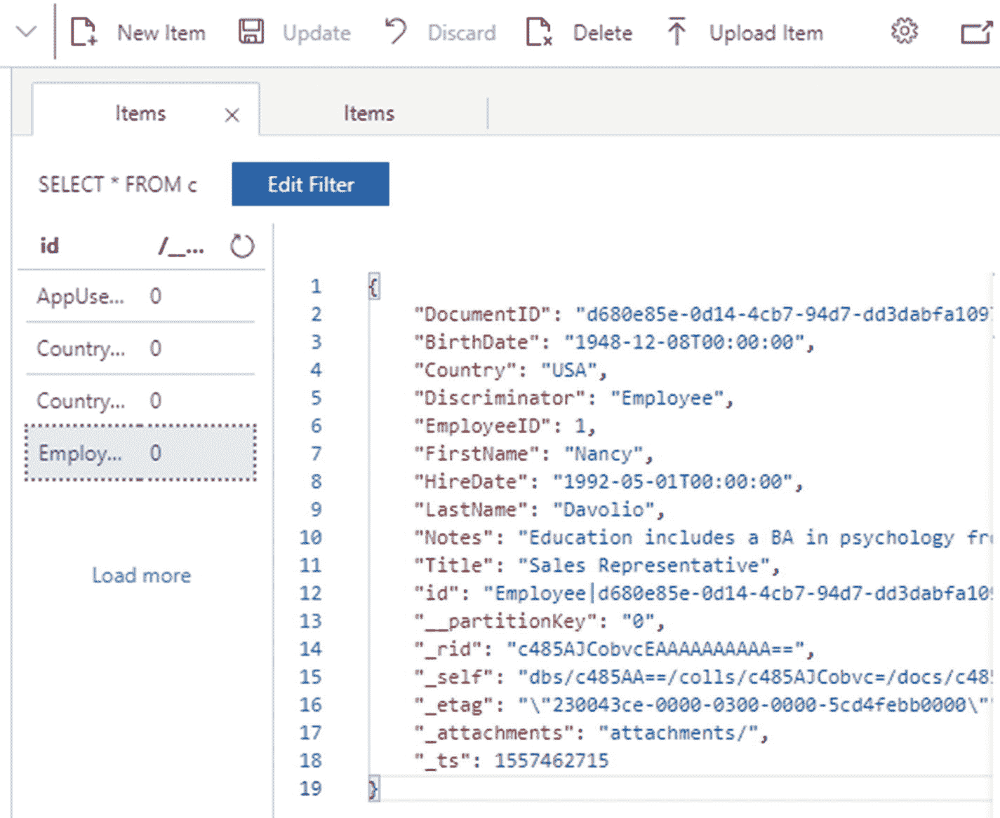

图 9-12

显示添加到 AppDbContext 容器中的雇员项的数据资源管理器

## 安装和运行 MongoDB

在前面的小节中，您使用了 Cosmos DB 来构建雇员管理器应用。在本节中，您将使用另一个流行的 NoSQL 数据库——MongoDB。在开始编写执行 CRUD 操作的代码之前，需要在本地机器上安装 MongoDB。在本节中，您将这样做，并运行数据库引擎，以便您的 ASP.NET Core 应用可以连接到数据库。

第一步是访问 MongoDB 官方网站并下载 MongoDB 数据库服务器。您可以将数据库服务器下载为 MSI 文件或 ZIP 文件。图 [9-13](#Fig13) 显示了解压 ZIP 文件后 Bin 文件夹的内容。

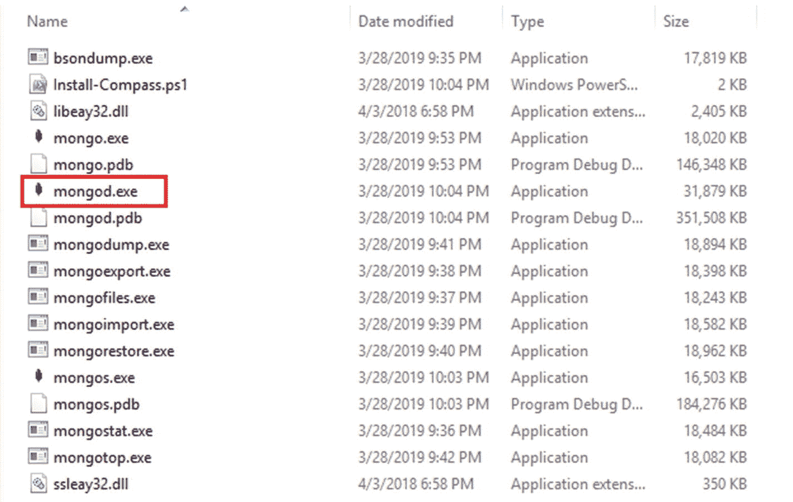

图 9-13

使用 mongod.exe 运行数据库引擎

注意这个`mongod.exe`文件。这是为 Windows 平台构建的 MongoDB 守护进程。启动 MongoDB 服务器的一个简单方法是使用命令提示符运行这个可执行文件。默认情况下，MongoDB 服务器运行在端口 27017。您还可以指定存储数据的文件夹。例如，以下命令启动 MongoDB 服务器，并将数据目录指定为 data(在运行该命令之前，在 MongoDB 安装文件夹下创建 Data 文件夹):

```cs
> mongod --dbpath ..\Data

```

图 [9-14](#Fig14) 显示了 MongoDB 服务器成功启动时的命令提示符。

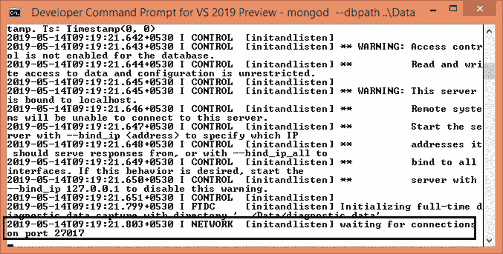

图 9-14

MongoDB 服务器成功运行

一旦 MongoDB 服务器启动，您就可以继续执行 CRUD 操作。

### 注意

向您详细介绍 MongoDB 和 MongoDB 驱动程序超出了本书的范围。以下几节重点介绍 CRUD 操作的执行。更多详情，请访问 [`https://docs.mongodb.com/ecosystem/drivers/csharp/`](https://docs.mongodb.com/ecosystem/drivers/csharp/) 的官方文档。

### 执行 CRUD 操作

在本节中，您将学习在名为 Northwind 的 MongoDB 数据库上执行 CRUD 操作。您还没有创建 Northwind 数据库及其集合。这将通过 MongoDB 驱动程序实现。所以在创建和配置一个新项目(EmployeeManager。MongoDB)，确保添加 NuGet 包–`MongoDB.Driver`–它代表. NET 的 MongoDB 驱动程序。

为简洁起见，以下章节仅讨论来自`EmployeeManagerController`的 CRUD 操作。

#### 配置 MongoClient

为了连接到 MongoDB 服务器，可以使用`MongoClient`类。清单 [9-40](#PC42) 展示了如何在应用中配置和使用`MongoClient`。

```cs
public class EmployeeManagerController : Controller
{
    private IMongoCollection<Employee> employees;
    private IMongoCollection<Country> countries;

    public EmployeeManagerController(IConfiguration config)
    {
        var client = new MongoClient(config.GetValue<string>
        ("MongoDBSettings:Server"));
        IMongoDatabase db = client.GetDatabase(config.GetValue<string>
        ("MongoDBSettings:DatabaseName"));
        this.employees = db.GetCollection<Employee>(config.GetValue<string>
        ("MongoDBSettings:EmployeeCollectionName"));
        this.countries = db.GetCollection<Country>(config.GetValue<string>
(       "MongoDBSettings:CountryCollectionName"));
    }
}

Listing 9-40Connecting with the MongoDB server using MongoClient

```

在`EmployeeManagerController,`的构造函数中，代码通过传递服务器端点 URI 来创建一个新的`MongoClient`实例。默认情况下，这个 URI 是`mongodb://localhost:27017,`，它存储在 appsettings.json 文件中。

一旦与服务器建立了连接，代码就会使用`MongoClient`的`GetDatabase()`方法获得 Northwind 数据库。`GetDatabase()`方法接受一个数据库名。如果指定的数据库已经存在，则作为`IMongoDatabase`实现返回。如果数据库不存在，它会被创建，然后作为`IMongoDatabase`返回。

然后，代码使用`GetCollection()`方法检索两个文档集合——雇员和国家。如果一个集合已经存在，则以`IMongoCollection`的形式返回；否则，集合被创建并作为`IMongoCollection`返回。

#### 员工和国家模型类

Employee 和 Country 模型类类似于您为 Cosmos DB 示例创建的模型类。然而，这一次他们使用了`[BsonId]`和`[BsonElement]`属性。清单 [9-41](#PC43) 显示了具有这些属性的雇员类。

```cs
public class Employee
{
    [BsonId]
    public ObjectId DocumentID { get; set; }

    [BsonElement("employeeID")]
    [Required]
    [Display(Name ="Employee ID")]
    public int EmployeeID { get; set; }

    [BsonElement("firstName")]
    [Required]
    [StringLength(10)]
    [Display(Name = "First Name")]
    public string FirstName { get; set; }

    [BsonElement("lastName")]
    [Required]
    [StringLength(20)]
    [Display(Name = "Last Name")]
    public string LastName { get; set; }

    [BsonElement("title")]
    [Required]
    [StringLength(30)]
    [Display(Name = "Title")]
    public string Title { get; set; }

    [BsonElement("birthDate")]
    [Required]
    [Display(Name = "Birth Date")]
    [BsonDateTimeOptions(DateOnly = true)]
    public DateTime BirthDate { get; set; }

    [BsonElement("hireDate")]
    [Required]
    [Display(Name = "Hire Date")]
    [BsonDateTimeOptions(DateOnly = true)]
    public DateTime HireDate { get; set; }

    [BsonElement("country")]
    [Required]
    [StringLength(15)]
    [Display(Name = "Country")]
    public string Country { get; set; }

    [BsonElement("notes")]
    [StringLength(500)]
    [Display(Name = "Notes")]
    public string Notes { get; set; }
}

Listing 9-41Using [BsonId] and [BsonElement]

```

前面提到 MongoDB 以 JSON 文档的形式存储数据。为了有效地存储这些文档，MongoDB 使用了一种叫做 BSON (Binary JSON)的二进制格式。

Employee 类的`DocumentID`属性标有`[BsonId]`属性(`MongoDB.Bson.Serialization.Attributes`命名空间)，其数据类型为`ObjectId`。这表明`DocumentID`属性将作为 JSON 文档的唯一标识符。(在 MongoDB 中，JSON 文档的`_id`属性充当唯一标识符。`[BsonId]`属性自动将底层属性保存为`_id.`。`ObjectId`类型由 MongoDB 驱动程序定义，代表一个 12 字节的值。

其他属性用`[BsonElement]`属性(`MongoDB.Bson.Serialization.Attributes`名称空间)修饰，表示底层属性将被序列化为 JSON 元素。您还可以使用`[BsonElement]`属性的参数为 JSON 属性指定一个替代名称。如果不指定备用名称，将使用基础属性的名称。

注意，`BirthDate`和`HireDate`属性也是用`[BsonDateTimeOptions]`属性修饰的。`[BsonDateTimeOptions]`的`DateOnly`属性是`true`，表示在序列化和反序列化这些属性时只考虑日期部分。

可以在相同的行上创建`Country`类，如清单 [9-42](#PC44) 所示，供您快速参考。

```cs
public class Country
{
    [BsonId]
    public ObjectId DocumentID { get; set; }

    [BsonElement]
    public int CountryID { get; set; }

    [BsonElement]
    public string Name { get; set; }
}

Listing 9-42Country class

```

#### 显示员工列表

为了从 MongoDB 数据库中检索雇员文档列表，可以使用雇员`IMongoCollection`，如清单 [9-43](#PC45) 所示。

```cs
public IActionResult List()
{
    var model = this.employees.Find(FilterDefinition<Employee>.Empty)
.ToList();
    return View(model);
}

Listing 9-43Retrieving a list of employees

```

对雇员`IMongoCollection`调用的`Find()`方法以`FilterDefinition`对象的形式接受过滤条件。因为我们不想设置任何过滤器，所以传递一个空的过滤器条件。`Find()`方法以`IFindFluent`的形式返回一个流畅的 find 接口。为了获得作为`List<Employee>`的数据，调用了`ToList()`方法。

#### 插入新员工

为了将一个新的`Employee`插入数据库，您使用了`IMongoCollection`的`InsertOne()`方法。这显示在清单 [9-44](#PC46) 中。

```cs
[HttpPost]
[ValidateAntiForgeryToken]
public IActionResult Insert(Employee emp)
{
   FillCountries();
   if (ModelState.IsValid)
   {
    Employee existing = this.employees.Find(e => e.EmployeeID == emp.EmployeeID).FirstOrDefault();

    if(existing == null)
    {
        this.employees.InsertOne(emp);
        ViewBag.Message = "Employee inserted successfully!";
    }
    else
    {
        ViewBag.Message = "EmployeeID already exists!";
    }
   }
   return View();
}

Listing 9-44Inserting a new employee

```

POST `Insert()`动作首先使用雇员`IMongoCollection`来检查正在插入的`EmployeeID`是否已经存在。如果`EmployeeID`不存在，则通过传递要添加的新员工来调用员工`IMongoCollection`的`InsertOne()`方法。

#### 更新现有员工

为了更新一个现有的雇员，可以使用`IMongoCollection`的`ReplaceOne()`方法。如果您希望更改特定的属性而不是更新整个文档，也可以使用`UpdateOne()`方法。`ReplaceOne()`的使用如清单 [9-45](#PC47) 所示。

```cs
[HttpPost]
[ValidateAntiForgeryToken]
public IActionResult Update(string documentID, Employee emp)
{
   FillCountries();
   if (ModelState.IsValid)
   {
    emp.DocumentID = new ObjectId(documentID);
    var filter = Builders<Employee>.Filter.Eq(e => e.DocumentID, emp.DocumentID);
    var result = employees.ReplaceOne(filter, emp);

    if (result.IsAcknowledged)
    {
        ViewBag.Message = "Employee updated successfully!";
    }
    else
    {
        ViewBag.Message = "Error while updating Employee!";
    }
   }
   return View(emp);
}

Listing 9-45Updating an employee

```

注意，`Update()` POST 方法不仅接受`Employee`对象，还接受`documentID`字符串。这是因为模型绑定不能自动将字符串`DocumentID`转换成`ObjectId`实例。因此代码获取字符串`DocumentID`并将其转换为`ObjectId`并将其赋给`Employee`的`DocumentID`属性。

然后代码构建一个过滤器，根据`DocumentID`过滤雇员。在这种情况下，由于过滤器是基于`DocumentID,`的，因此只有一个`Employee`将被过滤。这个过滤器被传递给`ReplaceOne()`方法的第一个参数。`ReplaceOne()`的第二个参数是修改后的`Employee`文件。

#### 删除现有员工

为了删除一个现有的雇员，您使用了`IMongoCollection`的`DeleteOne()`方法。如清单 [9-46](#PC48) 所示。

```cs
[HttpPost]
[ValidateAntiForgeryToken]
public IActionResult Delete(string documentID)
{
    ObjectId docID = new ObjectId(documentID);
    var result = this.employees.DeleteOne(e => e.DocumentID == docID);

    if (result.IsAcknowledged)
    {
        TempData["Message"] = "Employee deleted successfully!";
    }
    else
    {
        TempData["Message"] = "Error while deleting Employee!";
    }
    return RedirectToAction("List");
}

Listing 9-46Deleting an employee

```

`Delete()`动作接收一个字符串`documentID`并将其转换成一个`ObjectId`实例。然后通过以 LINQ 表达式的形式传递删除条件，对雇员`IMongoCollection`调用`DeleteOne()`方法。

这就完成了 CRUD 操作。您可以从本书的代码下载中获得这个例子的完整源代码。

#### 实现认证和授权

在这个示例中实现用户认证和基于角色的安全性与 Cosmos DB 示例非常相似，因为这个示例也使用定制的 cookie 认证。用户数据如`UserName`、`Password`和`Role`存储在一个名为 Users 的 MongoDB 集合中。然而，在更现实的情况下，您应该考虑使用强加密技术来保护用户数据。您甚至可能更喜欢将用户详细信息存储在其他数据存储中。数据加密和安全技术超出了本书的范围。

`SecurityController`包含相同的一组动作——`Register()`、`SignIn()`和`SignOut()`——来处理各自的操作。属性`[Authorize]`的用法也和以前一样。为了简洁起见，这里不讨论那些实现细节。你可以从本书的代码下载中获得`SecurityController`。

## 摘要

本章向您介绍了三个数据存储——Azure SQL 数据库、Cosmos DB 和 MongoDB。Azure SQL 数据库与您熟悉的 SQL Server 数据库相同，但它由 Azure 托管和管理。现在，NoSQL 数据库也很常见，你学过其中的两个——Cosmos DB 和 MongoDB。两者都以 JSON 文档的形式存储数据。为了在 Cosmos DB 数据库上执行 CRUD 操作，您使用了 Cosmos DB 客户端库以及 Cosmos DB 的 EF 核心提供程序。您还学习了如何使用 MongoDB 驱动程序。NET 来处理数据访问。总之，本章让您熟悉了基于云和 NoSQL 的数据存储。

在本书中，你一直在培养各种风格的员工经理。在下一章中，您将学习将员工管理器部署到 IIS 和 Azure 应用服务。