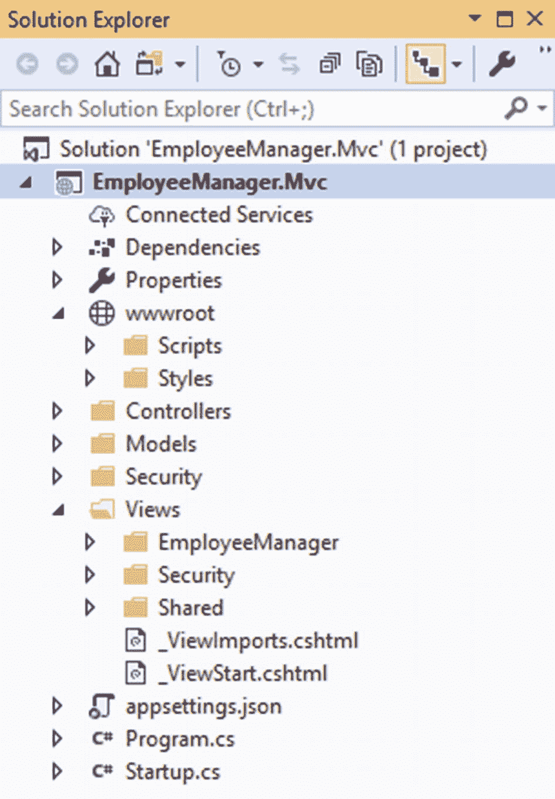
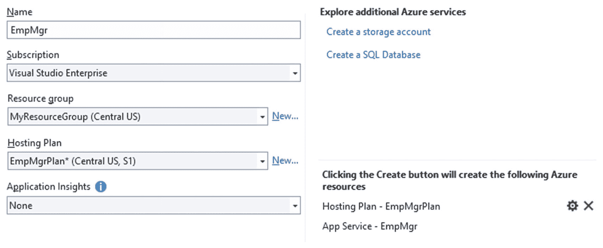
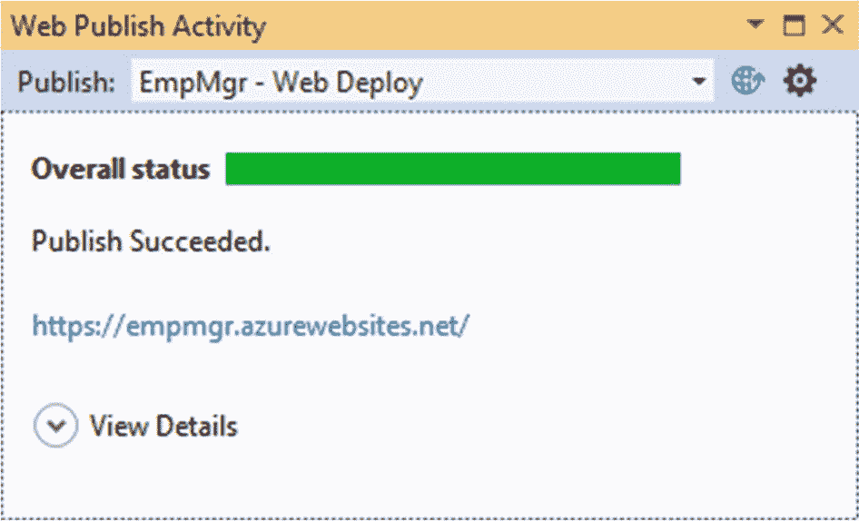

# 十、部署

到目前为止，您在本书中的旅程包括使用 ASP.NET Core 技术家族中可用的各种技术选项开发员工管理器应用。您在开发应用时使用了 IIS Express web 服务器。一旦开发完一个应用，您希望最终用户能够使用它。这就要求将应用部署在某个托管环境中，并让最终用户可以访问它。

如果您以前开发过 ASP.NET web 应用，您可能知道基于 Internet 信息服务(IIS)的托管。ASP.NET Core 开发人员仍然可以使用这种部署 ASP.NET 应用的传统方式。此外，许多现代 web 应用都托管在 Azure App Service 中。为此，本章教你

*   在 Internet 信息服务或 IIS 中部署员工管理器

*   在 Azure 应用服务中部署员工管理器

本章使用了您之前开发的两个项目，即 EmployeeManager。Mvc 和 EmployeeManager。AzureSql，为了说明前面提到的部署选项。所以你要准备好。

### 注意

本章假设您已经在计算机上安装了 IIS 和 Web Deploy。要了解更多关于 Web Deploy 的信息，请访问 [`https://docs.microsoft.com/en-us/iis/publish/using-web-deploy/introduction-to-web-deploy`](https://docs.microsoft.com/en-us/iis/publish/using-web-deploy/introduction-to-web-deploy) 。还假设您可以访问 Azure 门户和 Azure 应用服务。

## 将员工管理器部署到 IIS

在本节中，您将学习如何将员工管理器应用部署到 IIS。所以首先打开 EmployeeManager。Visual Studio 中的 Mvc 项目。打开项目时，您需要以管理员模式打开它，因为您希望使用 Web Deploy 来部署 Web 应用。你可以通过右击 Windows 开始屏幕中的 Visual Studio 条目，然后选择以管理员身份运行(图 [10-1](#Fig1) )。


图 10-1

以管理员身份运行 Visual Studio

然后构建项目，以确保没有编译错误。仅供您快速参考，图 [10-2](#Fig2) 显示了 EmployeeManager。Mvc 在解决方案资源管理器中打开。



图 10-2

EmployeeManager。在解决方案资源管理器中打开 Mvc

回想一下，您已经将数据库连接字符串存储在应用配置文件 appsettings.json 中。在开发 Employee Manager 时，您使用了 SQL Server 的本地安装。您的数据库连接如下所示:

```cs
"ConnectionStrings": {
    "AppDb": "data source=.;
              initial catalog=Northwind;
              integrated security=true;
}

```

如您所见，集成安全性选项设置为 true，表示 SQL Server 将使用 Windows 认证。这在开发过程中是正常的，因为您的 web 应用和 SQL Server 运行在同一台机器上。但是，在许多实际情况下，SQL Server 安装在不同的服务器上，您希望使用 SQL Server 认证来访问它。这意味着您将拥有一个 SQL Server 用户 ID 和密码，供您的 web 应用用来访问数据。在这种情况下，您需要修改数据库连接字符串以反映 SQL Server 的详细信息。请考虑以下使用此类凭据的连接字符串:

```cs
"ConnectionStrings": {
     "AppDb": "data source=your_sql_server;
               initial catalog=Northwind;
               user id=your_sql_server_userid;
               password= your_sql_server_password"
}

```

如您所见，数据源设置现在指定了目标 SQL Server 的名称或 IP 地址。用户 ID 和密码设置指定了各自的值。确保根据您的设置更改这些设置，并保存 appsettings.json 文件。

### 创建目标 SQL Server 数据库

就本例而言，这一步是可选步骤。但是，在大多数实际应用中，您需要将数据库和数据从 SQL Server 的本地安装转移到 SQL Server 的生产安装。有多种方法可以完成这项任务，包括:

*   您可以使用 SQL Server Management Studio 生成数据库脚本，并在目标 SQL Server 中运行这些脚本。

*   您可以使用 SQL Server Management Studio 的导入/导出数据功能将数据从本地数据库传输到目标数据库。

*   您可以使用 SQL Server Management Studio 的复制数据库功能将数据库对象和数据从本地数据库复制到目标数据库。

对这些数据库部署技术的讨论超出了本书的范围。如果希望使用运行在本地计算机上的 SQL Server 实例之外的 SQL Server 实例，请使用这些技术之一将数据库部署到目标服务器上。确保根据目标数据库从 appsettings.json 中更改数据库连接字符串(有关更多详细信息，请参见上一节)。

### 创建 IIS 网站

在使用 Web Deploy 将 Employee Manager 部署到 IIS 之前，您需要创建一个 IIS 站点来承载您的 Web 应用文件。为此，打开互联网信息服务(IIS)管理器(图 [10-3](#Fig3) )。


图 10-3

Internet 信息服务(IIS)管理器

然后右键点击站点文件夹，选择添加网站快捷菜单选项，打开如图 [10-4](#Fig4) 所示的对话框。


图 10-4

配置新的 IIS 网站

在此对话框中，将站点名称指定为 EmployeeManager。然后选择存储站点文件的物理文件系统文件夹(本例中为 C:\EmployeeManager)。IIS 下的默认站点监听端口 80，为了避免干扰它，指定一些未使用的端口号，比如 9000。在更真实的情况下，您应该在 IIS 中设置一个 SSL 证书，并在您的应用中实施 HTTPS，如 [`https://docs.microsoft.com/en-us/aspnet/core/security/enforcing-ssl`](https://docs.microsoft.com/en-us/aspnet/core/security/enforcing-ssl) 中所述。现在，单击 OK 按钮创建站点。

创建站点后，单击应用池选项以显示 IIS 应用池(图 [10-5](#Fig5) )。


图 10-5

IIS 应用池

这里您应该看到 EmployeeManager 的一个条目。双击 EmployeeManager 应用池以显示其设置。改变。NET CLR 版本设置为无托管代码(图 [10-6](#Fig6) )，然后关闭对话框。


图 10-6

更改应用池属性

接下来，在 IIS 管理器中单击 EmployeeManager 站点，并在 Features 视图中双击 Modules(图 [10-7](#Fig7) )。


图 10-7

IIS 模块列表

注意这里列出的 ASP.NET Core 模块。这是一个处理 ASP.NET Core 网络应用的 IIS 模块。

### 注意

根据运行 IIS 的机器的配置，您可能需要在其上安装 ASP.NET Core 托管包。ASP.NET Core 托管捆绑包安装。NET 核心运行时。NET 核心库和 ASP.NET Core 模块。对 ASP.NET Core 模块和各种主机模型的详细讨论超出了本书的范围。你可以考虑阅读 [`https://docs.microsoft.com/en-us/aspnet/core/host-and-deploy/aspnet-core-module`](https://docs.microsoft.com/en-us/aspnet/core/host-and-deploy/aspnet-core-module) 了解更多详情。

### 从 Visual Studio 发布员工管理器

现在已经在 IIS 中创建了 EmployeeManager 站点，您可以将应用部署到该站点。切换回具有 EmployeeManager 的 Visual Studio IDE。Mvc 项目已加载。单击“生成”菜单并选择“发布 EmployeeManager”。Mvc 菜单选项。

当你这样做时，你被要求选择一个发布目标(图 [10-8](#Fig8) )。


图 10-8

选择发布目标

在此对话框中，选择 IIS、FTP 等。选项，然后单击发布按钮。这将打开如图 [10-9](#Fig9) 所示的对话框。


图 10-9

指定 Web 部署设置

在此对话框的顶部，您可以选择一种发布方法。虽然您将使用 Web Deploy，但是列举可用的选项是值得的:

*   **Web Deploy:** 这将把您的应用文件部署到配置为使用 Web Deploy 的目标 IIS 上。

*   **Web Deploy Package:** 该选项生成一个 ZIP 文件，其中包含所有要部署的文件和设置。然后，您可以在目标 IIS 中安装该包。

*   **FTP:** 此选项允许您将 web 应用文件上传到 FTP 位置。

*   **文件系统:**此选项允许您将 web 应用发布到文件系统文件夹。然后，您可以将这些文件复制到 IIS。

因此，在发布方法下拉列表中选择 Web Deploy，并填写以下详细信息:

*   **服务器:**这是安装了 IIS 和 Web Deploy 的目标服务器的名称或 IP。在此示例中，应用被部署到 IIS 的本地安装，因此服务器被指定为 localhost。

*   **站点名称:**这是您之前创建和配置的 IIS 站点的名称——employee manager。

*   **用户名和密码:**如果目标服务器需要用户名和密码来连接，您也需要在相应的文本框中指定它们。

*   **目的地 URL:** 指定目的地 URL 是可选的。如果指定，Visual Studio 将在部署结束后在浏览器中启动此 URL。在此示例中，目标 URL 是 http://localhost:9000，因为 EmployeeManager 站点被配置为使用端口 9000。

输入所有这些详细信息后，单击“验证连接”按钮，以便 Visual Studio 验证各个字段中指定的连接设置，并通知您成功或错误。

如果连接验证成功，点击下一步按钮进入向导的下一步(图 [10-10](#Fig10) )。


图 10-10

指定发布设置

在“发布设置”对话框中，您可以指定各种设置，如下所述:

*   **配置:** Visual Studio 允许您以两种模式构建应用——调试和发布。前者在开发和调试阶段非常有用，而后者则适用于应用开发完成后。发布模式输出在性能和物理磁盘大小方面更加优化。因此，在此下拉列表中选择“发布”。

*   **目标框架:**此下拉列表允许您选择框架的目标版本。对于员工经理应用，它是 netcoreapp3.0。

*   **部署模式:**这个下拉列表包含两个用于部署 web 应用的选项——依赖于框架的和独立的。前一个选项假设您的应用将在。NET Core 安装在服务器上。因此，只部署您的应用文件和第三方依赖项。后一种模式除了特定于应用的文件之外，还捆绑了。用来构建应用的. NET Core framework 文件。根据您的选择，从列表中选择一个选项。

### 注意

要了解更多关于依赖于框架和自包含的部署模式，你可以阅读 [`https://docs.microsoft.com/en-us/dotnet/core/deploying`](https://docs.microsoft.com/en-us/dotnet/core/deploying) 。

*   **目标运行时:**该设置可用于指定应用的目标运行时环境。有 win-x86、win-x64、linux-x64、Portable 等多种选择。默认选择是便携的。我们不想针对特定的运行时，因此保持默认选择。

*   **文件发布选项、数据库和实体框架迁移:**这些类别中的选项可用于执行一些额外的任务，例如从目标机器中移除额外的文件，以及从您的项目中运行 EF 核心迁移。雇员经理应用不需要这些选项。所以不要选中它们(默认)。

指定这些选项后，单击保存按钮。这将保存您的部署首选项并开始部署过程。Web 发布活动窗口显示部署过程的状态(图 [10-11](#Fig11) )。


图 10-11

Web 发布活动窗口显示部署的状态

部署完成后，Visual Studio 还将在浏览器中启动应用。图 [10-12](#Fig12) 显示了部署到 EmployeeManager 文件夹的文件。


图 10-12

部署到 EmployeeManager 站点的文件

### 注意

在前面的示例中，您使用了最常见的部署选项来部署 Employee Manager 应用。有许多配置设置允许您微调部署。对所有这些配置设置的讨论超出了本书的范围。你可以在 [`https://docs.microsoft.com/en-us/aspnet/core/host-and-deploy/iis`](https://docs.microsoft.com/en-us/aspnet/core/host-and-deploy/iis) 了解更多。

让我们快速列举一些作为发布操作的结果而获得的重要输出文件:

*   **appsettings.json** 是应用配置文件，在开发应用时，它是按原样部署的。如果从该文件中更改配置设置(比如数据库连接字符串)，应用将使用更改后的设置。

*   **EmployeeManager.Mvc.dll**是一个包含编译后的 C# 应用代码的程序集。这包括 EF 核心模型、控制器和您可能拥有的任何其他 C# 代码。

*   EmployeeManager.Mvc.exe 是一个可执行文件，代表一个监听 HTTP 请求的进程。根据您的发布配置，这个可执行文件通常由 web.config 的< aspNetCore >部分使用

*   **EmployeeManager.Mvc.Views.dll**是一个包含所有 Razor 文件(* .cshtml)包括查看文件、查看导入文件、查看开始文件和布局文件。

*   您的应用所需的所有 **NuGet 包**和**依赖项**也被部署。例如，Microsoft.EntityFrameworkCore.dll 和 Microsoft.AspNetCore.Identity.EntityFrameworkCore.dll 被部署到目标位置。

*   还有一个发布操作生成的 **web.config** 文件。您的应用代码不直接使用该文件，但它包含 IIS 使用的某些设置。例如，web.config 指定了应用使用的 ASP.NET Core 模块配置和托管模型。

*   还有一个包含应用使用的静态资源的 **wwwroot** 文件夹。例如，站点*。css 和 jquery*。开发过程中放在 wwwroot 下的 js 文件被部署到目标位置。

成功部署应用后，Visual Studio 启动 http://localhost:9000。您可以尝试登录应用并测试 CRUD 操作。图 [10-13](#Fig13) 显示了成功登录后启动的 web 应用。


图 10-13

成功部署后启动员工管理器

### 重新部署应用

在前面几节中，您将雇员管理器应用部署到了 IIS 中。很多时候，在部署应用之后，您会对代码库进行更改。这需要将应用重新部署到服务器。为了帮助您完成重新部署过程，Visual Studio 会在发布配置文件中记住您以前的发布设置。

如果再次选择构建➤发布 EmployeeManager。Mvc 菜单选项，将显示如图 [10-14](#Fig14) 所示的对话框。


图 10-14

发布设置存储在自定义发布配置文件中

正如您所看到的，下拉列表选择了一个自定义发布配置文件。在下拉列表下面，有新建、编辑、重命名和删除按钮，可用于在发布配置文件上执行特定的操作。

如果您想重新部署 web 应用而不对发布设置进行任何更改，只需单击发布按钮开始重新部署。

如果要对发布设置进行任何更改，可以单击“编辑”按钮进行必要的更改。做出更改后，您可以单击 Publish 按钮来重新部署应用。

## 将员工管理器部署到 Azure 应用服务

在本节中，您将员工管理器应用部署到 Azure App Service。在本书的前面，您开发了一个使用 Azure SQL 数据库(Employee Manager)的雇员管理器版本。AzureSql 项目)。尽管该应用使用 Azure SQL 数据库作为雇员数据的数据存储，但是 web 应用是在您的本地机器上运行的。在本节中，您将应用部署到 Azure App Service。

Azure App Service 是一个基于平台即服务(PaaS)模式的 Azure 服务。它可以运行和管理 web 应用、移动应用、API 和业务逻辑应用。你可以把 Azure App Service 看作是你的 ASP.NET Core web 应用的托管环境。

### 注意

关于 Azure App Service 的详细讨论不在本书范围之内。你可以在 [`https://azure.microsoft.com/en-in/services/app-service`](https://azure.microsoft.com/en-in/services/app-service) 了解更多。

对于本例，您使用 EmployeeManager。之前创建的 AzureSql 项目。作为快速参考，图 [10-15](#Fig15) 显示了在解决方案资源管理器中打开的项目。


图 10-15

EmployeeManager。AzureSql 在解决方案资源管理器中打开

由于该项目已经使用了 Azure SQL 数据库，您不需要对存储在 appsettings.json 中的数据库连接字符串进行任何更改。下面给出了连接字符串，仅供您快速参考:

```cs
"ConnectionStrings": {
  "AppDb": "Server=your_server_address_here;
            Initial Catalog=Northwind;
            Persist Security Info=False;
            User ID=your_user_id_here;
            Password=your_password_here;
            MultipleActiveResultSets=False;
            Encrypt=True;
            TrustServerCertificate=False;
            Connection Timeout=30;"
}

```

在继续下一步之前，请确保您的服务器、用户 ID、密码和其他详细信息的值是正确的。

部署 EmployeeManager。AzureSql 到 Azure App Service，您实际上运行的向导与您在本章前面部署到 IIS 时运行的向导相同。但是，各种选项和设置的选择是不同的。

因此，首先打开 Build 菜单，然后选择 Publish EmployeeManager。AzureSql 菜单选项来启动向导。图 [10-16](#Fig16) 显示了选择发布目标的向导的第一步。


图 10-16

发布到 Azure 应用服务

在这一步中，从左侧选项中选择 App Service，然后选择 Create New 单选按钮，以表明您希望将应用部署到新的 Azure App Service。然后点击发布按钮进入下一步(图 [10-17](#Fig17) )。



图 10-17

指定 Azure 应用服务详细信息

在此屏幕中，您可以指定有关新 Azure App 服务的各种详细信息，如下所示:

*   **名称** **:** 表示正在创建的新 Azure App 服务的名称。该名称需要是唯一的。如果您指定的名称已被使用，您将会收到通知。这个名称也会出现在结果网站的 URL 中。因此，请确保在此输入一些简短但有意义的名称。

*   **套餐** **:** 从此下拉列表中选择您的 Azure 套餐。

*   **资源组:**资源组是资源的逻辑分组。如果您已经创建了某个资源组，请选择它的名称，或者通过单击“新建”按钮创建一个新的资源组。

*   **Hosting plan:** You also need to pick a hosting plan for your web application. You can either keep the default hosting plan selection or create a new hosting plan by clicking the New button. You should pick or create a hosting plan based on your requirements. Figure [10-18](#Fig18) shows a new hosting plan defined using the default size.

    

    图 10-18

    创建新的托管计划

*   **应用洞察:**如果您对分析您的应用性能感兴趣，您可以选择一个应用洞察。对于本例，您可以保持 Vdefault 选项为 None。

请注意，在屏幕右侧，有创建新存储帐户和 Azure SQL 数据库的选项。这个例子不需要，因为你的数据已经在 Azure SQL 数据库中了。

接下来，点击 Create 按钮，根据给定的规范创建一个新的 Azure 应用服务。创建应用服务后，必要的文件将被部署到其中。一旦部署完成，您将收到通知(图 [10-19](#Fig19) )。



图 10-19

成功部署到 Azure 应用服务

请注意“Web 发布活动”窗口中给出的 URL。它采取这种形式:

```cs
https://your_app_service_name.azurewebsites.net/

```

如果您使用浏览器导航到此 URL(确保替换您的 Azure 应用服务名称)，您应该会看到应用登录页面。然后，您可以像以前一样登录系统并测试 CRUD 操作。图 [10-20](#Fig20) 显示了成功登录后该应用的员工列表页面。


图 10-20

访问 Azure 应用服务中托管的员工管理器

如果你登录 Azure 门户网站并进入应用服务部分，你会发现新创建的应用服务列在那里(图 [10-21](#Fig21) )。


图 10-21

Azure 门户中列出的新创建的应用服务

### 在应用服务中存储连接字符串

在上一节中，您将数据库连接字符串存储在 appsettings.json 文件中。但是，出于安全原因，您可能希望避免将数据库连接字符串存储在 appsettings.json 文件中。此外，您的开发连接字符串和生产连接字符串可能不同。幸运的是，Azure App Service 允许你以更安全的方式存储数据库连接。

您可以使用 Azure 门户在应用服务中定义数据库连接字符串。该连接字符串将与 appsettings.json 键同名(本例中为 AppDb)。在运行时，将使用 App Service 中定义的连接字符串，而不是 appsettings.json 中定义的连接字符串。这是自动进行的，无需对源代码进行任何更改。

要在应用服务中定义连接字符串，请转到应用服务并点击图 [10-22](#Fig22) 所示的配置选项。


图 10-22

Azure 应用服务配置

然后，您可以通过单击新建连接字符串按钮来添加数据库连接字符串(图 [10-23](#Fig23) )。


图 10-23

添加数据库连接字符串

指定连接字符串的名称、值和类型。然后单击顶部的保存按钮保存配置。如图所示，名为 AppDb 的连接字符串已经添加到 App Service 配置中。确保此连接字符串名称与您在 appsettings.json 文件和代码中使用的名称匹配。就这样。现在，部署的 web 应用将使用这个连接字符串。

### 重新部署应用

如果您需要重新部署应用，整个过程与部署到 IIS 的情况相同。图 [10-24](#Fig24) 显示了选择了先前设置的发布向导。


图 10-24

使用发布向导重新部署 web 应用

和以前一样，您可以使用新建、编辑、重命名和删除按钮来对发布配置文件执行相应的操作。您可以单击“发布”按钮，根据选定的发布配置文件重新部署 web 应用。

点击编辑按钮，打开如图 [10-25](#Fig25) 所示的对话框。


图 10-25

更改部署连接设置

如你所见，这是对 Azure 应用服务的 Web 部署。如果单击向导的“下一步”按钮，您可以配置与部署到 IIS 时相同的设置。这些设置如图 [10-26](#Fig26) 所示。


图 10-26

更改部署配置设置

您可以按照向导步骤完成部署，并通过启动浏览器重新运行应用。

## 摘要

在本章中，您学习了部署 ASP.NET Core web 应用。讨论了两个常见的部署选项，即部署到 IIS 和部署到 Azure App Service。为了使用这些选项部署 web 应用，您使用了 Build 菜单下的 Publish 菜单选项。您还了解了部署操作期间可用的各种配置设置，例如目标框架和部署模式。

本书试图向您介绍构建 ASP.NET Core web 应用时可用的各种技术选项，包括 MVC、Razor Pages、Web APIs、jQuery Ajax、Angular SPA、Blazor、Azure SQL 数据库、NoSQL 数据库等等。我希望有了这些知识，您可以做好准备，深入了解 ASP.NET Core 技术家族的世界。