# 一、创建和设置您的项目

欢迎创建 ASP.NET Core 网络应用！这本书将从头到尾指导你创建一个典型的 ASP.NET Core Web 应用。本书中展示的所有代码都可以在 GitHub 上获得，当您浏览本书中的代码示例时，它们将成为您的宝贵资源。

本章将带你完成开始你的 web 应用开发所需的步骤。我们还将看一看添加和编辑 Razor 页面，处理实体，创建和注册数据服务，以及使用该数据服务在 web 页面上显示测试数据。

## 创建您的 Web 应用项目

在本书中，我将使用 Visual Studio 2019 来阐述 ASP.NET Core 网络应用的相关概念。对于那些不使用 Visual Studio 的人来说，使用。NET CLI。

我假设您已经安装了。NET Core 到你的机器上。我们将创建的 web 应用将使用。网芯 3.1。如果您尚未安装。NET Core，你可以通过访问这个链接: [`https://dotnet.microsoft.com/download`](https://dotnet.microsoft.com/download) 。

因为我们正在与。NET Core 是跨平台的，在这一节的后面，我还将向您展示如何使用命令提示符创建应用。

现在，让我们从在 Visual Studio 中创建一个新项目开始。从“文件”菜单中，单击“新建项目”。这将显示创建新项目屏幕，如图 [1-1](#Fig1) 所示。

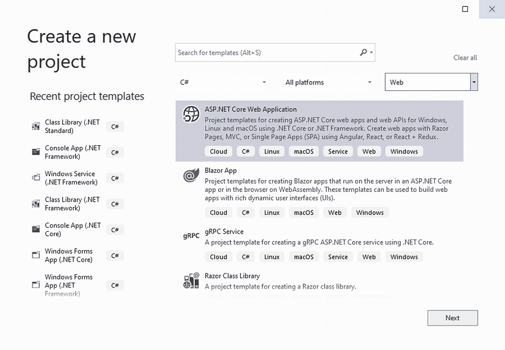

图 1-1

创建新项目屏幕

允许您选择正确项目模板的“创建新项目”屏幕列出了 Visual Studio 中包含的所有可用模板。在我们的例子中，我们将使用 ASP.NET Core Web 应用模板。

如果您习惯于在 Visual Studio 的早期版本中工作，您会注意到这个屏幕已经有了很大的改进。您可以通过在搜索文本框中键入模板名称或按住 Alt+S 来搜索模板。

您还可以从表单的下拉列表中筛选项目模板。您会注意到，您可以根据语言、平台和项目类型进行过滤。

点击下一步按钮将带您进入配置您的新项目屏幕，如图 [1-2](#Fig2) 所示。

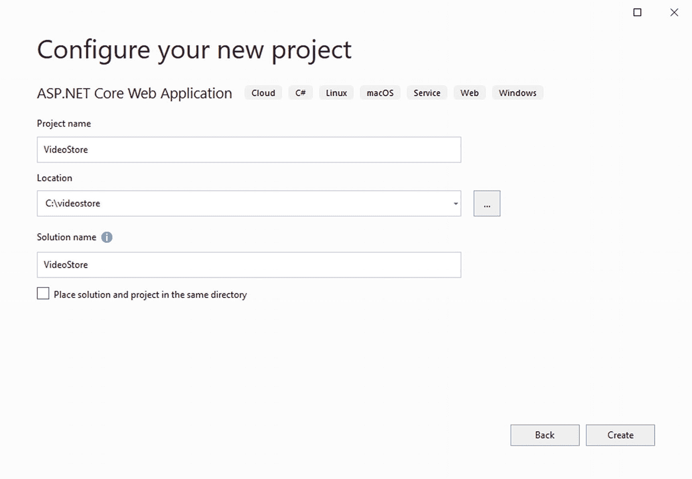

图 1-2

配置您的新项目

给项目起一个合适的名字。对于本书，我们将简单地调用项目 VideoStore 并指定一个位置来创建项目。完成后，单击“创建”按钮。

现在，您将进入第二个屏幕，如图 [1-3](#Fig3) 所示，在这里您可以选择想要使用的模板的具体类型。

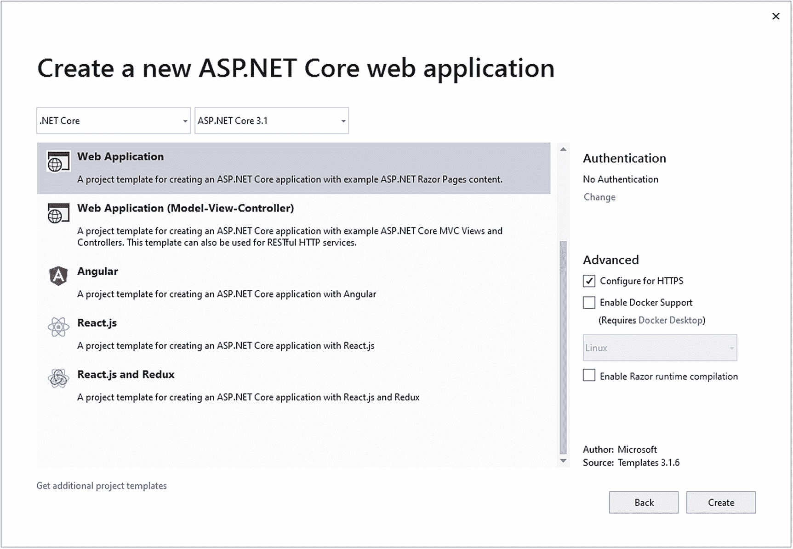

图 1-3

选择特定的模板类型

在这里我们可以指定。我们要用的 NET Core。在本例中，我们选择。网芯 3.1。然后我们可以告诉 Visual Studio 我们想要创建一个基本的 web 应用。只需将其余设置保留为默认值，然后单击 Create 按钮。

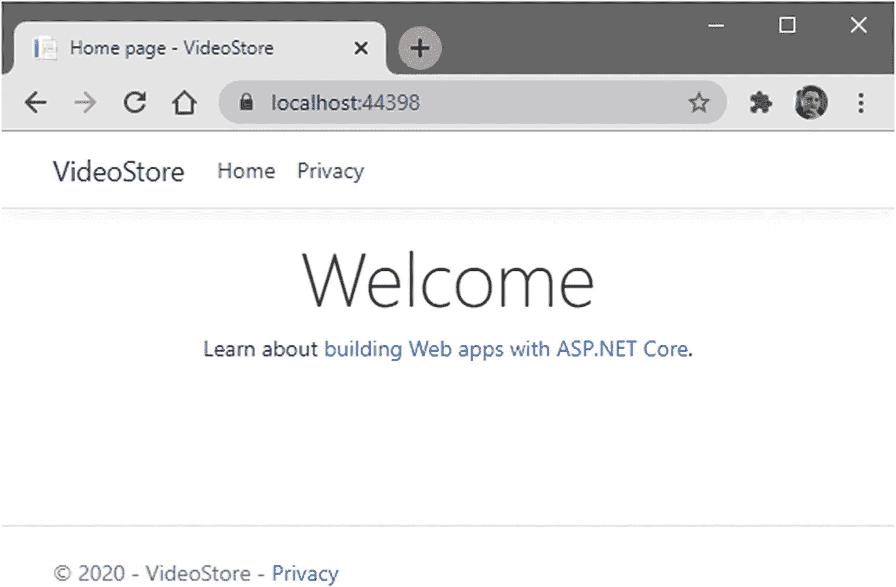

图 1-4

运行 Web 应用

在 Visual Studio 中创建项目后，您可以按 Ctrl+F5 来运行 web 应用。这将在没有附加调试器的情况下运行您的项目，并在您的浏览器中显示 web 应用，如图 [1-4](#Fig4) 所示。

您会注意到，在这个示例中，web 应用运行在端口 44398 上，但是您的端口很可能不同。默认情况下，这个 web 应用包括一些基本功能，如主页和隐私页面。

我们将从这里开始充实我们的 web 应用，并向它添加更多的特性和功能。

### 使用。NET CLI

在本章的前面，我提到我们也可以从命令提示符创建项目。因此，对于不使用 Visual Studio 的人来说。NET CLI 提供了一种跨平台的方式来创建。净核心项目。

一旦你安装了。NET Core 在你的 Mac、Linux 或 Windows 机器上，你应该能够简单地打开你的终端、Shell 或命令提示符并键入`dotnet`命令，如图 [1-5](#Fig5) 所示。

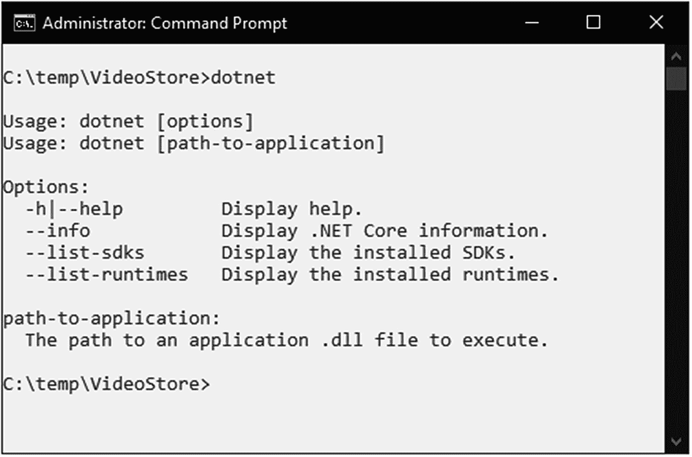

图 1-5

运行 dotnet 命令

要查看更多可用的`dotnet`命令，您可以在命令提示符下键入`dotnet -h`。如果您输入`dotnet new`，您将会在您的命令提示窗口中看到所有可用的项目模板。

下表列出了这些模板以及与该特定模板相关联的简称。

<colgroup><col class="tcol1 align-left"> <col class="tcol2 align-left"> <col class="tcol3 align-left"> <col class="tcol4 align-left"></colgroup> 
| 

**模板**

 | 

**简称**

 | 

**语言**

 | 

**标签**

 |
| --- | --- | --- | --- |
| 控制台应用 | 安慰 | C#、F#、VB | 普通/安慰 |
| 类库 | jclasslib(消歧义) | C#、F#、VB | 普通/图书馆 |
| WPF 应用 | 西皮尔巴拉粉 | C# | 普通/WPF |
| WPF 类库 | 瓦普利卜 | C# | 普通/WPF |
| WPF 海关控制图书馆 | wpfcustomcontrollib | C# | 普通/WPF |
| WPF 用户控制库 | wpfusercontrollib | C# | 普通/WPF |
| Windows 窗体(WinForms)应用 | 窗体 | C# | 普通/窗体 |
| Windows 窗体(WinForms)类库 | winformslib | C# | 普通/窗体 |
| 工人服务 | 工人 | C# | 普通/工人/网络 |
| 单元测试项目 | mstsch est | C#、F#、VB | 测试/MSTest |
| NUnit 3 测试项目 | 努尼特 | C#、F#、VB | 测试/NUnit |
| NUnit 3 测试项目 | 努尼特试验 | C#、F#、VB | 测试/NUnit |
| xUnit 测试项目 | 朱尼特 | C#、F#、VB | 测试/xuit |
| Razor 组件 | Razor 组件 | C# | Web/ASP。网 |
| Razor 页 | 页，面，张，版 | C# | Web/ASP。网 |
| MVC 视图导入 | 视图导入 | C# | Web/ASP。网 |
| MVC ViewStart | view state-检视状态 | C# | Web/ASP。网 |
| Blazor 服务器应用 | blazorserver | C# | Web/Blazor |
| Blazor WebAssembly 应用 | blazorwasm | C# | Web/Blazor/WebAssembly |
| ASP.NET Core 空了 | 网 | C#、F# | web/空 |
| ASP.NET Core Web 应用(模型-视图-控制器) | 手动音量调节 | C#、F# | Web/MVC |
| ASP.NET Core 网络应用 | 网页应用 | C# | Web/MVC/Razor 页 |
| 带棱角的 ASP.NET 芯 | 有角的 | C# | Web/MVC/SPA |
| ASP.NET Core 与 React.js | 反应 | C# | Web/MVC/SPA |
| 带有 React.js 和 Redux 的 ASP.NET Core | Reactredux | C# | Web/MVC/SPA |
| Razor 类库 | Razorclasslib | C# | 网/Razor/图书馆/Razor 类库 |
| ASP.NET Core Web API | 韦伯皮 | C#、F# | 网络/网络应用编程接口 |
| ASP？ASP？ASP？net core grpc 服务 | 格拉普 | C# | Web/gRPC |
| dotnet gitignore 档案 | 吉蒂尔 |   | 配置 |
| global.json 文件 | 全球 json |   | 配置 |
| nuget 配置 | nugetconfig |   | 配置 |
| 点网本地工具清单文件 | 工具清单 |   | 配置 |
| Web 配置 | web config(web config) |   | 配置 |
| 解决方案文件 | 豆状下核 |   | 解决办法 |

您会注意到，要创建一个 ASP.NET Web 应用，我们需要用`new`命令指定短名称`webapp`。

如图 [1-6](#Fig6) 所示，输入命令`dotnet new webapp`将在当前目录下创建 ASP.NET 网络应用。

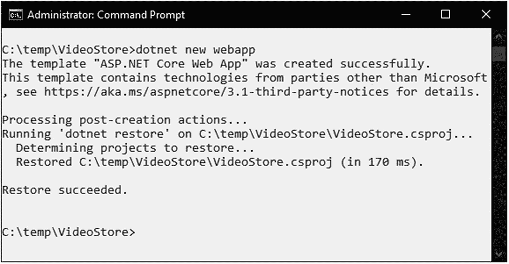

图 1-6

通过创建 Web 应用。NET CLI

如果您必须比较通过。NET CLI 与 Visual Studio 中创建的一个进行比较，您会发现它们是相同的。

那个。NET CLI 提供了一种奇妙的、快速的、跨平台的创建应用的方法。

## 添加和编辑 Razor 页面

随着您的 web 应用的运行，您会注意到，如果您单击导航菜单中的隐私链接，它将转到以下 URL: `https://localhost:44398/Privacy`。web 应用将通过单击 Privacy 链接创建的请求映射到 VideoStore 项目中的 Razor 页面。看着图 [1-7](#Fig7) ，你会在一个名为……你猜对了，pages 的文件夹中看到 Razor pages。

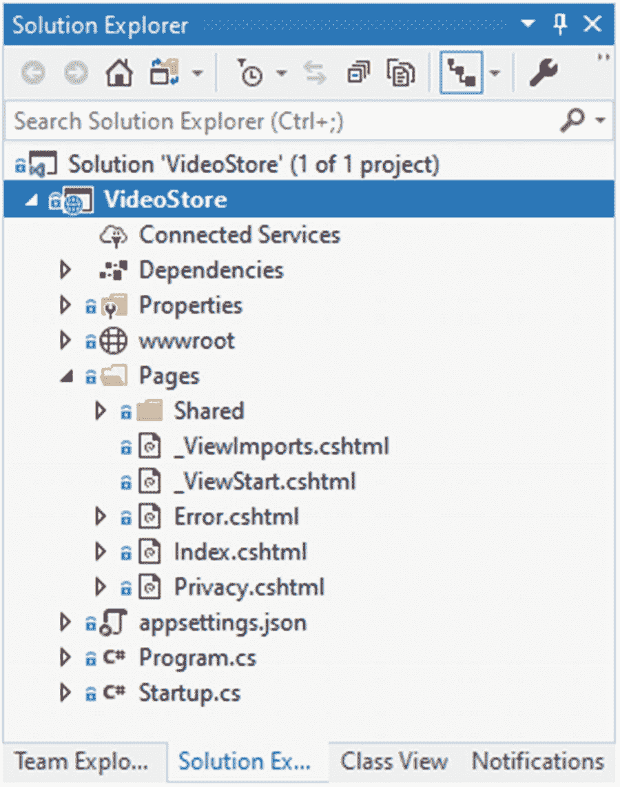

图 1-7

解决方案资源管理器中的 Razor 页面

这意味着当我在 web 应用中查看隐私页面时，ASP.NET Core 正忙于呈现 Privacy.cshtml 页面。您还会注意到，如图 [1-8](#Fig8) 所示，URL 中不需要 cshtml 扩展名。

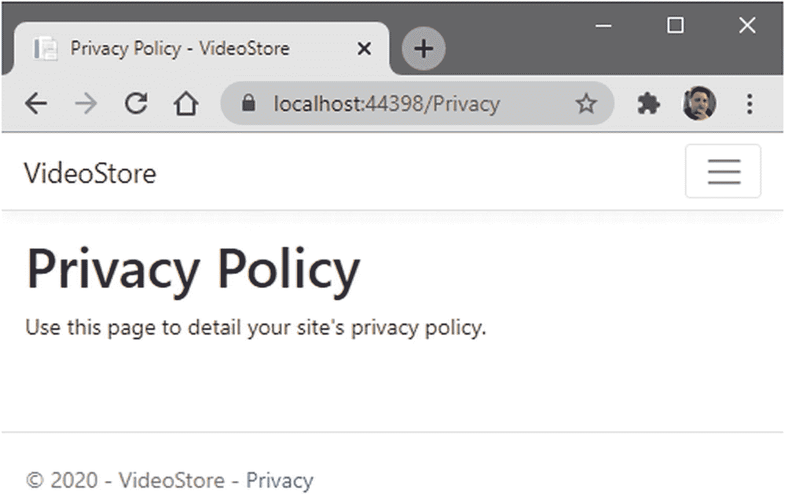

图 1-8

隐私政策页面

您还会注意到，当您缩小浏览器窗口时，菜单会折叠成汉堡包图标。这是通过 Bootstrap 实现的，默认情况下 Bootstrap 包含在项目中。

如果您现在单击 Solution Explorer 中的 Privacy.cshtml 页面，您将会看到代码清单 [1-1](#PC1) 中列出的代码。

```cs
@page
@model PrivacyModel
@{
    ViewData["Title"] = "Privacy Policy";
}
<h1>@ViewData["Title"]</h1>

<p>Use this page to detail your site's privacy policy.</p>

Listing 1-1The Privacy Razor Page

```

当您的 web 应用在没有附加调试器的情况下运行时，如果您单击汉堡包菜单图标，您将会看到我们只列出了主页和隐私两个页面。

查看图 [1-9](#Fig9) 并将其与代码清单 [1-1](#PC1) 中的代码进行比较，您可能会想知道导航的代码在哪里。

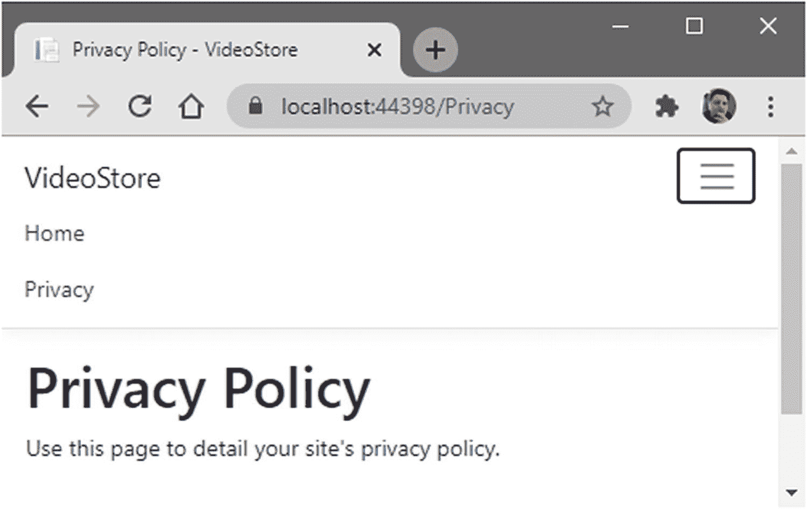

图 1-9

导航菜单

答案就在一个叫做布局页面的特殊页面里。回到您的解决方案资源管理器，展开 Pages 文件夹下的共享文件夹。在那里你会看到一个名为`_Layout.cshtml`的页面，如图 [1-10](#Fig10) 所示。

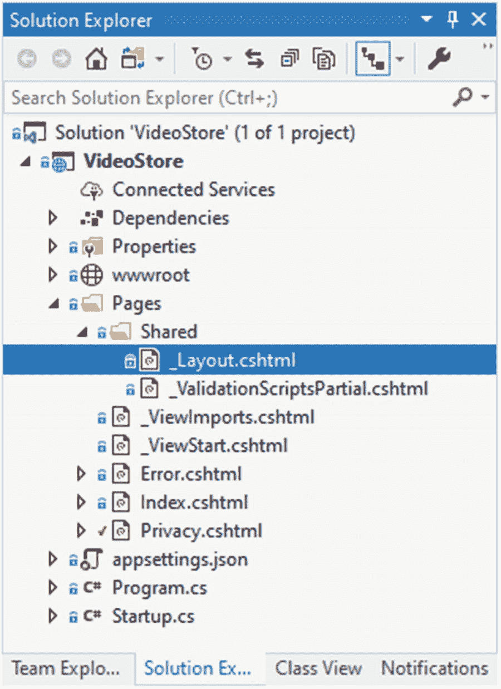

图 1-10

共享布局页面

正是这个布局页面呈现了 web 应用的`<head>`标签中的所有内容，比如到所有所需样式表的链接，以及包含导航菜单的`<header>`部分的`<body>`标签。导航菜单的代码在代码清单 [1-2](#PC2) 中列出。

```cs
<div class="navbar-collapse collapse d-sm-inline-flex flex-sm-row-reverse">
  <ul class="navbar-nav flex-grow-1">
    <li class="nav-item"><a class="nav-link text-dark" asp-area="" asp-page="/Index">Home</a></li>
    <li class="nav-item"><a class="nav-link text-dark" asp-area="" asp-page="/Privacy">Privacy</a></li>
  </ul>
</div>

Listing 1-2The Navigation Menu Code

```

继续添加另一个名为 Videos 的菜单项，向无序列表添加一个新的列表项，如代码清单 [1-3](#PC3) 所示。

```cs
<div class="navbar-collapse collapse d-sm-inline-flex flex-sm-row-reverse">
  <ul class="navbar-nav flex-grow-1">
    <li class="nav-item"><a class="nav-link text-dark" asp-area="" asp-page="/Index">Home</a></li>
    <li class="nav-item"><a class="nav-link text-dark" asp-area="" asp-page="/ Videos/List">Videos</a></li>
    <li class="nav-item"><a class="nav-link text-dark" asp-area="" asp-page="/Privacy">Privacy</a></li>
  </ul>
</div>

Listing 1-3Modified Navigation Menu Code

```

您会注意到,`asp-page`标签帮助器指定了`Videos/List`,它告诉我的 web 应用，在一个名为 Videos 的文件夹中有一个页面将显示视频列表。再次运行您的 web 应用，您将看到视频菜单项已被添加到导航菜单中(图 [1-11](#Fig11) )。

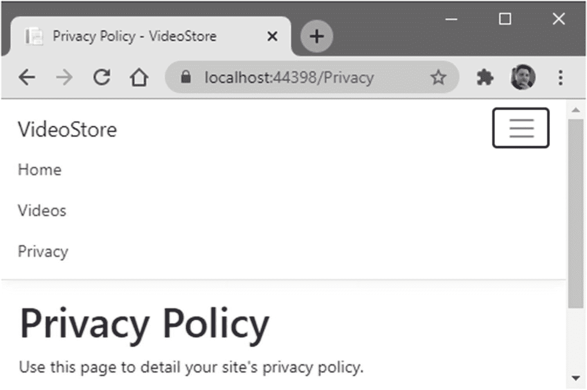

图 1-11

导航菜单已修改

如果您单击“视频”菜单项，该链接将不会导航到任何地方。这是因为我们还没有添加所需的 Razor 页面。如图 [1-12](#Fig12) 所示，在解决方案浏览器的`Pages`文件夹下添加一个新文件夹。

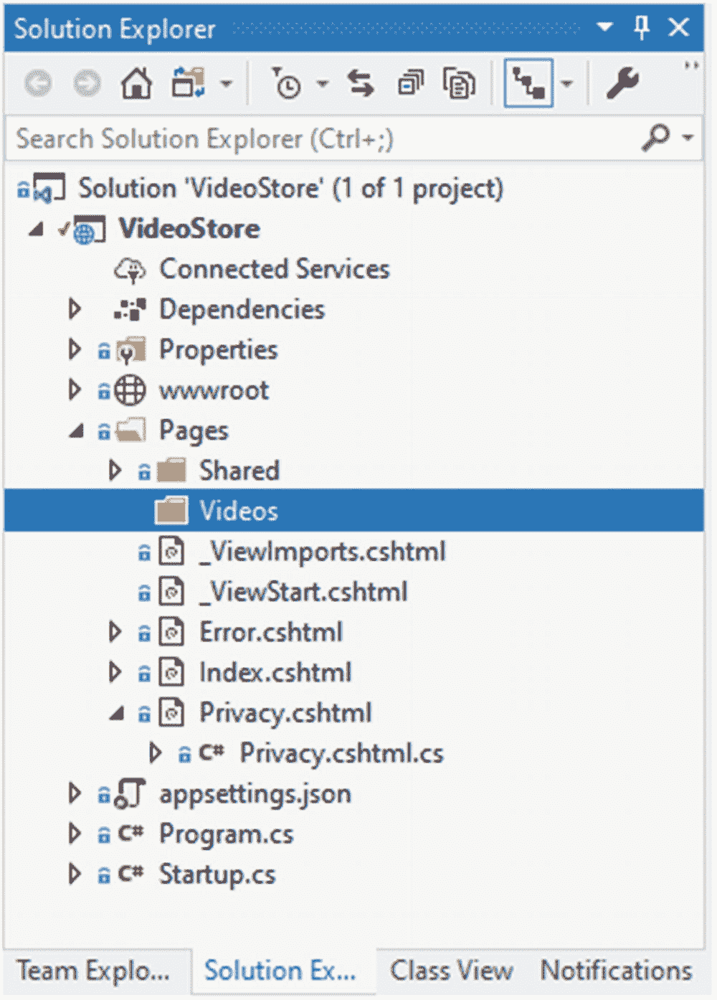

图 1-12

添加视频文件夹

接下来，右键单击 Videos 文件夹，并向该文件夹添加一个名为`List`的新 Razor 页面。这可以从上下文菜单或从如图 [1-13](#Fig13) 所示的`Add New Item`屏幕中完成。

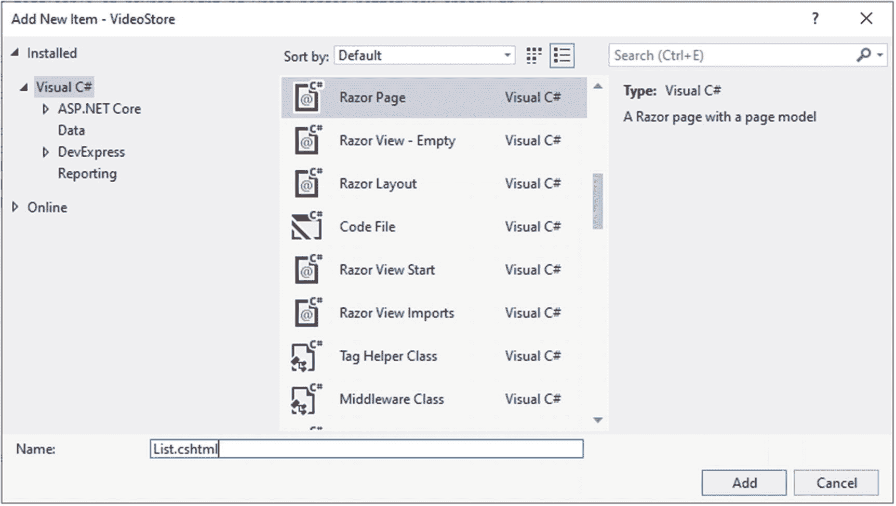

图 1-13

添加新的 Razor 页面

一旦添加了`List.cshtml`页面，您会注意到 Visual Studio 添加了第二个页面(图 [1-14](#Fig14) ),名为`List.cshtml.cs`。`List.cshtml`文件本质上是我的包含`@page`指令的 Razor 页面(代码清单 [1-4](#PC4) )。

```cs
@page
@model VideoStore.Pages.Videos.ListModel
@{
}

Listing 1-4Razor Page Code

```

此外，Razor 页面还用`@model`指令指定了一个模型。很能说明问题。包含视频信息的模型包含在类型为`ListModel`的对象中。

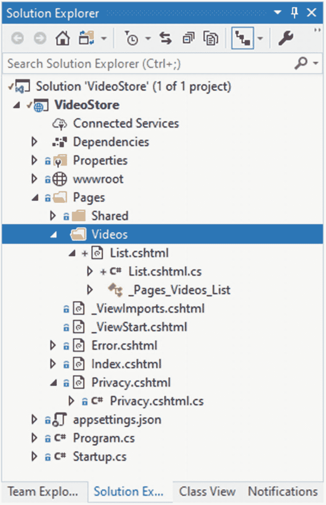

图 1-14

添加了列表页面

这个`ListModel`是嵌套在`List.cshtml`页面下的`List.cshtml.cs`文件中包含的类。查看清单 [1-5](#PC5) 中的代码清单，有趣的是注意到`ListModel`类继承自一个名为`PageModel`的抽象类。

```cs
namespace VideoStore.Pages.Videos
{
    public class ListModel : PageModel
    {
        public void OnGet()
        {
        }
    }
}

Listing 1-5The ListModel Class

```

回到 Razor 页面，继续添加一个 header 标签，给页面一个名为 Videos 的标题(清单 [1-6](#PC6) )。

```cs
@page
@model VideoStore.Pages.Videos.ListModel
@{
}

<h1>Videos</h1>

Listing 1-6The Modified Videos Razor Page

```

运行您的 Web 应用并单击视频导航菜单项，您将被带到之前在`asp-page`标签助手中定义的`Video List`页面。

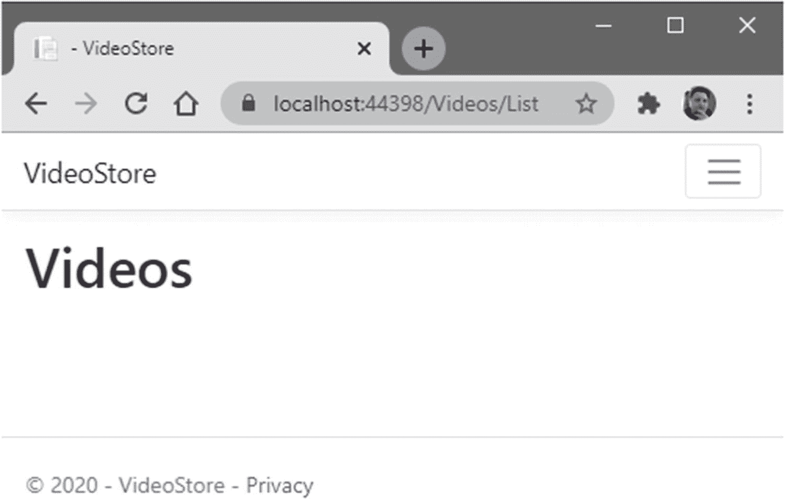

图 1-15

视频列表页面

参考图 [1-15](#Fig15) ，您会注意到浏览器正在显示视频/列表 URL。

## 查看配置

在你的 VideoStore 项目中，你会注意到一个名为`appsettings.json`的文件(图 [1-16](#Fig16) )。这是应用的配置文件，可以很容易地从 Razor 页面中引用。

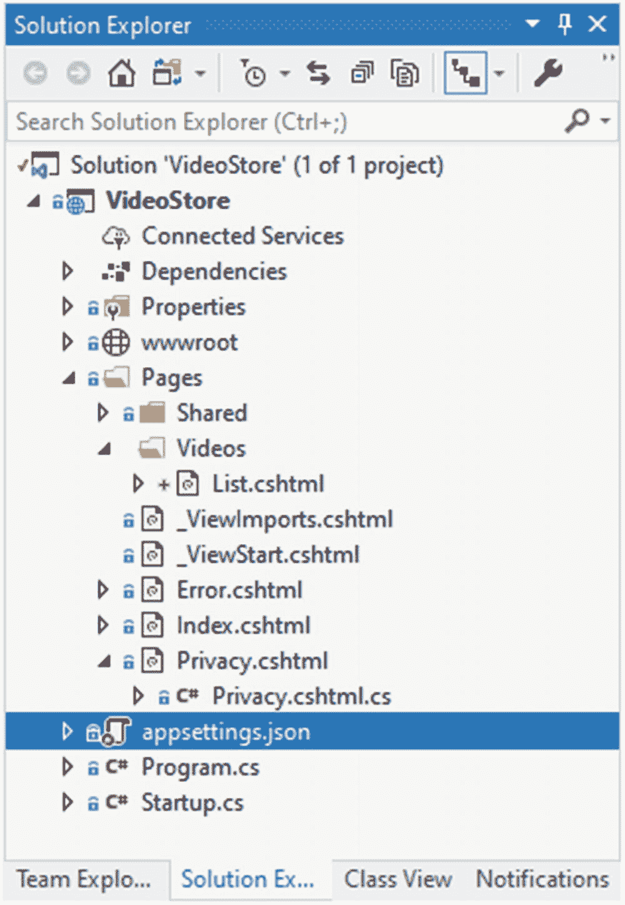

图 1-16

appsettings.json 配置文件

appsettings.json 是应用中配置的来源之一。这意味着当您的 web 应用运行时，我添加到该文件中的任何内容都可以使用。

```cs
{
  "Logging": {
    "LogLevel": {
      "Default": "Information",
      "Microsoft": "Warning",
      "Microsoft.Hosting.Lifetime": "Information"
    }
  },
  "AllowedHosts": "*"
}

Listing 1-7The appsettings.json File

```

打开文件(代码清单 [1-7](#PC7) ，您会看到它包含 JSON，我可以很容易地在这里添加额外的设置。

```cs
{
  "Logging": {
    "LogLevel": {
      "Default": "Information",
      "Microsoft": "Warning",
      "Microsoft.Hosting.Lifetime": "Information"
    }
  },
  "AllowedHosts": "*",
  "VideoListPageTitle":  "Video Store - Videos List"
}

Listing 1-8Modified appsettings.json File

```

通过添加一个值为`Video Store - Videos List`的`VideoListPageTitle`属性来修改`appsettings.json`文件，如清单 [1-8](#PC8) 所示。为了在我的 Razor 页面上显示`VideoListPageTitle`属性，我需要修改我的`ListModel`类。

Razor 页面只关心显示数据。ListModel 类负责获取显示在 Razor 页面上所需的数据。

如果你回头看看代码清单 [1-5](#PC5) ，你会注意到`ListModel`类指定了一个`public void OnGet()`方法。正是这个方法将响应`HTTP GET`的请求，在这里我们将稍微修改一下代码，从配置文件中获取页面标题的数据。

为了获得配置文件中的设置，我们需要通过向`ListModel`构造函数传递一个类型为`IConfiguration`的参数，将这个配置文件暴露给我们的`ListModel`类。继续修改您的 ListModel 类，如代码清单 [1-9](#PC9) 所示。

```cs
public class ListModel : PageModel
{
    private readonly IConfiguration _config;

    public string PageTitle { get; set; }

    public ListModel(IConfiguration config)
    {
        _config = config;
    }

    public void OnGet()
    {
        PageTitle = _config["VideoListPageTitle"];
    }
}

Listing 1-9The Modified ListModel Class

```

您会注意到我添加了一个构造函数，它接受一个类型为`IConfiguration`的参数、一个名为`_config`的私有字段以及一个名为`PageTitle`的属性。

你可能需要引进微软。using 语句中的. Configuration 命名空间引用 IConfiguration。

然后，在`OnGet`方法中，我可以简单地通过引用在代码清单 [1-8](#PC8) 中添加到配置文件中的属性`VideoListPageTitle`来获取存储在配置文件中的值。

因为我的`ListModel`类公开了在`OnGet`方法中设置的`PageTitle`属性，所以我可以通过使用`@Model`在我的 Razor 页面上轻松获取这个值(注意大写的 M)。

```cs
@page
@model VideoStore.Pages.Videos.ListModel
@{
}

<h1>@Model.PageTitle</h1>

Listing 1-10Displaying the PageTitle on the Razor Page

```

如代码清单 [1-10](#PC10) 所示，当我在键入`@Model`后点一下时，我会看到在 Visual Studio 的智能感知中显示的`PageTitle`属性。

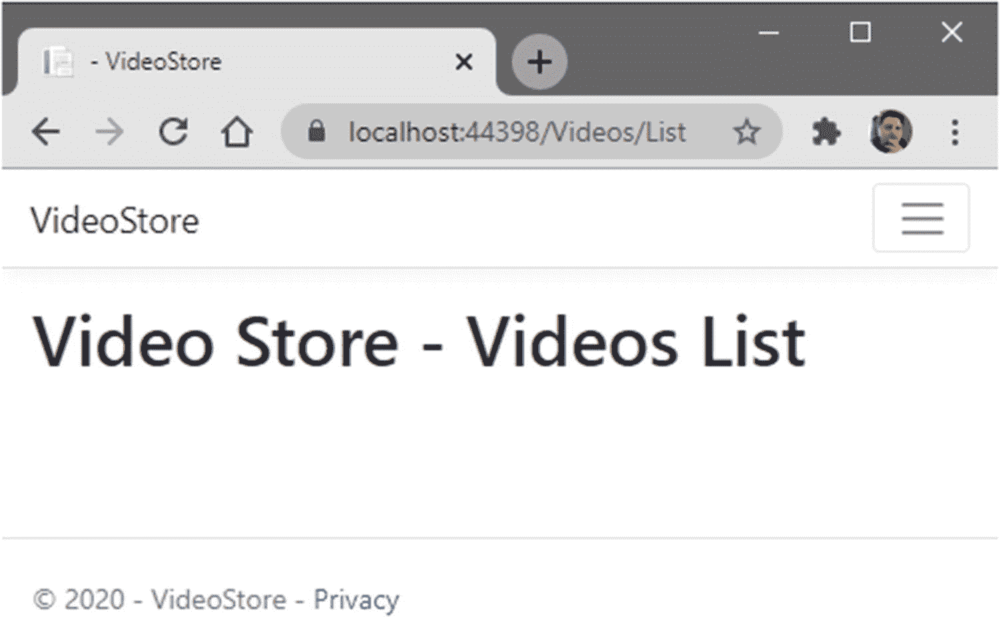

图 1-17

显示的视频列表页面标题

运行 web 应用并导航到视频页面，您将看到我们在配置文件中设置的页面标题(图 [1-17](#Fig17) )。

## 使用实体

为了解释实体的概念，我们需要理解什么是实体。我们的`Videos/List`页面现在已经创建，并将用于显示视频列表，但我们需要一种方法来准确定义视频是什么。这本质上就是实体的工作。

要在我们的 web 应用中分离不同的应用关注点，可以通过右键单击解决方案并从上下文菜单中选择`Add, New Project`向解决方案添加一个新项目。

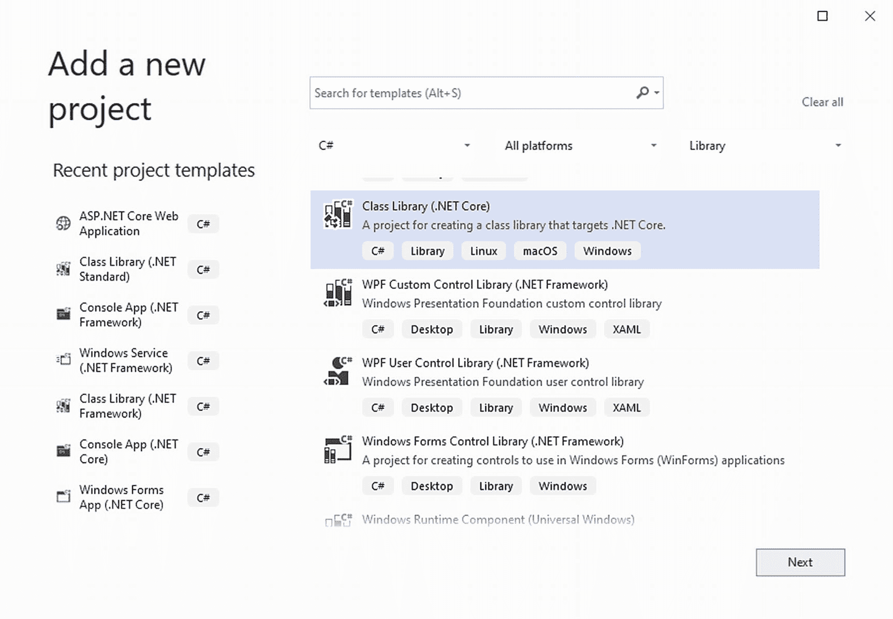

图 1-18

添加新项目

然后你会看到弹出的添加新项目窗口(图 [1-18](#Fig18) )。从项目模板列表中选择一个. NET 核心类库，点击`Next`按钮。

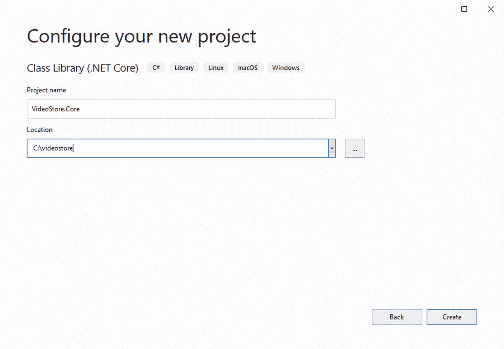

图 1-19

添加. NET 核心类库

调用项目`VideoStore.Core`，点击`Create`按钮(图 [1-19](#Fig19) )。这个项目将包含代表我们的 VideoStore 应用核心的类。因此，这个项目将包含诸如我们需要使用的实体之类的东西。

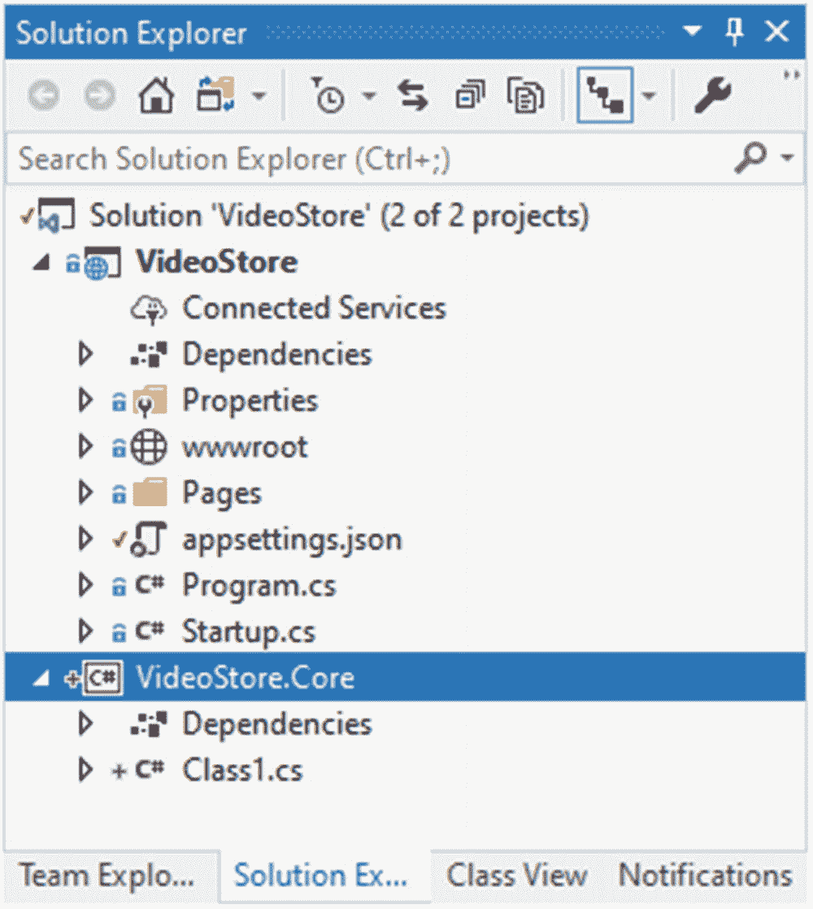

图 1-20

音像店。核心项目

添加这个项目后，你会注意到图 [1-20](#Fig20) 中类名默认为`Class1.cs`。因为我们的项目与视频有关，我们将这个类重命名为`Video.cs`(单数)，如清单 [1-11](#PC11) 所示。

```cs
namespace VideoStore.Core
{
    public class Video
    {
    }
}

Listing 1-11The Video Class

```

我们现在有了一个实体来准确定义视频的样子。让我们给 Video 类添加一些属性来定义它的外观。这些可以在代码清单 [1-12](#PC12) 中看到。

您可以添加任意多的属性，但是为了简单起见，我将只添加一组基本的属性来定义我们的视频类。

```cs
namespace VideoStore.Core
{
    public class Video
    {
        public int Id { get; set; }
        public string Title { get; set; }
        public DateTime ReleaseDate { get; set; }
    }
}

Listing 1-12The Video Class Properties

```

我还想添加一个文件来定义不同的电影类型。这个文件将被称为`MovieGenre.cs`，并将包含一个`enum`，如代码清单 [1-13](#PC13) 所示。

```cs
namespace VideoStore.Core
{
    public enum MovieGenre
    {
        None,
        Action,
        Romance,
        Drama,
        Horror
    }
}

Listing 1-13The MovieGenre enum

```

您的解决方案现在应该如图 [1-21](#Fig21) 所示。

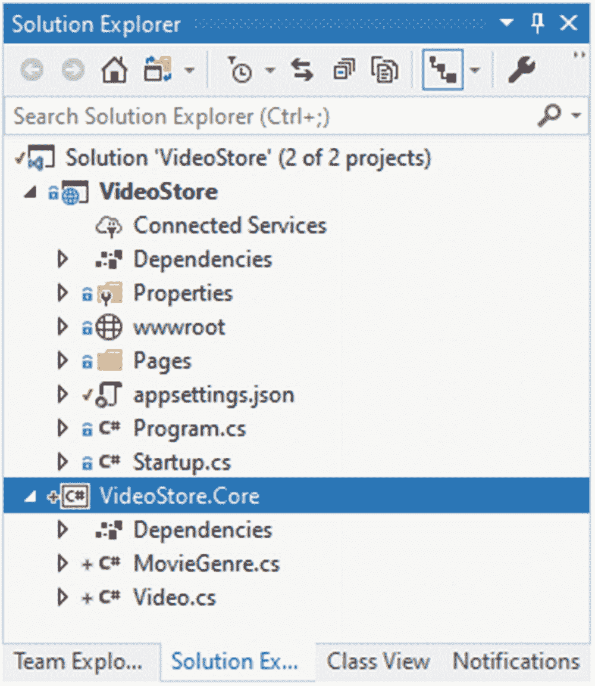

图 1-21

音像店。核心项目

我们现在想引用视频类中的`MovieGenre enum`。如代码清单 [1-14](#PC14) 所示，通过添加类型`MovieGenre`的属性来实现。

```cs
namespace VideoStore.Core
{
    public class Video
    {
        public int Id { get; set; }
        public string Title { get; set; }
        public DateTime ReleaseDate { get; set; }
        public MovieGenre Genre { get; set; }
    }
}

Listing 1-14The Video Entity with a Property of Type MovieGenre

```

这个视频类或实体现在表示我们将在 web 应用中使用的视频数据。它完全定义了视频应该是什么样子。

## 创建和注册数据服务

我们现在要设置在网页上显示视频数据所需的代码。为此，我们将创建一个数据服务，但是在这一点上，我不想经历所有的步骤来将 SQL 添加到项目中(至少现在还不想)。

现在，我们将只是添加代码来显示测试数据，并且，通过这样做，允许我们获得为我们的 web 应用创建的所有其他代码。这个测试数据将以这样一种方式创建，当 web 应用的所有部分都完成后，它将允许我们轻松地将测试数据替换为真实数据。

正是在这里，您将看到接口是如何让我们实现这一点的。和以前一样，为了分离应用内部的关注点，我们将添加另一个。NET 核心类库项目到我们名为`VideoStore.Data`的解决方案中，并将默认的`Class1.cs`文件重命名为`TestData.cs`，如图 [1-22](#Fig22) 所示。

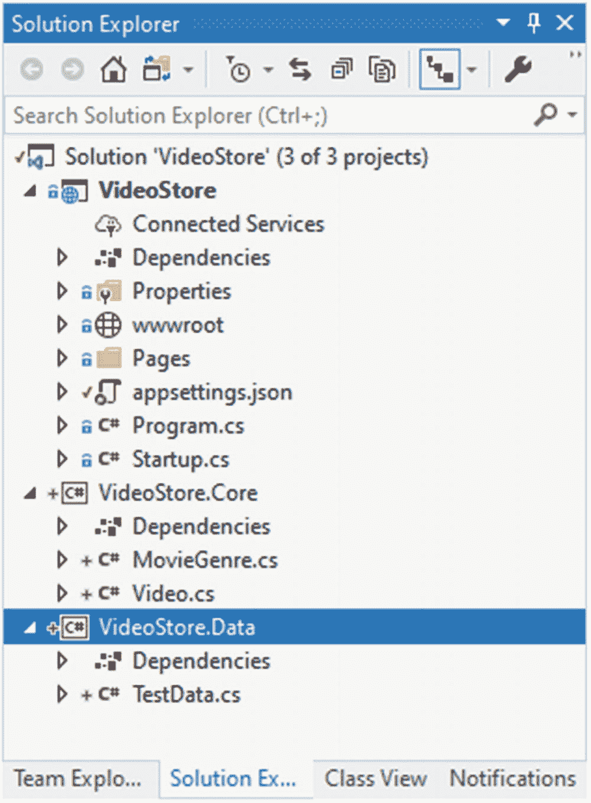

图 1-22

音像店。数据项目

接下来，通过右键单击您的项目并从上下文菜单中选择`Add, New Item`，向您的`VideoStore.Data`项目添加一个接口。

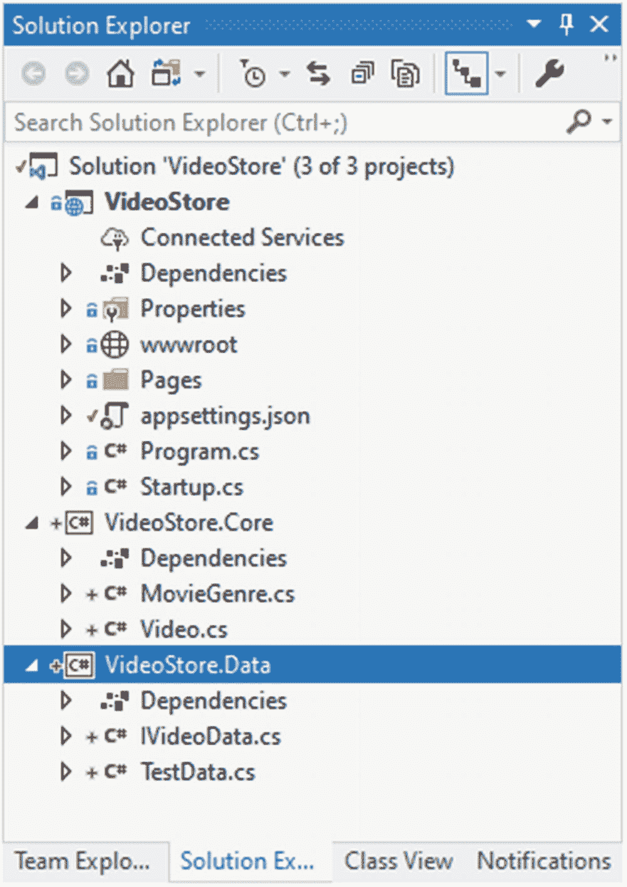

图 1-23

音像店。带有 IVideoData 接口的数据项目

我们的`IVideoData`接口将告诉我们的 web 应用在我们的数据服务中需要实现什么方法(图 [1-23](#Fig23) )。由`TestData`类提供接口的实现，这允许我们稍后将`TestData`与实际数据分开。

打开`IVideoData`接口，添加一个方法(列表 [1-15](#PC15) )将视频列表返回到我们的页面。值得注意的是，界面并没有告诉我们如何做某事，而只是告诉我们做什么。将由实现该接口的类(在本例中是`TestData`类)来决定数据如何返回。

```cs
namespace VideoStore.Data
{
    public interface IVideoData
    {
        IEnumerable<Video> ListVideos();
    }
}

Listing 1-15The IVideoData Interface

```

转到`TestData`类，通过在类名后添加接口名来实现`IVideoData`接口。如下实现接口后，`public class TestData : IVideoData`，注意 Visual Studio 是如何用一条红色曲线提示您实现接口方法的。

您必须添加一个对视频商店的引用。引用视频实体的核心项目。

如前所述，TestData 类将只包含允许我们创建 web 应用的测试数据。出于这个原因，我将添加一些硬编码的数据来模拟我们的 web 应用中的视频。参考代码清单 [1-16](#PC16) 查看`IVideoData`接口的完整实现。

```cs
namespace VideoStore.Data
{
    public class TestData : IVideoData
    {
        List<Video> _videoList;
        public TestData()
        {
            _videoList = new List<Video>()
            {
                new Video { Id = 1, Title = "Movie Title 1", ReleaseDate = new DateTime(2018, 1, 21), Genre = MovieGenre.Action },
                new Video { Id = 2, Title = "Movie Title 2", ReleaseDate = new DateTime(2019, 7, 2), Genre = MovieGenre.Drama },
                new Video { Id = 3, Title = "Movie Title 3", ReleaseDate = new DateTime(2020, 2, 14), Genre = MovieGenre.Romance }
            };
        }
        public IEnumerable<Video> ListVideos() => _videoList.OrderBy(x => x.Title);
    }
}

Listing 1-16The TestData Class that Implements IVideoData

```

下一步是在我们的 Razor 页面中显示这些数据。现在我将引用接口，而不是直接引用数据。引用接口将允许我在以后准备好使用 SQL Server 数据库时换出数据源。

为此，我们需要打开`VideoStore`项目中的`Startup.cs`文件，并寻找一个名为`ConfigureServices`的方法(清单 [1-17](#PC17) )。ASP.NET Core 使用这种方法来确定您的 web 应用将需要的所有服务。在这里，我可以通知我的 web 应用关于我的`IVideoData`接口，并告诉它无论何时我想要一个`IVideoData`的对象，它都应该为我提供我的`TestData`。

```cs
public void ConfigureServices(IServiceCollection services)
{
    _ = services.AddRazorPages();
}

Listing 1-17The ConfigureServices Method

```

为此，我需要修改`ConfigureServices`方法，并告诉服务集合，每当我的 web 应用中的页面或组件需要`IVideoData`时，就给它一个`TestData`类。

您需要添加一个对视频商店的引用。数据项目。还要注意清单 [1-17](#PC17) 中丢弃的使用。当您的方法返回值，但您不打算使用该值时，下划线用于表示放弃。在清单 [1-17](#PC17) 中，AddRazorPages 返回一个 IMvcBuilder，但是我没有使用它来进一步配置 MVC 服务。

为此，我通过修改代码来添加我的 TestData 服务的作用域实例，如代码清单 [1-18](#PC18) 所示。顺便说一下，`ConfigureServices`方法用于注册应用所需的服务。然后，ASP.NET Core 使用内置的依赖注入框架，使这些服务在整个 web 应用中可用。要了解更多关于 ASP.NET 内核中依赖注入的内容，请看以下链接: [`https://docs.microsoft.com/en-us/aspnet/core/fundamentals/dependency-injection`](https://docs.microsoft.com/en-us/aspnet/core/fundamentals/dependency-injection) 。

```cs
public void ConfigureServices(IServiceCollection services)
{
    _ = services.AddScoped<IVideoData, TestData>();
    _ = services.AddRazorPages();
}

Listing 1-18Modified ConfigureServices Method

```

现在我已经注册了我的服务，我可以通过修改构造函数将它注入到我的`ListModel`类中。让我们看看接下来该怎么做。

## 在网页上显示测试数据

为了使用我的 ListModel 类中的数据服务，我可以使用依赖注入将我的服务注入到构造函数中。您应该还记得，我们之前在从`appsettings.json`文件中提取值时注入了`IConfiguration`服务。

首先在`List.cshtml.cs`文件中添加一个对`VideoStore.Data`项目的引用。接下来，在构造函数中注入`IVideoData`服务，并将其传递给一个名为`_videoData`的私有字段。你的代码应该如代码清单 [1-19](#PC19) 所示。

```cs
namespace VideoStore.Pages.Videos
{
    public class ListModel : PageModel
    {
        private readonly IConfiguration _config;
        private readonly IVideoData _videoData;

        public string PageTitle { get; set; }

        public ListModel(IConfiguration config, IVideoData videoData)
        {
            _config = config;
            _videoData = videoData;
        }
        public void OnGet()
        {
            PageTitle = _config["VideoListPageTitle"];
        }
    }
}

Listing 1-19Modified ListModel Class

```

`ListModel`类现在可以使用我们注入的服务来构建显示在 Razor 页面上所需的数据。然后，我的 Razor 页面可以使用`ListModel`上的公共属性来提取数据并将其呈现在 web 页面上(与我们从`appsettings.json`文件中公开`PageTitle`的方式相同)。

我们需要在`ListModel`上完成的最后两步是添加一个公共属性来将视频数据暴露给 Razor 页面，并在 OnGet 方法中添加代码来设置该属性。

继续修改您的`ListModel`类，如代码清单 [1-20](#PC20) 所示。我特意在这里添加了完整的代码文件，这样你就可以看到对`VideoStore.Core`和`VideoStore.Data`项目的使用声明。

```cs
using Microsoft.AspNetCore.Mvc.RazorPages;
using Microsoft.Extensions.Configuration;
using System.Collections.Generic;
using VideoStore.Core;
using VideoStore.Data;

namespace VideoStore.Pages.Videos
{
    public class ListModel : PageModel
    {
        private readonly IConfiguration _config;
        private readonly IVideoData _videoData;

        public string PageTitle { get; set; }
        public IEnumerable<Video> Videos { get; set; }

        public ListModel(IConfiguration config, IVideoData videoData)
        {
            _config = config;
            _videoData = videoData;
        }
        public void OnGet()
        {
            PageTitle = _config["VideoListPageTitle"];
            Videos = _videoData.ListVideos();
        }
    }
}

Listing 1-20Exposing the Video Data via a Property

```

剩下我们要做的就是修改 Razor 页面，在网页上显示视频列表。例如，Razor pages 的伟大之处在于，我可以将标记与 C# 混合使用，并使用它来循环集合。我所需要做的就是使用`@`符号在常规 HTML 标记和 C# 之间切换。

代码清单 [1-21](#PC21) 中展示的代码使用 C# `foreach`语句遍历我的测试数据源中的视频集合，并将其输出到 Razor 页面。

```cs
@page
@model VideoStore.Pages.Videos.ListModel
@{
}

<h1>@Model.PageTitle</h1>

<div class="container-fluid">
    <div class="row">
        <div class="col-md-4">
            Title
        </div>
        <div class="col-md-4">
            Release Date
        </div>
        <div class="col-md-4">
            Genre
        </div>
    </div>
    @foreach (var video in Model.Videos)
    {
        <div class="row">
            <div class="col-md-4">
                @video.Title
            </div>
            <div class="col-md-4">
                @video.ReleaseDate.ToShortDateString()
            </div>
            <div class="col-md-4">
                @video.Genre
            </div>
        </div>
    }
</div>

Listing 1-21The Razor Page Markup and C#

```

当我保存我所有的工作并运行 web 应用时，我将会看到所有的测试数据都显示在我的网页上(图 [1-24](#Fig24) )。

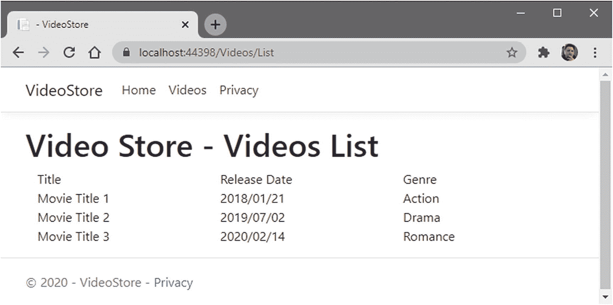

图 1-24

显示在视频列表页面上的测试数据

目前，这是完美的。当我继续开发我的 web 应用时，我可以继续使用这些测试数据。当一切都完成后，我可以通过`IVideoData`抽象交换出数据服务，并从我的测试数据切换到实际的 SQL 数据。