# 二、创建模型

在前一章中，我们创建了将测试数据拉至视频列表表单的逻辑。测试数据只包含三个条目。作为测试数据，几乎不需要添加大量的测试数据，除非您想测试页面的响应性或速度。

因此，一件非常重要的事情是为我们的视频列表表单添加搜索功能。这将允许用户通过一些或其他特定的搜索查询来过滤列表。

## 构建搜索表单

我将在这个应用中使用字体真棒图标，所以请确保你有这些设置。如果你还没有设置字体 Awesome，或者想使用一个不同的图标集，请随意这样做(这意味着你可以跳过下一节)。对于那些想使用字体 Awesome 的人，或者还没有在应用中包含图标集的人，接下来让我们看看如何做。

### 添加字体真棒

给你的应用添加字体图标最快的方法是使用 CDN 嵌入代码。将您的浏览器指向 [`https://fontawesome.com/start`](https://fontawesome.com/start) ，使用您的电子邮件地址生成一个字体套件。

当您收到确认电子邮件时，请验证您的帐户，然后您将被带到您的套件代码。套件代码将类似于代码清单 [2-1](#PC1) 中的代码。

```cs
<script src="https://kit.fontawesome.com/fec344983.js" crossorigin="anonymous"></script>

Listing 2-1The Font Awesome Kit Code

```

复制这个脚本标签，并将其添加到脚本部分的末尾，就在`_Layout.cshtml`文件中的`@RenderSection`的上方。

将它添加到脚本部分后，your _Layout.cshtml 页面应该如代码清单 [2-2](#PC2) 所示。

```cs
<footer class="border-top footer text-muted">
  <div class="container">
    &copy; 2020 - VideoStore - <a asp-area="" asp-page="/Privacy">Privacy</a>
  </div>
</footer>

<script src="~/lib/jquery/dist/jquery.min.js"></script>
<script src="~/lib/bootstrap/dist/js/bootstrap.bundle.min.js"></script>
<script src="~/js/site.js" asp-append-version="true"></script>

<script src="https://kit.fontawesome.com/fec344983.js" crossorigin="anonymous"></script>

@RenderSection("Scripts", required: false)

Listing 2-2Adding the Kit Code to Your Scripts Section

```

这就是在你的 web 应用中使用字体图标所需要做的一切。

### 添加搜索表单代码

打开 List.cshtml 页面，查看其中包含的 html 标记。你应该还记得第 [1](1.html) 章，在这里我们添加了与标记混合的 C# 代码，以生成测试数据中包含的视频的网格布局。

因为该页面列出了我们视频商店中的所有视频，所以向该页面添加搜索功能是有意义的。我们将要添加的代码如代码清单 [2-3](#PC3) 所示。

```cs
<form method="get">
    <div class="form-group">
        <div class="input-group">
            <input type="search" class="form-control" value="" />
            <button class="btn btn-group">
                <i class="fas fa-search"></i>
            </button>
        </div>
    </div>
</form>

Listing 2-3The Search Form Code

```

让我们更仔细地看看这段代码，并详细说明一下我们到底在做什么。在其最基本的版本中，搜索表单是通过在网页中添加`<form></form>`元素来定义的。该表单将向呈现搜索表单的同一个页面发送一个 HTTP GET 请求。您可以通过向`<form>`元素添加附加信息来控制这种行为。如果您想更改目的地，您可以向`<form>`元素添加一个`action`属性。既然我们想留在这个页面上，我们可以省略`action`属性。

您还会注意到我们向这个表单添加了一个`method`属性。这告诉页面我们正在做一个`GET`请求，当我们在搜索的时候这总是正确的。如果我们想修改数据，我们会在表单上使用`method="post"`，但这不是我们想要在搜索表单中做的事情。在将您的`<form>`标记添加到您的`List.cshtml`页面之后，该标记应该如代码清单 [2-4](#PC4) 所示。

```cs
@page
@model VideoStore.Pages.Videos.ListModel
@{
}

<h1>@Model.PageTitle</h1>

<form method="get">
    <div class="form-group">
        <div class="input-group">
            <input type="search" class="form-control" value="" />
            <button class="btn btn-group">
                <i class="fas fa-search"></i>
            </button>
        </div>
    </div>
</form>

<div class="container-fluid">
    <div class="row">
        <div class="col-md-4">
            Title
        </div>
        <div class="col-md-4">
            Release Date
        </div>
        <div class="col-md-4">
            Genre
        </div>
    </div>
    @foreach (var video in Model.Videos)
    {
        <div class="row">
            <div class="col-md-4">
                @video.Title
            </div>
            <div class="col-md-4">
                @video.ReleaseDate.ToShortDateString()
            </div>
            <div class="col-md-4">
                @video.Genre
            </div>
        </div>
    }
</div>

Listing 2-4Adding the Form to the List.cshtml Page

```

运行您的 web 应用，您将看到搜索表单(图 [2-1](#Fig1) )呈现在电影列表上方，字体 Awesome 图标显示在文本输入旁边。

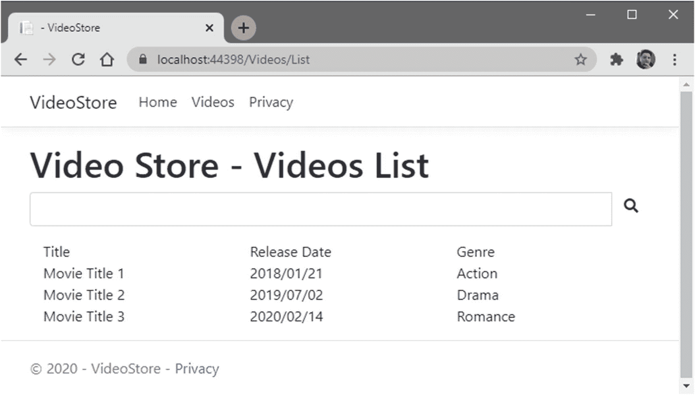

图 2-1

搜索表单

我们需要做的下一个任务是添加逻辑，根据我们在文本输入中输入的搜索词来查找视频。让我们开始下一个。

## 实现查找逻辑

为了在 find 输入中实现一个搜索词，我们需要稍微修改一下我们的数据服务。我们希望向数据服务传递网页用户想要搜索的标题的字符串值。这意味着我们需要从`IVideoData`接口开始。

我们想告诉大家，无论什么数据服务实现了这个接口，它都应该允许在`ListVideos`方法中传递一个字符串值，如代码清单 [2-5](#PC5) 所示。

```cs
namespace VideoStore.Data
{
    public interface IVideoData
    {
        IEnumerable<Video> ListVideos(string title);
    }
}

Listing 2-5The Modified IVideoData Interface

```

如果我们修改了接口，我们需要将更改应用到实现该接口的类中。切换到`TestData`类，改变`ListVideos`方法，如代码清单 [2-6](#PC6) 所示。

```cs
public IEnumerable<Video> ListVideos(string title = null) => _videoList
            .Where(x => string.IsNullOrEmpty(title)
            || x.Title.StartsWith(title))
            .OrderBy(x => x.Title);

Listing 2-6The Modified TestData Method

```

您可以看到 title 参数已经成为可选参数。这意味着我们需要在`Where`子句中考虑空字符串值。我还在我们的测试数据中添加了更多合适的电影名称。这样，完整的 TestData 类现在看起来如代码清单 [2-7](#PC7) 所示。

```cs
namespace VideoStore.Data
{
    public class TestData : IVideoData
    {
        List<Video> _videoList;
        public TestData()
        {
            _videoList = new List<Video>()
            {
                new Video { Id = 1, Title = "Sound of the Seven Seas", ReleaseDate = new DateTime(2018, 1, 21), Genre = MovieGenre.Action },
                new Video { Id = 2, Title = "A Day in the Sun", ReleaseDate = new DateTime(2019, 7, 2), Genre = MovieGenre.Drama },
                new Video { Id = 3, Title = "Wonders of the Universe", ReleaseDate = new DateTime(2020, 2, 14), Genre = MovieGenre.Romance }
            };
        }
        public IEnumerable<Video> ListVideos(string title = null) => _videoList
            .Where(x => string.IsNullOrEmpty(title)
            || x.Title.StartsWith(title))
            .OrderBy(x => x.Title);
    }
}

Listing 2-7The TestData Class

```

我们需要做的最后一件事是告诉搜索表单这个搜索查询可能会被输入到搜索表单中。我们通过`input`元素上的`name`属性来实现这一点。所以转回到`List.cshtml`文件，修改`<form>`元素，如代码清单 [2-8](#PC8) 所示。

```cs
<form method="get">
    <div class="form-group">
        <div class="input-group">
            <input type="search"
                   class="form-control"
                   value=""
                   name="searchQuery"/>
            <button class="btn btn-group">
                <i class="fas fa-search"></i>
            </button>
        </div>
    </div>
</form>

Listing 2-8The Modified Search Form

```

您会注意到我已经将`name="searchQuery"`添加到了`input`元素中。我们需要修改的最后一段代码是`List.cshtml.cs`文件的`OnGet`方法，如代码清单 [2-9](#PC9) 所示。

```cs
public void OnGet(string searchQuery)
{
    PageTitle = _config["VideoListPageTitle"];
    Videos = _videoData.ListVideos(searchQuery);
}

Listing 2-9Modified OnGet Method

```

有趣的是，传递给`OnGet`方法的字符串参数名称必须与代码清单 [2-8](#PC8) 中`input`元素的`name`属性中的值相匹配。这意味着如果我在搜索表单中指定了`name="searchQuery"`，那么我还需要在 cs 文件中指定`public void OnGet(string searchQuery)`。

通过我们称之为模型绑定的东西，ASP.NET Core 将查看`OnGet`方法中的参数名。然后，它会尝试在提交的表单值、查询字符串以及 HTTP 头中找到名为`searchQuery`的东西。然后它将这个值传递给我们的`_videoData.ListVideos`数据服务方法。如果没有找到`searchQuery`的值，ASP.NET Core 将简单地传递一个空值。

## 使用模型绑定和标签助手

让我们看看模型绑定是如何帮助我们使代码更容易使用的。无论何时调用`OnGet`方法，都是用户点击页面链接的结果。该页面只是执行一个 HTTP GET 请求。

当用户提供一个搜索查询时(参见清单 [2-10](#PC10) ，这被认为是一个输入模型，因为它是用户提供给页面的一个值。因此，可以有把握地说，`PageTitle`和`Videos`的属性被认为是输出模型。

```cs
public class ListModel : PageModel
{
    private readonly IConfiguration _config;
    private readonly IVideoData _videoData;

    public string PageTitle { get; set; }
    public IEnumerable<Video> Videos { get; set; }

    public ListModel(IConfiguration config, IVideoData videoData)
    {
        _config = config;
        _videoData = videoData;
    }
    public void OnGet(string searchQuery)
    {
        PageTitle = _config["VideoListPageTitle"];
        Videos = _videoData.ListVideos(searchQuery);
    }
}

Listing 2-10The List.cshtml.cs Page

```

输出模型允许我绑定到返回的数据，例如，在代码清单 [2-4](#PC4) 中看到的`foreach`循环中。仔细查看表单的标记(清单 [2-11](#PC11) ，您会注意到`value`属性是空的。

```cs
<form method="get">
    <div class="form-group">
        <div class="input-group">
            <input type="search"
                   class="form-control"
                   value=""
                   name="searchQuery"/>
            <button class="btn btn-group">
                <i class="fas fa-search"></i>
            </button>
        </div>
    </div>
</form>

Listing 2-11The Search Form Markup

```

这意味着每当用户输入一个搜索查询时(图 [2-2](#Fig2) ，文本输入将被清除，因为没有设置`value`属性。模型绑定可以在这里帮助我们。

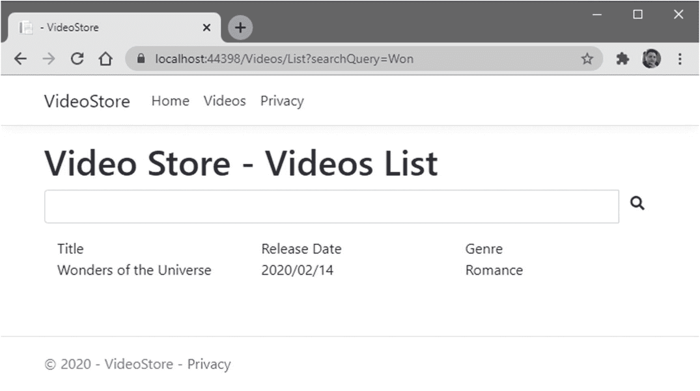

图 2-2

从搜索词返回的视频

如果我可以在页面上有一个属性作为输入和输出模型会怎么样？一些将接受数据以及显示数据的页面。事实证明，有一个特殊的属性可以用来控制这一点。我们将需要稍微改变我们的视频列表页面的代码。这些是我们需要做出的改变:

*   为 Microsoft.AspNetCore.Mvc 添加 using 语句。

*   创建一个名为`SearchQuery`的属性，添加一个名为 BindProperty 的属性，并将`SupportsGet`的 BinderType 参数设置为`true`。

*   更改`OnGet`方法，删除`searchQuery`参数，并将`SearchQuery`属性传递给数据服务。

视频列表页面的代码现在将如代码清单 [2-12](#PC12) 所示。

```cs
using Microsoft.AspNetCore.Mvc;
using Microsoft.AspNetCore.Mvc.RazorPages;
using Microsoft.Extensions.Configuration;
using System.Collections.Generic;
using VideoStore.Core;
using VideoStore.Data;

namespace VideoStore.Pages.Videos
{
    public class ListModel : PageModel
    {
        private readonly IConfiguration _config;
        private readonly IVideoData _videoData;

        public string PageTitle { get; set; }
        public IEnumerable<Video> Videos { get; set; }

        [BindProperty(SupportsGet = true)]
        public string SearchQuery { get; set; }

        public ListModel(IConfiguration config, IVideoData videoData)
        {
            _config = config;
            _videoData = videoData;
        }
        public void OnGet()
        {
            PageTitle = _config["VideoListPageTitle"];
            Videos = _videoData.ListVideos(SearchQuery);
        }
    }
}

Listing 2-12The Modified List.cshtml.cs Page

```

查看`SearchQuery`属性，您会注意到已经添加的名为`BindProperty`的属性。这告诉 ASP.NET Core,`SearchQuery`属性必须充当输入和输出模型。这意味着每当页面处理一个 HTTP 请求时，`SearchQuery`属性将从该请求中获得信息。

ASP.NET Core 的默认动作是在 HTTP POST 操作中将信息绑定到`SearchQuery`属性。然而，我们的页面不是在做 POST，而是在做 GET。因此，我们必须告诉它在 GET 操作期间将信息绑定到`SearchQuery`属性。

将`SupportsGet = true`添加到`BindProperty`属性中就是这样做的。这留给我们最后一件事要做，那就是修改`<form>`标记。

```cs
<form method="get">
    <div class="form-group">
        <div class="input-group">
            <input type="search"
                   class="form-control"
                   asp-for="SearchQuery"/>
            <button class="btn btn-group">
                <i class="fas fa-search"></i>
            </button>
        </div>
    </div>
</form>

Listing 2-13The Modified Form Markup

```

如代码清单 [2-13](#PC13) 所示，`<input>`元素上的`name`和`value`属性已经被替换为一个名为`asp-for`的标签助手。这个标签助手与 ASP.NET Core 和模型绑定一起工作。`asp-for`标签助手告诉页面，输入到这个输入中的文本是针对属性`SearchQuery`的。

值得注意的是，标记助手已经假设我正在使用我的`ListModel`页面的一个实例。正是由于这个原因，我可以引用`SearchQuery`属性而不用`Model`作为前缀。

我的`ListModel`也继承了抽象类`PageModel`。你可以在 List.cshtml.cs 页面的类定义`public class ListModel : PageModel`中看到这一点。正是由于这个原因，您可以在`asp-for`标签帮助器中看到`PageModel`类的所有属性(图 [2-3](#Fig3) )。

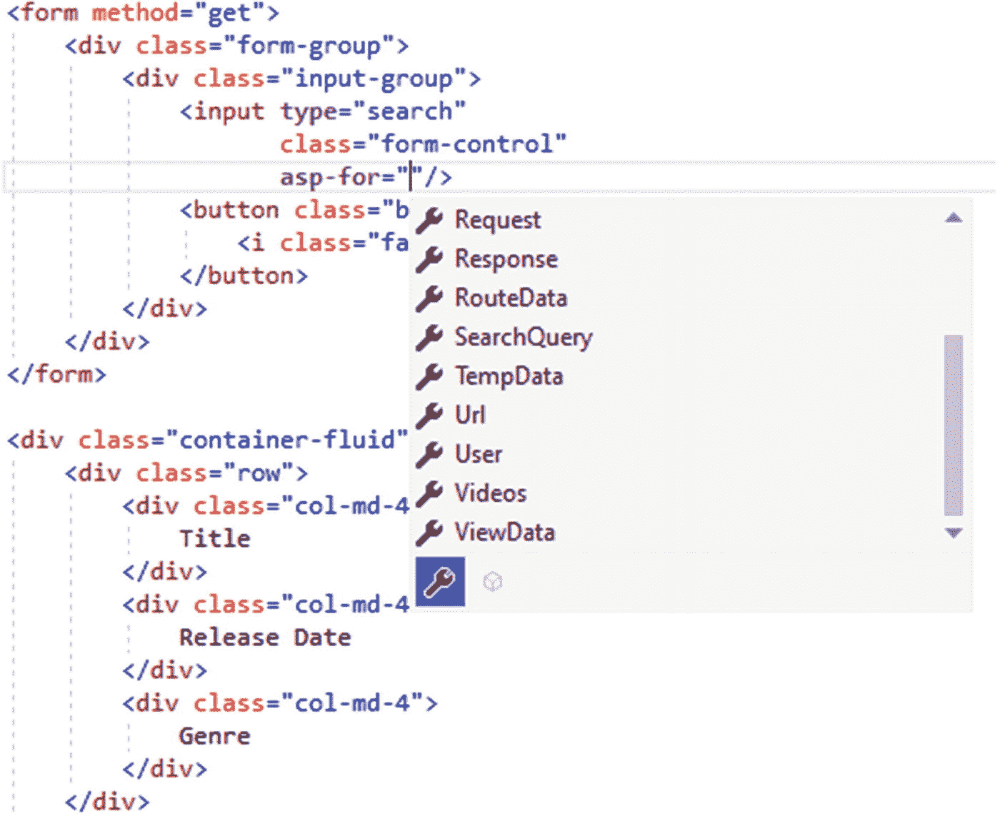

图 2-3

页面模型属性

这意味着如果您没有为标签帮助器中的属性(或不存在的属性)提供正确的大小写，您将得到如图 [2-4](#Fig4) 所示的错误。

要更深入地研究 PageModel 类，只需在 List.cshtml.cs 页面中的类名上按 F12。在这里，您将看到图 [2-4](#Fig4) 中所示的属性。

因此，您可以假设`asp-for`知道您的`ListModel`及其公开的属性。

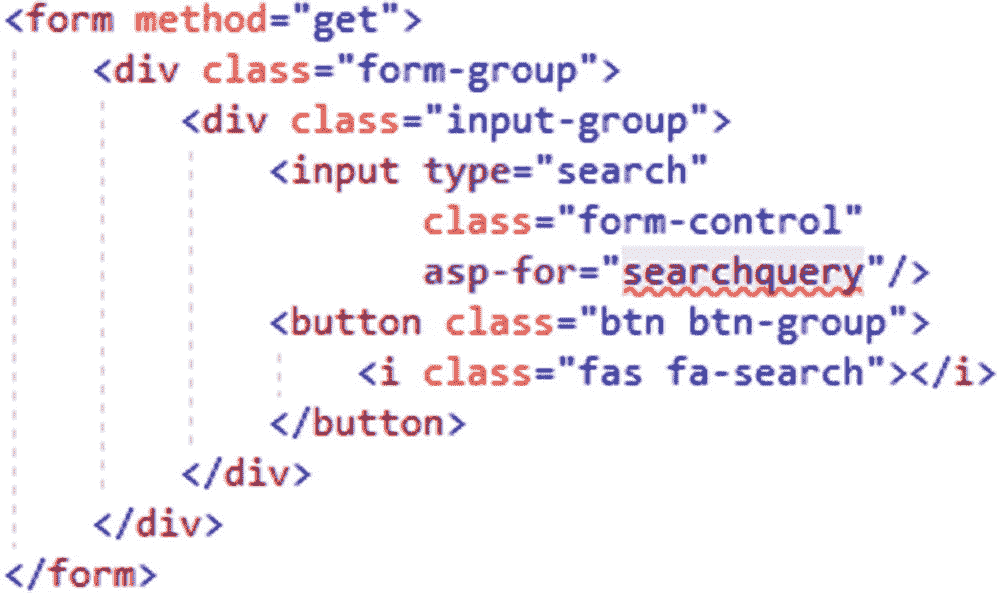

图 2-4

列表模型不包含 searchquery 的定义

拼写正确后，`asp-for`标签助手现在将开始设置`<input>`元素的名称和值，以处理模型绑定并填充`SearchQuery`属性的值。

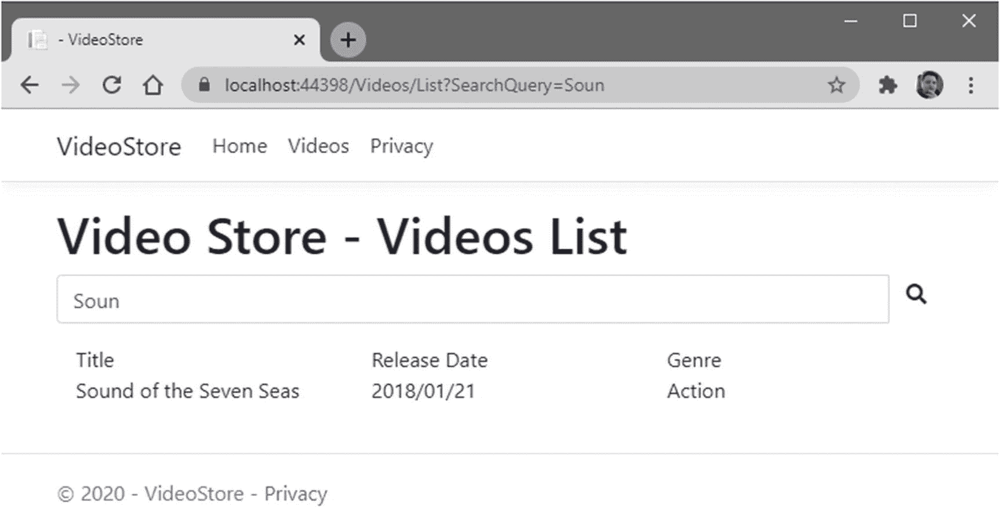

图 2-5

视频列表搜索表单

我现在可以在我的视频列表中搜索特定的视频，单击搜索按钮后，可以在输入中看到我搜索的值(图 [2-5](#Fig5) )。

## 显示相关数据

有一个视频列表是很好的，但是理想情况下，你会想要查看关于特定视频的更多信息。像这样显示相关数据是使用详细页面的一个很好的例子。

使用详细页面，您可以将用户送到站点的某个部分，该部分将显示您所点击的特定视频的详细信息。首先，在解决方案资源管理器中，右键单击 Pages 下的 Videos 文件夹，并添加一个新的 Razor 页面。

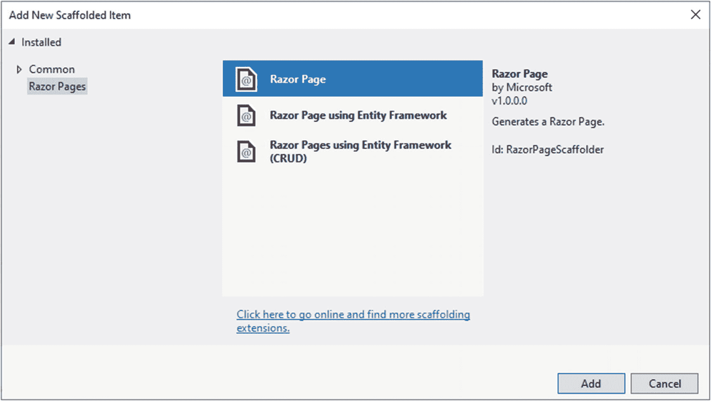

图 2-6

添加新的脚手架项目

您将看到添加新脚手架物品屏幕(图 [2-6](#Fig6) )。只需选择添加 Razor 页面。

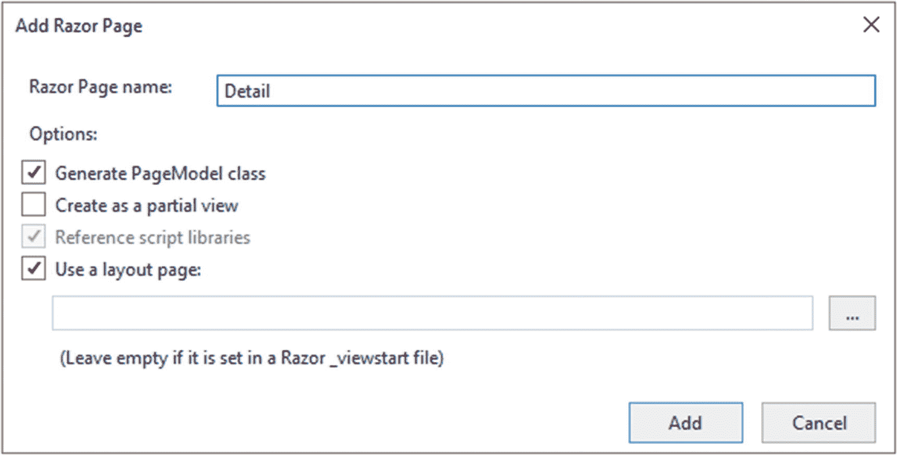

图 2-7

添加 Razor 页面

调用新的 Razor 页面`Detail`，并检查生成一个`PageModel`类和使用一个布局页面的选项。然后点击`Add`按钮(图 [2-7](#Fig7) )。

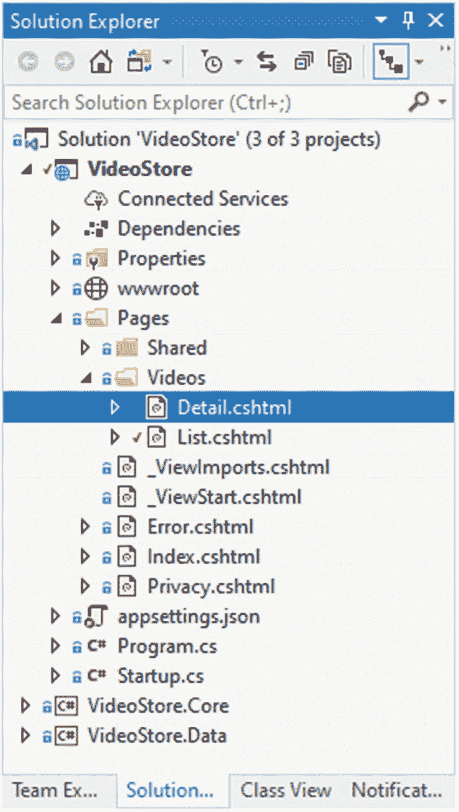

图 2-8

添加详细页后的解决方案资源管理器

一旦添加了详细页面，您的解决方案浏览器将如图 [2-8](#Fig8) 所示。看一下`DetailModel`类，你会看到样板代码(图 [2-14](#Fig14) ),接下来我们将修改它来显示视频细节。

```cs
using Microsoft.AspNetCore.Mvc.RazorPages;

namespace VideoStore.Pages.Videos
{
    public class DetailModel : PageModel
    {
        public void OnGet()
        {

        }
    }
}

Listing 2-14The DetailModel Class

```

首先，让我们向`VideoStore.Core`项目中的`Video`类添加更多信息。我刚刚添加了三个额外的属性(列表 [2-15](#PC15) )，这将帮助我看到我为视频支付了多少钱，以及我是否将视频借给了任何人。

```cs
using System;

namespace VideoStore.Core
{
    public class Video
    {
        public int Id { get; set; }
        public string Title { get; set; }
        public DateTime ReleaseDate { get; set; }
        public MovieGenre Genre { get; set; }
        public double Price { get; set; }
        public bool LentOut { get; set; }
        public string LentTo { get; set; }
    }
}

Listing 2-15The Video Class

```

然后，我需要将这些属性的更多测试数据添加到 VideoStore 中的`TestData`服务的构造函数中。数据项目(清单 [2-16](#PC16) )。

```cs
public TestData()
{
    _videoList = new List<Video>()
    {
        new Video { Id = 1, Title = "Sound of the Seven Seas", ReleaseDate = new DateTime(2018, 1, 21), Genre = MovieGenre.Action, Price = 5.99, LentOut = false, LentTo = "" },
        new Video { Id = 2, Title = "A Day in the Sun", ReleaseDate = new DateTime(2019, 7, 2), Genre = MovieGenre.Drama, Price = 4.59, LentOut = false, LentTo = "" },
        new Video { Id = 3, Title = "Wonders of the Universe", ReleaseDate = new DateTime(2020, 2, 14), Genre = MovieGenre.Romance, Price = 12.99, LentOut = true, LentTo = "Joah Sanderson" }
    };
}

Listing 2-16The Added Test Data

```

一旦我添加了更多的视频细节，我就可以继续构建包含更多信息的详细页面。首先添加一个 using 语句来引入`VideoStore.Core`名称空间。然后将`Video`的属性添加到`DetailModel`类中(清单 [2-17](#PC17) )。

```cs
using Microsoft.AspNetCore.Mvc.RazorPages;
using VideoStore.Core;

namespace VideoStore.Pages.Videos
{
    public class DetailModel : PageModel
    {
        public Video Video { get; set; }

        public void OnGet()
        {

        }
    }
}

Listing 2-17The Modified DetailModel Class

```

我们现在可以将注意力转向代码清单 [2-18](#PC18) 中所示的 Detail.cshtml 标记。

```cs
@page
@model VideoStore.Pages.Videos.DetailModel
@{
    ViewData["Title"] = "Detail";
}

<h1>Detail</h1>

Listing 2-18The Detail Page Markup

```

给标记添加更多的细节，如代码清单 [2-19](#PC19) 所示。这里，我们可以简单地添加一系列`div`元素来保存各种视频属性。您还会注意到，如果视频被借出给任何人，我为复选框使用了一个 HTML 助手来选中复选框。如果`LentOut`属性为真，我也只显示`LentTo`属性值。

```cs
@page
@model VideoStore.Pages.Videos.DetailModel
@{
    ViewData["Title"] = "Detail";
}

<h1>@Model.Video.Title</h1>

<div>
    Catalog ID: @Model.Video.Id
</div>
<div>
    Release Date: @Model.Video.ReleaseDate.ToString("dd MMMM yyyy")
</div>
<div>
    Genre: @Model.Video.Genre
</div>
<div>
    Price: $@Model.Video.Price
</div>
<div>
    Lent Out: @Html.CheckBoxFor(x => x.Video.LentOut)
</div>

@if (Model.Video.LentOut == true)
{
    <div>
        Lent To: @Model.Video.LentTo
    </div>
}

<a asp-page="./List" class="btn btn-outline-primary">Back to Videos</a>

Listing 2-19The Expanded Detail Markup

```

最后，我通过使用`asp-page`标签助手添加了一种返回视频列表页面的方法。这个标签助手将在当前目录中寻找一个页面，这个目录是`Videos`目录，称为`List`。

### 将视频 ID 传递到详细页面

我们的细节页面包含显示视频细节的元素，我们需要将所选视频的 ID 从列表页面传递到细节页面。

我们可以通过稍微修改`DetailModel`类来做到这一点，如代码清单 [2-20](#PC20) 所示。这很简单，只需给`OnGet`方法一个视频 ID 的整数参数，并将其设置为`Video.Id`属性。

```cs
using Microsoft.AspNetCore.Mvc.RazorPages;
using VideoStore.Core;

namespace VideoStore.Pages.Videos
{
    public class DetailModel : PageModel
    {
        public Video Video { get; set; }

        public void OnGet(int videoId)
        {
            Video = new Video();
            Video.Id = videoId;
        }
    }
}

Listing 2-20Passing a Video ID to the DetailModel Class

```

回到 List.cshtml 页面的标记，我们现在必须对它稍加修改，以获取视频 ID，并在用户单击视频时将其传递到详细页面。为此，我们将添加一个包含按钮的列，用户可以单击该按钮导航到详细页面。

如果您回想一下清单 [2-4](#PC4) 中的代码，您会记得我们只是编写了在页面上显示视频的标记。

```cs
<div class="container-fluid">
    <div class="row">
        <div class="col-md-3">
            Title
        </div>
        <div class="col-md-3">
            Release Date
        </div>
        <div class="col-md-3">
            Genre
        </div>
        <div class="col-md-3">

        </div>
    </div>
    @foreach (var video in Model.Videos)
    {
        <div class="row">
            <div class="col-md-3">
                @video.Title
            </div>
            <div class="col-md-3">
                @video.ReleaseDate.ToShortDateString()
            </div>
            <div class="col-md-3">
                @video.Genre
            </div>
            <div class="col-md-3">
                <div>
                    <a class="btn btn-lg" asp-page="./Detail" asp-route-videoId="@video.Id">
                        <i class="fas fa-info-circle"></i>
                    </a>
                </div>
            </div>
        </div>
    }
</div>

Listing 2-21The Modified List.cshtml Page

```

修改代码清单 [2-21](#PC21) 中所示的标记，添加一个`div`元素来包含一个按钮，用户可以单击该按钮导航到详细页面。

请注意，我没有在清单 [2-21](#PC21) 中包含 List.cshtml 页面的全部标记。GitHub 上有完整的源代码。

让我们仔细看看`<a>`链接元素上的标记助手。为了更简单，我在清单 [2-22](#PC22) 中的代码中添加了按钮代码。

```cs
<div class="col-md-3">
   <div>
       <a class="btn btn-lg" asp-page="./Detail" asp-route-videoId="@video.Id">
           <i class="fas fa-info-circle"></i>
       </a>
   </div>
</div>

Listing 2-22The Button Tag Helpers

```

您可以看到我们使用了相同的标记助手`asp-page`，我们之前在清单 [2-1](#PC1) 和 [2-19](#PC19) 中使用它来指定要导航到的页面(在本例中是详细页面)。它通过设置`href`属性来指向正确的页面。

标记助手是向页面添加逻辑的首选方式，因为它们知道页面需要的结构和输入。因此，标记助手是灵活的，因为如果您以任何方式更改页面，标记助手将自动知道这种更改。除了告诉标签助手我们需要导航到哪个页面，我们还需要一种方法将视频 ID 传递到细节页面。这就是`asp-route`标签助手派上用场的地方。它更具动态性，允许我通过将参数名称包含在标记助手名称中来包含我要传递给详细页面的参数名称。

这意味着当我编写`asp-route-videoId`并将视频 ID 作为一个参数值给它时，标记助手会想出如何将视频 ID 传递给细节页面。

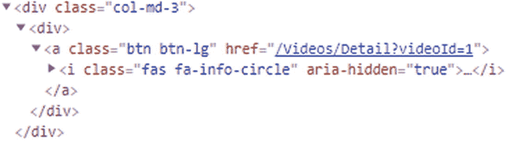

图 2-9

为代码清单 [2-22](#PC22) 生成的 HTML

回头参考清单 [2-22](#PC22) 中的代码，看看图 [2-9](#Fig9) 中呈现的代码，你可以看到标签助手是如何基于我们列表中的一个视频呈现标记的。使用标签助手填充了`href`值，并将用户导航到详细页面，向该页面传递特定的视频 ID。

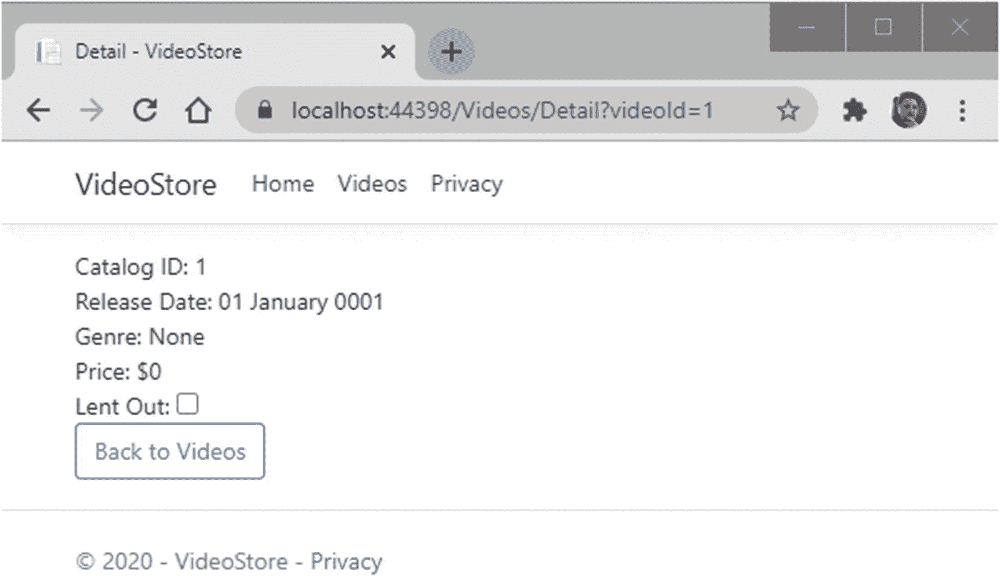

图 2-10

视频详细信息页面

如果我们点击列表中的一个视频，那么该视频的 ID 将被传递到详细页面，如图 [2-10](#Fig10) 所示。该页面的 URL 也和我们预期的一样(清单 [2-23](#PC23) )，视频 ID 在查询字符串中被传递到详细页面。

```cs
https://localhost:44398/Videos/Detail?videoId=1

Listing 2-23The URL to the Detail Page

```

ASP.NET Core 允许我们通过页面路由来控制这种行为。我们不必坚持使用 URL 格式，而是使用由标签助手生成的查询字符串。让我们来看看如何控制这种行为。

## 使用页面路由

网页向其他网页传递值的一种常见方式是利用 URL 路径。我不必使用查询字符串将视频 ID 传递到详细页面。我可以通过修改 Detail.cshtml 页面中的`@page`指令来控制这种行为。回头参考清单 [2-19](#PC19) 中的代码，你会在页面顶部看到清单 [2-24](#PC24) 中所示的`@page`指令。

```cs
@page
@model VideoStore.Pages.Videos.DetailModel
@{
    ViewData["Title"] = "Detail";
}

Listing 2-24The @page Directive

```

在这里，我可以在`@page`指令后给 ASP.NET Core 提供一个字符串参数，告诉它我想要的路由。记住，URL 总是以`/Videos/Detail`开头，如清单 [2-23](#PC23) 所示。

如果我在`@page`指令中指定了不同的路由，我可以更改 URL，如清单 [2-25](#PC25) 所示。

```cs
@page "/Videos/Store"
@model VideoStore.Pages.Videos.DetailModel
@{
    ViewData["Title"] = "Detail";
}

Listing 2-25Changing the Route

```

如果我运行 web 应用并导航到特定视频的详细信息页面，我会看到我的 URL 发生了变化，如图 [2-11](#Fig11) 所示。

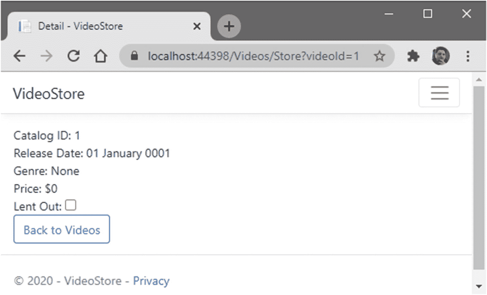

图 2-11

已更改的 URL

不过，这仍然包含查询字符串，我想做的是引入一个包含视频 ID 参数的新 URL 段。我可以通过在花括号内添加参数来做到这一点，如清单 [2-26](#PC26) 所示。

```cs
@page "{videoId}"
@model VideoStore.Pages.Videos.DetailModel
@{
    ViewData["Title"] = "Detail";
}

Listing 2-26The Video ID as a New URL Segment

```

这告诉 ASP.NET Core，我希望我的页面 URL 是`Videos/Detail/{videoId}`，其中`{videoId}`是在视频列表中点击的视频的 ID。这个`{videoId}`可以通过指定数据类型`"{videoId:int}"`来进一步约束。这里，我告诉 ASP.NET Core，ID 参数必须是一个整数值。

这样，Detail.cshtml 页面的完整代码将如代码清单 [2-27](#PC27) 所示。

```cs
@page "{videoId:int}"
@model VideoStore.Pages.Videos.DetailModel
@{
    ViewData["Title"] = "Detail";
}

<h1>@Model.Video.Title</h1>

<div>
    Catalog ID: @Model.Video.Id
</div>
<div>
    Release Date: @Model.Video.ReleaseDate.ToString("dd MMMM yyyy")
</div>
<div>
    Genre: @Model.Video.Genre
</div>
<div>
    Price: $@Model.Video.Price
</div>
<div>
    Lent Out: @Html.CheckBoxFor(x => x.Video.LentOut)
</div>

@if (Model.Video.LentOut == true)
{
    <div>
        Lent To: @Model.Video.LentTo
    </div>
}

<a asp-page="./List" class="btn btn-outline-primary">Back to Videos</a>

Listing 2-27Complete Code Listing for the Detail.cshtml Page

```

运行 web 应用，URL 现在完全符合我的要求(图 [2-12](#Fig12) )。如果我想告诉 ASP.NET ID 参数是可选的，我也可以通过指定`"{videoId?:int}".`在`@page`指令中指定这一点，但是无论我在这里做什么，ASP.NET Core 知道 URL 的第三段将指定一个名为`videoId`的参数。


图 2-12

正确的 URL 格式

如果我们比较图 [2-9](#Fig9) 中的图像和图 [2-13](#Fig13) 中的图像，你会注意到标签助手是如何改变标记的。它现在指定了一个新的 URL 段。

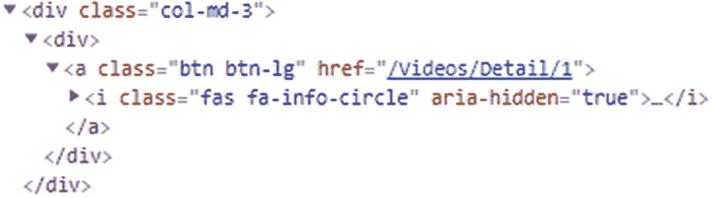

图 2-13

生成的标记指定页面路由中的 ID

我们在这里所做的就是将视频 ID 传递给详细页面。正如您所看到的，细节页面上根本没有显示任何其他细节，这是意料之中的。如果你回头看看清单 [2-20](#PC20) 中的代码，你会发现我们只设置了`Video.Id`属性。

### 填充视频详细信息

为了用特定的视频数据填充细节页面，我们需要做一些小的修改。我们需要修改`TestData`类来通过 ID 返回一个视频。此时，您应该考虑修改接口`IVideoData`，因为这个功能必须由任何实现`IVideoData`的类来实现。考虑到这一点，打开`IVideoData`接口并定义一个名为`GetVideo`的方法，该方法将通过 ID 返回单个视频(清单 [2-28](#PC28) )。

```cs
using System.Collections.Generic;
using VideoStore.Core;

namespace VideoStore.Data
{
    public interface IVideoData
    {
        IEnumerable<Video> ListVideos(string title);
        Video GetVideo(int id);
    }
}

Listing 2-28The Modified IVideoData Interface

```

如您所知，因为我们已经修改了我们的接口，所以我们还需要在实现了`IVideoData`接口的`TestData`类上实现那个改变。

```cs
using System;
using System.Collections.Generic;
using System.Linq;
using VideoStore.Core;

namespace VideoStore.Data
{
    public class TestData : IVideoData
    {
        List<Video> _videoList;
        public TestData()
        {
            _videoList = new List<Video>()
            {
                new Video { Id = 1, Title = "Sound of the Seven Seas", ReleaseDate = new DateTime(2018, 1, 21), Genre = MovieGenre.Action, Price = 5.99, LentOut = false, LentTo = "" },
                new Video { Id = 2, Title = "A Day in the Sun", ReleaseDate = new DateTime(2019, 7, 2), Genre = MovieGenre.Drama, Price = 4.59, LentOut = false, LentTo = "" },
                new Video { Id = 3, Title = "Wonders of the Universe", ReleaseDate = new DateTime(2020, 2, 14), Genre = MovieGenre.Romance, Price = 12.99, LentOut = true, LentTo = "Joah Sanderson" }
            };
        }
        public IEnumerable<Video> ListVideos(string title = null) => _videoList
            .Where(x => string.IsNullOrEmpty(title)
            || x.Title.StartsWith(title))
            .OrderBy(x => x.Title);

        public Video GetVideo(int id) => _videoList.SingleOrDefault(x => x.Id == id);
    }
}

Listing 2-29The Complete TestData Class

```

清单 [2-29](#PC29) 中的表达式主体`GetVideo`方法只是从`_videoList`集合中返回一个视频。这现在与接口定义相匹配。我们需要修改的最后一段代码在我们的`Detail.cshtml.cs`页面上。

您需要添加一个对视频商店的引用。Detail.cshtml.cs 类的 using 语句中的数据命名空间。

添加相关的名称空间后，修改 Detail.cshtml.cs 页面，如清单 [2-30](#PC30) 所示。

```cs
using Microsoft.AspNetCore.Mvc.RazorPages;
using VideoStore.Core;
using VideoStore.Data;

namespace VideoStore.Pages.Videos
{
    public class DetailModel : PageModel
    {
        private readonly IVideoData _videoData;

        public Video Video { get; set; }

        public DetailModel(IVideoData videoData)
        {
            _videoData = videoData;
        }

        public void OnGet(int videoId)
        {
            Video = _videoData.GetVideo(videoId);
        }
    }
}

Listing 2-30The Modified Detail Page

```

我只是在页面中添加了一个构造函数，它接受类型为`IVideoData`的对象，然后该对象被初始化为私有字段`_videoData`。

我喜欢用前导下划线来命名我的私有字段。一些开发人员保持字段名和参数名相同，在私有字段前加上关键字`this`。对我来说，下划线`_videoData = videoData`比`this.videoData = videoData`更清晰。

在`OnGet`方法中，我可以更改代码以使用数据服务来获得特定的视频。这就是我们需要做的。继续运行您的应用。

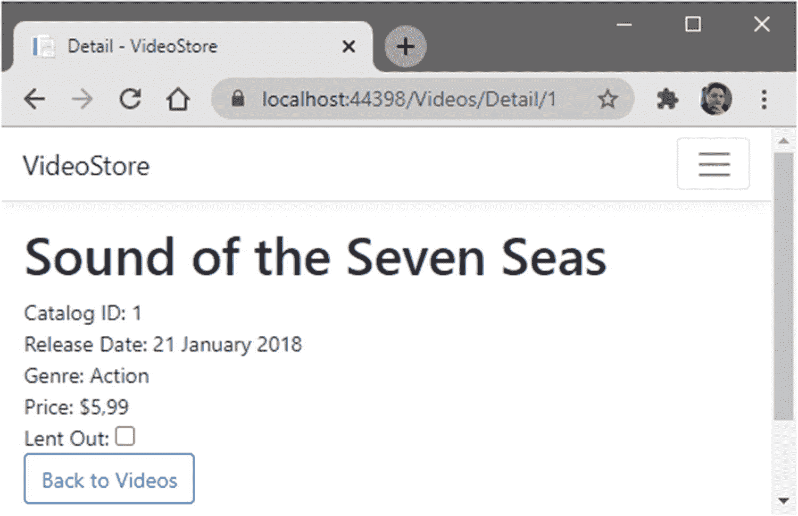

图 2-14

视频详细信息页面

当您点击列表中的一个视频时，视频 ID 被传递到详细信息页面，视频详细信息被填充，如图 [2-14](#Fig14) 所示。我们需要做的最后一点工作是处理任何发送到我们详细页面的错误请求。在图 [2-14](#Fig14) 的图像中，你会注意到(在 URL 中)被传递到详细页面的视频 ID 是 ID 1。如果用户试图将这个 ID 更改为我们的视频集合之外的任何内容，就会发生空引用异常。让我们在下一节中解决这个问题。

## 处理错误请求

在某些时候，您可能需要处理不好的请求。假设用户无意中键入了错误的 URL，或者对目录中不再存在的视频添加了书签。将用户发送到一个不存在的 ID 的详细页面将导致一个如图 [2-15](#Fig15) 所示的`NullReferenceException`。

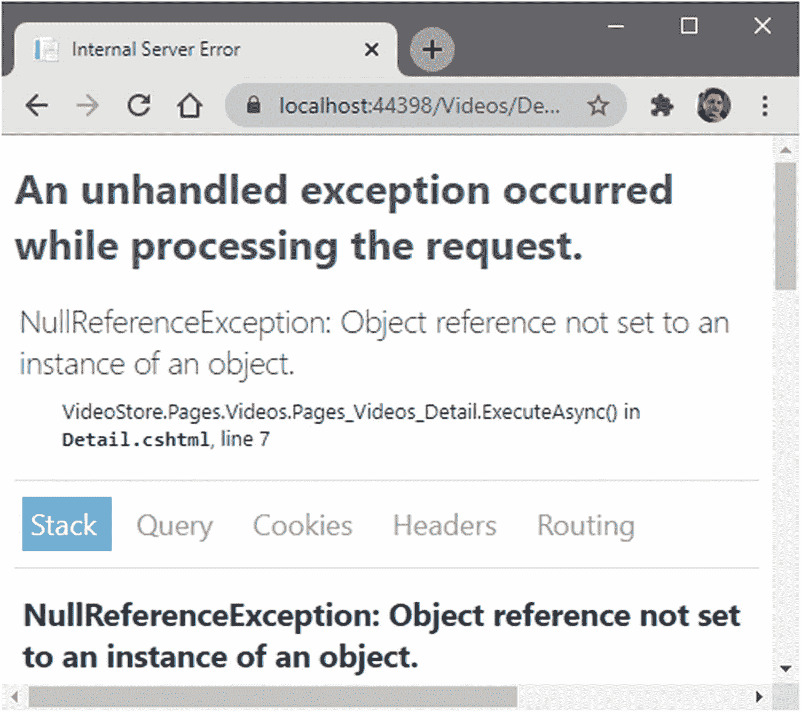

图 2-15

A NullReferenceException Page

默认情况下，ASP.NET Core 项目是用一些样板代码创建的。这很方便。一段这样的代码在`Startup.cs`页面的`Configure`方法中。处理异常的代码如清单 [2-31](#PC31) 所示。

```cs
if (env.IsDevelopment())
{
    _ = app.UseDeveloperExceptionPage();
}
else
{
    _ = app.UseExceptionHandler("/Error");
    _ = app.UseHsts();
}

Listing 2-31Handling Errors

```

这段代码的作用是在你开发的时候显示一个开发者异常页面(图 [2-15](#Fig15) )。当您的应用不处于开发模式时，web 应用将重定向到一个通用错误页面(图 [2-16](#Fig16) )。

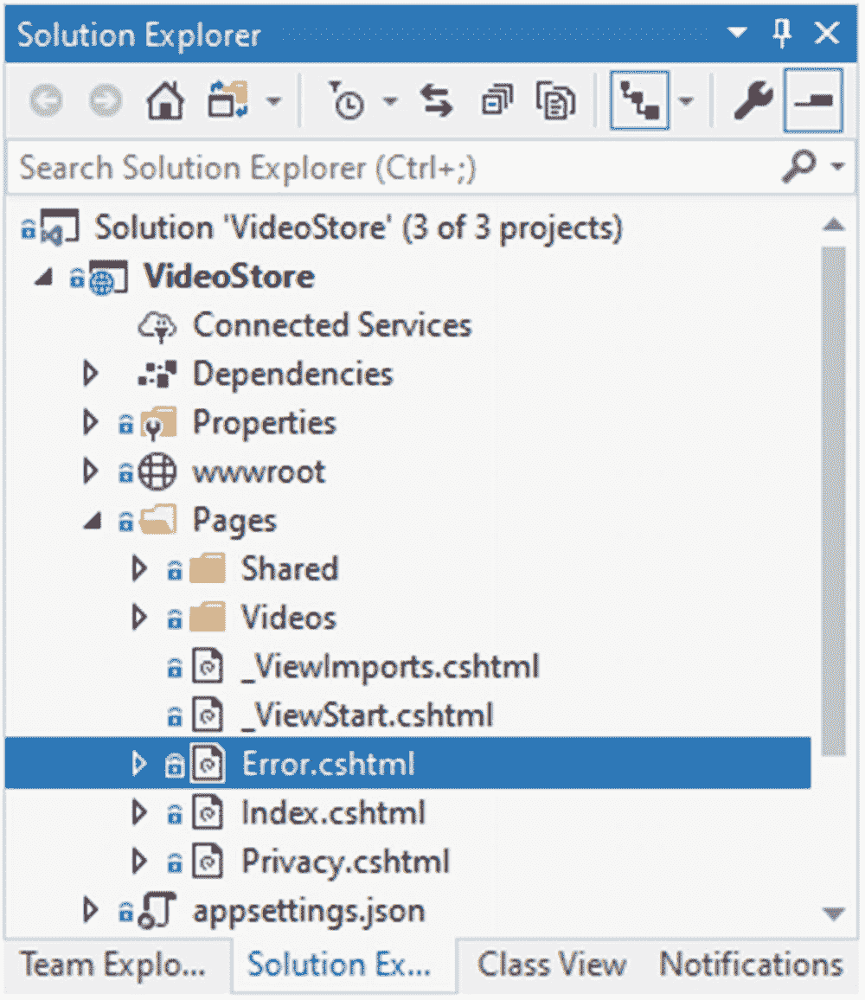

图 2-16

错误页面

当显示这个错误页面时，该页面只是通知用户出现了错误，需要开发模式来查看细节。

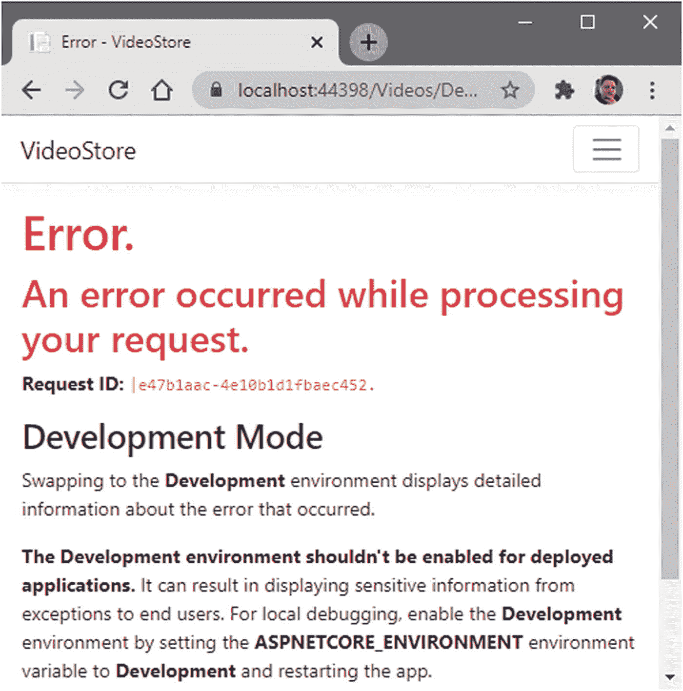

图 2-17

一般错误页面

您永远不希望在生产中向用户显示开发人员异常消息。这不仅会造成糟糕的用户体验(给人一种 web 应用有问题的印象)，还会带来安全风险。

图 [2-17](#Fig17) 中的错误页面对于应用中未处理的错误来说是很好的，但是我希望对显示给用户的错误有更多的控制。

为此，向名为`VideoError`的视频文件夹添加另一个 Razor 页面，如图 [2-18](#Fig18) 所示。

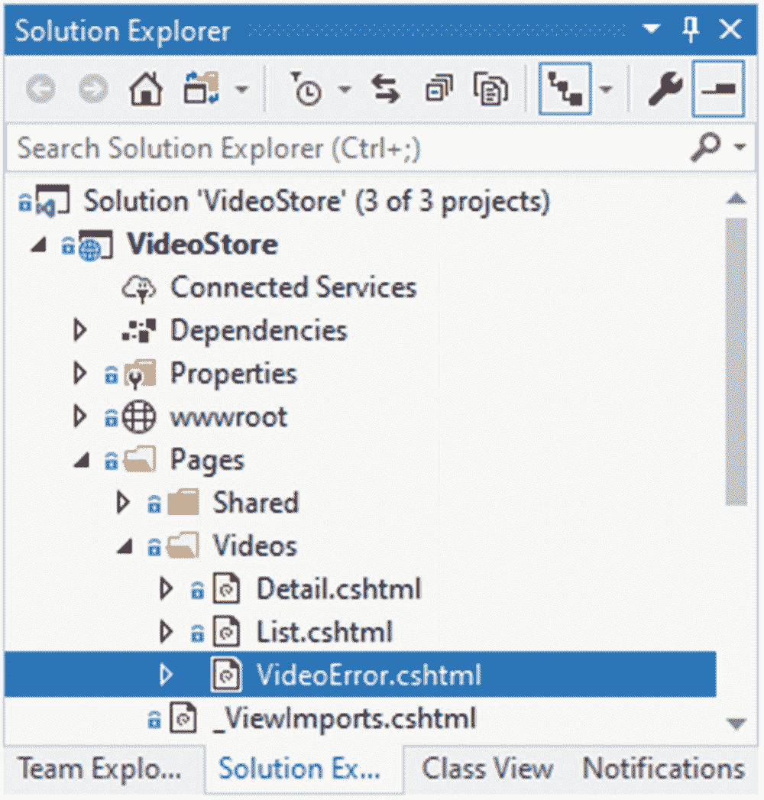

图 2-18

视频错误页面

回想一下使用页面路由的部分，在`@page`指令中添加一个`message`参数(清单 [2-32](#PC32) )。

```cs
@page "{message}"
@model VideoStore.Pages.Videos.VideoErrorModel
@{
    ViewData["Title"] = "VideoError";
}

<h1>Error</h1>

<div>@Model.Message</div>

<a asp-page="./List" class="btn alert-info">Back to Video List</a>

Listing 2-32The VideoError Markup

```

属性还不存在，但是我们接下来会添加它。在 VideoError.cshtml.cs 页面上，添加清单 [2-33](#PC33) 中的代码。

```cs
using Microsoft.AspNetCore.Mvc;
using Microsoft.AspNetCore.Mvc.RazorPages;

namespace VideoStore.Pages.Videos
{
    public class VideoErrorModel : PageModel
    {
        [BindProperty(SupportsGet = true)]
        public string Message { get; set; }

        public void OnGet()
        {

        }
    }
}

Listing 2-33The VideoErrorModel Class

```

您应该对这段代码非常熟悉。这与我们在 List.cshtml.cs 页面中使用的逻辑相同。您会注意到`Message`属性上的`BindProperty`属性。这告诉 ASP.NET Core,`Message`属性必须充当输入和输出模型。这意味着每当页面处理一个 HTTP 请求时，`Message`属性将从该请求中获得信息。我们需要做的最后一个改变是对 Detail.cshtml.cs 页面的修改，如清单 [2-34](#PC34) 所示。

```cs
using Microsoft.AspNetCore.Mvc;
using Microsoft.AspNetCore.Mvc.RazorPages;
using VideoStore.Core;
using VideoStore.Data;

namespace VideoStore.Pages.Videos
{
    public class DetailModel : PageModel
    {
        private readonly IVideoData _videoData;

        public Video Video { get; set; }

        public DetailModel(IVideoData videoData)
        {
            _videoData = videoData;
        }

        public IActionResult OnGet(int videoId)
        {
            Video = _videoData.GetVideo(videoId);

            return Video == null ? RedirectToPage("./VideoError", new { message = "The video does not exist" }) : (IActionResult)Page();
        }
    }
}

Listing 2-34The DetailModel with the Modified OnGet Method

```

`OnGet`方法略有变化。它现在返回一个 IActionResult，并定义一个表示`OnGet`方法结果的契约。如果返回的`Video`对象不是`null`，则渲染页面。如果`Video`对象是`null`，则重定向到`VideoError`页面，并向其传递“视频不存在”的消息。运行您的 web 应用，并将清单 [2-35](#PC35) 中的以下 URL 传递给它。

```cs
https://localhost:44398/Videos/Detail/10

Listing 2-35A Request with an Incorrect Video ID

```

`OnGet`方法现在将重定向到图 [2-19](#Fig19) 中的错误页面。

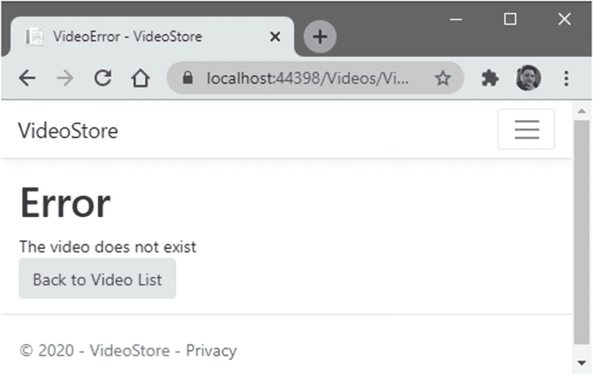

图 2-19

包含我们信息的视频错误页面

模型绑定的魔力将我们提供的消息显示在`VideoError`页面上。