# 三、修改数据

在上一章中，我们实现了一些搜索逻辑来查找特定的视频。我们还创建了一个详细页面，在用户单击特定视频后显示视频详细信息。对于我们的应用来说，合乎逻辑的下一步是能够修改我们显示的数据。

这样做的逻辑位置应该是在视频列表页面。在这里，用户可以单击列表中的特定视频，以查看该视频的更多详细信息或编辑该视频的详细信息。让我们在接下来的章节中看看如何做到这一点。

## 编辑现有数据和使用标签助手

看看视频列表页面上的标记，您会看到`@foreach`部分构建了视频列表。也是在这里，我们添加了逻辑来创建到详细页面的链接。

我们可以使用这种现有的逻辑将用户带到一个可以编辑视频的页面。清单 [3-1](#PC1) 展示了现有的标记。

```cs
@foreach (var video in Model.Videos)
{
    <div class="row">
        <div class="col-md-3">
            @video.Title
        </div>
        <div class="col-md-3">
            @video.ReleaseDate.ToShortDateString()
        </div>
        <div class="col-md-3">
            @video.Genre
        </div>
        <div class="col-md-3">
            <div>
                <a class="btn btn-lg" asp-page="./Detail" asp-route-videoId="@video.Id">
                    <i class="fas fa-info-circle"></i>
                </a>
            </div>
        </div>
    </div>
}

Listing 3-1The Existing ForEach Detail Page Markup

```

我们想要做的是在带我们到详细页面的链接之后添加第二个链接。为了保持整洁，我添加了另一个带有`row`类的`div`,并将带有详细页面链接的`div`移到了那里。然后，我添加了一个名为 Edit 的新页面的链接(我们很快就会创建这个页面)。参考清单 [3-2](#PC2) 中的代码。

```cs
@foreach (var video in Model.Videos)
{
    <div class="row">
        <div class="col-md-3">
            @video.Title
        </div>
        <div class="col-md-3">
            @video.ReleaseDate.ToShortDateString()
        </div>
        <div class="col-md-3">
            @video.Genre
        </div>
        <div class="col-md-3">
            <div class="row">
                <div class="col-md-6">
                    <a class="btn btn-lg" asp-page="./Detail" asp-route-videoId="@video.Id">
                        <i class="fas fa-info-circle"></i>
                    </a>
                </div>
                <div class="col-md-6">
                    <a class="btn btn-lg" asp-page="./Edit" asp-route-videoId="@video.Id">
                        <i class="fa fa-pencil"></i>
                    </a>
                </div>
            </div>
        </div>
    </div>
}

Listing 3-2The Modified ForEach Detail Page Markup

```

运行 web 应用，您应该看到编辑按钮现在已经添加到视频列表页面中(图 [3-1](#Fig1) )。目前，它还没有去任何地方，因为编辑页面还不存在。

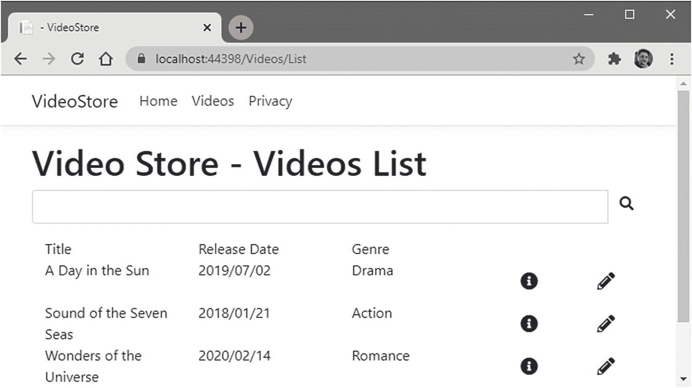

图 3-1

带有编辑按钮的视频列表页面

在解决方案资源管理器中，右键单击 Videos 文件夹并添加一个新的 Razor 页面。将此 Razor 页面命名为 Edit，并保留 PageModel 类和布局页面的默认值，然后单击`Add`按钮(图 [3-2](#Fig2) )。

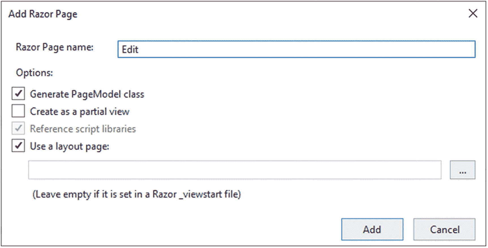

图 3-2

添加编辑页面

一旦编辑页面被添加到你的解决方案中，你的`Videos`文件夹应该如图 [3-3](#Fig3) 所示。

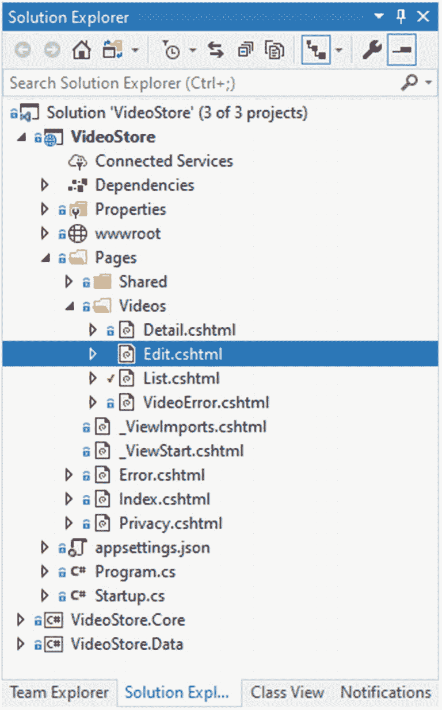

图 3-3

解决方案资源管理器中添加的编辑页

看一下 Edit.cshtml.cs 页面，您会认出为我们添加的样板代码(清单 [3-3](#PC3) )。

```cs
namespace VideoStore.Pages.Videos
{
    public class EditModel : PageModel
    {
        public void OnGet()
        {

        }
    }
}

Listing 3-3The Edit Page Boilerplate Code

```

我们现在需要向该页面添加一个构造函数，以便我们可以注入我们的数据服务。

你需要带音像店。数据和视频商店。核心命名空间，然后才能使用 IVideoData 数据服务和 Video 类。

注入的数据服务然后被保存到一个名为`_videoData`的私有字段中。然后，我们将名为`Video`的属性添加到包含我们想要编辑的视频的`EditModel`类中，并将`IActionResult`返回类型添加到`OnGet`方法中，并将其传递给`videoId`。然后，`OnGet`方法调用数据服务并获取所提供 ID 的视频数据。如果传递了无效的 id，我们会将其作为视频错误处理。完整的代码如清单 [3-4](#PC4) 所示。

```cs
using Microsoft.AspNetCore.Mvc;
using Microsoft.AspNetCore.Mvc.RazorPages;
using VideoStore.Core;
using VideoStore.Data;

namespace VideoStore.Pages.Videos
{
    public class EditModel : PageModel
    {
        private readonly IVideoData _videoData;

        public Video Video { get; set; }

        public EditModel(IVideoData videoData)
        {
            _videoData = videoData;
        }

        public IActionResult OnGet(int videoId)
        {
            Video = _videoData.GetVideo(videoId);

            return Video == null ? RedirectToPage("./VideoError", new { message = "The video does not exist" }) : (IActionResult) Page();
        }
    }
}

Listing 3-4The EditModel Class

```

如果这段代码感觉有点熟悉，那是因为它几乎是`Detail`页面的精确副本。就像细节页面一样，我们希望在`@page`指令之后指定`videoId`属性。

```cs
@page "{videoId:int}"
@model VideoStore.Pages.Videos.EditModel
@{
    ViewData["Title"] = "Edit";
}

<h1>Editing: @Model.Video.Title</h1>

Listing 3-5The Edit Page Markup

```

清单 [3-5](#PC5) 中展示的标记向我们展示了修改后的页面。您还会注意到，我们已经将视频标题添加到了`<h1>`标签中。

运行 web 应用将显示我们对视频列表页面所做的更改(图 [3-4](#Fig4) )。

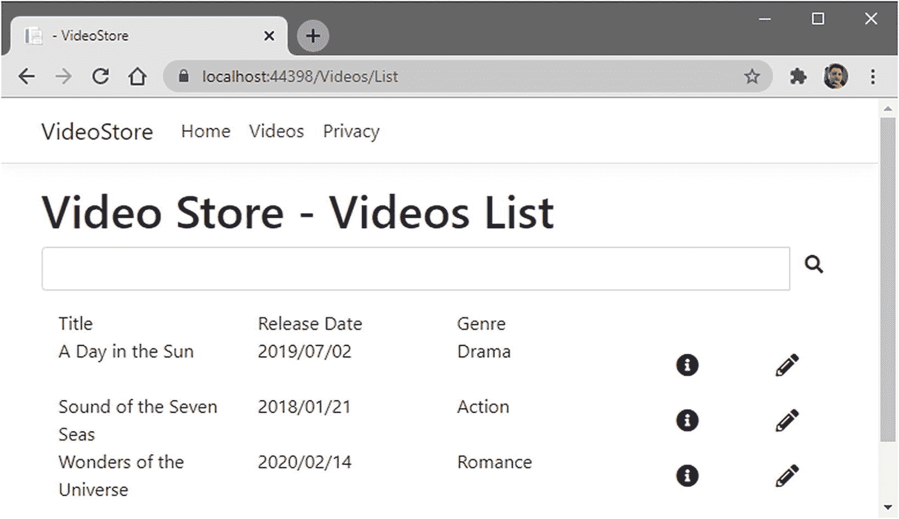

图 3-4

修改后的视频列表页面

点击列表中其中一个视频旁边的编辑按钮，我们将进入编辑页面(图 [3-5](#Fig5) )。

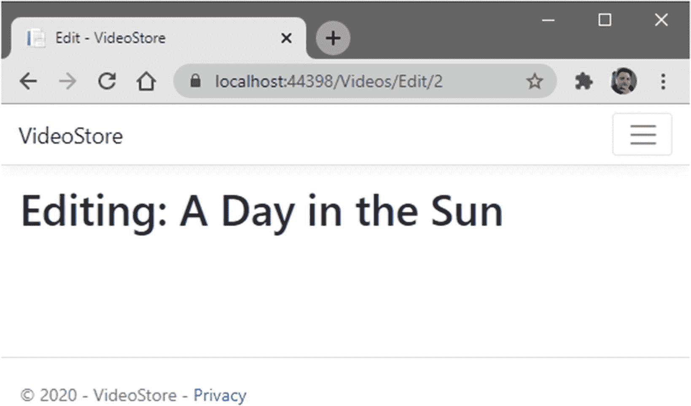

图 3-5

编辑页面

在这里，您可以看到编辑页面正在显示我们单击的视频的标题，并且 URL 包含视频 ID。到目前为止，编辑页面的创建相当简单。我们现在需要开始构建编辑页面，在页面上添加所需的控件。让我们接下来做那件事。

### 构建编辑表单

回想一下第 2 章[的内容，您会记得我们在 List.cshtml 页面中添加了一个搜索表单。在那里，form 方法被设置为`GET`，因为我们正在读取数据。现在，我们想要编辑视频数据，为此，我们需要使用一个`POST`。](2.html)

最基本的，我们需要添加清单 [3-6](#PC6) 中所示的`<form>`标记。

```cs
<form method="post">
    <button type="submit" class="btn border-primary">Update Video</button>
</form>

Listing 3-6The Basic Form with a Post Method

```

使用这个基本的样板代码，我们现在需要添加额外的`<div>`元素来为视频数据添加标签和输入。回头看看`VideoStore.Core`项目中的`Video`类，您会看到所有需要添加输入的属性。清单 [3-7](#PC7) 中的代码是我们编辑视频数据所需的表单的完整代码。

```cs
@page "{videoId:int}"

@using VideoStore.Core;

@model VideoStore.Pages.Videos.EditModel
@{
    ViewData["Title"] = "Edit";
}

<h1>Editing: @Model.Video.Title</h1>

<form method="post">

    <input type="hidden" asp-for="Video.Id" />
    <div class="form-group">
        <label asp-for="Video.Title"></label>
        <input asp-for="Video.Title" class="form-control" />
    </div>

    <div class="form-group">
        <label asp-for="Video.ReleaseDate"></label>
        <input asp-for="Video.ReleaseDate" class="form-control" />
    </div>

    <div class="form-group">
        <label asp-for="Video.Genre"></label>
        <select class="form-control" asp-for="Video.Genre"
                asp-items="Html.GetEnumSelectList<MovieGenre>()">
        </select>
    </div>

    <div class="form-group">
        <label asp-for="Video.Price"></label>
        <input asp-for="Video.Price" class="form-control" />
    </div>

    <div class="form-group">
        <label asp-for="Video.LentOut"></label>
        <input asp-for="Video.LentOut" class="form-control" />
    </div>

    <div class="form-group">
        <label asp-for="Video.LentTo"></label>
        <input asp-for="Video.LentTo" class="form-control" />
    </div>

    <button type="submit" class="btn border-primary">Update Video</button>
</form>

Listing 3-7Complete Edit Markup

```

我想在这里指出几件事。在`@page`指令下面，您会看到我已经导入了`VideoStore.Core`名称空间。这允许我们在表单的下拉列表中引用`MovieGenre enum`。清单 [3-8](#PC8) 中展示了这些代码。

```cs
<div class="form-group">
    <label asp-for="Video.Genre"></label>
    <select class="form-control" asp-for="Video.Genre"
            asp-items="Html.GetEnumSelectList<MovieGenre>()">
    </select>
</div>

Listing 3-8The MovieGenre Drop-down

```

对于每个标签和输入标签，您会注意到我们使用了`asp-for`标签助手。通过使用`asp-for`，我们设置了输入的`name`属性，以便模型绑定知道如何处理提供的值。换句话说，`asp-for="Video.Title"`属性将知道所提供的值是针对视频标题的。

例如，对于`MovieGenre`，不能将`enum`中的项目绑定到`<input>`。我们也不想让用户输入一个值，因为我们需要他们选择`MovieGenre enum`中的一个选项。

正是因为这个原因，我们在标记中使用了 HTML `<select>`。这将生成一个下拉列表，其中的项目是`MovieGenre enum`值。通过使用`asp-items`标签助手，我们可以通过给它一个 HTML 助手`Html.GetEnumSelectList<MovieGenre>()`来告诉它使用一个项目集合作为它的下拉项目。

如果我们现在运行 web 应用，我们会看到下拉列表中已经填充了`enum`值，并且下拉列表已经为所选视频选择了正确的视频类型(图 [3-6](#Fig6) )。

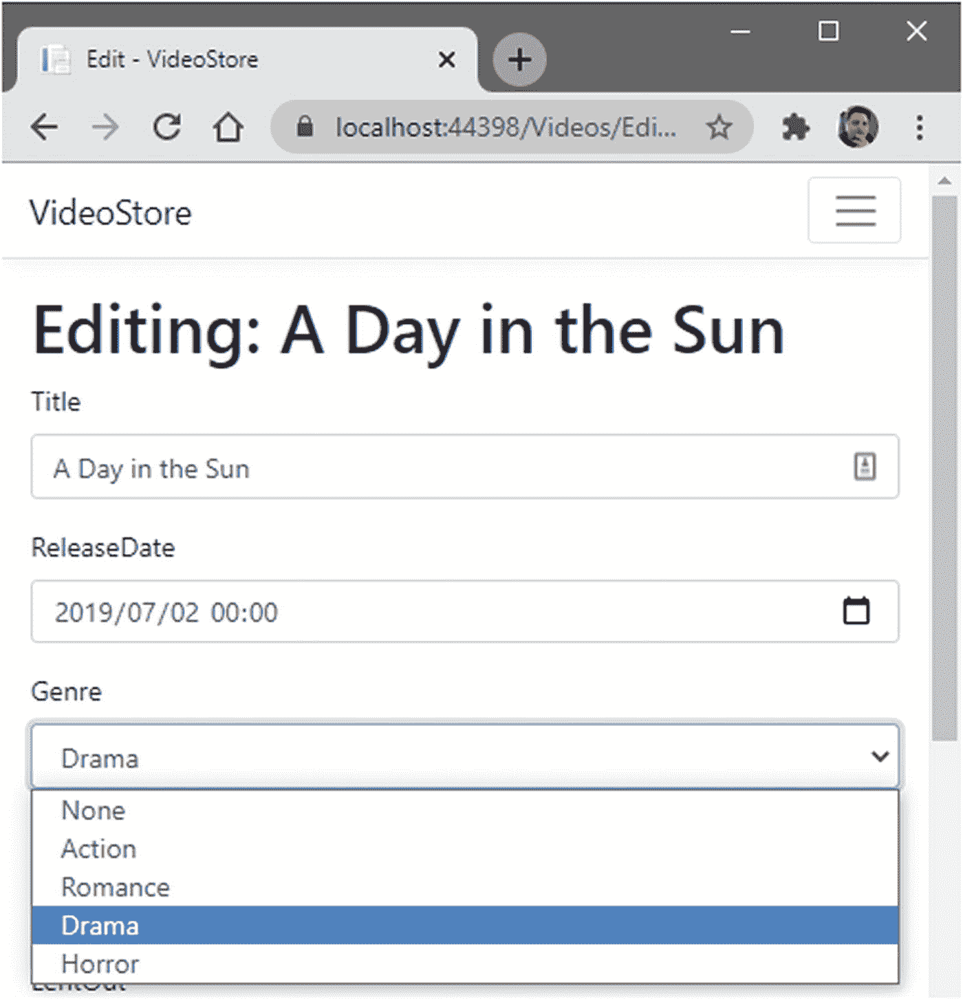

图 3-6

带有流派下拉框的编辑表单

您也可以通过添加`<option>`元素来手动添加项目到您的`<select>`元素，如清单 [3-9](#PC9) 所示。

```cs
<select class="form-control" asp-for="Video.Genre">
    <option>Test 1</option>
    <option>Test 2</option>
    <option>Test 3</option>
</select>

Listing 3-9Manually Specifying Drop-down Items

```

然而，这不是我们想在这里做的事情。还有另一种绑定下拉列表的方法，那就是给我的`EditModel`添加一些逻辑。这消除了向 Razor 页面添加 using 语句的需要，并允许我在我的`EditModel`类中指定下拉列表所需的项目。

看一下`GetEnumSelectList`，你会注意到智能感知指定它返回一个图 [3-7](#Fig7) 中的`IEnumerable<SelectListItem>`。

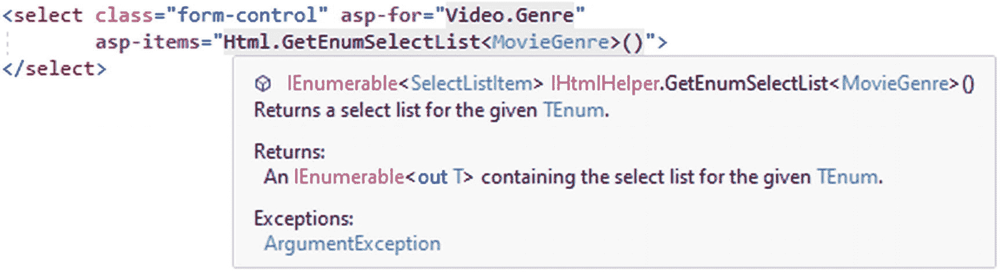

图 3-7

IEnumerable <selectlistitem>返回类型</selectlistitem>

因此，我可以向我的`IEnumerable<SelectListItem>`的`EditModel`类添加一个属性，该属性将包含`MovieGenre enum`的项目(清单 [3-10](#PC10) )。

```cs
public IEnumerable<SelectListItem> Genres { get; set; }

Listing 3-10The Genres Property

```

这个属性现在可以和`asp-items`标签助手一起使用，在我的下拉菜单中显示`MovieGenre`项。

请注意，您将需要引入针对 Microsoft 的 using 语句。AspNetCore.Mvc.Rendering 和 System.Collections.Generic

因为我们是在`EditModel`类中工作，所以不能直接引用 HTML helper `GetEnumSelectList`。那个 HTML 助手只在 Razor 页面上可用。我们能做的是告诉 ASP.NET Core 将`IHtmlHelper`服务注入到构造函数中，这将允许我使用这个助手(清单 [3-11](#PC11) )。

```cs
public EditModel(IVideoData videoData, IHtmlHelper helper)
{
    _videoData = videoData;
}

Listing 3-11Injecting the IHtmlHelper Service

```

就像之前使用`IVideoData`服务一样，我们可以将`IHtmlHelper`保存到私有字段，并在我们的`OnGet`方法中引用它(清单 [3-12](#PC12) )。

```cs
public class EditModel : PageModel
{
    private readonly IVideoData _videoData;
    private readonly IHtmlHelper _helper;

    public Video Video { get; set; }
    public IEnumerable<SelectListItem> Genres { get; set; }

    public EditModel(IVideoData videoData, IHtmlHelper helper)
    {
        _videoData = videoData;
        _helper = helper;
    }

    public IActionResult OnGet(int videoId)
    {
        Genres = _helper.GetEnumSelectList<MovieGenre>();
        Video = _videoData.GetVideo(videoId);

        return Video == null ? RedirectToPage("./VideoError", new { message = "The video does not exist" }) : (IActionResult)Page();
    }
}

Listing 3-12The Complete EditModel Class

```

您会注意到，我们的`OnGet`方法中的代码行`Genres = _helper.GetEnumSelectList<MovieGenre>();`看起来与我们在 Razor 页面的标记中的`asp-items`标签帮助器中添加的标记几乎相同。

因此，我们可以修改`<select>`元素的`asp-items`标签助手中的标记，以引用我们的`EditModel`类中的`Genres`属性。

代码将如清单 [3-13](#PC13) 所示。

```cs
<select class="form-control" asp-for="Video.Genre" asp-items="Model.Genres">
</select>

Listing 3-13The Modified Markup

```

为了清楚起见，我包含了整个`Edit.cshtml`页面的标记(清单 [3-14](#PC14) ，这样你就可以看到它是如何被修改的。

```cs
@page "{videoId:int}"
@model VideoStore.Pages.Videos.EditModel
@{
    ViewData["Title"] = "Edit";
}

<h1>Editing: @Model.Video.Title</h1>

<form method="post">

    <input type="hidden" asp-for="Video.Id" />
    <div class="form-group">
        <label asp-for="Video.Title"></label>
        <input asp-for="Video.Title" class="form-control" />
    </div>

    <div class="form-group">
        <label asp-for="Video.ReleaseDate"></label>
        <input asp-for="Video.ReleaseDate" class="form-control" />
    </div>

    <div class="form-group">
        <label asp-for="Video.Genre"></label>
        <select class="form-control" asp-for="Video.Genre"
                asp-items="Model.Genres">
        </select>
    </div>

    <div class="form-group">
        <label asp-for="Video.Price"></label>
        <input asp-for="Video.Price" class="form-control" />
    </div>

    <div class="form-group">
        <label asp-for="Video.LentOut"></label>
        <input asp-for="Video.LentOut" class="form-control" />
    </div>

    <div class="form-group">
        <label asp-for="Video.LentTo"></label>
        <input asp-for="Video.LentTo" class="form-control" />
    </div>

    <button type="submit" class="btn border-primary">Update Video</button>
</form>

Listing 3-14The Complete Edit Page Markup

```

如果您再次运行 web 应用，您应该仍然会看到下拉列表中列出的相同项目，如图 [3-6](#Fig6) 所示。

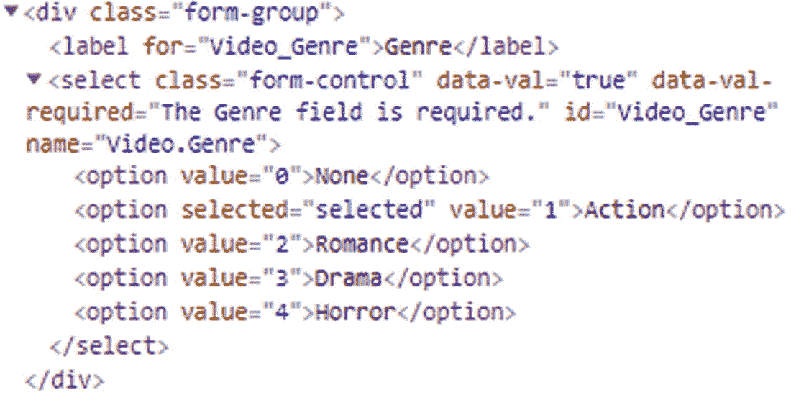

图 3-8

为下拉列表生成的标记

查看为下拉菜单生成的标记(图 [3-8](#Fig8) ，您会注意到标记看起来很像清单 [3-9](#PC9) 中的代码，在那里我们可以手动指定下拉菜单项目。

这就是标签助手和 HTML 助手允许我们做的事情。它们允许我们在页面中插入 HTML 标记的小片段。

### 改变数据服务

我们需要添加逻辑来将修改后的视频数据保存到数据存储中。目前，我们只是将视频数据绑定到表单上的字段，但是我们没有对表单做任何事情来保存修改。

我们的`EditModel`类中只有一个`OnGet`方法。查看 Razor 页面上的`<form>`元素，您会看到指定的方法是一个`POST`。所以从底部向上工作(如果你像我一样考虑底部的数据源和顶部的 UI)，让我们首先修改数据源的`IVideoData`接口。

我们需要向我们的接口添加两个新的逻辑部分，以允许我们处理修改后的数据。这些是

*   更新视频

*   将更改保存到数据库

我将更新和提交的逻辑分开，因为我想分离我的数据服务逻辑。

换句话说，我只希望我的 update 方法获取一个现有记录，并用来自编辑表单的已更改数据更新属性。我可能还想做一些额外的验证，并在将更改后的视频数据提交到数据库之前对其进行检查。

为此，我有一个单独的`Save`方法。考虑清单 [3-15](#PC15) 中`IVideoData`接口的变化。

```cs
public interface IVideoData
{
    IEnumerable<Video> ListVideos(string title);
    Video GetVideo(int id);
    Video UpdateVideo(Video videoData);
    int Save();
}

Listing 3-15The Modified IVideoData Interface

```

我们现在需要为添加到接口中的这些新方法提供实现。换句话说，我们需要修改实现这个接口的每个类，以提供新方法的实现。目前，唯一实现`IVideoData`接口的类是我们的`TestData`服务。

```cs
public Video UpdateVideo(Video updatedVideoData)
{
    var dbObj = _videoList.SingleOrDefault(x => x.Id == updatedVideoData.Id);
    if (dbObj != null)
    {
        dbObj.Title = updatedVideoData.Title;
        dbObj.ReleaseDate = updatedVideoData.ReleaseDate;
        dbObj.Genre = updatedVideoData.Genre;
        dbObj.Price = updatedVideoData.Price;
        dbObj.LentOut = updatedVideoData.LentOut;
        dbObj.LentTo = updatedVideoData.LentTo;
    }

    return dbObj;
}

Listing 3-16The UpdateVideo method

```

向名为`UpdateVideo`的`TestData`类添加一个方法，如清单 [3-16](#PC16) 所示。这种方法只涉及更新视频数据。它从`updatedVideoData`对象获取 ID，并试图在`_videoList`测试数据中找到匹配。

如果找到匹配，那么用`updatedVideoData`中的值更新找到的对象。

我们还需要为`Save`方法提供一个实现，因为我们目前没有保存任何数据。请记住，我们在这里只处理测试数据。我们这样做是为了在将我们的 web 应用连接到真实数据之前，我们可以将所有移动的部分都放置到位。

```cs
public int Save() => 0;

Listing 3-17The Save Method

```

这意味着我们可以简单地为`Save`方法返回`0`(列表 [3-17](#PC17) )，因为我们实际上不会在 TestData 服务中保存任何数据。

## 验证编辑的数据并显示验证错误

有句谚语说，永远不要相信一个骨瘦如柴的厨师。当涉及到用户时，软件开发也是如此。永远不要相信用户在表单上输入的数据。这样做很快就会让你陷入困境。

很多年前，我参与了一个项目，在这个项目中，表单上的验证被错误地实现了。这是一个包含美容产品配方的技术数据库。这些配方然后被加载到与该公司的 ERP 系统集成的制造流程中。然后，ERP 系统为制造流程的运行创造工作机会。

有时，这些配方中的一些会被改变以适应新的原材料、新的测量方法等等，从而影响最终产品的净数量或体积。

是的，公司有时会改变产品的重量或体积。看看巧克力变得多小就知道了。在我住的地方，我曾经可以买到我最喜欢的 100 克巧克力，但现在，可悲的是，我们只能买到 90 克巧克力。

用于输入和修改配方的表单为用户的输入提供了充分的验证。然后，它在数据网格中显示更新的条目，然后将其保存到数据库中。数据网格是用户在提交数据之前验证数据输入是否正确的最后一次检查。

在应用安装完成几周后，客户通知我们保存或更新食谱不再有效。应用向用户显示一个错误。他们发的截图显示这是一个未处理的异常。

结果是，虽然用户只能通过表单字段输入经过验证的信息，但他们发现在提交数据之前可以在数据网格中修改数据。

数据网格只是一种验证输入数据的方式，需要是只读的，但事实并非如此。当他们发现可以直接在网格中修改数据时，之前在输入表单上执行的所有验证都变得无关紧要了。

就像那部有恐龙的电影，杰夫·高布伦说生命会找到出路。当与最终用户打交道时，他们会找到输入无效数据的方法。

考虑到这一点，以及我们对最终用户的了解，我们需要为表单上输入的数据提供验证。首先向您的`EditModel`类添加一个`OnPost`方法(清单 [3-18](#PC18) )。

```cs
public IActionResult OnPost()
{
    return Page();
}

Listing 3-18The OnPost Method

```

在这里添加大量的`if`语句来执行输入数据的验证可能很有诱惑力。幸运的是，ASP.NET Core 提供了一个简单的方法来执行输入验证。我们可以在`VideoStore.Core`项目中为我们的`Video`模型添加数据注释。

确保通过系统添加所需的名称空间。ComponentModel.DataAnnotations 使用语句。

通过向`Title`属性添加`[Required]`注释，对您的`Video`模型做一点小小的改变，如清单 [3-19](#PC19) 所示。

```cs
using System;
using System.ComponentModel.DataAnnotations;

namespace VideoStore.Core
{
    public class Video
    {
        public int Id { get; set; }
        [Required]
        public string Title { get; set; }
        public DateTime ReleaseDate { get; set; }
        public MovieGenre Genre { get; set; }
        public double Price { get; set; }
        public bool LentOut { get; set; }
        public string LentTo { get; set; }
    }
}

Listing 3-19Adding a Required Field Validation to Title

```

如果输入的值不正确，我们现在可以使用`asp-validation-for`标签助手在表单上向用户提供一些反馈。在您的`Edit.cshtml` Razor 页面中，修改包含`Video.Title`输入的`div`，如清单 [3-20](#PC20) 所示。

```cs
<div class="form-group">
    <label asp-for="Video.Title"></label>
    <input asp-for="Video.Title" class="form-control" />
    <span class="text-danger" asp-validation-for="Video.Title"></span>
</div>

Listing 3-20Validation Added to Video.Title

```

切换回`EditModel`类，因为表单上的视频 ID 是我们想要修改的，所以我们可以将`[BindProperty]`属性添加到`Video`属性中。

您应该记得上一章中的内容，这将把属性更改为输入和输出属性。

修改后的属性需要被修改，看起来如清单 [3-21](#PC21) 所示。

```cs
[BindProperty]
public Video Video { get; set; }

Listing 3-21Modifying the Video Property

```

因此，当用户单击 Update Video 按钮时，`Video`属性将被填入表单中输入的值。

有了这些，加上我的`Video`模型上的数据注释，验证输入的数据就非常容易了。每当 ASP.NET Core 在我的`Video`模型上执行模型绑定时，框架会在一个我们称之为`ModelState`的东西中记录下对该数据所做的一切。现在，在更新我输入的任何表单数据之前，我可以检查一下`ModelState`是否有效。

继续修改 OnPost 方法来检查清单 [3-22](#PC22) 中所示的`ModelState`，如果有效，更新视频数据。

```cs
public IActionResult OnPost()
{
    if (ModelState.IsValid)
    {
        _ = _videoData.UpdateVideo(Video);
        _ = _videoData.Save();
        return RedirectToPage("./Detail", new { videoId = Video.Id });
    }
    Genres = _helper.GetEnumSelectList<MovieGenre>();
    return Page();
}

Listing 3-22Modified OnPost Method

```

您还会注意到，我重新绑定了`Genres`属性，因为 ASP.NET Core 是无状态的，并且这些值在`OnPost`方法中不会被持久化。我还告诉 web 应用，如果`ModelState`有效，并且视频已经更新，那么它必须重定向到详细页面。

您会记得我们在细节 Razor 页面的@page 指令中添加了 videoId。这就是我传视频的原因。编辑页的 OnPost 方法中 RedirectToPage 方法的路由值中的 Id。

运行应用并尝试为视频输入空白标题将导致表单验证在编辑页面上显示验证错误，如图 [3-9](#Fig9) 所示。

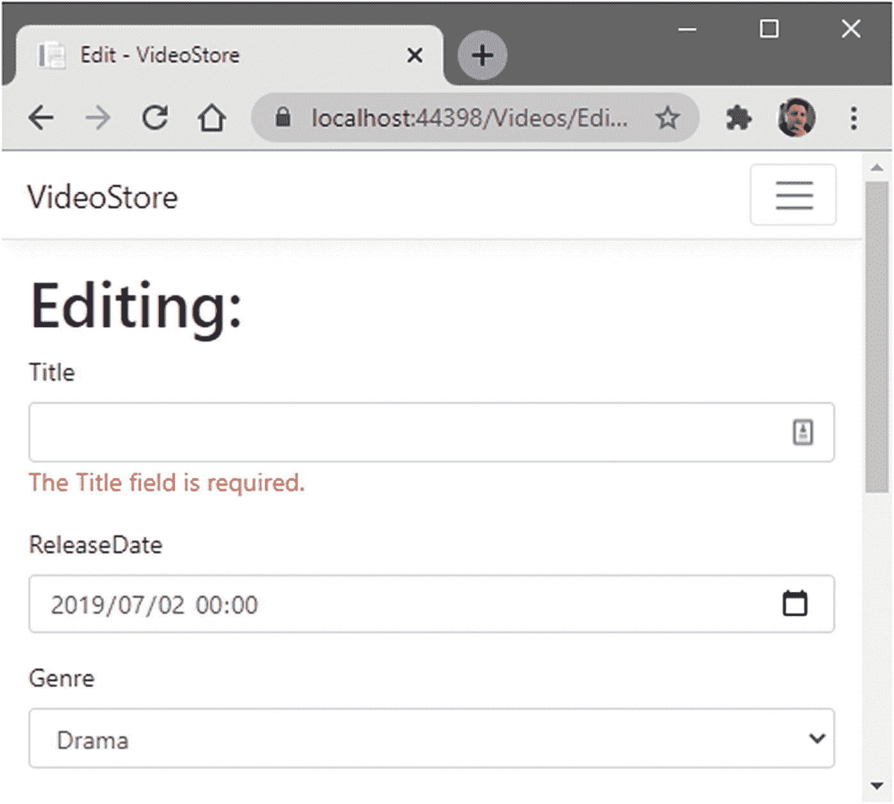

图 3-9

工作中的表单验证

这是我们想要的。我们不希望用户在没有指定视频标题的情况下更新视频。但是还有另一个问题(嗯，只是在我们开发的时候)。修改视频标题，然后单击“更新视频”按钮。

您将被重定向到详细信息页面，但您会注意到您更改的详细信息不会显示在详细信息页面上。这不是一个错误，这是因为我们在 Startup.cs 文件的`ConfigureServices`方法中指定`IVideoData`服务时做了一些事情。

你会记得(如清单 [3-23](#PC23) 所示)我们规定，每当有人需要一个`IVideoData`的实例时，给他们提供一个我们的`TestData`类的实例。

但是我们告诉`services`集合通过调用`services.AddScoped`方法来提供一个限定了范围的实例。

```cs
public void ConfigureServices(IServiceCollection services)
{
    _ = services.AddScoped<IVideoData, TestData>();
    _ = services.AddRazorPages();
}

Listing 3-23The ConfigureServices Method in the Startup.cs

```

为了在我们的测试数据中看到修改的数据，我们想要添加一个我们的`TestData`(清单 [3-24](#PC24) )的单例实例。这是我们只有在开发阶段才会做的事情。您很可能希望在这里添加一个`TODO`,以便在我们准备好对真实数据库进行操作时记住将它改回来。

```cs
public void ConfigureServices(IServiceCollection services)
{
    //_ = services.AddScoped<IVideoData, TestData>();
    _ = services.AddSingleton<IVideoData, TestData>(); // TODO: Change to scoped
    _ = services.AddRazorPages();
}

Listing 3-24Provide a Singleton Instance of TestData for Testing

```

做出此更改后，再次运行 web 应用，修改视频数据并保存更改。您将看到详细信息页面上显示的详细信息已经更新，以显示您的修改。

### add singleton vs . add scoped vs . add transient

我想在这里暂停一下，讨论一下我们可以为服务添加的不同生存期。您可以为服务集合注册以下生存期:

*   一个

*   审视

*   短暂的

其中的每一个都在依赖注入期间被利用，您需要确保为每个注册的服务选择了合适的生命周期。

#### 一个

当创建单例生存期服务时(使用`AddSingleton`方法)，每个后续请求都将使用同一个实例。这意味着在处理请求的应用中(比如我们的 web 应用)，当应用关闭时，单体服务被释放(因为`ServiceProvider`被释放)。

#### 审视

每个客户端请求(或连接)只创建一次作用域生存期。正如您在清单 [3-23](#PC23) 中看到的，我们使用`AddScoped`方法注册了作用域服务。这意味着对于处理请求的应用，作用域服务将在请求结束时被释放。

#### 短暂的

每次从服务容器请求服务时，都会创建一个具有短暂生存期的服务。换句话说，您告诉 ASP.NET Core，每次请求服务时，您都需要该服务的一个新实例。因此，瞬态服务在请求结束时被处理掉。

### 实现 IValidatableObject

如果您需要执行稍微复杂一点的验证，您可以通过在您的模型上实现`IValidatableObject`来完成。想象一下表单上的借出复选框。如果选中此项，我们希望“借出至”字段成为必填字段。我们如何做到这一点？这就是`IValidatableObject`接口派上用场的地方。

打开`VideoStore.Core`项目中的`Video`类，实现这个接口。在`Validate`方法中，为`LentTo`属性提供您的定制实现，如清单 [3-25](#PC25) 中的代码所示。

```cs
using System;
using System.Collections.Generic;
using System.ComponentModel.DataAnnotations;

namespace VideoStore.Core
{
    public class Video : IValidatableObject
    {
        public int Id { get; set; }
        [Required]
        public string Title { get; set; }
        public DateTime ReleaseDate { get; set; }
        public MovieGenre Genre { get; set; }
        public double Price { get; set; }
        public bool LentOut { get; set; }
        public string LentTo { get; set; }

        public IEnumerable<ValidationResult> Validate(ValidationContext validationContext)
        {
            var property = new[] { nameof(LentTo) };
            var validationResults = new List<ValidationResult>();

            if (LentOut && string.IsNullOrEmpty(LentTo))
            {
                validationResults.Add(new ValidationResult("Please enter a name for Lent To", property));
            }

            return validationResults;
        }
    }
}

Listing 3-25Implementing the IValidatableObject

```

实现接口的`Validate`方法允许我们提供一些定制的验证功能。在我们的例子中，如果“借出”字段为空，并且用户已经选中了“借出”复选框，那么我们希望它成为必填字段。

我们还需要在`Edit.cshtml` Razor 页面的`Video.LentTo`输入中添加`asp-validation-for`标签助手(清单 [3-26](#PC26) )。

```cs
<div class="form-group">
    <label asp-for="Video.LentTo"></label>
    <input asp-for="Video.LentTo" class="form-control" />
    <span class="text-danger" asp-validation-for="Video.LentTo"></span>
</div>

Listing 3-26Add the Validation Tag Helper to LentTo

```

如果您试图通过指定您已借出视频来更新视频，但没有提供您借出视频的人的姓名，表单验证将显示所需的验证消息，如图 [3-10](#Fig10) 所示。

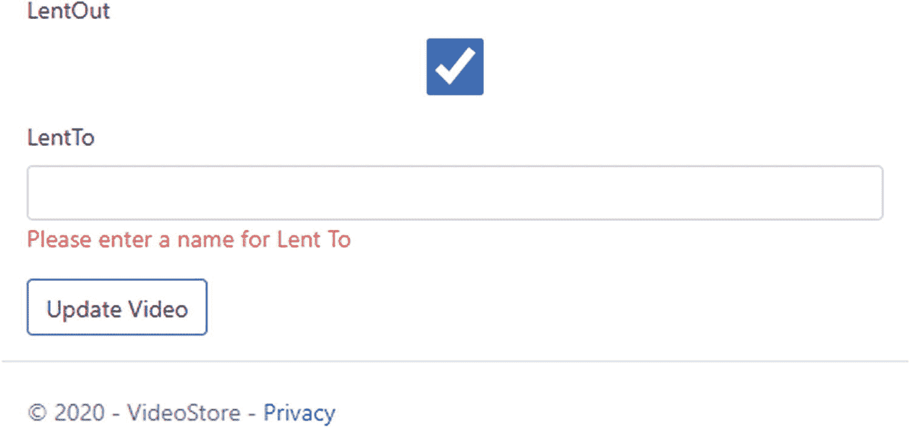

图 3-10

验证 LentTo 字段

定制验证可能会变得比我举例说明的简单定制验证复杂得多。然而，需要注意的是，当开箱即用的验证不能满足您的需求时，您可以使用`IValidatableObject`接口提供您需要的定制验证。

在本书中，我没有为`Video`模型的其他属性提供任何验证。我会把这些留给你玩。然而，我想做的是突出显示编辑表单的标签。

回头看图 [3-9](#Fig9) 和 [3-10](#Fig10) ，您会注意到标签在 web 页面上的呈现方式与属性名称的拼写方式相同。换句话说，视频的发布日期显示为`ReleaseDate`，借出复选框显示为`LentOut`，以此类推。我们可以通过修改`Video`模型来再次控制这种行为。

你可能需要引入系统。ComponentModel 命名空间。

在清单 [3-27](#PC27) 中，你会看到完整的`Video`型号代码。在您想要更改显示名称的每个属性上方，添加`[DisplayName]`注释。

```cs
using System;
using System.Collections.Generic;
using System.ComponentModel;
using System.ComponentModel.DataAnnotations;

namespace VideoStore.Core
{
    public class Video : IValidatableObject
    {
        public int Id { get; set; }
        [Required, DisplayName("Video Title")]
        public string Title { get; set; }
        [DisplayName("Release Date")]
        public DateTime ReleaseDate { get; set; }
        public MovieGenre Genre { get; set; }
        public double Price { get; set; }
        [DisplayName("Lent Out")]
        public bool LentOut { get; set; }
        [DisplayName("On Loan to")]
        public string LentTo { get; set; }

        public IEnumerable<ValidationResult> Validate(ValidationContext validationContext)
        {
            var property = new[] { nameof(LentTo) };
            var validationResults = new List<ValidationResult>();

            if (LentOut && string.IsNullOrEmpty(LentTo))
            {
                validationResults.Add(new ValidationResult("Please enter a name for Lent To", property));
            }

            return validationResults;
        }
    }
}

Listing 3-27Complete Video Model Code

```

现在，您可以精确控制各种属性在表单上的显示方式。您甚至可以组合几个注释，就像在`Title`属性上看到的那样，我们在一行中添加了`[Required, DisplayName("Video Title")]`。

运行 web 应用，在编辑表单上查看属性的新显示名称。

## 添加新视频

如果没有添加额外视频的能力，我们的视频商店 web 应用就像斗鸡比赛中的一只独腿鸡一样有用。我们已经添加了编辑现有视频的所有逻辑，但是我们还不能添加新视频。

有些人喜欢为此创建一个单独的添加页面，但是您会发现大部分逻辑与编辑页面的逻辑是相同的。我们可以将编辑页面重新用作编辑页面和添加页面。

要添加新视频，我想在视频列表中添加一个按钮，在搜索栏旁边。这样，如果用户搜索的视频不存在，他们可以轻松地添加视频。修改`<form>`以包括添加按钮，如清单 [3-28](#PC28) 所示。

```cs
<form method="get">
    <div class="form-group">
        <div class="input-group">
            <input type="search"
                   class="form-control"
                   asp-for="SearchQuery" />
            <button class="btn btn-group">
                <i class="fas fa-search"></i>
            </button>
            <a asp-page="./Edit" class="btn btn-group">
                <i class="fas fa-plus"></i>
            </a>
        </div>
    </div>
</form>

Listing 3-28The Modified List Page

```

然而，有一个小问题。当我们创建编辑页面时，我们告诉它我们将在 URL 中传递一个视频 ID。我们在 Edit.cshtml 页面上的`@page`指令中完成了这项工作。因此，它将只响应包含视频 ID 的路由。

要解决这个问题，我们需要告诉`@page`指令，路由中的视频 ID 是一个可选值。因此，我们需要将`@page`指令指定为`@page "{videoId:int?}"`，并在`int`后面加上一个问号，表示视频 ID 可以为空。为了便于理解，Edit.cshtml 页面需要如清单 [3-29](#PC29) 所示。

```cs
@page "{videoId:int?}"
@model VideoStore.Pages.Videos.EditModel
@{
    ViewData["Title"] = "Edit";
}

<h1>Editing: @Model.Video.Title</h1>

Listing 3-29The Edit.cshtml Page’s @page Directive

```

有了这一点，我们还需要修改我们的`EditModel`类的`OnGet`方法。清单 [3-30](#PC30) 中的代码包含修改后的`OnGet`方法。

```cs
public IActionResult OnGet(int? videoId)
{
    Genres = _helper.GetEnumSelectList<MovieGenre>();
    Video = videoId.HasValue
        ? _videoData.GetVideo(videoId.Value)
        : new Video
        {
            ReleaseDate = DateTime.Now.Date
        };

    return Video == null ? RedirectToPage("./VideoError", new { message = "The video does not exist" }) : (IActionResult)Page();
}

Listing 3-30The Modified OnGet Method

```

这里，我们告诉代码,`videoId`是一个可空的参数。如果那个`videoId`有一个值，那么使用我们的数据服务获取一个指定 ID 的视频。

如果`videoId`是`null`，那么实例化一个`Video`的新实例，并将`ReleaseDate`默认为当前日期。虽然这处理了用户添加新视频的情况，但我们需要修改我们的数据服务，以允许将该添加内容添加到视频列表(以及稍后的数据库)中。让我们接下来做那件事。

## 修改数据访问服务

再次从`IVideoData`接口开始工作，我们需要添加一个方法来添加一个名为`AddVideo`(或者您选择的任何名称)的视频，如清单 [3-31](#PC31) 所示。

```cs
using System.Collections.Generic;
using VideoStore.Core;

namespace VideoStore.Data
{
    public interface IVideoData
    {
        IEnumerable<Video> ListVideos(string title);
        Video GetVideo(int id);
        Video UpdateVideo(Video videoData);
        Video AddVideo(Video newVideo);
        int Save();
    }
}

Listing 3-31Modified IVideoData Interface to Allow Add

```

因为我们已经修改了我们的接口，所以我们需要在实现我们的接口的所有类中提供实现，在我们的例子中，只有`TestData`类。将清单 [3-32](#PC32) 中所示的方法添加到`TestData`类中。

```cs
public Video AddVideo(Video newVideo)
{
    newVideo.Id = _videoList.Max(x => x.Id) + 1;
    _videoList.Add(newVideo);
    return newVideo;
}

Listing 3-32The AddVideo Method in the TestData Class

```

当我们最终开始使用真实的数据库时，新的视频 ID 将在数据库表中自动递增。目前，当我们使用`TestData`类时，我们的视频 id 被硬编码在视频列表中。因此，我们需要添加代码行`newVideo.Id = _videoList.Max(x => x.Id) + 1`来模拟数据库中视频 ID 的增加。这是一段有点愚蠢、混乱的代码。它唯一的目的是让我们能够测试我们的 web 应用，并模拟真实数据服务的工作方式。

一旦我们创建了真正的数据服务，它也将实现`IVideoData`接口以及所有需要的方法。这些实现看起来与我们的`TestData`类非常不同。

我们现在剩下要做的就是修改`EditModel`类的`OnPost`方法。

### 修改 OnPost 方法

我们需要做的最后一点非常简单。如果我们有一个大于 T1 的 T0，那么我们正在更新一个现有的视频。如果`Video.Id`是`0`，那么我们正在添加一个新的视频。

```cs
public IActionResult OnPost()
{
    if (ModelState.IsValid)
    {
        _ = Video.Id > 0 ? _videoData.UpdateVideo(Video) : _videoData.AddVideo(Video);
        _ = _videoData.Save();
        return RedirectToPage("./Detail", new { videoId = Video.Id });
    }
    Genres = _helper.GetEnumSelectList<MovieGenre>();
    return Page();
}

Listing 3-33The Modified OnPost Method

```

修改后的`OnPost`方法可以在清单 [3-33](#PC33) 中看到。运行 web 应用，并添加新视频。新视频将被添加到我们的视频列表中，您可以编辑它并保存更改。

## 使用 TempData

将编辑页面重新用作添加页面也意味着我们可能需要更改一些标签和标题。您可能想从`Edit.cshtml`页面的`<h1>`标签中删除文本“Editing:”。

您可能还想更改“更新视频”按钮的文本。我会把这个作为家庭作业留给你们，但是我想讨论的是`TempData`的概念。如果我更新或添加一个视频，我希望`Detail`页面相应地响应一个合适的消息。想象一下在传统的 Windows 窗体应用中显示的消息对话框。我想通知用户发生了更新或添加。

在 ASP.NET Core 中，您可以访问 Razor 页面(位于`Microsoft.AspNetCore.Mvc.RazorPages`名称空间)或控制器(位于`Microsoft.AspNetCore.Mvc`名称空间)的临时数据。

`TempData`将存储信息，直到该信息在另一个请求中被读取。这意味着一旦它被阅读，它就死了。您可以使用`Keep`和`Peek`方法查看信息，而不用在请求结束时删除它。`Keep`方法顾名思义就是将`TempData`中的信息标记为应该保留的数据。然而，这不是我们将要做的事情。

如清单 [3-34](#PC34) 所示，您会看到我想决定在我的`TempData`中传递哪条消息。在调用`_videoData.Save()`方法之前，我执行了与决定是否应该更新或添加视频时相同的条件决定。也就是说，如果视频的 ID 大于`0`，那么我一定是在更新视频。如果没有，那我就加。

```cs
public IActionResult OnPost()
{
    if (ModelState.IsValid)
    {
        TempData["CommitMessage"] = Video.Id > 0 ? "Video Updated" : "Video Added";
        _ = Video.Id > 0 ? _videoData.UpdateVideo(Video) : _videoData.AddVideo(Video);
        _ = _videoData.Save();
        return RedirectToPage("./Detail", new { videoId = Video.Id });
    }
    Genres = _helper.GetEnumSelectList<MovieGenre>();
    return Page();
}

Listing 3-34Pass Conditional TempData Message

```

我现在可以转到我的`DetailModel`类并创建一个名为`CommitMessage`的属性，该属性具有`[TempData]`属性。你可以在清单 [3-35](#PC35) 中看到这段代码。

```cs
public class DetailModel : PageModel
{
    private readonly IVideoData _videoData;

    public Video Video { get; set; }

    [TempData]
    public string CommitMessage { get; set; }

    public DetailModel(IVideoData videoData)
    {
        _videoData = videoData;
    }

    public IActionResult OnGet(int videoId)
    {
        Video = _videoData.GetVideo(videoId);

        return Video == null ? RedirectToPage("./VideoError", new { message = "The video does not exist" }) : (IActionResult)Page();
    }
}

Listing 3-35The DetailModel Page

```

现在我有了一个用`TempData`属性修饰的属性，ASP.NET 内核将读取 Razor 页面的`TempData`，并查看它是否包含一个名为`CommitMessage`的键。属性名和`TempData`中的键匹配很重要；否则，ASP.NET Core 不能将存储在`TempData`中的值赋给该属性。

因此，完成更改后，剩下的工作就是检查`TempData`中值的存在，并在 Detail.cshtml Razor 页面上显示消息。清单 [3-36](#PC36) 中展示的代码显示了添加在`<h1>`视频标题下的提交消息。

```cs
@page "{videoId:int}"
@model VideoStore.Pages.Videos.DetailModel
@{
    ViewData["Title"] = "Detail";
}

<h1>@Model.Video.Title</h1>

@if (Model.CommitMessage != null)
{
    <div class="alert alert-info">@Model.CommitMessage</div>
}

<div>
    Catalog ID: @Model.Video.Id
</div>
<div>
    Release Date: @Model.Video.ReleaseDate.ToString("dd MMMM yyyy")
</div>
<div>
    Genre: @Model.Video.Genre
</div>
<div>
    Price: $@Model.Video.Price
</div>
<div>
    Lent Out: @Html.CheckBoxFor(x => x.Video.LentOut)
</div>

@if (Model.Video.LentOut == true)
{
    <div>
        Lent To: @Model.Video.LentTo
    </div>
}

<a asp-page="./List" class="btn btn-outline-primary">Back to Videos</a>

Listing 3-36The Detail Razor Page Commit Message

```

现在，当您添加或更新视频时，相应的消息将显示在详细的 Razor 页面上。如果刷新页面，消息将会消失。这是我们想要的。这只是临时数据。

如果您修改显示提交消息的标记，并指定必须保留临时数据，那么结果会非常不同。

修改`Detail.cshtml` Razor 页面中的标记部分，告诉 ASP.NET 用`CommitMessage`的键保留`TempData`。代码如清单 [3-37](#PC37) 所示。

```cs
@if (Model.CommitMessage != null)
{
    TempData.Keep("CommitMessage");
    <div class="alert alert-info">@Model.CommitMessage</div>
}

Listing 3-37Keeping TempData

```

这一次，当您在`Detail.cshtml` Razor 页面上看到提交消息，并点击刷新按钮时，消息仍然在那里。

### 更改临时数据提供程序

默认情况下，TempData 的提供程序基于 cookie。你可以在浏览器的 DevTools 中看到这一点(我正在使用谷歌 Chrome - Figure [3-11](#Fig11) )。清单 [3-37](#PC37) 中展示的代码行`TempData.Keep`准备就绪后，当你看到`Detail`页面时，添加一个新的视频并打开 DevTools。

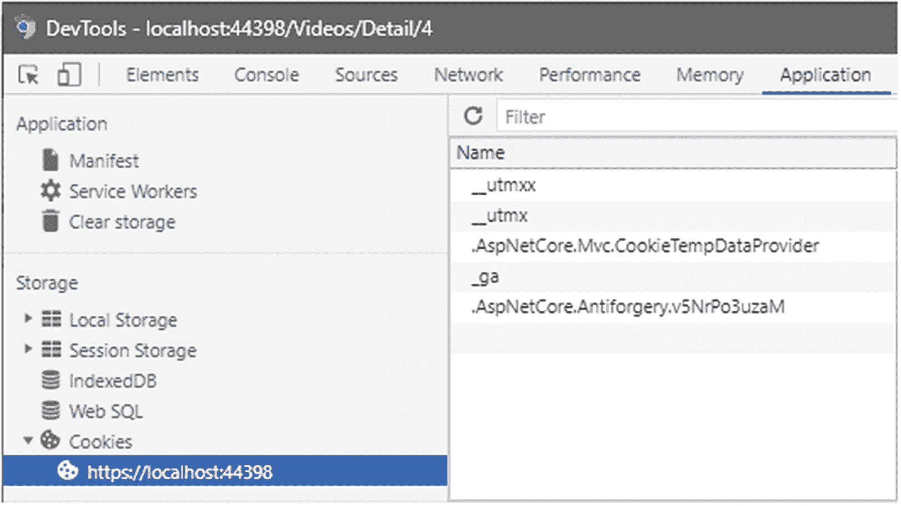

图 3-11

默认的基于 Cookie 的临时数据提供程序

转到“应用”选项卡，展开“存储”下的“Cookies”节点。在那里，你会看到`AspNetCore.Mvc.CookieTempDataProvider`被列出。您可以通过启用基于会话的`TempData`提供者来改变这种行为。我们需要在应用的`Startup`类中这样做。

如清单 [3-38](#PC38) 所示，您需要将扩展方法`AddSessionStateTempDataProvider`添加到`AddRazorPages()`方法中。您还必须添加代码行`_ = services.AddSession()`。

```cs
public void ConfigureServices(IServiceCollection services)
{
    //_ = services.AddScoped<IVideoData, TestData>();
    _ = services.AddSingleton<IVideoData, TestData>(); // TODO: Change to scoped
    _ = services.AddRazorPages().AddSessionStateTempDataProvider();
    _ = services.AddSession();
}

Listing 3-38The ConfigureServices Method

```

从`ConfigureServices`方法来看，这就是我们需要做的一切。然而，我们确实需要稍微修改一下`Configure`方法。

你会注意到我在代码中适当的地方使用了 C# 丢弃。这只是我喜欢做的事情，对于代码的正确运行来说并不是必需的。如果你不熟悉抛弃，你可以在微软文档上阅读更多关于它的内容，链接如下: [`https://docs.microsoft.com/en-us/dotnet/csharp/discards`](https://docs.microsoft.com/en-us/dotnet/csharp/discards) 。

修改清单 [3-39](#PC39) 中所示的`Configure`方法，在调用`UseEndpoints`扩展方法之前添加代码行`_ = app.UseSession()`。

```cs
public void Configure(IApplicationBuilder app, IWebHostEnvironment env)
{
    if (env.IsDevelopment())
    {
        _ = app.UseDeveloperExceptionPage();
    }
    else
    {
        _ = app.UseExceptionHandler("/Error");
        _ = app.UseHsts();
    }

    _ = app.UseHttpsRedirection();
    _ = app.UseStaticFiles();

    _ = app.UseRouting();

    _ = app.UseAuthorization();

    _ = app.UseSession();

    _ = app.UseEndpoints(endpoints =>
      {
          _ = endpoints.MapRazorPages();
      });
}

Listing 3-39The Modified Configure Method

```

再次运行 web 应用，添加一个新视频，并在看到详细页面时打开 DevTools。

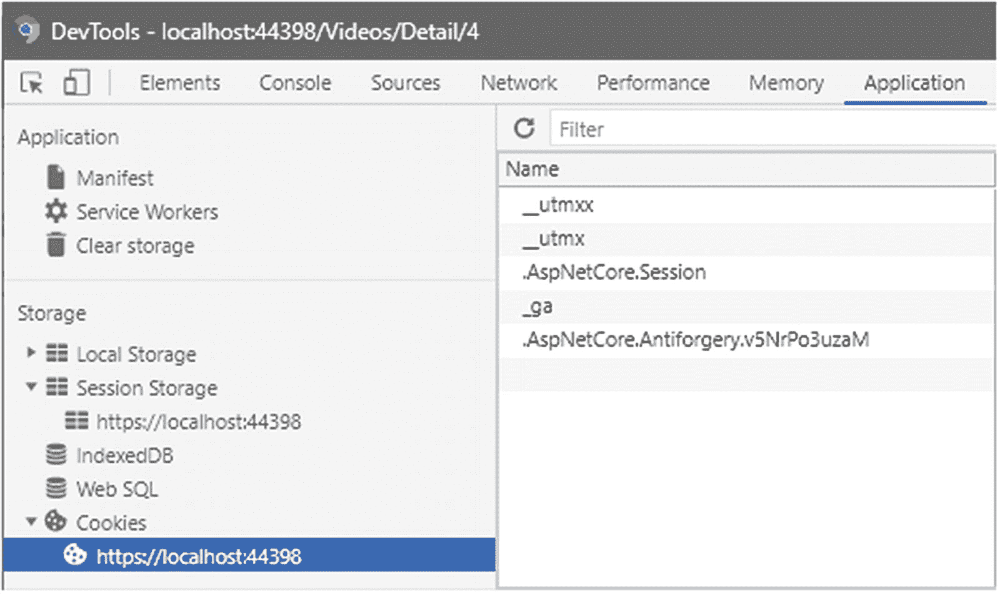

图 3-12

基于会话的临时数据提供程序

这一次，在“存储”下的“Cookies”节点下的“应用”选项卡上，您将看到`AspNetCore.Session`是正在使用的提供者(图 [3-12](#Fig12) )。