# 四、EF 核心和 SQL Server

我们的 web 应用的最终目标是处理一个真正的 SQL 数据库。到目前为止，我们只与我们的`TestData`服务合作。您会记得，我们创建这个服务是为了模拟真实 SQL 数据库的工作方式，当时我们正忙于开发应用的基础。

然而，现在是时候看看如何安装实体框架核心并开始使用真实数据了。在我开始之前，让我们暂停一下，看看什么是实体框架核心。

## 实体框架核心

如果你以前使用过实体框架，你会觉得很熟悉。实体框架核心(简称 EF Core)是实体框架的轻量级版本。它是可扩展的、开源的，因为它被称为“核心”，所以你知道它可以跨平台工作。EF 核心还充当操作系统。这使得 EF 核心能够

*   使开发人员能够使用。网络对象

*   不再需要编写数据访问代码

如果你习惯于自己编写数据访问代码，那么 EF Core 对你来说可能是一个范式转变。它确实使生活变得更加容易，但是，一些开发人员讨厌使用它。尽管如此，EF Core 仍将存在，鉴于它支持许多数据库引擎，我怀疑它会很快消失。

点击以下链接查看英孚核心数据库提供商名单: [`https://docs.microsoft.com/en-us/ef/core/providers/?tabs=dotnet-core-cli`](https://docs.microsoft.com/en-us/ef/core/providers/%253Ftabs%253Ddotnet-core-cli) 。

不必编写大量数据访问代码，由 EF Core 为您生成，这种便利是非常有益的。当您使用 EF Core 时，数据访问是使用模型完成的。这包括实体类和上下文对象。这表示一个数据库会话。

我们稍后将回到上下文对象，但是要知道这个对象允许您查询和保存数据。实体框架支持以下模型开发方法:

*   您可以从现有数据库生成模型。

*   您可以手动创建一个模型来匹配您的数据库。

*   创建的模型可用于使用 EF 迁移创建数据库。EF 迁移还允许您在模型改变时更新数据库。

简而言之，这就是英孚核心的全部。接下来我们来看看安装 EF 核心。

## 安装实体框架

当我们第一次创建 web 应用时，我们创建了`VideoStore.Data`项目。这个想法是在我们的解决方案中分离关注点。这个项目是我们将安装 EF 核心。

右键点击`VideoStore.Data`项目，点击`Manage NuGet Packages`链接(也可以右键点击`Dependencies`节点)。

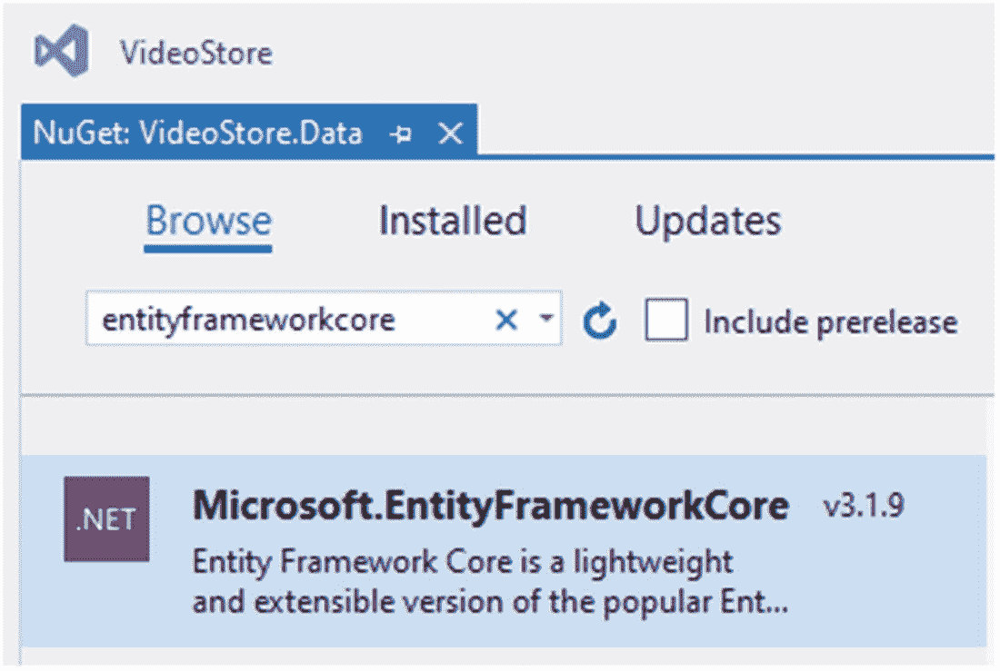

图 4-1

浏览实体框架核心 NuGet 包

在浏览选项卡中，搜索`Microsoft.EntityFrameworkCore`包(图 [4-1](#Fig1) )。对我来说，最新版本是 3.1.9，但对你来说，可能会有所不同。其次，我们需要安装一个数据库提供程序。我们将使用 SQL Server，所以搜索并安装`Microsoft.EntityFrameworkCore.SqlServer` NuGet 包(图 [4-2](#Fig2) )。

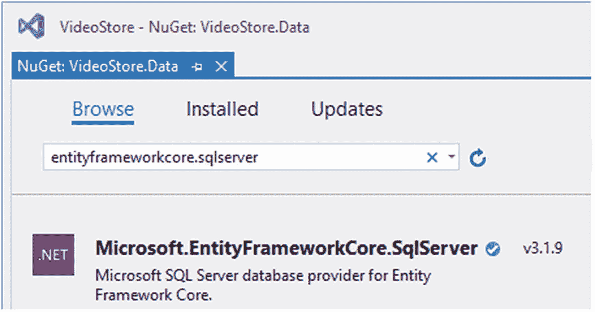

图 4-2

EF 核心数据库提供商

我们将安装的最后一个 NuGet 包是 Microsoft。EntityFrameworkCore . Design nu get 包(图 [4-3](#Fig3) )。

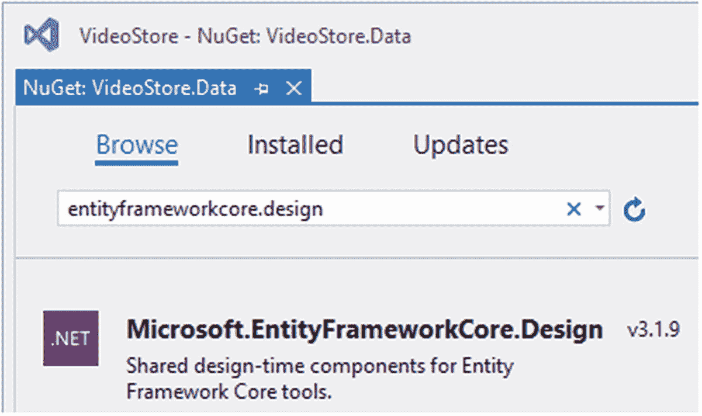

图 4-3

EF 核心设计时组件

值得注意的是，您也可以使用`dotnet add`命令从命令行安装所需的包。打开命令提示符，键入`dotnet -h`以查看清单 [4-1](#PC1) 中的输出。

```cs
SDK commands:
  add             Add a package or reference to a .NET project.
  build           Build a .NET project.
  build-server    Interact with servers started by a build.
  clean           Clean build outputs of a .NET project.
  help            Show command line help.
  list            List project references of a .NET project.
  msbuild         Run Microsoft Build Engine (MSBuild) commands.
  new             Create a new .NET project or file.
  nuget           Provides additional NuGet commands.
  pack            Create a NuGet package.
  publish         Publish a .NET project for deployment.
  remove          Remove a package or reference from a .NET project.
  restore         Restore dependencies specified in a .NET project.
  run             Build and run a .NET project output.
  sln             Modify Visual Studio solution files.
  store           Store specified assemblies in the runtime package store.
  test            Run unit tests using test runner specified in a .NET project.
  tool            Install or manage tools that extend the .NET experience.
  vstest          Run Microsoft Test Engine (VSTest) commands.

Additional commands from bundled tools:
  dev-certs       Create and manage development certificates.
  fsi             Start F# Interactive / execute F# scripts.
  sql-cache       SQL Server cache command-line tools.
  user-secrets    Manage development user secrets.
  watch           Start a file watcher that runs a command when files change.

Listing 4-1The dotnet Commands

```

看看下面的链接，了解更多关于`dotnet add`命令的信息: [`https://docs.microsoft.com/en-us/dotnet/core/tools/dotnet-add-package`](https://docs.microsoft.com/en-us/dotnet/core/tools/dotnet-add-package) 。最后，如果你打开`VideoStore.Data`的`.csproj`文件，你会看到我们刚刚添加的包引用(清单 [4-2](#PC2) )。

```cs
<Project Sdk="Microsoft.NET.Sdk">

  <PropertyGroup>
    <TargetFramework>netcoreapp3.1</TargetFramework>
  </PropertyGroup>

  <ItemGroup>
    <PackageReference Include="Microsoft.EntityFrameworkCore" Version="3.1.9" />
    <PackageReference Include="Microsoft.EntityFrameworkCore.Design" Version="3.1.9">
      <PrivateAssets>all</PrivateAssets>
      <IncludeAssets>runtime; build; native; contentfiles; analyzers; buildtransitive</IncludeAssets>
    </PackageReference>
    <PackageReference Include="Microsoft.EntityFrameworkCore.SqlServer" Version="3.1.9" />
  </ItemGroup>

  <ItemGroup>
    <ProjectReference Include="..\VideoStore.Core\VideoStore.Core.csproj" />
  </ItemGroup>

</Project>

Listing 4-2VideoStore.Data csproj File

```

我们现在需要做的就是将 EF Core 添加到`VideoStore.Data`项目中。我们单子上的下一个任务是看`DbContext`。

## 实现 DbContext

一个`DbContext`实例将代表一个与数据库的会话。这将允许我们保存和查询实体实例。我们要做的是创建一个类，并从`DbContext`中派生出来。

这个类将包含代表模型中每个实体的类型为`DbSet<T>`的属性。右键单击`VideoStore.Data`项目，并将名为`VideoDbContext`的新类添加到项目中。

请务必添加微软。EntityFrameworkCore 和 VideoStore。核心命名空间添加到类中。

创建了`VideoDbContext`类后，从`DbContext`继承该类，如清单 [4-3](#PC3) 所示。

```cs
namespace VideoStore.Data
{
    public class VideoDbContext : DbContext
    {
    }
}

Listing 4-3The VideoDbContext Class

```

我们的应用处理视频，所以我知道我需要向类型为`DbSet<Video>`的`VideoDbContext`类添加一个属性。`DbSet`告诉实体框架我要查询、添加、删除和更新视频。

虽然 Entity Framework 可能理解 DbSet 告诉它的内容，但对于开发人员来说，这可能不是显而易见的。我同意 DbSet 这个名字并没有使这个类的目的变得明显。每当我试图弄清楚一个特定的类或方法是做什么的时候，我都会看一下元数据。为此，单击清单 [4-4](#PC4) 中的 DbSet 并按 F12。现在您可以确切地看到这个类做了什么。代码注释一定会帮助你理解更多。

修改`VideoDbContext`类，如清单 [4-4](#PC4) 所示。

```cs
using Microsoft.EntityFrameworkCore;
using VideoStore.Core;

namespace VideoStore.Data
{
    public class VideoDbContext : DbContext
    {
        public DbSet<Video> Videos { get; set; }
    }
}

Listing 4-4The Videos Property Added to VideoDbContext

```

我们现在可以在`VideoDbContext`上使用这个属性来处理我们的数据库。

## 指定数据库连接字符串

我们需要做的下一件事是添加一些代码，告诉实体框架我们想要使用什么数据库。我们将使用 LocalDB。它是在你安装 Visual Studio(我用的是 Visual Studio 2019)的时候安装的，非常适合我们现在要做的事情。

要检查是否安装了 LocalDB，请在命令提示符下运行该命令，如清单 [4-5](#PC5) 所示。

```cs
Sqllocaldb info

Listing 4-5Check If LocalDb Is Installed

```

您应该会看到命令提示符中列出了 LocalDB 的实例，如图 [4-4](#Fig4) 所示。

我们只有一个 LocalDB 实例`MSSQLLocalDB`，但是如果你使用 Umbraco，你可能会有额外的 LocalDB 实例。

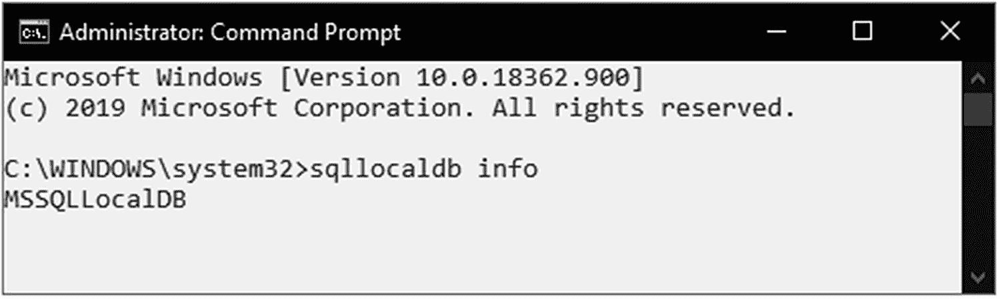

图 4-4

列出的 LocalDB 实例

然而，在我们的应用中，我们将使用内置的 LocalDB 数据库，这就是图 [4-4](#Fig4) 中显示的输出中列出的内容。要获得关于`MSSQLLocalDB`实例的更多信息，运行清单 [4-6](#PC6) 中所示的命令。

```cs
Sqllocaldb info MSSQLLocalDB

Listing 4-6Getting Additional Info for MSSQLLocalDB

```

这将列出关于当前在您的机器上的 LocalDB 实例(在本例中为 MSSQLLocalDB)的更多细节(图 [4-5](#Fig5) )。

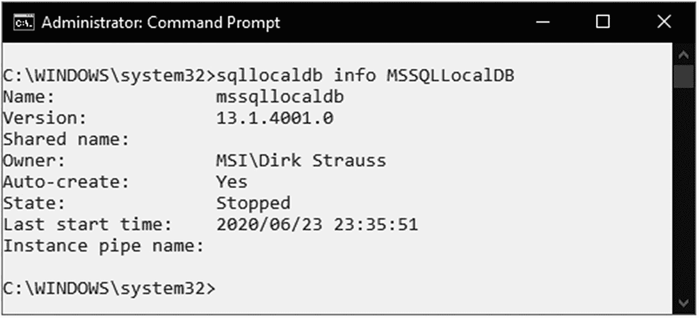

图 4-5

查看有关 MSSQLLocalDB 的更多信息

正如您可能已经猜到的，在命令提示符中的`sqllocaldb`命令后添加`-?`将会列出您可以运行的可用命令。这些可以在清单 [4-7](#PC7) 中看到。

```cs
C:\WINDOWS\system32>sqllocaldb -?
Microsoft (R) SQL Server Express LocalDB Command Line Tool
Version 13.0.1601.5
Copyright (c) Microsoft Corporation.  All rights reserved.

Usage: SqlLocalDB operation [parameters...]

Operations:

  -?
    Prints this information

  create|c ["instance name" [version-number] [-s]]
    Creates a new LocalDB instance with a specified name and version
    If the [version-number] parameter is omitted, it defaults to the
    latest LocalDB version installed in the system.
    -s starts the new LocalDB instance after it's created

  delete|d ["instance name"]
    Deletes the LocalDB instance with the specified name

  start|s ["instance name"]
    Starts the LocalDB instance with the specified name

  stop|p ["instance name" [-i|-k]]
    Stops the LocalDB instance with the specified name,
    after current queries finish
    -i request LocalDB instance shutdown with NOWAIT option
    -k kills LocalDB instance process without contacting it

  share|h ["owner SID or account"] "private name" "shared name"
    Shares the specified private instance using the specified shared name.
    If the user SID or account name is omitted, it defaults to current user.

  unshare|u ["shared name"]
    Stops the sharing of the specified shared LocalDB instance.

  info|i
    Lists all existing LocalDB instances owned by the current user
    and all shared LocalDB instances.

  info|i "instance name"
    Prints the information about the specified LocalDB instance.

  versions|v
    Lists all LocalDB versions installed on the computer.

  trace|t on|off

    Turns tracing on and off

SqlLocalDB treats spaces as delimiters. It is necessary to surround
instance names that contain spaces and special characters with quotes.
For example:
   SqlLocalDB create "My LocalDB Instance"

The instance name can sometimes be omitted, as indicated above, or
specified as "". In this case, the reference is to the default LocalDB
instance "MSSQLLocalDB".

Listing 4-7The Available LocalDB Commands

```

您还可以在 Visual Studio 中看到 LocalDB 实例，方法是转到`View`菜单并单击`SQL Server Object Explorer`菜单。也可以按下`Ctrl+\, Ctrl+S`打开`SQL Server Object Explorer`。该实例可能包含一个或多个数据库。

我们将在开发过程中使用这个 LocalDB 实例，但是我们需要在我们的视频商店应用中创建一个到它的连接。这样做的地方是在`appsettings.json`文件中。您应该记得，我们在这里添加了视频列表页面的页面标题。这一次，我们要做的就是添加一个名为`ConnectionStrings`的新部分，如清单 [4-8](#PC8) 所示。

```cs
{
  "Logging": {
    "LogLevel": {
      "Default": "Information",
      "Microsoft": "Warning",
      "Microsoft.Hosting.Lifetime": "Information"
    }
  },
  "AllowedHosts": "*",
  "VideoListPageTitle": "Video Store - Videos List",
  "ConnectionStrings": {
    "VideoConn": "Data Source=(localdb)\\MSSQLLocalDB;Initial Catalog=VideoStore;Integrated Security=True;"
  }
}

Listing 4-8Connection Strings Added to appsettings.json

```

`ConnectionStrings`部分是有目的的复数，因为这暗示了您可以向这个配置部分添加多个连接字符串。在`ConnectionStrings`部分中，我们为我们想要使用的各种数据库连接定义了键和值对。

对于我们的数据库连接，我们简单地添加了一个名为`VideoConn`的键和一个定义到 LocalDB 数据库的连接的值。

然而，有一点需要注意的是，`Initial Catalog`(它指定了我们的数据库)指定了一个名为`VideoStore`的数据库。这个数据库还不存在，但是现在还可以。我们现在需要一种方法来告诉`DbContext`关于我们想要使用的数据库的连接。我们在`Startup.cs`类的`ConfigureServices`方法中实现了这一点。

您必须添加 Microsoft。启动类的 EntityFrameworkCore 命名空间。

更改启动类中的 ConfigureServices 方法，如清单 [4-9](#PC9) 所示。

```cs
public void ConfigureServices(IServiceCollection services)
{
    services.AddDbContextPool<VideoDbContext>(dbContextOptns =>
    {
        dbContextOptns.UseSqlServer(
            Configuration.GetConnectionString("VideoConn"));
    });

    _ = services.AddSingleton<IVideoData, TestData>(); // TODO: Change to scoped
    _ = services.AddRazorPages().AddSessionStateTempDataProvider();
    _ = services.AddSession();
}

Listing 4-9The ConfigureServices Method

```

通过引入实体框架核心名称空间，我们可以使用`UseSqlServer`方法告诉实体框架我在应用中使用的`DbContext`。我们还告诉它使用`DbContext`池。这允许增加吞吐量，因为`DbContext`实例被重用，而不是为每个请求创建新的实例。

需要注意的是，我们在 appsettings.json 文件中用于连接字符串的键必须与传递给 GetConnectionString 方法的字符串相匹配。

既然我们已经将`DbContext`注册为`IServiceCollection`中的服务，我们需要对`VideoDbContext`类本身进行更改。我们需要告诉它我们正在使用的连接字符串以及用`DbContextOptionsBuilder`指定的任何其他选项。

```cs
using Microsoft.EntityFrameworkCore;
using VideoStore.Core;

namespace VideoStore.Data
{
    public class VideoDbContext : DbContext
    {
        public VideoDbContext(DbContextOptions<VideoDbContext> dbContextOptns) : base(dbContextOptns)
        {

        }

        public DbSet<Video> Videos { get; set; }
    }
}

Listing 4-10The Modified VideoDbContext Class

```

我们通过向`VideoDbContext`类添加一个构造函数并传递`DbContextOptions`来实现这一点，如清单 [4-10](#PC10) 所示。因为`VideoDbContext`类继承自`DbContext`，我们只需将`DbContextOptions`传递给基类。查看`DbContext`类的元数据(清单 [4-11](#PC11) ，我们可以看到它将`DbContextOptions`作为其构造函数中的一个参数。

```cs
//
// Summary:
//     Initializes a new instance of the
//     Microsoft.EntityFrameworkCore.DbContext class
//     using the specified options. The Microsoft.EntityFrameworkCore
//     .DbContext.OnConfiguring(Microsoft.EntityFrameworkCore
//     .DbContextOptionsBuilder) method will still be called to
//     allow further configuration of the options.
//
// Parameters:
//   options:
//     The options for this context.
public DbContext([NotNullAttribute] DbContextOptions options);

//
// Summary:
//     Initializes a new instance
//     of the Microsoft.EntityFrameworkCore.DbContext class.
//     The Microsoft.EntityFrameworkCore.DbContext
//     .OnConfiguring(Microsoft.EntityFrameworkCore
//     .DbContextOptionsBuilder)
//     method will be called to configure the database
//     (and other options) to be used for this context.
protected DbContext();

Listing 4-11The DbContext Metadata

```

现在剩下的工作就是使用数据库迁移来创建我们之前在连接字符串中指定的数据库。

## 使用数据库迁移

处理迁移可能很容易，但也可能有些棘手。我知道这看起来有点矛盾，但请听我说完。我将使用命令行向`VideoStore`项目添加迁移。我在设置它的时候遇到了一些小问题，但是接下来我将概述是什么导致了这些问题。

我想做的是看看我是否能从命令行运行`dotnet ef dbcontext info`命令，如清单 [4-12](#PC12) 所示。

```cs
dotnet ef dbcontext info

Listing 4-12Getting the DbContext Info

```

我应该得到一个错误，告诉我它不能创建`VideoDbContext`，这是意料之中的。

如果您在尝试运行`dotnet ef dbcontext info`时收到一条错误消息，指出找不到 dotnet 工具，那么您可能需要先安装它。运行`dotnet tool install --global dotnet-ef`。更多内容，请看下面这篇文章: [`https://docs.microsoft.com/en-us/dotnet/core/tools/dotnet-tool-install`](https://docs.microsoft.com/en-us/dotnet/core/tools/dotnet-tool-install) 。

这是因为`VideoStore.Data`项目是一个单独的项目。它不知道任何关于包含`ConfigureServices`方法的`Startup.cs`类的事情。请记住，我们在本章前面的清单 [4-9](#PC9) 中对此进行了修改。

因此，我们需要说出真相。NET 核心，启动项目是我们的解决方案。我们通过指定`-s`并给它到启动项目的`csproj`文件的路径来做到这一点(列表 [4-13](#PC13) )。

。NET Core 现在知道了启动项目，并将能够找到连接字符串和`DbContext`类。

```cs
dotnet ef dbcontext info -s ..\VideoStore\VideoStore.csproj

Listing 4-13Telling .NET Core Where the Startup Project Is

```

运行清单 [4-13](#PC13) 中所示的命令将产生类似于清单 [4-14](#PC14) 中所示的输出。

```cs
Build started...
Build succeeded.
Provider name: Microsoft.EntityFrameworkCore.SqlServer
Database name: VideoStore
Data source: (localdb)\MSSQLLocalDB
Options: MaxPoolSize=128

Listing 4-14The Expected Output

```

正是在这里，我也遇到了一个奇怪的错误。不幸的是，这是我无知的结果。当试图运行清单 [3-13](3.html#PC13) 中的命令时，我收到一个错误，指出启动项目不包括`Microsoft.EntityFrameworkCore.Design` NuGet 包(图 [4-6](#Fig6) )。

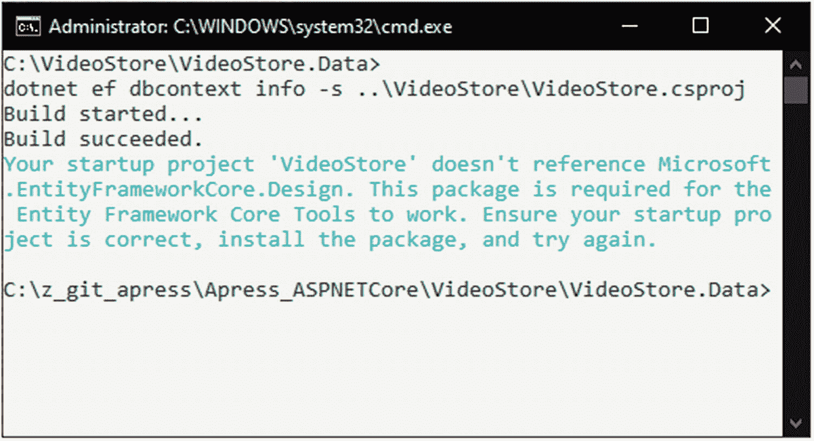

图 4-6

EntityFrameworkCore。设计缺失

我从 NuGet 安装了它，并再次尝试添加迁移。这次我在清单 [4-15](#PC15) 中收到了这个错误。

```cs
Method 'Create' in type 'Microsoft.EntityFrameworkCore.SqlServer.Query.Internal.SqlServerSqlTranslatingExpressionVisitorFactory' from assembly 'Microsoft.EntityFrameworkCore.SqlServer, Version=3.1.9.0, Culture=neutral, PublicKeyToken=adb9793829ddae60' does not have an implementation.

Listing 4-15Create Method Error

```

开门见山地说，这是我的`VideoStore.Data`项目和我的启动项目中的`EntityFrameworkCore` NuGet 包版本不匹配的结果。你需要确保版本匹配(如图 [4-7](#Fig7) 所示)。

在我的例子中，版本是 3.1.9，但是对你来说可能不同。

确保项目之间相似的 NuGet 包的版本匹配通常是一个好主意；否则，你可能会陷入一个浪费时间、让你无止境沮丧的错误中。

最后，我们准备将迁移添加到我们的数据项目中。迁移允许我们在数据模型被修改时保持数据库与数据模型同步。迁移的工作方式如下:

*   当数据模型发生更改时，您可以向项目中添加迁移，该迁移将描述保持数据库与项目同步所需的更改。EF Core 所做的是将当前数据模型与旧模型的快照进行比较，并找出差异。然后生成迁移文件。

*   然后，EF Core 会将生成的迁移应用到数据库，并将历史记录在一个表中。这使您可以看到哪些迁移已经应用，哪些没有应用。

有关迁移的更多信息，请务必点击此处查看微软文档上的以下文章: [`https://docs.microsoft.com/en-us/ef/core/managing-schemas/migrations/?tabs=dotnet-core-cli`](https://docs.microsoft.com/en-us/ef/core/managing-schemas/migrations/%253Ftabs%253Ddotnet-core-cli) 。

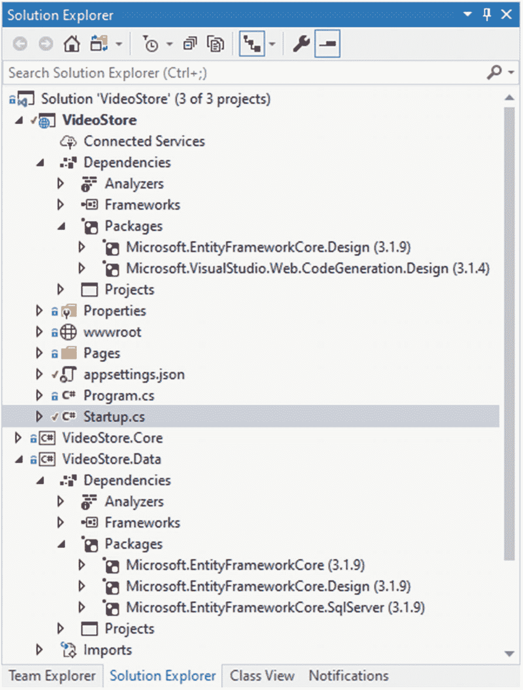

图 4-7

确保相同的 EntityFrameworkCore 版本

让我们看看从命令行运行`dotnet ef`时可用的一些选项。

如果你看一下清单 [4-16](#PC16) 所示的输出，你会注意到`migrations`是选项之一。

```cs
                     _/\__
               ---==/    \\
         ___  ___   |.    \|\
        | __|| __|  |  )   \\\
        | _| | _|   \_/ |  //|\\
        |___||_|       /   \\\/\\

Entity Framework Core .NET Command-line Tools 5.0.0

Usage: dotnet ef [options] [command]

Options:
  --version        Show version information
  -h|--help        Show help information
  -v|--verbose     Show verbose output.
  --no-color       Don't colorize output.
  --prefix-output  Prefix output with level.

Commands:
  database    Commands to manage the database.
  dbcontext   Commands to manage DbContext types.
  migrations  Commands to manage migrations.

Use "dotnet ef [command] --help" for more information about a command.

Listing 4-16The dotnet ef Command Output

```

继续从命令行运行`dotnet ef migrations`，并检查输出，如清单 [4-17](#PC17) 所示。

```cs
Usage: dotnet ef migrations [options] [command]

Options:
  -h|--help        Show help information
  -v|--verbose     Show verbose output.
  --no-color       Don't colorize output.
  --prefix-output  Prefix output with level.

Commands:
  add     Adds a new migration.
  list    Lists available migrations.
  remove  Removes the last migration.
  script  Generates a SQL script from migrations.

Use "migrations [command] --help" for more information about a command

Listing 4-17The dotnet ef migrations Command Output

```

在这里，您将看到我们可以列出所有迁移、删除它们、添加它们，或者根据我们的迁移生成 SQL 脚本。在我们的例子中，目前，我们想要添加一个新的迁移。

运行清单 [4-18](#PC18) 所示的命令，向我们的 VideoStore 添加一个新的迁移。数据项目。

```cs
dotnet ef migrations add 20201114a -s ..\VideoStore\VideoStore.csproj

Listing 4-18Add a New Migration

```

和以前一样，我指定了启动项目，但是我也指定了需要生成的迁移文件的名称。

我将我的迁移文件称为日期`20201114a`和`a`(表示第一次迁移)。但是，这并没有什么必要，因为迁移文件中确实包含了日期。我只是喜欢将它添加到迁移文件名中，但是您可以将您的迁移命名为任何对您有意义的名称。

添加迁移后，控制台窗口中的输出应该如清单 [4-19](#PC19) 所示。

```cs
Build started...
Build succeeded.
Done. To undo this action, use 'ef migrations remove'

Listing 4-19Migration Added

```

回到 Visual Studio，您会注意到。NET Core 已经在你的`VideoStore.Data`项目中添加了一个`Migrations`文件夹。在该文件夹中，您将找到您新添加的迁移(图 [4-8](#Fig8) )。

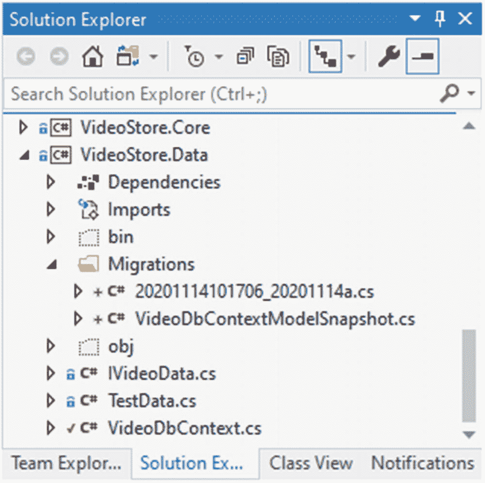

图 4-8

添加到 Visual Studio 的迁移

在 Visual Studio 中打开该文件(清单 [4-20](#PC20) ，您会看到它只是创建了一个名为`Videos`的表。这是因为我们在`VideoStore.Core`项目中有一个名为`Video`的数据模型。

```cs
using System;
using Microsoft.EntityFrameworkCore.Migrations;

namespace VideoStore.Data.Migrations
{
    public partial class _20201114a : Migration
    {
        protected override void Up(MigrationBuilder migrationBuilder)
        {
            migrationBuilder.CreateTable(
                name: "Videos",
                columns: table => new
                {
                    Id = table.Column<int>(nullable: false)
                        .Annotation("SqlServer:Identity", "1, 1"),
                    Title = table.Column<string>(nullable: false),
                    ReleaseDate = table.Column<DateTime>(nullable: false),
                    Genre = table.Column<int>(nullable: false),
                    Price = table.Column<double>(nullable: false),
                    LentOut = table.Column<bool>(nullable: false),
                    LentTo = table.Column<string>(nullable: true)
                },
                constraints: table =>
                {
                    table.PrimaryKey("PK_Videos", x => x.Id);
                });
        }

        protected override void Down(MigrationBuilder migrationBuilder)
        {
            migrationBuilder.DropTable(
                name: "Videos");
        }
    }
}

Listing 4-20The Generated Migration File

```

EF 核心迁移发现数据库中不存在名为`Videos`的表，并生成了将为我们创建该表的代码。

回想一下清单 [4-16](#PC16) ，您会记得其中一个`dotnet ef`命令是`database`。从命令行(仍然在`VideoStore.Data`项目中)，运行清单 [4-21](#PC21) 所示的命令，为我们创建数据库。

```cs
dotnet ef database update -s ..\VideoStore\VideosStore.csproj

Listing 4-21Creating the Database

```

在命令运行后的几秒钟内，您不会在控制台输出中看到太多内容。当该过程完成时，您将看到如清单 [4-22](#PC22) 所示的输出。

```cs
Build started...
Build succeeded.
Done.

Listing 4-22Database Creation Completed

```

我们现在已经在我们的`MSSQLLocalDb`数据库实例上创建了一个数据库。在 Visual Studio 中打开 SQL Server 对象资源管理器，您会看到数据库已经创建好了(图 [4-9](#Fig9) )。

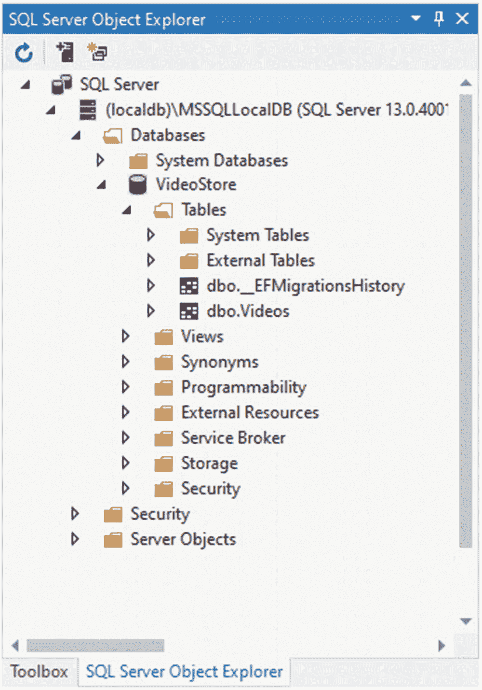

图 4-9

SQL Server 对象资源管理器中的数据库

展开`Tables`文件夹，您将看到为我们创建的`Videos`表。

您可以在 Visual Studio 中打开 SQL Server 对象资源管理器，方法是转到`View`菜单并单击 SQL Server 对象资源管理器，或者按住`Ctrl+\, Ctrl+S`。不是最明显的键盘快捷键，但它确实存在。

还记得在本章前面，我说过 EF Core 会在一个历史表中记录应用的迁移吗？你可以看到那张桌子就在`Videos`桌子的上面，叫做`_EFMigrationsHistory`。右键单击表格，并选择`View Data`。您将看到一个迁移历史，我们刚刚添加的迁移是表中的唯一记录(图 [4-10](#Fig10) )。

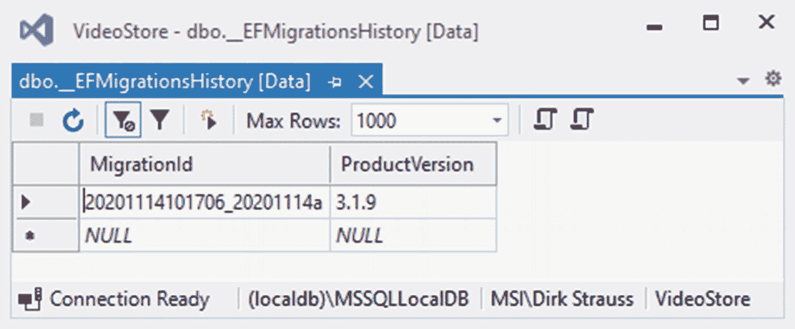

图 4-10

历史表数据

我们现在已经成功地创建了一个数据库。我们终于准备好在我们的应用中切换齿轮了。我们现在可以开始从使用`TestData`服务转移到使用真正的数据访问服务。

## 实现新的数据访问服务

在 Visual Studio 中，在你的`VideoStore.Data`项目中创建一个名为`SQLData`的新类(图 [4-11](#Fig11) )。

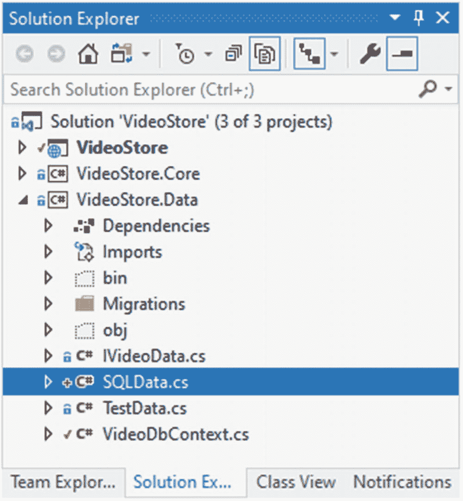

图 4-11

新的 SQLData 类

让这个类实现`IVideoData`接口，并允许 Visual Studio 实现接口。我们现在需要为实现的`IVideoData`接口中指定的所有方法添加实现。

请注意，您将需要包括该系统。Linq 命名空间。

您可以在清单 [4-23](#PC23) 中看到这些实现。使用实体框架在某些地方会减少代码。在可能的情况下，我对方法和构造函数都使用了表达式体。欢迎您修改这段代码来使用体块，但是我发现表达式体成员更容易阅读。

```cs
using Microsoft.EntityFrameworkCore;
using System.Collections.Generic;
using System.Linq;
using VideoStore.Core;

namespace VideoStore.Data
{
    public class SQLData : IVideoData
    {
        private readonly VideoDbContext _database;

        public SQLData(VideoDbContext database) => _database = database;

        public Video AddVideo(Video newVideo)
        {
            _ = _database.Add(newVideo);
            return newVideo;
        }

        public Video GetVideo(int id) => _database.Videos.Find(id);

        public IEnumerable<Video> ListVideos(string title) => _database.Videos
                .Where(x => string.IsNullOrEmpty(title)
                || x.Title.StartsWith(title))
                .OrderBy(x => x.Title);

        public int Save() => _database.SaveChanges();

        public Video UpdateVideo(Video videoData)
        {
            var entity = _database.Videos.Attach(videoData);
            entity.State = EntityState.Modified;
            return videoData;
        }
    }
}

Listing 4-23The New SQLData Class Implementing IVideoData

```

特别有趣的是，您会注意到我通过类构造函数引入了我的`VideoDbContext`，并将其保存到一个名为`_database`的私有字段中。`AddVideo`、`GetVideo`和`ListVideo`方法是不言自明的，但是`UpdateVideo`需要将`EntityState`设置为`Modified`。这告诉实体框架,`Video`实体上的某些东西已经改变了。

我们剩下要做的就是在`Startup.cs`类的`ConfigureServices`方法中交换出数据服务。

## 更改数据访问服务注册

通过更改数据访问服务注册，我们告诉服务集合，每当应用中的某个东西想要使用`IVideoData`，就提供它`SQLData`。`ConfigureServices`方法的改变是小而快的。您可以在清单 [4-24](#PC24) 中看到这一变化。

```cs
public void ConfigureServices(IServiceCollection services)
{
    _ = services.AddDbContextPool<VideoDbContext>(dbContextOptns =>
    {
        _ = dbContextOptns.UseSqlServer(
            Configuration.GetConnectionString("VideoConn"));
    });

    _ = services.AddScoped<IVideoData, SQLData>();
    _ = services.AddRazorPages().AddSessionStateTempDataProvider();
    _ = services.AddSession();
}

Listing 4-24The Modified Data Access Service Registration

```

我们还将其定义为使用限定了作用域的生存期。添加完所有内容后，我们现在可以运行应用了，我们将不会在视频列表中看到任何视频。

这是因为我们已经换出了服务来使用 SQL 数据库，而`Videos`表目前是空的。要添加新视频，请点按“添加”按钮并添加新视频。添加新视频后，返回视频列表查看新添加的条目(图 [4-12](#Fig12) )。

我知道你们中的一些人很害怕，因为我把《指环王》中的*加进了动作片。把*《指环王》*看做三部曲，片名大概也该改改了。目前，我们无法从列表中删除任何视频。因此，我将让您在`IVideoData`接口上实现它，并在`SQLData`类上为它提供实现。*

随着新添加的视频列在我们的视频列表中，让我们去看看数据库表中的数据。

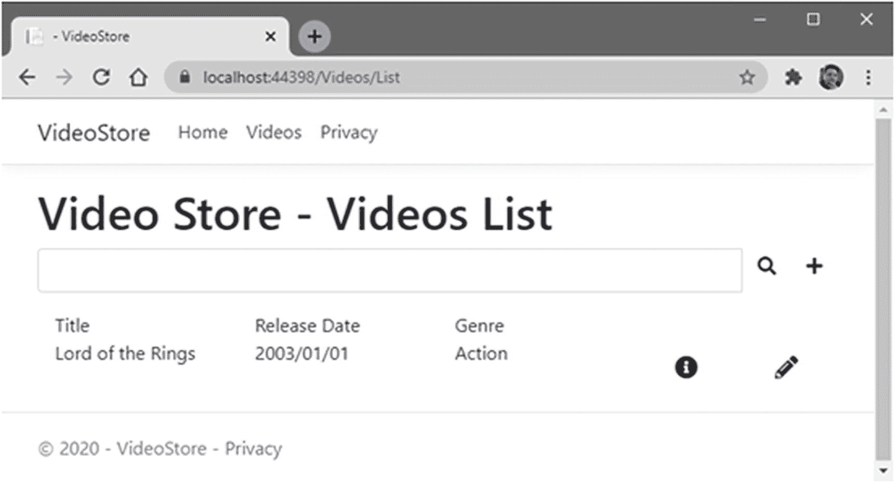

图 4-12

新视频已添加到 SQL 数据库

在我们的`VideoStore`数据库的`Videos`表中，你会看到新添加的视频(图 [4-13](#Fig13) )。

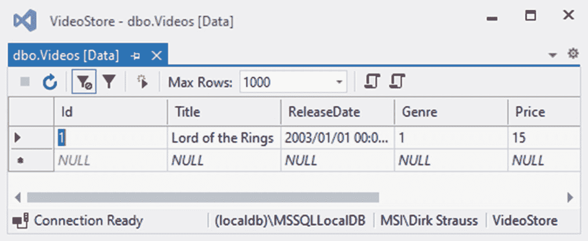

图 4-13

SQL 表中添加的视频

这就是使用接口的力量。我们已经分离了我们的数据访问服务，并允许它实现`IVideoData`接口。例如，我们现在可以创建一个新的类，它需要生成一个包含视频数据的 JSON 文件。当然，这将需要大量的字符串操作，并且可能不是存储视频数据的最佳位置，但是这个概念是声音。只要我们的数据服务(任何数据服务)实现了`IVideoData`接口，我们就能够通过`ConfigureServices`方法将其注入到我们的服务集合中。

如果需要的话，我们也可以很容易地用不同的服务来替换它。