# 五、使用 Razor 页面

在本章中，您将学习如何使用用户界面。在这里，我们将看到 _ViewImports 和 _ViewStart 文件是如何工作的。我们将查看局部视图和视图组件，看看 Razor 页面中的部分可以做什么。要意识到的最重要的事情是，你不必成为 UI 设计的神童来创建一个好看的、用户友好的 UI。

使用 Bootstrap 和一点 jQuery，开发人员可以为他们的应用创建功能强大、响应迅速、外观漂亮的 web UIs。

## 使用 Razor 页面中的节

如果你回想一下 ASP.NET 主页，你就会知道`_Layout.cshtml`页(图 [5-1](#Fig1) )的用途。按照惯例，该页面以下划线开头。它用于定义页面的结构，分为页眉、正文和页脚。清单 [5-1](#PC1) 展示了 _Layout.cshtml 页面的简短代码清单。

```cs
<!DOCTYPE html>
<html lang="en">
<head>
    @* Meta Tags and CSS *@
</head>
<body>
    <header>
        @* Navigation *@
    </header>
    <div class="container">
        <main role="main" class="pb-3">
            @RenderBody()
        </main>
    </div>

    <footer class="border-top footer text-muted">
        @* Footer *@
    </footer>

    @* Scripts applied across all pages *@

    @RenderSection("Scripts", required: false)
</body>
</html>

Listing 5-1The _Layout.cshtml Page

```

按照惯例，`_Layout`页面通常位于共享文件夹中。

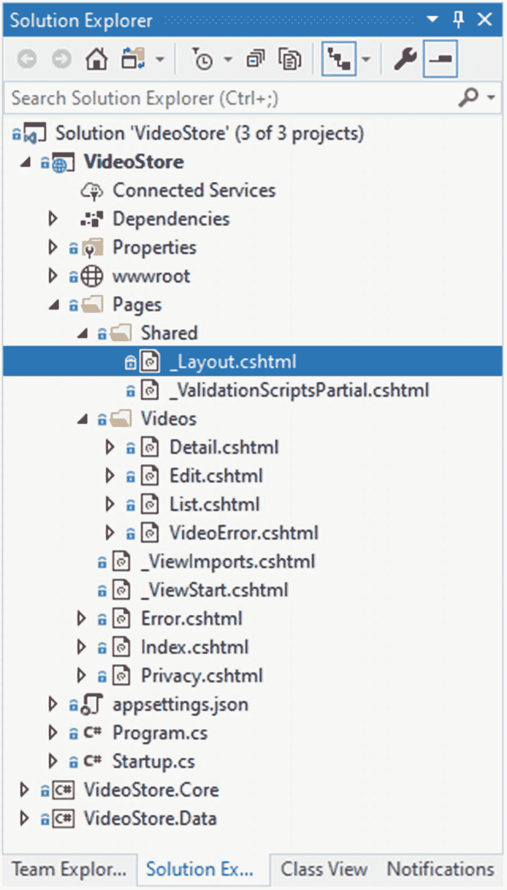

图 5-1

_Layout.cshtml 页面

让我们看看`_Layout`页面中的不同区域。

### 元标签和 CSS

Meta 标签和 CSS 文件的链接被添加到网页上的`<head>`标签中。例如，您可以在这里添加到缩小的引导 CSS 或自定义 CSS 文件的链接。

### 航行

导航通常在网页的`<header>`标签中找到。在这里，我们修改了导航，将链接添加到视频页面。

### @RenderBody

默认情况下，`_Layout.cshtml`页面包含一个`@RenderBody`部分。无论在哪里找到`@RenderBody`，视图的内容都将在其中呈现。这意味着`List.cshtml`或`Edit.cshtml`或任何其他视图的内容都在这里呈现。

### 页脚

版权声明或任何其他标记可以添加到`<footer>`部分。有些网站包括页脚菜单或联系信息。

### 应用于所有页面的脚本

您在`<footer>`下面定义的脚本链接将应用于网站上的所有页面。更准确地说，这些脚本将应用于使用这个特定布局页面的每个视图。通常可以在这里找到脚本的链接，比如精简的 jQuery 文件。

### @RenderSection

布局可以通过在标记中使用`@RenderSection`来调用一个或多个部分。使用`@RenderSection`的好处是您可以指定它是否是必需的。在清单 [5-1](#PC1) 中，您会注意到`Scripts`部分并不是必需的。打开`List.cshtml`页面，在页面末尾添加清单 [5-2](#PC2) 中的代码。

```cs
@section Scripts {
    <script>
        $(document).ready(function () {
            alert("I am a script alert");
        });
    </script>
}

Listing 5-2Added Scripts Section to List Page

```

注意，节的名称`Scripts`必须与调用`@RenderSection`中提供的名称相匹配。运行您的 web 应用，打开视频列表页面。你应该会看到一个弹出窗口，如图 [5-2](#Fig2) 所示。

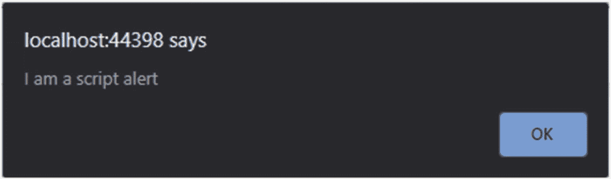

图 5-2

脚本警告

从视频列表中，单击一个视频以查看详细信息。加载详细信息页面时，不会显示任何脚本。这是因为在`Detail.cshtml`页面上没有`Scripts`部分，我们已经告诉`_Layout.cshtml`文件不需要`Scripts`部分。

修改`_Layout.cshtml`页面上的`@RenderSection`，如清单 [5-3](#PC3) 所示。

```cs
@RenderSection("Scripts", required: true)

Listing 5-3Modified RenderSection

```

如果您再次运行您的 web 应用，您将会收到一个错误，因为您已经告诉 ASP.NET Core 网站的`Scripts`部分是必需的，但是您没有在您网站的每个页面上包括清单 [5-2](#PC2) 中所示的`Scripts`部分。

本质上，这就是您在 web 应用中呈现部分的方式。@RenderSection 不仅仅适用于脚本。它也可以包含标记。返回到`_Layout.cshtml`页面，在结束标签`</header>`的正下方添加如下代码，如清单 [5-4](#PC4) 所示。

```cs
@RenderSection("Notification", required: false)

Listing 5-4Notification Section

```

切换回您的`List.cshtml`页面，并将清单 [5-5](#PC5) 中所示的代码添加到页面底部。

```cs
@section Notification {
<div class="row">
    <div class="col-md-12 alert alert-info">
        This is a notification
    </div>
</div>
}

Listing 5-5Notification Section

```

再次运行 web 应用，并查看视频列表页面。您将会看到导航下方页面顶部显示的通知(图 [5-3](#Fig3) )。

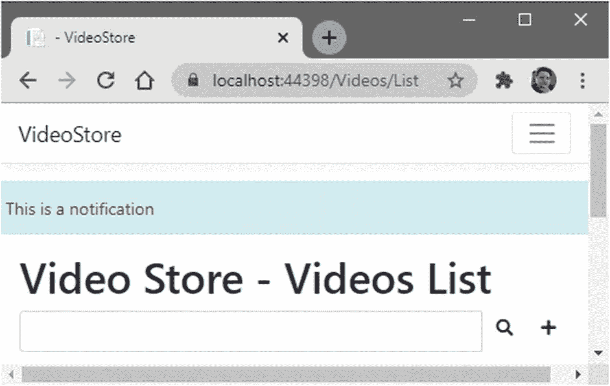

图 5-3

显示的通知部分

有趣的是，虽然标记被添加到了`List.cshtml`页面的底部，但它并不影响标记在呈现页面上的显示位置。`Notification`部分显示在`_Layout.cshtml`页面上`@RenderSection`被定位的准确位置。因此，节允许您轻松地在 Razor 页面中插入额外的标记或逻辑。这使您可以轻松地构建页面元素，并组织它们的位置。

## 什么是 _ViewImports 和 _ViewStart 文件？

到目前为止，我们已经谈了一些关于布局页面的内容。在这一章的开始，我们说过回想 ASP.NET 主页会让你知道`_Layout.cshtml`页是用来做什么的。它应用于您的所有视图，在我们的示例应用中，这将是我们为应用创建的页面。

每个页面(或视图)到底是如何知道使用`_Layout.cshtml`页面的？这就是`_ViewStart.cshtml`页面发挥作用的地方(图 [5-4](#Fig4) )。

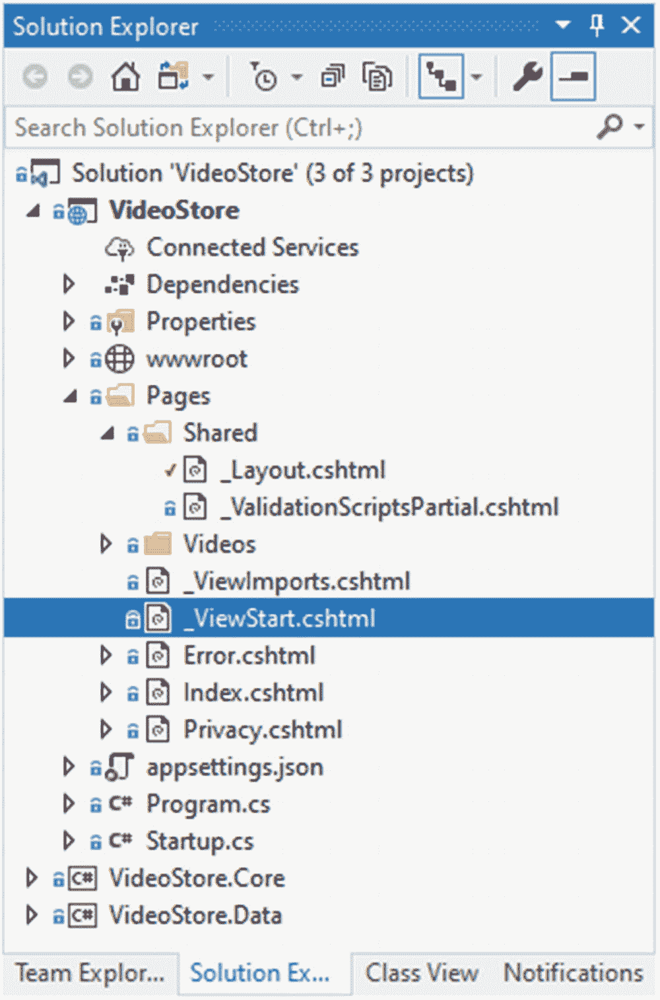

图 5-4

_ViewStart 和 _ViewImports 页面

默认情况下，在您的 web 应用中呈现页面之前，ASP.NET Core 将检查`_ViewStart`页面，以查看它应该应用什么布局页面。您可以在清单 [5-6 中看到`_ViewStart`页面的标记](#PC6)指定应用在呈现页面时必须使用`_Layout`页面。

```cs
@{
    Layout = "_Layout";
}

Listing 5-6The _ViewStart Markup

```

如果您需要为特定页面应用不同的布局，该怎么办？事实证明，您可以精确地控制视图使用的布局页面。

### 指定不同的布局页面

为了测试这一点，在你的`Shared`文件夹中创建一个没有页面模型的新 Razor 页面(图 [5-5](#Fig5) )。调用这个页面`_LayoutSpecial`，从`_Layout`页面复制标记并粘贴到`_LayoutSpecial`页面。

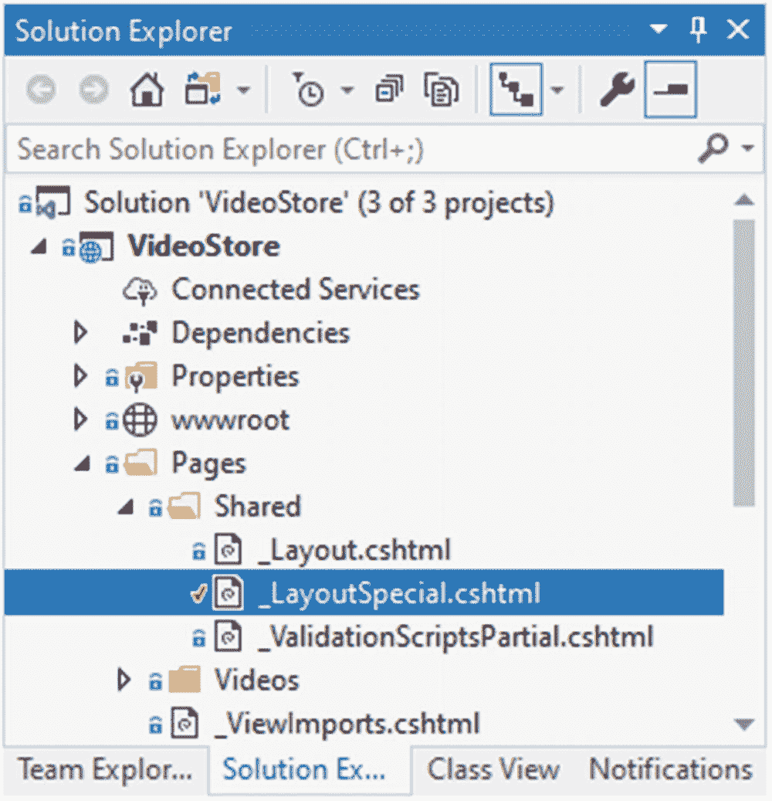

图 5-5

新添加的 _LayoutSpecial 页面

使用不同布局页面的原因是因为我们希望构建不同于默认页面的特定页面。所以为了使`_LayoutSpecial`页面不同，我只是在布局页面的`<header>`部分添加了一个标题，如清单 [5-7](#PC7) 所示。

```cs
<header>
  <nav class="navbar navbar-expand-sm navbar-toggleable-sm navbar-light bg-white border-bottom box-shadow mb-3">
      <div class="container">
          <a class="navbar-brand" asp-area="" asp-page="/Index">VideoStore</a>
          <button class="navbar-toggler" type="button" data-toggle="collapse" data-target=".navbar-collapse" aria-controls="navbarSupportedContent"
                        aria-expanded="false" aria-label="Toggle navigation">
              <span class="navbar-toggler-icon"></span>
          </button>
          <div class="navbar-collapse collapse d-sm-inline-flex flex-sm-row-reverse">
              <ul class="navbar-nav flex-grow-1">
                  <li class="nav-item"><a class="nav-link text-dark" asp-area="" asp-page="/Index">Home</a></li>
                  <li class="nav-item"><a class="nav-link text-dark" asp-area="" asp-page="/Videos/List">Videos</a></li>
                  <li class="nav-item"><a class="nav-link text-dark" asp-area="" asp-page="/Privacy">Privacy</a></li>
              </ul>
          </div>
      </div>
  </nav>
  <div class="col-md-12 alert alert-info">
      <h1>
          This is the Special Layout Page
      </h1>
  </div>

</header>

Listing 5-7Modified _LayoutSpecial Page

```

您会注意到它仍然拥有来自`_Layout`页面的所有导航，但是它现在也包含了这个`<h1>`元素。

不同布局页面的用例会有所不同，但是要根据用户是否登录来考虑应用不同布局的需求。也许您只需要将通知横幅应用于特定页面。

现在让我们将这个`_LayoutSpecial`页面应用到`Detail`视图中。打开`Detail.cshtml`文件，将清单 [5-8](#PC8) 所示的代码添加到`Detail`页面。

```cs
@page "{videoId:int}"
@model VideoStore.Pages.Videos.DetailModel
@{
    ViewData["Title"] = "Detail";
    Layout = "_LayoutSpecial";
}

Listing 5-8Specifying a Different Layout Page

```

当 ASP.NET 内核在`Detail`页面的标题中找到`Layout = "_LayoutSpecial"`时，它就出去在`Shared`文件夹中寻找那个布局页面。然后，它将该特定布局仅应用于`Detail`页面。如果您运行应用并导航到`Detail`页面，您将看到应用的标题，如图 [5-6](#Fig6) 所示。

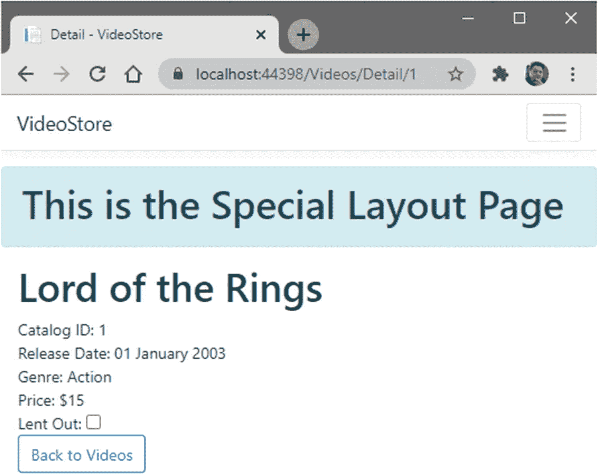

图 5-6

应用于详细页的新布局

所以`_ViewStart`页面在 ASP.NET Core 中起着重要的作用。在前面的示例中，它指定了应用于应用中所有视图的布局页面。我们看到了如何通过为特定页面指定不同的布局来覆盖默认布局。这意味着如果我们需要在每个视图之前运行代码，我们需要将它放在`_ViewStart`文件中。按照惯例，`_ViewStart`位于 Pages 文件夹中，并且是分层的。换句话说，如果在子文件夹中找到另一个`_ViewStart`，它将在根文件夹中的`_ViewStart`之后运行。

注意，有人把`Pages`文件夹命名为`Views`。无论您的偏好是什么，术语“页面”和“视图”可以互换使用。

另一个需要注意的文件是`_ViewImports`文件。让我们更详细地看看它是做什么的。

### 创建自定义标记助手

清单 [5-9](#PC9) 展示了 _ViewImports 文件的代码。

```cs
@using VideoStore
@namespace VideoStore.Pages
@addTagHelper *, Microsoft.AspNetCore.Mvc.TagHelpers

Listing 5-9The _ViewImports File

```

这个文件使用 Razor 指令来导入需要由其他视图共享的名称空间。在`_ViewImports`文件中支持以下指令:

*   @addTagHelper

*   @removeTagHelper

*   @tagHelperPrefix

*   @使用

*   @型号

*   @inherits

*   @注入

像`_ViewStart`文件一样，`_ViewImports`文件也是分层的，如果在该分层结构中发现多个`_ViewImports.cshtml`文件，则指令组合如下:

*   所有@addTagHelper 和@removeTagHelper 指令都按顺序运行。

*   与视图最接近的@tagHelperPrefix 将覆盖任何其他的。

*   离视图最近的@模型将覆盖任何其他模型。

*   与视图最接近的@inherits 将覆盖任何其他的。

*   所有@using 指令都包括在内，任何重复的都被忽略。

*   对于每个@inject 属性，最接近视图的属性将覆盖具有相同属性名称的任何其他属性。

`_ViewImports`文件也是您定义您可能创建的任何定制标签助手的地方。再看一下`Detail`页面标记(清单 [5-10](#PC10) )。

```cs
<div>
    Price: $@Model.Video.Price
</div>

Listing 5-10The Price Markup

```

在这里，我们可以看到货币被硬编码到页面的标记中。这不是我们想要做的事情，并且通常不会很好地扩展。让我们创建一个自定义标记帮助器，按照我们传递给它的区域性名称来获取货币。

为此，我们将执行以下操作:

*   为我们的自定义标签助手添加一个文件夹。

*   为视频价格的标签助手添加一个类。

*   在 _ViewImports 文件中指定我们的自定义标记帮助器。

你可以看到我们在解决方案中添加了一个名为`TagHelpers`的新文件夹(图 [5-7](#Fig7) )。我们还在`TagHelpers`文件夹中添加了一个名为`PriceTagHelper`的类。

这个类将告诉编译器它应该匹配所有的`videoPrice`元素，并寻找匹配`video-price`和`culture-name`的属性。然后，该类将获取您传递给它的区域性名称的货币符号，并输出带有正确货币符号的价格。

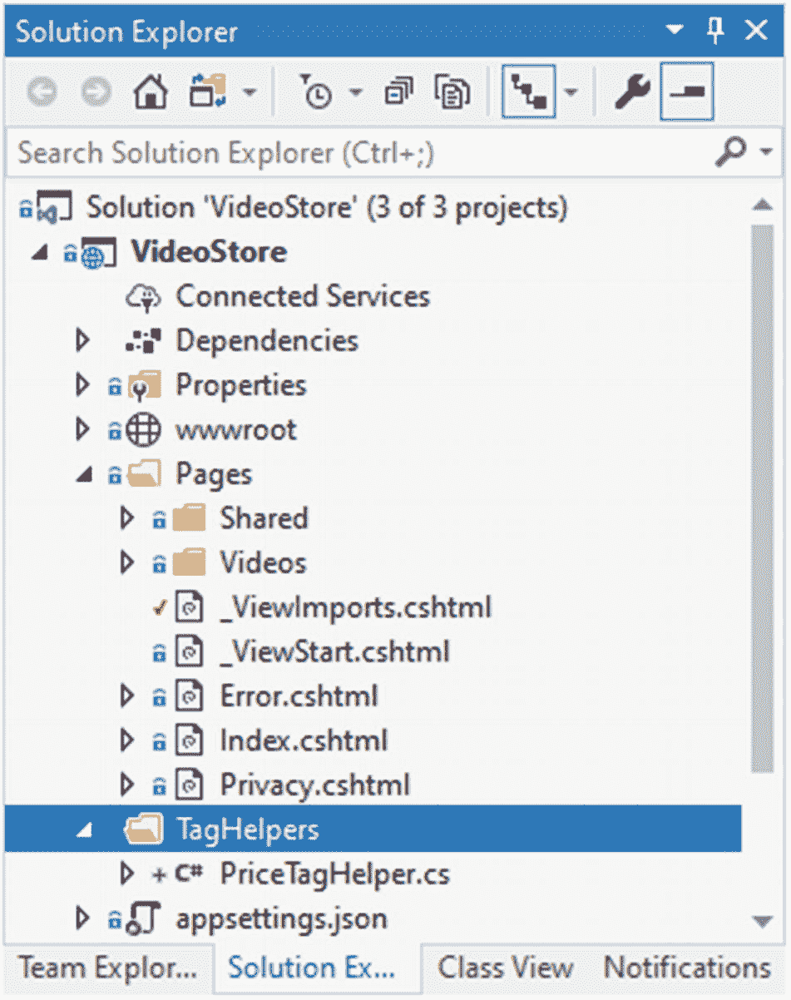

图 5-7

添加 TagHelper 文件夹和类

首先在 TagHelpers 文件夹中创建一个名为 PriceTagHelper 的类。您可以在清单 [5-11](#PC11) 中看到完整的代码清单。

```cs
using Microsoft.AspNetCore.Razor.TagHelpers;
using System.Globalization;

namespace VideoStore.TagHelpers
{
    [HtmlTargetElement("videoPrice")]
    public class PriceTagHelper : TagHelper
    {
        public double VideoPrice { get; set; }
        public string CultureName { get; set; }
        public string Label { get; set; }

        public override void Process(TagHelperContext context, TagHelperOutput output)
        {
            var ri = new RegionInfo(CultureName);
            var currencySymbol = ri.CurrencySymbol;

            output.TagName = "div";
            var price = $"{Label}{currencySymbol}{VideoPrice}";
            _ = output.Content.SetContent(price);
        }
    }
}

Listing 5-11The PriceTagHelper Class

```

`PriceTagHelper`类继承自`TagHelper`抽象基类。它定义了`VideoPrice`、`CultureName`和`Label`的属性。这些 Pascal 大小写的属性名将被翻译成 kebab 大小写(是的，有这样的大小写)以便在标记属性中使用。

微软文档参考了 kebab 案例，并参考了以下关于堆栈溢出的讨论: [https:// stackoverflow。com/questions/11273282/what ' s name for the hyphen-separated-case/12273101 # 12273101](https://stackoverflow.com/questions/11273282/whats-the-name-for-hyphen-separated-case/12273101%252312273101)。

注意，这个类位于`VideoStore.TagHelpers`名称空间中。因此，我们只需要在`_ViewImports`文件中声明`VideoStore`名称空间，如清单 [5-12](#PC12) 所示。

```cs
@using VideoStore
@namespace VideoStore.Pages
@addTagHelper *, Microsoft.AspNetCore.Mvc.TagHelpers

@addTagHelper *, VideoStore

Listing 5-12Adding the Custom Tag Helper

```

回头看看清单 [5-11](#PC11) 中的代码，你会看到这个类有一个`HtmlTargetElement`属性，告诉编译器将所有`videoPrice`元素作为目标。至此，一切就绪，构建您的项目并修改详细页面标记。

回头看看清单 [5-10](#PC10) ，您会记得我们对货币进行了硬编码。有了我们的定制标签助手，我们可以简单地添加清单 [5-13](#PC13) 中列出的标记。

```cs
<videoPrice video-price="@Model.Video.Price" culture-name="en-GB" label="Price: "></videoPrice>

Listing 5-13The New Video Price Markup Using a Custom Tag Helper

```

自定义标记帮助器使用您传递给它的区域性来确定要显示的货币符号。它还允许您指定视频价格的标签。如前所述，它使用这些属性(`video-price`、`culture-name`和`label`)来映射到`PriceTagHelper`类的属性。

## 使用局部视图

我通常认为。NET 开发人员以面向对象的方式思考。至少我是这样认为的，这就是为什么我认为局部视图的概念很容易理解。根据微软文档，局部视图的定义很好地解释了这一点。

> *一个局部视图是一个 Razor 标记文件(。cshtml ),而没有在另一个标记文件的呈现输出中呈现 html 输出的@page 指令。*

这意味着局部视图仅作为内容的一部分呈现，这在将大型复杂视图分解为更小、更易管理的部分时非常有用。这也使它成为减少跨文件标记重复的一个极好的方法。

在解决方案浏览器中，通过右键单击文件夹并单击`Add`，然后从上下文菜单中单击`Razor Page`，继续将部分视图添加到您的`Videos`文件夹中。在显示的`Add New Scaffolded Item`对话框中选择`Razor Page`，点击`Add`按钮。

我感觉在 Visual Studio 中添加局部视图的过程可以精简很多。然而，这个过程目前就是这样。

从显示的`Add Razor Page`对话框中，仅勾选`Create as a partial view`复选框，如图 [5-8](#Fig8) 所示。

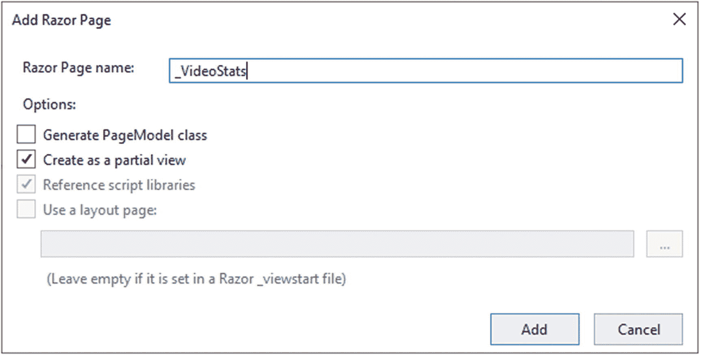

图 5-8

添加 _VideoStats 局部视图

将局部视图命名为`_VideoStats`，并点击`Add`按钮。你应该可以看到你的局部视图，如图 [5-9](#Fig9) 所示。该局部视图将包含每个视频的以下信息:

*   评级

*   简短的评论

*   在线视频的 URL

为了使这成为可能，我们需要稍微偏离一下主题，从局部视图的创建中脱离出来。我们需要将这些属性添加到`VideoStore.Core`项目中的`Video`类中。

因为属性被添加到了我们的`Video`类中，所以我们必须更新我们的数据库表。

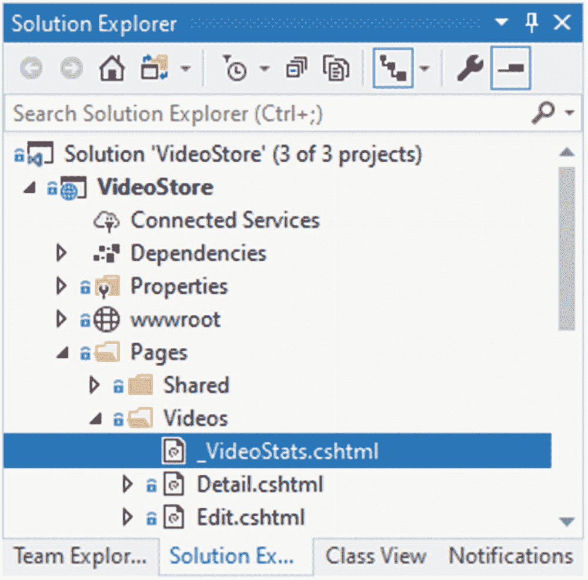

图 5-9

添加到 Pages 文件夹的 _VideoStats

正是在这里，迁移的真正好处变得显而易见。我们可以用这些变化快速更新我们的数据库。

### 添加视频属性和更新数据库

我们想在`Video`类中添加一些统计数据，我们可以在其中存储评级、简短评论和视频的 URL。将清单 [5-14](#PC14) 中的属性添加到 VideoStore 中的 Video 类。核心项目。

```cs
public int Rating { get; set; }
public string Review { get; set; }
public string OnlineURL { get; set; }

Listing 5-14The New Video Properties

```

我不会在这里张贴整个`Video`类代码，因为我相信你知道在清单 [5-14](#PC14) 中何处添加额外的属性。保存项目，并在`VideoStore.Data`项目文件夹中打开命令提示符。

换句话说，打开命令提示符，将目录更改为您的 VideoStore。数据项目。您也可以右键单击视频商店。数据项目，然后在文件资源管理器中单击“打开文件夹”。

当您打开命令提示符后，您就可以通过运行清单 [5-15](#PC15) 中的命令来添加新的 EF 迁移了。

```cs
dotnet ef migrations add AddRatings -s ..\VideoStore\VideoStore.csproj

Listing 5-15Add New EF Migrations

```

命令运行后，名为 AddRatings 的迁移被添加到迁移文件夹中(图 [5-10](#Fig10) )。

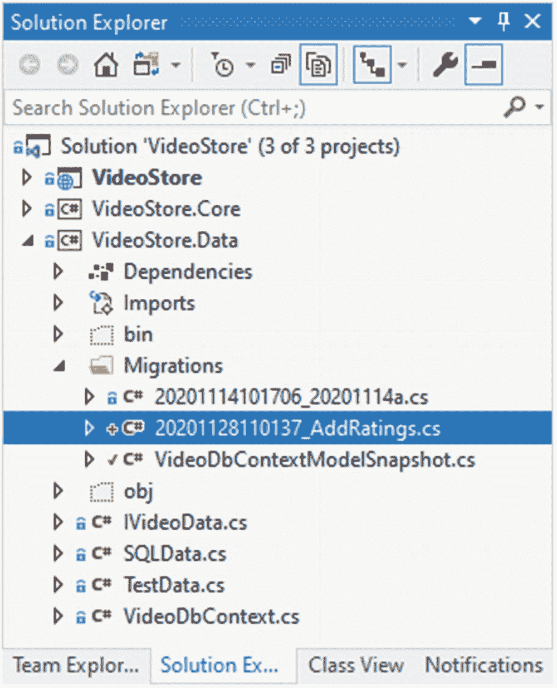

图 5-10

添加了附加迁移

接下来，我们需要通过运行清单 [5-16](#PC16) 中的命令来更新数据库表。

```cs
dotnet ef database update -s ..\VideoStore\VideoStore.csproj

Listing 5-16Update the Database

```

一旦该命令运行，在`SQL Server Object Explorer`的`VideoStore`数据库中的`Videos`表将被更新(图 [5-11](#Fig11) )。

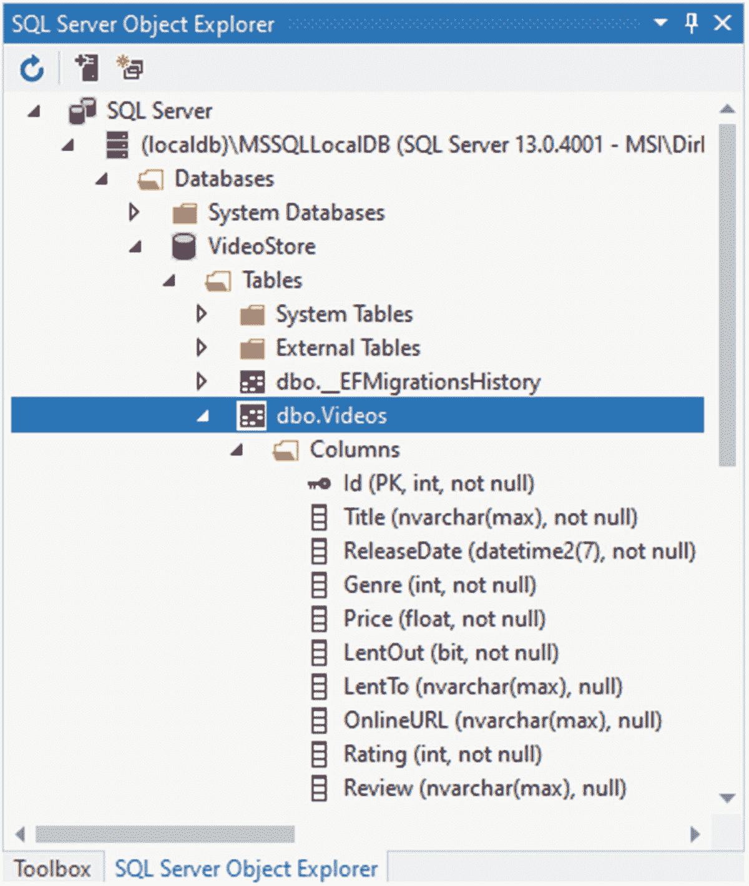

图 5-11

更新的视频表

我们现在已经添加了所有必要的部分来让我们的`_VideoStats`局部视图工作。

我没有添加任何代码来允许我们在添加或编辑视频时为这些属性提供值。我会把这个作为家庭作业留给你。现在，我只是将数据直接添加到数据库表中。

要添加附加属性的数据，打开`SQL Server Object Explorer`，右键单击`Videos`表。从上下文菜单中选择`View Data`，为`Rating`、`Review`和`OnlineURL`列添加数据。

### 向局部视图添加标记

打开`_VideoStats`页面，用清单 [5-17](#PC17) 所示的标记替换标记中的所有代码。

```cs
@using VideoStore.Core
@model Video

<div class="card" style="width: 18rem;">
    <div class="card-header">
        @if (Model.Rating > 0)
        {
            for (int i = 0; i <= Model.Rating - 1; i++)
            {
                <i class="fas fa-star"></i>
            }
        }
        else
        {
            <h6>This video has not received any ratings yet</h6>
        }
    </div>
    <div class="card-body">
        <h5 class="card-title">@Model.Title</h5>
        <p class="card-text">@Model.Review</p>
        <a href="@Model.OnlineURL" class="btn btn-primary">View Online</a>
    </div>
</div>

Listing 5-17The _VideoStats Markup

```

这基本上只是创建了一个显示附加视频统计数据的卡片。它包括`VideoStore.Core`名称空间，并使用`Video`模型来显示我们添加的附加属性。

我们想将视频统计卡添加到`Detail.cshtml`页面。为此，我想稍微格式化一下细节页面。

详细页面的结构如清单 [5-18](#PC18) 所示。使用`div`元素，页面将被分成一个网格图案。

```cs
<div class="row">
    <div class="col-md-12">Title</div>
</div>
<div class="row">
    <div class="col-md-6">Video Details</div>
    <div class="col-md-6">Video Stats</div>
</div>
<div class="row">
    <div class="col-md-12">footer</div>
</div>

Listing 5-18The New Detail Page Structure

```

第一行将包含视频标题。中间一排将被进一步分成两部分。左边部分将包含现有的视频细节，右边部分将包含我们新的局部视图。底部一行将是页脚，包含现有的后退按钮，带我们回到视频列表。

为了在页面中使用局部视图，我们需要添加`partial`标签助手。如清单 [5-19](#PC19) 所示，它包含一个名称，这是我们给局部视图的名称，以及我们传递给局部视图的模型。

```cs
<partial name="_VideoStats" model="Model.Video" />

Listing 5-19The Partial Tag Helper

```

现在，我们可以将所有元素重新组合，并将其插入到新的详细页面结构中。完整的详细页面标记如清单 [5-20](#PC20) 所示。

```cs
@page "{videoId:int}"
@model VideoStore.Pages.Videos.DetailModel
@{
    ViewData["Title"] = "Detail";
    Layout = "_LayoutSpecial";
}

<div class="row">
    <div class="col-md-12"><h1>@Model.Video.Title</h1></div>
</div>
<div class="row">
    <div class="col-md-6">
        @if (Model.CommitMessage != null)
        {
            <div class="alert alert-info">@Model.CommitMessage</div>
        }

        <div>
            Catalog ID: @Model.Video.Id
        </div>
        <div>
            Release Date: @Model.Video.ReleaseDate.ToString("dd MMMM yyyy")
        </div>
        <div>
            Genre: @Model.Video.Genre
        </div>
        <videoPrice video-price="@Model.Video.Price" culture-name="en-GB" label="Price: "></videoPrice>
        <div>
            Lent Out: @Html.CheckBoxFor(x => x.Video.LentOut)
        </div>

        @if (Model.Video.LentOut == true)
        {
            <div>
                Lent To: @Model.Video.LentTo
            </div>
        }
    </div>
    <div class="col-md-6">
        <partial name="_VideoStats" model="Model.Video" />
    </div>
</div>
<div class="row">
    <div class="col-md-12"><a asp-page="./List" class="btn btn-outline-primary">Back to Videos</a></div>
</div>

Listing 5-20The Complete Detail Page

```

完成后，构建并运行您的项目。详细页面显示如图 [5-12](#Fig12) 所示。

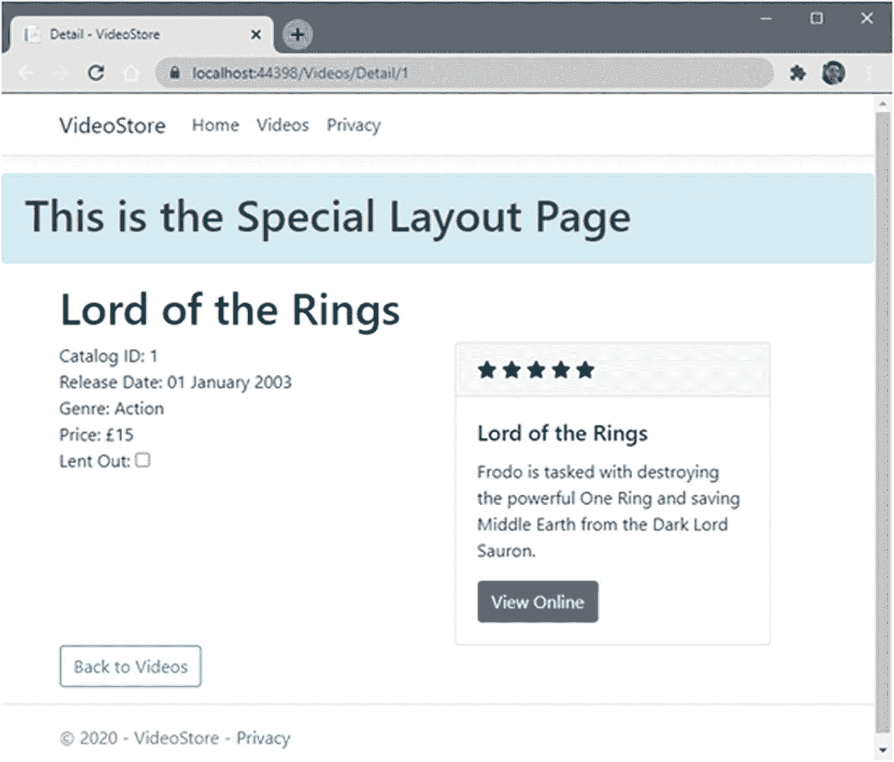

图 5-12

修改后的详细信息页面

详细信息页面分为两部分，视频统计显示在页面的右半部分。您可以通过向`Videos`文件夹添加另一个名为`_VideoDetail`的局部视图来进一步简化详细页面。

我将把这个留给您作为练习来完成，但是本书附带的代码包含了完整的逻辑。您最终想要的是一个细节页面，如清单 [5-21](#PC21) 所示。

```cs
@page "{videoId:int}"
@model VideoStore.Pages.Videos.DetailModel
@{
    ViewData["Title"] = "Detail";
    Layout = "_LayoutSpecial";
}

<div class="row">
    <div class="col-md-12"><h1>@Model.Video.Title</h1></div>
</div>
<div class="row">
    <div class="col-md-6">
        @if (Model.CommitMessage != null)
        {
            <div class="alert alert-info">@Model.CommitMessage</div>
        }
        <partial name="_VideoDetail" model="Model.Video" />
    </div>
    <div class="col-md-6">
        <partial name="_VideoStats" model="Model.Video" />
    </div>
</div>
<div class="row">
    <div class="col-md-12"><a asp-page="./List" class="btn btn-outline-primary">Back to Videos</a></div>
</div>

Listing 5-21The Simplified Detail Page

```

局部视图非常适合于简化复杂或大型的标记，并允许轻松重用标记中的组件。

## 使用视图组件

到目前为止，在这一章中，我们已经看了节、`_ViewImports`、`_ViewStart`和部分视图。对于局部视图，我们看到我们可以传递给它一个模型来使用，在前面的例子中，我们传递给它我们的`Video`模型。但是如果我们不想这么做呢？如果我们需要在每个需要显示数据的页面上添加某种类型的标记，会怎么样呢？假设我们想在站点的每个页面上添加一个当天的视频部分。

当我们想要在每个页面上呈现一些标记时，我们知道可以通过向`_Layout`页面添加一些逻辑来实现。这样，我们可以在实现特定布局页面的每个页面上显示标记。唯一的问题是布局页面不包含页面模型。它无法访问任何数据，我们希望访问一些数据，以便在我们的视频商店的每个页面上显示。

这就是视图组件发挥作用的地方。视图组件将能够独立运行，并且能够访问数据，而不需要依赖 Razor 页面向其传递一些数据。

首先给你的`VideoStore`项目添加一个名为`ViewComponents`的文件夹，如图 [5-13](#Fig13) 所示。

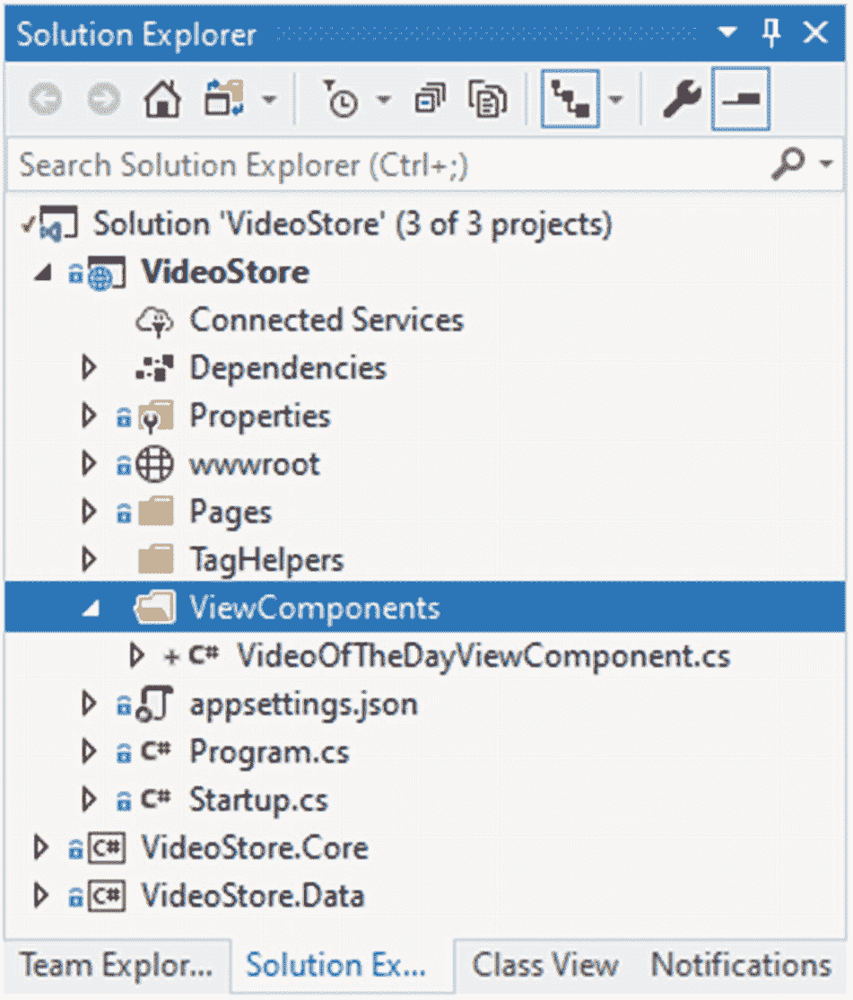

图 5-13

视图组件文件夹

在该文件夹中，添加一个名为`VideoOfTheDayViewComponent`的类，并添加清单 [5-22](#PC22) 中的代码。

```cs
using Microsoft.AspNetCore.Mvc;
using VideoStore.Data;

namespace VideoStore.ViewComponents
{
    public class VideoOfTheDayViewComponent : ViewComponent
    {
        private readonly IVideoData _videoData;

        public VideoOfTheDayViewComponent(IVideoData videoData)
        {
            _videoData = videoData;
        }

        public IViewComponentResult Invoke()
        {
            var video = _videoData.GetTopVideo();
            return View(video);
        }
    }
}

Listing 5-22The VideoOfTheDayViewComponent Class

```

值得注意的是，视图组件不响应 HTTP 请求。您可以将视图组件视为一种局部视图，它嵌入到您站点的不同视图中。当这个视图生成时，ASP.NET Core 将调用一个名为`Invoke`的方法，并向页面返回一个`IViewComponentResult`。

您必须添加视频商店。数据和微软。AspNetCore.Mvc 命名空间添加到 VideoOfTheDayViewComponent 类。

视图组件可以有一个构造函数，在这里我们通过依赖注入来注入`IVideoData`服务。这允许视图组件自主地处理我们项目中的数据。Invoke 方法然后调用数据服务上的一个名为`GetTopVideo`的方法。

我们现在必须将这个方法添加到我们的数据服务中。打开 IVideoData 接口，将 GetTopVideo 方法添加到该接口，如清单 [5-23](#PC23) 所示。

```cs
using System.Collections.Generic;
using VideoStore.Core;

namespace VideoStore.Data
{
    public interface IVideoData
    {
        IEnumerable<Video> ListVideos(string title);
        Video GetVideo(int id);
        Video GetTopVideo();
        Video UpdateVideo(Video videoData);
        Video AddVideo(Video newVideo);
        int Save();
    }
}

Listing 5-23The Modified IVideoData Interface

```

`GetTopVideo`方法只是返回一个`Video`对象。因为`TestData`和`SQLData`类实现了`IVideoData`接口，我们需要为这些类添加`GetTopVideo`方法的实现。我不太担心`TestData`类的实现，所以我将简单地返回第一个视频，如清单 [5-24](#PC24) 所示。

```cs
public Video GetTopVideo()
{
    return _videoList.First();
}

Listing 5-24The TestData Class Implementation

```

然而，当涉及到`SQLData`类时，我想用代码更具体一点。您可以按照您认为合适的方式实现代码，但是我将简单地生成一个介于 1 和视频计数之间的随机数，并查找具有该 ID 的视频。

老实说，随机类并不是真正的随机。对于真正的随机性，如果真正的随机性对你很重要，考虑实现一个加密随机数生成器。乔恩·斯基特在网上有一篇关于这个的很棒的文章。其次，人们可能不会使用随机 ID 来实现当天的视频。您可能会使用其他标准来实现这一点，如视频商店中排名前 10 的电影或根据租借次数确定的最受欢迎的视频。无论如何，我在这里只是试图解释视图组件的一个概念。我不是在解释确定哪个视频是当日视频的最佳方法。

清单 [5-25](#PC25) 中的代码说明了`SQLData`类中`GetTopVideo`方法的实现。

```cs
public Video GetTopVideo()
{
    var rnd = new Random();
    if (_database.Videos.Count() == 0)
        return new Video();
    else
    {
        var r = rnd.Next(1, _database.Videos.Count());
        return _database.Videos.Find(r);
    }}

Listing 5-25The SQLData Class Implementation

```

代码相当简单，所以我不会花太多时间解释它。接下来，我们需要添加一个视图来显示当天的视频。这是因为，回头参考清单 [5-22](#PC22) ，我们从`Invoke`方法返回一个`View(video)`。视图组件也遵循非常特殊的命名约定。`_Layout`页面将使用我们的日视图视频，所以我们将把它添加到`Shared`文件夹中。

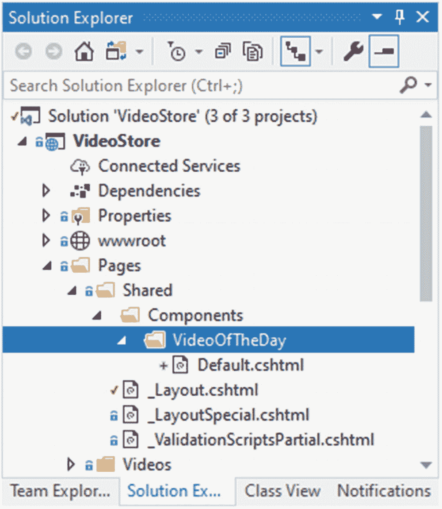

图 5-14

今日视频视图

为了让 ASP.NET Core 能够定位视图组件视图，我需要创建一个名为`Components`的文件夹，在`Components`文件夹中，我需要添加另一个名为`ViewComponent name`的文件夹，只是末尾没有`ViewComponent`位。这意味着我只需要调用我的文件夹`VideoOfTheDay`。在`VideoOfTheDay`文件夹中，我可以添加专用于我的视图组件的视图。

如果你回想一下`VideoOfTheDayViewComponent`类上的 Invoke 方法，我只是返回了`View(video)`。我也可以通过传递视图名称(TodaysVideo)来返回`View("TodaysVideo", video)`。然后我需要在`VideoOfTheDay`文件夹中创建一个名为`TodaysVideo.cshtml`的视图。这不是我想做的事情，所以我可以简单地调用我的视图`Default.cshtml`，如图 [5-14](#Fig14) 所示。

注意，`Default.cshtml`页面不包含页面模型。这只是一个普通的 cshtml 文件。

我们现在想给`Default.cshtml`页面添加一些标记。如清单 [5-26](#PC26) 所示，这将提醒您我们在本章前面创建的局部视图。

```cs
@using VideoStore.Core
@model Video

<div class="row alert alert-info">
    <div class="col-md-12">
        Video of the day: @Model.Title
    </div>
</div>

Listing 5-26The Default ViewComponent View

```

有了这个，我们几乎拥有了我们需要的一切。

通常，此时，我们需要将 VideoStore 名称空间中的标记助手添加到 _ViewImports 文件中。因为我们在本章前面已经添加了一个自定义标记帮助器，所以现在我们不需要这样做。

回到`_Layout.cshtml`页面，我们可以使用`vc:`标签助手来显示我们刚刚创建的 ViewComponent(清单 [5-27](#PC27) )并引用我们的视图组件的名称，在 kebab 的例子中，末尾没有 view component 位。

```cs
<vc:video-of-the-day></vc:video-of-the-day>

Listing 5-27The vc Tag Helper for Our ViewComponent

```

如果您的项目已经构建，那么`video-of-the-day`标记助手将通过智能感知弹出。将它放在这里告诉 tag helper 找到一个名为`VideoOfTheDay`的视图并渲染它。

我只是把它放在布局页面的页脚，然后运行应用。当天的视频将显示在每页的页脚，如图 [5-15](#Fig15) 所示。

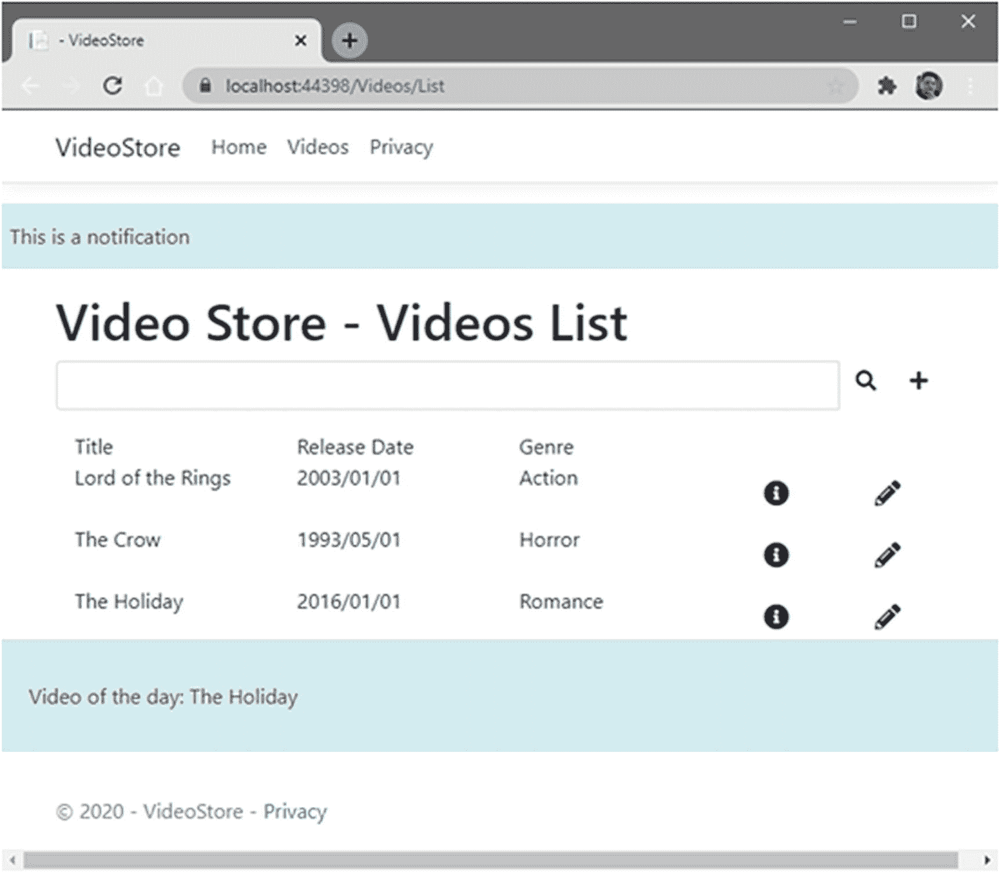

图 5-15

每日视频视图组件

ViewComponents 允许您向 Razor 页面添加逻辑，同时将代码的复杂性从 Razor 页面中分离出来。这是因为 ViewComponent 可以自己访问数据。这不同于依赖父 Razor 视图获取模型信息的局部视图。