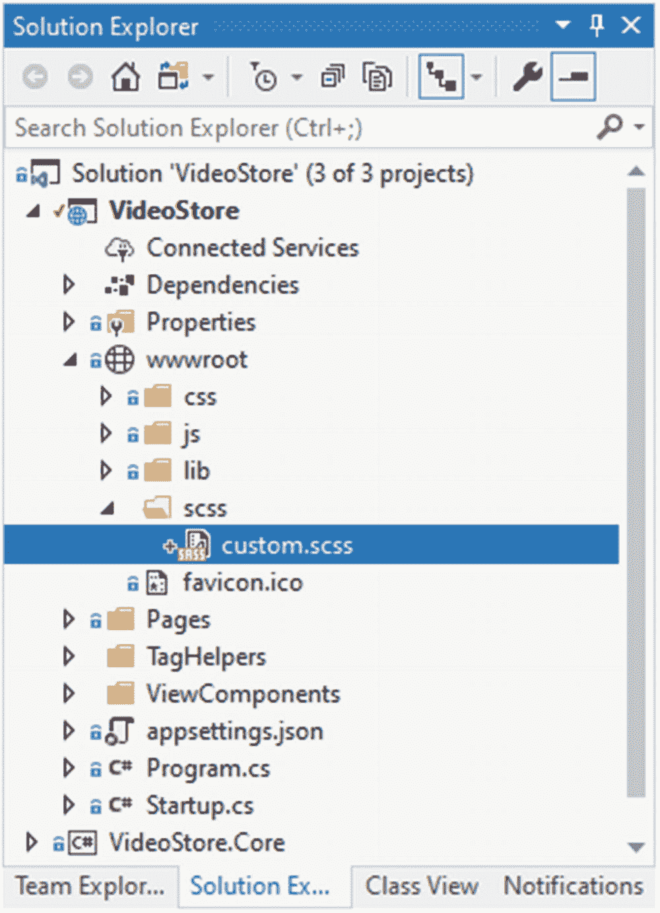
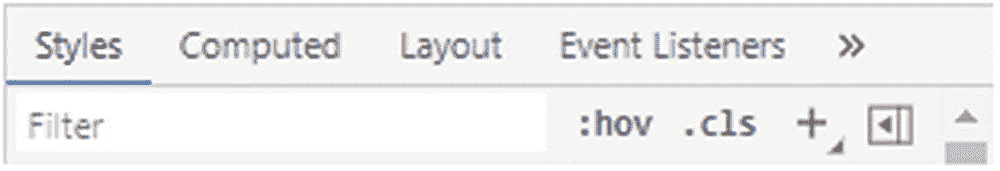

# 六、添加客户端逻辑

开发 web 应用的一部分就是要知道如何恰当地设计用户界面的样式。有些人可能认为这是前端或全栈开发人员的角色，但每个开发人员都知道 CSS、jQuery 和 JavaScript 的基础知识是件好事。

在这一章中，我们将看看如何使用 SCSS 来创建 CSS。我们还将看看如何使用 jQuery 和 JavaScript。能够开发客户端逻辑来为 web 应用添加功能是 web 开发人员需要掌握的技能。

## 将生产脚本与开发脚本分开

在开发过程中，最好能够将脚本和其他静态文件与将在生产过程中使用的文件分开。这很重要，因为在生产环境中，您可能希望使用缩小的文件或来自 CDN 的文件。

静态文件是用于引导、jQuery、字体等的文件。css，。js，或者图像。默认情况下，静态文件由项目中的 wwwroot 文件夹提供。

可以通过在标记中使用特殊的标签帮助器来告诉 ASP.NET Core，您想要在生产环境中应用不同的文件。我们在前面的章节中看到，我们可以使用`_Layout`页面将特定的外观和感觉应用到网站的所有页面上。我们还看到，我们可以在某些页面上覆盖默认的`_Layout`页面。

一般的经验法则是。css 文件被添加到你的`_Layout`页面的`<head>`标签中，而。js 文件是最后添加的，在`_Layout`页面的`<footer>`之后。因此，从`_Layout`页面控制哪些文件在开发阶段而不是生产阶段被提供是有意义的。

为了实现这一点，我们将使用`environment`标签助手。让我们通过将清单 [6-1](#PC1) 中的代码添加到`_Layout`页面的`<footer>`部分来测试这个特殊标签助手的使用。

```cs
<footer class="border-top footer text-muted">
   <vc:video-of-the-day></vc:video-of-the-day>
   <div class="container">
      &copy; 2020 - VideoStore - <a asp-area="" asp-page="/Privacy">Privacy</a>
   </div>

   <environment include="Development">
       <h2>Development</h2>
   </environment>
   <environment exclude="Development">
       <h2>Production</h2>
   </environment>

</footer>

Listing 6-1Using the Environment Tag Helper

```

`environment`标签助手上的`include`和`exclude`属性告诉 ASP.NET Core 何时应用包含的标记。换句话说，当您运行一个开发概要文件时，`include="Development"`将只应用包含在`environment`元素中的代码。对于`exclude="Development"`属性来说，情况正好相反。

要控制当前正在运行的配置文件，请打开应用的`Properties`文件夹中的`launchSettings.json`文件。你会看到清单 [6-2](#PC2) 中所示的 JSON。

```cs
{
  "iisSettings": {
    "windowsAuthentication": false,
    "anonymousAuthentication": true,
    "iisExpress": {
      "applicationUrl": "http://localhost:57104",
      "sslPort": 44398
    }
  },
  "profiles": {
    "IIS Express": {
      "commandName": "IISExpress",
      "launchBrowser": true,
      "environmentVariables": {
        "ASPNETCORE_ENVIRONMENT": "Development"
      }
    },
    "VideoStore": {
      "commandName": "Project",
      "launchBrowser": true,
      "applicationUrl": "https://localhost:5001;http://localhost:5000",
      "environmentVariables": {
        "ASPNETCORE_ENVIRONMENT": "Development"
      }
    }
  }
}

Listing 6-2The launchSettings.json File

```

您会注意到我们有一个 IIS Express 配置文件，它将一个名为`ASPNETCORE_ENVIRONMENT`的环境变量设置为`Development`。


图 6-1

在开发中运行应用

这意味着每当我们在 IIS Express 中启动我们的应用时，都会加载这个概要文件并应用环境变量。页脚中的`environment`标签助手检查这个变量，并应用适用于所用概要文件的标记。运行您的应用，您将会看到标题`Development`如图 [6-1](#Fig1) 所示。


图 6-2

在生产中运行应用

回到`launchSettings.json`文件，将`ASPNETCORE_ENVIRONMENT`值改为`Production`，并再次运行应用。你会看到页脚现在包含了标题`Production`(图 [6-2](#Fig2) )。

第二个概要文件称为`VideoStore`，当您使用`dotnet run`命令从控制台运行应用时会用到这个概要文件。根据我们对概要文件和环境变量的了解，我们可以很容易地根据我们是在开发还是在生产中运行，对我们的站点应用不同的脚本和样式。

## 设置 SCSS 和生成 CSS

正确设计应用的一部分总是需要开发人员使用 CSS。如果你必须使用 CSS，你很可能会喜欢使用 Sass。

Sass 是一种功能丰富的 CSS 扩展语言。你可以从 [`https://sass-lang.com/`](https://sass-lang.com/) 网站上了解更多关于萨斯的信息。

Sass 兼容 CSS 的所有版本，并被广泛采用。它允许开发人员使用 Sass 语法创建 CSS，然后编译成 CSS。它还将创建一个缩小的 CSS 文件。

有很多理由可以让你放心地使用 Sass。以下是其中的一些:

*   它兼容所有版本的 CSS。

*   它拥有比目前可用的其他 CSS 扩展更多的特性和能力。

*   大约 14 年来，它一直得到积极支持。

*   Sass 背后有一个很大的社区，所以寻求帮助从来都不是问题。

Sass 支持变量、嵌套、部分、模块、混合、扩展、继承以及运算符等特性。因此，它的使用对开发者来说是非常自然的。

有关这些功能的更多信息，请访问以下链接: [`https://sass-lang.com/guide`](https://sass-lang.com/guide) 。

如果你想知道为什么这部分的标题提到了 SCSS，但我说的是萨斯，让我来解释一下。Sass 使用两种语法。使用。sass 文件中，您将不需要使用分号和花括号。使用。然而，scss 文件使用大括号和分号。它不关心缩进层次或空白，是 CSS 的超集。事实上，SCSS 意味着时髦的 CSS。因此，SCSS 包含了 CSS 的所有特性，而且还扩展了 Sass 特性。


图 6-3

已创建 scss 文件夹

让我们首先在项目的`wwwroot`中创建一个名为`scss`的文件夹。在图 [6-3](#Fig3) 中可以看到添加了这个文件夹。


图 6-4

添加 SCSS 样式表

我们需要做的下一件事是向`scss`文件夹添加一个新的 SCSS 样式表。为此，右键单击该文件夹，并选择“添加➤新项目”以打开“添加新项目”窗口。

如图 [6-4](#Fig4) 所示，在搜索框中输入 scss，选择一个`SCSS Style Sheet (SASS)`文件。调用这个文件`custom.scss`，点击`Add`按钮。

需要注意的是，该文件的名称需要在整个代码中保持一致。如果您将其命名为其他名称(根据我的命名)，那么在将链接添加到您生成的 CSS 文件时，您需要维护该引用。



图 6-5

添加了自定义 SCSS 文件

一旦你将文件添加到你的`scss`文件夹中，你的`VideoStore`项目应该如图 [6-5](#Fig5) 所示。这是我们将添加 SCSS 语法的文件。我们项目的 CSS 将从这个 SCSS 文件中编译。


图 6-6

添加 Web 编译器

下一个任务是将 web 编译器添加到项目中。在 Visual Studio 2019 版本 16.6.2 中，您需要前往工具栏中的`Extensions`菜单，然后单击`Manage Extensions`。

这将打开`Manage Extensions`窗口。如图 [6-6](#Fig6) 所示，搜索术语`web compiler`，按相关性排序。我在这里寻找的扩展是由 Mads Kristensen 创建的。它是免费的，非常容易使用。

可能需要关闭并重新启动 Visual Studio 来启动此扩展的安装。


图 6-7

编译文件

右击`custom.scss`文件(图 [6-7](#Fig7) ，选择 Web 编译器➤编译文件。


图 6-8

编译后的文件和编译器配置

你现在会看到`custom.scss`文件生成了一个`custom.css`和一个`custom.min.css`文件，它们嵌套在一起(图 [6-8](#Fig8) )。

同样需要注意的是添加了一个名为`compilerconfig.json`的新文件(就在图 [6-8](#Fig8) 中`appsettings.json`文件的下面)。正是这个配置文件将用于控制我们生成的 CSS 文件的确切创建位置。

查看清单 [6-3](#PC3) 中的`compilerconfig.json`文件，我们可以看到它在与`custom.scss`文件相同的地方定义了生成的 CSS 文件的位置。

```cs
[
  {
    "outputFile": "wwwroot/scss/custom.css",
    "inputFile": "wwwroot/scss/custom.scss"
  }
]

Listing 6-3The compilerconfig.json File

```

我不希望生成的 CSS 文件存在于我的`scss`文件夹中。在我的项目的`wwwroot`中已经有一个文件夹存放我的 CSS 文件。继续将生成的 CSS 文件的输出路径修改为清单 [6-4](#PC4) 所示的`css`文件夹。

```cs
[
  {
    "outputFile": "wwwroot/css/custom.css",
    "inputFile": "wwwroot/scss/custom.scss"
  }
]

Listing 6-4The Modified compilerconfig.json File

```

每当我们保存对`scss`文件的任何更改时，`css`文件将被重新生成并放置在`wwwroot`的`css`文件夹中。你可以在图 [6-9](#Fig9) 的`css`文件夹中看到这些文件。

为了说明 SCSS 的力量，考虑视频详细页面。请记住，我们创建了一个视频统计部分，它显示了关于特定视频的简短简介、星级评定和在线查看视频页面的按钮。用于星级评定的星星是字体很棒的图标。该部分的标记包含在`_VideoStats.cshtml`局部视图中。代码再次包含在清单 [6-5](#PC5) 中。


图 6-9

重新定位的编译文件

通过将标记*包含在视频收到的评级的每次迭代中，添加了星星。换句话说，评级为 4 相当于 4 颗星。*

```cs
@using VideoStore.Core
@model Video

<div class="card" style="width: 18rem;">
    <div class="card-header">
        @if (Model.Rating > 0)
        {
            for (int i = 0; i <= Model.Rating - 1; i++)
            {
                <i class="fas fa-star"></i>
            }
        }
        else
        {
            <h6>This video has not received any ratings yet</h6>
        }
    </div>
    <div class="card-body">
        <h5 class="card-title">@Model.Title</h5>
        <p class="card-text">@Model.Review</p>
        <a href="@Model.OnlineURL" class="btn btn-primary">View Online</a>
    </div>
</div>

Listing 6-5The _VideoStats Partial View

```

目前，星星是黑色的。我希望这些星星是金色的。因此，我将使用 CSS 将星星的颜色从黑色改为金色。打开`custom.scss`文件，添加如下代码，如清单 [6-6](#PC6) 所示。

```cs
$star-color: #DAA520;

i.fas.fa-star {
    color: $star-color;
}

Listing 6-6Changing the Star Rating Color in the SCSS File

```

`scss`文件使用一个名为`$star-color`的变量，并将其设置为所需的散列码。你现在需要做的就是保存你的`custom.scss`文件，然后`custom.css`文件会自动更新。查看生成的 CSS 文件，您会看到清单 [6-7](#PC7) 中的代码。

```cs
i.fas.fa-star {
  color: #DAA520; }

Listing 6-7The Generated CSS

```

这意味着我只需指定一次颜色，并设置一个可以在整个样式表中使用的变量。如果颜色变了，我只需要在一个地方改变它。但是我们还没有完成。我们仍然需要在布局页面上添加对生成的 CSS 文件的引用。

您应该记得，我们为视频详细信息页面使用了不同的布局页面。这个布局页面被称为`_LayoutSpecial.cshtml`。打开这个文件，修改标签`<head>`中的代码，如清单 [6-8](#PC8) 所示。

```cs
<head>
    <meta charset="utf-8" />
    <meta name="viewport" content="width=device-width, initial-scale=1.0" />
    <title>@ViewData["Title"] - VideoStore</title>
    <link rel="stylesheet" href="~/lib/bootstrap/dist/css/bootstrap.min.css" />
    <link rel="stylesheet" href="~/css/site.css" />

    <environment include="Development">
        <link rel="stylesheet" href="~/css/custom.css" />
    </environment>
    <environment exclude="Development">
        <link rel="stylesheet" href="~/css/custom.min.css" />
    </environment>
</head>

Listing 6-8Referencing the custom.css File

```

在这里，你可以看到，我们告诉 ASP.NET Core 使用生产缩小的 CSS 文件。当您运行您的视频商店应用，并前往视频详细信息页面，您会看到星星是金色的。


图 6-10

应用的 CSS 样式

查看`DevTools`(图 [6-10](#Fig10) 中应用的样式，您会看到我们指定的颜色样式在`Styles`选项卡中可见。

### SCSS 部分档案

让我们在这里停下来关注一下 SCSS。还记得我之前提到过我们可以用偏音吗？片段是模块化代码的一种方式。部分文件以前导下划线命名。这告诉 web 编译器不要把这个文件编译成他们自己的 CSS 文件(比如`custom.css`文件)。相反，这些部分文件可以被使用和导入或注入到其他文件中并在那里使用。为了说明这一点，在`scss`文件夹中添加一个名为`_variables.scss`的新 SCSS 文件，如图 [6-11](#Fig11) 所示。


图 6-11

添加 _variables 部分文件

在`_variables`部分文件中，添加清单 [6-9](#PC9) 中所示的代码。

```cs
/* Site Palette*/

$star-color: #DAA520;

Listing 6-9The _variables Partial File

```

我们现在有了一个单独的地方来存储和更改样式表中使用的变量。接下来，我们需要修改`custom.scss`文件来导入`_variables`部分文件，如清单 [6-10](#PC10) 所示。

```cs
@import "_variables.scss";

i.fas.fa-star {
    color: $star-color;
}

Listing 6-10Importing the _variables Partial File

```

我们现在可以在任何需要的地方导入所需的部分文件。我们也可以有多个部分文件，只要文件名以前导下划线开头。

我们对创建 SCSS 的方式做了一些改变。我们已经将变量的功能分解到一个单独的部分文件中，现在可以控制在哪里使用这个部分文件。但是看看生成的 CSS 文件。一点都没变。它保持不变。因此，SCSS 允许我们轻松地构建用于设计应用风格的代码，同时产生与预期相同的输出。

### 使用 SCSS @mixin

您可以使用@mixin 关键字创建 mixin。这允许您创建通用的属性集，这些属性集可以使用默认值作为参数，但仍然可以被覆盖。我们已经为变量使用了部分文件，所以让我们为 mixins 使用部分文件。


图 6-12

Mixins 的部分文件

在`scss`文件夹中添加一个名为`_mixins.scss`的新的局部文件，如图 [6-12](#Fig12) 所示。将清单 [6-11](#PC11) 中的代码添加到文件中。

```cs
@mixin header-font($family: 'Times New Roman', $weight: 400, $style: normal, $color: black) {
    font-family: $family, Helvetica, sans-serif;
    font-style: $style;
    font-weight: $weight;
    color: $color;
}

Listing 6-11The Mixin File’s Code

```

这个 mixin 创建了一个标题字体，它将使用 Times New Roman，权重为 400，正常样式，颜色为黑色。在`custom.scss`文件中，使用`@import,`包含 mixin 文件，并将标题字体应用于`H1`和`H2`元素(列表 [6-12](#PC12) )。

```cs
@import "_variables.scss";
@import "_mixins.scss";

i.fas.fa-star {
    color: $star-color;
}

h1 {
    @include header-font;
}

h2 {
    @include header-font('Arial', 200, normal, red);
}

Listing 6-12Import and Apply the Mixin

```

您可以看到，当应用到`H1`元素时，将使用默认值，但是当我们将样式应用到`H2`元素时，我们将覆盖这些值。现在修改`Index.cshtml`页面标记，如清单 [6-13](#PC13) 所示。

```cs
@page
@model IndexModel
@{
    ViewData["Title"] = "Home page";
}

<div class="text-center">
    <h1 class="display-4">Welcome</h1>
    <p>Learn about <a href="https://docs.microsoft.com/aspnet/core">building Web apps with ASP.NET Core</a>.</p>
    <h2>In This Course</h2>
    <p>Add some course details here.</p>
</div>

Listing 6-13Modified Index Page

```

运行您的应用，查看应用于索引页面上的标题元素的 mixin(图 [6-13](#Fig13) )。


图 6-13

索引页

另一件有趣的事情是清单 [6-14](#PC14) 中所示的`custom.css`文件。我们的 SCSS 文件包含最少的代码，但是使用部分文件和`@import`的能力，我们可以很容易地提供逻辑来样式化我们的标记。

```cs
i.fas.fa-star {
  color: #DAA520; }

h1 {
  font-family: "Times New Roman", Helvetica, sans-serif;
  font-style: normal;
  font-weight: 400;
  color: black; }

h2 {
  font-family: "Arial", Helvetica, sans-serif;
  font-style: normal;
  font-weight: 200;
  color: red; }

Listing 6-14The Compiled CSS

```

虽然我可能永远不会在应用中使用 Times New Roman，但这确实说明了 mixins 的威力。我不确定你用来阅读这本书的媒介是否包含彩色图像，但是相信我，`H2`元素是红色的。

使用 mixins 可以让你在应用样式时非常灵活。您可以将它设置为 mixin 名称，或者根据您的需要稍微调整一下。

### 使用 SCSS @扩展

在 SCSS，`@extend`这个关键词会让开发者想到继承。这允许您继承一个类的属性并将它们应用到另一个类。这是避免代码重复的好方法。

要了解这是如何工作的，首先在`_variables.scss`文件中创建一个名为`$border-color`的变量，并将其设为红色。添加另一个名为`$highlight-color`的变量，并将其设为蓝色。代码可以在清单 [6-15](#PC15) 中看到。

```cs
$star-color: #DAA520;

$border-color: #FF0000;
$highlight-color: #FF0000;
$highlight-text-color: #ffffff;

Listing 6-15Additional SCSS Variables

```

因为我们的`custom.scss`文件导入了变量，所以我们可以在那里引用这些变量。考虑清单 [6-16](#PC16) 中`custom.scss`文件的完整代码。

```cs
@import "_variables.scss";
@import "_mixins.scss";

i.fas.fa-star {
    color: $star-color;
}

h1 {
    @include header-font;

}

h2 {
    @include header-font('Arial', 200, normal, red);
}

.pBorder {
    border: 2px solid $border-color;
}

.pBorder-highlight {
    @extend .pBorder;
    background-color: $highlight-color;
    color: $highlight-text-color;
}

Listing 6-16Extending a Class in SCSS

```

我为一个名为`.pBorder`的类添加了一个样式。这只是在应用该类的元素周围创建一个红色边框。这是因为它使用了`$border-color`变量。

假设我想创建这个类的一个小变体，但不想第二次添加来自`.pBorder`的代码，我可以使用`@extend`关键字，如清单 [6-16](#PC16) 中的`.pBorder-highlight`所示。代码行`@extend .pBorder`获取`.pBorder`中的所有内容，并将其应用到`.pBorder-highlight`。我在`.pBorder-highlight`中定义的其他东西只适用于`.pBorder-highlight`。

虽然`.pBorder`中的代码相当简单，但是想象一下一个应用了许多样式的类。扩展类现在变得物有所值，因为它消除了代码重复，并允许您将任何未来的更改保存在一个地方。

保存你的`custom.scss`文件，我们来看看编译后的 CSS 文件是什么样子的。您可以在清单 [6-17](#PC17) 中看到这一点。

```cs
i.fas.fa-star {
  color: #DAA520; }

h1 {
  font-family: "Times New Roman", Helvetica, sans-serif;
  font-style: normal;
  font-weight: 400;
  color: black; }

h2 {
  font-family: "Arial", Helvetica, sans-serif;
  font-style: normal;
  font-weight: 200;
  color: red; }

.pBorder, .pBorder-highlight {
  border: 2px solid #FF0000; }

.pBorder-highlight {
  background-color: #0000FF;
  color: #ffffff; }

Listing 6-17The Compiled CSS File

```

如果您将编译后的 CSS 与 SCSS 文件中的扩展代码进行比较，那么您可以看到 SCSS 文件中的扩展代码使意图更加清晰和简洁。让我们继续将这些类应用到清单 [6-18](#PC18) 所示的`Index.cshtml`页面。

```cs
@page
@model IndexModel
@{
    ViewData["Title"] = "Home page";
}

<div class="text-center">
    <h1 class="display-4">Welcome</h1>
    <p class="pBorder">Learn about <a href="https://docs.microsoft.com/aspnet/core">building Web apps with ASP.NET Core</a>.</p>
    <h2>In This Course</h2>
    <p class="pBorder-highlight">Add some course details here.</p>
</div>

Listing 6-18Classes Applied to Index Page

```

如果您运行该应用，您将看到应用于图 [6-14](#Fig14) 中`Index`页面上`<p>`元素的样式。


图 6-14

应用 pBorder 类的索引页

能够在 SCSS 扩展课程让你非常灵活。不必重写代码也很棒，因为如果您需要进一步修改某些东西，您只需要在一个地方进行修改。

### 使用 SCSS 函数

对 SCSS 使用函数正是你所想的那样。函数允许你做的是创建一些逻辑，这些逻辑可以应用到你导入部分文件的任何地方。

部分文件将用于包含经常使用的函数，这些函数可以导入到 custom.scss 文件中。

这使得使用 SCSS 创建样式时使用函数变得非常强大。

要了解这是如何工作的，首先在`scss`文件夹中创建一个名为`_functions.scss`的新的部分文件。这可以从图 [6-15](#Fig15) 中看出。这个文件将包含我们编写的所有函数，并且必须在样式表中应用。


图 6-15

函数部分文件

我想做的是创建一个函数，它将根据提供的值乘以基值来计算元素填充。如果没有提供值，则必须使用默认值。在添加这个函数之前，我们需要向`_variables.scss`部分文件添加一个变量`$base-padding`。

```cs
/* Site Palette*/

$star-color: #DAA520;

$border-color: #FF0000;
$highlight-color: #0000FF;
$highlight-text-color: #ffffff;

/* Base Padding */

$base-padding: 2px;

Listing 6-19The Base Padding Value

```

如清单 [6-19](#PC19) 所示，基本填充值为`2`像素。接下来，在`_functions.scss`文件中，添加清单 [6-20](#PC20) 中的代码。

```cs
@import "_variables.scss";

@function padding-calc($factor: 1) {
    @return $base-padding * $factor;
}

Listing 6-20The Padding Calculation Function

```

因为我们正在使用`$base-padding`变量，所以我们需要导入`_variables.scss`部分文件。使用`@function`关键字后跟函数名来创建函数。参数可以传递给函数。在清单 [6-20](#PC20) 的例子中，函数采用一个名为`$factor`的参数。如果没有提供值，那么`1`的默认值将应用于`$factor`。然后，该函数返回基本填充与因子相乘的结果，以确定元素填充。

要看到这一点，请通过导入`_functions.scss`文件并对元素应用该函数来计算填充，从而修改您的`custom.scss`文件。清单 [6-21](#PC21) 对此进行了说明。您将会看到`padding-calc`函数已经被应用到了`.pBorder`类。

```cs
@import "_variables.scss";
@import "_mixins.scss";
@import "_functions.scss";

i.fas.fa-star {
    color: $star-color;
}

h1 {
    @include header-font;
}

h2 {
    @include header-font('Arial', 200, normal, red);
}

.pBorder {
    border: 2px solid $border-color;
    padding: padding-calc(5);
}

.pBorder-highlight {
    @extend .pBorder;
    background-color: $highlight-color;
    color: $highlight-text-color;
}

Listing 6-21Using the Function

```

保存`custom.scss`文件，检查生成的`custom.css`文件。您可以在清单 [6-22](#PC22) 中看到结果代码。在这个例子中，因为我们向`padding-calc`函数提供了一个值`5`，所以`padding`的结果值被计算为`10`。

```cs
.pBorder, .pBorder-highlight {
  border: 2px solid #FF0000;
  padding: 10px; }

Listing 6-22The .pBorder Class in the Generated CSS

```

更改`custom.scss`文件，并删除传递给`padding-calc`函数的`5`值(列表 [6-23](#PC23) )。

```cs
.pBorder {
    border: 2px solid $border-color;
    padding: padding-calc();
}

Listing 6-23The padding-calc Without a Parameter

```

如果您保存`custom.scss`文件并检查生成的`custom.css`文件，您会注意到`.pBorder`类中`padding`的计算值已经变为`2`像素(列表 [6-24](#PC24) )。

```cs
.pBorder, .pBorder-highlight {
  border: 2px solid #FF0000;
  padding: 2px; }

Listing 6-24The Default Parameter Value Applied

```

这是因为`$factor`的默认参数值`1`被应用于具有`2`的`$base-padding`值的计算。

## 使用 Chrome 开发工具

本书中的 web 应用运行在 Google Chrome 中。正是因为这个原因，我在本章中加入了一个关于 Chrome 开发者工具的章节。其他浏览器中也有开发人员工具，因此如果您使用不同的浏览器进行调试，本节中介绍的特性和功能可能会与您的不同。

调试 web 应用并不总是在 C# 代码中放置断点并逐句通过代码。有时，您需要一种方法来检查和单步执行客户端代码(如 jQuery ),或者修改 CSS。这就是 Chrome 开发者工具派上用场的地方。

运行您的 web 应用，您应该会看到我们在前面关于 SCSS 的部分中修改过的`Index`页面。右键单击页面(或右键单击页面上的元素，如标题)，并从上下文菜单中单击`Inspect`。你也可以按住`Ctrl+Shift+I`来打开开发者工具。


图 6-16

DevTools 中显示的页面标记

展开元素，您应该会看到标题元素，如图 [6-16](#Fig16) 所示。

如果您右键单击欢迎标题，您将被直接带到 H1 元素。

这是索引页面的标记，您可以直接在 DevTools 中修改布局。

### 拖动元素

DevTools 中显示的元素都是可拖动的。选中`H1`元素，点击并将其拖至`H2`元素下方。


图 6-17

H1 元素被拖到 H2 元素下面

您的标记将如图 [6-17](#Fig17) 所示。注意当你拖动元素时，网页是如何更新以显示改变的布局的(图 [6-18](#Fig18) )。


图 6-18

更新后的网页

现在，您可以通过在页面上拖动元素来查看页面的外观。这对于更改页面布局非常有用，而不必对代码进行永久性的更改。当您刷新页面时，元素的布局被重置为您开始移动它们之前的布局。

### 添加和修改样式

也可以在 DevTools 中修改 CSS。这是检查样式更改是否好看或者计划的更改是否会达到预期效果的一种极好的方式。

通过刷新页面重置页面，右键单击`H2`元素并单击 Inspect。请注意，您不需要关闭 DevTools 来检查元素。您可以在 DevTools 打开时检查元素。DevTools 中被聚焦的元素将跳转到`H2`元素，如图 [6-19](#Fig19) 所示。


图 6-19

突出的 H2 元素

您可以看到页面的 CSS 显示在右侧的样式选项卡中。回想一下我们为`H2`元素添加到 SCSS 文件中的代码，您会记得我们包括了清单 [6-25](#PC25) 中的`@mixin`。

```cs
h2 {
    @include header-font('Arial', 200, normal, red);
}

Listing 6-25The SCSS Code for the H2 Element

```

生成的 CSS 指定字体颜色必须是红色。在样式选项卡中，我们可以通过单击颜色属性旁边的红色小块来更改颜色(图 [6-20](#Fig20) )。


图 6-20

更改 H2 元素的字体颜色

打开的调色板允许您更改颜色。请注意，当您更改颜色时，网页会立即更新。“样式”选项卡允许您做的不仅仅是更改样式。您可以通过点击图 [6-21](#Fig21) 所示过滤器右侧的图标来添加新的样式、类别和切换状态。



图 6-21

添加样式、类和状态

选中`H2`元素，点击加号(+)按钮。您将看到添加了一个样式规则，您可以向其添加属性。

### 添加新类别

向元素添加一个新类也同样简单。关闭浏览器，通过添加一个名为. featuredH2 的新类来修改 custom.scss 文件，该类应用不同的字体大小和颜色(清单 [6-26](#PC26) )。

```cs
.featuredH2 {
    @include header-font('Arial', 300, normal, gold);
}

Listing 6-26The featuredH2 Class

```

添加并编译这个新类后，再次运行 web 应用。选中`H2`元素，点击图 [6-21](#Fig21) 中的`.cls`按钮，如图 [6-22](#Fig22) 所示。


图 6-22

添加新类别

键入我们刚刚添加的新类的名称，然后按 Enter 键。

值得注意的是，所有这些变化都只是暂时的。当您刷新或关闭页面时，您所做的所有更改都将丢失。

您将看到，当新的类样式应用于`H2`元素时，web 页面被更新。`H2`元素也被更新以显示添加的类，如图 [6-23](#Fig23) 所示。


图 6-23

应用了新的 featuredH2 类

这允许您在网页上测试不同的元素类，而无需更改任何代码。

### 测试状态变化

如果您碰巧有响应状态变化的元素，您可以使用 DevTools 触发元素的状态。事实证明，索引页面上有一个链接。链接就在`H1`元素的下面。在链接上单击鼠标右键，然后单击“检查”。如图 [6-21](#Fig21) 所示，点击`:hov`按钮，检查如图 [6-24](#Fig24) 所示的`:hover`状态。


图 6-24

悬停状态触发

您将看到`a:hover`样式规则被加载到样式选项卡中。链接元素现在处于永久悬停状态，同时检查`:hover`状态。现在，您可以修改元素状态。改变`:hover`州的风格，如清单 [6-27](#PC27) 所示。

```cs
a:hover {
    color: #dc3545;
    text-decoration: line-through;
}

Listing 6-27The Modified Hover State

```

完成后，取消选中`:hover`状态，并将鼠标移动到网页上的链接上。您将会看到，每当您将鼠标悬停在链接上时，您对链接悬停状态所做的更改就会生效。

强制元素的状态允许您确保您想要的样式被可视化地应用，从而允许您容易地修改该样式。

### 限制网络速度

有时你需要了解当用户通过慢速互联网连接访问你的站点时，你的站点将如何运行。为了测试这一点，打开 DevTools，点击网络选项卡，如图 [6-25](#Fig25) 所示。


图 6-25

查看网络选项卡

在这里，你会在第二个工具栏上看到站点显示`Online`。在文本`Online`的旁边，您会看到一个向下的箭头。点击该向下箭头显示不同的可用预设，如图 [6-26](#Fig26) 所示。


图 6-26

选择节流状态

选择慢速 3G 会降低你的网站速度。


图 6-27

添加自定义配置文件

能够调节您的网络速度允许您测试您的代码在页面上的性能。您甚至可以添加一个定制的网络节流配置文件，如图 [6-27](#Fig27) 所示。当您的站点需要满足特定的网络需求时，这是非常有用的。

## 包扎

Chrome 中的 DevTools 允许你做比我在本章中所展示的更多的事情。我可以单独写一本关于在 Chrome 中使用开发者工具的书。不幸的是，我只有几页来做这件事，我只是想在这一章介绍一些关键概念。除了我在这里展示的，Chrome 开发者工具允许你做以下事情:

*   向脚本添加断点，以便调试它们。

*   在断点状态下逐句执行脚本。

*   为 click 和 mouseover 事件等事件在脚本中添加事件侦听器断点。

*   向观察器添加变量以及向观察器添加表达式。

*   将信息记录到 DevTools 中的控制台窗口。

*   保存您的控制台输出。

*   审核网站速度。

*   模拟不同的移动设备来测试你的站点是如何显示的。

谷歌有一套丰富的 Chrome DevTools 在线文档，链接如下: [`https://developers.google.com/web/tools/chrome-devtools/`](https://developers.google.com/web/tools/chrome-devtools/) 。

这里有很多东西需要学习，您对它越熟悉，在调试您的 web 应用时，它会给您带来越多的好处。*