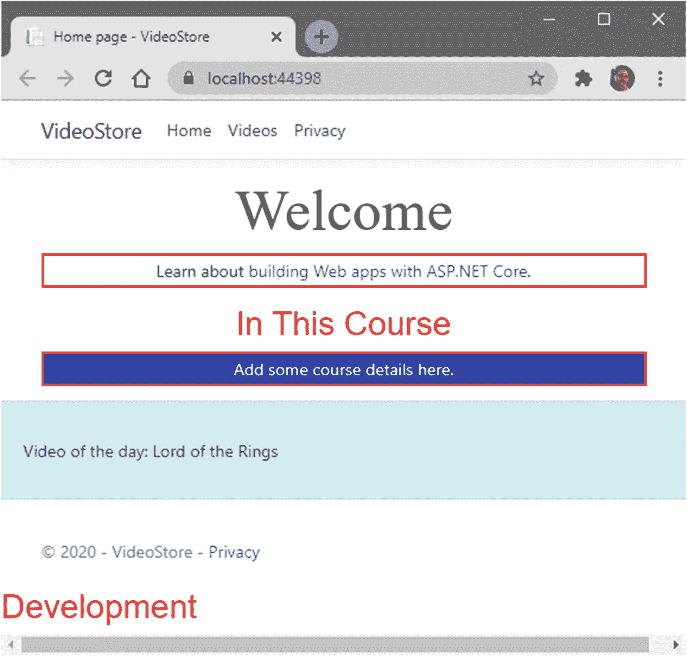

# 七、探索中间件

在本章中，我们将进一步了解中间件及其在 ASP.NET Core 中扮演的角色。理解中间件的作用将有助于您构建 ASP.NET Core 应用，以便有效地利用中间件及其处理的请求。

## 什么是中间件

我们先来回答最刺眼的问题。中间件到底是什么？简单的答案如下:中间件可以被认为是处理请求和响应的代码管道。中间件选择将请求传递给管道中的下一位代码，或者在传递请求之前对请求做一些事情。

请求委托用于构建处理每个 HTTP 请求的软件管道。请求代理通过使用`Run`、`Map`和`Use`扩展方法来配置。每个请求委托可以被内联指定(内联中间件)或者作为一个可重用的类。

看看我们应用中的`Startup.cs`类，`Configure`方法(清单 [7-1](#PC1) )是 ASP.NET Core 用来确定需要执行什么中间件的。

```cs
public void Configure(IApplicationBuilder app, IWebHostEnvironment env)
{
    if (env.IsDevelopment())
    {
        _ = app.UseDeveloperExceptionPage();
    }
    else
    {
        _ = app.UseExceptionHandler("/Error");
        _ = app.UseHsts();
    }

    _ = app.UseHttpsRedirection();
    _ = app.UseStaticFiles();

    _ = app.UseRouting();
    _ = app.UseAuthorization();
    _ = app.UseSession();
    _ = app.UseEndpoints(endpoints =>
      {
          _ = endpoints.MapRazorPages();
      });
}

Listing 7-1The Configure Method

```

中间件通过在实现`IApplicationBuilder`接口的对象上调用扩展方法来安装。该接口提供了配置应用请求管道的机制。查看清单 [7-1](#PC1) 中的代码，您可以看到我们只在开发模式下添加了`UseDeveloperExceptionPage`中间件。如果我们不处于开发模式，我们使用`UseExceptionHandler`和`UseHsts`中间件。在我们的`Configure`方法中安装的其他中间件是诸如`UseRouting`和`UseAuthorization`等中间件。

通过这样做，我们正在构建一个请求管道(图 [7-1](#Fig1) )。当一个 HTTP 请求进入这个管道时，中间件的第一部分将查看请求并执行一些功能(它被设计来执行的工作功能)。如果这个请求看起来不错，它将被传递到我们管道中的下一个中间件。这个过程会不断重复，但是如果一个中间件决定请求无效，这个请求管道就会被短路。缩短请求管道的中间件被称为终端中间件，因为它阻止后续的中间件组件能够处理请求。


图 7-1

中间件管道

这种情况的一个例子可能是授权失败，授权中间件返回失败的响应。它将不会进一步传递请求，因此由于授权失败而终止该请求。

如图 [7-1](#Fig1) 所示，中间件管道接收请求并发出响应。这意味着它是双向的，对于发生的每个请求，都会发生某种响应。这个响应可能是一个错误，或者一个页面，或者一些 JSON。因此，中间件在 ASP.NET Core 中非常重要，因为它定义了应用的行为。让我们看看应用中安装的一些中间件。

### 处理异常

由于中间件请求管道的双向性，管道开始处的任何中间件都在那里，因为它需要是第一段代码来处理传入的请求，或者是最后一段代码来处理传出的响应。在清单 [7-1](#PC1) 中，我们的`Configure`方法首先在开发模式下安装`UseDeveloperExceptionPage`。它只是将收到的请求传递给下一个中间件，但是如果这些中间件中的任何一个抛出异常，`UseDeveloperExceptionPage`就会关心响应并显示一个开发者异常。它在请求管道中是第一个，因为它需要在响应中是最后一个。

当我们在生产中时，会向用户显示一个更友好的错误页面，而没有堆栈跟踪，例如，我们在使用开发人员异常页面时会看到的。

### 使用 Hsts

我们还在响应头中将应用告知 HSTS (HTTP 严格传输安全协议)。从 ASP.NET Core 2.1 和更高版本开始实现了`UseHsts`扩展方法。当支持 HSTS 的浏览器接收到这个报头时，它将强制所有通信通过 HTTPS。它还防止用户使用不可信或无效的证书，并且不允许用户临时信任这样的证书。

HSTS 是由客户端强制执行的，因此稍微受限，因为客户端必须支持 HSTS。它还要求至少有一个成功的 HTTPS 请求来建立 HSTS 策略。


图 7-2

HSTS 的回应

这可以从图 [7-2](#Fig2) 中看出。一旦向服务器发出安全请求，就会发回一个名为严格传输安全的头。这告诉客户端，在特定的持续时间内(默认为 30 天)，对此站点的每个请求都必须使用 HTTPS。

如果用户在这段时间内返回网站，不管他们是点击链接、键入 URL 还是使用书签，浏览器都会通过 HTTPS 发出初始请求(图 [7-3](#Fig3) )。


图 7-3

HSTS 期限内的后续请求

不要在开发中使用 HSTS，因为这些设置在浏览器中是高度可缓存的。这就是为什么我们只在生产中安装`UseHsts`中间件的原因。

此外，您可以在清单 [7-2](#PC2) 中的`ConfigureServices`方法中为 HSTS 配置选项。

```cs
_ = services.AddHsts(opts =>
{
    opts.Preload = true;
    opts.IncludeSubDomains = true;
    opts.MaxAge = TimeSpan.FromDays(60);
    opts.ExcludedHosts.Add("www.somesite.com");
});

Listing 7-2HSTS Options in ConfigureServices

```

在这里，您将看到以下选项:

*   事先装好

*   包括子域

*   MaxAge(最大值)

*   排除的主机

选项告诉浏览器在进入我们的网站之前使用 HTTPS。这意味着最初的 HSTS 反应是不必要的，如图 [7-2](#Fig2) 所示。浏览器第一次访问我们的网站时，它会从一开始就使用 HTTPS。你可以在 [`https://hstspreload.org`](https://hstspreload.org) 找到更多信息。

`IncludeSubDomains`选项是不言自明的，但是它告诉浏览器将 HSTS 策略应用于主机的任何子域。

你也可以设置`MaxAge`，它告诉浏览器我们希望浏览器跟踪我们想要使用 HSTS 的时间。

最后，我们可以通过添加`ExcludedHosts`选项来排除任何主机。

### 使用 https 重定向

中间件将向任何试图通过 HTTP 访问网站的浏览器发送 HTTP 重定向指令。

### 使用静态文件

顾名思义，这可以支持静态文件。静态文件是 HTML、CSS、图像和 JavaScript 等文件。静态文件的默认目录是`wwwroot`目录。因此，默认情况下，`UseStaticFiles`中间件会寻找一个名为`wwwroot`的文件夹。如果我们不想调用 web 根目录`wwwroot`，那么我们需要告诉 ASP.NET Core 静态文件可以从哪里被提供。我们可以通过在清单 [7-3](#PC3) 中的`Program.cs`文件中使用 web builder 上的`UseWebRoot`方法来做到这一点。

```cs
public static IHostBuilder CreateHostBuilder(string[] args) =>
    Host.CreateDefaultBuilder(args)
        .ConfigureWebHostDefaults(webBuilder =>
        {
            webBuilder.UseStartup<Startup>();
            webBuilder.UseWebRoot("wwwsite");
        });

Listing 7-3Changing the Web Root Folder

```

这里，我们告诉 ASP.NET Core，应用的 web 根已经更改为`wwwsite`。然而，这不是我想做的事情，所以我将把我的 web 根目录保留为`wwwroot`。

这意味着静态文件可以通过`wwwroot`目录的相对路径来访问。如果展开`wwwroot`文件夹，默认会看到`css`、`js`和`lib`。因为`UseStaticFiles`中间件将 wwwroot 中的文件标记为可服务的，所以如下引用 CSS 文件`"~/css/custom.css"`告诉 ASP.NET Core 使用波浪号`~`字符在 web 根目录中查找文件。

如果您需要将静态文件保存在`wwwroot`文件夹之外(在 static files 文件夹中，例如，如图 [7-4](#Fig4) 所示)，您可以配置`UseStaticFiles`中间件的`StaticFileOptions`，如清单 [7-4](#PC4) 所示。

请注意，您将需要导入名称空间 Microsoft。扩展名. FileProviders 和 System.IO。


图 7-4

在 wwwroot 之外使用 StaticFiles 文件夹

这意味着您现在可以将`StaticFiles`文件夹下的`css`文件夹中的 CSS 文件引用为`"~/StaticFiles/css/custom.css"`。

```cs
_ = app.UseStaticFiles(new StaticFileOptions
{
    FileProvider = new PhysicalFileProvider(Path.Combine(env.ContentRootPath, "StaticFiles")), RequestPath = "/StaticFiles"
});

Listing 7-4Use Static Files Outside of wwwroot

```

有趣的是，`PhysicalFileProvider`的参数被称为`root`，如图 [7-5](#Fig5) 所示。


图 7-5

PhysicalFileProvider 根参数

如果你想将静态文件移动到新的`StaticFiles`文件夹中，你必须更新在`_Layout.cshtml`和`_LayoutSpecial.cshtml`文件中对这些静态文件的引用。这不是我将在本书中涉及的内容。请记住，如果您必须将静态文件移动到 web 根目录之外，您可以这样做。

### 用户路由

当收到 HTTP 请求时，路由负责将请求匹配并分发到端点。这意味着`UseRouting`给流水线增加了路由匹配。然后，中间件根据传入的请求找到最匹配的端点。

### 使用会话

如果您使用 ASP.NET 应用有一段时间，您会知道会话允许我们存储用户数据。要在我们的 web 应用中使用会话，我们需要在`ConfigureServices`方法中调用`AddSession`方法，并在`Configure`方法中添加`UseSession`中间件。

### 将端点用于 MapRazorPages

这将端点执行添加到管道中，该管道将运行与匹配端点关联的委托。使用时，这个中间件将把 Razor 页面端点添加到管道中。

## 创建定制中间件

在本章的前面，您看到了 ASP.NET Core 包括一组丰富的内置中间件组件。到目前为止，您可能已经注意到中间件在您的管道中出现的顺序很重要。虽然有许多中间件组件可供选择，但有时您可能需要创建一个定制的中间件组件。添加定制的中间件组件并不那么困难。事实证明，Visual Studio 包括一个用于创建标准中间件类的模板。在项目根目录下创建一个名为`CustomMiddleware`的新文件夹，右键单击它，并添加一个新项目。显示添加新项目窗口，如图 [7-6](#Fig6) 所示。


图 7-6

中间件模板

在搜索文本框中，输入单词`middleware`，找到 C# 中间件类模板。我刚刚调用了自定义中间件类`MyCustomMiddleware`。


图 7-7

添加了自定义中间件类

当自定义中间件类被添加到您的项目中时，您的项目应该如图 [7-7](#Fig7) 所示。这个类被添加了一些样板代码，如清单 [7-5](#PC5) 所示。

```cs
using Microsoft.AspNetCore.Builder;
using Microsoft.AspNetCore.Http;
using System.Threading.Tasks;

namespace VideoStore.CustomMiddleware
{
    public class MyCustomMiddleware
    {
        private readonly RequestDelegate _next;

        public MyCustomMiddleware(RequestDelegate next)
        {
            _next = next;
        }

        public Task Invoke(HttpContext httpContext)
        {
            return _next(httpContext);
        }
    }

    public static class MyCustomMiddlewareExtensions
    {
        public static IApplicationBuilder UseMyCustomMiddleware(this IApplicationBuilder builder)
        {
            return builder.UseMiddleware<MyCustomMiddleware>();
        }
    }
}

Listing 7-5The Custom Middleware Class Boilerplate Code

```

从清单 [7-5](#PC5) 中的代码，您会看到`Invoke`方法调用管道中的下一个委托/中间件。这就是它所做的一切。这是您想要添加自定义代码的地方。

其次，您会注意到静态类`MyCustomMiddlewareExtensions`，它包含一个名为`UseMyCustomMiddleware`的扩展方法。这个扩展方法通过`IApplicationBuilder`公开定制的中间件，这样就可以将它添加到请求管道中。我想在我的定制中间件中做的就是写出一个日志条目。首先修改`MyCustomMiddleware`类，如清单 [7-6](#PC6) 所示。

```cs
using Microsoft.AspNetCore.Builder;
using Microsoft.AspNetCore.Http;
using Microsoft.Extensions.Logging;
using System.Threading.Tasks;

namespace VideoStore.CustomMiddleware
{
    public class MyCustomMiddleware
    {
        private readonly RequestDelegate _next;
        private readonly ILogger _logger;

        public MyCustomMiddleware(RequestDelegate next, ILoggerFactory loggerFactory)
        {
            _next = next;
            _logger = loggerFactory.CreateLogger("MiddlewareLogger");
        }

        public async Task InvokeAsync(HttpContext httpContext)
        {
            _logger.LogInformation("**** Middleware Invoke Called ****");
            await _next(httpContext);
        }
    }

    public static class MyCustomMiddlewareExtensions
    {
        public static IApplicationBuilder UseMyCustomMiddleware(this IApplicationBuilder builder)
        {
            return builder.UseMiddleware<MyCustomMiddleware>();
        }
    }
}

Listing 7-6Modified Custom Middleware Class

```

我已经将`Invoke`方法修改为异步的(按照惯例将方法名改为`InvokeAsync`)。其次，我通过依赖注入添加了一个`ILoggerFactory`,为我创建了一个日志记录器，我可以在我的定制中间件中使用它。在`Invoke`方法中，您可能希望在调用`_next`之前编写自定义代码。我所做的只是写了一条日志消息`**** Middleware Invoke Called ****`。

准备好之后，打开您的`Startup.cs`类，并为`VideoStore.CustomMiddleware`添加`using`语句。您现在可以在清单 [7-7](#PC7) 所示的`UseHttpsRedirection`中间件之前添加定制中间件。

```cs
public void Configure(IApplicationBuilder app, IWebHostEnvironment env)
{
    if (env.IsDevelopment())
    {
        _ = app.UseDeveloperExceptionPage();
    }
    else
    {
        _ = app.UseExceptionHandler("/Error");
         _ = app.UseHsts();
    }

    _ = app.UseMyCustomMiddleware();
    _ = app.UseHttpsRedirection();
    _ = app.UseStaticFiles();
    _ = app.UseRouting();
    _ = app.UseAuthorization();
    _ = app.UseSession();
    _ = app.UseEndpoints(endpoints =>
      {
          _ = endpoints.MapRazorPages();
      });

}

Listing 7-7The Modified Configure Method

```

构建并运行您的应用。在 Visual Studio 的`View`菜单中，选择`Output`，或者键入`Ctrl+Alt+O`。将显示`Output`窗格。在`Show output from`下拉菜单中，选择`VideoStore - ASP.NET Core Web Server`。您将看到如图 [7-8](#Fig8) 所示的输出。


图 7-8

显示日志消息的输出窗口

您将看到`Output`中显示的`MiddlewareLogger`和消息`**** Middleware Invoke Called ****`。当内置的中间件不太适合您的需求时，创建定制的中间件组件可以为您提供很大的灵活性。

## 记录信息

在开发像我们这样的应用时，日志信息非常有用。有时，您可能想知道为什么您的定制中间件不工作，我们已经在上一节中看到了如何向定制中间件组件添加日志记录。

让我们看看如何将日志添加到我们的`VideoError`页面。打开`VideoError.cshtml.cs`页面，修改代码，如清单 [7-8](#PC8) 所示。

```cs
using Microsoft.AspNetCore.Mvc;
using Microsoft.AspNetCore.Mvc.RazorPages;
using Microsoft.Extensions.Logging;

namespace VideoStore.Pages.Videos
{
    public class VideoErrorModel : PageModel
    {
        private readonly ILogger<VideoErrorModel> _logger;

        [BindProperty(SupportsGet = true)]
        public string Message { get; set; }

        public VideoErrorModel(ILogger<VideoErrorModel> logger)
        {
            _logger = logger;
        }

        public void OnGet()
        {
            _logger.LogError(Message);
        }
    }
}

Listing 7-8The Modified VideoErrorModel Class

```

我在这里所做的就是通过依赖注入将一个`ILogger`添加到构造函数中，并将它保存到一个名为`_logger`的私有字段中，我可以在整个`VideoErrorModel`中使用它。然后我在`OnGet`中所做的就是记录错误。

运行应用，并打开一个视频详细信息页面。你的网址应该是类似于`localhost:44398/Videos/Detail/3`的东西，其中`44398`是我的端口号，将与你的不同，`3`是我们正在查看的视频的详细信息的 ID。您的视频 ID 可能也会不同。将视频 ID 更改为不可能的值(通过将视频 ID 更改为不在您的数据库中的 ID 来强制出现错误)，然后点击 Enter。

从 Visual Studio 中的`View` ➤ `Output`菜单或按住`Ctrl+Alt+O`打开`Output`窗口，当您将下拉菜单更改为`VideoStore - ASP.NET Core Web Server`时，您会看到输出中记录的错误(图 [7-9](#Fig9) )。


图 7-9

记录的错误输出

虽然这个日志记录的例子并不十分详细，但是您可以了解如何在应用的各个部分实现日志记录。

打开`appsettings.json`文件，你会看到在这个文件中有一个`Logging`配置段(列出了 [7-9](#PC9) )。

```cs
{
  "Logging": {
    "LogLevel": {
      "Default": "Information",
      "Microsoft": "Warning",
      "Microsoft.Hosting.Lifetime": "Information"
    }
  },
  "AllowedHosts": "*",
  "VideoListPageTitle": "Video Store - Videos List",
  "ConnectionStrings": {
    "VideoConn": "Data Source=(localdb)\\MSSQLLocalDB;Initial Catalog=VideoStore;Integrated Security=True;"
  }
}

Listing 7-9The appsettings.json File

```

如果您在解决方案资源管理器中展开`appsettings.json`文件，您会看到在它下面嵌套了一个`appsettings.Development.json`文件(图 [7-10](#Fig10) )。因此，日志记录由`appsettings.{Environment}.json`文件的`Logging`部分提供。打开`appsettings.Development.json`文件，您将看到如清单 [7-10](#PC10) 所示的 JSON。

```cs
{
  "Logging": {
    "LogLevel": {
      "Default": "Information",
      "Microsoft": "Warning",
      "Microsoft.Hosting.Lifetime": "Information"
    }
  }
}

Listing 7-10The appsettings.Development.json File

```

当我们在开发时，这个`appsettings.Development.json`文件中的键将覆盖`appsettings.json`中的键。要为生产添加 JSON 文件，只需在您的项目中添加一个新的 JSON 文件，并将其命名为`appsettings.Production.json.`，它将自动嵌套在`appsettings.json`文件下，如图 [7-11](#Fig11) 所示。


图 7-10

应用设置。开发. json 文件

加载的 appsettings 文件的环境版本基于`IHostingEnvironment.EnvironmentName`。


图 7-11

应用设置。已添加 Production.json 文件

回头看看清单 [7-10](#PC10) ，您会看到指定了以下类别:

*   默认

*   微软

*   微软。托管。终身

不同的类别记录在不同的级别。例如，`Default`类别的日志级别为`Information`，而`Microsoft`类别的日志级别为`Warning`及更高。与相当宽泛的`Microsoft`类别相比，`Microsoft.Hosting.Lifetime`类别非常具体。

因为我们没有指定日志提供者，所以`LogLevel`将应用于所有启用的日志提供者。

除了显示日志的控制台提供程序之外，日志记录提供程序存储来自应用的日志。

`Program.cs`文件中的`CreateDefaultBuilder`方法初始化了`HostBuilder`类的一个新实例，该实例添加了以下日志记录提供程序:

*   安慰

*   调试

*   事件发生的场所

*   事件日志(仅适用于 Windows)

与创建 HostBuilder 类时使用的许多默认设置一样，您可以覆盖日志提供程序，如清单 [7-11](#PC11) 所示。

```cs
public static IHostBuilder CreateHostBuilder(string[] args) =>
    Host.CreateDefaultBuilder(args)
        .ConfigureLogging(log =>
        {
            log.ClearProviders();
            log.AddDebug();
        })
        .ConfigureWebHostDefaults(webBuilder =>
        {
            webBuilder.UseStartup<Startup>();
        });

Listing 7-11Override the Default Logging Providers

```

首先，我们通过调用`ClearProviders`删除`ILoggerProvider`的所有实例。然后，我们添加了`Debug`日志提供者。

## 只记录必要的内容

日志文件的问题是，有时候，开发人员会有点过于急切。当我在开发环境中时，查看信息日志可能是个好主意，但是在生产环境中，我可能只关心警告和错误。回想一下我们在清单 [7-6](#PC6) 中创建的定制中间件。让我们稍微修改一下代码，如清单 [7-12](#PC12) 所示。

```cs
public class MyCustomMiddleware
{
    private readonly RequestDelegate _next;
    private readonly ILogger _logger;

    public MyCustomMiddleware(RequestDelegate next, ILoggerFactory loggerFactory)
    {
        _next = next;
        _logger = loggerFactory.CreateLogger("MiddlewareLogger");
    }

    public async Task InvokeAsync(HttpContext httpContext)
    {
        _logger.LogInformation("**** Info Middleware Invoke Called ****");
        _logger.LogWarning("**** Warning Middleware Invoke Called ****");
        _logger.LogError("**** Error Middleware Invoke Called ****");
        await _next(httpContext);
    }
}

Listing 7-12Modified InvokeAsync Method in Custom Middleware

```

我添加了三个日志输出，分别用于`LogInformation`、`LogWarning`和`LogError`。接下来，回头看看清单 [7-10](#PC10) ，注意我们如何将`appsettings.Development.json`文件中的默认日志级别设置为`Information`。运行网络应用，并查看`Output`窗口。要打开`Output`窗口，点击 Visual Studio 中的`View` ➤ `Output`菜单，或者按住`Ctrl+Alt+O`。您应该会看到如图 [7-12](#Fig12) 所示的以下输出。


图 7-12

显示中间件日志输出的输出窗口

所有三个日志输出都显示在`Output`窗口中。通过编辑 appsettings，我们可以精确地控制我们看到的日志输出。Development.json 文件，如清单 [7-13](#PC13) 所示。

```cs
{
  "Logging": {
    "LogLevel": {
      "Default": "Warning",
      "Microsoft": "Warning",
      "Microsoft.Hosting.Lifetime": "Information"
    }
  }
}

Listing 7-13The Modified appsettings.Development.json File

```

将默认日志级别更改为警告，如清单 [7-13](#PC13) 所示，然后再次运行您的应用。查看`Output`窗口，注意信息日志现在被排除在记录之外(图 [7-13](#Fig13) )。


图 7-13

仅显示警告和错误

您可能想知道，当我们刚刚启用警告作为默认日志级别时，为什么我们会在`Output`窗口中看到警告和错误日志。`LogLevel`指定创建日志的最低级别。这意味着任何日志级别大于或等于警告的日志都将被记录。

`LogLevel`表示日志的严重程度。数值范围从`0`到`6`，如下所示:

*   跟踪= 0

*   调试= 1

*   信息= 2

*   警告= 3

*   误差= 4

*   临界= 5

*   无= 6

因此，在这一点上，如果您正在查看日志级别`None`，并且想知道为什么它的日志级别是`6`，那么您并不孤单。根据微软关于`LogLevel`枚举( [`https://docs.microsoft.com/en-us/dotnet/api/microsoft.extensions.logging.loglevel`](https://docs.microsoft.com/en-us/dotnet/api/microsoft.extensions.logging.loglevel) )的文档，`None`不用于写日志消息。从最不重要到最重要，我可能会在`0`开始`None`的日志级别，但这只是我的情况。

这意味着为指定级别(不包括`None`)和更高级别启用日志记录。如果你没有指定一个`LogLevel`，那么日志将默认为`Information`级别。

## 将特定的日志级别应用于生产

根据我们在上一节中看到的内容，您应该能够理解我们可以控制记录的内容。更具体地说，我们可以控制从哪里记录特定的日志(或者说，从哪些环境)。回头看图 [7-11](#Fig11) ，你会记得我们有一个`appsettings.Production.json`文件。打开这个文件，您应该会看到清单 [7-14](#PC14) 中所示的 JSON。

```cs
{
  "Logging": {
    "LogLevel": {
      "Default": "Information",
      "Microsoft": "Warning",
      "Microsoft.Hosting.Lifetime": "Information"
    }
  }
}

Listing 7-14The appsettings.Production.json File

```

我们告诉 ASP.NET Core 系统默认记录所有`Information`日志事件。这不是我想要的。在生产中，我只想看到错误。

谨慎的做法可能是也记录警告，但是在这个例子中我只记录错误，因为我想说明开发和生产之间的区别。

修改清单 [7-15](#PC15) 中所示的`appsettings.Production.json`文件，将默认日志级别改为`Error`。

```cs
{
  "Logging": {
    "LogLevel": {
      "Default": "Error",
      "Microsoft": "Warning",
      "Microsoft.Hosting.Lifetime": "Information"
    }
  }
}

Listing 7-15The Modified appsettings.Production.json File

```

接下来，将`appsettings.Development.json`文件中的默认`LogLevel`改回`Information`，如清单 [7-16](#PC16) 所示。

```cs
{
  "Logging": {
    "LogLevel": {
      "Default": "Information",
      "Microsoft": "Warning",
      "Microsoft.Hosting.Lifetime": "Information"
    }
  }
}

Listing 7-16The appsettings.Development.json File

```

在您的解决方案资源管理器中右键单击`VideoStore`项目，并从上下文菜单中单击`Properties`。然后，单击`Debug`选项卡。


图 7-14

显示环境变量的 VideoStore 属性

你会看到(图 [7-14](#Fig14) )当前的`ASPNETCORE_ENVIRONMENT`变量被设置为`Development`。


图 7-15

修改后的环境变量

将`ASPNETCORE_ENVIRONMENT`变量改为`Production`，保存设置(图 [7-15](#Fig15) )。更改此设置后，web 应用将像在生产环境中一样运行。继续调试您的应用。


图 7-16

在生产环境中运行的 Web 应用

如图 [7-16](#Fig16) 所示，web 应用现在就像在生产环境中一样运行。


图 7-17

仅显示错误日志

因为我们正在生产环境中运行，并且因为我们已经将`appsettings.Production.json`文件中的默认日志级别设置为`Error`，我们将只能在`Output`窗口中看到错误日志(图 [7-17](#Fig17) )。

将图 [7-15](#Fig15) 中的`ASPNETCORE_ENVIRONMENT`变量改回`Development`，并再次运行您的应用。



图 7-18

在开发环境中运行的 Web 应用

如图 [7-18](#Fig18) 所示，web 应用现在就像在开发环境中一样运行。


图 7-19

显示的信息、警告和错误消息

因为我们正在开发环境中运行，并且因为我们已经在`appsettings.Development.json`文件中将默认日志级别设置为`Information`，我们将在`Output`窗口中看到信息日志和更高的级别(图 [7-19](#Fig19) )。

## 快速浏览日志类别

当您查看`VideoError.cshtml.cs`类时，您会看到我们通过依赖注入将`ILogger`添加到该类中。当我们在视频详细信息页面上强制错误时，您会看到输出窗口中日志消息的类别名称(即`VideoStore.Pages.Videos.VideoErrorModel`)是完全限定的类型名称。

这是因为 ASP.NET Core 使用`ILogger<T>`来获得一个使用完全限定类型名`T`的`ILogger`实例。当我们使用`ILogger<VideoErrorModel>`时，我们在`Output`窗口中获得完全限定的类型名作为日志类别。

这与我们在`MyCustomMiddleware`类中创建的记录器形成了对比。在这里我们使用了一个`ILoggerFactory`并将类别名称指定为`MiddlewareLogger.`，这就是我们在`Output`窗口中看到的类别名称。回头参考图 [7-9](#Fig9) ，你可以看到在`Output`窗口中显示的两种不同的日志类别。

因此，如果您需要指定日志类别的名称，那么使用`ILoggerFactory`就可以了。您为类别名称指定的字符串是任意的，但是按照惯例，您应该使用类名。

## 包扎

登录中。NET 核心和 ASP.NET Core 是一个相当大的主题，仅在一个章节中涵盖。如果内置日志记录提供程序不能满足您的需求，您可以使用第三方日志记录提供程序。如果需要，您还可以创建自己的自定义日志程序。另一个值得注意的有趣的事情是，您可以为您的日志指定事件 id。我鼓励你花些时间阅读更多关于登录的内容。NET 核心。

有关登录 ASP.NET Core 的完整文档，请查看 Microsoft Docs 上的文档: [`https://docs.microsoft.com/en-us/aspnet/core/fundamentals/logging/?view=aspnetcore-3.1`](https://docs.microsoft.com/en-us/aspnet/core/fundamentals/logging/%253Fview%253Daspnetcore-3.1) 。