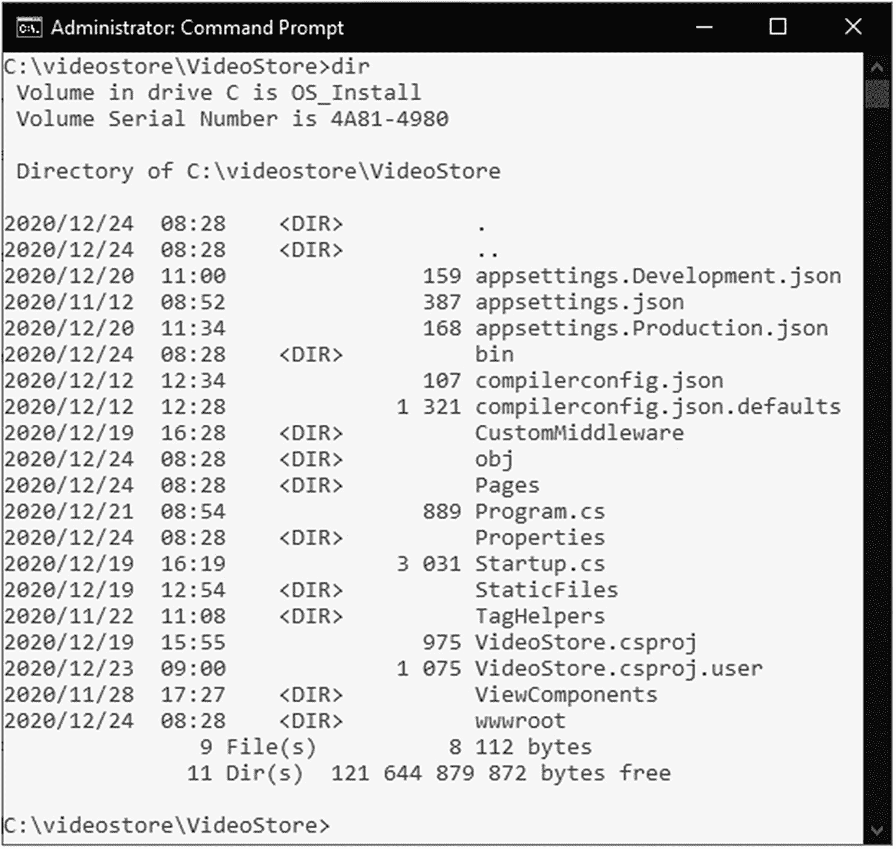
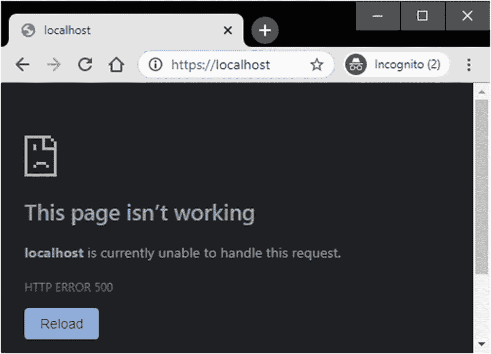

# 八、Web 应用部署

任何 web 应用的最后一步都是将其发布并部署到某种服务器上。根据您(或您的公司)遵循的工作流程，这项工作甚至可能不是您作为开发人员通常会做的事情。基于拉取请求和发布，您可能最终得到一个可以部署的 web 应用版本。但是，这种部署可能是您团队中负责将发布的文件放在 UAT 服务器上的某个人的工作。一旦 UAT 通过，就可以投入生产。

请注意，本章假设您已经安装了 SQL Server Management Studio。如果没有，参考以下文档: [`https://docs.microsoft.com/en-us/sql/ssms/download-sql-server-management-studio-ssms`](https://docs.microsoft.com/en-us/sql/ssms/download-sql-server-management-studio-ssms) 。

您可能是组织中唯一的 web 开发人员，独自负责 web 应用的开发和部署。无论您当前的工作流程是什么，在这一章中，我们都将了解如何将您的 web 应用部署到本地 IIS 服务器上，并连接到本地 SQL Server 实例。

## 让您的站点为部署做好准备

在我们发布 web 应用之前，我想暂时移除在`VideoStore.Data`项目中使用`SQLData`类的`ConfigureServices`方法中的逻辑。我想专注于让发布的文件与 IIS 一起工作，并在知道站点正在运行后担心数据库的配置。

```cs
public void ConfigureServices(IServiceCollection services)
{
    _ = services.AddDbContextPool<VideoDbContext>(dbContextOptns =>
    {
        _ = dbContextOptns.UseSqlServer(
            Configuration.GetConnectionString("VideoConn"));
    });

    //_ = services.AddScoped<IVideoData, SQLData>();
    _ = services.AddSingleton<IVideoData, TestData>(); // TODO: Change to scoped
    _ = services.AddRazorPages().AddSessionStateTempDataProvider();
    _ = services.AddSession();
}

Listing 8-1The Temporarily Modified Configure Services Method

```

如清单 [8-1](#PC1) 所示，当需要`IVideoData`的实例时，我已经注释掉了使用`SQLData`类的代码，并用`TestData`类替换了它。现在让我们开始发布 web 应用。

为了能够部署您的 web 应用，您首先需要发布您的文件。这一步将您的 web 应用和所有需要的文件放在您选择的位置。从那里，您可以将这些文件部署到 web 服务器环境中。这是我们发布到本地文件夹的时候。

如图 [8-1](#Fig1) 所示，作为开发者，当右键单击`VideoStore`项目并从上下文菜单中选择`Publish`时，还有其他选项可供您选择。


图 8-1

发布对话框

我们只是将我们的 web 应用发布到本地文件夹，但是您可以通过选择 Azure、IIS 等来执行发布和部署。点击`Next`，可以指定发布到的路径。如图 [8-2](#Fig2) 所示，我选择了`C:\temp\videostore_publish`。


图 8-2

发布输出位置

设置发布路径后，点击`Finish`按钮。


图 8-3

发布屏幕

你现在看到的是 Visual Studio 中的`Publish`屏幕(图 [8-3](#Fig3) )。您可以在这里修改一些设置，例如重命名刚刚设置的发布配置文件、更改配置、目标运行时以及选择删除发布文件夹中的现有文件。

我们不会那样做的。我们只想发布我们的 web 应用。为此，只需单击`Publish`按钮，Visual Studio 将开始构建所需的文件，并将它们复制到您选择的输出文件夹中。

发布完成后，您将在发布文件夹中看到已编译的文件(dll)以及所有依赖项和配置文件。

您也可以从命令行发布 web 应用。在命令提示符下，导航到您的。csproj 文件是。



图 8-4

csproj 文件的位置

运行`dir`命令将显示当前文件夹的内容(图 [8-4](#Fig4) )。在这里，您将看到我们项目的`Startup.cs`、`Program.cs`和`csproj`文件。现在，运行清单 [8-2](#PC2) 中的命令。

```cs
dotnet publish -o c:\temp\videostore_publish

Listing 8-2The dotnet publish Command

```

您会注意到，我们通过在 publish 命令中使用`-o`来指定输出目录。发布将启动并将编译后的文件复制到指定的输出目录中(图 [8-5](#Fig5) )。


图 8-5

从命令行发布 Web 应用

在命令提示符下，您可以键入`dotnet publish --help`来查看从命令行使用 publish 时可用的选项。用法定义为`dotnet publish [options] <PROJECT | SOLUTION>`。`<PROJECT | SOLUTION>`参数指定操作哪个项目或解决方案文件。在我们的例子中，我们不需要指定目录，因为我们在`csproj`文件所在的目录中。这意味着`dotnet publish`命令将搜索当前目录。

可用于发布命令的选项有

*   `-h`、`--help`–显示命令行帮助。

*   `-o`，`--output <OUTPUT_DIR>`–放置已发布工件的输出目录。

*   `-f`，`--framework <FRAMEWORK>`–要发布的目标框架。必须在项目文件中指定目标框架。

*   `-r`，`--runtime <RUNTIME_IDENTIFIER>`–要发布的目标运行时。这在创建自包含部署时使用。默认情况下是发布依赖于框架的应用。

*   `-c`、`--configuration <CONFIGURATION>`–要发布的配置。大多数项目的默认值是“调试”

*   `--version-suffix <VERSION_SUFFIX>`–设置构建项目时要使用的$(VersionSuffix)属性的值。

*   `--manifest <MANIFEST>`–包含要从发布步骤中排除的软件包列表的目标清单文件的路径。

*   `--no-build`–发布前不要构建项目。暗示`--no-restore`。

*   `--self-contained`–发布。NET 核心运行时，所以运行时不需要安装在目标机器上。如果指定了运行时标识符，默认值为“true”。

*   `--no-self-contained`–将您的应用发布为依赖于框架的应用，无需。NET 核心运行时。a 受支持。必须安装 NET Core runtime 才能运行您的应用。

*   `/nologo`、`--nologo`–不显示启动横幅或版权信息。

*   `--interactive`–允许命令停止并等待用户输入或操作(例如，完成验证)。

*   `--no-restore`–在构建之前不要恢复项目。

*   `-v`、`--verbosity <LEVEL>`–设置 MSBuild 的详细级别。允许的值有 q[uiet]，m[minimal]，n[normal]，d[etailed]和 diag[nostic]。

*   `--no-dependencies`–不恢复项目间引用，仅恢复指定项目。

*   `--force`—强制解析所有依赖关系，即使上次恢复成功。这相当于删除 project.assets.json。

一旦该过程完成，编译后的文件将被复制到用`-o`选项指定的输出目录。关于`dotnet publish`命令的参考资料，请参见微软文档上的这篇文章: [`https://docs.microsoft.com/en-us/dotnet/core/tools/dotnet-publish`](https://docs.microsoft.com/en-us/dotnet/core/tools/dotnet-publish) 。

## 将 Web 应用部署到 IIS

若要开始部署过程，请打开 Internet 信息服务(IIS)管理器。

也可以点击开始，在搜索框中输入`inetmgr`，回车。

打开管理器，单击服务器。如图 [8-6](#Fig6) 所示，矿名为`MSI (MSI\Dirk Strauss)`。确保您选择了屏幕底部的`Features View`。


图 8-6

IIS 管理器

搜索包含在 IIS 分组下的`Modules`部分。可以看到图 [8-6](#Fig6) 中的`Modules`部分，第二排，左起第二个。单击`Modules`部分显示已安装模块的列表。

将模块添加到服务器中，以便您可以为应用提供一些额外的所需功能。可以从模块部分添加、编辑、配置或删除模块。

我们正在寻找的特定模块是`AspNetCoreModuleV2`,它是。NET Core 托管包(图 [8-7](#Fig7) )。它允许 ASP.NET Core 应用与 IIS 一起运行，如果您没有在 IIS 的`Modules`部分看到它，您需要在将您的应用部署到 IIS 之前安装它。


图 8-7

已安装 AspNetCoreModuleV2

来查找。NET Core 托管捆绑包，找到`The .NET Core Hosting Bundle`的微软文档页面，在页面上找到直接下载链接。在写这本书的时候，下载链接如下: [`https://dotnet.microsoft.com/download/dotnet-core/thank-you/runtime-aspnetcore-5.0.1-windows-hosting-bundle-installer`](https://dotnet.microsoft.com/download/dotnet-core/thank-you/runtime-aspnetcore-5.0.1-windows-hosting-bundle-installer) 。

请注意，安装托管包后，可能需要重新启动 IIS。

一旦。安装好 NET Core 托管包，右键`Sites`文件夹，点击`Add Website`，如图 [8-8](#Fig8) 。


图 8-8

添加网站

您可能会看到这里列出的默认网站，但我们正在向服务器添加一个名为`VideoStore`的新网站。


图 8-9

“添加网站”窗口

从`Add Website`窗口(图 [8-9](#Fig9) ，你需要给你的网站起一个网站名。我刚刚称这个站点为`VideoStore`。物理路径就是我们将 web 应用发布到的文件夹的位置。一般来说，我不喜欢这样做，更喜欢将发布的文件放在一个特定的文件夹中，而不是放在`temp`文件夹中。因为我只在我的本地 IIS 上，所以我在这里有点偷偷摸摸，让它指向 publishing 文件夹。

将发布的文件放在服务器上的特定文件夹中的好处是，您可以根据组织的需要，使用相关的权限和约束来锁定文件夹。

我们在此窗口中更改的另一个设置是绑定类型。默认情况下，它是 HTTP，但我们想要 HTTPS。更改绑定类型，保留默认端口`443`。在我们的本地 IIS 上，因为这是一台开发机器，我将选择`SSL certificate`下拉框中的`IIS Express Development Certificate`。当您部署到一个活动服务器时，您会希望为您的网站安装一个合适的 SSL 证书，而不会像我们在这里所做的那样选择一个开发证书。

最后，我们想选择立即启动网站的选项，然后单击`OK`按钮。


图 8-10

添加的视频商店网站

`VideoStore` web 应用现在已经在 IIS 中创建好了(图 [8-10](#Fig10) )。打开你的浏览器，输入网站的网址`https://localhost`。


图 8-11

部署的视频商店网站

如图 [8-11](#Fig11) 所示，已部署的`VideoStore`站点现在可用，并使用 HTTPS 在本地主机上运行。您还会注意到单词`Production`显示在站点的页脚，因为 web 应用现在已经部署好了。

### 配置 SQL Server 数据库

要设置我们的 web 应用以连接到 SQL Server 数据库，我们可以使用许多方法中的一种。本章不打算作为配置站点以连接到 SQL Server 的方法的详尽列表。您使用的方法将取决于您的具体情况。然而，在本书中，我们将简单地创建数据库并配置应用来连接它。

首先将`ConfigureServices`方法改回使用`SQLData`类，如清单 [8-3](#PC3) 所示。

```cs
public void ConfigureServices(IServiceCollection services)
{
    _ = services.AddDbContextPool<VideoDbContext>(dbContextOptns =>
    {
        _ = dbContextOptns.UseSqlServer(
            Configuration.GetConnectionString("VideoConn"));
    });

    _ = services.AddScoped<IVideoData, SQLData>();
    //_ = services.AddSingleton<IVideoData, TestData>(); // TODO: Change to scoped
    _ = services.AddRazorPages().AddSessionStateTempDataProvider();
    _ = services.AddSession();
}

Listing 8-3Adding in the SQLData Class Back

```

如果您不得不在 IIS 中停止`VideoStore` web 应用，发布站点，并在 IIS 中启动`VideoStore` web 应用，当您前往`https://localhost`时，该站点将无法工作(图 [8-12](#Fig12) )。

原因是我们告诉应用使用 SQL 数据库，而在`appsettings.Production.json`文件中，我们没有为连接字符串列出任何内容。



图 8-12

本地主机上的错误 500

让我们开始一次解决一个问题。我们首先需要的是一个数据库。我们可以通过运行清单 [8-4](#PC4) 中的`dotnet ef migrations script`命令来生成这个数据库创建脚本。确保您在命令提示符下的`VideoStore.Data`项目中。

```cs
dotnet ef migrations script -s ..\VideoStore\VideoStore.csproj -o c:\temp\scripts\VideoStoreCreateScript.sql

Listing 8-4Run the ef migrations script Command

```

正如我们在本书前面看到的，该命令通过使用`-s`选项告诉`dotnet`文件位于哪里来指定启动项目。

我们还通过在`-o`选项后提供一个路径来指定创建脚本的输出目录。

运行该命令后，您将看到如图 [8-13](#Fig13) 所示的输出。导航到您指定的输出文件夹，您将看到创建的`VideoStoreCreateScript.sql`文件。


图 8-13

ef 迁移脚本命令运行

接下来，打开 SQL Server Management Studio，创建一个名为`VideoStoreLive`的新数据库。对新创建的数据库运行`VideoStoreCreateScript.sql`文件来创建表。


图 8-14

创建的 SQL 数据库

刷新数据库并展开表文件夹，您将看到创建的表(图 [8-14](#Fig14) )。


图 8-15

创建新的登录

我们现在需要为`VideoStoreLive`数据库创建一个新的登录。在`Security`下，右键单击`Logins`文件夹，从快捷菜单中选择`New Login`(图 [8-15](#Fig15) )。

将显示`Login - New`对话框，如图 [8-16](#Fig16) 所示。对于登录名，给它一个名称`videostore`，并(使用 SQL Server 认证)给它一个密码`videopassword`。

请不要使用如此糟糕的密码。我只是使用这个简单的密码，因为我们只是在这里说明概念。实际上，在生产环境中您永远不会这样做。

完成这些设置后，点击`OK`按钮创建登录。


图 8-16

创建登录名和密码

您将在列表中看到新创建的登录。右键单击创建的`videostore`登录，并从上下文菜单中选择`Properties`。


图 8-17

修改登录用户映射

修改`videostore`登录的`User Mapping`(图 [8-17](#Fig17) )，选择`VideoStoreLive`数据库为映射，角色成员为`db_datareader`和`db_datawriter`。接下来我们要做的是分别修改清单 [8-5](#PC5) 、 [8-6](#PC6) 和 [8-7](#PC7) 中所示的`appsettings.Production.json`、`appsettings.Development.json`和`appsettings.json`文件。

我们正在将开发中使用的指向 localdb 的连接字符串移动到`appsettings.Development.json`文件中，并在`appsettings.Production.json`文件中创建一个到`VideoStoreLive`数据库的活动连接字符串。

```cs
{
  "Logging": {
    "LogLevel": {
      "Default": "Information",
      "Microsoft": "Warning",
      "Microsoft.Hosting.Lifetime": "Information"
    }
  },
  "AllowedHosts": "*",
  "VideoListPageTitle": "Video Store - Videos List"
}

Listing 8-7The appsettings.json File

```

```cs
{
  "Logging": {
    "LogLevel": {
      "Default": "Information",
      "Microsoft": "Warning",
      "Microsoft.Hosting.Lifetime": "Information"
    }
  },
  "ConnectionStrings": {
    "VideoConn": "Data Source=(localdb)\\MSSQLLocalDB;Initial Catalog=VideoStore;Integrated Security=True;"
  }
}

Listing 8-6The Development appsettings File

```

```cs
{
  "Logging": {
    "LogLevel": {
      "Default": "Information",
      "Microsoft": "Warning",
      "Microsoft.Hosting.Lifetime": "Information"
    }
  },
  "ConnectionStrings": {
    "VideoConn": "Data Source=MSI\\MSIDEV;Initial Catalog=VideoStoreLive;Integrated Security=False;User Id=videostore;Password=videopassword"
  }
}

Listing 8-5The Production appsettings File

```

如果您想知道如何在`appsettings`文件中存储凭证，您在这里的犹豫是正确的。我将在本章末尾讨论这一点。

您会注意到,`appsettings.json`文件不再包含连接字符串。根据我们是在开发还是在生产中运行，我们的应用将使用正确的`appsettings`文件。

现在我们可以再次发布网站了。点击`Manage Website`面板中的`Stop`按钮，停止 IIS 中的`VideoStore` web 应用。通过运行清单 [8-2](#PC2) 中的`dotnet publish`命令再次发布站点。在已发布文件的输出文件夹中，检查生产 appsettings 文件是否存在。如果是(应该是)，在 IIS 中启动`VideoStore` web 应用。


图 8-18

针对 VideoStoreLive 数据库运行的 VideoStore 站点

现在，在浏览器中再次运行 web 应用。您应该看到图 [8-18](#Fig18) 。如果你看一下`Video of the day`，你会看到一个空的通知。


图 8-19

还没有视频

这是因为我们现在运行的是 SQL Server 数据库，而该数据库不包含任何视频。当我们导航到视频列表时，我们将看不到列出的视频(图 [8-19](#Fig19) )。

让我们通过点击视频搜索旁边的`+`按钮来创建我们的第一个视频。


图 8-20

添加新视频

我们现在可以向我们的视频商店添加一个新视频，如图 [8-20](#Fig20) 所示。


图 8-21

添加了新视频

添加新视频后，我们将进入视频详情页面，如图 [8-21](#Fig21) 所示。


图 8-22

在 MS SQL Server 中查看新添加的视频

切换到 SQL Server Management Studio，并对`VideoStoreLive`数据库运行`SELECT * FROM Videos`。你会在 SQL 数据库中看到新添加的视频(图 [8-22](#Fig22) )。

这就是将 web 应用部署到运行 IIS 的服务器所需的全部内容。这非常简单，而且还有其他方法可以让您使用. net 迁移来创建数据库。本章介绍的方法只是部署 web 应用的一种方式。

最后，关于管理用户秘密和连接字符串的简短说明。

### 关于连接字符串和秘密的说明

在本章的前面，在代码清单 [8-5](#PC5) 、 [8-6](#PC6) 和 [8-7](#PC7) 中，我们使用开发和生产`appsettings`来存储不同的连接字符串。这种方法的问题是，这些文件总是会出现在您的源代码库中。这不是一件好事。

我将动态数据库连接字符串添加到`appsettings.Production.json`文件的原因是为了说明这样一个事实，即应用根据它所处的环境使用不同的设置。实际上，您根本不需要在配置文件中添加包含用户凭据的连接字符串。

因为我们在`appsettings.Development.json`文件中为 localdb 连接使用集成安全性，所以以这种方式存储连接并不重要。但是，现在我们正在使用一个活动的 SQL Server 数据库。像这样存储凭据是不可接受的。

如果您在到 localdb 的连接字符串中有用户凭证，那么使用用户秘密将是有益的。用户机密只在开发环境中有用，而不是用于生产。对于生产连接字符串，应该保持文件没有任何用户凭据。可以在服务器本身的 appsettings 文件中配置连接。有多种方法可以保证用户凭证的安全。其中之一就是使用 Azure Key Vault。Azure Key Vault 是一个云服务，用于安全可靠地存储任何类型的秘密，无论是 API 密钥、密码、证书还是用于加密的任何类型的密钥。要了解更多关于 Azure Key Vault 的信息，请查看以下链接: [`https://docs.microsoft.com/en-us/azure/key-vault/general/basic-concepts`](https://docs.microsoft.com/en-us/azure/key-vault/general/basic-concepts) 。

有关在开发过程中安全存储应用机密的更多信息，请参考以下关于用户机密的 Microsoft 文档: [`https://docs.microsoft.com/en-us/aspnet/core/security/app-secrets`](https://docs.microsoft.com/en-us/aspnet/core/security/app-secrets) 。