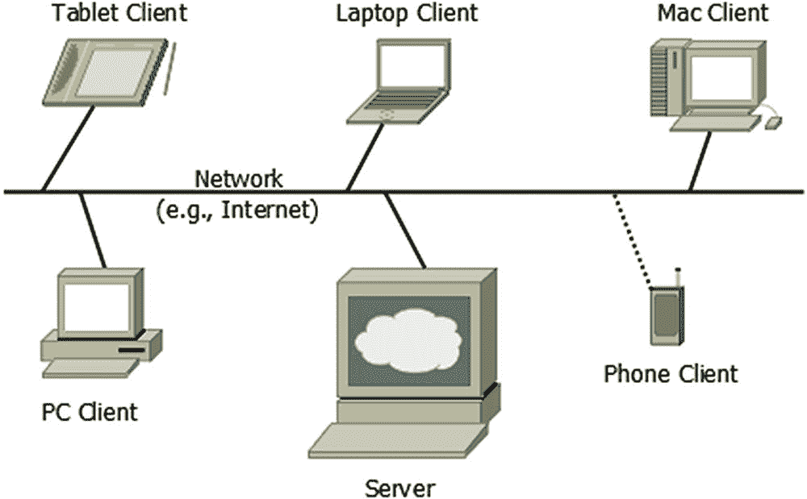
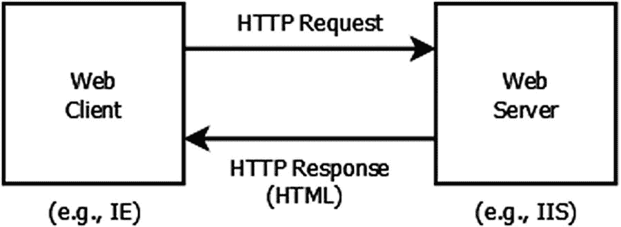
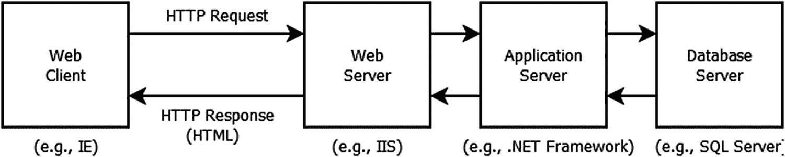
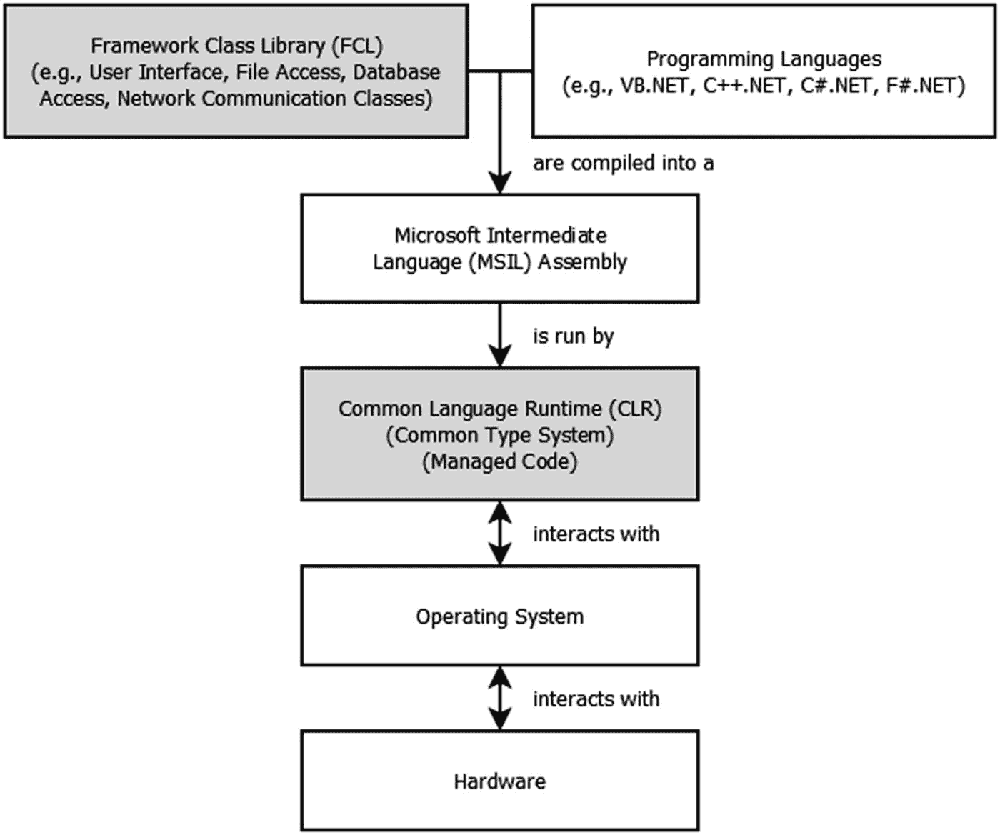
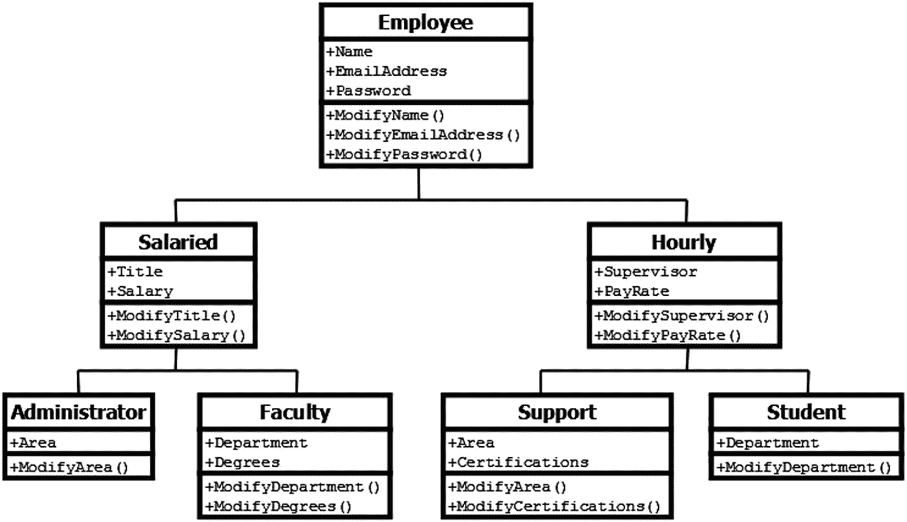
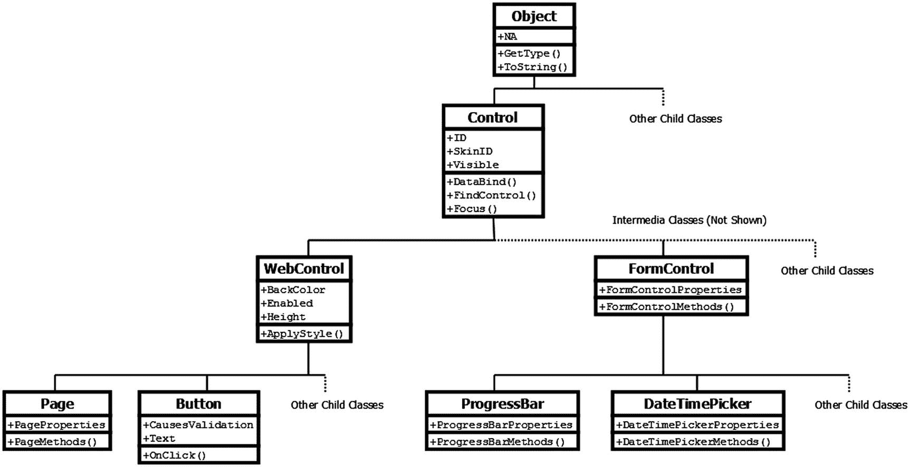
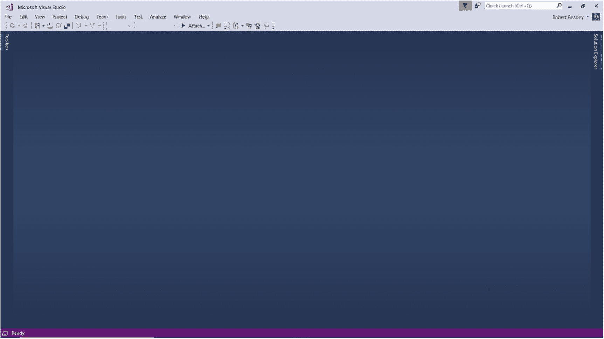
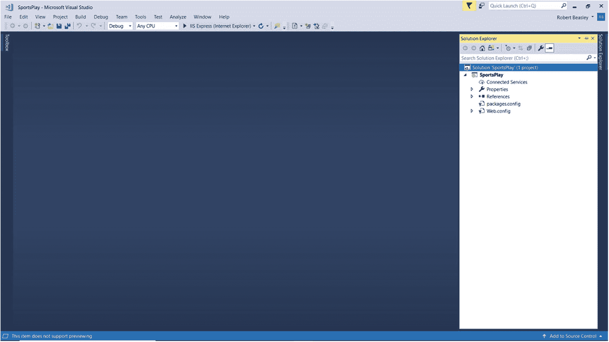

# 一、Web 应用开发

## 1.1 导言

超媒体(即超文本和媒体的结合)的概念是由美国工程师、发明家和科学管理者 Vannevar Bush 于 1945 年首次提出的。然而，直到很久以后，支持这样一个概念所需的技术才足够成熟，使超媒体成为今天我们大多数人认为理所当然的东西。

1969 年，*高级研究计划局网络* (ARPANET)成为第一个使用*传输控制协议/互联网协议* (TCP/IP)套件实现*分组交换*的计算机网络，该协议套件构成了今天互联网的技术基础。分组交换是一种数据传输方法，需要三个基本步骤才能将数据(例如，远程计算机屏幕、文件、电子邮件、网页)从网络上的一台计算机传输到另一台计算机。首先，在起点，要传输的数据被分成一系列相对较小的部分，称为*数据包*。第二，通过已经被确定为对于每个分组是最优的路由，分组被独立地从它们的起点传输到它们的最终目的地。第三，当所有数据包都到达最终目的地后，数据将从其数据包中重组出来。早期的 TCP/IP *应用层*协议包括用于登录远程计算机的 *Telnet* ，用于将文件从一台计算机传输到另一台计算机的*文件传输协议* (FTP)，以及用于发送电子邮件消息的*简单邮件传输协议* (SMTP)。这些协议今天仍在大量使用。

虽然从 20 世纪 60 年代末到 80 年代末，互联网还活着，还在成长，但没有万维网。然而，这种情况即将改变。1989 年，英国科学家蒂姆·伯纳斯·李在瑞士梅林的欧洲核研究组织(又称 CERN)发起了超文本传输协议(HTTP)的开发。这个协议成为管理分布式超媒体系统之间通信的标准。随着 1991 年第一个正式版本 HTTP 的定义，互联网的超媒体部分 Web 诞生了，HTTP 像它的前辈 Telnet、FTP 和 SMTP 一样成为另一个 TCP/IP 应用层协议。此后不久，伯纳斯-李创造了第一个网络浏览器。这个浏览器在 1991 年 1 月对其他研究人员开放，并于 1991 年 8 月向公众发布。

早期，网络只是一大堆静态网页的集合。这些页面除了显示格式化的文本和可视媒体(即图像、图形、动画、视频)并允许我们下载文件和播放音频记录之外，没有什么别的功能。然而，今天的网络是静态和动态网页的大规模集合。多亏了像 ASP.NET 这样的编程语言，动态网页能做的比静态网页多得多。除了静态网页允许我们做的事情之外，动态网页还允许我们与网页上显示的项目进行*交互*。它们还允许我们做一些事情，比如编辑页面上的数据，检查数据错误，以及将数据保存到数据库中。

在本章中，我们将从客户机-服务器模型开始，这是一种在服务器和客户机之间分配处理的计算方法。接下来，我们将介绍。NET 框架。那个。NET Framework 是微软基于 Windows 的软件开发和执行框架。然后，我们将讨论 ASP.NET 和 C# 编程。ASP.NET 是一个软件开发框架，它包含了构建现代复杂 Web 应用所需的所有类，而 C# 是一种通用编程语言，用于构建各种应用类型，包括 Web 应用和 Windows 应用。之后我们再来看 Visual Studio，它是微软的旗舰集成开发环境(IDE)。这个开发环境允许我们通过一致的用户界面用几种不同的编程语言进行编码和测试。最后，我们将学习如何开始一个新的 ASP.NET Web 应用项目。

## 1.2 客户端-服务器模型

客户机-服务器模型是一种计算方法，它在一个*服务器*(即资源、服务或应用的提供者)和它的*客户机*(即资源、服务或应用的用户)之间分配处理。服务器由一个*服务器主机*和一个*服务器应用*组成，前者是连接到网络的物理计算设备，后者是管理多个客户端同时访问服务器的软件程序。同样，客户端由一个*客户端主机*和一个*客户端应用*组成，前者是连接到网络的物理计算设备，后者是启动与服务器的*会话*的软件程序，以便它可以访问服务器的资源、服务和/或应用。客户端-服务器系统的例子包括 Web 服务器和 Web 客户端、电子邮件服务器和电子邮件客户端以及 FTP 服务器和 FTP 客户端。Web 服务器应用的示例包括*互联网信息服务*(IIS)*Apache HTTP 服务器*和 *Oracle iPlanet Web 服务器*。网络客户端应用的例子包括*微软互联网浏览器*、*谷歌浏览器*和 *Mozilla Firefox* 。Web 客户端应用通常被称为 *Web 浏览器*。

图 [1-1](#Fig1) 显示了一个应用于 Web 应用的客户机-服务器模型的例子。在图的中间，我们看到一个 Web 服务器。如前所述，该服务器由服务器主机和管理客户端对主机的访问的服务器应用组成。许多不同的客户端通过网络(例如，互联网)连接到该服务器，包括平板客户端、膝上型客户端、Mac 客户端、PC 客户端和电话客户端。图中的虚线表示电话客户端无线连接到互联网。当然，任何服务器或客户端都可以无线连接到互联网。同样，这些客户端中的每一个都由客户端主机和客户端应用组成，客户端应用发起与服务器的会话，然后访问服务器的资源、服务和/或应用。



图 1-1

应用于 Web 应用的客户端-服务器模型示例

回想一下，网页既可以是静态的，也可以是动态的。静态网页的内容和外观不会在每次被请求时改变。相反，无论请求多少次或谁请求，它看起来总是一样的。很容易判断一个网页是否是静态的，因为它的文件扩展名是。正如我们将在下图中看到的，这种类型的网页只需要 Web 服务器的关注。

图 [1-2](#Fig2) 显示了一个*静态*网页的处理周期。可以看出，Web 客户端(例如，运行 Internet Explorer 的膝上型计算机)经由 *HTTP 请求*向 Web 服务器(例如，运行 IIS 的塔式计算机)请求网页。该请求的一个重要部分是所请求的网页的名称(例如，Display_Products.html)。请求的另外两个重要部分是服务器和客户端的 *IP 地址*(即唯一的互联网地址)。这些是必要的，以便 HTTP 请求能够到达 Web 服务器，并且被请求的 Web 页面能够返回到发出请求的 Web 客户端。当 Web 服务器收到 HTTP 请求时，它在硬盘上找到所需的网页文件，将文件的*超文本标记语言* (HTML)代码附加到 *HTTP 响应*，然后将响应发送到发出请求的 Web 客户端。当 Web 客户端收到 HTTP 响应时，它使用附加的 HTML 代码来格式化并为最终用户显示所请求的网页。如果服务器上不存在所请求的网页，则臭名昭著的 404(即，未找到页面)错误被传回 Web 客户端，在那里向最终用户显示该错误。



图 1-2

静态网页的处理周期

与静态网页的内容和外观不同，动态网页可以(并且通常会)在每次被请求时发生变化。事实上，根据请求的时间和人员，它通常包含不同的信息(例如，不同的客户信息)，并且看起来可能完全不同(例如，不同的字段、不同的图像)。很容易判断网页是否是动态的，因为它具有与动态网页相关联的文件扩展名。这种文件扩展名的示例有。动态服务器页面。php(超文本预处理器)，以及。jsp (java 服务器页面)。正如我们将在下图中看到的，这种类型的网页由 Web 服务器和*应用服务器*共同处理。当 Web 应用需要数据库功能时，还需要一个*数据库服务器*。

图 [1-3](#Fig3) 显示了一个*动态*网页的处理周期。和以前一样，Web 客户端通过 HTTP 请求向 Web 服务器请求网页。然而，在这种情况下，该请求包含动态网页的名称(例如，Display_Products.aspx)和任何网页控件的状态(例如，输入到文本框中的名称、置于复选框中的复选标记、从日历中选择的日期)。当 Web 服务器收到 HTTP 请求并看到网页的文件扩展名为。aspx，它将处理控制传递给应用服务器，在那里执行网页的*业务逻辑*(例如，ASP.NET 和 C# 代码)。如果网页的业务逻辑需要数据库服务器的服务(即，读取、插入、更新或删除数据)，则应用服务器将处理控制传递给数据库服务器(以及任何相关的输入参数)，在数据库服务器中执行网页的数据库调用(通常是结构化查询语言[SQL]调用)。一旦数据库调用被执行，来自数据库服务器的响应(例如，检索的数据和/或调用的状态)被传递回应用服务器，在那里它被处理(例如，检索的数据被格式化和/或调用的状态被处理)。此后，应用服务器将其工作传递回 Web 服务器，在 Web 服务器上，应用服务器在其硬盘上找到所需的网页文件，根据应用服务器的工作结果格式化网页的 HTML，将生成的 HTML 代码附加到 HTTP 响应中，然后将响应发送给发出请求的 Web 客户机。当 Web 客户端收到 HTTP 响应时，它使用附加的 HTML 代码来格式化并为最终用户显示所请求的网页。同样，如果服务器上不存在所请求的网页，则臭名昭著的 404(即，未找到页面)错误被传回 Web 客户端，在那里向最终用户显示该错误。



图 1-3

动态网页的处理周期

请记住，尽管服务器和客户端通常运行在不同的计算设备上，但它们也可以运行在同一台设备上。作为后者的一个例子，我们经常使用 Web 服务器(例如，IIS Express)、应用服务器(例如，NET Framework)、数据库服务器(如 SQL Server)和 Web 客户端(如 Internet Explorer)，当开发 ASP.NET Web 应用时，它们都安装在同一台*机器上。*

## 1.3 .NET 框架

那个。NET Framework 是微软基于 Windows 的软件开发和执行框架。这个框架包括两个主要部分——*框架类库* (FCL)和*公共语言运行时* (CLR)。

框架类库是一个由*类*组成的大型库。这些类执行许多开发现代、最先进的软件应用(如 Windows 应用和 Web 应用)所需的功能。与关联的任何编程语言都可以使用 FCL 中的类。NET 框架(例如，Visual Basic、Visual C++、Visual C#、Visual F#)并且包括用户界面类、文件访问类、数据库访问类和网络通信类。通过将我们自己的定制编程代码与 FCL 中的类相结合，我们可以相对高效地开发复杂的软件应用。

公共语言运行库是一种环境，在这种环境中所有。NET 应用执行。这些应用不像某些软件应用那样直接与操作系统交互。相反，不管使用何种编程语言来开发它们。NET 应用被编译成一个*微软中间语言* (MSIL) *汇编*，然后由 CLR 执行。因此，是 CLR 与操作系统交互，然后操作系统通过设备驱动程序与计算机的硬件交互。CLR 的一个重要方面是*通用类型系统*。通用类型系统定义了如何在的所有编程语言中声明、使用和管理所有值类型、引用类型和其他类型。NET 框架。由于 CLR 提供了自己的安全性、内存管理和异常处理，因此在 CLR 中运行的代码被称为*托管代码*。图 [1-4](#Fig4) 总结了的组织结构。NET 框架。



图 1-4

会议的组织。NET 框架

## 1.4 面向对象的概念

面向对象是一种软件开发范式，其中几乎所有的东西都是按照*类*(例如，客户、网页、网页上的按钮)和*对象*(例如，特定的客户、特定的网页、网页上的特定按钮)来看待的。一个类可以包含*属性*(即该类的数据)和*方法*(即该类的功能)，并且可以处理*事件*(即最终用户动作或其他及时发生的事情)。一个类的属性、方法和事件被称为它的*成员*。一个类*封装了*它的属性、方法和事件，将它们捆绑到一个单元中，并对其他类隐藏这些内部细节。最后，一个类可以继承其他类的属性、方法和事件。接下来我们将学习更多关于这些概念的知识。

### 类别和对象

类就像“模板”，代表我们在现实世界中遇到的事物的特征和行为。在我们的职业生活中，我们可能会遇到像客户、员工、产品和订单这样的事情。在网页上，我们通常会与按钮、复选框、日历和文本框等东西进行交互。当开发涉及这些东西的软件应用时，我们通常设计和/或利用对它们的属性和动作建模的类。

在。NET 框架中，有两种类型的类——*非静态类*和*静态类*。一般来说，一个非静态类包含我们可以利用的非静态属性、非静态方法和非静态事件，但是只有在之后*一个对象从该类中被实例化。 <sup>[1](#Fn1)</sup> 另一方面，静态类包含静态属性、静态方法和静态事件，我们可以直接利用*，而不必从类中实例化一个对象。**

 *在本书中描述一个类时，我们会包含一个*类图*。表 [1-1](#Tab1) 显示了类图的一般格式。这样的图将总是包含类名和它所在的*名称空间*。名称空间包含提供特定功能(例如，页面功能、电子邮件功能、数据库访问功能)或专门的*类型*(例如，接口类型、数组类型、值类型、引用类型、枚举类型)的*类*。一个类图还会列出一些*选中的*类的属性、方法和事件。这些项目的描述将直接取自微软的官方文档，因此它们可以被认为是权威的。最后，类图将提供对微软官方文档的引用。要查看类的所有属性、方法和事件，以及查看如何使用该类的代码示例，感兴趣的读者可以参考该文档。

表 1-1

类图的一般格式

<colgroup><col class="tcol1 align-left"> <col class="tcol2 align-left"></colgroup> 
| **类** |
| **命名空间** |
| **属性** |
| **方法** |
| **事件** |
| **参考** |

关于本书中使用的类图，还有一件非常重要的事情需要记住。为了节省空间，用于处理类事件的*事件处理方法*将被省略。事件处理程序方法是那些以单词“On”开始并以事件名称结束的方法。例如，OnInit 是由 Init 事件引发的事件处理程序方法。如果 Init 事件已经显示在类图的 Events 部分，那么 OnInit 事件处理程序方法将从类图的 Methods 部分省略以节省空间。

一个对象是一个类的单个实例。例如，假设我们有一个 Employee 类作为所有雇员的“模板”。在这种情况下，我们可能有一个代表 Jim J. Jones 的 Employee 对象，他的电子邮件地址是 jjones@mail.com，密码是 abc123。我们还可能有一个 Employee 对象，它代表 Mary M. Morris，她的电子邮件地址是 mmorris@work.com，密码是 xyz789。这两个不同的对象，都被看作是独立的项目，通过*构造*每个对象，然后*设置*它们各自的名称、电子邮件地址和密码属性，由*从 Employee 类实例化*。从一个类实例化多个对象的能力就是为什么，例如，我们可以在一个网页上有几个文本框和按钮对象，它们中的每一个都可以有相似但不同的外观和行为。

### 1.4.2 属性

属性表示类的数据。属性是从读取的*(通过 get 方法)和写入*(通过 set 方法)的*。例如，在。NET TextBox 类有一个文本属性。如果我们希望检索输入到文本框对象中的值，我们需要*获取*这个属性。另一个例子是。NET Button 类有一个 BackgroundColor 属性、一个 ForegroundColor 属性和一个 Text 属性。如果我们希望显示一个带有红色字体的灰色按钮“提交”，我们需要*适当地设置*这三个属性。属性可以是非静态的，也可以是静态的。*

### 方法

方法执行一个功能(即返回值的任务)或一个过程(即*不*返回值的任务)，并被*调用*或*调用*。有两种类型的方法—非静态方法和静态方法。

非静态方法是一种可以被调用的方法，但是只有在从相关的*非静态*类实例化了对象之后的*才能被调用。例如，如果我们有一个从非静态 Employee 类创建的 Employee 对象，并且这个类包含一个非静态的 ModifyPassword 方法，那么我们可以调用 Employee 对象的 ModifyPassword 方法来更新雇员的密码，就像这样*

```cs
booSuccess = Employee.ModifyPassword("abc123");

```

其中 Employee 是非静态 Employee 类的对象，ModifyPassword 是 Employee 对象的非静态方法。

另一方面，静态方法是一种可以被立即调用的方法，而不需要从类中实例化一个对象。例如，如果我们有一个包含静态 Sqrt 方法的静态 Math 类，并且我们想要得到 100 的平方根，那么我们可以直接调用 Math 类的 Sqrt 方法*(即*而不需要*从 Math 类实例化一个 Math 对象)来得到 100 的平方根，就像这样*

```cs
bytResult = Math.Sqrt(100);

```

其中 Math 是一个静态类，Sqrt 是 Math 类的静态方法。

### 事件

事件是发生的事情。事件由最终用户动作或其他及时发生的事件引发。当一个事件被引发时，我们希望*处理*该事件，我们调用一个相应的方法。例如，在。NET Page 类在每次加载网页时引发一个 Load 事件。如果我们希望在每次页面加载时为最终用户显示一些内容，我们需要通过向相应的 OnLoad 方法添加必要的代码来处理该事件。请记住，我们不需要处理引发的每个事件。事件可以是非静态的也可以是静态的。

### 封装

封装在面向对象的上下文中有两种含义。首先，它指的是一个类的属性(即数据)和方法(即对数据的处理)被捆绑在一起，作为一个单元对待。其次，它指的是类的属性和方法不能被类本身之外的代码直接访问的概念。因此，为了获取或设置一个类的属性或执行一个类的方法，需要这样操作的类必须从包含所需属性或方法的类中*请求*它们。这种想法被称为*信息隐藏*。尽管信息隐藏的概念是面向对象的一个重要指导原则，但是。NET 编程语言允许我们通过将属性和方法声明为私有的(即，它们只能由同一类中的代码访问)、受保护的(即，它们可以由同一类中的代码和任何相关的子类访问)或公共的(即，它们可以由任何其他类中的代码访问)，来显式地放松或实施这样的访问限制。

封装的好处之一是，它将一个类的内部与其他类屏蔽开，这样它们就可以利用该类的功能，而不必关心该类实际上是如何执行其职责的。关于这个类，其他类唯一需要知道的是它需要什么输入和产生什么输出——也就是说，知道这个类的*接口*。此外，封装有助于代码重构(例如，使方法更有效或更易于维护)。这是因为我们可以修改一个类的方法，而不会中断其他类对该类的使用——只要修改不会影响该类的接口。封装的另一个好处是，它鼓励我们考虑一个类的所有属性和方法，并把它们放在一个地方。这使得编码、测试和维护更加容易。

### 继承

继承允许一个*子类*(又名，子类，派生类)继承和利用它的*父类*(又名，超类)的属性、方法和事件，以及它的父类的属性、方法和事件等等。子类继承其父类的所有属性、方法和事件(除了它的*构造函数方法*和*析构函数方法*，但是它也包含它自己的属性、方法和/或事件。因此，子类总是扩展其父类的属性和功能。不从另一个类继承其任何属性、方法或事件的父类被称为*基类*。在类继承层次中，父类和它的子类之间存在的关系是一种 *is-a-type-of* 关系。

显而易见，类继承的主要好处是*代码冗余*最小化，而*代码重用*最大化。这是因为子类可以使用其父类的所有属性、方法和事件，就像它们是自己的一样——我们不需要重新编写代码。请记住，继承的属性、方法和事件可以在必要时被子类*覆盖*。

图 [1-5](#Fig5) 显示了一个雇员的类继承层次的例子。在图中，我们可以看到层次结构中的基类是 Employee 类。该类包含该类最基本的属性和方法。<sup>[2](#Fn2)</sup>Employee 类的子类(即受薪类和小时工类)不仅继承了*Employee 类的所有*属性和方法，而且每个都包含了扩展 Employee 类的特性和功能的附加属性和方法。再往下看，我们可以看到受薪类的子类(即管理员类和教员类)不仅继承了受薪类和雇员类的所有属性和方法，而且还包含了扩展这些类的特性和功能的附加属性和方法。因此，我们可以看到，例如，教员是一种受薪雇员，他是一种雇员，在一个部门工作，他有一个学位列表，有一个头衔，有一份薪水，有一个名字，有一个电子邮件地址，有一个密码。教员类还继承了它上面的类的所有方法，所以除了 ModifyDepartment 方法之外，教员类还有 ModifyTitle 方法、ModifyName 方法等等。



图 1-5

雇员的类继承层次结构示例

现在让我们把注意力转向一个例子，看看类继承在。NET 框架，特别是在框架类库中。对…的深刻理解。NET Framework 类继承很重要，因为它将帮助我们在开发 ASP.NET Web 应用时充分利用可用的类。

图 [1-6](#Fig6) 展示了一个框架类库的(部分)类继承层次的例子。 <sup>[3](#Fn3)</sup> 在图中，我们可以看到 FCL 的基类是 Object 类。这个类没有属性或事件，包含了类继承层次结构中最基本的方法。这些方法为 FCL 中的所有其他类提供低级服务。例如，Object 类的 ToString 方法可用于将任何*对象(从 FCL 中的一个类实例化)转换为其等效的字符串表示。对象类的子类(即控制类和一些其他类)不仅继承了对象类的所有方法，而且它们每个都包括扩展对象类的特征和功能的附加属性和方法。进一步观察层次结构，我们可以看到控件类的子类(即 WebControl 类、FormControl 类和一些其他类)不仅继承了控件类和对象类的所有属性和方法，而且还包括扩展这些类的特性和功能的附加属性和方法。再往下看，我们可以看到 WebControl 类的子类(即 Page 类、Button 类和其他一些类)不仅继承了 WebControl 类、Control 类和 Object 类的所有属性和方法，而且还包含了扩展这些类的特性和功能的其他属性和方法。因此，我们可以看到，例如，按钮是一种 Web 控件，是一种控件，是一种对象，可以进行验证，可以包含文本，有背景色，可以启用或禁用，有高度，有 ID，有皮肤 ID，可以可见或不可见，可以转换为字符串。Button 类还继承了它上面的类的所有方法，所以除了 OnClick 方法之外，Button 类还有 ApplyStyle 方法、DataBind 方法、GetType 方法等等。*



图 1-6

框架类库的(部分)类继承层次结构示例

我们现在将更详细地研究 Object、Control 和 WebControl 类。尽管目前我们对这些内容知之甚少，但至少熟悉它们是很重要的，因为我们将在本书后面提到它们。

#### 1.4.6.1 对象类

如前所述，Object 类是。NET 框架类库。因此，它被称为是的*根*。NET 类继承层次结构，FCL 中的所有其他类都是从它派生的。Object 类提供了可由 Control 类、WebControl 类和所有 ASP.NET 服务器控件类(例如，页面类、按钮类、文本框类)的*使用的方法。表 [1-2](#Tab2) 显示了 Object 类的一些方法。可以看到，这个类没有属性或事件，只有对它的两个方法的描述。*

表 1-2

Object 类的一些方法

<colgroup><col class="tcol1 align-left"> <col class="tcol2 align-left"></colgroup> 
| **类**对象<sup>T3】4T5】</sup> |
| **命名空间**系统 |
| **属性** |
| 钠 |   |
| **方法** |
| GetType() | 获取当前实例的类型。 |
| ToString() | 返回一个表示当前对象的字符串。 |
| **事件** |
| 钠 |   |
| **参考** |
| [T2`https://msdn.microsoft.com/en-us/library/system.object(v=vs.110).aspx`](https://msdn.microsoft.com/en-us/library/system.object%2528v%253Dvs.110%2529.aspx) |

#### 1.4.6.2 控制级

Control 类提供了可由 WebControl 类和所有 ASP.NET 服务器控件类(例如，Page 类、Button 类、TextBox 类)使用的属性、方法和事件。表 [1-3](#Tab3) 显示了控件类的一些属性、方法和事件。

表 1-3

Control 类的一些属性、方法和事件

<colgroup><col class="tcol1 align-left"> <col class="tcol2 align-left"></colgroup> 
| **级**控制<sup>级 [5](#Fn5) 级</sup> |
| **命名空间**系统。Web.UI |
| **属性** |
| customer ID(客户 id) | 获取由 ASP.NET 生成的 HTML 标记的控件 ID。 |
| ClientIDMode | 获取或设置用于生成 ClientID 属性值的算法。 |
| 启用主题 | 获取或设置一个值，该值指示主题是否应用于此控件。 |
| 身份 | 获取或设置分配给服务器控件的编程标识符。 |
| 页 | 获取对包含服务器控件的页面实例的引用。 |
| 皮肤 ID | 获取或设置要应用于控件的外观。 |
| 看得见的 | 获取或设置一个值，该值指示服务器控件是否在页面上呈现为用户界面。 |
| **方法** |
| DataBind() | 将数据源绑定到调用的服务器控件及其所有子控件。 |
| FindControl(字符串) | 在当前命名容器中搜索具有指定 ID 参数的服务器控件。 |
| 焦点() | 设置控件的输入焦点。 |
| **事件** |
| 数据绑定 | 当服务器控件绑定到数据源时发生。 |
| 处理 | 当服务器控件从内存中释放时发生，这是请求 ASP.NET 页时服务器控件生命周期的最后一个阶段。 |
| 初始化 | 在服务器控件初始化时发生，这是其生命周期的第一步。 |
| 负荷 | 当服务器控件加载到 Page 对象中时发生。 |
| 更有趣 | 在控件对象加载后呈现前发生。 |
| 倾销 | 从内存中卸载服务器控件时发生。 |
| **参考** |
| [T2`https://msdn.microsoft.com/en-us/library/system.web.ui.control(v=vs.110).aspx`](https://msdn.microsoft.com/en-us/library/system.web.ui.control%2528v%253Dvs.110%2529.aspx) |

#### 1.4.6.3 web control 类

WebControl 类提供属性、方法和事件，这些属性、方法和事件可由所有 ASP.NET 服务器控件类(例如，页面类、按钮类、文本框类)的*使用。表 [1-4](#Tab4) 显示了 WebControl 类的一些属性、方法和事件。请注意，该类有几个影响控件的*外观*的属性(例如，BackColor 属性、ForeColor 属性、Height 属性)，还有几个影响控件的*行为*的属性(例如，Enabled 属性、TabIndex 属性、ToolTip 属性)。*

表 1-4

WebControl 类的一些属性、方法和事件

<colgroup><col class="tcol1 align-left"> <col class="tcol2 align-left"></colgroup> 
| **类**web control<sup>T3】6T5】</sup> |
| **命名空间**系统。网页控件 |
| **属性** |
| 访问密钥 | 获取或设置允许您快速导航到 Web 服务器控件的访问键。 |
| 背景色 | 获取或设置 Web 服务器控件的背景色。 |
| 设置一下 | 获取或设置由客户端上的 Web 服务器控件呈现的级联样式表(CSS)类。 |
| 使能够 | 获取或设置一个值，该值指示 Web 服务器控件是否已启用。 |
| 字体 | 获取与 Web 服务器控件关联的字体属性。 |
| 前景色 | 获取或设置 Web 服务器控件的前景色(通常是文本的颜色)。 |
| 高度 | 获取或设置 Web 服务器控件的高度。 |
| isensenabled(伊塞瓦底省) | 获取一个值，该值指示控件是否已启用。 |
| tab 键索引 | 获取或设置 Web 服务器控件的选项卡索引。 |
| 工具提示 | 获取或设置当鼠标指针悬停在 Web 服务器控件上时显示的文本。 |
| 宽度 | 获取或设置 Web 服务器控件的宽度。 |
| **方法** |
| 应用样式(样式) | 将指定样式的任何非空元素复制到 Web 控件，重写该控件的任何现有样式元素。此方法主要由控件开发人员使用。 |
| **事件** |
| (参见参考文献。) |   |
| **参考** |
| [T2`https://msdn.microsoft.com/en-us/library/system.web.ui.webcontrols.webcontrol(v=vs.110).aspx`](https://msdn.microsoft.com/en-us/library/system.web.ui.webcontrols.webcontrol%2528v%253Dvs.110%2529.aspx) |

## 1.5 ASP.NET 和 C# 编程

ASP.NET 是一个软件开发框架，它包含了构建现代复杂的 Web 应用所需的所有类。因为 ASP.NET 是。NET 框架，我们可以访问。NET 框架来编写 ASP.NET Web 应用。

当在 ASP.NET 开发时，我们可以用任何与。NET 框架。这些语言包括 Visual Basic、Visual C++、Visual C# 和 Visual F#。其他几种编程语言与。NET 框架也是如此。但是，这本书重点介绍 C# 编程语言，这是一种复杂的、通用的、面向对象的编程语言，由微软开发，用于构建各种应用类型，包括 Web 窗体应用和 Windows 窗体应用。重要的是要记住，C# 也是一种*类型安全编程语言*，这意味着对对象的无效计算操作将在*设计时*(即当操作被解析时)而不是在*运行时*(即当操作被执行时)被检测到。例如，操作 x = "abc" + 123 会在编码过程中抛出类型错误，因为 *abc* 是一个字符串， *123* 是一个数字，而 C# *不会*隐式地将字符串转换为数字(或将数字转换为字符串)来执行加法(或串联)操作。任何熟悉 C、C++、Java 和/或类似语言的人学习 C# 都不会有什么困难，因为它有熟悉的花括号风格。

## 1.6 Visual Studio

Visual Studio 是微软的旗舰*集成开发环境* (IDE)。虽然许多可用的 ide 专用于特定的编程语言，但是 Visual Studio 允许我们通过一致的用户界面用几种不同的编程语言进行编码和测试。在本书中，我们将演示如何使用 Visual Studio 编写和测试 ASP.NET、C#、SQL、Ajax(异步 JavaScript 和 XML)和 JavaScript 代码。

Visual Studio 旨在通过为我们提供一系列具有公共用户界面的相关工具来最大限度地提高开发人员的工作效率。包括源代码编辑工具、调试工具、单元测试工具、编译工具、类浏览工具、应用部署工具、代码管理工具(即 Team Foundation Server)等等。Visual Studio 还包括一个名为*Internet Information Services Express*(IIS Express)的内置 Web 服务器，它允许我们在自己的计算机上执行和测试我们的 ASP.NET Web 应用。从 microsoft.com 可以免费下载 *Visual Studio* 。

图 [1-7](#Fig7) 显示了 Visual Studio 环境。注意环境左上角的*工具箱*标签和右上角的*解决方案浏览器*标签。在开发 ASP.NET Web 应用时，我们会经常使用这些工具。请记住，根据环境的配置方式或安装的 Visual Studio 版本，此环境可能会有所不同。如果*工具箱*标签不可见，我们可以从主菜单中选择*视图* ➤ *工具箱*。如果*解决方案浏览器*选项卡不可见，我们可以从主菜单中选择*视图* ➤ *解决方案浏览器*。



图 1-7

Visual Studio 环境

## 1.7 启动新项目

现在我们已经了解了一点 Visual Studio 环境，是时候开始一个全新的项目了。启动一个全新的 ASP.NET Web 应用项目

1.  从主菜单中选择*文件* ➤ *新建* ➤ *项目……*。

当*新项目*对话框出现时

1.  从对话框的左窗格中选择*已安装* ➤ *模板*➤*visual c#*➤*web*。

2.  选择*ASP.NET 网络应用(。NET Framework)* 从对话框的中间窗格。

3.  在对话框底部给项目起一个*名*(例如，SportsPlay)。

4.  通过键入文件路径或浏览到现有文件夹，给项目一个*位置*。

5.  选中*为解决方案*创建目录复选框。

6.  点击*确定*。

当*新 ASP.NET 网络应用*对话框出现时

1.  从对话框的窗格中选择*清空*。

2.  取消选择任何复选框。

3.  点击*确定*。

## 1.8 解决方案浏览器

一旦我们创建了一个新项目，我们就可以使用解决方案资源管理器来查看它。解决方案浏览器用于管理*解决方案*，这些解决方案本身包含一个或多个*项目*。在解决方案资源管理器中，我们可以添加、修改和删除项目，以及添加、修改和删除与项目关联的任何其他项目(例如，文件夹、网页、图像)。

图 [1-8](#Fig8) 显示了解决方案浏览器。要打开解决方案浏览器，单击*解决方案浏览器*选项卡。请注意，我们可以通过单击解决方案浏览器右上角的*图钉*图标来自动隐藏解决方案浏览器。还要注意，我们可以通过再次单击*解决方案浏览器*选项卡来关闭解决方案浏览器。如果我们单击删除了*解决方案浏览器*选项卡的 *x* 图标，我们可以通过从主菜单中选择*视图* ➤ *解决方案浏览器*来恢复它。我们还可以将解决方案资源管理器拖动到 Visual Studio 环境中的另一个位置。为此，请单击并按住解决方案资源管理器的顶部，将其拖动到 Visual Studio 环境中的所需位置。请注意，我们将在 Visual Studio 环境中看到的所有其他选项卡的行为方式都是一样的。因此，很容易将 Visual Studio 环境调整到我们想要的方式。顺便说一下，请注意在解决方案资源管理器的顶部还有许多其他图标。我们现在可以忽略这些。



图 1-8

解决方案浏览器

当我们对 ASP.NET Web 应用项目进行更改时，我们需要保存这些更改。为此，我们可以从主菜单中选择*文件* ➤ *保存(项目名称)*，或者我们可以只单击 Visual Studio 环境顶部的*蓝色磁盘*图标。但是，请记住，每次我们在 Visual Studio 环境中执行项目时，我们对项目所做的任何更改都将首先自动保存。因此，没有必要在执行项目之前立即保存它。

<aside aria-label="Footnotes" class="FootnoteSection" epub:type="footnotes">Footnotes [1](#Fn1_source)

一个*非静态*类也可以包含*静态*属性、*静态*方法和*静态*事件，我们可以直接利用*，而不必实例化该类中的一个对象。*

*  [2](#Fn2_source)

本例中没有显示任何事件。

  [3](#Fn3_source)

为了简洁起见，图中没有显示所有类的属性和方法，也没有显示图中类的事件。

  [4](#Fn4_source)

所有属性、方法和事件描述都直接取自微软的官方文档。为了节省空间，省略了用于处理该类事件的事件处理程序方法。有关该类的所有方法，请参见参考。

  [5](#Fn5_source)

所有属性、方法和事件描述都直接取自微软的官方文档。为了节省空间，省略了用于处理该类事件的事件处理程序方法。有关该类的所有方法，请参见参考。

  [6](#Fn6_source)

所有属性、方法和事件描述都直接取自微软的官方文档。为了节省空间，省略了用于处理该类事件的事件处理程序方法。有关该类的所有方法，请参见参考。

 *</aside>**