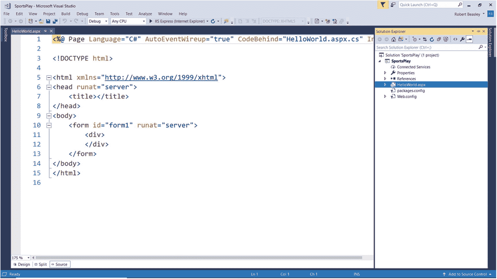
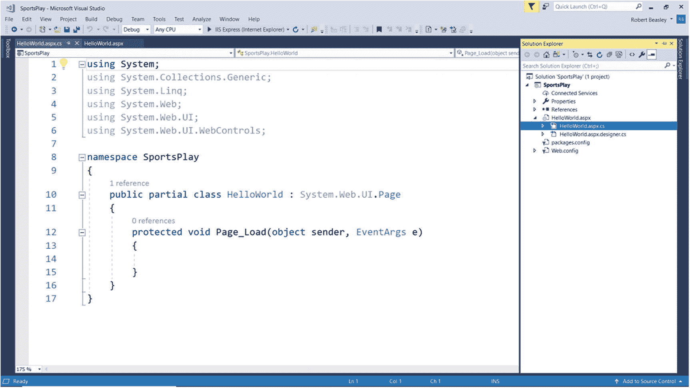
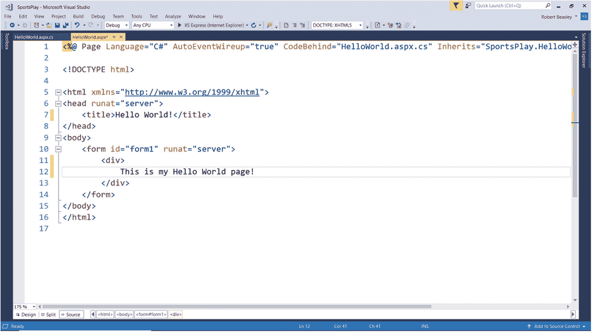
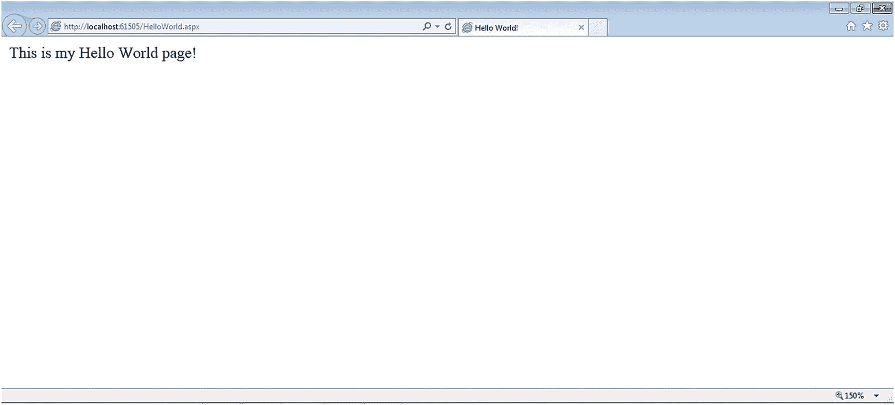

# 二、页面开发

## 2.1 导言

网页是具有唯一的统一资源定位符(URL)或 T2 网址(T3)的文档。该文档由 Web 服务器提供，并显示在 Web 客户端(即浏览器)中。网页使用*超文本标记语言* (HTML)进行格式化，这是一种标准化的编码系统，使用*标签*来影响页面的基本显示特征(例如字体、颜色、布局)并创建简单的功能(例如过渡到其他页面)。到其他页面的转换是通过*超文本链接*(也称为超链接)实现的，其中一个超文本链接与一个 URL 相关联。当点击时，超文本链接导致从一个网页到另一个网页的转换。

在这一章中，我们将从在整本书中应用的标识符命名标准开始。这些标准将在命名变量、常量、服务器控件和其他项目时应用。接下来，我们将讨论 Page 类(也称为 Web Forms Page 类)，这是我们将用来创建 ASP.NET 网页的类。最后，我们将学习如何使用 Visual Studio 向 ASP.NET Web 应用项目添加页面。正如我们将在本书中看到的，我们将为我们希望在 ASP.NET Web 应用中显示的每个网页添加一个 Page 类。

## 2.2 标识符命名标准

一个*标识符*是我们给一个变量、常量、服务器控件或其他项目起的名字。使用标识符命名标准使得读取类的源代码变得更加容易——尤其是在以后维护代码的时候。

在给变量和常量命名时，要尽量使用使项的*内容*明显的名称。这通过做两件事来实现。首先，它是通过以一个*三个字母的前缀*作为项目名称的开头来实现的，这个前缀反映了项目将包含的*类型的数据*。第二，它是通过在项目名称后面加上后缀来完成的，后缀反映了*项目将包含什么数据*。例如，当声明一个字符串变量来保存一个人的姓时，我们将变量命名为 strLastName。这显示了变量将保存的*数据类型*(即字符串数据)以及变量将保存的*数据类型*(即一个人的姓氏)。

另一方面，当命名服务器控件时，我们应该使用使控件的*使用*尽可能明显的名称。这也是通过做两件事来完成的。首先，它是通过以一个反映控件的*类型*的*三个字母的前缀*开始控件的名称来实现的。第二，它是通过用一个反映控件是什么控件的后缀来完成控件名称的。例如，当创建一个接受一个人的姓氏的文本框时，我们将控件命名为 txtLastName。这显示了控件的*类型*(即文本框控件)以及控件的*(即姓氏文本框)。*

 *## 2.3 页面类

Page 类是保存其他 ASP.NET 服务器类的容器，如 Label 类、TextBox 类和 Button 类。因此，Page 类是. NET Web 应用用户界面的基础。客户端向服务器请求网页。在。NET Framework 中，客户端第一次请求网页时，网页会在服务器上编译，提供给客户端，并缓存在服务器内存中以供后续的客户端请求使用。给定的页面类存储在服务器上的. aspx 文件中。

表 [2-1](#Tab1) 显示了 Page 类的一些属性、方法和事件。尽管目前我们对这些内容知之甚少，但重要的是至少要熟悉它们，因为我们稍后会提到它们。

表 2-1

Page 类的一些属性、方法和事件

<colgroup><col class="tcol1 align-left"> <col class="tcol2 align-left"></colgroup> 
| **类**页T3】1T5】 |
| **命名空间**系统。Web.UI |
| **属性** |
| ClientQueryString | 获取请求的 URL 的查询字符串部分。 |
| 伊斯帕提克 | 获取一个值，该值指示该页是首次呈现还是为响应回发而被加载。 |
| IsValid | 获取一个值，该值指示页面验证是否成功。 |
| 掌握 | 获取决定页面整体外观的母版页。 |
| MasterPageFile | 获取或设置母版页的虚拟路径。 |
| 请求 | 获取所请求页面的 HttpRequest 对象。 |
| 反应 | 获取与 Page 对象关联的 HttpResponse 对象。该对象允许您向客户端发送 HTTP 响应数据，并包含有关该响应的信息。 |
| 计算机网络服务器 | 获取服务器对象，该对象是 HttpServerUtility 类的一个实例。 |
| 会议 | 获取由 ASP.NET 提供的当前会话对象。 |
| 主题 | 获取或设置页面主题的名称。 |
| 标题 | 获取或设置页面的标题。 |
| **方法** |
| (参见参考文献。) |   |
| **事件** |
| 初始化完成 | 页面初始化完成时发生。 |
| 加载完成 | 在页面生命周期的加载阶段结束时发生。 |
| PreInit(启动前) | 在页面初始化之前发生。 |
| 事先装好 | 在页面加载事件之前发生。 |
| 预渲染完成 | 在呈现页面内容之前发生。 |
| 保存状态完成 | 在页面完成保存页面和页面上控件的所有视图状态和控件状态信息后发生。 |
| **参考** |
| [T2`https://msdn.microsoft.com/en-us/library/system.web.ui.page(v=vs.110).aspx`](https://msdn.microsoft.com/en-us/library/system.web.ui.page%2528v%253Dvs.110%2529.aspx) |

## 2.4 添加页面类

在上一章中，我们学习了如何开始一个全新的 ASP.NET 网络应用项目。现在，是时候向该项目添加一个 Page 类了。如果还没有打开，我们需要打开在最后一章中创建的 ASP.NET Web 应用项目。为此

1.  执行 Visual Studio。

2.  从主菜单中选择*文件* ➤ *打开* ➤ *项目/解决方案…* 。

3.  当*打开项目*对话框出现时，导航到。项目的 sln 文件。

4.  选择。sln 文件。

5.  点击*打开*。

那个。sln 文件，对了，就是*的解决方案文件*。顾名思义，这个文件包含有关解决方案的信息，包括它所包含的各个项目。这在 Visual Studio 中可能有点混乱，因为当我们创建一个新的 ASP.NET Web 应用项目时，我们实际上是在创建一个新的包含新的*项目*的*解决方案*。

假设项目是打开的，我们现在可以向项目添加一个 Page 类。向 ASP.NET Web 应用项目添加页面类

1.  打开解决方案资源管理器。

2.  右击项目(不是解决方案)。

3.  选择*添加* ➤ *新项目…* 。

当*添加新项目*对话框出现时

1.  从对话框的左窗格中选择*已安装*➤*visual c#*➤*web*➤*web 窗体*。

2.  从对话框的中间窗格选择*网络表单*。

3.  在对话框底部给 Web 表单(即页面类)一个*名*(例如 HelloWorld.aspx)。

4.  点击*添加*。

图 [2-1](#Fig1) 显示了新添加的 Page 类的 Aspx 文件。请注意 Visual Studio 菜单和代码顶部之间的制表符。该选项卡显示刚刚创建的页面类文件的名称(即 HelloWorld.aspx)。我们将在这个文件中编写页面的用户界面。现在看看代码本身。该页面的第一行代码是一个*页面指令*。该页面指令表明，除了其他内容之外，C# 被用作该类的编程语言，并且文件后面的*代码的名称(即，我们将在那里编写我们的服务器端 ASP.NET 和 C# 代码)是 HelloWorld.aspx.cs。请注意，该文件的其余部分包含许多基本的 HTML 标记，例如< head >、< title >、< body >和< div >。最后，请注意解决方案资源管理器中的 Page 类已经添加到项目中。无论何时我们想要访问这个页面类的代码，我们只需在解决方案浏览器中双击它。*

图 2-1

新添加的 Page 类的 Aspx 文件

Page 类有两个主要的(故意分开的)部分——用户界面部分和代码隐藏部分。那个。Page 类的 aspx 文件包含该类的*用户界面*部分。类的这一部分是使用 HTML 标签、ASP.NET 标签或两者的组合来编码的。Page 类的. aspx.cs 文件包含类的部分后面的*代码。这部分类是用 ASP.NET 和 C# 编写的。这种*关注点分离*的美妙之处在于，我们可以在不影响页面功能的情况下更改页面的用户界面，也可以在不影响用户界面的情况下更改页面的功能。我们会发现这种关注点的分离在未来非常有益。*

要写 ASP.NET 和 C# 代码，我们需要打开类的代码隐藏文件。访问文件背后的代码

1.  单击旁边的*三角形*图标展开页面类。解决方案资源管理器中的。

2.  双击关联的. aspx.cs 文件。

图 [2-2](#Fig2) 显示了新添加的 Page 类的文件背后的代码。请注意 Visual Studio 菜单和代码顶部之间的制表符。此选项卡显示 Page 类的代码隐藏文件的名称(即 HelloWorld.aspx.cs)。我们将在这个文件中编写页面的 ASP.NET 和 C# 代码。现在看看代码本身。注意在代码的最顶端，有许多 C# 指令以单词*开始，使用*。这些*使用指令*引用包含在类中的*名称空间*。名称空间可以包含为页面类提供附加功能的*类*(例如，电子邮件类、数据库类)，或者可以包含为页面类提供专用类型的*类型*(例如，接口类型、数组类型、值类型、引用类型、枚举类型)。随着本书的深入，我们将根据需要在页面类中包含额外的名称空间。现在看看以单词*命名空间*开始的代码行。这表明 HelloWorld 页面类位于 SportsPlay 名称空间中。如果出于某种原因，我们将来需要从其他类中引用 HelloWorld Page 类的属性和/或方法，我们将需要在该类中包含 SportsPlay 名称空间。接下来，看看以短语 *public partial class* 开始的代码行。这里的单词 *partial* 表示该文件(即 HelloWorld.aspx.cs)只包含 HelloWorld 页面类的*部分*。其他文件(即 HelloWorld.aspx 和 HelloWorld.aspx.designer.cs)包含 HelloWorld 页面类的其他*部分*。最后，看看以 *protected void* 开始的代码行。这行代码标识了该类的 Page_Load 事件处理程序方法，该方法是在将 Page 类添加到项目中时自动生成的。如果有任何 ASP.NET 和/或 C# 代码需要在页面加载时执行(即，当页面的 Load 事件被引发时)，它将在这里被编码。

图 2-2

新添加的页面类的代码隐藏文件

至此，我们已经准备好编写一些代码了。首先，让我们给 HelloWorld 页面一个标题。该标题将显示在浏览器的顶部，通常作为浏览器选项卡的标题。要给页面添加标题，请键入“Hello World！”之间

<title>tag and the</title> tag in the HelloWorld.aspx file. Note that these two tags are *HTML tags* . An HTML tag of the form <*something*> is referred to as an *open tag* or *start tag* , whereas an HTML tag of the form </*something*> is referred to as a *close tag* or *end tag* . As we will see later, *ASP.NET server tags* have a similar form. Now, let’s display some text in the body of the page. To do this, type the sentence “This is my Hello World page!” between the 
 tag and the 
 tag. Figure [2-3](#Fig3) shows our Aspx code with a page title and text added.

图 2-3

添加了页面标题和文本的 Aspx 代码

现在我们已经写了一些代码，是时候测试我们的网页了。为了测试我们的页面，我们必须首先将它设置为项目的开始页面。为此

1.  在解决方案资源管理器中右击 HelloWorld.aspx 文件。

2.  选择*设为起始页*。

现在，当我们在 Visual Studio 中运行我们的 ASP.NET Web 应用项目时，将显示 HelloWorld.aspx 页面。请记住，如果我们在运行项目之前忽略了设置项目的起始页，我们将会收到一个 *403 错误*。此错误意味着 IIS 服务器理解 HTTP 请求，但由于某种原因无法完成它。

现在我们已经设置了起始页，我们准备测试它。要测试该页面，请单击 Visual Studio 环境顶部的绿色*三角形*图标。绿色*三角形*图标旁边的浏览器名称应该默认为 Internet Explorer。要选择不同的浏览器来测试页面，请单击当前浏览器名称旁边的黑色*三角形*图标，然后选择所需的浏览器。可供选择的浏览器列表应该包含开发机器上当前安装的所有浏览器。图 [2-4](#Fig4) 显示了在 Internet Explorer 中显示的 HelloWorld 页面。注意浏览器标签中的网页标题“Hello World！”还要注意句子“这是我的 Hello World 页面！”在网页的主体中。

图 2-4

Internet Explorer 中显示的 HelloWorld 页面

<aside aria-label="Footnotes" class="FootnoteSection" epub:type="footnotes">Footnotes [1](#Fn1_source)

所有属性、方法和事件描述都直接取自微软的官方文档。为了节省空间，省略了用于处理该类事件的事件处理程序方法。有关该类的所有方法，请参见参考。

 </aside>*