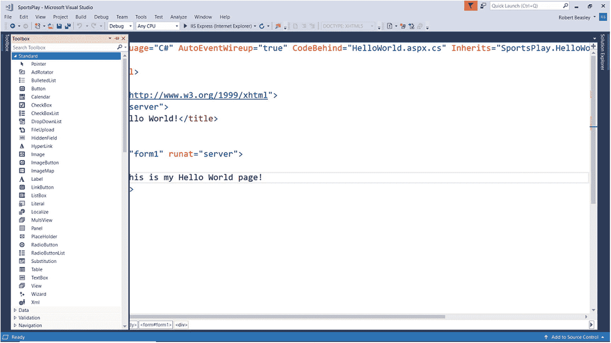
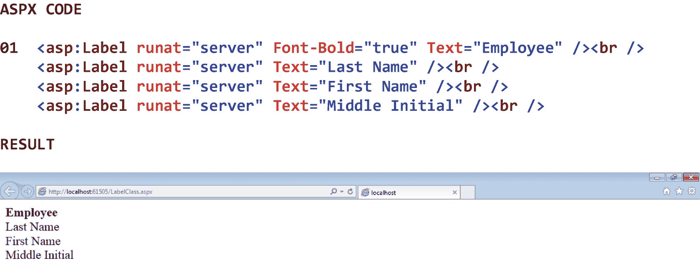
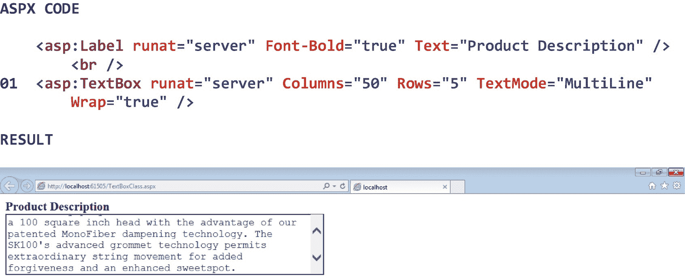
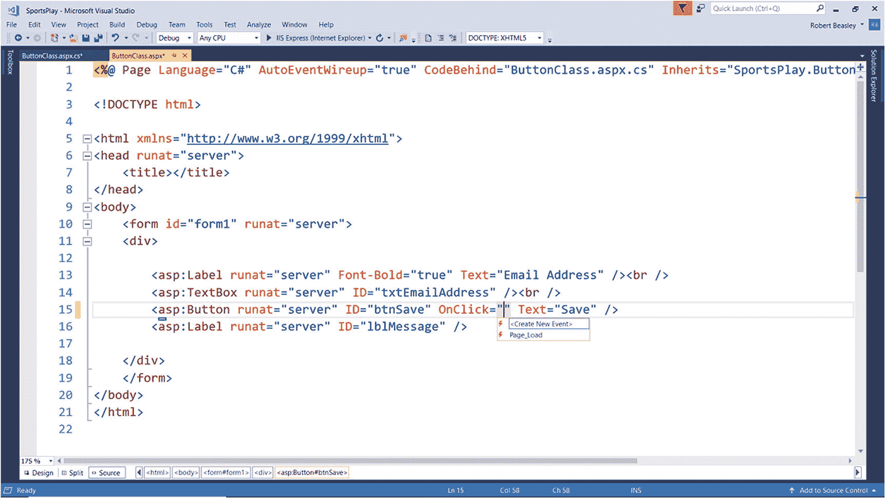
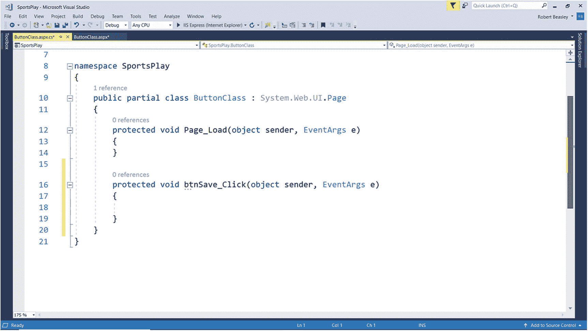
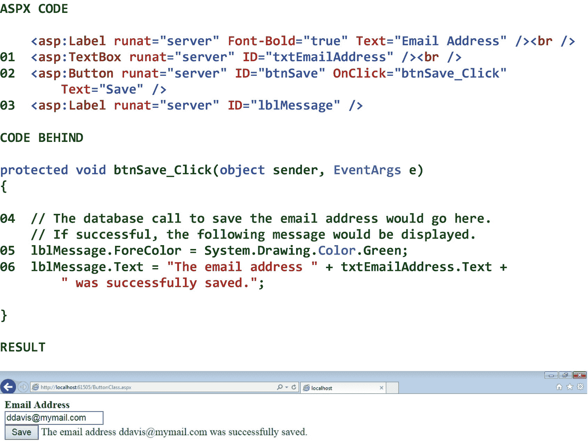
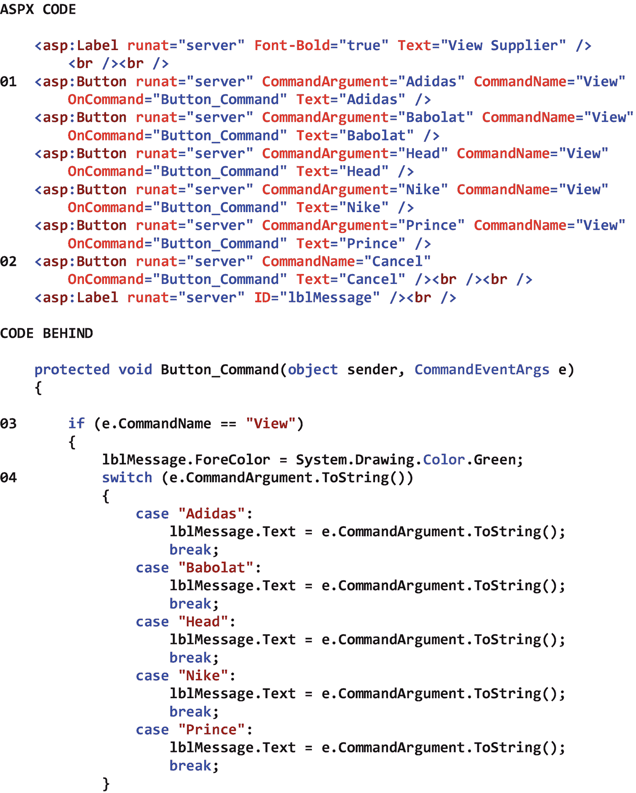
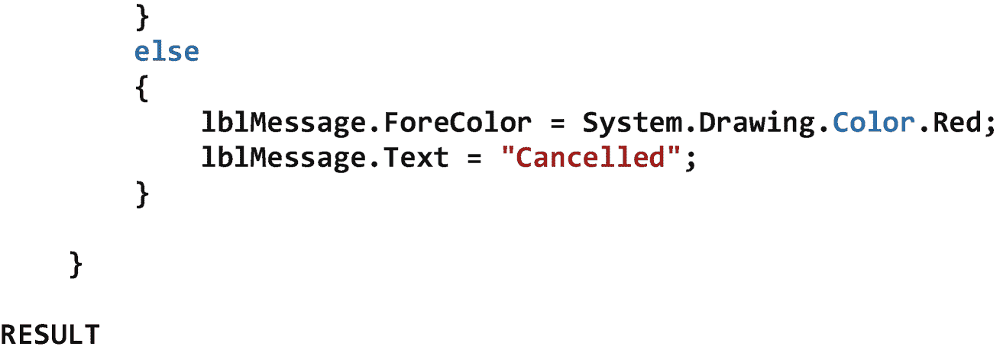
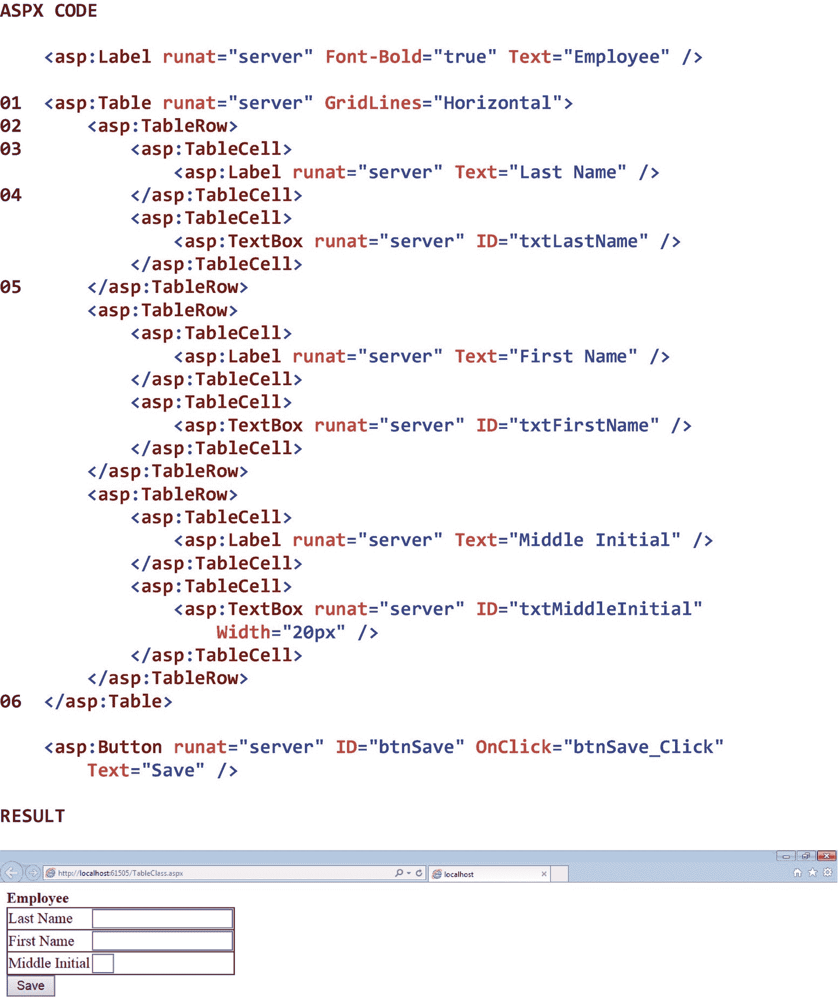

# 三、基本服务器控件

## 3.1 导言

服务器控件是显示在 ASP.NET 网页上的对象。当通过 HTTP 请求从服务器请求网页时，服务器处理页面请求(如标题为“Web 应用开发”的第 [1](01.html) 章所述)，然后通过 HTTP 响应向客户端发送结果 HTML 代码。当 Web 浏览器收到 HTTP 响应时，它*呈现*页面并显示给最终用户。在 ASP.NET Web 应用的上下文中，术语 *render* 指的是基于从服务器的 HTTP 响应中接收到的 HTML 代码，创建页面的可视表示的过程，包括所有相关的服务器控件。

在本章中，我们将从查看 Visual Studio 的工具箱开始。这个工具箱包含了我们将在本书中学习的大多数 ASP.NET 服务器控件。接下来，我们将讨论六个基本的服务器控件类:标签类、文本框类、按钮类、表格类、表格行类和表格单元格类。当我们查看这些类时，请记住它们都继承了其父类的属性、方法和事件。因此，我们将主要关注正在研究的类的属性、方法和事件。

## 3.2 工具箱

Visual Studio 工具箱包含了我们将在本书中学习的大多数 ASP.NET 服务器控件。要打开工具箱，请单击 Visual Studio 环境左上角的*工具箱*选项卡。我们可以通过点击工具箱右上角的*图钉*图标来自动隐藏工具箱。我们也可以通过再次点击*工具箱*标签来关闭工具箱。如果我们单击工具箱右上角的 *x* 图标，这将移除*工具箱*选项卡，我们可以通过从主菜单中选择*视图* ➤ *工具箱*来恢复它。

图 [3-1](#Fig1) 显示了工具箱中的标准服务器控件类。如果图中显示的类不可见，我们可能需要通过点击*三角形*图标来展开*标准*选项卡。请记住，工具箱中的类只有在查看. aspx 文件时才会显示。请注意，按钮类、标签类、表格类和文本框类都包含在这个按字母顺序排列的类列表中。我们将在这一章中使用这四个类，并且我们将在下一章中探索许多其他的类。

图 3-1

工具箱中的标准服务器控件类

## 3.3 标签等级

标签类显示文本。与静态网页上显示的文本不同，使用 Label 控件的 ASP.NET 网页上显示的文本可以通过在代码中修改控件的 text 属性值来动态更改。表 [3-1](#Tab1) 显示了标签类的一些属性、方法和事件。虽然表中显示的唯一成员是 Text 属性，但 Label 类包含其他成员，并从其父类继承了许多其他属性、方法和事件。

表 3-1

Label 类的一些属性、方法和事件

<colgroup><col class="tcol1 align-left"> <col class="tcol2 align-left"></colgroup> 
| **类**标签T3】1T5】 |
| **命名空间**系统。网页控件 |
| **属性** |
| 文本 | 获取或设置 Label 控件的文本内容。 |
| **方法** |
| (参见参考文献。) |   |
| **事件** |
| (参见参考文献。) |   |
| **参考** |
| [T2`https://msdn.microsoft.com/en-us/library/system.web.ui.webcontrols.label(v=vs.110).aspx`](https://msdn.microsoft.com/en-us/library/system.web.ui.webcontrols.label%2528v%253Dvs.110%2529.aspx) |

图 [3-2](#Fig2) 显示了一个标签类的例子。

请注意 01 处的标签控件及其相关属性。可以看到，标签控件以一个*ASP.NET 服务器标签*开始。这个标签以< asp:开始，以/ >结束。正如我们将在本书中看到的，所有 ASP.NET 服务器标签都以这种方式开始和结束。注意，这与 HTML 标签形成鲜明对比，HTML 标签以<开头，以/ >结尾。

还要注意 runat 属性被设置为*服务器*。这表明该控件将被视为一个*动态*ASP.NET 服务器控件，而不是一个*静态* HTML 控件。需要为每个 ASP.NET 服务器控件指定该属性的值是繁琐和多余的，并且可能已经被 Microsoft 默认。然而，如果我们在 ASP.NET 服务器控件的定义中不将该属性设置为 *true* ，就会出现语法错误。

还要注意，Font-Bold 属性被设置为 *true* 。这指示当控件呈现在页面上时，控件的 text 属性中的文本将以粗体显示。注意，这个属性*不是*标签类本身的一部分，而是继承自字体类。Font-Bold 属性的默认值是 *false* 。

我们还可以看到 Text 属性被设置为*雇员*。这表明在页面上呈现单词“Employee”时，它将显示在标签中。当然，由于 Label 类是一个*动态*服务器控件类，我们可以在后面的代码中随意修改它的 Text 属性(以及它的大部分其他属性)的值。注意，这个属性不像 Font-Bold 属性那样被继承，而是在标签类本身中定义的(见表 [3-1](#Tab1) )。

还要注意，runat 属性首先被编码，然后是该类的其他属性(例如，Font-Bold 和 Text)，它们在 runat 属性之后按字母顺序被编码为*。作为一个编码标准，我们将总是首先编码 runat 属性，其次是 ID 属性(稍后将讨论)，然后是任何其他属性和方法，按字母顺序排列。我们这样做是因为按字母顺序对属性和方法进行编码会使*更容易直观地引用为控件编码的属性和方法——特别是当属性和方法的列表变长时。**

最后，注意这一行的末尾包含了一个
标签。这是一个在页面上强制换行的 HTML 标签。这是我们将在本书中用来格式化 ASP.NET 页面的少数 HTML 标签之一，因为大多数 HTML 标签都有一个等效的 ASP.NET 服务器标签。Aspx 代码的结果显示在图的底部。

图 3-2

标签类的示例

## 3.4 文本框类

TextBox 类显示最终用户可以用来输入信息的输入字段。TextBox 控件包含许多允许我们控制控件外观的属性。例如，如果我们希望文本框允许输入一行最终用户数据，我们可以将控件的 TextMode 属性设置为 *SingleLine* 。或者，如果我们希望文本框允许输入多行最终用户数据，我们可以将它设置为*多行*。或者，如果我们希望字符在文本框中输入时被屏蔽，我们可以将其设置为*密码*。还有许多其他属性可用。表 [3-2](#Tab2) 显示了 TextBox 类的一些属性、方法和事件。

表 3-2

TextBox 类的一些属性、方法和事件

<colgroup><col class="tcol1 align-left"> <col class="tcol2 align-left"></colgroup> 
| **类**文本框T3】2T5】 |
| **命名空间**系统。网页控件 |
| **属性** |
| 自动提交 | 获取或设置一个值，该值指示当 TextBox 控件失去焦点时是否自动回发到服务器。 |
| 原因验证 | 获取或设置一个值，该值指示当 TextBox 控件设置为在回发发生时进行验证时，是否执行验证。 |
| 列 | 获取或设置文本框的显示宽度(以字符为单位)。 |
| 最大长度 | 获取或设置文本框中允许的最大字符数。 |
| 行 | 获取或设置多行文本框中显示的行数。 |
| 文本 | 获取或设置 TextBox 控件的文本内容。 |
| 文字模式 | 获取或设置 TextBox 控件的行为模式(如单行、多行或密码)。 |
| 验证组 | 获取或设置 TextBox 控件在回发到服务器时导致验证的控件组。 |
| 包装 | 获取或设置一个值，该值指示文本内容是否在多行文本框内换行。 |
| **方法** |
| (参见参考文献。) |   |
| **事件** |
| 文本已更改 | 当文本框的内容在向服务器的两次发送之间发生变化时发生。 |
| **参考** |
| [T2`https://msdn.microsoft.com/en-us/library/system.web.ui.webcontrols.textbox(v=vs.110).aspx`](https://msdn.microsoft.com/en-us/library/system.web.ui.webcontrols.textbox%2528v%253Dvs.110%2529.aspx) |

图 [3-3](#Fig3) 显示了一个文本框类的例子。

请注意 01 处的文本框控件及其关联属性。可以看出，控件的 Columns 属性被设置为 *50* 。这表示在浏览器中呈现时，文本框的宽度将为 50 个字符。还要注意，Rows 属性被设置为 *5* 。这表示在浏览器中呈现文本框时将显示五行。我们还可以看到 TextMode 属性被设置为 *MultiLine* ，这表明文本框将在浏览器中呈现为多行文本框，可以接受终端用户的多行输入。最后，注意 Wrap 属性被设置为 *true* 。这表示如果文本框包含多行文本，它的内容将换行到下一行。Aspx 代码的结果显示在图的底部。可以看到，文本框中输入了几行信息。

图 3-3

TextBox 类的示例

## 3.5 按钮类

Button 类显示一个按钮，最终用户可以使用它来调用一个操作。单击按钮控件时，会引发其 Click 和 Command 事件。为了处理这些事件之一，我们必须编写适当的事件处理程序方法。稍后会有更多的介绍。按钮控件可以表现得像提交按钮(即，将页面发送回服务器以处理其单击事件的按钮)，也可以表现得像命令按钮(即，将页面发送回服务器的按钮，通过向事件处理程序方法传递命令名和[可选]命令参数，我们可以在一个事件处理程序方法中处理几个按钮的单击事件)。默认情况下，按钮控件的行为类似于提交按钮。表 [3-3](#Tab3) 显示了按钮类的一些属性、方法和事件。

表 3-3

Button 类的一些属性、方法和事件

<colgroup><col class="tcol1 align-left"> <col class="tcol2 align-left"></colgroup> 
| **类**按钮T3】3T5】 |
| **命名空间**系统。网页控件 |
| **属性** |
| 原因验证 | 获取或设置一个值，该值指示单击按钮控件时是否执行验证。 |
| 命令参数 | 获取或设置与关联的 CommandName 一起传递给命令事件的可选参数。 |
| 按钮 | 获取或设置与传递给命令事件的按钮控件关联的命令名。 |
| 文本 | 获取或设置按钮控件中显示的文本标题。 |
| 验证组 | 获取或设置按钮控件回发到服务器时导致验证的控件组。 |
| **方法** |
| (参见参考文献。) |   |
| **事件** |
| 点击 | 当单击 Button 控件时发生。 |
| 命令 | 当单击 Button 控件时发生。 |
| **参考** |
| [T2`https://msdn.microsoft.com/en-us/library/system.web.ui.webcontrols.button(v=vs.110).aspx`](https://msdn.microsoft.com/en-us/library/system.web.ui.webcontrols.button%2528v%253Dvs.110%2529.aspx) |

图 [3-4](#Fig4) 展示了如何为一个按钮控件创建一个新的点击事件处理方法。可以看到，我们已经向。该控件的 ID 属性设置为 *btnSave* 。要在 Page 类的代码中创建控件的 Click 事件处理程序方法，我们必须做的就是

图 3-4

如何为按钮控件创建新的 Click 事件处理程序方法

1.  将鼠标光标放在按钮控件中的适当位置。

2.  类型 *OnClick* 。

3.  当 OnClick 方法的选项出现时，选择 *<创建新事件>* 。这将在 Page 类的代码中为 btnSave 按钮创建一个新的 Click 事件处理程序方法。

图 [3-5](#Fig5) 显示了新创建的按钮控件的 Click 事件处理方法。请注意，事件处理程序方法的名称是 btnSave_Click。该方法名称反映了按钮控件的 ID(即 btnSave)和在 Page 类的代码背后处理的事件(即 Click)。当最终用户单击 Save 按钮时，在这个事件处理程序方法中编写的任何代码都将被执行。

图 3-5

为按钮类新创建的 Click 事件处理程序方法

图 [3-6](#Fig6) 显示了一个行为类似提交按钮的按钮类的例子。

注意在 01 处，TextBox 控件的 ID 属性被设置为 *txtEmailAddress* 。通过给这个控件一个 ID，我们可以在页面后面的代码中引用它。如果我们试图引用一个没有 ID 的控件，就会出现语法错误。可以看出，该控件的 ID 属性以三个字母的前缀 *txt* 开始，以在代码中表明该 ID 引用了一个文本框，并以 *EmailAddress* 结束，以在代码中表明该控件将包含一个电子邮件地址。

注意在 02，按钮控件的 ID 属性被设置为 *btnSave* 。可以看出，该控件的 ID 属性以三个字母的前缀 *btn* 开始，以在代码中表明该 ID 引用了一个按钮，并以 *Save* 结束，以在代码中表明该控件将执行保存功能。还要注意 OnClick 方法被设置为 *btnSave_Click* 。我们将在这个事件处理程序方法中编写代码来处理 Click 事件。另外，我们可以看到 Text 属性被设置为 *Save* 。这指示当按钮在浏览器中呈现时将在按钮中显示的文本。

注意在 03，标签控件的 ID 属性被设置为 *lblMessage* 。可以看出，该控件的 ID 属性以三个字母的前缀 *lbl* 开始，以在代码中表明该 ID 引用了一个*标签*，并以 *Message* 结束，以在代码中表明该控件将包含一条消息。

请注意，在 04 处，两行注释被添加到了事件处理程序方法中。在 C# 中，注释由两个正斜杠(即//)表示。

注意在 05，lblMessage 控件的 ForeColor 属性被设置为*绿色*。ForeColor 属性是指标签中显示的文本的颜色。

注意，在 06，lblMessage 控件的 Text 属性被设置为*，与 txtEmailAddress 控件的 Text 属性的值连接的 email 地址*被成功保存。请注意，在 C# 中，连接字符是一个加号(+)。

图中结果部分的截图显示了点击*保存*按钮的结果。

图 3-6

行为类似提交按钮的按钮类示例

图 [3-7](#Fig7) 显示了一个按钮类行为类似于命令按钮的例子。

请注意，在 01 处，CommandArgument 属性被设置为 *Adidas* ，CommandName 属性被设置为*视图*。当单击按钮时，这两个属性将被传递到代码中按钮的事件处理程序方法。还要注意 OnCommand 属性被设置为*按钮 _ 命令*。这是将处理按钮的 Click 事件的事件处理程序方法的名称。可以看到，在这个场景中，页面上没有一个按钮需要 ID，前五个按钮有*不同的*命令参数，但有*相同的*命令名称。

请注意，在 02 处，最后一个按钮*没有*具有命令参数，并且具有与其他按钮不同的*命令名称*。

请注意，在 03 处，正在测试传递给事件处理程序方法的命令名。如果 CommandName 属性的值被设置为*视图*，则 If 结构内的代码块将被执行。如果不是(即，CommandName 属性的值被设置为*取消*，则执行 If 结构中 Else 部分的代码块。

请注意，在 04 处，传递给事件处理程序方法的命令参数正在使用开关结构进行评估，以确定要执行哪种情况。如果 CommandArgument 属性的值被设置为 *Adidas* ，消息标签的 Text 属性将被适当地设置。如果设置为其他值，消息标签的 Text 属性将被设置为其他值。

图中结果部分的截图显示了点击 Adidas 按钮的结果。

T2】

图 3-7

行为类似命令按钮的 Button 类的示例

## 3.6 表类

Table 类显示一个表格，该表格可用于组织网页控件的布局。一个表格控件由一个或多个表格*行*组成，每个表格行由一个或多个表格*单元格*组成。稍后将讨论的这些表格行和表格单元格分别由 TableRow 类和 TableCell 类构造而成。表可以在设计时通过在 Aspx 代码中指定其格式和内容来创建，也可以在运行时通过在后面的代码中编写必要的代码来生成。表格可以包含其他表格。表格 [3-4](#Tab4) 展示了表格类的一些属性、方法和事件。

表 3-4

Table 类的一些属性、方法和事件

<colgroup><col class="tcol1 align-left"> <col class="tcol2 align-left"></colgroup> 
| **类**表T3】4T5】 |
| **命名空间**系统。网页控件 |
| **属性** |
| BackImageUrl | 获取或设置显示在 Table 控件后面的背景图像的 URL。 |
| 单元格填充 | 获取或设置单元格内容和单元格边框之间的间距。 |
| 单元格间距 | 获取或设置单元格之间的间距。 |
| 网格线 | 获取或设置要在 Table 控件中显示的网格线样式。 |
| 水平对齐 | 获取或设置页面上 Table 控件的水平对齐方式。 |
| **方法** |
| (参见参考文献。) |   |
| **事件** |
| (参见参考文献。) |   |
| **参考** |
| [T2`https://msdn.microsoft.com/en-us/library/system.web.ui.webcontrols.table(v=vs.110).aspx`](https://msdn.microsoft.com/en-us/library/system.web.ui.webcontrols.table%2528v%253Dvs.110%2529.aspx) |

## 3.7 TableRow 类

TableRow 类定义了表格中的一行。每个 TableRow 控件都由一个或多个表格单元格组成，每个单元格都是由 TableCell 类构造的(接下来将讨论)。TableRow 类允许我们控制如何显示表格行的内容。例如，TableRow 控件的 HorizontalAlign 属性可以设置为*居中*、*左侧*、*右侧*，或者其他值，这取决于我们希望如何从左到右显示行的内容。同样，TableRow 控件的 VerticalAlign 属性可以设置为 *bottom* 、 *middle* 、 *top* 或其他值，这取决于我们希望如何从上到下显示行的内容。表 [3-5](#Tab5) 显示了 TableRow 类的一些属性、方法和事件。

表 3-5

TableRow 类的一些属性、方法和事件

<colgroup><col class="tcol1 align-left"> <col class="tcol2 align-left"></colgroup> 
| **类**表行T3】5T5】 |
| **命名空间**系统。网页控件 |
| **属性** |
| 水平对齐 | 获取或设置行中内容的水平对齐方式。 |
| 垂直排列 | 获取或设置行中内容的垂直对齐方式。 |
| **方法** |
| (参见参考文献。) |   |
| **事件** |
| (参见参考文献。) |   |
| **参考** |
| [T2`https://msdn.microsoft.com/en-us/library/system.web.ui.webcontrols.tablerow(v=vs.110).aspx`](https://msdn.microsoft.com/en-us/library/system.web.ui.webcontrols.tablerow%2528v%253Dvs.110%2529.aspx) |

## 3.8 TableCell 类

TableCell 类定义一行中的一个单元格。这个类控制单元格内容的显示方式。例如，TableCell 控件的 HorizontalAlign 属性可以设置为*居中*、*向左*、*向右*，或者其他值，这取决于我们希望如何从左到右显示单元格的内容。类似地，TableCell 控件的 VerticalAlign 属性可以设置为 *bottom* 、 *middle* 、 *top* 或其他值，这取决于我们希望如何从上到下显示单元格的内容。此外，TableCell 控件的 Wrap 属性可以设置为 *true* 或 *false* ，这取决于我们是否希望单元格的内容(例如，文本)在包含的内容超过一行所能包含的内容时换行到下一行。表 [3-6](#Tab6) 显示了 TableCell 类的一些属性、方法和事件。

表 3-6

TableCell 类的一些属性、方法和事件

<colgroup><col class="tcol1 align-left"> <col class="tcol2 align-left"></colgroup> 
| **类**table cellT3】6T5】 |
| **命名空间**系统。网页控件 |
| **属性** |
| 列跨度 | 获取或设置表格控件中单元格跨越的列数。 |
| 水平对齐 | 获取或设置单元格中内容的水平对齐方式。 |
| 行跨度 | 获取或设置表格控件中单元格跨越的行数。 |
| 垂直排列 | 获取或设置单元格中内容的垂直对齐方式。 |
| 包装 | 获取或设置一个值，该值指示单元格内容是否换行。 |
| **方法** |
| (参见参考文献。) |   |
| **事件** |
| (参见参考文献。) |   |
| **参考** |
| [T2`https://msdn.microsoft.com/en-us/library/system.web.ui.webcontrols.tablecell(v=vs.110).aspx`](https://msdn.microsoft.com/en-us/library/system.web.ui.webcontrols.tablecell%2528v%253Dvs.110%2529.aspx) |

图 [3-8](#Fig8) 显示了一个表格、表格行和表格单元格类的例子。

请分别注意 01 和 06 处表格控件的开始标记和相应的结束标记。可以看到，表格控件的 GridLines 属性被设置为 *Horizontal* 。

请分别注意 02 和 05 处的 TableRow 控件的开始标记和相应的结束标记。

请分别注意 03 和 04 处的 TableCell 控件的开始标记和相应的结束标记。

如图所示，每个 TableRow 控件在其关联的 Table 控件内缩进四个空格，每个 TableCell 控件在其关联的 TableRow 控件内缩进四个空格。表格的这种编码风格使得什么表格中包含什么表格行，什么表格行中包含什么表格单元格变得很清楚。因此，这种表格编码风格将成为我们在本书中遵循的标准。代码中需要注意的另一点是，runat 属性只在表格控件中设置——它是在 TableRow 或 TableCell 控件中设置的*而不是*。

图中结果部分的屏幕截图显示了在相关 Aspx 代码中定义的三行两列的表。因为该表用于在页面上布置控件，所以控件更好地对齐，从而产生看起来更专业的页面。

图 3-8

Table、TableRow 和 TableCell 类的示例

<aside aria-label="Footnotes" class="FootnoteSection" epub:type="footnotes">Footnotes [1](#Fn1_source)

所有属性、方法和事件描述都直接取自微软的官方文档。为了节省空间，省略了用于处理该类事件的事件处理程序方法。有关该类的所有方法，请参见参考。

  [2](#Fn2_source)

所有属性、方法和事件描述都直接取自微软的官方文档。为了节省空间，省略了用于处理该类事件的事件处理程序方法。有关该类的所有方法，请参见参考。

  [3](#Fn3_source)

所有属性、方法和事件描述都直接取自微软的官方文档。为了节省空间，省略了用于处理该类事件的事件处理程序方法。有关该类的所有方法，请参见参考。

  [4](#Fn4_source)

所有属性、方法和事件描述都直接取自微软的官方文档。为了节省空间，省略了用于处理该类事件的事件处理程序方法。有关该类的所有方法，请参见参考。

  [5](#Fn5_source)

所有属性、方法和事件描述都直接取自微软的官方文档。为了节省空间，省略了用于处理该类事件的事件处理程序方法。有关该类的所有方法，请参见参考。

  [6](#Fn6_source)

所有属性、方法和事件描述都直接取自微软的官方文档。为了节省空间，省略了用于处理该类事件的事件处理程序方法。有关该类的所有方法，请参见参考。

 </aside>