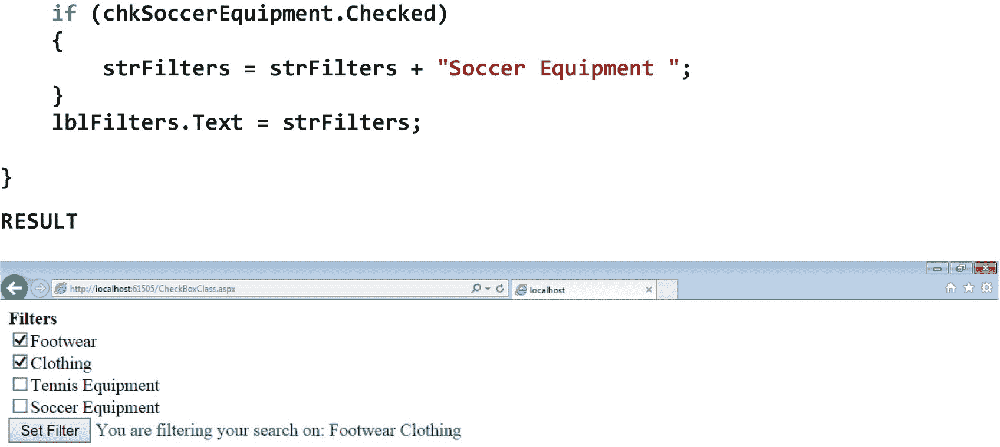
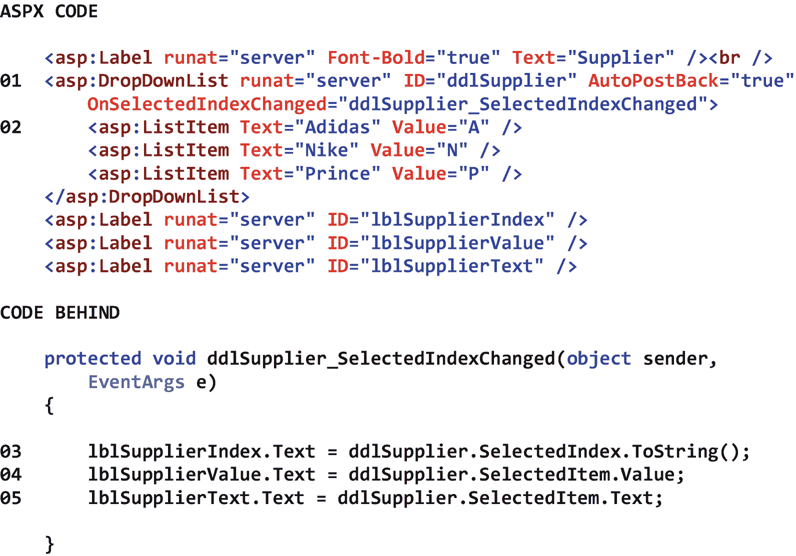
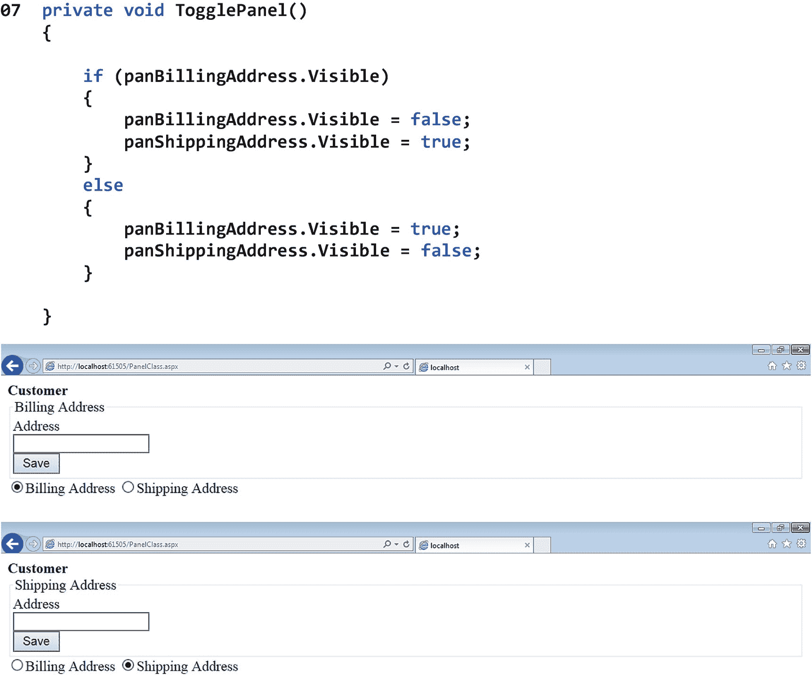

# 四、更多服务器控件

## 4.1 导言

如前一章所述，服务器控件是显示在 ASP.NET 网页上的对象。当通过 HTTP 请求从服务器请求网页时，服务器处理页面请求(如标题为“Web 应用开发”的第 [1](01.html) 章所述)，然后通过 HTTP 响应向客户端发送结果 HTML 代码。当 Web 浏览器收到 HTTP 响应时，它*呈现*页面并显示给最终用户。在 ASP.NET Web 应用的上下文中，术语 *render* 指的是基于从服务器的 HTTP 响应中接收到的 HTML 代码，创建页面的可视表示的过程，包括所有相关的服务器控件。在那一章中，我们看了六个基本的服务器控件类:标签类、文本框类、按钮类、表格类、表格行类和表格单元格类。尽管这六个类为我们提供了足够的 ASP.NET 功能，但在。NET 框架类库。

在这一章中，我们将会看到许多 ASP.NET 服务器控件类，它们可以用来构建比我们已经构建的更有趣和复杂的 Web 应用。本章将介绍的服务器控件类有 Calendar 类、CheckBox 类、RadioButton 类、FileUpload 类、Hyperlink 类、Image 类、ImageButton 类、ImageMap 类、RectangleHotSpot 类、LinkButton 类、ListControl 类、ListItem 类、DropDownList 类、ListBox 类和 Panel 类。

## 4.2 日历类

Calendar 类显示月历，最终用户可以使用该月历来选择单个日期或日期范围(例如，整个星期或整个月)。默认情况下，Calendar 控件显示公历，但也可以指定其他日历。同样默认情况下，Calendar 控件显示当前年份的当月。就外观而言，Calendar 控件显示的标题包括月份和年份、用于向前和向后移动到上一个月和下一个月的链接、一周中各天的标题以及一组可选择的日期。Calendar 类包含了无数的格式属性，允许我们自定义 Calendar 控件的外观。此外，还有许多属性允许我们显示和隐藏日历控件的各个部分。由于这里有太多的格式化属性要列出，感兴趣的读者应该在表 [4-1](#Tab1) 的底部看到参考。表 [4-1](#Tab1) 显示了日历类的一些属性、方法和事件。

表 4-1

Calendar 类的一些属性、方法和事件

<colgroup><col class="tcol1 align-left"> <col class="tcol2 align-left"></colgroup> 
| **类**日历T3】1T5】 |
| **命名空间**系统。网页控件 |
| **属性** |
| 可选 | 获取或设置在 Calendar 控件的第一天列中显示的一周中的某一天。 |
| NextMonthText | 获取或设置为下个月导航控件显示的文本。 |
| 前一篇文章 | 获取或设置为上个月导航控件显示的文本。 |
| 选定日期 | 获取或设置选定的日期。 |
| 可访问日期 | 获取或设置 DateTime 值，该值指定要在 Calendar 控件上显示的月份。 |
| **方法** |
| (参见参考文献。) |   |
| **事件** |
| 选择已更改 | 当用户通过单击日期选择器控件选择一天、一周或整个月时发生。 |
| **参考** |
| [T2`https://msdn.microsoft.com/en-us/library/system.web.ui.webcontrols.calendar(v=vs.110).aspx`](https://msdn.microsoft.com/en-us/library/system.web.ui.webcontrols.calendar%2528v%253Dvs.110%2529.aspx) |

图 [4-1](#Fig1) 显示了日历类的一个例子。

请注意 01 处的日历控件及其关联属性。具体来说，请注意当引发 SelectionChanged 事件时将执行的事件处理程序方法的名称。

请注意，在 02，当页面加载时，我们将 Calendar 控件的 SelectedDate 属性设置为当前日期，以便在日历上突出显示今天的日期。

注意在 03，当日历上选择的日期改变时，我们设置日期标签的文本属性。

图中结果部分的第一个屏幕截图显示了默认日期设置为当前日期的日历。第二个屏幕截图显示了在日历上选择另一个日期的结果。请注意日历下显示的选定日期。

图 4-1

日历类的示例

## 4.3 复选框类

CheckBox 类显示一个小框，最终用户可以使用它来选中或取消选中某个项目。当最终用户选中复选框控件时，其 Checked 属性被设置为 *true* 。相反，当最终用户取消选中复选框控件时，它的 Checked 属性被设置为 *false* 。在最终用户选中或取消选中复选框控件后，我们可以在代码中评估控件的 checked 属性，以根据 checked 属性的真假来执行操作。默认情况下，复选框控件处于未选中状态。同样，默认情况下，复选框在被选中或取消选中时不会执行操作。如果我们希望在复选框被选中或取消选中时执行某个操作，我们必须将其 AutoPostBack 属性设置为 *true* 。表 [4-2](#Tab2) 显示了 CheckBox 类的一些属性、方法和事件。

表 4-2

CheckBox 类的一些属性、方法和事件

<colgroup><col class="tcol1 align-left"> <col class="tcol2 align-left"></colgroup> 
| **类**复选框T3】2T5】 |
| **命名空间**系统。网页控件 |
| **属性** |
| 自动提交 | 获取或设置一个值，该值指示单击时复选框状态是否自动回发到服务器。 |
| 原因验证 | 获取或设置一个值，该值指示选择 CheckBox 控件时是否执行验证。 |
| 检查 | 获取或设置一个值，该值指示 CheckBox 控件是否已选中。 |
| 文本 | 获取或设置与复选框关联的文本标签。 |
| 验证组 | 获取或设置 CheckBox 控件回发到服务器时导致验证的控件组。 |
| **方法** |
| (参见参考文献。) |   |
| **事件** |
| 事件 | 当 Checked 属性的值在向服务器的两次发送之间发生更改时发生。 |
| **参考** |
| [T2`https://msdn.microsoft.com/en-us/library/system.web.ui.webcontrols.checkbox(v=vs.110).aspx`](https://msdn.microsoft.com/en-us/library/system.web.ui.webcontrols.checkbox%2528v%253Dvs.110%2529.aspx) |

图 [4-2](#Fig2) 显示了复选框类的一个例子。

请注意 01 处的复选框控件及其相关属性。

请注意 02 处的按钮控件及其相关属性。具体来说，请注意当引发 Click 事件时将执行的事件处理程序方法的名称。

请注意，在 03 处，正在测试 chkFootwear 复选框，以确定它是否已被选中。

图中结果部分的截图显示了选中前两个复选框并单击*设置过滤器*按钮的结果。

 

图 4-2

复选框类的示例

## 4.4 单选按钮类

RadioButton 类显示一组相关的按钮，最终用户可以使用这些按钮从一组*互斥的*选项中选择一个选项。当最终用户单击 RadioButton 控件时，该控件的 Checked 属性被设置为 *true* ，相关控件的 Checked 属性被设置为 *false* 。当最终用户单击 RadioButton 控件时，我们可以在代码中评估控件的 Checked 属性，并根据 Checked 属性的真假执行操作。默认情况下，RadioButton 控件处于未选中状态。同样，默认情况下，单选按钮在被选中时不会执行任何操作。如果我们希望在单选按钮被选中时执行某个操作，我们必须将其 AutoPostBack 属性设置为 *true* 。为了使一组 RadioButton 控件相互关联，从而被视为一组互斥的选项，我们必须将它们的 GroupName 属性设置为相同的值。表 [4-3](#Tab3) 显示了 RadioButton 类的一些属性、方法和事件。请注意，RadioButton 类是从 CheckBox 类派生的。因此，除了下面的内容之外，我们还应该看到 CheckBox 类的属性、方法和事件。

表 4-3

RadioButton 类的一些属性、方法和事件

<colgroup><col class="tcol1 align-left"> <col class="tcol2 align-left"></colgroup> 
| **类**单选按钮T3】3T5】 |
| **命名空间**系统。网页控件 |
| **属性** |
| 组名 | 获取或设置单选按钮所属组的名称。 |
| **方法** |
| (参见参考文献。) |   |
| **事件** |
| (参见参考文献。) |   |
| **参考** |
| [T2`https://msdn.microsoft.com/en-us/library/system.web.ui.webcontrols.radiobutton(v=vs.110).aspx`](https://msdn.microsoft.com/en-us/library/system.web.ui.webcontrols.radiobutton%2528v%253Dvs.110%2529.aspx) |

图 4-3 显示了一个 RadioButton 类的例子。

请注意 01 处的 RadioButton 控件及其关联属性。可以看到，这个控件的 GroupName 属性被设置为 *Shipper* ，这对于所有三个单选按钮都是一样的。因此，这些单选按钮被视为一组互斥的选项。

请注意 02 处的按钮控件及其相关属性。具体来说，请注意当引发 Click 事件时将执行的事件处理程序方法的名称。

注意，在 03，每个单选按钮(除了最后一个)都被测试，以确定它是否被选中。

图中结果部分的第一个屏幕截图显示，第一个单选按钮是选项组中的默认选项。第二个屏幕截图显示了选择第三个选项并单击*选择发货人*按钮的结果。

图 4-3

RadioButton 类的示例

## 4.5 文件上传类

FileUpload 类显示一个文本框和浏览按钮，最终用户可以使用它们来输入或选择要上传到服务器的文件。要*输入*要上传的文件名，最终用户必须在文本框中输入文件的*完整*路径。要*选择*要上传的文件的名称，最终用户必须点击浏览按钮，使用*选择要上传的文件*对话框定位文件，然后选择文件。当输入或选择文件名时，FileUpload 控件不会自动将文件上传到服务器。相反，必须采用执行实际上传的独立机制。一种方法是使用带有事件处理程序方法的按钮控件，该方法包含将文件上传到服务器所需的代码。在服务器上设置文件的目标位置后，这种方法将调用 FileUpload 控件的 SaveAs 方法。在尝试将文件上传到服务器之前，我们通常会检查 FileUpload 控件的 HasFile 属性，以确保已经输入或选择了要上传的文件。默认情况下，要上传的文件大小限制为 4MB。但是，也可以上传更大的文件。要上传更大的文件，请参见表 [4-4](#Tab4) 底部的参考。表 [4-4](#Tab4) 显示了 FileUpload 类的一些属性、方法和事件。

表 4-4

FileUpload 类的一些属性、方法和事件

<colgroup><col class="tcol1 align-left"> <col class="tcol2 align-left"></colgroup> 
| **类**文件上传T3】4T5】 |
| **命名空间**系统。网页控件 |
| **属性** |
| 可选的 | 获取或设置一个值，该值指定是否可以选择多个文件进行上载。 |
| 文件名 | 获取客户端上要使用 FileUpload 控件上载的文件的名称。 |
| 哈希文件 | 获取一个值，该值指示 FileUpload 控件是否包含文件。 |
| 哈希文件 | 获取一个值，该值指示是否已上载任何文件。 |
| **方法** |
| SaveAs(字符串) | 将上传文件的内容保存到 Web 服务器上的指定路径。 |
| **事件** |
| (参见参考文献。) |   |
| **参考** |
| [T2`https://msdn.microsoft.com/en-us/library/system.web.ui.webcontrols.fileupload(v=vs.110).aspx`](https://msdn.microsoft.com/en-us/library/system.web.ui.webcontrols.fileupload%2528v%253Dvs.110%2529.aspx) |

图 [4-4](#Fig4) 显示了 FileUpload 类的一个例子。在这个例子中，一个文件上传控件被用来上传图片到一个*图片*文件夹。我们假设这个文件夹已经被添加到项目中。将我们的图片保存在这样的文件夹中有助于我们保持网络应用的有序。

请注意 01 处的 FileUpload 控件及其相关属性。

请注意 02 处的按钮控件，最终用户将使用该控件将文件实际上传到服务器。具体来说，请注意当引发 Click 事件时将执行的事件处理程序方法的名称。

请注意，在 03 中，我们使用 FileUpload 控件的 HasFile 属性来确认在执行上载之前，已经输入或选择了一个文件进行上载。

请注意，在 04，我们正在使用服务器上应用的物理路径、应用的图像目录和 FileUpload 控件的 FileName 属性来构造要上传的文件的完整路径。

请注意，在 05，我们使用 FileUpload 控件的 SaveAs 方法来执行文件的实际上传。

图中结果部分的第一个屏幕截图显示了最终用户点击 *Browse…* 按钮并选择要上传的文件后的 FileUpload 控件。第二个屏幕截图显示了将文件上传到服务器的结果。

图 4-4

FileUpload 类的示例

## 4.6 超链接类别

HyperLink 类显示一个链接，最终用户可以使用该链接从一个网页导航到另一个网页。要导航到的网页在 HyperLink 控件的 NavigateUrl 属性中指定。默认情况下，超链接控件显示为可点击的文本。该文本的内容在 HyperLink 控件的 text 属性中指定。然而，通过使用超链接控件的 ImageUrl 属性指定图像，超链接控件也可以显示为可点击的*图像*。如果由于某种原因，图像在运行时无法显示，将显示 HyperLink 控件的 text 属性中的文本。同样，默认情况下，导航到的网页显示在当前浏览器选项卡中。如果我们希望新的网页显示在新的浏览器标签中，我们必须将超链接控件的目标属性设置为 *_blank* 。表 [4-5](#Tab5) 显示了超链接类的一些属性、方法和事件。

表 4-5

HyperLink 类的一些属性、方法和事件

<colgroup><col class="tcol1 align-left"> <col class="tcol2 align-left"></colgroup> 
| **类**超链接T3】5T5】 |
| **命名空间**系统。网页控件 |
| **属性** |
| 图像高度 | 获取或设置超链接为图像时的高度。 |
| ImageUrl | 获取或设置为超链接控件显示的图像的路径。 |
| ImageWidth(图像宽度) | 获取或设置超链接是图像时的宽度。 |
| 浏览器 rl | 获取或设置单击超链接控件时链接到的 URL。 |
| 目标 | 获取或设置目标窗口或框架，当单击超链接控件时，将在其中显示链接到的网页内容。 |
| 文本 | 获取或设置超链接控件的文本标题。 |
| **方法** |
| (参见参考文献。) |   |
| **事件** |
| (参见参考文献。) |   |
| **参考** |
| [T2`https://msdn.microsoft.com/en-us/library/system.web.ui.webcontrols.hyperlink(v=vs.110).aspx`](https://msdn.microsoft.com/en-us/library/system.web.ui.webcontrols.hyperlink%2528v%253Dvs.110%2529.aspx) |

图 [4-5](#Fig5) 显示了超链接类的一些例子。请注意，使用超链接控件不需要代码隐藏。

请注意 01 处的第一个超链接控件及其相关属性。可以看到，控件的 NavigateUrl 属性设置为 [`http://google.com`](http://google.com) ，控件的 Target 属性设置为 *_blank* ，控件的 Text 属性设置为 *Go to Google* 。

请注意 02 处的第二个超链接控件及其相关属性。正如我们所看到的，这个控件显示了一个图像。请注意，控件的 ImageUrl 属性被设置为 img/Google.png* ，这表明 Google.png 图像位于应用的 Images 文件夹中。当最终用户点击这些超链接控件中的任何一个时，google.com 将显示在*新的*网络浏览器标签中。

图中结果部分的屏幕截图显示了第一个超链接控件，它以可点击文本的形式显示，以及第二个超链接控件，它以可点击图像的形式显示。

图 4-5

超链接类的示例

## 4.7 图像类

Image 类显示最终用户可以用来查看照片、绘图、图表、图形或其他二维视觉帮助的图像。任何类型的图像都可以使用图像控件来显示，只要该图像类型(例如 bmp，。gif，。jpg，。png)受最终用户的浏览器支持。要在图像控件中显示的图像是在其 ImageUrl 属性中指定的。如果由于某种原因，图像在运行时无法显示，将显示控件的 AlternateText 属性中的文本。表 [4-6](#Tab6) 显示了 Image 类的一些属性、方法和事件。

表 4-6

Image 类的一些属性、方法和事件

<colgroup><col class="tcol1 align-left"> <col class="tcol2 align-left"></colgroup> 
| **类**图像T3】6T5】 |
| **命名空间**系统。网页控件 |
| **属性** |
| 替代文本 | 获取或设置图像不可用时图像控件中显示的替换文本。支持工具提示功能的浏览器将此文本显示为工具提示。 |
| 图像对齐 | 获取或设置图像控件相对于网页上其他元素的对齐方式。 |
| ImageUrl | 获取或设置提供要在图像控件中显示的图像的路径的 URL。 |
| **方法** |
| (参见参考文献。) |   |
| **事件** |
| (参见参考文献。) |   |
| **参考** |
| [T2`https://msdn.microsoft.com/en-us/library/system.web.ui.webcontrols.image(v=vs.110).aspx`](https://msdn.microsoft.com/en-us/library/system.web.ui.webcontrols.image%2528v%253Dvs.110%2529.aspx) |

图 [4-6](#Fig6) 显示了图像类的一个例子。请注意，使用图像控件不需要代码隐藏。

请注意 01 处的图像控件及其相关属性。可以看到，图像控件的 ImageUrl 属性被设置为 img/NZV9.5T.jpg* ，这表明 NZV9.5T.jpg 图像驻留在应用的 Images 文件夹中。

图中结果部分的屏幕截图显示了正在显示的图像。

图 4-6

图像类的示例

## 4.8 ImageButton 类

ImageButton 类显示最终用户可以用来执行操作的图像。当单击 ImageButton 控件时，会引发其 Click 和 Command 事件。为了处理这些事件之一，我们必须编写适当的事件处理程序方法。当处理 ImageButton 控件的 Click 事件时，我们可以识别出终端用户点击了 image 按钮上的哪个位置。这允许我们根据点击的位置执行不同的操作。要了解这是如何做到的，参见表 [4-7](#Tab7) 底部的参考。表 [4-7](#Tab7) 显示了 ImageButton 类的一些属性、方法和事件。

表 4-7

ImageButton 类的一些属性、方法和事件

<colgroup><col class="tcol1 align-left"> <col class="tcol2 align-left"></colgroup> 
| **类**ImageButtonT3】7T5】 |
| **命名空间**系统。网页控件 |
| **属性** |
| 原因验证 | 获取或设置一个值，该值指示单击 ImageButton 控件时是否执行验证。 |
| 命令参数 | 获取或设置一个可选参数，该参数提供有关 CommandName 属性的附加信息。 |
| 按钮 | 获取或设置与 ImageButton 控件关联的命令名。 |
| 的妙用 | 获取或设置当引发 ImageButton 控件的 Click 事件时执行的客户端脚本。 |
| PostBackUrl | 获取或设置单击 ImageButton 控件时从当前页发送到的页的 URL。 |
| 验证组 | 获取或设置当 ImageButton 控件回发到服务器时导致验证的控件组。 |
| **方法** |
| (参见参考文献。) |   |
| **事件** |
| 点击 | 当单击 ImageButton 时发生。 |
| 命令 | 当单击 ImageButton 时发生。 |
| **参考** |
| [T2`https://msdn.microsoft.com/en-us/library/system.web.ui.webcontrols.imagebutton(v=vs.110).aspx`](https://msdn.microsoft.com/en-us/library/system.web.ui.webcontrols.imagebutton%2528v%253Dvs.110%2529.aspx) |

图 4-7 显示了 ImageButton 类的一个例子。

请注意 01 处的 ImageButton 控件及其关联属性。具体来说，请注意当引发 Click 事件时将执行的事件处理程序方法的名称。可以看到，ImageButton 控件的 ImageUrl 属性被设置为 img/PTW100.jpg* ，这表明 PTW100.jpg 图像驻留在应用的 Images 文件夹中。

请注意，在 02，当最终用户单击 image 按钮时，我们将设置描述标签的 Text 属性。

图中结果部分的截图显示了 image 按钮和单击它的结果。

图 4-7

ImageButton 类的示例

## 4.9 图像映射类

ImageMap 类显示带有离散的*热点区域*的图像，最终用户可以使用这些区域根据他或她在图像上单击的位置来调用操作。ImageMap 控件的 ImageUrl 属性指示要在控件中显示的图像。ImageMap 控件的 HotSpotMode 属性指示最终用户单击该控件时该控件的行为(即，不执行任何操作、导航到另一个 URL 或回发到服务器)。热点区域是使用热点类定义的，如 RectangleHotSpot 类、CircleHotSpot 类或 PolygonHotSpot 类。自定义热点类也可以定义并用作 ImageMap 控件上的热点区域。我们将在本章中只讨论 RectangleHotSpot 类，因为其他热点类的行为类似。表 [4-8](#Tab8) 显示了 ImageMap 类的一些属性、方法和事件。

表 4-8

ImageMap 类的一些属性、方法和事件

<colgroup><col class="tcol1 align-left"> <col class="tcol2 align-left"></colgroup> 
| **类**image mapT3】8T5】 |
| **命名空间**系统。网页控件 |
| **属性** |
| 热点模式 | 获取或设置单击 HotSpot 对象时 ImageMap 控件的 HotSpot 对象的默认行为。 |
| ImageUrl | 获取或设置提供要在图像控件中显示的图像的路径的 URL。(继承自 Image。) |
| 目标 | 获取或设置当单击 ImageMap 控件时显示链接到的网页内容的目标窗口或框架。 |
| **方法** |
| (参见参考文献。) |   |
| **事件** |
| 点击 | 当单击 ImageMap 控件中的 HotSpot 对象时发生。 |
| **参考** |
| [T2`https://msdn.microsoft.com/en-us/library/system.web.ui.webcontrols.imagemap(v=vs.110).aspx`](https://msdn.microsoft.com/en-us/library/system.web.ui.webcontrols.imagemap%2528v%253Dvs.110%2529.aspx) |

## 4.10 矩形热点类

RectangleHotSpot 类在 ImageMap 控件中定义了一个四边的*热点区域*，最终用户可以使用它来调用一个操作。单击 RectangleHotSpot 控件时，根据关联的 ImageMap 控件的 HotSpotMode 属性值，可能会发生以下三种情况之一:当前网页不能执行任何操作，当前网页可以转换到 RectangleHotSpot 控件的 NavigateUrl 属性中指定的网页，或者当前网页可以回发到可以处理 ImageMap 控件的 Click 事件的服务器。ImageMap 控件中 RectangleHotSpot 控件的区域是通过设置其 Top 属性(即矩形区域上边的 y 坐标，以像素为单位)、Left 属性(即矩形区域左边的 x 坐标，以像素为单位)、Bottom 属性(即矩形区域下边的 y 坐标，以像素为单位)和 Right 属性(即矩形区域右边的 x 坐标，以像素为单位)来定义的。表 [4-9](#Tab9) 显示了 RectangleHotSpot 类的一些属性、方法和事件。

表 4-9

RectangleHotSpot 类的一些属性、方法和事件

<colgroup><col class="tcol1 align-left"> <col class="tcol2 align-left"></colgroup> 
| **类**矩形热点T3】9T5】 |
| **命名空间**系统。网页控件 |
| **属性** |
| 底部 | 获取或设置由此 RectangleHotSpot 对象定义的矩形区域底边的 y 坐标。 |
| 热点模式 | 获取或设置单击热点时 ImageMap 控件中热点对象的行为。(继承自 HotSpot。) |
| 左边的 | 获取或设置由此 RectangleHotSpot 对象定义的矩形区域左侧的 x 坐标。 |
| 浏览器 rl | 获取或设置单击热点对象时要导航到的 URL。(继承自 HotSpot。) |
| PostBackValue | 获取或设置单击热点时要传入事件数据的热点对象的名称。(继承自 HotSpot。) |
| 对吧 | 获取或设置由此 RectangleHotSpot 对象定义的矩形区域右侧的 x 坐标。 |
| 顶端 | 获取或设置由此 RectangleHotSpot 对象定义的矩形区域顶边的 y 坐标。 |
| **方法** |
| (参见参考文献。) |   |
| **事件** |
| (参见参考文献。) |   |
| **参考** |
| [T2`https://msdn.microsoft.com/en-us/library/system.web.ui.webcontrols.rectanglehotspot(v=vs.110).aspx`](https://msdn.microsoft.com/en-us/library/system.web.ui.webcontrols.rectanglehotspot%2528v%253Dvs.110%2529.aspx) |

图 [4-8](#Fig8) 显示了 ImageMap 和 RectangleHotSpot 类的一个例子，它们导致了到另一个 URL 的转换。请注意，使用 ImageMap 和 RectangleHotSpot 控件不需要代码隐藏。

请注意 01 处的 ImageMap 控件及其关联属性。可以看到，控件的 ImageUrl 属性被设置为 img/ShipperMap.jpg* ，这表明 ShipperMap.jpg 图像驻留在应用的 Images 文件夹中。还要注意 ImageMap 控件的 HotSpotMode 属性被设置为*导航*。这表明单击控件将导致转换到另一个网页。还要注意，控件的目标属性被设置为 *_Blank* ，这表示当最终用户单击图像上的一个矩形热点时，将会打开一个新的浏览器选项卡。

请注意 02 处的 RectangleHotSpot 控件及其关联属性。我们可以看到，控件的 Top、Left、Bottom 和 Right 属性被设置为反映矩形作用点的所需尺寸，NavigateUrl 属性被设置为 [`http://usps.com`](http://usps.com) 。

图 4-8

导致转换到另一个 URL 的 ImageMap 和 RectangleHotSpot 类的示例

图中结果部分的屏幕截图显示了单击第二个矩形热点的结果。请注意，已经为 ups.com 打开了一个新的浏览器选项卡。

图 [4-9](#Fig9) 显示了 ImageMap 和 RectangleHotSpot 类的一个例子，它们导致了到服务器的回发。

请注意 01 处的 ImageMap 控件及其关联属性。具体来说，请注意当引发 Click 事件时将执行的事件处理程序方法的名称。可以看到，ImageMap 控件的 ImageUrl 属性被设置为 img/ShipperMap.jpg* ，这表明 ShipperMap.jpg 图像驻留在应用的 Images 文件夹中。还要注意 ImageMap 控件的 HotSpotMode 属性被设置为*回发*。这表明单击控件将导致回发到服务器。

请注意 02 处的 RectangleHotSpot 控件及其关联属性。正如我们所看到的，控件的 Top、Left、Bottom 和 Right 属性被设置为反映矩形作用点的所需尺寸，并且控件的 PostBackValue 属性针对每个矩形作用点进行了不同的设置。

请注意，在 03，我们正在检查传递给事件处理程序方法的 PostBackValue，以确定最终用户单击了哪个 RectangleHotSpot 控件。

图中结果部分的屏幕截图显示了单击第二个矩形热点的结果。

图 4-9

导致服务器回发的 ImageMap 和 RectangleHotSpot 类的示例

## 4.11 LinkButton 类

LinkButton 类显示超链接样式的按钮，最终用户可以使用该按钮来调用操作。尽管 LinkButton 控件看起来像一个超链接控件，但它的行为却像一个按钮控件。(当我们只想从一个网页导航到另一个网页时，应该使用超链接控件。)由于 LinkButton 控件是用一些关联的 JavaScript 代码在浏览器中呈现的，因此最终用户的浏览器必须启用脚本才能使该控件工作。当单击 LinkButton 控件时，将引发其 Click 和 Command 事件。为了处理这些事件之一，我们必须编写适当的事件处理程序方法。LinkButton 控件的行为类似于 Submit 按钮(即，将页面发送回服务器以处理其 Click 事件的按钮)，或者类似于 Command 按钮(即，将页面发送回服务器的按钮，通过向事件处理程序方法传递命令名和[可选]命令参数，我们可以在一个事件处理程序方法中处理几个按钮的 Click 事件)。默认情况下，LinkButton 控件的行为类似于提交按钮。表 [4-10](#Tab10) 显示了 LinkButton 类的一些属性、方法和事件。

表 4-10

LinkButton 类的一些属性、方法和事件

<colgroup><col class="tcol1 align-left"> <col class="tcol2 align-left"></colgroup> 
| **类**链接按钮T3】10T5】 |
| **命名空间**系统。网页控件 |
| **属性** |
| 原因验证 | 获取或设置一个值，该值指示单击 LinkButton 控件时是否执行验证。 |
| 命令参数 | 获取或设置传递给命令事件处理程序的可选参数以及关联的 CommandName 属性。 |
| 按钮 | 获取或设置与 LinkButton 控件关联的命令名。该值与 CommandArgument 属性一起传递给命令事件处理程序。 |
| 的妙用 | 获取或设置在引发 LinkButton 控件的 Click 事件时执行的客户端脚本。 |
| PostBackUrl | 获取或设置当单击 LinkButton 控件时从当前页发送到的页的 URL。 |
| 文本 | 获取或设置 LinkButton 控件上显示的文本标题。 |
| 验证组 | 获取或设置当 LinkButton 控件回发到服务器时导致验证的控件组。 |
| **方法** |
| (参见参考文献。) |   |
| **事件** |
| 点击 | 当单击 LinkButton 控件时发生。 |
| 命令 | 当单击 LinkButton 控件时发生。 |
| **参考** |
| [T2`https://msdn.microsoft.com/en-us/library/system.web.ui.webcontrols.linkbutton(v=vs.110).aspx`](https://msdn.microsoft.com/en-us/library/system.web.ui.webcontrols.linkbutton%2528v%253Dvs.110%2529.aspx) |

图 [4-10](#Fig10) 显示了一个 LinkButton 类的例子，其行为类似于提交按钮。

请注意 01 处的 LinkButton 控件及其关联属性。更具体地说，请注意当引发控件的 Click 事件时将执行的事件处理程序方法的名称。

请注意 02 和 03 处的代码，当执行关联的事件处理程序方法时，将执行这些代码。

图中结果部分的截图显示了点击*修改*链接按钮的结果。

图 4-10

LinkButton 类行为类似于提交按钮的示例

图 [4-11](#Fig11) 显示了一个 LinkButton 类行为类似于命令按钮的例子。

请注意 01 处的 LinkButton 控件及其关联属性。更具体地说，请注意当引发控件的 Command 事件时将执行的事件处理程序方法的名称。可以看出，CommandArgument 属性设置为 *Adidas* ，CommandName 属性设置为*视图*。当单击链接按钮时，这两个属性将被传递给代码中链接按钮的事件处理程序方法。可以看到，在这个场景中，页面上没有一个链接按钮需要 ID，前五个链接按钮有*不同的*命令参数，但有*相同的*命令名称。

请注意，在 02 处，最后一个链接按钮*没有*具有命令参数，并且具有与其他按钮不同的*命令名称*。

请注意，在 03 处，正在测试传递给事件处理程序方法的命令名。如果 CommandName 属性的值被设置为*视图*，则 If 结构内的代码块将被执行。如果不是(即，CommandName 属性的值被设置为*取消*，则执行 If 结构中 Else 部分的代码块。

请注意，在 04 处，传递给事件处理程序方法的命令参数正在使用开关结构进行评估，以确定要执行哪种情况。如果 CommandArgument 属性的值被设置为 *Adidas* ，消息标签的 Text 属性将被适当地设置。如果设置为其他值，消息标签的 Text 属性将被设置为其他值。

图中结果部分的截图显示了点击 Adidas 按钮的结果。

 

图 4-11

LinkButton 类的行为类似于命令按钮的示例

## 4.12 ListControl 类

ListControl 类充当所有列表类型类的基类。因此，所有列表类型的类都从该类继承属性、方法和事件。ListControl 类包括 BulletedList 类、CheckBoxList 类、DropDownList 类、ListBox 类和 RadioButtonList 类。在本章中，我们将把我们的讨论限制在 DropDownList 类和 ListBox 类。列表类型控件中显示的项存储在其项集合中。

为了访问列表类型控件中选定项的从零开始的索引，我们获取或设置控件的 SelectedIndex 属性。为了从列表类型的控件中检索选定的项，我们获取控件的 selected item 属性。当最终用户选择列表类型控件中的不同项时，将引发 SelectedIndexChanged 事件。当列表类型控件中的 Text 或 SelectedValue 属性更改时，将引发 TextChanged 事件。如果我们希望回发到服务器，以便在事件发生时处理这些事件，我们必须将列表类型控件的 AutoPostBack 属性设置为 *true* 。表 [4-11](#Tab11) 显示了 ListControl 类的一些属性、方法和事件。

表 4-11

ListControl 类的一些属性、方法和事件

<colgroup><col class="tcol1 align-left"> <col class="tcol2 align-left"></colgroup> 
| **类**列表控件T3】11T5】 |
| **命名空间**系统。网页控件 |
| **属性** |
| 自动提交 | 获取或设置一个值，该值指示当用户更改列表选择时是否自动回发到服务器。 |
| 原因验证 | 获取或设置一个值，该值指示当单击从 ListControl 类派生的控件时是否执行验证。 |
| 数据源 | 获取或设置控件的 ID，数据绑定控件从该控件中检索其数据项列表。(从 DataBoundControl 继承。) |
| 文本字段 | 获取或设置提供列表项文本内容的数据源字段。 |
| 数据值字段 | 获取或设置提供每个列表项值的数据源字段。 |
| 项目 | 获取列表控件中项的集合。 |
| 项时 | 获取或设置列表中选定项的最低序号索引。 |
| 的对象 | 获取列表控件中具有最低索引的选定项。 |
| 选定值 | 获取列表控件中选定项的值，或选择列表控件中包含指定值的项。 |
| 文本 | 获取或设置 ListControl 控件的 SelectedValue 属性。 |
| 验证组 | 获取或设置一组控件，从 ListControl 类派生的控件在回发到服务器时会对该组控件进行验证。 |
| **方法** |
| (参见参考文献。) |   |
| **事件** |
| 事件中 | 当列表控件中的选择在向服务器的发送之间发生变化时发生。 |
| 文本已更改 | 当 Text 和 SelectedValue 属性更改时发生。 |
| **参考** |
| [T2`https://msdn.microsoft.com/en-us/library/system.web.ui.webcontrols.listcontrol(v=vs.110).aspx`](https://msdn.microsoft.com/en-us/library/system.web.ui.webcontrols.listcontrol%2528v%253Dvs.110%2529.aspx) |

## 4.13 列表项类

ListItem 类表示列表类型控件中的单个项。为了指定在 ListItem 控件中显示的*文本*，我们设置了它的 text 属性。为了指定与 ListItem 控件关联的*值*，我们设置了它的 value 属性。为了表示在页面显示时应该选择一个列表项，我们将其 selected 属性设置为 *true* 。为了表明在显示页面时应该禁用列表项，我们将其 Enabled 属性设置为 *false* 。将列表项的 Enabled 属性设置为 *false* 将导致列表项不显示在列表类型控件中。我们可以在列表类型的控件中定义任意数量的 ListItem 控件。表 [4-12](#Tab12) 显示了 ListItem 类的一些属性、方法和事件。

表 4-12

ListItem 类的一些属性、方法和事件

<colgroup><col class="tcol1 align-left"> <col class="tcol2 align-left"></colgroup> 
| **类**列表项T3】12T5】 |
| **命名空间**系统。网页控件 |
| **属性** |
| 使能够 | 获取或设置一个值，该值指示列表项是否已启用。 |
| 挑选 | 获取或设置一个值，该值指示该项是否被选中。 |
| 文本 | 获取或设置列表控件中显示的由 ListItem 表示的项的文本。 |
| 价值 | 获取或设置与 ListItem 关联的值。 |
| **方法** |
| (参见参考文献。) |   |
| **事件** |
| (参见参考文献。) |   |
| **参考** |
| [T2`https://msdn.microsoft.com/en-us/library/system.web.ui.webcontrols.listitem(v=vs.110).aspx`](https://msdn.microsoft.com/en-us/library/system.web.ui.webcontrols.listitem%2528v%253Dvs.110%2529.aspx) |

## 4.14 DropDownList 类

DropDownList 类显示最终用户可以用来选择单个选项的项目集合。为了指定应该在 DropDownList 控件中显示的项目，我们在 DropDownList 控件的开始和结束标记之间添加了必要的 ListItem 控件。由于 DropDownList 类继承了 ListControl 类的许多属性、方法和事件，因此我们可以查看该类以了解更多详细信息。表 [4-13](#Tab13) 显示了 DropDownList 类的一些属性、方法和事件。

表 4-13

DropDownList 类的一些属性、方法和事件

<colgroup><col class="tcol1 align-left"> <col class="tcol2 align-left"></colgroup> 
| **类**DropDownListT3】13T5】 |
| **命名空间**系统。网页控件 |
| **属性** |
| (参见参考文献。) |   |
| **方法** |
| (参见参考文献。) |   |
| **事件** |
| (参见参考文献。) |   |
| **参考** |
| [T2`https://msdn.microsoft.com/en-us/library/system.web.ui.webcontrols.dropdownlist(v=vs.110).aspx`](https://msdn.microsoft.com/en-us/library/system.web.ui.webcontrols.dropdownlist%2528v%253Dvs.110%2529.aspx) |

图 4-12 显示了一个 DropDownList 和 ListItem 类的例子。

请注意 01 处的 DropDownList 控件及其关联属性。更具体地说，请注意当引发控件的 SelectedIndexChanged 事件时将执行的事件处理程序方法的名称。可以看到，控件的 AutoPostBack 属性被设置为 *true* 。因此，当 SelectedIndex 属性的值更改时，页面将自动回发到服务器。

请注意 02 处的 ListItem 控件及其相关属性。可以看出，控件的 Text 属性设置为 *Adidas* ，控件的 Value 属性设置为 *A* 。其他 ListItem 控件具有不同的文本和值属性。

请注意，在 03、04 和 05 处，无论何时 SelectedIndex 发生变化，都会显示从零开始的 SelectedIndex 属性、SelectedItem 属性的*值*和 SelectedItem 属性的*文本*。

图中结果部分的第一个屏幕截图显示了单击前的下拉列表。第二个截图显示了点击下拉列表的结果。第三个截图显示了选择列表中第三个选项的结果。请注意，显示了 SelectedIndex 属性、SelectedItem 属性的*值*和 SelectedItem 属性的*文本*。

 

图 4-12

DropDownList 和 ListItem 类的示例

## 4.15 个 ListBox 类

ListBox 类显示最终用户可以用来选择一个或多个选项的项目集合。为了指定应该在列表框控件中显示的项目，我们在列表框控件的开始和结束标记之间添加了必要的 ListItem 控件。为了允许终端用户在列表框控件中选择多个选项，我们将其 SelectionMode 设置为 *Multiple* 。由于 ListBox 类继承了 ListControl 类的许多属性、方法和事件，我们可以查看该类以了解更多详细信息。表 [4-14](#Tab14) 显示了 ListBox 类的一些属性、方法和事件。

表 4-14

ListBox 类的一些属性、方法和事件

<colgroup><col class="tcol1 align-left"> <col class="tcol2 align-left"></colgroup> 
| 【T0 类】列表框 [14](#Fn14) |
| **命名空间**系统。网页控件 |
| **属性** |
| 选择模式 | 获取或设置 ListBox 控件的选择模式。 |
| **方法** |
| (参见参考文献。) |   |
| **事件** |
| (参见参考文献。) |   |
| **参考** |
| [T2`https://msdn.microsoft.com/en-us/library/system.web.ui.webcontrols.listbox(v=vs.110).aspx`](https://msdn.microsoft.com/en-us/library/system.web.ui.webcontrols.listbox%2528v%253Dvs.110%2529.aspx) |

图 [4-13](#Fig13) 显示了列表框和列表项类的一个例子。

请注意 01 处的列表框控件及其相关属性。更具体地说，请注意当引发控件的 SelectedIndexChanged 事件时将执行的事件处理程序方法的名称。可以看到，控件的 AutoPostBack 属性被设置为 *true* 。因此，当 SelectedIndex 属性的值更改时，页面将自动回发到服务器。

请注意 02 处的 ListItem 控件及其相关属性。可以看出，控件的 Text 属性设置为 *Adidas* ，控件的 Value 属性设置为 *A* 。其他 ListItem 控件具有不同的文本和值属性。

请注意，在 03、04 和 05 处，无论何时 SelectedIndex 发生变化，都会显示从零开始的 SelectedIndex 属性、SelectedItem 属性的*值*和 SelectedItem 属性的*文本*。

图中结果部分的第一个屏幕截图显示了点击之前的列表框。第二个屏幕截图显示了选择列表中第二个选项的结果。请注意，显示了 SelectedIndex 属性、SelectedItem 属性的*值*和 SelectedItem 属性的*文本*。

图 4-13

ListBox 和 ListItem 类的示例

## 4.16 面板等级

Panel 类是一个保存相关 Panel 服务器类组的容器，如 Label 类、TextBox 类和 Button 类。当我们希望以编程方式显示和隐藏相关控件组，而不必单独显示和隐藏所有相关控件时，面板非常有用。我们可以只显示和隐藏面板。为了在面板上显示自定义背景，我们将其 BackImageUrl 属性设置为有效的图像文件路径。为了识别面板中的默认按钮，我们将其 default button 属性设置为当最终用户点击键盘上的 *Enter* 键时应该被“点击”的按钮的 ID。为了在面板中显示控件组的描述性标题，我们指定了它的 GroupingText 属性。为了在面板上显示滚动条，我们将其 scroll bars 属性设置为*水平*、*垂直*、*两者*或*自动*。默认情况下，面板上不显示滚动条。表 [4-15](#Tab15) 显示了面板类的一些属性、方法和事件。

表 4-15

Panel 类的一些属性、方法和事件

<colgroup><col class="tcol1 align-left"> <col class="tcol2 align-left"></colgroup> 
| **类**面板T3】15T5】 |
| **命名空间**系统。网页控件 |
| **属性** |
| BackImageUrl | 获取或设置 Panel 控件背景图像的 URL。 |
| 默认按钮 | 获取或设置 Panel 控件中包含的默认按钮的标识符。 |
| 分组文本 | 获取或设置 Panel 控件中包含的控件组的标题。 |
| 滚动条 | 获取或设置面板控件中滚动条的可见性和位置。 |
| **方法** |
| (参见参考文献。) |   |
| **事件** |
| (参见参考文献。) |   |
| **参考** |
| [T2`https://msdn.microsoft.com/en-us/library/system.web.ui.webcontrols.panel(v=vs.110).aspx`](https://msdn.microsoft.com/en-us/library/system.web.ui.webcontrols.panel%2528v%253Dvs.110%2529.aspx) |

图 [4-14](#Fig14) 显示了面板类的一个例子。

请注意 01 处的第一个面板控件及其相关属性。可以看到，这个面板的 GroupingText 属性被设置为*账单地址*。由于这个面板的 Visible 属性被设置为 *true* ，默认情况下它会在浏览器中呈现。

请注意 02 处的第二个面板控件及其相关属性。我们可以看到，这个面板的 GroupingText 属性被设置为*送货地址*。由于该面板的 Visible 属性设置为 *false* ，默认情况下将*而非*呈现在浏览器中。

请注意 03 处的第一个 RadioButton 控件及其关联属性。更具体地说，请注意当引发控件的 CheckedChanged 事件时将执行的事件处理程序方法的名称。

请注意 04 处的第二个 RadioButton 控件及其关联属性。更具体地说，请注意当引发控件的 CheckedChanged 事件时将执行的事件处理程序方法的名称。

请注意 05 和 06，每当单击账单地址单选按钮或送货地址单选按钮时，07 处的 TogglePanel 方法都会被调用。

图中结果部分的第一个屏幕截图显示了默认显示的账单地址面板。第二个屏幕截图显示了单击送货地址单选按钮的结果。

 

图 4-14

Panel 类的示例

<aside aria-label="Footnotes" class="FootnoteSection" epub:type="footnotes">Footnotes [1](#Fn1_source)

所有属性、方法和事件描述都直接取自微软的官方文档。为了节省空间，省略了用于处理该类事件的事件处理程序方法。有关该类的所有方法，请参见参考。

  [2](#Fn2_source)

所有属性、方法和事件描述都直接取自微软的官方文档。为了节省空间，省略了用于处理该类事件的事件处理程序方法。有关该类的所有方法，请参见参考。

  [3](#Fn3_source)

所有属性、方法和事件描述都直接取自微软的官方文档。为了节省空间，省略了用于处理该类事件的事件处理程序方法。有关该类的所有方法，请参见参考。

  [4](#Fn4_source)

所有属性、方法和事件描述都直接取自微软的官方文档。为了节省空间，省略了用于处理该类事件的事件处理程序方法。有关该类的所有方法，请参见参考。

  [5](#Fn5_source)

所有属性、方法和事件描述都直接取自微软的官方文档。为了节省空间，省略了用于处理该类事件的事件处理程序方法。有关该类的所有方法，请参见参考。

  [6](#Fn6_source)

所有属性、方法和事件描述都直接取自微软的官方文档。为了节省空间，省略了用于处理该类事件的事件处理程序方法。有关该类的所有方法，请参见参考。

  [7](#Fn7_source)

所有属性、方法和事件描述都直接取自微软的官方文档。为了节省空间，省略了用于处理该类事件的事件处理程序方法。有关该类的所有方法，请参见参考。

  [8](#Fn8_source)

所有属性、方法和事件描述都直接取自微软的官方文档。为了节省空间，省略了用于处理该类事件的事件处理程序方法。有关该类的所有方法，请参见参考。

  [9](#Fn9_source)

所有属性、方法和事件描述都直接取自微软的官方文档。为了节省空间，省略了用于处理该类事件的事件处理程序方法。有关该类的所有方法，请参见参考。

  [10](#Fn10_source)

所有属性、方法和事件描述都直接取自微软的官方文档。为了节省空间，省略了用于处理该类事件的事件处理程序方法。有关该类的所有方法，请参见参考。

  [11](#Fn11_source)

所有属性、方法和事件描述都直接取自微软的官方文档。为了节省空间，省略了用于处理该类事件的事件处理程序方法。有关该类的所有方法，请参见参考。

  [12](#Fn12_source)

所有属性、方法和事件描述都直接取自微软的官方文档。为了节省空间，省略了用于处理该类事件的事件处理程序方法。有关该类的所有方法，请参见参考。

  [13](#Fn13_source)

所有属性、方法和事件描述都直接取自微软的官方文档。为了节省空间，省略了用于处理该类事件的事件处理程序方法。有关该类的所有方法，请参见参考。

  [14](#Fn14_source)

所有属性、方法和事件描述都直接取自微软的官方文档。为了节省空间，省略了用于处理该类事件的事件处理程序方法。有关该类的所有方法，请参见参考。

  [15](#Fn15_source)

所有属性、方法和事件描述都直接取自微软的官方文档。为了节省空间，省略了用于处理该类事件的事件处理程序方法。有关该类的所有方法，请参见参考。

 </aside>