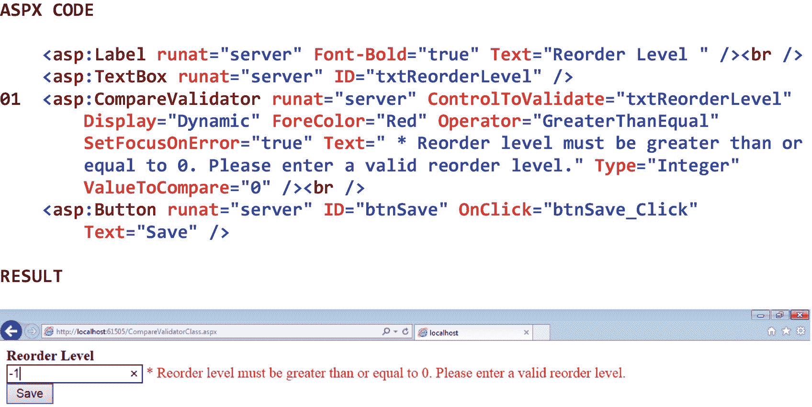

# 五、数据验证控件

## 5.1 简介

数据验证控制确保坏数据不会进入软件系统。如果我们允许坏的数据进入系统，我们就会得到坏的 T2 信息。这反映了一个古老的原则:垃圾进，垃圾出(GIGO)。只允许好的数据进入软件系统的重要性在于，好的数据导致好的信息，好的信息导致好的决策，而好的决策导致组织的稳定性(在非盈利环境中)或竞争优势(在盈利环境中)。

我们在上一章中讨论的几个图形用户界面(GUI)控件(例如，日历控件、复选框控件、下拉列表控件)可以帮助我们确保只允许好的数据进入 ASP.NET Web 应用。通过要求最终用户使用 GUI 控件选择输入(与要求他或她将数据键入文本框或类似控件相反)，与拼写错误、格式不正确等相关联的问题显著减少。

然而，有时数据*必须*手动输入文本框或类似控件。在这种情况下，我们需要在数据被处理和/或存储到系统之前对其进行验证。这种验证包括存在性检查(例如，确保输入了顾客的姓氏)、数据类型检查(例如，确保货币值仅包含数字)、合理性检查(例如，确保患者的血压读数有意义)、范围检查(例如，确保折扣率落在有效范围内)、格式检查(例如，确保电子邮件地址的格式正确)、组合检查(例如，确保怀孕患者的性别是女性)、以及自检数字检查(例如，确保信用好消息是我们可以使用。NET Framework 类库来执行所有这些类型的检查。

本章中描述的验证操作可以在客户端(只要使用的浏览器启用了脚本)或服务器上执行。 [1](#Fn1) 当要在客户端执行验证时(像本章中的大多数例子一样)，JavaScript 验证代码在服务器上生成，嵌入到相关页面的 HTML 代码中，通过 HTTP 响应返回给客户端，并在浏览器中执行。在这个场景中，Web 应用的效率要高得多，因为任何最终用户的输入都必须在页面被发送回服务器进行进一步处理之前通过浏览器端的验证*。*

在本章中，我们将从安装*脚本管理器*包开始。这个包提供了使用我们将要讨论的验证器类验证数据所需的 jQuery(即 JavaScript)脚本。接下来，我们将看看 BaseValidator 类。这个类是我们将要讨论的所有验证器类的基类，所以熟悉它的属性、方法和事件是很重要的。然后我们将讨论 RequiredFieldValidator 类，它确保文本已经输入到 TextBox 控件或 FileUpload 控件中，或者这些控件之一中的文本已经从某个指定的初始值更改。该类还确保已从 DropDownList 控件、ListBox 控件或 RadioButtonList 控件中进行了选择，或者该选择已从某个指定的初始值更改。之后，我们将考虑 CompareValidator 类。这个类将输入到一个输入控件(例如，一个文本框控件)中的值与输入到另一个输入控件中的值进行比较。该类还将输入到输入控件中的值与常数(例如，零)进行比较，或者确保输入到输入控件中的值是特定类型的(例如，日期)。接下来，我们将查看 RangeValidator 类，它确保输入到输入控件(例如，TextBox 控件)中的值在可接受的值范围内。然后我们将讨论 RegularExpressionValidator 类。该类确保输入到输入控件(例如，文本框控件)中的值与某个预定义的模式相匹配。之后，我们将考虑 CustomValidator 类，它确保输入到输入控件(例如，TextBox 控件)中的值通过一些自定义的验证标准。最后，我们将看看 ValidationSummary 类。该类显示 ASP.NET 网页上发生的所有验证错误的摘要。

## 5.2 脚本管理器包

在本章描述的验证器类工作之前，我们必须添加一个名为 *AspNet 的 *NuGet 包*。ScriptManager.jQuery* 。安装这个包使得使用验证器类验证数据所需的 jQuery(即 JavaScript)脚本可用。如果蜘蛛网。如果没有安装 ScriptManager.jQuery 包，当页面试图验证数据时将会出错。安装 AspNet。ScriptManager.jQuery 包

1.  打开解决方案资源管理器。

2.  右键单击该项目。

3.  选择*管理 NuGet 包…* 。

4.  搜索 AspNet.ScriptManager.jQuery。

5.  选择 *AspNet。ScriptManager.jQuery* 。

6.  点击*安装*。

7.  当要求查看对项目的更改时，单击 *OK* 。

8.  关闭 NuGet 包管理器。

一旦这个过程完成，注意一个脚本文件夹已经被添加到项目中。该文件夹包含使用验证器类验证数据所需的 jQuery 脚本。

## 5.3 BaseValidator 类

BaseValidator 类充当所有验证程序类的基类。因此，所有验证器类都继承了这个类的属性、方法和事件。验证器类包括 RequiredFieldValidator 类、CompareValidator 类、RangeValidator 类、RegularExpressionValidator 类、CustomValidator 类和 ValidationSummary 类。当我们单独考虑这些验证器类时，请记住，可以使用多个验证控件来验证单个输入控件中的数据。这允许我们根据不止一个标准来验证单个最终用户的输入。

表 [5-1](#Tab1) 显示了 BaseValidator 类的一些属性、方法和事件。请注意表中 BaseValidator 类的 Display 属性。此属性指示验证控件中错误信息的显示行为。当该属性设置为 *None* 时，生成的验证消息不会显示在网页中。当属性设置为*静态*时，即使没有生成验证消息，也会在网页中留出验证消息的空间。当属性设置为 *Dynamic* 时，验证消息的空间将*而不是*在网页中留出，而是在生成验证消息时添加到页面中。

表 5-1

BaseValidator 类的一些属性、方法和事件

<colgroup><col class="tcol1 align-left"> <col class="tcol2 align-left"></colgroup> 
| **类**base validatorT3】2T5】 |
| **命名空间**系统。网页控件 |
| **属性** |
| 件实 | 获取或设置要验证的输入控件。 |
| 显示 | 获取或设置验证控件中错误信息的显示行为。 |
| 出错信息 | 获取或设置验证失败时在 ValidationSummary 控件中显示的错误信息的文本。 |
| IsValid | 获取或设置一个值，该值指示关联的输入控件是否通过验证。 |
| SetFocusOnError | 获取或设置一个值，该值指示当验证失败时，焦点是否设置到由 ControlToValidate 属性指定的控件。 |
| 文本 | 获取或设置验证失败时显示在验证控件中的文本。 |
| 验证组 | 获取或设置此验证控件所属的验证组的名称。 |
| **方法** |
| (参见参考文献。) |   |
| **事件** |
| (参见参考文献。) |   |
| **参考** |
| [T2`https://msdn.microsoft.com/en-us/library/system.web.ui.webcontrols.basevalidator(v=vs.110).aspx`](https://msdn.microsoft.com/en-us/library/system.web.ui.webcontrols.basevalidator%2528v%253Dvs.110%2529.aspx) |

## 5.4 RequiredFieldValidator 类

RequiredFieldValidator 类确保文本已输入到 TextBox 控件或 FileUpload 控件中，或者这些控件之一中的文本已从某个指定的初始值更改。它还确保已经从 DropDownList 控件、ListBox 控件或 RadioButtonList 控件中进行了选择，或者该选择已经从某个指定的初始值进行了更改。RequiredFieldValidator 控件的 InitialValue 属性表示我们不想让最终用户在输入控件中输入或选择的文本或选择。因此，当输入控件包含与其关联的 RequiredFieldValidator 控件的 InitialValue 属性相同的值时，将显示一条错误信息。默认情况下，TextBox 控件的初始值为空。表 [5-2](#Tab2) 显示了 RequiredFieldValidator 类的一些属性、方法和事件。

表 5-2

RequiredFieldValidator 类的一些属性、方法和事件

<colgroup><col class="tcol1 align-left"> <col class="tcol2 align-left"></colgroup> 
| **类**required field validatorT3】3T5】 |
| **命名空间**系统。网页控件 |
| **属性** |
| 初始值 | 获取或设置关联输入控件的初始值。 |
| **方法** |
| (参见参考文献。) |   |
| **事件** |
| (参见参考文献。) |   |
| **参考** |
| [T2`https://msdn.microsoft.com/en-us/library/system.web.ui.webcontrols.requiredfieldvalidator(v=vs.110).aspx`](https://msdn.microsoft.com/en-us/library/system.web.ui.webcontrols.requiredfieldvalidator%2528v%253Dvs.110%2529.aspx) |

图 5-1 显示了一个 RequiredFieldValidator 类的例子。

请注意 01 处的 RequiredFieldValidator 控件及其关联属性。可以看到，控件的 ControlToValidate 属性被设置为 *txtPrice* ，它标识要验证的 TextBox 控件。注意，控件的显示属性被设置为*动态*。这表明验证消息的空间将*而不是*在网页中留出，而是仅在生成控件的验证消息时添加到页面中。还要注意控件的 SetFocusOnError 属性被设置为 *true* 。因此，当验证失败时，页面的焦点将被设置为关联的文本框，以便最终用户更容易纠正问题。最后，请注意控件的 Text 属性，该属性包含验证失败时将显示的错误信息。

图中结果部分的截屏显示了点击*保存*按钮而没有在网页上的价格字段中输入任何内容的结果。请注意，错误消息描述了问题的性质以及最终用户必须采取的纠正措施。

图 5-1

RequiredFieldValidator 类的示例

## 5.5 比较验证器类

CompareValidator 类将输入到一个输入控件(例如，TextBox 控件)中的值与输入到第二个输入控件中的值进行比较。它还将输入到输入控件中的值与常数(例如，零)进行比较，或者确保输入到输入控件中的值是特定类型的(例如，日期)。CompareValidator 控件的 ControlToCompare 属性指示要与正在验证的输入控件进行比较的输入控件。Operator 属性表示要执行的比较运算的*类型*(即等于、不等于、大于、大于等于、小于、小于等于或数据类型检查)。Type 属性表示被比较的值的*种类*(即货币、日期、双精度、整数或字符串)。ValueToCompare 属性指示要与被验证的输入控件进行比较的值。当 CompareValidator 控件的关联输入控件中的值没有通过在控件的 Operator 属性*和*control to compare 属性或 ValueToCompare 属性中指定的验证条件时，该控件将显示一条错误消息。请注意，如果与 CompareValidator 控件关联的输入控件为空，则不会发生任何验证，验证将被视为成功，并且不会显示任何消息。因此，如果让关联的输入控件为空是不可接受的，我们必须将 CompareValidator 控件与 RequiredFieldValidator 控件配对。表 [5-3](#Tab3) 显示了 CompareValidator 类的一些属性、方法和事件。

表 5-3

CompareValidator 类的一些属性、方法和事件

<colgroup><col class="tcol1 align-left"> <col class="tcol2 align-left"></colgroup> 
| **级**比较器T3】4T5】 |
| **命名空间**系统。网页控件 |
| **属性** |
| 或指定控件 | 获取或设置要与正在验证的输入控件进行比较的输入控件。 |
| 操作员 | 获取或设置要执行的比较操作。 |
| 类型 | 获取或设置数据类型，在进行比较之前，要比较的值将转换为该数据类型。(继承自 BaseCompareValidator。) |
| 比较值 | 获取或设置一个常数值，以便与用户在正在验证的输入控件中输入的值进行比较。 |
| **方法** |
| (参见参考文献。) |   |
| **事件** |
| (参见参考文献。) |   |
| **参考** |
| [T2`https://msdn.microsoft.com/en-us/library/system.web.ui.webcontrols.comparevalidator(v=vs.110).aspx`](https://msdn.microsoft.com/en-us/library/system.web.ui.webcontrols.comparevalidator%2528v%253Dvs.110%2529.aspx) |

图 [5-2](#Fig2) 显示了 CompareValidator 类的一个例子。

请注意 01 处的 CompareValidator 控件及其关联属性。可以看到，控件的 ControlToValidate 属性被设置为 *txtReorderLevel* ，它标识要验证的 TextBox 控件。注意，控件的显示属性被设置为*动态*。这表明验证消息的空间将*而不是*在网页中留出，而是仅在生成控件的验证消息时添加到页面中。还要注意控件的 SetFocusOnError 属性被设置为 *true* 。因此，当验证失败时，页面的焦点将被设置为关联的文本框，以便最终用户更容易纠正问题。还要注意控件的 Text 属性，该属性包含验证失败时将显示的错误信息。最后，注意控件的 Operator 属性被设置为 *GreaterThanEqual* ，控件的 Type 属性被设置为 *Integer* ，控件的 ValueToCompare 属性被设置为 *0* 。因此，为了通过验证，在执行整数比较时，关联文本框中的值必须大于或等于零。

图中结果部分的屏幕截图显示了点击*保存*按钮的结果，而没有在网页上的重新订购级别字段中输入有效值。请注意，错误消息描述了问题的性质以及最终用户必须采取的纠正措施。

图 5-2

CompareValidator 类的示例

## 5.6 RangeValidator 类

RangeValidator 类确保输入到输入控件(例如，TextBox 控件)中的值在可接受的值范围内。RangeValidator 控件的 MinimumValue 属性指示可以输入到输入控件中的最小可接受值。MaximumValue 属性表示可以输入到输入控件中的*最大值*可接受值。请注意，可接受的值范围是在 RangeValidator 控件的 MinimumValue 属性和 MaximumValue 属性中指定的值的*和*。Type 属性指示被比较的值的*种类*(即货币、日期、双精度、整数或字符串)。当与其关联的输入控件中的值没有通过在其 MinimumValue 属性、MaximumValue 属性和 Type 属性中指定的验证条件时，RangeValidator 控件将显示一条错误信息。请注意，如果与 RangeValidator 控件关联的输入控件为空，则不会发生任何验证，验证将被视为成功，并且不会显示任何消息。因此，如果将关联的输入控件留空是不可接受的，我们必须将 RangeValidator 控件与 RequiredFieldValidator 控件配对。表 [5-4](#Tab4) 显示了 RangeValidator 类的一些属性、方法和事件。

表 5-4

RangeValidator 类的一些属性、方法和事件

<colgroup><col class="tcol1 align-left"> <col class="tcol2 align-left"></colgroup> 
| **类**range validatorT3】5T5】 |
| **命名空间**系统。网页控件 |
| **属性** |
| 最大值 | 获取或设置验证范围的最大值。 |
| 最小值 | 获取或设置验证范围的最小值。 |
| 类型 | 获取或设置数据类型，在进行比较之前，要比较的值将转换为该数据类型。(继承自 BaseCompareValidator。) |
| **方法** |
| (参见参考文献。) |   |
| **事件** |
| (参见参考文献。) |   |
| **参考** |
| [T2`https://msdn.microsoft.com/en-us/library/system.web.ui.webcontrols.rangevalidator(v=vs.110).aspx`](https://msdn.microsoft.com/en-us/library/system.web.ui.webcontrols.rangevalidator%2528v%253Dvs.110%2529.aspx) |

图 5-3 显示了一个 RangeValidator 类的例子。

请注意 01 处的 RangeValidator 控件及其关联属性。可以看到，控件的 ControlToValidate 属性被设置为 *txtReorderLevel* ，它标识要验证的 TextBox 控件。注意，控件的显示属性被设置为*动态*。这表明验证消息的空间将*而不是*在网页中留出，而是仅在生成控件的验证消息时添加到页面中。还要注意控件的 SetFocusOnError 属性被设置为 *true* 。因此，当验证失败时，页面的焦点将被设置为关联的文本框，以便最终用户更容易纠正问题。还要注意控件的 Text 属性，该属性包含验证失败时将显示的错误信息。最后，注意控件的 MinimumValue 属性被设置为 *0* ，控件的 MaximumValue 属性被设置为 *10* ，控件的 Type 属性被设置为 *Integer* 。因此，要通过验证，关联文本框中的值必须是 0 到 10 之间的整数，包括 0 和 10。

图中 Result 部分的屏幕截图显示了单击 Save 按钮而没有在网页上的 Reorder Level 字段中输入有效值的结果。请注意，错误消息描述了问题的性质以及最终用户必须采取的纠正措施。

图 5-3

RangeValidator 类的示例

## 5.7 regular expr recessionalidator 类

RegularExpressionValidator 类确保输入到输入控件(例如，TextBox 控件)中的值与正则表达式定义的模式相匹配。当我们想检查输入控件中可预测的字符序列时，这个类很有用，就像在邮政编码、电话号码和电子邮件地址中发现的那样。RegularExpressionValidator 控件的 ValidationExpression 属性指示要匹配的正则表达式。当 RegularExpressionValidator 控件的关联输入控件中的值与该控件的 ValidationExpression 属性中指定的模式不匹配时，该控件将显示一条错误信息。请注意，如果与 RegularExpressionValidator 控件关联的输入控件为空，则不会发生任何验证，验证将被视为成功，并且不会显示任何消息。因此，如果将关联的输入控件留空是不可接受的，我们必须将 RegularExpressionValidator 控件与 RequiredFieldValidator 控件配对。表 [5-5](#Tab5) 显示了 RegularExpressionValidator 类的一些属性、方法和事件。

表 5-5

RegularExpressionValidator 类的一些属性、方法和事件

<colgroup><col class="tcol1 align-left"> <col class="tcol2 align-left"></colgroup> 
| **类**正则表达式验证器T3】6T5】 |
| **命名空间**系统。网页控件 |
| **属性** |
| 验证表达式 | 获取或设置确定用于验证字段的模式的正则表达式。 |
| **方法** |
| (参见参考文献。) |   |
| **事件** |
| (参见参考文献。) |   |
| **参考** |
| [T2`https://msdn.microsoft.com/en-us/library/system.web.ui.webcontrols.regularexpressionvalidator(v=vs.110).aspx`](https://msdn.microsoft.com/en-us/library/system.web.ui.webcontrols.regularexpressionvalidator%2528v%253Dvs.110%2529.aspx) |

表 [5-6](#Tab6) 显示了一些。NET 正则表达式。这些表达式可以单独使用，也可以组合起来形成更复杂的验证表达式。

表 5-6

一些。NET 正则表达式

<colgroup><col class="tcol1 align-left"> <col class="tcol2 align-left"></colgroup> 
| 

表示

 | 

描述

 |
| --- | --- |
| [设置] | 匹配集合中的任何字符。 |
| [^set] | 匹配不在集合中的任何字符。 |
| [a–z] | 匹配 a-z 范围内的任何字符。 |
| [^a–z] | 匹配不在 a-z 范围内的任何字符。 |
| \ | 匹配后面的字符。 |
| \w | 匹配任何单词字符。 |
| \W | 匹配任何非单词字符。 |
| \d | 匹配任何十进制数字。 |
| \D | 匹配任何非十进制数字。 |
| \s | 匹配任何空白字符。 |
| \S | 匹配任何非空白字符。 |
| * | 匹配前面的项目 0 次或更多次。 |
| + | 匹配前面的项目 1 次或多次。 |
| ？ | 匹配前一项 0 或 1 次。 |
| { *n* } | 与前一项精确匹配 n 次。 |
| { *n，* } | 匹配前面的项目至少 n 次。 |
| { *n，m* } | 匹配前一项 n 到 m 次。 |
| **参考** |
| [T2`https://msdn.microsoft.com/en-us/library/az24scfc(v=vs.110).aspx`](https://msdn.microsoft.com/en-us/library/az24scfc%2528v%253Dvs.110%2529.aspx) |

图 5-4 显示了一个正则表达式验证器类的例子。注意图中 RegularExpressionValidator 控件的显示属性被设置为*动态*。这表明验证消息的空间将*而不是*在网页中留出，而是仅在生成给定控件的验证消息时添加到页面中。还要注意控件的 SetFocusOnError 属性被设置为 *true* 。因此，当特定的验证失败时，页面的焦点将被设置到相关的文本框，以便最终用户更容易纠正问题。还要注意包含验证失败时将显示的错误信息的控件的文本属性。

请注意 01 处的第一个 RegularExpressionValidator 控件及其关联属性。可以看到，控件的 ControlToValidate 属性被设置为 *txtZipCode* ，它标识要验证的 TextBox 控件。还要注意，控件的 ValidationExpression 属性被设置为 *\d{5}* 。因此，为了通过验证，关联文本框中的值必须正好包含五个十进制数字。

请注意 02 处的第二个 RegularExpressionValidator 控件及其关联属性。可以看到，控件的 ControlToValidate 属性被设置为 *txtPhone* ，它标识要验证的 TextBox 控件。还要注意，控件的 ValidationExpression 属性被设置为 *\d{3}\-\d{3}\-\d{4}* 。因此，要通过验证，关联文本框中的值必须正好包含三位数字，后跟一个破折号，再后跟三位数字，再后跟一个破折号，再后跟四位数字。

请注意 03 处的第三个 RegularExpressionValidator 控件及其关联属性。可以看到，控件的 ControlToValidate 属性被设置为 *txtEmailAddress* ，它标识要验证的 TextBox 控件。还要注意控件的 ValidationExpression 属性被设置为 *\S+\@\S+\。\S+* 。因此，为了通过验证，相关文本框中的值必须包含任何非空白字符(一次或多次)，后跟一个位于的*符号，后跟任何非空白字符(一次或多次)，再后跟一个句点，再后跟任何非空白字符(一次或多次)。请注意，这是一个相对原始的电子邮件地址模式检查，更复杂的模式检查是可能的。*

请注意 04 处的第四个 RegularExpressionValidator 控件及其关联属性。可以看到，控件的 ControlToValidate 属性被设置为 *txtPassword* ，它标识要验证的 TextBox 控件。还要注意，控件的 ValidationExpression 属性被设置为 *\S{5，10}* 。因此，为了通过验证，关联文本框中的值必须包含任何非空白字符(五到十次)。

图中 Result 部分的屏幕截图显示了单击 Save 按钮而没有在网页上的字段中输入任何有效值的结果。请注意，所有错误消息都描述了问题的性质以及最终用户必须采取的纠正措施。

 

图 5-4

正则表达式验证器类的示例

## 5.8 CustomValidator 类

CustomValidator 类确保输入到输入控件(例如，TextBox 控件)中的值通过一些自定义的验证标准。当其他验证控件都不能满足我们的需求时，这个类很有帮助。我们可以定义一个 CustomValidator 控件，通过在我们的。或者我们可以通过在我们的代码隐藏文件中编写 C# 代码来定义一个在*服务器*上执行的 CustomValidator 控件。 [7](#Fn7) 前者在我们希望在允许页面回发到服务器之前对输入控件*执行验证时很有用。当我们想要在页面被回发到服务器时对输入控件*执行验证时，后者是很有用的，比如当我们需要执行数据库查询来进行验证时。CustomValidator 控件的 ClientValidationFunction 属性表示用于执行客户端验证的 JavaScript 函数的名称。ServerValidate 方法包含用于执行服务器端验证的 C# 验证代码。当 CustomValidator 控件的关联输入控件中的值没有通过自定义的验证条件时，该控件会显示一条错误信息。请注意，如果与 CustomValidator 控件关联的输入控件为空，则不会发生任何验证，验证将被视为成功，并且不会显示任何消息。因此，如果将关联的输入控件留空是不可接受的，我们必须将 CustomValidator 控件与 RequiredFieldValidator 控件配对。表 [5-7](#Tab7) 显示了 CustomValidator 类的一些属性、方法和事件。**

表 5-7

CustomValidator 类的一些属性、方法和事件

<colgroup><col class="tcol1 align-left"> <col class="tcol2 align-left"></colgroup> 
| **Class**custom validatorT3】8T5】 |
| **命名空间**系统。网页控件 |
| **属性** |
| 客户端验证功能 | 获取或设置用于验证的自定义客户端脚本函数的名称。 |
| validataemptytext | 获取或设置一个布尔值，该值指示是否应验证空文本。 |
| **方法** |
| (参见参考文献。) |   |
| **事件** |
| 服务器验证 | 在服务器上执行验证时发生。 |
| **参考** |
| [T2`https://msdn.microsoft.com/en-us/library/system.web.ui.webcontrols.customvalidator(v=vs.110).aspx`](https://msdn.microsoft.com/en-us/library/system.web.ui.webcontrols.customvalidator%2528v%253Dvs.110%2529.aspx) |

图 [5-5](#Fig5) 显示了一个 CustomValidator 类的例子。

请注意 01 处的 CustomValidator 控件及其关联属性。可以看到，控件的 ID 属性被设置为 *cuvCategory* 。我们必须给这个控件一个 ID，因为我们将在后面的代码中引用它。我们还可以看到控件的 ControlToValidate 属性被设置为 *txtCategory* ，它标识了要验证的 TextBox 控件。注意，控件的显示属性被设置为*动态*。这表明验证消息的空间将*而不是*在网页中留出，而是仅在生成控件的验证消息时添加到页面中。另请注意，控件的 OnServerValidate 属性设置为 cuvCategory_ServerValidate，这是引发 ServerValidate 事件时将执行的事件处理程序方法的名称。还要注意控件的 SetFocusOnError 属性被设置为 *true* 。因此，当验证失败时，页面的焦点将被设置为关联的文本框，以便最终用户更容易纠正问题。最后，请注意控件的 Text 属性，该属性包含验证失败时将显示的错误信息。

请注意 02 处的验证事件处理程序方法，该方法将在页面回发到服务器时执行。还要注意作为参数传递给该事件处理程序方法的 ServerValidateEventArgs 对象(及其别名 Args)。该对象为 ServerValidate 事件处理程序方法提供数据。ServerValidateEventArgs 对象的 Value 属性包含从输入控件传递来的要验证的字符串，并且 ServerValidateEventArgs 对象的 IsValid 属性被设置为指示验证的结果。

请注意，在 03，我们正在测试 ServerValidateEventArgs 对象的 Value 属性，以获得有效的输入值— *服装*、*鞋类*或*配饰*。如果输入值是其中之一，ServerValidateEventArgs 对象的 IsValid 属性将被设置为 *true* ，并且不会显示错误消息。如果输入值不是其中之一，ServerValidateEventArgs 对象的 IsValid 属性将被设置为 *false* ，并显示错误消息。

图中 Result 部分的屏幕截图显示了单击 Save 按钮而没有在网页上的 Category 字段中输入有效值的结果。请注意，错误消息描述了问题的性质以及最终用户必须采取的纠正措施。

图 5-5

CustomValidator 类的示例

## 5.9 验证摘要类

ValidationSummary 类显示网页上发生的验证错误的摘要。ValidationSummary 控件可以在页面本身中显示验证错误，也可以在单独的消息框中显示验证错误。当我们想在一个位置显示所有的验证错误时，ValidationSummary 控件很有用。ValidationSummary 控件的 DisplayMode 属性指示验证摘要是以列表、项目符号列表还是段落的形式显示。HeaderText 属性指示要在验证摘要顶部显示的文本。ShowMessageBox 属性指示验证摘要是否显示在独立于页面本身的消息框中。ShowSummary 属性指示验证摘要是否显示在页面本身中。ShowValidationErrors 属性指示是否显示验证摘要。而 ValidationGroup 属性指示与验证摘要相关联的控件组。该属性允许我们将一组验证控件与一个验证摘要相关联，将另一组验证控件与另一个验证摘要相关联。表 [5-8](#Tab8) 显示了 ValidationSummary 类的一些属性、方法和事件。

表 5-8

ValidationSummary 类的一些属性、方法和事件

<colgroup><col class="tcol1 align-left"> <col class="tcol2 align-left"></colgroup> 
| **类**验证概要T3】10T5】 |
| **命名空间**系统。网页控件 |
| **属性** |
| 显示模式 | 获取或设置验证摘要的显示模式。 |
| 标头文字 | 获取或设置显示在摘要顶部的标题文本。 |
| ShowMessageBox | 获取或设置一个值，该值指示验证摘要是否显示在消息框中。 |
| 显示摘要 | 获取或设置一个值，该值指示验证摘要是否以内联方式显示。 |
| ShowValidationErrors | 获取或设置一个值，该值指定是否应显示来自验证程序控件的验证摘要。 |
| 验证组 | 获取或设置 ValidationSummary 对象为其显示验证消息的控件组。 |
| **方法** |
| (参见参考文献。) |   |
| **事件** |
| (参见参考文献。) |   |
| **参考** |
| [T2`https://msdn.microsoft.com/en-us/library/system.web.ui.webcontrols.validationsummary(v=vs.110).aspx`](https://msdn.microsoft.com/en-us/library/system.web.ui.webcontrols.validationsummary%2528v%253Dvs.110%2529.aspx) |

图 [5-6](#Fig6) 显示了 ValidationSummary 类的一个例子。

请注意，在 01 处，已经设置了 RequiredFieldValidator 控件的 ErrorMessage 属性*和*Text 属性。ErrorMessage 属性指示将在 ValidationSummary 控件中显示的消息，而 Text 属性指示将在 RequiredFieldValidator 控件本身中显示的消息。因此，当验证错误发生时，错误消息将显示在验证摘要中，星号()将直接显示在邮政编码文本框的旁边。这种模式同样适用于 02、03 和 04 的验证器控件。

请注意 05 处的 ValidationSummary 控件及其相关属性。可以看到，控件的 DisplayMode 属性被设置为 *BulletedList* ，HeaderText 属性包含关于已经发生的事情和应该做什么的信息，ShowMessageBox 属性被设置为 *false* ，ShowSummary 属性被设置为 *true* 。

图中 Result 部分的第一个屏幕截图显示了单击 Save 按钮而没有在 Web 页面的字段中输入有效值的结果。在本例中，控件的 ShowMessageBox 属性设置为 *false* ，ShowSummary 属性设置为 *true* 。因此，验证摘要显示在页面本身中。第二个屏幕截图还显示了单击 Save 按钮而没有在网页上的字段中输入有效值的结果。在本例中，控件的 ShowMessageBox 属性设置为 *true* ，ShowSummary 属性设置为 *false* 。因此，验证摘要显示在独立于页面的消息框中。 [11](#Fn11) 请注意，屏幕截图中的错误消息描述了页面上问题的性质以及最终用户必须采取的纠正措施。

 

图 5-6

ValidationSummary 类的示例

<aside aria-label="Footnotes" class="FootnoteSection" epub:type="footnotes">Footnotes [1](#Fn1_source)

当带有验证控件的页面回发到服务器时，验证也在服务器上执行，即使所有验证操作都在客户端通过。这可以防止最终用户通过在其浏览器中禁用脚本代码执行来绕过验证。

  [2](#Fn2_source)

所有属性、方法和事件描述都直接取自微软的官方文档。为了节省空间，省略了用于处理该类事件的事件处理程序方法。有关该类的所有方法，请参见参考。

  [3](#Fn3_source)

所有属性、方法和事件描述都直接取自微软的官方文档。为了节省空间，省略了用于处理该类事件的事件处理程序方法。有关该类的所有方法，请参见参考。

  [4](#Fn4_source)

所有属性、方法和事件描述都直接取自微软的官方文档。为了节省空间，省略了用于处理该类事件的事件处理程序方法。有关该类的所有方法，请参见参考。

  [5](#Fn5_source)

所有属性、方法和事件描述都直接取自微软的官方文档。为了节省空间，省略了用于处理该类事件的事件处理程序方法。有关该类的所有方法，请参见参考。

  [6](#Fn6_source)

所有属性、方法和事件描述都直接取自微软的官方文档。为了节省空间，省略了用于处理该类事件的事件处理程序方法。有关该类的所有方法，请参见参考。

  [7](#Fn7_source)

我们将在本书的后面学习 JavaScript。

  [8](#Fn8_source)

所有属性、方法和事件描述都直接取自微软的官方文档。为了节省空间，省略了用于处理该类事件的事件处理程序方法。有关该类的所有方法，请参见参考。

  [9](#Fn9_source)

它也可以在两者中显示验证错误。

  [10](#Fn10_source)

所有属性、方法和事件描述都直接取自微软的官方文档。为了节省空间，省略了用于处理该类事件的事件处理程序方法。有关该类的所有方法，请参见参考。

  [11](#Fn11_source)

当在后台代码中验证数据时(例如，当使用 CustomValidator 控件在服务器上执行数据验证时)，不能在消息框中显示错误，因为消息框是通过 JavaScript 在客户端显示的。但是，它们可以显示在页面本身中。

 </aside>