# 六、赋值操作

## 6.1 导言

赋值操作在 Page 类的代码中设置变量、常量或其他项的值。赋值语句是计算机编程的基础，以至于每一种过程式/命令式编程语言都需要这样的语句——不管它的语法如何。C# 编程语言中赋值语句的一般语法是

```cs
Operand1 Operator Operand2;

```

其中 Operand1 是变量、常数或其他项，Operator 是等号(=)或其他赋值运算符，Operand2 是要赋给 Operand1 的值(或表达式的结果)。

在这一章中，我们将从类型开始。类型保存一个值或者一个指向内存地址的指针。然后我们将描述如何在 C# 编程语言中声明变量和常量。接下来，我们将讨论不同类型的赋值操作符——简单的和复合的——以及它们的用法。之后，我们将查看枚举，它为我们提供了一种声明和使用相关常量的方法，这些常量可以在后面的代码中赋给变量。最后，我们将讨论异常处理。异常处理为我们提供了一种捕捉代码中的运行时错误并优雅地处理它们的方法。

## 6.2 类型

在。NET 框架中，有两个重要的*类型* — *值类型*和*引用类型*。值类型保存一个*值*(不是一个指向另一个内存地址的指针)，它有一个设定的内存分配大小。例如，字节变量是一种值类型，在内存中只分配一个字节，可以包含 0 到 255 之间的任何正整数。另一方面，引用类型持有一个指向另一个内存地址(不是一个值)的*指针*，该内存地址没有*或*设置的内存分配大小。例如，字符串变量是一种引用类型，可以根据字符串的内容分配不同数量的内存。

表 [6-1](#Tab1) 显示了的一些类型。NET Framework 及其等效的泛型 C# 类型和代码前缀。在本书中，我们的标准将是使用。NET 类型形式(例如，Boolean、Int16、string ),与声明程序变量和常量时的一般 C# 类型形式(例如，bool、short、String)相反，即使相应的类型是等效的。此外，我们的标准将是所有变量和常数以表中所示的三个字母前缀开始。请记住，这些特定的标准并不是所有软件开发组织都通用的。然而，采用这样的标准对于良好的代码质量是必不可少的。

请注意，表中的所有类型都是值类型，只有字符串类型除外，它是一种引用类型。可以看出，字符串类型描述为*不可变*(即不可改变)和*定长*。这是因为在 C# 中修改一个字符串的结果是在内存中创建一个新的*字符串——而不是修改一个现有的字符串。字符串类型的最大长度约为十亿个字符。字符串类型也被描述为由 *Unicode 字符*组成的字符串。String 类型将文本表示为一系列的 *UTF-16* (16 位 Unicode 转换格式)*代码单元*，其中一个代码单元是两个字节。UTF-16 使用一个*或*两个代码单元来表示多达 1114112 个可能的 Unicode *代码点*，其中代码点是一个表示一个 Unicode 字符的位序列(即 16 位*或* 32 位)。尽管对 UTF-16 的全面讨论超出了本书的范围，但要记住的重要一点是，*一些* Unicode 字符使用 16 位表示，而*其他* Unicode 字符使用 32 位表示。例如，使用位模式表示 Unicode 字符“A”*

```cs
0000000001000001 (i.e., hexadecimal 0041)

```

因此，英文字母“A”需要*一个* 16 位代码单元。事实上，组成英语的所有字符都用一个 16 位代码单元表示，并由一个 Char 对象引用。

另一方面，Unicode 字符“”使用位模式来表示

```cs
00000000000000010011000011100001 (i.e., hexadecimal 000130E1 surrogate pair)

```

因此，埃及象形文字“”需要*两个* 16 位代码单位。由于 UTF-16 编码只有 16 位，需要 16 位以上的字符用 UTF-16 *代理对*来表示，就像前面的文本所示。因此，我们必须记住，一个 Unicode 字符可能需要被多个 Char 对象引用。请记住，新字符一直在添加到 Unicode 字符集，因此 Unicode 字符集应该被视为一项正在进行的工作。

表 6-1

的一些类型。NET Framework 及其等效的泛型 C# 类型和代码前缀

<colgroup><col class="tcol1 align-left"> <col class="tcol2 align-left"> <col class="tcol3 align-left"> <col class="tcol4 align-left"></colgroup> 
| 

。网络类型

 | 

C# 类型

 | 

前缀

 | 

描述

 |
| --- | --- | --- | --- |
| 布尔代数学体系的 | 弯曲件 | 嘘 | 一个布尔值(真或假)。 |
| 字节 | 字节 | 字节 | 一个 8 位无符号整数。 |
| 茶 | 茶 | 茶 | Unicode (16 位)字符。 |
| 小数 | 小数 | 十二月 | 十进制(128 位)值。 |
| 两倍 | 两倍 | 双线 | 双精度(64 位)浮点数。 |
| Int16 | 短的 | i16 | 16 位有符号整数。 |
| Int32 | （同 Internationalorganizations）国际组织 | i32 | 32 位有符号整数。 |
| Int64 | 长的 | i64 | 64 位有符号整数。 |
| SByte(字节) | sbyte(字节) | 苏西洛 | 一个 8 位有符号整数。 |
| 单一的 | 漂浮物 | 犯罪 | 单精度(32 位)浮点数。 |
| 线 | 线 | 潜艇用热中子反应堆（submarine thermal reactor 的缩写） | 不可变的固定长度 Unicode 字符串。 |
| UInt16 | 乌肖特 | u16 | 16 位无符号整数。 |
| UInt32 | 无符号整型 | u32 | 32 位无符号整数。 |
| UInt64 | 乌龙！乌龙 | u64 | 64 位无符号整数。 |

## 6.3 变量声明

为了在 C# 编程语言中声明一个变量，我们定义它的类型(例如，Boolean、Int16、String ),然后根据前面讨论的标识符命名标准给它命名。我们也可以给变量一个初始值——只要这个值在该类型允许值的*域*内。在一些编程语言中，当变量被声明时，变量*的值不会*自动设置为默认值。然而在 C# 中，变量*的值是*在声明变量时自动设置为默认值。因此，如果变量的默认值在逻辑上已经是正确的(即，变量值不需要被初始化为其他值)，则不需要在变量的声明中显式地声明变量的初始值。但是，在变量的声明中显式地声明变量的初始值通常是有用的，这样可以提高代码的清晰度——以防变量的默认初始值不清楚。因此，虽然可能没有必要*这样做，但我们通常会在声明变量时给它赋一个默认值。表 [6-2](#Tab2) 显示了一些。NET 类型及其各自的域和默认值。*

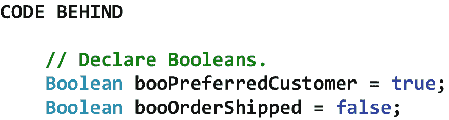

图 6-1

布尔声明的例子

表 6-2

一些。NET 类型及其各自的域和默认值

<colgroup><col class="tcol1 align-left"> <col class="tcol2 align-left"> <col class="tcol3 align-left"></colgroup> 
| 

。网络类型

 | 

领域

 | 

缺省值

 |
| --- | --- | --- |
| 布尔代数学体系的 | 0(假)和 1(真) | 0(假) |
| 字节 | 0 到 255 | Zero |
| 茶 | 文本中使用的任何 Unicode 符号 | ‘\0’ |
| 小数 | 1.0×10e–28 至 7.9 × 10e28 | 0.0 米 |
| 两倍 | –13486232 e308 到 1348623305 | 0.0d |
| Int16 | –32768 至 32767 | Zero |
| Int32 | -2147483648 至 2147483647 | Zero |
| Int64 | -9 223 372 036 854 775 808 至 9 223 372 036 854 775 807 | 0l |
| SByte(字节) | –128 至 127 | Zero |
| 单一的 | –3.402823e38 至 3.402823 e38 | 0.0f |
| 线 | 0 到 1，073，741，824 个字符 | 空 |
| UInt16 | 0 到 65，535 | Zero |
| UInt32 | 0 到 4，294，967，295 | Zero |
| UInt64 | 0 到 18446744073709551615 | Zero |

图 [6-1](#Fig1) 显示了布尔声明的一些例子。

图 [6-2](#Fig2) 显示了一些字符声明的例子。请注意，Char 被视为一个数组，其中的各个字符可以通过索引来访问。

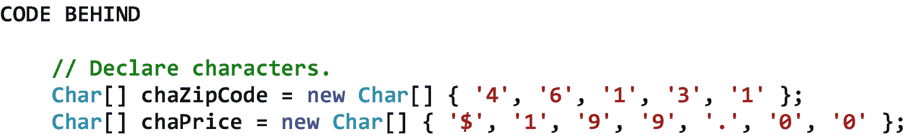

图 6-2

字符声明的例子

图 [6-3](#Fig3) 显示了一些字符串声明的例子

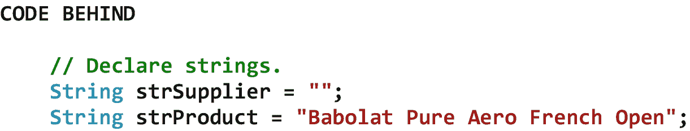

图 6-3

字符串声明的示例

图 [6-4](#Fig4) 显示了一些数字声明的例子。在这些例子中被赋予负数的变量说明它们的类型可以适应符号。

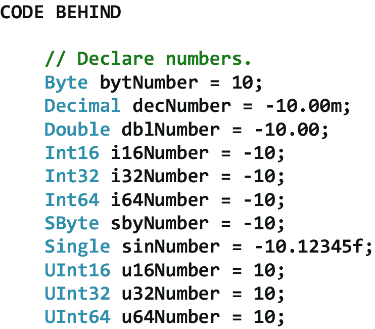

图 6-4

数字声明的示例

## 6.4 常量声明

常量是一个固定值，在程序执行期间*不能*修改。常数可以是值类型(例如，Byte、Decimal、Int32)，也可以是引用类型(例如，String)。常数采用的固定值称为*文字*(例如，31，0.07m，“姓氏:”)。为了在 C# 编程语言中声明一个常量，我们指定单词 *const* ，定义它的类型，然后根据本书前面讨论的标识符命名标准给它命名。接下来，我们给常量赋值。我们可以给常量赋值——只要它在该类型允许值的范围内。图 [6-5](#Fig5) 显示了常量声明的一些例子。

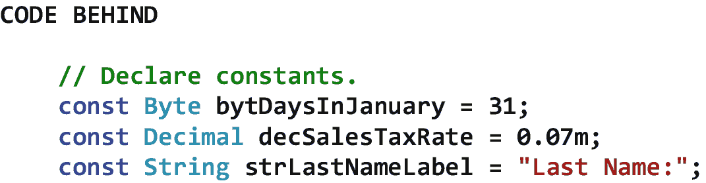

图 6-5

常量声明的示例

## 6.5 赋值运算符

赋值运算符为变量、常数(仅在声明时)或 C# 编程语言中的其他项赋值。回想一下，C# 中赋值语句的一般语法是

```cs
Operand1 Operator Operand2;

```

其中 Operand1 是变量、常数或其他项，Operator 是等号(=)或其他赋值运算符，Operand2 是要赋给 Operand1 的值(或表达式的结果)。

赋值运算符有两种——*简单赋值运算符*和*复合赋值运算符*。一个简单的赋值操作符只是将操作符 2 的值存储在操作符 1 中。另一方面，复合赋值运算符在发生某种算术或逻辑运算后，将运算符 2 的值*存储在运算符 1 中。表 [6-3](#Tab3) 显示了一些常用的赋值操作符，其中操作符 1 是 x，操作符 2 是 y。注意，表中所有的赋值操作符都是复合赋值操作符，除了第一个，它是一个简单的赋值操作符。另外，请注意注释中等价的复合赋值语句。*

表 6-3

一些常用的赋值运算符，其中操作 1 是 x，操作 2 是 y

<colgroup><col class="tcol1 align-left"> <col class="tcol2 align-left"> <col class="tcol3 align-left"></colgroup> 
| 

操作员

 | 

类型

 | 

评论

 |
| --- | --- | --- |
| x = y | 简单分配 |   |
| x += y | 复合赋值 | 相当于 x = x + y。 |
| x -= y | 复合赋值 | 相当于 x = x - y。 |
| x *= y | 复合赋值 | 相当于 x = x * y。 |
| x /= y | 复合赋值 | 相当于 x = x / y。 |
| x %= y | 复合赋值 | 相当于 x = x % y。 |

图 [6-6](#Fig6) 显示了一些简单和复合赋值操作符的例子。

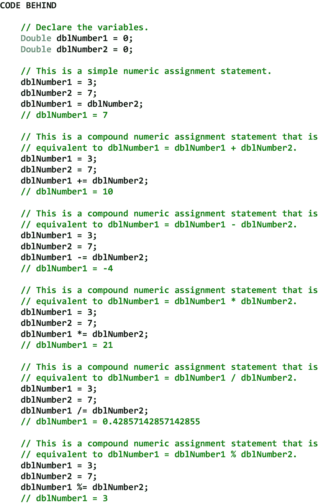

图 6-6

简单和复合赋值运算符的示例

## 6.6 列举

枚举是一组特定类型的名为的*常量。在。NET Framework 中，Enum 类充当所有枚举的基类。枚举提供了一种方法来声明和使用一组与*相关的*常量，这些常量可以赋给代码中的一个变量。例如，由于一周只有七天，其中星期日是第一天，星期一是第二天，依此类推，我们可以创建 Byte 类型的 DayOfWeek 枚举(Int32 是默认的枚举类型)，它允许我们在后面的代码中访问一周中某一天的*值*。图 [6-7](#Fig7) 显示了一个枚举的例子。在本例中，我们有一个 DiscountRate 枚举，它有三个命名的常量—Standard、Select 和 Preferred。这些常量中的每一个都引用一种类型的客户，并且每一个都有特定的贴现率值。*

请注意，在 01 处，枚举是使用 enum 关键字声明的，枚举的名称是 DiscountRate，枚举的类型是 Byte。因此，与每个命名常量相关联的*文字*将是 Byte 类型。

请注意，在 02 处，我们将 bytCustomerDiscountRate 的值设置为 DiscountRate 的值。首选，我们知道是 *30* 。可以看出，我们必须*投*discourte。即使 bytCustomerDiscountRate 已声明为字节类型，也应首选字节类型。铸造将在标题为“转换操作”的第 7 章[中详细讨论](07.html)

请注意，在 03 处，我们将 strCustomerType 的值设置为 DiscountRate。首选，也就是*首选*。可见，DiscountRate 的价值。在将 Preferred 赋值给 strCustomerType 之前，必须将其转换为字符串。

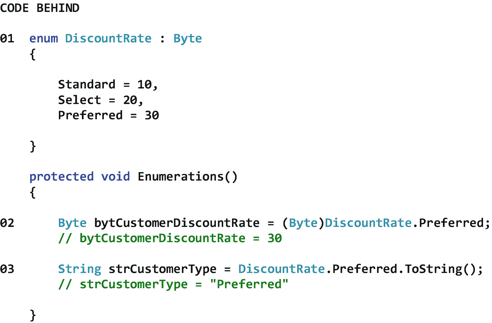

图 6-7

枚举的示例

## 6.7 异常处理

响应于*运行时错误*发生*异常*——在计算机程序执行期间出现的错误。在 C# 中，*异常处理*允许我们检测这些错误并优雅地处理它们。异常处理的优势在于，当运行时错误发生时，我们的 Web 应用不会崩溃(即异常终止)，而是以可预测的专业方式运行。当 Web 应用执行期间发生异常时。NET 公共语言运行时*抛出*指定类型的异常(例如，被零除异常、溢出异常)。在 Visual Studio 中测试代码时，异常会导致显示*异常帮助器*，为我们指出运行时错误的性质。

图 [6-8](#Fig8) 显示了一个异常助手的例子。请注意，在异常助手对话框的最上方，抛出了一个异常，但我们在代码中没有处理它。还要注意，发生的异常类型是被零除异常。


图 6-8

异常助手的示例

## 6.8 异常类别

异常类充当所有异常类的基类。表 [6-4](#Tab4) 显示了异常类的一些属性、方法和事件。请注意类中的 Message 属性。我们很快就会看到，这个属性包含了对程序执行过程中发生的运行时错误的描述。

表 6-4

异常类的一些属性、方法和事件

<colgroup><col class="tcol1 align-left"> <col class="tcol2 align-left"></colgroup> 
| **类**异常<sup>T3】1T5】</sup> |
| **命名空间**系统 |
| **属性** |
| 消息 | 获取描述当前异常的消息。 |
| **方法** |
| (参见参考文献。) |   |
| **事件** |
| (参见参考文献。) |   |
| **参考** |
| [T2`https://msdn.microsoft.com/en-us/library/system.exception(v=vs.113).aspx`](https://msdn.microsoft.com/en-us/library/system.exception%2528v%253Dvs.113%2529.aspx) |

目前有 20 多个异常。NET 公共语言运行时可以抛出，我们可以使用异常类及其子类来处理。表 [6-5](#Tab5) 显示了一些常见的异常以及引发这些异常的条件。

表 6-5

一些常见的异常及其引发的条件

<colgroup><col class="tcol1 align-left"> <col class="tcol2 align-left"></colgroup> 
| 

例外

 | 

情况

 |
| --- | --- |
| DivideByZeroException | 整数或小数除法运算中的分母为零。 |
| 格式异常 | 值的格式不适合通过诸如 Parse 之类的转换方法从字符串转换而来。 |
| IndexOutOfRangeException | 索引超出了数组或集合的界限。 |
| 溢出异常 | 算术、造型或转换操作会导致溢出。 |

正如我们将看到的，异常处理是通过 *Try-Catch-Finally 结构*完成的。在结构的 Try 部分，我们编写了可能导致程序异常的语句。在该结构的 Catch 部分，我们指定了在实际抛出异常时该做什么。在该结构的最后部分，我们指定了无论是否抛出异常都要做什么*。Try-Catch-Finally 结构的 Finally 部分是可选的。*

### 6.8.1 DivideByZeroException 类

顾名思义，当我们试图用一个数学表达式的分母为零来执行整数或小数除法运算时，会抛出一个*除以零异常*。图 [6-9](#Fig9) 显示了一个使用 DivideByZeroException 类来捕捉被零除异常的例子。

请注意，在 01 处，bytDenominator 已被设置为 *0* 以设置我们的被零除异常。

注意 02 处的 Try-Catch-Finally 结构的 Try 部分，它包含将被测试是否有被零除异常的赋值语句。如果没有抛出被零除异常，处理将在除法之后继续，并且消息将被设置为*除法成功*。

注意 03 处的 Try-Catch-Finally 结构的 Catch 部分。结构的这一部分包含一个 DivideByZeroException 对象。我们给这个对象起了个别名“Exception ”,这样我们就可以用速记法来引用这个对象。可以看出，如果抛出除以零异常，消息将被设置为*除法不成功*。此外，描述当前异常的异常对象的 Message 属性将被附加到消息的末尾。

注意 04 处的 Try-Catch-Finally 结构的 Finally 部分。无论是否抛出异常，都将执行这部分结构中的代码。因此，消息将总是以*谢谢*结束。图的底部显示了 Try-Catch-Finally 代码的结果。请注意，因为我们无法在数学表达式的分母中包含零的情况下执行整数或小数除法，所以引发了除以零异常。

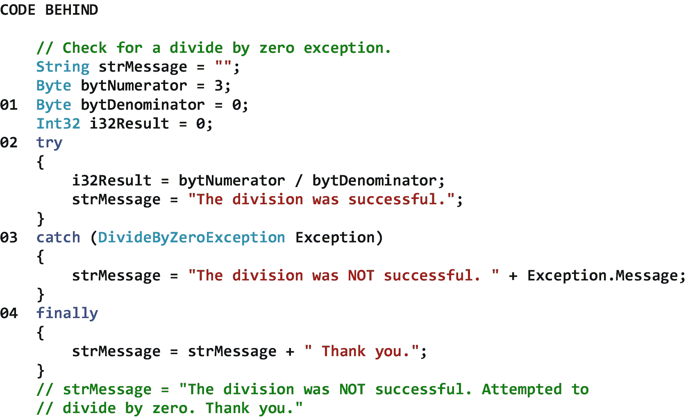

图 6-9

使用 DivideByZeroException 类捕获被零除异常的示例

### 格式异常类

当我们试图将一个格式不合适的字符串值转换为其他类型(如 Boolean、Decimal、Int32)时，会抛出一个*格式异常*。图 [6-10](#Fig10) 显示了一个使用 FormatException 类捕获格式异常的例子。

注意 01 处的 txtNumber。文本(大概是最终用户通过文本框控件输入的)已经被设置为 *abc* 来设置我们的格式异常。

注意 02 处的 Try-Catch-Finally 结构的 Try 部分，它包含将被测试格式异常的赋值语句。如果没有抛出格式异常，转换后处理将继续，消息将设置为*转换成功*。

注意 03 处的 Try-Catch-Finally 结构的 Catch 部分。结构的这一部分包含一个 FormatException 对象。我们给这个对象起了个别名“Exception ”,这样我们就可以用速记法来引用这个对象。可以看出，如果抛出格式异常，消息将被设置为*转换不成功*。此外，描述当前异常的异常对象的 Message 属性将被附加到消息的末尾。

注意 04 处的 Try-Catch-Finally 结构的 Finally 部分。无论是否抛出异常，都将执行这部分结构中的代码。因此，消息将总是以*谢谢*结束。图的底部显示了 Try-Catch-Finally 代码的结果。请注意，由于我们无法将字符串类型转换为字节类型，因此引发了格式异常。

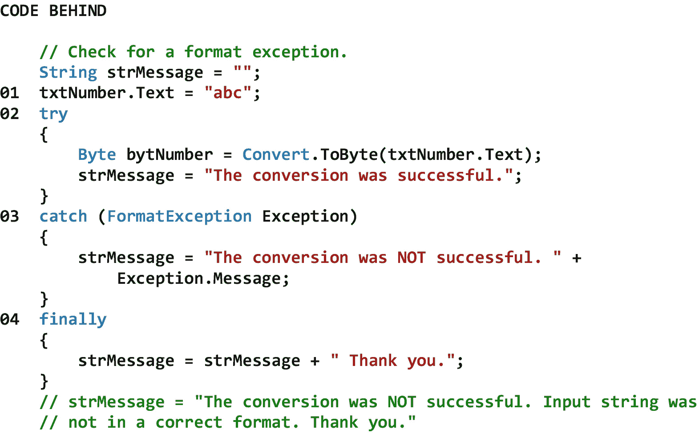

图 6-10

使用 FormatException 类捕获格式异常的示例

### 6 . 8 . 3 index outofrange exception class

当我们试图引用一个不在数组或集合范围内的项目时，会抛出一个*索引超出范围异常*。我们将在本书的后面学习更多关于数组和集合的知识。图 [6-11](#Fig11) 显示了一个使用 IndexOutOfRangeException 类来捕捉索引超出范围异常的例子。

请注意，在 01 处，已经声明了一个名为 strNameArray 的字符串数组，它包含三个元素。索引 0 处的元素包含*比尔*，索引 1 处的元素包含*玛丽*，索引 2 处的元素包含*史蒂夫*。

请注意 02 处的 Try-Catch-Finally 结构的 Try 部分，它包含将针对索引超出范围异常进行测试的赋值语句。如果没有抛出索引超出范围异常，查找后处理将继续，消息将设置为*查找成功*。

注意 03 处的 Try-Catch-Finally 结构的 Catch 部分。这部分结构包含一个 IndexOutOfRangeException 对象。我们给这个对象起了个别名“Exception ”,这样我们就可以用速记法来引用这个对象。可以看出，如果抛出索引超出范围异常，消息将被设置为*。查找不成功*。此外，描述当前异常的异常对象的 Message 属性将被附加到消息的末尾。

注意 04 处的 Try-Catch-Finally 结构的 Finally 部分。无论是否抛出异常，都将执行这部分结构中的代码。因此，消息将总是以*谢谢*结束。图的底部显示了 Try-Catch-Finally 代码的结果。请注意，已经抛出了一个索引超出范围异常，因为当唯一有效的索引是 0、1 和 2 时，我们不能引用索引 5 处的数组元素。

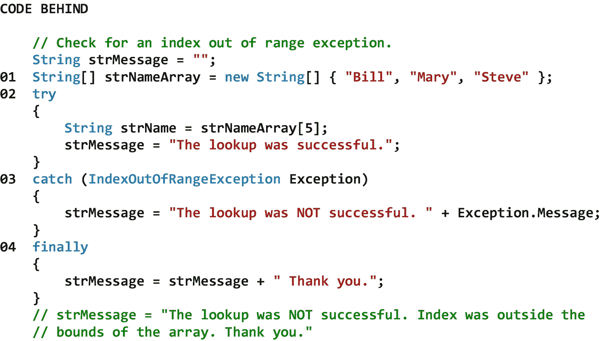

图 6-11

使用 IndexOutOfRangeException 类捕获索引超出范围异常的示例

### 溢出例外类别

当我们试图执行算术、造型或转换操作，导致值太大或太小而不适合分配的变量时，就会抛出一个*溢出异常*。图 [6-12](#Fig12) 显示了一个使用 OverflowException 类捕获溢出异常的例子。

注意在 01，i32Number 已经被设置为 *256* 来设置我们的溢出异常。在这种情况下，将会抛出溢出异常，因为 256 的*太大*而不适合 Byte 类型的变量(即 8 位无符号整数)。请注意，如果我们将 i32Number 设置为-12，也会抛出溢出异常，因为-12 的*太小*不适合 Byte 类型的变量。

注意 02 处的 Try-Catch-Finally 结构的 Try 部分，它包含将被测试溢出异常的赋值语句。如果没有抛出溢出异常，处理将在赋值后继续，消息将被设置为*赋值成功*。

注意 03 处的 Try-Catch-Finally 结构的 Catch 部分。结构的这一部分包含一个 OverflowException 对象。我们给这个对象起了个别名“Exception ”,这样我们就可以用速记法来引用这个对象。可以看出，如果抛出溢出异常，消息将被设置为*赋值不成功*。此外，描述当前异常的异常对象的 Message 属性将被附加到消息的末尾。

注意 04 处的 Try-Catch-Finally 结构的 Finally 部分。无论是否抛出异常，都将执行这部分结构中的代码。因此，消息将总是以*谢谢*结束。图的底部显示了 Try-Catch-Finally 代码的结果。请注意，已经抛出了溢出异常，因为我们不能为不在 0 到 255 之间的字节类型赋值。

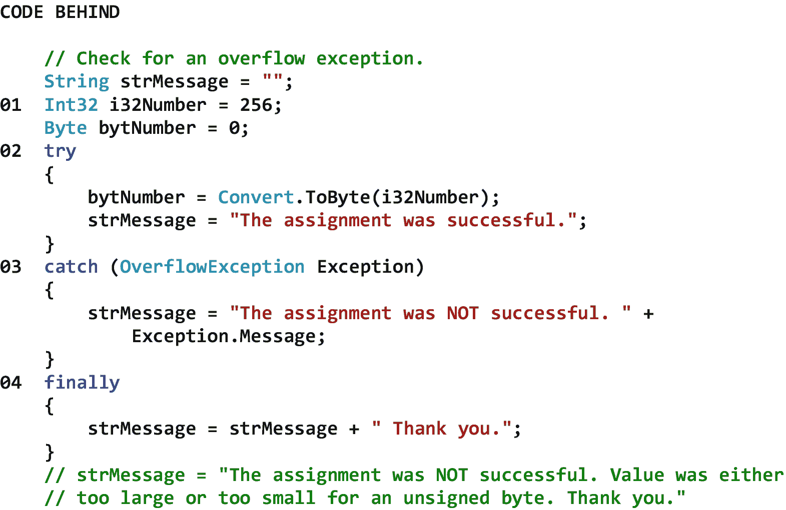

图 6-12

使用 OverflowException 类捕获溢出异常的示例

### 多重例外

也可以在一个 Try-Catch-Finally 结构中测试多个异常，包括特定的*和*意外异常。我们已经学习了如何捕捉一些特定的异常(例如，被零除异常、格式异常、索引超出范围异常、溢出异常)。然而，我们还没有讨论如何捕捉我们没有预料到的异常。为此，我们使用 Exception 类作为“catch all”来捕获任何未预料到的异常。需要记住的一点是，Exceptions 类捕获所有的*异常，包括所有的*异常。因此，首先测试任何特定的异常是很重要的，这样当它们被抛出时，我们可以用一种适合这些类型的异常的方式来捕捉和处理它们。然后，如果没有抛出任何特定的异常，我们可以使用 exceptions 类捕获任何意外抛出的异常。图 [6-13](#Fig13) 显示了一个在单个 Try-Catch-Finally 结构中捕捉多个异常的例子。**

注意 01 处的 txtNumber。文本(可能是最终用户通过文本框控件输入的)已被设置为 *256* 以设置溢出异常。(如果最终用户在文本框控件中输入了 *abc* ，将会抛出一个格式异常。)

注意 02 处的 Try-Catch-Finally 结构的 Try 部分。可以看到，文本框中输入的值被转换为字节类型。如果没有抛出溢出异常，处理将在赋值后继续，消息将设置为*转换和赋值成功*。

注意 03 处的 Try-Catch-Finally 结构的第一个 Catch 部分。结构的这一部分包含一个 FormatException 对象。我们给这个对象起了个别名“Exception ”,这样我们就可以用速记法来引用这个对象。可以看出，如果抛出格式异常，消息将被设置为*转换不成功*。此外，描述当前异常的异常对象的 Message 属性将被附加到消息的末尾。

注意 04 处的 Try-Catch-Finally 结构的第二个 Catch 部分。结构的这一部分包含一个 OverflowException 对象。我们给这个对象起了个别名“Exception ”,这样我们就可以用速记法来引用这个对象。可以看出，如果抛出溢出异常，消息将被设置为*赋值不成功*。此外，描述当前异常的异常对象的 Message 属性将被附加到消息的末尾。

注意 05 处的 Try-Catch-Finally 结构的第三个 Catch 部分。结构的这一部分包含一个异常对象。我们给这个对象起了别名“Exception ”,以便与其他异常对象的别名保持一致。这是“捕捉所有”异常处理程序，它将捕捉任何未预料到的异常。因此，如果抛出除格式异常或溢出异常之外的异常，消息将被设置为*其他不成功的情况*。此外，描述当前异常的异常对象的 Message 属性将被附加到消息的末尾。

注意 06 处的 Try-Catch-Finally 结构的最后部分。无论是否抛出异常，都将执行这部分结构中的代码。因此，消息将总是以*谢谢*结束。图的底部显示了 Try-Catch-Finally 代码的结果。请注意，已经抛出了溢出异常，因为我们不能为不在 0 到 255 之间的字节类型赋值。

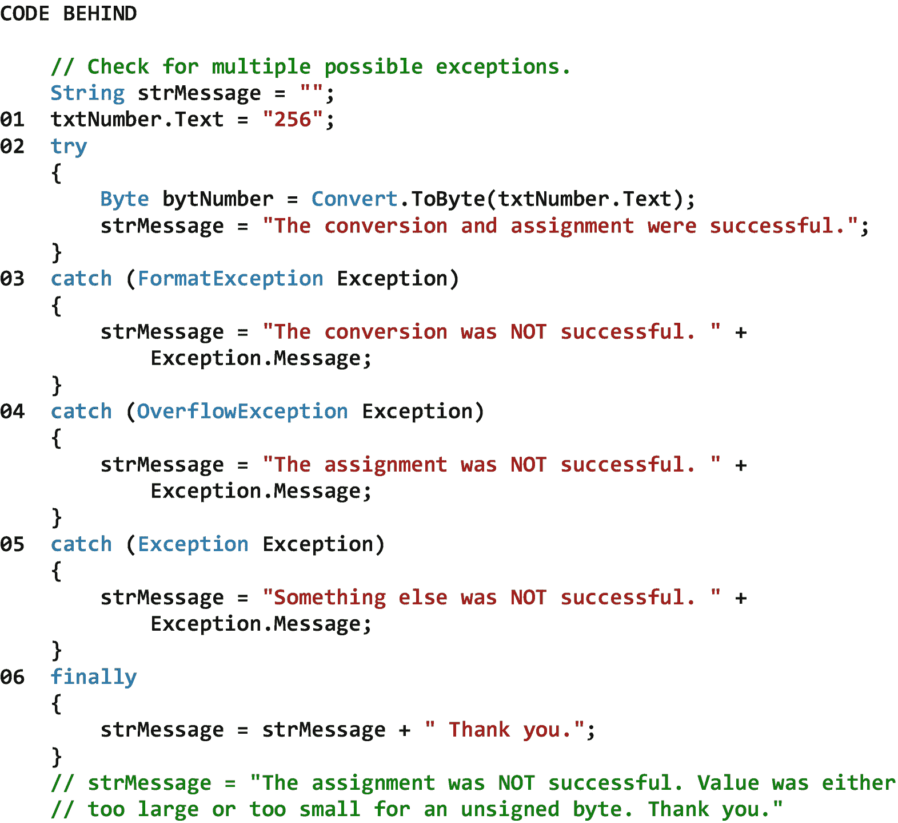

图 6-13

在单个 Try-Catch-Finally 结构中捕获多个异常的示例

<aside aria-label="Footnotes" class="FootnoteSection" epub:type="footnotes">Footnotes [1](#Fn1_source)

所有属性、方法和事件描述都直接取自微软的官方文档。为了节省空间，省略了用于处理该类事件的事件处理程序方法。有关该类的所有方法，请参见参考。

 </aside>