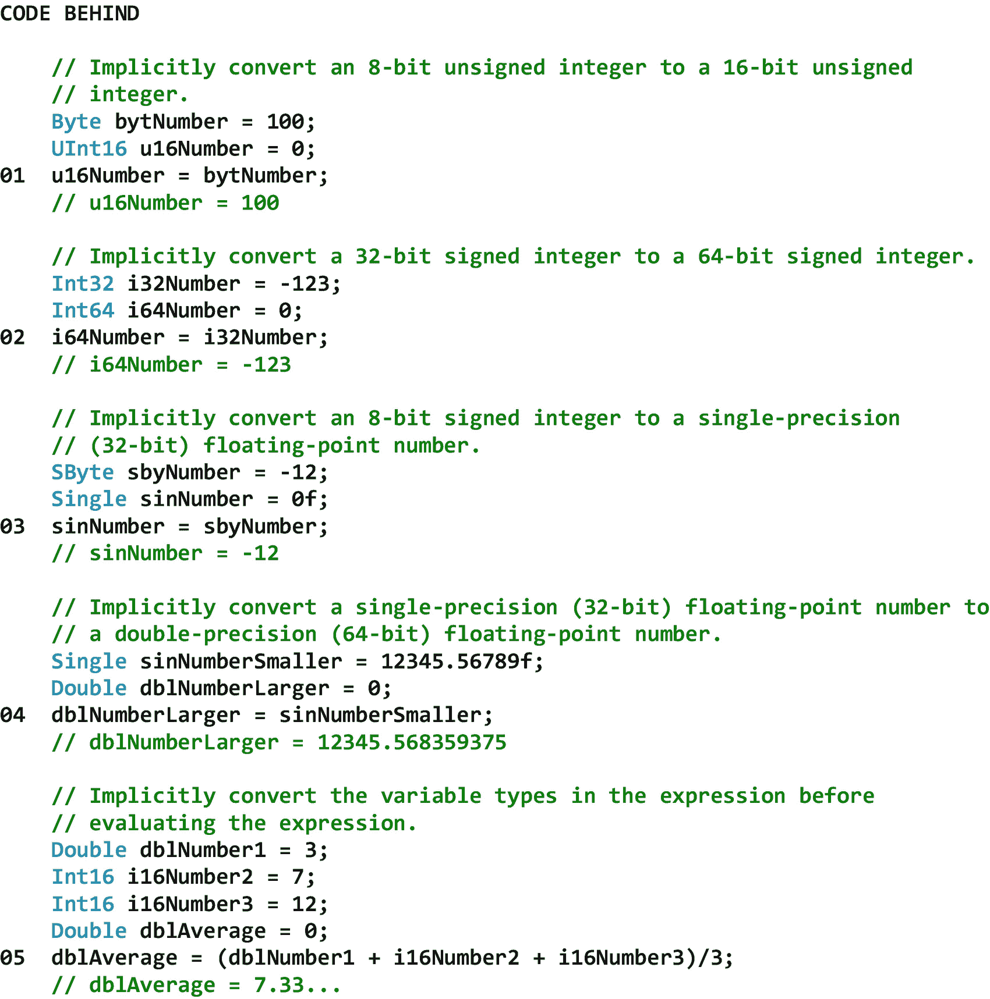
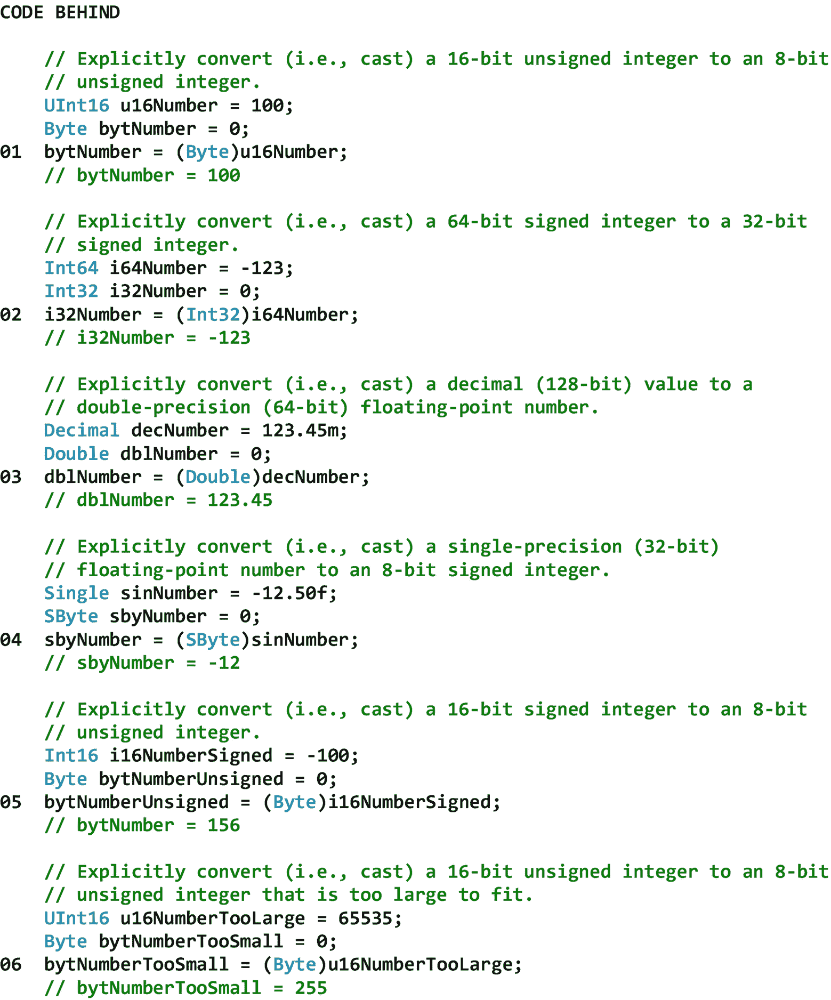
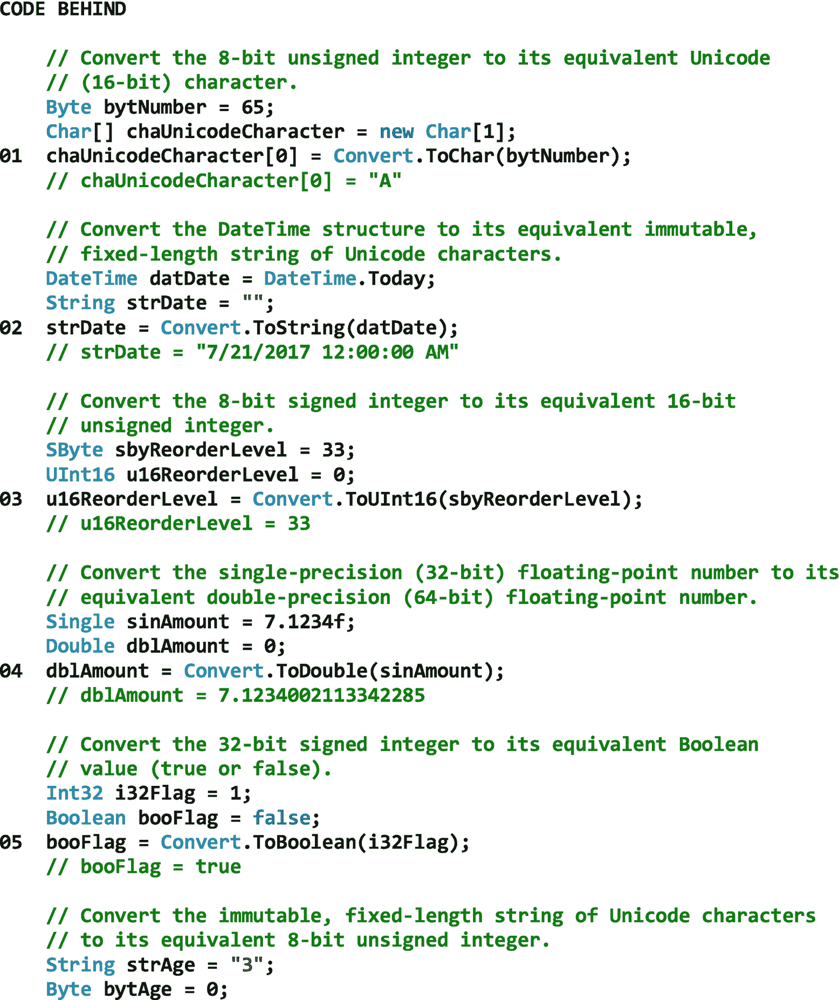
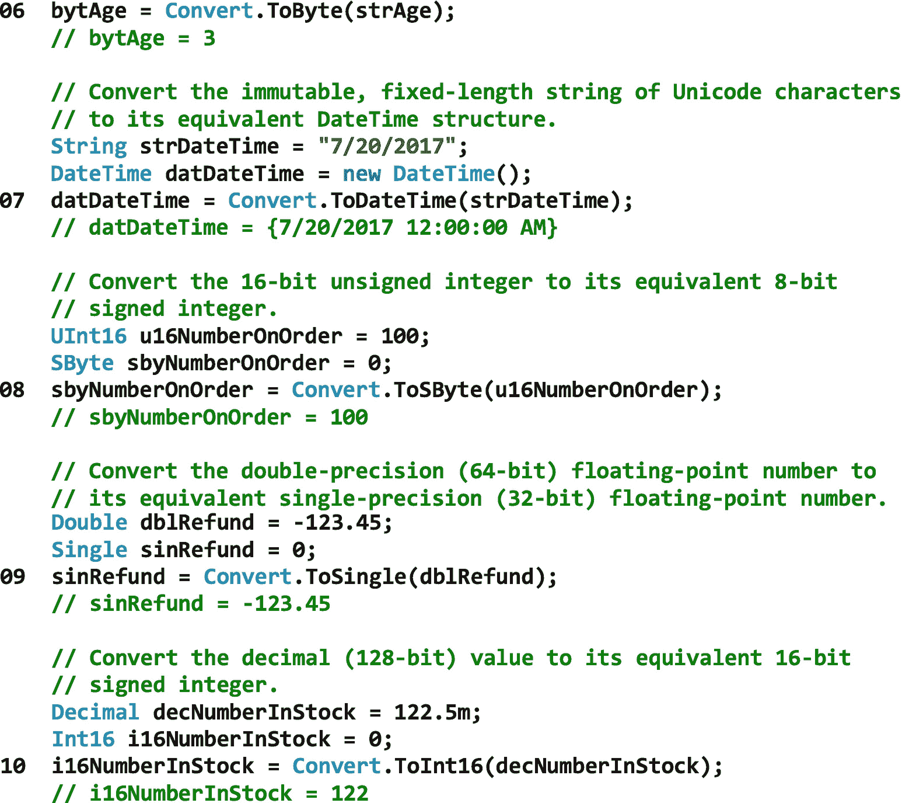
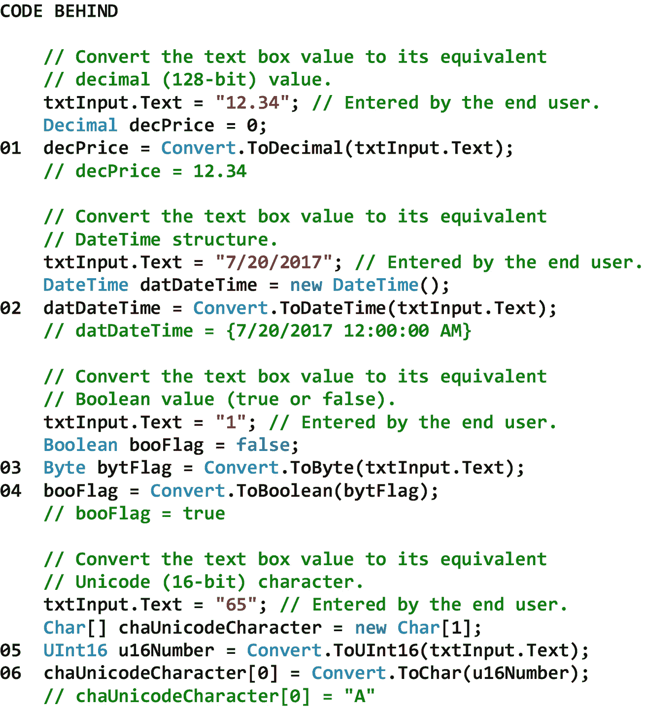

# 七、转换操作

## 7.1 导言

转换操作改变一种类型的变量的值，以便它可以用于另一种类型的变量。转换可以是*加宽*或*缩小*。扩大转换*总是*保留源变量的值，因为目标变量可以完全容纳源变量的可能值的范围。因此，这种类型的转换*在程序执行期间总是*成功，因为它不会导致数据丢失。另一方面，收缩转换*可能不会*保留源变量的值，因为目标变量不能完全容纳源变量的整个可能值范围。因此，在程序执行期间，这种类型的转换*可能不会*成功，因为可能会发生溢出异常。

在本章中，我们将从扩大转换开始。正如我们将看到的，在 C# 程序中，扩展转换是自动执行的，因为数据*不能在转换中丢失。这种转换是隐式地*执行的(即，转换发生不需要特殊的语法*)。接下来，我们将讨论收缩转换，它是在 C# 程序中自动执行的*而不是*，因为数据*可能会在转换中丢失。这些转换是显式地*执行的*(即，转换发生需要特殊的语法*)。最后，我们将讨论 Convert 类。这个静态类转换一种类型的变量中的值，以便可以在另一种类型的变量中使用它。*****

 *## 7.2 扩大转换

只要目标类型可以完全容纳源类型的可能值范围，就可以执行扩大转换(也称为隐式转换或强制转换)。因此，扩大转换总是可以隐式执行。例如，当我们想要将 Int16(即 16 位有符号整数)转换为 Int32(即 32 位有符号整数)时，或者当我们想要将 Int32(即 32 位有符号整数)转换为 Double(即 64 位双精度浮点数)时，可以执行扩大转换。

扩大转换不需要特殊的语法，并且是自动执行的，因为在转换过程中不会丢失任何数据，也就是说，不会对任何数据进行舍入(从精度较低的类型转换为精度较高的类型)或截断(从较小的幅度类型转换为较大的幅度类型)。这种转换被称为*类型安全*。

表 [7-1](#Tab1) 显示了扩大数值转换的列表。请注意，表中没有到 Char 类型的扩大转换。Single 和 Double 类型与 Decimal 类型之间也没有任何扩大转换。请记住，当从 Int32、UInt32、Int64 或 UInt64 转换为 Single 以及从 Int64 或 UInt64 转换为 Double 时，精度(而不是幅度)可能会丢失。

表 7-1

扩大数字转换列表

<colgroup><col class="tcol1 align-left"> <col class="tcol2 align-left"> <col class="tcol3 align-left"></colgroup> 
| 

。网络类型

 | 

描述

 | 

可以隐式转换为…

 |
| --- | --- | --- |
| 布尔代数学体系的 | 一个布尔值(真或假)。 | 钠 |
| 字节 | 一个 8 位无符号整数。 | Int16，UInt16，Int32，UInt32，Int64，UInt64，单精度，双精度，十进制 |
| 茶 | Unicode (16 位)字符。 | UInt16，Int32，UInt32，Int64，UInt64，单精度，双精度，十进制 |
| 小数 | 十进制(128 位)值。 | 钠 |
| 两倍 | 双精度(64 位)浮点数。 | 钠 |
| Int16 | 16 位有符号整数。 | Int32，Int64，单精度，双精度，十进制 |
| Int32 | 32 位有符号整数。 | Int64，单精度，双精度，十进制 |
| Int64 | 64 位有符号整数。 | 单精度、双精度、小数 |
| Sbyte(字节) | 一个 8 位有符号整数。 | Int16，Int32，Int64，单精度，双精度，十进制 |
| 单一的 | 单精度(32 位)浮点数。 | 两倍 |
| UInt16 | 16 位无符号整数。 | Int32，UInt32，Int64，UInt64，单精度，双精度，十进制 |
| UInt32 | 32 位无符号整数。 | Int64，UInt64，单精度，双精度，十进制 |
| UInt64 | 64 位无符号整数。 | 单精度、双精度、小数 |
| **参考** |
| [T2`https://docs.microsoft.com/en-us/dotnet/csharp/language-reference/keywords/implicit-numeric-conversions-table`](https://docs.microsoft.com/en-us/dotnet/csharp/language-reference/keywords/implicit-numeric-conversions-table) |

当对包含不同类型精度和/或大小的*数字变量的数学表达式求值时，也会发生扩大转换。在这种情况下，在对表达式*求值之前，具有较低精度类型或较小幅度类型的操作数会自动转换为表达式*中使用的最精确类型或最大幅度类型。图 [7-1](#Fig1) 显示了一些扩大转换的例子。*

请注意，在 01 和 02 处，较小的幅度类型被隐式转换为较大的幅度类型。

请注意 03 和 04，不太精确的类型被隐式转换为更精确的类型。从 04 可以看出，不是所有的浮点数都能精确地用二进制表示。这就是为什么单精度值 12345.56789f 由双精度值 12345.568359375 表示，这是 12345.56789f 的近似值。

请注意，在 05 处，i16Number2 和 i16Number3(都是 16 位有符号整数)被隐式转换为与 dblNumber1(一个双精度 64 位浮点数)*相同的类型，然后再进行*表达式求值。



图 7-1

扩大转换的示例

## 7.3 收缩转换

每当目标类型无法完全容纳源类型的可能值范围时，就必须执行收缩转换(也称为显式转换或强制转换)。因此，收缩转换必须始终显式执行。例如，当我们要将 Int32(即 32 位有符号整数)转换为 Int16(即 16 位有符号整数)或者要将 Double(即 64 位双精度浮点数)转换为 Int32(即 32 位有符号整数)时，必须执行收缩转换。

收缩转换需要特殊的语法，并且*不会*自动执行，因为数据可能会在转换中丢失。更具体地说，数据可以向零舍入到最接近的整数(例如，当从十进制类型转换到整数类型时)，或者数据可以被截断(例如，当从双精度或单精度类型转换到整数类型时)。这种转换不是*类型安全的。*

在 C# 中，收缩转换需要使用*转换运算符*。转换运算符采用两个括号之间的类型形式。例如，要将 Single 类型的变量转换为 SByte 类型的变量，我们需要在要分配给 SByte 变量的 Single 变量之前包含(SByte ),如下所示

```cs
sbyNumber = (SByte)sinNumber;

```

当我们使用一个 cast 操作符时，我们告诉编译器我们想要*强制*从一个较宽的类型转换到一个较窄的类型，并且我们知道在这个过程中数据可能会丢失。将一种类型转换为另一种类型时，请记住

*   当十进制类型被转换为整数类型时，十进制值将被*向零舍入到最接近的整数*。如果得到的整数值超出整数类型的范围，将发生溢出异常。

*   当 double 或 single 类型被强制转换为 integer 类型时，double 或 single 值将被*截断*。如果得到的整数值超出整数类型的范围，将发生溢出异常。

*   当双精度类型被转换为单精度类型时，双精度值将被*舍入到最接近的单精度值*。如果 double 值太小而不适合 single 类型，则 single 值将为零。如果双精度值太大而不适合单精度类型，则单精度值将为无穷大。

*   当单精度或双精度类型被转换为十进制类型时，单精度或双精度值将被*舍入到最接近的十进制数(如有必要，在第 28 个小数位之后)*。如果单精度或双精度值太小而不能表示为十进制类型，则十进制值将为零。如果单精度值或双精度值不是数字(NaN)、无穷大或太大而无法表示为小数类型，将发生溢出异常。

*   当十进制类型被转换为单精度或双精度类型时，十进制值将被*舍入到最接近的双精度或单精度值*。

表 [7-2](#Tab2) 显示了缩小数值转换的列表。请注意，表中的布尔类型不能显式转换为另一种类型。

表 7-2

收缩数字转换列表

<colgroup><col class="tcol1 align-left"> <col class="tcol2 align-left"> <col class="tcol3 align-left"></colgroup> 
| 

。网络类型

 | 

描述

 | 

可以显式转换为…

 |
| --- | --- | --- |
| 布尔代数学体系的 | 一个布尔值(真或假)。 | 钠 |
| 字节 | 一个 8 位无符号整数。 | SByte， Char |
| 茶 | Unicode (16 位)字符。 | SByte、Byte、Int16 |
| 小数 | 十进制(128 位)值。 | SByte、Byte、Int16、UInt16、Int32、UInt32、Int64、UInt64、Char、Single、Double |
| 两倍 | 双精度(64 位)浮点数。 | 位元组、位元组、Int16、UInt16、Int32、Int64、UInt64、Char、Single、Decimal |
| Int16 | 16 位有符号整数。 | 位元组、位元组、uint16、UInt32、uint64、Char |
| Int32 | 32 位有符号整数。 | 位元组、位元组、Int16、UInt16、UInt32、UInt64、Char |
| Int64 | 64 位有符号整数。 | 位元组、位元组、Int16、UInt16、Int32、UInt64、Char |
| Sbyte(字节) | 一个 8 位有符号整数。 | 字节、UInt16、UInt32、UInt64、Char |
| 单一的 | 单精度(32 位)浮点数。 | 字节，字节，Int16，UInt16，Int32，Int32，Int64，UInt64，Char，十进制 |
| UInt16 | 16 位无符号整数。 | 交换，交换，16，查尔 |
| UInt32 | 32 位无符号整数。 | 交换，交换，Int16，UInt16，Int16，Char |
| UInt64 | 64 位无符号整数。 | SByte， Byte， Int16， UInt16， Int32， UInt32， Int64， Char |
| **参考** |
| [T2`https://docs.microsoft.com/en-us/dotnet/csharp/language-reference/keywords/explicit-numeric-conversions-table`](https://docs.microsoft.com/en-us/dotnet/csharp/language-reference/keywords/explicit-numeric-conversions-table) |

图 [7-2](#Fig2) 显示了一些收缩转换(即强制转换)的例子。

请注意，在 01 和 02 处，较大的幅度类型被显式转换为较小的幅度类型。

请注意，在 03 和 04 处，较大幅度和较精确的类型被显式转换为较小幅度和较不精确的类型。如 04 所示，数字的小数部分被截断。

请注意，在 05 处，较大幅度的有符号类型被显式转换为较小幅度的无符号类型。可以看到，符号被截断，结果很奇怪。这强调了仔细测试包含强制转换的代码的重要性。

请注意，在 06 处，较大的幅度类型被显式转换为较小的幅度类型，但是较小的幅度类型太小，无法容纳较大的幅度类型。注意，在这个场景中没有发生溢出错误，结果很奇怪。这再次强调了仔细测试包含强制转换的代码的重要性。



图 7-2

收缩转换的示例

## 7.4 转换类别

Convert 类是一个静态类，它转换一种类型的变量中的值，以便可以在另一种类型的变量中使用。支持的类型包括 Boolean、Byte、Char、DateTime、Decimal、Double、Int16、Int32、Int64、SByte、Single、String、UInt16、UInt32 和 UInt64。根据源变量中的值和目标值的精度和大小，调用 Convert 类的方法时可能会发生五种情况。这些是

*   不执行任何转换。当我们试图将一种类型的变量转换为与*相同的*类型的变量时，就会出现这种情况(例如，将 Double 转换为 Double)。在这种情况下，该方法只返回源变量的值。

*   执行成功的转换。当执行扩大转换或在不丢失数据的情况下执行收缩转换时，会出现这种情况。在任一情况下，该方法都返回与源变量中的值相同的值。当转换仅导致精度损失时(例如，由于舍入而丢失小数点)，转换也被认为是成功的。

*   引发了 FormatException。当我们试图将一个字符串类型转换为另一个类型，并且字符串值的格式不正确时，就会发生这种情况。当要转换为
    *   布尔类型不等于“真”或“假”

    *   字符类型由多个字符组成

    *   日期时间类型不是有效的日期和时间

    *   数字类型不是有效的数字

*   引发了 InvalidCastException。当我们试图执行没有意义的转换时，就会发生这种情况。当我们尝试从转换时，会引发 InvalidCastException
    *   将字符转换为布尔值、日期时间、小数、双精度或单精度

    *   布尔值、日期时间、十进制、双精度或单精度到字符

    *   DateTime 转换为任何其他类型(字符串除外)

    *   DateTime 的任何其他类型(字符串除外)

*   引发 OverflowException。当我们试图执行导致数据丢失的收缩转换时(例如，将值为 256 的 UInt16 转换为字节，后者最多只能存储 255 的值)，就会出现这种情况。

表 [7-3](#Tab3) 显示了 Convert 类的一些属性、方法和事件。在表中，术语*值类型*表示. NET 中支持的值类型的 *any* 。请注意，扩大转换和收缩转换都受支持。

表 7-3

Convert 类的一些属性、方法和事件

<colgroup><col class="tcol1 align-left"> <col class="tcol2 align-left"></colgroup> 
| **类**转换<sup>类 [1](#Fn1) 类</sup> |
| **命名空间**系统 |
| **属性** |
| 钠 |   |
| **方法** |
| toboonline(123t0)【货币类型】T1) | 将指定值类型的值转换为等效的布尔值。 |
| 字节（ *值类型* ） | 将指定值类型的值转换为等效的 8 位无符号整数。 |
| 栃木〔t0〕value type〔t1〕 | 将指定值类型的值转换为等效的 Unicode 字符。 |
| today time(*value type*) | 将指定值类型的值转换为等效的日期和时间值。 |
| ToDecimal( *Valuetype* ) | 将指定值类型的值转换为等效的十进制数。 |
| ToDouble( *Valuetype* | 将指定值类型的值转换为等效的双精度浮点数。 |
| 屋顶 16( *Valuetype* | 将指定值类型的值转换为等效的 16 位有符号整数。 |
| 屋顶 32( *Valuetype* | 将指定值类型的值转换为等效的 32 位有符号整数。 |
| 屋顶 64( *Valuetype* | 将指定值类型的值转换为等效的 64 位有符号整数。 |
| 托字节（ *值类型* ） | 将指定值类型的值转换为等效的 8 位有符号整数。 |
| ToSingle( *Valuetype* ) | 将指定值类型的值转换为等效的单精度浮点数。 |
| ToString( *Valuetype* | 将指定值类型的值转换为等效的字符串表示形式。 |
| TouInt16（ *值型* ） | 将指定值类型的值转换为等效的 16 位无符号整数。 |
| TouInt32（ *值型* ） | 将指定值类型的值转换为等效的 32 位无符号整数。 |
| TouInt64（ *值型* ） | 将指定值类型的值转换为等效的 64 位无符号整数。 |
| **事件** |
| 钠 |   |
| **参考** |
| [T2`https://msdn.microsoft.com/en-us/library/system.convert(v=vs.110).aspx`](https://msdn.microsoft.com/en-us/library/system.convert%2528v%253Dvs.110%2529.aspx) |

在从更精确的数字类型转换为不太精确的数字类型时，在决定是使用收缩转换(即强制转换)还是表面上等效的 Convert 类方法时，一定要谨慎。这是因为数值转换*会截断*，而数值转换*会舍入到最接近的偶数*。在 C# 中，默认情况下，以 5 结尾的十进制值在舍入过程*中根据被舍入的数字*向上或向下舍入到最接近的*偶数*值。例如，数字 1.5 和 3.5 将分别向上舍入*到 2 和 4，而数字 2.5 和 4.5 将分别向下舍入*到 2 和 4。因此，不会发生舍入到奇数值的情况。这种方法遵循标准的*银行家舍入*惯例。使用这种特殊舍入方法的原因是，在对大量数字进行舍入时，它可以避免舍入偏差。图 [7-3](#Fig3) 显示了一些将一种类型转换成另一种类型的例子。可以看出，正在执行扩大转换和收缩转换。**

请注意 01–03，较小的量级类型正在转换为较大的量级类型。

请注意，在 04 处，较小的幅度类型也被转换为较大的幅度类型。请注意，并非所有浮点数都可以用二进制精确表示。这就是为什么单精度值 7.1234f 由双精度值 7.1234002113342285 表示，这是 7.1234f 的近似值。

请注意 05–09，较大的量级类型正在转换为较小的量级类型。

请注意，在 10 处，较大的幅度类型也被转换为较小的幅度类型。注意结果是按照庄家四舍五入的规则四舍五入的。

 

图 7-3

将一种类型转换为另一种类型的示例

让最终用户在文本框控件中输入一个值，然后将该输入(以字符串类型存储在控件的文本属性中)转换为另一种类型，这是 ASP.NET Web 应用中非常常见的操作。这是因为我们必须经常在代码后面的非字符串操作(例如，数值计算)中使用该输入。图 [7-4](#Fig4) 展示了一些将文本框控件的文本属性转换成另一种类型的例子。

请注意，在 01 和 02 处，转换只需要一个步骤。

但是，请注意 03–06，转换需要两个步骤。在这些示例中，请注意，由于最终用户可能输入了错误数据，因此很有可能会引发异常。这强调了第 [5](05.html) 章“数据验证控制”中讨论的数据验证技术以及第 [6](06.html) 章“赋值操作”中讨论的异常处理技术的重要性



图 7-4

将 TextBox 控件的 Text 属性转换为另一种类型的示例

<aside aria-label="Footnotes" class="FootnoteSection" epub:type="footnotes">Footnotes [1](#Fn1_source)

所有属性、方法和事件描述都直接取自微软的官方文档。为了节省空间，省略了用于处理该类事件的事件处理程序方法。有关该类的所有方法，请参见参考。

 </aside>*