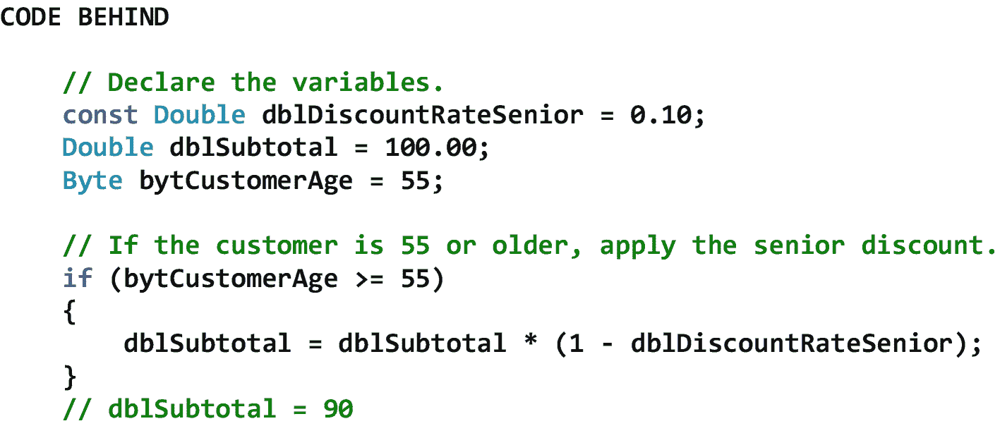

# 八、控制操作

## 8.1 导言

控制操作分为两大类——*决策操作*(又称为选择操作、条件操作)和*迭代操作*(又称为重复操作、循环操作)。当程序需要多条路径时，决策操作基于关系、等式和/或逻辑操作的真或假来改变程序的执行路径。另一方面，迭代操作在某个条件(即，关系、相等和/或逻辑条件)为真时重复执行代码块。决策操作和迭代操作是计算机编程的基础，每一种过程/命令式编程语言都需要这样的操作——不管它们的语法如何。

在这一章中，我们将从四个关系运算符开始。这些运算符是小于运算符、大于运算符、小于或等于运算符和大于或等于运算符。接下来，我们将讨论两个相等运算符——等于运算符和不等于运算符。之后，我们将考虑几种逻辑运算符，包括 And 运算符、or 运算符、条件 And 运算符、条件 Or 运算符和 Xor 运算符。然后我们将看一些决策结构，包括 If 结构、If-Else 结构、If-Else-If 结构、嵌套 If 结构、Switch 结构和 Switch-Through 结构。接下来，我们将查看几种迭代结构，包括 While 结构、Do-While 结构、For 结构和 For-Each 结构。最后，我们将考虑两个 C# 语句，它们允许我们改变本章中讨论的迭代结构的执行——即 Break 语句和 Continue 语句。

## 8.2 关系运算符

有四种基本的关系运算符。这些运算符是:*小于*运算符(<)、*大于*运算符(>)、*小于等于*运算符(< =)、以及*大于等于*运算符(> =)。一个*关系运算*包含一个运算符和两个操作数。C# 编程语言中关系运算的一般语法是

```cs
(Operand1 Operator Operand2);

```

如果操作 1 小于操作 2，则< operator returns *为真*。否则，*返回假*。如果操作 1 大于操作 2，则>运算符返回*真值*。否则，返回*假*。如果 Operand1 小于或等于 Operand2，则< =运算符返回 *true* 。否则，返回*假*。并且，如果 Operand1 大于或等于 Operand2，> =运算符返回*真值*。否则，返回*假*。与 C# 中的任何其他运算符一样，当多个运算符作为一个整体进行计算时，有一个优先顺序。这种优先顺序定义了计算操作的顺序。表 [8-1](#Tab1) 显示了按优先顺序列出的基本关系运算符。

表 8-1

按优先级顺序列出的基本关系运算符

<colgroup><col class="tcol1 align-left"> <col class="tcol2 align-left"> <col class="tcol3 align-left"></colgroup> 
| 

操作员

 | 

描述

 | 

评论

 |
| --- | --- | --- |
| x < y | 不到 | 如果 x 小于 y，则为 True。否则为 false。 |
| x > y | 大于 | 如果 x 大于 y，则为 True。否则为 false。 |
| x <= y | 小于或等于 | 如果 x 小于或等于 y，则为 True。否则为 false。 |
| x >= y | 大于或等于 | 如果 x 大于或等于 y，则为 True。否则为 false。 |

## 8.3 相等运算符

有两个相等运算符。这就是*等于*运算符(==)和*不等于*运算符(！=).相等运算包含一个运算符和两个操作数。在 C# 编程语言中，等式运算的一般语法是

```cs
(Operand1 Operator Operand2);

```

如果 Operand1 等于 Operand2，则==运算符返回 *true* 。否则，*返回假*。的！=如果操作 1 与操作 2 不相等，则操作返回*真值*。否则，返回*假*。与 C# 中的任何其他运算符一样，当多个运算符作为一个整体进行计算时，有一个优先顺序。这种优先顺序定义了计算操作的顺序。表 [8-2](#Tab2) 显示了按优先顺序列出的一些等式运算符。

表 8-2

按优先级顺序列出的相等运算符

<colgroup><col class="tcol1 align-left"> <col class="tcol2 align-left"> <col class="tcol3 align-left"></colgroup> 
| 

操作员

 | 

描述

 | 

评论

 |
| --- | --- | --- |
| x == y | 等于 | 如果 x 等于 y，则为 True。否则为 false。 |
| x！= y | 不等于 | 如果 x 不等于 y，则为 True。否则为 false。 |

## 8.4 逻辑运算符

逻辑运算符允许我们构造*复合*条件。复合条件由两个或多个作为一个整体进行评估的条件组成。有两个基本的逻辑运算符。它们是*和*运算符(&)和*或*运算符(|)。除了这些，还有一个*条件和*运算符(& &)、一个*条件或*运算符(||)和一个*异或*运算符(^).逻辑运算包含一个运算符和两个或多个条件，其中条件是关系运算和/或等式运算。C# 编程语言中逻辑运算的一般语法是

```cs
(Condition1 Operator Condition2 [Operator Condition3...]);

```

其中条件 1 运算符条件 2 是必需的，而[运算符条件 3...]是可选的。椭圆表示还允许附加的运算符和条件。

如果条件 1 *和*条件 2*都为*真，则&运算符返回*真*。否则，返回*假*。如果条件 1 *或*条件 2 为真，则|运算符返回*真*。否则，返回*假*。如果条件 1 *和*条件 2*都为*真，则& &操作符返回*真*。否则，*假*被返回。但是，如果条件 1 不为真，条件 2 将*而不是*被评估。因此，该操作符被称为*快捷方式和操作符*。如果条件 1 *或*条件 2 为真，则||运算符返回*真*。否则，返回*假*。然而，如果条件 1 为真，条件 2 将*而不是*被评估。因此，该操作符被称为*快捷方式或操作符*。最后，如果条件 1 *或*条件 2 为真，^算子返回*真*，但两者都不为真。否则，返回*假*。与 C# 中的任何其他运算符一样，当多个运算符作为一个整体进行计算时，有一个优先顺序。这种优先顺序定义了计算操作的顺序。表 [8-3](#Tab3) 显示了按优先顺序列出的一些逻辑运算符。

表 8-3

按优先顺序排列的逻辑运算符

<colgroup><col class="tcol1 align-left"> <col class="tcol2 align-left"> <col class="tcol3 align-left"></colgroup> 
| 

操作员

 | 

描述

 | 

评论

 |
| --- | --- | --- |
| x & y | 和 | 如果 x *和 y*都是*并且都是*则为真。否则为假。 |
| x &#124; y | 或者 | 如果 x *或* y 为真，则为真。否则为假。 |
| x 和 y | 条件与 | 如果 x *和 y*都是*并且都是*则为真。否则为假。如果 x 不为真，不要用*而不是*来计算 y。 |
| x &#124;&#124; y | 条件或 | 如果 x *或* y 为真，则为真。否则为假。如果 x 为真，不要用*而不是*来计算 y。 |
| x ^ y | 异或运算 | 如果 x *或* y 为真，但两者都不为真，则为真。否则为假。 |

## 8.5 决策结构

当程序中可能存在多条路径时，决策结构(也称为选择结构、条件结构)根据关系、等式和/或逻辑运算的真或假来改变程序的执行路径。当给定的关系、相等和/或逻辑运算评估为真时，执行代码块。当计算结果为 false 时，要么不执行任何代码块，要么执行不同的代码块。在这一节中，我们将研究 If 结构、If-Else 结构、If-Else-If 结构、嵌套 If 结构、Switch 结构和 Switch-Through 结构。

### If 结构

If 结构(也称为 If 语句)标识单个代码块(即一个或多个命令性编程语句)将被执行的条件。C# 编程语言中 If 结构的一般语法是

```cs
if (Condition)
{
    Block of code
}

```

注意，当采用 If 结构时，*一个*替代程序路径是可能的。可以看到，如果条件评估为真，代码块将被执行。如果条件评估为假，代码块将*而不是*被执行。在这两种情况下，程序流都将在 If 结构的最后一个括号之后的点继续。图 [8-1](#Fig1) 显示了一个带有关系运算符的 If 结构的例子。



图 8-1

带有关系运算符的 If 结构示例

图 [8-2](#Fig2) 显示了带有等式运算符的 If 结构示例。


图 8-2

具有相等运算符的 If 结构示例

图 [8-3](#Fig3) 显示了带有 Or 运算符的 If 结构示例。


图 8-3

带有 Or 运算符的 If 结构示例

图 [8-4](#Fig4) 显示了带有条件 And 运算符的 If 结构示例。


图 8-4

带有条件 And 运算符的 If 结构示例

请注意，在 01 处，如果第一个条件评估为 false，则不会评估第二个条件，从而提高了程序效率。

### 8.5.2 如果-否则结构

If-Else 结构(也称为 If-Else 语句)标识两个不同代码块(即一个或多个命令性编程语句)将被执行的条件。C# 编程语言中 If-Else 结构的一般语法是

```cs
if (Condition)
{
    Block of code 1
}
else
{
    Block of code 2
}

```

注意，当采用 If-Else 结构时，两个可选程序路径是可能的。可以看到，如果条件评估为真，将执行第一个代码块。如果条件评估为 false，将执行第二个代码块。在这两种情况下，程序流都将在 If-Else 结构的最后一个括号之后的点继续。图 [8-5](#Fig5) 显示了 If-Else 结构的一个例子。


图 8-5

If-Else 结构的示例

### 8.5.3 如果-否则-如果结构

If-Else-If 结构(也称为 If-Else-If 语句)标识两个或多个不同代码块(即一个或多个命令式编程语句)将被执行的条件。C# 编程语言中 If-Else-If 结构的一般语法是

```cs
if (Condition 1)
{
    Block of code 1
}
else if (Condition 2)
{
    Block of code 2
}
else
{
    Block of code 3
}

```

注意，当采用 If-Else-If 结构时，至少有两个可选的程序路径是可能的，因为对于给定的 If 条件，可能不需要匹配的 Else。可以看到，如果第一个条件评估为真，将执行第一个代码块。否则，如果第二个条件评估为真，将执行第二个代码块。否则，将执行第三个代码块。在所有这三种情况下，程序流将在 If-Else-If 结构的最后一个括号之后的点继续。请记住，一个 If-Else-If 结构中可以包含多个 *else if* 条件。图 [8-6](#Fig6) 显示了 If-Else-If 结构的一个例子。


图 8-6

If-Else-If 结构的示例

### 嵌套 If 结构

嵌套 If 结构(也称为嵌套 If 语句)标识两个或多个不同代码块(即一个或多个命令性编程语句)将被执行的条件。C# 编程语言中嵌套 If 结构的一般语法是

```cs
if (Condition 1)
{
    Block of code 1
    if (Condition 2)
    {
        Block of code 2
    }
}

```

请注意，当使用嵌套 If 结构时，*两个*可选程序路径是可能的。可以看出，如果第一个条件评估为真，将执行第一个代码块(包括第二个条件)。如果第二个条件评估为真，将执行第二个代码块。在这两种情况下，程序流都将在嵌套 If 结构的最后一个括号之后的位置继续。请记住，*本节中讨论的任何*If 结构(即 If、If-Else 和 If-Else-If 结构)都可以嵌套。图 [8-7](#Fig7) 显示了一个嵌套 If 结构的例子。注意在这个特殊的例子中，嵌套的 If 结构嵌套了两个 If-Else-If 结构。

 

图 8-7

嵌套 If 结构的示例

### 开关结构

切换结构(也称为 Switch 语句)标识一个或多个不同代码块(即一个或多个命令性编程语句)将被执行的条件。C# 编程语言中开关结构的一般语法是

```cs
switch (Expression)
{
    case Matched Expression 1
        Block of code 1
    case Matched Expression 2 (optional)
        Block of code 2
    default (optional)
        Block of code 3
}

```

注意，当采用开关结构时，至少*一个可替换的程序路径是可能的，因为既不需要第二种情况也不需要默认情况。可以看出，如果第一种情况与表达式匹配，将执行第一个代码块。否则，如果第二种情况与表达式匹配，将执行第二个代码块。否则，将执行第三个代码块。在所有情况下，程序流将在紧接开关结构的最后一个括号之后的点继续。*

关于交换机结构，有几点需要记住。首先，单个开关结构中可以包括任意数量的情况。第二，案例总是按照从上到下的顺序进行评估，除了默认案例，默认案例总是最后评估。第三，只执行一例。第四，在 case 中执行的代码块总是以 break 语句结束。第五，当一个表达式有两个或更多的情况时，Switch 结构通常被用作 If-Else-If 结构的替代结构。这是因为开关结构比 If-Else-If 结构更容易阅读和维护——我们马上就会看到这一点。图 [8-8](#Fig8) 显示了开关结构的示例。请注意，与图 [8-6](#Fig6) 中的等效 If-Else-If 结构相比，图中的开关结构看起来干净多了。


图 8-8

开关结构的示例

### 转接结构

转接结构不是不同的*型*开关结构。相反，它是刚刚讨论的开关结构的*变体*。事实上，直通交换结构遵循交换结构的所有相同规则。唯一的区别是切换结构允许我们在多种情况下执行*相同的*代码块，从而避免了编写和维护重复代码的需要。图 [8-9](#Fig9) 显示了转接结构的示例。

请注意，在 01，当客户购买 1 到 3 件商品时，折扣将不适用。

但是，请注意 02、03 和 04，当客户分别购买 4 至 6 件、7 至 9 件或 10 件或 10 件以上的商品时，将适用 10%、20%或 30%的折扣。


图 8-9

转接结构的示例

## 8.6 迭代结构

迭代结构(也称为重复结构、循环结构)在某个条件(即关系、等式和/或逻辑运算)为真时重复执行代码块。在本节中，我们将研究 While 结构、Do-While 结构、For 结构和 For-Each 结构。此外，我们将看两个 C# 语句，它们允许我们改变本章中讨论的迭代结构的执行，即 Break 语句和 Continue 语句。

### While 结构

While 结构(也称为 While 循环)标识代码块(即一个或多个命令性编程语句)将被重复执行的条件。C# 编程语言中 While 结构的一般语法是

```cs
while (Condition)
{
    Block of code
}

```

可以看出，While 循环是一个*预测试*循环。当使用 While 循环时，只要条件保持为真，就会执行循环体中的代码块。由于在 While 循环的*顶部*测试条件(即在代码块执行之前的*，所以代码块可以执行零次或多次。如果条件评估为真，将执行代码块。如果条件评估为假，代码块将*而不是*被执行，并且程序流将在 While 循环的最后一个括号之后的点继续。图 [8-10](#Fig10) 显示了一个 While 结构的例子。*

请注意 01 处包含三个客户的数组的定义。 <sup>[1](#Fn1)</sup>

请注意 02 处用于控制循环执行的变量的声明和初始化(即 i16Index)。

注意 03 处 i16Index 的后缀增量。注意，这个后缀增量可能会影响循环条件的真或假，在执行完循环体之后，会在循环的顶部再次测试。


图 8-10

While 结构的示例

### Do-While 结构

Do-While 结构(也称为 Do-While 循环、Do-Until 循环)标识代码块(即一个或多个命令性编程语句)将被重复执行的条件。C# 编程语言中 Do-While 结构的一般语法是

```cs
do
{
    Block of code
} while (Condition)

```

可以看出，Do-While 循环是一个*后测试*循环。当使用 Do-While 循环时，循环体中的代码块将至少执行*一次*，并且只要条件保持为真。由于在 Do-While 循环的*底部*测试条件(即在代码块被执行后的*，代码块被执行一次或多次。如果条件评估为真，将再次执行代码块。如果条件评估为假，代码块将*而不是*被再次执行，并且程序流将在 Do-While 循环的最后一个括号之后的点继续。图 [8-11](#Fig11) 显示了 Do-While 结构的示例。*

请注意 01 处包含三个客户的数组的定义。 <sup>[2](#Fn2)</sup>

请注意 02 处用于控制循环执行的变量的声明和初始化(即 i16Index)。

注意 03 处 i16Index 的后缀增量。注意，这个后缀增量可能会影响循环条件的真或假，在执行完循环体后，会在循环底部再次测试。最后，注意第一个客户被添加到客户列表中，即使 i16Index 被初始化为 0。


图 8-11

Do-While 结构示例

### 8.6.3 结构

For 结构(也称为 For 循环)标识一个代码块(即一个或多个命令性编程语句)将被重复执行的条件。C# 编程语言中 For 结构的一般语法是

```cs
for (Initializer; Condition; Iterator)
{
    Block of code
}

```

可以看出，For 循环是一个*预测试*循环。当使用 For 循环时，只要条件保持为真，就会执行循环体中的代码块。由于条件是在 For 循环的*顶端*测试的(即在代码块执行之前的*，所以代码块可以执行零次或多次。如果条件评估为真，将执行代码块。如果条件评估为假，代码块将*而不是*被执行，并且程序流将在紧接 For 循环的最后一个括号之后的点继续。*

For 循环本质上是一个 While 循环，具有一些特殊的特征。与 While 循环不同，While 循环只在循环顶部包含一个条件，For 循环在循环顶部包含一个*初始化器*、一个条件和一个*迭代器*。初始化器初始化用于控制循环的变量。这个变量*是循环的局部变量*，所以它*不能*在循环体之外使用。然而，它*可以*在循环体内部随意使用。初始化器在循环的任何其他部分之前执行，并且只执行一次——就在第一次测试条件之前。另一方面，迭代器定义了循环体中的代码块执行完之后*会发生什么。尽管其他类型的表达式也可以用作迭代器，但它们通常采用后缀增量(i++)或后缀减量(i -)的形式。当我们知道(或者在遇到循环时将知道)循环体中的代码块应该执行的次数时，通常使用 For 循环，例如当我们需要迭代数组的所有元素时。图 [8-12](#Fig12) 为 For 结构的示例。*

请注意 01 处包含五个供应商的数组的定义。 <sup>[3](#Fn3)</sup>

请注意 02 处 For 结构的顶部。这里有三点需要注意。第一个是用于控制循环执行的变量的初始化(即 i = 0)。可以看出，我们已经暂停了本书前面建立的变量命名标准，因为结构索引传统上采用 I、j、k 等形式。第二个是循环的条件。请注意，当 I 小于或等于 4 时，循环中的代码将继续执行。而第三个是 I 的后缀增量，观察这个后缀增量可能影响循环条件的真假，在循环体执行完之后，在循环的顶部再次测试。


图 8-12

For 结构的示例

### 8.6.4 对于每个结构

For-Each 结构(也称为 For-Each 循环)为项目集合(例如，数组、队列、链表)中遇到的每个项目执行代码块(即，一个或多个命令性编程语句)。C# 编程语言中 For-Each 结构的一般语法是

```cs
foreach (Item in Collection)
{
    Block of code
}

```

可以看出，For-Each 循环是一个*预测试*循环。当使用 For-Each 循环时，当从头到尾遍历集合时，只要在集合中遇到项目，就会执行循环体中的代码块。由于在 For-Each 循环的*顶部*测试了条件(即，在执行代码块之前的*)，所以代码块可以执行零次或多次。如果条件评估为真，将执行代码块。如果条件评估为假，代码块将*而不是*被执行，并且程序流将在 For-Each 循环的最后一个括号之后的点继续。*

For-Each 循环类似于 For 循环，除了 For-Each 循环没有*显式*初始化器(例如 i = 0)或迭代器(例如 i++)。相反，For-Each 循环被初始化并隐式迭代*。换句话说，For-Each 循环总是初始化为集合中的第一项，并且总是遍历集合中的每一项，直到不再有要遍历的项(或者循环提前终止)。当需要迭代一个集合的所有项时，For-Each 循环通常用于代替 For 循环，因为 For-Each 循环不需要显式的初始化器或迭代器，因此更易于阅读和维护。图 [8-13](#Fig13) 显示了 For-Each 结构的示例。*

 *请注意 01 处包含五个供应商的数组的定义。 <sup>[4](#Fn4)</sup>

请注意 02 处 For-Each 结构的顶部。这里有两件事需要注意。第一个是没有执行循环控制变量的显式初始化。这是因为循环总是从集合中的第一项开始。第二是没有执行循环控制变量的显式迭代。这是因为循环将自动移动到集合中的下一项，并且只有在处理完集合中的最后一项后才会终止，除非循环提前终止。请注意，尝试移动到集合中的下一项可能会影响循环条件的真或假，在执行循环体之后，会在循环的顶部再次测试这一点。


图 8-13

For-Each 结构的示例

### 中断声明

Break 语句提前终止循环。每当在循环中遇到这样的语句时，就退出循环，程序流在紧接着循环的最后一个括号之后的点继续。本章中描述的任何迭代结构都可以使用 Break 语句提前终止。图 [8-14](#Fig14) 显示了 Break 语句的一个例子。请注意 01，如果 I 不小于或等于 2，则使用 Break 语句来终止 For 循环。


图 8-14

Break 语句的示例

### 继续陈述

Continue 语句将控制权传递给循环的下一次迭代。每当在循环中遇到这样的语句时，程序流就被直接转移回循环的条件，在那里再次评估它的真或假。本章描述的任何迭代结构都可以使用 Continue 语句将控制传递给循环的下一次迭代。图 [8-15](#Fig15) 显示了继续语句的一个例子。

请注意，在 01 处，如果 I 不能被 2 整除，则使用 Continue 语句将控制权传递给 For 循环的下一次迭代。


图 8-15

Continue 语句示例

<aside aria-label="Footnotes" class="FootnoteSection" epub:type="footnotes">Footnotes [1](#Fn1_source)

参见第 [12](12.html) 章，标题为“数组操作”，了解该数组定义的解释。

  [2](#Fn2_source)

参见第 [12](12.html) 章，标题为“数组操作”，了解该数组定义的解释。

  [3](#Fn3_source)

参见第 [12](12.html) 章，标题为“数组操作”，了解该数组定义的解释。

  [4](#Fn4_source)

参见第 [12](12.html) 章，标题为“数组操作”，了解该数组定义的解释。

 </aside>*