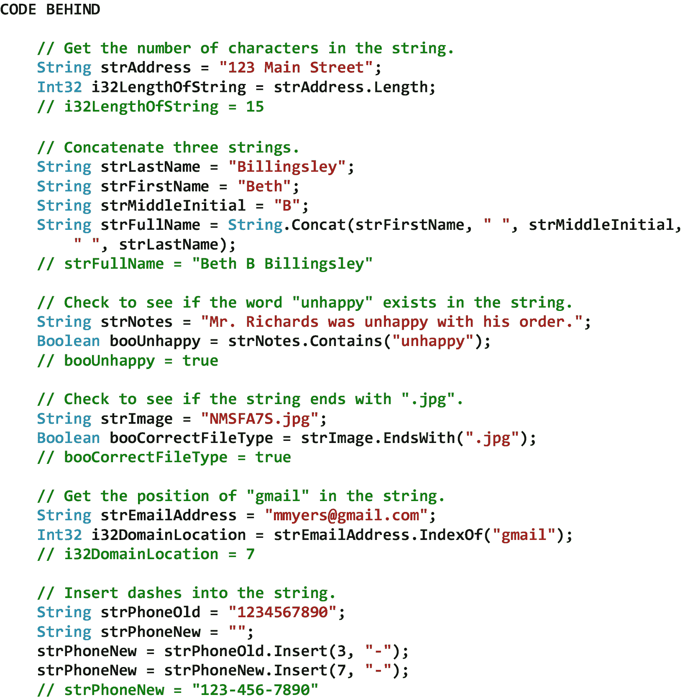

# 九、字符串操作

## 9.1 导言

字符串操作是在字符串*对象*上执行的过程。String 对象是从 String 类实例化的字符串类型，通常是在向它分配字符串文字时。例如，考虑以下字符串对象声明:

```cs
String strLastName = "Jones";

```

在本例中，新实例化的 String 对象是 strLastName。一旦这个字符串对象被实例化，我们就可以使用它的方法来操作字符串。

在这一章中，我们将从看连接开始。串联将两个或多个单独的项(包括字符串)连接起来，以便它们可以被视为单个项。接下来，我们将讨论转义序列，它允许我们在字符串中包含格式信息或特殊字符。之后，我们将看看逐字的文字。逐字文字允许我们在不使用转义序列的情况下向字符串中添加新行、制表符、反斜杠以及其他格式命令和特殊字符。最后，我们将讨论 String 类，它允许我们执行许多有用的字符串操作。

## 9.2 串联

单词 *concatenate* 来源于拉丁语 *concatenare* ，意为链接在一起或加入。因此，串联是指将两个或更多不同的项目放在一起，这样它们就可以被视为一个项目。在计算机程序设计中，连接操作通常用于将两个或多个字符串连接在一起，以便它们可以作为单个字符串使用。其他类型(例如，Byte、Decimal、Int32)也可以与字符串连接。图 [9-1](#Fig1) 显示了一些字符串连接的例子。请注意，图中的加号(+)将字符串类型和其他类型连接在一起。


图 9-1

字符串连接的示例

## 9.3 转义序列

一个*转义字符*是一个改变字符串中跟在它后面的字符(或多个字符)的含义的字符。因此，转义字符被视为字符串中的命令，而不是数据。在 C# 中，转义字符是反斜杠(\)。另一方面，*转义序列*是一系列字符，以转义字符开始，以具有预定义含义的字符(或多个字符)结束。这样的序列包括*格式信息*或*特殊字符*。常见的转义序列包括

*   \n 在字符串中包含新行

*   \t 在字符串中包含制表符

*   \\在字符串中包含反斜杠

*   \ "在字符串中包含引号

图 [9-2](#Fig2) 显示了一些转义序列的例子。请注意，在这些例子中，我们连接了许多字符串，其中一些包含转义序列。


图 9-2

转义序列的示例

## 9.4 逐字文字

*一字不差*一词来自拉丁语 *verbātim* ，意为“逐字逐句”或“与原文形式完全相同”许多编程语言允许声明和使用*逐字文字*。逐字文字允许我们添加新行、制表符、反斜杠和其他格式命令，并在字符串中添加特殊字符，而无需使用转义序列。在 C# 中，逐字文字总是以 at 符号(@)和双引号(")开始，并且总是以另一个双引号(")结束。在这些双引号内，我们可以格式化一个将被逐字处理(例如，显示)的字符串。也就是说，我们可以格式化一个字符串，它将被完全按照它在字符串中出现的样子来处理。唯一的例外是当我们想要显示双引号本身时。在这种情况下，我们必须输入两个双引号。因此，逐字文字中唯一的特殊字符是双引号字符。图 [9-3](#Fig3) 显示了一些逐字文字的例子。


图 9-3

逐字文字的示例

## 9.5 字符串类

string 类允许我们操作包含在 String 对象中的字符串。string 对象中的字符串从零开始。因此，字符串中的第*个*字符在位置*零*，字符串中的第*个*字符在位置*一个*，以此类推。表 [9-1](#Tab1) 显示了 String 类的一些属性、方法和事件。注意通过这个类我们可以使用的方法的数量。虽然还有许多其他方法，但图中所示的方法使用相对频繁。还要注意，该类的方法返回以下四种情况之一:一个新字符串、一个指示是否在该字符串中找到了某个内容的值、一个标识该字符串中某个内容的位置的从零开始的索引，或者一个字符串数组。此外，请注意，该类的一些方法需要一个或多个 Int32 类型的参数。这些参数必须是非负整数。请记住，如果我们试图调用已设置为 null 的字符串对象的方法，将会引发 NullReferenceException。要测试可能已被设置为 null 的 String 对象，我们可以使用 String 类的静态 IsNullOrEmpty 方法。

表 9-1

String 类的一些属性、方法和事件

<colgroup><col class="tcol1 align-left"> <col class="tcol2 align-left"></colgroup> 
| **类**字符串 |
| **命名空间**系统<sup>T3】1T5】</sup> |
| **属性** |
| 长度 | 获取当前 String 对象中的字符数。 |
| **方法** |
| Concat（String， String） | 连接字符串的两个指定实例。 |
| 包含(字符串) | 返回一个值，该值指示指定的子字符串是否出现在此字符串中。 |
| endswith(字符串) | 确定此字符串实例的结尾是否与指定的字符串匹配。 |
| 索引（字符串） | 报告此实例中指定字符串的第一个匹配项的从零开始的索引。 |
| Insert(Int32，String) | 返回一个新字符串，其中指定的字符串插入到此实例中的指定索引位置。 |
| IsNullOrEmpty(字符串) | 指示指定的字符串是 null 还是空字符串。 |
| 上一个索引（字符串） | 报告指定字符串在此实例中最后一次出现的从零开始的索引位置。 |
| PadLeft（Int32） | 返回一个新字符串，该字符串通过在左侧用空格填充来右对齐此实例中的字符，达到指定的总长度。 |
| PadRight(Int32) | 返回一个新字符串，该字符串通过在右侧填充空格来左对齐字符，达到指定的总长度。 |
| 移除(Int32) | 返回一个新字符串，其中当前实例中从指定位置开始一直到最后一个位置的所有字符都已被删除。 |
| 替换(字符串，字符串) | 返回一个新字符串，其中指定字符串在当前实例中的所有匹配项都被另一个指定字符串替换。 |
| Split(字符串[ ]，字符串拆分选项) | 基于数组中的字符串将字符串拆分成子字符串。您可以指定子字符串是否包含空数组元素。 |
| StartsWith(字符串) | 确定此字符串实例的开头是否与指定的字符串匹配。 |
| 子字符串(Int32，Int32) | 从此实例中检索子字符串。子字符串从指定的字符位置开始，具有指定的长度。 |
| ToLower（） | 返回此字符串转换为小写的副本。 |
| 假发戴上 | 返回此字符串转换为大写的副本。 |
| 修剪() | 从当前 String 对象中移除所有前导和尾随空白字符。 |
| Trim(Char[]) | 从当前 String 对象中移除数组中指定的一组字符的所有前导和尾随匹配项。 |
| **事件** |
| (参见参考文献。) |   |
| **参考** |
| [T2`https://msdn.microsoft.com/en-us/library/system.string(v=vs.110).aspx`](https://msdn.microsoft.com/en-us/library/system.string%2528v%253Dvs.110%2529.aspx) |

图 [9-4](#Fig4) 显示了字符串类的一些例子。

T3】

图 9-4

字符串类的示例

<aside aria-label="Footnotes" class="FootnoteSection" epub:type="footnotes">Footnotes [1](#Fn1_source)

所有属性、方法和事件描述都直接取自微软的官方文档。为了节省空间，省略了用于处理该类事件的事件处理程序方法。有关该类的所有方法，请参见参考。

 </aside>