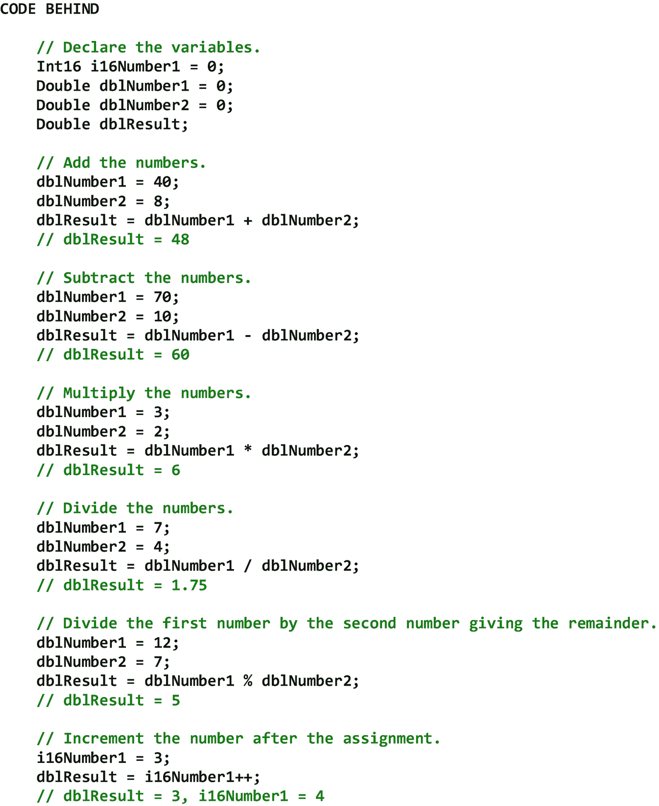
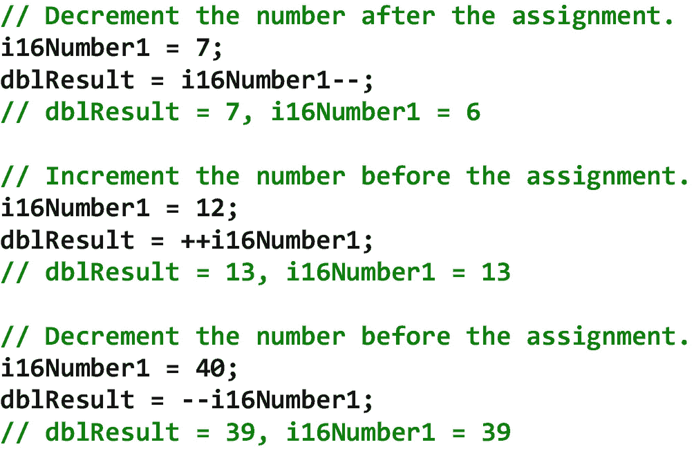
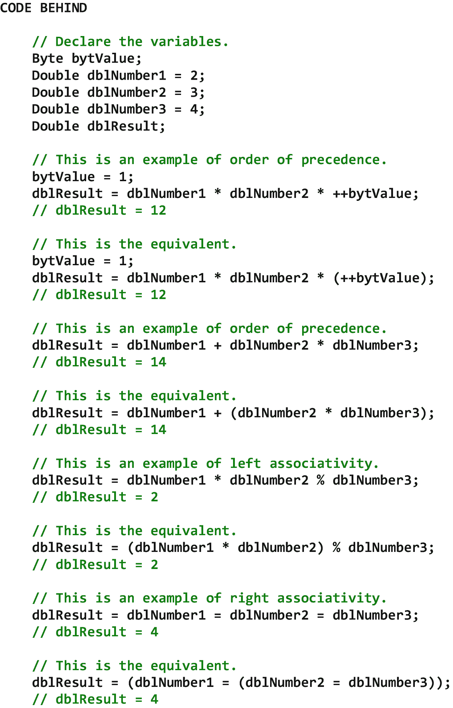
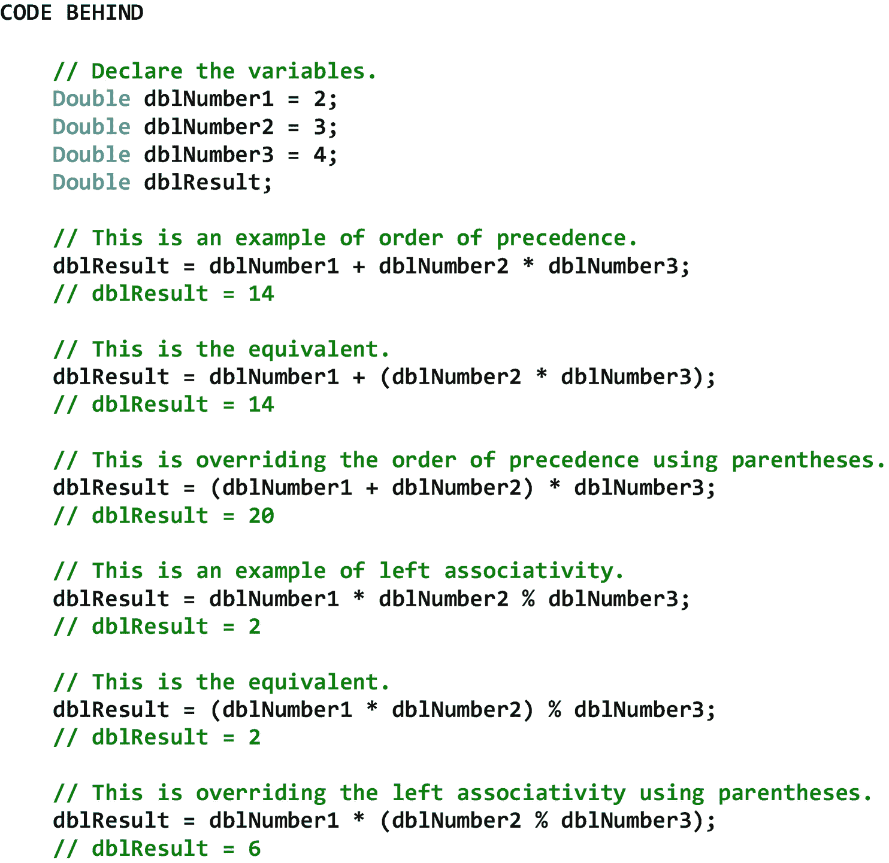
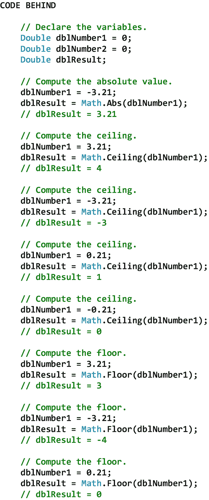
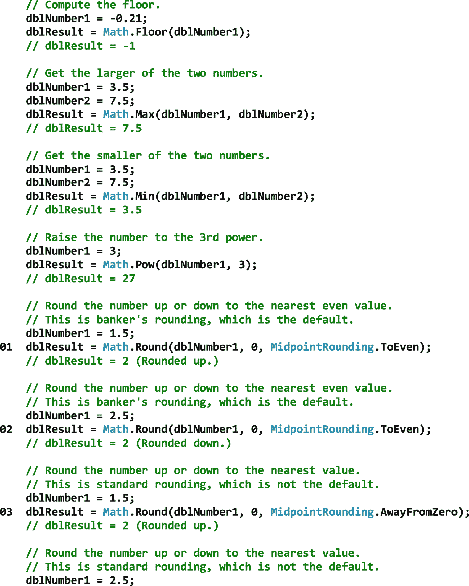

# 十、算术运算

## 10.1 简介

算术运算是一个过程，它接受一个或多个输入值(即操作数)，对这些值执行某种数学函数，然后将结果分配给输出。最基本的算术运算是加、减、乘和除。然而，还有更多算术运算，包括比较运算(例如，最小值、最大值)、指数运算(例如，k n )、对数运算(例如，log 2 n、ln n)、幅度运算(例如，绝对值)、幂运算(例如，n k )、根式运算(例如，平方根、立方根)、舍入运算(例如，舍入、地板、天花板、截断)和三角运算(例如，正弦、余弦、正切)。

在这一章中，我们将从几个算术运算符开始，包括加、减、乘、除、模、后缀增量、后缀减量、前缀增量和前缀减量运算符。接下来，我们将了解优先顺序的概念，它定义了在一个数学表达式中执行多个算术运算的顺序。我们还将讨论结合性的概念，当两个或更多算术运算符具有相同的优先级时，结合性定义了在单个数学表达式中执行多个算术运算的顺序。之后，我们将考虑括号。圆括号使多运算符数学表达式的意图更容易理解，并且它们覆盖了默认的优先级或结合性顺序。最后，我们将看看 Math 类，它是一个强大的静态类，允许我们非常容易地执行比较运算、指数运算、对数运算、幅度运算、幂运算、根式运算、舍入运算、三角运算和许多其他常见的数学运算。

## 10.2 算术运算符

算术运算符调用数学运算。所有命令式编程语言都至少包含一组最小的算术运算符，包括加、减、乘和除。C# 编程语言还包括模运算符作为其基本运算符之一。加法运算符(+)计算两个操作数的*和*(即一个加数加上另一个加数)。减法运算符(-)与加法运算符相反。减法运算符计算两个操作数之间的*差*(即被减数减去减数)。乘法运算符(∵)计算两个操作数的*乘积*(即被乘数乘以乘数)。除法(/)运算符与乘法运算符相反。除法运算符计算两个操作数的*商*(即被除数被除数分割成等量)。最后，模运算符(%)计算一个操作数除以另一个操作数后的余数*(也称为模数)。*

 *除了加、减、乘、除和取模运算符，C# 编程语言还包括后缀递增和递减运算符以及前缀递增和递减运算符。后缀递增运算符(操作数++)在执行了与操作数相关的赋值操作后递增操作数*。因此，在语句执行后，赋值变量的值将是不同于操作数值的*。后缀减量运算符(操作数-)在*执行相关的赋值操作后递减操作数*。同样，在语句执行后，赋值变量的值将与操作数的值不同。前缀递增运算符((+operand)在执行与操作数*相关的赋值操作之前递增操作数*。因此，在语句执行后，被赋值变量的值将与操作数的值相同。最后，前缀递减运算符(- operand)在执行与其相关联的赋值操作*之前递减操作数*。同样，在语句执行后，赋值变量的值将与操作数的值相同。可以看出，后缀运算符和前缀运算符之间有细微的区别。这就是为什么我们必须仔细测试包含这些操作符的任何代码，以确保它们的行为符合预期。**

表 [10-1](#Tab1) 总结了常见的 C# 算术运算符及其各自的描述。请注意，C# 中没有用于求幂和求根的算术运算符。这是因为我们将在后面讨论的 Math 类包含了执行这些操作的方法。

表 10-1

常见的 C# 算术运算符及其各自的描述

<colgroup><col class="tcol1 align-left"> <col class="tcol2 align-left"></colgroup> 
| 

操作员

 | 

描述

 |
| --- | --- |
| z = x + y | 加法(即计算 x 和 y 的*和*) |
| z = x–y | 减法(即计算 x 和 y 之间的*差* |
| z = x * y | 乘法(即计算 x 和 y 的*乘积* |
| z = x / y | 除法(即计算 x 和 y 的*商* |
| z = x % y | 模(即计算 x 和 y 相除后的余数 |
| z = x++ | 后缀增量(即在赋值操作后增量 x |
| z = x - | 后缀减量(即在赋值操作之后减量 x *)* |
| z = ++x | 前缀递增(即，在赋值操作之前递增 x |
| z = - x | 前缀递减(即在赋值操作之前递减 x |

图 [10-1](#Fig1) 显示了一些常见算术运算符的例子。

 

图 10-1

常见算术运算符的示例

## 10.3 优先顺序和关联性

根据*的优先顺序*执行算术运算。优先级顺序(即运算符优先级)定义了在多运算符数学表达式中执行算术运算的顺序。另一方面，当两个或多个算术运算符具有相同的优先级时，结合律定义了在多运算符数学表达式*中执行算术运算的顺序。*左关联运算符*从左到右求值，而*右关联运算符*从右到左求值。当用任何编程语言编码时，清楚地理解该编程语言在计算多运算符数学表达式时应用的优先级和结合性的顺序是很重要的。缺乏这样的理解会导致意想不到的结果。*

表 [10-2](#Tab2) 显示了常见的 C# 算术运算符及其各自的优先级和关联性。请注意，图中的算术运算符是按照从高(1)到低(5)的优先级顺序排列的，表示在多运算符数学表达式中执行算术运算的顺序。

表 10-2

常见的 C# 算术运算符及其各自的优先级和关联性

<colgroup><col class="tcol1 align-left"> <col class="tcol2 align-left"> <col class="tcol3 align-left"></colgroup> 
| 

操作员

 | 

优先顺序

 | 

结合性

 |
| --- | --- | --- |
| 操作数++，操作数—— | one | 从左到右 |
| ++操作数，操作数 | Two | 从右到左 |
| *, /, % | three | 从左到右 |
| +, - | four | 从左到右 |
| = | five | 从右到左 |

图 [10-2](#Fig2) 显示了一些优先级和结合性的例子。请注意，图中所有优先级和结合性的例子都有等价的例子。这些等价例子中的括号演示了优先级和结合性的顺序是如何实际执行的。首先执行最里面的括号中的算术运算，然后执行下一个最里面的括号中的算术运算，依此类推。

图 10-2

优先顺序和结合性的例子

## 10.4 括号

编码算术运算时使用括号有两个原因。首先，它们*阐明了*多运算符数学表达式中运算的求值顺序。也就是说，它们使表达的意图更容易理解。这个实践在前面的章节中被应用来演示优先级和结合性的顺序是如何实际执行的，并且在编码除了最简单的多操作符表达式之外的所有表达式时被推荐。其次，圆括号*覆盖了多运算符数学表达式中运算的默认顺序*。换句话说，它们覆盖了默认的优先级或结合性顺序。图 [10-3](#Fig3) 显示了一些使用括号来覆盖优先级和结合性的例子。同样，首先执行最内层括号中的算术运算，然后执行下一个最内层括号中的算术运算，依此类推。

图 10-3

使用括号覆盖优先级和结合性顺序的示例

## 10.5 数学课

除了加、减、乘、除、模、后缀增量、后缀减量、前缀增量和前缀减量等基本算术运算之外，C# 还通过 Math 类的方法提供了许多更复杂的运算。Math 类是一个静态类，其方法包括比较运算、指数运算、对数运算、幅度运算、幂运算、根式运算、舍入运算、三角运算和其他常见的算术运算。

表 [10-3](#Tab3) 显示了 Math 类的一些属性、方法和事件。请注意，表中显示的所有方法都在 Double 类型上操作。然而，它们中的许多也可以对其他数值类型进行操作。有关更多信息，请参见参考资料。

表 10-3

数学类的一些属性、方法和事件

<colgroup><col class="tcol1 align-left"> <col class="tcol2 align-left"></colgroup> 
| **班级**数学T3】1T5】 |
| **命名空间**系统 |
| **属性** |
| (参见参考文献。) |   |
| **方法** |
| Abs(双) | 返回双精度数的绝对值。 |
| 天花板(双层) | 返回大于或等于指定双精度数的最小整数值。 |
| 地板(双层) | 返回小于或等于指定双精度数的最大整数。 |
| 最大值(双倍，双倍) | 返回两个双精度数中较大的一个。 |
| 最小(双精度，双精度) | 返回两个双精度数中较小的一个。 |
| 功率(双倍，双倍) | 返回指定数字的指定幂。 |
| Round(Double，Int32，中点舍入) | 将双精度值舍入到指定的小数位数。一个参数指定如果值在两个数字的中间，如何对其进行舍入。 |
| 符号(双) | 返回一个表示双精度数符号的整数。 |
| Sqrt(双精度) | 返回指定数字的平方根。 |
| 截断(双精度) | 计算指定双精度数的整数部分。 |
| **事件** |
| (参见参考文献。) |   |
| **参考** |
| [T2`https://msdn.microsoft.com/en-us/library/system.math(v=vs.110).aspx`](https://msdn.microsoft.com/en-us/library/system.math%2528v%253Dvs.110%2529.aspx) |

图 [10-4](#Fig4) 显示了一些数学类的例子。图中方法返回的结果如表 [10-3](#Tab3) 所示。然而，有一种方法需要一些额外的解释。

请注意，在 01–04，使用了数学类的 Round 方法。在一些编程语言中，默认情况下，在舍入过程中，以 5 结尾的十进制值被向上舍入到最接近的值。例如，数字 1.5 和 2.5 将分别被向上舍入*到 2 和 3，从而遵循标准的*数学舍入*惯例。然而，在 C# 中，默认情况下，在舍入过程*中，以 5 结尾的十进制值会根据被舍入的数字*向上或向下*舍入到最接近的*偶数*值。例如，数字 1.5 和 3.5 将分别向上舍入*到 2 和 4，而数字 2.5 和 4.5 将分别向下舍入*到 2 和 4。因此，不会发生舍入到奇数值的情况。这种方法遵循标准的*银行家舍入*惯例。使用这种特殊舍入方法的原因是，在对大量数字进行舍入时，它可以避免舍入偏差。因此，如果我们的目的是执行标准的数学舍入，我们*必须*使用中点舍入。数学中的远离零参数。圆法。****

T2】

图 10-4

数学课的例子

<aside aria-label="Footnotes" class="FootnoteSection" epub:type="footnotes">Footnotes [1](#Fn1_source)

所有属性、方法和事件描述都直接取自微软的官方文档。为了节省空间，省略了用于处理该类事件的事件处理程序方法。有关该类的所有方法，请参见参考。

 </aside>*