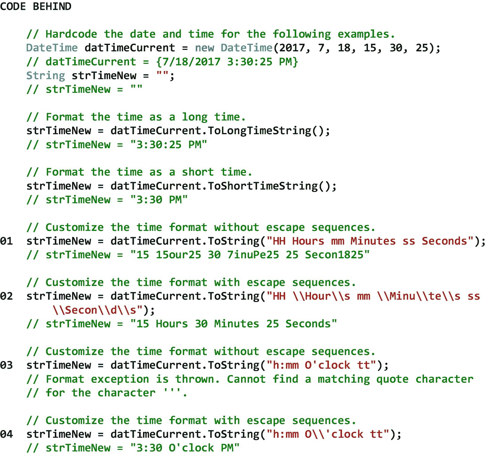

# 十一、日期和时间操作

## 11.1 简介

日期和时间操作处理时间值(即与时间相关的值)。常见的日期和时间操作包括从操作系统中检索当前日期和时间，提取日期(例如年、月、日)或时间(例如小时、分钟、秒)的组成部分，加上或减去日期或时间的组成部分，将一个日期或时间与另一个日期或时间进行比较，确定夏令时是否有效，确定是否是闰年，确定两个日期或时间之间的间隔，格式化日期或时间，以及解析日期和时间。

在本章中，我们将从 DateTime 结构开始，它允许我们创建和处理日期和时间。接下来，我们将讨论 DateTime 结构中与日期相关的属性，这些属性允许我们从操作系统中检索日期并提取日期的组成部分。然后，我们将查看与日期相关的方法，这些方法允许我们增加或减少日期的组成部分，将一个日期与另一个日期进行比较，确定夏令时是否有效，确定是否是闰年，以及确定两个日期之间的时间间隔。之后，我们将讨论与日期相关的方法，这些方法允许我们将日期格式化成我们想要的样子。我们还将研究与日期相关的方法，该方法允许我们解析日期(和时间)。在考虑了 DateTime 结构中与日期相关的属性和方法之后，我们将讨论 DateTime 结构中与时间相关的属性和方法。首先，我们将考虑 DateTime 结构中与时间相关的属性，这些属性允许我们从操作系统中检索时间，并提取时间的组成部分。之后，我们将看看与时间相关的方法，这些方法允许我们增加或减少时间的组成部分，将一个时间与另一个时间进行比较，并确定两个时间之间的间隔。最后，我们将讨论与时间相关的方法，这些方法允许我们将时间格式化成我们想要的样子。

## 11.2 日期时间结构

DateTime 结构允许我们创建和处理日期和时间。此结构能够表示公元 1 年 1 月 1 日上午 00:00:00 到公元 9999 年 12 月 31 日晚上 11:59:59 之间的日期和时间。在 C# 中，时间以*刻度*来度量，其中 1 刻度等于 100 纳秒(即十亿分之一秒)。因此，给定的日期和时间等于自公元 1 年 1 月 1 日上午 00:00:00 以来发生的刻度数。日期时间值以日历的形式表示。中的默认日历。NET 是公历*(又名，西方日历或基督教日历)，但也可以使用其他日历。公历是当今世界上使用最广泛的日历，它基于一年 365 天，分为 12 个不规则长度的月。虽然公历中的大多数月份有 30 天或 31 天，但一个月(即二月)有 28 天，加上闰年中的一天，这使得公历闰年有 366 天长。*

 *注意，DateTime 结构被称为一个*结构*，而不是一个*类*。这是因为 DateTime 结构是一个*值*类型，它保存一个日期和时间*值*，该值具有一个设定的内存分配大小(即 64 位或 8 字节)。另一方面，一个类是一个*引用*类型，它拥有一个*指针*指向另一个*不*具有设定的内存分配大小的内存地址。然而，我们很快就会看到，DateTime 结构的外观和行为很像一个类。

表 [11-1](#Tab1) 显示了日期时间结构的一些属性、方法和事件。请注意，表中没有显示从*减去*年、月、日、小时、分钟、秒钟等的方法。这是因为我们可以通过将负的*值传递给相关的 Add 方法来执行这些操作。还要注意在 Now 属性的描述中对当地时间*的引用。本地时间与特定的时区相关联，即服务器所在的时区。美国时区包括夏威夷、阿拉斯加、太平洋、山地、中部和东部。根据日期在特定服务器上的配置方式，当地时区可能会在三月的第二个星期日凌晨 2:00 自动调整为夏令时，然后在十一月的第一个星期日凌晨 2:00 恢复为标准时间，至少对于美国的大部分地区是如此。如果希望在 Web 浏览器中显示*客户机*的本地时间，我们需要使用 JavaScript(将在本书后面讨论)从客户机的操作系统中检索本地时间。

表 11-1

DateTime 结构的一些属性、方法和事件

<colgroup><col class="tcol1 align-left"> <col class="tcol2 align-left"></colgroup> 
| **结构**日期时间T3】1T5】 |
| **命名空间**系统 |
| **属性** |
| 一天 | 获取此实例表示的一个月中的某一天。 |
| 星期几 | 获取此实例表示的一周中的某一天。 |
| 年复一天 | 获取此实例表示的一年中的某一天。 |
| 小时 | 获取此实例表示的日期的小时部分。 |
| 分钟 | 获取此实例表示的日期的分钟部分。 |
| 月 | 获取此实例表示的日期的月份部分。 |
| 现在 | 获取一个 DateTime 结构，该结构设置为该计算机上的当前日期和时间，以本地时间表示。 |
| 第二 | 获取此实例表示的日期的秒部分。 |
| 时间日 | 获取此实例的时间。 |
| 今天 | 获取当前日期。 |
| 年 | 获取此实例表示的日期的年份部分。 |
| **方法** |
| AddDays(双精度) | 返回一个新的 DateTime，它将指定的天数添加到此实例的值中。 |
| AddHours(双小时) | 返回一个新的 DateTime，它将指定的小时数添加到此实例的值中。 |
| AddMinutes(双分钟) | 返回一个新的 DateTime，它将指定的分钟数添加到此实例的值中。 |
| AddMonths(Int32) | 返回一个新的 DateTime，它将指定的月数添加到此实例的值中。 |
| AddSeconds(双精度) | 返回一个新的 DateTime，它将指定的秒数添加到此实例的值中。 |
| AddYears(Int32) | 返回一个新的 DateTime，它将指定的年数添加到此实例的值中。 |
| 比较到（日期时间） | 将此实例的值与指定的 DateTime 值进行比较，并返回一个整数，该整数指示此实例是早于、等于还是晚于指定的 DateTime 值。 |
| IsDaylightSavingTime() | 指示 DateTime 的此实例是否在当前时区的夏令时范围内。 |
| island year(int 32) | 返回指定年份是否为闰年的指示。 |
| 减法(日期时间) | 从该实例中减去指定的日期和时间。 |
| ToLongDateString() | 将当前 DateTime 结构的值转换为它的等效长日期字符串表示形式。 |
| ToLongTimeString() | 将当前 DateTime 结构的值转换为它的等效长时间字符串表示形式。 |
| ToShortDateString() | 将当前 DateTime 结构的值转换为它的等效短日期字符串表示形式。 |
| ToShortTimeString() | 将当前 DateTime 结构的值转换为它的等效短时间字符串表示形式。 |
| ToString() | 使用当前区域性的格式约定，将当前 DateTime 结构的值转换为它的等效字符串表示形式。 |
| ToString(字符串) | 使用指定的格式和当前区域性的格式设置约定，将当前 DateTime 结构的值转换为它的等效字符串表示形式。 |
| TryParse(String，DateTime) | 将日期和时间的指定字符串表示形式转换为其等效的 DateTime，并返回一个指示转换是否成功的值。 |
| **事件** |
| (参见参考文献。) |   |
| **参考** |
| [T2`https://msdn.microsoft.com/en-us/library/system.datetime(v=vs.110).aspx`](https://msdn.microsoft.com/en-us/library/system.datetime%2528v%253Dvs.110%2529.aspx) |

## 11.3 与日期相关的属性

本节描述的与日期相关的属性允许我们从操作系统中检索日期，并提取日期的组成部分。图 [11-1](#Fig1) 显示了一些日期相关属性的例子。

请注意 01，我们使用 today 属性从操作系统获取今天的日期。可以看到，当我们使用该属性获取当前日期时，日期的时间部分被设置为 12:00:00 AM。这是因为我们只要求日期。

图 11-1

日期相关属性的示例

## 11.4 日期相关方法

本节中描述的与日期相关的方法允许我们添加或减去日期的组成部分，比较一个日期与另一个日期，确定夏令时是否有效，确定是否是闰年，以及确定两个日期之间的时间间隔。图 [11-2](#Fig2) 显示了一些日期相关方法的例子。

图 11-2

日期相关方法的示例

## 11.5 日期格式

本节中描述的与日期相关的方法允许我们将日期格式化成我们想要的样子。由于日期通常必须根据文化规范、国际标准、应用要求、个人偏好等以不同的方式显示，因此 DateTime 结构允许我们通过特殊的格式化方法(例如 ToLongDateString 方法、ToShortDateString 方法)以及通过使用*格式说明符*重载的 ToString 方法*来格式化日期。本质上，当我们将格式说明符作为参数传递给 ToString 方法时，该方法是重载的。表 [11-2](#Tab2) 显示了一些自定义日期格式说明符。*

表 11-2

一些自定义日期格式说明符

<colgroup><col class="tcol1 align-left"> <col class="tcol2 align-left"></colgroup> 
| 

格式指定符

 | 

描述

 |
| --- | --- |
| “d” | 一个月中的第几天，从 1 到 31。 |
| " dd " | 一个月中的第几天，从 01 到 31。 |
| " ddd " | 一周中某一天的缩写名称。 |
| " dddd " | 一周中某一天的全名。 |
| " g " | 时期或时代。 |
| " M " | 月份，从 1 到 12。 |
| “嗯” | 月份，从 01 到 12。 |
| “嗯” | 月份的缩写名称。 |
| 《MMMM》 | 月份的全名。 |
| " y " | 年份，从 0 到 99。 |
| " yy " | 年份，从 00 年到 99 年。 |
| " yyyy " | 四位数的年份。 |
| **参考** |
| [T2`https://docs.microsoft.com/en-us/dotnet/standard/base-types/custom-date-and-time-format-strings`](https://docs.microsoft.com/en-us/dotnet/standard/base-types/custom-date-and-time-format-strings) |

图 [11-3](#Fig3) 显示了一些日期格式的例子。

图 11-3

日期格式示例

## 11.6 日期解析

本节描述的与日期相关的方法允许我们*解析*一个日期。 [2](#Fn2) 解析日期意味着获取一个字符串形式的日期，将其分解成组成部分，并将其转换为有效的日期时间结构。要在 C# 编程语言中解析日期，我们可以使用 DateTime 结构的 TryParse 方法。图 [11-4](#Fig4) 显示了一些日期解析的例子。

注意在 01 处，TryParse 方法包含两个参数。第一个是方法的*输入*参数。此参数需要字符串类型形式的日期。第二个是方法的*输出*参数。此参数以日期时间类型的形式返回日期。从这个例子中可以看出，由于解析成功，解析后的日期被放在输出 DateTime 结构中，该方法返回 true。

请注意，在 01–03，我们试图解析一个包含破折号的日期、一个包含斜线的日期和一个写出的日期。可以看出，这三种情况下解析都是成功的。这证明了 TryParse 方法的灵活性。

请注意 04，我们正试图解析一个无效的日期。从这个例子中可以看出，由于解析是*而不是*成功的，所以 1/1/0001 12:00:00 AM 被放置在输出日期时间结构中，并且该方法返回 false。此解析不成功，因为 02-29-2017 不是非闰年的有效日期。

图 11-4

日期解析的示例

## 11.7 与时间相关的属性

本节描述的与时间相关的属性允许我们从操作系统中检索时间，并提取时间的组成部分。图 [11-5](#Fig5) 显示了一些时间相关属性的例子。

请注意，在 01，我们使用 Now 属性从操作系统获取当前日期*和*时间。

图 11-5

与时间相关的属性的示例

## 11.8 与时间相关的方法

本节中描述的与时间相关的方法允许我们增加或减少时间的组成部分，将一个时间与另一个时间进行比较，并确定两个时间之间的间隔。图 [11-6](#Fig6) 显示了一些时间相关方法的例子。

图 11-6

时间相关方法的示例

## 11.9 时间格式

本节中描述的与时间相关的方法允许我们将时间格式化成我们想要的样子。由于时间通常必须根据文化规范、国际标准、应用要求、个人偏好等以不同的方式显示，DateTime 结构允许我们通过特殊的格式化方法(例如，ToLongTimeString 方法、ToShortTimeString 方法)以及通过使用*格式说明符*重载的 ToString 方法*来格式化时间。如前所述，当我们将格式说明符作为参数传递给 ToString 方法时，该方法会被重载。表 [11-3](#Tab3) 显示了一些自定义时间格式说明符。*

表 11-3

一些自定义时间格式说明符

<colgroup><col class="tcol1 align-left"> <col class="tcol2 align-left"></colgroup> 
| 

格式指定符

 | 

描述

 |
| --- | --- |
| " f " | 日期和时间值中的十分之一秒。 |
| " ff " | 日期和时间值中的百分之一秒。 |
| “h” | 小时，使用从 1 到 12 的 12 小时制。 |
| " hh " | 小时，使用从 01 到 12 的 12 小时制。 |
| " H " | 小时，使用从 0 到 23 的 24 小时制。 |
| " HH " | 小时，使用 24 小时制从 00 到 23。 |
| " m " | 分钟，从 0 到 59。 |
| “嗯” | 分钟，从 00 到 59。 |
| " s " | 第二个，从 0 到 59。 |
| “党卫军” | 第二个，从 00 到 59。 |
| " t " | AM/PM 指示符的第一个字符。 |
| 《tt》 | AM/PM 指示符。 |
| **参考** |
| [T2`https://docs.microsoft.com/en-us/dotnet/standard/base-types/custom-date-and-time-format-strings`](https://docs.microsoft.com/en-us/dotnet/standard/base-types/custom-date-and-time-format-strings) |

图 [11-7](#Fig7) 显示了一些时间格式的例子。回想一下标题为“字符串操作”的第 9 章[中的内容，转义序列包括字符串中的格式信息或特殊字符。](09.html)

请注意，在 01 处，传递给 ToString 方法的时间格式参数中没有转义序列。可以看出，格式化操作的结果相当奇怪。

请注意 02 处的相同时间格式化参数，但添加了转义序列。这种格式化操作的结果更有意义。

请注意，在 03 处，传递给 ToString 方法的时间格式参数中也没有转义序列。可以看出，这个操作抛出了一个格式异常。

请注意 04 处的相同时间格式化参数，但添加了转义序列。这个格式化操作现在可以正常工作了。

图 11-7

时间格式示例

<aside aria-label="Footnotes" class="FootnoteSection" epub:type="footnotes">Footnotes [1](#Fn1_source)

所有属性、方法和事件描述都直接取自微软的官方文档。为了节省空间，省略了用于处理该类事件的事件处理程序方法。有关该类的所有方法，请参见参考。

  [2](#Fn2_source)

也可以解析时间。

 </aside>*