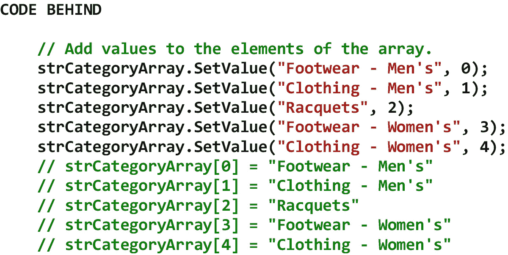
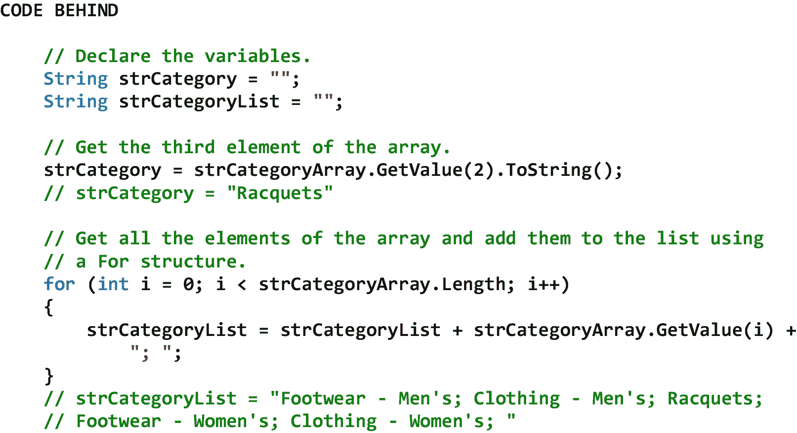

# 十二、数组运算

## 12.1 简介

数组是一个容器，当它被计算机程序操作时，它保存数据。更具体地说，它是一个由一组*相同*类型的*元素*组成的*数据结构*，其中每个元素都包含自己的值，并由一个或多个*索引*(也称为下标)标识。数组可以是一维的，也可以是多维的。 [1](#Fn1) 一维数组的元素被单个索引引用，二维数组的元素被两个索引引用，以此类推。三维或更多维的阵列并不少见。 [2](#Fn2) 数组中元素的总数就是它的*长度*。数组的每个维度都有一个*下界*(即数组的第*个*元素的索引)和一个*上界*(即数组的最后*个*元素的索引)。由于在 C# 中默认情况下数组是从零开始的，所以一维数组中第一个元素的索引是[0]，第二个元素的索引是[1]，依此类推。二维数组中第一个元素的索引是[0，0]，第二个元素的索引是[0，1]，依此类推。 [3](#Fn3) 一个数组被*静态分配*。也就是说，一旦声明，其容量就不能更改。一个数组被认为是一个*内部*数据结构，因为它驻留在 RAM 中，并且只在使用它的程序终止之前保留在那里。因此，数组中的数据被称为*非持久*。这与数据库表形成对比，数据库表被认为是一个*外部*数据结构，因为它驻留在外围设备(例如，磁盘)上，甚至在使用它的程序终止后仍保留在那里。因此，数据库表中的数据被称为*持久*。

在本章中，我们将从 Array 类开始。Array 类提供了一些方法(其中一些是静态的),允许我们获取关于数组的信息，用数据填充数组，从数组中检索数据，对数组排序，搜索数组，复制数组，或者以其他方式操作数组。接下来，我们将讨论一维数组。一维数组是最容易声明和使用的数组，因为它只包含一个维度，并且只使用一个索引来引用它的元素。最后，我们将考虑二维数组。二维数组的声明和使用也相对简单，因为它只包含两个维度，并且只使用两个索引来引用其元素。

## 12.2 数组类

Array 类提供了一些方法(其中一些是静态的),允许我们获取关于数组的信息，用数据填充数组，从数组中检索数据，对数组排序，搜索数组，复制数组，或者以其他方式操作数组。英寸 NET 中，数组类被认为是一个*集合*，尽管它是系统的*而不是*部分。定义 Stack 类、Queue 类、LinkedList 类和 SortedList 类的集合命名空间。我们将在第 13 章[的“收集操作”中讨论这些收集表](13.html) [12-1](#Tab1) 显示了数组类的一些属性、方法和事件。

表 12-1

Array 类的一些属性、方法和事件

<colgroup><col class="tcol1 align-left"> <col class="tcol2 align-left"></colgroup> 
| **级**阵级 [4](#Fn4) 级 |
| **命名空间**系统 |
| **属性** |
| 长度 | 获取数组所有维度中的元素总数。 |
| **方法** |
| BinarySearch(数组，对象) | 在整个一维排序数组中搜索特定元素。 |
| 清除(数组，Int32，Int32) | 将数组中的元素范围设置为每种元素类型的默认值。 |
| Copy(数组，Int32，数组，Int32，Int32) | 从指定的源索引处开始复制数组中的一系列元素，并将其粘贴到从指定的目标索引处开始的另一个数组中。长度和索引被指定为 32 位整数。 |
| GetLength（Int32） | 获取一个 32 位整数，表示数组的指定维度中的元素数。参数是数组的从零开始的维度。 |
| get power bound(int 32) | 获取数组中指定维度的第一个元素的索引。参数是数组的从零开始的维度。 |
| GetUpperBound（Int32） | 获取数组中指定维度的最后一个元素的索引。参数是数组的从零开始的维度。 |
| GetValue（Int32） | 获取一维数组中指定位置的值。索引被指定为 32 位整数。 |
| GetValue（Int32， Int32） | 获取二维数组中指定位置的值。索引被指定为 32 位整数。 |
| 反向(阵列) | 反转整个一维数组中元素的顺序。 |
| SetValue（Object， Int32） | 为一维数组中指定位置的元素设置一个值。索引被指定为 32 位整数。 |
| SetValue（Object， Int32， Int32） | 为二维数组中指定位置的元素设置一个值。索引被指定为 32 位整数。 |
| 排序(数组) | 对整个一维数组中的元素进行排序。 |
| **事件** |
| 钠 |   |
| **参考** |
| [T2`https://msdn.microsoft.com/en-us/library/system.array(v=vs.110).aspx`](https://msdn.microsoft.com/en-us/library/system.array%2528v%253Dvs.110%2529.aspx) |

## 12.3 一维数组

一维数组是最容易声明和使用的数组，因为它只包含一个维度，并且只使用一个索引来引用它的元素。从概念上讲，一维数组就像一个抽屉柜，比如说，内衣在最上面的抽屉里，袜子在第二个抽屉里，衬衫在第三个抽屉里，短裤在第四个抽屉里，裤子在第五个抽屉里。当我们想放一双袜子时，我们会直接去第二个抽屉把袜子放进去。相反，当我们想取回一双袜子时，我们直接去*的第二个抽屉拿出那双袜子。因此，我们可以*直接*打开抽屉柜中的任何一个抽屉。一维数组以同样的方式运行。图 [12-1](#Fig1) 显示了一些声明一维数组的例子。*

请注意，在 01 处，我们声明了一个三元素的一维字符串数组。在这个例子中，字符串[]表示我们正在定义一个一维数组(不是单值变量)，字符串[3]表示我们正在定义一个包含三个元素的数组。可以看出，数组的第一个元素位于索引[0]，数组的最后一个元素位于索引[2]。注意，在这个例子中，数组中的所有元素都包含空值，因为还没有给它们赋值。

请注意，在 02 处，我们声明了一个五元素一维字符串数组。在本例中，字符串[]表示我们正在定义一个一维数组(不是单值变量)，字符串[5]表示我们正在定义一个包含五个元素的数组。可以看出，数组的第一个元素位于索引[0]，数组的最后一个元素位于索引[4]。请注意，在本例中，数组中的所有元素都包含数据。该数据通过数组定义本身中的逗号分隔列表分配给数组的元素。请记住，我们可以声明任何类型的数组。网络类型。

图 12-1

声明一维数组的示例

除了声明一维数组之外，我们还必须经常获取关于它们的信息，用数据填充它们，从它们中检索数据，对它们排序，搜索它们，复制它们，或者以其他方式操作它们。图 [12-2](#Fig2) 展示了一个获取一维数组中元素总数的例子。

图 12-2

获取一维数组中元素总数的示例

图 [12-3](#Fig3) 显示了一个使用索引填充一维数组元素的例子。

图 12-3

使用索引填充一维数组元素的示例

图 [12-4](#Fig4) 显示了一个使用 SetValue 方法填充一维数组元素的例子。从这个例子中可以看出，使用 Array 类的 SetValue 方法产生的结果与使用 indices 产生的结果相同。但是，使用索引会产生更干净的代码。另一方面，SetValue 方法有一些额外的功能，在某些情况下可能有用。鼓励感兴趣的读者自己探索 SetValue 方法。

图 12-4

使用 SetValue 方法填充一维数组元素的示例

图 [12-5](#Fig5) 显示了一些使用索引检索一维数组元素的例子。

图 12-5

使用索引检索一维数组元素的示例

图 [12-6](#Fig6) 显示了一些使用 GetValue 方法获取一维数组元素的例子。从这个例子中可以看出，使用 Array 类的 GetValue 方法会产生与使用 indices 相同的结果。但是，请记住，GetValue 方法有一些额外的功能，在某些情况下可能会有用。鼓励感兴趣的读者自己探索 GetValue 方法。

图 12-6

使用 GetValue 方法检索一维数组元素的示例

图 [12-7](#Fig7) 显示了一个一维数组元素排序的例子。可以看出，Sort 方法是 Array 类的静态方法。

图 12-7

对一维数组的元素进行排序的示例

图 [12-8](#Fig8) 显示了一些搜索一维数组元素的例子。请记住，顺序搜索中使用的数组不需要排序才能工作。但是，如果要搜索的数组是有序的，那么顺序搜索会更有效。二分搜索法*中使用的数组必须*按升序排序才能工作。当执行二分搜索法时，如果在数组中找到搜索项，则返回正值(即该项的索引)。否则，将返回负值。可以看出，BinarySearch 方法是 Array 类的静态方法。

图 12-8

搜索一维数组元素的示例

图 [12-9](#Fig9) 显示了将一个一维数组的元素复制到另一个一维数组的例子。可以看出，Copy 方法是 Array 类的一个静态方法。注意，这个方法不仅复制了*相同*类型数组之间的元素，还复制了*不同*类型数组之间的元素。任何必要的造型都是自动完成的。

图 12-9

将一个一维数组的元素复制到另一个一维数组的示例

图 [12-10](#Fig10) 显示了一个反转一维数组元素的例子。可以看出，Reverse 方法是 Array 类的静态方法。

图 12-10

反转一维数组元素的示例

图 [12-11](#Fig11) 显示了一个清除一维数组元素的例子。可以看出，Clear 方法是 Array 类的一个静态方法。

图 12-11

清除一维数组元素的示例

## 12.4 二维数组

二维数组(也称为矩形数组)的声明和使用也相对简单，因为它仅包含两个维度，并且仅使用两个索引来引用其元素。从概念上讲，二维数组就像剧院的座位，一排排座位从剧院的前面延伸到剧院的后面，一个个座位从剧院的右侧延伸到剧院的左侧。要定位一个预定的座位，比如说第 10 排第 15 个座位，我们将首先定位第 10 排，然后定位第 15 个座位。二维数组以同样的方式运行。在 C# 中，二维数组的*第一个*索引是指数组的*行*，而*第二个*索引是指数组的*列*。图 [12-12](#Fig12) 显示了一些声明二维数组的例子。

请注意，在 01 处，我们声明了一个六元素的二维小数数组。在本例中，小数[，]表示我们正在定义一个二维数组(不是单值变量)，小数[3，2]表示我们正在为总共 6 个元素定义一个 3 行 2 列的数组。可以看出，数组的第一个元素位于索引[0，0]，数组的最后一个元素位于索引[2，1]。注意，在这个例子中，数组中的所有元素都包含 0，因为还没有给它们赋值。

请注意，我们在 02 处声明了一个 21 元素的二维小数数组。在本例中，小数[，]表示我们正在定义一个二维数组(不是单值变量)，小数[3，7]表示我们正在定义一个 3 行 7 列共 21 个元素的数组。可以看出，数组的第一个元素位于索引[0，0]，数组的最后一个元素位于索引[2，6]。请注意，在本例中，数组中的所有元素都包含数据。该数据通过数组定义本身中的逗号分隔列表分配给数组的元素。请记住，我们可以声明几乎任何类型的数组。网络类型。

图 12-12

声明二维数组的示例

除了声明二维数组之外，我们还必须经常获取关于它们的信息，用数据填充它们，从它们中检索数据，对它们排序，搜索它们，复制它们，或者以其他方式操作它们。 [5](#Fn5) 图 [12-13](#Fig13) 展示了一个获取二维数组中元素、行和列的总数的例子。

图 12-13

获取二维数组中元素、行和列的总数的示例

图 [12-14](#Fig14) 显示了一个使用索引填充二维数组元素的例子。

图 12-14

使用索引填充二维数组元素的示例

图 [12-15](#Fig15) 显示了一个使用 SetValue 方法填充二维数组元素的例子。从这个例子中可以看出，使用 Array 类的 SetValue 方法产生的结果与使用 indices 产生的结果相同。但是，使用索引会产生更干净的代码。另一方面，SetValue 方法有一些额外的功能，在某些情况下可能有用。鼓励感兴趣的读者自己探索 SetValue 方法。

图 12-15

使用 SetValue 方法填充二维数组元素的示例

图 [12-16](#Fig16) 显示了一个使用索引检索二维数组所有元素的例子。

注意 01 处代码的*外循环*。对于这个循环，I 将被初始化为 0，并且当它小于数组的第一个*维度的长度(即 3)时，将继续递增。*

注意 02 处代码的*内循环*。对于这个循环，j 将被初始化为 0，并且当它小于数组的第二个维度*的长度(即 7)时，将继续递增。注意，第一次执行内部循环中的代码时，I 和 j 将分别为 0 和 0。这将检索数组中第一个元素[0，0]的值。接下来，j 将递增，内循环中的代码将再次执行。这将检索数组中第二个元素[0，1]的值。当 j 小于数组的第二个*维度*的长度时，内循环中的代码将继续执行。当 j 变得*而不是*小于数组的第二个*维*的长度时，将退出内循环，程序控制将传递回外循环，I 将递增，程序控制将传递到内循环，j 将*重新初始化*为 0，内循环将再次执行。这个过程将继续，直到遍历完数组中的所有元素。*

图 12-16

使用索引检索二维数组的所有元素的示例

图 [12-17](#Fig17) 显示了一个使用 GetValue 方法获取二维数组所有元素的例子。从这个例子中可以看出，使用 Array 类的 GetValue 方法会产生与使用 indices 相同的结果。但是，请记住，GetValue 方法有一些额外的功能，在某些情况下可能会有用。鼓励感兴趣的读者自己探索 GetValue 方法。

注意 01 处代码的*外循环*。对于这个循环，I 将被初始化为 0，并且当它小于数组的第一个*维度的长度(即 3)时，将继续递增。*

注意 02 处代码的*内循环*。对于这个循环，j 将被初始化为 0，并且当它小于数组的第二个维度*的长度(即 7)时，将继续递增。注意，第一次执行内部循环中的代码时，I 和 j 将分别为 0 和 0。这将检索数组中第一个元素[0，0]的值。接下来，j 将递增，内循环中的代码将再次执行。这将检索数组中第二个元素[0，1]的值。当 j 小于数组的第二个*维度*的长度时，内循环中的代码将继续执行。当 j 变得*而不是*小于数组的第二个*维*的长度时，将退出内循环，程序控制将传递回外循环，I 将递增，程序控制将传递到内循环，j 将*重新初始化*为 0，内循环将再次执行。这个过程将继续，直到遍历完数组中的所有元素。*

图 12-17

使用 GetValue 方法检索二维数组的所有元素的示例

图 [12-18](#Fig18) 显示了一个搜索二维数组元素的例子。

注意 01 处代码的*外循环*。对于这个循环，I 将被初始化为 0，并且当它小于数组的第一个*维度的长度(即 3)时，将继续递增。*

注意 02 处代码的*内循环*。对于这个循环，j 将被初始化为 0，并且当它小于数组的第二个维度*的长度(即 7)时，将继续递增。注意，第一次执行内部循环中的代码时，I 和 j 将分别为 0 和 0。接下来，j 将递增，内循环中的代码将再次执行。当 j 小于数组的第二个*维度*的长度时，内循环中的代码将继续执行。当 j 变得*而不是*小于数组的第二个*维*的长度时，将退出内循环，程序控制将传递回外循环，I 将递增，程序控制将传递到内循环，j 将*重新初始化*为 0，内循环将再次执行。这个过程将继续，直到遍历完数组中的所有元素*或*，直到内部循环中的条件为*真*，这表示在数组中找到了搜索项。*

请记住，顺序搜索中使用的数组不需要排序才能工作。但是，如果要搜索的数组是有序的，那么顺序搜索会更有效。还要注意，Array 类不包含可以搜索一维以上数组的静态 BinarySearch 方法。

图 12-18

搜索二维数组元素的示例

图 [12-19](#Fig19) 显示了将一个二维数组的元素复制到另一个二维数组的例子。可以看出，Copy 方法是 Array 类的一个静态方法。注意，这个方法不仅复制了*相同*类型数组之间的元素，还复制了*不同*类型数组之间的元素。任何必要的造型都是自动完成的。

图 12-19

将一个二维数组的元素复制到另一个二维数组的示例

<aside aria-label="Footnotes" class="FootnoteSection" epub:type="footnotes">Footnotes [1](#Fn1_source)

数组甚至可以包含其他数组。这些数组被称为*交错*数组。在本书中，我们不会考虑交错数组。

  [2](#Fn2_source)

在 C# 中，可以声明多达 32 维的多维数组。

  [3](#Fn3_source)

如果需要，Array 类允许我们定义不同的下限。

  [4](#Fn4_source)

所有属性、方法和事件描述都直接取自微软的官方文档。为了节省空间，省略了用于处理该类事件的事件处理程序方法。有关该类的所有方法，请参见参考。

  [5](#Fn5_source)

尽管这个数组操作列表中提到了排序，但是 array 类*而不是*包含一个静态排序方法来排序二维数组。如果需要对这样的数组进行排序，我们就必须编写必要的代码来对其进行排序。

 </aside>