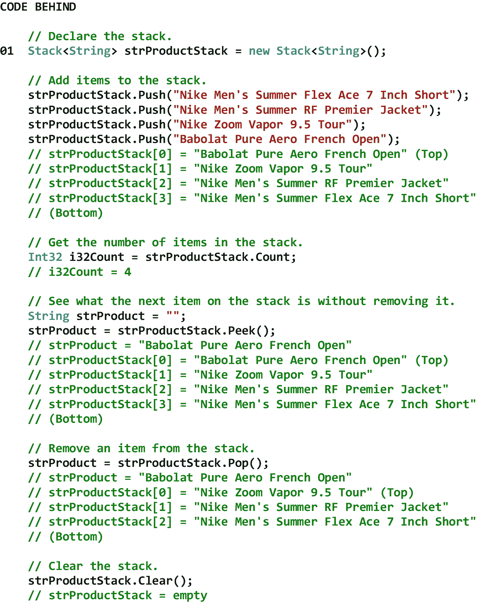
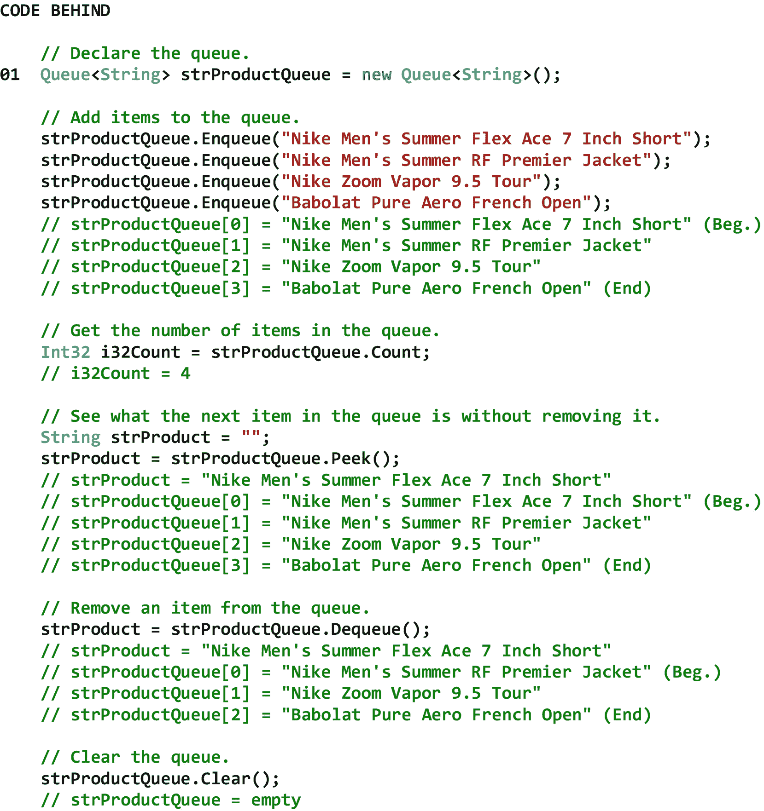
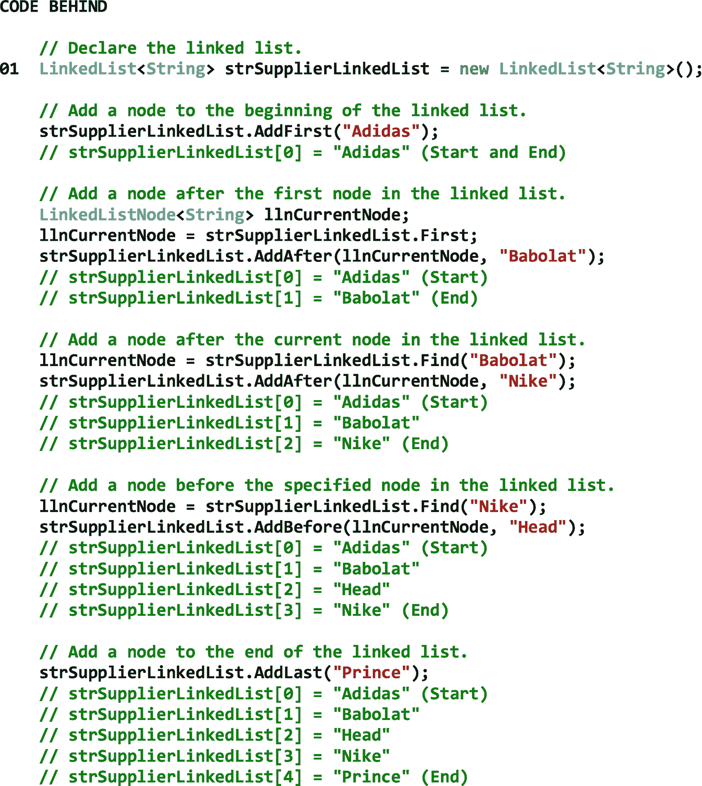
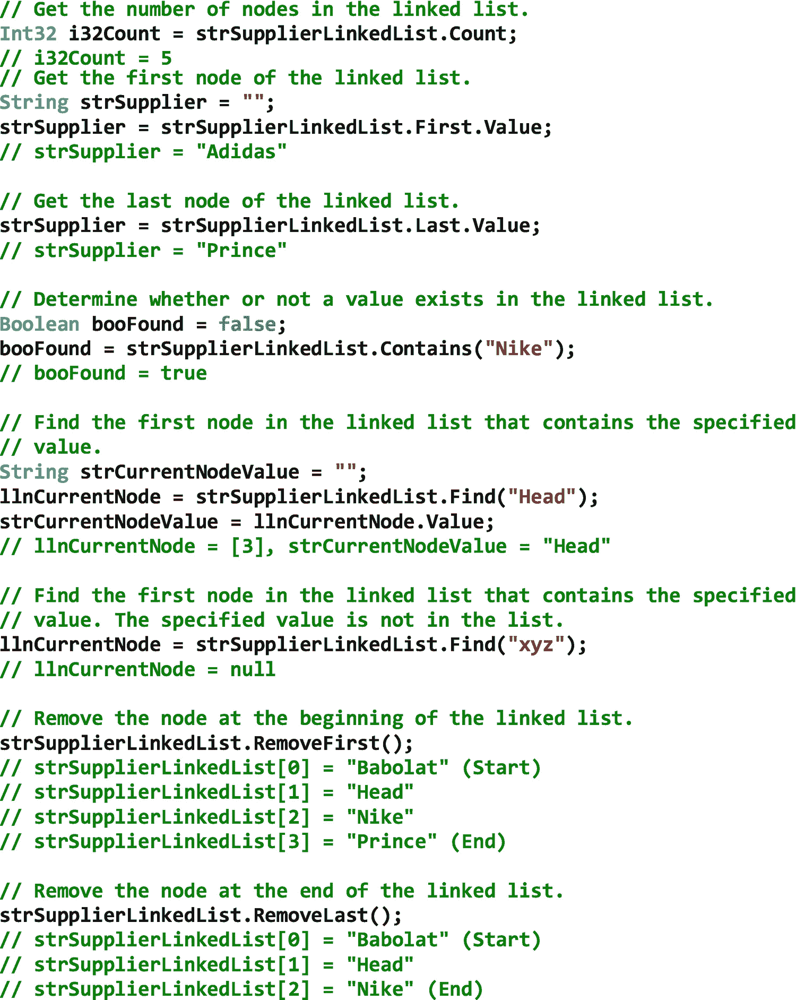
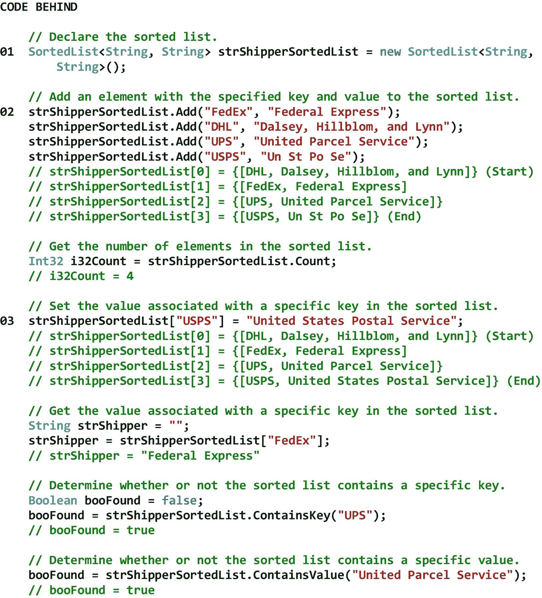
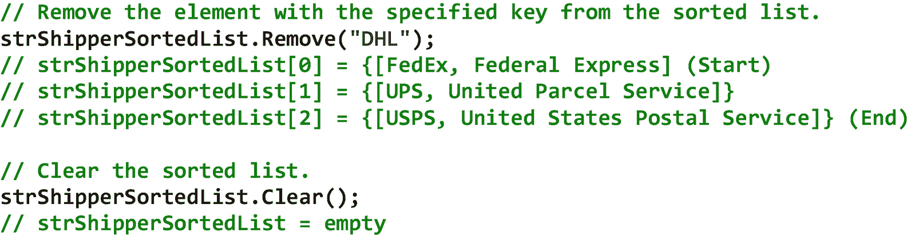

# 十三、集合操作

## 13.1 简介

集合是一个容器，当数据被计算机程序操作时，它保存数据。更具体地说，它是一个由零个或多个*项*组成的*数据结构*，其中每个项都包含自己的一个或多个值。集合的例子包括堆栈、队列、链表和排序列表。收藏中的物品总数就是它的*计数*。与数组不同，集合是在内存中动态分配的。也就是说，随着向其添加额外的项目，其容量会自动增加(通过内存重新分配)。像数组一样，集合被认为是一个*内部*数据结构，因为它驻留在 RAM 中，并且只保留在那里，直到使用它的程序终止。因此，集合中的数据被称为*非持久*。这与数据库表形成对比，数据库表被认为是一个*外部*数据结构，因为它驻留在外围设备(例如，磁盘)上，甚至在使用它的程序终止后仍保留在那里。因此，数据库表中的数据被称为是持久的。

在本章中，我们将从查看堆栈类开始。Stack 类允许我们创建和操作一个一维的*后进先出* (LIFO)数据结构，类似于我们希望按照从上到下的优先级顺序阅读的一摞书。接下来，我们将讨论队列类。Queue 类使我们能够创建和操作一维的*先进先出* (FIFO)数据结构，类似于在杂货店排队等待结账的人群。之后，我们将考虑 LinkedList 类。LinkedList 类允许我们创建和操作一维的*线性*数据结构，类似于文件柜中一组按字母顺序排列的文件夹。最后，我们将看看 SortedList 类。SortedList 类使我们能够创建和操作二维的基于键的数据结构，类似于按字母顺序排列的术语及其各自定义的字典。

## 13.2 堆栈类

堆栈是一维的*后进先出* (LIFO)数据结构，包含零个或多个*对象*。堆栈上的*第一个*对象位于堆栈的*底部*，而堆栈上的*最后一个*对象位于堆栈的*顶部*。栈上的操作只能发生在栈顶。从概念上来说，一个书库就像一堆我们想从上到下按优先顺序阅读的书。首先，我们把优先级最低的书放在桌子上。然后，我们把下一个最不重要的书放在上面，以此类推。一旦我们有了一摞最重要的书放在上面，这个过程就完成了。现在我们可以简单地把书从书架顶上一本书一本书地拿出来，按照重要性的顺序阅读。

在 C# 中，对象被*推*到堆栈上，而*从堆栈中弹出*。检索不在堆栈顶部的对象需要从堆栈中弹出一个或多个对象。这是因为直接访问栈顶对象下的对象是不可能的。表 [13-1](#Tab1) 显示了堆栈类的一些属性、方法和事件。

表 13-1

Stack 类的一些属性、方法和事件

<colgroup><col class="tcol1 align-left"> <col class="tcol2 align-left"></colgroup> 
| **类**栈T3】1T5】 |
| **命名空间**系统。集合 |
| **属性** |
| 数数 | 获取堆栈中包含的元素数。 |
| **方法** |
| 清除( ) | 从堆栈中移除所有对象。 |
| Peek() | 返回堆栈顶部的对象，但不移除它。 |
| 流行( ) | 移除并返回堆栈顶部的对象。 |
| 推送(对象) | 在堆栈顶部插入一个对象。 |
| **事件** |
| 钠 |   |
| **参考** |
| [T2`https://msdn.microsoft.com/en-us/library/system.collections.stack(v=vs.110).aspx`](https://msdn.microsoft.com/en-us/library/system.collections.stack%2528v%253Dvs.110%2529.aspx) |

图 [13-1](#Fig1) 显示了一个堆栈类的例子。

注意在 01 处，我们声明了一个字符串类型的堆栈。但是请记住，我们可以声明任何类型的堆栈。还要注意，我们在声明中指定堆栈大小的是*而不是*。这是因为堆栈是在内存中动态分配的。也就是说，随着向其添加额外的项目，其容量会自动增加(通过内存重新分配)。

图 13-1

堆栈类的示例

## 13.3 队列类别

队列是一维的*先进先出* (FIFO)数据结构，包含零个或多个*对象*。队列中的*第一个*对象位于队列的*开头*处，而队列中的*最后一个*对象位于队列的*结尾*处。队列上的操作只能发生在队列的开头。从概念上讲，队列就像是在杂货店排队等待结账的人。排在队伍最前面的人先被检查出来，排在队伍中间的人接着被检查出来，排在队伍末尾的人最后被检查出来。

在 C# 中，对象被*加入*队列并从队列中出列。检索不在队列开头的对象需要从队列中取出一个或多个对象，因为直接访问队列开头的对象之后的对象是不可能的。表 [13-2](#Tab2) 显示了队列类的一些属性、方法和事件。

表 13-2

Queue 类的一些属性、方法和事件

<colgroup><col class="tcol1 align-left"> <col class="tcol2 align-left"></colgroup> 
| **班**队列T3】2T5】 |
| **命名空间**系统。集合 |
| **属性** |
| 数数 | 获取队列中包含的元素数。 |
| **方法** |
| 清除( ) | 从队列中移除所有对象。 |
| 出列( ) | 移除并返回队列开头的对象。 |
| 入队(对象) | 将对象添加到队列的末尾。 |
| Peek() | 返回队列开头的对象，但不移除它。 |
| **事件** |
| 钠 |   |
| **参考** |
| [T2`https://msdn.microsoft.com/en-us/library/system.collections.queue(v=vs.110).aspx`](https://msdn.microsoft.com/en-us/library/system.collections.queue%2528v%253Dvs.110%2529.aspx) |

图 [13-2](#Fig2) 显示了队列类的一个例子。

注意在 01，我们声明了一个字符串类型的队列。但是请记住，我们可以声明任何类型的队列。还要注意，我们在声明中指定队列大小的是*而不是*。这是因为队列是在内存中动态分配的。也就是说，随着向其添加额外的项目，其容量会自动增加(通过内存重新分配)。

图 13-2

队列类的示例

## 13.4 链接列表类

链表是包含零个或多个*节点*的一维*线性*数据结构。链表中的*第一个*节点在链表的*开始*处，而链表中的*最后一个*节点在链表的*结束*处。对链表的操作可以发生在链表中的任何地方。从概念上讲，链表就像文件柜中一组按字母顺序排列的文件夹。当我们想要向文件夹组添加新文件夹时，我们扫描有序文件夹集，定位应该添加文件夹的点，然后添加文件夹。相反，当我们想要从文件夹组中移除现有文件夹时，我们扫描有序文件夹的集合，定位我们想要移除的文件夹，然后移除该文件夹。

在 C# 中，节点是*添加*到链表中，*在链表中找到*，而*从链表中移除*。可以将节点添加到链表的开头、紧接在链表中指定节点之前添加、紧接在链表中指定节点之后添加以及添加到链表的结尾。此外，可以搜索链表以找到给定节点和/或检索其相关数据。最后，一个节点可以从链表的开头移除，从链表的中间移除，从链表的结尾移除。表 [13-3](#Tab3) 显示了 LinkedList 类的一些属性、方法和事件。

表 13-3

LinkedList 类的一些属性、方法和事件

<colgroup><col class="tcol1 align-left"> <col class="tcol2 align-left"></colgroup> 
| **类**链表T3】3T5】 |
| **命名空间**系统。集合.通用 |
| **属性** |
| 数数 | 获取 LinkedList 中实际包含的节点数。 |
| 第一 | 获取 LinkedList 的第一个节点。 |
| 最后的 | 获取 LinkedList 的最后一个节点。 |
| **方法** |
| add after(linked listnode<t>，t)</t> | 在 LinkedList 中指定的现有节点后添加包含指定值的新节点。 |
| add before(linked listnode<t>，t)</t> | 在 LinkedList 中指定的现有节点之前添加包含指定值的新节点。 |
| AddFirst(T) | 在 LinkedList 的开头添加包含指定值的新节点。 |
| AddLast(T) | 在 LinkedList 的末尾添加包含指定值的新节点。 |
| 清除( ) | 从 LinkedList 中移除所有节点。 |
| 包含(吨) | 确定值是否在 LinkedList 中。 |
| 查找(T) | 查找包含指定值的第一个节点。 |
| 移除(T) | 从 LinkedList 中移除指定值的第一个匹配项。 |
| RemoveFirst() | 移除 LinkedList 开头的节点。 |
| RemoveLast() | 移除 LinkedList 末尾的节点。 |
| **事件** |
| 钠 |   |
| **参考** |
| [T2`https://msdn.microsoft.com/en-us/library/he2s3bh7(v=vs.110).aspx`](https://msdn.microsoft.com/en-us/library/he2s3bh7%2528v%253Dvs.110%2529.aspx) |

图 [13-3](#Fig3) 显示了 LinkedList 类的一个例子。

注意在 01，我们声明了一个字符串类型的链表。但是请记住，我们可以声明任何类型的链表。还要注意，我们在声明中指定链表大小的是*而不是*。这是因为链表是在内存中动态分配的。也就是说，随着向其添加额外的项目，其容量会自动增加(通过内存重新分配)。

T2】

图 13-3

LinkedList 类的示例

## 13.5 分类列表类

排序列表是一个二维的基于*键的*数据结构，包含零个或多个*元素*，每个元素包含一个*键/值对*。 [4](#Fn4) 排序列表中的*第一个*元素位于排序列表的*开始*处，而排序列表中的*最后一个*元素位于排序列表的*结束*处。对排序列表的操作可以发生在排序列表中的任何地方。从概念上讲，一个排序列表就像一个按字母顺序排列的术语及其各自定义的字典。当我们想要向字典添加新术语(即键)和定义(即值)时，我们扫描有序术语集，定位应该添加术语和定义的点，然后添加术语和定义。相反，当我们想要从字典中删除一个现有的术语和定义时，我们扫描有序术语集，找到我们想要删除的术语和定义，然后删除该术语和定义。

在 C# 中，元素被*添加*到一个排序列表中，*在一个排序列表中查找*，而*从一个排序列表中移除*。当一个元素被添加到排序列表中时，排序列表会自动调整，以使它的键保持正确的排序顺序。排序列表中不允许出现重复键*因为给定的键必须唯一地标识排序列表中的一个元素。当在排序列表中查找一个元素时，它是通过它的键来查找的。 [5](#Fn5) 当一个元素从排序列表中删除时，排序列表再次自动调整，使其键保持正确的排序顺序。表 [13-4](#Tab4) 显示了 SortedList 类的一些属性、方法和事件。*

表 13-4

SortedList 类的一些属性、方法和事件

<colgroup><col class="tcol1 align-left"> <col class="tcol2 align-left"></colgroup> 
| **类**排序列表T3】6T5】 |
| **命名空间**系统。集合 |
| **属性** |
| 数数 | 获取 SortedList 对象中包含的元素数。 |
| 项目[对象] | 获取和设置与 SortedList 对象中的特定键关联的值。 |
| **方法** |
| 添加(对象，对象) | 将具有指定键和值的元素添加到 SortedList 对象中。 |
| 清除( ) | 从 SortedList 对象中移除所有元素。 |
| 包含键(对象) | 确定 SortedList 对象是否包含特定的键。 |
| 包含值(对象) | 确定 SortedList 对象是否包含特定值。 |
| 移除(对象) | 从 SortedList 对象中移除具有指定键的元素。 |
| **事件** |
| 钠 |   |
| **参考** |
| [T2`https://msdn.microsoft.com/en-us/library/system.collections.sortedlist(v=vs.110).aspx`](https://msdn.microsoft.com/en-us/library/system.collections.sortedlist%2528v%253Dvs.110%2529.aspx) |

图 [13-4](#Fig4) 显示了一个 SortedList 类的例子。

注意在 01 处，我们将键/值对的*键*声明为字符串类型，将键/值对的*值*声明为字符串类型。但是请记住，我们可以声明任何类型的键和值。还要注意，我们是*而不是*在声明中指定排序列表的大小。这是因为排序列表是在内存中动态分配的。也就是说，随着向其添加额外的项目，其容量会自动增加(通过内存重新分配)。

请注意，在 02 处，虽然元素没有按字母顺序添加到排序列表中，但它们在添加时会自动按字母顺序放置。还要注意美国邮政署​被拼错了。

请注意 03，美国邮政署​不再拼写错误。

 

图 13-4

SortedList 类的示例

<aside aria-label="Footnotes" class="FootnoteSection" epub:type="footnotes">Footnotes [1](#Fn1_source)

所有属性、方法和事件描述都直接取自微软的官方文档。为了节省空间，省略了用于处理该类事件的事件处理程序方法。有关该类的所有方法，请参见参考。

  [2](#Fn2_source)

所有属性、方法和事件描述都直接取自微软的官方文档。为了节省空间，省略了用于处理该类事件的事件处理程序方法。有关该类的所有方法，请参见参考。

  [3](#Fn3_source)

所有属性、方法和事件描述都直接取自微软的官方文档。为了节省空间，省略了用于处理该类事件的事件处理程序方法。有关该类的所有方法，请参见参考。

  [4](#Fn4_source)

键是排序列表的第一维，而值是排序列表的第二维。

  [5](#Fn5_source)

排序列表中的元素也可以通过它们的索引来访问。

  [6](#Fn6_source)

所有属性、方法和事件描述都直接取自微软的官方文档。为了节省空间，省略了用于处理该类事件的事件处理程序方法。有关该类的所有方法，请参见参考。

 </aside>