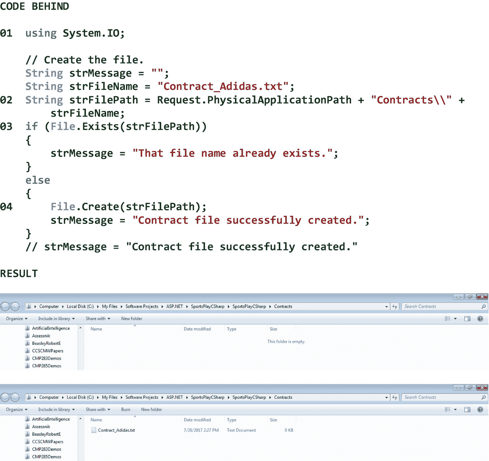
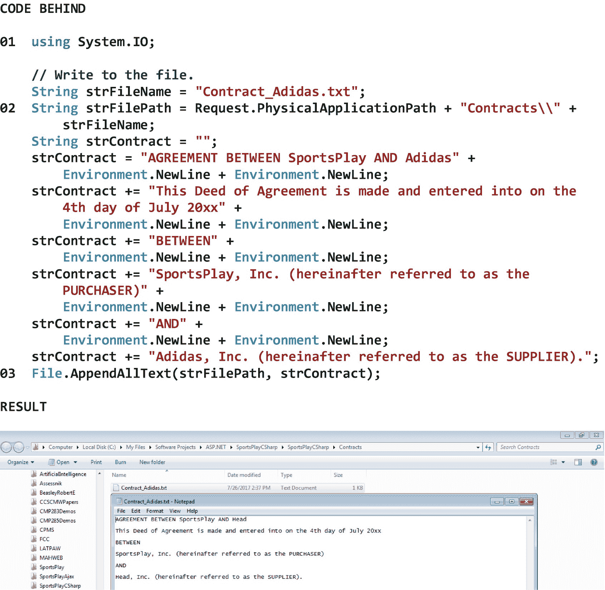
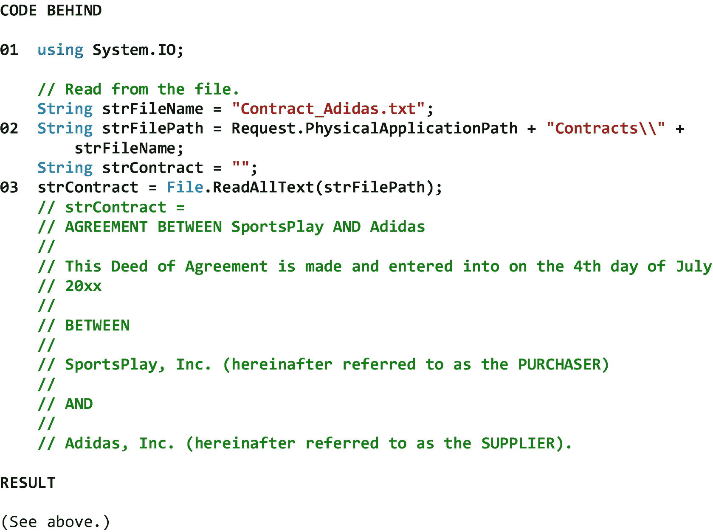
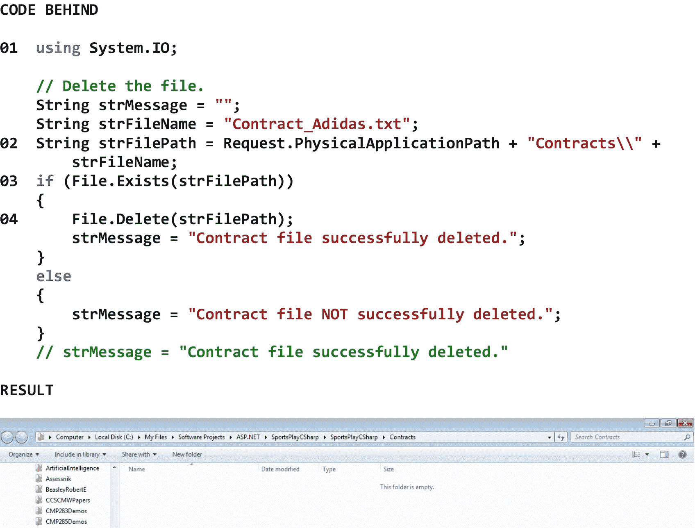
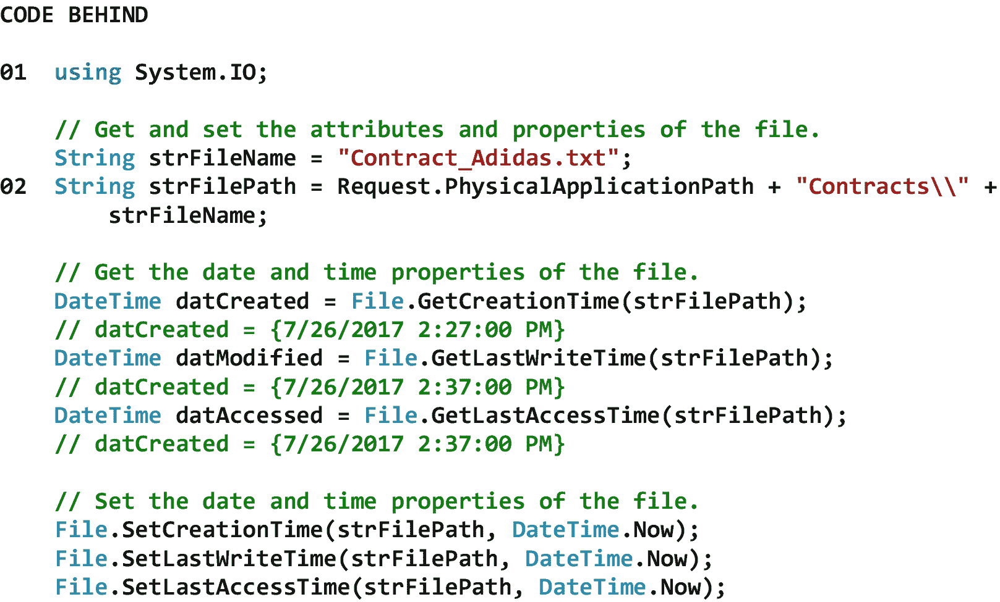
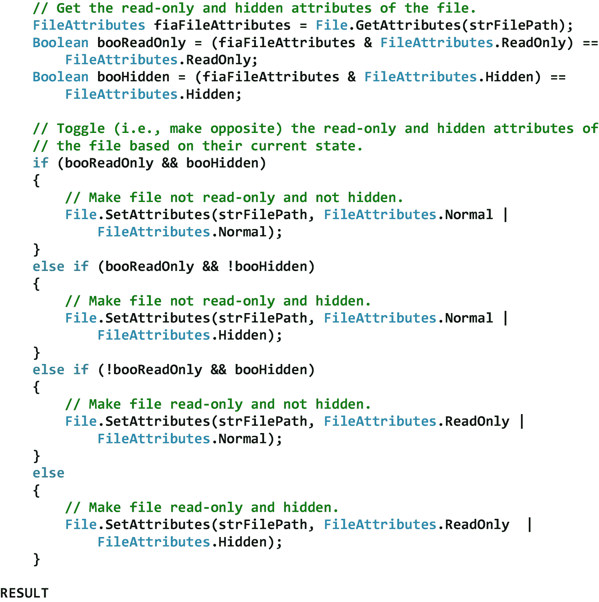
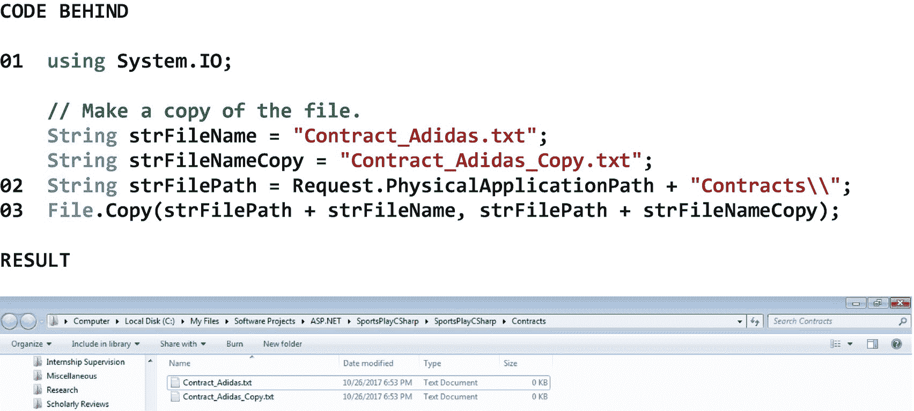

# 十四、文件系统操作

## 14.1 简介

文件系统定义了如何在大容量存储设备上存储和检索计算机数据。如果没有文件系统，大容量存储设备上的信息将是一堆无组织的、不可检索的数据。文件系统中的文件通常被安排在一组分层组织的目录(也称为文件夹)和子目录(也称为子文件夹)中。其中，文件系统允许计算机的操作系统

*   维护其目录和子目录系统

*   创建、复制、移动、存储、检索和删除其文件

*   跟踪其大容量存储设备中包含文件的区域

*   跟踪其大容量存储设备中未使用且可分配给文件的区域

*   跟踪其文件的属性(例如，所有者、创建日期和时间、修改日期和时间、访问日期和时间)和属性(例如，压缩、加密、只读、隐藏)

在开发 Web 应用时，我们经常会遇到需要与 Web 服务器的文件系统进行交互来执行这样的操作。

在本章中，我们将了解 File 类。File 类允许我们做诸如创建新文件、写入或读取文件、删除文件、检查文件是否存在、获取或设置文件的属性以及将文件从一个位置复制或移动到另一个位置。

## 14.2 文件类别

File 类提供了静态方法，允许我们创建、写入、读取、删除、检查是否存在、获取属性和特性、设置属性和特性、复制和移动单个文件。File 类的所有方法都需要一个*路径*。路径是文件系统目录和子目录层次结构中的唯一位置。路径可以是目录、子目录或文件。目录、子目录或文件的*完整路径*包括从文件系统的*根目录*开始的完整路径(如 c:\)。目录、子目录或文件的*相对路径*只包括从*当前*目录或子目录引出的路径(如 c:\myfiles\)。首次创建文件时，默认情况下，所有用户都被授予完全读/写访问权限。表 [14-1](#Tab1) 显示了 File 类的一些属性、方法和事件。

表 14-1

File 类的一些属性、方法和事件

<colgroup><col class="tcol1 align-left"> <col class="tcol2 align-left"></colgroup> 
| **类**文件T3】1T5】 |
| **命名空间**系统。超正析象管(Image Orthicon) |
| **属性** |
| (参见参考文献。) |   |
| **方法** |
| AppendAllText(字符串、字符串) | 打开文件，将指定的字符串追加到文件中，然后关闭文件。如果文件不存在，此方法创建一个文件，将指定的字符串写入该文件，然后关闭该文件。 |
| 复制(字符串、字符串、布尔值) | 将现有文件复制到新文件中。允许覆盖同名文件。 |
| 创建(字符串) | 在指定路径创建或覆盖文件。 |
| 删除(字符串) | 删除指定的文件。 |
| 存在(字符串) | 确定指定的文件是否存在。 |
| GetAttributes(字符串) | 获取路径上文件的 FileAttributes。 |
| getcreactiontime _ string) | 返回指定文件或目录的创建日期和时间。 |
| getlastaccesstime(字符串) | 返回上次访问指定文件或目录的日期和时间。 |
| GetLastWriteTime(字符串) | 返回上次写入指定文件或目录的日期和时间。 |
| 移动(字符串，字符串) | 将指定文件移动到新位置，并提供指定新文件名的选项。 |
| ReadAllText(字符串) | 打开一个文本文件，读取文件的所有行，然后关闭文件。 |
| SetAttributes(字符串，文件属性) | 设置指定路径上文件的指定 FileAttributes。 |
| SetCreationTime（String， DateTime） | 设置文件的创建日期和时间。 |
| SetLastAccessTime（String， DateTime） | 设置上次访问指定文件的日期和时间。 |
| SetLastWriteTime（String， DateTime） | 设置上次写入指定文件的日期和时间。 |
| WriteAllText(字符串，字符串) | 创建一个新文件，将指定字符串写入该文件，然后关闭该文件。如果目标文件已经存在，它将被覆盖。 |
| **事件** |
| (参见参考文献。) |   |
| **参考** |
| [T2`https://msdn.microsoft.com/en-us/library/system.io.file(v=vs.110).aspx`](https://msdn.microsoft.com/en-us/library/system.io.file%2528v%253Dvs.110%2529.aspx) |

图 [14-1](#Fig1) 显示了一个使用 file 类创建文件的例子。

请注意 01 处的系统。IO 命名空间已添加到 using 指令列表中(出现在 file 后面代码的顶部),以避免指定 File 类的完全限定名(即 System。每次我们想使用它的一个方法时。

请注意，在 02，我们正在使用应用在服务器上的物理路径、应用的 Contracts 目录和文件名来构建要创建的文件的完整路径。

请注意，在 03 中，我们使用 File 类的 Exists 方法来查看要创建的文件是否已经存在。如果它确实存在，我们*不*创建文件。然而，如果它不存在，我们*做*创建文件。

请注意，在 04 中，我们使用 File 类的 Create 方法来创建新文件。

图中结果部分的第一个屏幕截图显示了在创建文件之前的 Contracts 目录*。第二个屏幕截图显示了在*文件被创建后的合同目录*。*

图 14-1

使用 file 类创建文件的示例

图 [14-2](#Fig2) 显示了一个使用 file 类写入文件的例子。

请注意 01 处的系统。IO 命名空间已添加到 using 指令列表中(出现在 file 后面代码的顶部),因此我们不需要指定 File 类的完全限定名(即 System。每次我们想使用它的一个方法时。

请注意，在 02 处，我们正在使用应用在服务器上的物理路径、应用的 Contracts 目录和文件名来构造要写入的文件的完整路径。

请注意，在 03 中，我们使用 File 类的 AppendAllText 方法将一个新构造的格式化字符串写入文件。请注意，此方法打开文件，将字符串追加到文件中，然后关闭文件。如果文件不存在，该方法将首先创建文件。

图中结果部分的屏幕截图显示了文件*被写入*后的内容。

图 14-2

使用 file 类写入文件的示例

图 [14-3](#Fig3) 显示了一个使用 file 类读取文件的例子。

请注意 01 处的系统。IO 命名空间已添加到 using 指令列表中(出现在 file 后面的代码的顶部),以避免需要指定 File 类的完全限定名(即 System。每次我们想使用它的一个方法时。

请注意，在 02，我们正在使用应用在服务器上的物理路径、应用的 Contracts 目录和文件名来构造要读取的文件的完整路径。

请注意，在 03，我们使用 File 类的 ReadAllText 方法来读取文件。请注意，此方法打开文件，从文件中读取文本，然后关闭文件。可以看到，文件的内容被读入一个字符串变量。

图 14-3

使用 file 类读取文件的示例

图 [14-4](#Fig4) 显示了一个使用 file 类删除文件的例子。

请注意 01 处的系统。IO 命名空间已添加到 using 指令列表中(出现在 file 后面代码的顶部),因此我们不需要指定 File 类的完全限定名(即 System。每次我们想使用它的一个方法时。

请注意，在 02，我们正在使用应用在服务器上的物理路径、应用的 Contracts 目录和文件名来构造要删除的文件的完整路径。

请注意，在 03，我们使用 File 类的 Exists 方法来查看要删除的文件是否存在。如果它确实存在，我们删除该文件。如果它不存在，我们*不会*尝试删除该文件。

请注意，在 04 中，我们使用 File 类的 Delete 方法来删除现有文件。

图中结果部分的屏幕截图显示了在删除了文件之后的合同目录*。*

图 14-4

使用 file 类删除文件的示例

图 [14-5](#Fig5) 显示了一些使用 file 类获取和设置文件属性的例子。

请注意 01 处的系统。IO 命名空间已添加到 using 指令列表中(出现在 file 后面代码的顶部),以避免指定 File 类的完全限定名(即 System。每次我们想使用它的一个方法时。

请注意，在 02 处，我们正在构建文件的*完整*路径，该文件的属性和特性将使用应用在服务器上的物理路径、应用的 Contracts 目录和文件名进行修改。

图中结果部分的第一个屏幕截图显示了文件*在*被修改之前的属性(即创建日期和时间、修改日期和时间以及访问日期和时间)和属性(即只读和隐藏)。第二个截图显示了文件*在*被修改后的属性和特性。请注意，在本例中，操作系统已被配置为显示隐藏文件。

T2】

图 14-5

使用 file 类获取和设置文件属性的示例

图 [14-6](#Fig6) 显示了一个使用 file 类复制文件的例子。

请注意 01 处的系统。IO 命名空间已添加到 using 指令列表中(出现在 file 后面代码的顶部),因此我们不需要指定 File 类的完全限定名(即 System。每次我们想使用它的一个方法时。

请注意，在 02，我们正在使用应用在服务器上的物理路径和应用的 Contracts 目录来构建要在复制操作中使用的文件的*完整*路径。

请注意，在 03 中，我们使用 File 类的 Copy 方法来复制原始文件。可以看到，新文件将创建在与原始文件相同的目录中。

图中结果部分的屏幕截图显示了在复制了原始文件之后的 Contracts 目录*。*

图 14-6

使用 file 类复制文件的示例

<aside aria-label="Footnotes" class="FootnoteSection" epub:type="footnotes">Footnotes [1](#Fn1_source)

所有属性、方法和事件描述都直接取自微软的官方文档。为了节省空间，省略了用于处理该类事件的事件处理程序方法。有关该类的所有方法，请参见参考。

 </aside>