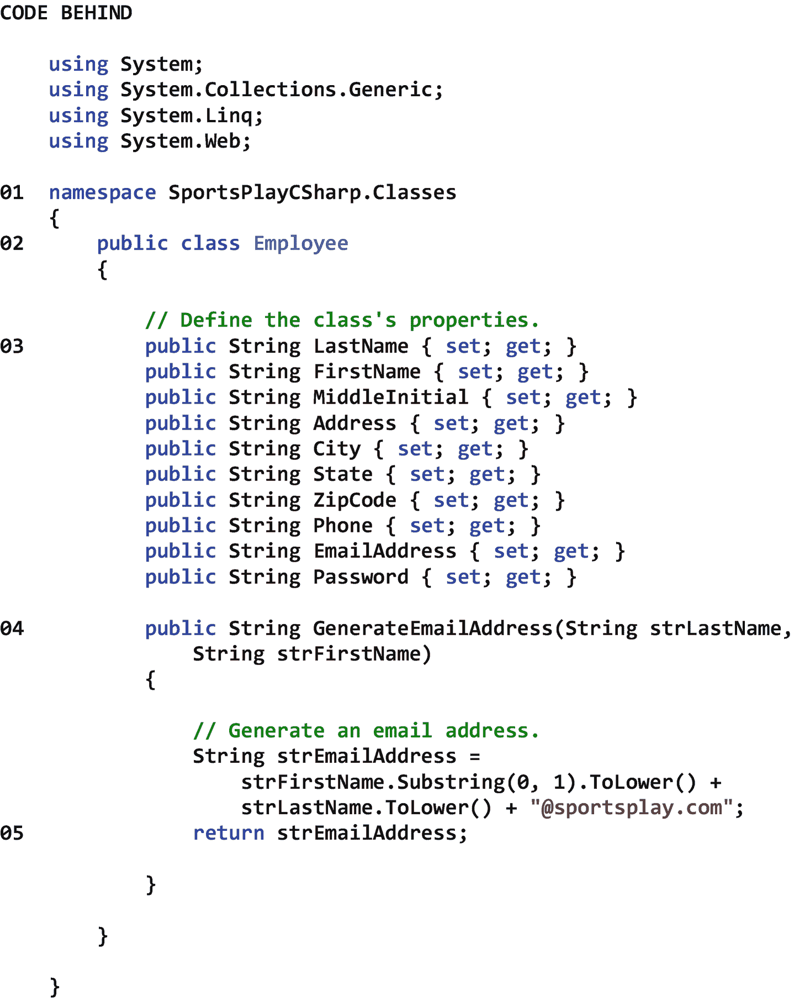
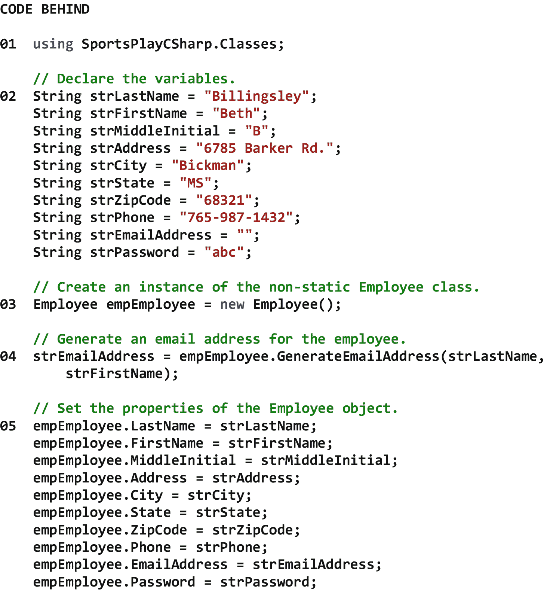
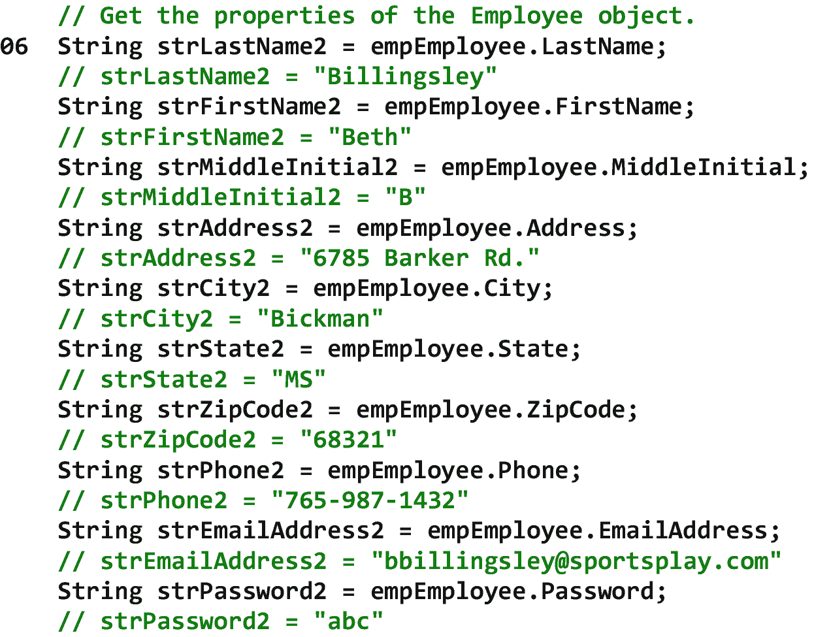
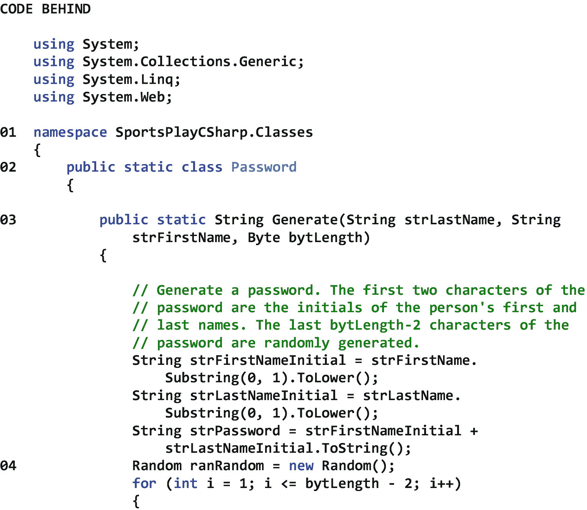
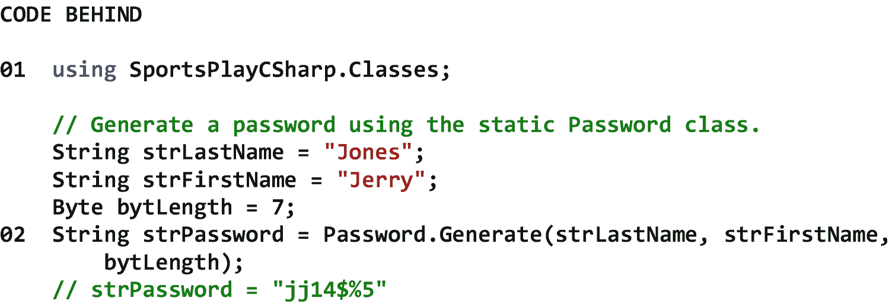

# 十五、自定义 C# 类

## 15.1 简介

像我们在本书中讨论的其他 C# 类一样，自定义 C# 类可以包含属性、方法和事件。这些类被认为是“定制的”,因为它们包含的属性、方法和事件都是我们定义的。因此，他们完全按照我们希望他们做的去做，不多也不少。当我们必须在单个 Web 应用或跨多个 Web 应用的许多地方执行函数或过程时，自定义 C# 类会很有帮助。因此，我们可以在自定义 C# 类中编写一个方法，然后根据需要调用该方法，而不是编写一段代码来执行一个函数或过程，然后将代码复制到许多地方。这样，当需要更改代码的逻辑时，我们只需要在一个地方进行更改。

在 C# 中，我们可以创建*非静态类*和*静态类*。一般来说，一个非静态类包含我们可以利用的非静态属性、非静态方法和非静态事件，但是只有在之后*一个对象从该类中被实例化。当非静态类的属性、方法和事件旨在表示现实世界中的某个事物时，例如雇员或产品，我们通常会创建非静态类。另一方面，静态类包含静态属性、静态方法和静态事件，我们可以直接利用这些静态属性、静态方法和静态事件，而不必从类中实例化一个对象。当静态类的属性、方法和事件旨在执行某个功能或过程时，例如生成密码或构造登录名，我们通常会创建静态类。*

在这一章中，我们将从看类设计开始。类设计是规划类的属性、方法和事件的过程。正如我们将看到的，如果我们做好了类设计，我们可以期望开发可重用的自定义类和相对容易阅读、理解、定位语义错误、调试、修改和单元测试的方法。接下来，我们将讨论 C# 类本身。C# 类允许我们创建包含我们自己的属性、方法和事件的自定义类。之后，我们将在项目中添加一个文件夹来存放我们的类。然后，我们将学习如何向我们的项目添加一个非静态 C# 类，对它进行编码，并调用它。最后，我们将学习如何在我们的项目中添加一个静态 C# 类，对它进行编码，并调用它。注意，从现在开始，为了方便起见，我们将把*定制 C# 类*称为 *C# 类*。

## 15.2 课程设计

类设计是规划类的属性、方法和事件的过程。类设计的主要目标之一是*重用*。当我们设计一个类，并且这个类看起来有广泛的适用性(例如，我们期望它将来可以跨几个应用使用)，我们应该着眼于重用来设计它，这样我们就不会花时间重复编写相同的代码。当一个类设计得很好时，我们在扩充一个现有的应用或开发一个新的应用时重用它的可能性就会增加。

类设计的另一个主要目标是创建展现出*高*程度的*内聚*的方法。内聚性是一个方法的指令在功能上相关的程度。换句话说，它是一个方法的编程语句一起执行一个*单一*任务的程度。不执行单一任务的方法的主要问题是它们相对难以阅读、理解、定位和修改语义错误。

类设计的第三个主要目标是创建展示低耦合度的*方法。耦合是两个或多个方法相互依赖的程度。换句话说，它是两个或多个方法在功能或数据上相互依赖的程度。在功能或数据方面相互依赖的方法的主要问题是，一个方法的变化可能需要其他方法的变化，这可能会产生所需变化的连锁反应。可以想象，这可能导致更困难的单元测试，以及需要重新测试任何被修改的相关方法。*

## 15.3 C# 类

C# 类是一个自定义类，可以包含任意数量的属性、方法和/或事件。一旦创建了 C# 类，它就可以在单个应用中使用，也可以跨多个应用使用。同样，这避免了在多个地方编写相同代码的需要。表 [15-1](#Tab1) 显示了一个 C# 类的属性、方法和事件。可以看出，C# 类的所有成员都是自定义的。没有预定义的属性、方法和事件，只有我们定义的。请注意，表中的类名是 MyClass。这表明我们在创建类时提供了它的名称。还要注意，该类的名称空间是 MyProject.MyFolder，这表明该类的定义位于我们在已创建的项目中创建的文件夹中。虽然把我们的 C# 类放在一个文件夹中是可选的，但是这样做将有助于我们把它们放在一个地方，并且有助于我们在总体上保持我们的 Web 应用组织良好。

表 15-1

C# 类的属性、方法和事件

<colgroup><col class="tcol1 align-left"> <col class="tcol2 align-left"></colgroup> 
| **Class** MyClass |
| **名称空间** MyProject。我的文件夹 |
| **属性** |
| 习俗 |   |
| **方法** |
| 习俗 |   |
| **事件** |
| 习俗 |   |
| **参考** |
| [T2`https://docs.microsoft.com/en-us/dotnet/articles/csharp/programming-guide/classes-and-structs/classes`](https://docs.microsoft.com/en-us/dotnet/articles/csharp/programming-guide/classes-and-structs/classes) |

## 15.4 添加类别文件夹

在我们将非静态和静态 C# 类添加到我们的项目之前，我们将添加一个名为 *Classes* 的文件夹来存放它们和我们将来可能需要创建的任何其他类。如前所述，向我们的项目中添加一个 Classes 文件夹将有助于我们将 C# 类放在一个地方，并有助于我们将 Web 应用组织得更好。向项目添加一个*类*文件夹

1.  打开解决方案资源管理器。

2.  右击项目(不是解决方案)。

3.  选择*添加* ➤ *新文件夹*。

4.  重命名文件夹*类*。

## 15.5 添加非静态 C# 类

在本节中，我们将在 Classes 文件夹中创建一个新的*非静态* C# 类。回想一下前面的内容，非静态类包含我们可以利用的非静态属性、非静态方法和非静态事件，但是只有在从类中实例化了一个对象之后*。 [2](#Fn2) 我们将称我们的新员工为*员工*。这个类将包含几个属性和一个名为 *GenerateEmailAddress* 的方法，它将在我们需要时为我们生成一个员工电子邮件地址。请记住，我们可以向一个类中添加任意多的方法。向项目的 Classes 文件夹中添加新的非静态 C# 类*

1.  打开解决方案资源管理器。

2.  右键单击“类别”文件夹。

3.  选择*添加* ➤ *新项目…* 。

当*添加新项目*对话框出现时

1.  从对话框的左窗格中选择*已安装* ➤ *Visual C#* ➤ *代码*。

2.  从对话框的中间窗格选择*类*。

3.  在对话框底部给该类起一个*名* (Employee.cs)。

4.  点击*添加*。

图 15-1 显示了一个非静态类的例子。可以看到，该类包含许多属性和一个生成电子邮件地址的方法，该电子邮件地址由雇员的名和姓以及他或她的公司的域组成。因此，如果分别用参数*比林斯利*和*贝丝*调用该方法，该方法将返回`bbillingsley@sportsplay.com`。

请注意，在 01，我们的雇员类驻留在 SportsPlayCSharp 中。Classes 命名空间，其中 SportsPlayCSharp 是项目的名称，Classes 是类所在的文件夹的名称。

注意 02 处 Employee 类的声明。默认情况下，这是非静态类。

注意 03 处的类属性声明。可以看到，其中每个都有一个为属性赋值的 *set* 方法和一个从属性中检索值的 *get* 方法。

注意 04 处 GenerateEmailAddress 方法的声明。同样，默认情况下，这是一个非静态方法。关于这个方法的声明，还有一些其他的事情需要注意。首先，单词 *String* 表示这个方法将向调用它的方法返回一个 String 类型的值。第二，单词 *GenerateEmailAddress* 表示方法本身的名称。第三，该方法有两个输入参数—字符串类型的姓氏和字符串类型的名字。因此，调用方法应该向该方法传递两个相关联的参数。

注意在 05，一旦方法的逻辑被执行，变量 strEmailAddress 中的值将被返回给调用方法。

图 15-1

非静态类的示例

图 [15-2](#Fig2) 显示了创建一个非静态类的实例，设置和获取其属性，并调用其方法的例子。请注意，这个类的实例可以在需要其功能的 Web 应用中的任何类的*中创建和使用。因此，这个类是可重用的。*

请注意 01 处的 SportsPlayCSharp。Classes 名称空间已经被添加到 using 指令列表中(它出现在文件后面的代码的顶部),这样我们就不必指定 Employee 类的完全限定名(即 SportsPlayCSharp。Classes . Employee)每次我们想使用它的时候。

请注意，在 02，我们正在为变量赋值，我们将为即将创建的 Employee 对象的属性赋值。仔细检查这个赋值语句列表可以发现，我们没有给 strEmailAddress 变量赋值。这是因为我们将自动生成此电子邮件地址。

请注意，在 03，我们正在创建 Employee 类的一个实例。也就是说，我们正在从 Employee 类创建一个 Employee *对象*。

请注意，在 04 中，我们使用两个输入参数调用 Employee 对象的 GenerateEmailAddress 方法，我们希望返回一个 String 类型的电子邮件地址。

请注意，在 05，我们正在设置 Employee 对象的属性。

请注意，在 06，我们正在获取 Employee 对象的属性。

 

图 15-2

创建非静态类的实例、设置和获取其属性以及调用其方法的示例

## 15.6 添加静态 C# 类

在本节中，我们将在 Classes 文件夹中创建一个新的静态 C# 类。回想一下前面的内容，一个静态类包含静态属性、静态方法和静态事件，我们可以立即利用这些静态属性、静态方法和静态事件*，而不需要从类中实例化一个对象。我们将把我们的新班级命名为*密码*。这个类将包含一个名为 *Generate* 的方法，它将在我们需要的时候为我们生成一个部分随机的密码。请记住，我们可以向一个类中添加任意多的方法。向项目的 Classes 文件夹中添加新的静态 C# 类*

 *1.  打开解决方案资源管理器。

2.  右键单击“类别”文件夹。

3.  选择*添加* ➤ *新项目…* 。

当*添加新项目*对话框出现时

1.  从对话框的左窗格中选择*已安装* ➤ *Visual C#* ➤ *代码*。

2.  从对话框的中间窗格选择*类*。

3.  在对话框底部给这个类一个*名* (Password.cs)。

4.  点击*添加*。

图 [15-3](#Fig3) 显示了一个静态类的例子。可以看到，该类包含一个生成给定长度密码的方法，该密码由一个人的名字和姓氏的首字母后跟一组随机生成的字符组成。因此，如果分别用参数*琼斯*、*杰瑞*和 *7* 调用该方法，该方法将返回类似于 *jj14$%5* 的内容。

注意，在 01 处，我们的密码类驻留在 SportsPlayCSharp 中。Classes 命名空间，其中 SportsPlayCSharp 是项目的名称，Classes 是类所在的文件夹的名称。

请注意 02 处的密码类声明。请注意，我们在单词 *public* 之后添加了单词 *static* 来表示这是一个静态类。

请注意 03 处生成方法的声明。同样，我们在单词 *public* 之后立即添加了单词 *static* 来表示这是一个静态方法。关于这个方法的声明，还有一些其他的事情需要注意。首先，*字符串*这个词表示这个方法将向调用它的方法返回一个字符串类型的值。第二， *Generate* 这个词表示方法本身的名称。第三，该方法有三个输入参数——字符串类型的姓氏、字符串类型的名字和字节类型的长度。因此，调用方法应该向该方法传递三个相关联的参数。

请分别注意 04 和 05，来自 Random 类的新 Random 对象的实例化和 1 到 10(包括 1 和 10)之间的新随机数的生成。

注意在 06，一旦方法的逻辑被执行，变量 strPassword 中的值将被返回给调用方法。

 

图 15-3

静态类的示例

图 [15-4](#Fig4) 显示了一个在静态类中调用静态方法的例子。注意，这个方法可以从 Web 应用中任何需要其功能的*类中调用。因此，这个类是可重用的。*

请注意 01 处的 SportsPlayCSharp。Classes 命名空间已添加到 using 指令列表中(出现在文件后面的代码顶部)，这样我们就不必指定密码类的完全限定名(即 SportsPlayCSharp。Classes.Password)来使用它。

请注意，在 02 中，我们使用三个输入参数调用了 Password 类的 Generate 方法，并且我们希望返回一个 String 类型的密码。

图 15-4

在静态类中调用静态方法的示例

<aside aria-label="Footnotes" class="FootnoteSection" epub:type="footnotes">Footnotes [1](#Fn1_source)

一个*非静态*类也可以包含*静态*属性、*静态*方法和*静态*事件，我们可以直接利用*，而不必实例化该类中的一个对象。*

*[2](#Fn2_source)

一个*非静态*类也可以包含*静态*属性、*静态*方法和*静态*事件，我们可以直接利用*，而不必实例化该类中的一个对象。** </aside>*