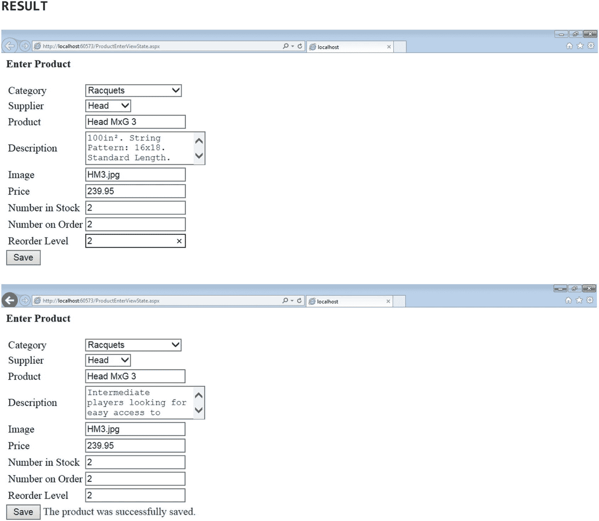
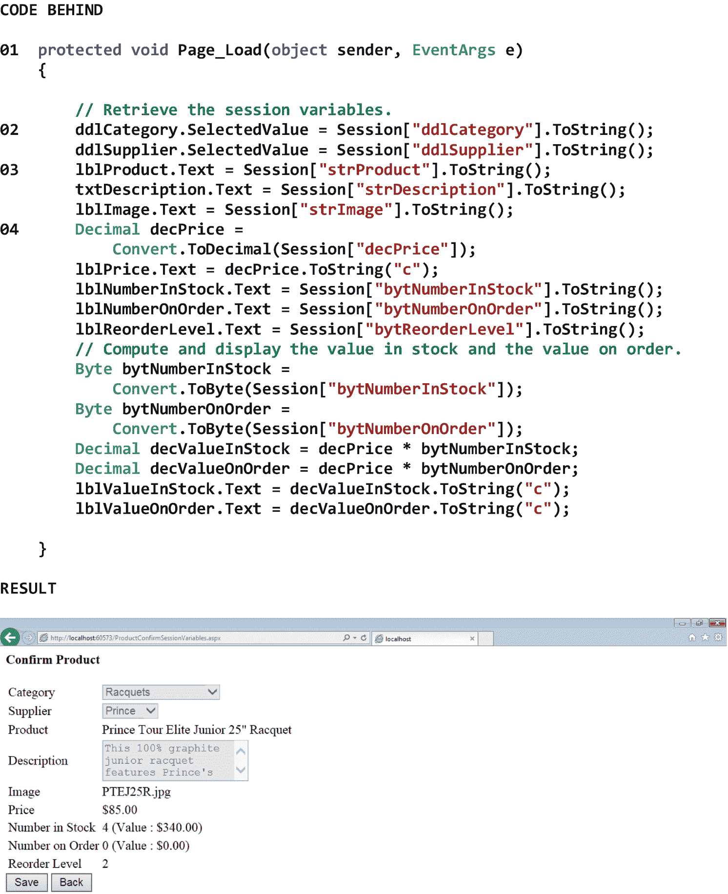

# 十六、状态维护

## 16.1 导言

状态维护是在终端用户浏览 Web 应用页面时保留其数据的状态的过程。这个过程是必要的，因为客户机-服务器 Web 应用是无状态的*，这意味着一旦服务器向客户机提供页面，服务器就完全忘记客户机、它刚刚提供的页面以及与页面相关的任何数据的状态。换句话说，一旦客户端通过 HTTP 请求请求了页面，并且服务器通过 HTTP 响应响应了页面，客户端和服务器之间的任何连接都将丢失。事实上，每个新的页面请求都会导致创建和返回一个全新的页面，无论最终用户是重新请求他或她当前所在的页面，还是请求一个完全不同的页面。*

 *因为客户机-服务器 Web 应用是无状态的，所以我们需要一种保存页面数据的方法，这样我们就可以开发具有多个页面的应用，这些页面作为一个整体协同工作。在 ASP.NET 开发 Web 应用时，有许多方法可以用来保存页面数据。然而，我们选择的方法主要取决于我们如何回答以下问题

*   在向服务器回发数据之间，需要维护多少数据？

*   数据会敏感吗？

*   数据需要保留多长时间？

*   有多少最终用户将同时使用该系统？

*   服务器将有多少内存？

在维护 Web 应用的状态时，我们有两个基本的选择。我们可以在客户端维护状态，也可以在服务器端维护状态。我们也可以使用这些方法的组合来维护状态。

在本章中，我们将从基于客户端的状态维护开始。如果我们选择在客户端维护状态，我们有很多选择。这些包括视图状态、控件状态、隐藏字段、cookies 和查询字符串的使用。接下来，我们将讨论基于服务器的状态维护。如果我们决定在服务器上维护状态，我们也有一些选择。这些包括会话状态、配置文件属性、数据库支持和应用状态的使用。最后，我们将查看维护数据结构(例如，数组、堆栈、队列、链表、排序列表)状态的过程，以便它可以跨 Web 应用的页面使用。

## 16.2 基于客户端的状态维护

为了在客户端维护状态，我们可以利用*视图状态*、*控件状态*、*隐藏字段*、*cookie*，和/或*查询字符串*。在本节中，我们将讨论视图状态、cookies 和查询字符串，因为这些方法似乎是最常用的基于客户端的状态维护方法。当然，控制状态和隐藏字段也是状态维护的有用方法，所以鼓励有兴趣的读者也探索这些方法。

### 视图状态

视图状态是一种状态维护方法，*自动*保存页面上控件的值(使用驻留在页面源代码中的结构),以便我们可以在回发到请求*相同的*页面的服务器后检索和使用这些值。例如，当最终用户从下拉列表中选择一项，在文本框中输入值，然后提交页面时，在页面完成从客户端到服务器并返回客户端的往返行程后，相同的下拉列表选择和相同的文本框值将显示在页面上，而无需以编程方式存储页面上控件的值。视图状态数据经过哈希处理、压缩、编码，并存储在客户端页面源代码的结构中。默认情况下，视图状态是打开的。

使用视图状态的优点包括

*   由于视图状态数据存储在页面的源代码中，因此不需要服务器内存。

*   由于视图状态不需要任何特殊的编程，因此很容易实现。

*   由于视图状态数据经过哈希处理、压缩和编码，因此相对安全。

使用视图状态的缺点包括

*   由于视图状态数据存储在页的源代码中，因此大量的页数据会导致页请求和响应相对较慢。

*   由于视图状态数据存储在页面的源代码中，大量的页面数据可能会淹没一些移动设备的内存。

*   由于视图状态数据存储在页面的源代码中，因此可以通过查看页面的源代码来直接访问它，因此可以被篡改。

图 [16-1](#Fig1) 显示了回发到请求相同页面的服务器之前和之后的页面值示例。从图中的第一个屏幕截图可以看出，已经从两个下拉列表中进行了选择，并且已经在七个文本框中进行了输入。第二个屏幕截图显示了点击*保存*按钮的结果，该按钮请求向服务器回发相同的页面。请注意，下拉列表选择和所有文本框条目都被保留，并且不需要任何代码来保留这些数据。



图 16-1

回发到请求同一页的服务器之前和之后的页值示例

### 饼干

Cookies 是一种状态维护方法，它允许我们以编程方式*保存页面上控件的值(使用客户端的内存或使用驻留在客户端硬盘上的文件),以便我们可以在应用的后续页面上检索和使用这些值。例如，当最终用户从下拉列表中选择一项，在文本框中输入值，然后提交页面时，可以检索相同的下拉列表选择和相同的文本框值，并在接下来显示的页面上使用。*

有两种类型的 cookie——*非持久 cookie*和*持久 cookie*。非持久性 cookie(也称为内存中 cookie 或会话 cookie)存储在客户端的内存中，当其关联的会话终止时会过期(即自动删除)。因此，在客户端浏览器关闭之前，应用可以使用非持久性 cookie。另一方面，持久 cookie 存储在客户端硬盘驱动器上的浏览器文件中，并且在其相关联的会话终止时不会过期(即，不会被自动删除)。因此，即使在客户端浏览器关闭后，应用也可以使用持久 cookie。事实上，在 cookie 的 Expires 属性中存储的日期和时间之前，应用可以使用持久性 cookie。持久 cookies 通常用于识别最终用户的语言、主题和菜单偏好，这些最终用户稍后会返回到应用，而不需要他们首先登录到应用。无论是非持久的还是持久的，cookie 都包含一个简单的基于文本的键值对(或一组简单的基于文本的键值对)。大多数浏览器将 cookie 的大小限制在 4，096 到 8，192 字节之间。

使用 cookies 的优势包括

*   由于 cookie 数据存储在客户端内存或客户端硬盘上，因此不需要服务器内存。

*   因为 cookie 包含一个简单的基于文本的键-值对(或一组简单的基于文本的键-值对)，所以只需要很少的处理开销。

使用 cookies 的缺点包括

*   由于大多数浏览器将 cookie 的大小限制在 4，096 到 8，192 字节之间，所以 cookie 中可以存储多少数据有一个实际的限制。

*   由于一些最终用户配置他们的浏览器，使他们不接受 cookie，一个依赖 cookie 进行状态维护的应用不会总是正常工作。

*   由于持久 cookie 数据存储在客户端硬盘上的一个文件中，最终用户或黑客可以通过查看该文件的内容直接访问它，因此可能会被篡改，从而造成潜在的安全风险或导致应用故障。

图 [16-2](#Fig2) 显示了一个在客户端保存 cookies 用于另一个页面的例子。

请注意，在 01，我们将第一个 DropDownList 控件的 SelectedValue 属性保存到名为 *ddlCategory* 的 cookie 的 Value 属性中。

请注意，在 02，我们将第一个 TextBox 控件的文本属性(字符串)保存到名为 *strProduct* 的 cookie 的值属性中。虽然这种命名标准在技术上不是必需的，但我们将采用这种标准，因为它将使跟踪我们的 cookies 及其各自的类型更加容易。

请注意，在 03，我们在保存了所有的 cookies 之后，将当前页面重定向到下一个页面(即确认页面)。顺便说一下，如果我们想让 cookie 在客户机上保存六个月，我们可以这样修改它的 Expires 属性:

```cs
Response.Cookies["Cookie Name"].Expires = DateTime.Now.AddMonths(6);

```

其中 *Cookie 名称*是 Cookie 的名称。

图中结果部分的屏幕截图显示了从两个下拉列表中进行选择并在七个文本框中输入内容后的当前页面。


图 16-2

在客户机上保存 cookies 以便在另一个页面上使用的示例

图 [16-3](#Fig3) 显示了一个从客户端获取 cookies 的例子。

请注意，在 01，我们正在下一个页面(即确认页面)的 Page_Load 事件处理程序方法中检索 cookies。

请注意，在 02，我们正在从 DropDownList 控件的关联 cookie 的 Value 属性中检索该控件的 SelectedValue 属性。

请注意，在 03，我们正在从相关联的 cookie 的 Value 属性中检索 TextBox 控件的 Text 属性，它是一个字符串。

请注意，在 04 处，我们将 cookie 的 Value 属性转换为 Decimal 类型。这是必要的，因为所有 cookie 值都存储为字符串，因此，如果我们希望以不同类型的形式使用它们，就必须对它们进行适当的转换。

图中结果部分的屏幕截图显示了在浏览器中呈现后的下一个页面(即确认页面)。请注意，下拉列表选择和所有文本框条目都保留了上一页的内容。


图 16-3

从客户端检索 cookies 的示例

### 查询字符串

查询字符串是一种状态维护方法，它允许我们以编程方式*保存页面上控件的值(使用附加到页面 URL 的字符串)，以便我们可以在应用的后续页面上检索和使用这些值。例如，当最终用户从下拉列表中选择一项，在文本框中输入值，然后提交页面时，可以检索相同的下拉列表选择和相同的文本框值，并在接下来显示的页面上使用。*

 *例如，可以使用查询字符串将选定的产品编号从一个页面传递到另一个页面，或者将电子邮件地址传递到登录页面，以便最终用户无需手动输入即可登录(脸书)。查询字符串数据通过页面的 URL 从一个页面传递到另一个页面。查询字符串包含一组简单的基于文本的键值参数对。大多数浏览器将*编码的 URL* (即包含查询字符串的 URL)的长度限制在 2000 到 6000 个字符之间。

使用查询字符串的优点包括

*   因为查询字符串数据是通过页面的 URL 从一个页面传递到另一个页面的，所以它不需要服务器内存。

*   因为查询字符串包含一组简单的基于文本的键-值对，所以只需要很少的处理开销。

*   因为几乎所有的浏览器都支持使用查询字符串，所以可以相对放心地使用它们。

使用查询字符串的缺点包括

*   由于查询字符串数据是通过页面的 URL 从一个页面传递到另一个页面的，因此最终用户可以看到这些数据，并因此可能被篡改，从而造成潜在的安全风险或导致应用故障。

*   由于查询字符串数据是通过页面的 URL 从一个页面传递到另一个页面的，因此它可能会被书签标记或发送给其他人，从而产生潜在的安全风险。

*   由于一些浏览器限制编码的 URL 的大小，具有太多查询字符串数据的 URL 将导致页面故障。

图 [16-4](#Fig4) 显示了一个通过一个编码的 URL 传递一个查询字符串用于另一个页面的例子。

请注意，在 01 处，我们将当前页面重定向到下一个页面(即确认页面)。可以看出，查询字符串跟在。aspx 文件，以问号(？)，所有查询字符串键值参数对都由&符号分隔。还要注意，我们将第一个 DropDownList 控件的 SelectedValue 属性附加到一个名为 *ddlCategory* 的查询字符串参数。还要注意的是，我们将第一个 TextBox 控件的 Text 属性(它是一个字符串)附加到它的相关查询字符串参数 *strProduct* 。虽然这种命名标准在技术上不是必需的，但是我们将采用这种标准，因为它将使跟踪我们的查询字符串参数和它们各自的类型变得更加容易。

图中结果部分的屏幕截图显示了从两个下拉列表中进行选择并在七个文本框中输入内容后的当前页面。


图 16-4

通过编码的 URL 传递查询字符串以便在另一个页面上使用的示例

图 [16-5](#Fig5) 显示了一个从编码的 URL 中检索查询字符串参数的例子。

请注意，在 01 处，我们正在下一个页面(即确认页面)的 Page_Load 事件处理程序方法中检索查询字符串的参数。

请注意，在 02，我们正在从 DropDownList 控件的相关查询字符串参数中检索其 SelectedValue 属性。

请注意，在 03，我们正在从 TextBox 控件的相关查询字符串参数中检索 Text 属性，它是一个字符串。

请注意，在 04 处，我们将查询字符串参数的值转换为小数类型。这是必要的，因为所有查询字符串参数值都是作为字符串传递的，因此，如果我们希望以不同类型的形式使用它们，就必须对它们进行适当的转换。

图中结果部分的屏幕截图显示了在浏览器中呈现后的下一个页面(即确认页面)。请注意，下拉列表选项和所有文本框条目都保留了上一页的内容。


图 16-5

从编码的 URL 中检索查询字符串参数的示例

## 16.3 基于服务器的状态维护

为了维护服务器上的状态，我们可以利用*会话状态*、*配置文件属性*、*数据库支持*，和/或*应用状态*。在本节中，我们将把讨论限制在会话状态，因为这种方法似乎是基于服务器的状态维护的最常用方法，了解它就足以让我们开始了。当然，配置文件属性、数据库支持和应用状态都是状态维护的有用方法。鼓励感兴趣的读者也探索这些方法。

### 16.3.1 会话状态

会话状态是一种状态维护方法，它允许我们以编程方式*保存页面上控件的值(使用驻留在服务器内存中的对象)，以便我们可以在应用的后续页面上检索和使用这些值。例如，当最终用户从下拉列表中选择一项，在文本框中输入值，然后提交页面时，可以检索相同的下拉列表选择和相同的文本框值，并在接下来显示的页面上使用。*

 *会话状态数据存储在服务器 RAM 中的*会话对象*的属性中——尽管它也可以存储在服务器上的数据库或服务器上的自定义数据源中。当客户机第一次通过 HTTP 请求联系服务器时，服务器创建一个会话对象，然后通过 HTTP 响应将页面*和*新创建的会话对象的 ID 传递回客户机。会话对象的 ID(即*会话 ID* )是会话对象的唯一*标识符。正是这个 ID 使服务器能够识别存在于它自己和它所服务的所有客户机之间的唯一的*会话*。会话 ID(默认情况下)作为 cookie 存储在客户机上，并在每次客户机请求页面时传递给服务器。 <sup>[2](#Fn2)</sup> 由于服务器知道客户端传递的会话 ID，因此服务器可以根据需要从关联的会话对象中检索数据，以在页面被发送回客户端进行呈现之前实例化所请求页面上的任何控件值。*

默认情况下，*未引用的*会话对象在服务器上持续 20 分钟。如果在这 20 分钟的时间段内没有访问会话对象，将会发生*会话超时*。当会话超时时，会话对象从服务器内存中删除，会话*终止*。这意味着客户端和服务器之间曾经存在的会话不再存在。幸运的是，每当关联客户端的页面请求引用会话对象时，20 分钟的时间周期就会重新开始。通过这种方式，疗程可以持续超过 20 分钟。

顺便说一下，如果应用出于某种原因需要它，我们可以允许页面请求之间有更多的时间间隔。例如，如果我们需要允许最终用户在提交页面进行处理之前在页面上停留 60 分钟，我们可以在 Web.config 文件的<system.web>部分修改会话对象的超时属性。图 [16-6](#Fig6) 显示了一个延长应用会话状态持续时间的例子。请记住，我们可能还需要配置 IIS，以允许会话超时大于默认值。</system.web>


图 16-6

延长应用会话状态持续时间的例子

使用会话状态的优点包括

*   由于会话状态是基于类的，因此对。NET 开发人员，因此易于使用。

*   因为会话状态是基于类的，所以会话事件可以在会话期间引发和处理。

*   由于会话状态数据在 Internet 信息服务(IIS)重新启动期间得以保留，因此会话状态非常可靠。

*   由于会话状态数据可以保存在多个进程和/或多个服务器上，因此会话状态可以在网络花园和网络农场环境中使用，从而增强应用的可伸缩性和可靠性。

*   由于会话 ID 可以通过编码的 URL 中的查询字符串传递，因此会话状态可以在不接受 cookies 的浏览器中工作。

使用会话状态的缺点包括

*   当会话 ID 通过编码的 URL 中的查询字符串传递给服务器时，它可以被最终用户看到，因此可以被篡改，从而产生潜在的安全风险或导致应用故障。

*   当通过编码 URL 中的查询字符串将会话 ID 传递给服务器时，该 URL 可能会被加入书签或发送给其他人，从而产生潜在的安全风险。

*   由于会话状态数据存储和维护在服务器的 RAM 中，随着越来越多的会话需要跟踪，服务器性能会降低。

### 16.3.2 HttpSessionState Class

HttpSessionState 类允许我们使用会话状态来管理客户端-服务器会话。表 [16-1](#Tab1) 显示了 HttpSessionState 类的一些属性、方法和事件。虽然这个类的大多数属性、方法和事件不会在本章中演示，但是它们被显示出来以供参考，因为它们非常常用。例如，请注意该类的放弃方法。出于某种原因，当我们希望允许最终用户在关闭浏览器之前终止他或她的会话时，例如当我们为他们提供一个*注销*或*注销*按钮时，通常会使用这种方法。

表 16-1

HttpSessionState 类的一些属性、方法和事件

<colgroup><col class="tcol1 align-left"> <col class="tcol2 align-left"></colgroup> 
| **类**http session state<sup>T3】3T5】</sup> |
| **命名空间**系统。Web.SessionState |
| **属性** |
| 内容 | 获取对当前会话状态对象的引用。 |
| 曲奇模式 | 获取一个值，该值指示是否为无 cookieless 会话配置了应用。 |
| 数数 | 获取会话状态集合中的项数。 |
| 无表情 | 获取一个值，该值指示会话 ID 是嵌入在 URL 中还是存储在 HTTP cookie 中。 |
| SessionID | 获取会话的唯一标识符。 |
| 超时 | 获取和设置在会话状态提供程序终止会话之前，请求之间允许的时间量(以分钟为单位)。 |
| **方法** |
| 放弃( ) | 取消当前会话。 |
| 添加(字符串，对象) | 向会话状态集合添加新项。 |
| 清除( ) | 从会话状态集合中移除所有键和值。 |
| 移除(字符串) | 从会话状态集合中删除一项。 |
| RemoveAll() | 从会话状态集合中移除所有键和值。 |
| **事件** |
| (参见参考文献。) |   |
| **参考** |
| [T2`https://msdn.microsoft.com/en-us/library/system.web.sessionstate.httpsessionstate(v=vs.110).aspx`](https://msdn.microsoft.com/en-us/library/system.web.sessionstate.httpsessionstate%2528v%253Dvs.110%2529.aspx) |

图 [16-7](#Fig7) 显示了一个在服务器上保存会话变量以便在另一个页面上使用的例子。

请注意，在 01，我们将第一个 DropDownList 控件的 SelectedValue 属性保存到一个名为 *ddlCategory* 的会话变量中。 <sup>[4](#Fn4)</sup>

请注意，在 02，我们将第一个 TextBox 控件的文本属性(字符串)保存到一个名为 *strProduct* 的会话变量中。虽然这种命名标准在技术上不是必需的，但是我们将采用这个标准，因为它将使跟踪我们的会话变量和它们各自的类型更加容易。

请注意，在 03，我们在保存了所有的会话变量之后，将当前页面重定向到下一个页面(即确认页面)*。*

图中结果部分的屏幕截图显示了从两个下拉列表中进行选择并在七个文本框中输入内容后的当前页面。


图 16-7

在服务器上保存会话变量以便在另一个页面上使用的示例

图 [16-8](#Fig8) 显示了一个从服务器获取会话变量的例子。

请注意，在 01 处，我们正在下一个页面(即确认页面)的 Page_Load 事件处理程序方法中检索会话变量。

请注意，在 02，我们正在从 DropDownList 控件的关联会话变量中检索其 SelectedValue 属性。

请注意，在 03，我们正在从相关的会话变量中检索 TextBox 控件的文本属性，它是一个字符串。

请注意 04 处，我们将会话变量转换为十进制类型。这是必要的，因为所有会话变量都存储为对象，因此，如果我们希望以不同类型的形式使用它们，就必须对它们进行适当的转换。

图中结果部分的屏幕截图显示了在浏览器中呈现后的下一个页面(即确认页面)。请注意，下拉列表选项和所有文本框条目都保留了上一页的内容。



图 16-8

从服务器检索会话变量的示例

## 16.4 维护数据结构的状态

当在 Web 应用中使用数据结构(例如，数组、堆栈、队列、链表、排序列表)时，通常需要维护该数据结构的状态，以便可以在同一页面(即，在回发到请求同一页面的服务器之后)或应用的另一页面中使用该数据结构。一种方法是将数据结构保存到会话变量中。图 [16-9](#Fig9) 显示了一个将一维数组保存到一个会话变量中以用于另一个页面的例子。


图 16-9

将一维数组保存到会话变量以便在另一页上使用的示例

请注意，在 01，我们声明并加载了一个包含五个元素的一维数组。

请注意 02，我们将数组保存到一个会话变量中。

请注意 03，我们将当前页面重定向到下一页。

图 [16-10](#Fig10) 显示了一个从会话变量中获取一维数组的例子。

请注意，在 01，我们正在查看下一页的 btnLookup_Click 事件处理程序方法。

请注意，在 02 处，我们声明了一个包含五个元素的新的一维数组。

请注意 03，我们从会话变量中检索现有的一维数组。

请注意，在 04 处，我们正常使用数组。

图中结果部分的截图显示了在文本框中输入数组索引并点击*查找*的结果。这个结果清楚地表明，从上一页到当前页，阵列的状态一直保持不变。请记住，这种维护数据结构状态的方法适用于*任何*类型的数据结构——不仅仅是一维数组。


图 16-10

从会话变量中检索一维数组的示例

<aside aria-label="Footnotes" class="FootnoteSection" epub:type="footnotes">Footnotes [1](#Fn1_source)

应用状态跨多个最终用户会话维护状态，而不是在单个最终用户会话中维护状态。因此，应用变量的范围包括应用的所有最终用户会话的应用的所有页面。本质上，应用变量是任何最终用户会话都可以访问的全局变量。因此，应该谨慎使用应用变量。与在最终用户关闭浏览器之前保持活动状态的会话状态不同，应用状态在应用停止之前保持活动状态。

  [2](#Fn2_source)

如果浏览器不接受 cookies，ASP.NET 将尝试通过编码的 URL(即在查询字符串中包含会话 ID 的 URL)或其他方法在客户端和服务器之间传递会话 ID。

  [3](#Fn3_source)

所有属性、方法和事件描述都直接取自微软的官方文档。为了节省空间，省略了用于处理该类事件的事件处理程序方法。有关该类的所有方法，请参见参考。

  [4](#Fn4_source)

我们可以使用 session 类的 Add 方法保存这个会话变量，如下所示:Add("ddlCategory "，ddlCategory。SelectedValue)。但是，我们更喜欢示例中显示的快捷方式，因为它更类似于我们检索会话变量的方式。

 </aside>***