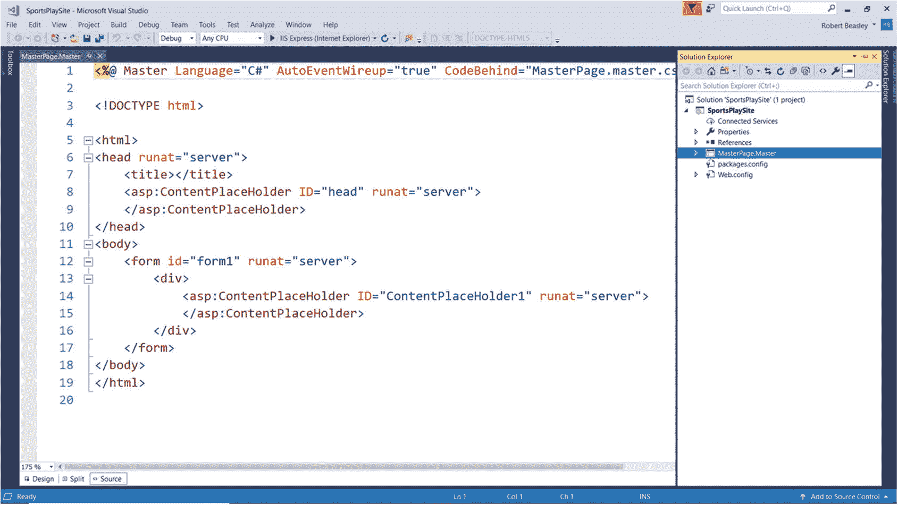

# 十七、母版页

## 17.1 导言

母版页是一个包含页面元素(例如，文本、HTML、space 服务器控件)和一个为其关联的*内容页面*保留空间的*内容占位符*的模板。放置在母版页中的每个页面元素(内容占位符之外)都显示在与母版页相关联的每个内容页面的*上。因此，当使用母版页时，母版页本身从一个内容页到下一个内容页保持一致。唯一改变的是内容页面中显示的内容。*

母版页很有用，因为它们允许我们在 Web 应用的许多页面上一致地显示通用页面元素(T2)。例如，一个设计良好的 Web 应用将在它的母版页中一致地显示一些元素，如组织徽标、显示应用名称的位置、显示最终用户名称的位置、显示当前页面名称的位置以及显示消息的位置。当这样的元素包含在应用的母版页中时，它们的位置从一个内容页到下一个内容页保持一致，这使得应用更易于使用并且看起来更专业。

在本章中，我们将从查看 MasterPage 类开始。我们将使用这个类在 Web 应用的所有内容页面类中显示一致的结构、外观和感觉。接下来，我们将学习如何使用 Visual Studio 向 ASP.NET Web 应用项目添加母版页。最后，我们将学习如何添加与 MasterPage 类相关联的内容页面类。

## 17.2 母版页类

MasterPage 类充当. NET Web 应用内容页的容器。因此，它允许我们在应用的所有内容页面类中显示一致的结构、外观和感觉。尽管大多数 Web 应用都有一个应用于应用所有内容页面的母版页，但有些 Web 应用有多个母版页，应用于应用中内容页面的 T2 组。在 ASP.NET 中，母版页可以在*设计时*与内容页静态关联(即，我们可以在内容页的 Aspx 代码中硬编码关联)，也可以在*运行时*以编程方式*与内容页关联(即，我们可以在内容页后面的代码中建立关联)。在本章中，我们将静态地将我们的母版页与我们的内容页关联起来。*

在深入讨论之前，最好先讨论一下母版页在 ASP.NET 是如何工作的。当客户端向服务器请求内容页时，服务器会将内容页及其关联的母版页合并到与内容页同名的单个页面中。这导致母版页和内容页的组合，母版页和内容页对于其所有关联的内容页都是相同的，而内容页不同于所有其他内容页。尽管内容页及其关联的母版页被合并到一个页面中，但从编码的角度来看，知道它们被视为单独的对象是非常重要的。实际上，母版页被视为内容页上的控件。因此，如果我们希望访问(即获取或设置)母版页中页面元素的属性，我们必须将这些属性“公开”给内容页面。稍后我们将看到一个这样的例子。此外，由于 MasterPage 类和 Page 类引发一些相同的事件(例如，Load 事件)，因此查看这些事件的引发顺序是一个好主意。出于参考目的，该顺序为

*   内容页的 PreInit 事件

*   母版页控件的初始化事件

*   内容页控件的初始化事件

*   母版页的 Init 事件

*   内容页的初始化事件

*   内容页的 Load 事件

*   母版页的 Load 事件

*   母版页控件的加载事件

*   内容页控件的加载事件

*   内容页的 PreRender 事件

*   主页的 PreRender 事件

*   母版页控件的 PreRender 事件

*   内容页控件的 PreRender 事件

*   母版页控件的卸载事件

*   内容页控件的卸载事件

*   母版页的卸载事件

*   内容页的卸载事件

表 [17-1](#Tab1) 显示了 MasterPage 类的一些属性、方法和事件。

表 17-1

MasterPage 类的一些属性、方法和事件

<colgroup><col class="tcol1 align-left"> <col class="tcol2 align-left"></colgroup> 
| **类**母版页T3】1T5】 |
| **命名空间**系统。Web.UI |
| **属性** |
| MasterPageFile | 获取或设置包含当前内容的母版页的名称。 |
| **方法** |
| (参见参考文献。) |   |
| **事件** |
| (参见参考文献。) |   |
| **参考** |
| [T2`https://msdn.microsoft.com/en-us/library/system.web.ui.masterpage(v=vs.110).aspx`](https://msdn.microsoft.com/en-us/library/system.web.ui.masterpage%2528v%253Dvs.110%2529.aspx) |

## 17.3 添加母版页类

当开始一个新的 Web 应用时，在向项目添加任何内容页面类之前，向项目添加母版页类是一个好主意。这是因为在创建内容页面类时，将内容页面类与现有母版页类相关联比将*不与母版页类相关联的内容页面类转换为*与母版页类相关联的内容页面类要容易得多。因此，一般来说，母版页应该是我们在开始一个新项目时首先创建的东西之一。向 ASP.NET Web 应用项目添加母版页类**

1.  打开解决方案资源管理器。

2.  右击项目(不是解决方案)。

3.  选择*添加* ➤ *新项目…* 。

当*添加新项目*对话框出现时

1.  从对话框的左窗格中选择*已安装*➤*visual c#*➤*web*➤*web 窗体*。

2.  从对话框的中间窗格选择 *Web 表单母版页*。

3.  在对话框底部给母版页(即母版页类)一个*名称*。

4.  点击*添加*。

图 [17-1](#Fig1) 显示了新添加的 MasterPage 类的 Aspx 文件。请注意，在解决方案资源管理器中，MasterPage 类已添加到项目中。以后每当我们想要访问这个 MasterPage 类的代码时，我们只需在解决方案资源管理器中双击它。接下来，请注意 Visual Studio 菜单和代码顶部之间的制表符。此选项卡显示母版页类文件的名称(即母版页)。主人)。我们将在这个文件中设计应用的母版页。现在看看代码本身。注意代码最顶端的*母版页指令*。这个母版页指令表明，C# 被用作该类的编程语言，并且文件背后的代码名称(也就是我们将编写服务器端 ASP.NET 和 C# 代码的地方)是 MasterPage.Master.cs。最后，请注意，该文件的其余部分包含许多基本的 HTML 标记，例如< head >、< title >、< body >和< div >，以及两个 ASP.NET 服务器控制标记对(即在本章中，我们将集中讨论第二对内容占位符标签*。*

图 17-1

新添加的母版页类的 Aspx 文件

像 Page 类一样，MasterPage 类有两个主要的(独立的)部分—用户界面部分和代码隐藏部分。*。主*文件包含了*类的用户界面*部分。类的这一部分是使用 HTML 标签、ASP 标签或两者的组合来编码的。另一方面， *Master.cs* 文件包含类的部分后面的*代码。这部分类是用 ASP.NET 和 C# 编写的。这种*关注点分离*的美妙之处在于，我们可以在不影响主版页面功能的情况下更改主版页面的用户界面，也可以在不影响主版页面用户界面的情况下更改主版页面的功能。*

要写 ASP.NET 和 C# 代码，我们需要打开类的代码隐藏文件。访问文件背后的代码

1.  单击母版页旁边的*三角形*图标，展开母版页类。解决方案资源管理器中的主文件。

2.  双击关联的母版页。Master.cs 文件。

图 [17-2](#Fig2) 显示了新添加的 MasterPage 类的代码隐藏文件。请注意 Visual Studio 菜单和代码顶部之间的制表符。此选项卡显示母版页类(即母版页)的代码隐藏文件的名称。Master.cs)。我们将在这个文件中编写母版页的 ASP.NET 和 C# 代码。现在看看代码本身。注意，在代码的最顶端，许多 C# 指令以单词*开始，使用*。指令后面的这些*代码引用了类中包含的*名称空间*。名称空间可以包含为母版页类提供附加功能的其他*类*，或者它们可以包含其他名称空间所需的*类型*(例如，接口类型、数组类型、值类型、引用类型、枚举类型)。现在看看以单词*命名空间*开始的代码行。这表明我们的 MasterPage 类位于 SportsPlaySite 名称空间中。如果出于某种原因，我们需要在将来从其他类中引用这个 MasterPage 类的属性和/或方法，我们将需要在该类中包含 SportsPlaySite 名称空间。接下来，看看以短语 *public partial class* 开始的代码行。这里的*部分*表示该文件(即母版页。Master.cs)包含 MasterPage 类的一个*部分*。其他文件(即母版页。母版和母版页。Master.designer.cs)包含母版页类的其他*部分*。最后，看看以短语 *protected void* 开头的代码行。这是类的 Page_Load 事件处理程序方法，它是在将 MasterPage 类添加到项目中时自动生成的。如果有任何 ASP.NET 和/或 C# 代码需要在母版页加载时(即引发母版页的 Load 事件时)执行，我们将在此处编写。*

图 17-2

新添加的母版页类的代码隐藏文件

## 17.4 使用母版页添加页面类

既然我们已经向项目中添加了一个 MasterPage 类，我们就可以开始添加任何相关的内容页面类了。向 ASP.NET Web 应用项目添加带有母版页的 Page 类

1.  打开解决方案资源管理器。

2.  右击项目(不是解决方案)。

3.  选择*添加* ➤ *新项目…* 。

当*添加新项目*对话框出现时

1.  从对话框的左窗格中选择*已安装*➤*visual c#*➤*web*➤*web 窗体*。

2.  从对话框的中间窗格选择带有母版页的 *Web 表单。*

3.  在对话框底部给网页(即页面类)一个*名*。

4.  点击*添加*。

当*选择母版页*对话框出现时

1.  从对话框的右窗格中选择母版页。

2.  点击*确定*。

图 [17-3](#Fig3) 显示了新添加的内容页面类的 Aspx 文件。请注意，在解决方案资源管理器中，内容页类已经添加到项目中。无论何时我们想要访问这个内容页面类的代码，我们只需在解决方案浏览器中双击它。接下来，请注意 Visual Studio 菜单和代码顶部之间的制表符。此选项卡显示内容页面类文件的名称(即 Home.aspx)。现在看看代码本身。请注意代码最顶端的页面指令。该页面指令指示 C# 用作该类的编程语言，相关联的母版页文件是 master page。Master，并且文件背后的代码的名称(即，我们将在其中编写服务器端 ASP.NET 和 C# 代码)是 Home.aspx.cs。最后，请注意，该文件不包含 HTML 标记。它只包含两个 ASP.NET 服务器控制标签对(即< asp:Content >和< /asp:Content >)。我们将在第二对内容标签*和第三对内容标签之间设计这个内容页面的用户界面。*

图 17-3

新添加的内容页类的 Aspx 文件

像 MasterPage 类一样，content Page 类有两个主要的(独立的)部分—用户界面部分和代码隐藏部分。*。aspx* 文件包含了*类的用户界面*部分。类的这一部分是使用 HTML 标签、ASP 标签或两者的组合来编码的。另一方面， *.aspx.cs* 文件包含类的部分后面的*代码。这部分类是用 ASP.NET 和 C# 编写的。这种*关注点分离*的美妙之处在于，我们可以对内容页面的用户界面进行更改，而不会影响其功能，我们也可以对内容页面的功能进行更改，而不会影响其用户界面。*

要写 ASP.NET 和 C# 代码，我们需要打开类的代码隐藏文件。访问文件背后的代码

1.  单击旁边的*三角形*图标展开内容页面类。解决方案资源管理器中的。

2.  双击关联的. aspx.cs 文件。

图 [17-4](#Fig4) 显示了新添加的内容页面类的文件背后的代码。请注意 Visual Studio 菜单和代码顶部之间的制表符。此选项卡显示内容页类的文件背后的代码的名称(即 Home.aspx.cs)。我们将在这个文件中编写内容页面的 ASP.NET 和 C# 代码。现在看看代码本身。在代码的最顶端，注意许多以单词*开头的 C# 指令使用了*。指令后面的这些*代码引用了类中包含的*名称空间*。名称空间可以包含为内容页面类提供附加功能的其他*类*，或者它们可以包含其他名称空间所需的*类型*(例如，接口类型、数组类型、值类型、引用类型、枚举类型)。现在看看以单词*命名空间*开始的代码行。这表明 Home 类位于 SportsPlaySite 名称空间中。如果出于某种原因，我们将来需要从其他类中引用 Home 类的属性和/或方法，我们将需要在该类中包含 SportsPlaySite 名称空间。接下来，看看以短语 *public partial class* 开始的代码行。这里的单词 *partial* 表示该文件(即 Home.aspx.cs)包含 Home 类的一个*部分*。其他文件(即 Home.aspx 和 Home.aspx.designer.cs)包含 Home 类的其他*部分*。最后，看看以短语 *protected void* 开头的代码行。这是类的 Page_Load 事件处理程序方法，它是在将内容页类添加到项目中时自动生成的。如果有任何 ASP.NET 和/或 C# 代码需要在页面加载时执行(即，当页面的 Load 事件被引发时)，我们将在此处编写代码。*

图 17-4

新添加的内容页类的代码隐藏文件

图 [17-5](#Fig5) 显示了母版页类的一个例子。

请注意 01 处的母版页指令。该指令指出，C# 被用作该类的编程语言，并且文件背后的代码名称(即，我们将编写服务器端 ASP.NET 和 C# 代码的位置)是 MasterPage.Master.cs

请注意 02 处的表格，该表格在主页的*标题*中布置了控件。我们知道这个表格显示在主页的页眉中，因为它位于(第二个)内容占位符的*上方，可以在 04 处看到。*

请注意 03 处的标签控件，它将用于显示应用中的所有消息。因为这个标签存在于母版页中，所以我们需要在类的代码中公开它的属性。

注意 04 处的(第二个)内容占位符。当母版页和关联的内容页在编译期间合并时，内容页上的控件将放置在此位置。

请注意 05 处的表格，该表格在主页的*页脚*中布置了控件。我们知道这个表格显示在母版页的页脚中，因为它位于(第二个)内容占位符下面*。*

现在看看母版页后面的代码。在该文件的顶部，我们已经编写了在母版页的页眉中公开四个控件(即 lblUser、lblPageTitle、lblMessage 和 lblLog)的一些属性所必需的代码。通过这样做，应用的内容页可以访问这些控件，并可以根据需要操作它们。

请注意，在 06 中，我们为 MasterPage 类定义了一个公共 MessageForeColor 属性。系统。声明的颜色部分指示属性的类型。在这种情况下，属性是一种颜色。声明的大括号内的语句指示当从关联内容页的代码后面设置属性时，lblMessage 控件的 ForeColor 属性将被设置为指示的任何颜色。

请注意，在 07 中，我们已经为 MasterPage 类定义了一个公共消息属性。声明的字符串部分指示属性的类型。在这种情况下，属性是一个字符串。声明的大括号内的语句指示，当从关联内容页的代码后面设置属性时，lblMessage 控件的 Text 属性将被设置为指示的任何字符串。注意，这两个公共属性(即 MessageForeColor 和 Message)都引用在 03 定义的 lblMessage 控件。

请注意 08 处的 Page_Load 事件处理程序方法，在该方法中，我们设置了母版页的 Aspx 代码的页脚部分中的几个标签控件(即 lblServerName、lblVersion、lblDate 和 lblContact)的属性。因此，每次加载母版页及其关联的内容页时，都会设置这些属性。

T3】

图 17-5

母版页类的示例

图 [17-6](#Fig6) 显示了一个带有主页的主页的例子。

注意 01 处代码最顶端的页面指令。该页面指令指示相关联的母版页文件是 MasterPage.Master。

注意 02 处的*主类型指令*。该指令提供对我们已经公开的母版页的属性的访问。如果我们不通过包含这个指令来提供对这些属性的访问，我们将*而不是*能够在内容页面的代码后面操作母版页的属性。

请注意 03 处的内容占位符标记。我们放置在该标签及其相关联的结束标签之间的每个页面元素都将显示在母版页的页眉和页脚之间。

请注意 04 处内容页面的 Page_Load 事件处理程序方法。可以看出，正是在这个事件处理程序方法中，我们设置了 MasterPage 类的几个公开属性。

请注意，在 05 处，我们将 MasterPage 类的 MessageForeColor 属性设置为*绿色*，以向最终用户表明一切正常。

注意在 06，我们将 MasterPage 类的 Message 属性设置为*，请点击【登录】登录到系统*。

图中结果部分的屏幕截图显示了内容页面(即 Home.aspx)及其关联的母版页在合并、执行并显示在浏览器中之后的情况。

图 17-6

带有母版页的主页示例

图 [17-7](#Fig7) 显示了一个带有主页的登录页面的例子。

请分别注意 01、02 和 03 处的页面指令、主类型指令和内容占位符标记。这些在前面已经讨论过了。可以看出，内容占位符标记及其关联的结束标记之间的代码不同于 Home.aspx 文件中的代码。

请注意 04 处内容页面的 Page_Load 事件处理程序方法。同样，正是在这个事件处理程序方法中，我们设置了 MasterPage 类的几个公开属性。

请注意，在 05 处，我们将 MasterPage 类的 MessageForeColor 属性设置为*绿色*，以向最终用户表明一切正常。

请注意，在 06，我们将 MasterPage 类的 Message 属性设置为*，请输入您的电子邮件地址和密码，然后单击登录*。

图中结果部分的屏幕截图显示了内容页面(即 Login.aspx)及其关联的母版页，在这两个页面被合并、执行并显示在浏览器中之后，最终用户已经输入了他或她的电子邮件地址和密码。

 

图 17-7

带有母版页的登录页示例

图 [17-8](#Fig8) 显示了一个带有母版页的选项页的例子。

请分别注意 01、02 和 03 处的页面指令、主类型指令和内容占位符标记。这些在前面已经讨论过了。请注意，内容占位符标记及其关联的结束标记之间的代码不同于 Home.aspx 文件和 Login.aspx 文件中的代码。

请注意 04 处内容页面的 Page_Load 事件处理程序方法。同样，在这个事件处理程序方法中，我们设置了 MasterPage 类的几个公开属性。

请注意，在 05，我们将 MasterPage 类的 User 属性设置为登录的最终用户的名称。我们可以假设，当最终用户成功登录时，这个名称被保存到会话变量中。

请注意，在 06 处，我们将 MasterPage 类的 MessageForeColor 属性设置为*绿色*，以向最终用户表明一切正常。

请注意，在 07，我们将 MasterPage 类的 Message 属性设置为*，请从下面的选项中选择*。

图中结果部分的屏幕截图显示了内容页面(即 Options.aspx)及其关联的母版页在合并、执行并显示在浏览器中之后的情况。请注意，最终用户的姓名显示在页面上。

图 17-8

带有母版页的选项页示例

<aside aria-label="Footnotes" class="FootnoteSection" epub:type="footnotes">Footnotes [1](#Fn1_source)

所有属性、方法和事件描述都直接取自微软的官方文档。为了节省空间，省略了用于处理该类事件的事件处理程序方法。有关该类的所有方法，请参见参考。

 </aside>