# 十八、主题

## 18.1 简介

主题允许我们在一个地方定义 Web 应用页面控件的默认显示特征，以便它们在单个页面和多个页面中具有一致的外观。在 ASP.NET Web 应用中，主题是在一个名为 App_Themes 的特殊目录中定义的。单个主题本身是 App_Themes 目录中的一个目录，包含零个或多个*皮肤*文件和零个或多个*层叠样式表(css)* 文件。

在这一章中，我们将从给一个项目添加一个主题开始。正如我们将会看到的，当我们想要改变 ASP.NET 服务器控件和 HTML 元素在应用页面上的显示特征时，尽早(即在对应用页面控件的显示属性进行编码之前)向项目添加主题将会节省我们大量的时间和精力。接下来，我们将看看皮肤文件。皮肤文件是我们定义应用的*ASP.NET 服务器控件*的显示特征(即皮肤)的地方。然后，我们将添加一个皮肤文件到我们的主题，这样它就可以应用到我们的应用的 ASP.NET 服务器控件。然后，我们将讨论级联样式表文件。级联样式表文件是我们定义应用的 *HTML 元素*的显示特征(即样式)的地方。然后，我们将向主题添加一个级联样式表，并将其应用于应用的 HTML 元素。

## 18.2 添加主题

当开始一个新的 Web 应用时，向项目添加一个主题(及其相关的皮肤和 css 文件)并使用该主题格式化应用的 ASP.NET 服务器控件和 HTML 元素几乎总是一个好主意。如果我们做不到这一点，我们将倾向于在开发整个应用时单独设置这些项目的格式属性。然后，我们将需要在稍后的时间返回(在我们最终做出使用主题的明智决定之后),并删除这些单独的格式属性——这确实是一项繁琐的任务。因此，一般来说，创建一个主题应该是我们开始一个新项目时首先要做的事情之一。向 ASP.NET Web 应用项目添加主题

1.  打开解决方案资源管理器。

2.  右击项目(不是解决方案)。

3.  选择*添加*ASP.NET 文件夹*添加➤*➤*主题。*

图 [18-1](#Fig1) 显示了新添加的主题。请注意，在解决方案资源管理器中，Theme1(默认情况下赋予主题的名称)已添加到项目中。如果我们想的话，我们可以重命名这个主题，但是我们将保留本章中例子的名称。

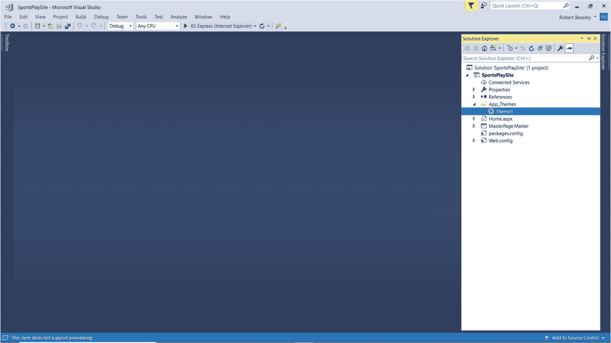

图 18-1

新添加的主题

一旦我们将主题添加到我们的项目中，我们可以通过设置每个页面的页面指令的*主题*属性将其应用到应用的各个页面，或者我们可以通过设置应用的 Web.config 文件中的<页面>元素的*主题*属性将其应用到应用的所有页面。尽管大多数应用使用一个主题，但是如果我们愿意，我们可以添加和使用多个主题。例如，我们可能希望根据一年中的季节或登录的最终用户的类型来修改应用的所有 TextBox 控件的 BackColor 和 Font-Names 属性，只是为了给页面一个不同的外观。请记住，主题只能用于定义 ASP.NET 服务器控件的属性和处理*外观*或*静态内容*的 HTML 元素。它们不能用来定义处理*行为*的 ASP.NET 服务器控件和 HTML 元素的属性。

## 18.3 皮肤文件

皮肤文件具有. skin 文件扩展名，是我们定义应用的*ASP.NET 服务器控件*的显示特征(即皮肤)的地方，例如按钮控件、标签控件和文本框控件。有两种皮肤——*默认皮肤*和*命名皮肤*。默认皮肤*没有*skin id，并且应用于给定类型的所有控件(例如，所有按钮控件、所有标签控件、所有文本框控件)。例如，如果我们希望格式化应用中所有 ASP.NET 按钮控件的*,使它们以双边框样式和 Arial 字体显示，我们将在皮肤文件中定义默认皮肤，如下所示:*

```cs
<asp:Button runat="server" BorderStyle="Double" Font-Names="Arial" />

```

另一方面，一个命名的皮肤有一个 SkinID，并且只应用于那些给定类型的具有相同 SkinID 的控件。命名皮肤允许我们对同一类型的不同控件应用不同的格式。例如，如果我们希望在一个 SkinID 为 *skiButton* 的应用中只格式化*的那些 ASP.NET 按钮控件，以便它们以双边框样式和 Arial 字体显示，我们将在皮肤文件中这样定义命名的皮肤:*

```cs
<asp:Button runat="server" SkinID="skiButton" BorderStyle="Double"
    Font-Names="Arial" />

```

## 18.4 添加皮肤文件

向 ASP.NET Web 应用项目添加外观文件

1.  打开解决方案资源管理器。

2.  单击 App_Themes 文件夹旁边的*三角形*图标，展开该文件夹。

3.  右键单击主题。

4.  选择*添加* ➤ *新项目…*

当*添加新项目*对话框出现时

1.  从对话框的左窗格中选择*已安装*➤*visual c#*➤*web*➤*web 窗体*。

2.  从对话框的中间窗格选择 *Web 表单皮肤文件*。

3.  在对话框底部给皮肤文件一个*名*。

4.  点击*添加*。

图 [18-2](#Fig2) 显示了新增皮肤文件的代码。请注意，在解决方案资源管理器中，外观文件已经添加到主题中。如果我们愿意，我们可以重命名这个皮肤文件，但是我们将保留本章中的例子的名称。现在看看皮肤文件的内容。可以看到，已经为我们自动生成了几个皮肤示例并注释掉了。我们将删除这些并编写我们自己的皮肤代码。

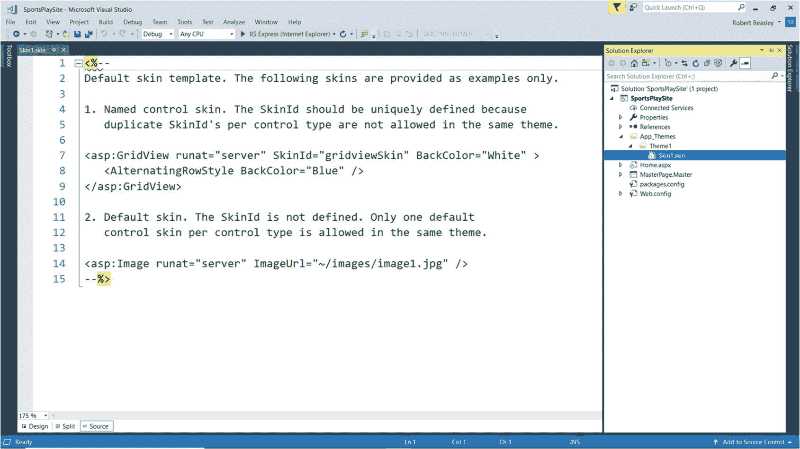

图 18-2

新添加的皮肤文件的代码

图 [18-3](#Fig3) 显示了一个皮肤文件内容及其相关 Web.config 文件条目的例子。图中首先要注意的是，各个 ASP.NET 服务器控件的外观是按字母顺序排列的。虽然从图中可以看出，按顺序放置皮肤看起来是一个微不足道的细节，但是当文件中有几十个皮肤时，这就变成了一个重要的细节。在这种情况下，按顺序排列皮肤将允许我们快速定位各个皮肤，并帮助我们避免重复的皮肤，因为这样的重复很容易看到。图中要注意的第二件事是，各个皮肤的格式化属性放在单独的行上，并按字母顺序列出。由于一个皮肤可以包含几十个格式属性，出于刚才提到的原因，将它们放在单独的行上并按字母顺序排序是一个好主意。图中要注意的第三件事是，所有 SkinID 属性都以三个字母的前缀 *ski* 开始，以皮肤的*类型控件*结束(后面可能跟有某种限定符，以进一步标识皮肤——比如在 03 和 06，我们分别添加了 *PageTitle* 和 *MultiLine* ，以进一步标识皮肤)。这不是语言的要求，但它将是我们在本章中使用的命名标准。

请注意 01 处的按钮皮肤没有 SkinID。因此，这个皮肤是一个*默认皮肤*，它将被应用于应用中所有*按钮控件的*，除了那些 SkinID 属性被设置为皮肤的或者那些 EnableTheming 属性被设置为 *false* 的。将给定控件的 EnableTheming 属性设置为 *false* 会阻止控件采用在其外观中定义的格式特征。

请注意 02–06，所有的皮肤都有一个 SkinID。因此，这些皮肤都是*命名的皮肤*，它们将应用于应用中所有*控件(相同类型)的*，这些控件的 SkinID 属性设置为一个皮肤(相同类型)的名称，并且它们的 EnableTheming 属性没有设置为 *false* 。

请注意，在 07，我们在 Web.config 文件中添加了一个<system.web>部分，其中包含一个<pages>标签，其*主题*属性设置为我们之前创建的主题的名称。这个配置设置标识了我们希望应用到应用的主题，并且可以手动或以编程方式进行更改。</pages></system.web>

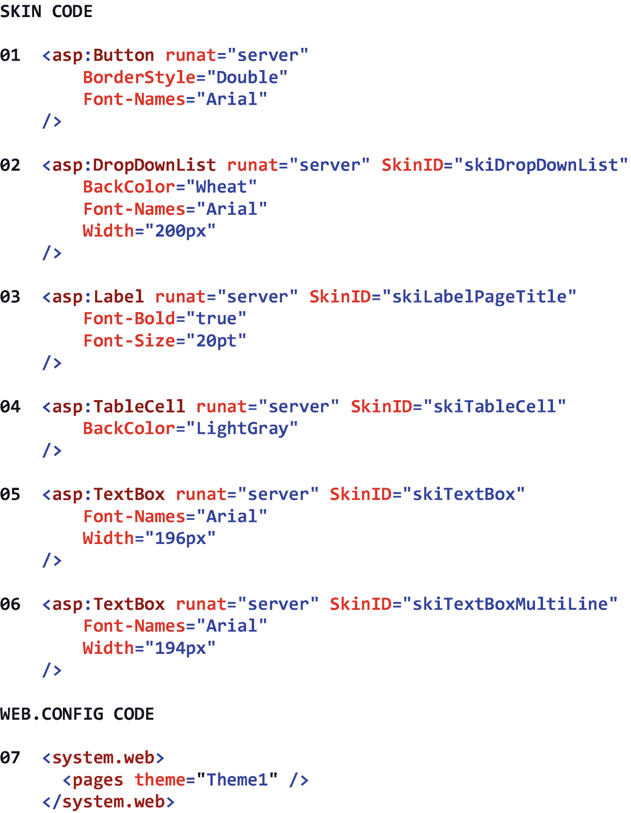

图 18-3

一个皮肤文件的内容及其关联的 Web.config 文件条目

的例子

图 [18-4](#Fig4) 显示了一个在页面中应用皮肤的例子。

请注意，在 01–04，已经设置了控件的 SkinID 属性。因此，将应用于这些控件的格式是在皮肤文件中相关的名为皮肤的*中定义的。*

注意 05 处的*按钮控件没有设置* SkinID 属性。因此，将应用于该控件的格式是在皮肤文件中相关联的*默认皮肤*中定义的。

图中结果部分的屏幕截图显示了应用了 Theme1 皮肤文件的应用的*输入产品*页面。请注意页面标题的较大字体、包含标签的表格单元格的阴影背景色、下拉列表的阴影背景色、下拉列表和文本框的一致宽度、用于显示下拉列表和文本框中的数据的不同字体，以及按钮的修改后的字体和边框样式。

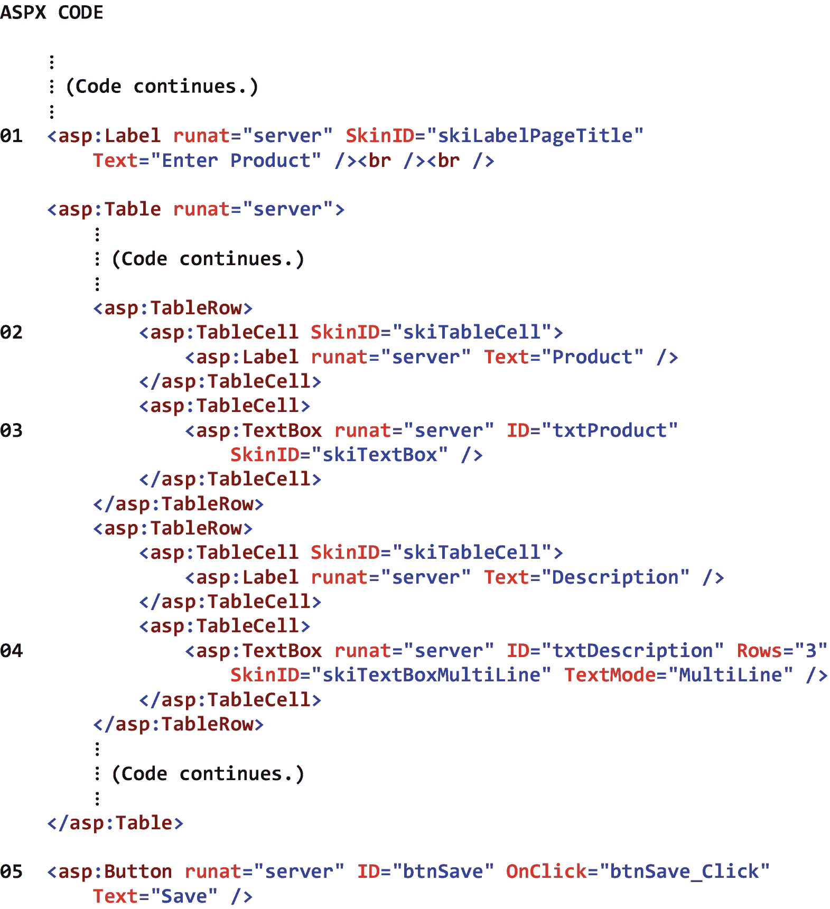 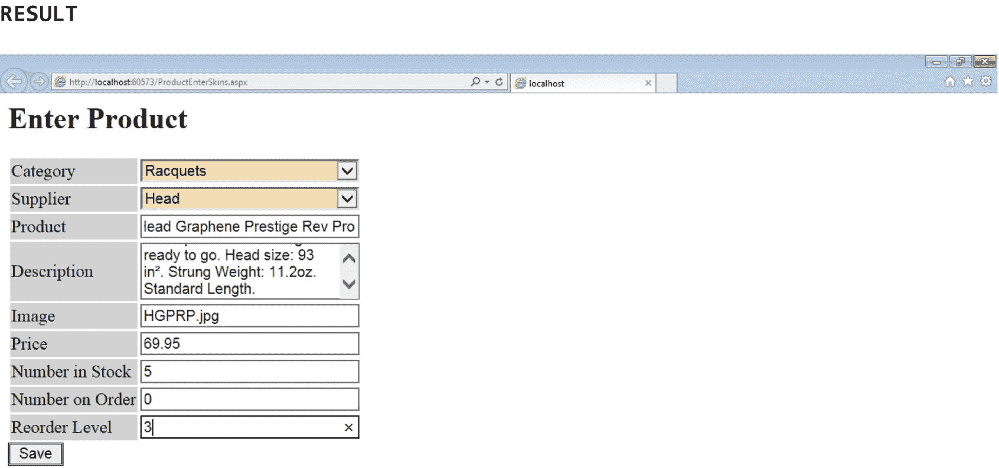

图 18-4

页面中应用的皮肤示例

图 [18-5](#Fig5) 显示了在另一个页面中应用的皮肤示例。

请注意，在 01–04，已经设置了控件的 SkinID 属性。因此，将应用于这些控件的格式是在皮肤文件中相关的名为皮肤的*中定义的。*

请注意 05 和 06 处的这些按钮控件没有设置 *no* SkinID 属性。因此，将应用于这些控件的格式是在皮肤文件中相关联的*默认皮肤*中定义的。

图中结果部分的屏幕截图显示了应用了 Theme1 皮肤文件的应用的*输入订单*页面。请注意页面标题的较大字体、包含标签的表格单元格的阴影背景色、下拉列表的阴影背景色、下拉列表和文本框的一致宽度、用于显示下拉列表和文本框中的数据的不同字体，以及按钮的修改后的字体和边框样式。可以看出，该页面的显示属性与图 [18-4](#Fig4) 中显示的属性完全相同。

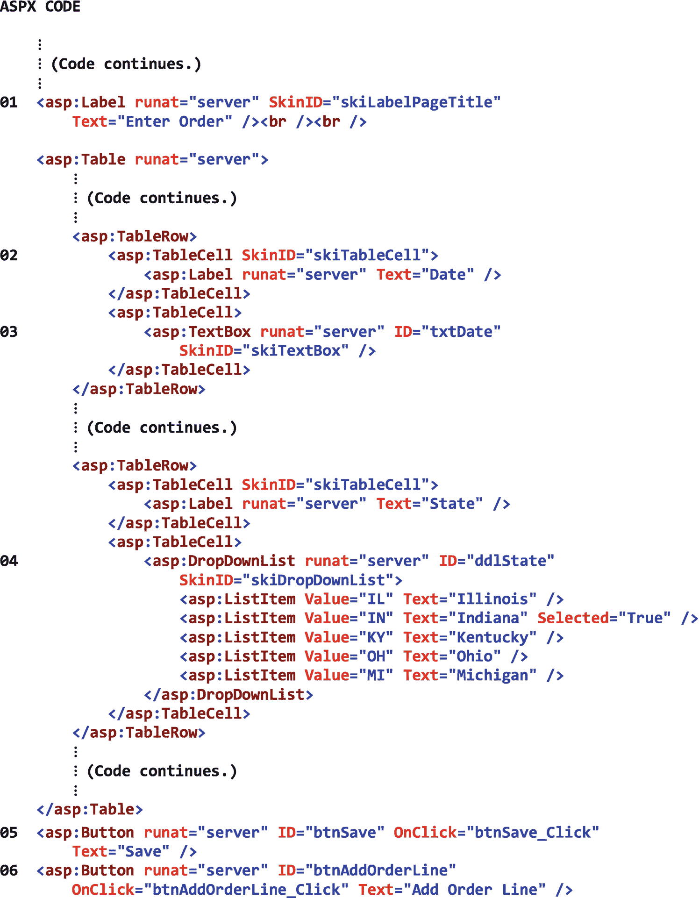 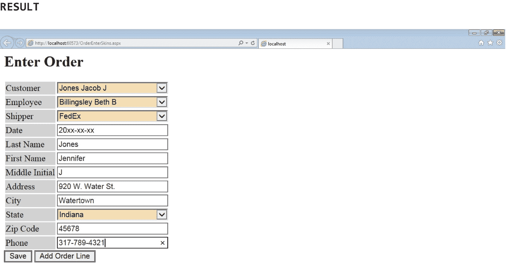

图 18-5

在另一个页面中应用的皮肤示例

这里的要点是，如果我们使用一个皮肤文件，并且我们想要改变 ASP.NET Web 应用的所有页面上的服务器控件的显示特性，我们只需要在 T2 的一个地方——皮肤文件——修改这些显示特性。

## 18.5 级联样式表文件

级联样式表文件具有. css 文件扩展名，并且是我们定义应用的 *HTML 元素*的显示特征(即样式)的地方，比如它的输入元素、标签元素和表格行元素。级联样式表文件包含一个或多个 *css 选择器*。css 选择器有很多种，包括*元素选择器*和*类选择器*。元素选择器有一个 HTML 元素类型，后跟相关的 css 格式声明。这种类型的选择器应用于该类型的所有 HTML 元素(例如，所有 h1 元素、所有 input 元素、所有 label 元素)。例如，如果我们希望格式化应用中的所有 HTML 标签元素，使它们以 20 像素的字体大小和粗体显示，我们可以在 css 文件中这样定义元素选择器:

```cs
label {font-size: 20px; font-weight: bold;}

```

另一方面，类选择器有一个句点，后跟一个类名，再跟它相关的 css 格式声明。这种类型的选择器仅适用于那些将其 *class* 属性设置为类选择器名称的 HTML 元素。类选择器允许我们对相同类型的不同 HTML 元素应用不同的格式。例如，如果我们希望在一个应用中只格式化*和*那些具有*类属性的 HTML 标签元素。LabelPageTitle* 为了让它们以 20 像素的字体大小和加粗的字体粗细显示，我们将在 css 文件中像这样定义类选择器:

```cs
.LabelPageTitle {font-size: 20px; font-weight: bold;}

```

## 18.6 添加级联样式表文件

向 ASP.NET Web 应用项目添加级联样式表文件

1.  打开解决方案资源管理器。

2.  右键单击主题。

3.  选择*添加* ➤ *新项目…*

当*添加新项目*对话框出现时

1.  从对话框的左窗格中选择*已安装*➤*visual c#*➤*web*➤*标记*。

2.  从对话框的中间窗格选择*样式表*。

3.  在对话框底部给层叠样式表文件起一个*名*。

4.  点击*添加*。

图 [18-6](#Fig6) 显示了新添加的级联样式表文件的代码。请注意，在解决方案资源管理器中，css 文件已经添加到主题中。如果我们愿意，我们可以重命名这个 css 文件，但是我们将保留本章中的例子的名称。现在看看 css 文件的内容。可以看到，一个 css <主体>元素选择器已经为我们自动生成。我们将删除它并编写我们自己的 css 代码。

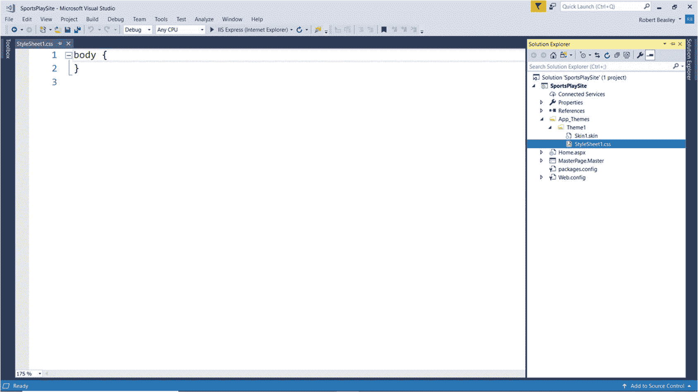

图 18-6

新添加的级联样式表文件的代码

图 [18-7](#Fig7) 显示了一个级联样式表的内容及其相关的 Web.config 条目的例子。在该图中首先要注意的是，图 [18-3](#Fig3) 中显示的*默认*和*命名皮肤*与该图中显示的*元素*和*类选择器*之间存在一一对应的关系。这样做是为了帮助说明 ASP.NET 服务器控件和 HTML 元素可以采用相同的格式。图中要注意的第二件事是元素选择器和类选择器是分开的，并按字母顺序排列。虽然从图中可以看出，将元素选择器与类选择器分开并按顺序列出它们似乎是一个小问题，但当文件中有几十个选择器时，这就成了一个重要问题。在这种情况下，按顺序排列选择器将允许我们快速定位单个选择器，并帮助我们避免重复的选择器，因为这样的重复很容易看到。图中要注意的第三件事是，单个选择器的格式属性放在单独的行上，并按字母顺序排列。由于单个选择器可以包含几十个格式属性，出于刚才提到的原因，将它们放在单独的行上并按字母顺序排序是一个好主意。图中要注意的第四件事是所有的类选择器都以一个*句点*开始。)并以选择器的*类型控件*结束(后面可能跟有某种限定符，以进一步标识选择器——比如在 03 和 07 处，我们分别添加了 *PageTitle* 和 *MultiLine* ，以进一步标识选择器)。同样，这不是语言的要求，但它将是我们在本章中使用的命名标准。

请注意 01 处的输入按钮选择器是一个元素选择器。因此，该选择器将应用于应用中所有输入按钮控件的*中，除了那些将*类*属性设置为类选择器的控件。*

请注意 02–07，所有的选择器都是类选择器。因此，这些选择器将被应用于应用中的所有控件(相同类型),这些控件的*类*属性被设置为类选择器的名称。

请注意 04 处的特殊 MenuCursor 类选择器。当最终用户的鼠标指针悬停在 ASP.NET 菜单控件上时，该选择器使其看起来像鼠标指针，而不是工字梁。

请注意，在 08，我们在 Web.config 文件中添加了一个<system.web>部分，其中包含一个<pages>标记，它的主题属性设置为我们之前创建的主题的名称。这个配置设置标识了我们希望应用到应用的主题，并且可以手动或以编程方式进行更改。</pages></system.web>

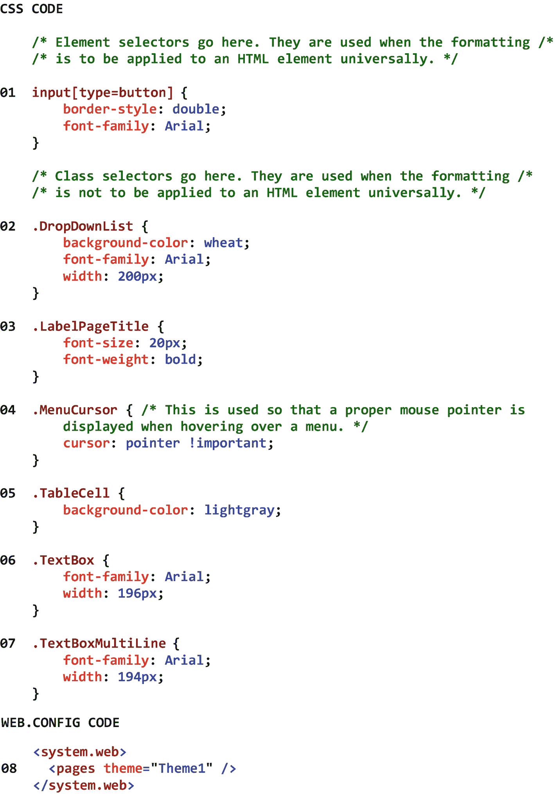

图 18-7

层叠样式表的内容及其关联的 Web.config 条目

的示例

图 [18-8](#Fig8) 显示了一个在页面中应用 css 选择器的例子。图中首先要注意的是，页面是使用 HTML 元素而不是 ASP.NET 服务器控件标记的。这样做是为了说明 css 选择器的使用。然而，作为一般规则，我们将在本书中使用皮肤而不是 css 选择器来执行控件格式化。

请注意，在 01–04，已经为控件设置了类属性。因此，将应用于这些控件的格式是在 css 文件中相关的*类选择器*中定义的。

请注意，在 05 处，没有为输入按钮控件设置 class 属性。因此，将应用于该控件的格式是在 css 文件中相关联的*元素选择器*中定义的。

图中结果部分的屏幕截图显示了应用了 Theme1 css 文件的应用的 *Enter Product* 页面。请注意页面标题的较大字体、包含标签的表格单元格的阴影背景色、下拉列表的阴影背景色、下拉列表和文本框的一致宽度、用于显示下拉列表和文本框中的数据的不同字体，以及按钮的修改后的字体和边框样式。可以看出，该页面与图 [18-4](#Fig4) 中所示的页面相同。

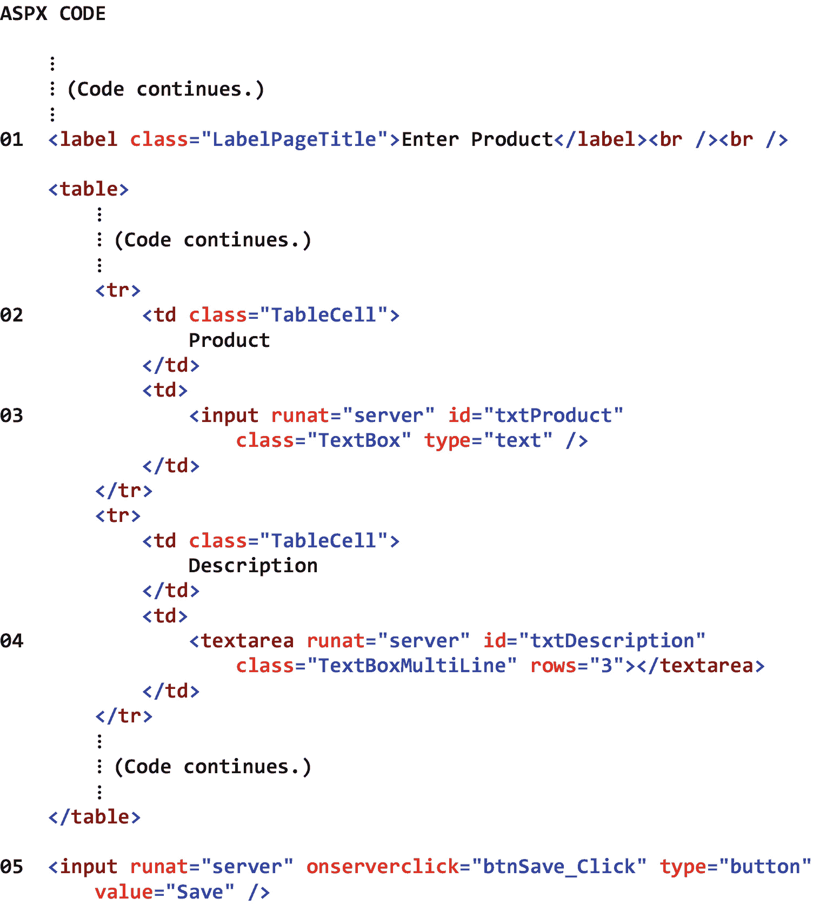 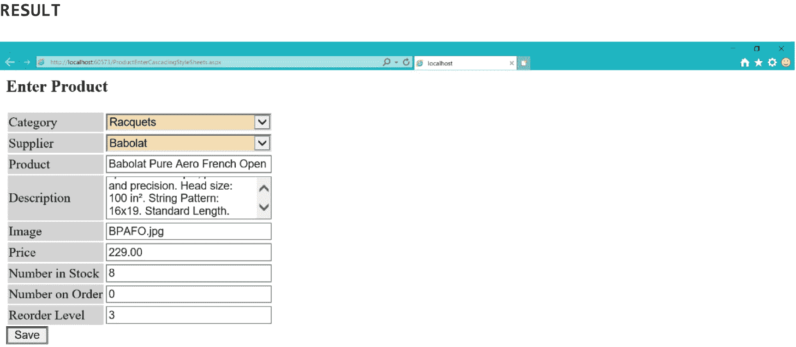

图 18-8

在页面中应用 css 选择器的例子

图 [18-9](#Fig9) 显示了在另一个页面中应用 css 选择器的例子。

请注意，在 01–03，已经为控件设置了类属性。因此，将应用于这些控件的格式是在 css 文件中相关的*类选择器*中定义的。

请注意，在 04 和 05 处，没有为输入按钮控件设置 class 属性。因此，将应用于这些控件的格式是在 css 文件中相关的*元素选择器*中定义的。

图中结果部分的屏幕截图显示了应用了 Theme1 css 文件的应用的*输入订单*页面。请注意页面标题的较大字体、包含标签的表格单元格的阴影背景色、下拉列表的阴影背景色、下拉列表和文本框的一致宽度、用于显示下拉列表和文本框中的数据的不同字体，以及按钮的修改后的字体和边框样式。可以看出，该页面的显示属性与图 [18-5](#Fig5) 中显示的属性完全相同。

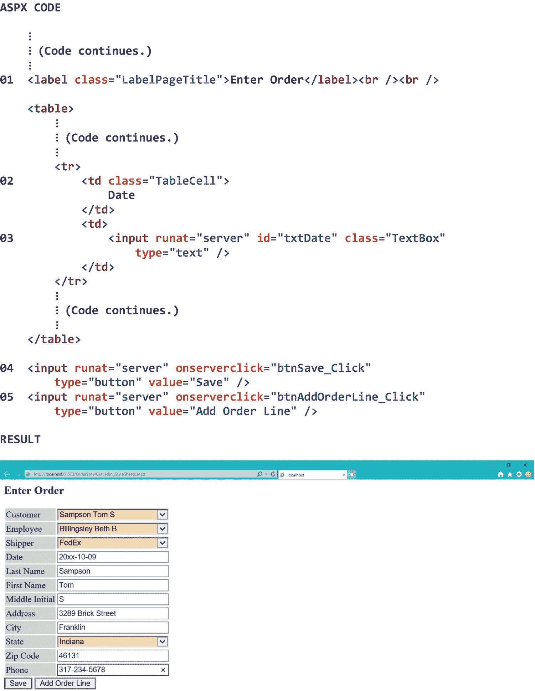

图 18-9

在另一个页面中应用的 css 选择器示例

需要记住的主要一点是，如果我们使用一个 css 文件，并且我们想要改变一个 ASP.NET Web 应用的所有页面的 HTML 元素的显示特性，我们只需要在一个地方——CSS 文件——修改这些显示特性。

最后，理解另一个技术细节也很重要。如果对 css 文件进行了更改，而该更改在请求页面时没有出现，则可能需要清除浏览器的缓存。这是因为默认情况下，级联样式表信息由浏览器缓存一次，然后由应用的后续页面根据需要重用。因此，在使用 CSS 选择器格式化 HTML 元素时，配置开发浏览器在退出*时删除其浏览历史可能是个好主意。*