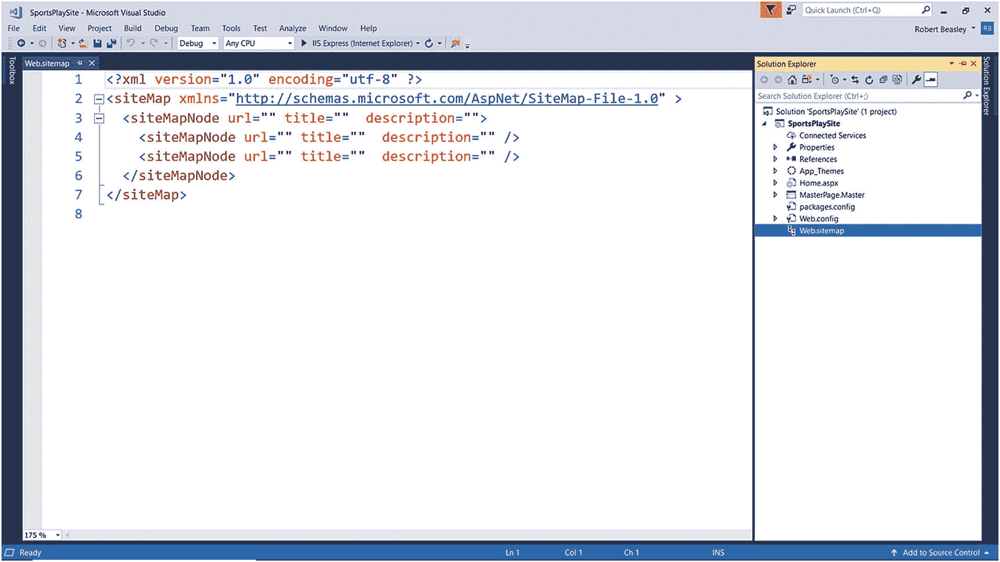
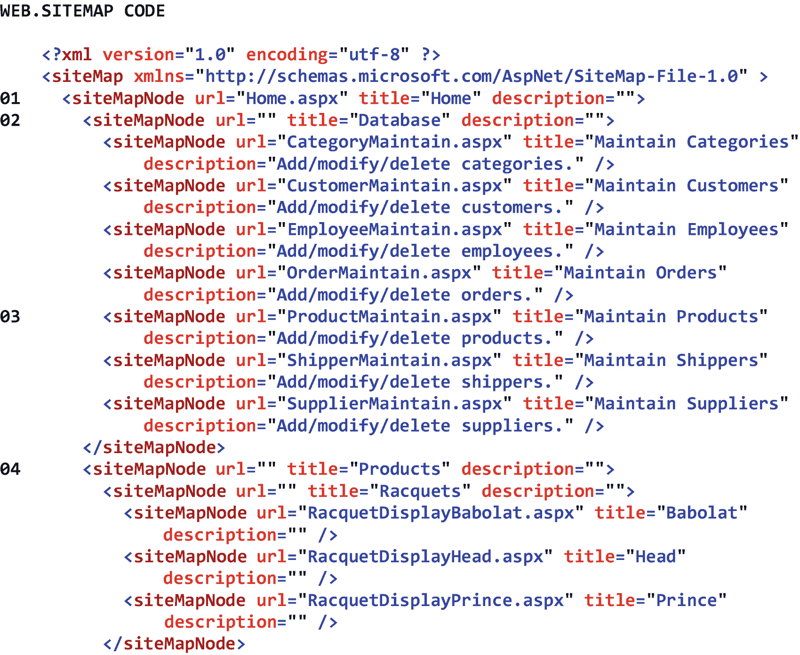
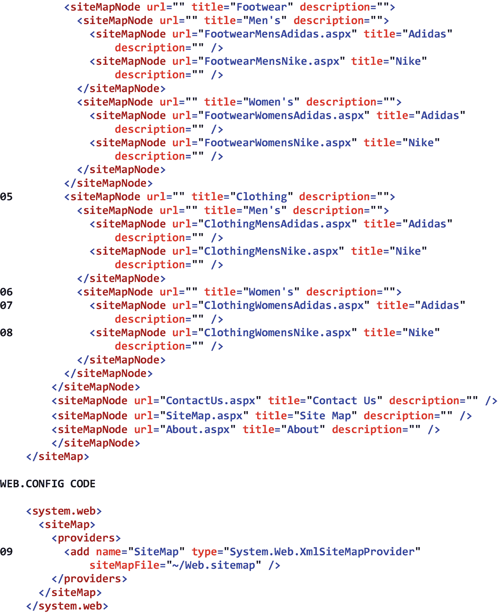
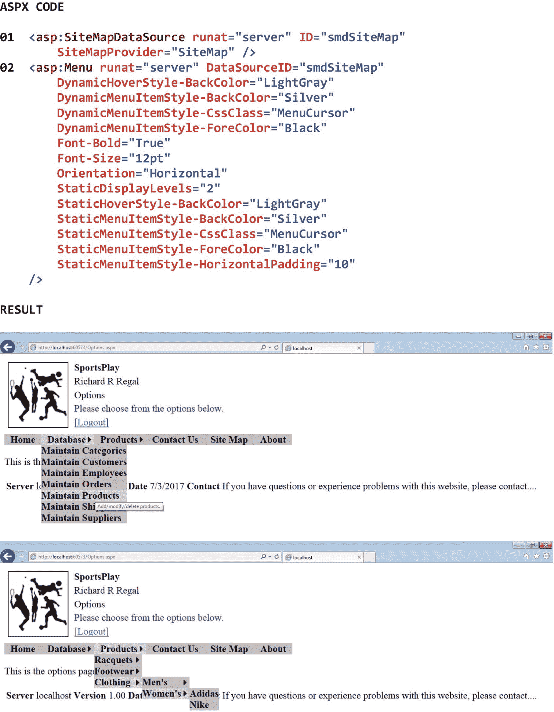
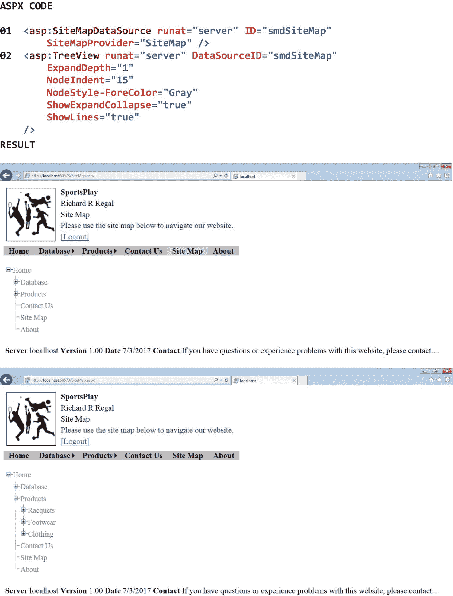

# 十九、导航

## 19.1 简介

ASP.NET 提供了许多类，可以用来帮助最终用户浏览 Web 应用的页面。这些类不仅使最终用户可以轻松地直接跳转到应用中所需的页面，还使我们可以轻松地管理应用页面的组织方式。在 ASP.NET 有四个主要的站点导航类。它们是 SiteMap 类、Menu 类、TreeView 类和 SiteMapPath 类。

在本章中，我们将从查看 SiteMap 类开始。SiteMap 类存储一个分层组织的 SiteMapNode 对象列表，每个对象包含一个菜单选项和/或一个页面 URL。使用 SiteMap 类允许我们定义一个 Web 应用的结构，并将它的页面链接存储在一个单独的位置。接下来，我们将学习在项目中添加一个站点地图类。之后，我们将讨论 Menu 类，它显示了最终用户可以用来导航应用页面的选项和子选项列表。最后，我们将考虑 TreeView 类。TreeView 类显示一个可扩展的树结构，最终用户可以使用它来导航应用的页面。

在本章中我们不会讨论 SiteMapPath 类，只是说它显示了终端用户从应用的主页到他或她当前正在查看的页面的路径。因此，SiteMapPath 控件有时被称为 *breadcrumb* ，这是对 Hansel 和 Gretel 的故事的暗示，Hansel 留下了面包屑的痕迹，以帮助他和他的妹妹在树林中行走时找到回家的路。鼓励感兴趣的读者自己探索 SiteMapPath 类。

## 19.2 网站地图类

SiteMap 类存储一个分层组织的 SiteMapNode 对象列表，每个对象包含一个菜单选项和/或一个页面 URL。我们很快就会看到，菜单控件和 TreeView 控件的布局和链接选项通常对应于 SiteMap 类中 SiteMapNode 对象的层次结构。使用 SiteMap 类允许我们定义一个 Web 应用的结构并将它的页面链接存储在一个位置，这使得我们在向应用添加新页面或修改应用的结构时管理应用页面的组织变得更加容易。应用中的 sitemap 类具有. SiteMap 文件扩展名。表 [19-1](#Tab1) 显示了 SiteMap 类的一些属性、方法和事件。

表 19-1

SiteMap 类的一些属性、方法和事件

<colgroup><col class="tcol1 align-left"> <col class="tcol2 align-left"></colgroup> 
| **类**站点地图T3】1T5】 |
| **命名空间**系统。网 |
| **属性** |
| 提供者 | 获取可用于 SiteMap 类的命名 SiteMapProvider 对象的只读集合。 |
| **方法** |
| (参见参考文献。) |   |
| **事件** |
| (参见参考文献。) |   |
| **参考** |
| [T2`https://msdn.microsoft.com/en-us/library/system.web.sitemap(v=vs.110).aspx`](https://msdn.microsoft.com/en-us/library/system.web.sitemap%2528v%253Dvs.110%2529.aspx) |

## 19.3 添加站点地图类

向 ASP.NET Web 应用项目添加站点地图类

1.  打开解决方案资源管理器。

2.  右击项目(不是解决方案)。

3.  选择*添加* ➤ *新项目…* 。

当*添加新项目*对话框出现时

1.  从对话框的左窗格中选择*已安装*➤*visual c#*➤*web*➤*通用*。

2.  从对话框的中间窗格选择*站点地图*。

3.  在对话框底部给站点地图(即站点地图类)一个*名*。

4.  点击*添加*。

图 [19-1](#Fig1) 显示了新添加的 SiteMap 类的代码。请注意，在解决方案资源管理器中，SiteMap 类已添加到项目中。还要注意 Visual Studio 菜单和代码顶部之间的制表符。此选项卡显示站点地图类文件的名称(即 Web.sitemap)。正是在这个文件中，我们将安排我们的应用的层次结构。现在看看代码本身。请注意所有的 SiteMapNode 对象。SiteMapNode 对象的 URL 属性指示当最终用户单击关联的菜单或树视图选项时要显示的页面的页面地址。Title 属性指示要在关联菜单或树视图选项中显示的文本。Description 属性指示当最终用户悬停在相关联的菜单或树视图选项上时要显示的工具提示文本。此外，请注意，一些 SiteMapNode 对象嵌套在其他 SiteMapNode 对象中。正如我们将看到的，在 SiteMap 类中嵌套 SiteMapNode 对象是创建 Web 应用的层次结构的原因。

图 19-1

新添加的站点地图类的代码

图 [19-2](#Fig2) 显示了一个完整的 SiteMap 类及其相关的 Web.config 条目的例子。图中首先要注意的是，有许多 SiteMapNode 对象嵌套在其他 SiteMapNode 对象中。同样，这些对象的嵌套将给予我们的菜单和 TreeView 控件它们的层次结构。

请注意，在 01 处，最高级别的 SiteMapNode 指向应用的主页(即 Home.aspx ),并且该项将在关联的菜单或树视图中显示单词“Home”。

请注意 02 和 03 处的*数据库*选项和*维护产品*子选项。可以看到，*数据库*选项没有 URL——只有标题。因此，单击此选项不会将最终用户带到某个页面。它将简单地显示其子选项(例如，*维护类别*、*维护客户*、*维护员工*)。此外，请注意工具提示文本(例如，“添加/修改/删除产品。”)当最终用户将鼠标指针悬停在*维护产品*选项上时，将显示该信息。

请注意 04–08 的菜单选项，从*产品*到*服装*到*女装*到*阿迪达斯*和*耐克*。

注意在 09，我们在 Web.config 文件的 <system.web><sitemap><providers>部分添加了一个站点地图提供者。可以看出，我们已经给提供者起了一个名字(即 SiteMap)。当我们准备好通过 SiteMapDataSource 将 sitemap 连接到菜单或 TreeView 控件时，我们将使用这个名称。我们还指定了站点地图文件(即 Web.sitemap)，它指向项目中包含我们的站点地图代码的文件。一旦我们编码了站点地图文件的结构和链接选项，我们就可以用它作为菜单控件和/或树形视图控件的源。</providers></sitemap></system.web>

请注意，SiteMapNode 对象的 url 属性中拼写错误的 URL(包括省略。aspx 文件扩展名)将导致一个 *404 错误*。404 错误是一个标准的 HTTP 响应代码，当在服务器上找不到请求的页面时，它会从服务器发送到浏览器。响应参数中拼写错误的 URL。Redirect()方法也会导致 404 错误。

 

图 19-2

完整的 SiteMap 类及其关联的 Web.config 条目的示例

## 19.4 菜单类别

Menu 类显示最终用户可以用来导航 Web 应用页面的选项和子选项列表。当最终用户将鼠标指针悬停在包含子项的菜单项上时，该菜单项会自动展开。尽管大多数 Menu 控件都是从 SiteMap 类中的 SiteMapNode 对象静态填充的，但 Menu 控件也可以从其他分层组织的数据源以编程方式填充。此外，菜单控件可以通过皮肤定制。

一个菜单控件实际上包含两个菜单——一个*静态菜单*和一个*动态菜单*。静态菜单总是显示。默认情况下，菜单根级别(即级别 0)的所有项目都显示在静态菜单中。通过设置 menu 控件的 StaticDisplayLevels 属性，可以显示静态菜单的其他级别。任何级别高于 StaticDisplayLevels 属性中指定级别的项都将显示在动态菜单中。只有当最终用户将鼠标指针悬停在包含动态子菜单的项目上时，才会显示动态菜单。当最终用户在子菜单之外单击时，动态子菜单会自动消失。通过设置 menu 控件的 MaximumDynamicDisplayLevels 属性，可以控制动态菜单中显示的级别数。任何级别高于 Menu 控件的 MaximumDynamicDisplayLevels 属性中指定的级别的项都不会显示。表 [19-2](#Tab2) 显示了菜单类的一些属性、方法和事件。

表 19-2

Menu 类的一些属性、方法和事件

<colgroup><col class="tcol1 align-left"> <col class="tcol2 align-left"></colgroup> 
| **类**菜单T3】2T5】 |
| **命名空间**系统。网页控件 |
| **属性** |
| 数据源 | 获取或设置控件的 ID，数据绑定控件从该控件中检索其数据项列表。 |
| DynamicHoverStyle | 获取对 Style 对象的引用，该对象允许您设置当鼠标指针位于动态菜单项上时该菜单项的外观。 |
| 动态菜单样式 | 获取对 MenuItemStyle 对象的引用，该对象允许您设置动态菜单中菜单项的外观。 |
| MaximumDynamicDisplayLevels | 获取或设置为动态菜单呈现的菜单级别数。 |
| 方向 | 获取或设置呈现菜单控件的方向。 |
| 静态显示级别 | 获取或设置要在静态菜单中显示的菜单级别数。 |
| 静态 HoverStyle | 获取对 Style 对象的引用，该对象允许您设置当鼠标指针位于静态菜单项上时该菜单项的外观。 |
| StaticMenuItemStyle | 获取对 MenuItemStyle 对象的引用，该对象允许您设置静态菜单中菜单项的外观。 |
| **方法** |
| (参见参考文献。) |   |
| **事件** |
| (参见参考文献。) |   |
| **参考** |
| [T2`https://msdn.microsoft.com/en-us/library/system.web.ui.webcontrols.menu(v=vs.110).aspx`](https://msdn.microsoft.com/en-us/library/system.web.ui.webcontrols.menu%2528v%253Dvs.110%2529.aspx) |

图 [19-3](#Fig3) 显示了一个菜单类的例子。

请注意 01 处的 SiteMapDataSource 控件。可以看到，这个控件的 SiteMapProvider 属性被设置为 *SiteMap* ，这是我们添加到 Web.config 文件的<system . web><SiteMap><providers>部分的 SiteMap 提供者的名称(见图 [19-2](#Fig2) )。

注意 02 处菜单控件的 DataSourceID 属性设置为 *smdSiteMap* ，与 01 处 SiteMapDataSource 控件的 ID 属性相同。这将 Menu 控件连接到 SiteMapDataSource 控件。还要注意，DynamicMenuItemStyle-CssClass 属性和 StaticMenuItemStyle-CssClass 属性都被设置为 *MenuCursor* 。这将使最终用户的鼠标指针看起来像鼠标指针，而不是 I 形，因为它悬停在菜单控件上(请参见。图 [18-7](18.html) 中的 MenuCursor 类选择器。还要注意，Orientation 属性被设置为 *Horizontal* ，这将从一侧到另一侧显示菜单，而不是从上到下。此外，请注意 StaticDisplayLevels 属性被设置为 *2* 。这意味着在静态菜单中显示的菜单级别有两个，其中*主页*选项在第一级，而*数据库*、*产品*、*联系我们*、*站点地图*和*关于*选项在第二级。最后，请注意 Menu 控件的格式属性在单独的行上按字母顺序列出。虽然从图中可以看出，像这样列出属性看起来似乎是一个微不足道的细节，但当我们设置和维护许多菜单控件属性时，它就变成了一个重要的细节。在这种情况下，按字母顺序列出属性将允许我们快速定位各个属性。

图中结果部分的第一个屏幕截图显示了终端用户将鼠标悬停在*数据库*和*维护产品*选项上后的菜单。请注意，当最终用户将鼠标悬停在*维护产品*选项上时，会显示工具提示文本。第二个屏幕截图显示了终端用户将鼠标悬停在*产品*、*服装*和*女装*选项上后的菜单。选择*阿迪达斯*选项或*耐克*选项会将最终用户直接带到相关页面。顺便说一下，在这个例子中，SiteMapDataSource 控件和 Menu 控件是在项目的母版页中定义的。通过将这些控件放在母版页中，我们能够在应用的所有页面上显示菜单。

图 19-3

菜单类的示例

## 19.5 树形视图类

TreeView 类显示一个可扩展的树结构，最终用户可以使用它来导航 Web 应用的页面。当最终用户用鼠标指针单击包含子项的树视图项目时，该项目可以展开或折叠。尽管大多数 TreeView 控件是从 SiteMap 类中的 SiteMapNode 对象静态填充的，但 TreeView 控件也可以从其他分层组织的数据源以编程方式填充。此外，TreeView 控件可以通过皮肤进行自定义。

一个 TreeView 控件包含一组*节点*，每个节点由一个 TreeNode 对象表示。这种类型的控件包含一个*根节点*，一个或多个*父节点*，一个或多个*子节点*，以及一个或多个*叶节点*。TreeView 控件的根节点没有父节点，是该控件中所有其他节点的祖先，而父节点有一个或多个子节点，子节点有父节点，叶节点没有子节点。TreeView 控件的 ExpandDepth 属性指示首次显示该控件时应显示的级别数。ShowExpandCollapse 属性指示控件是否应该是可展开和可折叠的。TreeView 控件的节点可以以文本形式或超链接形式显示，它们旁边可以显示一个复选框以供选择。表 [19-3](#Tab3) 显示了 TreeView 类的一些属性、方法和事件。

表 19-3

TreeView 类的一些属性、方法和事件

<colgroup><col class="tcol1 align-left"> <col class="tcol2 align-left"></colgroup> 
| **类**树形视图T3】3T5】 |
| **命名空间**系统。网页控件 |
| **属性** |
| 扩展深度 | 获取或设置首次显示 TreeView 控件时展开的级别数。 |
| 不重要 | 获取或设置 TreeView 控件的子节点的缩进量(以像素为单位)。 |
| 时尚风格 | 获取对 TreeNodeStyle 对象的引用，该对象允许您设置 TreeView 控件中节点的默认外观。 |
| ShowExpandCollapse | 获取或设置一个值，该值指示是否显示展开节点指示器。 |
| 展示线 | 获取或设置一个值，该值指示是否显示连接子节点和父节点的线条。 |
| **方法** |
| (参见参考文献。) |   |
| **事件** |
| (参见参考文献。) |   |
| **参考** |
| [T2`https://msdn.microsoft.com/en-us/library/system.web.ui.webcontrols.treeview(v=vs.110).aspx`](https://msdn.microsoft.com/en-us/library/system.web.ui.webcontrols.treeview%2528v%253Dvs.110%2529.aspx) |

图 19-4 显示了一个树形视图类的例子。

请注意 01 处的 SiteMapDataSource 控件。可以看到，这个控件的 SiteMapProvider 属性被设置为 *SiteMap* ，这是我们添加到 Web.config 文件的<system . web><SiteMap><providers>部分的 SiteMap 提供者的名称(见图 [19-2](#Fig2) )。

请注意，在 02 处，TreeView 控件的 DataSourceID 属性被设置为 *smdSiteMap* ，这与 01 处的 SiteMapDataSource 控件的 ID 属性相同。这将 TreeView 控件连接到 SiteMapDataSource 控件。还要注意 ExpandDepth 属性被设置为 *1* 。这意味着一级节点(即*主页*节点)将在最初显示树形视图时展开，从而显示*数据库*、*产品*、*联系我们*、*站点地图*和关于节点的*。还要注意，NodeIndent 属性被设置为 *15* ，这将使所有子节点缩进 15 个像素，以增强树视图的可读性。此外，请注意 ShowExpandCollapse 属性被设置为 *true* 。因此，最终用户将能够展开和折叠树视图的节点。还要注意 ShowLines 属性被设置为 *true* ，这将显示连接任何父节点和它们的子节点的线条，这将再次增强树视图的可读性。最后，请注意，TreeView 控件的格式属性在单独的行中按字母顺序列出。虽然从图中可以看出，像这样列出属性看起来似乎是一个微不足道的细节，但当我们设置和维护许多 TreeView 控件属性时，它就变成了一个重要的细节。在这种情况下，按字母顺序列出属性将允许我们快速定位各个属性。*

图中结果部分的第一个屏幕截图显示了初始显示时的树视图。请注意，第一级节点(即 *Home* 节点)被展开，所有子节点缩进 15 个像素，所有父节点可展开和折叠，并且所有父节点通过线连接到它们的子节点。第二个屏幕截图显示了最终用户展开*产品*节点后的树形视图。

图 19-4

TreeView 类的示例

<aside aria-label="Footnotes" class="FootnoteSection" epub:type="footnotes">Footnotes [1](#Fn1_source)

所有属性、方法和事件描述都直接取自微软的官方文档。为了节省空间，省略了用于处理该类事件的事件处理程序方法。有关该类的所有方法，请参见参考。

  [2](#Fn2_source)

所有属性、方法和事件描述都直接取自微软的官方文档。为了节省空间，省略了用于处理该类事件的事件处理程序方法。有关该类的所有方法，请参见参考。

  [3](#Fn3_source)

所有属性、方法和事件描述都直接取自微软的官方文档。为了节省空间，省略了用于处理该类事件的事件处理程序方法。有关该类的所有方法，请参见参考。

 </aside>