# 二十、数据库设计、SQL 和数据绑定

## 20.1 简介

许多当代的 Web 应用需要使用关系数据库。这种数据库用于存储应用的数据和产生应用的信息。为了一个有效的数据库，我们必须*仔细*计划它的细节。这通常通过构建一个或多个*数据模型*来完成。好的数据库设计的重要性不能低估。设计良好的数据库将使应用的开发更加容易和高效。更重要的是，好的数据库设计产生好的数据，好的数据产生好的信息，好的信息产生好的决策，好的决策产生组织稳定性(在非盈利的环境中)或竞争优势(在盈利的环境中)。

关系数据库是通过*关系数据库管理系统* (RDBMS)创建和维护的，从现在开始，我们将称之为*数据库管理系统* (DBMS)。数据库管理系统的例子包括 Access(微软)、DB2 (IBM)、Informix (IBM)、MySQL(开源)、Oracle(甲骨文公司)、Postgres(全球开发集团)、SQL Server(微软)和 Sybase (SAP)。由于我们将在本书的这一部分开发数据库驱动的 Web 应用，因此在这一点上安装其中一个 DBMSs 并熟悉如何使用它将是一个好主意。安装和使用 DBMS 的过程超出了本书的范围；但是，教程应该很容易找到。请注意，本书中的示例是使用 *Microsoft SQL Server* 和*Microsoft SQL Server Management Studio*创建的，其中 SQL Server 是将管理我们的数据库的 DBMS，SQL Server Management Studio 是允许我们直接与 SQL Server 交互的用户界面。

在本章中，我们将从了解数据库模式的概念开始。数据库模式是表示数据库结构的数据模型。接下来，我们将讨论表、属性和关系的概念，其中表是存储应用中感兴趣的内容的数据的二维数据结构，属性存储应用中感兴趣的内容的特定特征，关系指示两个表之间的逻辑关联。之后，我们将研究结构化查询语言。结构化查询语言是检索(即查询)和管理(即插入、更新和删除)关系数据库中的数据的第四代编程语言。然后我们将讨论 DataBoundControl 类，它充当所有以表格或列表形式显示数据的数据绑定类的基类。最后，我们将了解 SqlDataSource 类，该类可以与数据绑定控件结合使用，以便从 SQL Server 数据库中检索数据、向其中插入数据、更新数据和删除数据。

## 20.2 数据库模式

数据库模式是一种数据模型，它用表、属性和关系来表示数据库的结构。当设计和编码一个 Web 应用时，保持一个正确的和最新的数据库模式是很重要的，因为它是正确设计和实现应用的核心。事实上，数据库模式通知了实现应用所需的许多其他过程，包括建模过程、输入设计过程、用户界面设计过程、输出设计过程、编码过程和测试过程。

图 [20-1](#Fig1) 显示了 SportsPlay 数据库的数据库模式。SportsPlay，Inc .使用该数据库，sports play，Inc .是一家假想的在线体育用品商店，专营男女装备、鞋类和服装。我们将在本章和后续章节的许多例子中使用这个数据库。图中所示的数据库模式是在 SQL Server 中实现的。接下来描述该模式的细节。

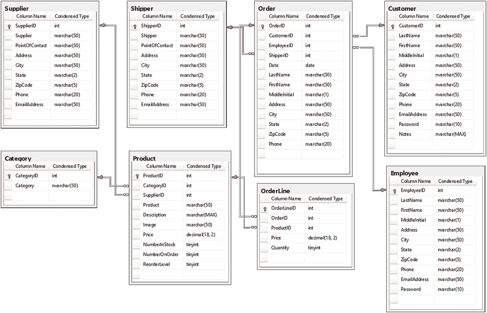

图 20-1

SportsPlay 数据库的数据库模式

## 20.3 表格

数据库表是一个二维数据结构，包含一个或多个*行*(也称为记录、元组)和一个或多个*列*(也称为属性、字段)。一个表格存储了应用中感兴趣的东西的*数据。如图 [20-1](#Fig1) 所示，SportsPlay 数据库中有八个表，每个表代表 SportsPlay，Inc .感兴趣的内容。它们是类别表、客户表、雇员表、订单表、订单行表、产品表、发货人表和供应商表。注意，这些表是用单数名词(或单数名词短语)命名的。以这种方式命名表将成为我们的标准。*

## 20.4 属性

正如刚才提到的，一个数据库表包含一个或多个列。在本书中，我们将列称为*属性*,因为这个术语通常与数据建模相关的语言更加一致。一个属性存储了一个应用中感兴趣的的*特征。如图 [20-1](#Fig1) 所示，供应商表中有九个属性，每个属性代表一个供应商的特性。此外，Product 表中有十个属性，每个属性代表一个产品的特性。注意，这些属性是用单数名词(或单数名词短语)命名的。以这种方式命名属性将成为我们的标准。还要注意，每个表中的第一个属性旁边都有一个钥匙符号。这表明该属性是表的*主键*，我们将在下一节中定义它。最后，注意每个属性都有特定的*类型*和*大小*。图 [20-2](#Fig2) 显示了供应商表中的一些数据。*

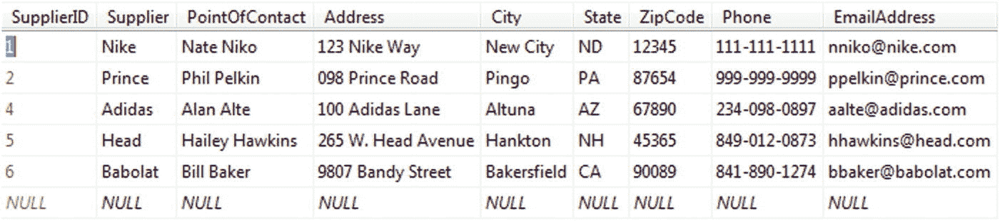

图 20-2

供应商表中的一些数据

图 [20-3](#Fig3) 显示了产品表中的部分数据。

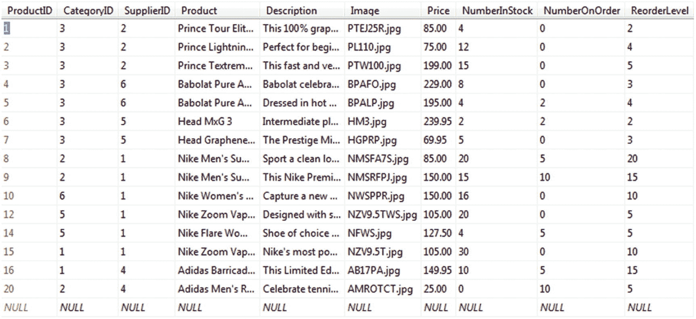

图 20-3

产品表中的一些数据

## 20.5 关系

数据库*关系*是两个数据库表之间的逻辑关联。这种关系通过一个表中的*主键*和另一个表中的*外键*来实现。主键是表中唯一标识表中每一行的属性(或属性组合)。有两条规则与主键值的创建相关联。这些是

1.  主键值必须是唯一的。

2.  主键值不能为空。

这些是*实体完整性*的规则。没有例外。另一方面，外键是表中对应于相关表中主键的属性(或属性组合)。有两条规则与创建外键值相关联。这些是

1.  外键值必须作为主键值存在于相关表中。

2.  外键值必须为空。

这些就是*参照完整性*的规则。没有例外。从图 [20-1](#Fig1) 中可以看出，在 SportsPlay 数据库中有七种关系，每种关系都由一条以钥匙符号或无穷大符号结尾的线表示。钥匙符号代表关系的*一边*，而无限符号代表关系的*多*边*边*。因此，根据图中的数据库模式，在 SportsPlay 数据库的表之间存在以下关系:

*   一个供应商*向*供应一个或多个产品，一个产品*由*恰好一个供应商供应。

*   一个类别*与*一个或多个产品相关联，一个产品*与*恰好一个类别相关联。

*   一个产品*出现在*一个或多个订单行上，一个订单行*包含*正好一个产品。

*   一个订单*包含*一个或多个订单行，一个订单行*恰好出现在*的一个订单上。

*   一个发货人*运送*一个或多个订单，一个订单*由*恰好一个发货人运送。

*   客户*向*下一个或多个订单，订单*由*恰好一个客户下。

*   一个员工*可以接*一个或多个订单，一个订单*只能由*一个员工接。

注意最后一个要点是用 *can* 语言写的。这是因为员工可以为客户*下订单，或者*客户可以在线下订单。在后一个场景中，Order 表中 EmployeeID 属性的值(外键)将被设置为 *null* 。还要注意，关系(以斜体显示，双向阅读)是用动作动词(或动作动词短语)或链接动词(或链接动词短语)描述的。动作动词是表达身体或精神动作的动词，而连接动词是表达存在状态的动词。以这种方式命名关系将成为我们的标准。

通过查看图 [20-2](#Fig2) 中供应商表的数据和图 [20-3](#Fig3) 中产品表的数据，可以看出供应商和产品的关系实际上是如何维护的。请注意，供应商表中的主键属性是 SupplierID。可以看到，这个属性中的值惟一地标识了表中的行，因为它们都是惟一的*和*非空。还要注意，Product 表中关联的外键属性也是 SupplierID。该属性中的值对应于供应商表的 SupplierID 属性中的值。可以看到，Product 表中 SupplierID 属性的所有值都作为主键值存在于 SupplierID 表的 SupplierID 属性中。如果给定的产品由于某种原因没有与供应商相关联，则该产品的 SupplierID 属性中的值将为 null。

## 20.6 结构化查询语言

结构化查询语言(SQL)是*第四代编程语言*，它检索(即查询)和管理(即插入、更新和删除)关系数据库中的数据。第一代、第二代和第三代编程语言是*命令式编程语言*。这些编程语言要求软件开发者编写代码，指导计算机*如何*做某事。因此，循环、条件和其他命令性语句是必需的。另一方面，第四代编程语言是*声明式编程语言*。这些编程语言要求软件开发人员编写代码，指示计算机*做什么*做什么。因此，循环、条件和其他命令性语句*不是*必需的。正如我们将看到的，SQL 不要求我们描述*如何*查询、插入、更新或删除数据库的数据。相反，它只需要我们描述*要查询、插入、更新或删除什么*数据库数据。 [1](#Fn1) 后台为我们生成所需的命令式代码。

到目前为止，SQL 是使用最广泛的关系数据库语言。这种语言是由美国国家标准协会(ANSI)和国际标准化组织(ISO)标准化的，因此大多数 SQL 代码可以从一个 DBMS 移植到另一个 DBMS 通常不需要(或只需要少量)调整语法。结构化查询语言的编程语句被分成四类——*数据定义语言* (DDL)语句(例如，用于创建、更改和删除表、属性和关系的语句)；*数据控制语言* (DCL)语句(例如，用于授予、撤销和拒绝终端用户和应用访问权限的语句)；*数据查询语言* (DQL)语句(例如，用于选择和显示表数据的语句)；以及*数据操作语言* (DML)语句(例如前两类 SQL 语句与*数据库管理*相关，而后两类 SQL 语句与*数据库使用*相关。因此，我们将主要关注最后两类 SQL 语句，因为它们与我们的讨论关系最密切。

在我们看具体的 SQL 语句之前，我们应该说一下在格式化 SQL 语句时我们将应用的标准。首先，虽然没有必要将 SQL 语句的保留字大写，但是我们将*总是*这样做，因为这将增强 SQL 语句的可读性。第二，虽然没有必要在*多行*上写 SQL 语句，但是我们将*总是*这样做，因为这将使 SQL 语句*更容易编写、阅读和维护。随着我们编写的 SQL 语句变得越来越复杂，这些标准变得尤其重要。*

### 选择声明

Select 语句*查询数据库*。更具体地说，它从数据库的一个或多个表中检索一行或多行，然后显示结果。同样，由于 SQL 是一种声明式编程语言，我们不需要指定*如何*检索和显示数据。我们只需要指定*我们想要检索和显示什么*数据。如何从数据库中检索和显示数据是由 DBMS 完成的，它将我们编写的 SQL 查询翻译成一个*查询计划*。这个查询计划然后由 DBMS 的*查询优化器*进行优化，查询优化器为查询确定最佳的*执行计划*。Select 语句有两个*必需的*子句。这些是

*   *Select 子句*–指定应该从查询中返回的属性

*   *From 子句*–指定应该从中检索数据的一个或多个表

这些子句在 Select 语句中的顺序非常重要。如果它们没有按正确的顺序排列，就会出现语法错误。图 [20-4](#Fig4) 显示了选择语句的一个例子。

请注意，在 01 处，该语句的 Select 子句后面有一个星号(∗)。这个星号意味着表中的所有属性(即供应商 ID、供应商、联系点、地址、城市、州、邮政编码、电话和电子邮件地址)都应该显示在 SQL 调用的结果中。

注意 02 处语句的 From 子句后的表名。这表示应该从中检索数据的表的名称(即供应商)。

图中结果部分的屏幕截图显示了查询的结果。

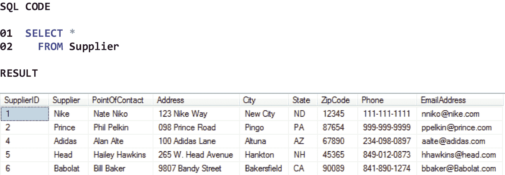

图 20-4

Select 语句的示例

图 [20-5](#Fig5) 显示了显示特定属性的选择语句的例子。

请注意，在 01 处，特定的属性已经列在语句的 Select 子句之后。这意味着*只有*表中的那些属性(即供应商、联系点、电话和电子邮件地址)应该显示在 SQL 调用的结果中。

图中结果部分的屏幕截图显示了查询的结果。

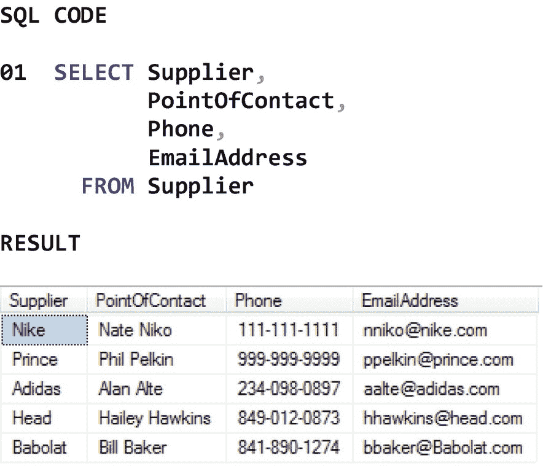

图 20-5

显示特定属性的 Select 语句示例

Select 语句有几个*可选的*子句，我们可以用它们来限定(即微调)我们希望查询返回的结果。这些是

*   *Order By 子句*–指定返回行的顺序(即升序或降序)

*   *Where 子句*–指定应该返回的行的子集

*   *Group By 子句*–指定在应用聚合函数(如 Count、Avg、Sum)时应被视为一个组的行

*   *Having 子句*–指定使用 Group By 子句时应该返回的行的子集

*   *As 子句*–指定引用表或属性时应使用的别名(如缩写名、不同的名称)

同样，这些子句在 Select 语句中的顺序非常重要。如果它们没有按正确的顺序排列，就会出现语法错误。图 [20-6](#Fig6) 显示了一个带有 Order By 子句的 Select 语句的例子。

注意在 01 处，SQL 调用的结果应该按照供应商的升序(默认)排序。

图中结果部分的屏幕截图显示了查询的结果。

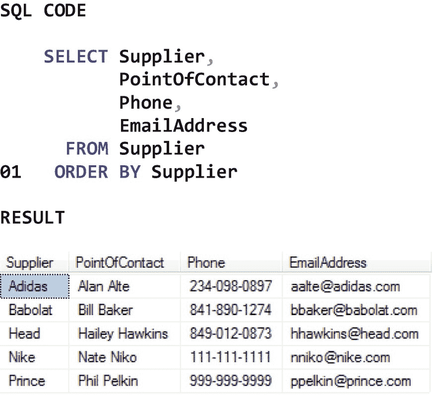

图 20-6

带有 Order By 子句的 Select 语句示例

图 [20-7](#Fig7) 显示了一个带有 Where 子句(相等)的 Select 语句的例子。

请注意 01，只有 SupplierID 等于 6 的产品才应该返回。

图中结果部分的屏幕截图显示了查询的结果。

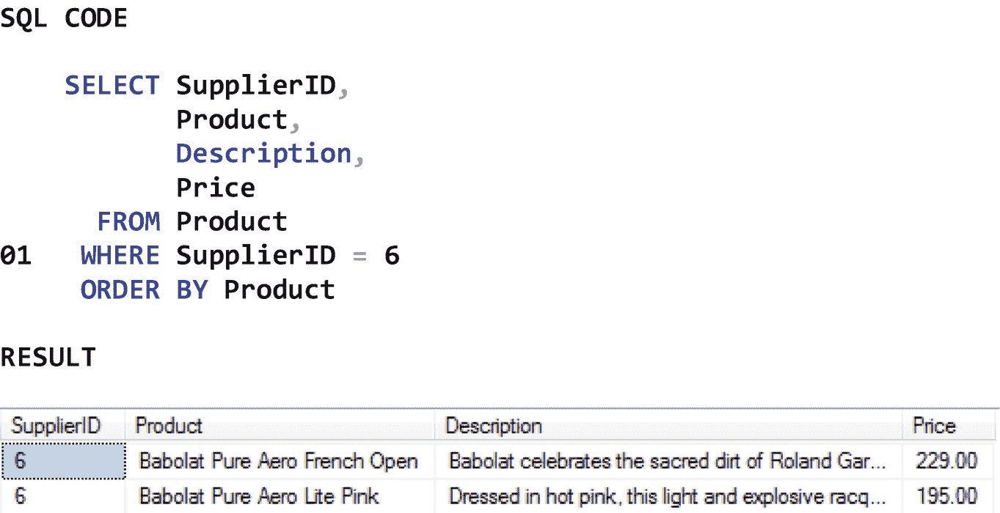

图 20-7

带有 Where 子句的 Select 语句示例(等式)

图 [20-8](#Fig8) 显示了一个带有 Where 子句(关系型)的 Select 语句的例子。

注意在 01 处，只有那些价格小于或等于 100 的产品才应该被返回。

注意在 02 处，SQL 调用的结果应该按照价格降序排列。

图中结果部分的屏幕截图显示了查询的结果。

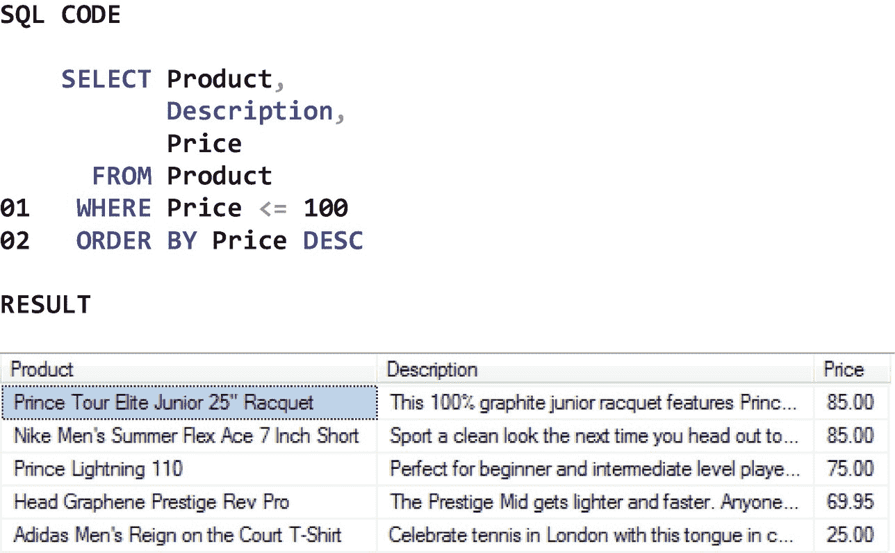

图 20-8

带有 Where 子句的 Select 语句示例(关系型)

图 [20-9](#Fig9) 显示了一个带有 Where 子句(和复合条件)的 Select 语句的例子。

注意在 01 处，只有那些 CategoryID 等于 2 *和*且库存数量小于或等于再订购水平的产品应该被退回。

图中结果部分的屏幕截图显示了查询的结果。

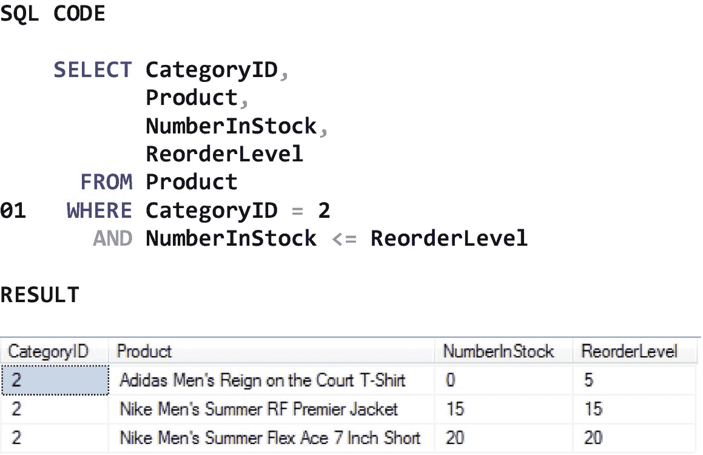

图 20-9

带有 Where 子句(和复合条件)的 Select 语句示例

图 [20-10](#Fig10) 显示了一个带有 Where 子句(或复合条件)的 Select 语句的例子。

请注意，在 01 处，应该只返回那些 CategoryID 等于 2 *或 CategoryID 等于 3 的产品。*

请注意，在 02 处，SQL 调用的结果应该按照升序排序(默认),首先是 CategoryID，然后是 SupplierID(在 CategoryID 内),然后是 Product(在 SupplierID 内)。

图中结果部分的屏幕截图显示了查询的结果。

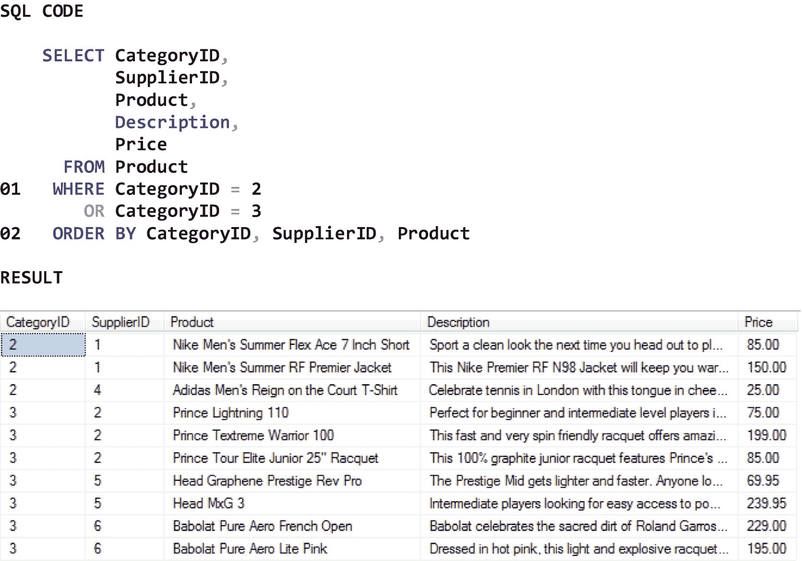

图 20-10

带有 Where 子句(或复合条件)的 Select 语句示例

虽然查询单个数据库表的数据的能力是结构化查询语言的一个强大功能，但查询两个或更多相关表的数据的能力才是该语言的真正优势所在。查询两个或多个相关表的数据是通过一个*连接操作*完成的。尽管有许多类型的联接操作(例如，交叉联接、自然联接、内部联接、外部联接、左联接、右联接)，我们将讨论最基本和最常用的一种，即内部联接。从现在开始，我们将使用术语“连接”来指代内部连接。图 [20-11](#Fig11) 显示了一个两表连接操作的例子。

请注意，在 01 处，我们对 SupplierID 属性进行了限定，方法是对表名(即供应商)进行编码，后跟一个句点(。)后跟属性本身的名称(即 SupplierID)。这是必要的，因为 SupplierID 属性在供应商表和产品表(我们正在连接的两个表)中都能找到。因此，我们必须指定要显示哪个供应商 ID。注意，由于 Select 子句中的其他属性是*而不是*中的*供应商表*和*产品表中的*，我们不需要用表名来限定它们。

请注意 02 处的 From 子句表示我们正在连接的两个表——供应商表和产品表。

请注意，在 03，我们已经将供应商表的 SupplierID 设置为等于产品表的 SupplierID。正是这个条件将两个表连接在一起。Where 子句的这一部分告诉 DBMS，只要供应商表中的供应商 ID 与产品表中的供应商 ID 匹配，就返回一行数据。可以看到，Where 子句中还有其他限定符。这些限定符确保只显示供应商 ID 为 2、5 或 6 的产品。

图中结果部分的屏幕截图显示了查询的结果。

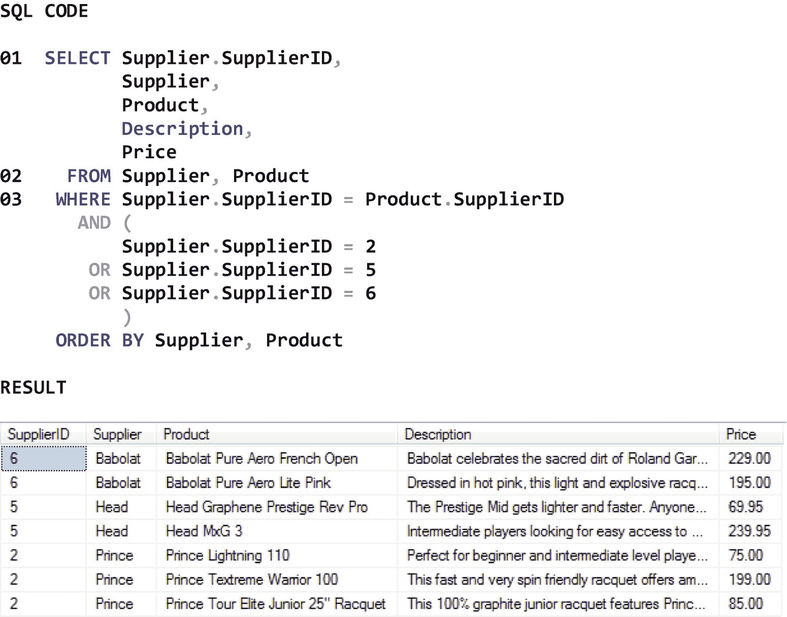

图 20-11

两表连接操作的示例

图 [20-12](#Fig12) 显示了一个六表连接操作的例子。

请注意，在 01 处，我们已经将单词 *Order* 括在方括号([ ])中。这样做是因为 Order 是与 Order By 子句相关联的 SQL 保留字。通过给 Order 加上方括号，我们向 DBMS 表明 Order 是表的名称，而不是 Order By 子句的一部分。还要注意，我们已经指定了应该从中检索 OrderID 的表。这是必要的，因为该属性出现在两个被连接的表中——Order 和 OrderLine。同样，我们已经指定了应该从中检索姓氏和名字的表。这是必要的，因为这些属性出现在被连接的三个表中——Customer、Employee 和 Order。此外，请注意，我们将每个客户的姓氏与逗号、空格和名字连接起来，然后将其显示为名为 CustomerName 的单个属性。EmployeeName 属性的构造方式相同。

注意，在 02 处，From 子句表示我们正在连接的六个表——客户表、雇员表、订单表、订单行表、产品表和发货人表。

请注意，在 03，我们将订单表的 CustomerID 设置为等于客户表的 CustomerID，将订单表的 EmployeeID 设置为等于雇员表的 EmployeeID，将订单表的 ShipperID 设置为等于发货人表的 ShipperID，依此类推。正是这些条件将六个表连接在一起。Where 子句的这一部分告诉 DBMS，只要 Order 表中的 CustomerID 与 Customer 表中的 CustomerID 匹配，Order 表中的 EmployeeID 与 Employee 表中的 EmployeeID 匹配，Order 表中的 ShipperID 与 Shipper 表中的 ShipperID 匹配，等等，就返回一行数据。可以看到，应该返回的唯一订单是 OrderID 2。

图中结果部分的屏幕截图显示了查询的结果。

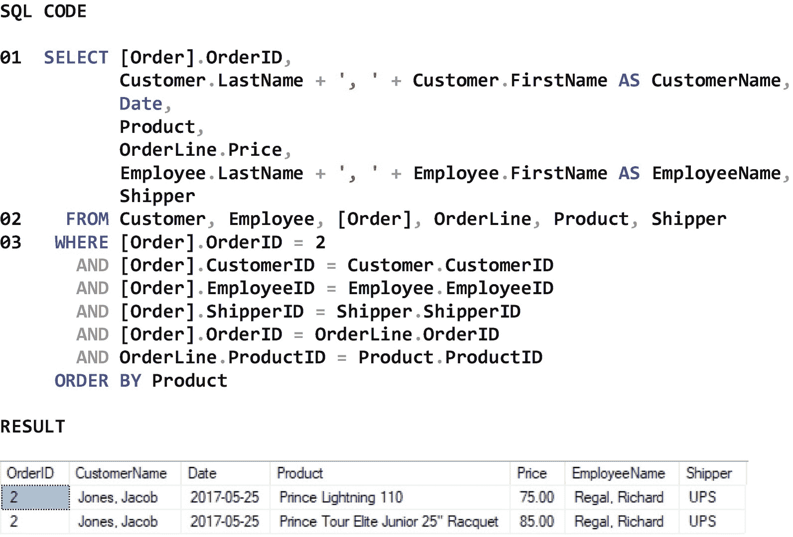

图 20-12

六表连接操作的示例

### 插入声明

Insert 语句向数据库表中添加一行或多行。插入行时，要插入表中的值必须满足所有适用的表约束(即实体完整性约束、参照完整性约束和 not null 约束)。否则，DBMS 不会将该行插入表中，并将返回一条错误消息。图 [20-13](#Fig13) 显示了插入语句的一个例子。

请注意 01，我们将在产品表中插入一行数据。可以看到，我们已经阐明了将插入到表中的所有属性——除了 ProductID，它是表的主键。我们不会插入主键值，因为当我们创建表时，我们指示 DBMS 为新插入的行自动生成主键值(即自动递增的整数)。请记住，我们只需要列出希望添加到插入行中的属性。对于我们没有列出的任何属性值，DBMS 将自动插入我们在创建表时指定的默认值。然而，我们的标准是在 Insert 语句中列出所有属性的*——除了任何自动生成的主键。*

请注意，在 02 处，values 子句中的属性值列表和序列直接对应于 01 处的属性名称列表和序列。如果这些不完全匹配，Insert 语句将不会按预期工作。值得注意的是，当 Insert 语句是应用的一部分时，我们几乎从不像图中那样对属性值进行硬编码。相反，我们通常在 Insert 语句的 Values 子句中编写变量，然后在执行 Insert 语句之前，以编程方式用值实例化这些变量。

图中结果部分的屏幕截图显示了插入的结果。请注意，新插入的行出现在表格的最底部。还要注意自动生成的 ProductID 值。

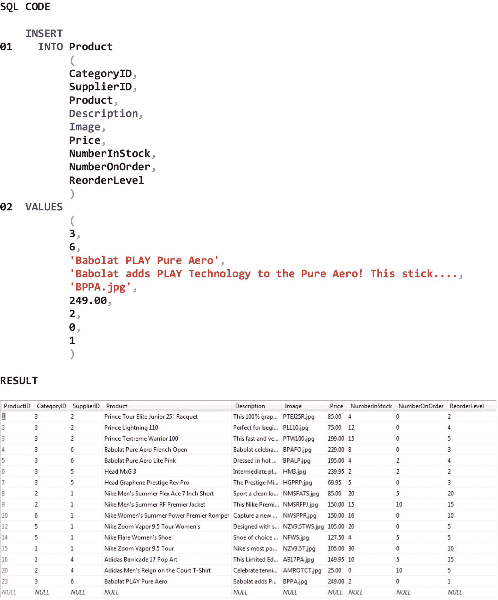

图 20-13

Insert 语句的示例

### 更新声明

Update 语句修改数据库表中的一行或多行。更新行时，表中要更新的值必须满足所有适用的表约束(即实体完整性约束、参照完整性约束和 not null 约束)。否则，DBMS 不会更新表中的行，并将返回一条错误消息。当更新表中的特定行时，我们必须非常小心地包含一个 Where 子句，该子句标识要更新的行的主键值。如果我们在 Where 子句中包含一个不存在的主键值，则不会更新任何行。如果我们在 Where 子句中包含不正确的主键值，将会更新错误的行。如果我们完全忽略了 Where 子句，那么表中的所有行都将被更新。图 [20-14](#Fig14) 显示了一个更新语句的例子。

请注意，在 01，我们将更新产品表。

请注意，在 02，我们将更新 Price 和 NumberInStock 属性值。值得注意的是，当 Update 语句是应用的一部分时，我们几乎从不像图中那样对属性值进行硬编码。相反，我们通常在 Update 语句的 Set 子句中编写变量，然后在执行 Update 语句之前以编程方式用值实例化这些变量。

请注意，在 03，我们将更新主键为 23 的行。

图中结果部分的屏幕截图显示了更新的结果。请注意，新更新的行出现在表的最底部。还要注意新的 Price 和 NumberInStock 值。

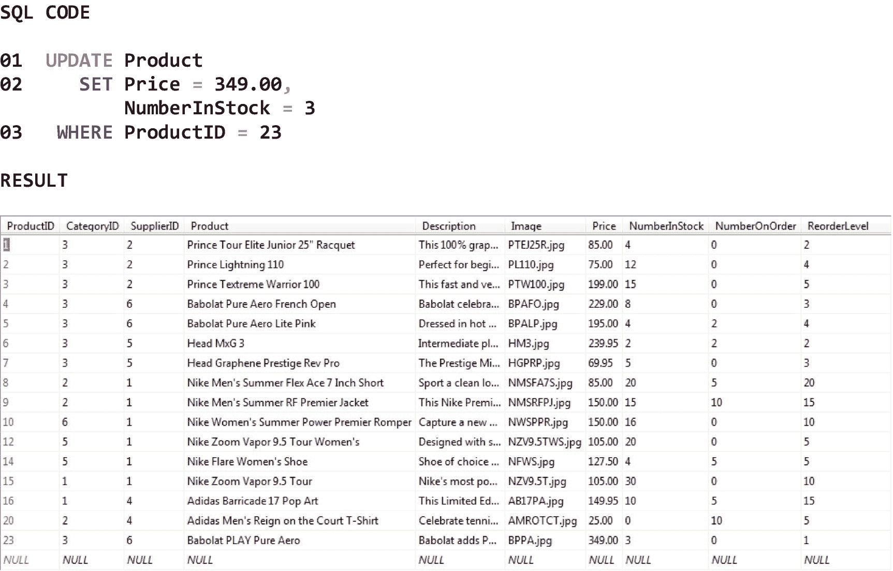

图 20-14

更新语句的示例

### 删除声明

Delete 语句从数据库表中删除一行或多行。删除行时，必须满足所有参照完整性约束。否则，DBMS 不会从表中删除该行，并将返回一条错误消息。当从表中删除一个特定的行时，我们必须非常小心地包含一个 Where 子句，该子句标识要删除的行的主键值。如果我们在 Where 子句中包含一个不存在的主键值，则不会删除任何行。如果我们在 Where 子句中包含不正确的主键值，将会删除错误的行。如果我们完全忽略了 Where 子句，那么表中的所有行都将被删除。图 [20-15](#Fig15) 显示了一个删除语句的例子。

请注意 01，我们将从 Product 表中删除一行。

请注意，在 02，我们将删除主键为 23 的行。

图中结果部分的屏幕截图显示了删除的结果。请注意，主键为 23 的行已从表中删除。

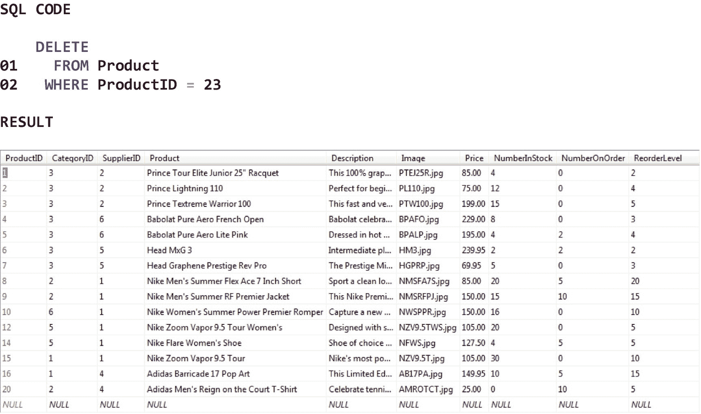

图 20-15

Delete 语句的示例

## 20.7 DataBoundControl 类

DataBoundControl 类充当所有以表格或列表形式显示数据的数据绑定类的基类。因此，所有数据绑定类都从该类继承属性、方法和事件。数据绑定类包括 AdRotator 类、BulletedList 类、CheckBoxList 类、DetailsView 类、DropDownList 类、FormView 类、GridView 类、ListBox 类、ListView 类、Menu 类、RadioButtonList 类、Repeater 类和 TreeView 类。我们已经看到了其中的一些类(例如，DropDownList 类、ListBox 类、Menu 类、TreeView 类)，我们将在后面的章节中看到其他类(例如，FormView 类、ListView 类)。表 [20-1](#Tab1) 显示了 DataBoundControl 类的一些属性、方法和事件。

表 20-1

DataBoundControl 类的一些属性、方法和事件

<colgroup><col class="tcol1 align-left"> <col class="tcol2 align-left"></colgroup> 
| **类**数据边界控制T3】2T5】 |
| **命名空间**系统。网页控件 |
| **属性** |
| 数据源 | 获取或设置控件的 ID，数据绑定控件从该控件中检索其数据项列表。 |
| **方法** |
| (参见参考文献。) |   |
| **事件** |
| (参见参考文献。) |   |
| **参考** |
| [T2`https://msdn.microsoft.com/en-us/library/system.web.ui.webcontrols.databoundcontrol(v=vs.110).aspx`](https://msdn.microsoft.com/en-us/library/system.web.ui.webcontrols.databoundcontrol%2528v%253Dvs.110%2529.aspx) |

## 20.8 SqlDataSource 类

SqlDataSource 类访问应用的基础 SQL Server 数据库。SqlDataSource 控件可以与数据绑定控件结合使用，以便从 SQL Server 数据库中检索数据、向其中插入数据、在其中更新数据以及从其中删除数据。上一节列出了可与 SqlDataSource 控件一起使用来执行此类操作的数据绑定控件。

表 [20-2](#Tab2) 显示了 SqlDataSource 类的一些属性、方法和事件。SqlDataSource 类的 ConnectionString 属性指示与基础 SQL Server 数据库关联的连接字符串。SelectCommand 属性表示用于*从 SQL Server 数据库中检索*数据的 SQL 调用，SelectParameters 属性包含 SelectCommand 属性中定义的 SQL 调用使用的参数集合。InsertCommand 属性指示用于*将*数据插入到 SQL Server 表中的 SQL 调用，InsertParameters 属性包含在 InsertCommand 属性中定义的 SQL 调用所使用的参数集合。在插入操作发生之前*调用插入方法，而在*插入操作发生之后*调用插入方法。UpdateCommand 属性指示用于在 SQL Server 表中*更新*数据的 SQL 调用，UpdateParameters 属性包含 UpdateCommand 属性中定义的 SQL 调用所使用的参数集合。更新方法在更新操作发生之前*被调用，而更新方法在更新操作发生之后被调用。DeleteCommand 属性指示用于从 SQL Server 表中*删除*数据的 SQL 调用，DeleteParameters 属性包含由 DeleteCommand 属性中定义的 SQL 调用使用的参数集合。在删除操作发生之前*调用删除方法，而在*删除操作发生之后*调用删除方法。*

请记住，SelectCommand、InsertCommand、UpdateCommand 和 DeleteCommand 属性的值可以是字符串形式的 SQL 调用，也可以是存储过程的名称。此外，SelectParameters、InsertParameters、UpdateParameters 和 DeleteParameters 属性集合可以包含*控制参数*(绑定到服务器控制属性) *cookie 参数*(绑定到 cookie)*表单参数*(绑定到表单字段)*配置文件参数*(绑定到配置文件字段)*查询字符串参数*(绑定到查询字符串参数)*路由参数*(绑定到路由 URL 参数)*会话参数*正如我们将很快看到的，这些类型的参数在*参数化查询*中使用。

表 20-2

SqlDataSource 类的一些属性、方法和事件

<colgroup><col class="tcol1 align-left"> <col class="tcol2 align-left"></colgroup> 
| **类**sqldata sourceT3】3T5】 |
| **命名空间**系统。网页控件 |
| **属性** |
| 连接字符串 | 获取或设置特定于 ADO.NET 提供程序的连接字符串，SqlDataSource 控件使用该连接字符串连接到基础数据库。 |
| 删除 | 获取或设置 SqlDataSource 控件用来从基础数据库中删除数据的 SQL 字符串。 |
| 删除参数 | 从与 SqlDataSource 控件关联的 SqlDataSourceView 对象中获取 parameters 集合，该集合包含 DeleteCommand 属性使用的参数。 |
| 插入命令 | 获取或设置 SqlDataSource 控件用来将数据插入基础数据库的 SQL 字符串。 |
| 插入参数 | 从与 SqlDataSource 控件关联的 SqlDataSourceView 对象中获取 parameters 集合，该集合包含 InsertCommand 属性使用的参数。 |
| OldValuesParameterFormatString | 获取或设置应用于传递给 Delete 或 Update 方法的任何参数名称的格式字符串。 |
| 命令 | 获取或设置 SqlDataSource 控件用来从基础数据库中检索数据的 SQL 字符串。 |
| 选择参数 | 从与 SqlDataSource 控件关联的 SqlDataSourceView 对象中获取 parameters 集合，该集合包含 SelectCommand 属性使用的参数。 |
| 更新命令 | 获取或设置 SqlDataSource 控件用来更新基础数据库中的数据的 SQL 字符串。 |
| 更新参数 | 从与 SqlDataSource 控件关联的 SqlDataSourceView 控件中获取 parameters 集合，该集合包含 UpdateCommand 属性使用的参数。 |
| **方法** |
| DataBind() | 将数据源绑定到调用的服务器控件及其所有子控件。(继承自 Control。) |
| **事件** |
| 删除 | 当删除操作完成时发生。 |
| 删除 | 在删除操作之前发生。 |
| 插入的 | 当插入操作完成时发生。 |
| 插入 | 在插入操作之前发生。 |
| 更新 | 更新操作完成时发生。 |
| 更新 | 在更新操作之前发生。 |
| **参考** |
| [T2`https://msdn.microsoft.com/en-us/library/system.web.ui.webcontrols.sqldatasource(v=vs.110).aspx`](https://msdn.microsoft.com/en-us/library/system.web.ui.webcontrols.sqldatasource%2528v%253Dvs.110%2529.aspx) |

### 连接字符串

连接字符串为应用提供其基础 SQL Server 数据库的详细信息。图 [20-16](#Fig16) 显示了与 SportsPlay 数据库相关的连接字符串。可以看到，这个连接字符串是在应用的 Web.config 文件的< connectionStrings >部分中定义的。请注意，SQL Server 所在的计算机名称是 *MATRBeasley-18* ，SQL Server 实例的名称是T5 4T7 是 *SQLEXPRESS* ，初始目录(即数据库)的名称是 *SportsPlay* ，集成安全性的类型是 *SSPI* (安全支持提供者接口)。SSPI(集成安全性的首选类型)允许我们的应用(作为 Windows server 用户)连接到数据库，而无需提供额外的 SQL Server 用户名和密码凭据。我们将连接字符串放在 Web.config 文件中，这样它可以在应用的*一个*位置被修改，也可以在*多个*位置被*引用。因此，如果我们需要在不同的计算机上安装数据库，将数据库添加到不同的 SQL Server 实例，和/或更改数据库的名称，我们只需更改 Web.config 文件中的连接字符串。整个应用中对连接字符串的引用不需要修改。*

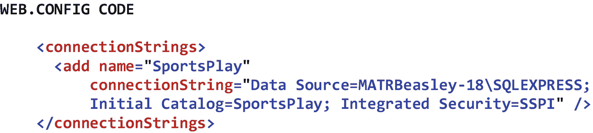

图 20-16

与 SportsPlay 数据库关联的连接字符串

在接下来的部分中，我们将使用一个 ListBox 数据绑定控件来演示 SqlDataSource 类及其 SelectCommand 属性的用法。在标题为“单行数据库表维护”的第 [21](21.html) 章和标题为“多行数据库表维护”的第 [22](22.html) 章中，我们也将使用 SqlDataSource 类的 InsertCommand、UpdateCommand 和 DeleteCommand 属性。

### 数据绑定控制人群

我们经常需要用 SQL Server 数据库中的数据填充数据绑定控件。例如，我们可能需要为最终用户提供一个选择产品的列表框。图 [20-17](#Fig17) 显示了一个用 SqlDataSource 控件填充 ListBox 控件的例子。在本例中，我们将用产品表中的所有产品的*填充列表框。将不进行任何行筛选。*

请注意 01 处的 SqlDataSource 控件。该数据源将用于填充 02 处的列表框。可以看出，SqlDataSource 控件的 ConnectionString 属性被设置为*<% $ connection strings:SportsPlay %>*以指示与应用的底层 SQL Server 数据库相关联的连接字符串(即，sports play)。请注意，在控件的 SelectCommand 属性中，我们将从 Product 表中返回 ProductID 和产品，并且结果将按产品升序排序。这样，最终用户将能够很容易地在列表框中找到产品。

注意 02 处的 ListBox 控件用于显示产品表中的产品。注意，此控件的 DataSourceID 被设置为 SqlDataSource 控件的 ID 01，以标识与列表框关联的数据源。还要注意，DataTextField 属性被设置为 *Product* ，以指示产品属性将显示在列表框中。还要注意，DataValueField 属性被设置为 *ProductID* ，以指示当最终用户选择一个产品时，ProductID 属性(即产品表的主键)将被放置在列表框的 SelectedValue 属性中。

请注意，在 03，我们在 Web.config 文件中添加了一个<connectionstrings>部分，以及一个名为 *SportsPlay* 的连接字符串。</connectionstrings>

图中结果部分的屏幕截图显示了用产品表中所有产品的*填充的列表框。*

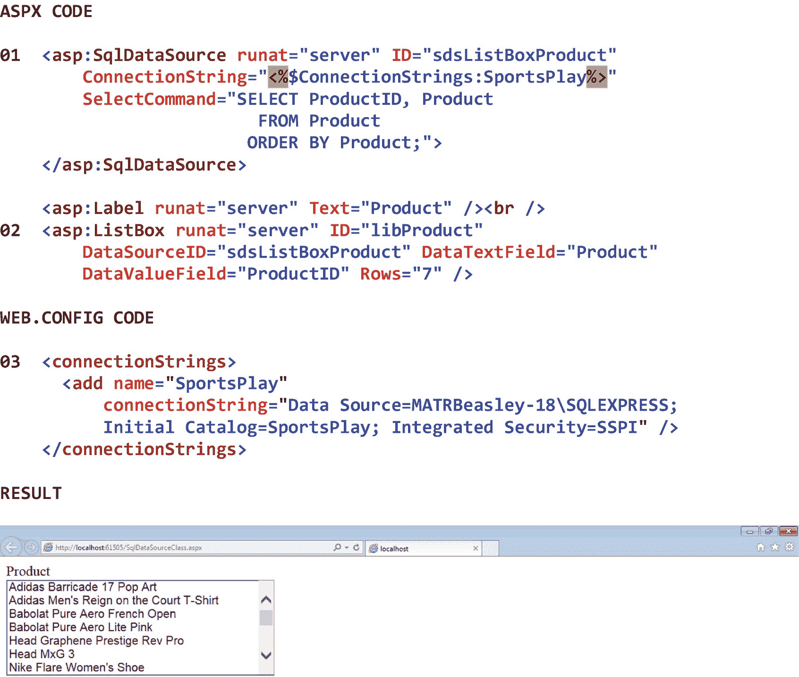

图 20-17

用 SqlDataSource 控件填充 ListBox 控件的示例

### 20.8.3 数据绑定控件过滤

有时，用数据库中的数据填充数据绑定控件(就像我们在上一节中所做的那样)会返回太多的数据行，以至于页面加载时间过长，或者控件包含太多的项，以至于最终用户使用起来效率低下(例如，从包含一万种产品的 ListBox 控件中选择一种产品)。在这种情况下，我们需要一种方法来限制从数据库返回的数据行数。为此，我们需要对数据库调用应用一个或多个*过滤器*。过滤是通过向数据库调用的 Select 语句添加 Where 子句来完成的，该语句包含一个或多个限制返回数据行数的参数。在接下来的部分中，我们将讨论两种更常见的用于过滤数据绑定控件数据的参数类型— *控制参数*和*会话参数*。

#### 带控制参数的 20.8.3.1 滤波

过滤从数据库返回的行的一种方法是使用一个或多个控制参数。控件参数与 ASP.NET 服务器控件相关联。这样的控件可以包含一个*自然产生的子集标准*(例如，一个产品类别)，或者它可以包含一个*定制的子集标准*(例如，一个终端用户提供的字符串)。图 [20-18](#Fig18) 显示了一个用 DropDownList 控件过滤 ListBox 控件的例子。正如我们在本章前面所学的，一个类别*与*一个或多个产品相关联，而一个产品*与*恰好一个类别相关联。由于类别是 SportsPlay 数据库中产品的自然子集标准，因此我们仅使用与从下拉列表中选择的类别相关的产品填充列表框。

请注意 01 处的 SqlDataSource 控件，该控件用于下拉列表*类别*。此数据源将用于在 05 填充类别下拉列表。请注意，在控件的 SelectCommand 属性中，我们将从 Category 表中返回 CategoryID 和 Category，并且结果将按类别升序排序。这种排序顺序将允许最终用户在下拉列表中轻松定位类别。

注意 02 处的*产品*列表框的 SqlDataSource 控件。该数据源将用于在 06 填充产品列表框。请注意，在控件的 SelectCommand 属性中，我们将从 Product 表中返回 ProductID 和产品，并且结果将按产品升序排序。这样的排序顺序将允许最终用户容易地在列表框中定位产品。还要注意，我们在 Select 语句中包含了一个 Where 子句。该 Where 子句将用于将从 Product 表返回的产品限制为 CategoryID 等于@CategoryID 的产品。这里，@CategoryID 是在*选择参数*集合中定义的*控制参数*。

注意 03 处的数据源的<selectparameters>标签，它标识了数据源的选择参数集合的开始。该集合包含 Select 命令所需的任何参数。在这种情况下，Select 命令需要@CategoryID 参数。</selectparameters>

请注意，在 04 处，我们向 select parameters 集合添加了一个控制参数。关于这个控制参数，首先要注意的是它的 Name 属性被设置为 *CategoryID* 。这将控制参数与 02 处 Select 命令的 Where 子句中的@CategoryID 参数相关联。接下来要注意的是，ControlID 属性被设置为*DDL category*(05 时类别下拉列表的 ID)，PropertyName 属性被设置为 *SelectedValue* 。这表明 Where 子句的@CategoryID 参数来自类别 DropDownList 控件的 SelectedValue 属性。还要注意，Direction 属性设置为 *Input* 表示这是一个输入参数，Type 属性设置为 *Int32* 表示控制参数的数据类型是 32 位整数。

注意 06 处的 ListBox 控件用于显示产品表中的产品。注意，此控件的 DataSourceID 设置为 SqlDataSource 控件的 ID 02，以标识与列表框关联的数据源。还要注意，DataTextField 属性被设置为 *Product* ，以指示产品属性将显示在列表框中。还要注意，DataValueField 属性被设置为 *ProductID* ，以指示当最终用户选择一个产品时，ProductID 属性(即产品表的主键)将被放置在列表框的 SelectedValue 属性中。

请注意，在 07，我们在 Web.config 文件中添加了一个<connectionstrings>部分，以及一个名为 *SportsPlay* 的连接字符串。</connectionstrings>

图中结果部分的第一个屏幕截图显示了只填充了与女鞋相关的产品的列表框。第二个屏幕截图显示了列表框，其中只填充了与球拍相关的产品。

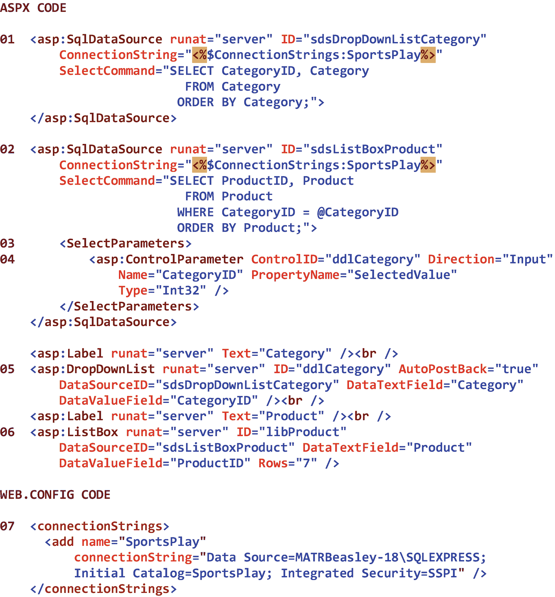 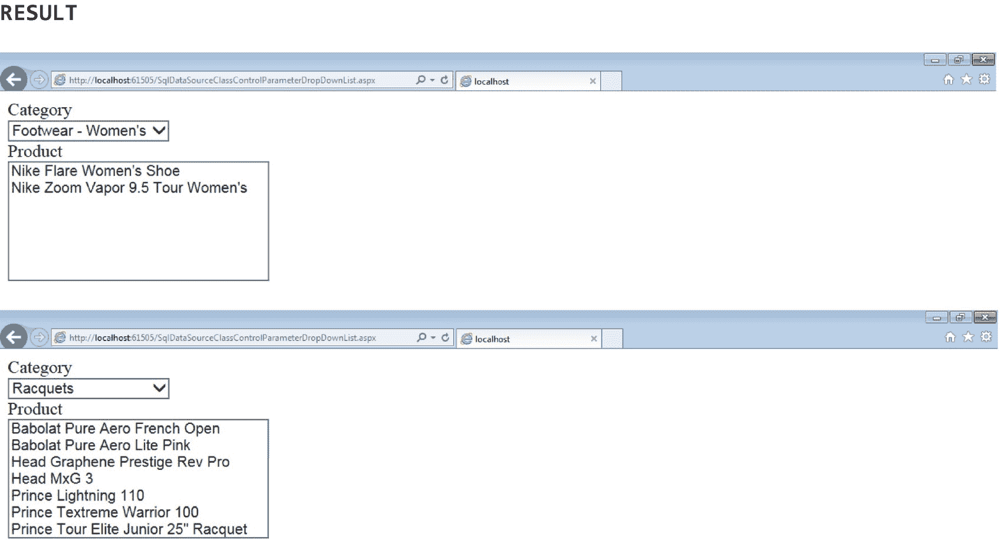

图 20-18

使用 DropDownList 控件筛选 ListBox 控件的示例

图 20-19 显示了一个用文本框控件过滤列表框控件的例子。在本例中，我们只在列表框中填充那些包含在相关文本框中输入的字符串的产品。

请注意 01 处的产品列表框的 SqlDataSource 控件。该数据源将用于在 06 填充产品列表框。请注意，在控件的 SelectCommand 属性中，我们将从 Product 表中返回 ProductID 和产品，并且结果将按产品升序排序。这样的排序顺序将允许最终用户容易地在列表框中定位产品。还要注意，我们在 Select 语句中包含了一个 Where 子句。这个 Where 子句将用于将从 Product 表返回的产品限制为在 Product 属性中任何地方包含@Product *anywhere* 的产品。这是通过在 Where 子句中包含关键字 LIKE 并在@Product 参数的两侧*使用百分号(%)来实现的，百分号(%)是 SQL 中的通配符。这里，@Product 是在*选择参数*集合中定义的 c *控制参数*。*

注意 02 处的数据源的<selectparameters>标签，它标识了数据源的选择参数集合的开始。该集合包含 Select 命令所需的任何参数。在这种情况下，Select 命令需要@Product 参数。</selectparameters>

请注意，在 03 处，我们向 select parameters 集合添加了一个控制参数。关于这个控制参数，首先要注意的是它的 Name 属性被设置为 *Product* 。这将控制参数与 01 处 Select 命令的 Where 子句中的@Product 参数相关联。接下来要注意的是，ControlID 属性被设置为 *txtProduct* (这是 04 处产品文本框的 ID)，PropertyName 属性被设置为 *Text* 。这表明 Where 子句的@Product 参数来自 product TextBox 控件的 Text 属性。还要注意，Direction 属性被设置为 *Input* 以指示这是一个输入参数，Type 属性被设置为 *String* 以指示控制参数的数据类型是一个字符串。

请注意 05 处用于过滤产品列表框中显示的项目的按钮控件。单击此按钮时，页面将回发到服务器，在服务器上，过滤器将应用于从数据库返回的产品列表。

注意 06 处的 ListBox 控件用于显示产品表中的产品。注意，此控件的 DataSourceID 被设置为 SqlDataSource 控件的 ID 01，以标识与列表框关联的数据源。还要注意，DataTextField 属性被设置为 *Product* ，以指示产品属性将显示在列表框中。还要注意，DataValueField 属性被设置为 *ProductID* ，以指示当最终用户选择一个产品时，ProductID 属性(即产品表的主键)将被放置在列表框的 SelectedValue 属性中。

请注意，在 07，我们在 Web.config 文件中添加了一个<connectionstrings>部分，以及一个名为 *SportsPlay* 的连接字符串。</connectionstrings>

图中结果部分的第一个屏幕截图显示了列表框，其中只填充了那些在产品中包含单词 *women* 的产品。第二个屏幕截图显示了列表框，其中只填充了那些在产品中某处包含字符 *prin* 的产品。

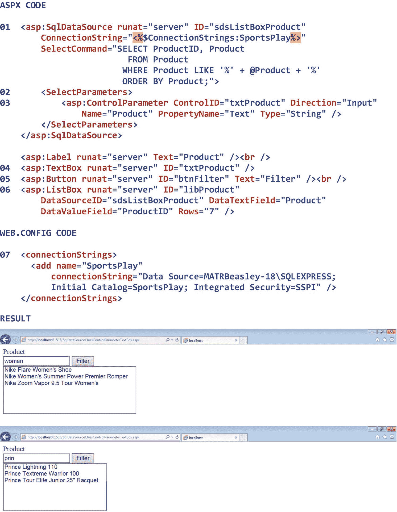

图 20-19

用文本框控件筛选列表框控件的示例

#### 具有会话参数的 20.8.3.2 滤波

过滤从数据库返回的行的另一种方法是使用一个或多个会话参数。会话参数与已经设置的会话变量相关联(可能在应用的前一页)，因此驻留在服务器的 RAM 中。这样的变量可以包含一个*自然产生的子集标准*(例如，一个产品类别)，或者它可以包含一个*定制的子集标准*(例如，最终用户提供的字符串)。图 [20-20](#Fig20) 显示了一个用会话变量过滤列表框控件的例子。正如我们在本章前面所学的，一个类别*与*一个或多个产品相关联，而一个产品*与*恰好一个类别相关联。由于类别是 SportsPlay 数据库中产品的自然子集标准，因此我们只使用与从下拉列表中选择的类别相关的产品填充列表框，该下拉列表位于应用的前一页上*。*

请注意 01 处的产品列表框的 SqlDataSource 控件。该数据源将用于在 04 填充产品列表框。请注意，在控件的 SelectCommand 属性中，我们将从 Product 表中返回 ProductID 和产品，并且结果将按产品升序排序。这样的排序顺序将允许最终用户容易地在列表框中定位产品。还要注意，我们在 Select 语句中包含了一个 Where 子句。该 Where 子句将用于将从 Product 表返回的产品限制为 CategoryID 等于@CategoryID 的产品。这里，@CategoryID 是在*选择参数*集合中定义的*会话参数*。

注意 02 处的数据源的<selectparameters>标签，它标识了数据源的选择参数集合的开始。该集合包含 Select 命令所需的任何参数。在这种情况下，Select 命令需要@CategoryID 参数。</selectparameters>

请注意，在 03，我们已经向 select parameters 集合添加了一个会话参数。关于这个会话参数，首先要注意的是它的 Name 属性被设置为 *CategoryID* 。这将会话参数与 01 处 Select 命令的 Where 子句中的@CategoryID 参数相关联。接下来要注意的是，SessionField 属性被设置为 *intCategoryID* 。这是一个会话变量，包含从应用上一页的下拉列表中选择的类别的 ID。还要注意，会话参数的 Direction 属性被设置为 *Input* 以指示这是一个输入参数，会话参数的 Type 属性被设置为 *Int32* 以指示会话参数的数据类型是 32 位整数。

注意 04 处的 ListBox 控件用于显示产品表中的产品。注意，此控件的 DataSourceID 被设置为 SqlDataSource 控件的 ID 01，以标识与列表框关联的数据源。还要注意，DataTextField 属性被设置为 *Product* ，以指示产品属性将显示在列表框中。还要注意，DataValueField 属性被设置为 *ProductID* ，以指示当最终用户选择一个产品时，ProductID 属性(即产品表的主键)将被放置在列表框的 SelectedValue 属性中。

请注意，在 05，我们在 Web.config 文件中添加了一个<connectionstrings>部分，以及一个名为 *SportsPlay* 的连接字符串。</connectionstrings>

图中结果部分的第一个屏幕截图显示了列表框，其中只填充了与球拍相关的产品。第二个屏幕截图显示了只填充了与男装相关的产品的列表框。在这两种情况下，都假定类别是从应用上一页的下拉列表中选择的，并且与选择相关联的 CategoryID 保存在会话变量中。

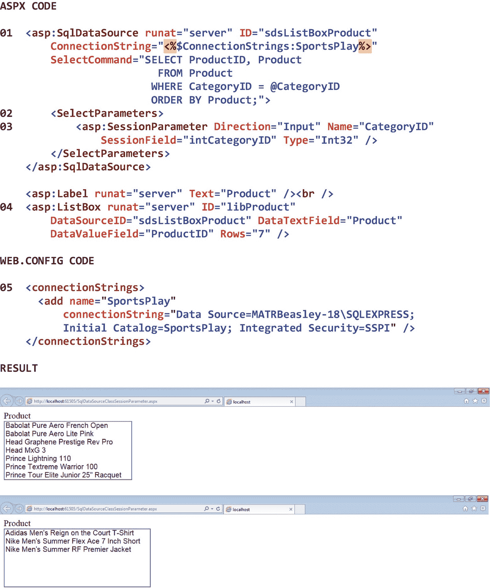

图 20-20

使用会话变量过滤列表框控件的示例

<aside aria-label="Footnotes" class="FootnoteSection" epub:type="footnotes">Footnotes [1](#Fn1_source)

SQL 确实包含一些过程语句。

  [2](#Fn2_source)

所有属性、方法和事件描述都直接取自微软的官方文档。为了节省空间，省略了用于处理该类事件的事件处理程序方法。有关该类的所有方法，请参见参考。

  [3](#Fn3_source)

所有属性、方法和事件描述都直接取自微软的官方文档。为了节省空间，省略了用于处理该类事件的事件处理程序方法。有关该类的所有方法，请参见参考。

  [4](#Fn4_source)

SQL Server 实例是一个完整的 SQL Server *服务*，它有自己的数据库、凭证等等。一台计算机可以同时安装并运行多个 SQL Server 实例。

 </aside>