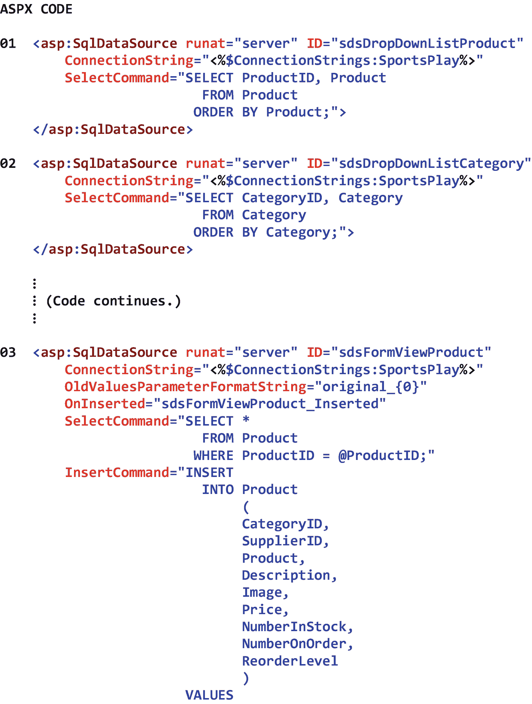
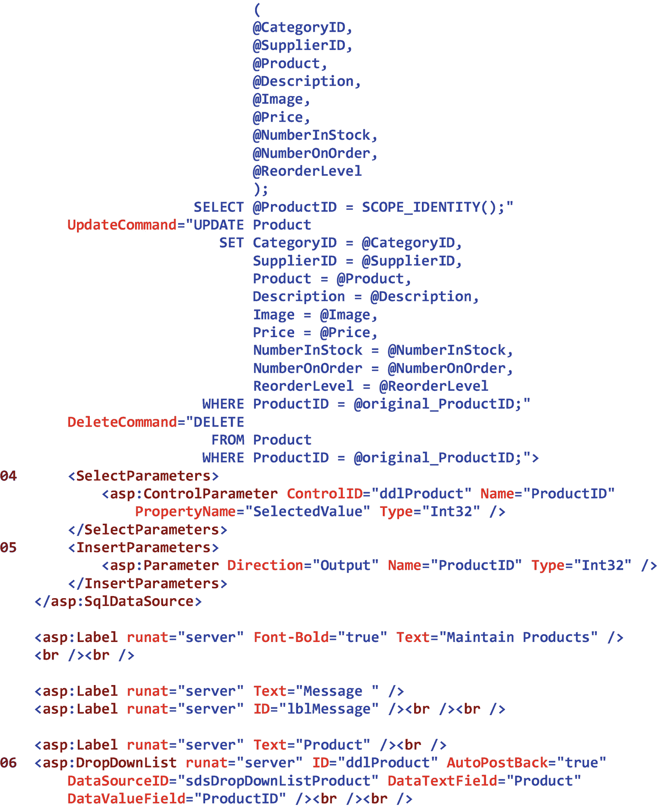
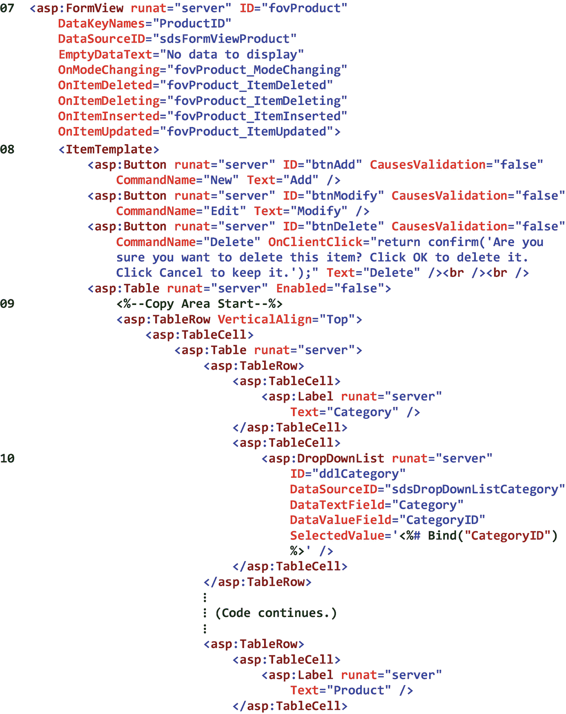
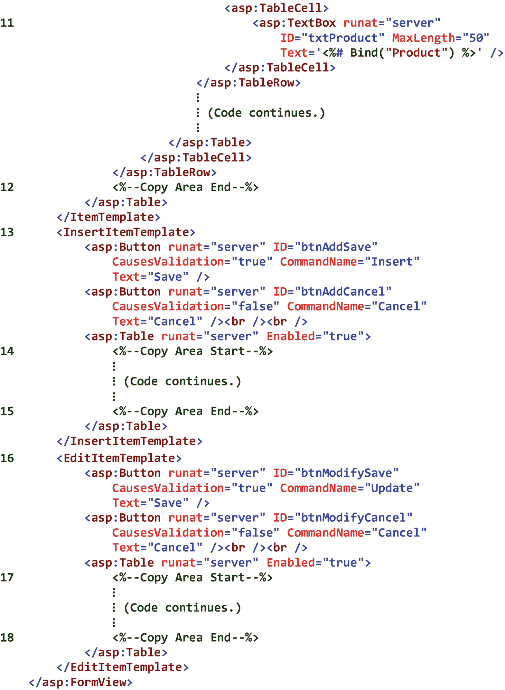
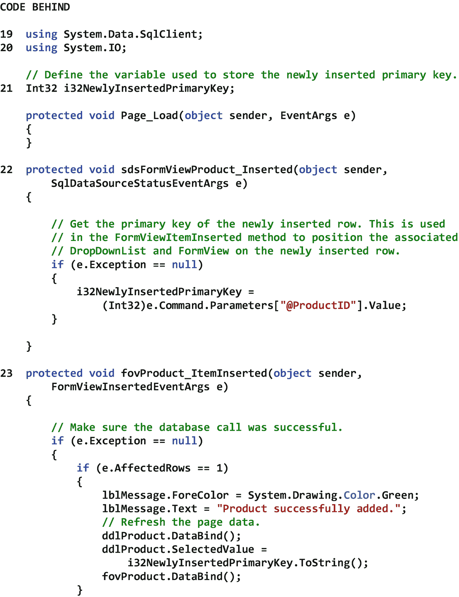
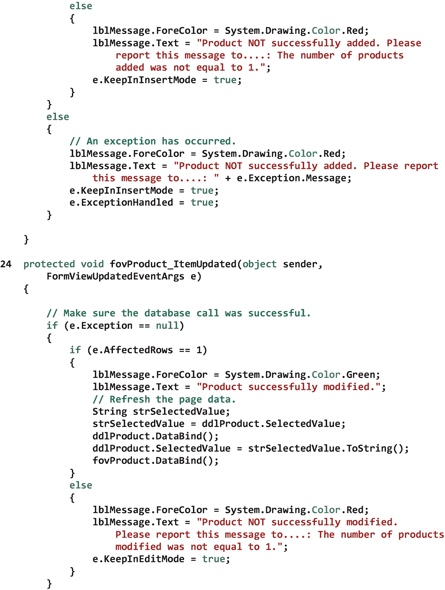
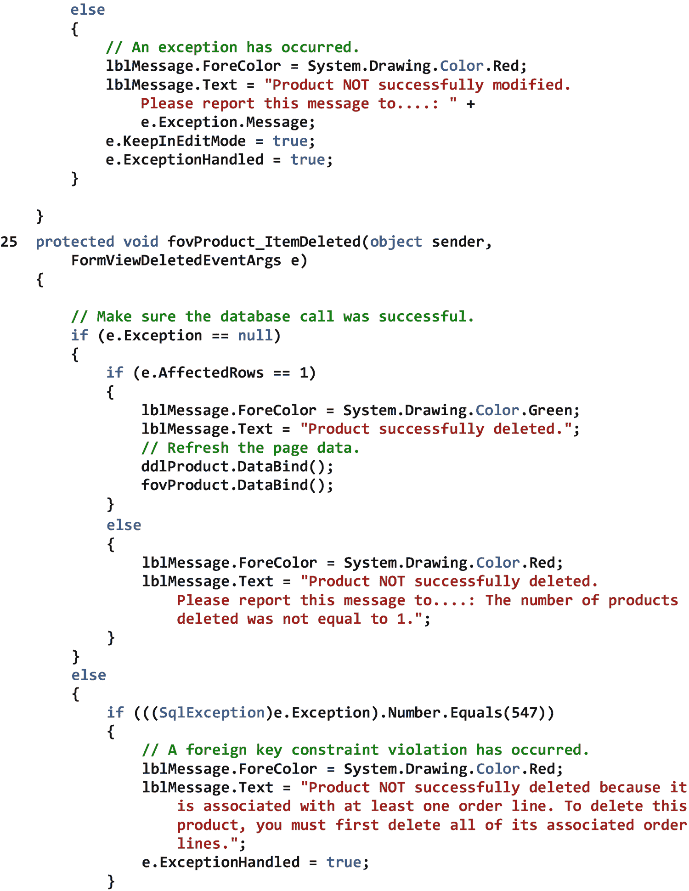
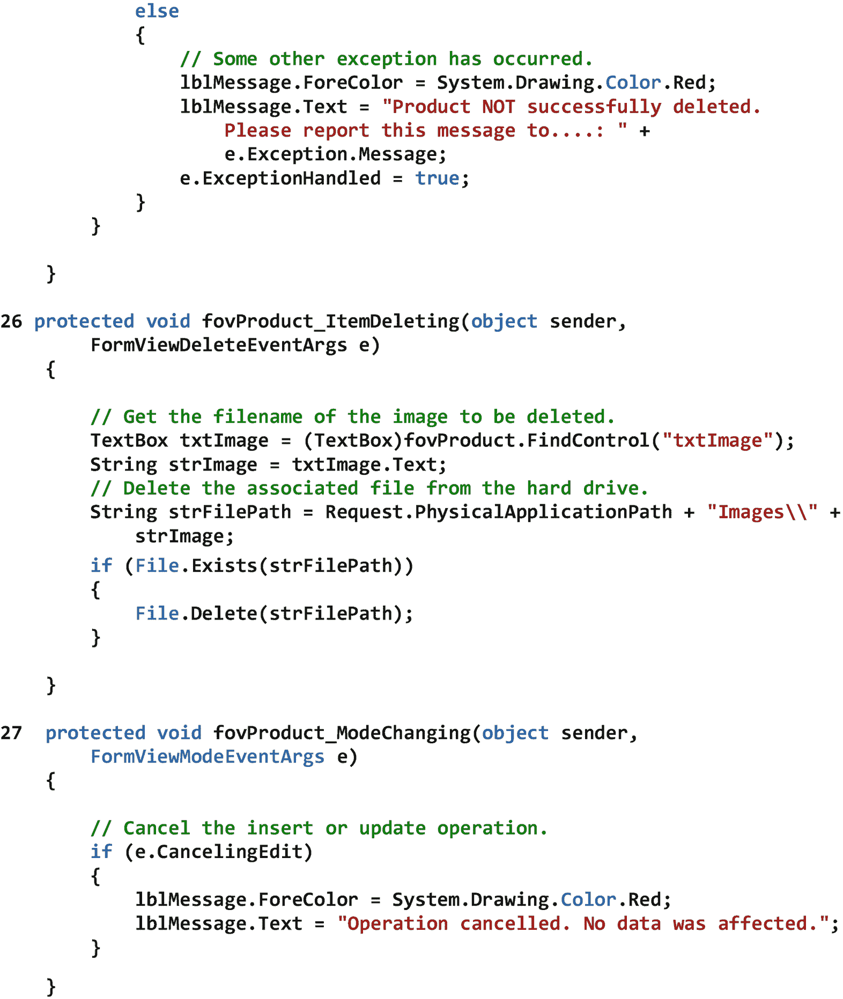
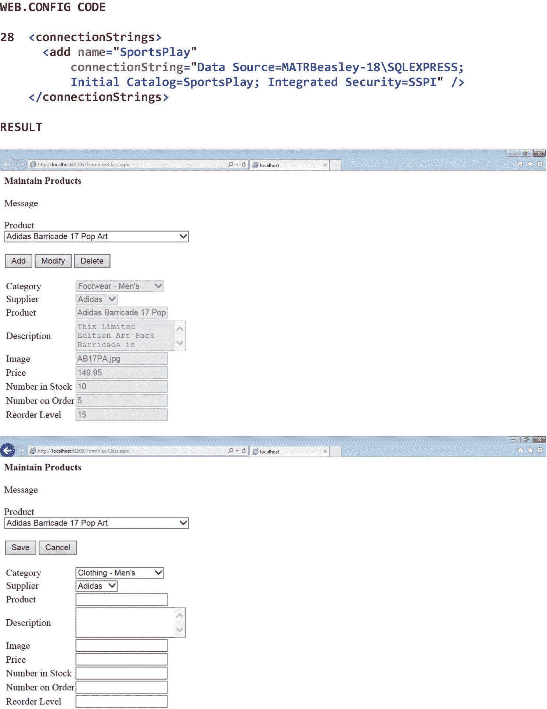
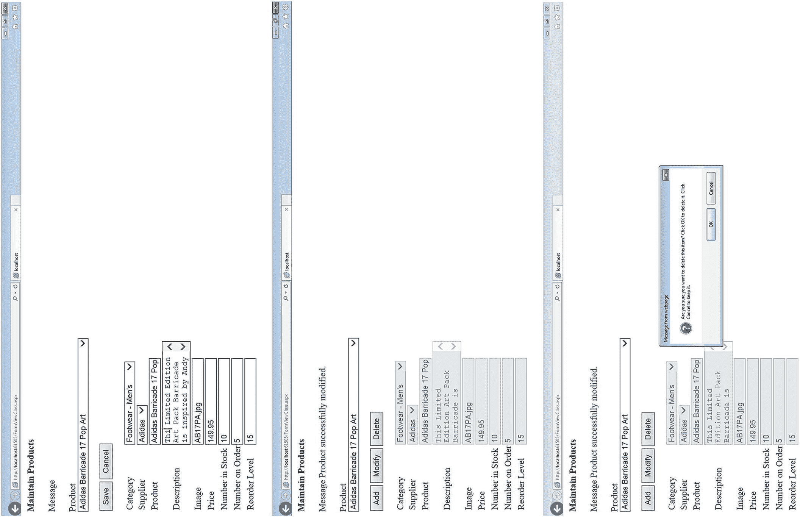

# 二十一、单行数据库表维护

## 21.1 导言

许多现代 Web 应用需要页面来维护数据库表数据。这种表维护意味着添加新的表数据行以及修改和删除现有的表数据行。虽然在维护表数据时，有时同时显示几行数据*是合适的，但有时显示单行数据*会更好。当被维护的表包含如此多的*属性*，以至于这些属性不能在页面上舒适地*显示时(即，水平显示，属性不会从页面上消失)，在页面上显示单行数据是最合适的。*

在本章中，我们将看看 FormView 类。这个类一次一行地维护数据库表(或其他数据源)中的数据。FormView 类具有内置的插入、更新和删除功能，这使得表的维护比我们手动编写这样的功能要容易得多。一个 FormView 控件被绑定到一个*数据源控件*，这个数据源控件引用了某种类型的底层数据结构。在下一节中，我们将把 FormView 控件绑定到引用 SQL Server 数据库表的 SqlDataSource 控件。

## 21.2 FormView 类

FormView 类显示一个表单，最终用户可以使用该表单一次一行地维护数据库表(或其他*数据源*)中的数据。这个类具有内置的插入、更新、删除和分页功能，并且可以使用主题进行定制。要使用 FormView 控件，我们必须定义一个或多个*模板*。这些模板对应于控件可以处于的不同的*模式*，并且在如何显示表格行中的数据方面提供了很大的灵活性。有许多 FormView 控件模板。ItemTemplate 是唯一需要的模板。但是，我们必须为控件可以处于的每种模式定义一个模板。七个 FormView 控件模板是

*   Edit item template–指定 FormView 控件处于编辑模式时的内容和布局。该模板通常包含输入控件和命令按钮，最终用户可以使用它们来修改表中现有的数据行。

*   EmptyDataTemplate–指定 FormView 控件不包含任何数据时的内容和布局。该模板通常包含一条消息，提醒最终用户没有数据可供显示。

*   footer template–指定 FormView 控件脚注行的内容和布局。该模板通常包含应在控件的脚注行中显示的任何附加内容。

*   header template–指定 FormView 控件标题行的内容和布局。该模板通常包含应在控件的标题行中显示的任何附加内容。

*   Insert item template–指定 FormView 控件处于插入模式时的内容和布局。该模板通常包含输入控件和命令按钮，最终用户可以使用它们向表中添加新的数据行。

*   item template–指定 FormView 控件处于只读模式时的内容和布局，因此仅用于显示数据。该模板是必需的，可以包含最终用户可以用来将控件置于插入或编辑模式的命令按钮。它还可以包含一个命令按钮，最终用户可以使用该按钮从表中删除现有的数据行。

*   pager template–指定当 FormView 控件的 AllowPaging 属性设置为 *true* 时，该控件的页导导航的内容和布局。该模板通常包含最终用户可以用来在表中的数据行之间移动的控件。

一个 FormView 控件被绑定到一个*数据源控件*，这个数据源控件引用了某种类型的底层数据结构。FormView 控件可以绑定到不同种类的数据源控件，包括 SqlDataSource 控件、ObjectDataSource 控件和 AccessDataSource 控件。它们也可以绑定到集合，比如数组列表。在本章中，我们将把 FormView 控件绑定到引用 SQL Server 数据库表的 SqlDataSource 控件。若要将 FormView 控件绑定到 SqlDataSource 控件，我们将把 FormView 控件的 DataSourceID 属性设置为关联的 SqlDataSource 控件的 ID。这样，FormView 控件将能够利用 SqlDataSource 控件的插入、更新、删除和分页功能。

FormView 控件可以识别许多特殊的按钮。每个按钮都有特定的行为方式，每个按钮都调用自己的一组 FormView 控件事件。这些按钮是

*   取消按钮–取消插入或更新操作，并放弃最终用户输入的任何值。单击此按钮时，FormView 控件将返回到 DefaultMode 属性中指定的模式。

*   删除按钮–尝试从数据源中删除显示的行。单击此按钮时，将引发 ItemDeleting 和 ItemDeleted 事件。

*   “编辑”按钮–将 FormView 控件置于编辑模式。单击此按钮时，将显示 EditItemTemplate 属性中指定的内容。EditItemTemplate 属性通常以这样一种方式定义，即当最终用户单击 Edit 按钮时，它会被 Update 和 Cancel 按钮替换。

*   插入按钮–尝试使用最终用户提供的值在数据源中插入新行。单击此按钮时，将引发 ItemInserting 和 ItemInserted 事件。

*   新建按钮–将 FormView 控件置于插入模式。单击此按钮时，将显示 InsertItemTemplate 属性中指定的内容。InsertItemTemplate 属性通常以这样一种方式定义，即当最终用户单击它时，New 按钮会被 Insert 和 Cancel 按钮替换。

*   page button–表示 FormView 控件的页导导航中的按钮。为了指定分页操作，我们将按钮的 CommandArgument 属性设置为*第一个*、*上一个*、*下一个*或*最后一个*或特定页面的索引。单击页面按钮时，将引发 PageIndexChanging 和 PageIndexChanged 事件。

*   更新–尝试使用最终用户提供的值更新数据源中显示的行。单击此按钮时，将引发 ItemUpdating 和 ItemUpdated 事件。

表 [21-1](#Tab1) 显示了 FormView 类的一些属性、方法和事件。

表 21-1

FormView 类的一些属性、方法和事件

<colgroup><col class="tcol1 align-left"> <col class="tcol2 align-left"></colgroup> 
| **类**窗体视图T3】1T5】 |
| **命名空间**系统。网页控件 |
| **属性** |
| 允许分页 | 获取或设置一个值，该值指示是否启用分页功能。 |
| DataKeyNames | 获取或设置包含数据源的键字段名称的数组。 |
| 默认模式 | 获取或设置 FormView 控件在更新、插入或取消操作后返回的数据输入模式。 |
| 删除方法 | 获取或设置当控件执行删除操作时在页面上调用的方法的名称。 |
| 编辑模板 | 获取或设置编辑模式下的项的自定义内容。 |
| EmptyDataTemplate | 获取或设置当 FormView 控件绑定到不包含任何记录的数据源时呈现的空数据行的用户定义内容。 |
| 空白数据文本 | 获取或设置当 FormView 控件绑定到不包含任何记录的数据源时，在呈现的空数据行中显示的文本。 |
| 启用模型验证 | 获取或设置一个值，该值指示验证程序控件是否将处理在插入或更新操作期间发生的异常。 |
| 页尾样板 | 获取或设置 FormView 控件中脚注行的用户定义内容。 |
| 页脚文本 | 获取或设置要在 FormView 控件的脚注行中显示的文本。 |
| 网格线 | 获取或设置 FormView 控件的网格线样式。 |
| 模板 | 获取或设置 FormView 控件中标题行的用户定义内容。 |
| 标头文字 | 获取或设置要在 FormView 控件的标题行中显示的文本。 |
| 插入项模板 | 获取或设置处于插入模式的项的自定义内容。 |
| 插入方法 | 获取或设置当控件执行插入操作时在页面上调用的方法的名称。 |
| 模板列 | 当 FormView 控件处于只读模式时，定义数据行的内容。该模板通常包含显示现有记录值的内容。 |
| PageCount(页面计数) | 获取显示数据源中每条记录所需的总页数。 |
| PageIndex(页面索引) | 获取或设置显示页面的索引。 |
| 分页模板 | 定义启用分页功能时(当 AllowPaging 属性设置为 true 时)显示的页导导航的内容。该模板通常包含用户可以用来导航到另一条记录的控件。 |
| 选定值 | 获取 FormView 控件中当前记录的数据键值。 |
| 更新方法 | 获取或设置当控件执行更新操作时在页面上调用的方法的名称。 |
| **方法** |
| 删除项（） | 从数据源中删除 FormView 控件中的当前记录。 |
| InsertItem(布尔值) | 在数据源中插入当前记录。 |
| 更新项（布尔值） | 更新数据源中的当前记录。 |
| **事件** |
| 那么事件 | 当单击 FormView 控件中的按钮时发生。 |
| 项目已删除 | 当单击 FormView 控件中的“删除”按钮时，但在删除操作之后发生。 |
| 项目删除 | 当单击 FormView 控件中的“删除”按钮时，但在删除操作之前发生。 |
| 插入的项目 | 当单击 FormView 控件中的“插入”按钮时，但在插入操作之后发生。 |
| 项目插入 | 当单击 FormView 控件中的“插入”按钮时，但在插入操作之前发生。 |
| 项目已更新 | 当单击 FormView 控件中的“更新”按钮时，但在更新操作之后发生。 |
| 项目更新 | 当单击 FormView 控件中的“更新”按钮时，但在更新操作之前发生。 |
| 模式已更改 | 当 FormView 控件在编辑、插入和只读模式之间切换时，但在模式更改后发生。 |
| 模式改变 | 当 FormView 控件在编辑、插入和只读模式之间切换时，但在模式更改之前发生。 |
| PageIndexChanged | 在分页操作后 PageIndex 属性值更改时发生。 |
| 页面索引更改 | 当 PageIndex 属性值在分页操作之前更改时发生。 |
| **参考** |
| [T2`https://msdn.microsoft.com/en-us/library/system.web.ui.webcontrols.formview(v=vs.110).aspx`](https://msdn.microsoft.com/en-us/library/system.web.ui.webcontrols.formview%2528v%253Dvs.110%2529.aspx) |

图 21-1 显示了一个 FormView 类的例子。

请注意 01 处的*产品* DropDownList 控件的 SqlDataSource。此数据源将用于在 06 填充下拉列表。正如在 SelectCommand 属性中可以看到的，我们将从 Product 表中返回 ProductID 和 Product，结果将按产品升序排序，以便最终用户可以轻松地在下拉列表中找到产品。

请注意 02 处的*类别* DropDownList 控件的 SqlDataSource。该数据源将用于填充下拉列表中的 10，这是 FormView 控件中的*。正如在 SelectCommand 属性中可以看到的，我们将从 Category 表中返回 CategoryID 和 Category，结果将按类别升序排序，以便最终用户可以轻松地在下拉列表中定位类别。*

请注意 03 处的*产品* FormView 控件的 SqlDataSource。该数据源将用于向产品表中插入新的数据行，并更新和删除产品表中现有的数据行—所有这些都是通过从 07 开始的表单视图完成的。当我们详细查看这个数据源时，我们会看到许多以符号 (@)的*开头的属性。这些属性表示数据源的输入和输出参数。请注意数据源的 OldValuesParameterFormatString 属性。可以看出，这个属性设置为 *original_{0}* 。我们一会儿再来看*原*这个词。现在看看数据源的 OnInserted 属性。此属性指示在 Product 表中插入一行后将立即执行的事件处理程序方法。在 22 处定义的这个事件处理程序方法将用于获取新插入的行的主键值，以便我们可以将产品下拉列表和表单视图定位在新插入的行上。正如在 SelectCommand 属性中可以看到的，我们将返回产品表的所有*属性，因为我们将向最终用户显示它们——除了当表单视图处于插入模式时。另外，请注意 InsertCommand 属性末尾的 Select 语句。该语句将返回新插入产品的 ProductID，这样我们就可以在新插入的行上定位产品下拉列表和表单视图。最后，注意在 UpdateCommand 和 DeleteCommand 属性的 Where 子句中，ProductID 被设置为原来的*product id。这里的单词 *original* 与我们刚刚提到的 OldValuesParameterFormatString 属性中的单词 *original* 直接对应。以这种方式将 ProductID 设置为原始 ProductID 将确保被更新或删除的产品与当前显示的产品相同。*

注意 04 处的数据源的<selectparameters>部分。顾名思义，这个部分中的参数对应于 SelectCommand 属性的 Select 语句中的参数，该属性在 03 处定义。可以看到，我们有一个单一的选择参数。此参数是一个控件参数(即其值来自控件)，其名称为 ProductID，与 Select 语句的 Where 子句中的@ProductID 参数直接对应。该参数的值来自 ddlProduct 下拉列表的 SelectedValue 属性，是一个 32 位整数。</selectparameters>

注意 05 处的数据源的<insertparameters>部分。顾名思义，本节中的参数对应于 InsertCommand 属性的 Insert 语句中的参数，该属性在 03 处定义。可以看出，我们只有一个插入参数。此参数的名称为 ProductID，它直接对应于 InsertCommand 属性底部 Select 语句中的@ProductID 参数。注意，这个参数是一个输出参数，它将保存新插入行的主键值，并且是一个 32 位整数。</insertparameters>

请注意 06 处的产品下拉列表控件。此下拉列表将用于选择显示在表单视图中的产品。在这个控件中有几件事情需要注意。首先，它的 DataSourceID 属性被设置为 *sdsDropDownListProduct* ，这是在 01 定义的 SqlDataSource 的 ID。其次，它的 DataTextField 属性被设置为*产品*，这是将在下拉列表中显示的表属性。第三，它的 DataValueField 属性被设置为 *ProductID* ，这是将在下拉列表中显示的项目的主键。第四，它的 AutoPostBack 属性被设置为 *true* ，这样每当最终用户选择一个新产品时，该页面将回发到服务器，新选择的产品将显示在表单视图中。

请注意 07 处的产品 FormView 控件。该控件将用于向产品表中插入新行，更新产品表中的现有行，以及从产品表中删除现有行。请注意，控件的 DataKeyNames 属性被设置为 *ProductID* 。这表明数据源(即产品表)的主键是 ProductID。还要注意四个事件处理程序方法属性。OnItemInserted 属性指示在 Product 表中插入一行后将立即执行的事件处理程序方法。在 23 处定义的这个事件处理器方法将用于确保插入成功。OnItemUpdated 属性指示在 Product 表中更新一行后将立即执行的事件处理程序方法。在 24 处定义的该事件处理器方法将用于确保更新成功。OnItemDeleted 属性指示从产品表中删除一行后将立即执行的事件处理程序方法。在 25 处定义的该事件处理程序方法将用于确保删除成功。OnItemDeleting 属性指示将在从产品表中删除行之前*立即执行的事件处理程序方法。在 26 处定义的该事件处理器方法将用于从硬盘驱动器中删除产品的图像文件。由于我们需要在*之前删除图像文件的名称*，产品从表中删除(并从表单视图中删除)，我们必须在*之前在 26 *执行代码，从产品表中删除该行。 [2](#Fn2) 最后，OnModeChanging 属性表示当窗体视图从插入模式切换到只读模式或从编辑模式切换到只读模式时将执行的事件处理程序方法。在 27 处定义的该事件处理程序方法将用于向最终用户显示消息，指示插入或更新操作已被取消。*

请注意 08 处的 ItemTemplate 的开头，它指定了 FormView 控件在只读模式下的内容和布局，因此仅用于显示数据。可以看到，当最初呈现表单视图时，将显示三个按钮——添加、修改和删除。当点击 Add 按钮时，表单视图将进入插入模式，因为按钮的 CommandName 属性被设置为 *New* 。此模式将在 13 处显示 InsertItemTemplate。当点击修改按钮时，表单视图将进入编辑模式，因为按钮的 CommandName 属性被设置为*编辑*。此模式将在 16 显示 EditItemTemplate。当点击删除按钮时，表单视图将进入删除模式，因为按钮的 CommandName 属性被设置为 *Delete* 。请注意，此模式将继续显示 ItemTemplate，因为最终用户不会添加修改数据。可以看到，按钮的 OnClientClick 属性被设置为执行一个 JavaScript 确认函数。如果最终用户在显示确认消息时单击确定，将执行删除命令。然而，如果最终用户在显示确认消息时点击取消，删除命令将*而不是*被执行。

注意 09 和 12 处的*复制区开始*和*复制区结束*注释。我们将用来确保 ItemTemplate、InsertItemTemplate 和 EditItemTemplate 完全相同(从而在不同模式之间看起来一致)的技术是，首先对这两个注释之间的表行进行编码和测试，然后在 14 和 15 处的*复制区域开始*和*复制区域结束*注释之间以及在 17 和 18 处的*复制区域开始*和*复制区域结束*注释之间复制和粘贴这些表行。如果修改了 ItemTemplate、InsertItemTemplate 或 EditItemTemplate 中注释的*和*之间的代码，则应该将该代码复制并粘贴到其他两个模板中的注释之间。未能采用这种技术(或类似的技术)几乎肯定会导致为了保持模板同步而对三个模板进行更昂贵的修改。

请注意 10 处的类别 DropDownList 控件。关于这个控件，有几件事情需要注意。首先，它的 DataSourceID 属性被设置为 *sdsDropDownListCategory* ，这是在 02 定义的 SqlDataSource 的 ID。其次，它的 DataTextField 属性被设置为*类别*，这是将在下拉列表中显示的表属性。第三，它的 DataValueField 属性被设置为 *CategoryID* ，这是将在下拉列表中显示的项目的主键。第四，将它的 SelectedValue 属性设置为*<% # Bind(" CategoryID ")%>*，将当前选中类别的 CategoryID 绑定到当前显示产品的 CategoryID。因此，当在产品表中插入新行或更新产品表中的现有行时，产品的 CategoryID 属性将被设置为当前选定类别的 CategoryID 属性。

注意 11 处的产品文本框控件。关于这个控件有两点需要注意。首先，它的 MaxLength 属性被设置为 *50* ，这样最终用户就不能输入超过 50 个字符的产品。如果他或她被允许输入超过 50 个字符的产品，并且这样做了，插入或更新将由于*截断*错误而失败。这是因为产品表中产品属性的最大长度是 50 个字符(见图 [20-1](20.html#Fig1) )。请记住，在现实世界的应用中，我们*还*需要使用 ASP.NET 提供的验证控件来帮助我们避免其他类型的插入和更新失败(例如，空错误、类型错误),并确保我们将坏数据排除在数据库之外。第二，它的 Text 属性设置为*<% # Bind(" Product ")%>*，将 TextBox 控件的 Text 属性绑定到当前显示产品的 Product 属性。因此，当在产品表中插入新行或更新产品表中的现有行时，产品的产品属性将被设置为 TextBox 控件的 Text 属性。

请注意 13 处 InsertItemTemplate 的开头，它指定了 FormView 控件处于插入模式时的内容和布局。可以看到，当表单视图处于插入模式时，将显示两个按钮——保存和取消。当单击 Save 按钮时，form 视图将尝试向 product 表中插入一个新产品，因为按钮的 CommandName 属性被设置为 *Insert* 。当单击取消按钮时，表单视图将取消插入操作，放弃最终用户输入的任何值，返回到只读模式，并在 08 显示 ItemTemplate，因为按钮的 CommandName 属性被设置为*取消*。

请注意 16 处的 EditItemTemplate 的开头，它指定了 FormView 控件在编辑模式下的内容和布局。可以看到，当表单视图处于编辑模式时，将显示两个按钮——保存和取消。当单击 Save 按钮时，表单视图将尝试更新 product 表中当前显示的产品，因为按钮的 CommandName 属性被设置为 *Update* 。当单击取消按钮时，表单视图将取消更新操作，放弃最终用户输入的任何值，返回到只读模式，并在 08 显示 ItemTemplate，因为按钮的 CommandName 属性被设置为*取消*。

注意在 19 处系统。Data.SqlClient 命名空间已添加到 using 指令列表中(出现在文件后代码的顶部)。这样做是为了避免指定 SqlException 类的完全限定名(即 System。Data.SqlClient.SqlException)。我们将需要 SqlException 类来检查 25 处的外键约束违反。

注意在 20 处系统。IO 命名空间也已添加到 using 指令列表中，因此我们不需要指定文件类的全限定名称(即 System。每次我们想使用它的一个方法时。我们将需要 File 类来删除服务器硬盘上的一个文件，在我们检查了它的存在之后。该代码显示在 26 处。

注意在 21 处，我们已经定义了一个变量，它将存储一个新插入产品的主键值。

请注意，在 22 处，我们正在获取一个新插入产品的主键值，并将该值赋给 21 处定义的变量。请注意，新插入行的主键值是通过位于 03 的 InsertCommand 属性末尾的 Select 语句从数据库中检索的。保存主键值后，它将在 23 处的 FormViewItemInserted 方法中使用，以将产品下拉列表和表单视图本身定位在新插入的产品上。

请注意 23 处产品表单视图的 ItemInserted 事件处理程序方法。在尝试插入操作后，立即引发窗体视图的 ItemInserted 事件时，将执行此方法。请注意，在事件处理程序方法的定义中，FormViewInsertedEventArgs 类的别名是 e。该类被传递给事件处理程序方法，因此我们可以确定插入操作的状态。可以看出，如果数据库没有返回异常，并且数据库中只有一行受到影响(即插入)，我们将显示一条消息，说明产品已成功添加。此外，我们将产品表(及其新产品)重新绑定到产品下拉列表，将产品下拉列表的 SelectedValue 属性设置为新插入的主键的值，并将产品表(及其新产品)重新绑定到窗体视图。如果我们希望新插入的产品立即显示在产品下拉列表和表单视图中，这个过程是必要的。如果数据库没有返回异常，但是数据库中的某一行以外的内容受到影响(即被插入)，我们将显示一条适当的错误消息，并将表单视图保持在插入模式。最后，如果从数据库返回的异常*是*，我们将显示一条适当的错误消息，保持表单视图处于插入模式，并指示我们正在以编程方式处理该异常。

请注意 24 处产品表单视图的 ItemUpdated 事件处理程序方法。当引发窗体视图的 ItemUpdated 事件时，将执行此方法，该事件紧接在尝试更新操作之后。请注意，在事件处理程序方法的定义中，FormViewUpdatedEventArgs 类的别名是 e。该类被传递给事件处理程序方法，因此我们可以确定更新操作的状态。可以看出，如果数据库没有返回异常，并且数据库中只有一行受到影响(即更新)，我们将显示一条消息，说明产品已成功修改。此外，我们将产品表(及其更新的产品)重新绑定到产品下拉列表，并将产品表(及其更新的产品)重新绑定到表单视图。如果我们希望新更新的产品立即显示在产品下拉列表和表单视图中，这个过程是必要的。如果数据库没有返回异常，但是数据库中除了一行之外的其他内容受到影响(即更新)，我们将显示一条适当的错误消息，并将表单视图保持在编辑模式。最后，如果从数据库返回一个异常*为*，我们将显示一个适当的错误消息，将表单视图保持在编辑模式，并指示我们正在以编程方式处理该异常。

请注意 25 处产品表单视图的 ItemDeleted 事件处理程序方法。当尝试删除操作后立即引发窗体视图的 ItemDeleted 事件时，将执行此方法。请注意，在事件处理程序方法的定义中，FormViewDeletedEventArgs 类的别名是 e。该类被传递给事件处理程序方法，因此我们可以确定删除操作的状态。可以看出，如果数据库没有返回异常，并且数据库中只有一行受到影响(即被删除)，我们将显示一条消息，说明产品已被成功删除。此外，我们将产品表(不包括已删除的产品)重新绑定到产品下拉列表，并将产品表(不包括已删除的产品)重新绑定到表单视图。如果我们不再希望新删除的产品显示在产品下拉列表和表单视图中，则此过程是必要的。如果数据库没有返回异常，但是数据库中的某一行以外的内容受到影响(即被删除)，我们将显示一条适当的错误消息。如果异常*是从数据库返回的*并且 SqlException 号是 547，这表明发生了外键约束冲突，我们将显示一条适当的错误消息，并表明我们正在以编程方式处理该异常。最后，如果从数据库返回其他异常，我们将显示一条适当的错误消息，并指出我们正在以编程方式处理该异常。

请注意 26 处产品表单视图的 ItemDeleting 事件处理程序方法。该方法在表单视图的 ItemDeleting 事件被引发时执行，该事件紧接在尝试删除操作的之前的*处。请注意，在此方法中，我们将从服务器硬盘上删除与要从产品表中删除的产品相关联的图像文件(如果该文件存在)。注意，由于图像文本框控件存在于表单视图的*中的*，所以它不能像其他服务器控件一样在页面的代码中直接访问*。因此，我们必须首先在窗体视图中定位 TextBox 控件(通过使用 control 类的 FindControl 方法的 ID 属性)，然后像往常一样获取控件的 Text 属性。**

请注意 27 处产品表单视图的 ModeChanging 事件处理程序方法。当引发窗体视图的 ModeChanging 事件时，即当窗体视图从插入模式切换到只读模式或从编辑模式切换到只读模式时，执行此方法。请注意，在事件处理程序方法的定义中，FormViewModeEventArgs 类的别名是 e。该类被传递给事件处理程序方法，以便我们可以确定最终用户是否正在取消插入或更新操作。可以看到，如果最终用户取消了这样的操作，我们将显示一条消息，表明插入或更新操作已被取消，没有数据受到影响。

注意，在 28 处，我们在 Web.config 文件中添加了一个<connectionstrings>部分，以及一个名为 *SportsPlay* 的连接字符串。此连接字符串提供了 SQL Server 数据库的详细信息，数据源 01、02 和 03 将使用该数据库。请参见第 [20](20.html) 章，标题为“数据库设计、SQL 和数据绑定”，以获取此连接字符串的详细描述。</connectionstrings>

图中结果部分的第一个屏幕截图显示了只读模式下的产品表单视图。因此，将显示 ItemTemplate。第二个屏幕截图显示了插入模式下的产品表单视图。因此，将显示 InsertItemTemplate。第三个屏幕截图显示了编辑模式下的产品表单视图。因此，将显示 EditItemTemplate。请注意，产品描述正在被修改。第四个屏幕截图再次以只读模式显示了 product form 视图——在修改了产品描述之后。因此，ItemTemplate 将再次显示。第五个屏幕截图显示了最终用户单击 Delete 按钮后只读模式下的产品表单视图。

图 21-1

FormView 类的示例

<aside aria-label="Footnotes" class="FootnoteSection" epub:type="footnotes">Footnotes [1](#Fn1_source)

所有属性、方法和事件描述都直接取自微软的官方文档。为了节省空间，省略了用于处理该类事件的事件处理程序方法。有关该类的所有方法，请参见参考。

  [2](#Fn2_source)

如果从硬盘上删除了产品的图像文件，并且数据库表删除不成功，则产品仍将存在于产品表中，但图像文件将不再存在于硬盘上。因此，可能需要一种更复杂的方法来保持两者同步。

 </aside>