# 二十二、多行数据库表维护

## 22.1 导言

许多现代 Web 应用需要页面来维护数据库表数据。这种表维护意味着添加新的表数据行以及修改和删除现有的表数据行。虽然在维护表格数据时，有时显示一个*单行*数据是合适的，但是在其他情况下，同时显示几行数据会更好。当被维护的表包含足够少的*属性*时，在页面上显示几行数据是最合适的，这些属性可以在页面上舒适地显示*(即，水平显示，属性不会从页面上消失)。当被维护的表包含太多的*行*以至于这些行不能在页面上舒服地向下*显示(即，需要太多的滚动来定位给定的行)，我们可以使用某种行过滤器，或者我们可以利用数据分页(稍后讨论)。**

在本章中，我们将从查看 ListView 类开始。这个类一次维护数据库表(或其他数据源)中的几行数据。ListView 类具有内置的插入、更新、删除、排序和项目选择功能，这使得表的维护比我们手动编写这样的功能要容易得多。一个 ListView 控件被绑定到一个*数据源控件*，这个数据源控件引用了某种类型的底层数据结构。我们将 ListView 控件绑定到引用 SQL Server 数据库表的 SqlDataSource 控件。之后，我们将讨论 DataPager 类，它显示最终用户可以用来查看 ListView 控件的数据页的分页控件。接下来，我们将考虑 NextPreviousPagerField 类。这个类在 DataPager 控件中显示导航控件，最终用户可以使用这些控件跳转到 ListView 控件的*第一个*页面，移动到 ListView 控件的*上一个*页面，移动到 ListView 控件的*下一个*页面，和/或跳转到 ListView 控件的*最后一个*页面。最后，我们将查看 NumericPagerField 类，该类显示 DataPager 控件中的导航控件，最终用户可以使用该控件通过页码选择 ListView 控件中的页面。

## 22.2 ListView 类

ListView 类显示一个列表，最终用户可以使用该列表一次维护数据库表(或其他*数据源*)中的若干行数据。该类具有内置的插入、更新、删除、排序和项目选择功能，可以与 DataPager 控件结合使用以实现分页功能，并且可以使用主题进行定制。要使用 ListView 控件，我们必须定义一个或多个*模板*。这些模板对应于控件可以处于的不同的*模式*，并且在如何显示表格行中的数据方面提供了很大的灵活性。有许多 ListView 控件模板。ItemTemplate 是唯一需要的模板。但是，我们必须为控件可以处于的每种模式定义一个模板。十一个 ListView 控件模板是

*   alternating ItemTemplate–指定交替的 item template，以便更容易区分 ListView 控件中的连续项。(请参见下面的 ItemTemplate。)

*   Edit item template–当 ListView 控件处于编辑模式时，指定该控件中单个项的内容和布局。该模板通常包含输入控件和命令按钮，最终用户可以使用它们来修改表中现有的数据行。

*   EmptyDataTemplate–指定 ListView 控件不包含任何数据时的内容和布局。该模板通常包含一条消息，提醒最终用户没有数据可供显示。

*   empty item template–当当前数据页的最后一行中没有其他项目可显示时，指定 ListView 控件中单个项目的内容和布局。

*   GroupSeparatorTemplate–指定在 ListView 控件的项目组之间显示的内容和布局。

*   group template–指定将保存 ItemTemplate 或 EmptyItemTemplate 中定义的内容的容器控件(例如，table)。

*   Insert item template–当 ListView 控件处于插入模式时，指定该控件中单个项目的内容和布局。该模板通常包含输入控件和命令按钮，最终用户可以使用它们向表中添加新的数据行。通过在 ListView 控件的 InsertItemPosition 属性中指定所需的位置，可以将 InsertItemTemplate 定位在 ListView 控件的顶部或底部。只有当 ListView 控件的 InsertItemPosition 属性设置为 *FirstItem* 或 *LastItem* 时，才会显示 InsertItemTemplate。

*   ItemSeparatorTemplate–指定要在各个项目之间显示的内容和布局。

*   item template–指定当 ListView 控件处于只读模式，因此仅用于显示数据时，该控件中单个项的内容和布局。该模板是必需的，可以包含最终用户可以用来将控件置于编辑模式的命令按钮。它还可以包含一个命令按钮，最终用户可以使用该按钮从表中删除现有的数据行。

*   layout template–指定 ListView 控件的根容器的内容。

*   SelectedItemTemplate–指定 ListView 控件中单个项目被选中后的内容和布局，以便将其与 ListView 控件中的其他项目区分开来。该模板可以包含输入控件和命令按钮，最终用户可以使用它们来修改表中的现有数据行或从表中删除现有数据行。

一个 ListView 控件被绑定到一个*数据源控件*，这个数据源控件引用了某种类型的底层数据结构。ListView 控件可以绑定到不同种类的数据源控件，包括 SqlDataSource 控件、ObjectDataSource 控件和 AccessDataSource 控件。它们也可以绑定到集合，比如数组列表。在本章中，我们将把 ListView 控件绑定到引用 SQL Server 数据库表的 SqlDataSource 控件。为了将 ListView 控件绑定到 SqlDataSource 控件，我们将把 ListView 控件的 DataSourceID 属性设置为关联的 SqlDataSource 控件的 ID。这样，ListView 控件将能够利用 SqlDataSource 控件的插入、更新、删除和排序功能。

ListView 控件可以识别许多特殊的按钮。每个按钮都有特定的行为方式，每个按钮都调用自己的一组 ListView 控件事件。这些按钮是

*   取消按钮–取消插入或更新操作，并放弃最终用户输入的任何值。单击此按钮时，将引发 ItemCanceling 事件。

*   删除按钮–尝试从数据源中删除选定的行。单击此按钮时，将引发 ItemDeleting 和 ItemDeleted 事件。

*   编辑按钮–将 ListView 控件的选定项目置于编辑模式。单击此按钮时，将显示 EditItemTemplate 属性中指定的内容，并引发 ItemEditing 事件。EditItemTemplate 属性通常以这样一种方式定义，即当最终用户单击 Edit 按钮时，它会被 Update 和 Cancel 按钮替换。

*   插入按钮–尝试使用最终用户提供的值在数据源中插入新行。单击此按钮时，将引发 ItemInserting 和 ItemInserted 事件。

*   选择按钮–将 ListView 控件的 SelectedIndex 属性设置为选定项的 DisplayIndex 属性值。单击此按钮时，将引发 SelectedIndexChanging 和 SelectedIndexChanged 事件。

*   sort–对按钮的 CommandArgument 属性中列出的列进行排序。单击此按钮时，将引发排序和已排序事件。

*   更新–尝试使用最终用户提供的值更新数据源中的选定行。单击此按钮时，将引发 ItemUpdating 和 ItemUpdated 事件。

表 [22-1](#Tab1) 显示了 ListView 类的一些属性、方法和事件。

表 22-1

ListView 类的一些属性、方法和事件

<colgroup><col class="tcol1 align-left"> <col class="tcol2 align-left"></colgroup> 
| **类**列表视图T3】1T5】 |
| **命名空间**系统。网页控件 |
| **属性** |
| 模板 | 获取或设置 ListView 控件中交替数据项的自定义内容。 |
| DataKeyNames | 获取或设置一个数组，该数组包含 ListView 控件中显示的项的主键字段的名称。 |
| 删除方法 | 获取或设置为删除数据而调用的方法的名称。 |
| 编辑模板 | 获取或设置编辑模式下该项的自定义内容。 |
| EmptyDataTemplate | 获取或设置当 ListView 控件绑定到不包含任何记录的数据源时呈现的空模板的用户定义内容。 |
| EmptyItemTemplate | 获取或设置当当前数据页的最后一行中没有其他数据项可显示时，在 ListView 控件中呈现的空项的用户定义内容。 |
| GroupSeparatorTemplate | 获取或设置 ListView 控件中组之间分隔符的用户定义内容。 |
| 组模板 | 获取或设置 ListView 控件中组容器的用户定义内容。 |
| 插入项目位置 | 获取或设置 InsertItemTemplate 模板作为 ListView 控件的一部分呈现时的位置。 |
| 插入项模板 | 获取或设置 ListView 控件中插入项的自定义内容。 |
| 插入方法 | 获取或设置为插入数据而调用的方法的名称。 |
| ItemSeparatorTemplate | 获取或设置 ListView 控件中项之间分隔符的自定义内容。 |
| 模板列 | 获取或设置 ListView 控件中数据项的自定义内容。 |
| 布局模板 | 获取或设置 ListView 控件中根容器的自定义内容。 |
| SelectedDataKey | 获取 ListView 控件中选定项的数据键值。 |
| 项时 | 获取或设置 ListView 控件中选定项的索引。 |
| 选定项模板 | 获取或设置 ListView 控件中选定项的自定义内容。 |
| 选定值 | 获取 ListView 控件中选定项的数据键值。 |
| 分类反应 | 获取正在排序的一个或多个字段的排序方向。 |
| 排序表达式 | 获取与正在排序的一个或多个字段关联的排序表达式。 |
| 更新方法 | 获取或设置为更新数据而调用的方法的名称。 |
| **方法** |
| 删除项（Int32） | 从数据源中删除指定索引处的记录。 |
| InsertNewItem(Boolean) | 在数据源中插入当前记录。 |
| UpdateItem(Int32，Boolean) | 更新数据源中指定索引处的记录。 |
| **事件** |
| 取消项目 | 当请求取消操作时，但在 ListView 控件取消插入或编辑操作之前发生。 |
| 那么事件 | 当单击 ListView 控件中的按钮时发生。 |
| 项绑定事件 | 当数据项绑定到 ListView 控件中的数据时发生。 |
| 项目已删除 | 在 ListView 控件删除该项后，请求删除操作时发生。 |
| 项目删除 | 在请求删除操作时，但在 ListView 控件删除该项之前发生。 |
| 项目编辑 | 当请求编辑操作时，但在 ListView 项处于编辑模式之前发生。 |
| 插入的项目 | 在 ListView 控件将项插入数据源后，请求插入操作时发生。 |
| 项目插入 | 在请求插入操作时，但在 ListView 控件执行插入之前发生。 |
| 项目已更新 | 在 ListView 控件更新该项之后，请求更新操作时发生。 |
| 项目更新 | 在请求更新操作时，但在 ListView 控件更新该项之前发生。 |
| 事件中 | 在 ListView 控件处理选择操作之后，单击项的“选择”按钮时发生。 |
| SelectedIndexChanging | 在单击项的“选择”按钮时，但在 ListView 控件处理选择操作之前发生。 |
| 分类的 | 在 ListView 控件处理排序操作之后，请求排序操作时发生。 |
| 整理 | 在请求排序操作时，但在 ListView 控件处理排序操作之前发生。 |
| **参考** |
| [T2`https://msdn.microsoft.com/en-us/library/system.web.ui.webcontrols.listview(v=vs.110).aspx`](https://msdn.microsoft.com/en-us/library/system.web.ui.webcontrols.listview%2528v%253Dvs.110%2529.aspx) |

图 22-1 显示了一个 ListView 类的例子。

请注意 01 处的*类别* DropDownList 控件的 SqlDataSource。该数据源将用于填充 09 处的下拉列表，这是 ListView 控件内的*。正如在 SelectCommand 属性中可以看到的，我们将从 Category 表中返回 CategoryID 和 Category，结果将按类别升序排序，以便最终用户可以轻松地在下拉列表中定位类别。*

请注意 02 处的*产品* ListView 控件的 SqlDataSource。该数据源将用于向产品表中插入新的数据行，并更新和删除产品表中现有的数据行—所有这些都是通过从 03 开始的列表视图完成的。当我们详细查看这个数据源时，我们会看到许多以符号 (@)的*开头的属性。这些属性表示数据源的输入参数。请注意数据源的 OldValuesParameterFormatString 属性。可以看出，这个属性设置为 *original_{0}* 。我们一会儿再来看*原*这个词。请注意，在 SelectCommand 属性中，我们将连接类别、供应商和产品表，并返回它们各自属性的所有*,因为我们将向最终用户显示它们中的大部分——除非列表视图处于插入模式。最后，注意在 UpdateCommand 和 DeleteCommand 属性的 Where 子句中，ProductID 被设置为原来的*product id。这里的单词 *original* 与刚才提到的 OldValuesParameterFormatString 属性中的单词 *original* 直接对应。以这种方式将 ProductID 设置为原始 ProductID 将确保被更新或删除的产品与当前显示的产品相同。***

注意 03 处的产品 ListView 控件。该控件将用于向产品表中插入新行，更新产品表中的现有行，以及从产品表中删除现有行。请注意，控件的 DataKeyNames 属性被设置为 *ProductID* 。这表明数据源(即产品表)的主键是 ProductID。还要注意 InsertItemPosition 属性被设置为 *FirstItem* ，这表明 InsertItemTemplate 将被定位在 ListView 控件的顶部。尽管我们*可以*将 InsertItemTemplate 放置在 ListView 控件的底部，但是从最终用户的角度来看，这样做可能效率很低——尤其是当要显示许多表格行或者要使用数据分页时。还要注意五个事件处理程序方法属性。OnItemInserted 属性指示在 Product 表中插入一行后将立即执行的事件处理程序方法。在 20 处定义的该事件处理器方法将用于确保插入成功。OnItemUpdated 属性指示在 Product 表中更新一行后将立即执行的事件处理程序方法。在 21 处定义的这个事件处理程序方法将用于确保更新成功。OnItemDeleted 属性指示从产品表中删除一行后将立即执行的事件处理程序方法。在 22 处定义的该事件处理程序方法将用于确保删除成功。OnItemDeleting 属性指示将在从产品表中删除行之前*立即执行的事件处理程序方法。在 23 处定义的该事件处理器方法将用于从硬盘驱动器中删除产品的图像文件。由于我们需要在*从表中删除产品(并从列表视图中删除)之前*删除图像文件的名称，因此我们必须在*从产品表中删除该行之前在 23 *执行代码。 [2](#Fn2) 最后，OnItemCanceling 属性表示请求取消操作时将执行的事件处理程序方法。在 24 处定义的该事件处理程序方法将用于显示一条消息，指示插入或更新操作已被取消。*

请注意 04 处 LayoutTemplate 的开头，它指定了 ListView 控件的根容器的内容。在这种情况下，布局模板由可点击的列标题的 HTML 表格组成。我们马上会看到为什么我们使用 HTML 标记而不是 ASP.NET 服务器标记来定义这个表。

注意在 05，我们已经为 HTML 表格定义了列标题。可以看出，这些标题都显示为一个 LinkButton 控件。注意，第一个链接按钮的 CommandArgument 属性设置为*类别*，CommandName 属性设置为*排序*。这种组合表示当单击链接按钮时，列表视图将按类别属性排序。其他列标题的定义和行为类似。

请注意 06 处的 HTML 表格行，它的 ID 属性设置为 *itemPlaceholder* 。此占位符指示在页面上呈现列表视图时，在 LayoutTemplate(即 ListView 控件的根容器)中放置 ItemTemplate 的位置。正是这个占位符的作用，要求我们在定义列表视图的布局模板时使用 HTML 元素。尽管这明显偏离了我们通常只使用 ASP.NET 服务器控件的做法，但是在这个特定的场景中，使用一个< asp:TableRow >服务器控件是行不通的。

请注意 07 处的 ItemTemplate 的开头，它指定了 ListView 控件处于只读模式时该控件中单个项的内容和布局，因此只用于显示数据。可以看到，当最初呈现列表视图时，将显示两个按钮——修改和删除。当点击修改按钮时，列表视图将进入编辑模式，因为按钮的 CommandName 属性被设置为 *Edit* 。此模式将在 15 显示 EditItemTemplate。当点击删除按钮时，列表视图将进入删除模式，因为按钮的 CommandName 属性被设置为*删除*。请注意，此模式将继续显示 ItemTemplate，因为最终用户不会添加修改数据。可以看到，这个按钮的 OnClientClick 属性被设置为执行一个 JavaScript 确认函数。如果最终用户在显示确认消息时单击确定，将执行删除命令。然而，如果最终用户在显示确认消息时点击取消，删除命令将*而不是*被执行。

注意 08 和 11 处的*复制区开始*和*复制区结束*注释。我们将用来确保 ItemTemplate、InsertItemTemplate 和 EditItemTemplate 完全相同(从而在不同模式之间看起来一致)的技术是，首先对这两个注释之间的表列进行编码和测试，然后在 13 和 14 处的*复制区域开始*和*复制区域结束*注释之间以及在 16 和 17 处的*复制区域开始*和*复制区域结束*注释之间复制和粘贴这些表列。请注意，在每个复制区域中，服务器控件的 Enabled 和 ValidationGroup 属性应该根据它们所在的模板进行不同的设置。因此，如果修改了 ItemTemplate、InsertItemTemplate 或 EditItemTemplate 中注释的 *any* 之间的代码，则应该将该代码复制并粘贴到其他两个模板中的注释之间，并且应该适当地设置 Enabled 和 ValidationGroup 属性。未能采用这种技术(或类似的技术)几乎肯定会导致为了保持模板同步而对三个模板进行更昂贵的修改。

注意 09 处的类别 DropDownList 控件。关于这个控件，有几件事情需要注意。首先，它的 DataSourceID 属性被设置为 *sdsDropDownListCategory* ，这是在 01 定义的 SqlDataSource 的 ID。其次，它的 DataTextField 属性被设置为*类别*，这是将在下拉列表中显示的表属性。第三，它的 DataValueField 属性被设置为 *CategoryID* ，这是将在下拉列表中显示的项目的主键。第四，将它的 SelectedValue 属性设置为*<% # Bind(" CategoryID ")%>*，将*类别*的 CategoryID 绑定到*产品*的 CategoryID。因此，当在产品表中插入新行或更新产品表中的现有行时，*产品*的 CategoryID 属性将被设置为当前选择的*类别*的 CategoryID 属性。

请注意 10 处的产品文本框控件。关于这个控件有两点需要注意。首先，它的 MaxLength 属性被设置为 *50* ，这样最终用户就不能输入超过 50 个字符的产品。如果他或她*被允许*输入超过 50 个字符的产品，那么插入或更新将由于*截断*错误而失败。这是因为产品表中产品属性的最大长度是 50 个字符(见图 [20-1](20.html#Fig1) )。请记住，在现实世界的应用中，我们*还*需要使用 ASP.NET 提供的验证控件来帮助我们避免其他类型的插入和更新失败(例如，空错误、类型错误),并在总体上将坏数据排除在数据库之外。第二，它的 Text 属性设置为*<% # Bind(" Product ")%>*，将 TextBox 控件的 Text 属性绑定到产品的 Product 属性。因此，当在产品表中插入新行或更新产品表中的现有行时，产品的产品属性将被设置为 TextBox 控件的 Text 属性。

请注意第 12 行 InsertItemTemplate 的开头，它指定了 ListView 控件在插入模式下的内容和布局。可以看到，当列表视图处于插入模式时，将显示两个按钮——保存和取消。当单击 Save 按钮时，列表视图将尝试向 product 表中插入一个新产品，因为按钮的 CommandName 属性被设置为 *Insert* 。当点击取消按钮时，列表视图将取消插入操作，并丢弃最终用户输入的任何值，因为按钮的 CommandName 属性被设置为*取消*。

请注意 15 处的 EditItemTemplate 的开头，它指定了 ListView 控件在编辑模式下的内容和布局。可以看到，当列表视图处于编辑模式时，将显示两个按钮——保存和取消。当单击保存按钮时，列表视图将尝试更新产品表中当前选择的产品，因为按钮的 CommandName 属性被设置为 *Update* 。当点击取消按钮时，列表视图将取消更新操作，并丢弃最终用户输入的任何值，因为按钮的 CommandName 属性被设置为*取消*。

注意在 18 处系统。Data.SqlClient 命名空间已添加到 using 指令列表中(出现在文件后代码的顶部)。这样做是为了避免指定 SqlException 类的完全限定名(即 System。Data.SqlClient.SqlException)。我们将需要 SqlException 类来检查 22 处的外键约束违反。

注意在 19 处系统。IO 命名空间也已添加到 using 指令列表中，因此我们不必指定文件类的全限定名称(即 System。每次我们想使用它的一个方法时。我们将需要 File 类来删除服务器硬盘上的一个文件，在我们检查了它的存在之后。该代码显示在 23 处。

注意 20 处的产品列表视图的 ItemInserted 事件处理程序方法。当尝试插入操作后立即引发列表视图的 ItemInserted 事件时，将执行此方法。请注意，在事件处理程序方法的定义中，ListViewInsertedEventArgs 类的别名是 e。该类被传递给事件处理程序方法，因此我们可以确定插入操作的状态。可以看出，如果数据库没有返回异常，并且数据库中只有一行受到影响(即插入)，我们将显示一条消息，说明产品已成功添加。如果数据库没有返回异常，但是数据库中除了一行之外的内容受到影响(即被插入)，我们将显示一条适当的错误消息，并将列表视图保持在插入模式。最后，如果从数据库返回一个异常*为*，我们将显示一个适当的错误消息，将列表视图保持在插入模式，并指示我们正在以编程方式处理该异常。

请注意 21 处产品列表视图的 ItemUpdated 事件处理程序方法。在尝试更新操作后，立即引发列表视图的 ItemUpdated 事件时，将执行此方法。请注意，在事件处理程序方法的定义中，ListViewUpdatedEventArgs 类的别名是 e。该类被传递给事件处理程序方法，因此我们可以确定更新操作的状态。可以看出，如果数据库没有返回异常，并且数据库中只有一行受到影响(即更新)，我们将显示一条消息，说明产品已成功修改。如果数据库没有返回异常，但是数据库中除了一行之外的其他内容受到影响(即被更新)，我们将显示适当的错误消息，并将列表视图保持在编辑模式。最后，如果从数据库返回一个异常*为*，我们将显示一个适当的错误消息，将列表视图保持在编辑模式，并指示我们正在以编程方式处理该异常。

请注意 22 处产品列表视图的 ItemDeleted 事件处理程序方法。在尝试删除操作后，立即引发列表视图的 ItemDeleted 事件时，将执行此方法。请注意，在事件处理程序方法的定义中，ListViewDeletedEventArgs 类的别名是 e。该类被传递给事件处理程序方法，因此我们可以确定删除操作的状态。可以看出，如果数据库没有返回异常，并且数据库中只有一行受到影响(即被删除)，我们将显示一条消息，说明产品已被成功删除。如果数据库没有返回异常，但是数据库中的某一行以外的内容受到影响(即被删除)，我们将显示一条适当的错误消息。如果异常*是从数据库返回的*并且 SqlException 号是 547，这表明发生了外键约束冲突，我们将显示一条适当的错误消息，并表明我们正在以编程方式处理该异常。最后，如果从数据库返回其他异常，我们将显示一条适当的错误消息，并指出我们正在以编程方式处理该异常。

请注意 23 处产品列表视图的 ItemDeleting 事件处理程序方法。当引发列表视图的 ItemDeleting 事件时，该方法被执行，该事件紧接在尝试删除操作的之前的*。请注意，在此方法中，我们将从服务器硬盘上删除与要从产品表中删除的产品相关联的图像文件(如果该文件存在)。请注意，由于图像文本框控件存在于列表视图的*中的*，它不能像其他服务器控件一样在页面的代码中直接访问*。因此，我们必须首先在列表视图中定位 TextBox 控件(使用 control 类的 FindControl 方法通过其 ID 属性)，然后像往常一样获取控件的 Text 属性。**

请注意 24 处产品列表视图的 ItemCanceling 事件处理程序方法。当引发列表视图的 ItemCanceling 事件时，即请求取消操作时，将执行此方法。当执行该事件处理程序方法时，我们将显示一条消息，表明插入或更新操作被取消，并且没有数据受到影响。

请注意，在第 25 页，我们在 Web.config 文件中添加了一个<connectionstrings>部分，以及一个名为 *SportsPlay* 的连接字符串。此连接字符串提供了 SQL Server 数据库的详细信息，数据源 01 和 02 将使用该数据库。请参见第 [20](20.html) 章，标题为“数据库设计、SQL 和数据绑定”，以获取此连接字符串的详细描述。</connectionstrings>

图中结果部分的第一个屏幕截图显示了产品列表视图。注意我们在列表视图的 LayoutTemplate 中定义的可点击的列标题。如前所述，单击这些列标题中的一个将按照其对应的属性对列表视图进行排序。还要注意 InsertItemTemplate 位于列表视图的*顶部*，因为我们将列表视图的 InsertItemPosition 属性设置为 *FirstItem* 。要将新产品插入到产品表中，最终用户只需选择适当的类别和供应商，在各自的文本框中输入所需的值，然后单击保存。第二个屏幕截图显示了编辑模式下当前选择的产品行。因此，将显示 EditItemTemplate。请注意，产品描述正在被修改。修改产品描述后，最终用户只需单击“保存”即可更新产品表中的产品。第三个屏幕截图再次以只读模式显示了之前选择的产品行——在修改了产品描述之后。因此，ItemTemplate 将再次显示。第四个屏幕截图显示了在最终用户单击 Delete 按钮后，当前选择的产品行处于只读模式。

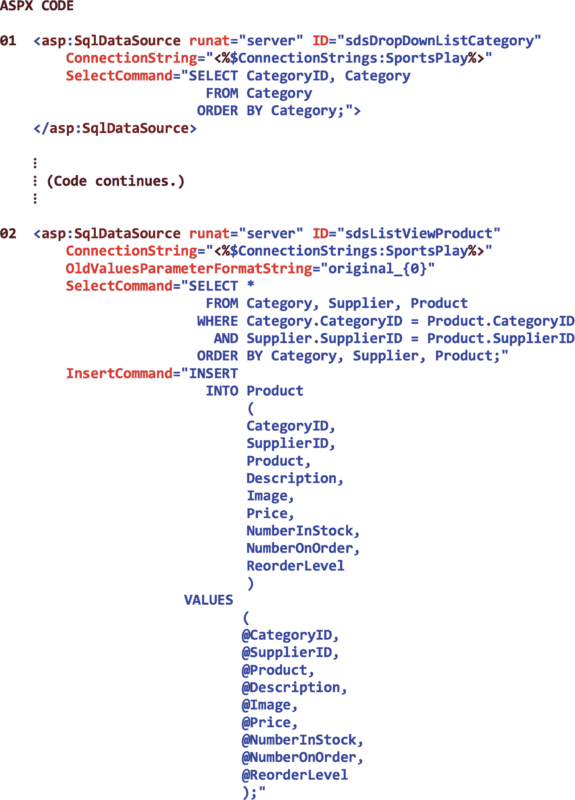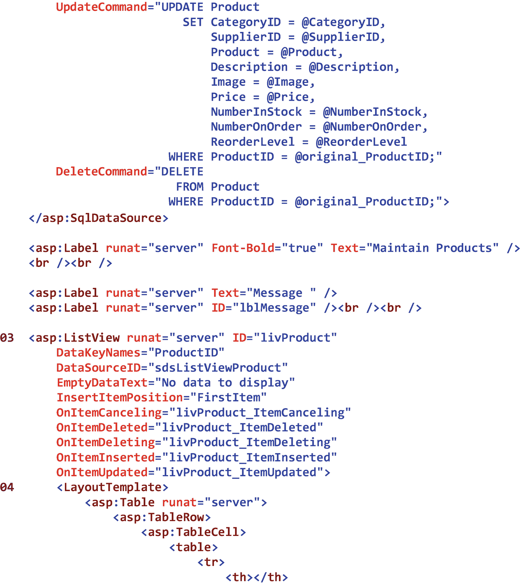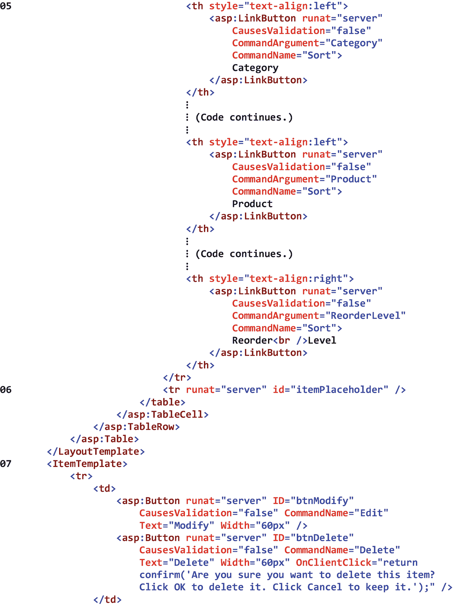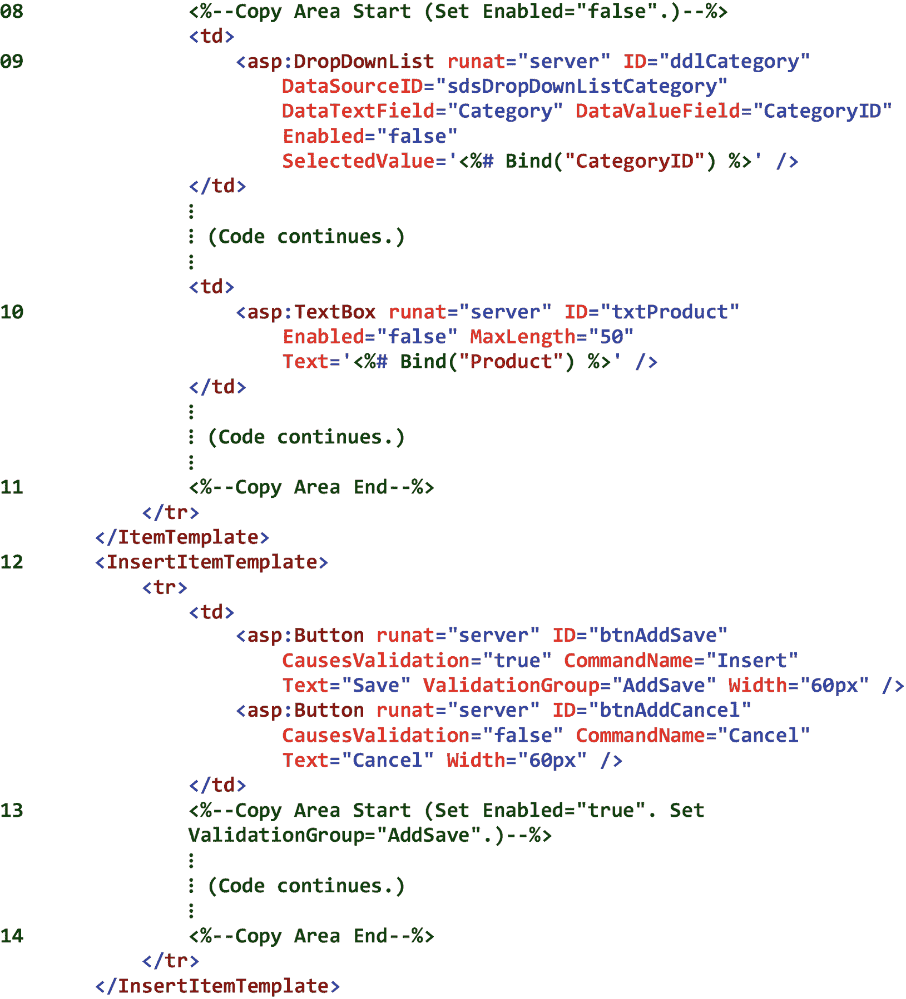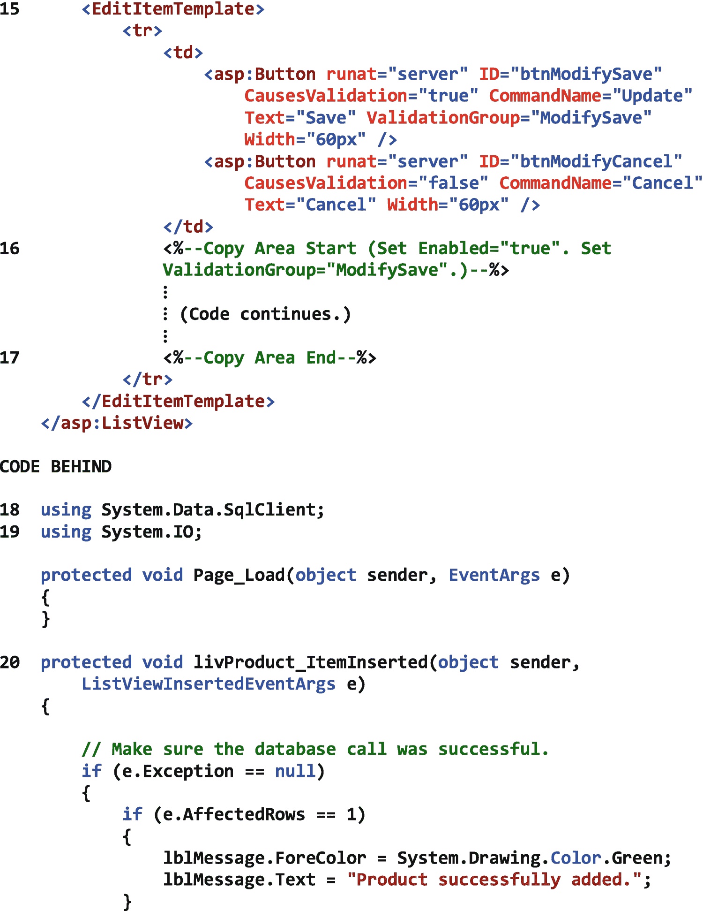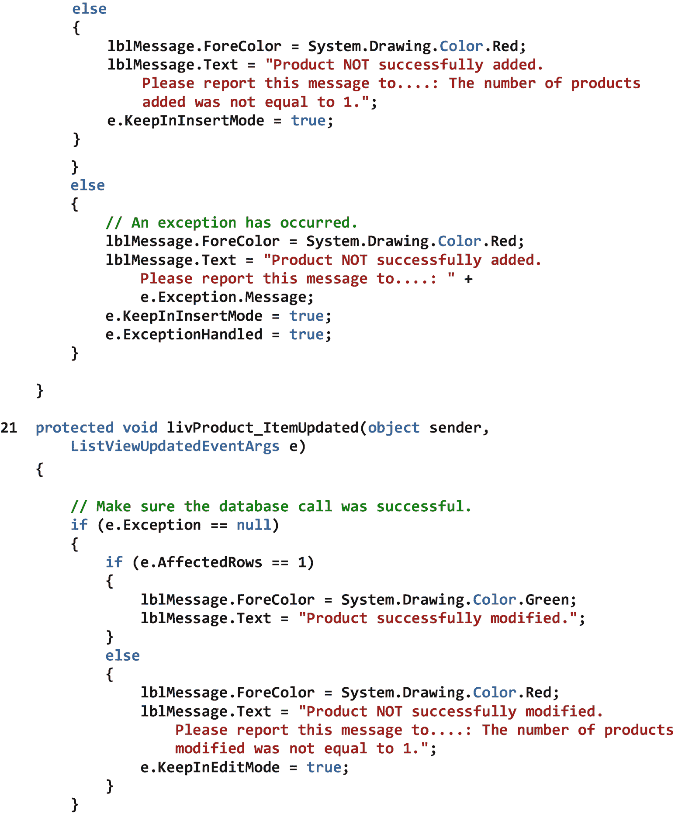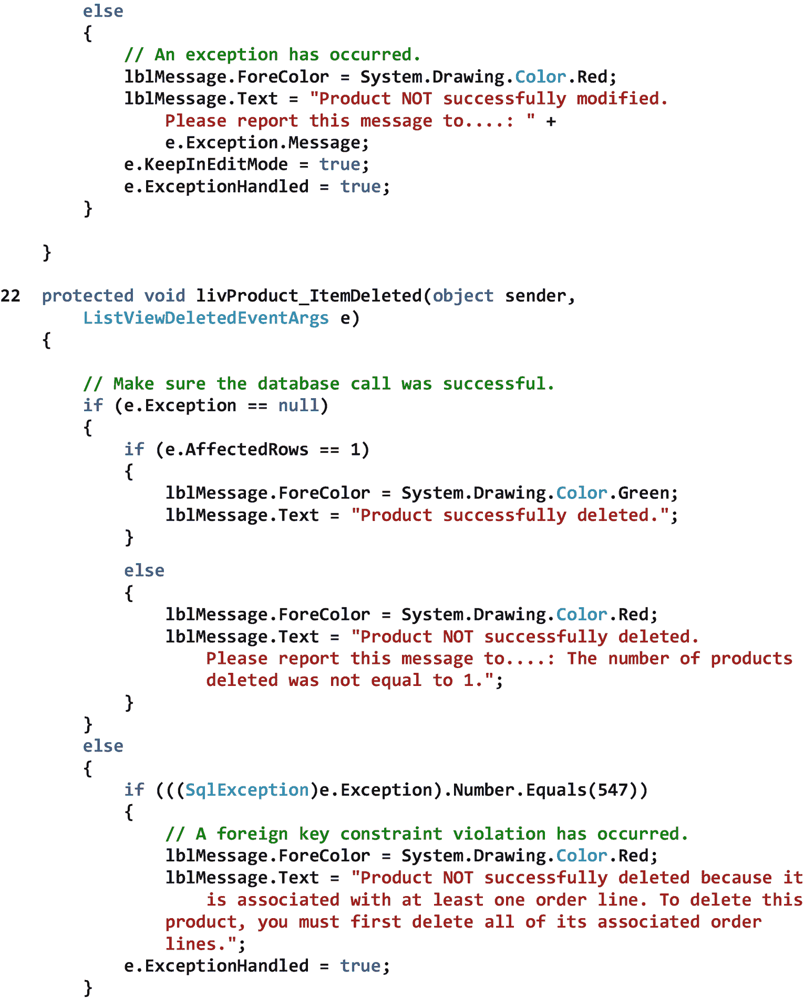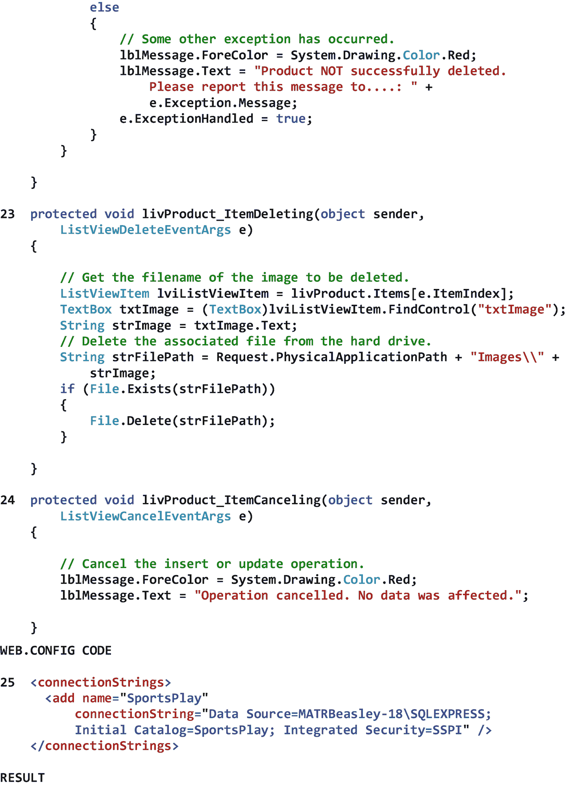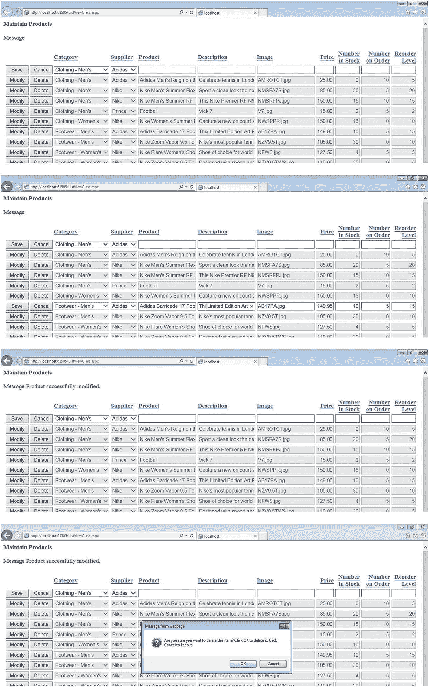

图 22-1

ListView 类的示例

## 22.3 DataPager 类

DataPager 类显示分页控件，最终用户可以使用这些控件来查看 ListView 控件(或其他可分页控件)的*数据页*。为了将 DataPager 控件与 ListView 控件相关联，我们将 DataPager 控件的 PagedControlID 属性设置为 ListView 控件的 ID 属性。为了设置要在单页数据中显示的 ListView 控件项数，我们设置了 DataPager 控件的 PageSize 属性。为了在 DataPager 控件中显示导航控件，我们将一个或多个*分页控件*添加到 DataPager 控件的 Fields 属性中。这些分页控件是 NextPreviousPagerField 控件、NumericPagerField 控件和 TemplatePagerField 控件。前两个分页控件将在稍后详细讨论。本章不讨论第三个分页控件。可以说，如果我们想定义自己的分页控件，可以利用 TemplatePagerField。表 [22-2](#Tab2) 显示了 DataPager 类的一些属性、方法和事件。

表 22-2

DataPager 类的一些属性、方法和事件

<colgroup><col class="tcol1 align-left"> <col class="tcol2 align-left"></colgroup> 
| **类**数据分页器T3】3T5】 |
| **命名空间**系统。网页控件 |
| **属性** |
| 菲尔茨 | 获取 DataPagerField 对象的集合，这些对象表示 DataPager 控件中指定的页导航字段。 |
| PagedControlID | 获取或设置控件的 ID，该控件包含 DataPager 控件将分页的数据。 |
| 页面大小 | 获取或设置每页数据显示的记录数。 |
| **方法** |
| (参见参考文献。) |   |
| **事件** |
| (参见参考文献。) |   |
| **参考** |
| [T2`https://msdn.microsoft.com/en-us/library/system.web.ui.webcontrols.datapager(v=vs.110).aspx`](https://msdn.microsoft.com/en-us/library/system.web.ui.webcontrols.datapager%2528v%253Dvs.110%2529.aspx) |

## 22.4 NextPreviousPagerField 类

NextPreviousPagerField 类显示 DataPager 控件中的导航控件，最终用户可以使用这些控件跳转到 ListView 控件的第*个*页，移动到 ListView 控件的*上一个*页，移动到 ListView 控件的*下一个*页，和/或跳转到 ListView 控件的*最后一个*页。为了指示要显示的按钮的类型，我们将控件的 ButtonType 属性设置为*按钮*、*图像*或*链接*。为了指定在按钮中显示的文本，我们设置了控件的 FirstPageText、PreviousPageText、NextPageText 和 LastPageText 属性。为了隐藏按钮，我们将控件的 ShowFirstPageButton、ShowPreviousPageButton、ShowNextPageButton 和 ShowLastPageButton 属性设置为 *false* 。表 [22-3](#Tab3) 显示了 NextPreviousPagerField 类的一些属性、方法和事件。

表 22-3

NextPreviousPagerField 类的一些属性、方法和事件

<colgroup><col class="tcol1 align-left"> <col class="tcol2 align-left"></colgroup> 
| **类**next previous page fieldT3】4T5】 |
| **命名空间**系统。网页控件 |
| **属性** |
| 按钮类型 | 获取或设置要在页导航字段中显示的按钮类型。 |
| 第一页文本 | 获取或设置为首页按钮显示的文本。 |
| LastPageText | 获取或设置为最后一页按钮显示的文本。 |
| 下一页 | 获取或设置为下一页按钮显示的文本。 |
| 前一页文本 | 获取或设置为“上一页”按钮显示的文本。 |
| ShowFirstPageButton | 获取或设置一个值，该值指示第一页按钮是否显示在 NextPreviousPagerField 对象中。 |
| ShowLastPageButton | 获取或设置一个值，该值指示最后一页按钮是否显示在 NextPreviousPagerField 对象中。 |
| 显示下一页按钮 | 获取或设置一个值，该值指示下一页按钮是否显示在 NextPreviousPagerField 对象中。 |
| 显示前一页按钮 | 获取或设置一个值，该值指示“上一页”按钮是否显示在 NextPreviousPagerField 对象中。 |
| **方法** |
| (参见参考文献。) |   |
| **事件** |
| (参见参考文献。) |   |
| **参考** |
| [T2`https://msdn.microsoft.com/en-us/library/system.web.ui.webcontrols.nextpreviouspagerfield(v=vs.110).aspx`](https://msdn.microsoft.com/en-us/library/system.web.ui.webcontrols.nextpreviouspagerfield%2528v%253Dvs.110%2529.aspx) |

图 [22-2](#Fig2) 显示了 DataPager 和 NextPreviousPagerField 类的一个例子。

注意在 01 处 DataPager 控件的 PagedControlID 属性被设置为 *livProduct* ，这是图 [22-1](#Fig1) 中从 03 处开始的 ListView 控件的 ID。还要注意，我们将在列表视图的每个页面中显示五个列表视图项目。

请注意 02 处控件的 Fields 属性。可以看出，这是一个包含单个 NextPreviousPagerField 控件的集合属性。

注意，在 03 处，*下一个*将被显示为下一个按钮，*上一个*将被显示为上一个按钮，并且由于控件的所有四个“显示”属性都被设置为*真*，因此 NextPreviousPagerField 控件将允许最终用户跳转到列表视图的*第一个*页面，移动到列表视图的*上一个*页面，移动到列表视图的*下一个*页面，并且

顺便说一下，图中分页选项从左到右的顺序是经过深思熟虑的。这种顺序对应于我们通常浏览书籍页面的方式，因此以这种方式显示选项将避免最终用户的困惑。

图中 Result 部分的屏幕截图显示了我们之前创建的列表视图与我们的 DataPager 控件及其关联的 NextPreviousPagerField 控件一起使用。

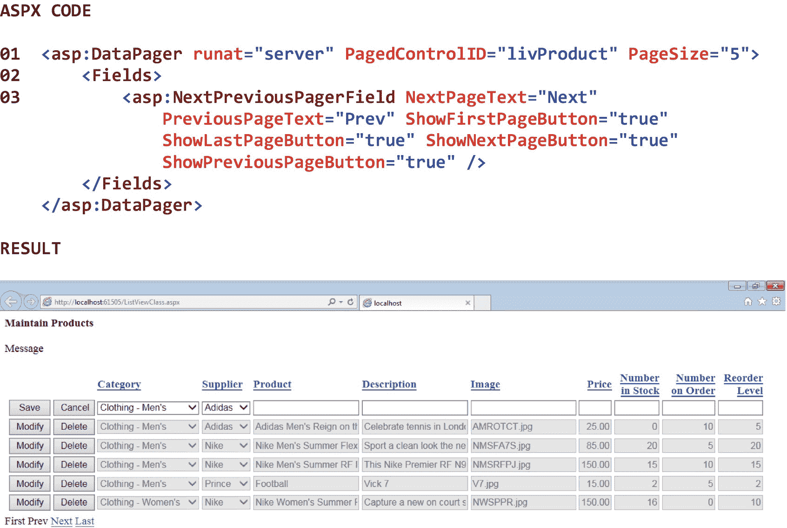

图 22-2

DataPager 和 NextPreviousPagerField 类的示例

## 22.5 NumericPagerField 类

NumericPagerField 类显示 DataPager 控件中的导航控件，最终用户可以使用这些控件通过页码选择 ListView 控件中的页面。为了指示要显示的按钮的类型，我们将控件的 ButtonType 属性设置为*按钮*、*图像*或*链接*。为了指示要显示的按钮数量，我们设置了控件的 ButtonCount 属性。表 [22-4](#Tab4) 显示了 NumericPagerField 类的一些属性、方法和事件。

表 22-4

NumericPagerField 类的一些属性、方法和事件

<colgroup><col class="tcol1 align-left"> <col class="tcol2 align-left"></colgroup> 
| **类**数字页面字段T3】5T5】 |
| **命名空间**系统。网页控件 |
| **属性** |
| 按钮计数 | 获取或设置要在 NumericPagerField 对象中显示的按钮数。 |
| 按钮类型 | 获取或设置要在页导航字段中显示的按钮类型。 |
| **方法** |
| (参见参考文献。) |   |
| **事件** |
| (参见参考文献。) |   |
| **参考** |
| [T2`https://msdn.microsoft.com/en-us/library/system.web.ui.webcontrols.numericpagerfield(v=vs.110).aspx`](https://msdn.microsoft.com/en-us/library/system.web.ui.webcontrols.numericpagerfield%2528v%253Dvs.110%2529.aspx) |

图 [22-3](#Fig3) 显示了 DataPager 和 NumericPagerField 类的一个例子。

注意在 01 处 DataPager 控件的 PagedControlID 属性被设置为 *livProduct* ，这是图 [22-1](#Fig1) 中从 03 处开始的 ListView 控件的 ID。还要注意，我们将在列表视图的每个页面中显示五个列表视图项目。

请注意 02 处控件的 Fields 属性。可以看出，这是一个集合属性，在两个 NextPreviousPagerField 控件之间包含一个 NumericPagerField 控件。请注意，我们将隐藏*第一个*next previous page field 控件的*最后一个*页面按钮和*下一个*页面按钮。还要注意，我们将隐藏第二个*next previous page field 控件的*第一个*页面按钮和*上一个*页面按钮。以这种方式隐藏按钮是必要的，这样 NextPreviousPagerField 控件和 NumericPagerField 控件的组合才有意义。*

请注意，在 03，我们将显示三个数字页面字段按钮。当 ListView 控件包含三个以上的数据页时，将用一个省略号(…)表示它们的存在。

图中 Result 部分的屏幕截图显示了我们之前创建的列表视图与我们的 DataPager 控件及其关联的 NextPreviousPagerField 控件和 NumericPagerField 控件一起使用。

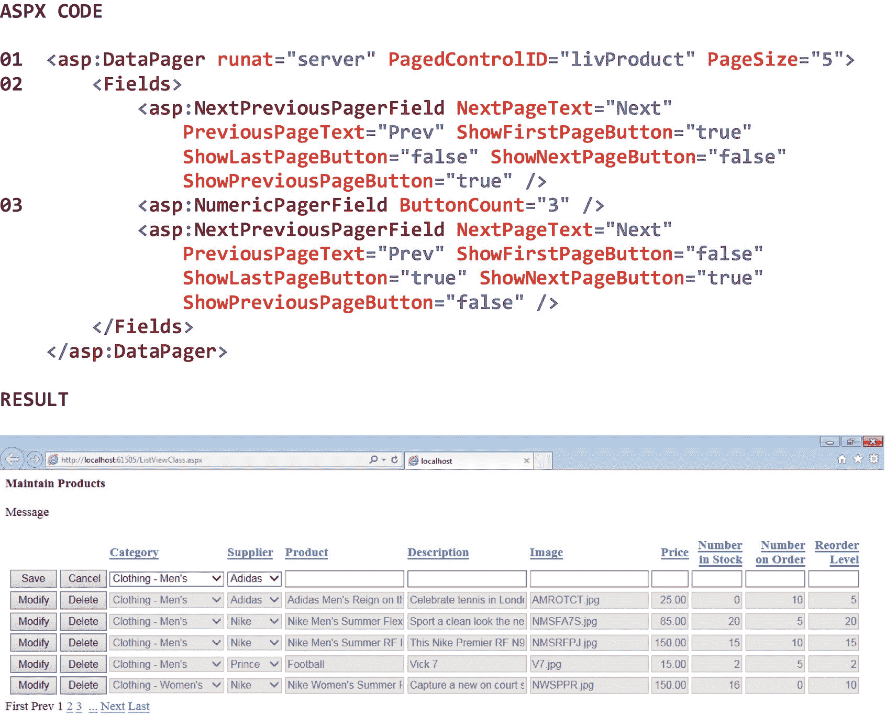

图 22-3

DataPager 和 NumericPagerField 类的示例

<aside aria-label="Footnotes" class="FootnoteSection" epub:type="footnotes">Footnotes [1](#Fn1_source)

所有属性、方法和事件描述都直接取自微软的官方文档。为了节省空间，省略了用于处理该类事件的事件处理程序方法。有关该类的所有方法，请参见参考。

  [2](#Fn2_source)

如果从硬盘上删除了产品的图像文件，并且数据库表删除不成功，则产品仍将存在于产品表中，但图像文件将不再存在于硬盘上。因此，可能需要一种更复杂的方法来保持两者同步。

  [3](#Fn3_source)

所有属性、方法和事件描述都直接取自微软的官方文档。为了节省空间，省略了用于处理该类事件的事件处理程序方法。有关该类的所有方法，请参见参考。

  [4](#Fn4_source)

所有属性、方法和事件描述都直接取自微软的官方文档。为了节省空间，省略了用于处理该类事件的事件处理程序方法。有关该类的所有方法，请参见参考。

  [5](#Fn5_source)

所有属性、方法和事件描述都直接取自微软的官方文档。为了节省空间，省略了用于处理该类事件的事件处理程序方法。有关该类的所有方法，请参见参考。

 </aside>