# 二十三、数据库操作背后的代码

## 23.1 导言

很多时候，需要建立到数据库的连接，并从页面后面的代码对数据库执行 SQL 命令。例如，我们可能要求最终用户单击显示按钮，在非数据绑定控件(如多行文本框)中显示他或她所在组织的客户的联系信息。或者，我们可能会要求最终用户输入他或她的登录凭据，然后单击登录按钮来访问他们应用的功能。在这两种情况下，我们都需要一个页面，通过页面代码中的按钮单击事件处理程序方法与数据库进行交互。

在本章中，我们将从查看 SqlConnection 类开始。此类定义、打开和关闭与 SQL Server 数据库的连接。接下来，我们将考虑 WebConfigurationManager 类，它提供对我们在 Web.config 文件中定义的连接字符串的访问，以便我们可以创建一个新的 SqlConnection 对象。之后，我们将讨论 SqlCommand 类。此类针对 SQL Server 数据库执行 SQL 命令(例如，Select、Insert、Update 和 Delete 命令)。然后我们将考虑 SqlDataReader 类。该类创建一个只读、只进的数据结构，该结构保存由 SqlCommand 对象检索的数据，以便我们可以一次读取和处理一行数据。接下来，我们将对比两种类型的 SQL 查询——非参数化查询和参数化查询。最后，我们将讨论存储过程，其中存储过程是存储在数据库中的一组一个或多个 SQL 语句。

## 23.2 SqlConnection 类

SqlConnection 类定义、打开和关闭与 SQL Server 数据库的连接。SqlConnection 对象的 ConnectionString 属性提供应用将使用的 SQL Server 数据库的详细信息。虽然连接字符串可以有多种形式，但我们在本章中使用的语法是

```cs
Data Source=Computer Name\SQL Server Instance; Initial Catalog=Database Name;
    Integrated Security=SSPI

```

其中斜体的项目是可修改的。在本书中，我们将把我们的连接字符串放在 Web.config 文件中，这样它可以在应用中的一个位置被修改，但也可以在应用中的多个位置被*引用*。因此，如果我们需要在不同的计算机上安装数据库，将数据库添加到不同的 SQL Server 实例， <sup>[1](#Fn1)</sup> 或者更改数据库的名称，我们只需要更改 Web.config 文件中的连接字符串。整个应用中对连接字符串的引用不需要修改。

ConnectionTimeout 属性表示应用在终止数据库连接尝试并生成错误之前应该等待的时间。最后，SqlCredential 属性表示数据库连接的凭证(即登录 ID 和密码)。在本章中，我们不要求我们的应用提供特殊的登录凭证来访问数据库。

重要的是要记住，一旦打开了与数据库的连接，当应用使用它时，它不会自动关闭。因此，我们必须小心关闭通过调用 SqlCommand 类的 close(或 Dispose)方法打开的任何连接。表 [23-1](#Tab1) 显示了 SqlConnection 类的一些属性、方法和事件。

表 23-1

SqlConnection 类的一些属性、方法和事件

<colgroup><col class="tcol1 align-left"> <col class="tcol2 align-left"></colgroup> 
| **类**SqlConnection<sup>T3】2T5】</sup> |
| **命名空间**系统。Data.SqlClient |
| **属性** |
| 连接字符串 | 获取或设置用于打开 SQL Server 数据库的字符串。 |
| 连接超时 | 获取在终止尝试并生成错误之前尝试建立连接时等待的时间。 |
| 凭据 | 获取或设置此连接的 SqlCredential 对象。 |
| **方法** |
| 关闭( ) | 关闭与数据库的连接。这是关闭任何打开的连接的首选方法。 |
| 打开( ) | 使用 ConnectionString 指定的属性设置打开数据库连接。 |
| **事件** |
| 信息消息 | 当 SQL Server 返回警告或信息性消息时发生。 |
| **参考** |
| [T2`https://msdn.microsoft.com/en-us/library/system.data.sqlclient.sqlconnection(v=vs.110).aspx`](https://msdn.microsoft.com/en-us/library/system.data.sqlclient.sqlconnection%2528v%253Dvs.110%2529.aspx) |

## 23.3 WebConfigurationManager 类

WebConfigurationManager 类提供对应用的 Web.config 文件中的信息的访问。在本章中，我们将需要访问在 Web.config 文件中定义的连接字符串，以便创建一个新的 SqlConnection 对象来打开和关闭与 SQL Server 数据库的连接。用于访问 Web.config 文件中存在的连接字符串的语法是

```cs
WebConfigurationManager.ConnectionStrings["Connection String Name"].ConnectionString

```

其中斜体的项目是 Web.config 文件的<connectionstrings>部分中连接字符串的名称。表 [23-2](#Tab2) 显示了 WebConfigurationManager 类的一些属性、方法和事件。</connectionstrings>

表 23-2

WebConfigurationManager 类

<colgroup><col class="tcol1 align-left"><col class="tcol2 align-left"></colgroup>
| **类**WebConfigurationManager<sup>[3](#Fn3)</sup> |
| **命名空间**系统。Web . Configuration |
| **属性** |
| connection strings | 获取网站的连接字符串。 |
| **方法** |
| (参见参考文献。) |  |
| **事件** |
| (参见参考。) |  |
| **参考** |
| [`https://msdn.microsoft.com/en-us/library/system.web.configuration.webconfigurationmanager(v=vs.110).aspx`](https://msdn.microsoft.com/en-us/library/system.web.configuration.webconfigurationmanager%2528v%253Dvs.110%2529.aspx) |

## 23.4 SqlCommand 类

SqlCommand 类对 SQL Server 数据库执行 SQL 命令。SqlCommand 对象包含几个方法，我们可以用它们来检索和操作数据库中的数据。这些方法包括 ExecuteScalar 方法、ExecuteReader 方法和 ExecuteNonQuery 方法。ExecuteScalar 方法检索由 SQL 查询返回的结果集的第一行的第一列。任何附加的列和行都会被忽略。当我们希望确定 SQL 查询是否至少返回一行数据时，或者当我们希望从 SQL 查询中检索单个聚合值(例如 average、sum)时，可以选择这种方法。ExecuteReader 方法加载一个 SqlDataReader 对象，这是一个只向前移动的只读数据结构，我们可以用它来处理 SQL 查询返回的整个结果集—一次一行。ExecuteNonQuery 方法执行插入、更新和删除命令。SQL Server 完成这些操作之一后，将返回受该操作影响的行数，以便我们可以确定操作的状态(例如，成功、不成功)。

SqlCommand 对象还包含许多我们可以用来描述对象性质的属性。CommandText 属性指示存储过程的名称、表的名称或包含 SQL 语句的字符串的名称。CommandType 属性指示如何解释 CommandText 属性。该属性可以设置为 *StoredProcedure* 、 *TableDirect* 或 *Text* (默认)。当 CommandType 属性设置为 *StoredProcedure* 时，我们将 CommandText 属性设置为 SQL Server 数据库中存储过程的名称。存储过程将在本章后面讨论。当 CommandType 属性设置为 *TableDirect* 时，我们将 CommandText 属性设置为 SQL Server 数据库中的一个表的名称。当 CommandType 属性设置为 *Text* 时，我们将 CommandText 属性设置为包含有效 SQL 命令的字符串。CommandTimeout 属性指示在终止命令尝试并生成错误之前，应用在尝试执行 SQL 命令时应等待的时间。最后，Connection 属性将 SqlCommand 对象与以前创建的 SqlConnection 对象相关联。表 [23-3](#Tab3) 显示了 SqlCommand 类的一些属性、方法和事件。

表 23-3

SqlCommand 类的一些属性、方法和事件

<colgroup><col class="tcol1 align-left"> <col class="tcol2 align-left"></colgroup> 
| **类**SqlCommand<sup>T3】4T5】</sup> |
| **命名空间**系统。Data.SqlClient |
| **属性** |
| 命令 | 获取或设置要在数据源上执行的 Transact-SQL 语句、表名或存储过程。 |
| 用法 | 获取或设置在终止执行命令的尝试并生成错误之前的等待时间。 |
| 命令类型 | 获取或设置一个值，该值指示如何解释 CommandText 属性。 |
| 关系 | 获取或设置 SqlCommand 的此实例使用的 SqlConnection。 |
| 因素 | 获取 SqlParameterCollection。 |
| **方法** |
| ExecuteNonQuery（ ） | 针对连接执行 Transact-SQL 语句，并返回受影响的行数。 |
| Reader() | 将 CommandText 发送到连接并生成一个 SqlDataReader。 |
| ExecuteScalar（ ） | 执行查询并返回查询返回的结果集中第一行的第一列。忽略附加的列或行。 |
| **事件** |
| 语句已完成 | Transact-SQL 语句执行完成时发生。 |
| **参考** |
| [T2`https://msdn.microsoft.com/en-us/library/system.data.sqlclient.sqlcommand(v=vs.110).aspx`](https://msdn.microsoft.com/en-us/library/system.data.sqlclient.sqlcommand%2528v%253Dvs.110%2529.aspx) |

## 23.5 SqlDataReader 类

SqlDataReader 类创建一个只向前移动的只读对象，该对象保存由 SqlCommand 对象的 ExecuteReader 方法检索的数据。这个对象类似于一组数据库表行，我们可以从中读取(一次一行),就像从实际的表中读取行一样。为了从数据读取器中读取一行数据(并移动到下一行数据)，我们调用 SqlDatareader 对象的 Read 方法。由于 SqlDataReader 对象是只向前移动的数据结构，因此一旦读取了一行，就不能移动到数据读取器中的上一行。由于 SqlDataReader 对象是只读数据结构，因此我们不能更改数据读取器中的数据。

重要的是要记住，当应用使用 SqlDataReader 对象时，它是自动关闭的。因此，我们必须小心地通过调用 SqlDataReader 对象的 close 方法来关闭任何已打开的数据读取器。表 [23-4](#Tab4) 显示了 SqlDataReader 类的一些属性、方法和事件。

表 23-4

SqlDataReader 类的一些属性、方法和事件

<colgroup><col class="tcol1 align-left"> <col class="tcol2 align-left"></colgroup> 
| **类**sqldata reader<sup>T3】5T5】</sup> |
| **命名空间**系统。Data.SqlClient |
| **属性** |
| (参见参考文献。) |   |
| **方法** |
| 关闭( ) | 关闭 SqlDataReader 对象。 |
| 阅读( ) | 将 SqlDataReader 前进到下一条记录。 |
| **事件** |
| (参见参考文献。) |   |
| **参考** |
| [T2`https://msdn.microsoft.com/en-us/library/system.data.sqlclient.sqldatareader(v=vs.110).aspx`](https://msdn.microsoft.com/en-us/library/system.data.sqlclient.sqldatareader%2528v%253Dvs.110%2529.aspx) |

图 23-1 显示了一个 SqlDataReader 类的例子。此示例中的 SqlDataReader 对象将保存返回客户列表的查询结果。

请注意 01 处的系统。数据命名空间已添加到 using 指令列表中(出现在文件后代码的顶部),以避免指定 CommandType 类的完全限定名(即 System。Data.CommandType)每次我们想使用它的一个枚举——*stored procedure*、 *TableDirect* 或者 *Text* 。

请注意 02 处的系统。Data.SqlClient 命名空间也被添加到 using 指令列表中。这样做是为了不要求我们指定 SqlConnection 类的完全限定名(即 System。Data.SqlClient.SqlConnection)、SqlCommand 类(即系统。Data.SqlClient.SqlCommand)和 SqlDataReader 类(即 System。Data.SqlClient.SqlDataReader)每次都要使用它们各自的属性或方法之一。

注意 03 时系统。Web.Configuration 命名空间已添加到 using 指令列表中，以避免需要指定 WebConfigurationManager 类的完全限定名(即 System。web . configuration . webconfigurationmanager)每次我们想要使用它的一个属性时。

请注意 04–05，我们正在构建一个 SQL Select 命令。该命令将返回 customer 表中每个客户的姓氏、名字、中间名和电话号码，并按姓氏、名字和中间名对这些客户进行排序。如前所述，该查询的结果将存储在一个 SqlDataReader 对象中，我们将从该对象中读取并显示每个客户的数据—一次一行。

请注意，在 06，我们正在定义到 SQL Server 数据库的网络连接。可以看到，这个连接是在 Web.config 文件的< connectionStrings >部分的 *SportsPlay* 连接字符串中定义的。

请注意，在 07–08，我们正在创建一个新的 SqlCommand 对象，并通过设置其 Connection、CommandType 和 CommandText 属性为其执行做好准备。

请注意，在 09–10，我们正在打开到 SQL Server 数据库的连接，创建一个新的 SqlDataReader 对象，并使用 04–05 定义的 Select 命令的结果加载它。

请注意，在第 11 行，我们使用 SqlDataReader 对象的 Read 方法从数据读取器中检索行——同时还有要读取的数据行。对于从数据读取器返回的每一行数据，我们将客户的姓、名、中间名和电话号码(以及一些格式化标点符号和换行符)附加到 txtCustomers 对象的 Text 属性中。

请注意，在 12–13 页，我们关闭了数据读取器和与数据库的连接，因为这些不是自动完成的。

请注意，在 14 处，我们在 Web.config 文件中添加了一个<connectionstrings>部分，以及一个名为 *SportsPlay* 的连接字符串。此连接字符串提供 SQL Server 数据库的详细信息，SqlConnection 对象将在 06 使用该数据库。有关该连接字符串的详细描述，请参见第 [20](20.html) 章，标题为“数据库设计、SQL 和数据绑定*、*”。</connectionstrings>

图中结果部分的屏幕截图显示了单击 Display 按钮显示按字母顺序排列的客户列表的结果。

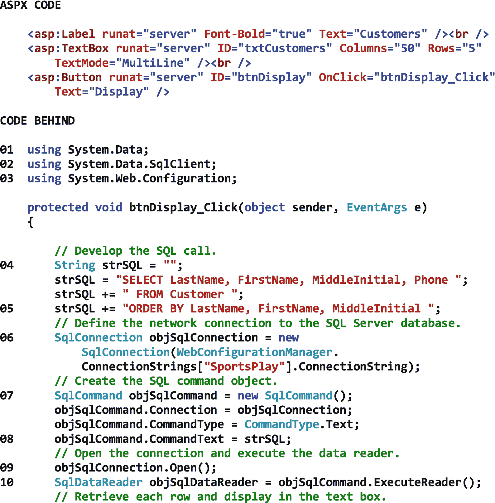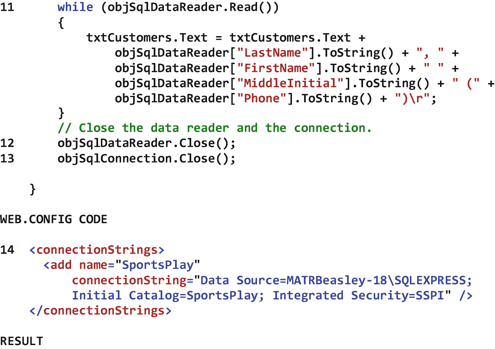T2】

图 23-1

SqlDataReader 类的示例

## 23.6 非参数化查询

通常有必要为 SQL 查询的 Where 子句提供一个或多个输入参数，以限制查询返回的行数。一种方法是构造并执行一个*非参数化查询*。在最终用户提供必要的输入参数参数后，非参数化查询以编程方式在代码中构造。更具体地说，非参数化查询是在*运行时*通过将 SQL 调用的 Where 子句与最终用户提供的任何输入连接起来构建的。

关于非参数化查询的构造和执行，应该事先声明一个警告:从安全角度来看，它们可能非常有问题。在这一章的下一节会有更多的介绍。尽管我们通常不希望使用非参数化查询，但是我们在这里讨论它们有两个原因。首先，讨论它们将有助于我们说明非参数化查询和参数化查询之间的区别。其次，讨论它们将帮助我们发现现有代码中的非参数化查询，以便我们可以纠正潜在的安全风险。

图 [23-2](#Fig2) 显示了一个非参数化查询的例子。该查询用于验证员工的登录凭据。

请注意 01 和 02，终端用户将分别提供电子邮件地址和密码。这些项将用于构造我们的非参数化查询。

注意 03 时系统。数据命名空间已被添加到 using 指令列表中(出现在文件后面的代码的顶部),因此我们不必指定 CommandType 类的完全限定名(即 System。Data.CommandType)每次我们想使用它的一个枚举——*stored procedure*、 *TableDirect* 或者 *Text* 。

注意在 04 系统。Data.SqlClient 命名空间也被添加到 using 指令列表中。这样做是为了避免指定 SqlConnection 类的完全限定名(即 System。Data.SqlClient.SqlConnection)、SqlCommand 类(即系统。Data.SqlClient.SqlCommand)和 SqlDataReader 类(即 System。Data.SqlClient.SqlDataReader)每次都要使用它们各自的属性或方法之一。

注意在 05 系统。Web.Configuration 命名空间已经添加到 using 指令列表中，因此我们不需要指定 WebConfigurationManager 类的完全限定名(即 System。web . configuration . webconfigurationmanager)每次我们想要使用它的一个属性时。

请注意 06–07，我们正在使用最终用户提供的电子邮件地址和密码构建一个*动态* SQL Select 命令。这里，我们将 Select 语句的 Where 子句与最终用户的电子邮件地址和密码连接在一起。

请注意，在 08，我们正在定义到 SQL Server 数据库的网络连接。可以看到，这个连接是在 Web.config 文件的< connectionStrings >部分的 *SportsPlay* 连接字符串中定义的。

请注意，在 09–10，我们正在创建一个新的 SqlCommand 对象，并通过设置其 Connection、CommandType 和 CommandText 属性为其执行做好准备。

请注意，在 11–13 中，我们打开了与 SQL Server 数据库的连接，创建了一个新的 SqlDataReader 对象，用 06–07 中定义的 Select 命令的结果加载它，并尝试使用 SqlDataReader 对象的 Read 方法从数据读取器中检索一行。如果从数据读取器中检索到一行，这表明在 Employee 表中找到了终端用户*和*,我们将他或她的 EmployeeID 保存到一个会话变量中(这样我们就可以识别谁在后续页面中登录)并显示一条欢迎消息。如果从数据读取器中检索到的行是*而不是*，这表明在雇员表中找到的最终用户是*而不是*，我们将显示一条错误消息。

请注意，在 14–15 中，我们关闭了数据读取器和与数据库的连接，因为这些都不是自动完成的。

注意，在 16 处，我们在 Web.config 文件中添加了一个<connectionstrings>部分，以及一个名为 *SportsPlay* 的连接字符串。此连接字符串提供 SQL Server 数据库的详细信息，SqlConnection 对象将在 08 使用该数据库。请参见第 [20](20.html) 章，标题为“数据库设计、SQL 和数据绑定”，以获取此连接字符串的详细描述。</connectionstrings>

图中结果部分的第一个屏幕截图显示终端用户输入了一个无效的*电子邮件地址和密码组合。第二个屏幕截图显示了由于输入无效组合而显示的错误消息。第三个屏幕截图显示了最终用户输入一个有效的*电子邮件地址和密码组合。第四个屏幕截图显示了输入有效组合后显示的欢迎消息。**

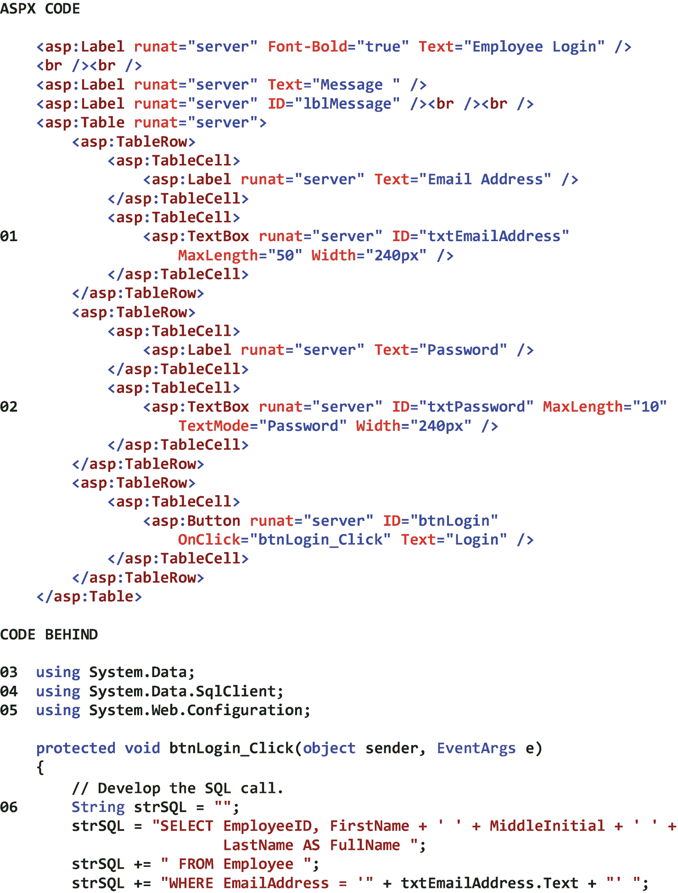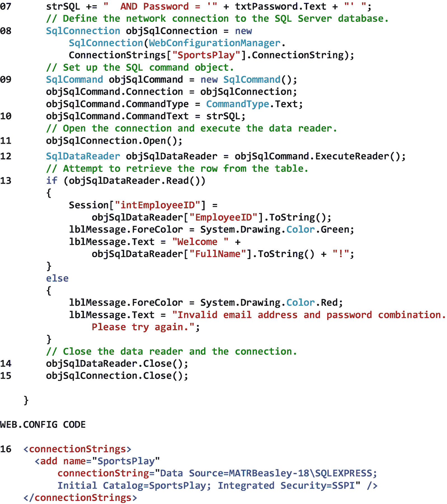T2】

图 23-2

非参数化查询的示例

## 23.7 参数化查询

在上一节中，我们讨论了非参数化查询的概念。我们说过，在最终用户提供必要的输入参数后，非参数化查询是以编程方式在代码中构造的。虽然非参数化查询可以工作，但是它们存在一个潜在的问题，即它们不能抵御一种常见的安全威胁，称为 *SQL 注入*。

一种类型的 SQL 注入发生在具有恶意意图的终端用户将 SQL 调用输入(即，*将*注入)登录页面的文本框字段(例如，电子邮件地址字段和密码字段)，从而允许他或她获得对应用功能的访问。这是通过欺骗应用认为终端用户输入了有效的登录凭证来实现的。另一种类型的 SQL 注入发生在终端用户向文本框字段中输入 SQL 调用时，该调用允许他或她向应用的数据库添加数据(通过 SQL Insert 命令)、修改应用的数据库中的数据(通过 SQL Update 命令)、从应用的数据库中删除数据(通过 SQL Delete 命令)、修改应用的数据库中的表的结构(通过 SQL Alter 命令)、从应用的数据库中删除表(通过 SQL Drop 命令)或者以其他方式破坏应用的数据库中的数据。这是通过欺骗应用执行 SQL 命令来实现的。

SQL 注入工作是因为当 SQL 调用以编程方式构建时(即，SQL 调用通过将 SQL 调用的部分与最终用户的输入连接在一起而在*运行时*构建)，SQL 调用在提交给 DBMS 执行之前被动态改变。然而，当使用*参数化查询*时，SQL 调用是静态*构造的*(即，SQL 调用是在*设计时*使用预定义参数构建的)。因此，在提交给 DBMS 执行之前，SQL 调用是*而不是*动态更改的。因此，当使用参数化查询时，打算用于 SQL 注入的字符串将*总是*并且*仅*被解释为 SQL 调用的输入参数。

可以看出，在开发调用数据库的软件应用时，构造参数化查询(而不是非参数化查询)非常重要。在我们能够在 ASP.NET 中构造这样的查询之前，我们需要对另外两个类有一个基本的了解 SqlParameterCollection 类和 SqlParameter 类。接下来将讨论这些类。

### SqlParameterCollection 类

SqlParameterCollection 类定义与 SqlCommand 对象关联的参数集合。SqlParameterCollection 对象的 Add 方法将 SqlParameter 对象添加到 SqlParameterCollection，而 AddWithValue 方法将 SqlParameter 对象及其关联的参数值添加到 SqlParameterCollection 对象。表 [23-5](#Tab5) 显示了 SqlParameterCollection 类的一些属性、方法和事件。

表 23-5

SqlParameterCollection 类的一些属性、方法和事件

<colgroup><col class="tcol1 align-left"> <col class="tcol2 align-left"></colgroup> 
| **类**SqlParameterCollection<sup>T3】6T5】</sup> |
| **命名空间**系统。Data.SqlClient |
| **属性** |
| (参见参考文献。) |   |
| **方法** |
| 添加(对象) | 将指定的 SqlParameter 对象添加到 SqlParameterCollection。 |
| AddWithValue（String， Object） | 向 SqlParameterCollection 的末尾添加一个值。 |
| **事件** |
| (参见参考文献。) |   |
| **参考** |
| [T2`https://msdn.microsoft.com/en-us/library/system.data.sqlclient.sqlparametercollection(v=vs.110).aspx`](https://msdn.microsoft.com/en-us/library/system.data.sqlclient.sqlparametercollection%2528v%253Dvs.110%2529.aspx) |

### 23 . 7 . 2 SQL 参数类

SqlParameter 类在 SqlParameterCollection 对象中定义单个参数。SqlParameter 对象的 Direction 属性指示参数是仅输入、仅输出、双向还是从存储过程返回的值。ParameterName 属性指示参数的名称，SqlDbType 属性指示参数的数据类型。SqlDbTypes 包括 Bit、Char、Date、Decimal、Float、Int、Money、NVarChar、SmallInt、Text 和 TinyInt。许多其他 SqlDbTypes 也是可用的。表 [23-6](#Tab6) 显示了 SqlParameter 类的一些属性、方法和事件。

表 23-6

SqlParameter 类的一些属性、方法和事件

<colgroup><col class="tcol1 align-left"> <col class="tcol2 align-left"></colgroup> 
| **类**SqlParameter<sup>T3】7T5】</sup> |
| **命名空间**系统。Data.SqlClient |
| **属性** |
| 方向 | 获取或设置一个值，该值指示参数是仅输入、仅输出、双向还是存储过程返回值参数。 |
| 参数名 | 获取或设置 SqlParameter 的名称。 |
| 类型 | 获取或设置参数的 SqlDbType。 |
| **方法** |
| (参见参考文献。) |   |
| **事件** |
| (参见参考文献。) |   |
| **参考** |
| [T2`https://msdn.microsoft.com/en-us/library/system.data.sqlclient.sqlparameter(v=vs.110).aspx`](https://msdn.microsoft.com/en-us/library/system.data.sqlclient.sqlparameter%2528v%253Dvs.110%2529.aspx) |

图 [23-3](#Fig3) 显示了一个参数化查询的例子。该查询用于验证员工的登录凭据。

请注意 01 和 02，终端用户将分别提供电子邮件地址和密码。这些项目将用于构造我们的参数化查询。

注意 03 时系统。数据命名空间已添加到 using 指令列表中(出现在文件后代码的顶部),以避免指定 CommandType 类的完全限定名(即 System。Data.CommandType)每次我们想使用它的一个枚举——*stored procedure*、 *TableDirect* 或者 *Text* 。

注意在 04 系统。Data.SqlClient 命名空间也被添加到 using 指令列表中。这样做是为了我们不必指定 SqlConnection 类的完全限定名(即 System。Data.SqlClient.SqlConnection)、SqlCommand 类(即系统。Data.SqlClient.SqlCommand)和 SqlDataReader 类(即 System。Data.SqlClient.SqlDataReader)每次都要使用它们各自的属性或方法之一。

注意在 05 系统。Web.Configuration 命名空间已添加到 using 指令列表中，以避免指定 WebConfigurationManager 类的完全限定名(即 System。web . configuration . webconfigurationmanager)每次我们想要使用它的一个属性时。

请注意，在 06–07，我们正在构建一个*静态* SQL Select 命令。也就是说，我们正在使用电子邮件地址和密码参数对我们的选择命令*的结构进行完全编码，这些参数由符号* (@)处的*指定。这样，最终用户提供的参数将*总是*并且*仅*被解释为 SQL 调用的 Where 子句的参数。因此，举例来说，如果一个怀有恶意的最终用户试图通过将一个 *Drop* 命令注入到页面的电子邮件地址字段中来从数据库中删除一个表，单词“Drop”将被简单地解释为用于查找目的的电子邮件地址。*

请注意，在 08，我们正在定义到 SQL Server 数据库的网络连接。可以看到，这个连接是在 Web.config 文件的< connectionStrings >部分的 *SportsPlay* 连接字符串中定义的。

请注意，在 09–10，我们正在创建一个新的 SqlCommand 对象，并通过设置其 Connection、CommandType 和 CommandText 属性为其执行做好准备。

请注意，在 11–12 中，我们获取了最终用户提供的电子邮件地址和密码，并将它们作为输入参数添加到我们的 SqlCommand 对象中。这些代码行中的@符号对应于 06–07 的 Where 子句中的@符号。

请注意，在 13–14 中，我们打开了与 SQL Server 数据库的连接，创建了一个新的 SqlDataReader 对象，用 06–07 中定义的 Select 命令的结果加载它，并尝试使用 SqlDataReader 对象的 Read 方法从数据读取器中检索一行。如果从数据读取器中检索到一行，这表明在 Employee 表中找到了终端用户*和*,我们将他或她的 EmployeeID 保存到一个会话变量中(这样我们就可以识别谁在后续页面中登录)并显示一条欢迎消息。如果从数据读取器中检索到的行是*而不是*，这表明在雇员表中找到的最终用户是*而不是*，我们将显示一条错误消息。

请注意，在 15–16 中，我们关闭了数据读取器和与数据库的连接，因为这些不是自动完成的。

请注意，在第 17 页，我们在 Web.config 文件中添加了一个<connectionstrings>部分，以及一个名为 *SportsPlay* 的连接字符串。此连接字符串提供 SQL Server 数据库的详细信息，SqlConnection 对象将在 08 使用该数据库。请参见第 [20](20.html) 章，标题为“数据库设计、SQL 和数据绑定”，以获取此连接字符串的详细描述。</connectionstrings>

图中结果部分的第一个屏幕截图显示终端用户输入了一个无效的*电子邮件地址和密码组合。第二个屏幕截图显示了由于输入无效组合而显示的错误消息。第三个屏幕截图显示了最终用户输入一个有效的*电子邮件地址和密码组合。第四个屏幕截图显示了输入有效组合后显示的欢迎消息。**

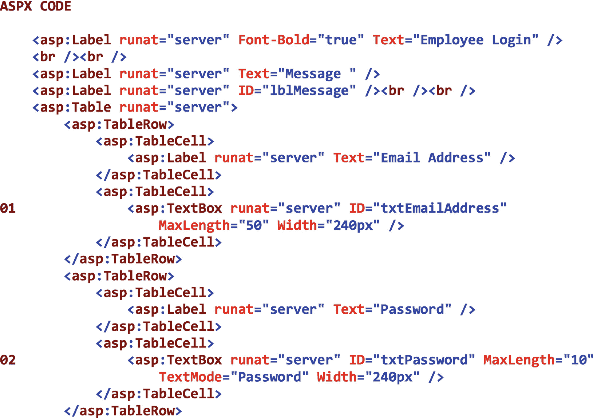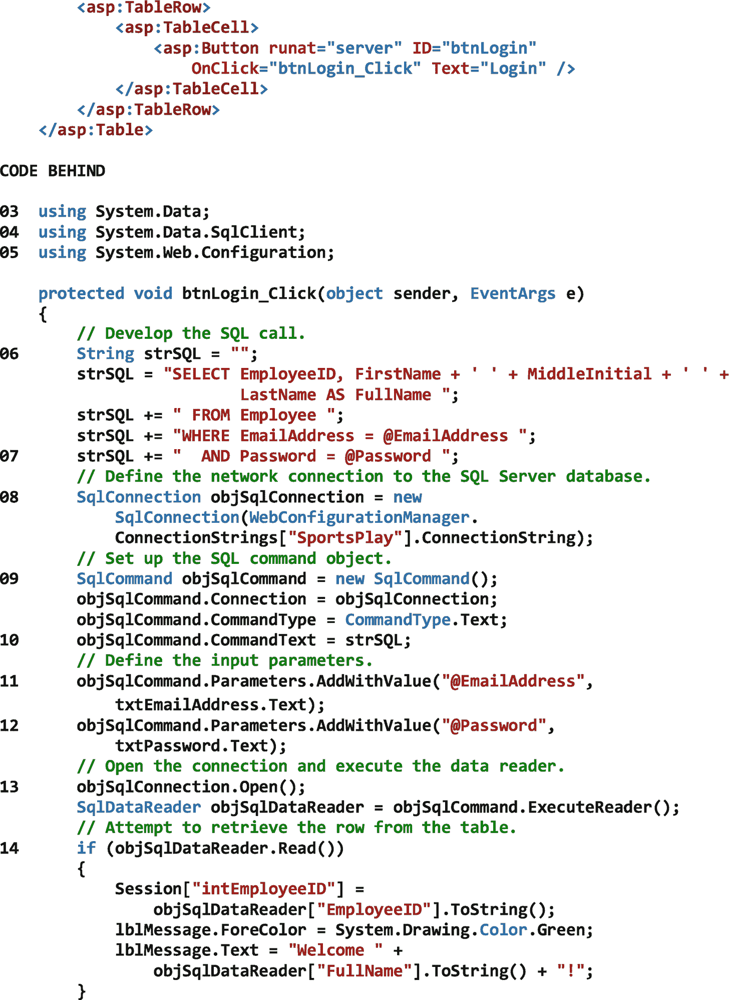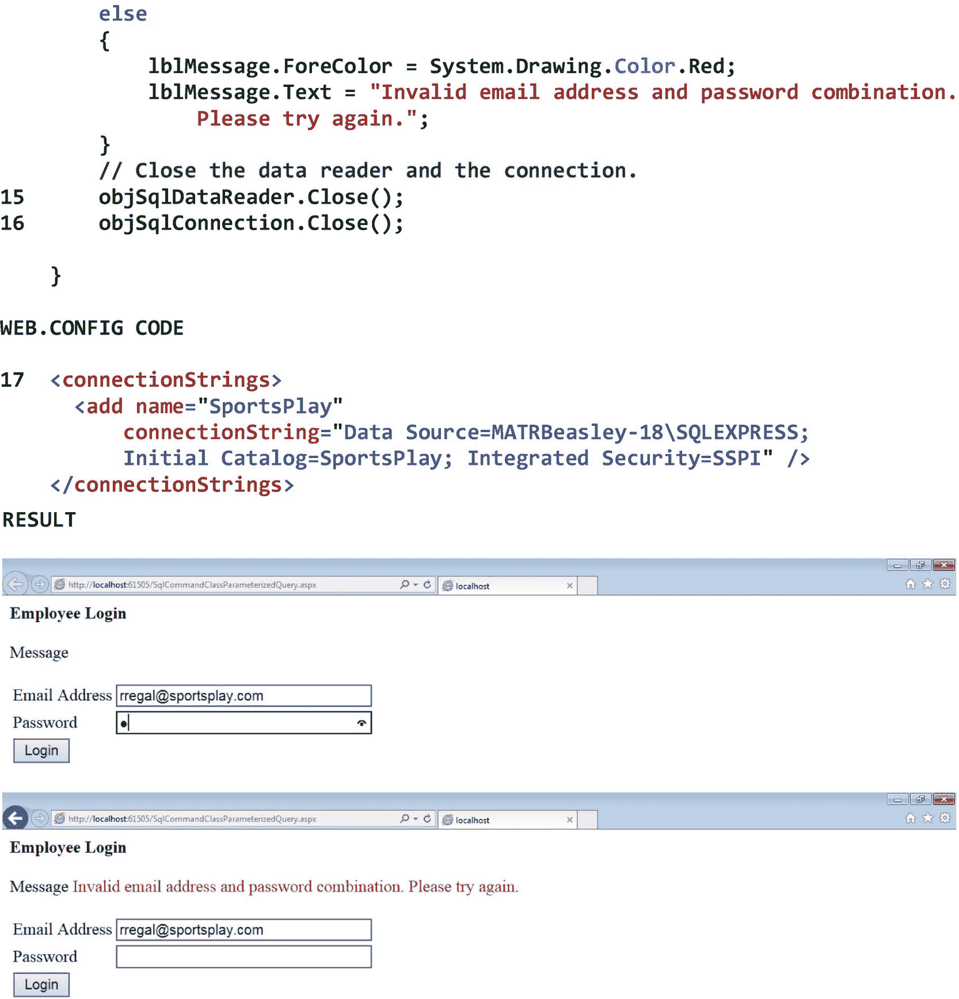T3】

图 23-3

参数化查询的示例

## 23.8 存储过程

存储过程是包含一个或多个 SQL 命令的独立文件。与我们目前看到的 SQL 命令(嵌入在 Aspx 和 C# 源代码中)不同，存储过程中的 SQL 命令驻留在数据库服务器的数据库中。与其他软件组件一样，存储过程可以从其他软件组件调用，可以接受输入参数，可以执行编程操作，可以返回输出参数，也可以调用其他软件组件。

将 SQL 命令存储在存储过程中至少有三个优点(相对于将它们嵌入源代码)。首先，由于存储过程允许我们将 SQL 命令存储在一个位置(即，在数据库中)，因此当必须从多个位置执行相同的 SQL 命令时，它们消除了重复的代码。可以想象，这种方法最大限度地提高了代码的重用性，并且使得更改一个 SQL 命令或一组 SQL 命令更加有效，因为只需要进行一次更改。第二，由于驻留在存储过程中的 SQL 命令被解析和优化一次(当它们被创建时)并且被编译一次(当它们被第一次使用时)，它们的执行速度比嵌入在源代码中的 SQL 命令快得多，后者在每次使用时都被解析、优化和编译。第三，由于存储过程中的 SQL 命令已经在数据库服务器上，它们产生的网络流量比嵌入源代码中的 SQL 命令少，因为后者必须通过网络连接从应用服务器发送到数据库服务器。

当然，在源代码中嵌入 SQL 命令也有好处。首先，当 SQL 命令嵌入到源代码中时，我们更容易编写、修改和测试我们的源代码，因为所有的源代码(例如 ASP.NET、C# 和 SQL)的*都可以在单个开发应用(例如 Visual Studio)中获得。因此，当编码和测试时，我们不需要在两个开发应用(例如，Visual Studio 和 SQL Server Management Studio)之间切换。其次，当 SQL 命令嵌入到源代码中时，我们能够一行一行地遍历源代码，观察给定的 SQL 命令是如何动态构造的——假设我们使用的是像 Visual Studio 这样的现代 IDE。*

底线是，虽然这两种方法各有优势，但没有一种方法在所有情况下总是更好。因此，在决定将 SQL 命令存储在存储过程中还是嵌入到源代码中时，权衡这些方法的相对优势是一个好主意。

图 [23-4](#Fig4) 显示了一个执行查询的 SQL Server 存储过程的例子。该查询用于验证员工的登录凭据。

请注意，在 01，这个存储过程由 SportsPlay 数据库使用。

请注意 02 处存储过程的注释部分。本节说明了过程的编写人、过程的创建时间以及过程的作用。如果要修改该程序，我们还将在本节中指出谁修改了该程序，何时修改了该程序，以及修改的性质是什么。

请注意 03 处存储过程的名称。顾名思义，此过程将用于员工登录 SportsPlay 应用。

请注意 04–05，我们为存储过程定义了两个*输入*参数——email address 和 Password。可以看到，这些参数前面有 at 符号(@)。这些参数的参数将从调用该过程的页面的代码中接收。

请注意 06 处的 SQL Select 语句，该语句将被执行以验证员工的登录凭证，该凭证基于他或她提供的电子邮件地址和密码。请注意，在语句的 Where 子句中，这两项前面有 at 符号(@)。这些项目直接对应于先前定义的输入参数。

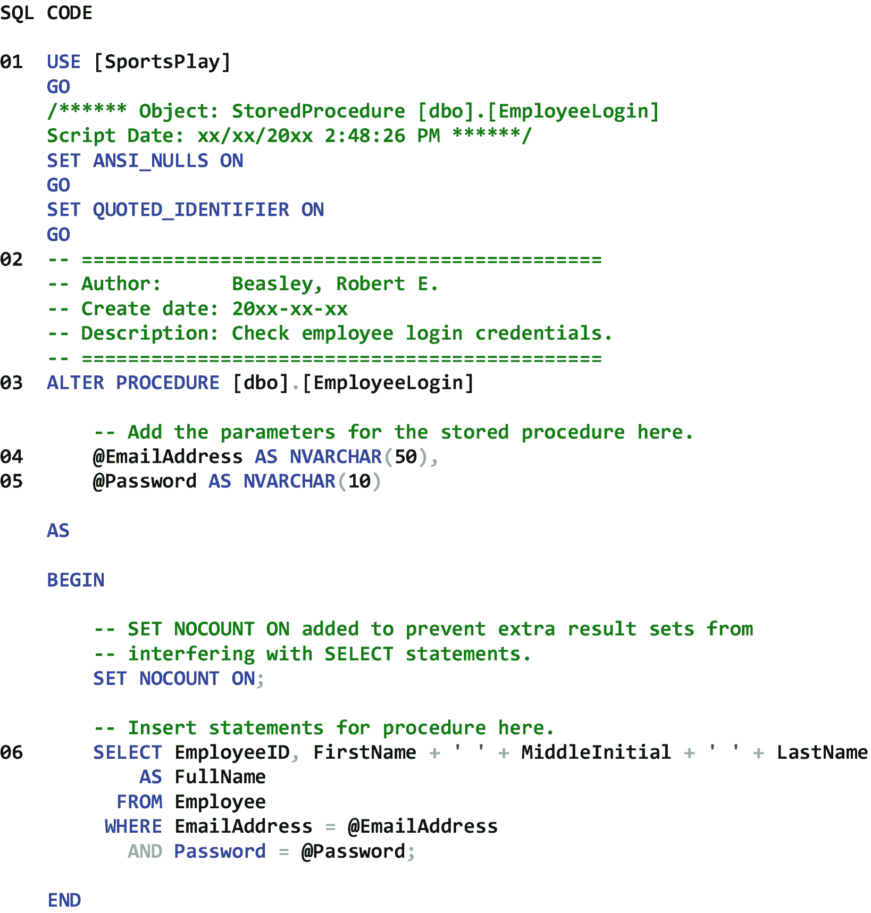

图 23-4

执行查询的 SQL Server 存储过程示例

图 [23-5](#Fig5) 显示了一个调用执行查询的存储过程的例子。注意，本例中调用的存储过程与刚刚描述的存储过程相同(参见图 [23-4](#Fig4) )。

请注意 01 和 02，终端用户将分别提供电子邮件地址和密码。

注意 03 时系统。数据命名空间已添加到 using 指令列表中(出现在文件后代码的顶部),因此我们不需要指定 CommandType 类的完全限定名(即 System。Data.CommandType)每次我们想使用它的一个枚举——*stored procedure*、 *TableDirect* 或者 *Text* 。

注意在 04 系统。Data.SqlClient 命名空间也被添加到 using 指令列表中。这样做是为了避免指定 SqlConnection 类的完全限定名(即 System。Data.SqlClient.SqlConnection)、SqlCommand 类(即系统。Data.SqlClient.SqlCommand)和 SqlDataReader 类(即 System。Data.SqlClient.SqlDataReader)每次都要使用它们各自的属性或方法之一。

注意在 05 系统。Web.Configuration 命名空间已经添加到 using 指令列表中，因此我们不必指定 WebConfigurationManager 类的完全限定名(即 System。web . configuration . webconfigurationmanager)每次我们想要使用它的一个属性时。

请注意，在 06，我们正在定义到 SQL Server 数据库的网络连接。可以看到，这个连接是在 Web.config 文件的< connectionStrings >部分的 *SportsPlay* 连接字符串中定义的。

请注意，在 07–08，我们正在创建一个新的 SqlCommand 对象，并通过照常设置其 Connection 属性来准备执行它。然而，由于我们将调用一个存储过程来验证最终用户的登录凭证，我们将 CommandType 属性设置为 *StoredProcedure* 并将 CommandText 属性设置为 *EmployeeLogin* ，这是我们将要执行的存储过程的名称(参见图 [23-4](#Fig4) )。

请注意，在 09–10，我们获取最终用户提供的电子邮件地址和密码，并将它们作为输入参数添加到我们的 SqlCommand 对象中。

请注意，在 11–12 中，我们打开了与 SQL Server 数据库的连接，创建了一个新的 SqlDataReader 对象，用存储过程中定义的 Select 命令的结果加载它，并尝试使用 SqlDataReader 对象的 Read 方法从数据读取器中检索一行。如果从数据读取器中检索到一行，这表明在 Employee 表中找到了终端用户*和*,我们将他或她的 EmployeeID 保存到一个会话变量中(这样我们就可以识别谁在后续页面中登录)并显示一条欢迎消息。如果从数据读取器中检索到的行是*而不是*，这表明在雇员表中找到的最终用户是*而不是*，我们将显示一条错误消息。

请注意，在 13–14 中，我们关闭了数据读取器和与数据库的连接，因为这些不是自动完成的。

请注意，在 15 处，我们在 Web.config 文件中添加了一个<connectionstrings>部分，以及一个名为 *SportsPlay* 的连接字符串。此连接字符串提供 SQL Server 数据库的详细信息，SqlConnection 对象将在 06 使用该数据库。请参见第 [20](20.html) 章，标题为“数据库设计、SQL 和数据绑定”，以获取此连接字符串的详细描述。</connectionstrings>

图中结果部分的第一个屏幕截图显示终端用户输入了一个无效的*电子邮件地址和密码组合。第二个屏幕截图显示了由于无效组合而显示的错误消息。第三个屏幕截图显示了最终用户输入一个有效的*电子邮件地址和密码组合。第四个屏幕截图显示了作为有效组合的结果而显示的欢迎消息。**

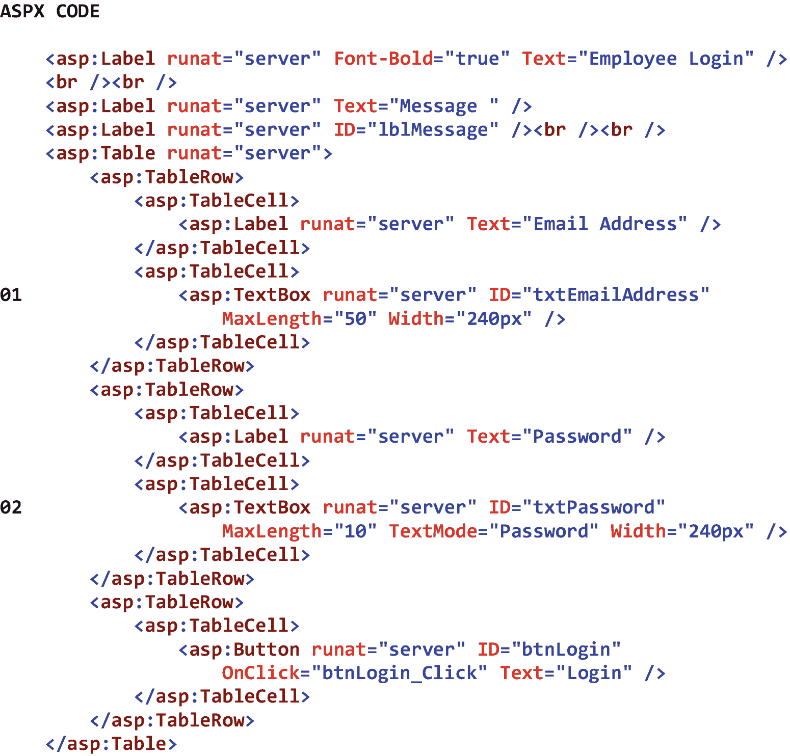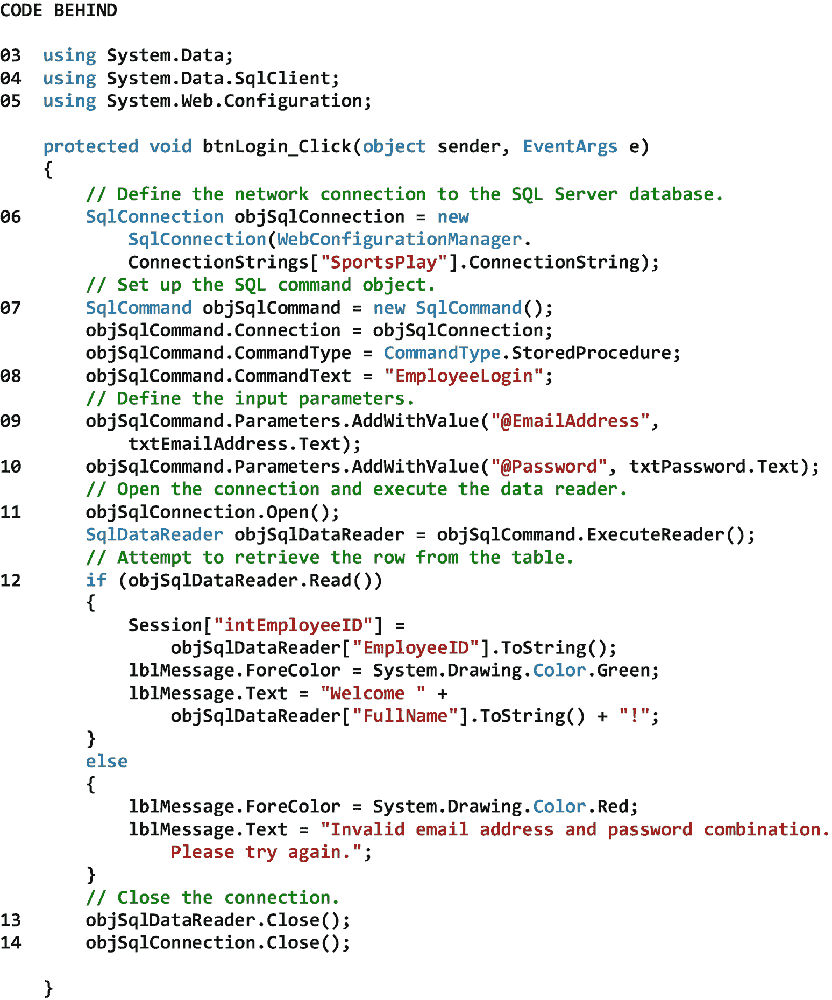T2】

图 23-5

调用执行查询的存储过程的示例

图 [23-6](#Fig6) 显示了一个执行非查询的 SQL Server 存储过程的例子。此查询用于更新产品表中的现有产品。虽然这个例子说明了一个更新过程，但是插入或删除过程的所有成分都存在。因此，从所示示例中创建它们应该相对简单。

请注意，在 01，这个存储过程由 SportsPlay 数据库使用。

请注意 02 处存储过程的注释部分。本节说明了过程的编写人、过程的创建时间以及过程的作用。如果要修改该程序，我们还将在本节中指出谁修改了该程序，何时修改了该程序，以及修改的性质是什么。

请注意 03 处存储过程的名称。顾名思义，此过程将用于修改 SportsPlay 数据库中的产品。

请注意，在 04–05，我们为存储过程定义了十个*输入*参数——通过 ReorderLevel 定义产品 ID。这些参数的参数将从调用该过程的页面的代码中接收。还要注意，我们为存储过程定义了一个*输出*参数——RowCount。此参数的参数(即受 SQL 调用影响的行数)将返回到调用该过程的页面的代码后面。可以看出，该过程的所有参数前面都有 at 符号(@)。

请注意 06 处的 SQL Update 语句，该语句将被执行以使用最终用户提供的输入参数来修改产品表中的现有产品。请注意，在语句的 Set 和 Where 子句中，前面有 at 符号(@)的十项。这些项目直接对应于先前定义的输入参数。

请注意 07，我们正在执行一种特殊的 Select 语句。该语句检索受上一个 SQL 调用影响的行数，并将该值放入 RowCount 输出参数中。该信息将在调用存储过程的页面的代码中使用，以确定更新是成功还是失败。

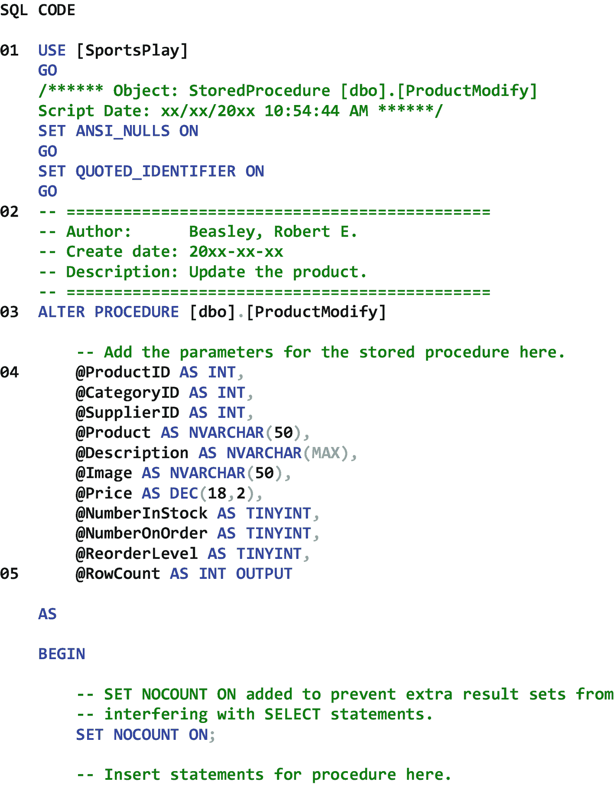 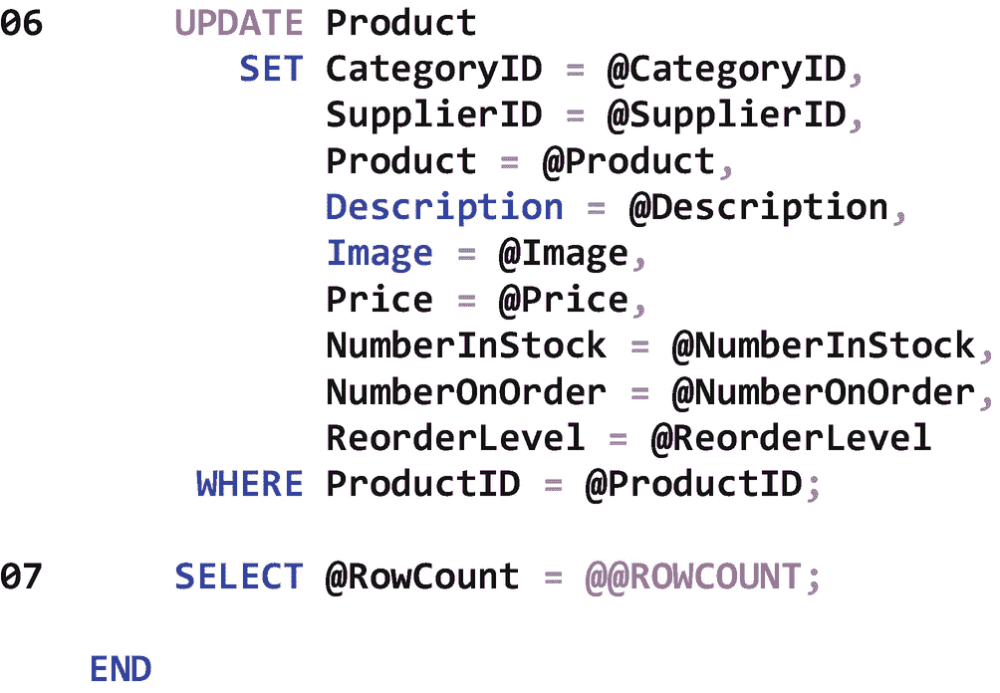

图 23-6

执行非查询的 SQL Server 存储过程示例

图 [23-7](#Fig7) 显示了一个调用执行非查询的存储过程的例子。注意，本例中调用的存储过程与刚刚描述的存储过程相同(参见图 [23-6](#Fig6) )。

请注意，在 01，最终用户将把 ProductID 输入到 TextBox 控件中。请记住，在现实世界的应用中，ProductID 不太可能被输入到文本框中，因为像这样的主键对最终用户毫无意义(例如，没有人知道 ProductID 3712 代表什么)。相反，当最终用户从其他控件(如 DropDownList 控件)中选择有意义的选项时，可能会设置 ProductID。

请注意 02 和 03，最终用户将选择一个类别并提供一个产品名称。可以看出，为了简洁起见，已经省略了来自最终用户的几个其他输入(即，供应商、描述、图像、价格、库存数量、订购数量和再订购水平)。

注意在 04 系统。数据命名空间已添加到 using 指令列表中(出现在文件后代码的顶部),以避免指定 CommandType 类的完全限定名(即 System。Data.CommandType)每次我们想使用它的一个枚举——*stored procedure*、 *TableDirect* 或者 *Text* 。

注意在 05 系统。Data.SqlClient 命名空间也被添加到 using 指令列表中。这样做是为了不要求我们指定 SqlConnection 类的完全限定名(即 System。Data.SqlClient.SqlConnection)、SqlCommand 类(即系统。Data.SqlClient.SqlCommand)和 SqlDataReader 类(即 System。Data.SqlClient.SqlDataReader)每次都要使用它们各自的属性或方法之一。

请注意 06 处的系统。Web.Configuration 命名空间已添加到 using 指令列表中，以避免需要指定 WebConfigurationManager 类的完全限定名(即 System。web . configuration . webconfigurationmanager)每次我们想要使用它的一个属性时。

请注意 07，我们正在定义到 SQL Server 数据库的网络连接。可以看到，这个连接是在 Web.config 文件的< connectionStrings >部分的 *SportsPlay* 连接字符串中定义的。

请注意，在 08–09，我们正在创建一个新的 SqlCommand 对象，并通过照常设置其 Connection 属性来准备执行它。然而，由于我们将调用一个存储过程来更新产品表中的产品，我们将 CommandType 属性设置为 *StoredProcedure* 并将 CommandText 属性设置为 *ProductModify* ，这是我们将要执行的存储过程的名称(见图 [23-6](#Fig6) )。

请注意，在 10–11 中，我们获取最终用户提供的 ProductID、CategoryID、SupplierID、Product、Description、Image、Price、NumberInStock、NumberOnOrder 和 ReorderLevel，并将它们作为*输入*参数添加到我们的 SqlCommand 对象中。

注意在 12 处，我们还向 SqlCommand 对象添加了一个*输出*参数。此参数将返回存储过程中受 SQL Update 命令影响的行数。

请注意，在 13–14 中，我们打开了与 SQL Server 数据库的连接，执行了存储过程中定义的非查询(即 Update 命令)，并检查了我们的 RowCount 输出参数，以确定 SQL 调用影响了多少行数据。如果单个数据行受到更新命令的影响，这表明更新*是*成功的，我们将显示一条成功消息。如果更新命令影响的不是一行数据，这表明更新*没有*成功，我们会显示一条错误消息。

请注意，在 15 处，我们正在关闭到数据库的连接，因为这不是自动完成的。

注意，在 16 处，我们在 Web.config 文件中添加了一个<connectionstrings>部分，以及一个名为 *SportsPlay* 的连接字符串。此连接字符串提供 SQL Server 数据库的详细信息，SqlConnection 对象将在 07 使用该数据库。请参见第 [20](20.html) 章，标题为“数据库设计、SQL 和数据绑定”，以获取此连接字符串的详细描述。</connectionstrings>

图中结果部分的屏幕截图显示了成功修改后的产品。

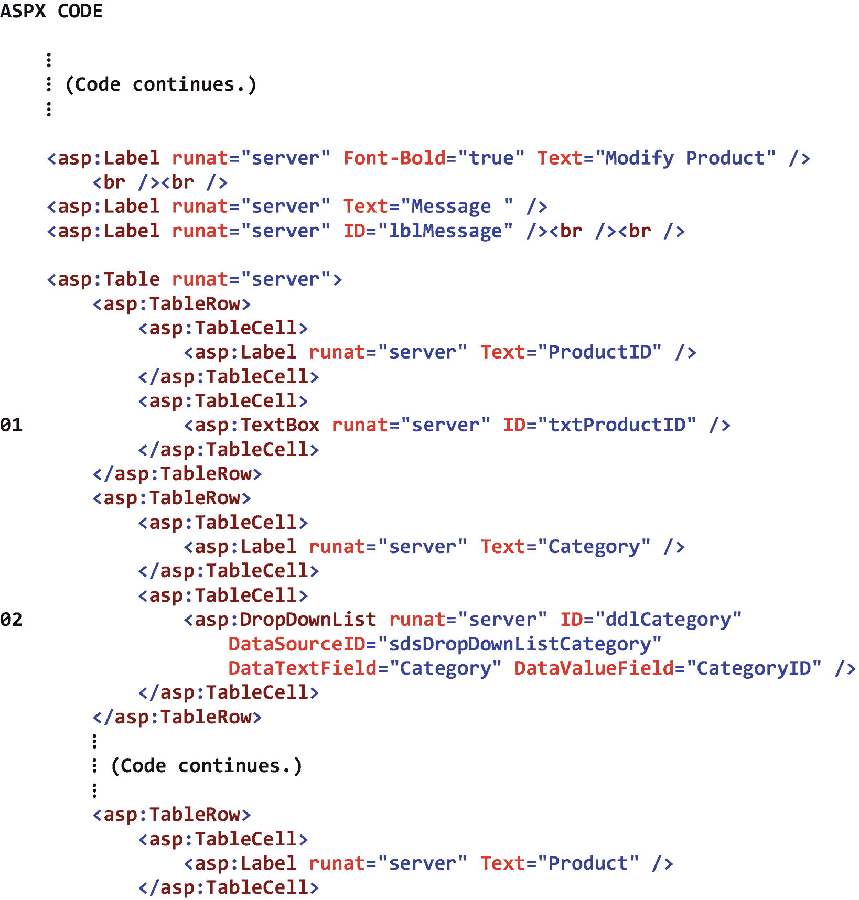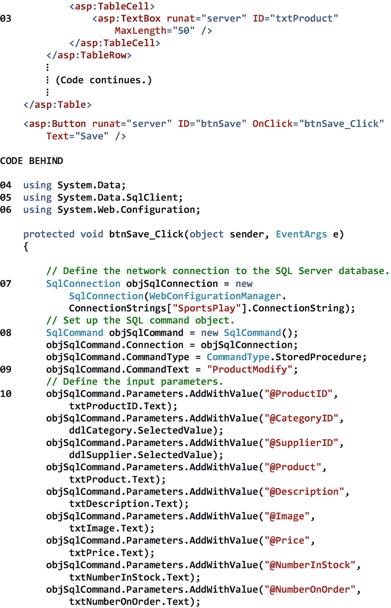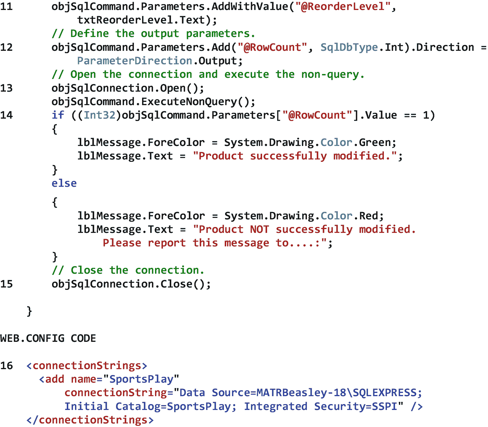T3】

图 23-7

调用执行非查询的存储过程的示例

<aside aria-label="Footnotes" class="FootnoteSection" epub:type="footnotes">Footnotes [1](#Fn1_source)

SQL Server 实例是一个完整的 SQL Server *服务*，它有自己的数据库、凭证等等。一台计算机可以同时安装并运行多个 SQL Server 实例。

  [2](#Fn2_source)

所有属性、方法和事件描述都直接取自微软的官方文档。为了节省空间，省略了用于处理该类事件的事件处理程序方法。有关该类的所有方法，请参见参考。

  [3](#Fn3_source)

所有属性、方法和事件描述都直接取自微软的官方文档。为了节省空间，省略了用于处理该类事件的事件处理程序方法。有关该类的所有方法，请参见参考。

  [4](#Fn4_source)

所有属性、方法和事件描述都直接取自微软的官方文档。为了节省空间，省略了用于处理该类事件的事件处理程序方法。有关该类的所有方法，请参见参考。

  [5](#Fn5_source)

所有属性、方法和事件描述都直接取自微软的官方文档。为了节省空间，省略了用于处理该类事件的事件处理程序方法。有关该类的所有方法，请参见参考。

  [6](#Fn6_source)

所有属性、方法和事件描述都直接取自微软的官方文档。为了节省空间，省略了用于处理该类事件的事件处理程序方法。有关该类的所有方法，请参见参考。

  [7](#Fn7_source)

所有属性、方法和事件描述都直接取自微软的官方文档。为了节省空间，省略了用于处理该类事件的事件处理程序方法。有关该类的所有方法，请参见参考。

 </aside>