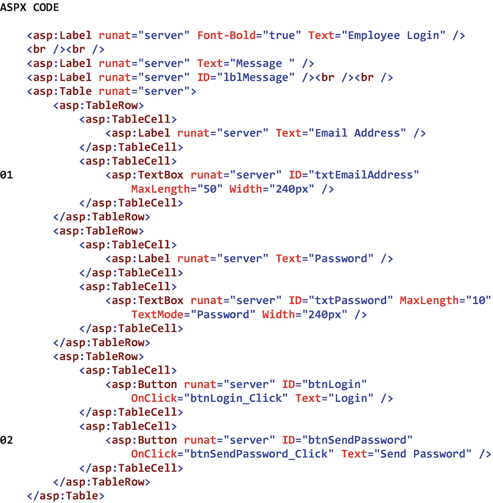
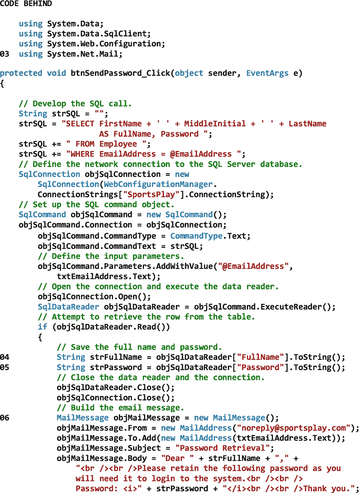
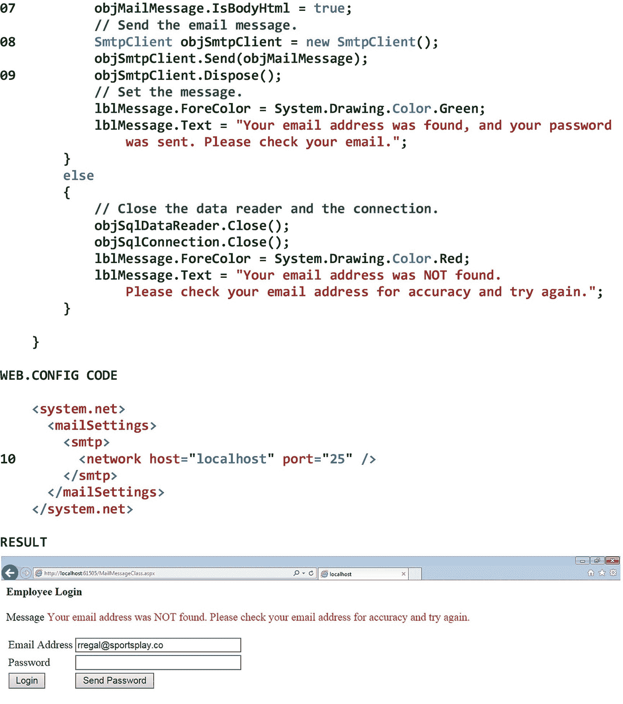

# 二十四、电子邮件信息

## 24.1 简介

电子邮件是通过网络向计算机用户分发书面信息的过程。虽然现在有几种电子邮件协议在使用，但是简单邮件传输协议是通过互联网发送电子邮件的标准协议。事实上，我们大多数人经常使用基于 SMTP 的客户机-服务器电子邮件系统，与他人进行延迟的、异步的双向通信。

简单邮件传输协议利用*存储转发模型*进行数据传输。在这个模型中，发送者的电子邮件客户端*向发送者的电子邮件服务器转发*一条消息。当发件人的电子邮件服务器收到消息时，它*存储*消息，直到它准备好传递消息。当发件人的电子邮件服务器准备好时，它会将消息转发给中间服务器。当中间服务器接收到消息时，它*存储*该消息，直到它准备好传递该消息。当中间服务器准备好时，它*将消息转发*到另一个中间服务器。这个过程一直持续到邮件到达收件人的电子邮件服务器。此时，收件人的电子邮件服务器*存储*该消息，直到收件人的电子邮件客户端请求发送该消息。当接收者的电子邮件客户端请求发送消息时，接收者的电子邮件服务器*将消息转发*到接收者的电子邮件客户端进行显示。

在这一章中，我们将首先在我们的开发机器上安装一个电子邮件服务器，这样我们就可以测试发送电子邮件的 Web 应用。这种服务器称为 Papercut，是一种简化的 SMTP 服务器，它接收和显示电子邮件，而不将它们转发给真正的收件人。接下来，我们将讨论 MailMessage 类，它构造了我们想要发送的电子邮件。最后，我们将研究 SmtpClient 类。这个类将我们构建的电子邮件发送到 SMTP 服务器，以便转发传递。

## 24.2 开发机器邮件服务器

在讨论实现电子邮件功能所需的类之前，我们需要在我们的开发机器上安装一个电子邮件服务器，以便我们可以测试发送电子邮件消息的 Web 应用。尽管有几个可用的 SMTP 服务器，我们将下载、安装和使用*剪纸*。Papercut 是一种简化的 SMTP 服务器，它接收和显示电子邮件，而不将它们转发给真正的收件人。由于剪纸服务器只*显示*它收到的电子邮件(即，它不*转发*它们)，我们可以安全地测试我们的电子邮件代码，而不会弄乱真实人的收件箱。剪纸服务器是免费的，Papercut.Setup.exe 文件可以从 GitHub 网站下载并运行:

[T2`https://github.com/ChangemakerStudios/Papercut/releases`](https://github.com/ChangemakerStudios/Papercut/releases)

使用 Papercut 服务器时，有三件事需要记住。首先，Papercut 服务器必须运行以接收和显示电子邮件。当 Papercut 服务器运行时，其图标将出现在系统托盘中。第二，当 Papercut 服务器收到电子邮件时，它会在系统托盘上方显示通知。要查看电子邮件，我们可以单击通知，也可以单击剪纸图标本身。第三，当我们准备好将我们的 Web 应用部署到一个真实的服务器时，我们只需要修改我们的 Web.config 文件以指向一个真实的 SMTP 服务器，这样我们的电子邮件就可以转发给真实的收件人。

## 24.3 邮件消息类

MailMessage 类构造我们希望发送的电子邮件。MailMessage 对象有许多属性，我们可以在构造电子邮件消息时设置这些属性。From 属性指定邮件发件人的电子邮件地址。如果收件人回复邮件，发件人将收到回复。ReplyToList 属性包含电子邮件地址的集合，如果收件人回复邮件，将向这些地址发送回复。To 属性包含将接收邮件的电子邮件地址的集合。CC 属性包含将接收消息的*副本*的电子邮件地址的集合。消息的副本的接收者*将被消息的其他接收者*看到。密件抄送属性包含将接收邮件的*密件副本*的电子邮件地址的集合。消息的密件副本的接收者*将不会被该消息的其他接收者*看到。Subject 属性指定邮件的主题行。Body 属性指定消息的内容。邮件正文可以包含文本、图像、超链接等等。IsBodyHtml 属性指定邮件正文是否为 Html 格式。如果 IsBodyHtml 属性设置为 *true* ，则任何 Html 标记(例如< br / >、< b >、< i >)都将被收件人的电子邮件客户端解释为 HTML 标记，从而用于格式化邮件。如果 IsBodyHtml 属性设置为 *false* ，任何 Html 标记都将被收件人的电子邮件客户端解释为常规文本，因此将按原样显示。Priority 属性指定消息的紧急程度(即低、中、高)。最后，Attachments 属性包含我们希望随邮件一起发送的附件集合。表 [24-1](#Tab1) 显示了 MailMessage 类的一些属性、方法和事件。

表 24-1

MailMessage 类的一些属性、方法和事件

<colgroup><col class="tcol1 align-left"> <col class="tcol2 align-left"></colgroup> 
| **类**邮件消息<sup>T3】1T5】</sup> |
| **命名空间**系统。网络邮件 |
| **属性** |
| 附件 | 获取用于存储附加到此电子邮件的数据的附件集合。 |
| 体形立方晶格 | 获取包含此电子邮件的密件抄送(BCC)收件人的地址集合。 |
| 身体 | 获取或设置消息正文。 |
| 抄送 | 获取包含此电子邮件的抄送收件人的地址集合。 |
| 从 | 获取或设置此电子邮件的发件人地址。 |
| IsBodyHtml | 获取或设置一个值，该值指示邮件正文是否采用 Html 格式。 |
| 优先 | 获取或设置此电子邮件的优先级。 |
| 回复列表 | 获取或设置邮件消息的回复地址列表。 |
| 科目 | 获取或设置此电子邮件的主题行。 |
| 到 | 获取包含此电子邮件收件人的地址集合。 |
| **方法** |
| (参见参考文献。) |   |
| **事件** |
| (参见参考文献。) |   |
| **参考** |
| [T2`https://msdn.microsoft.com/en-us/library/system.net.mail.mailmessage(v=vs.110).aspx`](https://msdn.microsoft.com/en-us/library/system.net.mail.mailmessage%2528v%253Dvs.110%2529.aspx) |

## 24.4 客户端类

SmtpClient 类将我们构建的电子邮件发送到 SMTP 服务器，以便转发传递。要使用 SmtpClient 类发送电子邮件，我们必须指定主机电子邮件服务器的名称和任何必需的服务器凭证(即用户名和密码)。作为一般规则，我们将在 Web.config 文件中指定这些内容，以便可以在一个地方对主机电子邮件服务器配置进行任何更改。当主机电子邮件服务器需要凭据时，Web.config 文件的 <system.net><mailsettings><smtp>部分中用于标识服务器及其关联凭据的语法是</smtp></mailsettings></system.net>

```cs
<network host="Host Email Server" userName="Username" password="Password"
    port="Port Number" />

```

其中斜体的项目分别是主机电子邮件服务器的名称(例如，mail.company.com、本地主机)、服务器上的电子邮件帐户的用户名、服务器上的电子邮件帐户的密码以及服务器上的端口号。端口号可能需要，也可能不需要。当主机电子邮件服务器不需要凭据时，我们不需要包含用户名和密码条目。

为了将电子邮件发送到主机电子邮件服务器，以便可以转发该邮件进行传递，我们使用了 SmtpClient 对象的 send 方法。发送电子邮件后，我们完成了 SmtpClient 对象，我们必须确保调用 SmtpClient 对象的 Dispose 方法。该方法向主机电子邮件服务器发送一条 *quit* 消息，结束与服务器的 TCP/IP 连接，并释放 SmtpClient 对象使用的内存资源。表 [24-2](#Tab2) 显示了 SmtpClient 类的一些属性、方法和事件。

表 24-2

SmtpClient 类的一些属性、方法和事件

<colgroup><col class="tcol1 align-left"> <col class="tcol2 align-left"></colgroup> 
| **类**SMTP client<sup>T3】2T5】</sup> |
| **命名空间**系统。网络邮件 |
| **属性** |
| 证书 | 获取或设置用于对发送方进行认证的凭据。 |
| 圣体 | 获取或设置用于 SMTP 事务的主机的名称或 IP 地址。 |
| 港口 | 获取或设置用于 SMTP 事务的端口。 |
| **方法** |
| 处置() | 向 SMTP 服务器发送退出消息，正常结束 TCP 连接，并释放 SmtpClient 类的当前实例使用的所有资源。 |
| Send(邮件消息) | 将指定的邮件发送到 SMTP 服务器进行传递。 |
| **事件** |
| (参见参考文献。) |   |
| **参考** |
| [T2`https://msdn.microsoft.com/en-us/library/system.net.mail.smtpclient(v=vs.110).aspx`](https://msdn.microsoft.com/en-us/library/system.net.mail.smtpclient%2528v%253Dvs.110%2529.aspx) |

图 [24-1](#Fig1) 显示了 MailMessage 和 SmtpClient 类的一个例子。这些类被用来向最终用户发送忘记的密码。

请注意 01 和 02，最终用户将在文本框中输入他或她的电子邮件地址，并单击*发送密码*按钮。

注意 03 时系统。Net.Mail 命名空间已被添加到 using 指令列表中(出现在文件后代码的顶部)。这样做是为了不要求我们指定 MailMessage 类的完全限定名(即 System。Net.Mail.MailMessage)、SmtpClient 类(即系统。Net.Mail.SmtpClient)和 MailAddress 类(即系统。Net.Mail.MailAddress)每次我们想使用它们各自的属性或方法时。

请注意 04–05，我们将终端用户的全名和密码保存到两个字符串变量中。正如我们稍后将看到的，这些变量的值将显示在电子邮件消息的正文中，以使其个性化，并使其看起来更专业。

请注意 06–07，我们正在使用 mail message 类构建电子邮件。首先，我们从 MailMessage 类创建一个新的 MailMessage 对象。接下来，我们使用 MailAddress 对象设置消息的 From 属性。在这种情况下，我们将属性设置为“noreply”电子邮件地址。当然，如果应用需要的话，我们可以将属性设置为一个活动的电子邮件地址。之后，我们使用 mail address 对象将收件人的电子邮件地址添加到消息的 to 属性中。请注意，此电子邮件地址来自页面上的电子邮件地址文本框。然后我们设置消息的 Subject 属性，这样收件人一看就知道消息的目的。接下来，我们设置消息的 Body 属性。请注意，终端用户的全名和密码(我们之前都保存了)被嵌入到消息中。还要注意，我们在消息中包含了一些 HTML 标记。然后，我们将消息的 IsBodyHtml 属性设置为 *true* ,以表明电子邮件消息的正文是 Html 格式的。因此，邮件中的 HTML 标记将被收件人的电子邮件客户端解释为 HTML 标记，这将导致邮件根据我们的意图被格式化。

请注意，在 08–09，我们正在从 SmtpClient 类创建一个新的 SmtpClient 对象，使用该对象将我们刚刚创建的 MailMessage 对象发送到 SMTP 服务器，并释放 SmtpClient 对象，该对象将向主机电子邮件服务器发送一条 *quit* 消息，结束与服务器的 TCP/IP 连接，并释放 SmtpClient 对象使用的内存资源。

请注意，在第 10 页，我们已经在 Web.config 文件的 <system.net><mailsettings><smtp>部分指定了主机电子邮件服务器的名称和端口号。这个特殊的配置允许我们向开发机器上的 Papercut 服务器发送消息。</smtp></mailsettings></system.net>

图中结果部分的第一个屏幕截图显示了在尝试检索和发送密码时，由于输入了无效的电子邮件地址而显示的错误消息。第二个屏幕截图显示了在尝试检索和发送密码时，由于输入有效的电子邮件地址而显示的消息。第三个屏幕截图显示了剪纸服务器显示的电子邮件。

T3】

图 24-1

MailMessage 和 SmtpClient 类的示例

<aside aria-label="Footnotes" class="FootnoteSection" epub:type="footnotes">Footnotes [1](#Fn1_source)

所有属性、方法和事件描述都直接取自微软的官方文档。为了节省空间，省略了用于处理该类事件的事件处理程序方法。有关该类的所有方法，请参见参考。

  [2](#Fn2_source)

所有属性、方法和事件描述都直接取自微软的官方文档。为了节省空间，省略了用于处理该类事件的事件处理程序方法。有关该类的所有方法，请参见参考。

 </aside>